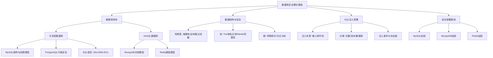

## 理论基础总结

本节从数据库体系、数据结构、注入原理、安全配置四个维度构建了完整的数据库安全理论框架。以下将各节核心内容串联成体系，帮助读者建立全局认知。

---

### 知识体系全景图



---

### 第一部分：数据库体系——攻击面在哪里

#### 关系型数据库的核心架构

关系型数据库的安全模型由四层防线构成：网络层、认证层、授权层、审计层。理解这四层是进行渗透测试的前提——你需要知道从哪一层突破，也需要知道防御者在哪一层设置了障碍。

**MySQL的权限层级**是典型的分层授权模型：

| 层级 | 作用域 | 典型权限 | 攻击意义 |
|------|--------|----------|----------|
| 全局权限 (`*.*`) | 整个服务器 | SUPER, FILE, PROCESS | 获取系统级能力 |
| 数据库权限 (`db.*`) | 单个数据库 | ALL PRIVILEGES | 控制整个业务库 |
| 表权限 (`db.table`) | 单张表 | SELECT, INSERT, UPDATE, DELETE | 操作特定数据 |
| 列权限 (`db.table.col`) | 单个字段 | SELECT(col1) | 精确数据访问 |

渗透测试中，获取一个拥有 `FILE` 权限的账户意味着可以读写服务器文件；拥有 `SUPER` 权限则可以执行系统命令。这些权限层级直接决定了攻击的影响范围。

**PostgreSQL** 在安全模型上更先进，提供了行级安全策略（Row Level Security, RLS）。RLS 允许在同一张表上对不同用户返回不同行，实现细粒度的数据隔离。攻击者面对启用了 RLS 的 PostgreSQL 数据库时，即使注入成功，也只能看到策略允许的数据行，这显著提高了攻击难度。

#### NoSQL数据库的特殊攻击面

NoSQL数据库的安全问题与关系型数据库有本质区别：

**MongoDB** 使用 BSON 文档模型，查询语言是 JSON 风格的 JavaScript 表达式。这导致了一个独特的攻击面：注入的不是 SQL 字符串，而是 JavaScript 对象。例如，一个认证绕过攻击可能将查询参数从 `{"username": "admin", "password": "xxx"}` 修改为 `{"username": "admin", "password": {"$ne": ""}}`，利用 `$ne`（不等于）操作符绕过密码验证。

**Redis** 的危险在于它的默认配置极其不安全：默认无密码、绑定所有网络接口、保留了 `FLUSHALL`、`CONFIG`、`DEBUG` 等高危命令。一个暴露在公网的无认证 Redis 实例，攻击者可以在几秒内写入 SSH 公钥或 WebShell，直接获取服务器控制权。

---

### 第二部分：数据结构——从底层理解安全机制

数据结构不是纯粹的计算机科学理论，它们直接决定了安全系统的设计和攻击方式。

#### 哈希表与安全

哈希表的 O(1) 查找特性使其成为密码存储、会话管理、速率限制等安全功能的底层实现。但哈希表有一个致命弱点：哈希碰撞。

**PHP HashDoS 攻击（CVE-2011-4885）** 是一个经典案例。攻击者构造大量具有相同哈希值的 POST 参数 key，使 PHP 的哈希表退化为链表，查询复杂度从 O(1) 变为 O(n)。发送数千个精心构造的参数，就能让服务器 CPU 耗尽，造成拒绝服务。这个漏洞影响了全球数百万台 PHP 服务器，最终促使 PHP 限制了 `max_input_vars` 参数。

防御这类攻击的方法包括：使用随机化的哈希种子（SipHash）、限制输入参数数量、使用平衡树替代哈希表。

#### 树结构与安全

**Trie（前缀树）** 在安全领域的典型应用是恶意域名过滤。DNS 过滤系统将恶意域名列表构建为 Trie 树，查询复杂度为 O(m)（m 为域名长度），无论列表中有多少条目都能快速匹配。这比逐条正则匹配快几个数量级。

**Merkle 树** 是数据完整性验证的核心结构。Git 的对象模型、区块链的区块验证、软件包签名验证都依赖 Merkle 树。每个叶子节点是数据块的哈希，父节点是子节点哈希的组合哈希。验证任意一个数据块的完整性只需要 O(log n) 个哈希值，而不是遍历整个数据集。

**B+ 树** 是数据库索引的默认结构。理解 B+ 树的工作原理对 SQL 注入优化至关重要——知道索引如何工作，才能理解为什么某些 WHERE 条件能快速执行（走索引），而另一些会导致全表扫描。

#### 图结构与安全

图在安全分析中的应用包括：

- **网络拓扑图**：建模主机之间的连接关系，识别关键节点和攻击路径
- **权限关系图**：将用户、角色、资源建模为有向图，分析权限提升路径
- **控制流图（CFG）**：逆向工程中分析程序执行路径，识别关键分支和漏洞点
- **调用图（Call Graph）**：污点分析的基础，追踪数据从输入点（source）到危险函数（sink）的传播路径

污点分析是静态代码审计的核心技术：将用户输入标记为"污点"，通过调用图追踪数据流向，如果污点数据未经净化就到达 SQL 查询、命令执行等危险函数，就标记为潜在漏洞。

---

### 第三部分：SQL注入——攻击的本质与分类

#### 注入的本质

SQL注入的根本原因只有一句话：**用户输入被当作代码执行**。

当应用程序将用户输入直接拼接到 SQL 语句中，而没有进行适当的参数化或转义时，攻击者可以通过构造特殊输入来改变 SQL 语句的语义。这不是某个特定数据库或编程语言的问题，而是所有将数据和指令混合处理的系统的根本缺陷。

一个典型的注入链：

```sql
-- 原始查询
SELECT * FROM users WHERE username = '{input}' AND password = '{pass}'

-- 正常输入
input = "admin", pass = "123456"
→ SELECT * FROM users WHERE username = 'admin' AND password = '123456'

-- 注入输入
input = "admin' -- ", pass = "anything"
→ SELECT * FROM users WHERE username = 'admin' -- ' AND password = 'anything'
-- 密码验证被注释掉，直接以admin身份登录
```

#### 注入的分类体系

按**注入位置**分类：

| 位置 | 说明 | 检测难度 |
|------|------|----------|
| GET 参数 | URL 查询字符串 | 最容易，直接可见 |
| POST 参数 | 请求体中的表单数据 | 容易，需要抓包 |
| Cookie | HTTP Cookie 头 | 中等，需要检查所有输入点 |
| HTTP Header | User-Agent、Referer、X-Forwarded-For 等 | 较难，容易被忽略 |
| 二次注入 | 数据存入数据库后在另一处被不安全读取 | 最难，需要代码审计 |

按**数据提取技术**分类：

| 技术 | 原理 | 适用场景 |
|------|------|----------|
| UNION 注入 | 合并查询结果 | 页面有回显，列数可确定 |
| 报错注入 | 利用数据库报错输出数据 | 页面显示错误信息 |
| 布尔盲注 | 通过页面状态差异逐位推断 | 无回显，有状态差异 |
| 时间盲注 | 通过响应延迟逐位推断 | 无回显，无状态差异 |
| 堆叠注入 | 执行多条 SQL 语句 | 允许执行多语句的环境 |

#### 注入的必要条件

不是所有输入点都能注入。注入需要满足三个条件：

1. **输入点可控**：攻击者能够影响 SQL 语句的构建
2. **语句可闭合**：攻击者能够闭合原有语句结构，插入新的 SQL 逻辑
3. **结果可获取**：攻击者能够通过某种方式（回显、报错、时间延迟）获取执行结果

---

### 第四部分：安全配置——防御的第一道墙

#### MySQL 加固要点

```sql
-- 1. 删除匿名用户
DELETE FROM mysql.user WHERE User='';
FLUSH PRIVILEGES;

-- 2. 禁止远程root登录
DELETE FROM mysql.user WHERE User='root' AND Host NOT IN ('localhost', '127.0.0.1', '::1');
FLUSH PRIVILEGES;

-- 3. 删除测试数据库
DROP DATABASE IF EXISTS test;
DELETE FROM mysql.db WHERE Db='test' OR Db='test\\_%';

-- 4. 设置密码策略
INSTALL COMPONENT 'file://component_validate_password';
SET GLOBAL validate_password.length = 12;
SET GLOBAL validate_password.mixed_case_count = 1;
SET GLOBAL validate_password.number_count = 1;
SET GLOBAL validate_password.special_char_count = 1;

-- 5. 限制文件操作
-- my.cnf 中设置
-- [mysqld]
-- secure_file_priv = /var/lib/mysql-files/
-- local_infile = 0

-- 6. 启用审计日志
INSTALL PLUGIN audit_log SONAME 'audit_log.so';
SET GLOBAL audit_log_policy = 'ALL';
```

#### MongoDB 加固要点

```javascript
// 1. 启用认证
// mongod.conf:
// security:
//   authorization: enabled

// 2. 创建专用账户（最小权限原则）
use myapp
db.createUser({
  user: "appuser",
  pwd: "StrongPassword123!",
  roles: [{ role: "readWrite", db: "myapp" }]
})

// 3. 绑定本地IP
// mongod.conf:
// net:
//   bindIp: 127.0.0.1

// 4. 启用TLS
// mongod.conf:
// net:
//   tls:
//     mode: requireTLS
//     certificateKeyFile: /path/to/server.pem

// 5. 启用审计日志
// mongod.conf:
// auditLog:
//   destination: file
//   format: JSON
//   path: /var/log/mongodb/audit.json
```

#### Redis 加固要点

```bash
# redis.conf 关键配置

# 1. 设置密码
requirepass YourStrongPassword123!

# 2. 绑定本地IP
bind 127.0.0.1 ::1

# 3. 禁用高危命令
rename-command FLUSHALL ""
rename-command FLUSHDB ""
rename-command CONFIG ""
rename-command DEBUG ""
rename-command SHUTDOWN ""

# 4. 禁用危险Lua脚本
# 不需要Lua脚本时，在启动参数中禁用
# --enable-module-command no

# 5. 限制内存使用
maxmemory 256mb
maxmemory-policy allkeys-lru

# 6. 启用TLS（Redis 6.0+）
tls-port 6379
port 0
tls-cert-file /path/to/redis.crt
tls-key-file /path/to/redis.key
```

---

### 各节核心要点回顾

**关系型数据库基础**（01节）：SQL语言分为DDL（定义结构）、DML（操作数据）、DCL（控制权限）三大类。MySQL的安全模型是四层架构（网络→认证→授权→审计），权限从全局到列逐级细化。PostgreSQL通过行级安全策略（RLS）实现了更细粒度的数据隔离。

**NoSQL数据库基础**（02节）：MongoDB的JSON风格查询语言引入了新的注入向量（操作符注入）。Redis默认无密码且绑定所有接口，暴露即等于沦陷。这两类数据库的安全加固重点与关系型数据库有显著差异。

**数据结构基础**（03节）：哈希碰撞可以导致拒绝服务（PHP HashDoS），Trie树支撑恶意域名过滤，Merkle树保障数据完整性，图结构是污点分析和权限提升路径分析的基础。数据结构不是纯理论，它们直接决定安全系统的能力边界。

**SQL注入原理**（04节）：注入的本质是"数据变代码"。按位置分为GET/POST/Cookie/Header/二次注入五类，按技术分为UNION/报错/布尔盲注/时间盲注/堆叠五种。注入需要三个条件：输入可控、语句可闭合、结果可获取。

**安全配置基线**（05节）：MySQL加固的核心是删除匿名用户、禁用远程root、限制文件操作、启用审计。MongoDB必须开启认证和网络绑定限制。Redis必须设置密码、绑定本地IP、禁用高危命令。

---

### 从理论到实战的桥梁

理论基础为后续学习提供了必要的知识储备。以下是各理论模块与后续实战的对应关系：

| 理论模块 | 对应实战技能 | 后续章节 |
|----------|-------------|----------|
| MySQL权限模型 | 利用FILE权限读写文件 | 核心技巧/SQL注入基础 |
| MongoDB文档模型 | JSON操作符注入绕过认证 | 核心技巧/NoSQL注入 |
| Redis默认配置 | 未授权访问利用链 | 实战案例/Redis案例 |
| 哈希碰撞原理 | HashDoS攻击构造 | 深度拓展 |
| 图结构/污点分析 | 代码审计中的数据流追踪 | 核心技巧/深度技术 |
| UNION注入原理 | 联合查询获取数据 | 核心技巧/SQL注入基础 |
| 盲注原理 | 布尔/时间盲注自动化 | 核心技巧/盲注技术 |
| 安全配置基线 | 加固验证与绕过 | 核心技巧/SQL注入防御 |

---

### 常见认知误区

**误区一：NoSQL数据库不会被注入**

事实：NoSQL注入不同于SQL注入，但同样存在。MongoDB的注入形式是JSON操作符注入，攻击者通过修改请求参数中的查询操作符（如 `$ne`、`$gt`、`$regex`）来改变查询语义。Redis虽然不使用SQL，但通过未授权访问可以直接执行任意命令，危害更大。

**误区二：参数化查询能防住所有注入**

事实：参数化查询能有效防止SQL注入，但不能防止所有类型的注入。当表名、列名、ORDER BY子句等需要动态构造时，参数化查询无法使用，需要通过白名单验证。二次注入更特殊——数据在存储时经过了安全处理，但在取出使用时未经过参数化，攻击在两个不同的操作之间完成。

**误区三：禁用错误信息就安全了**

事实：隐藏错误信息确实能阻止报错注入和UNION注入（因为需要页面回显），但布尔盲注和时间盲注不依赖错误信息。它们通过页面状态差异（内容长度、响应时间）来推断数据，即使完全没有错误信息也能工作。

**误区四：WAF能替代代码层面的防护**

事实：WAF（Web Application Firewall）是有效的辅助防御层，但不能替代代码层面的安全措施。WAF可以通过关键词匹配、正则表达式、机器学习等方式检测和拦截攻击，但攻击者可以通过编码变换、大小写混合、注释插入、内联注释、分块传输等方式绕过WAF。纵深防御要求在代码层（参数化查询）、WAF层、数据库层（最小权限）同时设置防线。

**误区五：数据结构知识对安全不重要**

事实：数据结构直接决定了安全系统的设计和攻击方式。不理解哈希表就无法理解哈希碰撞DoS；不理解B+树索引就无法优化注入查询；不理解Trie树就无法理解域名过滤系统的性能瓶颈；不理解图结构就无法进行有效的权限提升路径分析。安全研究的深度，很大程度上取决于对底层数据结构的理解深度。

---

### 自检清单

完成理论基础学习后，用以下问题检验自己的掌握程度：

**数据库体系**
- [ ] 能否画出MySQL四层安全架构图并解释每层的作用？
- [ ] 能否说明PostgreSQL行级安全策略的工作原理和配置方法？
- [ ] 能否解释MongoDB文档模型与SQL关系模型在注入方式上的差异？
- [ ] 能否列出Redis默认配置中的三个主要安全隐患及其利用方式？

**数据结构**
- [ ] 能否解释PHP HashDoS攻击的原理和防御方法？
- [ ] 能否说明Trie树在恶意域名过滤中的优势？
- [ ] 能否描述Merkle树如何保障数据完整性？
- [ ] 能否解释控制流图（CFG）在逆向工程中的作用？

**SQL注入**
- [ ] 能否用一句话解释SQL注入的本质？
- [ ] 能否按位置和技术两个维度对注入进行分类？
- [ ] 能否说明注入成功的三个必要条件？
- [ ] 能否区分UNION注入、报错注入、布尔盲注、时间盲注的适用场景？

**安全配置**
- [ ] 能否给出MySQL加固的五个关键步骤？
- [ ] 能否说明MongoDB启用认证的配置方法？
- [ ] 能否列出Redis必须禁用的四个高危命令？

如果以上问题中有超过三个无法回答，建议回到对应小节重新学习。
