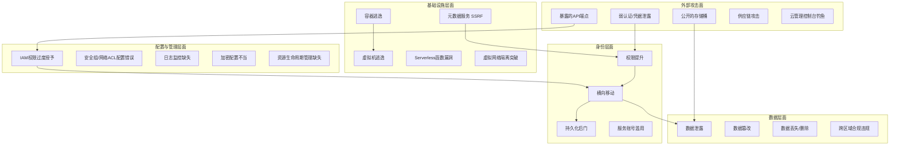
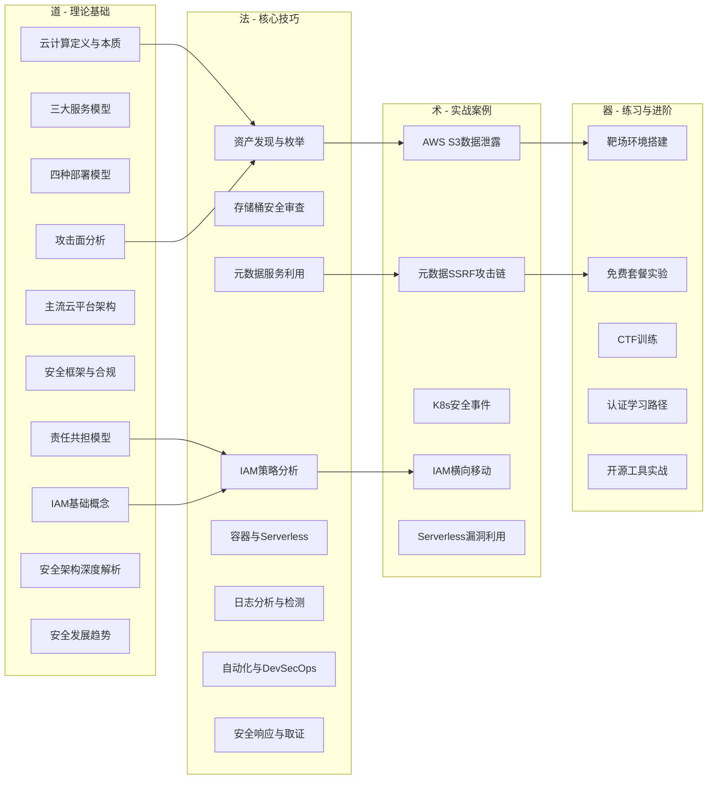
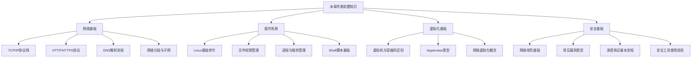

# 第12章 云计算基础 - 章节概览

## 为什么每个安全从业者都必须懂云计算

### 从"上不上云"到"怎么上云"的范式转移

2006年，AWS推出S3和EC2，云计算从概念走向商用。彼时业界的争论焦点是"该不该把业务迁上云"。二十年后的今天，这个问题早已不复存在——据Gartner 2025年数据，全球公有云市场规模突破7200亿美元，年增长率保持在20%以上。IDC报告显示，中国企业上云率已超过60%，金融、政务、医疗等关键行业的云化率更是逐年攀升。

对于安全从业者而言，云计算不是"可选知识"，而是"生存技能"。原因很简单：**你的攻击面已经搬家了**。攻击者不需要再费力突破你的物理防火墙——他们只需找到一个配置错误的S3存储桶、一个暴露的云元数据端点、或者一个权限过大的IAM角色，就能获得比传统渗透更大的战果。

### 云计算改变了安全的根本逻辑

传统网络安全建立在一个核心假设之上：**存在一个清晰的网络边界**。防火墙、IDS/IPS、DMZ——所有经典防御体系都围绕"内网可信、外网不可信"这一前提构建。

云计算彻底打破了这个假设：

| 维度 | 传统数据中心 | 云计算环境 |
|------|-------------|-----------|
| **网络边界** | 清晰的物理边界，防火墙明确划分内外 | 虚拟网络叠加，边界模糊，东西向流量为主 |
| **资产形态** | 物理服务器、固定IP、已知拓扑 | 动态实例、弹性伸缩、自动扩缩容 |
| **管理方式** | 运维团队完全控制基础设施 | 控制权在云商和租户之间分配 |
| **数据位置** | 数据在本地，物理可控 | 数据跨地域、跨可用区分布 |
| **攻击面** | 主要集中在网络层和应用层 | 扩展到API、元数据服务、IAM、容器编排层 |
| **日志审计** | 自建SIEM，日志格式可控 | 依赖云商日志服务，格式和保留策略受限 |
| **合规要求** | 按行业和地区执行 | 叠加云商合规认证和数据主权要求 |

这种根本性的变化意味着：**你在传统安全领域积累的经验，在云环境中可能不仅无用，甚至有害**。例如，在传统网络中，你可以通过网络分段来隔离敏感系统；在云环境中，如果IAM策略配置不当，攻击者可以跨越所有网络分段，直接通过API访问任何资源。

### 云安全事故的真实代价

以下数据来自公开报告，揭示云安全事件的严重性：

- **IBM《2024年数据泄露成本报告》**：涉及云环境的数据泄露平均成本为481万美元，比整体平均高出约12%。云配置错误导致的泄露从发现到遏制平均需要277天。
- **Verizon《2024 DBIR》**：Web应用攻击中超过80%涉及云资产，其中凭据泄露是最主要的初始访问向量。
- **CSA《2024年云安全威胁报告》**：配置错误和IAM管理不当连续五年位居云安全威胁榜首。
- **Mandiant《2024 M-Trends》**：针对云环境的攻击同比增长超过200%，攻击者越来越多地利用云原生工具进行横向移动。

这些数字背后的含义很清楚：**云安全事故不是"可能发生"，而是"正在发生"，而且频率和影响都在加速扩大**。

### 云安全人才的供需失衡

从职业发展角度看，云安全是当前网络安全领域增长最快的方向之一：

- **岗位需求**：LinkedIn数据显示，2024年"云安全工程师"相关职位同比增长45%，远超安全行业整体增速。
- **薪资溢价**：具备云安全技能的安全工程师，薪资普遍比传统安全岗位高20%-40%。
- **认证价值**：AWS Security Specialty、CCSP等云安全认证持有者的简历通过率比无认证者高出约3倍。
- **技能缺口**：ISC²报告显示，全球云安全人才缺口超过340万，且仍在扩大。

**无论你是刚入行的安全新人，还是经验丰富的老手，掌握云计算安全知识都是当下最具投资回报率的学习方向。**

## 云安全威胁全景：你在保护什么

在深入学习具体技术之前，有必要建立对云安全威胁全景的宏观认知。以下图表展示了云环境中主要的攻击面和威胁类别：

### 云安全的五大威胁类别

**第一类：配置错误（占比最高）**

配置错误是云安全事故的头号原因，占比超过65%。典型场景包括：

- S3/OSS存储桶设为公开可读，导致敏感数据泄露
- 安全组规则过于宽松（如0.0.0.0/0开放所有端口）
- 数据库实例暴露在公网且使用弱密码
- 云日志服务未启用或日志保留期过短
- 加密密钥管理不当（硬编码在代码中、明文存储等）

**第二类：身份与访问管理（IAM）问题**

IAM是云安全的核心，也是最复杂的领域。常见问题包括：

- 遵循"最小权限原则"形同虚设——管理员权限被随意授予
- 服务账号拥有过多权限，成为攻击者的跳板
- 多因素认证（MFA）未强制启用
- IAM策略中的通配符（*）滥用
- 跨账号信任关系配置不当

**第三类：API安全风险**

云平台的一切操作都通过API完成，这使得API成为新的核心攻击面：

- 未经认证的API端点暴露
- API密钥泄露（GitHub上搜索`aws_secret_access_key`能找到大量泄露的密钥）
- 速率限制和输入验证缺失
- API版本管理混乱，旧版本存在已知漏洞

**第四类：供应链与第三方风险**

现代云应用严重依赖第三方组件和服务：

- 容器镜像中包含已知漏洞的依赖
- 第三方SaaS应用权限过大
- CI/CD管道中的密钥管理不当
- 开源库中的恶意代码注入

**第五类：高级持续性威胁（APT）**

国家级和有组织的攻击者正在系统性地攻击云环境：

- 利用零日漏洞突破云基础设施
- 通过云原生工具（如AWS Systems Manager）进行横向移动
- 在被攻陷的云账户中建立持久化访问
- 利用云资源进行加密货币挖矿或发起DDoS攻击

## 本章知识体系与学习路线

本章按照"道法术器"的认知层次组织内容，确保读者从理论到实践形成完整的能力闭环：

### 第一节：理论基础——建立云安全的完整认知框架

**目标**：理解云计算的核心概念、安全模型和威胁全景，为后续的技巧和实战打下坚实基础。

本节将深入探讨以下主题：

**1.1 云计算的定义与本质**

不是简单地背诵NIST定义，而是理解云计算背后的商业逻辑和技术原理。为什么"按需自助服务"、"广泛的网络访问"、"资源池化"、"快速弹性"和"可计量服务"这五个特征如此重要？它们如何从根本上改变了IT的交付模式，同时创造了新的安全挑战？

**1.2 三大服务模型：IaaS、PaaS、SaaS**

每种服务模型意味着不同的控制权分配和安全责任边界。理解这三种模型不仅是技术知识，更是理解"责任共担模型"的前提。我们还将探讨FaaS（Functions as a Service）和CaaS（Containers as a Service）等新兴模型。

**1.3 四种部署模型**

公有云、私有云、混合云、社区云——每种模型的安全特性和适用场景截然不同。在实际企业环境中，混合云和多云架构是主流，这也带来了额外的安全复杂性。

**1.4 责任共担模型（Shared Responsibility Model）**

这是云安全中最核心的概念之一，也是最容易被误解的概念。我们将详细分析AWS、Azure、GCP三大云商的责任划分，以及在IaaS、PaaS、SaaS不同模型下责任边界如何移动。理解责任共担模型是避免"云商负责所有安全"这一致命误区的关键。

**1.5 主流云平台架构对比**

深入对比AWS、Azure、GCP和阿里云的核心服务组件、网络架构、身份模型和安全特性。不是简单的功能列表，而是从安全视角理解每个平台的设计哲学和差异点。

**1.6 云安全框架与合规标准**

CSA CCM、NIST SP 800-144/800-210、ISO 27017/27018、SOC 2——这些框架和标准不是"读一遍就好"的文档，而是指导安全实践的路线图。我们将讲解每个框架的核心要求和实际应用方法。

**1.7 身份与访问管理（IAM）基础**

IAM是云安全的基石。本节将建立IAM的核心概念体系：用户、组、角色、策略、权限、条件键、服务控制策略（SCP）等。这些概念将贯穿整个章节。

**1.8 云安全的攻击面分析**

从攻击者的视角系统性地梳理云环境中的攻击面：计算层、存储层、网络层、身份层、管理层、供应链层。每个攻击面都有哪些具体的技术手段？防护的优先级如何排序？

**1.9 云安全架构深度解析**

深入分析零信任架构在云环境中的落地、云原生安全架构设计、多云/混合云安全架构等高级主题。

**1.10 云安全发展趋势**

AI驱动的云安全、云原生安全、无服务器安全、机密计算——了解云安全领域的最新趋势，帮助读者提前布局未来技能。

### 第二节：核心技巧——掌握云安全实战技能

**目标**：获得可直接应用于工作中的云安全评估、渗透和防御技能。

本节聚焦可操作的技术能力：

**2.1 云环境资产发现与枚举**

在云环境中，资产发现是安全评估的第一步。你无法保护你看不到的东西。本节将讲解如何使用CloudMapper、ScoutSuite、Prowler等工具发现云环境中的所有资产，包括计算实例、存储桶、数据库、Lambda函数、API网关等。

**2.2 存储桶安全配置审查**

S3/OSS/Blob存储桶是云环境中最常见的数据泄露源头。我们将深入讲解存储桶的权限模型、ACL策略分析、公开访问检测、加密配置审查等技术。

**2.3 IAM策略分析与权限提升路径识别**

IAM策略是云安全中最复杂的领域。本节将讲解如何分析IAM策略、识别权限提升路径、发现过度授权和策略绕过漏洞。

**2.4 云元数据服务利用与防护**

云元数据服务（如AWS IMDSv1/v2、GCP metadata、Azure IMDS）是云渗透中的关键技术。通过SSRF漏洞访问元数据服务，攻击者可以获取临时凭证、实例角色权限，进而横向移动。

**2.5 容器与Serverless安全**

容器逃逸、镜像漏洞、Kubernetes RBAC配置不当、Serverless函数注入——容器和Serverless环境有其独特的安全挑战和攻击手段。

**2.6 日志分析与云环境威胁检测**

云安全日志（CloudTrail、Azure Activity Log、GCP Audit Log）是威胁检测的核心数据源。本节将讲解如何配置、收集和分析云日志，识别异常行为和攻击迹象。

**2.7 云安全自动化与DevSecOps**

将安全集成到CI/CD管道中：基础设施即代码（IaC）的安全扫描、容器镜像安全检查、策略即代码（Policy as Code）等自动化安全实践。

**2.8 云安全响应与取证**

当云安全事件发生时，如何快速响应、取证和恢复？本节将讲解云环境下的事件响应流程、取证方法和工具。

### 第三节：实战案例——从真实事件中学习

**目标**：通过分析真实云安全事件，理解攻击思路、影响范围和防御策略。

本节提供五个深度案例分析，每个案例都包含完整的攻击链重建：

**案例一：AWS S3存储桶数据泄露事件全流程分析**

从攻击者发现公开存储桶开始，到数据提取、影响评估、应急响应的完整流程。涉及AWS S3的权限模型、ACL策略、服务访问策略等多个知识点。

**案例二：利用云元数据服务获取实例凭证的攻击链**

以Capital One数据泄露事件为蓝本，深入分析SSRF漏洞如何与云元数据服务结合，导致大规模数据泄露。

**案例三：Kubernetes集群安全事件响应**

从集群被入侵到事件响应的完整过程，涉及容器逃逸、RBAC绕过、持久化后门等技术。

**案例四：IAM权限配置不当导致的横向移动**

展示如何通过一个低权限的IAM角色，逐步提升权限并横向移动到高价值目标。

**案例五：Serverless函数漏洞利用实战**

Serverless环境中的注入攻击、事件数据篡改、函数间调用链利用等技术。

### 第四节：常见误区——纠正云安全认知偏差

**目标**：识别并纠正常见的云安全认知误区，建立正确的安全思维。

本节将深入分析以下误区：

- **"云服务商负责所有安全"**：责任共担模型的核心误解，以及它如何导致严重的安全盲区
- **"云环境默认安全"**：默认配置的安全陷阱，以及"安全组默认拒绝"不等于"整体默认安全"
- **"IAM权限管理可以后期再做"**：IAM债务的累积效应，以及权限治理的紧迫性
- **"容器安全等于主机安全"**：容器隔离模型与传统主机安全的根本差异
- **"加密了就安全了"**：加密密钥管理、加密范围、端到端加密的认知误区
- **"多云可以分散风险"**：多云架构带来的复杂性如何反而增加攻击面

### 第五节：练习方法——构建你的云安全实验室

**目标**：提供可操作的实践路径，帮助读者将理论知识转化为实战能力。

本节将提供：

- **云安全靶场环境搭建指南**：包括AWSGoat、GCPGoat、AzureGoat等开源靶场
- **主流云平台免费套餐的安全实验**：利用AWS Free Tier、Azure Free Account等进行合法安全测试
- **CTF云安全题目训练建议**：FlAWS、CloudFoxable等专项CTF平台
- **认证学习路径**：AWS Security Specialty → CCSK → CCSP的进阶路线
- **开源云安全工具实战**：Prowler、ScoutSuite、CloudMapper、Pacu等工具的使用

### 第六节：本章小结与深度拓展

回顾核心知识点，梳理学习要点，并为希望进一步深入的读者提供方向指引。

## 前置知识要求

学习本章前，请确认你已具备以下基础知识。如果某些领域还有欠缺，建议先补充相关内容：

| 前置知识领域 | 最低要求 | 建议水平 | 推荐补充资源 |
|-------------|---------|---------|-------------|
| 网络协议 | 理解TCP/IP、HTTP基本概念 | 能抓包分析HTTP请求、理解TLS握手 | 《计算机网络：自顶向下方法》 |
| 操作系统 | 能使用Linux基本命令 | 熟练使用Shell、理解文件权限和进程管理 | OverTheWire Bandit |
| 虚拟化 | 知道虚拟机和容器的区别 | 理解Hypervisor、网络虚拟化概念 | 本章理论基础部分会补充讲解 |
| 安全基础 | 了解常见漏洞类型 | 有渗透测试或CTF经验 | 前几章内容 |

## 学习路线建议

### 推荐学习顺序

### 不同基础读者的学习策略

**零云经验的安全从业者**（建议总时长：25-30小时）

1. 先花8-10小时精读理论基础，确保理解每个核心概念
2. 在AWS Free Tier上花3-5小时完成基础实验（创建实例、配置安全组、使用S3）
3. 再花8-10小时学习核心技巧，边学边在实验环境中练习
4. 用4-5小时研读实战案例，对照案例在靶场中复现
5. 最后2小时检查常见误区，巩固认知

**有云使用经验但缺乏安全视角**（建议总时长：15-20小时）

1. 快速浏览理论基础（3-4小时），重点关注责任共担模型和攻击面分析
2. 重点投入核心技巧（6-8小时），特别是IAM策略分析和元数据服务利用
3. 深入研读实战案例（4-5小时），从攻击者视角重新审视你熟悉的云环境
4. 用2-3小时检查常见误区，纠正经验主义带来的认知偏差

**资深安全工程师扩展云安全方向**（建议总时长：10-15小时）

1. 快速过一遍理论基础（2小时），重点关注与传统安全的差异点
2. 聚焦核心技巧中的高级主题（4-5小时）：IAM权限提升、容器逃逸、Serverless安全
3. 深入分析实战案例（3-4小时），提取攻击方法论
4. 直接进入练习方法和深度拓展（2-3小时），开始构建自己的云安全工具链

### 学习效率提升建议

1. **动手优先**：云安全是实践性极强的领域，每个知识点都应配合实操。阅读一个概念后，立即在云平台上验证。
2. **建立自己的笔记体系**：为每个云平台维护一份安全检查清单，记录你发现的配置要点和易错点。
3. **关注真实事件**：订阅AWS Security Blog、Azure Security Blog、GCP Security Blog，关注CSA的威胁报告。
4. **参与社区**：加入Cloud Security Alliance、OWASP Cloud-Native Security项目，与同行交流。
5. **定期复盘**：每月回顾一次自己的学习进度，更新知识体系。

## 章节结构总览

| 章节编号 | 标题 | 核心内容 | 预计学习时长 | 难度等级 |
|---------|------|---------|-------------|---------|
| 12.1 | 理论基础 | 云计算概念、安全模型、威胁全景 | 8-10小时 | ⭐⭐ |
| 12.2 | 核心技巧 | 资产枚举、IAM分析、元数据利用、容器安全 | 8-10小时 | ⭐⭐⭐ |
| 12.3 | 实战案例 | 5个真实云安全事件的深度分析 | 4-5小时 | ⭐⭐⭐⭐ |
| 12.4 | 常见误区 | 6大云安全认知偏差的纠正 | 1-2小时 | ⭐⭐ |
| 12.5 | 练习方法 | 靶场、CTF、认证、工具 | 2-3小时 | ⭐⭐⭐ |
| 12.6 | 本章小结 | 知识回顾与进阶方向 | 0.5小时 | ⭐ |
| 12.7 | 深度拓展 | 高级主题与前沿研究 | 3-5小时 | ⭐⭐⭐⭐⭐ |

**总计建议学习时间：25-35小时（其中实践环节不低于50%）**

---

> ⚠️ **安全警告与免责声明**
>
> 本章内容仅供**合法的安全测试与教育目的**使用。所有技术、工具和方法的讨论均旨在帮助安全从业者在**获得明确授权**的前提下进行防御性安全研究。
>
> - 🚫 **未经授权**对任何系统、网络或应用进行安全测试是**违法行为**
> - ✅ 所有实践活动应在**隔离的实验环境**中进行（如虚拟机、CTF平台、云平台免费套餐）
> - ✅ 遵守所在国家和地区的**网络安全法律法规**（《网络安全法》《数据安全法》《个人信息保护法》等）
> - ✅ 遵循**负责任的漏洞披露**原则
> - ✅ 在云平台上进行安全测试时，**务必确认测试范围在云商允许的范围内**
>
> 作者不对因滥用本章内容造成的任何后果承担责任。

---

*本章内容将定期更新以反映云安全领域的最新发展。如发现内容错误或有改进建议，欢迎反馈。*
