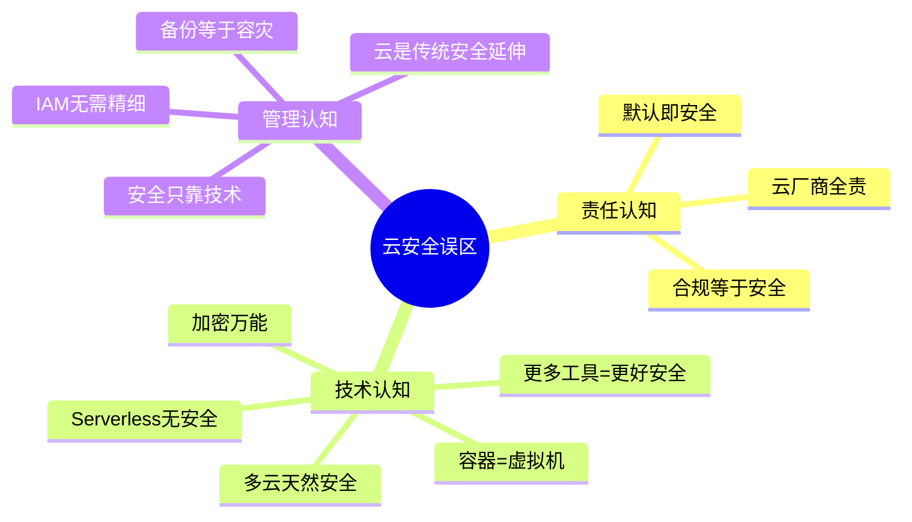
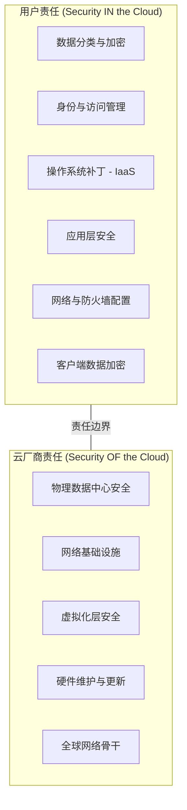
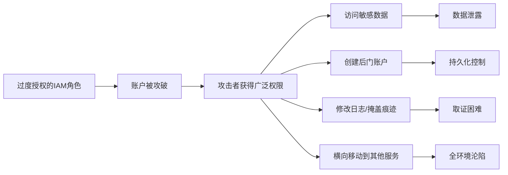
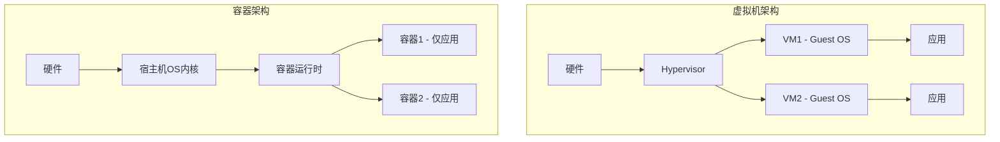
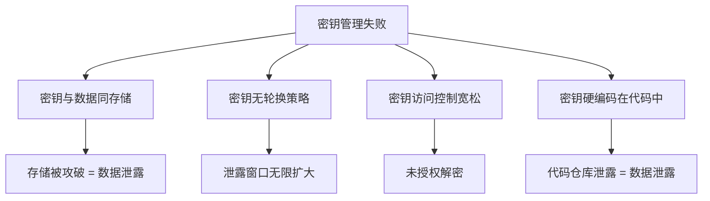
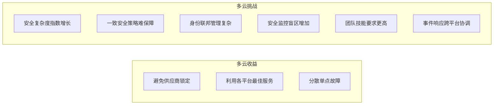
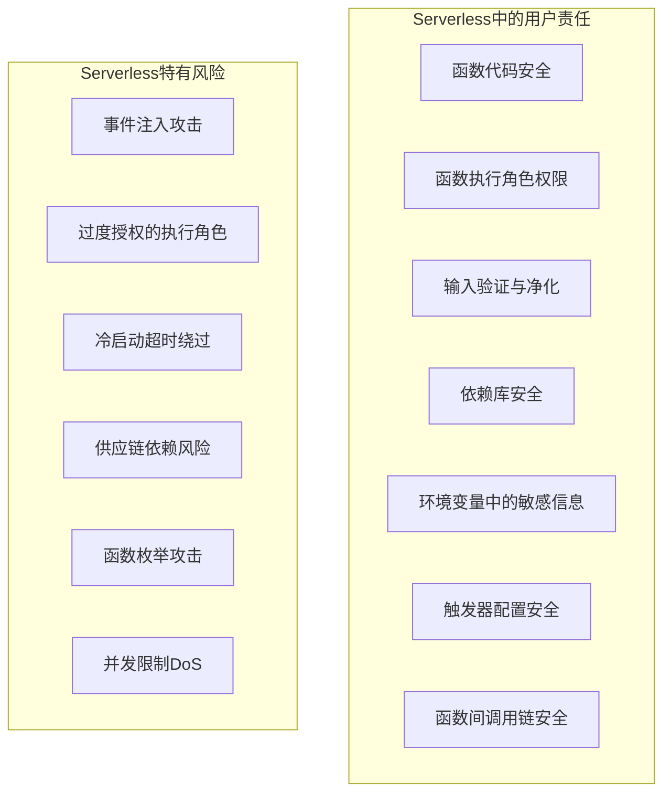
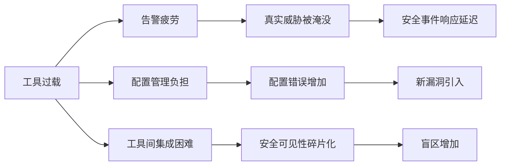
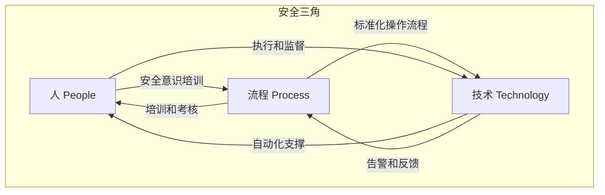

# 12.4 常见误区：云安全认知陷阱与纠偏指南

云安全领域存在大量似是而非的观念，这些认知偏差轻则导致安全投入浪费，重则埋下致命隐患。本节逐一拆解云安全中最常见的误区，给出真实案例、数据支撑和可操作的纠正方案。



---

## 误区一："云服务商负责所有安全"

这是云安全中最普遍、最危险的误解。许多组织在迁移到云后，认为安全责任完全转移给了云服务商，自己不再需要关注安全问题。

### 真相：责任共担，而非责任转移

云安全遵循**责任共担模型**（Shared Responsibility Model）。云服务商负责"云的安全"（Security **OF** the Cloud）——底层基础设施、物理安全、网络基础设施、虚拟化层等；而"云中的安全"（Security **IN** the Cloud）——数据安全、身份管理、操作系统配置、应用安全、网络配置、客户端加密——仍然是用户的责任。



三种服务模型下责任分配不同：

| 层级 | IaaS（如EC2） | PaaS（如Elastic Beanstalk） | SaaS（如Office 365） |
|------|--------------|---------------------------|---------------------|
| 数据安全 | 用户 | 用户 | 用户 |
| 应用安全 | 用户 | 用户 | 云厂商 |
| 操作系统 | 用户 | 云厂商 | 云厂商 |
| 网络配置 | 用户 | 共担 | 云厂商 |
| 虚拟化层 | 云厂商 | 云厂商 | 云厂商 |
| 物理安全 | 云厂商 | 云厂商 | 云厂商 |

### 数据支撑

根据云安全联盟（CSA）2024年报告：
- **99%** 的云安全失败源于用户侧的配置错误
- **65%** 的云安全事件与IAM配置不当相关
- **82%** 的云数据泄露涉及存储桶或数据库的错误配置
- 仅不到 **1%** 的事件源于云服务商的基础设施漏洞

### 真实案例：Capital One数据泄露（2019年）

Capital One遭受的攻击是责任共担模型最经典的注脚。攻击者利用了AWS WAF的配置错误和EC2实例上过度授权的IAM角色，通过SSRF攻击获取了元数据服务的临时凭证，最终访问了S3中超过1亿条客户记录。

**根本原因不是AWS的漏洞，而是Capital One的配置错误**：
- WAF规则配置不当，未过滤特定SSRF payload
- EC2实例的IAM角色权限过大（`s3:GetObject` 对所有bucket）
- S3 bucket中存储了未加密的敏感数据

### 自检清单

- [ ] 是否清楚当前使用的云服务（IaaS/PaaS/SaaS）对应的责任边界？
- [ ] 是否已为用户侧的安全责任指定了明确的负责人？
- [ ] 是否定期审查责任共担模型中的用户侧配置？
- [ ] 是否在合同中明确了云厂商的安全责任和SLA？

---

## 误区二："云环境默认安全"

很多人误以为云平台部署后默认就是安全的，不需要额外的安全配置。

### 真相：默认配置偏向可用性，而非安全性

云平台为了降低使用门槛和提升用户体验，默认配置往往倾向于"开箱即用"而非"开箱即安全"。这在商业逻辑上可以理解——如果新用户上来就被一堆安全限制卡住，体验会很差。但这也意味着，安全配置需要用户主动完成。

AWS S3在2017-2018年间连续发生多起大规模数据泄露事件（Verizon、Dow Jones、Pentagon承包商等），根本原因就是S3默认不阻止公开访问。直到2023年，AWS才将Block Public Access设为默认启用——**这个简单的默认配置变更花了6年时间**。

### 各平台默认不安全配置对照

| 资源类型 | AWS | Azure | GCP |
|---------|-----|-------|-----|
| 对象存储 | S3：2023年前默认允许公开访问 | Blob：默认禁止公开访问 | GCS：默认禁止公开访问 |
| 数据库 | RDS：默认不启用加密 | SQL DB：默认启用TDE | Cloud SQL：默认不启用加密 |
| 元数据服务 | IMDSv1默认可用（v2可选） | IMDS默认限制较少 | 元数据默认可用 |
| 日志审计 | CloudTrail需手动开启 | Azure Monitor部分默认 | Cloud Audit Logs默认开启 |
| SSH密钥 | 控制台创建的实例自动注入密钥 | 默认密码认证 | OS Login默认未启用 |
| 网络 | 默认VPC安全组允许所有出站 | NSG默认允许VNet内通信 | 默认防火墙规则较宽松 |

### 实操：部署后立即执行的安全基线

以下是AWS环境部署后应立即执行的安全基线检查脚本：

```bash
#!/bin/bash
# aws_security_baseline_check.sh - AWS安全基线快速检查

echo "=== 1. S3公开访问检查 ==="
aws s3api list-buckets --query 'Buckets[].Name' --output text | tr '\t' '\n' | while read bucket; do
    status=$(aws s3api get-public-access-block --bucket "$bucket" 2>/dev/null)
    if [ -z "$status" ]; then
        echo "[警告] Bucket $bucket 未配置Public Access Block"
    fi
done

echo "=== 2. 默认安全组检查 ==="
aws ec2 describe-security-groups --filters "Name=group-name,Values=default" \
    --query 'SecurityGroups[].{ID:GroupId,VPC:VpcId,Ingress:IpPermissions,Egress:IpPermissionsEgress}' \
    --output json | jq '.[] | select(.Ingress | length > 0 or .Egress | length > 0) | 
    "[警告] 默认安全组 " + .ID + " (VPC: " + .VPC + ") 存在自定义规则"'

echo "=== 3. IMDSv2强制启用检查 ==="
aws ec2 describe-instances --query 'Reservations[].Instances[].[InstanceId,MetadataOptions.HttpTokens]' \
    --output text | while read id tokens; do
    if [ "$tokens" != "required" ]; then
        echo "[警告] 实例 $id 未强制使用IMDSv2 (当前: $tokens)"
    fi
done

echo "=== 4. CloudTrail启用检查 ==="
trails=$(aws cloudtrail describe-trails --query 'trailList[].{Name:Name,IsLogging:IsLogging}' --output json)
echo "$trails" | jq -r '.[] | select(.IsLogging == false) | "[警告] Trail " + .Name + " 未启用日志记录"'

echo "=== 5. RDS加密检查 ==="
aws rds describe-db-instances --query 'DBInstances[].[DBInstanceIdentifier,StorageEncrypted]' \
    --output text | while read name encrypted; do
    if [ "$encrypted" == "False" ]; then
        echo "[警告] RDS实例 $name 未启用存储加密"
    fi
done

echo "=== 基线检查完成 ==="
```

### 自检清单

- [ ] 是否在资源部署后立即运行安全基线检查？
- [ ] 是否使用基础设施即代码（IaC）模板固化安全默认值？
- [ ] 是否启用了云平台的安全配置评估服务（AWS Config、Azure Policy、GCP Security Command Center）？
- [ ] 是否建立了安全配置漂移检测机制？

---

## 误区三："IAM权限不需要精细管理"

许多组织在IAM管理上采取"宁多勿少"的态度，认为给予用户更多权限可以提高工作效率，避免反复授权的麻烦。

### 真相：过度授权是云安全的第一杀手

IAM权限过度授权是云环境中最常见、影响最广的安全风险。Gartner预测到2025年，**99%** 的云安全故障将是客户的错误，其中IAM配置错误占据首位。

过度授权的连锁效应：



### 案例分析：一个过度授权角色的毁灭性后果

某公司的开发人员账户被授予了 `AdministratorAccess` 策略，该账户被钓鱼攻击获取后，攻击者在4小时内完成了以下操作：

1. **枚举阶段**（0-30分钟）：`aws iam list-roles`、`aws s3 ls`、`aws ec2 describe-instances` —— 了解环境全貌
2. **数据窃取**（30-90分钟）：访问所有S3 Bucket，包括包含客户PII数据的Bucket，使用 `aws s3 sync` 批量下载
3. **持久化**（90-150分钟）：创建新的IAM用户和Access Key，附加 `AdministratorAccess`，创建Lambda函数作为后门
4. **掩盖痕迹**（150-240分钟）：`aws cloudtrail stop-logging`，删除CloudWatch告警，修改S3访问日志

如果该账户只有开发环境的只读权限，攻击者连第一步的枚举都无法完成。

### 最小权限实践：从理论到落地

```json
{
    "Version": "2012-10-17",
    "Statement": [
        {
            "Sid": "DevEnvironmentReadOnly",
            "Effect": "Allow",
            "Action": [
                "s3:GetObject",
                "s3:ListBucket"
            ],
            "Resource": [
                "arn:aws:s3:::dev-*",
                "arn:aws:s3:::dev-*/*"
            ],
            "Condition": {
                "IpAddress": {
                    "aws:SourceIp": ["10.0.0.0/8", "172.16.0.0/12"]
                },
                "StringEquals": {
                    "aws:RequestedRegion": "ap-east-1"
                }
            }
        }
    ]
}
```

这个策略实现了四层限制：
1. **操作限制**：只允许读取，不允许写入或删除
2. **资源限制**：只能访问以 `dev-` 开头的Bucket
3. **网络限制**：只能从内网IP访问
4. **区域限制**：只能在指定区域操作

### IAM治理的五个层次

| 层次 | 措施 | 工具/方法 |
|------|------|----------|
| 1. 权限边界 | 定义IAM角色的最大权限范围 | Permission Boundary |
| 2. 权限分析 | 识别实际使用 vs 已授权的权限差距 | IAM Access Analyzer |
| 3. 权限收窄 | 基于分析结果逐步收窄过度权限 | Access Advisor + 自动化脚本 |
| 4. 临时凭证 | 用STS临时凭证替代长期Access Key | AssumeRole + 外部身份联邦 |
| 5. 持续监控 | 实时检测异常权限使用 | CloudTrail + GuardDuty |

### 自检清单

- [ ] 是否为所有IAM用户启用了MFA？
- [ ] 是否使用了Permission Boundary限制角色的最大权限？
- [ ] 是否运行了IAM Access Analyzer识别外部访问和过度授权？
- [ ] 是否定期审查Access Advisor数据，收窄未使用的权限？
- [ ] 是否已经消除或减少长期Access Key的使用？
- [ ] 是否为不同环境（开发/测试/生产）使用了不同的IAM策略？

---

## 误区四："容器和虚拟机的安全管理方式相同"

很多从传统虚拟化环境转向容器的团队，错误地将虚拟机的安全管理方式直接套用到容器环境，导致安全控制失效或资源浪费。

### 真相：容器和虚拟机有本质的安全模型差异

两者的核心区别在于**隔离机制**：虚拟机通过Hypervisor在硬件层面隔离，每个VM有独立的操作系统内核；而容器共享宿主机内核，通过Linux命名空间（Namespace）和控制组（Cgroup）在操作系统层面隔离。



| 维度 | 虚拟机 | 容器 |
|------|--------|------|
| 隔离级别 | 硬件级别（Hypervisor） | 操作系统级别（Namespace+Cgroup） |
| 内核 | 独立内核 | 共享宿主机内核 |
| 攻击面 | 较小（独立OS，相互隔离） | 较大（内核漏洞影响所有容器） |
| 持久性 | 有状态，可以原地修补 | 无状态，应重建而非修补 |
| 安全边界 | VM边界明确 | 容器→Pod→Namespace→集群，边界分层 |
| 网络 | 独立网络栈 | 默认共享网络栈，可隔离 |
| 权限模型 | 标准OS权限 | 默认root运行，需显式限制 |

### 容器安全中的典型错误

**错误1：在容器中运行传统安全代理**

```dockerfile
# ❌ 错误做法：在容器中安装安全代理
FROM ubuntu:22.04
RUN apt-get update && apt-get install -y crowdstrike-falcon
COPY app /app
CMD ["/app"]
```

容器应保持精简。安全代理应部署在宿主机层面或通过Kubernetes的安全扩展（如DaemonSet中的Falco）实现：

```yaml
# ✅ 正确做法：通过DaemonSet在宿主机层面运行安全监控
apiVersion: apps/v1
kind: DaemonSet
metadata:
  name: falco
spec:
  selector:
    matchLabels:
      app: falco
  template:
    metadata:
      labels:
        app: falco
    spec:
      containers:
      - name: falco
        image: falcosecurity/falco:latest
        securityContext:
          privileged: true  # Falco需要特权访问内核事件
        volumeMounts:
        - name: dev
          mountPath: /dev
        - name: proc
          mountPath: /host/proc
          readOnly: true
        - name: falco-config
          mountPath: /etc/falco
      volumes:
      - name: dev
        hostPath:
          path: /dev
      - name: proc
        hostPath:
          path: /proc
      - name: falco-config
        configMap:
          name: falco-config
```

**错误2：修补运行中的容器**

```bash
# ❌ 错误做法：进入容器打补丁
docker exec -it web-app bash
apt-get update && apt-get upgrade -y
```

容器是不可变基础设施（Immutable Infrastructure），正确做法是重建镜像：

```bash
# ✅ 正确做法：重建镜像并重新部署
docker build -t web-app:v1.1 .
docker push registry/web-app:v1.1
kubectl set image deployment/web-app web-app=registry/web-app:v1.1
```

**错误3：使用特权容器**

```yaml
# ❌ 危险：特权容器拥有宿主机全部权限
containers:
- name: debug
  securityContext:
    privileged: true  # 等于root on host
```

```yaml
# ✅ 安全：只授予必要的Linux能力
containers:
- name: app
  securityContext:
    privileged: false
    allowPrivilegeEscalation: false
    runAsNonRoot: true
    runAsUser: 1000
    capabilities:
      drop:
        - ALL
      add:
        - NET_BIND_SERVICE  # 只添加必要能力
    readOnlyRootFilesystem: true
```

### 容器安全三阶段模型

| 阶段 | 关键措施 | 工具 |
|------|---------|------|
| **构建** | 最小基础镜像、非root用户、镜像扫描、签名验证 | Trivy, Grype, Cosign, Docker Slim |
| **部署** | Pod Security Standards、Network Policy、RBAC | OPA/Gatekeeper, Kyverno, K8s原生 |
| **运行** | 运行时威胁检测、异常行为告警、自动响应 | Falco, Tetragon, KubeArmor |

### 自检清单

- [ ] 是否使用了最小基础镜像（如distroless、scratch）？
- [ ] 是否在CI/CD流水线中集成了镜像扫描？
- [ ] 容器是否以非root用户运行？
- [ ] 是否启用了Pod Security Standards（至少restricted级别）？
- [ ] 是否配置了Network Policy限制Pod间通信？
- [ ] 是否部署了运行时安全监控？

---

## 误区五："加密就等于安全"

很多人认为只要数据加密了就万事大吉，甚至用加密来替代访问控制。

### 真相：加密是必要条件，不是充分条件

加密是纵深防御体系中的一层，但存在明确的边界。一个形象的类比：**加密相当于给保险箱上了锁，但如果保险箱放在大街上、钥匙挂在锁上、任何人都能搬走保险箱，那锁本身意义不大。**

加密不能防护的场景：

| 场景 | 为什么加密无效 | 实际案例 |
|------|--------------|---------|
| 配置错误导致的公开访问 | 数据可被合法下载，加密密钥随数据一起暴露 | S3 Bucket公开访问，数据虽加密但密钥策略允许所有人解密 |
| 授权用户的数据外泄 | 加密对合法访问者透明 | 内部员工通过正常权限导出数据后外传 |
| 应用层漏洞 | 应用已持有解密密钥，漏洞利用可间接获取数据 | SQL注入通过应用层读取已解密的数据 |
| 勒索软件 | 数据已被恶意重新加密 | 攻击者加密后删除原始密钥 |
| 密钥泄露 | 密钥泄露后加密形同虚设 | 硬编码在代码中的密钥被提交到公开仓库 |

### 密钥管理才是核心



**AWS KMS最佳实践配置示例**：

```json
{
    "Sid": "限制密钥使用范围",
    "Effect": "Allow",
    "Principal": {
        "AWS": "arn:aws:iam::ACCOUNT:role/ApplicationRole"
    },
    "Action": [
        "kms:Decrypt",
        "kms:GenerateDataKey"
    ],
    "Resource": "*",
    "Condition": {
        "StringEquals": {
            "kms:ViaService": "s3.ap-east-1.amazonaws.com"
        },
        "StringLike": {
            "kms:EncryptionContext:aws:s3:arn": "arn:aws:s3:::sensitive-bucket/*"
        }
    }
}
```

这个策略实现了：
1. 只允许特定角色使用密钥
2. 只允许通过S3服务使用密钥（防止直接API调用）
3. 只允许对特定Bucket的加密上下文使用密钥

### 加密方案选型指南

| 数据状态 | 推荐方案 | 注意事项 |
|---------|---------|---------|
| 静态数据（存储） | 服务端加密（SSE-KMS）+ 客户端加密（高敏感） | 客户端加密可防止云厂商内部访问 |
| 传输中数据 | TLS 1.3 + 证书固定 | 禁用TLS 1.0/1.1，固定证书指纹防MITM |
| 使用中数据 | 机密计算（AWS Nitro Enclaves、Azure Confidential Computing） | 适用于极高敏感度场景 |
| 备份数据 | 独立密钥加密备份 | 备份密钥与生产密钥分离管理 |

### 自检清单

- [ ] 加密密钥是否与加密数据分开存储？
- [ ] 是否有自动密钥轮换策略（至少每年一次）？
- [ ] 密钥访问是否遵循最小权限原则？
- [ ] 是否检测并阻止了代码中的硬编码密钥？
- [ ] 是否对不同敏感级别的数据使用了不同的加密方案？

---

## 误区六："多云策略天然更安全"

有些组织认为采用多云策略（同时使用多个云服务商）可以分散风险、提高安全性。

### 真相：多云是一把双刃剑

多云策略确实可以带来某些安全优势——避免供应商锁定、利用各平台最佳安全服务、分散单点故障风险。但它也引入了显著的安全挑战。



### 数据支撑

根据HashiCorp 2024年云策略调查：
- **76%** 的企业采用多云策略
- 但只有 **34%** 的组织有信心在多云环境中保持一致的安全态势
- 多云环境的安全事件平均响应时间比单云环境长 **40%**
- **57%** 的多云组织表示缺乏统一的安全可视化工具

### 多云安全管理的五个关键能力

| 能力 | 具体措施 | 推荐工具 |
|------|---------|---------|
| 统一身份 | 跨云身份联邦，单一身份源 | Okta, Azure AD, Keycloak + OIDC |
| 统一策略 | 跨云安全策略即代码 | Terraform + Sentinel/OPA, Pulumi |
| 统一监控 | 跨云安全事件集中分析 | Datadog, Splunk, Wiz, Prisma Cloud |
| 统一网络 | 跨云安全通信 | Cloudflare, Zscaler, Tailscale |
| 统一合规 | 跨云合规状态持续评估 | Prisma Cloud, Lacework, Orca |

### 何时不该用多云

- 团队只熟悉单一云平台，强行多云会因能力不足导致安全失控
- 业务体量较小，多云增加的运维成本远超收益
- 没有足够的安全自动化工具和平台，手动管理多云安全几乎不可能
- 合规要求严格且各云平台合规方案差异大，多云会增加合规难度

### 自检清单

- [ ] 是否有统一的跨云身份管理方案？
- [ ] 是否能在单一平台上查看所有云的安全状态？
- [ ] 是否有跨云安全事件响应的标准化流程？
- [ ] 团队是否具备足够的多云安全专业技能？
- [ ] 多云策略是否基于实际业务需求，而非盲目跟风？

---

## 误区七："云安全只是传统安全的延伸"

很多传统安全从业者认为，云安全只是传统网络安全在云端的应用，不需要特别学习新的安全理念和技术。

### 真相：云安全颠覆了传统安全的基本假设

传统安全模型建立在**"网络边界可信任"**的假设之上——防火墙内的设备是可信的，防火墙外的是不可信的。但云环境完全打破了这一假设：

| 维度 | 传统安全 | 云安全 |
|------|---------|--------|
| 安全边界 | 网络边界（防火墙） | 身份边界（IAM） |
| 基础设施控制 | 完全控制（自有机房） | 共享控制（责任共担） |
| 资源管理 | 静态、手动变更审批 | 动态、自动化创建销毁 |
| 网络拓扑 | 相对固定 | 弹性伸缩，IP随时变化 |
| 安全工具 | 传统防火墙、IDS/IPS | 云原生安全服务、CASB、CSPM |
| 合规模式 | 周期性审计 | 持续合规、实时评估 |
| 威胁模型 | 外部攻击者为主 | 内部威胁、配置错误、供应链风险并重 |
| 可见性 | 网络流量可完整捕获 | 云内流量部分可见，API调用是关键 |

### 云安全需要的五个思维转变

**1. 从"城堡护城河"到"零信任"**

传统模型假设内网安全，外网危险。零信任模型假设网络中任何位置都不安全，每次访问都需要验证身份、设备和上下文。

**2. 从"手动变更"到"基础设施即代码"**

云环境的资源可以通过API在秒级创建和销毁。手动管理安全配置在云环境的规模和速度下不可行，必须通过代码（Terraform、CloudFormation）自动化管理。

**3. 从"网络监控"到"API监控"**

云环境的核心管理接口是API。CloudTrail/Azure Activity Log等API审计日志的重要性，相当于传统环境中的网络流量监控。

**4. 从"周/月审计"到"持续合规"**

传统环境的安全审计通常按季度或年度进行。云环境的动态性要求持续评估——资源在分钟级别创建和销毁，安全配置随时可能漂移。

**5. 从"安全团队负责"到"开发团队共建"**

DevSecOps的核心理念是将安全左移到开发阶段。安全团队的角色从"守门员"转变为"赋能者"——提供安全工具、模板和自动化能力，让开发团队能够自主地构建安全的系统。

### 认证学习路径

对于有传统安全背景、需要转向云安全的从业者：

```text
入门：CCSK (Certificate of Cloud Security Knowledge)
  ↓
进阶：CCSP (Certified Cloud Security Professional)
  ↓
专项：AWS Security Specialty / Azure Security Engineer / GCP Professional Cloud Security Engineer
  ↓
实战：云安全攻防靶场 (CloudGoat, Thunder CTF, iam-vulnerable)
```

---

## 误区八："Serverless不需要安全关注"

Serverless架构免除了基础设施管理的负担，有些人因此认为安全问题也随之消失。

### 真相：Serverless改变了安全责任的分配，而非消除了安全需求

Serverless将操作系统、运行时、基础设施的安全责任转移给了云厂商，但应用层安全仍然完全是用户的责任——而且Serverless引入了新的攻击面。



### Serverless特有的安全问题

**事件注入（Event Injection）**：Serverless函数通常由多种事件源触发（API Gateway、S3、SQS等）。攻击者可以构造恶意事件数据来注入攻击：

```python
# ❌ 易受攻击的Lambda函数
def handler(event, context):
    # 直接使用用户输入构建SQL查询
    user_id = event['queryStringParameters']['user_id']
    query = f"SELECT * FROM users WHERE id = '{user_id}'"
    # SQL注入！
    result = db.execute(query)
    return {'statusCode': 200, 'body': json.dumps(result)}
```

```python
# ✅ 安全的Lambda函数
def handler(event, context):
    # 输入验证
    user_id = event['queryStringParameters'].get('user_id', '')
    if not user_id.isdigit():
        return {'statusCode': 400, 'body': 'Invalid user_id'}
    
    # 参数化查询
    result = db.execute("SELECT * FROM users WHERE id = %s", (int(user_id),))
    return {'statusCode': 200, 'body': json.dumps(result)}
```

**过度授权的执行角色**：

```json
// ❌ 危险：函数角色拥有所有S3权限
{
    "Effect": "Allow",
    "Action": "s3:*",
    "Resource": "*"
}

// ✅ 安全：精确限制到特定Bucket的特定操作
{
    "Effect": "Allow",
    "Action": ["s3:GetObject"],
    "Resource": "arn:aws:s3:::my-app-data/public/*"
}
```

### 自检清单

- [ ] Lambda函数是否配置了最小权限执行角色？
- [ ] 是否对所有事件源输入进行了验证和净化？
- [ ] 是否扫描了函数依赖库中的已知漏洞？
- [ ] 敏感配置是否通过Secrets Manager而非环境变量明文传递？
- [ ] 是否限制了函数的并发执行上限以防止DoS？
- [ ] 是否对函数URL/API Gateway端点启用了认证？

---

## 误区九："合规等于安全"

很多组织将通过合规审计（如ISO 27001、SOC 2、PCI DSS）等同于"安全"，认为拿到证书就万事大吉。

### 真相：合规是安全的下限，不是上限

合规标准定义的是**最低安全基线**——"做到这些基本不会出大问题"。但攻击者不会因为你通过了审计就放弃攻击。事实上，很多通过了合规审计的组织仍然遭受了严重数据泄露。

| 维度 | 合规 | 安全 |
|------|------|------|
| 目标 | 满足监管和行业标准要求 | 抵御实际威胁，保护业务和数据 |
| 时间维度 | 周期性审计（年度/半年度） | 持续监控和实时响应 |
| 覆盖范围 | 标准规定的范围 | 全部攻击面 |
| 检测能力 | 检查配置是否符合标准 | 检测和响应实际攻击行为 |
| 驱动力 | 法规和合同要求 | 业务风险和威胁态势 |

**真实案例**：Target在2013年数据泄露前刚刚通过了PCI DSS审计，但攻击者通过HVAC供应商的网络凭证进入了内网，最终窃取了4000万张信用卡数据。合规审计关注的是支付系统本身的安全，但攻击入口是未受监控的第三方供应商网络。

### 正确做法

合规应该是安全体系的**副产品**，而非目标。如果你的安全体系足够完善，通过合规审计应该是水到渠成的事。反之，如果只是为了通过审计而做安全，审计一结束安全投入就会松懈。

---

## 误区十："更多的安全工具意味着更好的安全"

有些组织不断增加安全工具——WAF、SIEM、EDR、CSPM、CASB、DLP……最终工具堆栈臃肿、告警疲劳、配置混乱，安全反而变差了。

### 真相：安全工具的价值在于集成和运营，而非数量

SANS研究所在2023年的调查中发现：
- 企业平均使用 **45+** 个安全工具
- **53%** 的安全团队表示告警疲劳是最大的运营挑战
- 工具之间的告警关联率不到 **30%**，意味着大量告警无法被有效利用



### 安全工具选型原则

1. **覆盖优先于数量**：选择能覆盖多个安全需求的平台型工具，而非堆叠单点工具
2. **集成能力优先于功能**：API完善、能与现有工具联动的工具价值更高
3. **运营能力优先于购买**：一个配置良好、持续运营的工具胜过十个部署后无人维护的工具
4. **自动化优先于人工**：选择能自动化响应的工具，减少人工介入

### 云安全工具分层建议

| 层级 | 功能 | 推荐（任选其一） |
|------|------|----------------|
| 资产可见性 | 云资源清单和关系映射 | Wiz, Orca, Prisma Cloud |
| 配置安全 | CSPM - 安全配置评估和修复 | AWS Config, Azure Policy, Prowler |
| 身份安全 | IAM权限分析和过度授权检测 | IAM Access Analyzer, Ermetic |
| 网络安全 | 流量分析、微隔离 | 云原生安全组 + VPC Flow Logs |
| 工作负载安全 | 运行时威胁检测 | GuardDuty, Falco, Sysdig |
| 日志与响应 | SIEM + SOAR | Splunk, Elastic, Panther |

---

## 误区十一："备份等于容灾"

很多组织认为定期备份数据就等于有了灾难恢复能力。在云环境中，这种误解尤为危险。

### 真相：备份只是容灾的起点，而非终点

容灾能力取决于三个关键指标：

| 指标 | 含义 | 备份能否满足 |
|------|------|-------------|
| RPO（恢复点目标） | 可容忍的数据丢失量 | 取决于备份频率，通常有数小时差距 |
| RTO（恢复时间目标） | 系统恢复所需时间 | 从备份恢复通常需要数小时到数天 |
| 业务连续性 | 灾难期间业务是否可继续运行 | 备份无法提供业务连续性 |

**备份能解决的问题**：数据丢失后可以恢复
**备份不能解决的问题**：
- 误删除后需要快速恢复（备份恢复太慢）
- 需要系统持续可用（备份无法提供高可用）
- 跨区域灾难时的服务切换（备份不等于跨区域冗余）
- 勒索软件加密后的快速恢复（备份恢复时间可能超过业务容忍）

### 云环境容灾架构设计

```text
Level 1: 备份 → RPO小时级，RTO小时级
  └─ 适用于非关键数据、开发环境

Level 2: 跨可用区部署 → RPO接近零，RTO分钟级
  └─ 适用于大多数生产工作负载

Level 3: 跨区域热备 → RPO接近零，RTO秒级
  └─ 适用于关键业务系统

Level 4: 多活架构 → RPO零，RTO零
  └─ 适用于核心金融、支付系统
```

---

## 误区十二："安全只靠技术就行"

很多组织过度依赖技术手段，忽视了安全治理、人员培训和流程建设。

### 真相：安全是"人-流程-技术"三位一体

根据Verizon 2024 DBIR报告：
- **68%** 的数据泄露涉及人为因素（社会工程、错误操作、内部威胁）
- 技术手段可以防住外部攻击，但很难防住内部人员的误操作或恶意行为
- 没有流程支撑的安全技术，效果会大打折扣



| 维度 | 常见问题 | 改进措施 |
|------|---------|---------|
| 人 | 安全意识薄弱、钓鱼攻击成功率高 | 定期安全培训、模拟钓鱼演练、安全文化建设 |
| 流程 | 变更管理混乱、应急响应无标准流程 | 建立变更管理流程、制定和演练应急预案 |
| 技术 | 工具配置不当、告警无人处理 | 安全工具配置审计、告警分级和自动化处理 |

---

## 本节小结

本节拆解了云安全中常见的十二个认知误区。这些误区的共性在于：**它们往往有一定的合理性，但被过度简化或绝对化了。** 云安全没有银弹，每个安全措施都有其适用边界和局限性。

核心纠偏原则：

| 误区类型 | 纠偏方向 |
|---------|---------|
| 责任认知误区 | 安全责任是共担的，用户承担的部分比想象中更多 |
| 默认安全误区 | 默认配置偏向可用性，安全需要主动配置和持续维护 |
| 技术万能误区 | 任何单一技术手段都有边界，纵深防御才是正道 |
| 管理简化误区 | 安全是"人-流程-技术"三位一体，缺一不可 |

掌握这些纠偏原则，是建立正确云安全认知的第一步，也是避免在安全建设中走弯路的关键。

下一节将提供具体的练习方法，帮助读者将理论知识转化为实践技能。
