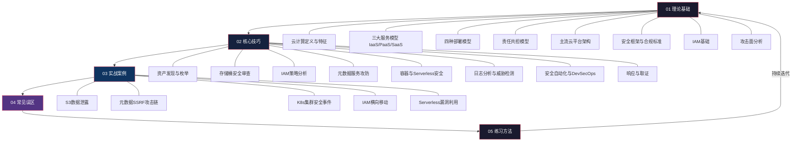
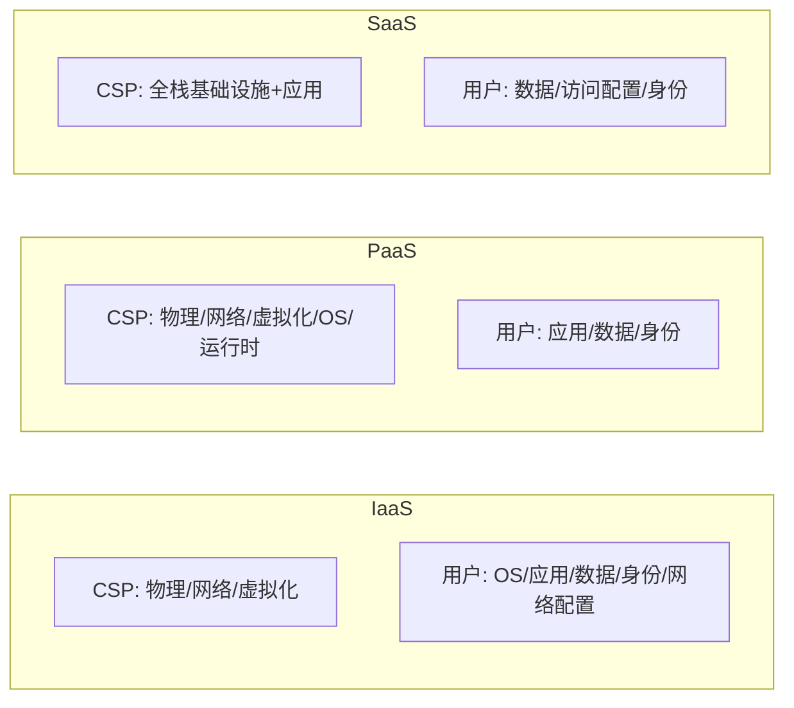

# 12.6 本章小结

本章从理论基础、核心技巧、实战案例、常见误区、练习方法五个维度系统性地构建了云计算安全的完整认知框架。作为全章的收束，本节将提炼关键知识节点、梳理技能图谱、规划进阶路径，帮助你把零散的知识点串联成可迁移的能力体系。

## 一、知识体系回顾

### 1.1 章节知识地图

本章五大模块构成一个层层递进的学习闭环——理论是地基，技巧是工具，案例是检验，误区是纠偏，练习是巩固：



### 1.2 核心概念速查表

以下是本章涉及的高频核心概念，建议收藏为速查卡片反复温习：

| 概念 | 定义 | 关键要点 | 与安全的关联 |
|------|------|----------|-------------|
| **IaaS** | 用户管理OS以上的全栈 | 控制面最大，责任最重 | 用户需负责OS补丁、网络ACL、密钥管理 |
| **PaaS** | 用户专注应用和数据 | 平台托管运行时和中间件 | 用户需负责代码安全、数据加密、身份管理 |
| **SaaS** | 用户仅管理数据和访问 | 控制面最小，但配置仍关键 | 过度共享、弱认证、影子IT是主要风险 |
| **责任共担模型** | CSP负责"云的安全"，用户负责"云中的安全" | 边界因服务模型而异 | 99%的安全事件源于用户侧配置错误 |
| **IAM** | 身份与访问管理 | 身份是云环境的新安全边界 | 最小权限原则是IAM管理的基石 |
| **元数据服务** | 实例获取自身凭证的内部API | 默认IMDSv1可被SSRF利用 | IMDSv2是关键防护措施 |
| **RBAC** | 基于角色的访问控制 | K8s中通过Role/ClusterRole绑定 | 错误绑定可能导致容器逃逸 |
| **Network Policy** | K8s Pod间网络隔离 | 默认不启用任何限制 | 不配Policy等于Pod间无防火墙 |
| **CSPM** | 云安全态势管理 | 持续监控配置合规性 | 自动发现配置漂移和违规 |
| **CNAPP** | 云原生应用保护平台 | 整合CWPP+CSPM+CIEM | 一站式覆盖构建-部署-运行全生命周期 |

### 1.3 各节核心知识回顾

#### 理论基础（12.1节）

**云计算的五大基本特征**（NIST定义）：按需自助服务、广泛网络访问、资源池化、快速弹性、可计量服务。这不是营销话术——每个特征都对应特定的安全影响：资源池化意味着多租户隔离成为硬需求，快速弹性意味着安全策略必须自动化而非手动配置。

**三种服务模型的安全责任差异**：



**责任共担模型是本章最重要的理论基石**：它不是一个抽象概念，而是直接影响你日常安全决策的框架。当你在AWS上部署EC2实例时，操作系统补丁是你的责任；当你使用RDS时，数据库引擎版本升级由AWS负责，但数据库访问控制是你的责任。混淆这个边界是最常见的安全盲区。

**四大云平台的安全服务对比**：

| 安全能力 | AWS | Azure | GCP | 阿里云 |
|---------|-----|-------|-----|--------|
| 身份管理 | IAM + Organizations | Entra ID | Cloud IAM | RAM |
| 威胁检测 | GuardDuty | Defender for Cloud | SCC | 云安全中心 |
| 审计日志 | CloudTrail | Activity Log | Cloud Audit Logs | ActionTrail |
| 密钥管理 | KMS | Key Vault | Cloud KMS | KMS |
| 配置审计 | Config + Security Hub | Policy + Defender | SCC | 配置审计 |
| 网络安全 | Security Groups + NACLs | NSG + Azure Firewall | VPC FW + Cloud Armor | 安全组 + WAF |
| 存储加密 | S3 SSE/KMS | Blob SSE/CMK | CMEK/CSEK | OSS加密 |
| 容器安全 | EKS + Inspector | AKS + Defender | GKE + SCC | ACK + 安全中心 |

**IAM策略评估逻辑**——这是理解云安全的分水岭：

1. 默认拒绝（Deny by Default）：所有请求默认被拒绝
2. 显式Deny优先：任何显式Deny都会覆盖所有Allow
3. 显式Allow检查：只有显式Allow才能放行
4. 隐式Deny：没有匹配的Allow则默认Deny

理解这个逻辑链，你就能分析任何IAM策略的安全影响。

#### 核心技巧（12.2节）

**资产发现**：云环境的安全始于"知道自己有什么"。资产发现在云环境中的挑战在于——资源动态创建和销毁、跨账户跨区域分散、Shadow IT（员工私自创建的云资源）。

核心方法：
- 子域名枚举：通过DNS记录发现暴露的云服务端点（子域名接管是常见攻击向量）
- 存储桶枚举：使用工具批量测试Bucket名称，发现公开可列举或公开可写的存储桶
- 端口扫描：发现暴露在公网的管理端口（如K8s API Server的6443、数据库端口）
- 云平台API枚举：利用已获取的凭证列举所有资源（EC2、Lambda、RDS等）

**存储桶安全审查清单**——这不是一个可选项，而是每次接触云存储时的必检项：

| 检查项 | 风险等级 | 检查方法 | 修复建议 |
|--------|---------|---------|---------|
| 公开访问设置 | 🔴 高危 | `aws s3api get-public-access-block` | 启用Block Public Access |
| Bucket策略 | 🔴 高危 | `aws s3api get-bucket-policy` | 移除过于宽松的Principal |
| ACL配置 | 🟡 中危 | `aws s3api get-bucket-acl` | 限制为私有 |
| 版本控制 | 🟡 中危 | `aws s3api get-bucket-versioning` | 启用版本控制防止误删 |
| 默认加密 | 🟡 中危 | `aws s3api get-bucket-encryption` | 启用SSE-S3或SSE-KMS |
| 日志记录 | 🟠 低危 | `aws s3api get-bucket-logging` | 启用访问日志 |
| 生命周期策略 | 🟠 低危 | `aws s3api get-bucket-lifecycle-configuration` | 设置过期删除策略 |

**IAM权限提升的常见路径**——攻击者最常利用的五条提权链：

1. **iam:AttachUserPolicy** → 给自己附加AdministratorAccess
2. **iam:CreatePolicyVersion** → 创建新版本的策略覆盖原有限制
3. **iam:PassRole + 创建资源** → 将高权限Role传递给新创建的Lambda/EC2
4. **sts:AssumeRole** → 利用跨账户信任关系获取更高权限
5. **iam:UpdateLoginProfile** → 重置密码获取控制台访问

每条路径都有对应的防御措施：权限边界（Permission Boundary）限制最大可授予权限，SCPs（Service Control Policies）限制组织单元的权限上限，Access Analyzer识别跨账户访问。

**元数据服务攻防**是理解云安全的标志性场景——SSRF → 元数据服务 → 临时凭证 → 横向移动，这条攻击链在真实环境中反复出现。关键防御措施IMDSv2要求先通过PUT请求获取Token，再用Token访问元数据，使SSRF无法直接获取凭证。

#### 实战案例（12.3节）

五个案例分别覆盖了云安全的五个核心攻击面：

| 案例 | 攻击面 | 攻击向量 | 核心教训 |
|------|--------|---------|---------|
| S3数据泄露 | 存储安全 | Bucket公开访问配置错误 | 启用Block Public Access + 定期审计 |
| 元数据SSRF | 计算安全 | Web应用SSRF → 169.254.169.254 | 强制IMDSv2 + 输入验证 |
| K8s集群入侵 | 容器安全 | 错误的RBAC + 暴露的API Server | RBAC最小权限 + Network Policy |
| IAM横向移动 | 身份安全 | 过度授权的角色 + AssumeRole | 权限边界 + Access Analyzer |
| Serverless利用 | 应用安全 | 事件注入 + 过度授权的Lambda Role | 输入验证 + 函数级最小权限 |

五个案例揭示了一个共同规律：**配置错误是首要攻击面**。不是零日漏洞，不是高级APT，而是本可以通过安全基线避免的配置疏忽。

#### 常见误区（12.4节）

八个误区的核心信息浓缩为三句话：

1. **安全责任不会因为上云而消失**——CSP和用户各司其职，用户的责任并不比自建数据中心少
2. **默认配置不等于安全配置**——云平台为了易用性往往牺牲默认安全性，主动加固是必修课
3. **技术栈变了，安全方法必须跟着变**——容器不等于小VM，Serverless不等于不需要安全

#### 练习方法（12.5节）

实践路径总结为四个阶段：

| 阶段 | 目标 | 推荐活动 | 预计时间 |
|------|------|---------|---------|
| 入门 | 理解基本概念和工具 | CloudGoat基础场景、TryHackMe AWS房间 | 2-4周 |
| 进阶 | 掌握攻击和防御技术 | Pacu权限提升、Kubernetes Goat | 4-8周 |
| 高级 | 复杂场景综合应对 | 多云攻击路径、云环境取证 | 2-4个月 |
| 专家 | 体系化能力输出 | 参与开源项目、考取认证 | 持续 |

## 二、关键技能清单

完成本章学习后，你应该具备以下四层能力。每一项都标注了自检标准，方便你评估掌握程度。

### 2.1 基础认知能力

| 技能项 | 自检标准 | 掌握 |
|--------|---------|------|
| 三大服务模型 | 能画出IaaS/PaaS/SaaS的责任分界线，举出每种模型的实际例子 | ☐ |
| 四种部署模型 | 能说明公有云、私有云、混合云、社区云的适用场景和安全差异 | ☐ |
| 责任共担模型 | 能针对AWS EC2、Azure App Service、Salesforce分别说明用户的安全责任 | ☐ |
| IAM核心概念 | 能解释策略评估逻辑（Deny → Allow → Implicit Deny），能阅读并理解IAM策略JSON | ☐ |
| 主流云平台 | 能对比AWS、Azure、GCP、阿里云的安全服务差异，知道各平台的原生安全工具 | ☐ |
| 安全框架 | 能说出CSA CCM、NIST CSF、ISO 27017的核心内容和适用场景 | ☐ |

### 2.2 审计检测能力

| 技能项 | 自检标准 | 掌握 |
|--------|---------|------|
| 资产发现 | 能使用子域名枚举、存储桶扫描、端口扫描等方法发现云环境暴露面 | ☐ |
| 存储桶审查 | 能按清单逐项检查S3/OSS/Blob的安全配置，识别公开访问风险 | ☐ |
| IAM分析 | 能使用cloudsplaining/pmapper分析IAM策略，识别过度授权和提权路径 | ☐ |
| 元数据检查 | 能验证EC2实例是否强制使用IMDSv2，理解IMDSv1的安全风险 | ☐ |
| 日志分析 | 能使用CloudTrail/Activity Log识别可疑API调用（如ConsoleLogin异常、策略修改） | ☐ |
| 容器安全扫描 | 能使用Trivy扫描镜像漏洞，使用kube-bench检查K8s安全基线 | ☐ |

### 2.3 防御加固能力

| 技能项 | 自检标准 | 掌握 |
|--------|---------|------|
| IAM策略设计 | 能从零编写最小权限的IAM策略，使用权限边界限制最大权限 | ☐ |
| 存储安全配置 | 能配置S3 Block Public Access、启用加密、设置生命周期策略 | ☐ |
| 网络安全组 | 能配置安全组和NACL，遵循最小开放原则 | ☐ |
| K8s安全基线 | 能配置RBAC、Network Policy、Pod Security Standards | ☐ |
| 监控告警 | 能配置CloudWatch/GuardDuty告警规则，建立安全事件通知机制 | ☐ |
| IaC安全 | 能使用Checkov/Terrascan扫描Terraform模板的安全问题 | ☐ |

### 2.4 攻击理解能力

| 技能项 | 自检标准 | 掌握 |
|--------|---------|------|
| 存储桶攻击 | 能列举公开Bucket、测试ACL/策略漏洞、理解数据泄露路径 | ☐ |
| SSRF利用 | 能构造SSRF攻击链访问元数据服务，理解IMDSv2绕过思路 | ☐ |
| IAM提权 | 能识别至少3种IAM权限提升路径，使用Pacu进行自动化扫描 | ☐ |
| 容器逃逸 | 能理解特权容器、运行时漏洞、挂载宿主机路径等逃逸方式 | ☐ |
| 横向移动 | 能通过AssumeRole、Service Account Token等机制在云环境中横向移动 | ☐ |
| 持久化 | 能识别攻击者在云环境中建立持久访问的方式（IAM用户、Backdoor Role等） | ☐ |

## 三、知识关联图谱

云安全不是一个孤立领域，它与网络安全的其他子领域深度交织。理解这些关联，能帮助你在实战中建立更全面的攻击面认知：

```mermaid
graph TD
    CS["☁️ 云安全"] --> NW["🌐 网络安全"]
    CS --> ID["🔑 身份安全"]
    CS --> CT["📦 容器安全"]
    CS --> DA["📊 数据安全"]
    CS --> AP["🖥️ 应用安全"]
    CS --> CP["📜 合规治理"]

    NW --> |"VPC/安全组/NACL"| CS
    NW --> |"零信任网络"| CS
    ID --> |"IAM/SSO/Federation"| CS
    ID --> |"最小权限原则"| CS
    CT --> |"K8s/Docker安全"| CS
    CT --> |"镜像供应链"| CS
    DA --> |"加密/密钥管理"| CS
    DA --> |"数据分类分级"| CS
    AP --> |"SSRF/注入"| CS
    AP --> |"Serverless安全"| CS
    CP --> |"等保2.0/GDPR"| CS
    CP --> |"SOC2/ISO27017"| CS

    CS --> FW["🛡️ 防火墙与WAF"]
    CS --> IR["🚨 事件响应"]
    CS --> TH["🕵️ 威胁情报"]

    style CS fill:#e94560,stroke:#333,color:#fff
    style NW fill:#0f3460,stroke:#e94560,color:#fff
    style ID fill:#16213e,stroke:#e94560,color:#fff
    style CT fill:#533483,stroke:#e94560,color:#fff
    style DA fill:#1a1a2e,stroke:#e94560,color:#fff
    style AP fill:#16213e,stroke:#e94560,color:#fff
    style CP fill:#0f3460,stroke:#e94560,color:#fff
```



**关键关联说明**：

- **网络 → 云安全**：传统网络知识（子网、路由、ACL）直接映射到VPC、安全组、NACL的配置能力。不懂网络就无法理解云网络安全。
- **身份 → 云安全**：IAM是云安全的核心，理解OAuth2、OIDC、SAML等身份协议是云安全从业者的必备技能。
- **容器 → 云安全**：Kubernetes已成为云原生应用的标准运行平台，K8s安全能力直接影响云安全评估的深度。
- **应用 → 云安全**：SSRF、注入等Web漏洞在云环境中可以升级为基础设施级别的攻击（如通过SSRF获取云凭证）。
- **合规 → 云安全**：等保2.0云安全扩展要求、GDPR数据本地化等合规要求直接影响云架构设计决策。

## 四、进阶学习方向

完成本章基础学习后，建议根据职业方向选择深入路径：

### 4.1 云原生安全方向

适合对容器和Kubernetes有浓厚兴趣的从业者。

| 学习主题 | 核心内容 | 推荐资源 | 预计周期 |
|---------|---------|---------|---------|
| Kubernetes安全深入 | CKS认证涵盖的全部安全能力 | CKS官方课程 + Killer.sh练习 | 3-6个月 |
| 服务网格安全 | Istio/Linkerd的mTLS和流量管理 | Istio官方文档 + 实验环境 | 1-2个月 |
| GitOps安全 | ArgoCD/Flux的安全配置和策略执行 | ArgoCD文档 + OPA/Gatekeeper | 1-2个月 |
| CNAPP实践 | 整合CWPP+CSPM+CIEM的统一平台 | Wiz/Prisma Cloud试用 | 持续 |

### 4.2 多云安全方向

适合在企业环境中管理多云基础设施的安全团队。

| 学习主题 | 核心内容 | 推荐资源 | 预计周期 |
|---------|---------|---------|---------|
| 跨云身份联合 | SAML/OIDC跨云SSO配置 | 各云平台IdP文档 | 1-2个月 |
| 统一安全策略 | CSPM工具的策略编排和自动化修复 | Prisma Cloud/Wiz文档 | 2-3个月 |
| 多云合规管理 | 跨云合规检查和报告自动化 | AWS Config + Azure Policy + SCC | 2-3个月 |
| 云安全图谱 | 资源、身份、权限的图关系分析 | Wiz/Ermetic概念和实践 | 1-2个月 |

### 4.3 云安全自动化方向

适合对DevSecOps和安全工程感兴趣的技术人员。

| 学习主题 | 核心内容 | 推荐资源 | 预计周期 |
|---------|---------|---------|---------|
| IaC安全 | Terraform/CloudFormation模板安全扫描 | Checkov + Terrascan + tfsec | 1-2个月 |
| 安全左移 | CI/CD管道中的SAST/DAST/SCA集成 | GitHub Actions + GitLab CI安全模板 | 1-2个月 |
| SOAR | 安全编排自动化响应 | AWS Lambda + Step Functions / Tines | 2-3个月 |
| 策略即代码 | OPA/Sentinel/Cedar策略编写 | OPA官方教程 + Rego语言 | 1-2个月 |

### 4.4 云取证与事件响应方向

适合有安全运营背景、想专注于云环境安全事件处理的从业者。

| 学习主题 | 核心内容 | 推荐资源 | 预计周期 |
|---------|---------|---------|---------|
| 云取证技术 | 云环境证据收集、快照分析、日志保全 | SANS FOR509课程 | 2-3个月 |
| 事件响应流程 | 云安全事件的检测-遏制-根除-恢复 | AWS Incident Response Playbook | 1-2个月 |
| 云威胁情报 | 云环境特有的威胁行为和IOC | MITRE ATT&CK Cloud Matrix | 持续 |
| 自动化响应 | SOAR平台和Lambda自动化响应脚本 | AWS Security Hub + Lambda | 2-3个月 |

### 4.5 合规与治理方向

适合面向企业安全管理、需要处理合规审计的安全管理者。

| 学习主题 | 核心内容 | 推荐资源 | 预计周期 |
|---------|---------|---------|---------|
| 等保2.0云扩展 | 云安全扩展要求的具体条款和落地方法 | 等保2.0标准文本 + 云安全联盟指南 | 1-2个月 |
| GDPR合规 | 数据保护、数据本地化、隐私增强技术 | GDPR官方文本 + CNIL指南 | 1-2个月 |
| PCI DSS云环境 | 支付数据在云环境中的保护要求 | PCI DSS v4.0 + AWS PCI合规指南 | 1-2个月 |
| SOC 2报告 | 云服务商的SOC 2审计和用户端配合 | AICPA SOC 2指南 | 1个月 |

## 五、推荐学习资源

### 5.1 书籍

| 书名 | 作者 | 适用阶段 | 推荐理由 |
|------|------|---------|---------|
| 《Cloud Security and Privacy》 | Tim Mather等 | 入门-中级 | 云安全领域的经典教材，系统覆盖云安全架构和隐私保护 |
| 《Practical Cloud Security》 | Chris Dotson | 中级 | O'Reilly出品，侧重实战，覆盖多云安全最佳实践 |
| 《Cloud Native Security》 | Chris Binnie, Rory McCune | 中级-高级 | 云原生安全的深入指南，覆盖容器、K8s、Serverless |
| 《Kubernetes Security and Observability》 | Brendan Creane, Amit Gupta | 中级-高级 | K8s安全和可观测性的权威指南 |
| 《Hacking Cloud Infrastructure》 | Rich Mogull | 高级 | 从攻击者视角分析云基础设施的安全弱点 |
| 《Serverless Security》 | Ory Segal, Tal Melamed | 中级 | 无服务器安全的深入分析，OWASP Serverless Top 10 |

### 5.2 认证路径

| 认证 | 颁发机构 | 难度 | 建议准备时间 | 核心价值 |
|------|---------|------|-------------|---------|
| CCSK | CSA | ⭐⭐ 中级 | 2-3个月 | 云安全知识体系的系统化认证，覆盖面广 |
| AWS Security Specialty | AWS | ⭐⭐⭐ 高级 | 3-6个月 | AWS安全深度认证，市场认可度高 |
| Azure Security Engineer | Microsoft | ⭐⭐⭐ 中级 | 2-4个月 | Azure安全专项认证 |
| CCSP | (ISC)² | ⭐⭐⭐⭐ 高级 | 6-12个月 | 云安全领域的顶级认证，跨平台通用 |
| CKS | CNCF | ⭐⭐⭐ 高级 | 2-4个月 | Kubernetes安全专项认证 |
| GCSA | SANS | ⭐⭐⭐⭐ 高级 | 4-6个月 | SANS云安全审计认证 |

**初学者推荐路径**：CCSK → AWS/Azure基础认证 → 安全专项认证 → CCSP

### 5.3 实践平台

| 平台 | 特点 | 适合阶段 | 网址 |
|------|------|---------|------|
| CloudGoat | AWS安全靶场，场景真实 | 入门-进阶 | github.com/RhinoSecurityLabs/cloudgoat |
| Kubernetes Goat | K8s安全靶场，覆盖常见攻击面 | 进阶 | kubernetes-goat.github.io |
| TryHackMe | 云安全房间，循序渐进 | 入门 | tryhackme.com |
| HackTheBox | 云相关挑战，难度较高 | 进阶-高级 | hackthebox.com |
| AWSGoat | AWS漏洞靶场，基于Terraform | 进阶 | github.com/ine-labs/AWSGoat |
| AzureGoat | Azure漏洞靶场 | 进阶 | github.com/ine-labs/AzureGoat |
| GCPGoat | GCP漏洞靶场 | 进阶 | github.com/ine-labs/GCPGoat |

### 5.4 社区与情报源

| 资源 | 类型 | 更新频率 | 内容特点 |
|------|------|---------|---------|
| Cloud Security Alliance | 行业组织 | 持续 | 研究报告、CCM框架、STAR认证 |
| OWASP Cloud-Native Top 10 | 安全清单 | 年度更新 | 云原生应用安全风险排名 |
| MITRE ATT&CK Cloud Matrix | 攻击知识库 | 持续更新 | 云环境攻击技术和检测方法 |
| AWS Security Blog | 官方博客 | 周更 | AWS安全最佳实践和漏洞通告 |
| Rhino Security Labs Blog | 研究博客 | 不定期 | 云安全攻防研究和漏洞分析 |
| Wiz Research Blog | 研究博客 | 不定期 | 大规模云漏洞研究和发现 |

## 六、从知识到能力的转化建议

### 6.1 学习方法论

本章的知识点密度较高，单纯阅读无法转化为实战能力。以下是经过验证的高效学习方法：

**费曼学习法在云安全中的应用**：
1. 选择一个概念（如IAM策略评估逻辑）
2. 用最简单的语言向一个非技术人员解释它
3. 发现解释不清的地方，就是你没有真正理解的地方
4. 回去重新学习，直到能流畅解释

**"读-做-教"三步循环**：
- 读：理解理论概念和工具用法（本章内容）
- 做：在实验环境中实际操作（靶场、免费套餐）
- 教：写博客、做分享、回答社区问题（内化为能力）

### 6.2 实践优先级

如果时间有限，按以下优先级安排实践：

1. **最高优先级**：IAM策略分析与存储桶安全——这两类问题占真实安全事件的绝大多数
2. **高优先级**：元数据服务攻防和日志分析——这是云安全的核心攻击和检测能力
3. **中优先级**：Kubernetes安全基础——容器化正在成为标准部署方式
4. **持续关注**：安全自动化和IaC安全——这是安全工程化的方向

### 6.3 常见学习陷阱

| 陷阱 | 表现 | 纠正方法 |
|------|------|---------|
| 只看不练 | 看完所有章节但从未在真实环境中操作 | 每学一个知识点，立即在靶场中验证 |
| 贪多求全 | 同时学习AWS+Azure+GCP+阿里云 | 先精通一个平台（推荐AWS），再横向扩展 |
| 忽视基础 | 直接学高级技术，跳过IAM和网络基础 | IAM是云安全的地基，必须先打牢 |
| 脱离场景 | 孤立地学习工具命令，不理解攻击/防御场景 | 始终以攻击链或防御链为线索组织学习 |
| 忽视合规 | 认为合规只是"填表" | 合规要求直接影响技术架构设计，理解合规就是理解约束条件 |

## 七、本章核心公式

云安全的复杂性可以通过以下核心公式来理解：

> **云安全事件 = 配置错误 × 暴露面 × 检测盲区**

- **配置错误**：99%的云安全事件的根因（CSA报告数据）
- **暴露面**：暴露在公网的资源越多，被攻击的概率越大
- **检测盲区**：没有日志、没有告警、没有监控的区域是攻击者的天堂

防御策略的核心就是同时降低这三个因子：

```text
降低风险 = 减少配置错误（安全基线+自动化检查）
         + 缩小暴露面（最小开放原则+资产清点）
         + 消除检测盲区（全量日志+实时告警+定期审计）
```

## 结语

本章为你构建了云计算安全的完整知识框架——从NIST定义的五大特征到责任共担模型的边界划分，从IAM策略评估逻辑到元数据服务的SSRF攻击链，从S3存储桶的安全审查清单到Kubernetes集群的安全基线配置。

但知识只是起点。云安全是一个"做中学"的领域——你需要亲手配置一个IAM策略，亲手分析一次CloudTrail日志，亲手在CloudGoat上完成一个攻击场景，才能真正内化这些知识。

记住三个核心原则：
1. **身份是新边界**——在云环境中，IAM配置比网络防火墙更重要
2. **自动化是必须**——手动安全操作无法应对云环境的规模和动态性
3. **假设入侵**——设计安全架构时假设任何组件都可能被攻破，基于此进行纵深防御

云安全的旅程才刚刚开始。保持好奇心，持续实践，你会在这个快速发展的领域中找到自己的位置。
