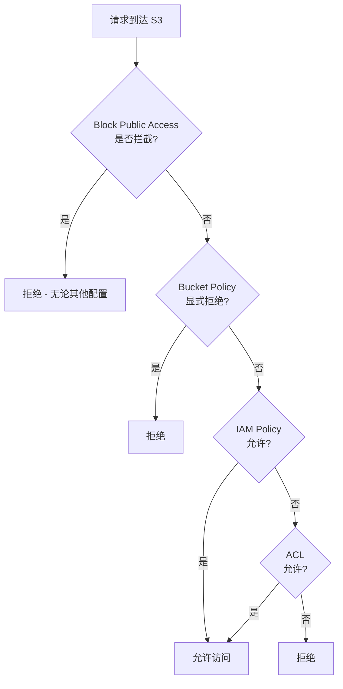
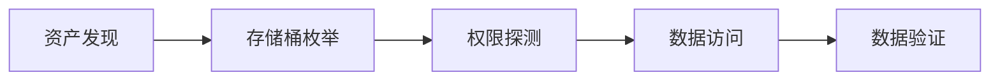
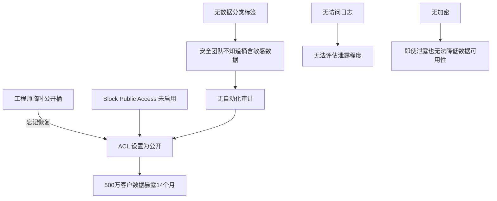
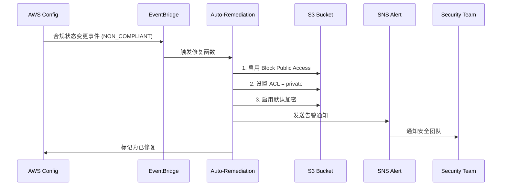

## 12.3.1 案例一：AWS S3 存储桶数据泄露事件

### 案例概述

2019 年，某大型金融机构因 Amazon S3（Simple Storage Service）存储桶配置不当，导致超过 500 万客户的敏感数据——包括姓名、身份证号、银行账户信息、联系电话和开户行信息——暴露在公网上。该事件被外部安全研究人员通过自动化扫描发现并报告，虽然未造成大规模数据窃取，但引发了严重的合规违规（违反 PCI DSS、GDPR 等）、监管处罚和声誉损失。

这不是孤立事件。S3 存储桶公开暴露是云计算安全中最常见的配置错误之一，从 2017 年的 Verizon 1400 万客户数据泄露、2019 年的 Facebook 5.4 亿用户记录暴露，到 2021 年的 Twitch 源代码泄露，同类事故反复发生。理解本案例的攻击路径、根因和防御方案，对所有使用对象存储的组织都有直接的借鉴意义。

---

### S3 安全基础：理解权限模型

在深入案例之前，必须先理解 S3 的权限控制机制，否则无法理解"为什么会暴露"以及"如何防止"。

#### S3 权限控制的四层体系



S3 的访问控制由四层机制组成，优先级从高到低：

| 层级 | 机制 | 作用 | 常见配置错误 |
|------|------|------|-------------|
| **第一层** | S3 Block Public Access | 账户/桶级别的全局开关，直接拦截所有公开访问 | 未开启，或仅开启部分选项 |
| **第二层** | Bucket Policy | JSON 格式的资源策略，可指定 Principal 为 `*`（所有人） | 策略中 `"Principal": "*"` 配合 `"Action": "s3:GetObject"` |
| **第三层** | IAM Policy | 用户/角色的身份策略，控制谁能对哪些桶做什么操作 | 过度授权，如 `"Action": "s3:*"` |
| **第四层** | ACL（Access Control List） | 遗留机制，粒度粗（READ/WRITE/FULL_CONTROL） | 授予 `AllUsers` 组 READ 权限 |

**关键概念：** `AllUsers` 是一个预定义的 URI 组，代表互联网上的所有人。当 ACL 或 Bucket Policy 将权限授予 `AllUsers` 时，该资源即对公网公开。

#### 为什么 S3 配置错误如此频繁？

1. **默认不公开，但"公开"只需一个复选框**：创建桶时默认私有，但控制台和 CLI 都可以轻松将其公开
2. **ACL 是遗留机制但仍在生效**：许多用户以为 Bucket Policy 足够，忽略了 ACL 层面的授权
3. **复制桶会复制权限**：跨区域复制时，目标桶的权限配置需要单独审查
4. **CDN 和静态网站托管需要公开**：为了托管静态网站或通过 CloudFront 分发，用户主动公开桶，之后忘记收回
5. **IAM 角色继承**：EC2 实例、Lambda 函数通过 IAM 角色访问 S3，过度授权的角色会被攻击者利用

---

### 攻击链深度分析

本次攻击链遵循典型的云存储泄露路径，可分为五个阶段：



#### 阶段一：资产发现

安全研究人员首先确定目标机构的域名资产，然后寻找与 S3 关联的 CNAME 记录。

**技术细节：**

```bash
# 子域名枚举（使用 subfinder）
subfinder -d example-bank.com -silent -o subdomains.txt

# 或使用 amass 进行更全面的枚举
amass enum -d example-bank.com -o amass_results.txt

# DNS 记录查询，寻找指向 S3 的 CNAME
for sub in $(cat subdomains.txt); do
    result=$(dig +short CNAME "$sub" 2>/dev/null)
    if echo "$result" | grep -q "s3.amazonaws.com"; then
        echo "[S3] $sub -> $result"
    fi
done
```

在此案例中，研究人员发现 CNAME 记录：

```text
data-archive.example-bank.com  CNAME  example-bank-archive.s3.amazonaws.com
```

这个 CNAME 暴露了两个关键信息：
- **桶名称**：`example-bank-archive`（从 CNAME 目标中提取）
- **区域信息**：未指定区域的 `.s3.amazonaws.com` 表示 `us-east-1`

**为什么子域名会暴露 S3 桶？** 组织为了通过自定义域名访问 S3 中的内容（如静态网站、数据下载），会配置 DNS CNAME 指向 S3 端点。这种做法虽然方便，但也将桶名称暴露在了 DNS 公开记录中。

#### 阶段二：存储桶枚举与访问测试

确定桶名称后，攻击者可以对桶进行多维度探测：

```bash
# 1. 测试桶是否存在（HEAD 请求）
curl -sI https://example-bank-archive.s3.amazonaws.com/ | head -5
# 存在时返回：HTTP/1.1 200 OK
# 不存在时返回：HTTP/1.1 404 Not Found

# 2. 使用 aws cli 枚举桶（无需凭证，如果桶允许匿名列表）
aws s3 ls s3://example-bank-archive/ --no-sign-request

# 3. 尝试列出对象
curl -s https://example-bank-archive.s3.amazonaws.com/ | head -100

# 4. 测试常见路径
for path in backup data export dump archive customer user; do
    status=$(curl -s -o /dev/null -w "%{http_code}" \
        "https://example-bank-archive.s3.amazonaws.com/$path/")
    echo "$path -> $status"
done

# 5. 使用公开工具批量测试
# lazys3 / S3Scanner / bucket-finder 等
```

在本案例中，桶返回了完整的对象列表（HTTP 200），包含数千个文件，文件名直接暴露了内容性质：

```xml
<!-- S3 ListBucketResult 片段 -->
<ListBucketResult>
  <Contents>
    <Key>customer-data-2019.csv</Key>
    <Size>524288000</Size>  <!-- 500MB -->
    <LastModified>2019-03-15T08:30:00.000Z</LastModified>
  </Contents>
  <Contents>
    <Key>customer-data-2018.csv</Key>
    <Size>489680000</Size>
  </Contents>
  <Contents>
    <Key>transaction-logs-2019-Q1.tar.gz</Key>
    <Size>1073741824</Size>  <!-- 1GB -->
  </Contents>
  <!-- ... 更多文件 ... -->
</ListBucketResult>
```

#### 阶段三：数据访问与验证

```bash
# 下载样本数据
curl -o customer-sample.csv \
    https://example-bank-archive.s3.amazonaws.com/customer-data-2019.csv

# 检查文件内容
head -5 customer-sample.csv
# 输出：
# name,id_number,bank_account,phone,branch
# 张三,110101199001011234,6222021234567890,13800138000,北京分行
# 李四,310101198505052345,6222029876543210,13900139000,上海分行
# ...
```

研究人员确认数据包含五类敏感信息：客户全名、身份证号码（18 位）、银行账户号码（19 位）、联系电话和开户行信息。按照数据分类标准，这些属于 **PII（个人身份信息）+ 金融数据**，是最高等级的敏感数据。

#### 阶段四：影响范围评估

研究人员通过统计文件大小和行数评估泄露规模：

```bash
# 统计 CSV 行数（减去表头）
wc -l customer-data-2019.csv
# 输出：5,234,567 customer-data-2019.csv

# 列出所有相关文件的总大小
aws s3 ls s3://example-bank-archive/ --recursive --summarize \
    --no-sign-request | tail -2
# Total Objects: 127
# Total Size: 15,728,640,000 (约 14.6 GB)
```

---

### 根因分析：为什么桶会公开？

通过事后调查，该机构的安全团队审计了桶的配置，发现以下问题叠加导致了泄露：

#### 根因一：ACL 设置为公开读取

```json
{
    "Owner": { "ID": "abc123..." },
    "Grants": [
        {
            "Grantee": {
                "Type": "Group",
                "URI": "http://acs.amazonaws.com/groups/global/AllUsers"
            },
            "Permission": "READ"
        }
    ]
}
```

`AllUsers` + `READ` 意味着互联网上的任何人可以列出桶中的对象并下载。这是最直接的暴露原因。

**如何发生的？** 调查发现，2018 年一名工程师在调试数据导出功能时，临时将桶设置为公开以便测试，之后忘记恢复。由于没有自动化审计机制，这个配置存活了超过 14 个月。

#### 根因二：Block Public Access 未启用

S3 Block Public Access 是 AWS 在 2018 年底推出的安全功能，可以在账户或桶级别阻止任何公开访问配置。该机构的账户未启用此功能。

| Block Public Access 选项 | 作用 | 当时状态 |
|--------------------------|------|---------|
| `BlockPublicAcls` | 阻止设置公开 ACL | ❌ 未启用 |
| `IgnorePublicAcls` | 忽略已有的公开 ACL | ❌ 未启用 |
| `BlockPublicPolicy` | 阻止包含公开访问的 Bucket Policy | ❌ 未启用 |
| `RestrictPublicBuckets` | 限制匿名用户访问公开桶 | ❌ 未启用 |

如果启用了 `IgnorePublicAcls`，即使 ACL 被错误设置为公开，S3 也会忽略该 ACL，阻止匿名访问。

#### 根因三：缺乏数据分类与标签

桶中的文件没有任何分类标签（Tag），无法通过自动化工具识别哪些桶包含敏感数据。在数千个桶的环境中，安全团队无法逐一人工审查。

#### 根因四：未启用访问日志

该桶未配置 S3 Server Access Logging，因此无法追溯在暴露期间是否有外部人员访问过数据。这使得事件影响评估变得极其困难——无法确定数据是否已被窃取。

#### 根因五：未实施加密

桶中的数据以明文存储，未启用服务端加密（SSE）。即使数据被合法访问（如备份恢复），明文存储也增加了数据在传输或存储环节被截获的风险。

#### 根因叠加效应



单一配置错误不足以造成如此严重的后果。本次事件是五项安全缺陷叠加的结果——这是一个典型的"瑞士奶酪模型"（Swiss Cheese Model）事故，每一层防线都有漏洞，而漏洞恰好对齐。

---

### 修复措施

#### 第一阶段：紧急止血（0-2 小时）

**1. 阻止所有公开访问**

```bash
# 启用所有四项 Block Public Access 设置
aws s3api put-public-access-block \
    --bucket example-bank-archive \
    --public-access-block-configuration \
    BlockPublicAcls=true,\
IgnorePublicAcls=true,\
BlockPublicPolicy=true,\
RestrictPublicBuckets=true
```

这一步确保无论 ACL 或 Bucket Policy 如何配置，匿名用户都无法访问桶中的数据。

**2. 清除公开 ACL**

```bash
# 将 ACL 设置为 private（仅桶拥有者完全控制）
aws s3api put-bucket-acl \
    --bucket example-bank-archive \
    --acl private

# 验证 ACL 已清除
aws s3api get-bucket-acl --bucket example-bank-archive
```

**3. 审查并收紧 Bucket Policy**

```bash
# 查看当前 Bucket Policy
aws s3api get-bucket-policy \
    --bucket example-bank-archive \
    --output text | python -m json.tool

# 如果存在公开策略，删除它
aws s3api delete-bucket-policy \
    --bucket example-bank-archive
```

**4. 启用服务端加密**

```bash
# 启用 SSE-S3（AES-256）默认加密
aws s3api put-bucket-encryption \
    --bucket example-bank-archive \
    --server-side-encryption-configuration '{
        "Rules": [
            {
                "ApplyServerSideEncryptionByDefault": {
                    "SSEAlgorithm": "AES256"
                },
                "BucketKeyEnabled": true
            }
        ]
    }'

# 如需更高安全级别，使用 SSE-KMS（客户管理密钥）
aws s3api put-bucket-encryption \
    --bucket example-bank-archive \
    --server-side-encryption-configuration '{
        "Rules": [
            {
                "ApplyServerSideEncryptionByDefault": {
                    "SSEAlgorithm": "aws:kms",
                    "KMSMasterKeyID": "arn:aws:kms:us-east-1:123456789:key/your-key-id"
                },
                "BucketKeyEnabled": true
            }
        ]
    }'
```

**5. 启用访问日志**

```bash
# 创建专用日志桶（如果不存在）
aws s3 mb s3://example-bank-logging

# 配置 S3 Server Access Logging
aws s3api put-bucket-logging \
    --bucket example-bank-archive \
    --bucket-logging-status '{
        "LoggingEnabled": {
            "TargetBucket": "example-bank-logging",
            "TargetPrefix": "s3-access/example-bank-archive/"
        }
    }'
```

#### 第二阶段：取证与影响评估（2-24 小时）

**1. 启用 CloudTrail S3 数据事件日志**

```bash
# 创建 CloudTrail 跟踪，记录 S3 数据事件
aws cloudtrail create-trail \
    --name s3-forensics-trail \
    --s3-bucket-name example-bank-logging \
    --is-multi-region-trail

aws cloudtrail put-event-selectors \
    --trail-name s3-forensics-trail \
    --event-selectors '[
        {
            "ReadWriteType": "ReadOnly",
            "IncludeManagementEvents": false,
            "DataResources": [
                {
                    "Type": "AWS::S3::Object",
                    "Values": ["arn:aws:s3:::example-bank-archive/"]
                }
            ]
        }
    ]'

aws cloudtrail start-logging --name s3-forensics-trail
```

**2. 分析已有日志（如果有的话）**

```bash
# 检查 VPC Flow Logs（如果桶在 VPC Endpoint 后面）
# 检查 CloudFront 访问日志（如果桶通过 CloudFront 分发）
# 检查 ALB/ELB 访问日志（如果有反向代理）

# 分析 S3 Server Access Logs（已启用后的日志）
aws s3 cp s3://example-bank-logging/s3-access/example-bank-archive/ ./logs/ --recursive
cat ./logs/*.log | awk '{print $8}' | sort | uniq -c | sort -rn | head -20
# 第 8 列是 requester，可以识别访问来源
```

**3. 评估数据敏感度**

```python
# 使用 Python 快速分析 CSV 数据敏感度
import csv
import re

def classify_column(values):
    """根据数据模式分类列的敏感度"""
    samples = values[:100]
    if all(re.match(r'^\d{18}$', v) for v in samples if v):
        return '身份证号 - 高敏感'
    if all(re.match(r'^\d{16,19}$', v) for v in samples if v):
        return '银行账户 - 高敏感'
    if all(re.match(r'^1[3-9]\d{9}$', v) for v in samples if v):
        return '手机号 - 中敏感'
    return '待分类'

with open('customer-data-2019.csv', 'r') as f:
    reader = csv.DictReader(f)
    for col in reader.fieldnames:
        values = [row[col] for row in [next(reader) for _ in range(100)]]
        classification = classify_column(values)
        print(f'{col}: {classification}')
```

#### 第三阶段：架构加固（1-4 周）

**1. 部署 AWS Config 自动化审计规则**

```bash
# 创建 Config 规则：检查 S3 桶是否公开
aws configservice put-config-rule \
    --config-rule '{
        "ConfigRuleName": "s3-bucket-public-read-prohibited",
        "Source": {
            "Owner": "AWS",
            "SourceIdentifier": "S3_BUCKET_PUBLIC_READ_PROHIBITED"
        }
    }'

# 创建 Config 规则：检查 S3 桶是否启用加密
aws configservice put-config-rule \
    --config-rule '{
        "ConfigRuleName": "s3-bucket-server-side-encryption-enabled",
        "Source": {
            "Owner": "AWS",
            "SourceIdentifier": "S3_BUCKET_SERVER_SIDE_ENCRYPTION_ENABLED"
        }
    }'

# 创建 Config 规则：检查 S3 桶是否启用日志
aws configservice put-config-rule \
    --config-rule '{
        "ConfigRuleName": "s3-bucket-logging-enabled",
        "Source": {
            "Owner": "AWS",
            "SourceIdentifier": "S3_BUCKET_LOGGING_ENABLED"
        }
    }'
```

**2. 使用 SCP（Service Control Policy）在组织级别禁止公开桶**

```json
{
    "Version": "2012-10-17",
    "Statement": [
        {
            "Sid": "DenyS3PublicAccess",
            "Effect": "Deny",
            "Action": [
                "s3:PutBucketPublicAccessBlock",
                "s3:PutAccountPublicAccessBlock"
            ],
            "Resource": "*",
            "Condition": {
                "StringNotEquals": {
                    "s3:PublicAccessBlockConfiguration/BlockPublicAcls": "true"
                }
            }
        }
    ]
}
```

**3. 自动化修复 Lambda 函数**

```python
import boto3
import json
import logging

logger = logging.getLogger()
logger.setLevel(logging.INFO)

s3 = boto3.client('s3')

def lambda_handler(event, context):
    """
    当 Config 检测到 S3 桶公开暴露时自动触发修复。
    通过 EventBridge 规则订阅 Config 合规变更事件。
    """
    detail = event.get('detail', {})
    config_item = detail.get('configurationItem', {})
    resource_name = config_item.get('resourceName')
    compliance = detail.get('newEvaluationResult', {}).get('complianceType')

    if compliance != 'NON_COMPLIANT':
        return {'status': 'compliant', 'bucket': resource_name}

    bucket_name = resource_name
    logger.info(f'Non-compliant bucket detected: {bucket_name}. Initiating auto-remediation.')

    try:
        # 1. Block Public Access
        s3.put_public_access_block(
            Bucket=bucket_name,
            PublicAccessBlockConfiguration={
                'BlockPublicAcls': True,
                'IgnorePublicAcls': True,
                'BlockPublicPolicy': True,
                'RestrictPublicBuckets': True
            }
        )

        # 2. Set ACL to private
        s3.put_bucket_acl(Bucket=bucket_name, ACL='private')

        # 3. Enable default encryption
        s3.put_bucket_encryption(
            Bucket=bucket_name,
            ServerSideEncryptionConfiguration={
                'Rules': [{
                    'ApplyServerSideEncryptionByDefault': {
                        'SSEAlgorithm': 'AES256'
                    }
                }]
            }
        )

        # 4. 发送 SNS 通知
        sns = boto3.client('sns')
        sns.publish(
            TopicArn='arn:aws:sns:us-east-1:123456789:security-alerts',
            Subject=f'[AUTO-REMEDIATED] S3 Bucket {bucket_name} was publicly accessible',
            Message=json.dumps({
                'bucket': bucket_name,
                'action': 'auto-remediated',
                'details': 'BlockPublicAcls, IgnorePublicAcls, ACL=private, SSE-S3 enabled'
            }, indent=2)
        )

        return {'status': 'remediated', 'bucket': bucket_name}

    except Exception as e:
        logger.error(f'Remediation failed for {bucket_name}: {str(e)}')
        raise
```

**4. 数据分类标签体系**

```bash
# 使用 Macie 进行自动数据分类
aws macie2 create-classification-job \
    --job-type SCHEDULED \
    --s3-job-definition '{
        "bucketDefinitions": [
            {
                "accountId": "123456789",
                "buckets": ["example-bank-archive"]
            }
        ]
    }' \
    --name "sensitive-data-scan"

# 手动为桶添加分类标签
aws s3api put-bucket-tagging \
    --bucket example-bank-archive \
    --tagging '{
        "TagSet": [
            {"Key": "DataClassification", "Value": "PII-Financial"},
            {"Key": "Owner", "Value": "data-engineering"},
            {"Key": "Environment", "Value": "production"},
            {"Key": "Compliance", "Value": "PCI-DSS,GDPR"}
        ]
    }'
```

---

### 防御架构设计

基于本案例的教训，以下是面向对象存储安全的分层防御架构：

```mermaid
graph TB
    subgraph 预防层
        A1[SCP 组织级策略] --> A2[Block Public Access 账户级启用]
        A2 --> A3[IAM 最小权限原则]
        A3 --> A4[S3 桶策略审查流程]
    end

    subgraph 检测层
        B1[AWS Config 持续审计] --> B2[Macie 敏感数据发现]
        B2 --> B3[GuardDuty 异常访问检测]
        B3 --> B4[CloudTrail 行为分析]
    end

    subgraph 响应层
        C1[Lambda 自动修复] --> C2[SNS 告警通知]
        C2 --> C3[Security Hub 统一仪表板]
        C3 --> C4[事件响应 Runbook]
    end

    subgraph 保护层
        D1[SSE-KMS 服务端加密] --> D2[VPC Endpoint 私有访问]
        D2 --> D3[跨区域复制加密]
        D3 --> D4[对象锁定 WORM]
    end
```



#### 预防层：从源头阻止配置错误

| 措施 | 实施方式 | 优先级 |
|------|----------|--------|
| 账户级 Block Public Access | 在 AWS Organizations 根账户启用 | 🔴 最高 |
| SCP 限制公开桶操作 | 组织单元级别策略 | 🔴 最高 |
| IAM 最小权限 | 拒绝 `s3:*`，细化到 `s3:GetObject` | 🔴 最高 |
| 基础设施即代码审查 | Terraform/CloudFormation 模板的安全审查 | 🟡 高 |
| 桶命名规范 | 包含环境、团队、数据分类前缀 | 🟢 中 |

#### 检测层：持续监控与发现

```bash
# 使用 AWS CLI 快速扫描账户下所有桶的公开状态
aws s3api list-buckets --query 'Buckets[].Name' --output text | \
tr '\t' '\n' | while read bucket; do
    public=$(aws s3api get-public-access-block --bucket "$bucket" 2>/dev/null | \
        python -c "
import sys,json
d=json.load(sys.stdin)['PublicAccessBlockConfiguration']
all_on=all(d.values())
print('SECURE' if all_on else 'EXPOSED')
" 2>/dev/null || echo "NO_CONFIG")
    echo "$bucket: $public"
done
```

**GuardDuty S3 保护**：启用 Amazon GuardDuty 的 S3 保护功能，可以检测异常的 S3 API 调用模式（如大量 `GetObject` 来自陌生 IP）：

```bash
aws guardduty create-detector \
    --enable \
    --data-sources '{
        "S3Logs": {"Enable": true},
        "Kubernetes": {"AuditLogs": {"Enable": true}},
        "MalwareProtection": {"ScanEc2InstanceWithFindings": {"EbsVolumes": true}}
    }'
```

#### 响应层：自动化修复与事件响应

当检测到桶公开时，自动化响应流程应如下执行：



---

### 真实世界同类事件对比

| 事件 | 年份 | 泄露数据量 | 暴露原因 | 暴露时长 | 后果 |
|------|------|-----------|----------|---------|------|
| **Verizon（Nice Systems）** | 2017 | 1400 万客户 | S3 桶 ACL 公开 | 数周 | 合规调查，股价波动 |
| **Accenture** | 2017 | 4 个桶含敏感数据 | ACL 公开 + 无加密 | 未知 | 声誉损失 |
| **美国国防部（DOD）** | 2017 | 18 亿社交监控记录 | S3 桶公开 | 未知 | 监管审查 |
| **Facebook（第三方）** | 2019 | 5.4 亿用户记录 | 第三方应用 S3 公开 | 数月 | GDPR 罚款 50 亿美元 |
| **Twitch** | 2021 | 源代码 + 财务数据 | 服务器配置错误 | 数年 | 全面泄露 |
| **本案例** | 2019 | 500 万客户 | ACL 公开 + 五项缺失 | 14 个月 | 合规违规 + 声誉损失 |

**共性规律：** 所有事件的根因都是用户配置错误，而非 AWS 平台漏洞。所有事件都可以通过 Block Public Access + 自动化审计 + 数据加密三层防护完全避免。

---

### 误区与纠正

#### 误区一："ACL 已经过时了，只需要关注 Bucket Policy"

**事实：** ACL 仍然有效，且优先级低于 Block Public Access 但高于默认拒绝。许多遗留系统和第三方工具仍在使用 ACL。必须同时审查 ACL 和 Bucket Policy。

#### 误区二："启用了 Block Public Access 就万事大吉"

**事实：** Block Public Access 只阻止公开访问，不阻止合法的 IAM 用户过度授权。一个拥有 `s3:GetObject` 权限的 IAM 角色仍然可以访问私有桶中的所有对象。需要结合 IAM 最小权限原则。

#### 误区三："我们的桶在 VPC 内部，不会被外部访问"

**事实：** 如果桶有公网端点（默认配置），VPC 内部的桶仍然可以通过公网访问。需要使用 VPC Endpoint（Gateway Endpoint）将 S3 流量限制在 AWS 内网。

```bash
# 创建 VPC Gateway Endpoint for S3
aws ec2 create-vpc-endpoint \
    --vpc-id vpc-12345678 \
    --service-name com.amazonaws.us-east-1.s3 \
    --route-table-ids rtb-12345678 \
    --policy-document '{
        "Version": "2012-10-17",
        "Statement": [{
            "Effect": "Allow",
            "Principal": "*",
            "Action": "s3:*",
            "Resource": [
                "arn:aws:s3:::example-bank-archive",
                "arn:aws:s3:::example-bank-archive/*"
            ]
        }]
    }'
```

#### 误区四："加密只防物理窃取，防不住配置错误"

**事实：** SSE-KMS 加密配合密钥策略可以实现"即使桶公开，也无法解密数据"的效果。通过 KMS 密钥策略限制解密权限，只有授权的 IAM 实体才能获取数据明文。

```json
{
    "Sid": "AllowOnlyAuthorizedDecrypt",
    "Effect": "Allow",
    "Principal": {
        "AWS": "arn:aws:iam::123456789:role/data-engineering-role"
    },
    "Action": "kms:Decrypt",
    "Resource": "*"
}
```

#### 误区五："安全审计太贵了，小公司不需要"

**事实：** AWS Config 的前 2 条规则免费，S3 Block Public Access 免费，CloudTrail 的管理事件免费。对于小规模环境，零成本即可实现基本的 S3 安全审计。

---

### 红队视角：S3 渗透测试方法论

从攻击者的角度，S3 渗透测试遵循以下方法论：

#### 信息收集阶段

```bash
# 1. 从目标网站 JS/HTML 中提取 S3 URL
grep -roh 's3[a-z.-]*amazonaws.com[^\"]*' target-site/ | sort -u

# 2. 从 Certificate Transparency 日志中发现子域名
curl -s "https://crt.sh/?q=%.example-bank.com&output=json" | \
    python -c "import sys,json; [print(x['name_value']) for x in json.load(sys.stdin)]" | \
    sort -u | grep -i s3

# 3. 使用 GrayhatWarfare 搜索已知桶
# https://grayhatwarfare.com/buckets
# 搜索关键词：example-bank, archive, backup, export

# 4. Dorking
# Google: site:s3.amazonaws.com "example-bank"
# Shodan: "example-bank" product:"Amazon S3"
```

#### 桶枚举工具

```bash
# S3Scanner - 批量扫描桶权限
pip install s3scanner
s3scanner scan --buckets-file wordlist.txt

# 使用自定义字典
# 常见桶名模式：{company}-backup, {company}-logs,
# {company}-data, {company}-export, {company}-archive
```

#### 权限测试矩阵

| 操作 | 测试命令 | 结果判断 |
|------|----------|----------|
| 读取 ACL | `get-bucket-acl` | 200 = 可读 |
| 列出对象 | `list-objects` | 200 + 内容 = 可列 |
| 读取对象 | `get-object` | 200 + 数据 = 可读 |
| 写入对象 | `put-object` | 200 = 可写（更严重） |
| 删除对象 | `delete-object` | 204 = 可删（极严重） |
| 读取策略 | `get-bucket-policy` | 200 + JSON = 可读策略 |
| 读取版本 | `list-object-versions` | 200 = 可读历史版本 |

---

### 合规与法律影响

S3 数据泄露涉及多个合规框架的违规：

| 合规框架 | 违规条款 | 可能处罚 |
|----------|----------|----------|
| **GDPR** | 第 32 条（数据安全） | 最高 2000 万欧元或全球营收 4% |
| **PCI DSS** | 要求 3（保护存储的持卡人数据） | 罚款 $5,000-$100,000/月 |
| **CCPA** | 第 1798.150 条 | 每次事件 $100-$750/人 |
| **网络安全法（中国）** | 第 42 条（个人信息保护） | 最高 100 万元罚款，吊销执照 |
| **SOX** | 第 404 条（内部控制） | 刑事处罚 |

**关键教训：** 云存储的配置错误不仅是技术问题，更是合规风险。安全团队必须将 S3 配置审计纳入合规检查清单。

---

### 总结与检查清单

本案例揭示了一个核心事实：**云安全的边界不在网络层面，而在配置层面**。一个公开的 S3 桶比一个开放的防火墙端口更危险——防火墙端口背后可能是无状态的服务，而 S3 桶背后是结构化的敏感数据。

**S3 安全检查清单（即刻可用）：**

```bash
#!/bin/bash
# s3-security-audit.sh - 快速审计所有 S3 桶的安全配置
echo "=== S3 Security Audit ==="
echo "Date: $(date)"
echo ""

aws s3api list-buckets --query 'Buckets[].Name' --output text | tr '\t' '\n' | while read bucket; do
    echo "--- Bucket: $bucket ---"

    # 1. Block Public Access
    bpa=$(aws s3api get-public-access-block --bucket "$bucket" 2>/dev/null)
    if [ $? -eq 0 ]; then
        all_blocked=$(echo "$bpa" | python -c "
import sys,json
d=json.load(sys.stdin)['PublicAccessBlockConfiguration']
print('YES' if all(d.values()) else 'NO')
" 2>/dev/null)
        echo "  Block Public Access (all): $all_blocked"
    else
        echo "  Block Public Access: NOT CONFIGURED ⚠️"
    fi

    # 2. ACL check
    acl_public=$(aws s3api get-bucket-acl --bucket "$bucket" 2>/dev/null | \
        python -c "
import sys,json
grants=json.load(sys.stdin)['Grants']
public=[g for g in grants if g.get('Grantee',{}).get('URI','').endswith('AllUsers')]
print('YES' if public else 'NO')
" 2>/dev/null)
    echo "  ACL Public: $acl_public"

    # 3. Encryption
    enc=$(aws s3api get-bucket-encryption --bucket "$bucket" 2>/dev/null)
    if [ $? -eq 0 ]; then
        echo "  Encryption: ENABLED ✓"
    else
        echo "  Encryption: NOT CONFIGURED ⚠️"
    fi

    # 4. Logging
    log=$(aws s3api get-bucket-logging --bucket "$bucket" 2>/dev/null)
    if echo "$log" | grep -q "LoggingEnabled"; then
        echo "  Logging: ENABLED ✓"
    else
        echo "  Logging: NOT CONFIGURED ⚠️"
    fi

    echo ""
done
```

运行方式：`bash s3-security-audit.sh | tee s3-audit-$(date +%Y%m%d).log`

将此脚本加入定期安全巡检流程（建议每周至少一次），配合 AWS Config 持续合规监控，可以从根本上杜绝 S3 公开暴露事件的发生。
