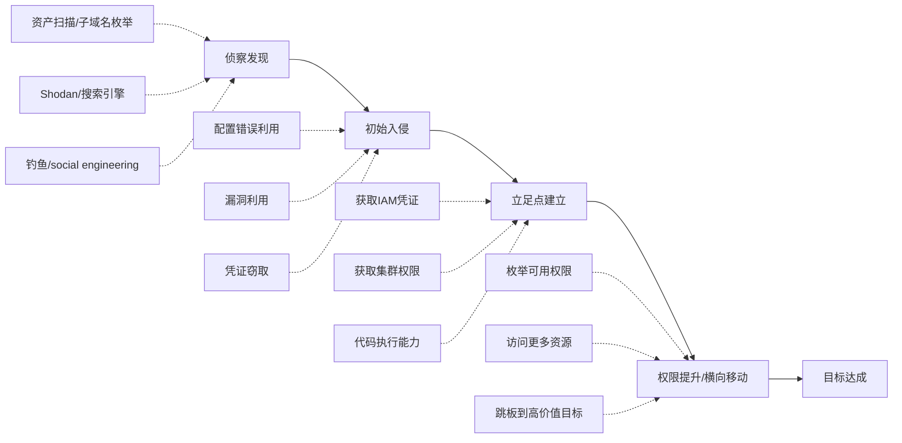
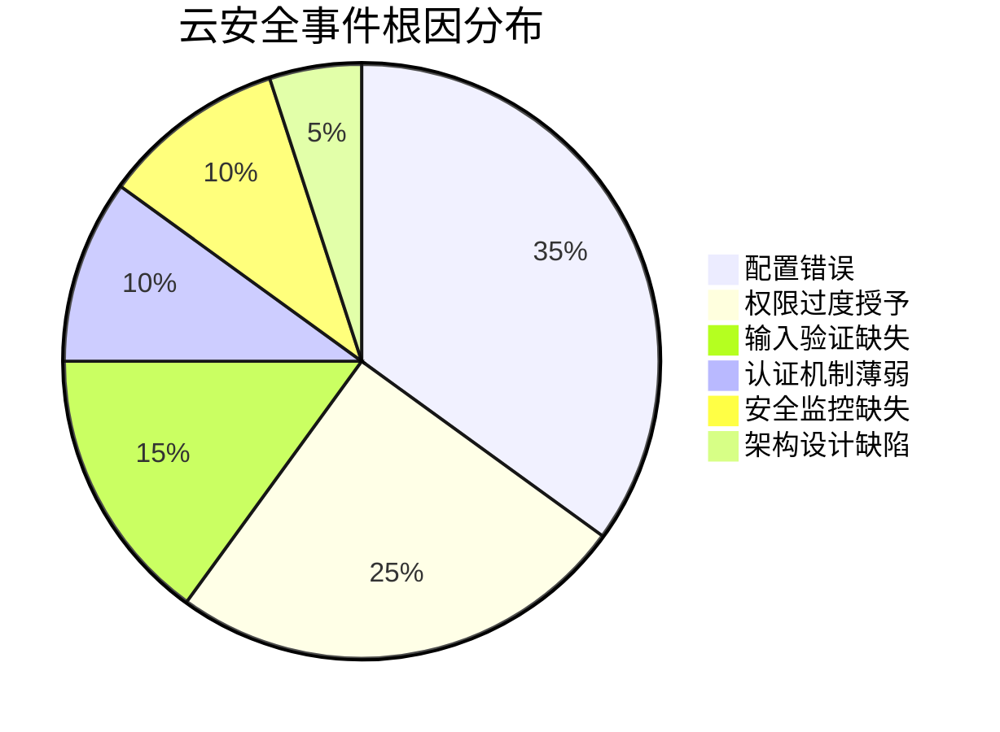
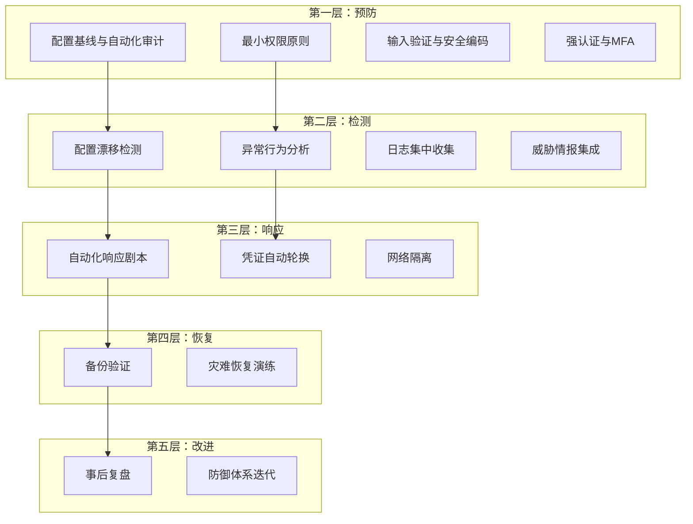
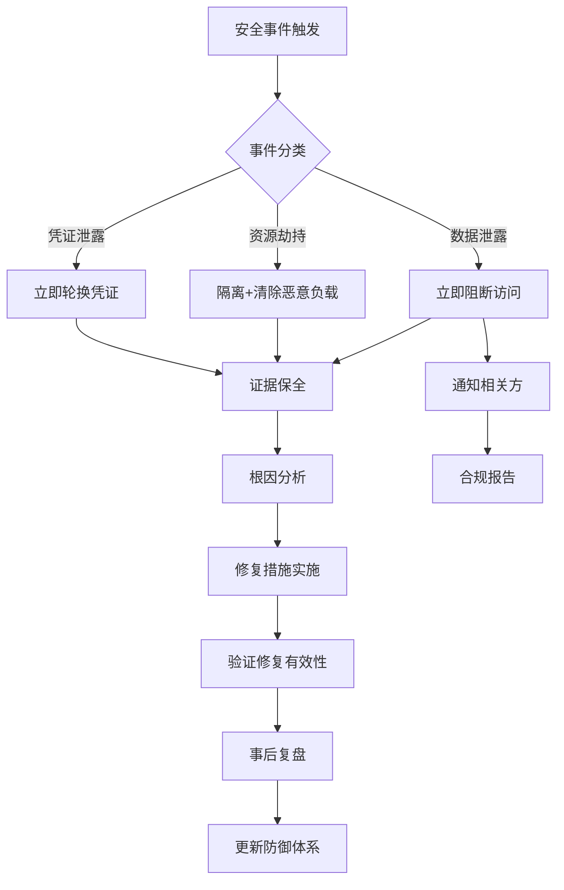

## 本节小结

本节通过五个真实场景的云安全实战案例，覆盖了云计算环境中最常见的攻击面：存储服务、元数据服务、容器编排平台、身份权限管理、无服务器架构。每个案例都展示了从初始入侵到最终影响的完整攻击链，以及从根因分析到长期加固的完整修复路径。本节将对这五个案例进行横向对比分析，提炼共性规律，建立系统化的云安全防御思维。

### 五个案例全景回顾

在深入分析之前，先用一张表格回顾每个案例的核心要素：

| 维度 | 案例一：S3数据泄露 | 案例二：元数据SSRF | 案例三：K8s挖矿 | 案例四：IAM横向移动 | 案例五：Serverless注入 |
|------|-------------------|-------------------|-----------------|--------------------|-----------------------|
| **攻击入口** | 公开的S3 Bucket | Web应用SSRF漏洞 | 公网暴露的Dashboard | 钓鱼邮件获取凭证 | API参数命令注入 |
| **核心技术** | ACL配置读取 | IMDSv1凭证获取 | 弱密码爆破 | IAM策略枚举 | Shell命令拼接 |
| **横向移动** | 无（直接访问） | IAM凭证→S3 | DaemonSet全节点部署 | S3→Secrets→数据库 | 环境变量→AWS服务 |
| **最终影响** | 500万客户数据泄露 | 数据库备份泄露 | 全集群挖矿 | 生产数据库沦陷 | Lambda环境凭证泄露 |
| **根因层次** | 配置层 | 应用层+实例层+IAM层 | 网络层+认证层+RBAC层 | IAM层+管理层 | 代码层+IAM层 |
| **修复复杂度** | 低（配置变更） | 中（多层修复） | 高（架构调整） | 中（策略重构） | 中（代码+权限） |

### 攻击链共性模式分析

五个案例虽然攻击对象不同，但攻击链结构高度相似。将其抽象为统一的攻击模式：

**模式一：配置错误→直接暴露（案例一）**

这是最简单也最常见的攻击路径。攻击者无需任何漏洞利用技术，仅凭公开可访问的存储桶就能获取大量敏感数据。根据Gartner的预测，到2025年99%的云安全失败将由用户配置错误造成。案例一中，S3 Bucket的ACL被设置为AllUsers可读，且未启用Block Public Access、未配置加密、未开启访问日志——这些全部是配置层面的问题，任何一个被正确配置都能阻止或至少减缓攻击。

**模式二：漏洞+凭证链式利用（案例二、案例五）**

这类攻击的特点是单个漏洞不足以造成严重后果，但通过链式组合形成完整的攻击路径。案例二中，SSRF漏洞本身危害有限，但结合IMDSv1无需认证的特性，再配合过度授权的IAM角色，就形成了"SSRF→元数据→IAM凭证→S3数据"的完整链条。案例五同理，命令注入漏洞配合Lambda执行角色的AWS凭证，形成了"注入→环境变量→AWS凭证→横向访问"的链条。

**模式三：弱认证→集群级控制（案例三）**

这类攻击利用了认证机制的薄弱环节。暴露在公网的Kubernetes Dashboard加上弱密码，使得攻击者直接获得集群管理权限。一旦进入集群内部，攻击者利用RBAC过度授权和缺失的镜像白名单，在每个节点部署挖矿程序，实现了"弱认证→管理员权限→全集群控制"的攻击路径。

**模式四：凭证泄露→权限滥用（案例四）**

这类攻击的起点是凭证泄露（钓鱼），但真正的破坏力来自于IAM权限配置不当。开发人员账户被授予了AdministratorAccess策略，使得攻击者可以枚举所有IAM用户和角色、访问所有S3 Bucket、调用Lambda函数、获取Secrets Manager中的生产数据库凭证。这暴露了一个关键问题：凭证泄露不可避免，但权限配置决定了泄露的影响范围。

### 根因深度分析：五个案例的共同缺陷

通过对五个案例的根因进行聚类分析，可以识别出六类反复出现的根本缺陷：

**缺陷一：配置错误（影响案例一、三）**

配置错误是云安全事件中出现频率最高的根因。在案例一中，S3 Bucket的ACL被误设为公开读取；在案例三中，Kubernetes Dashboard被暴露在公网。这类错误的共同特征是：默认配置不安全、变更缺乏审批流程、缺少配置漂移检测。

配置错误之所以如此普遍，有三个深层原因：

1. **云服务的复杂性**：仅AWS S3就有超过50个可配置的安全参数，IAM策略的Condition元素有数十种变体。人工配置如此多的参数，出错概率极高。
2. **DevOps速度与安全的矛盾**：快速迭代的文化下，开发人员倾向于选择最宽松的配置以快速实现功能，安全加固被推迟到"以后"——但"以后"往往不会到来。
3. **缺乏配置基线**：很多组织没有定义"安全配置基线"，开发人员不知道什么是安全的配置，只能凭经验或文档（如果他们读了的话）进行配置。

**缺陷二：权限过度授予（影响案例一、二、三、四、五）**

这是所有五个案例共同存在的问题。案例一中的S3 Bucket对所有人可读；案例二中的webapp-role拥有超出必要的S3读取权限；案例三中管理员账户RBAC权限过大；案例四中开发人员被授予AdministratorAccess；案例五中Lambda角色拥有过多的AWS服务访问权限。

过度授权的根本原因在于"宁可多给不可少给"的心态——权限不足会导致功能异常，而权限过多的后果是隐性的、不会立即显现的。这种不对称的激励结构导致权限不断膨胀。AWS IAM Access Analyzer的数据表明，典型的AWS账户中，超过90%的IAM权限从未被使用过。

**缺陷三：输入验证缺失（影响案例二、五）**

案例二的URL预览功能未验证目标地址是否指向内网或元数据服务；案例五直接将用户输入拼接到shell命令中。这类漏洞属于传统的Web安全问题，但在云环境中被放大——因为云环境中的服务通常拥有访问其他云资源的凭证，一个输入验证漏洞可能成为访问整个云环境的跳板。

**缺陷四：认证机制薄弱（影响案例三）**

Kubernetes Dashboard使用弱密码且未启用多因素认证，暴露在公网的管理接口缺乏足够的认证保护。这类问题在云原生环境中尤为突出，因为Kubernetes、Docker API、etcd等组件都提供了管理接口，如果这些接口的认证配置不当，攻击者可以直接获取基础设施的控制权。

**缺陷五：安全监控缺失（影响案例一、四）**

案例一中未配置S3访问日志，无法追溯数据是否已被他人访问；案例四中异常的API调用（开发人员账户访问生产数据库）未被及时发现。缺乏监控意味着即使发生了安全事件，组织也无法在第一时间感知和响应，事件发现时间可能延迟数周甚至数月。IBM的数据显示，2023年数据泄露的平均发现时间为204天。

**缺陷六：架构设计缺陷（影响案例二）**

案例二中使用IMDSv1（无需额外认证即可访问元数据服务）属于架构层面的设计缺陷。AWS在2019年引入IMDSv2正是为了解决IMDSv1的安全问题，但很多存量实例仍在使用IMDSv1。架构层面的缺陷修复成本最高，往往需要重新设计和部署。

### 攻击手法与MITRE ATT&CK Cloud映射

将五个案例的攻击手法映射到MITRE ATT&CK Cloud Matrix，帮助安全团队建立标准化的威胁认知：

| ATT&CK战术 | 案例一 | 案例二 | 案例三 | 案例四 | 案例五 |
|------------|--------|--------|--------|--------|--------|
| **侦察（Reconnaissance）** | 子域名枚举 | — | Shodan扫描 | — | API探测 |
| **初始访问（Initial Access）** | 公开存储桶 | SSRF漏洞 | Dashboard弱密码 | 钓鱼邮件 | 命令注入漏洞 |
| **执行（Execution）** | — | — | K8s API调用 | — | Lambda Shell执行 |
| **权限提升（Privilege Escalation）** | — | IAM凭证获取 | Dashboard管理员 | AdministratorAccess | Lambda执行角色 |
| **防御规避（Defense Evasion）** | — | — | 伪装DaemonSet名称 | — | — |
| **凭证访问（Credential Access）** | — | IMDSv1凭证获取 | — | Secrets Manager | 环境变量读取 |
| **发现（Discovery）** | Bucket内容列举 | S3 Bucket枚举 | 命名空间浏览 | IAM策略枚举 | 环境变量侦察 |
| **横向移动（Lateral Movement）** | — | 元数据→S3 | 节点间部署 | 账户→生产环境 | Lambda→AWS服务 |
| **数据窃取（Exfiltration）** | CSV文件下载 | 数据库备份下载 | — | 数据库直接访问 | — |
| **影响（Impact）** | 数据泄露 | 数据泄露 | 资源劫持（挖矿） | 数据泄露 | 凭证泄露 |

从映射表可以看出，**凭证访问**和**横向移动**是云环境中最普遍的战术——五个案例中有四个涉及凭证获取，三个涉及横向移动。这与传统网络攻击中以漏洞利用为核心有显著区别，云环境中的攻击更依赖于配置和权限的利用。

### 防御体系框架：从案例中提炼的安全架构

基于五个案例的教训，可以构建一个五层防御体系：

**第一层：预防——在攻击发生前消除风险**

| 防御措施 | 对应案例 | 具体实施 |
|----------|----------|----------|
| 配置基线与自动化审计 | 案例一、三 | 使用AWS Config、Azure Policy、GCP Security Command Center定义和强制执行安全配置基线。例如，所有S3 Bucket必须启用Block Public Access、加密和访问日志 |
| 最小权限原则 | 全部五个案例 | 每个IAM角色、服务账户、Kubernetes SA都应遵循最小权限原则。使用AWS IAM Access Analyzer定期审计未使用的权限并回收 |
| 输入验证与安全编码 | 案例二、五 | 实施安全编码规范，使用参数化API而非字符串拼接，对所有用户输入进行白名单验证 |
| 强认证与MFA | 案例三 | 所有管理接口强制MFA，Kubernetes API Server使用证书+OIDC双重认证，禁用密码认证 |

**第二层：检测——在攻击进行中及时发现**

| 检测能力 | 对应案例 | 具体实施 |
|----------|----------|----------|
| 配置漂移检测 | 案例一 | 部署AWS Config Rules实时监控S3 Bucket配置变更，配置变更触发SNS告警 |
| 异常行为分析 | 案例四 | 使用AWS GuardDuty、Azure Sentinel建立IAM行为基线，检测异常的API调用模式（如开发账户访问生产资源） |
| 日志集中收集 | 案例一、四 | 所有云服务的日志统一发送到SIEM（如Splunk、ELK），配置告警规则检测已知攻击模式 |
| 元数据访问监控 | 案例二 | 监控对169.254.169.254的访问请求，非预期的来源访问立即告警 |

**第三层：响应——在攻击发生后快速处置**

| 响应能力 | 对应案例 | 具体实施 |
|----------|----------|----------|
| 自动化响应剧本 | 案例三 | 预定义安全事件响应剧本，例如：检测到挖矿Pod→自动隔离节点→删除恶意工作负载→通知安全团队 |
| 凭证自动轮换 | 案例二、四、五 | 一旦检测到凭证泄露，自动轮换所有相关凭证。使用AWS Secrets Manager的自动轮换功能 |
| 网络隔离 | 案例三 | 检测到入侵后，自动通过Security Group或Network Policy隔离受影响的实例/Pod |

### 从攻击者视角看防御优先级

如果从攻击者的ROI（投入产出比）角度来评估防御优先级，配置错误的防御投入产出比最高——因为攻击成本极低（甚至为零），而防御措施相对简单（配置变更+自动化审计）。反过来，复杂漏洞利用的攻击成本较高，防御优先级可以适当降低。

基于此逻辑，防御优先级排序如下：

1. **S3/存储服务安全配置**（案例一）：投入低、影响大、出现频率高
2. **IAM权限治理**（案例四）：投入中、影响大、是横向移动的关键瓶颈
3. **元数据服务加固（IMDSv2）**（案例二）：投入低、能阻断整条攻击链
4. **管理接口认证加固**（案例三）：投入中、能防止集群级沦陷
5. **安全编码规范**（案例五）：投入高、但能从根本上消除代码层漏洞

### 五个案例的量化影响对比

理解安全事件的实际代价，有助于为安全投入建立商业论证：

| 指标 | 案例一：S3泄露 | 案例二：SSRF | 案例三：K8s挖矿 | 案例四：IAM移动 | 案例五：Serverless |
|------|---------------|-------------|----------------|----------------|-------------------|
| **受影响用户数** | 500万+ | 公司内部 | 集群全节点 | 生产环境 | Lambda环境 |
| **数据泄露量** | TB级 | GB级 | 无（算力劫持） | 数据库级别 | 环境变量级别 |
| **直接经济损失** | 合规罚款+诉讼 | 数据恢复成本 | 云账单暴涨 | 数据恢复+通知成本 | 漏洞修复成本 |
| **间接损失** | 品牌声誉 | 客户信任 | 业务中断 | 客户信任 | 开发效率 |
| **事件响应周期** | 数周 | 数天 | 数小时 | 数天 | 数天 |
| **合规影响** | GDPR/PCI DSS | SOC 2 | — | GDPR | — |

案例一的影响最为严重：500万客户的敏感数据泄露不仅面临巨额合规罚款（GDPR最高可达全球营收的4%），还面临集体诉讼和品牌声誉的长期损害。这解释了为什么存储服务的安全配置应当是防御优先级的首位。

### 云安全事件响应流程标准化

从五个案例的修复过程中，可以提炼出标准化的云安全事件响应流程：

**响应步骤详解：**

1. **事件分类（0-15分钟）**：根据告警信息快速判断事件类型——数据泄露、资源劫持、凭证泄露、服务中断等。不同类型需要不同的响应路径。
2. **即时遏制（15-60分钟）**：根据事件类型执行即时遏制措施。数据泄露→阻断公开访问；资源劫持→隔离+清除恶意负载；凭证泄露→轮换凭证。遏制措施的目标是阻止损害扩大，而非彻底修复。
3. **证据保全（1-4小时）**：在遏制的同时或之后，收集和保存证据——快照受影响的实例、导出相关日志、保存网络流量记录。证据保全对于事后分析和可能的法律程序至关重要。
4. **根因分析（1-3天）**：深入分析攻击路径、利用的漏洞/配置错误、影响范围。根因分析应当回答：攻击者如何进入？利用了什么缺陷？访问了什么数据？横向移动到了哪里？
5. **修复实施（1-5天）**：根据根因分析结果实施修复措施。修复应当包括即时修复（消除当前风险）和长期加固（防止同类事件再次发生）。
6. **验证与复盘（1-2周）**：验证修复措施的有效性，进行事后复盘，更新安全策略和响应流程。

### 给安全从业者的实战建议

基于五个案例的经验教训，总结以下可直接落地的实战建议：

**针对防御方（蓝队）：**

1. **从Day 1就启用云安全配置审计**：不要等到出了事才配置AWS Config或Azure Policy。在云环境创建之初就定义安全基线并强制执行。
2. **实施IAM权限审查的自动化**：每季度使用IAM Access Analyzer扫描一次所有IAM策略，回收未使用的权限。对于开发人员账户，使用Permission Boundary限制最大权限。
3. **强制IMDSv2**：在所有EC2实例上强制使用IMDSv2，这是阻断SSRF→元数据攻击链的最有效手段。
4. **网络分段与零信任**：不要依赖网络边界作为唯一的安全控制。在云环境中，实施安全组、网络ACL、Kubernetes Network Policy等多层网络控制，每个服务只开放必要的端口和协议。
5. **建立安全监控的"三个支柱"**：日志（CloudTrail/Azure Activity Log）、指标（CloudWatch/Prometheus）、告警（GuardDuty/Sentinel），三者缺一不可。

**针对攻击方（红队/渗透测试）：**

1. **从配置错误入手**：在云环境渗透测试中，优先检查存储服务公开访问、IAM过度授权、管理接口暴露等配置问题。这些是最容易发现且影响最大的攻击面。
2. **关注元数据服务**：如果发现了Web应用的SSRF漏洞，立即尝试访问169.254.169.254获取IAM凭证。这是云环境中最有价值的"漏洞放大器"。
3. **枚举权限是关键**：获取到IAM凭证后，花时间枚举所有可用权限。`aws sts get-caller-identity`、`aws iam list-attached-user-policies`、`aws iam simulate-principal-policy`是最重要的三个命令。
4. **注意安全工具的检测**：在红队演练中，注意GuardDuty、CloudTrail等安全工具的检测能力。了解哪些操作会触发告警，有助于评估组织的检测能力。

### 延伸学习路径

本节的五个案例覆盖了云安全的核心攻击面，但云安全是一个持续演进的领域。以下是推荐的延伸学习方向：

| 学习方向 | 推荐资源 | 适用阶段 |
|----------|----------|----------|
| AWS安全专项 | AWS Security Specialty认证备考材料 | 入门→进阶 |
| Kubernetes安全 | CKS（Certified Kubernetes Security Specialist）认证 | 进阶 |
| 云安全攻防实战 | Pacu（AWS攻击框架）、CloudGoat（AWS靶场） | 实操 |
| 云安全架构设计 | CSA Cloud Controls Matrix、NIST SP 800-210 | 架构设计 |
| 云原生安全 | CNCF Cloud Native Security Whitepaper | 综合 |
| 持续跟踪 | Wiz Research Blog、Lightspin Blog、Orca Security Blog | 日常 |

下一节将讨论云安全中的常见误区，帮助读者识别和避免在云安全实践中容易陷入的认知陷阱。
