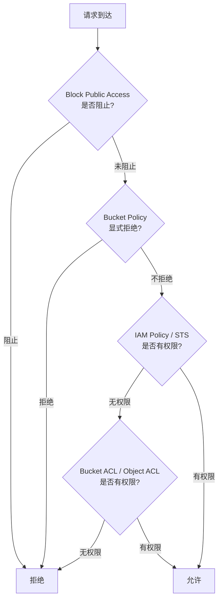

## 12.2.2 存储桶安全配置审查

对象存储（Object Storage）是云计算中使用最广泛的服务之一，AWS S3、阿里云 OSS、Azure Blob Storage、GCP Cloud Storage、MinIO 等几乎承载了互联网上大量的静态资源、日志数据、备份文件和敏感信息。正因如此，存储桶（Bucket）长期位居云安全事件攻击向量的前列——一个公开可写的桶可能在数分钟内被自动化扫描器发现并植入恶意内容，一个公开可读的桶可能泄露数百万用户数据。

本节从权限模型原理出发，逐层剖析存储桶的安全配置要素，给出跨云平台的审查方法、自动化审计工具链和加固流程。

---

### 存储桶安全的重要性：真实事件回顾

在深入技术细节之前，先看几个公开的安全事件，理解存储桶配置错误的真实后果：

| 时间 | 事件 | 影响 |
|------|------|------|
| 2017 | 美国国防部承包商公开 S3 桶 | 泄露 18 亿条公民敏感记录（姓名、地址、电话） |
| 2017 | Verizon 客户数据泄露 | 600 万用户个人信息因第三方 S3 桶公开而泄露 |
| 2019 | Capital One 数据泄露 | 1 亿用户信用卡申请数据被窃取（IAM 策略过宽+SSRF） |
| 2021 | Facebook 5.33 亿用户数据泄露 | 海量用户数据在公开存储桶中被发现 |
| 2023 | 某大型 AI 公司训练数据泄露 | 训练数据集因 S3 桶策略配置错误被公开访问 |

这些事件的共同点：**不是被高级攻破，而是配置错误导致的低级失误**。存储桶安全审查的目标就是在攻击者之前发现并修复这些问题。

---

### 对象存储权限模型深度解析

要审查存储桶安全，必须先理解其权限模型。以 AWS S3 为例（其他云平台原理类似），存储桶访问控制涉及四个层次：



#### 第一层：Block Public Access（公共访问阻止）

这是 2018 年 AWS 引入的安全网，提供四个独立开关：

| 设置项 | 作用 | 推荐值 |
|--------|------|--------|
| `BlockPublicAcls` | 阻止通过 ACL 设置公开访问 | ✅ 启用 |
| `IgnorePublicAcls` | 忽略已有的公开 ACL 设置 | ✅ 启用 |
| `BlockPublicPolicy` | 阻止包含 `Principal: "*"` 的 Bucket Policy | ✅ 启用 |
| `RestrictPublicBuckets` | 限制对公开资源的访问仅限于同一 AWS 账户 | ✅ 启用 |

审查命令：

```bash
# AWS - 查看 Block Public Access 设置
aws s3api get-public-access-block --bucket my-bucket

# 一键开启全部阻止（加固）
aws s3api put-public-access-block --bucket my-bucket \
    --public-access-block-configuration \
    "BlockPublicAcls=true,IgnorePublicAcls=true,BlockPublicPolicy=true,RestrictPublicBuckets=true"
```

```bash
# 阿里云 OSS - 查看 Bucket 授权策略
ossutil stat oss://my-bucket
# 检查是否有 "public-read" 或 "public-read-write" ACL

# 设置为私有
ossutil acl oss://my-bucket --method put --acl private
```

```bash
# MinIO - 检查桶策略
mc anonymous get myminio/my-bucket

# 设置为私有
mc anonymous set none myminio/my-bucket
```

#### 第二层：Bucket Policy（桶策略）

桶策略是 JSON 格式的访问控制策略，类似于 IAM Policy，但作用于桶级别。这是最常见也是最危险的配置错误来源。

**危险的策略模式及分析：**

```json
// ❌ 模式1：完全公开读取
{
    "Version": "2012-10-17",
    "Statement": [
        {
            "Sid": "PublicRead",
            "Effect": "Allow",
            "Principal": "*",           // ← 危险：任何人
            "Action": "s3:GetObject",   // ← 可以读取
            "Resource": "arn:aws:s3:::my-bucket/*"  // ← 所有对象
        }
    ]
}
```

```json
// ❌ 模式2：公开写入（更危险）
{
    "Version": "2012-10-17",
    "Statement": [
        {
            "Sid": "PublicWrite",
            "Effect": "Allow",
            "Principal": "*",
            "Action": "s3:PutObject",
            "Resource": "arn:aws:s3:::my-bucket/*"
        }
    ]
}
```

```json
// ❌ 模式3：条件过于宽泛
{
    "Version": "2012-10-17",
    "Statement": [
        {
            "Sid": "TooBroad",
            "Effect": "Allow",
            "Principal": "*",
            "Action": "s3:*",
            "Resource": [
                "arn:aws:s3:::my-bucket",
                "arn:aws:s3:::my-bucket/*"
            ]
        }
    ]
}
```

```json
// ✅ 正确模式：最小权限原则
{
    "Version": "2012-10-17",
    "Statement": [
        {
            "Sid": "AllowSpecificAccount",
            "Effect": "Allow",
            "Principal": {
                "AWS": "arn:aws:iam::123456789012:root"
            },
            "Action": [
                "s3:GetObject",
                "s3:ListBucket"
            ],
            "Resource": [
                "arn:aws:s3:::my-bucket",
                "arn:aws:s3:::my-bucket/*"
            ],
            "Condition": {
                "StringEquals": {
                    "aws:PrincipalOrgID": "o-xxxxxxxxxx"
                }
            }
        }
    ]
}
```

审查 Bucket Policy 的关键检查点：

```bash
# 获取策略
aws s3api get-bucket-policy --bucket my-bucket --output text

# 解析并检查是否存在 Principal: "*"
aws s3api get-bucket-policy --bucket my-bucket --output text | \
    python3 -c "
import json, sys
policy = json.loads(sys.stdin.read())
for stmt in policy.get('Statement', []):
    principal = stmt.get('Principal', {})
    if principal == '*' or principal.get('AWS') == '*':
        effect = stmt.get('Effect', '')
        action = stmt.get('Action', '')
        print(f'⚠️  发现公开策略: Effect={effect}, Action={action}, Principal=*')
"
```

#### 第三层：IAM Policy（身份策略）

即使 Bucket Policy 本身不公开，IAM Policy 可能通过以下方式间接导致数据泄露：

- 用户被授予 `s3:*` 或 `s3:GetObject` 到所有桶（`Resource: "*"`）
- 角色信任策略过宽，允许外部账户 assume
- EC2 实例配置了过于宽松的 Instance Profile

```bash
# 查找所有拥有 S3 权限的 IAM 策略
aws iam list-policies --scope Local --query \
    'Policies[?contains(PolicyName, `S3`) || contains(PolicyName, `s3`)].[PolicyName,Arn]' \
    --output table

# 检查特定策略的详细内容
aws iam get-policy-version --policy-arn arn:aws:iam::123456789012:policy/MyPolicy \
    --version-id v1
```

#### 第四层：ACL（访问控制列表）

ACL 是 S3 最早的访问控制机制，目前已被 Bucket Policy 和 IAM 取代，但遗留系统中仍然常见。ACL 支持以下预设权限：

| ACL 名称 | 桶权限 | 对象权限 | 安全等级 |
|----------|--------|----------|----------|
| `private` | 无 | 无 | ✅ 安全 |
| `public-read` | READ | READ | ❌ 危险 |
| `public-read-write` | READ + WRITE | READ + WRITE | 🔴 极度危险 |
| `authenticated-read` | READ（仅 AWS 认证用户） | READ（仅 AWS 认证用户） | ⚠️ 注意 |
| `log-delivery-write` | WRITE + READ_ACP | 无 | 特殊用途 |

```bash
# 检查 Bucket ACL
aws s3api get-bucket-acl --bucket my-bucket

# 检查对象 ACL
aws s3api get-object-acl --bucket my-bucket --key sensitive-file.txt

# 批量检查所有对象的 ACL（使用 AWS CLI + jq）
aws s3api list-objects-v2 --bucket my-bucket --query 'Contents[].Key' --output json | \
    jq -r '.[]' | while read key; do
        acl=$(aws s3api get-object-acl --bucket my-bucket --key "$key" 2>/dev/null)
        if echo "$acl" | jq -e '.Grants[] | select(.Grantee.URI == "http://acs.amazonaws.com/groups/global/AllUsers")' >/dev/null 2>&1; then
            echo "⚠️  公开对象: $key"
        fi
    done
```

---

### 多云平台安全配置对比

不同云平台的对象存储在安全配置上有相似但不完全相同的机制。以下是主要平台的对比：

| 安全要素 | AWS S3 | 阿里云 OSS | Azure Blob | GCP Storage | MinIO |
|----------|--------|------------|------------|-------------|-------|
| 默认访问控制 | 私有 | 私有 | 私有 | 私有 | 私有 |
| 公开访问阻止 | Block Public Access | 无（需手动管理） | 网络规则 | Uniform Access | 无（需策略控制） |
| 策略语言 | JSON (IAM) | RAM Policy | RBAC + SAS | IAM JSON | JSON（S3 兼容） |
| 加密默认 | AES-256 (SSE-S3) | AES-256 (SSE-KMS) | AES-256 | AES-256 | 取决于配置 |
| 版本控制 | 支持 | 支持 | 支持（软删除） | 支持 | 支持 |
| 访问日志 | S3 Access Logging | OSS Logging | Storage Analytics | Audit Logs | 支持 |
| 临时授权 | Presigned URL | STS + 签名 URL | SAS Token | Signed URL | Presigned URL |

#### 阿里云 OSS 安全审查

```bash
# 检查 Bucket ACL
ossutil stat oss://my-bucket | grep -i acl

# 检查 RAM Policy 中的公开策略
aliyun ram ListPolicies --PolicyType Custom

# 检查 Bucket 是否开启了服务端加密
ossutil stat oss://my-bucket | grep -i encryption

# 检查是否开启版本控制
ossutil bucket-versioning --method get oss://my-bucket
```

#### Azure Blob Storage 安全审查

```bash
# 检查容器的公共访问级别
az storage container show \
    --name my-container \
    --account-name mystorageaccount \
    --query 'publicAccess'

# 检查存储帐户的网络规则
az storage account show \
    --name mystorageaccount \
    --resource-group myResourceGroup \
    --query 'networkRuleSet'

# 检查是否启用软删除
az storage account blob-service-properties show \
    --account-name mystorageaccount \
    --query 'deleteRetentionPolicy'
```

#### MinIO 安全审查

```bash
# 检查桶策略
mc anonymous get myminio/my-bucket

# 检查桶是否开启了加密
mc encrypt info myminio/my-bucket

# 检查桶版本控制
mc version info myminio/my-bucket

# 检查服务端配置
mc admin config get myminio api
```

---

### 存储桶安全审查完整清单

以下是涵盖所有关键维度的审查清单：

#### 基础配置审查

| 检查项 | 安全要求 | AWS 检查命令 | 风险等级 |
|--------|----------|-------------|----------|
| Block Public Access | 全部 4 项开启 | `aws s3api get-public-access-block --bucket BUCKET` | 🔴 高 |
| Bucket Policy | 无 `Principal: *` 的 Allow | `aws s3api get-bucket-policy --bucket BUCKET` | 🔴 高 |
| Bucket ACL | `private` | `aws s3api get-bucket-acl --bucket BUCKET` | 🔴 高 |
| 版本控制 | 已启用 | `aws s3api get-bucket-versioning --bucket BUCKET` | 🟡 中 |
| 默认加密 | 已启用（SSE-S3 或 SSE-KMS） | `aws s3api get-bucket-encryption --bucket BUCKET` | 🔴 高 |
| 访问日志 | 已启用 | `aws s3api get-bucket-logging --bucket BUCKET` | 🟡 中 |

#### 高级安全配置审查

| 检查项 | 安全要求 | AWS 检查命令 | 风险等级 |
|--------|----------|-------------|----------|
| Object Lock | 对合规数据启用 | `aws s3api get-object-lock-configuration --bucket BUCKET` | 🟡 中 |
| 跨区域复制 | 关键数据配置 CRR | `aws s3api get-bucket-replication --bucket BUCKET` | 🟢 低 |
| 生命周期策略 | 已配置 | `aws s3api get-bucket-lifecycle-configuration --bucket BUCKET` | 🟡 中 |
| 传输加密 | 强制 TLS | 检查 Bucket Policy 中是否有 `aws:SecureTransport` 条件 | 🔴 高 |
| 事件通知 | 监控敏感操作 | `aws s3api get-bucket-notification-configuration --bucket BUCKET` | 🟡 中 |
| CORS 配置 | 限制允许的域 | `aws s3api get-bucket-cors --bucket BUCKET` | 🟡 中 |

#### 一键审查脚本

以下脚本对单个 Bucket 执行完整安全审查：

```bash
#!/bin/bash
# s3-security-audit.sh - S3 桶安全审查脚本
# 用法: ./s3-security-audit.sh <bucket-name>

BUCKET="$1"
if [ -z "$BUCKET" ]; then
    echo "用法: $0 <bucket-name>"
    exit 1
fi

echo "========================================="
echo "S3 安全审查: $BUCKET"
echo "========================================="
echo ""

# 1. Block Public Access
echo "[1/8] Block Public Access 配置:"
aws s3api get-public-access-block --bucket "$BUCKET" 2>/dev/null | \
    python3 -c "
import json, sys
try:
    cfg = json.loads(sys.stdin.read())['PublicAccessBlockConfiguration']
    for k, v in cfg.items():
        status = '✅' if v else '❌'
        print(f'  {status} {k}: {v}')
except:
    print('  ❌ 未配置 Block Public Access')
"
echo ""

# 2. Bucket Policy
echo "[2/8] Bucket Policy 分析:"
aws s3api get-bucket-policy --bucket "$BUCKET" --output text 2>/dev/null | \
    python3 -c "
import json, sys
try:
    policy = json.loads(sys.stdin.read())
    issues = []
    for stmt in policy.get('Statement', []):
        principal = stmt.get('Principal', {})
        if principal == '*' or (isinstance(principal, dict) and principal.get('AWS') == '*'):
            effect = stmt.get('Effect', 'Unknown')
            action = stmt.get('Action', 'Unknown')
            issues.append(f'  ❌ Effect={effect}, Action={action}, Principal=*')
    if issues:
        for i in issues:
            print(i)
    else:
        print('  ✅ 未发现公开访问策略')
except:
    print('  ✅ 未配置 Bucket Policy')
"
echo ""

# 3. Bucket ACL
echo "[3/8] Bucket ACL:"
aws s3api get-bucket-acl --bucket "$BUCKET" | \
    python3 -c "
import json, sys
acl = json.loads(sys.stdin.read())
for grant in acl.get('Grants', []):
    grantee = grant.get('Grantee', {})
    uri = grantee.get('URI', '')
    permission = grant.get('Permission', '')
    if 'AllUsers' in uri:
        print(f'  ❌ 公开权限: {permission} (AllUsers)')
    elif 'AuthenticatedUsers' in uri:
        print(f'  ⚠️  认证用户权限: {permission}')
print('  ✅ ACL 检查完成')
"
echo ""

# 4. 版本控制
echo "[4/8] 版本控制:"
aws s3api get-bucket-versioning --bucket "$BUCKET" | \
    python3 -c "
import json, sys
cfg = json.loads(sys.stdin.read())
status = cfg.get('Status', '未启用')
mfa = cfg.get('MFADelete', '未启用')
print(f'  状态: {status}')
print(f'  MFA Delete: {mfa}')
if status != 'Enabled':
    print('  ⚠️  建议启用版本控制以防止意外删除')
"
echo ""

# 5. 加密
echo "[5/8] 默认加密:"
aws s3api get-bucket-encryption --bucket "$BUCKET" 2>/dev/null | \
    python3 -c "
import json, sys
try:
    cfg = json.loads(sys.stdin.read())
    rules = cfg.get('ServerSideEncryptionConfiguration', {}).get('Rules', [])
    for rule in rules:
        algo = rule.get('ApplyServerSideEncryptionByDefault', {}).get('SSEAlgorithm', 'N/A')
        kms = rule.get('ApplyServerSideEncryptionByDefault', {}).get('KMSMasterKeyID', 'N/A')
        print(f'  ✅ 加密算法: {algo}')
        if kms != 'N/A':
            print(f'  ✅ KMS Key: {kms}')
except:
    print('  ❌ 未配置默认加密')
"
echo ""

# 6. 访问日志
echo "[6/8] 访问日志:"
aws s3api get-bucket-logging --bucket "$BUCKET" | \
    python3 -c "
import json, sys
cfg = json.loads(sys.stdin.read())
if 'LoggingEnabled' in cfg:
    target = cfg['LoggingEnabled'].get('TargetBucket', 'N/A')
    prefix = cfg['LoggingEnabled'].get('TargetPrefix', 'N/A')
    print(f'  ✅ 目标桶: {target}')
    print(f'  ✅ 前缀: {prefix}')
else:
    print('  ⚠️  未启用访问日志')
"
echo ""

# 7. 生命周期
echo "[7/8] 生命周期策略:"
aws s3api get-bucket-lifecycle-configuration --bucket "$BUCKET" 2>/dev/null | \
    python3 -c "
import json, sys
try:
    cfg = json.loads(sys.stdin.read())
    rules = cfg.get('Rules', [])
    if rules:
        for rule in rules:
            print(f'  规则: {rule.get(\"ID\", \"N/A\")} - Status: {rule.get(\"Status\", \"N/A\")}')
    else:
        print('  ⚠️  未配置生命周期策略')
except:
    print('  ⚠️  未配置生命周期策略')
"
echo ""

# 8. CORS
echo "[8/8] CORS 配置:"
aws s3api get-bucket-cors --bucket "$BUCKET" 2>/dev/null | \
    python3 -c "
import json, sys
try:
    cfg = json.loads(sys.stdin.read())
    rules = cfg.get('CORSRules', [])
    if rules:
        for rule in rules:
            origins = rule.get('AllowedOrigins', [])
            for origin in origins:
                if origin == '*':
                    print(f'  ❌ CORS 允许所有来源: {origins}')
                else:
                    print(f'  ✅ CORS 允许来源: {origin}')
    else:
        print('  ✅ 未配置 CORS（默认安全）')
except:
    print('  ✅ 未配置 CORS（默认安全）')
"

echo ""
echo "========================================="
echo "审查完成"
echo "========================================="
```

---

### 自动化审计工具链

#### Prowler（推荐首选）

Prowler 是最全面的 AWS 安全评估工具，内置了大量 S3 相关检查规则：

```bash
# 安装
pip install prowler

# 运行所有 S3 相关检查
prowler aws --services s3

# 运行特定 S3 检查
prowler aws --checks \
    s3_bucket_public_access,\
    s3_bucket_policy_public,\
    s3_bucket_acl,\
    s3_bucket_encryption,\
    s3_bucket_versioning,\
    s3_bucket_logging

# 输出为 HTML 报告
prowler aws --services s3 --output-format html
```

Prowler 涵盖的 S3 检查项包括但不限于：
- `s3_bucket_public_access` — 检查 Block Public Access 配置
- `s3_bucket_policy_public` — 检查桶策略是否允许公开访问
- `s3_bucket_acl` — 检查 ACL 是否公开
- `s3_bucket_encryption` — 检查默认加密
- `s3_bucket_versioning` — 检查版本控制
- `s3_bucket_logging` — 检查访问日志
- `s3_bucket_object_lock` — 检查对象锁
- `s3_bucket_secure_transport` — 检查是否强制 TLS

#### ScoutSuite（多云审计）

ScoutSuite 支持 AWS、Azure、GCP、阿里云等多个平台：

```bash
# 安装
pip install scoutsuite

# AWS 审计
scout aws

# Azure 审计
scout azure --cli

# GCP 审计
scout gcp --user-account

# 审计完成后在浏览器中查看报告
# 输出位于 scout-report/ 目录
```

#### S3Scanner（公开桶扫描）

专门用于扫描互联网上公开的 S3 桶，适合从攻击者视角进行审查：

```bash
# 安装
go install github.com/sa7mon/S3Scanner@latest

# 扫描单个桶
s3scanner scan --bucket my-bucket

# 从文件批量扫描
s3scanner scan --buckets-file bucket-list.txt

# 扫描并检查权限
s3scanner scan --bucket my-bucket --dump-perms
```

#### cloudfox（攻击路径发现）

cloudfox 从攻击者视角发现云环境中的资产和攻击路径：

```bash
# 安装
go install github.com/BishopFox/cloudfox@latest

# 发现所有 S3 桶
cloudfox aws buckets --profile my-profile

# 发现可访问的 S3 资源
cloudfox aws permissions --profile my-profile --principal arn:aws:iam::123456789012:role/MyRole
```

#### 工具对比

| 工具 | 用途 | 多云支持 | 自动修复 | 适合场景 |
|------|------|----------|----------|----------|
| Prowler | 全面合规审计 | AWS为主 | 否 | 日常合规检查 |
| ScoutSuite | 多云安全审计 | AWS/Azure/GCP | 否 | 多云环境统一审计 |
| S3Scanner | 公开桶发现 | AWS/S3兼容 | 否 | 渗透测试/外部视角 |
| cloudfox | 攻击路径发现 | AWS | 否 | 红队/攻防演练 |
| aws cli | 精确配置检查 | AWS | 手动 | 定向深度检查 |

---

### 加固流程：从发现问题到修复

发现安全问题后的标准修复流程：

#### 第一步：评估影响范围

```bash
# 列出账户中所有 Bucket 的公开访问状态
aws s3api list-buckets --query 'Buckets[].Name' --output text | \
    tr '\t' '\n' | while read bucket; do
        status=$(aws s3api get-public-access-block --bucket "$bucket" 2>/dev/null)
        if [ $? -ne 0 ]; then
            echo "❌ $bucket - 未配置 Block Public Access"
        else
            echo "✅ $bucket - 已配置 Block Public Access"
        fi
    done
```

#### 第二步：应用修复

```bash
# 1. 开启 Block Public Access
aws s3api put-public-access-block --bucket my-bucket \
    --public-access-block-configuration \
    "BlockPublicAcls=true,IgnorePublicAcls=true,BlockPublicPolicy=true,RestrictPublicBuckets=true"

# 2. 删除公开的 Bucket Policy
aws s3api delete-bucket-policy --bucket my-bucket

# 3. 设置 ACL 为私有
aws s3api put-bucket-acl --bucket my-bucket --acl private

# 4. 启用默认加密
aws s3api put-bucket-encryption --bucket my-bucket \
    --server-side-encryption-configuration '{
        "Rules": [{"ApplyServerSideEncryptionByDefault": {"SSEAlgorithm": "AES256"}}]
    }'

# 5. 启用版本控制
aws s3api put-bucket-versioning --bucket my-bucket \
    --versioning-configuration Status=Enabled

# 6. 启用访问日志
aws s3api put-bucket-logging --bucket my-bucket \
    --bucket-logging-status '{
        "LoggingEnabled": {
            "TargetBucket": "my-logging-bucket",
            "TargetPrefix": "my-bucket/"
        }
    }'
```

#### 第三步：验证修复

```bash
# 重新运行审查脚本
./s3-security-audit.sh my-bucket
```

---

### Presigned URL 安全：常见误解与正确用法

Presigned URL 是一种常见的安全机制，但配置不当同样会导致问题：

**常见误解：** "使用了 Presigned URL 就是安全的"

**实际情况：**

```bash
# 生成一个 7 天有效的 Presigned URL（过长！）
aws s3 presign s3://my-bucket/sensitive-file.txt --expires-in 604800

# 推荐：设置合理的过期时间
aws s3 presign s3://my-bucket/sensitive-file.txt --expires-in 3600  # 1 小时
```

Presigned URL 的安全要点：
- **有效期**：应尽可能短，通常 15 分钟到 1 小时
- **传输**：必须通过 HTTPS 分发，HTTP 传输可被中间人截获
- **存储**：不要在日志、URL 参数、前端代码中记录 Presigned URL
- **IP 限制**：可以通过 Bucket Policy 限制 Presigned URL 的来源 IP

```json
// 限制 Presigned URL 来源 IP 的 Bucket Policy
{
    "Version": "2012-10-17",
    "Statement": [
        {
            "Sid": "RestrictPresignedURLSourceIP",
            "Effect": "Deny",
            "Principal": "*",
            "Action": "s3:GetObject",
            "Resource": "arn:aws:s3:::my-bucket/*",
            "Condition": {
                "NotIpAddress": {
                    "aws:SourceIp": "203.0.113.0/24"
                }
            }
        }
    ]
}
```

---

### VPC Endpoint 安全配置

通过 VPC Endpoint 访问 S3 可以避免数据经过公网，但需要正确配置 Endpoint Policy：

```json
// ✅ 限制 VPC Endpoint 只能访问特定 Bucket
{
    "Version": "2012-10-17",
    "Statement": [
        {
            "Sid": "AllowAccessToSpecificBucket",
            "Effect": "Allow",
            "Principal": "*",
            "Action": [
                "s3:GetObject",
                "s3:PutObject",
                "s3:ListBucket"
            ],
            "Resource": [
                "arn:aws:s3:::my-internal-bucket",
                "arn:aws:s3:::my-internal-bucket/*"
            ]
        }
    ]
}
```

```bash
# 检查 VPC Endpoint 的策略
aws ec2 describe-vpc-endpoints --filters "Name=service-name,Values=com.amazonaws.region.s3" \
    --query 'VpcEndpoints[].PolicyDocument'
```

---

### CORS 配置安全

错误的 CORS 配置可能导致跨域数据窃取：

```json
// ❌ 危险：允许所有来源
[
    {
        "AllowedHeaders": ["*"],
        "AllowedMethods": ["GET"],
        "AllowedOrigins": ["*"],      // ← 任何网站都可以跨域读取
        "ExposeHeaders": []
    }
]

// ✅ 正确：限制来源
[
    {
        "AllowedHeaders": ["Authorization"],
        "AllowedMethods": ["GET"],
        "AllowedOrigins": ["https://my-app.example.com"],
        "ExposeHeaders": ["ETag"],
        "MaxAgeSeconds": 3600
    }
]
```

```bash
# 检查 CORS 配置
aws s3api get-bucket-cors --bucket my-bucket

# 删除不安全的 CORS 配置
aws s3api delete-bucket-cors --bucket my-bucket
```

---

### 常见误区与纠正

#### 误区一："Bucket Policy 没有配置，就是安全的"

**纠正：** 未配置 Bucket Policy 不等于安全。ACL、IAM Policy、VPC Endpoint Policy 都可能提供访问权限。安全审查必须检查所有权限层。

#### 误区二："设置了 `public-read` ACL 是因为需要给 CDN 用"

**纠正：** CDN 应通过 Origin Access Identity (OAI) 或 Origin Access Control (OAC) 访问 S3，而不是让桶公开。AWS CloudFront 的正确配置：

```json
// Bucket Policy 只允许 CloudFront OAC 访问
{
    "Version": "2012-10-17",
    "Statement": [
        {
            "Sid": "AllowCloudFrontServicePrincipal",
            "Effect": "Allow",
            "Principal": {
                "Service": "cloudfront.amazonaws.com"
            },
            "Action": "s3:GetObject",
            "Resource": "arn:aws:s3:::my-bucket/*",
            "Condition": {
                "StringEquals": {
                    "AWS:SourceArn": "arn:aws:cloudfront::123456789012:distribution/EDFDVBD6EXAMPLE"
                }
            }
        }
    ]
}
```

#### 误区三："加密会增加成本和延迟，不值得"

**纠正：** SSE-S3 (AES-256) 是免费的，且对性能影响微乎其微（<1%）。SSE-KMS 虽然有少量成本和 API 调用开销，但提供了审计追踪能力。不加密的数据一旦泄露就是明文，后果远大于加密成本。

#### 误区四："开发/测试环境不需要安全配置"

**纠正：** 开发/测试环境经常包含真实或脱敏的生产数据，且安全配置通常更松散，是攻击者的首选入口。所有环境应执行相同的安全标准。

#### 误区五："只检查了 Bucket 级别的安全就够了"

**纠正：** 必须同时检查对象级别的权限。一个安全的桶中可能有个别对象通过 ACL 被设为公开：

```bash
# 列出所有公开对象
aws s3api list-objects-v2 --bucket my-bucket --query 'Contents[].Key' --output json | \
    jq -r '.[]' | while read key; do
        grants=$(aws s3api get-object-acl --bucket my-bucket --key "$key" --query 'Grants' 2>/dev/null)
        if echo "$grants" | grep -q "AllUsers"; then
            echo "⚠️  公开对象: $key"
        fi
    done
```

---

### 进阶：合规框架与存储桶安全

不同合规框架对存储桶安全有特定要求：

| 合规要求 | S3 相关配置 | 说明 |
|----------|------------|------|
| SOC 2 | 加密 + 访问日志 + 版本控制 | 完整的审计追踪 |
| PCI DSS | SSE-KMS + VPC Endpoint + TLS | 支付数据必须加密传输和存储 |
| HIPAA | SSE-KMS + Object Lock + 访问日志 | 医疗数据不可删除、完整审计 |
| GDPR | 加密 + 生命周期 + 删除策略 | 数据主体有权要求删除 |
| 等保 2.0 | 加密 + 访问控制 + 审计日志 | 国内合规要求 |

#### 自动化合规检查（AWS Config Rules）

```bash
# 创建 Config Rule 检查 S3 桶是否公开
aws configservice put-config-rule --config-rule '{
    "ConfigRuleName": "s3-bucket-public-read-prohibited",
    "Source": {
        "Owner": "AWS",
        "SourceIdentifier": "S3_BUCKET_PUBLIC_READ_PROHIBITED"
    }
}'

aws configservice put-config-rule --config-rule '{
    "ConfigRuleName": "s3-bucket-public-write-prohibited",
    "Source": {
        "Owner": "AWS",
        "SourceIdentifier": "S3_BUCKET_PUBLIC_WRITE_PROHIBITED"
    }
}'

aws configservice put-config-rule --config-rule '{
    "ConfigRuleName": "s3-bucket-server-side-encryption-enabled",
    "Source": {
        "Owner": "AWS",
        "SourceIdentifier": "S3_BUCKET_SERVER_SIDE_ENCRYPTION_ENABLED"
    }
}'
```

---

### 本节小结

存储桶安全配置审查的核心原则：

1. **最小权限原则**：只授予完成任务所需的最小权限，绝不使用 `Principal: "*"`
2. **纵深防御**：Block Public Access + Bucket Policy + IAM + ACL 多层控制
3. **默认加密**：所有存储桶必须启用服务端加密
4. **完整审计**：启用访问日志和 CloudTrail，记录所有操作
5. **自动化检查**：使用 Prowler 等工具定期审计，不要依赖人工检查
6. **CDN 专用路径**：通过 OAI/OAC 访问，而非公开桶
7. **持续监控**：配置 EventBridge 或 Config Rules 实时检测配置变更

存储桶安全不是一次性工作，而是持续的过程。将审查集成到 CI/CD 管道中，在部署流水线中加入安全检查，确保每次变更都不会引入新的安全风险。
