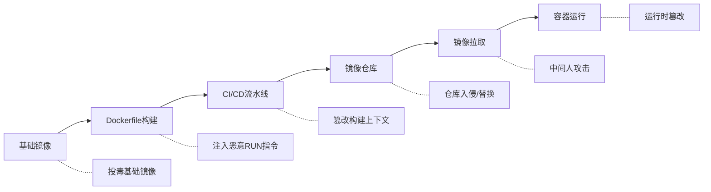
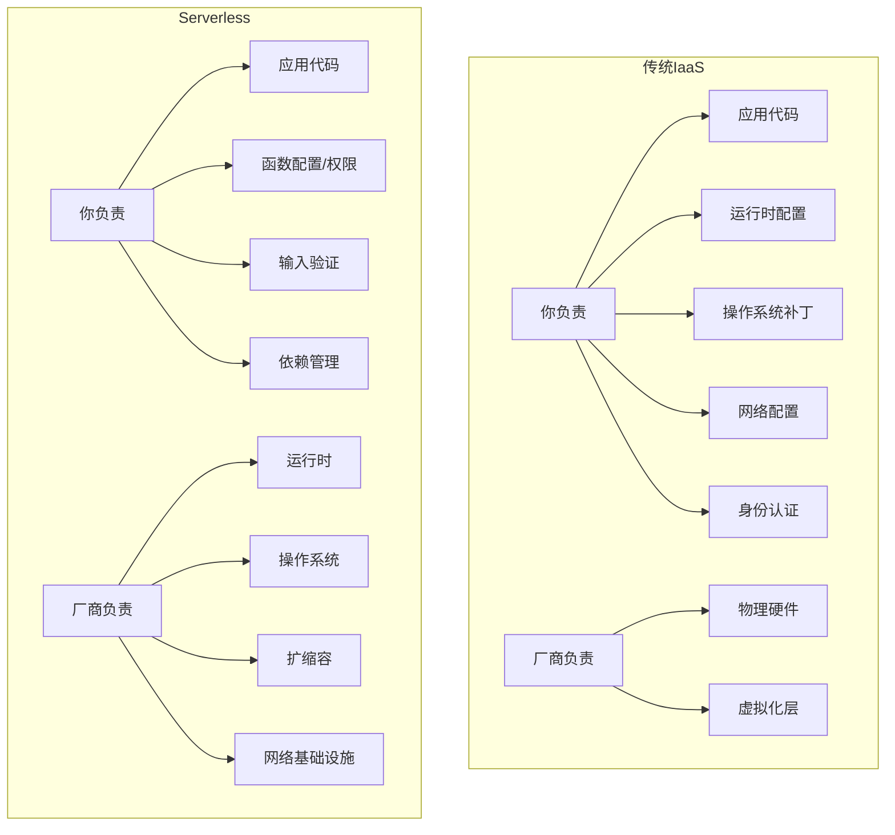
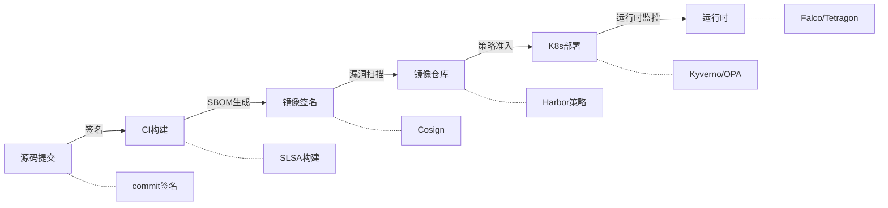

## 12.2.5 容器与Serverless安全

容器与Serverless是云原生架构的两大核心范式。容器将应用及其依赖打包为标准化单元，Serverless将基础设施抽象到极致，开发者只需关注业务代码。两者都极大提升了部署效率，但也引入了全新的攻击面——共享内核、编排层API、镜像供应链、函数权限模型、事件注入等。本节从攻击者视角和防御者视角两条线索，系统讲解容器与Serverless安全的完整知识体系。

---

### 一、容器安全基础：从Docker到Kubernetes

#### 1.1 容器隔离原理与安全边界

容器并非虚拟机。Docker容器共享宿主机内核，通过Linux Namespaces实现进程/网络/文件系统隔离，通过Cgroups限制资源使用，通过Capabilities细粒度授权。理解这一底层机制是容器安全的基础。

**Namespaces隔离类型与作用：**

| Namespace | 隔离内容 | 安全意义 |
|-----------|---------|---------|
| PID | 进程ID空间 | 容器内无法看到宿主机进程 |
| NET | 网络栈 | 独立IP、端口空间 |
| MNT | 挂载点 | 文件系统隔离 |
| UTS | 主机名 | 独立主机名 |
| IPC | 进程间通信 | 隔离信号量、消息队列 |
| USER | 用户/组ID | UID映射，提权防护 |
| Cgroup | Cgroup根目录 | 隐藏宿主机cgroup层次 |

**关键安全局限：**

- **共享内核**：内核漏洞（如CVE-2022-0185 Heap Overflow）可实现容器逃逸
- **Namespace不完整**：早期Docker版本默认不启用USER Namespace，容器内root即宿主机root
- **Cgroups可被绕过**：若容器以`--privileged`模式运行，所有隔离失效

```bash
# 危险示例：特权容器可访问宿主机设备
docker run --privileged -it ubuntu bash
# 在容器内挂载宿主机磁盘
mount /dev/sda1 /mnt  # 直接访问宿主机文件系统
```

#### 1.2 容器逃逸攻击面

容器逃逸是容器安全中最严重的威胁。攻击者突破容器隔离，获得宿主机访问权限，进而控制整个节点甚至集群。

**主要逃逸路径：**

**（1）内核漏洞利用**

Linux内核的漏洞直接影响所有容器。例如：
- **CVE-2022-0185**：Filesystem Context堆溢出，非特权用户可提权
- **CVE-2020-14386**：AF_PACKET内存越界写，容器内可执行代码
- **CVE-2019-5736**：runc容器运行时漏洞，恶意容器可覆盖宿主机runc二进制

防御策略：及时更新宿主机内核，使用Seccomp/AppArmor限制系统调用，启用内核运行时防护（如Falco）。

**（2）容器运行时漏洞**

runc是Docker/K8s默认的容器运行时。CVE-2019-5736允许恶意镜像在容器启动时覆盖宿主机的runc二进制文件，后续所有容器操作都会执行攻击者的代码。

```bash
# 检查runc版本是否受影响
runc --version
# 修复：升级到 runc >= 1.0-rc6
```

**（3）危险配置导致的逃逸**

| 危险配置 | 风险等级 | 说明 |
|---------|---------|------|
| `--privileged` | 极高 | 获得所有Capabilities，可访问全部设备 |
| `-v /:/host` | 极高 | 将宿主机根目录挂载到容器内 |
| `--pid=host` | 高 | 可看到宿主机所有进程 |
| `--net=host` | 高 | 使用宿主机网络栈 |
| `--cap-add=SYS_ADMIN` | 高 | 授予挂载文件系统等管理员权限 |
| `--security-opt seccomp=unconfined` | 高 | 禁用系统调用过滤 |

```bash
# 危险示例：挂载宿主机Docker socket
docker run -v /var/run/docker.sock:/var/run/docker.sock -it ubuntu bash
# 容器内可通过socket控制宿主机Docker daemon
docker -H unix:///var/run/docker.sock run --privileged -v /:/host -it alpine chroot /host
```

**（4）共享Namespace逃逸**

当容器与宿主机共享PID或Network Namespace时，隔离边界被削弱：

```yaml
# 危险的Pod配置：共享宿主机PID Namespace
apiVersion: v1
kind: Pod
metadata:
  name: dangerous-pod
spec:
  hostPID: true  # 共享宿主机PID Namespace
  hostNetwork: true  # 共享宿主机网络
  containers:
  - name: app
    image: myapp:latest
```

---

### 二、容器镜像安全

#### 2.1 镜像供应链攻击

容器镜像从构建到运行，经历多个环节，每个环节都可能被注入恶意代码：



**真实案例：Docker Hub恶意镜像事件**

2020年，安全研究人员发现Docker Hub上超过30%的官方镜像包含挖矿程序。攻击者上传了名称与流行软件相似的镜像（如`docker pull tenableofficial/node`），用户误拉取后宿主机被植入挖矿木马。

#### 2.2 镜像安全扫描实践

**扫描工具对比：**

| 工具 | 类型 | 漏洞数据库 | 镜像格式支持 | CI集成 | 特点 |
|------|------|-----------|-------------|--------|------|
| Trivy | 开源 | NVD/RedHat/Debian/Alpine | Docker/OCI/文件系统 | GitLab/GitHub Actions | 速度快，零配置，支持SBOM |
| Clair | 开源 | NVD/Debian/Ubuntu/RHEL | Docker/OCI | 需集成 | CoreOS出品，适合大规模扫描 |
| Snyk | 商业+免费层 | Snyk漏洞库 | Docker/OCI/IaC | 全平台 | 修复建议精准，支持依赖树 |
| Grype | 开源 | Anchore Feed | Docker/OCI/SBOM | GitHub Actions | Anchore出品，与Syft配合 |
| Docker Scout | 官方 | Docker Advisory | Docker原生 | Docker Desktop | 深度集成Docker生态 |

```bash
# Trivy 扫描示例
# 安装
curl -sfL https://raw.githubusercontent.com/aquasecurity/trivy/main/contrib/install.sh | sh -s -- -b /usr/local/bin

# 扫描镜像漏洞（仅HIGH和CRITICAL级别）
trivy image --severity HIGH,CRITICAL nginx:latest

# 扫描并生成SBOM（软件物料清单）
trivy image --format spdx-json --output sbom.json nginx:latest

# 在CI中使用（发现CRITICAL漏洞时失败）
trivy image --exit-code 1 --severity CRITICAL myapp:latest

# 扫描本地文件系统（检查Dockerfile）
trivy fs --security-checks config .
```

#### 2.3 镜像签名与验证

镜像签名确保镜像从构建到部署过程中未被篡改。Cosign是Sigstore项目的一部分，已成为容器镜像签名的事实标准。

```bash
# 使用Cosign签名镜像
# 安装
go install github.com/sigstore/cosign/v2/cmd/cosign@latest

# 生成密钥对
cosign generate-key-pair

# 签名镜像
cosign sign --key cosign.key myregistry.io/myimage:v1

# 验证签名
cosign verify --key cosign.pub myregistry.io/myimage:v1

# 使用Keyless签名（基于OIDC身份，无需管理密钥）
cosign sign myregistry.io/myimage:v1
# 自动使用环境中的OIDC身份（如GitHub Actions的ID Token）
```

**在Kubernetes中强制签名验证（Kyverno策略）：**

```yaml
apiVersion: kyverno.io/v1
kind: ClusterPolicy
metadata:
  name: verify-image-signature
spec:
  validationFailureAction: Enforce
  rules:
  - name: check-image-signature
    match:
      any:
      - resources:
          kinds:
          - Pod
    verifyImages:
    - imageReferences:
      - "myregistry.io/*"
      attestors:
      - entries:
        - keys:
            publicKeys: |-
              -----BEGIN PUBLIC KEY-----
              MFkwEwYHKoZIzj0CAQYIKoZIzj0DAQcDQgAE...
              -----END PUBLIC KEY-----
```

#### 2.4 Dockerfile安全编写规范

```dockerfile
# 安全的Dockerfile示例
# ---- 阶段1：构建 ----
FROM golang:1.21-alpine AS builder

# 使用非root用户构建
RUN addgroup -S buildgroup && adduser -S builduser -G buildgroup

WORKDIR /build
COPY go.mod go.sum ./
RUN go mod download  # 利用缓存层，先下载依赖

COPY . .
RUN CGO_ENABLED=0 GOOS=linux go build -ldflags="-s -w" -o /app .

# ---- 阶段2：运行 ----
FROM gcr.io/distroless/static:nonroot

# 只复制编译产物，不包含编译工具链
COPY --from=builder /app /app

# 使用非root用户（nonroot UID 65532）
USER nonroot:nonroot

EXPOSE 8080
ENTRYPOINT ["/app"]
```

**Dockerfile安全检查清单：**

| 检查项 | 不安全做法 | 安全做法 |
|-------|----------|---------|
| 基础镜像 | `FROM ubuntu:latest` | `FROM gcr.io/distroless/static:nonroot` |
| 用户身份 | 默认root运行 | `USER nonroot:nonroot` |
| 密钥泄露 | `COPY .env /app/` | 使用BuildKit secrets mount |
| 层缓存 | 一次COPY所有文件 | 分层COPY，先依赖后代码 |
| 包管理器 | `apt-get install`无清理 | `apt-get install && rm -rf /var/lib/apt/lists/*` |
| HEALTHCHECK | 无 | 添加HEALTHCHECK指令 |
| .dockerignore | 缺失 | 排除.git、.env、node_modules等 |

```bash
# 使用Hadolint静态检查Dockerfile
docker run --rm -i hadolint/hadolint < Dockerfile

# 使用Dockle检查已构建镜像的安全性
dockle myimage:latest
```

---

### 三、Kubernetes安全深度防护

#### 3.1 API Server安全

Kubernetes API Server是集群的控制中枢。攻击者一旦获得API Server访问权限，即可完全控制集群。

**API Server攻击面：**

| 攻击向量 | 攻击方式 | 防御措施 |
|---------|---------|---------|
| 匿名认证 | 默认允许匿名访问部分API | 禁用匿名认证 `--anonymous-auth=false` |
| 弱认证 | 使用静态Token/密码文件 | 使用OIDC/证书认证 |
| RBAC过宽 | ClusterRole绑定过多权限 | 最小权限原则，定期审计 |
| etcd未加密 | etcd数据明文存储 | 启用静态加密（EncryptionConfiguration） |
| 准入控制 | 缺少准入策略 | 部署OPA/Kyverno/ValidatingAdmissionWebhook |

```bash
# 审计RBAC权限：查找绑定了cluster-admin的所有主体
kubectl get clusterrolebindings -o json | \
  jq '.items[] | select(.roleRef.name=="cluster-admin") | .subjects'

# 查找所有具有secrets读取权限的ServiceAccount
kubectl auth can-i --list --as=system:serviceaccount:default:my-sa | grep secrets
```

#### 3.2 Network Policy实战

Network Policy是Kubernetes的网络访问控制机制，类似于云环境中的安全组。默认情况下，Kubernetes集群内所有Pod可以互相通信——这是零信任架构所不允许的。

**默认拒绝 + 按需放行策略：**

```yaml
# 第一步：拒绝所有入站流量
apiVersion: networking.k8s.io/v1
kind: NetworkPolicy
metadata:
  name: default-deny-ingress
  namespace: production
spec:
  podSelector: {}  # 匹配命名空间内所有Pod
  policyTypes:
  - Ingress

---
# 第二步：仅允许前端访问后端API
apiVersion: networking.k8s.io/v1
kind: NetworkPolicy
metadata:
  name: allow-frontend-to-api
  namespace: production
spec:
  podSelector:
    matchLabels:
      app: api-server
  policyTypes:
  - Ingress
  ingress:
  - from:
    - podSelector:
        matchLabels:
          app: frontend
    ports:
    - protocol: TCP
      port: 8080

---
# 第三步：允许后端访问数据库
apiVersion: networking.k8s.io/v1
kind: NetworkPolicy
metadata:
  name: allow-api-to-db
  namespace: production
spec:
  podSelector:
    matchLabels:
      app: database
  policyTypes:
  - Ingress
  ingress:
  - from:
    - podSelector:
        matchLabels:
          app: api-server
    ports:
    - protocol: TCP
      port: 5432

---
# 第四步：允许所有Pod访问DNS
apiVersion: networking.k8s.io/v1
kind: NetworkPolicy
metadata:
  name: allow-dns
  namespace: production
spec:
  podSelector: {}
  policyTypes:
  - Egress
  egress:
  - to:
    - namespaceSelector: {}
      podSelector:
        matchLabels:
          k8s-app: kube-dns
    ports:
    - protocol: UDP
      port: 53
    - protocol: TCP
      port: 53
```

> **注意**：Network Policy需要CNI插件支持。Calico、Cilium、Weave等支持完整的Network Policy实现，而Flannel不支持Network Policy。在使用前确认你的CNI插件是否支持。

#### 3.3 Pod Security Standards

Kubernetes 1.25+移除了PodSecurityPolicy（PSP），取而代之的是Pod Security Admission（PSA），内置三个安全级别：

| 级别 | 说明 | 典型限制 |
|------|------|---------|
| `privileged` | 无限制 | 用于系统组件（kube-system） |
| `baseline` | 最低限度限制 | 禁止privileged、hostPID、hostNetwork |
| `restricted` | 严格限制 | 必须runAsNonRoot、必须drop ALL capabilities、必须有readOnlyRootFilesystem |

```yaml
# 对production命名空间强制执行restricted策略
apiVersion: v1
kind: Namespace
metadata:
  name: production
  labels:
    pod-security.kubernetes.io/enforce: restricted
    pod-security.kubernetes.io/enforce-version: latest
    pod-security.kubernetes.io/warn: restricted
    pod-security.kubernetes.io/audit: restricted
```

#### 3.4 Secrets管理

Kubernetes原生Secret以base64编码存储在etcd中——base64不是加密。任何能读取etcd或拥有secrets读权限的人都能获取明文内容。

**Secrets安全实践：**

```bash
# 检查etcd是否启用了静态加密
# 查看EncryptionConfiguration
cat /etc/kubernetes/encryption-config.yaml
```

```yaml
# EncryptionConfiguration示例
apiVersion: apiserver.config.k8s.io/v1
kind: EncryptionConfiguration
resources:
- resources:
  - secrets
  providers:
  - aescbc:
      keys:
      - name: key1
        secret: <base64-encoded-32-byte-key>
  - identity: {}  # 回退到明文（用于读取旧数据）
```

**外部Secrets管理工具对比：**

| 工具 | 特点 | 适用场景 |
|------|------|---------|
| HashiCorp Vault | 动态密钥、自动轮换、审计日志 | 企业级、多云环境 |
| External Secrets Operator | 将外部密钥同步到K8s Secrets | AWS SM/GCP SM/Azure KV用户 |
| Sealed Secrets | 加密的Secrets可安全存储在Git中 | GitOps工作流 |
| SOPS + Age | 文件级加密，适合GitOps | 轻量级、与Flux集成 |

---

### 四、容器运行时安全

#### 4.1 Seccomp系统调用过滤

Seccomp（Secure Computing Mode）限制容器可使用的系统调用。默认的Docker seccomp profile禁止了约44个危险系统调用（如`reboot`、`mount`、`keyctl`）。

```json
{
  "defaultAction": "SCMP_ACT_ERRNO",
  "architectures": ["SCMP_ARCH_X86_64"],
  "syscalls": [
    {
      "names": ["accept", "bind", "listen", "read", "write", "close", "exit"],
      "action": "SCMP_ACT_ALLOW"
    }
  ]
}
```

```yaml
# 在Pod中应用自定义seccomp profile
apiVersion: v1
kind: Pod
metadata:
  name: secured-pod
spec:
  securityContext:
    seccompProfile:
      type: Localhost
      localhostProfile: profiles/my-app.json
  containers:
  - name: app
    image: myapp:latest
```

#### 4.2 AppArmor强制访问控制

AppArmor限制程序的文件/网络/能力访问。相比Seccomp关注系统调用，AppArmor更关注资源访问。

```bash
# 查看当前加载的AppArmor配置文件
sudo aa-status

# 自定义AppArmor配置文件示例
# /etc/apparmor.d/containers/my-app
#include <tunables/global>

profile my-app flags=(attach_disconnected) {
  #include <abstractions/base>
  
  # 允许读取应用目录
  /app/** r,
  
  # 禁止写入/etc
  deny /etc/** w,
  
  # 禁止访问宿主机proc
  deny /proc/** w,
  
  # 允许网络访问
  network inet stream,
  network inet dgram,
}
```

#### 4.3 实时运行时检测

运行时安全工具监控容器行为，在检测到异常时发出告警或自动阻断：

**Falco运行时安全规则示例：**

```yaml
# falco_rules.yaml
- rule: Detect Shell Spawn in Container
  desc: 检测容器内启动shell（可能的入侵信号）
  condition: >
    spawned_process and container and
    proc.name in (bash, sh, zsh, dash) and
    not proc.pname in (cron, crond)
  output: >
    容器内检测到shell启动
    (user=%user.name container=%container.name
     shell=%proc.name parent=%proc.pname
     command=%proc.cmdline)
  priority: WARNING
  tags: [container, shell, mitre_execution]

- rule: Detect Sensitive File Read in Container
  desc: 检测容器内读取敏感文件
  condition: >
    open_read and container and
    (fd.name startswith /etc/shadow or
     fd.name startswith /etc/passwd or
     fd.name contains id_rsa or
     fd.name contains .env)
  output: >
    容器内读取敏感文件
    (user=%user.name file=%fd.name
     container=%container.name command=%proc.cmdline)
  priority: CRITICAL
  tags: [container, credential_access, mitre_credential_access]
```

```bash
# 安装Falco（Helm方式）
helm repo add falcosecurity https://falcosecurity.github.io/charts
helm install falco falcosecurity/falco \
  --namespace falco --create-namespace \
  --set falcosidekick.enabled=true \
  --set falcosidekick.config.slack.webhookurl="https://hooks.slack.com/..."
```

---

### 五、Serverless安全

#### 5.1 Serverless安全模型

Serverless（如AWS Lambda、Azure Functions、Google Cloud Functions）将基础设施管理完全交给云厂商，但安全责任并未消失——只是边界发生了变化：



**与传统架构的安全差异：**

| 维度 | 传统架构 | Serverless |
|------|---------|-----------|
| 攻击面 | 服务器操作系统、网络 | 函数代码、事件数据、IAM策略 |
| 持久化 | 攻击者可在服务器驻留 | 无持久状态，但可利用定时触发器 |
| 横向移动 | 网络内横向移动 | 通过过度授权的IAM角色横向移动 |
| 监控粒度 | 主机级日志 | 函数级日志，每次调用独立 |
| 冷启动 | 无 | 函数初始化可能泄露信息到共享环境 |

#### 5.2 Serverless特有攻击面

**（1）函数权限过大（Over-Privileged Functions）**

Serverless函数通过IAM角色获取权限。如果一个只需要读取S3的函数被授予了`AdministratorAccess`，攻击者入侵该函数后就能完全控制AWS账户。

```bash
# 检查Lambda函数的IAM角色权限
aws lambda get-function-configuration --function-name my-function \
  --query 'Role' --output text

# 获取角色附加的策略
aws iam list-attached-role-policies --role-name my-function-role

# 查看策略详情
aws iam get-policy-version \
  --policy-arn arn:aws:iam::123456789:policy/my-policy \
  --version-id v1
```

**最小权限实践：**

```json
{
  "Version": "2012-10-17",
  "Statement": [
    {
      "Effect": "Allow",
      "Action": [
        "dynamodb:GetItem",
        "dynamodb:Query"
      ],
      "Resource": "arn:aws:dynamodb:us-east-1:123456789:table/Orders"
    },
    {
      "Effect": "Allow",
      "Action": [
        "logs:CreateLogStream",
        "logs:PutLogEvents"
      ],
      "Resource": "arn:aws:logs:*:*:*"
    }
  ]
}
```

**（2）事件注入攻击**

Serverless函数通过事件触发（HTTP请求、S3事件、SQS消息等）。如果函数不对事件数据进行验证，攻击者可注入恶意数据：

```python
# 危险示例：未验证的S3事件触发
import boto3
import subprocess

def lambda_handler(event, context):
    # 直接使用事件中的S3 key构造命令
    bucket = event['Records'][0]['s3']['bucket']['name']
    key = event['Records'][0]['s3']['object']['key']
    
    # 命令注入！攻击者可上传名为 "; rm -rf / #.csv" 的文件
    subprocess.run(f"process_file.sh {bucket} {key}", shell=True)
```

```python
# 安全示例：严格验证事件数据
import boto3
import re
from urllib.parse import unquote_plus

def lambda_handler(event, context):
    bucket = event['Records'][0]['s3']['bucket']['name']
    key = unquote_plus(event['Records'][0]['s3']['object']['key'])
    
    # 验证bucket名称
    allowed_buckets = ['my-data-bucket', 'my-upload-bucket']
    if bucket not in allowed_buckets:
        raise ValueError(f"Unexpected bucket: {bucket}")
    
    # 验证key格式（仅允许字母数字、斜杠、点、下划线、连字符）
    if not re.match(r'^[a-zA-Z0-9/._-]+$', key):
        raise ValueError(f"Invalid key format: {key}")
    
    # 使用subprocess时避免shell=True
    import shlex
    subprocess.run(
        ["process_file.sh", bucket, key],
        check=True,
        capture_output=True
    )
```

**（3）Serverless SSRF（服务端请求伪造）**

Serverless函数运行在云环境中，可以访问元数据服务（如`http://169.254.169.254`），获取临时IAM凭证。如果函数接受用户提供的URL并发起请求，就存在SSRF风险：

```python
# 危险示例：未限制出站请求目标
import requests

def lambda_handler(event, context):
    url = event['queryStringParameters']['url']
    # 攻击者可请求 http://169.254.169.254/latest/meta-data/iam/security-credentials/
    response = requests.get(url)
    return {'statusCode': 200, 'body': response.text}
```

```python
# 安全示例：限制出站请求目标
import requests
from urllib.parse import urlparse
import ipaddress

BLOCKED_CIDRS = [
    ipaddress.ip_network('10.0.0.0/8'),
    ipaddress.ip_network('172.16.0.0/12'),
    ipaddress.ip_network('192.168.0.0/16'),
    ipaddress.ip_network('169.254.0.0/16'),  # 元数据服务
    ipaddress.ip_network('127.0.0.0/8'),
]

ALLOWED_SCHEMES = {'https'}
ALLOWED_DOMAINS = {'api.example.com', 'cdn.example.com'}

def lambda_handler(event, context):
    url = event['queryStringParameters']['url']
    parsed = urlparse(url)
    
    if parsed.scheme not in ALLOWED_SCHEMES:
        return {'statusCode': 400, 'body': 'Only HTTPS allowed'}
    
    if parsed.hostname not in ALLOWED_DOMAINS:
        return {'statusCode': 403, 'body': 'Domain not allowed'}
    
    response = requests.get(url, timeout=5)
    return {'statusCode': 200, 'body': response.text}
```

**（4）依赖供应链攻击**

Serverless函数依赖第三方库。2018年的event-stream事件、2021年的ua-parser-js事件都证明npm/pip等包管理器是攻击者的热门目标。

```bash
# 使用pip-audit检查Python依赖漏洞
pip install pip-audit
pip-audit -r requirements.txt

# 使用npm audit检查Node.js依赖
npm audit --production

# 使用Snyk检查
snyk test --package-manager=pip
```

**（5）冷启动与信息泄露**

Serverless函数的冷启动可能导致信息泄露。当函数实例被回收后，下一次调用会重新初始化，可能暴露初始化过程中的调试信息、环境变量等。

```python
# 检测冷启动
import os

# Lambda执行上下文在复用时保持
is_cold_start = not hasattr(lambda_handler, '_initialized')

def lambda_handler(event, context):
    if not is_cold_start:
        lambda_handler._initialized = True
    
    # 不要在日志中打印完整event（可能包含敏感信息）
    # 危险：print(f"Event: {event}")
    # 安全：只记录非敏感字段
    print(f"Request ID: {context.aws_request_id}")
    print(f"Function: {context.function_name}")
```

#### 5.3 Serverless安全最佳实践

**（1）函数级别的安全配置**

```yaml
# AWS SAM模板中的安全配置
AWSTemplateFormatVersion: '2010-09-09'
Transform: AWS::Serverless-2016-10-31

Resources:
  MyFunction:
    Type: AWS::Serverless::Function
    Properties:
      FunctionName: secure-function
      Runtime: python3.12
      Handler: app.lambda_handler
      MemorySize: 256
      Timeout: 10  # 设置合理超时，防止DoS
      ReservedConcurrentExecutions: 100  # 限制并发，防止资源耗尽
      
      # 环境变量加密
      KmsKeyArn: !GetAtt KmsKey.Arn
      
      # VPC配置（如需访问私有资源）
      VpcConfig:
        SecurityGroupIds:
          - !Ref FunctionSecurityGroup
        SubnetIds:
          - !Ref PrivateSubnet1
          - !Ref PrivateSubnet2
      
      # 最小权限IAM角色
      Policies:
        - Version: '2012-10-17'
          Statement:
            - Effect: Allow
              Action:
                - dynamodb:GetItem
              Resource: !GetAtt OrdersTable.Arn
      
      # 启用X-Ray追踪
      Tracing: Active
      
      # 死信队列处理失败调用
      DeadLetterQueue:
        Type: SQS
        TargetArn: !GetAtt DeadLetterQueue.Arn

  # 使用WAF保护API Gateway端点
  MyApi:
    Type: AWS::Serverless::Api
    Properties:
      StageName: prod
      MethodSettings:
        - ResourcePath: '/*'
          HttpMethod: '*'
          ThrottlingBurstLimit: 100
          ThrottlingRateLimit: 50
      AccessLogSetting:
        DestinationArn: !GetAtt ApiLogGroup.Arn
```

**（2）输入验证框架**

```python
# 使用Pydantic进行严格输入验证
from pydantic import BaseModel, validator, constr
from typing import Optional
import re

class OrderRequest(BaseModel):
    order_id: constr(min_length=1, max_length=50, pattern=r'^[A-Z0-9-]+$')
    customer_email: constr(max_length=254)
    amount: float
    
    @validator('amount')
    def validate_amount(cls, v):
        if v <= 0 or v > 1000000:
            raise ValueError('Amount must be between 0 and 1,000,000')
        return round(v, 2)
    
    @validator('customer_email')
    def validate_email(cls, v):
        if not re.match(r'^[a-zA-Z0-9_.+-]+@[a-zA-Z0-9-]+\.[a-zA-Z0-9-.]+$', v):
            raise ValueError('Invalid email format')
        return v.lower()

def lambda_handler(event, context):
    try:
        body = json.loads(event['body'])
        order = OrderRequest(**body)
        # 处理经过验证的订单数据
        ...
    except ValidationError as e:
        return {
            'statusCode': 400,
            'body': json.dumps({'error': 'Invalid input', 'details': e.errors()})
        }
```

**（3）Serverless环境下的密钥管理**

```python
# 使用AWS Secrets Manager获取密钥
import boto3
import json
from functools import lru_cache

secrets_client = boto3.client('secretsmanager')

@lru_cache(maxsize=1)  # 缓存密钥，减少API调用
def get_secret(secret_name):
    response = secrets_client.get_secret_value(SecretId=secret_name)
    return json.loads(response['SecretString'])

def lambda_handler(event, context):
    # 每次调用从缓存获取（冷启动时从SM获取）
    db_creds = get_secret('prod/database/credentials')
    conn = connect_to_db(db_creds['host'], db_creds['password'])
```

---

### 六、容器与Serverless安全审计框架

#### 6.1 安全审计检查清单

**容器安全检查清单：**

| 类别 | 检查项 | 工具 |
|------|-------|------|
| 镜像 | 基础镜像来自可信源 | Trivy/Grype |
| 镜像 | 无HIGH/CRITICAL漏洞 | Trivy扫描 |
| 镜像 | 镜像已签名 | Cosign验证 |
| Dockerfile | 非root用户运行 | Hadolint/Dockle |
| Dockerfile | 无敏感信息泄露 | gitLeaks/truffleHog |
| Dockerfile | 使用多阶段构建 | 人工审查 |
| K8s RBAC | 无过度授权的RoleBinding | kubectl auth can-i |
| K8s Network | 默认拒绝入站流量 | NetworkPolicy审查 |
| K8s Pod Security | restricted级别执行 | PSA审计 |
| K8s Secrets | etcd加密启用 | EncryptionConfiguration |
| 运行时 | Seccomp profile已配置 | Pod SecurityContext |
| 运行时 | Falco等运行时检测已部署 | Falco规则测试 |

**Serverless安全检查清单：**

| 类别 | 检查项 | 工具 |
|------|-------|------|
| IAM | 函数权限最小化 | AWS IAM Access Analyzer |
| IAM | 无通配符权限 | Prowler/Checkov |
| 代码 | 输入验证完备 | SAST扫描 |
| 代码 | 无命令注入 | Semgrep/Bandit |
| 依赖 | 无已知漏洞依赖 | Snyk/pip-audit |
| 网络 | SSRF防护（元数据服务访问限制） | 人工审查+VPC配置 |
| 配置 | 超时设置合理 | SAM模板审查 |
| 配置 | 并发限制已设置 | CloudWatch指标 |
| 日志 | 不记录敏感信息 | CloudWatch Logs审查 |
| 加密 | 环境变量加密 | KMS配置审查 |

#### 6.2 自动化安全扫描流水线

```yaml
# GitLab CI/CD 中的容器安全扫描
stages:
  - build
  - security-scan
  - deploy

build-image:
  stage: build
  script:
    - docker build -t $CI_REGISTRY_IMAGE:$CI_COMMIT_SHA .
    - docker push $CI_REGISTRY_IMAGE:$CI_COMMIT_SHA

trivy-scan:
  stage: security-scan
  image: aquasec/trivy:latest
  script:
    - trivy image --exit-code 1 --severity HIGH,CRITICAL $CI_REGISTRY_IMAGE:$CI_COMMIT_SHA
    - trivy image --format json --output trivy-report.json $CI_REGISTRY_IMAGE:$CI_COMMIT_SHA
  artifacts:
    paths:
      - trivy-report.json

cosign-verify:
  stage: security-scan
  image: alpine/cosign:latest
  script:
    - cosign verify --key cosign.pub $CI_REGISTRY_IMAGE:$CI_COMMIT_SHA

iac-scan:
  stage: security-scan
  image: bridgecrew/checkov:latest
  script:
    - checkov -d . --framework kubernetes --output junitxml > checkov-report.xml
  artifacts:
    reports:
      junit: checkov-report.xml
```

---

### 七、典型攻击场景与应急响应

#### 7.1 场景：容器挖矿攻击

**攻击链：**

1. 攻击者扫描暴露在公网的Kubernetes API Server或Docker API（2375端口）
2. 通过未认证的API创建特权容器
3. 挂载宿主机根目录，植入挖矿程序
4. 利用cron持久化

**检测方法：**

```bash
# 检查宿主机是否有异常进程
ps aux | grep -E 'xmrig|minerd|cryptonight'

# 检查是否有异常cron任务
crontab -l
ls -la /etc/cron.*

# 检查Docker是否有异常容器
docker ps -a --format "{{.ID}} {{.Image}} {{.Command}}" | grep -v expected

# 检查Kubernetes是否有异常Pod
kubectl get pods --all-namespaces --field-selector=status.phase=Running
kubectl get pods --all-namespaces -o json | jq '.items[] | select(.spec.containers[].resources.limits.cpu == null)'
```

**应急响应步骤：**

```bash
# 1. 隔离受影响节点
kubectl cordon <node-name>

# 2. 保存取证信息
kubectl logs <pod-name> -n <namespace> > pod-logs.txt
kubectl describe pod <pod-name> -n <namespace> > pod-describe.txt

# 3. 删除恶意资源
kubectl delete pod <pod-name> -n <namespace> --grace-period=0 --force

# 4. 旋转所有可能泄露的凭据
# 更新所有ServiceAccount Token
kubectl delete secret <sa-secret> -n <namespace>

# 5. 修复漏洞
# 更新API Server认证配置
# 启用Network Policy
# 部署Falco运行时检测
```

#### 7.2 场景：Serverless数据泄露

**攻击链：**

1. 攻击者发现Lambda函数存在SSRF漏洞
2. 通过SSRF访问EC2元数据服务获取临时IAM凭证
3. 使用凭证列出S3存储桶
4. 下载敏感数据

**检测与响应：**

```bash
# 使用CloudTrail检测异常API调用
aws cloudtrail lookup-events \
  --lookup-attributes AttributeKey=EventName,AttributeValue=GetObject \
  --start-time 2024-01-01T00:00:00Z \
  --max-results 50

# 检查是否启用了IMDSv2（强制要求Token，缓解SSRF）
aws ec2 describe-instances --query 'Reservations[].Instances[].MetadataOptions'
```

---

### 八、进阶话题

#### 8.1 eBPF容器安全

eBPF（Extended Berkeley Packet Filter）是Linux内核的可编程沙箱技术，可以在内核空间安全地运行自定义程序，用于网络监控、系统调用追踪、安全策略执行等。

**eBPF在容器安全中的应用：**

- **Cilium**：基于eBPF的网络策略引擎，比iptables性能高10倍以上，支持L3/L4/L7层策略
- **Tetragon**：Cilium团队的eBPF安全可观测工具，可在内核层面检测和阻断恶意行为
- **Falco（eBPF驱动）**：使用eBPF替代内核模块，更安全且无需编译内核模块

```yaml
# Cilium L7网络策略：只允许对/api/users的GET请求
apiVersion: cilium.io/v2
kind: CiliumNetworkPolicy
metadata:
  name: allow-users-api
spec:
  endpointSelector:
    matchLabels:
      app: api
  ingress:
  - fromEndpoints:
    - matchLabels:
        app: frontend
    toPorts:
    - ports:
      - port: "8080"
      rules:
        http:
        - method: GET
          path: "/api/users"
```

#### 8.2 机密计算（Confidential Computing）

机密计算通过硬件级别的内存加密（如Intel SGX、AMD SEV、ARM CCA）保护运行中的数据。在容器和Serverless场景中，这意味着即使宿主机被入侵，容器/函数中的数据也无法被读取。

- **Azure Confidential Computing**：支持DCsv2/DCsv3系列VM，基于Intel SGX
- **AWS Nitro Enclaves**：隔离的计算环境，用于处理高度敏感数据
- **Google Confidential VMs**：基于AMD SEV的内存加密VM

#### 8.3 供应链安全框架

完整的容器供应链安全应覆盖从源码到运行时的每个环节：



**SLSA（Supply-chain Levels for Software Artifacts）框架级别：**

| 级别 | 要求 | 工具实现 |
|------|------|---------|
| L1 | 构建过程有文档记录 | 任何CI工具 |
| L2 | 使用版本控制和托管构建服务 | GitHub Actions + SLSA Provenance |
| L3 | 构建平台不可篡改 | GitHub Actions (Hosted) + Sigstore |
| L4 | 双人审查+可重复构建 | 需要额外的流程控制 |

---

### 九、常见误区与纠正

| 误区 | 纠正 |
|------|------|
| "容器比虚拟机更安全" | 容器共享内核，逃逸风险高于虚拟机；安全取决于配置而非技术本身 |
| "用了Kubernetes就自动安全" | K8s默认配置非常不安全（无Network Policy、默认允许匿名访问、Secrets明文存储） |
| "Serverless没有服务器就不需要安全" | 安全责任只是转移了，不是消失了；代码、配置、权限、依赖都需要安全管理 |
| "镜像扫描通过就安全了" | 扫描只能发现已知漏洞，零日漏洞、逻辑漏洞、配置问题需要多层防护 |
| "Network Policy太复杂可以不部署" | 没有Network Policy的集群就像没有防火墙的网络，任何Pod都能互相访问 |
| "dev/staging环境可以放松安全要求" | 开发环境经常连接到生产数据库或包含真实数据，同样需要保护 |
