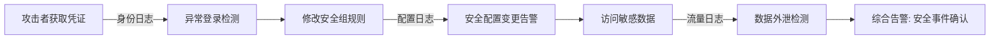
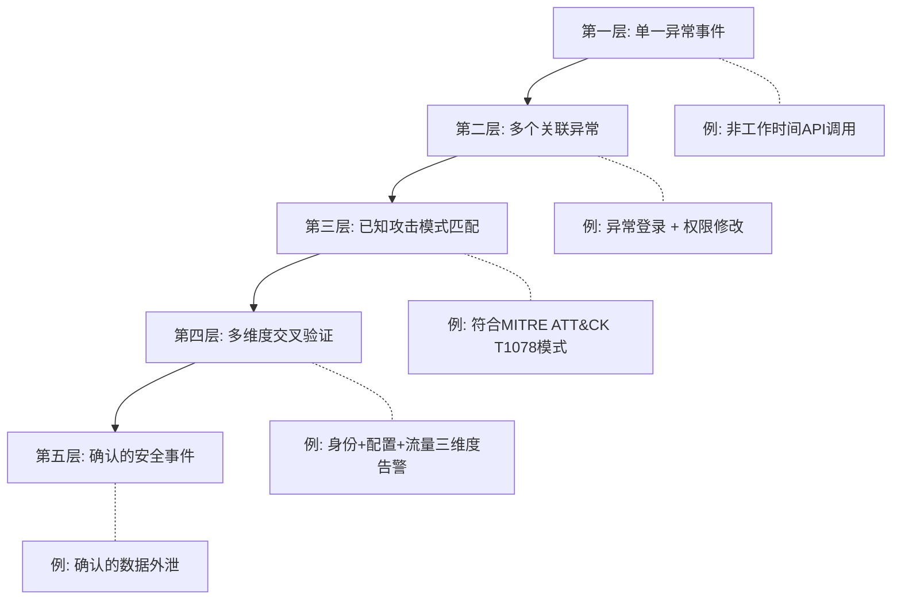
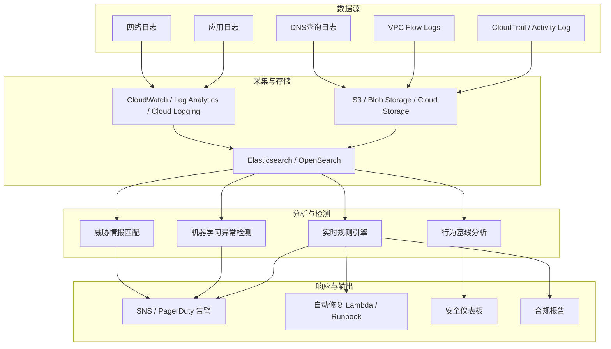
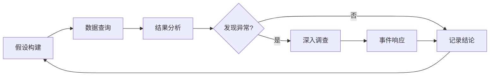

## 12.2.6 日志分析与威胁检测

云计算环境中，日志是安全事件调查和威胁检测的核心数据源。每一次 API 调用、每一次控制台登录、每一次资源变更都会在日志中留下痕迹。攻击者可以删除虚拟机、清除文件，但无法删除已经写入审计日志的记录——这正是日志分析的价值所在：它是安全事件发生后最可靠的回溯手段，也是实时威胁检测的基础。

一个真实的统计数据可以说明问题：根据 IBM《2024 年数据泄露成本报告》，企业平均需要 194 天才能发现数据泄露。而部署了完善的日志监控和威胁检测系统的企业，这一数字可以缩短到 21 天以内。差距的根源就在于：是否建立了系统化的日志采集、分析和告警能力。

### 日志分析的理论基础

#### 为什么日志分析在云环境中更加重要

传统数据中心中，安全团队可以依赖网络边界设备（防火墙、IDS/IPS）进行流量监控。但在云环境中，这个模型发生了根本性变化：

1. **边界模糊化**：云服务通过 API 暴露，攻击面从网络层扩展到应用层和身份层
2. **共享责任模型**：云提供商负责底层基础设施安全，用户负责配置和访问控制——配置错误成为首要攻击向量
3. **动态基础设施**：资源按需创建和销毁，传统的基于资产的安全管理不再适用
4. **API 驱动的操作**：所有管理操作都通过 API 进行，API 调用日志成为最关键的安全数据源

这意味着，在云环境中，日志分析不是"锦上添花"，而是安全运营的基石。

#### 日志分析的三大支柱

云环境的日志分析围绕三个核心支柱展开：

| 支柱 | 核心问题 | 代表数据源 | 分析重点 |
|------|---------|-----------|---------|
| **身份与访问** | 谁在什么时间做了什么？ | IAM 日志、SSO 日志、MFA 日志 | 异常登录、权限提升、横向移动 |
| **资源与配置** | 资源状态是否合规？ | CloudTrail、Activity Log、Audit Logs | 配置变更、资源创建/删除、安全组修改 |
| **网络与流量** | 数据流向哪里？ | VPC Flow Logs、NSG Flow Logs、Packet Mirroring | 异常流量、数据外泄、端口扫描 |

三大支柱相互关联：一个典型的数据泄露事件通常会在三个支柱上都留下痕迹——攻击者先窃取身份（身份支柱），然后修改安全组（资源配置支柱），最后从目标存储桶下载数据（网络流量支柱）。



### 云审计日志详解

#### AWS CloudTrail

CloudTrail 是 AWS 的核心审计服务，记录所有 AWS API 调用。理解 CloudTrail 的工作机制是进行日志分析的前提。

**CloudTrail 日志的核心字段**：

每个 CloudTrail 事件包含以下关键信息：

```json
{
  "eventVersion": "1.08",
  "userIdentity": {
    "type": "IAMUser",
    "principalId": "AIDAEXAMPLEID",
    "arn": "arn:aws:iam::123456789012:user/analyst",
    "accountId": "123456789012",
    "accessKeyId": "YOUR_AWS_KEY_ID"
  },
  "eventTime": "2024-06-15T08:42:31Z",
  "eventSource": "s3.amazonaws.com",
  "eventName": "GetObject",
  "awsRegion": "us-east-1",
  "sourceIPAddress": "203.0.113.25",
  "userAgent": "[aws-cli/2.13.0]",
  "requestParameters": {
    "bucketName": "sensitive-data-bucket",
    "key": "customer-records/2024.csv"
  },
  "responseElements": null,
  "eventType": "AwsApiCall",
  "errorCode": "AccessDenied",
  "errorMessage": "Access Denied"
}
```

**基本查询操作**：

```bash
# 查询最近的控制台登录事件
aws cloudtrail lookup-events \
  --lookup-attributes AttributeKey=EventName,AttributeValue=ConsoleLogin \
  --max-results 10 \
  --query 'Events[*].{Time:EventTime,User:Username,Source:SourceIPAddress}' \
  --output table

# 查询特定用户的API调用
aws cloudtrail lookup-events \
  --lookup-attributes AttributeKey=Username,AttributeValue=suspicious-user \
  --max-results 50

# 查询失败的API调用（潜在的权限探测或攻击尝试）
aws cloudtrail lookup-events \
  --lookup-attributes AttributeKey=EventName,AttributeValue=AccessDenied \
  --start-time 2024-06-01T00:00:00Z \
  --end-time 2024-06-15T23:59:59Z

# 查询特定资源的变更事件
aws cloudtrail lookup-events \
  --lookup-attributes AttributeKey=ResourceName,AttributeValue=my-security-group \
  --max-results 20
```

**使用 Athena 对 CloudTrail 日志进行高级查询**：

当 CloudTrail 日志存储在 S3 中时，可以通过 Athena 进行 SQL 查询，支持更复杂的分析场景：

```sql
-- 查询过去24小时内从未知IP地址发起的控制台登录
SELECT
    eventtime,
    useridentity.arn AS user_arn,
    sourceipaddress,
    useragent,
    errorcode
FROM cloudtrail_logs
WHERE eventname = 'ConsoleLogin'
  AND eventtime > date_format(current_timestamp - interval '1' day, '%Y-%m-%dT%H:%i:%sZ')
  AND sourceipaddress NOT IN (
    '203.0.113.10',  -- 办公室IP
    '198.51.100.5'   -- VPN出口IP
  )
ORDER BY eventtime DESC;

-- 检测IAM权限提升事件
SELECT
    eventtime,
    useridentity.arn AS actor,
    eventname,
    requestparameters
FROM cloudtrail_logs
WHERE eventname IN (
    'AttachUserPolicy',
    'AttachGroupPolicy',
    'AttachRolePolicy',
    'PutUserPolicy',
    'PutGroupPolicy',
    'PutRolePolicy',
    'CreatePolicyVersion',
    'SetDefaultPolicyVersion'
)
AND eventtime > date_format(current_timestamp - interval '7' day, '%Y-%m-%dT%H:%i:%sZ')
ORDER BY eventtime DESC;

-- 检测大规模S3数据下载（潜在的数据外泄）
SELECT
    useridentity.arn AS user_arn,
    sourceipaddress,
    COUNT(*) AS request_count,
    MIN(eventtime) AS first_seen,
    MAX(eventtime) AS last_seen
FROM cloudtrail_logs
WHERE eventname = 'GetObject'
  AND eventsource = 's3.amazonaws.com'
  AND eventtime > date_format(current_timestamp - interval '1' hour, '%Y-%m-%dT%H:%i:%sZ')
GROUP BY useridentity.arn, sourceipaddress
HAVING COUNT(*) > 100
ORDER BY request_count DESC;
```

#### Azure Activity Log

Azure 提供三种核心日志类型：

| 日志类型 | 存储位置 | 内容 | 保留期 |
|---------|---------|------|--------|
| **Activity Log** | Azure 平台自动存储 | 控制平面操作（资源创建/修改/删除） | 90 天（免费） |
| **Diagnostic Log** | 用户配置的存储 | 数据平面操作（资源内部活动） | 用户自定义 |
| **Sign-in Log** | Azure AD | 用户登录和认证事件 | 30 天（免费） |

**基本查询操作**：

```bash
# 查询资源删除事件
az monitor activity-log list \
  --query "[?contains(operationName.value, 'delete')]" \
  --max-events 50 \
  --output table

# 查询特定资源组的安全事件
az monitor activity-log list \
  --resource-group production-rg \
  --query "[?status.value=='Failed']" \
  --max-events 100

# 查询网络安全组变更
az monitor activity-log list \
  --query "[?operationName.value=='Microsoft.Network/networkSecurityGroups/securityRules/write']" \
  --start-time 2024-06-01T00:00:00Z

# 查询Azure AD登录失败事件
az ad sign-in list \
  --filter "status/errorCode ne 0" \
  --top 50 \
  --query "[].{Time:createdDateTime,User:userPrincipalName,App:appDisplayName,Error:status.errorCode,Location:location.city}" \
  --output table
```

**使用 Kusto 查询语言（KQL）进行高级分析**：

Azure Log Analytics 使用 KQL（Kusto Query Language），功能强大且语法直观：

```kql
// 检测不可能旅行（Impossible Travel）登录
SigninLogs
| where TimeGenerated > ago(24h)
| where ResultType == 0  // 成功登录
| project TimeGenerated, UserPrincipalName, Location, IPAddress
| sort by UserPrincipalName, TimeGenerated
| serialize
| extend PrevTime = prev(TimeGenerated),
         PrevLocation = prev(Location),
         PrevUser = prev(UserPrincipalName)
| where UserPrincipalName == PrevUser
| extend TimeDiffMinutes = datetime_diff('minute', TimeGenerated, PrevTime)
| where TimeDiffMinutes < 60 and Location != PrevLocation
| project UserPrincipalName, Time1=PrevTime, Location1=PrevLocation,
          Time2=TimeGenerated, Location2=Location, MinutesDiff=TimeDiffMinutes

// 检测特权角色分配
AzureActivity
| where OperationNameValue has "roleAssignments" and ActivityStatusValue == "Success"
| where TimeGenerated > ago(7d)
| extend Principal = tostring(parse_json(Properties).claims.["http://schemas.microsoft.com/identity/claims/objectidentifier"]),
         Role = tostring(parse_json(Authorization).evidence.role),
         Scope = tostring(parse_json(Authorization).evidence.scope)
| project TimeGenerated, Caller, Role, Scope, ResourceGroup

// 检测大量资源删除操作（潜在的破坏性攻击）
AzureActivity
| where OperationNameValue has "delete" and ActivityStatusValue == "Success"
| where TimeGenerated > ago(1h)
| summarize DeleteCount = count() by Caller, bin(TimeGenerated, 5m)
| where DeleteCount > 10
| sort by DeleteCount desc
```

#### GCP Cloud Audit Logs

Google Cloud 的审计日志分为四类：

| 日志类型 | 记录内容 | 示例 |
|---------|---------|------|
| **Admin Activity** | 资源创建/修改/删除 | 创建 VM 实例、修改 IAM 策略 |
| **Data Access** | 资源数据的读写操作 | 读取 BigQuery 数据、写入 Cloud Storage |
| **System Event** | Google 系统操作 | 实例自动迁移、维护事件 |
| **Policy Denied** | 被策略拒绝的操作 | 权限不足的 API 调用 |

```bash
# 查询项目级别的IAM变更
gcloud logging read \
  'protoPayload.methodName="SetIamPolicy" AND timestamp>="2024-06-01T00:00:00Z"' \
  --project=my-project \
  --format="json(protoPayload.authenticationInfo.principalEmail, timestamp, protoPayload.methodName)" \
  --limit=50

# 查询Compute Engine实例创建事件
gcloud logging read \
  'protoPayload.methodName="v1.compute.instances.insert" AND timestamp>="2024-06-01T00:00:00Z"' \
  --project=my-project \
  --format="table(timestamp, protoPayload.authenticationInfo.principalEmail, resource.labels.instance_id)" \
  --limit=100

# 查询失败的API调用
gcloud logging read \
  'protoPayload.status.code!=0 AND timestamp>="2024-06-01T00:00:00Z"' \
  --project=my-project \
  --format="table(timestamp, protoPayload.authenticationInfo.principalEmail, protoPayload.methodName, protoPayload.status.message)" \
  --limit=200

# 查询存储桶访问权限变更
gcloud logging read \
  'protoPayload.methodName="storage.setIamPermissions" AND timestamp>="2024-06-01T00:00:00Z"' \
  --project=my-project \
  --format=json \
  --limit=50
```

### 威胁检测指标与分类

#### 威胁指标（IoC）体系

在云环境中，威胁指标可以分为五个层级，从低到高置信度递增：



#### 常见可疑行为详细分类

**身份与认证类威胁**：

| 威胁指标 | 具体表现 | 检测方法 | 严重程度 |
|---------|---------|---------|---------|
| 异常时间登录 | 凌晨2-5点的控制台访问 | 对比用户历史登录时间分布 | 中 |
| 地理位置异常 | 从未访问过的国家/城市 | IP地理位置与历史基线对比 | 高 |
| 不可能旅行 | 短时间内从两个遥远位置登录 | 登录时间差与物理距离对比 | 高 |
| 多因素认证绕过 | MFA未启用或被禁用 | 监控MFA配置变更事件 | 严重 |
| 根账户直接使用 | 使用根账户执行日常操作 | 监控根账户的任何API调用 | 严重 |
| 临时凭证异常 | AssumeRole的外部账户调用 | 审查STS令牌的来源和权限 | 高 |

**资源与配置类威胁**：

| 威胁指标 | 具体表现 | 检测方法 | 严重程度 |
|---------|---------|---------|---------|
| 安全组过度开放 | 入站规则允许0.0.0.0/0 | 定期扫描安全组规则 | 高 |
| 存储桶公开访问 | S3/Azure Blob设置为public | 监控ACL和策略变更事件 | 严重 |
| IAM策略异常修改 | 附加过宽策略如`*:*` | 监控策略附加和创建事件 | 严重 |
| 加密配置变更 | 关闭默认加密或更换密钥 | 监控加密相关API调用 | 高 |
| 日志配置变更 | CloudTrail被禁用或日志被删除 | 监控日志服务自身的变更 | 严重 |
| 跨区域资源创建 | 在非常用区域创建资源 | 监控区域级别的资源创建 | 中 |

**网络与数据类威胁**：

| 威胁指标 | 具体表现 | 检测方法 | 严重程度 |
|---------|---------|---------|---------|
| 大规模数据下载 | 单用户短时间内大量GetObject | 请求频率和数据量基线 | 高 |
| 外部IP数据传输 | VPC内大量出站流量到未知IP | VPC Flow Logs分析 | 高 |
| DNS隧道 | 异常的DNS查询模式 | DNS日志分析 | 高 |
| 端口扫描 | 对多个端口或IP的探测 | VPC Flow Logs连接模式分析 | 中 |
| VPC对等连接变更 | 新建对等连接到未知VPC | 监控VPC Peering事件 | 高 |

### 安全监控工具详解

#### 商业安全监控平台

**AWS GuardDuty**

GuardDuty 是 AWS 的托管威胁检测服务，使用机器学习、异常检测和威胁情报来分析 CloudTrail、VPC Flow Logs 和 DNS 日志。

```bash
# 启用GuardDuty
aws guardduty create-detector \
  --enable \
  --finding-publishing-frequency FIFTEEN_MINUTES

# 查看检测器状态
aws guardduty list-detectors

# 获取最近的威胁发现
aws guardduty list-findings \
  --detector-id <detector-id> \
  --finding-criteria '{"Criterion":{"severity":{"Gte":4}}}' \
  --sort-criteria '{"AttributeName":"createdAt","OrderBy":"DESC"}'

# 获取发现详情
aws guardduty get-findings \
  --detector-id <detector-id> \
  --finding-ids <finding-id-1> <finding-id-2>

# 创建CloudWatch Events规则，将GuardDuty发现转发到SNS
aws events put-rule \
  --name "GuardDuty-HighSeverity" \
  --event-pattern '{"source":["aws.guardduty"],"detail-type":["GuardDuty Finding"],"detail":{"severity":[4,4.0,4.1,4.2,4.3,4.4,4.5,4.6,4.7,4.8,4.9,5,5.0,5.1,5.2,5.3,5.4,5.5,5.6,5.7,5.8,5.9,6,6.0,6.1,6.2,6.3,6.4,6.5,6.6,6.7,6.8,6.9,7,7.0,7.1,7.2,7.3,7.4,7.5,7.6,7.7,7.8,7.9,8,8.0,8.1,8.2,8.3,8.4,8.5,8.6,8.7,8.8,8.9]}}'
```

GuardDuty 的核心发现类型包括：

- **UnauthorizedAccess:EC2/SSHBruteForce**：检测到对 EC2 实例的 SSH 暴力破解
- **Recon:IAMUser/NetworkPermissions**：IAM 用户在短时间内尝试修改网络权限
- **Trojan:EC2/DNSDataExfiltration**：EC2 实例通过 DNS 查询进行数据外泄
- **PenTest:IAMUser/KaliLinux**：检测到从 Kali Linux 发起的 IAM 操作
- **Stealth:IAMUser/CloudTrailLoggingDisabled**：IAM 用户尝试禁用 CloudTrail

**Azure Sentinel**

Azure Sentinel 是微软的云原生 SIEM（安全信息和事件管理）和 SOAR（安全编排、自动化和响应）解决方案。它的核心优势在于与 Azure 生态的深度集成和内置的检测规则。

```kql
// 自定义检测规则：检测Azure AD应用注册滥用
let lookback = 7d;
let appRegistrations = AADServicePrincipalSignInLogs
| where TimeGenerated > ago(lookback)
| distinct AppDisplayName, ServicePrincipalId, IPAddress;
AADServicePrincipalSignInLogs
| where TimeGenerated > ago(1d)
| join kind=leftanti appRegistrations on ServicePrincipalId, IPAddress
| where IPAddress !in ("known_ip_1", "known_ip_2")
| project TimeGenerated, AppDisplayName, ServicePrincipalId, IPAddress, Location

// 自定义检测规则：检测存储账户的大规模数据导出
StorageBlobLogs
| where TimeGenerated > ago(1h)
| where OperationName == "GetBlob"
| where StatusText == "Success"
| summarize
    RequestCount = count(),
    TotalBytes = sum(RequestBodySize),
    UniqueBlobs = dcount(Uri)
    by AccountName, CallerIpAddress, bin(TimeGenerated, 5m)
| where RequestCount > 500 or TotalBytes > 1073741824  // 500次请求或1GB数据
| extend TotalMB = TotalBytes / 1048576
| project TimeGenerated, AccountName, CallerIpAddress, RequestCount, TotalMB, UniqueBlobs
```

**GCP Security Command Center**

Security Command Center（SCC）是 Google Cloud 的安全和风险管理平台，提供资产发现、漏洞检测和威胁检测能力。

```bash
# 列出安全发现
gcloud scc findings list organizations/ORG_ID \
  --filter="state=\"ACTIVE\" AND severity=\"HIGH\"" \
  --format="table(name, category, eventTime, severity)"

# 获取特定发现详情
gcloud scc findings describe organizations/ORG_ID/sources/SOURCE_ID/findings/FINDING_ID

# 更新发现状态（标记为已解决）
gcloud scc findings update organizations/ORG_ID/sources/SOURCE_ID/findings/FINDING_ID \
  --state=INACTIVE \
  --event-time="2024-06-15T10:00:00Z"
```

SCC 的内置检测能力包括：

- **Anomalous IAM Grant**：检测异常的 IAM 权限授予
- **Open Firewall**：检测过度开放的防火墙规则
- **Public Bucket**：检测公开访问的存储桶
- **Audit Logging Disabled**：检测审计日志被禁用
- **KMS CryptoKey Public**：检测公开的加密密钥

#### 开源安全监控工具

对于需要更多定制化或多云统一管理的场景，开源工具提供了灵活的替代方案：

**Cloud Custodian**

Cloud Custodian 是一个云资源治理工具，通过声明式策略定义资源管理和安全合规规则：

```yaml
# 策略：检测并标记公开的S3存储桶
policies:
  - name: s3-bucket-public-access
    resource: s3
    description: |
      检测公开访问的S3存储桶并发送告警
    filters:
      - type: global-grant
    actions:
      - type: notify
        template: default.html
        template_format: html
        priority_header: "1"
        subject: "[Cloud Custodian] 公开S3存储桶检测"
        to:
          - security-team@company.com
        transport:
          type: sqs
          queue: https://sqs.us-east-1.amazonaws.com/123456789012/security-alerts

  - name: ec2-unencrypted-volumes
    resource: ebs
    filters:
      - type: value
        key: Encrypted
        value: false
    actions:
      - type: tag
        key: SecurityCompliance
        value: "unencrypted"
      - type: notify
        template: default.html
        to:
          - security-team@company.com

  - name: iam-user-no-mfa
    resource: iam-user
    filters:
      - type: mfa-enabled
        value: false
    actions:
      - type: notify
        to:
          - security-team@company.com
```

**Prowler**

Prowler 是一个开源的 AWS 安全评估工具，内置超过 300 项安全检查：

```bash
# 运行所有安全检查
prowler aws

# 只运行特定类别的检查
prowler aws --checks-folder checks/extra

# 运行CIS基准检查
prowler aws --compliance cis_2.0_aws

# 生成HTML报告
prowler aws --output-format html

# 只检查特定服务
prowler aws --services s3 ec2 iam

# 检查特定区域
prowler aws --region us-east-1 us-west-2
```

**Steampipe**

Steampipe 使用 SQL 查询云基础设施和 SaaS 平台：

```bash
# 安装Steampipe和AWS插件
steampipe plugin install aws

# 查询所有公开的S3存储桶
steampipe query "
SELECT name, region, versioning_enabled, logging_enabled
FROM aws_s3_bucket
WHERE bucket_policy_is_public = true;
"

# 查询未加密的EBS卷
steampipe query "
SELECT volume_id, size, encrypted, instance_id, region
FROM aws_ebs_volume
WHERE encrypted = false;
"

# 查询IAM用户的安全配置
steampipe query "
SELECT
  u.name,
  u.password_enabled,
  u.mfa_active,
  u.access_key_1_active,
  u.access_key_1_last_used_date,
  u.last_activity
FROM aws_iam_user u
WHERE u.mfa_active = false OR u.password_enabled = true
ORDER BY u.last_activity DESC;
"

# 多云安全态势查询
steampipe query "
SELECT
  account_id,
  COUNT(*) FILTER (WHERE NOT encrypted) AS unencrypted_volumes,
  COUNT(*) FILTER (WHERE encrypted) AS encrypted_volumes
FROM aws_ebs_volume
GROUP BY account_id;
"
```

### 建立自动化威胁检测管道

仅靠手动查询日志远远不够。一个成熟的云安全运营体系需要自动化的日志采集、分析和告警管道。

#### 架构设计



#### 实时告警规则示例

以下是一个使用 AWS CloudWatch 实现实时威胁检测告警的完整示例：

```python
import boto3
import json
from datetime import datetime, timedelta

class CloudThreatDetector:
    """云环境威胁检测器"""
    
    def __init__(self):
        self.cloudtrail = boto3.client('cloudtrail')
        self.cloudwatch = boto3.client('cloudwatch')
        self.sns = boto3.client('sns')
        self.s3 = boto3.client('s3')
        
        # 告警阈值配置
        self.thresholds = {
            'failed_login_max': 5,           # 5分钟内最大失败登录次数
            'api_call_rate_max': 100,        # 1分钟内最大API调用次数
            'data_download_max_mb': 1000,    # 单次数据下载量阈值(MB)
            'new_ip_grace_hours': 24,        # 新IP的观察窗口(小时)
        }
        
        # 已知可信IP列表（应从配置中心获取）
        self.trusted_ips = set()
        
    def check_failed_logins(self, minutes=5):
        """检测短时间内大量失败的登录尝试"""
        end_time = datetime.utcnow()
        start_time = end_time - timedelta(minutes=minutes)
        
        response = self.cloudtrail.lookup_events(
            LookupAttributes=[{
                'AttributeKey': 'EventName',
                'AttributeValue': 'ConsoleLogin'
            }],
            StartTime=start_time,
            EndTime=end_time,
            MaxResults=100
        )
        
        failed_attempts = {}
        for event in response.get('Events', []):
            detail = json.loads(event['CloudTrailEvent'])
            if detail.get('errorCode') == 'AccessDenied':
                source_ip = detail.get('sourceIPAddress', 'unknown')
                username = detail.get('userIdentity', {}).get('userName', 'unknown')
                key = f"{username}@{source_ip}"
                failed_attempts[key] = failed_attempts.get(key, 0) + 1
        
        alerts = []
        for key, count in failed_attempts.items():
            if count >= self.thresholds['failed_login_max']:
                alerts.append({
                    'type': 'BRUTE_FORCE_ATTEMPT',
                    'severity': 'HIGH',
                    'detail': f'{key}: {count}次失败登录在{minutes}分钟内',
                    'timestamp': datetime.utcnow().isoformat()
                })
        
        return alerts
    
    def check_privilege_escalation(self, hours=1):
        """检测IAM权限提升操作"""
        end_time = datetime.utcnow()
        start_time = end_time - timedelta(hours=hours)
        
        escalation_events = [
            'AttachUserPolicy', 'AttachRolePolicy', 'AttachGroupPolicy',
            'PutUserPolicy', 'PutRolePolicy', 'PutGroupPolicy',
            'CreatePolicyVersion', 'SetDefaultPolicyVersion',
            'CreateLoginProfile', 'UpdateLoginProfile',
            'CreateAccessKey', 'EnableMFADevice'
        ]
        
        alerts = []
        for event_name in escalation_events:
            response = self.cloudtrail.lookup_events(
                LookupAttributes=[{
                    'AttributeKey': 'EventName',
                    'AttributeValue': event_name
                }],
                StartTime=start_time,
                EndTime=end_time,
                MaxResults=50
            )
            
            for event in response.get('Events', []):
                detail = json.loads(event['CloudTrailEvent'])
                user = detail.get('userIdentity', {}).get('arn', 'unknown')
                
                # 检查是否是管理员自身操作
                if 'admin' not in user.lower():
                    alerts.append({
                        'type': 'PRIVILEGE_ESCALATION',
                        'severity': 'CRITICAL',
                        'detail': f'{event_name} by {user}',
                        'source_ip': detail.get('sourceIPAddress'),
                        'timestamp': detail.get('eventTime')
                    })
        
        return alerts
    
    def check_data_exfiltration(self, hours=1):
        """检测潜在的数据外泄"""
        # 查询CloudWatch指标中S3下载量
        end_time = datetime.utcnow()
        start_time = end_time - timedelta(hours=hours)
        
        response = self.cloudwatch.get_metric_statistics(
            Namespace='AWS/S3',
            MetricName='BytesDownloaded',
            StartTime=start_time,
            EndTime=end_time,
            Period=3600,
            Statistics=['Sum']
        )
        
        alerts = []
        threshold_bytes = self.thresholds['data_download_max_mb'] * 1024 * 1024
        
        for datapoint in response.get('Datapoints', []):
            if datapoint['Sum'] > threshold_bytes:
                alerts.append({
                    'type': 'DATA_EXFILTRATION',
                    'severity': 'CRITICAL',
                    'detail': f'S3下载量异常: {datapoint["Sum"] / 1048576:.0f}MB (阈值: {self.thresholds["data_download_max_mb"]}MB)',
                    'timestamp': datapoint['Timestamp'].isoformat()
                })
        
        return alerts
    
    def run_all_checks(self):
        """运行所有威胁检测检查"""
        all_alerts = []
        all_alerts.extend(self.check_failed_logins())
        all_alerts.extend(self.check_privilege_escalation())
        all_alerts.extend(self.check_data_exfiltration())
        
        if all_alerts:
            self.send_alerts(all_alerts)
        
        return all_alerts
    
    def send_alerts(self, alerts):
        """发送安全告警"""
        message = {
            'timestamp': datetime.utcnow().isoformat(),
            'alert_count': len(alerts),
            'alerts': alerts
        }
        
        # 发送到SNS
        self.sns.publish(
            TopicArn='arn:aws:sns:us-east-1:123456789012:security-alerts',
            Subject=f'[安全告警] 检测到 {len(alerts)} 个威胁',
            Message=json.dumps(message, indent=2, ensure_ascii=False)
        )
        
        # 记录到CloudWatch自定义指标
        self.cloudwatch.put_metric_data(
            Namespace='Security/ThreatDetection',
            MetricData=[{
                'MetricName': 'AlertCount',
                'Value': len(alerts),
                'Unit': 'Count',
                'Dimensions': [
                    {'Name': 'Severity', 'Value': 'CRITICAL'},
                    {'Name': 'Environment', 'Value': 'production'}
                ]
            }]
        )


# 使用示例
if __name__ == '__main__':
    detector = CloudThreatDetector()
    alerts = detector.run_all_checks()
    print(f"检测完成，发现 {len(alerts)} 个告警")
    for alert in alerts:
        print(f"  [{alert['severity']}] {alert['type']}: {alert['detail']}")
```

#### 日志保留与合规策略

不同合规框架对日志保留有不同的要求，制定合理的保留策略是安全运营的基础工作：

| 合规框架 | 最低保留要求 | 日志类型 | 关键要求 |
|---------|------------|---------|---------|
| PCI DSS | 1年 | 访问日志、变更日志 | 至少3个月在线，其余归档 |
| HIPAA | 6年 | 所有电子健康记录访问日志 | 加密存储，访问审计 |
| SOC 2 | 1年 | 安全事件和访问日志 | 不可篡改，可检索 |
| GDPR | 依据数据处理目的 | 数据访问和处理日志 | 需数据保护影响评估 |
| 等保2.0 | 6个月 | 网络日志、主机日志、应用日志 | 审计管理员独立，日志集中存储 |

```bash
# AWS: 设置S3存储桶的生命周期策略，自动归档日志
aws s3api put-bucket-lifecycle-configuration \
  --bucket my-cloudtrail-logs \
  --lifecycle-configuration '{
    "Rules": [
      {
        "ID": "ArchiveOldLogs",
        "Status": "Enabled",
        "Filter": {"Prefix": "AWSLogs/"},
        "Transitions": [
          {
            "Days": 30,
            "StorageClass": "STANDARD_IA"
          },
          {
            "Days": 90,
            "StorageClass": "GLACIER"
          },
          {
            "Days": 365,
            "StorageClass": "DEEP_ARCHIVE"
          }
        ],
        "Expiration": {
          "Days": 2555
        }
      }
    ]
  }'

# 设置存储桶策略，防止日志被删除
aws s3api put-bucket-policy \
  --bucket my-cloudtrail-logs \
  --policy '{
    "Version": "2012-10-17",
    "Statement": [
      {
        "Sid": "DenyDeleteLogs",
        "Effect": "Deny",
        "Principal": "*",
        "Action": [
          "s3:DeleteObject",
          "s3:DeleteBucket"
        ],
        "Resource": [
          "arn:aws:s3:::my-cloudtrail-logs",
          "arn:aws:s3:::my-cloudtrail-logs/*"
        ]
      }
    ]
  }'
```

### 常见误区与纠正

在实施云环境日志分析时，以下是常见的错误做法和正确的替代方案：

**误区 1：只记录不分析**

许多团队花费大量精力配置日志采集，但从未建立分析和告警机制。日志躺在 S3 存储桶里，直到安全事件发生后才被翻看——这时已经太晚了。

纠正：在配置日志采集的同时，必须建立至少以下基础告警规则：根账户使用、IAM 策略变更、安全组修改、存储桶公开化、日志服务自身变更。

**误区 2：告警阈值设置过于敏感**

设置过于敏感的告警阈值会导致大量误报，安全团队很快就会产生"告警疲劳"，开始忽略告警。这是比没有告警更危险的状态。

纠正：先建立行为基线（通常需要 2-4 周的数据积累），然后基于基线设置动态阈值。初始阶段使用较宽松的阈值，逐步收紧。

**误区 3：忽略日志自身的安全性**

如果攻击者可以篡改或删除日志，那么整个审计体系就失去了意义。CloudTrail 本身被禁用是最典型的攻击指标之一。

纠正：对日志存储桶启用对象锁定（Object Lock），对日志服务自身的配置变更设置最高优先级告警，将日志副本发送到独立的安全账户。

**误区 4：只关注单一云平台**

使用多云架构的企业往往只在一个平台上配置了完善的日志监控，其他平台的可见性几乎为零。

纠正：采用统一的日志分析平台（如 Elastic SIEM、Splunk 或 Grafana Loki），将所有云平台的日志集中到一个地方进行关联分析。

**误区 5：忽视合规保留要求**

为了节省成本，日志保留时间过短，在安全事件调查时发现关键日志已经被自动删除。

纠正：根据适用的合规框架制定明确的保留策略，使用分层存储（热→温→冷→归档）来平衡成本和合规要求。

### 进阶：威胁狩猎（Threat Hunting）

威胁狩猎是主动搜索环境中潜在威胁的实践，不同于被动等待告警。它是安全运营成熟度的高级阶段。

#### 威胁狩猎的基本方法论



**假设驱动的狩猎示例**：

假设："攻击者可能已经获取了IAM凭证，正在通过API进行内部侦察"

```sql
-- Athena查询：检测IAM用户在短时间内的枚举行为
SELECT
    useridentity.arn AS user_arn,
    sourceipaddress,
    eventname,
    COUNT(*) AS call_count,
    MIN(eventtime) AS first_seen,
    MAX(eventtime) AS last_seen
FROM cloudtrail_logs
WHERE eventtime > date_format(current_timestamp - interval '7' day, '%Y-%m-%dT%H:%i:%sZ')
AND eventname IN (
    'ListUsers', 'ListRoles', 'ListPolicies',
    'ListGroups', 'ListInstanceProfiles',
    'DescribeInstances', 'DescribeVolumes',
    'ListBuckets', 'GetBucketPolicy',
    'DescribeDBInstances', 'DescribeClusters',
    'ListFunctions', 'GetPolicy'
)
AND eventsource NOT LIKE '%.amazonaws.com.cn'
GROUP BY useridentity.arn, sourceipaddress, eventname
HAVING COUNT(*) > 5
ORDER BY call_count DESC;
```

```kql
// KQL版本：检测Azure环境中的侦察活动
AzureActivity
| where TimeGenerated > ago(7d)
| where OperationNameValue has_any (
    "listKeys", "listSecrets", "list",
    "read", "get", "describe"
)
| where ActivityStatusValue == "Success"
| summarize
    OperationCount = dcount(OperationNameValue),
    TotalCalls = count(),
    Operations = make_set(OperationNameValue),
    FirstSeen = min(TimeGenerated),
    LastSeen = max(TimeGenerated)
    by Caller, CallerIpAddress
| where OperationCount >= 10
| sort by OperationCount desc
```

#### 使用 MITRE ATT&CK 框架组织检测规则

MITRE ATT&CK Cloud Matrix 提供了一个系统化的攻击技术分类框架。以下是最常见的云攻击技术及其对应的检测规则：

| ATT&CK 技术 | 技术ID | 云环境中的表现 | 对应日志源 |
|------------|--------|--------------|-----------|
| 有效账户 | T1078 | 使用泄露的云凭证 | CloudTrail、Activity Log |
| 权限提升 | T1098 | IAM策略修改、角色信任策略修改 | IAM日志、CloudTrail |
| 防御规避 | T1562 | 禁用CloudTrail、删除日志 | CloudTrail自身日志 |
| 凭证访问 | T1552 | 访问Secrets Manager、KMS密钥 | CloudTrail |
| 发现 | T1580 | 列举云资源和配置 | CloudTrail、Activity Log |
| 横向移动 | T1550 | AssumeRole到其他账户 | STS日志、CloudTrail |
| 数据收集 | T1530 | 从存储桶收集数据 | S3访问日志、CloudTrail |
| 数据外泄 | T1537 | 将数据传输到外部账户的存储桶 | CloudTrail、VPC Flow Logs |

### 实战案例：完整的安全事件调查流程

以下是一个完整的安全事件调查流程示例，展示如何将上述所有知识串联起来：

**场景**：安全团队收到 GuardDuty 高优先级告警 `UnauthorizedAccess:IAMUser/ConsoleLogin`，显示一个 IAM 用户从未知 IP 成功登录了 AWS 控制台。

**第一步：确认告警详情**

```bash
# 获取GuardDuty发现详情
aws guardduty get-findings \
  --detector-id d-abc123 \
  --finding-ids "abc123-def456" \
  --query 'Findings[0].{Type:Type,Severity:Severity,Time:CreatedAt,Resource:Resource,Service:Service}'

# 查询该用户最近的所有CloudTrail活动
aws cloudtrail lookup-events \
  --lookup-attributes AttributeKey=Username,AttributeValue=compromised-user \
  --max-results 100 \
  --query 'Events[*].{Time:EventTime,Event:EventName,Source:EventSource,IP:CloudTrailEvent}' \
  --output json
```

**第二步：确定影响范围**

```bash
# 查询该用户创建的所有Access Key
aws cloudtrail lookup-events \
  --lookup-attributes AttributeKey=EventName,AttributeValue=CreateAccessKey \
  --max-results 50

# 查询该用户的S3访问记录
aws cloudtrail lookup-events \
  --lookup-attributes AttributeKey=EventName,AttributeValue=GetObject \
  --max-results 100

# 检查是否有IAM策略被修改
aws cloudtrail lookup-events \
  --lookup-attributes AttributeKey=EventName,AttributeValue=AttachUserPolicy \
  --max-results 50
```

**第三步：紧急遏制**

```bash
# 立即禁用用户访问
aws iam update-login-profile \
  --user-name compromised-user \
  --no-password-reset

# 删除所有Access Key
aws iam list-access-keys --user-name compromised-user \
  --query 'AccessKeyMetadata[*].AccessKeyId' --output text | \
  while read key; do
    aws iam delete-access-key --user-name compromised-user --access-key-id $key
  done

# 将用户添加到隔离组（只有最小权限）
aws iam attach-user-policy \
  --user-name compromised-user \
  --policy-arn arn:aws:iam::aws:policy/ReadOnlyAccess

# 检查是否有其他用户受到影响（同一IP的活动）
aws cloudtrail lookup-events \
  --lookup-attributes AttributeKey=EventName,AttributeValue=ConsoleLogin \
  --max-results 200
```

**第四步：根因分析和报告**

```bash
# 检查凭证是否在其他地方泄露
aws iam get-access-key-last-used --access-key-id AKIAEXAMPLE

# 检查该用户是否在Git仓库中有提交
# （需要额外的代码仓库搜索）

# 生成事件时间线报告
cat > incident-report.md << 'EOF'
# 安全事件报告

## 事件概要
- 时间: 2024-06-15 08:42 UTC
- 类型: 未授权控制台登录
- 严重程度: 高
- 影响用户: compromised-user

## 时间线
| 时间 | 事件 | 来源IP |
|------|------|--------|
| 08:42 | 控制台登录成功 | 203.0.113.25 |
| 08:45 | 创建Access Key | 203.0.113.25 |
| 08:50 | 列举S3存储桶 | 203.0.113.25 |
| 09:15 | 下载数据(2.3GB) | 203.0.113.25 |

## 根因
IAM用户的Access Key被泄露（疑似从GitHub公开仓库中提取）

## 遏制措施
1. 禁用用户登录
2. 删除所有Access Key
3. 轮换相关服务的凭证
4. 扫描代码仓库中的硬编码凭证

## 预防措施
1. 启用IAM Access Analyzer
2. 实施AWS Organizations服务控制策略(SCP)限制
3. 部署CI/CD管道中的密钥扫描
4. 强制所有IAM用户启用MFA
EOF
```

### 总结

日志分析与威胁检测是云安全运营的核心能力。一个成熟的日志分析体系需要覆盖以下关键要素：

1. **全面的日志采集**：覆盖身份、资源、网络三个维度，不留盲区
2. **自动化实时告警**：基于行为基线和规则引擎，及时发现威胁
3. **深度查询分析能力**：支持复杂的关联查询和威胁狩猎
4. **合规的日志保留**：满足监管要求，支持事后调查
5. **持续的规则优化**：基于实际安全事件不断调整检测规则

记住：日志分析的价值不在于收集了多少日志，而在于能否在攻击者造成实际损害之前发现异常。将日志分析从被动的事件响应转变为主动的威胁狩猎，是安全团队从初级走向成熟的标志。
