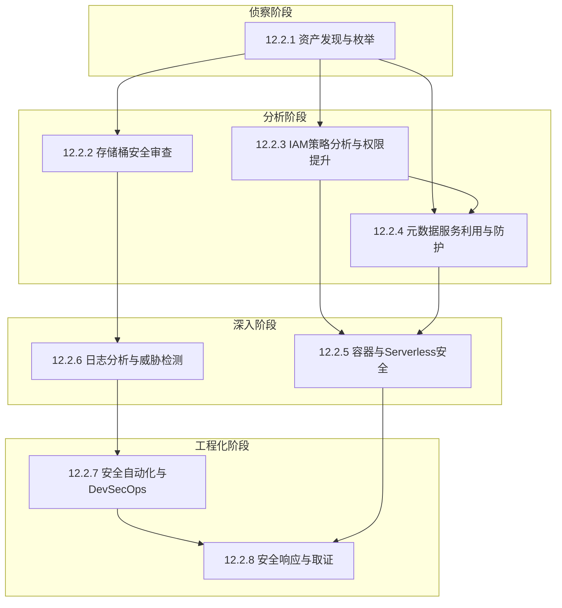
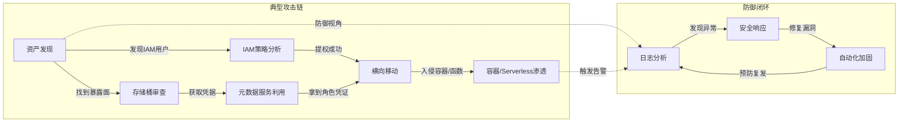

## 本节小结：云安全核心技巧全景回顾

本节围绕云安全评估与攻防的八大核心技巧展开，从资产发现到安全响应，构建了一条完整的云安全实战能力链。以下对每个技巧进行系统性回顾，梳理关键知识点、核心工具、常见陷阱，并通过知识图谱展示各技巧之间的逻辑关联。

### 核心技巧知识体系总览



上图展示了八大技巧的工作流关系：**侦察→分析→深入→工程化**，形成从手动评估到自动化防御的完整闭环。

---

### 八大核心技巧要点回顾

#### 12.2.1 云环境资产发现与枚举

**核心要义**：你无法保护看不见的东西。资产发现是所有云安全工作的起点。

**关键知识点**：

| 维度 | 要点 | 说明 |
|------|------|------|
| 发现范围 | 计算实例、存储桶、数据库、Lambda函数、API网关、DNS记录 | 云资产远不止虚拟机，需要覆盖所有托管服务 |
| 核心工具 | CloudMapper、ScoutSuite、Prowler、CloudSploit | 不同工具侧重点不同，建议组合使用 |
| 枚举手法 | API枚举、DNS暴力枚举、证书透明度日志、搜索引擎（GrayHatWarfare） | 攻击者视角的枚举方法往往比防御者更全面 |
| 云平台差异 | AWS侧重Organization和Account结构，Azure侧重Subscription和Resource Group，GCP侧重Project | 资产组织模型直接影响枚举策略 |

**实战要点**：在AWS环境中，使用`aws organizations list-accounts`获取所有子账户，再逐账户枚举资源。注意Service Control Policies（SCP）可能限制可见性——即使你有管理员权限，如果SCP显式拒绝了某些操作，枚举结果也会不完整。

**常见陷阱**：

- 忘记枚举跨区域资源，默认只查当前区域
- 忽略已停止但未终止的实例（它们仍然消耗资源，且可能被重新启动）
- 未检查CloudFormation/Terraform状态文件，其中包含完整的资源清单
- 忽视共享资源（如跨账号共享的AMI、快照、子网）

---

#### 12.2.2 存储桶安全配置审查

**核心要义**：存储桶是云安全事故中排名第一的攻击向量。一个配置错误的存储桶可能暴露数百万条敏感记录。

**关键知识点**：

| 维度 | 要点 | 说明 |
|------|------|------|
| 权限模型 | ACL、Bucket Policy、IAM Policy三层叠加 | 三层策略中任何一个配置不当都可能导致公开访问 |
| 审查要点 | 公开访问、匿名列表、未加密、日志未启用、版本控制未开启 | 按风险等级排序审查 |
| 检测工具 | Prowler、ScoutSuite、aws s3api get-bucket-acl、CloudMapper | 自动化扫描+手动验证结合 |
| 加密配置 | SSE-S3、SSE-KMS、SSE-C、客户端加密 | 不同加密方式的安全强度和管理复杂度差异显著 |

**实战要点**：审查存储桶安全时，不能只看Bucket Policy，还需要检查ACL。AWS在2023年推出的"Block Public Access"功能可以在账户级别阻止公开访问，但该功能需要显式启用。对于已经存在的存储桶，`aws s3api get-public-access-block`可以检查该配置是否生效。

**常见陷阱**：

- 误以为"Block Public Access"开启就绝对安全（它不阻止IAM级别的跨账号访问）
- 忘记检查存储桶内的对象级ACL（Bucket级别私有不等于对象级别私有）
- 忽略日志存储桶本身的安全（如果访问日志存储桶被公开，日志中的敏感信息也会泄露）
- 未考虑存储桶策略中的条件键（如`aws:SourceIp`、`aws:SourceVpce`）是否真正有效

---

#### 12.2.3 IAM策略分析与权限提升

**核心要义**：IAM配置不当是云环境中最常见、影响最大的安全风险。理解策略评估逻辑是发现权限提升路径的前提。

**关键知识点**：

| 维度 | 要点 | 说明 |
|------|------|------|
| 策略评估逻辑 | 显式Deny → SCP Deny → 显式Allow → SCP Allow → 默认Deny | 理解评估顺序是分析策略冲突的基础 |
| 权限提升路径 | iam:PassRole+lambda:CreateFunction、sts:AssumeRole、iam:CreatePolicyVersion、iam:SetDefaultPolicyVersion | 每种路径对应不同的攻击场景 |
| 分析工具 | CloudMapper、Pacu、enumerate-iam、iam-lens | 自动化发现过度授权和提权路径 |
| 关键概念 | 通配符滥用、条件键绕过、信任策略（Trust Policy）、SCP限制 | 细节决定安全与否 |

**实战要点**：使用Pacu框架的`iam__privesc_scan`模块可以自动检测当前凭证的权限提升路径。但要注意，自动化工具可能遗漏复杂的多步提权路径——例如，单独看每个权限都不构成提权，但组合起来可以实现：`iam:AttachUserPolicy` + `iam:CreateUser` + `iam:CreateAccessKey` → 创建新用户并附加管理员策略。

**常见陷阱**：

- 只看Identity-based Policies，忽略Resource-based Policies和Permission Boundaries
- 忽略服务角色（Service-Linked Roles）的隐式权限
- 未检查STS临时凭证的会话策略（Session Policies）限制
- 误以为`NotAction`和`Deny`等价（`NotAction`的实际含义是"允许除列出之外的所有操作"）

---

#### 12.2.4 云元数据服务利用与防护

**核心要义**：云元数据服务是云渗透中的关键跳板，通过SSRF漏洞访问元数据服务可以获取临时凭证，实现从Web应用到云基础设施的攻击跨越。

**关键知识点**：

| 维度 | 要点 | 说明 |
|------|------|------|
| 服务端点 | AWS: 169.254.169.254/latest/meta-data/，GCP: metadata.google.internal，Azure: 169.254.169.254/metadata/ | 不同云商的元数据端点地址和访问方式不同 |
| 凭证获取 | IAM角色临时凭证（AccessKeyId、SecretAccessKey、Token） | 凭证有效期通常为数小时，攻击窗口有限 |
| IMDS版本 | IMDSv1（GET请求，易受SSRF利用）vs IMDSv2（需先PUT获取Token，增加攻击难度） | IMDSv2需要两步请求，有效防御简单SSRF |
| 攻击链 | SSRF → 元数据 → 凭证提取 → API调用 → 横向移动 | Capital One事件就是这条攻击链的典型案例 |

**实战要点**：检查目标是否启用了IMDSv2的命令：

```bash
# 检查是否允许IMDSv1
aws ec2 describe-instances --instance-ids i-xxxxx \
  --query 'Reservations[].Instances[].MetadataOptions.HttpTokens'
# 返回 "optional" 表示仍允许IMDSv1，"required" 表示已强制IMDSv2
```

**常见陷阱**：

- 误以为IMDSv2完全防御SSRF（攻击者如果能控制HTTP头（如Host头），仍可能绕过）
- 忽略容器环境中的元数据服务（ECS Task Metadata、Pod的ServiceAccount Token）
- 未检查Lambda函数的执行角色权限（Lambda函数的临时凭证同样存储在元数据中）
- 忘记云商元数据服务的更新路径（如AWS的`latest`可能在未来版本中变更）

---

#### 12.2.5 容器与Serverless安全

**核心要义**：容器和Serverless是云原生架构的两大支柱，它们的安全模型与传统虚拟机有本质区别。

**关键知识点**：

| 维度 | 要点 | 说明 |
|------|------|------|
| 容器安全 | 镜像漏洞扫描、特权容器检测、namespace隔离、seccomp配置 | 容器不是虚拟机，隔离边界更弱 |
| K8s安全 | RBAC配置审查、etcd加密、NetworkPolicy、PodSecurityPolicy/Standards | Kubernetes的攻击面极广，RBAC是核心 |
| Serverless | 事件注入、函数间调用链利用、冷启动安全、依赖漏洞 | 无服务器不等于无安全问题 |
| 检测工具 | Trivy（镜像扫描）、kube-bench（CIS基准）、kubeaudit、Snyk | 不同工具覆盖不同层面 |

**实战要点**：Kubernetes安全审查应从以下几个层面系统进行：

```bash
# 1. 检查是否有特权容器
kubectl get pods --all-namespaces -o json | \
  jq '.items[] | select(.spec.containers[].securityContext.privileged==true)'

# 2. 检查RBAC中是否有cluster-admin绑定
kubectl get clusterrolebindings -o json | \
  jq '.items[] | select(.roleRef.name=="cluster-admin")'

# 3. 检查etcd是否加密
kubectl get secrets --all-namespaces | wc -l
# 如果Secret数量很多且etcd未加密，风险极高
```

**常见陷阱**：

- 以为容器镜像来自官方仓库就安全（Docker Hub上的官方镜像也曾被发现包含挖矿程序）
- 忽略容器运行时的安全配置（如Docker socket挂载到容器内是严重的安全风险）
- 未检查Serverless函数的IAM角色权限（函数权限过大可能导致整个云账户被接管）
- 忘记扫描容器镜像中的硬编码密钥和敏感信息

---

#### 12.2.6 日志分析与威胁检测

**核心要义**：云审计日志是威胁检测的核心数据源。没有日志，安全事件就是暗箱操作。

**关键知识点**：

| 维度 | 要点 | 说明 |
|------|------|------|
| 日志源 | AWS CloudTrail、Azure Activity Log、GCP Audit Log、VPC Flow Logs | 不同日志覆盖不同层面 |
| 关键事件 | 权限变更、安全组修改、IAM策略创建/修改、登录异常、API调用模式异常 | 高价值事件需要重点监控 |
| 分析方法 | 基于规则的检测、行为基线异常检测、威胁情报关联、图分析 | 多种方法结合才能降低误报 |
| 工具链 | CloudWatch Logs、Azure Sentinel、GCP Chronicle、Splunk、OpenSearch | 选择合适的SIEM平台至关重要 |

**实战要点**：以下是CloudTrail日志中最值得关注的高风险事件：

```text
# IAM权限变更
- CreatePolicyVersion / SetDefaultPolicyVersion
- AttachUserPolicy / AttachRolePolicy
- CreateUser / CreateRole / CreateAccessKey

# 安全配置变更
- RevokeSecurityGroupIngress / AuthorizeSecurityGroupIngress
- StopLogging（禁用CloudTrail本身）
- PutBucketPolicy（存储桶策略变更）

# 异常登录
- ConsoleLogin（异常IP/地理位置）
- AssumeRole（异常源账户）
- GetFederationToken（联邦令牌请求）
```

**常见陷阱**：

- 只启用CloudTrail但不配置日志分析（日志躺在S3里等于没用）
- 忘记监控管理事件（Management Events）和数据事件（Data Events）的区别
- 未设置日志完整性验证（CloudTrail Log File Integrity Validation），日志可能被篡改
- 忽略多账户环境中的日志聚合（每个子账户的日志需要集中到安全账户分析）

---

#### 12.2.7 云安全自动化与DevSecOps

**核心要义**：安全必须左移（Shift Left），集成到CI/CD管道中，在开发阶段就发现和修复安全问题。

**关键知识点**：

| 维度 | 要点 | 说明 |
|------|------|------|
| IaC安全 | Terraform/CloudFormation模板扫描、策略合规检查、漂移检测 | 基础设施即代码意味着安全问题也可以被编码 |
| 容器安全 | 镜像扫描（构建时+部署时）、签名验证、运行时防护 | 容器安全需要贯穿整个生命周期 |
| 策略即代码 | OPA/Rego、AWS Config Rules、Azure Policy、Sentinel（HashiCorp） | 将安全策略从人工审计转为自动化执行 |
| CI/CD安全 | 密钥管理、流水线权限控制、制品签名、审批流程 | CI/CD管道本身也是攻击目标 |

**实战要点**：一个完整的CI/CD安全集成流程应包含以下检查点：

```yaml
# GitLab CI 示例：安全扫描集成
stages:
  - lint
  - security-scan
  - build
  - deploy

iac-scan:
  stage: security-scan
  script:
    - checkov -d . --framework terraform
    - tfsec .
    - terrascan scan -i terraform

container-scan:
  stage: security-scan
  script:
    - trivy image --severity HIGH,CRITICAL myapp:latest
    - grype myapp:latest

secret-scan:
  stage: security-scan
  script:
    - gitleaks detect --source .
    - trufflehog filesystem .
```

**常见陷阱**：

- 只在构建阶段扫描，忽略运行时的安全检测
- IaC扫描工具的误报率高导致团队忽略扫描结果（需要调优规则）
- 密钥扫描只覆盖当前代码，不覆盖Git历史（`trufflehog`可以扫描历史提交）
- 未建立安全扫描结果的处理流程（发现问题后谁来修、多久修完、如何验证）

---

#### 12.2.8 安全响应与取证

**核心要义**：云安全事件不可避免。快速响应和有效取证是降低损失的关键。

**关键知识点**：

| 维度 | 要点 | 说明 |
|------|------|------|
| 响应流程 | 检测→遏制→根除→恢复→复盘 | 云环境的遏制策略与传统环境不同 |
| 取证要点 | 快照取证（而非直接登录）、CloudTrail日志保全、内存取证（EC2实例）、网络流量捕获 | 云取证需要特别注意数据完整性 |
| 遏制策略 | IAM凭证吊销、安全组封锁、VPC隔离、资源快照 | 云环境的遏制可以在秒级完成 |
| 工具链 | AWS GuardDuty、Azure Defender、GCP Security Command Center、Prowler Incident Response | 各云商都提供原生的安全响应工具 |

**实战要点**：云安全事件响应的首要步骤——**遏制**：

```bash
# 1. 立即吊销泄露的IAM凭证
aws iam update-access-key --access-key-id AKIAXXXXXXX \
  --status Inactive --user-name compromised-user
aws iam delete-access-key --access-key-id AKIAXXXXXXX \
  --user-name compromised-user

# 2. 创建受影响实例的快照（取证用）
aws ec2 create-snapshot --volume-id vol-xxxxx \
  --description "forensic-snapshot-$(date +%Y%m%d)"

# 3. 隔离受影响实例（修改安全组只允许取证IP）
aws ec2 modify-instance-attribute --instance-id i-xxxxx \
  --groups sg-forensic-only

# 4. 检查是否有持久化后门
aws iam list-user-policies --user-name compromised-user
aws iam list-attached-user-policies --user-name compromised-user
aws lambda list-functions | jq '.Functions[] | select(.Role | contains("suspicious"))'
```

**常见陷阱**：

- 直接登录被入侵实例进行调查（会篡改证据链）
- 忘记检查攻击者是否创建了持久化后门（如IAM用户、Lambda函数、CloudFormation Stack）
- 未保留足够长时间的日志（CloudTrail默认保留90天，高级攻击的驻留时间可能超过6个月）
- 忽略横向移动的可能性（只处理被发现的账户，不检查其他账户是否也被攻陷）

---

### 技巧之间的逻辑关联

理解八大技巧之间的关联比单独掌握每个技巧更重要。在实际的云安全评估或渗透测试中，这些技巧是串联使用的：



**从攻击者视角看**：攻击链是"资产发现 → 漏洞识别 → 凭据获取 → 权限提升 → 横向移动 → 持久化 → 数据窃取"。

**从防御者视角看**：防御闭环是"资产清点 → 配置加固 → 持续监控 → 自动响应 → 事件复盘 → 策略优化"。

两种视角覆盖相同的八大技巧，只是方向相反。

---

### 本节关键技能矩阵

以下表格总结了每个技巧对应的难度级别、学习优先级和预期掌握时间：

| 技巧编号 | 技巧名称 | 难度 | 优先级 | 预计学习时间 | 核心工具数量 |
|---------|---------|------|--------|-------------|-------------|
| 12.2.1 | 资产发现与枚举 | ⭐⭐ | 最高 | 6-8小时 | 4-5个 |
| 12.2.2 | 存储桶安全审查 | ⭐⭐ | 最高 | 4-6小时 | 3-4个 |
| 12.2.3 | IAM策略分析与权限提升 | ⭐⭐⭐⭐ | 最高 | 10-15小时 | 4-5个 |
| 12.2.4 | 元数据服务利用与防护 | ⭐⭐⭐ | 高 | 4-6小时 | 2-3个 |
| 12.2.5 | 容器与Serverless安全 | ⭐⭐⭐⭐ | 高 | 8-12小时 | 5-6个 |
| 12.2.6 | 日志分析与威胁检测 | ⭐⭐⭐ | 高 | 6-8小时 | 3-4个 |
| 12.2.7 | 安全自动化与DevSecOps | ⭐⭐⭐⭐ | 中 | 8-10小时 | 6-8个 |
| 12.2.8 | 安全响应与取证 | ⭐⭐⭐⭐ | 中 | 6-8小时 | 4-5个 |

**学习建议**：按上表的优先级排序学习。12.2.1（资产发现）和12.2.2（存储桶审查）是最基础的技能，几乎所有云安全工作都从这两步开始。12.2.3（IAM策略分析）是最难但也是最有价值的技能——IAM是云安全的核心，掌握IAM策略分析能力意味着你能发现大多数云环境中的权限问题。

---

### 从核心技巧到实战：能力转化路径

掌握本节的八大技巧后，读者应具备以下能力：

**初级能力（通过学习即可获得）**：

- 能够使用自动化工具对云环境进行基础安全扫描
- 能够识别常见的云配置错误（如公开存储桶、过度授权的IAM角色）
- 能够理解云审计日志中的关键事件

**中级能力（需要配合实操练习）**：

- 能够手动分析IAM策略并识别权限提升路径
- 能够设计和实施云安全监控方案
- 能够进行容器和Kubernetes集群的安全审查

**高级能力（需要实战经验积累）**：

- 能够构建完整的云安全自动化管道
- 能够主导云安全事件的响应和取证工作
- 能够设计多云/混合云环境的安全架构

下一节将通过五个真实案例，将本节学习的技巧应用到实际场景中。每个案例都是一条完整的攻击链分析，展示如何将单项技巧串联成端到端的安全评估能力。建议在阅读案例前，先确保对本节的八大技巧有基本的理解——案例分析会假设读者已经掌握了这些基础知识。
