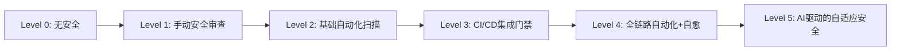
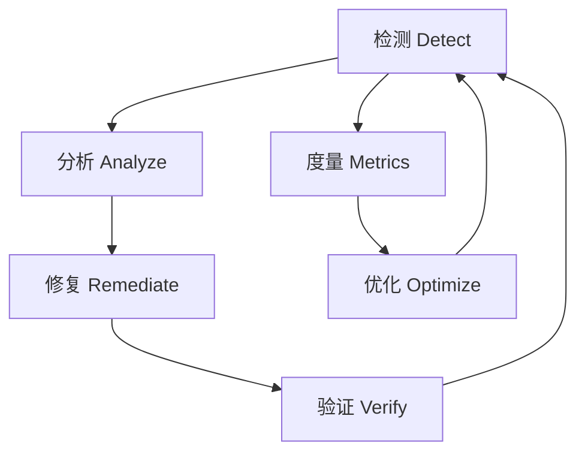

## 12.2.7 云安全自动化与DevSecOps

传统安全模式中，安全团队在开发完成后才介入审查，导致漏洞发现晚、修复成本高。DevSecOps的核心理念是"安全左移"（Shift Left Security）——将安全检查嵌入软件交付的每个阶段，从设计到部署全链路自动化。本节系统讲解云安全自动化的理论体系、工程实践与工具链。

### DevSecOps核心理念

#### 为什么需要DevSecOps

传统安全模式的痛点非常明确：

| 阶段 | 传统模式 | DevSecOps模式 |
|------|---------|--------------|
| 需求阶段 | 安全不参与 | 威胁建模（STRIDE） |
| 开发阶段 | 无安全检查 | IDE安全插件 + 预提交钩子 |
| 构建阶段 | 无扫描 | SAST + SCA + 密钥检测 |
| 测试阶段 | 手动渗透测试 | DAST + IAST + 自动化安全测试 |
| 部署阶段 | 部署后审查 | IaC扫描 + 策略门禁 |
| 运行阶段 | 被动响应 | CSPM + 运行时保护 + 自动修复 |

IBM《数据泄露成本报告》数据显示：在开发阶段发现并修复一个漏洞的平均成本约80美元，而在生产环境中修复同一漏洞的成本超过7,600美元，差距接近100倍。这不是一个可以忽略的数字——它直接决定了安全投入的ROI。

#### DevSecOps成熟度模型



- **Level 0-1**：大多数传统企业处于此阶段，安全靠人工，效率低且覆盖面窄
- **Level 2-3**：DevSecOps入门阶段，扫描工具集成到CI/CD，但策略管理仍手动
- **Level 4**：高级阶段，策略即代码、合规自动修复、运行时保护全部自动化
- **Level 5**：前沿探索，利用ML模型分析异常行为、自动调整安全策略

### 基础设施即代码（IaC）安全

#### IaC安全的核心风险

IaC将基础设施定义为代码，这意味着配置错误也会像代码Bug一样被批量复制。2019年Capital One数据泄露事件的根本原因就是一个WAF配置错误导致的SSRF漏洞——如果当时有IaC安全扫描，这个问题在部署前就能被拦截。

IaC安全扫描的核心检查维度：

- **网络暴露**：安全组是否开放了0.0.0.0/0、端口是否过度暴露
- **加密配置**：存储是否启用加密、传输是否强制TLS、密钥管理是否合规
- **访问控制**：IAM策略是否遵循最小权限、存储桶ACL是否公开
- **日志审计**：是否启用CloudTrail/FlowLogs、日志是否集中存储
- **资源标记**：是否包含必要的安全标签（如数据分类、环境标识）

#### 主流IaC扫描工具对比

| 工具 | 支持平台 | 许可证 | 规则数量 | 自定义规则 | 集成方式 |
|------|---------|-------|---------|-----------|---------|
| Checkov | Terraform, CloudFormation, K8s, ARM, Bicep | Apache 2.0 | 1000+ | Python/CEL | CLI, CI/CD, IDE插件 |
| tfsec | Terraform | MIT | 200+ | Rego | CLI, pre-commit |
| Terrascan | Terraform, K8s, Helm, Kustomize | Apache 2.0 | 500+ | Rego | CLI, Admission Controller, CI/CD |
| KICS | Terraform, CloudFormation, ARM, Dockerfile, Ansible | Apache 2.0 | 1500+ | Rego | CLI, CI/CD |
| Trivy | Terraform, CloudFormation, Dockerfile, K8s | Apache 2.0 | 内置 | Rego | CLI, CI/CD |

选择建议：如果你的环境以AWS为主，Checkov是首选（规则最丰富）；如果需要多平台统一扫描，KICS覆盖面最广；如果已经使用Trivy做容器扫描，直接复用它的IaC扫描功能可以减少工具数量。

#### 实战：Terraform安全配置与扫描

以下是生产级的S3安全配置，展示了多个安全最佳实践：

```hcl
# 安全的S3配置 - 生产级
resource "aws_s3_bucket" "secure" {
  bucket = "my-private-bucket"

  # 阻止意外删除
  lifecycle {
    prevent_destroy = true
  }

  # 强制服务端加密
  server_side_encryption_configuration {
    rule {
      apply_server_side_encryption_by_default {
        sse_algorithm     = "aws:kms"
        kms_master_key_id = aws_kms_key.s3_key.arn
      }
      bucket_key_enabled = true  # 降低KMS成本
    }
  }

  # 启用版本控制，防止数据丢失
  versioning {
    enabled = true
  }

  # 访问日志
  logging {
    target_bucket = aws_s3_bucket.logs.id
    target_prefix = "s3-access-logs/"
  }

  # 对象锁定（合规要求）
  object_lock_configuration {
    object_lock_enabled = "Enabled"
    rule {
      default_retention {
        mode = "COMPLIANCE"
        days = 365
      }
    }
  }

  tags = {
    Environment = "production"
    DataClass   = "confidential"
    ManagedBy   = "terraform"
  }
}

# 阻止所有公开访问
resource "aws_s3_bucket_public_access_block" "secure" {
  bucket = aws_s3_bucket.secure.id

  block_public_acls       = true
  block_public_policy     = true
  ignore_public_acls      = true
  restrict_public_buckets = true
}

# 强制SSL传输
resource "aws_s3_bucket_policy" "force_ssl" {
  bucket = aws_s3_bucket.secure.id
  policy = jsonencode({
    Version = "2012-10-17"
    Statement = [
      {
        Sid       = "ForceSSL"
        Effect    = "Deny"
        Principal = "*"
        Action    = "s3:*"
        Resource = [
          aws_s3_bucket.secure.arn,
          "${aws_s3_bucket.secure.arn}/*"
        ]
        Condition = {
          Bool = {
            "aws:SecureTransport" = "false"
          }
        }
      }
    ]
  })
}
```

在CI/CD中集成Checkov扫描：

```yaml
# .github/workflows/iac-security.yml
name: IaC Security Scan
on: [pull_request]

jobs:
  checkov:
    runs-on: ubuntu-latest
    steps:
      - uses: actions/checkout@v4
      - name: Run Checkov
        uses: bridgecrewio/checkov-action@v12
        with:
          directory: ./terraform
          framework: terraform
          output_format: junitxml
          output_file_path: checkov-report.xml
          soft_fail: false          # 发现HIGH/CRITICAL则阻断
          skip_check: CKV_AWS_18   # 跳过特定规则需在PR中说明原因
```

#### 自定义扫描规则

当内置规则不满足需求时，可以用Checkov的Python自定义检查：

```python
# checkov/terraform/checks/resource/S3EncryptionAlgorithm.py
from checkov.terraform.checks.resource.base_resource_check import BaseResourceCheck
from checkov.common.models.enums import CheckCategories, CheckResult

class S3KmsEncryptionOnly(BaseResourceCheck):
    def __init__(self):
        name = "Ensure S3 uses KMS encryption (not AES256)"
        id = "CKV_CUSTOM_S3_KMS"
        supported_resources = ["aws_s3_bucket"]
        categories = [CheckCategories.ENCRYPTION]
        super().__init__(name, id, supported_resources, categories)

    def scan_resource_conf(self, conf):
        encryption = conf.get("server_side_encryption_configuration")
        if not encryption:
            return CheckResult.FAILED
        # 检查是否使用KMS而非AES256
        rule = encryption[0].get("rule", [{}])
        default_enc = rule[0].get("apply_server_side_encryption_by_default", [{}])
        algorithm = default_enc[0].get("sse_algorithm", [""])
        if algorithm[0] == "aws:kms":
            return CheckResult.PASSED
        return CheckResult.FAILED

check = S3KmsEncryptionOnly()
```

### CI/CD安全管道

#### 安全门禁设计原则

CI/CD安全管道不是简单地堆砌扫描工具，而需要遵循以下原则：

1. **分层防御**：SAST、SCA、Secret Detection、IaC扫描各司其职，不重叠不遗漏
2. **快速反馈**：开发者提交代码后5分钟内获得安全反馈，而非等待完整管道
3. **分级处理**：CRITICAL/HIGH阻断部署，MEDIUM创建Issue，LOW仅记录
4. **例外管理**：误报通过MR注释标记抑制，而非关闭规则本身
5. **度量驱动**：跟踪平均修复时间（MTTR）、漏洞引入率、扫描覆盖率

#### 完整CI/CD安全管道示例

```yaml
# GitLab CI/CD 完整安全管道
stages:
  - pre-commit    # 快速检查，< 1分钟
  - security-scan # 全面扫描，3-10分钟
  - build         # 构建 + 镜像扫描
  - deploy        # 部署前策略检查

variables:
  TRIVY_SEVERITY: "HIGH,CRITICAL"
  TRIVY_EXIT_CODE: "1"  # 发现漏洞则失败

# === 第一阶段：快速预检 ===
secret-detection:
  stage: pre-commit
  script:
    - gitleaks detect --source . --report-format sarif --report-path gitleaks.sarif
    - trufflehog filesystem . --json > trufflehog.json || true
  artifacts:
    reports:
      sast: gitleaks.sarif

# === 第二阶段：全面安全扫描 ===
sast:
  stage: security-scan
  script:
    - semgrep --config=auto --config=p/owasp-top-ten --sarif -o semgrep.sarif .
  artifacts:
    reports:
      sast: semgrep.sarif

dependency-check:
  stage: security-scan
  script:
    - trivy fs --exit-code 1 --severity $TRIVY_SEVERITY --format json -o trivy-deps.json .
    - npm audit --production --audit-level=high || true  # 双重验证
  artifacts:
    reports:
      dependency_scanning: trivy-deps.json

iac-scan:
  stage: security-scan
  script:
    - checkov -d ./terraform --framework terraform --output junitxml --output-file checkov.xml
    - checkov -d ./k8s --framework kubernetes --output junitxml --output-file checkov-k8s.xml
  artifacts:
    reports:
      junit: checkov.xml

# === 第三阶段：构建 + 镜像安全 ===
container-build:
  stage: build
  script:
    - docker build -t $IMAGE .
    - trivy image --exit-code 1 --severity $TRIVY_SEVERITY $IMAGE
    - cosign sign --key cosign.key $IMAGE  # 镜像签名

# === 第四阶段：部署策略检查 ===
policy-check:
  stage: deploy
  script:
    - conftest test ./k8s/ --policy ./policies/  # OPA策略检查
    - kube-score score ./k8s/deployment.yaml     # K8s安全评分
  only:
    - main
```

#### GitHub Actions安全管道

```yaml
# .github/workflows/devsecops.yml
name: DevSecOps Pipeline
on:
  pull_request:
  push:
    branches: [main]

jobs:
  # 代码扫描
  code-security:
    runs-on: ubuntu-latest
    steps:
      - uses: actions/checkout@v4
      - name: Semgrep SAST
        uses: returntocorp/semgrep-action@v1
        with:
          config: >-
            p/owasp-top-ten
            p/security-audit
            p/secrets
      - name: Dependency Review
        uses: actions/dependency-review-action@v4
        with:
          fail-on-severity: high

  # IaC扫描
  iac-security:
    runs-on: ubuntu-latest
    steps:
      - uses: actions/checkout@v4
      - name: Checkov Scan
        uses: bridgecrewio/checkov-action@v12
        with:
          directory: ./terraform
          soft_fail: false

  # 容器扫描
  container-security:
    needs: [code-security]
    runs-on: ubuntu-latest
    steps:
      - uses: actions/checkout@v4
      - name: Build Image
        run: docker build -t app:${{ github.sha }} .
      - name: Trivy Scan
        uses: aquasecurity/trivy-action@master
        with:
          image-ref: app:${{ github.sha }}
          severity: HIGH,CRITICAL
          exit-code: 1
```

### 策略即代码（Policy as Code）

#### 策略即代码的核心思想

策略即代码是DevSecOps成熟度的关键标志——将安全策略从"写在Wiki里的文档"变成"可执行、可测试、可版本控制的代码"。它的核心价值：

- **一致性**：所有环境执行相同的策略，不会因为人为疏忽导致环境差异
- **可审计**：策略变更有Git历史，满足合规审计要求
- **可测试**：策略本身可以写单元测试，验证覆盖所有边界条件
- **自动化**：集成到CI/CD和Admission Controller中，无需人工介入

#### Open Policy Agent（OPA）实战

OPA是CNCF毕业项目，是策略即代码的事实标准。它使用Rego语言编写策略，可以集成到Kubernetes、Terraform、API网关等多种场景。

**基础策略示例：**

```rego
# policy/s3_security.rego
package terraform.s3

import future.keywords.in

# 禁止公开S3桶
deny[msg] {
    resource := input.resource_changes[_]
    resource.type == "aws_s3_bucket"
    resource.change.after.acl == "public-read"
    msg := sprintf("S3桶 '%s' 不应设置为公开读取", [resource.address])
}

deny[msg] {
    resource := input.resource_changes[_]
    resource.type == "aws_s3_bucket"
    resource.change.after.acl == "public-read-write"
    msg := sprintf("S3桶 '%s' 绝对不能设置为公开读写", [resource.address])
}

# 强制服务端加密
deny[msg] {
    resource := input.resource_changes[_]
    resource.type == "aws_s3_bucket"
    not resource.change.after.server_side_encryption_configuration
    msg := sprintf("S3桶 '%s' 必须配置服务端加密", [resource.address])
}

# 强制版本控制
deny[msg] {
    resource := input.resource_changes[_]
    resource.type == "aws_s3_bucket"
    not resource.change.after.versioning
    msg := sprintf("S3桶 '%s' 必须启用版本控制", [resource.address])
}

# 检查安全组规则
deny[msg] {
    resource := input.resource_changes[_]
    resource.type == "aws_security_group_rule"
    resource.change.after.type == "ingress"
    resource.change.after.cidr_blocks[_] == "0.0.0.0/0"
    resource.change.after.from_port == 22
    msg := sprintf("安全组 '%s' 不允许从公网开放SSH端口", [resource.address])
}
```

**集成到Terraform工作流：**

```bash
# 安装conftest（OPA的测试工具）
brew install conftest

# 生成Terraform计划
terraform plan -out=tfplan
terraform show -json tfplan > tfplan.json

# 运行策略检查
conftest test tfplan.json --policy policy/

# 输出示例：
# FAIL - tfplan.json - main - S3桶 'aws_s3_bucket.public' 绝对不能设置为公开读写
# 2 tests, 0 passed, 0 warnings, 2 failures
```

**为策略编写测试：**

```rego
# policy/s3_security_test.rego
package terraform.s3

test_deny_public_acl {
    input := {
        "resource_changes": [{
            "type": "aws_s3_bucket",
            "address": "aws_s3_bucket.test",
            "change": {"after": {"acl": "public-read"}}
        }]
    }
    count(deny) == 1 with input as input
}

test_allow_private_bucket {
    input := {
        "resource_changes": [{
            "type": "aws_s3_bucket",
            "address": "aws_s3_bucket.test",
            "change": {"after": {
                "acl": "private",
                "server_side_encryption_configuration": [{"rule": [{}]}],
                "versioning": [{"enabled": true}]
            }}
        }]
    }
    count(deny) == 0 with input as input
}
```

#### AWS服务控制策略（SCP）

SCP是在AWS Organizations层面对所有账户施加的边界策略，防止即便是管理员账号也能执行危险操作：

```json
{
  "Version": "2012-10-17",
  "Statement": [
    {
      "Sid": "DenyRootUserActions",
      "Effect": "Deny",
      "Action": "*",
      "Resource": "*",
      "Condition": {
        "StringLike": {
          "aws:PrincipalArn": "arn:aws:iam::*:root"
        }
      }
    },
    {
      "Sid": "DenyDisablingCloudTrail",
      "Effect": "Deny",
      "Action": [
        "cloudtrail:StopLogging",
        "cloudtrail:DeleteTrail"
      ],
      "Resource": "*"
    },
    {
      "Sid": "DenyUnencryptedUploads",
      "Effect": "Deny",
      "Action": "s3:PutObject",
      "Resource": "*",
      "Condition": {
        "StringNotEquals": {
          "s3:x-amz-server-side-encryption": "aws:kms"
        }
      }
    },
    {
      "Sid": "RestrictRegions",
      "Effect": "Deny",
      "Action": "*",
      "Resource": "*",
      "Condition": {
        "StringNotEquals": {
          "aws:RequestedRegion": ["us-east-1", "eu-west-1", "ap-northeast-1"]
        }
      }
    }
  ]
}
```

### 云安全合规自动化

#### 合规框架与自动化映射

不同行业有不同的合规要求，自动化的核心是将合规条款映射到可机器检查的规则：

| 合规框架 | 关键要求 | 自动化检查工具 |
|---------|---------|--------------|
| CIS Benchmark | 加固配置基线 | Prowler, ScoutSuite, CIS-CAT |
| SOC 2 | 访问控制、审计日志、变更管理 | AWS Config, Azure Policy |
| PCI DSS | 信用卡数据保护、网络分段 | Prisma Cloud, Wiz |
| HIPAA | 健康数据加密、访问审计 | AWS Config + Config Rules |
| GDPR | 数据驻留、删除权、加密 | 自定义SCP + Config Rule |
| 等保2.0 | 分级保护、安全审计 | 阿里云安全中心、腾讯云合规中心 |

#### AWS Config合规自动化

```bash
# 启用AWS Config记录器
aws configservice put-configuration-recorder \
  --configuration-recorder name=default,roleARN=arn:aws:iam::123456789012:role/awsconfigrole \
  --recording-group allSupported=true,includeGlobalResourceTypes=true

# 创建合规规则 - 禁止公开S3读取
aws configservice put-config-rule --config-rule '{
  "ConfigRuleName": "s3-bucket-public-read-prohibited",
  "Source": {
    "Owner": "AWS",
    "SourceIdentifier": "S3_BUCKET_PUBLIC_READ_PROHIBITED"
  },
  "Scope": {
    "ComplianceResourceTypes": ["AWS::S3::Bucket"]
  }
}'

# 创建合规规则 - EBS卷必须加密
aws configservice put-config-rule --config-rule '{
  "ConfigRuleName": "encrypted-volumes",
  "Source": {
    "Owner": "AWS",
    "SourceIdentifier": "ENCRYPTED_VOLUMES"
  }
}'

# 创建合规规则 - 安全组不允许22端口对外开放
aws configservice put-config-rule --config-rule '{
  "ConfigRuleName": "restricted-ssh",
  "Source": {
    "Owner": "AWS",
    "SourceIdentifier": "INCOMING_SSH_DISABLED"
  }
}'

# 查询整体合规状态
aws configservice describe-compliance-by-config-rule --output table

# 查询不合规资源详情
aws configservice get-compliance-details-by-config-rule \
  --config-rule-name s3-bucket-public-read-prohibited \
  --compliance-types NON_COMPLIANT
```

#### 自动修复不合规资源

AWS Config的自动修复（Auto Remediation）功能可以在检测到不合规资源时自动执行修复：

```hcl
# Terraform定义自动修复规则
resource "aws_config_remediation_configuration" "s3_public_access" {
  config_rule_name = aws_config_config_rule.s3_bucket_public_read_prohibited.name
  resource_type    = "AWS::Config::RemediationConfiguration"
  target_type      = "SSM_DOCUMENT"
  target_id        = "AWS-DisableS3BucketPublicReadWrite"
  target_version   = "1"

  parameter {
    name           = "AutomationAssumeRole"
    static_value   = aws_iam_role.config_remediation.arn
  }

  parameter {
    name                = "BucketName"
    resource_value      = "RESOURCE_ID"
  }

  automatic                  = true
  maximum_automatic_attempts = 3
  retry_attempt_seconds      = 60
}
```

#### 用Python构建合规报告自动化

```python
#!/usr/bin/env python3
"""云安全合规自动报告工具"""
import boto3
import json
from datetime import datetime

class ComplianceReporter:
    def __init__(self, region='us-east-1'):
        self.config = boto3.client('config', region_name=region)
        self.findings = []

    def check_compliance(self):
        """收集所有Config Rule的合规状态"""
        paginator = self.config.get_paginator('describe_compliance_by_config_rule')

        total_rules = 0
        compliant = 0
        non_compliant = 0

        for page in paginator.paginate():
            for rule in page.get('ComplianceByConfigRules', []):
                total_rules += 1
                status = rule['Compliance']['ComplianceType']

                if status == 'COMPLIANT':
                    compliant += 1
                elif status == 'NON_COMPLIANT':
                    non_compliant += 1
                    self._get_non_compliant_resources(rule['ConfigRuleName'])

        return {
            'timestamp': datetime.utcnow().isoformat(),
            'summary': {
                'total_rules': total_rules,
                'compliant': compliant,
                'non_compliant': non_compliant,
                'compliance_rate': f"{(compliant/total_rules*100):.1f}%" if total_rules else "N/A"
            },
            'non_compliant_findings': self.findings
        }

    def _get_non_compliant_resources(self, rule_name):
        """获取不合规资源详情"""
        response = self.config.get_compliance_details_by_config_rule(
            ConfigRuleName=rule_name,
            ComplianceTypes=['NON_COMPLIANT']
        )
        for detail in response.get('EvaluationResults', []):
            self.findings.append({
                'rule': rule_name,
                'resource_type': detail.get('EvaluationResultIdentifier', {})
                    .get('EvaluationResultQualifier', {}).get('ResourceType'),
                'resource_id': detail.get('EvaluationResultIdentifier', {})
                    .get('EvaluationResultQualifier', {}).get('ResourceId'),
                'annotation': detail.get('Annotation', 'No details'),
                'recorded_time': str(detail.get('ResultRecordedTime'))
            })

    def generate_report(self, output_format='json'):
        """生成合规报告"""
        report = self.check_compliance()

        if output_format == 'json':
            return json.dumps(report, indent=2, default=str)
        elif output_format == 'markdown':
            return self._to_markdown(report)

    def _to_markdown(self, report):
        lines = [
            f"# 云安全合规报告",
            f"**生成时间**: {report['timestamp']}",
            f"",
            f"## 概览",
            f"| 指标 | 数值 |",
            f"|------|------|",
            f"| 总规则数 | {report['summary']['total_rules']} |",
            f"| 合规 | {report['summary']['compliant']} |",
            f"| 不合规 | {report['summary']['non_compliant']} |",
            f"| 合规率 | {report['summary']['compliance_rate']} |",
            f"",
            f"## 不合规发现",
        ]

        for f in report['non_compliant_findings']:
            lines.append(f"- **{f['rule']}**: {f['resource_type']} `{f['resource_id']}` - {f['annotation']}")

        return '\n'.join(lines)

if __name__ == '__main__':
    reporter = ComplianceReporter()
    print(reporter.generate_report('markdown'))
```

### 容器与Kubernetes安全自动化

#### 镜像安全扫描

容器镜像是云安全的高危攻击面。一个基于老旧基础镜像的容器可能包含数百个已知CVE。

```bash
# Trivy：全面的容器安全扫描
# 扫描镜像漏洞
trivy image --severity HIGH,CRITICAL myapp:latest

# 扫描Dockerfile配置问题
trivy config Dockerfile

# 扫描K8s manifest
trivy k8s --namespace default cluster

# 生成SBOM（软件物料清单）
trivy image --format spdx-json -o sbom.json myapp:latest
```

```dockerfile
# 安全的Dockerfile最佳实践
FROM python:3.12-slim AS builder

WORKDIR /app
COPY requirements.txt .
RUN pip install --no-cache-dir -r requirements.txt

FROM python:3.12-slim

# 安全加固
RUN groupadd -r appuser && useradd -r -g appuser appuser
WORKDIR /app

# 从builder阶段复制依赖
COPY --from=builder /usr/local/lib/python3.12/site-packages /usr/local/lib/python3.12/site-packages
COPY --chown=appuser:appuser . .

# 不以root运行
USER appuser

# 只暴露必要端口
EXPOSE 8080

# 健康检查
HEALTHCHECK --interval=30s --timeout=3s CMD curl -f http://localhost:8080/health || exit 1

# 使用exec形式，确保信号正确传递
ENTRYPOINT ["python", "-m", "uvicorn", "app.main:app", "--host", "0.0.0.0", "--port", "8080"]
```

#### Kubernetes安全策略

使用Kyverno（Kubernetes原生策略引擎）强制执行安全基线：

```yaml
# 要求所有镜像来自可信仓库
apiVersion: kyverno.io/v1
kind: ClusterPolicy
metadata:
  name: restrict-image-registries
spec:
  validationFailureAction: Enforce
  rules:
    - name: validate-registries
      match:
        any:
          - resources:
              kinds:
                - Pod
      validate:
        message: "镜像必须来自可信仓库"
        pattern:
          spec:
            containers:
              - image:
                  - "registry.company.com/*"
                  - "gcr.io/my-project/*"
            initContainers:
              - image:
                  - "registry.company.com/*"
                  - "gcr.io/my-project/*"
---
# 禁止特权容器
apiVersion: kyverno.io/v1
kind: ClusterPolicy
metadata:
  name: disallow-privileged
spec:
  validationFailureAction: Enforce
  rules:
    - name: deny-privileged
      match:
        any:
          - resources:
              kinds:
                - Pod
      validate:
        message: "禁止运行特权容器"
        pattern:
          spec:
            containers:
              - securityContext:
                  privileged: "false"
---
# 强制资源限制
apiVersion: kyverno.io/v1
kind: ClusterPolicy
metadata:
  name: require-resource-limits
spec:
  validationFailureAction: Audit  # 先审计再强制
  rules:
    - name: check-limits
      match:
        any:
          - resources:
              kinds:
                - Pod
      validate:
        message: "所有容器必须设置CPU和内存限制"
        pattern:
          spec:
            containers:
              - resources:
                  limits:
                    memory: "?*"
                    cpu: "?*"
```

### 密钥管理自动化

#### 密钥泄露检测

密钥泄露是最常见的云安全事故之一。将密钥检测集成到开发流程的每个环节：

```bash
# 预提交钩子 - 防止密钥进入代码仓库
# .pre-commit-config.yaml
repos:
  - repo: https://github.com/gitleaks/gitleaks
    rev: v8.18.0
    hooks:
      - id: gitleaks
  - repo: https://github.com/trufflesecurity/trufflehog
    rev: v3.63.0
    hooks:
      - id: trufflehog
        args: ['--only-verified']
```

#### HashiCorp Vault动态密钥

静态密钥（如数据库密码）是安全噩梦——一旦泄露，攻击者可以长期访问。Vault的动态密钥功能为每个应用实例生成唯一的、短期的凭据：

```bash
# 启用数据库密钥引擎
vault secrets enable database

# 配置MySQL连接
vault write database/config/mydb \
    plugin_name=mysql-database-plugin \
    connection_url="{{username}}:{{password}}@tcp(db.example.com:3306)/" \
    allowed_roles="readonly" \
    username="vault_admin" \
    password="SuperSecret"

# 创建角色 - 生成的凭据有效期1小时
vault write database/roles/readonly \
    db_name=mydb \
    creation_statements="CREATE USER '{{name}}'@'%' IDENTIFIED BY '{{password}}'; \
        GRANT SELECT ON mydb.* TO '{{name}}'@'%';" \
    default_ttl="1h" \
    max_ttl="24h"

# 应用获取临时凭据
vault read database/creds/readonly
# Key                Value
# ---                -----
# lease_id           database/creds/readonly/abc123
# lease_duration     1h
# password           A1b2-C3d4-E5f6...
# username           v-token-readonly-abc123
```

#### Kubernetes外部密钥管理

```yaml
# 使用External Secrets Operator从AWS Secrets Manager同步密钥
apiVersion: external-secrets.io/v1beta1
kind: ExternalSecret
metadata:
  name: app-secrets
  namespace: production
spec:
  refreshInterval: 1h  # 每小时从AWS同步一次
  secretStoreRef:
    name: aws-secretsmanager
    kind: ClusterSecretStore
  target:
    name: app-secrets
    creationPolicy: Owner
    template:
      type: Opaque
      data:
        DATABASE_URL: "postgres://{{ .username }}:{{ .password }}@db.example.com:5432/prod"
  data:
    - secretKey: username
      remoteRef:
        key: prod/database
        property: username
    - secretKey: password
      remoteRef:
        key: prod/database
        property: password
```

### 云安全态势管理（CSPM）

#### CSPM的价值

CSPM工具持续监控云环境的安全配置，自动检测偏离安全基线的行为。相比传统漏洞扫描，CSPM的优势在于：

- **持续监控**：不是一次性扫描，而是实时跟踪配置变化
- **上下文感知**：理解资源之间的关系（如"这个EC2实例关联了公开的S3桶"）
- **风险路径分析**：从外部攻击面到敏感资产的完整攻击路径

#### 开源CSPM工具

```bash
# ScoutSuite - 多云安全审计
# 安装
pip install scoutsuite

# 扫描AWS
scout aws --profile production

# 扫描Azure
scout azure --user-account --tenant xxx

# 扫描GCP
scout gcp --user-account --project-id xxx

# 生成HTML报告
# 报告在scoutsuite-report/目录下，用浏览器打开

# Prowler - AWS安全最佳实践检查（300+检查项）
# 安装
pip install prowler

# 运行所有检查
prowler aws

# 只运行CIS Benchmark检查
prowler aws --compliance cis_2.0_aws

# 只检查特定服务
prowler aws --checks s3_bucket_public_access

# 输出为JSON格式
prowler aws --output-format json --output-directory ./reports
```

### 运行时安全保护

#### Falco运行时威胁检测

Falco是CNCF运行时安全项目，通过系统调用监控检测异常行为：

```yaml
# falco_rules.yaml - 自定义检测规则
- rule: Detect Crypto Mining
  desc: 检测加密货币挖矿行为
  condition: >
    spawned_process and
    (proc.name in (xmrig, minerd, cgminer, bfgminer) or
     proc.cmdline contains "stratum+tcp://")
  output: >
    检测到加密挖矿进程 (user=%user.name command=%proc.cmdline 
    container=%container.name image=%container.image.repository)
  priority: CRITICAL
  tags: [crypto, mining, mitre_execution]

- rule: Detect Reverse Shell
  desc: 检测反向Shell连接
  condition: >
    spawned_process and
    (proc.name = bash or proc.name = sh) and
    fd.type = ipv4 and
    (fd.sip != "10.0.0.0/8" and fd.sip != "172.16.0.0/12")
  output: >
    检测到可疑反向Shell (user=%user.name command=%proc.cmdline 
    connection=%fd.name container=%container.name)
  priority: CRITICAL
  tags: [network, reverse_shell, mitre_credential_access]

- rule: Sensitive File Access
  desc: 检测对敏感文件的非预期访问
  condition: >
    open_read and
    (fd.name startswith /etc/shadow or
     fd.name startswith /etc/passwd or
     fd.name contains ".ssh/id_rsa") and
    not proc.name in (sshd, sudo, su)
  output: >
    敏感文件被非预期进程访问 (file=%fd.name process=%proc.name 
    user=%user.name command=%proc.cmdline)
  priority: WARNING
  tags: [filesystem, credential_access]
```

#### 网络策略自动化

```yaml
# Cilium网络策略 - 零信任微分段
apiVersion: cilium.io/v2
kind: CiliumNetworkPolicy
metadata:
  name: frontend-policy
  namespace: production
spec:
  endpointSelector:
    matchLabels:
      app: frontend
  ingress:
    - fromEndpoints:
        - matchLabels:
            app: loadbalancer
      toPorts:
        - ports:
            - port: "8080"
  egress:
    - toEndpoints:
        - matchLabels:
            app: backend
      toPorts:
        - ports:
            - port: "3000"
    - toFQDNs:
        - matchName: "api.stripe.com"  # 只允许访问特定外部API
    - toEntities:
        - kube-dns  # 允许DNS查询
```

### 安全度量与持续改进

#### DevSecOps关键指标

| 指标 | 定义 | 目标值 |
|------|------|-------|
| 平均修复时间（MTTR） | CRITICAL漏洞从发现到修复的时间 | < 24小时 |
| 漏洞引入率 | 每千行代码引入的新漏洞数 | < 0.5 |
| 扫描覆盖率 | CI/CD中启用安全扫描的管道百分比 | 100% |
| 策略合规率 | 通过策略门禁的部署百分比 | > 95% |
| 密钥泄露事件数 | 每月检测到的密钥泄露次数 | 0 |
| 自动修复成功率 | 自动修复规则成功执行的百分比 | > 90% |
| 安全债务积压 | 未修复的MEDIUM+漏洞数量 | < 50 |

#### 持续改进循环



每个迭代周期（建议2周）回顾以下问题：
1. 本周新增了多少安全发现？分布在哪类问题？
2. 哪些规则产生了过多误报？需要调整阈值吗？
3. 自动修复是否覆盖了所有已知问题模式？
4. 开发团队对安全门禁的反馈如何？有无阻塞交付？

### 常见误区与纠偏

| 误区 | 正确做法 |
|------|---------|
| 工具越多越安全 | 选择覆盖面互补的3-5个核心工具，过度堆砌增加维护成本和误报 |
| 安全扫描放在最后 | 每个阶段都有对应的检查，pre-commit检测密钥，构建时做SAST/SCA，部署前做IaC扫描 |
| 只关注漏洞数量 | 关注MTTR和风险路径，1个可利用的CRITICAL比100个理论漏洞更重要 |
| 策略直接Enforce | 先Audit模式运行2周，确认误报率可控后再切Enforce |
| 忽视运行时安全 | 零日漏洞无法在构建阶段发现，必须有运行时检测和响应能力 |
| 手动审批替代自动化 | 人工审批不可扩展且不可审计，用策略即代码替代 |

### 本节小结

云安全自动化与DevSecOps不是一次性项目，而是持续演进的能力体系。核心要点：

1. **安全左移**：将安全检查嵌入CI/CD每个阶段，越早发现成本越低
2. **策略即代码**：用OPA/Kyverno/AWS Config将安全策略自动化执行
3. **纵深防御**：IaC扫描 + SAST + SCA + 容器扫描 + 运行时保护，多层叠加
4. **自动修复**：检测到不合规资源时自动修复，而非仅告警
5. **持续度量**：用MTTR、漏洞引入率等指标驱动持续改进
