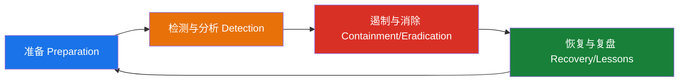
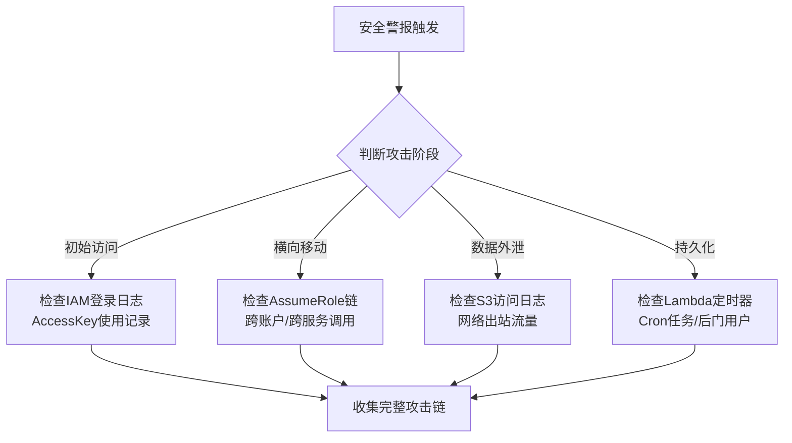
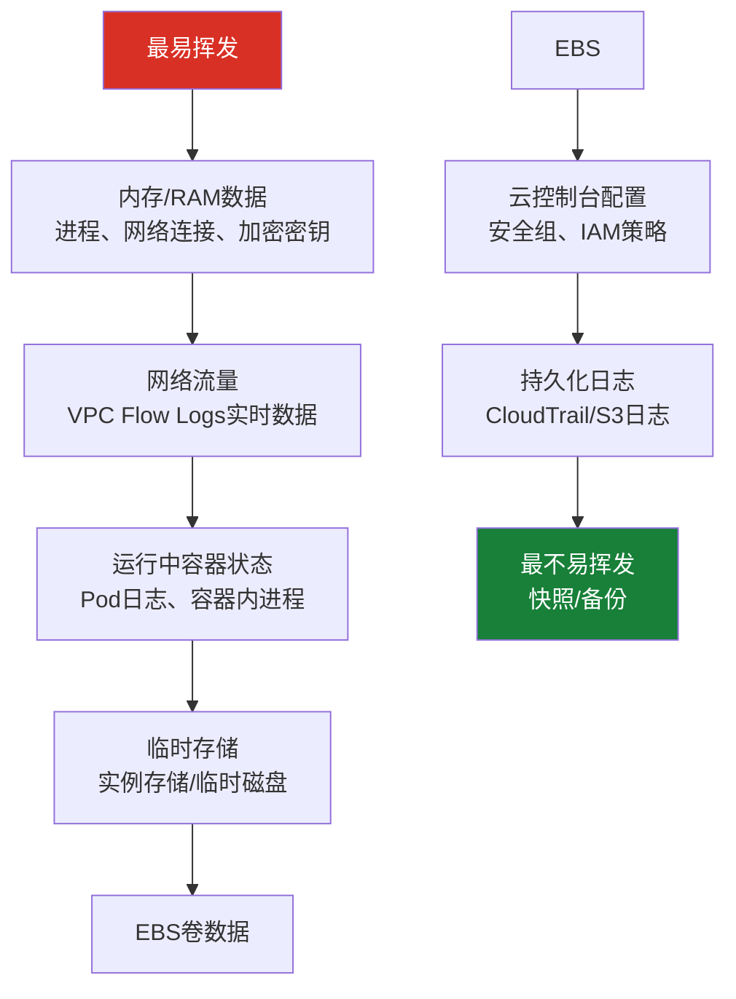

## 12.2.8 云安全事件响应与数字取证

云环境的安全事件响应与传统IT环境有本质区别——你无法拔掉网线、扣押硬盘，取证对象从物理设备变成了API调用日志和临时性的虚拟资源。本节从原理到实操，系统讲解云安全事件响应的完整生命周期和数字取证方法论。

### 为什么云取证与传统取证不同

传统数字取证基于一个核心假设：**物理介质是稳定的**。硬盘可以扣押、镜像可以制作、内存可以冷冻转储。但在云环境中，这个假设被彻底打破：

| 维度 | 传统取证 | 云取证 |
|------|----------|--------|
| 证据载体 | 物理硬盘、U盘 | API日志、虚拟磁盘快照、对象存储 |
| 证据持久性 | 介质断电后数据不变 | 实例销毁后数据消失，EBS可能被删除 |
| 访问方式 | 物理接触设备 | 通过控制台/API远程采集 |
| 多租户 | 单一组织所有 | 共享基础设施，需法律授权才能获取底层数据 |
| 地理位置 | 明确物理位置 | 数据可能跨区域、跨国家分布 |
| 取证链 | 物理封存+哈希校验 | 快照+日志导出+完整性校验 |
| 时间线 | 系统时间相对可信 | 依赖云平台时间戳（NTP同步的可信度问题） |

理解这些差异是做好云取证的前提。云取证的核心原则是：**尽早、尽可能多地收集日志和快照，因为云资源是临时性的，晚一步可能就永远丢失了**。

### 事件响应生命周期（NIST框架适配云环境）

云环境的事件响应遵循NIST SP 800-61的四阶段模型，但每个阶段都有云特有的考量：



#### 阶段一：准备（Preparation）

准备阶段决定了事件发生时你的响应能力上限。以下是必须在日常完成的准备工作：

**1. 日志基础设施建设**

云取证的数据源决定了取证深度。必须确保以下日志源已启用并配置正确的保留策略：

- **控制面日志**：记录所有API调用和配置变更
  - AWS：CloudTrail（建议启用组织级trail，覆盖所有区域）
  - Azure：Activity Log + Azure Monitor诊断设置
  - GCP：Cloud Audit Logs（Admin Activity + Data Access + System Event）
- **数据面日志**：记录数据访问行为
  - S3访问日志、VPC Flow Logs、数据库审计日志
- **身份日志**：记录认证和授权行为
  - AWS：IAM Access Analyzer、CloudTrail中的AssumeRole事件
  - Azure：Azure AD Sign-in Logs + Audit Logs
  - GCP：Cloud Identity Logs

日志保留策略建议：

| 日志类型 | 最低保留期 | 推荐保留期 | 存储位置 |
|----------|-----------|-----------|----------|
| 控制面审计日志 | 90天 | 1年+ | 独立账户的S3/Blob Storage（防篡改） |
| VPC Flow Logs | 30天 | 90天 | 独立账户 + SIEM |
| 应用日志 | 30天 | 90天 | 日志服务 + 冷存储 |
| 数据库审计日志 | 90天 | 1年 | 独立存储（跨账户） |

**关键原则**：日志必须存储在与被监控资源不同的账户中，且当前账户的管理员无权删除日志。这是防止攻击者在入侵后销毁证据的基本保障。

**2. 取证工具预部署**

不要等到事件发生时才去找工具。提前在专用的取证账户/机器中准备好：

```bash
# AWS取证工具箱预部署脚本（在独立取证账户中执行）
#!/bin/bash
# 创建取证专用S3桶（开启版本控制和对象锁定）
aws s3api create-bucket --bucket forensics-evidence-$(date +%Y) --region us-east-1
aws s3api put-bucket-versioning --bucket forensics-evidence-$(date +%Y) \
    --versioning-configuration Status=Enabled
aws s3api put-object-lock-configuration --bucket forensics-evidence-$(date +%Y) \
    --object-lock-configuration ObjectLockEnabled=Enabled,Rule='{DefaultRetention={Mode=COMPLIANCE,Years=3}}'

# 部署取证AMI（预装工具）
# 工具清单：dd, dc3dd, volatility3, sleuthkit, plaso, aws-cli, jq
# 验证所有工具可用
for cmd in dd dc3dd aws jq python3; do
    command -v $cmd >/dev/null 2>&1 || echo "MISSING: $cmd"
done
```

**3. 事件分级预案**

事先定义事件严重级别和对应的响应动作，避免事件发生时的决策混乱：

| 级别 | 定义 | 示例 | 响应时限 | 通知范围 |
|------|------|------|----------|----------|
| P0-紧急 | 核心业务中断或大规模数据泄露 | 勒索加密、数据库全量泄露 | 15分钟响应 | CEO/CTO + 法务 + 公关 |
| P1-严重 | 未授权访问已确认、横向移动进行中 | IAM密钥泄露、容器逃逸 | 30分钟响应 | CTO + 安全团队全员 |
| P2-重要 | 可疑活动需调查、潜在影响未确认 | 异常API调用、异常出站流量 | 2小时响应 | 安全团队 + 相关业务方 |
| P3-一般 | 低风险安全事件 | 单次暴力破解、钓鱼邮件未遂 | 24小时响应 | 安全值班人员 |

#### 阶段二：检测与分析（Detection & Analysis）

**1. 威胁检测数据源优先级**

当警报触发时，按以下优先级快速收集关键证据（时间窗口通常只有几分钟到几小时）：



**2. 关键API调用模式识别**

以下是云环境中最常见的攻击指标（IoC），必须在日志中重点监控：

```bash
# AWS CloudTrail 高风险API监控查询
# 使用AWS CLI查询最近24小时的高风险事件

# 1. IAM凭证泄露指标：异常的AccessKey使用
aws cloudtrail lookup-events \
    --lookup-attributes AttributeKey=EventName,AttributeValue=GetCallerIdentity \
    --start-time "$(date -u -d '24 hours ago' +%Y-%m-%dT%H:%M:%SZ)" \
    --max-results 50 \
    --query 'Events[*].[EventTime,Username,SourceIPAddress,EventName]' \
    --output table

# 2. 权限提升指标：IAM策略变更
aws cloudtrail lookup-events \
    --lookup-attributes AttributeKey=EventName,AttributeValue=AttachUserPolicy \
    --start-time "$(date -u -d '24 hours ago' +%Y-%m-%dT%H:%M:%SZ)" \
    --query 'Events[*].[EventTime,Username,CloudTrailEvent]' \
    --output json

# 3. 数据外泄指标：大量S3 GetObject调用
aws cloudtrail lookup-events \
    --lookup-attributes AttributeKey=EventName,AttributeValue=GetObject \
    --start-time "$(date -u -d '24 hours ago' +%Y-%m-%dT%H:%M:%SZ)" \
    --max-results 100

# 4. 后门植入指标：Lambda函数创建/修改
aws cloudtrail lookup-events \
    --lookup-attributes AttributeKey=EventName,AttributeValue=CreateFunction \
    --start-time "$(date -u -d '24 hours ago' +%Y-%m-%dT%H:%M:%SZ)"
```

高危API速查表（必须监控的事件名称）：

| 类别 | AWS EventName | Azure Operation | GCP Method |
|------|--------------|-----------------|------------|
| 权限提升 | AttachUserPolicy, CreatePolicyVersion, PutRolePolicy | Microsoft.Authorization/elevateAccess/Action | setIamPolicy |
| 凭证操作 | CreateAccessKey, UpdateAccessKey, CreateLoginProfile | microsoft.directory/users/password/update | serviceAccountKeys.create |
| 资源创建 | RunInstances, CreateFunction, CreateDBInstance | Microsoft.Compute/virtualMachines/write | instances.insert |
| 隐蔽操作 | CreateFlowLogs+DeleteFlowLogs, StopLogging | microsoft.network/flowLogs/delete | configService.deleteConfig |
| 数据访问 | GetObject(批量), ExportDBSnapshot, CreateSnapshot | Microsoft.Sql/servers/databases/export | datasets.export |

**3. 攻击链还原方法**

单条日志无法说明问题，需要将多个事件串联成攻击链。以下是还原方法：

```python
#!/usr/bin/env python3
"""CloudTrail攻击链分析器 - 从导出的JSON日志中提取攻击链"""

import json
from collections import defaultdict
from datetime import datetime

def analyze_attack_chain(cloudtrail_file):
    """分析CloudTrail日志，按SourceIPAddress和时间线重建攻击链"""
    with open(cloudtrail_file) as f:
        events = json.load(f)
    
    # 按源IP分组
    ip_timeline = defaultdict(list)
    for event in events:
        event_detail = json.loads(event.get('CloudTrailEvent', '{}'))
        src_ip = event_detail.get('sourceIPAddress', 'unknown')
        event_name = event.get('EventName', '')
        event_time = event.get('EventTime', '')
        user = event_detail.get('userIdentity', {}).get('userName', 
               event_detail.get('userIdentity', {}).get('sessionContext', {})
               .get('sessionIssuer', {}).get('userName', 'unknown'))
        
        ip_timeline[src_ip].append({
            'time': event_time,
            'event': event_name,
            'user': user,
            'detail': event_detail
        })
    
    # 识别可疑模式
    HIGH_RISK_EVENTS = {
        'CreateAccessKey', 'AttachUserPolicy', 'CreatePolicyVersion',
        'PutRolePolicy', 'CreateLoginProfile', 'UpdateLoginProfile',
        'RunInstances', 'CreateFunction', 'Invoke',
        'CreateFlowLogs', 'DeleteFlowLogs', 'StopLogging'
    }
    
    print("=== 攻击链分析报告 ===\n")
    for ip, events in ip_timeline.items():
        risk_events = [e for e in events if e['event'] in HIGH_RISK_EVENTS]
        if risk_events:
            print(f"[可疑IP] {ip} - 发现 {len(risk_events)} 个高风险操作:")
            # 按时间排序
            risk_events.sort(key=lambda x: x['time'])
            for e in risk_events:
                print(f"  [{e['time']}] {e['user']} -> {e['event']}")
            print(f"  完整时间线（共{len(events)}个事件）:")
            events.sort(key=lambda x: x['time'])
            for e in events[:20]:  # 显示前20个
                marker = " <<<" if e['event'] in HIGH_RISK_EVENTS else ""
                print(f"    {e['time']} | {e['event']} | {e['user']}{marker}")
            if len(events) > 20:
                print(f"    ... 还有 {len(events)-20} 个事件")
            print()

# 使用方式
# analyze_attack_chain('cloudtrail.json')
```

#### 阶段三：遏制与消除（Containment & Eradication）

遏制的目标是在不破坏证据的前提下阻止攻击继续。云环境中遏制分为主动遏制和被动遏制：

**主动遏制**（立即执行）：

```bash
# === AWS 紧急遏制脚本 ===
#!/bin/bash
# 使用前确认：这会中断受影响资源的业务，请根据事件级别决定执行范围

ATTACKER_IP="203.0.113.50"   # 攻击者IP
COMPROMISED_KEY="YOUR_AWS_KEY_ID"  # 泄露的AccessKey
COMPROMISED_ROLE="arn:aws:iam::123456789012:role/CompromisedRole"

# 1. 立即禁用泄露的AccessKey（不要删除，保留作为证据）
aws iam update-access-key \
    --user-name compromised-user \
    --access-key-id $COMPROMISED_KEY \
    --status Inactive

# 2. 在所有安全组中封禁攻击者IP
for sg in $(aws ec2 describe-security-groups --query 'SecurityGroups[*].GroupId' --output text); do
    aws ec2 revoke-security-group-ingress --group-id $sg \
        --ip-permissions "IpProtocol=-1,IpRanges=[{CidrIp=${ATTACKER_IP}/32}]" 2>/dev/null
    echo "已从安全组 $sg 移除 $ATTACKER_IP"
done

# 3. 如果使用了WAF，在Web ACL中添加阻止规则
aws wafv2 update-ip-set \
    --name blocked-ips --scope REGIONAL \
    --id YOUR_IP_SET_ID \
    --addresses "${ATTACKER_IP}/32" \
    --lock-token YOUR_LOCK_TOKEN

# 4. 隔离受影响的EC2实例（修改安全组为仅允许取证IP访问）
FORENSICS_SG="sg-forensics123"  # 预创建的取证专用安全组
COMPROMISED_INSTANCE="i-compromised123"
aws ec2 modify-instance-attribute --instance-id $COMPROMISED_INSTANCE \
    --groups $FORENSICS_SG

# 5. 如果确认是IAM角色被滥用，修改AssumeRole信任策略临时拒绝
# 注意：这会影响使用该角色的所有服务，需评估业务影响
aws iam update-assume-role-policy --role-name $COMPROMISED_ROLE --policy-document '{
    "Version": "2012-10-17",
    "Statement": [{
        "Effect": "Deny",
        "Principal": "*",
        "Action": "sts:AssumeRole"
    }]
}'

echo "[!] 遏制操作完成，请立即开始取证数据收集"
```

**被动遏制**（需评估业务影响后执行）：

- 将受影响实例所在的子网路由表指向黑洞（丢弃所有流量）
- 冻结受影响账户的所有IAM用户（批量DisableConsoleAccess + DeactivateAccessKey）
- 在组织级SCP中添加Deny策略，阻止特定操作

**遏制时的证据保护要点**：

> **绝对不要直接关机或重启被入侵的实例**。关机会丢失内存中的证据（正在运行的恶意进程、网络连接状态、加密密钥）。正确做法是先创建内存快照（如AWS的Forensics Data Receiver），再创建EBS快照。

```bash
# 正确的取证级遏制流程
# 步骤1：不停机创建EBS快照（保留磁盘状态）
VOLUME_ID=$(aws ec2 describe-instances --instance-ids $COMPROMISED_INSTANCE \
    --query 'Reservations[0].Instances[0].BlockDeviceMappings[0].Ebs.VolumeId' --output text)

SNAPSHOT_ID=$(aws ec2 create-snapshot --volume-id $VOLUME_ID \
    --description "FORENSICS-$(date +%Y%m%d-%H%M%S)-$COMPROMISED_INSTANCE" \
    --tag-specifications "ResourceType=snapshot,Tags=[{Key=Purpose,Value=forensics},{Key=IncidentID,Value=INC-20240101-001}]" \
    --query 'SnapshotId' --output text)

echo "快照已创建: $SNAPSHOT_ID"
echo "等待快照完成..."
aws ec2 wait snapshot-completed --snapshot-ids $SNAPSHOT_ID
echo "快照完成，现在可以安全地隔离实例"

# 步骤2：标记实例为取证状态（防止误操作删除）
aws ec2 create-tags --resources $COMPROMISED_INSTANCE \
    --tags Key=Forensics,Value=active Key=IncidentID,Value=INC-20240101-001

# 步骤3：修改安全组隔离（保持实例运行，仅允许取证IP）
aws ec2 modify-instance-attribute --instance-id $COMPROMISED_INSTANCE \
    --groups $FORENSICS_SG
```

#### 阶段四：恢复与复盘（Recovery & Lessons Learned）

**恢复检查清单**：

```markdown
## 云安全事件恢复检查清单

### 基础设施恢复
- [ ] 确认攻击入口已封堵（漏洞已修复/凭证已更换）
- [ ] 从可信快照/AMI重建受影响实例（不要修补被入侵的实例）
- [ ] 更新所有可能受影响的凭证（AccessKey、密码、证书、Token）
- [ ] 验证安全组/NACL/WAF规则是否完整
- [ ] 确认日志收集恢复正常（攻击者可能关闭过日志）

### 安全加固
- [ ] 实施最小权限原则（审查并收紧IAM策略）
- [ ] 启用MFA（所有IAM用户、root账户、特权角色）
- [ ] 开启GuardDuty/Defender/Security Command Center
- [ ] 配置CloudTrail日志文件完整性验证（Digest文件）
- [ ] 实施网络分段（VPC隔离、微分段）

### 复盘报告
- [ ] 事件时间线（从初始入侵到完全恢复）
- [ ] 根本原因分析（Root Cause Analysis）
- [ ] 响应过程中的问题和改进点
- [ ] 安全架构改进建议
- [ ] 更新事件响应预案
```

### 云取证数据收集实战

取证数据收集需要按优先级和挥发性排序。**越容易消失的数据越要先收集**。

#### 证据挥发性排序（从高到低）



#### AWS取证数据收集完整流程

```bash
#!/bin/bash
# AWS完整取证数据收集脚本
# 使用前提：在取证专用账户中运行，具有跨账户只读权限

set -euo pipefail

INCIDENT_ID="${1:?用法: $0 <事件ID> <目标账户ID> <区域>}"
TARGET_ACCOUNT="${2:?用法: $0 <事件ID> <目标账户ID> <区域>}"
REGION="${3:-us-east-1}"
EVIDENCE_BUCKET="forensics-evidence-$(date +%Y)"
TIMESTAMP=$(date +%Y%m%d-%H%M%S)
CASE_DIR="/tmp/forensics/${INCIDENT_ID}/${TIMESTAMP}"
mkdir -p "$CASE_DIR"

echo "=== 云取证数据收集 ==="
echo "事件ID: $INCIDENT_ID"
echo "目标账户: $TARGET_ACCOUNT"
echo "区域: $REGION"
echo "证据目录: $CASE_DIR"
echo ""

# ===== 1. 收集IAM信息（优先级最高：攻击者可能正在提权） =====
echo "[1/7] 收集IAM信息..."
aws iam generate-credential-report --region $REGION
sleep 5
aws iam get-credential-report \
    --query 'Content' --output text | base64 -d > "$CASE_DIR/iam-credential-report.csv"

# 收集所有IAM用户的AccessKey列表
aws iam list-users --query 'Users[*].[UserName,CreateDate,PasswordLastUsed]' \
    --output table > "$CASE_DIR/iam-users.txt"

# 收集所有自定义策略
for policy_arn in $(aws iam list-policies --scope Local --query 'Policies[*].Arn' --output text); do
    policy_name=$(basename $policy_arn)
    aws iam get-policy --policy-arn $policy_arn \
        --query 'Policy.{Version:PolicyVersionList[0].Document}' \
        --output json > "$CASE_DIR/iam-policy-${policy_name}.json" 2>/dev/null
done
echo "  IAM信息收集完成"

# ===== 2. 收集CloudTrail日志 =====
echo "[2/7] 收集CloudTrail日志..."
# 查询最近7天的事件
aws cloudtrail lookup-events \
    --start-time "$(date -u -d '7 days ago' +%Y-%m-%dT%H:%M:%SZ)" \
    --max-results 1000 \
    --query 'Events[*].CloudTrailEvent' \
    --output json > "$CASE_DIR/cloudtrail-events-7d.json"

# 获取S3中的完整日志文件路径
TRAIL_NAME=$(aws cloudtrail describe-trails --query 'trailList[0].Name' --output text)
TRAIL_BUCKET=$(aws cloudtrail describe-trails --query 'trailList[0].S3BucketName' --output text)
echo "  Trail: $TRAIL_NAME, Bucket: $TRAIL_BUCKET"
# 注意：完整日志文件很大，通常直接从S3复制
# aws s3 cp s3://$TRAIL_BUCKET/AWSLogs/$TARGET_ACCOUNT/CloudTrail/$REGION/ ./cloudtrail-logs/ --recursive

# ===== 3. 收集EC2实例信息 =====
echo "[3/7] 收集EC2实例信息..."
aws ec2 describe-instances \
    --query 'Reservations[*].Instances[*].[InstanceId,InstanceType,State.Name,PublicIpAddress,PrivateIpAddress,KeyName,LaunchTime]' \
    --output table > "$CASE_DIR/ec2-instances.txt"

aws ec2 describe-security-groups \
    --query 'SecurityGroups[*].{ID:GroupId,Name:GroupName,Rules:IpPermissions}' \
    --output json > "$CASE_DIR/security-groups.json"

# ===== 4. 收集VPC Flow Logs =====
echo "[4/7] 收集VPC Flow Logs..."
FLOW_LOG_IDS=$(aws ec2 describe-flow-logs --query 'FlowLogs[*].FlowLogId' --output text)
echo "  Flow Log IDs: $FLOW_LOG_IDS"

# ===== 5. 收集S3桶信息 =====
echo "[5/7] 收集S3桶信息..."
aws s3api list-buckets --query 'Buckets[*].[Name,CreationDate]' \
    --output table > "$CASE_DIR/s3-buckets.txt"

# 收集每个桶的策略和ACL
for bucket in $(aws s3api list-buckets --query 'Buckets[*].Name' --output text); do
    aws s3api get-bucket-policy --bucket $bucket --output json \
        > "$CASE_DIR/s3-policy-${bucket}.json" 2>/dev/null || true
    aws s3api get-bucket-acl --bucket $bucket --output json \
        > "$CASE_DIR/s3-acl-${bucket}.json" 2>/dev/null || true
done

# ===== 6. 收集GuardDuty发现 =====
echo "[6/7] 收集GuardDuty发现..."
DETECTOR_ID=$(aws guardduty list-detectors --query 'DetectorIds[0]' --output text 2>/dev/null || echo "")
if [ -n "$DETECTOR_ID" ] && [ "$DETECTOR_ID" != "None" ]; then
    FINDING_IDS=$(aws guardduty list-findings --detector-id $DETECTOR_ID \
        --finding-criteria '{"Criterion":{"severity":{"Gte":4}}}' \
        --query 'FindingIds' --output json)
    aws guardduty get-findings --detector-id $DETECTOR_ID \
        --finding-ids $FINDING_IDS --output json > "$CASE_DIR/guardduty-findings.json"
else
    echo "  GuardDuty未启用"
fi

# ===== 7. 生成取证摘要 =====
echo "[7/7] 生成取证摘要..."
cat > "$CASE_DIR/forensics-summary.md" << EOF
# 取证数据收集摘要
- 事件ID: $INCIDENT_ID
- 收集时间: $TIMESTAMP
- 目标账户: $TARGET_ACCOUNT
- 区域: $REGION
- 收集人: $(aws sts get-caller-identity --query 'Arn' --output text)

## 收集内容
- IAM凭证报告: iam-credential-report.csv
- IAM用户列表: iam-users.txt
- CloudTrail事件: cloudtrail-events-7d.json
- EC2实例信息: ec2-instances.txt
- 安全组配置: security-groups.json
- S3桶列表: s3-buckets.txt
- GuardDuty发现: guardduty-findings.json

## 下一步
1. 对每个EC2实例创建EBS快照
2. 从S3获取完整的CloudTrail日志文件
3. 分析CloudTrail事件寻找攻击链
4. 检查是否有持久化后门
EOF

echo ""
echo "=== 取证数据收集完成 ==="
echo "证据目录: $CASE_DIR"
echo "请验证所有文件完整性后上传至取证S3桶"
```

#### Azure取证数据收集

```bash
#!/bin/bash
# Azure取证数据收集脚本

INCIDENT_ID="$1"
TIMESTAMP=$(date +%Y%m%d-%H%M%S)
CASE_DIR="/tmp/forensics/azure/${INCIDENT_ID}/${TIMESTAMP}"
mkdir -p "$CASE_DIR"

echo "=== Azure 取证数据收集 ==="

# 1. 导出Activity Log（最近7天）
az monitor activity-log list \
    --start-time "$(date -u -d '7 days ago' +%Y-%m-%dT%H:%M:%SZ)" \
    --max-events 1000 \
    --output json > "$CASE_DIR/activity-log-7d.json"

# 2. 导出Azure AD登录日志
az ad signed-in-user show > /dev/null  # 确认登录状态
az rest --method GET \
    --url "https://graph.microsoft.com/v1.0/auditLogs/signIns?\$top=999" \
    --output json > "$CASE_DIR/aad-signins.json" 2>/dev/null || echo "需要AuditLog.Read.All权限"

# 3. 导出Azure AD审计日志
az rest --method GET \
    --url "https://graph.microsoft.com/v1.0/auditLogs/directoryAudits?\$top=999" \
    --output json > "$CASE_DIR/aad-audit.json" 2>/dev/null || echo "需要AuditLog.Read.All权限"

# 4. 导出网络安全组流日志
for nsg in $(az network nsg list --query '[].name' -o tsv); do
    az network watcher flow-log list --location eastus \
        --query "[?targetResourceId.contains(@,'$nsg')]" \
        --output json > "$CASE_DIR/nsg-flowlog-${nsg}.json" 2>/dev/null
done

# 5. 创建VM磁盘快照
for vm in $(az vm list --query '[].{name:name,rg:resourceGroup}' -o tsv); do
    VM_NAME=$(echo $vm | cut -f1)
    RG=$(echo $vm | cut -f2)
    OS_DISK=$(az vm show -n $VM_NAME -g $RG --query 'storageProfile.osDisk.managedDisk.id' -o tsv)
    az snapshot create --resource-group $RG \
        --name "forensics-${VM_NAME}-${TIMESTAMP}" \
        --source "$OS_DISK" \
        --tags IncidentID=$INCIDENT_ID Purpose=forensics
    echo "  快照已创建: forensics-${VM_NAME}-${TIMESTAMP}"
done

echo "Azure取证数据收集完成: $CASE_DIR"
```

#### GCP取证数据收集

```bash
#!/bin/bash
# GCP取证数据收集脚本

INCIDENT_ID="$1"
PROJECT_ID=$(gcloud config get-value project)
TIMESTAMP=$(date +%Y%m%d-%H%M%S)
CASE_DIR="/tmp/forensics/gcp/${INCIDENT_ID}/${TIMESTAMP}"
mkdir -p "$CASE_DIR"

echo "=== GCP 取证数据收集 ==="

# 1. 导出Cloud Audit Logs
gcloud logging read \
    'logName:"cloudaudit.googleapis.com"' \
    --limit=1000 --format=json \
    --freshness=7d > "$CASE_DIR/audit-logs-7d.json"

# 2. 导出VPC Flow Logs
gcloud logging read \
    'logName:"compute.googleapis.com/vpc_flows"' \
    --limit=1000 --format=json \
    --freshness=7d > "$CASE_DIR/vpc-flow-logs-7d.json"

# 3. 导出IAM策略
gcloud projects get-iam-policy $PROJECT_ID \
    --format=json > "$CASE_DIR/iam-policy.json"

# 4. 列出所有服务账号密钥
for sa in $(gcloud iam service-accounts list --format='value(email)'); do
    gcloud iam service-accounts keys list --iam-account=$sa \
        --format=json > "$CASE_DIR/sa-keys-${sa}.json"
done

# 5. 创建磁盘快照
for instance in $(gcloud compute instances list --format='value(name,zone)'); do
    INSTANCE_NAME=$(echo $instance | cut -f1)
    ZONE=$(echo $instance | cut -f2)
    gcloud compute disks snapshot $INSTANCE_NAME \
        --zone=$ZONE \
        --snapshot-names="forensics-${INSTANCE_NAME}-${TIMESTAMP}" \
        --description="Forensics snapshot for incident $INCIDENT_ID"
    echo "  快照已创建: forensics-${INSTANCE_NAME}-${TIMESTAMP}"
done

# 6. 导出Security Command Center发现
gcloud scc findings list "organizations/$(gcloud organizations list --format='value(ID)')" \
    --format=json > "$CASE_DIR/scc-findings.json" 2>/dev/null || echo "需要Security Center权限"

echo "GCP取证数据收集完成: $CASE_DIR"
```

### 高级取证场景

#### 容器环境取证

容器和Kubernetes环境的取证比传统VM更复杂，因为容器的文件系统是临时的，销毁后数据即丢失：

```bash
#!/bin/bash
# Kubernetes取证数据收集

POD_NAME="$1"
NAMESPACE="${2:-default}"
INCIDENT_ID="$3"
CASE_DIR="/tmp/forensics/k8s/${INCIDENT_ID}/$(date +%Y%m%d-%H%M%S)"
mkdir -p "$CASE_DIR"

echo "=== Kubernetes 取证 ==="
echo "Pod: $POD_NAME, Namespace: $NAMESPACE"

# 1. 收集Pod完整描述信息
kubectl describe pod $POD_NAME -n $NAMESPACE > "$CASE_DIR/pod-describe.txt"

# 2. 收集Pod日志（包括所有容器和前一个实例的日志）
kubectl logs $POD_NAME -n $NAMESPACE --all-containers > "$CASE_DIR/pod-logs-current.txt" 2>/dev/null
kubectl logs $POD_NAME -n $NAMESPACE --all-containers --previous > "$CASE_DIR/pod-logs-previous.txt" 2>/dev/null

# 3. 导出Pod的完整YAML配置（包含Secret引用、环境变量等敏感信息）
kubectl get pod $POD_NAME -n $NAMESPACE -o yaml > "$CASE_DIR/pod-full.yaml"

# 4. 如果Pod还在运行，收集容器内进程列表和网络连接
if kubectl get pod $POD_NAME -n $NAMESPACE -o jsonpath='{.status.phase}' | grep -q Running; then
    # 进程列表
    kubectl exec $POD_NAME -n $NAMESPACE -- ps aux > "$CASE_DIR/container-processes.txt" 2>/dev/null
    # 网络连接
    kubectl exec $POD_NAME -n $NAMESPACE -- netstat -tlnp > "$CASE_DIR/container-network.txt" 2>/dev/null || \
    kubectl exec $POD_NAME -n $NAMESPACE -- ss -tlnp > "$CASE_DIR/container-network.txt" 2>/dev/null
    # 关键文件列表
    kubectl exec $POD_NAME -n $NAMESPACE -- find / -maxdepth 3 -type f -newer /etc/hostname \
        2>/dev/null > "$CASE_DIR/recently-modified-files.txt"
fi

# 5. 创建容器文件系统快照（通过临时容器挂载目标容器的volume）
# 注意：这需要Pod使用了持久化存储
echo "  收集存储卷信息..."
kubectl get pod $POD_NAME -n $NAMESPACE \
    -o jsonpath='{.spec.volumes[*]}' > "$CASE_DIR/volumes.json"

# 6. 收集同Namespace的Event和RBAC信息
kubectl get events -n $NAMESPACE --sort-by='.lastTimestamp' > "$CASE_DIR/namespace-events.txt"
kubectl get rolebindings,clusterrolebindings -n $NAMESPACE -o yaml > "$CASE_DIR/rbac.yaml"

# 7. 收集Node信息（如果怀疑节点级入侵）
NODE_NAME=$(kubectl get pod $POD_NAME -n $NAMESPACE -o jsonpath='{.spec.nodeName}')
echo "  运行节点: $NODE_NAME"

echo "Kubernetes取证数据收集完成: $CASE_DIR"
```

#### 无服务器（Serverless）环境取证

Lambda/Cloud Functions/Azure Functions的取证挑战在于：函数实例是临时的，没有持久化的文件系统。取证依赖于：

```bash
# AWS Lambda取证

# 1. 导出函数代码和配置（快照）
aws lambda get-function --function-name $FUNC_NAME \
    --query 'Code.Location' --output text | xargs curl -o "$CASE_DIR/function-code.zip"

aws lambda get-function-configuration --function-name $FUNC_NAME \
    --output json > "$CASE_DIR/function-config.json"

# 2. 收集函数的CloudWatch日志
LOG_GROUP="/aws/lambda/$FUNC_NAME"
aws logs filter-log-events --log-group-name $LOG_GROUP \
    --start-time $(($(date +%s) - 86400*7))000 \
    --filter-pattern '{ $.errorCode = "*" }' \
    --output json > "$CASE_DIR/lambda-errors-7d.json"

# 收集所有日志（不仅错误）
aws logs filter-log-events --log-group-name $LOG_GROUP \
    --start-time $(($(date +%s) - 86400*7))000 \
    --limit 10000 \
    --output json > "$CASE_DIR/lambda-all-logs-7d.json"

# 3. 检查函数的环境变量（可能包含泄露的密钥）
aws lambda get-function-configuration --function-name $FUNC_NAME \
    --query 'Environment.Variables' --output json > "$CASE_DIR/lambda-env-vars.json"

# 4. 检查函数的触发器和事件源映射
aws lambda list-event-source-mappings --function-name $FUNC_NAME \
    --output json > "$CASE_DIR/lambda-event-sources.json"

# 5. 检查函数的IAM执行角色和权限
ROLE_ARN=$(aws lambda get-function-configuration --function-name $FUNC_NAME \
    --query 'Role' --output text)
ROLE_NAME=$(basename $ROLE_ARN)
aws iam list-attached-role-policies --role-name $ROLE_NAME --output json \
    > "$CASE_DIR/lambda-role-policies.json"
aws iam list-role-policies --role-name $ROLE_NAME --output json \
    > "$CASE_DIR/lambda-inline-policies.json"
```

#### 云存储桶数据泄露取证

S3/Cloud Storage/Blob Storage的数据泄露是最常见的云安全事件之一：

```bash
# S3数据泄露取证

BUCKET_NAME="$1"
CASE_DIR="/tmp/forensics/s3-${BUCKET_NAME}-$(date +%Y%m%d-%H%M%S)"
mkdir -p "$CASE_DIR"

# 1. 检查桶的公共访问配置
aws s3api get-public-access-block --bucket $BUCKET_NAME \
    --output json > "$CASE_DIR/public-access-block.json" 2>/dev/null

# 2. 检查桶策略
aws s3api get-bucket-policy --bucket $BUCKET_NAME \
    --output json > "$CASE_DIR/bucket-policy.json" 2>/dev/null

# 3. 检查ACL
aws s3api get-bucket-acl --bucket $BUCKET_NAME \
    --output json > "$CASE_DIR/bucket-acl.json"

# 4. 收集访问日志
aws s3api get-bucket-logging --bucket $BUCKET_NAME \
    --output json > "$CASE_DIR/bucket-logging-config.json" 2>/dev/null

# 5. 如果有CloudTrail Data Events日志，查找GetObject调用
aws cloudtrail lookup-events \
    --lookup-attributes AttributeKey=ResourceName,AttributeValue=$BUCKET_NAME \
    --start-time "$(date -u -d '7 days ago' +%Y-%m-%dT%H:%M:%SZ)" \
    --max-results 1000 \
    --output json > "$CASE_DIR/s3-cloudtrail-events.json"

# 6. 列出桶中的对象（不下载，仅记录清单）
aws s3 ls s3://$BUCKET_NAME/ --recursive --summarize \
    > "$CASE_DIR/object-listing.txt"
```

### 取证链完整性维护

数字取证的核心法律要求是**证据链（Chain of Custody）**的完整性。在云环境中，这需要特殊的措施：

```python
#!/usr/bin/env python3
"""云取证证据链管理工具"""

import hashlib
import json
import os
from datetime import datetime, timezone

class CloudForensicsChain:
    """维护云取证证据的完整性链"""
    
    def __init__(self, incident_id, collector_name):
        self.incident_id = incident_id
        self.collector = collector_name
        self.chain = []
        self.evidence_log = []
    
    def add_evidence(self, filepath, description, source):
        """添加一条证据记录，计算哈希并记录收集信息"""
        if not os.path.exists(filepath):
            raise FileNotFoundError(f"证据文件不存在: {filepath}")
        
        # 计算文件哈希（SHA-256 + MD5双重校验）
        sha256 = self._compute_hash(filepath, 'sha256')
        md5 = self._compute_hash(filepath, 'md5')
        
        evidence = {
            'evidence_id': f"EV-{self.incident_id}-{len(self.evidence_log)+1:04d}",
            'filename': os.path.basename(filepath),
            'filepath': os.path.abspath(filepath),
            'size_bytes': os.path.getsize(filepath),
            'sha256': sha256,
            'md5': md5,
            'source': source,
            'description': description,
            'collected_by': self.collector,
            'collected_at': datetime.now(timezone.utc).isoformat(),
            'verified': False
        }
        
        self.evidence_log.append(evidence)
        self.chain.append({
            'action': 'collected',
            'evidence_id': evidence['evidence_id'],
            'timestamp': evidence['collected_at'],
            'actor': self.collector,
            'details': f"从 {source} 收集，SHA256={sha256[:16]}..."
        })
        
        return evidence
    
    def verify_evidence(self, evidence_id):
        """验证证据文件的完整性（哈希未变化）"""
        evidence = next((e for e in self.evidence_log if e['evidence_id'] == evidence_id), None)
        if not evidence:
            raise ValueError(f"未找到证据: {evidence_id}")
        
        current_sha256 = self._compute_hash(evidence['filepath'], 'sha256')
        is_valid = current_sha256 == evidence['sha256']
        
        self.chain.append({
            'action': 'verified',
            'evidence_id': evidence_id,
            'timestamp': datetime.now(timezone.utc).isoformat(),
            'actor': self.collector,
            'details': f"完整性校验{'通过' if is_valid else '失败'}"
        })
        
        evidence['verified'] = is_valid
        return is_valid
    
    def transfer_custody(self, evidence_id, new_custodian, reason):
        """移交证据保管权"""
        self.chain.append({
            'action': 'transferred',
            'evidence_id': evidence_id,
            'timestamp': datetime.now(timezone.utc).isoformat(),
            'actor': self.collector,
            'details': f"移交至 {new_custodian}，原因: {reason}",
            'new_custodian': new_custodian
        })
    
    def export_chain_report(self, output_path):
        """导出证据链报告"""
        report = {
            'incident_id': self.incident_id,
            'report_generated': datetime.now(timezone.utc).isoformat(),
            'total_evidence': len(self.evidence_log),
            'evidence': self.evidence_log,
            'chain_of_custody': self.chain
        }
        with open(output_path, 'w') as f:
            json.dump(report, f, indent=2, ensure_ascii=False)
        return output_path
    
    def _compute_hash(self, filepath, algorithm):
        h = hashlib.new(algorithm)
        with open(filepath, 'rb') as f:
            for chunk in iter(lambda: f.read(8192), b''):
                h.update(chunk)
        return h.hexdigest()

# 使用示例
# chain = CloudForensicsChain("INC-20240101-001", "张三")
# ev = chain.add_evidence("/tmp/forensics/cloudtrail.json", "CloudTrail日志导出", "AWS CloudTrail")
# chain.verify_evidence(ev['evidence_id'])
# chain.export_chain_report("/tmp/forensics/chain-report.json")
```

### 常见错误与应对

以下是云取证中最常犯的错误，以及正确的做法：

**错误1：直接关机取证**
- 错误做法：发现入侵后立即关闭实例
- 后果：内存中的证据全部丢失（运行中的恶意进程、网络连接、解密密钥）
- 正确做法：先不停机创建内存快照和EBS快照，再隔离网络

**错误2：在被入侵的账户中取证**
- 错误做法：使用被入侵的管理员账号收集取证数据
- 后果：攻击者可以通过CloudTrail看到你的取证行为，提前销毁证据
- 正确做法：使用独立的取证账户（只读跨账户角色），操作记录在取证账户的CloudTrail中

**错误3：忽视日志的完整性**
- 错误做法：直接信任导出的日志文件
- 后果：攻击者可能已篡改或删除部分日志
- 正确做法：验证CloudTrail Digest文件的完整性，检查日志是否有时间断层

```bash
# 验证CloudTrail日志完整性
aws cloudtrail validate-logs \
    --trail-arn arn:aws:cloudtrail:us-east-1:123456789012:trail/my-trail \
    --start-time 2024-01-01T00:00:00Z \
    --end-time 2024-01-02T00:00:00Z

# 检查日志是否有断层（某段时间没有日志）
python3 -c "
import json
from datetime import datetime

with open('cloudtrail-events-7d.json') as f:
    events = json.load(f)

timestamps = sorted([e['EventTime'] for e in events])
gaps = []
for i in range(1, len(timestamps)):
    t1 = datetime.fromisoformat(timestamps[i-1].replace('Z', '+00:00'))
    t2 = datetime.fromisoformat(timestamps[i].replace('Z', '+00:00'))
    gap = (t2 - t1).total_seconds()
    if gap > 3600:  # 超过1小时的间隔标记为可疑
        gaps.append(f'{timestamps[i-1]} -> {timestamps[i]}: {gap/3600:.1f}小时')

if gaps:
    print('发现可疑日志间隔:')
    for g in gaps:
        print(f'  {g}')
else:
    print('未发现显著日志间隔')
"
```

**错误4：只关注单一日志源**
- 错误做法：只看CloudTrail，忽略VPC Flow Logs、S3访问日志
- 后果：无法还原完整的攻击链（比如数据外泄的网络路径）
- 正确做法：交叉关联多个日志源，按时间线对齐

**错误5：取证后不清理取证环境**
- 错误做法：取证机器上保留了原始证据副本
- 后果：违反数据保护法规（GDPR等），证据泄露风险
- 正确做法：取证完成后安全擦除取证机器上的临时数据，所有证据统一存储在带Object Lock的S3桶中

### 工具速查

| 工具 | 用途 | 平台 |
|------|------|------|
| AWS CloudTrail Lake | 集中存储和查询CloudTrail日志 | AWS |
| AWS Detective | 自动分析和可视化安全事件 | AWS |
| Azure Sentinel | SIEM+SOAR，集成Azure原生日志 | Azure |
| GCP Security Command Center | 集中安全发现和合规检查 | GCP |
| Prowler | AWS/Azure/GCP安全合规扫描 | 多云 |
| ScoutSuite | 多云安全审计 | 多云 |
| CloudMapper | AWS环境可视化和安全分析 | AWS |
| Steampipe | 用SQL查询云资源和配置 | 多云 |
| Plaso/log2timeline | 统一时间线分析 | 通用 |
| Volatility3 | 内存取证分析 | 通用 |
| The Sleuth Kit | 磁盘取证分析 | 通用 |
| dfVFS | 数字取证虚拟文件系统 | 通用 |

> **选型建议**：云原生工具（CloudTrail Lake、Detective、Sentinel、SCC）的优势是与平台深度集成、无需额外部署；开源工具（Prowler、ScoutSuite、Steampipe）的优势是跨云支持和定制灵活性。在实际取证中两者结合使用效果最佳——用云原生工具做实时检测和初步分析，用开源工具做深度审计和交叉验证。
