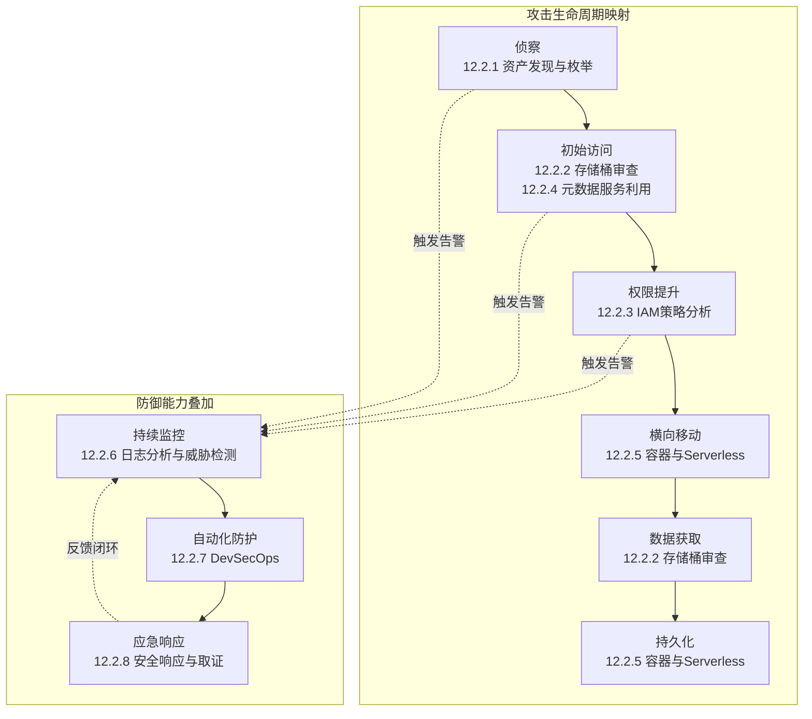
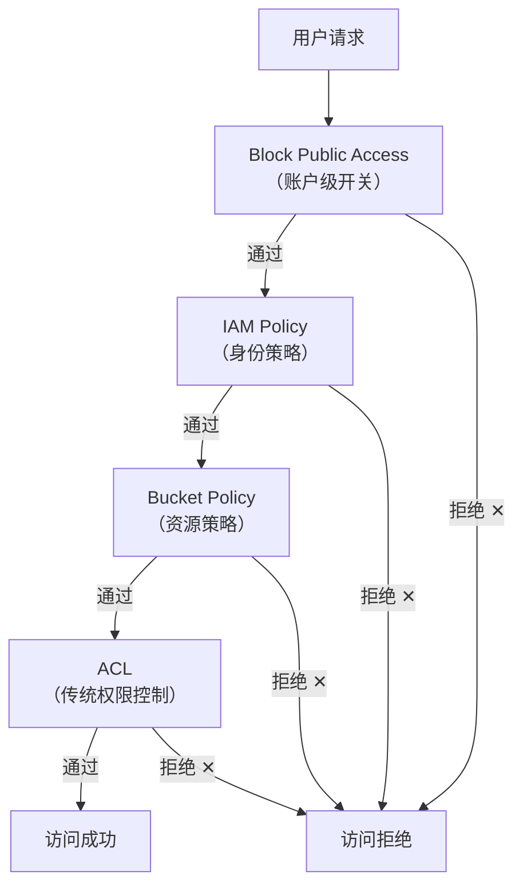
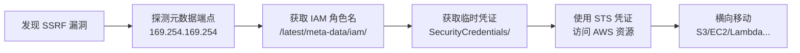
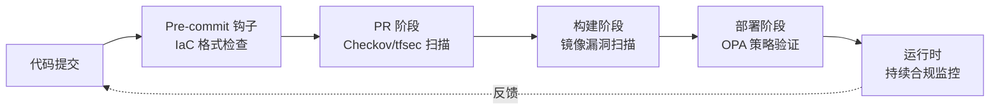

## 12.2.9 本节补充总结

核心技巧部分（12.2.1 至 12.2.8）覆盖了云安全实战中最关键的八个技术领域。本节作为整节的补充总结，将从三个维度进行系统性回顾：**知识体系梳理**——帮助你建立完整的认知地图；**技能整合与关联**——展示各知识点之间的逻辑关系和协同效应；**实践路线图**——提供从入门到精通的可操作路径。

### 八大核心技巧全景回顾

在正式展开之前，先用一张表快速回顾每个核心技巧的定位、关键工具和典型应用场景：

| 编号 | 核心技巧 | 定位 | 关键工具 | 典型应用场景 |
|------|---------|------|---------|-------------|
| 12.2.1 | 云环境资产发现与枚举 | 侦察阶段——你无法保护看不见的东西 | CloudMapper、ScoutSuite、Prowler、CloudFox | 新接手云环境时的资产清点、红队侦察 |
| 12.2.2 | 存储桶安全配置审查 | 数据安全的第一道防线 | aws cli、s3scanner、Bucket Finder、CloudBrute | 数据泄露预防、合规审计、红队数据获取 |
| 12.2.3 | IAM策略分析与权限提升 | 身份安全——云安全的核心命脉 | IAM Access Analyzer、Pacu、enumerate-iam | 权限审计、横向移动、权限提升路径发现 |
| 12.2.4 | 云元数据服务利用与防护 | 基础设施层的关键攻击面 | curl、SSRF工具链、IMDS探测 | SSRF攻击链、临时凭证获取、实例角色滥用 |
| 12.2.5 | 容器与Serverless安全 | 新兴计算模型的安全边界 | Trivy、kube-bench、Falco、SLSA | 容器逃逸检测、镜像审计、函数注入防护 |
| 12.2.6 | 日志分析与威胁检测 | 安全运营的感知层 | CloudTrail、Azure Activity Log、GCP Audit Log、SIEM | 异常行为检测、攻击溯源、合规取证 |
| 12.2.7 | 云安全自动化与DevSecOps | 将安全左移至开发流程 | Checkov、tfsec、OPA、Bridgecrew | CI/CD安全门禁、IaC扫描、策略即代码 |
| 12.2.8 | 云安全响应与取证 | 事后处置能力 | CloudTrail、forensics脚本、快照工具 | 安全事件响应、证据收集、根因分析 |

### 知识体系的内在逻辑

这八个核心技巧并非孤立的知识点，而是按照**攻击生命周期**（也对应防御生命周期）有机组织的。理解它们之间的逻辑关系，比孤立掌握每个技巧更重要。



**攻击者视角**：资产发现（找到目标）→ 存储桶/元数据利用（初始突破）→ IAM提权（获得更高权限）→ 容器/Serverless横向移动（扩大战果）→ 数据获取/持久化（达成目标）。

**防御者视角**：日志监控（感知威胁）→ 自动化防护（预防和拦截）→ 事件响应（处置和恢复）→ 反馈到监控（持续改进）。

这两条线是同一枚硬币的两面。一个优秀的云安全从业者必须同时具备攻击和防御的双重视角。

### 各核心技巧深度回顾与整合

#### 12.2.1 资产发现与枚举：一切的起点

**核心要点回顾**：

资产发现是云安全评估的第一步。在传统网络中，资产是相对静态的——服务器就是服务器，IP就是IP。但在云环境中，资产是动态的、弹性的、跨服务的。一个EC2实例可能关联着EBS卷、安全组、IAM角色、Lambda函数、RDS数据库——这些关联关系本身就是攻击面。

**关键技能清单**：

- 掌握至少一种云资产枚举工具（推荐 CloudMapper + Prowler 组合）
- 能够通过API枚举计算、存储、网络、数据库、Serverless等各类资源
- 理解跨账号资源发现的方法和限制
- 掌握云资产的可视化呈现（网络拓扑图、资源关系图）

**常见盲区**：

- 只关注主账号资源，忽略跨账号角色和共享资源
- 只关注生产环境，忽略开发和测试环境（往往是安全重灾区）
- 忽略已停止但未销毁的实例——它们的EBS卷中可能包含敏感数据
- 忘记检查Lambda@Edge、CloudFront Functions等边缘计算资源

**与其他技巧的关联**：资产发现的输出是后续所有安全评估的输入。没有完整的资产清单，存储桶审查可能遗漏关键存储桶，IAM分析可能忽略服务关联角色。

#### 12.2.2 存储桶安全配置审查：数据泄露的头号杀手

**核心要点回顾**：

根据 Verizon 2024 DBIR 报告，云存储配置错误是数据泄露的首要原因。S3/OSS/Blob 存储桶的安全配置审查需要理解多层权限模型的叠加效应：Bucket Policy、ACL、IAM Policy、Block Public Access 设置——这四层中任何一层的配置错误都可能导致数据泄露。

**关键技能清单**：

- 能够手动审查 Bucket Policy 和 ACL 的每条语义
- 掌握 `aws s3api get-bucket-acl`、`get-bucket-policy` 等关键命令
- 理解 "Principal": "*" 在不同 Effect（Allow/Deny）下的含义
- 能够检测并解读 Bucket 的加密配置（SSE-S3、SSE-KMS、SSE-C）
- 掌握版本控制、生命周期策略、日志记录等安全相关配置

**权限叠加分析模型**：

存储桶的最终访问权限由四层策略的交集决定。任何一层的 Allow 都可能被另一层的 Deny 覆盖，反之亦然。实际审查时，需要逐层分析后取最终效果：



**常见误区**：

- 认为 Bucket Policy 中没有公开语句就一定安全——忽略了 ACL 可能单独设置公开访问
- 只检查生产存储桶，忽略日志存储桶和备份存储桶
- 忘记检查跨区域复制目标存储桶的权限配置
- 误以为加密配置等于访问控制——加密防止的是数据被读取后的内容泄露，但不阻止未授权的访问行为本身

#### 12.2.3 IAM策略分析与权限提升：云安全的核心战场

**核心要点回顾**：

IAM 是云安全中最复杂、最核心的领域。AWS 的策略评估逻辑遵循**显式 Deny > 显式 Allow > 隐式 Deny** 的优先级。理解这个逻辑是分析任何 IAM 配置的基础。

**权限提升的四种典型路径**：

| 路径类型 | 描述 | 利用条件 | 危害等级 |
|---------|------|---------|---------|
| **策略附加** | 通过 `iam:AttachUserPolicy` 或 `iam:PutUserPolicy` 给自己附加高权限策略 | 拥有 IAM 写权限 | 极高 |
| **角色假设** | 通过 `sts:AssumeRole` 切换到高权限角色 | 目标角色信任策略允许、拥有 `sts:AssumeRole` 权限 | 极高 |
| **实例 Profile 利用** | 通过控制 EC2 实例获取其关联角色的临时凭证 | 能够创建/控制 EC2 实例 | 高 |
| **服务关联利用** | 利用 Lambda、CodeBuild 等服务的执行角色 | 拥有创建/调用这些服务的权限 | 高 |

**策略分析的核心检查项**：

```text
1. 是否存在 "Action": "*" 的通配符策略？
2. 是否存在 "Resource": "*" 的全资源允许？
3. 是否存在条件键（Condition）绕过可能？
4. 信任策略（Trust Policy）是否过于宽松？
5. 服务控制策略（SCP）是否有效限制了权限边界？
6. 是否存在权限边界（Permission Boundary）但未正确应用？
7. 会话策略（Session Policy）是否与身份策略产生意外的权限组合？
```

**与其他技巧的关联**：IAM 分析的发现直接影响渗透路径规划。如果发现某个 Lambda 函数的执行角色拥有 S3 写权限，攻击者可以通过注入恶意 Lambda 函数实现数据窃取——这就连接了 IAM 分析（12.2.3）和 Serverless 安全（12.2.5）两个领域。

#### 12.2.4 云元数据服务利用与防护：SSRF 攻击的云环境放大器

**核心要点回顾**：

云实例元数据服务（IMDS）允许运行中的实例访问自身的配置信息和临时凭证。AWS 的 IMDSv1 使用简单的 HTTP GET 请求（`curl http://169.254.169.254/latest/meta-data/`），存在 SSRF 风险。IMDSv2 引入了 PUT 请求获取 Token 的机制，显著提高了利用难度，但并非不可绕过。

**IMDSv1 vs IMDSv2 安全对比**：

| 特性 | IMDSv1 | IMDSv2 |
|------|--------|--------|
| 请求方式 | 直接 HTTP GET | 先 PUT 获取 Token，再用 Token GET |
| SSRF 可利用性 | 高——任何能发出 HTTP 请求的漏洞都可利用 | 中——需要能发出 PUT 请求（部分 SSRF 不支持） |
| 抗重放能力 | 无 | Token 有 TTL 和使用次数限制 |
| Hop Limit 保护 | 无 | 可设置 Hop Limit 阻止跨网络访问 |
| 配置建议 | 禁用 | 强制使用（设为 "required"） |

**完整的元数据利用攻击链**：



**防护要点**：

- 强制使用 IMDSv2（将 HttpTokens 设为 "required"）
- 设置合理的 Hop Limit（通常设为 1）
- 在 WAF/应用层阻止对 169.254.169.254 的请求
- 定期审计实例的 IMDS 配置状态
- 对 Lambda 函数使用 VPC 配置时注意环境变量中可能包含的凭证

#### 12.2.5 容器与Serverless安全：新计算范式的安全边界

**核心要点回顾**：

容器和 Serverless 是云原生架构的两大支柱，它们的安全模型与传统虚拟机有根本差异。容器共享宿主机内核，隔离性弱于虚拟机；Serverless 将基础设施控制权完全交给云商，但引入了新的攻击面（事件注入、冷启动、临时文件残留等）。

**容器安全的关键检查维度**：

| 维度 | 检查项 | 工具 |
|------|--------|------|
| 镜像安全 | 基础镜像可信性、已知漏洞、恶意包、不必要的工具 | Trivy、Snyk、Grype |
| 运行时安全 | 特权容器、能力集（Capabilities）、Seccomp/AppArmor | Falco、Sysdig |
| 编排安全 | RBAC 配置、Network Policy、Pod Security Standards | kube-bench、kubeaudit |
| 供应链安全 | 镜像签名、SBOM、构建过程完整性 | Cosign、SLSA、Syft |
| 网络安全 | 服务间通信加密、网络策略、DNS 策略 | Cilium、Calico、Istio |

**Serverless 安全的独特挑战**：

- **事件注入**：攻击者通过篡改触发事件（如 S3 事件通知、API Gateway 请求）注入恶意数据
- **函数间调用链**：一个函数的输出作为另一个函数的输入，攻击者可以在链中注入恶意数据
- **临时环境残留**：`/tmp` 目录在冷启动间可能保留上一次执行的敏感数据
- **权限过度授予**：为了方便开发，Lambda 执行角色常常被赋予过大的权限
- **依赖漏洞**：函数依赖的第三方库可能存在已知漏洞

#### 12.2.6 日志分析与威胁检测：安全运营的感知基础

**核心要点回顾**：

云日志是安全运营的核心数据源。三大云平台的日志体系各有特点，但核心目标一致：记录谁在什么时间对什么资源做了什么操作。

**三大云平台日志体系对比**：

| 维度 | AWS | Azure | GCP |
|------|-----|-------|-----|
| 核心审计日志 | CloudTrail | Activity Log + Diagnostic Logs | Cloud Audit Logs |
| 数据平面日志 | CloudTrail Data Events | Resource-specific | Data Access Audit Logs |
| 网络日志 | VPC Flow Logs | NSG Flow Logs | VPC Flow Logs |
| 日志存储 | S3 + CloudWatch Logs | Storage Account + Log Analytics | Cloud Storage + BigQuery |
| 默认保留 | 90天（CloudWatch） | 90天（Activity Log） | 400天（Admin Activity） |
| 成本模型 | 按事件数量和存储 | 按数据量和保留期 | 按数据量和查询 |

**高价值检测规则示例**：

云环境中最值得关注的安全事件包括：

1. **凭证类**：控制台登录失败突增、Access Key 从新 IP 使用、MFA 被禁用
2. **IAM 类**：策略附加/分离、角色创建、信任策略修改、权限边界变更
3. **网络类**：安全组规则变更、VPC Peering 创建、网络 ACL 修改
4. **数据类**：存储桶公开化、加密配置变更、大规模数据下载
5. **计算类**：实例从新区域启动、安全组 0.0.0.0/0 开放、实例元数据服务配置变更

**与其他技巧的关联**：日志分析是所有其他技巧的"守护者"。资产发现的异常变化、存储桶配置的修改、IAM 策略的变更、元数据服务的异常访问——所有这些操作都会产生日志事件。建立有效的检测规则，就是在攻击者的每一步行动上安装"监控摄像头"。

#### 12.2.7 云安全自动化与DevSecOps：从人工审查到持续保障

**核心要点回顾**：

手动安全审查无法跟上云环境的变化速度。一个中等规模的云环境每天可能产生成百上千次基础设施变更——人工审查根本来不及。DevSecOps 的核心思想是**将安全检查嵌入开发和部署流程**，实现"安全左移"。

**IaC 安全扫描工具能力矩阵**：

| 工具 | Terraform | CloudFormation | K8s YAML | Dockerfile | Pulumi | 策略语言 |
|------|-----------|---------------|----------|------------|--------|---------|
| Checkov | 支持 | 支持 | 支持 | 支持 | 支持 | Python/DSL |
| tfsec | 支持 | — | — | — | — | Go |
| Terrascan | 支持 | 支持 | 支持 | — | 支持 | Rego |
| KICS | 支持 | 支持 | 支持 | 支持 | — | Rego |

**策略即代码（Policy as Code）的核心理念**：

OPA（Open Policy Agent）和 AWS Cedar 是策略即代码的代表实现。其核心思想是将安全策略从"文档"变为"可执行的代码"，在 CI/CD 管道的每个阶段自动验证：



**与其他技巧的关联**：DevSecOps 是前六个技巧的"自动化封装"。资产发现可以自动化为定期扫描任务，存储桶审查可以集成到 Terraform plan 阶段，IAM 策略分析可以作为 PR 合并的前置条件。自动化不是替代人工审查，而是让人工审查聚焦在自动化无法处理的复杂判断上。

#### 12.2.8 云安全响应与取证：最后一道防线

**核心要点回顾**：

即使做了上述所有防护工作，安全事件仍然可能发生。云环境的事件响应和取证与传统环境有显著差异：没有物理服务器可以扣押，日志可能被攻击者删除，临时凭证有有效期限制，取证数据分布在多个服务和区域中。

**云环境取证的关键数据源**：

| 数据源 | 包含信息 | 保留策略 | 获取方式 |
|--------|---------|---------|---------|
| CloudTrail/Activity Log | API 调用记录 | 可配置，建议开启组织级跟踪 | 控制台/API |
| VPC Flow Logs | 网络流量元数据 | 可配置 | S3/CloudWatch |
| 实例内存快照 | 运行时状态、密钥、进程 | 实例停止后丢失 | 创建内存转储 |
| EBS 快照 | 磁盘完整内容 | 手动创建 | 控制台/API |
| 安全组/ACL 配置 | 网络访问规则 | 实时 | API 查询 |
| IAM 变更历史 | 权限变更记录 | CloudTrail 中 | 日志分析 |

**事件响应的时间窗口**：

云安全事件响应中，时间是最关键的因素。以下是各阶段的目标时间：

- **检测到确认**：< 1 小时——快速验证告警是否为真实安全事件
- **确认到遏制**：< 4 小时——禁用凭证、隔离资源、阻断攻击者访问
- **遏制到根因**：< 24 小时——确定攻击入口、影响范围、数据泄露情况
- **根因到恢复**：< 72 小时——修复漏洞、恢复服务、验证安全性
- **恢复到复盘**：< 1 周——编写事件报告、更新防御策略、改进检测规则

### 跨平台能力迁移指南

本书以 AWS 为主要示例，但云安全技能的核心原理是通用的。以下是各核心技巧在三大云平台之间的迁移对照：

| 核心技巧 | AWS | Azure | GCP |
|---------|-----|-------|-----|
| 资产枚举 | CloudMapper、Prowler | ScoutSuite、Azure CLI | ScoutSuite、gcloud |
| 存储审查 | S3 API、Bucket Finder | Blob Storage API | GCS API |
| IAM 分析 | IAM Access Analyzer、Pacu | Entra ID、Azure RBAC | IAM Recommender |
| 元数据服务 | 169.254.169.254（IMDSv1/v2） | 169.254.169.254（IMDS） | metadata.google.internal |
| 容器安全 | EKS + Trivy | AKS + Defender | GKE + Binary Auth |
| 日志分析 | CloudTrail | Activity Log | Cloud Audit Logs |
| 自动化 | Checkov + AWS Config | Checkov + Azure Policy | Checkov + Org Policy |
| 事件响应 | AWS Incident Response | Azure Sentinel | Chronicle |

**迁移学习的核心思路**：不要记命令，记原理。理解了"元数据服务通过链路本地地址提供临时凭证"这个原理后，你在 AWS、Azure、GCP 上的操作逻辑是完全一致的，只是具体地址和 Token 获取方式略有不同。

### 常见误区补充

在学习和实践核心技巧的过程中，以下误区需要特别警惕：

**误区一：工具至上——"装了 Prowler 就万事大吉"**

Prowler 等自动化工具是很好的起点，但它们只能检测已知模式的配置错误。复杂的权限提升路径、业务逻辑层面的安全问题、跨服务的攻击链——这些都需要人工分析能力。工具是"广度"，人工是"深度"，两者缺一不可。

**误区二：只看单点——"这个 S3 Bucket 配置没问题"**

单个资源的安全配置正确，不代表整体安全。攻击者关心的是**攻击链**——从一个配置正确的存储桶，通过过度授权的 IAM 角色，跳转到另一个配置错误的 Lambda 函数。审查时必须从攻击者视角看整体路径，而不是逐个检查单点配置。

**误区三：忽视成本——"日志全部开启全量采集"**

云日志的存储和查询都有成本。一个大型 AWS 环境的 CloudTrail Data Events 全量开启可能每月产生数千美元的 CloudWatch Logs 费用。合理的做法是：控制面日志全量开启，数据面日志按风险等级选择性开启，设置合理的保留期并归档到低成本存储。

**误区四：过度依赖免费套餐——"实验环境不花一分钱"**

AWS Free Tier 的 CloudTrail 管理事件确实是免费的，但 Data Events、Config 规则评估、GuardDuty 等安全服务都有费用。在实验环境中也要设置计费告警，避免意外账单。

**误区五：忽略非技术因素——"技术方案到位就够了"**

云安全不仅是技术问题，更是组织和流程问题。如果开发团队没有安全意识，再好的 DevSecOps 工具链也会被绕过。安全培训、事件响应演练、安全文化建设——这些"软"因素往往决定了云安全项目的成败。

### 实践能力自评矩阵

完成核心技巧部分的学习后，用以下矩阵自评你的掌握程度。每个技能点按 1-5 分评分（1=知道概念，3=能独立操作，5=能设计解决方案并教学）：

| 技能点 | 入门（1-2） | 进阶（3） | 精通（4-5） |
|--------|-----------|----------|-----------|
| 资产发现 | 能用工具扫描单个账号 | 能编写自定义枚举脚本 | 能设计多账号资产管理体系 |
| 存储审查 | 能检查公开访问设置 | 能分析多层权限叠加 | 能设计存储安全基线并自动化 |
| IAM 分析 | 能理解策略语法 | 能发现权限提升路径 | 能设计最小权限架构 |
| 元数据利用 | 理解 IMDSv1/v2 区别 | 能构造 SSRF 到凭证获取的完整链 | 能设计防御方案并验证有效性 |
| 容器安全 | 能扫描镜像漏洞 | 能审计 RBAC 和 Network Policy | 能设计容器安全架构 |
| 日志分析 | 能查询 CloudTrail 事件 | 能编写检测规则识别异常 | 能设计完整的威胁检测体系 |
| DevSecOps | 能在 CI 中运行 Checkov | 能编写自定义 OPA 策略 | 能设计端到端安全自动化流水线 |
| 事件响应 | 能按清单执行基本响应 | 能独立进行取证和根因分析 | 能设计组织级事件响应体系 |

### 从核心技巧到实战：下一步学习建议

核心技巧为你提供了云安全的技术工具箱。接下来的实战案例部分（12.3）将把这些工具应用到真实的安全事件分析中，帮助你理解工具在实际场景中如何协同工作。

**学习建议**：

1. **先自评，后实战**：用上面的自评矩阵找出薄弱环节，在进入案例学习前补齐短板
2. **建立个人工具箱**：为每个核心技巧配置好至少一个可用的工具环境
3. **绘制个人攻击面图**：选择一个你熟悉的云环境，用本节学到的方法绘制完整的攻击面图
4. **编写检测规则**：针对你最关心的三个攻击场景，编写具体的日志检测规则
5. **模拟事件响应**：在实验环境中人为制造一个安全事件（如公开一个 S3 Bucket），然后按事件响应流程完整走一遍

核心技巧部分的学习不是终点，而是起点。真正的云安全能力来自持续的实践、复盘和更新。云平台的 API 在不断演进，攻击手法在不断创新，防御策略也需要随之迭代。保持学习，保持动手，保持警惕。
