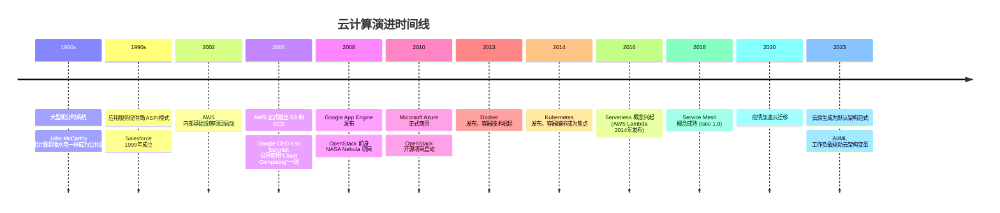

## 12.1.1 云计算的定义与本质

### 什么是云计算

云计算（Cloud Computing）并非一项单一技术，而是分布式计算、虚拟化、网络技术、服务化架构等多种技术经过数十年演进后融合而成的计算范式。从本质上看，云计算是一种**通过互联网按需交付 IT 资源和应用程序的模式，具有按使用量付费的定价机制**。

理解云计算，需要先理解它解决了什么问题。在传统 IT 架构中，企业要上线一个业务系统，需要经历采购服务器、部署机房、安装操作系统、配置网络、部署应用等一系列漫长流程，周期通常以月为单位，且资源一旦采购就形成固定成本——业务高峰期资源不足，低谷期资源闲置。云计算的出现，将这一切变成了"像用水用电一样使用计算资源"：打开水龙头就有水，关掉就停止计费。

#### NIST 官方定义

美国国家标准与技术研究院（NIST）在 SP 800-145 文档中给出了云计算的经典定义，这是业界最广泛引用的权威定义：

> 云计算是一种模型，它能够实现随时随地、便捷地、按需地通过网络访问可配置的共享计算资源池（如网络、服务器、存储、应用和服务），这些资源可以被快速供应和释放，只需最少的管理工作或服务提供商干预。

这个定义包含几个关键要素：

| 要素 | 含义 | 安全关联 |
|------|------|----------|
| 按需网络访问 | 通过标准网络机制获取资源，不依赖特定终端 | 攻击面从物理边界扩展到整个互联网 |
| 共享资源池 | 多租户共享底层物理资源 | 隔离机制成为安全基石 |
| 快速弹性 | 资源可快速伸缩 | 安全策略必须动态跟随资源变化 |
| 可计量服务 | 资源使用可被监控和计量 | 异常用量可作为安全事件指标 |
| 最少管理干预 | 自动化供应减少人工参与 | 自动化流程本身成为攻击目标 |

#### 云计算的本质：从技术到商业模式的跃迁

云计算的本质不仅仅是技术革新，更是一场**IT 资源交付方式的范式转变**。它包含三个核心维度的变革：

**1. 资源抽象化**

云计算通过虚拟化技术将物理资源抽象为逻辑资源。一台物理服务器可以被划分为多个虚拟机，一个分布式存储集群可以被抽象为一个无限容量的存储桶。这种抽象使得：

- 用户不再关心资源的物理位置和形态
- 资源可以被灵活组合和重新分配
- 硬件故障对上层应用透明（理论上）

从安全角度看，抽象层本身成为了新的攻击面。虚拟化层的漏洞（如虚拟机逃逸）可能导致租户间的隔离被突破。

**2. 服务化交付**

云计算将 IT 能力封装为服务，通过 API 和 Web 界面交付。这催生了"一切即服务"（Everything as a Service, XaaS）的理念。从底层的计算和存储，到中间件和数据库，再到完整的应用——每一层都可以作为服务提供。这种模式使得：

- 专业能力被复用，降低了技术门槛
- 服务间的依赖关系变得复杂
- API 成为系统交互的核心接口

从安全角度看，每一个服务接口都是潜在的攻击入口。API 安全成为云安全的核心议题之一。

**3. 规模经济效应**

云计算厂商通过超大规模数据中心实现显著的成本优势。据统计，大型云服务商的基础设施成本可以比企业自建机房低 60%-80%。这种规模效应使得：

- 中小企业也能获得世界级的 IT 基础设施
- 安全投入可以被分摊到海量用户
- 但同时，云平台自身的安全事件影响范围也呈指数级放大

### 云计算的核心特征

NIST 定义了云计算的五个基本特征，理解这些特征对安全分析至关重要——每一个特征都引入了特定的安全考量。

#### 1. 按需自助服务（On-demand Self-service）

用户可以根据需要自行获取计算资源，无需与服务提供商进行人工交互。用户通过 Web 控制台、CLI 或 API 就能在几分钟内创建虚拟机、数据库、存储桶等资源。

**安全意义**：
- 自助服务意味着权限管理变得极其重要——谁能创建什么资源、资源创建后的默认安全配置是什么，都直接决定安全态势
- 缺乏人工审核环节，错误配置可以瞬间扩散
- 需要完善的审批流程和策略守卫（Policy Guardrails）来弥补人工审核的缺失

#### 2. 广泛的网络访问（Broad Network Access）

资源通过网络提供，支持各种客户端平台（手机、平板、笔记本、IoT 设备等）标准访问。

**安全意义**：
- 攻击面从传统的内网边界扩展到整个互联网
- 需要零信任架构，不再假设内网是安全的
- DDoS 防护、WAF、传输加密等成为标配
- 多种终端类型意味着端点安全管理更加复杂

#### 3. 资源池化（Resource Pooling）

服务提供商的计算资源被池化，采用多租户模型为多个消费者服务。用户通常不知道也无法控制资源的确切物理位置，但可以在更高的抽象层（如国家、区域、数据中心）指定位置。

**安全意义**：
- **多租户隔离**成为云安全的基石——逻辑隔离失败意味着一个租户可以访问另一个租户的数据
- 侧信道攻击（Side-channel Attack）利用共享硬件的物理特性（CPU 缓存、内存总线等）泄露信息
- 数据残留问题——当一个租户释放资源后，其数据是否被彻底清除
- Hypervisor（虚拟机监控器）的安全性直接决定整个平台的安全底线

#### 4. 快速弹性（Rapid Elasticity）

资源可以快速弹性地供应和释放，在某些情况下可以自动化实现，对外表现为近乎无限的供应能力。用户可以在任何时间获取任何数量的资源。

**安全意义**：
- 安全策略必须能够**动态适应资源规模变化**——当实例从 10 个扩展到 1000 个时，安全策略不能滞后
- 弹性被攻击者利用：资源劫持（Cryptojacking）——攻击者利用被入侵的云账号大量创建计算实例进行加密货币挖矿
- 自动扩缩容策略本身需要安全审查，防止被滥用导致成本爆炸

#### 5. 可计量的服务（Measured Service）

云系统在某些抽象层自动控制和优化资源使用，通过计量能力（如存储、处理、带宽、活跃用户账号数）实现资源使用的监控和报告，对提供商和消费者双方透明。

**安全意义**：
- 计量数据是重要的安全检测信号——突然的流量激增、存储用量异常、API 调用频率飙升都可能是安全事件的前兆
- 需要建立基线（Baseline），通过偏差检测发现异常
- 计量数据的完整性和准确性本身也需要保护，防止被篡改以掩盖攻击

### 云计算与相关概念的辨析

#### 云计算 vs 网格计算

网格计算（Grid Computing）是云计算的前身之一，但二者有本质区别：

| 维度 | 网格计算 | 云计算 |
|------|----------|--------|
| 资源来源 | 分散在不同机构的闲置资源 | 由单一提供商集中管理的资源池 |
| 核心目标 | 解决大规模科学计算问题 | 提供通用的 IT 资源服务 |
| 用户关系 | 平等协作，贡献者也是使用者 | 明确的服务提供者与消费者关系 |
| 计费模式 | 通常基于资源共享和互惠 | 按使用量付费 |
| 虚拟化程度 | 较低，通常直接使用物理资源 | 深度虚拟化 |
| 典型应用 | SETI@home、CERN 高能物理计算 | AWS、Azure、阿里云 |

#### 云计算 vs 效用计算

效用计算（Utility Computing）强调将计算资源作为一种公共事业来提供，与水电类似。云计算可以被视为效用计算理念在技术成熟后的具体实现，但云计算的内涵更广——它不仅包含资源的按需提供，还包含了服务化、弹性、自服务等更丰富的特征。

#### 云计算 vs 虚拟化

虚拟化是云计算的关键技术基础之一，但虚拟化不等于云计算：

```text
虚拟化 ≠ 云计算
虚拟化 + 自服务门户 + 资源编排 + 计量计费 + 网络交付 ≈ 云计算
```

一台运行 VMware ESXi 的服务器是虚拟化环境，但不是云计算。只有当虚拟化与自助服务、弹性伸缩、网络交付、计量计费等特征结合，才构成云计算。

### 云计算的演进历程

理解云计算的历史演进，有助于理解其架构决策背后的原因。



从安全视角看，这个演进历程也是攻击面不断变化的过程：

- **大型机时代**：物理安全就是一切，攻击面小但影响集中
- **客户端-服务器时代**：网络成为攻击面，防火墙应运而生
- **虚拟化时代**：Hypervisor 成为新的攻击面，虚拟机逃逸成为威胁
- **云原生时代**：API、容器、微服务、编排层——攻击面呈指数级增长
- **AI 云时代**：模型投毒、提示注入、训练数据泄露——新的安全课题

### 从安全视角理解云计算的本质

对于网络安全从业者而言，云计算的本质可以从以下几个角度理解：

#### 信任边界的重新定义

传统安全模型基于网络边界——"内网可信，外网不可信"。云计算彻底打破了这一假设：

- 你的"内网"运行在别人的基础设施上
- 同一台物理服务器上可能运行着你的竞争对手的业务
- 云服务商的管理员拥有物理层面的最高权限

这意味着安全模型必须从**基于边界**转向**基于身份和数据**——即零信任架构。

#### 攻击面的结构性变化

```text
传统数据中心攻击面：
├── 物理安全
├── 网络层 (防火墙、路由器)
├── 操作系统
├── 应用层
└── 数据层

云计算新增攻击面：
├── 云管理平面 (控制台、API)
├── 虚拟化层 (Hypervisor、容器运行时)
├── 身份与访问管理 (IAM)
├── 云服务商内部威胁
├── 配置管理 (S3桶公开、安全组放行等)
├── 服务间通信 (微服务API)
├── 供应链 (第三方镜像、依赖库)
└── 编排层 (Kubernetes、Serverless平台)
```

云环境的攻击面远比传统环境复杂。根据 Verizon《2024 数据泄露调查报告》，配置错误和凭证泄露是云环境中最主要的安全事件成因，合计占比超过 60%。

#### 责任模型的根本转变

在云环境中，安全责任在云服务商和用户之间分配。这不是简单的"各管一半"，而是根据服务模型（IaaS/PaaS/SaaS）动态变化的——这将在后续章节详细讨论。

核心要理解的是：**迁移到云并不意味着将安全责任也"迁移"给了云服务商**。事实上，云安全事件中绝大多数是由用户侧的配置错误和管理疏忽造成的。

#### 数据主权与合规的新挑战

当数据存储在云上，一系列新的问题浮现：

- 数据的物理位置在哪里？（影响数据主权和跨境合规）
- 谁有能力访问你的数据？（云服务商员工、政府执法请求）
- 数据删除是否真正彻底？（多副本、备份残留）
- 加密密钥由谁管理？（BYOK vs 云托管密钥）

这些问题不是纯粹的技术问题，而是涉及法律、合规和商业信任的综合性议题。

### 云计算的核心价值主张（安全视角）

云计算并非只是把东西搬到别人的数据中心。从安全角度看，它既带来了新的风险，也提供了传统架构难以企及的安全能力：

**云带来的安全优势**：
- **专业安全团队**：大型云厂商拥有数千名安全专家，多数企业无法负担同等规模的安全团队
- **规模效应**：安全投入被分摊到数百万用户，单位安全成本极低
- **快速响应**：云厂商可以在分钟级完成全球范围的安全补丁部署
- **内置安全能力**：WAF、DDoS 防护、密钥管理、日志审计等开箱即用
- **合规认证**：主流云厂商已通过 ISO 27001、SOC 2、PCI DSS 等认证

**云引入的安全风险**：
- **配置责任**：用户负责的安全配置面大幅增加
- **供应链依赖**：云服务商的漏洞影响所有租户
- **可见性降低**：底层基础设施对用户不可见，安全监控依赖云厂商提供的工具
- **锁定风险**：迁移困难导致在安全事件发生时缺乏替代方案
- **共享责任模糊**：责任边界不清晰导致安全盲区

### 本章后续导读

本文建立了云计算的基础认知框架。在后续章节中，我们将依次深入：

- **12.1.2** 三大服务模型（IaaS/PaaS/SaaS）——决定你和云厂商各自负责什么
- **12.1.3** 部署模型（公有云/私有云/混合云/社区云）——决定你的数据在哪里
- **12.1.4** 责任共担模型——安全责任的精确划分
- **12.1.5** 主流云平台架构对比——AWS vs Azure vs GCP 的安全架构差异
- **12.1.6** 云安全框架与合规标准——治理和合规的要求
- **12.1.7** 身份与访问管理（IAM）基础——云安全的第一道防线
- **12.1.8** 云安全的攻击面分析——攻击者眼中的云环境
- **12.1.9** 云安全架构深度解析——从防御者角度构建安全体系

每一节都建立在本节奠定的认知基础上，形成从概念到实践的完整知识链。
