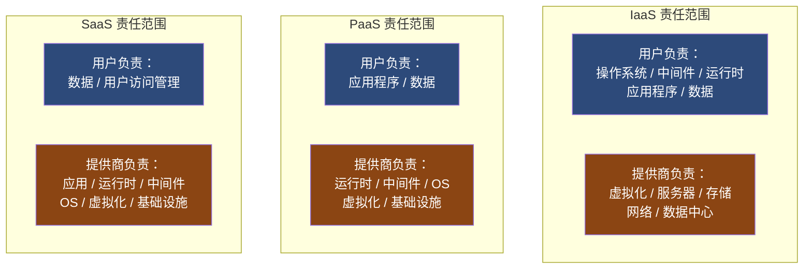
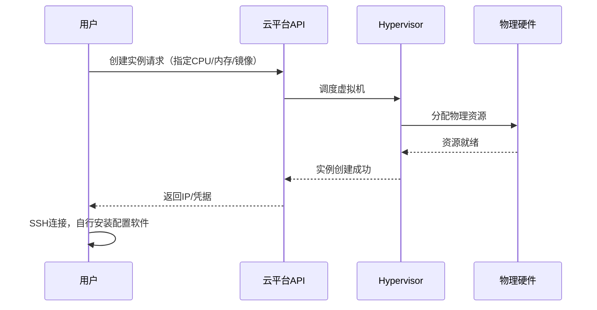
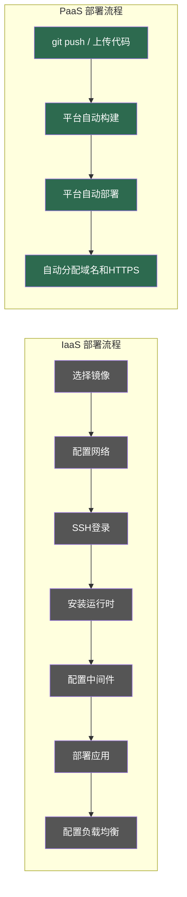
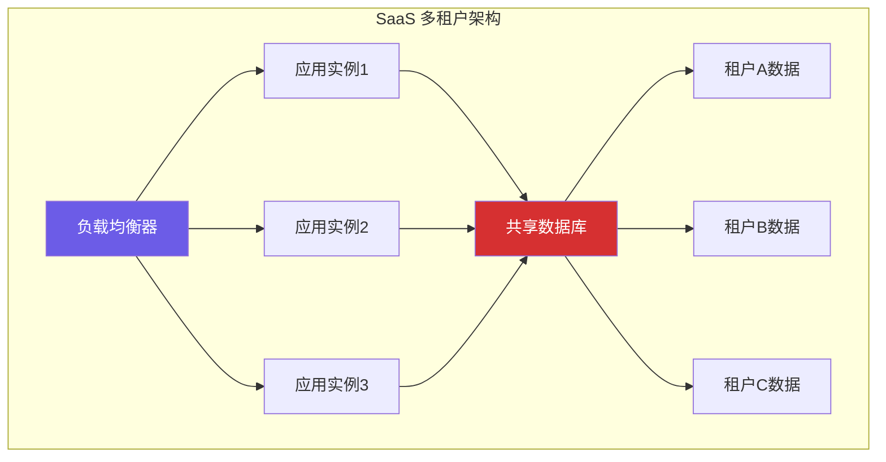
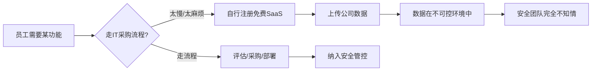
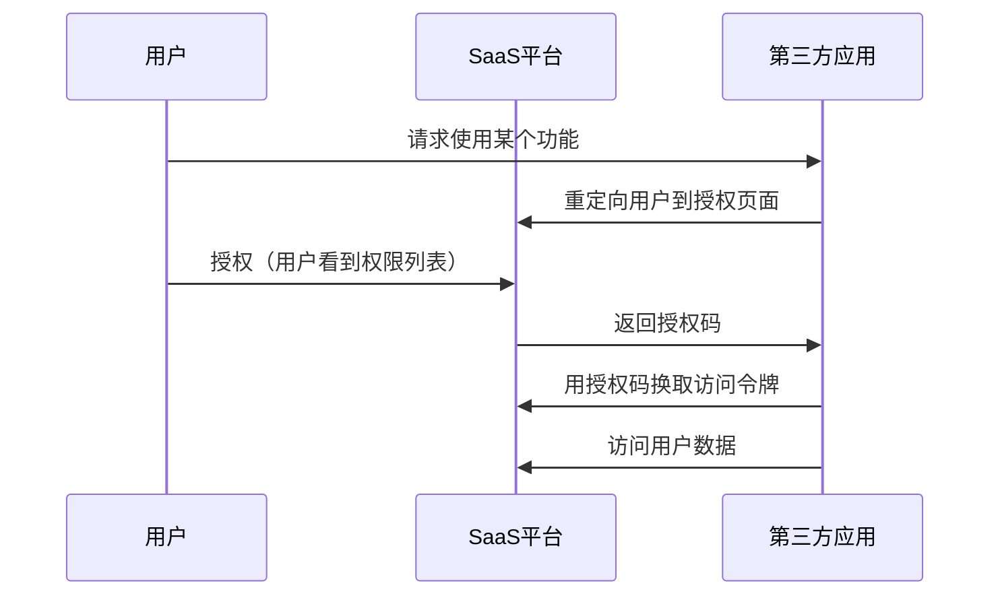
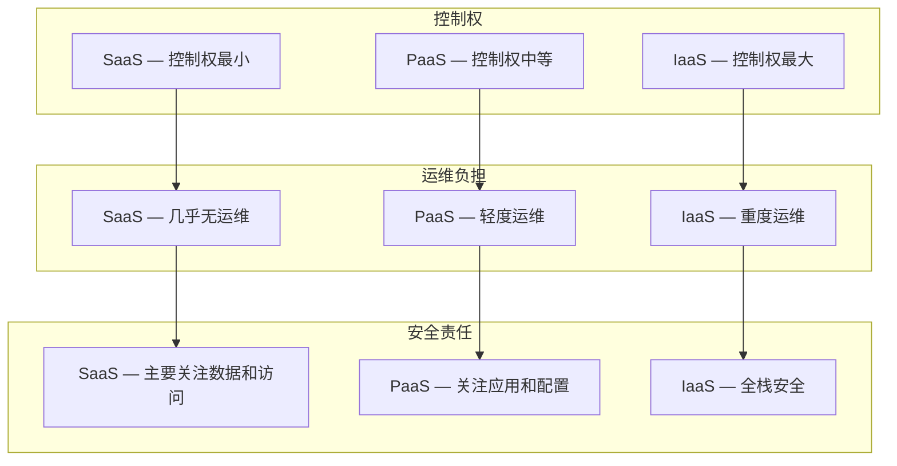
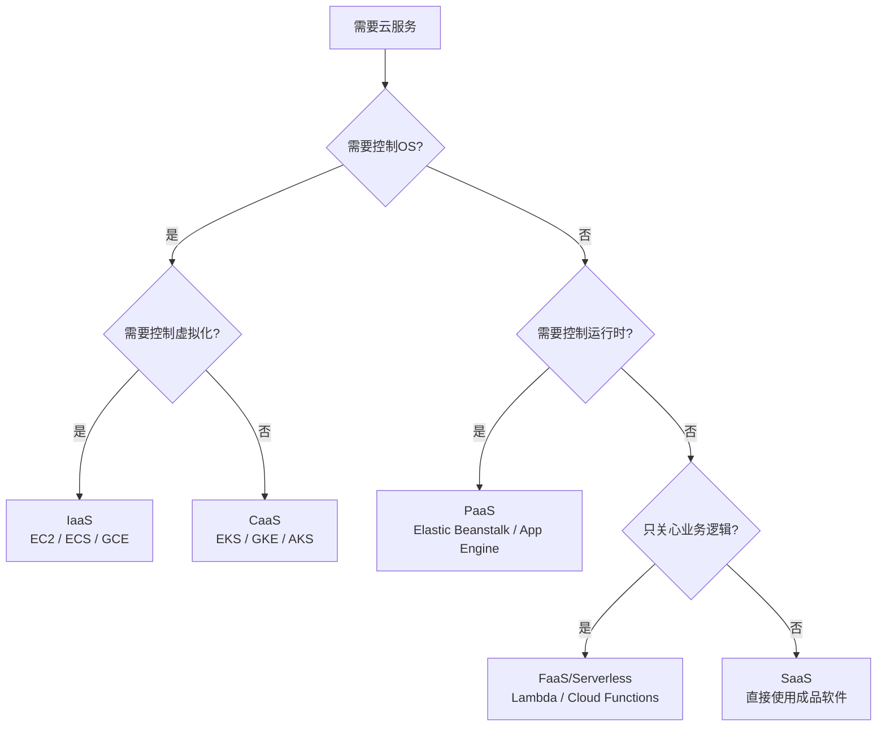

## 12.1.2 三大服务模型

云计算的服务模型决定了用户和云服务商之间的责任边界。这个边界不是随意划定的——它直接决定了谁为安全事件买单、攻击面如何分布、以及你需要掌握哪些攻防技能。本节将从底层原理到实战应用，系统拆解 IaaS、PaaS、SaaS 三大经典模型及其衍生形态。

### 服务模型的本质：责任分层

理解三大模型的第一步，是将一个完整的技术栈从底层到应用层拆分为七层责任：

| 层级 | 内容 | IaaS | PaaS | SaaS |
|------|------|------|------|------|
| **第7层 - 数据** | 业务数据、配置数据 | 用户 | 用户 | 用户 |
| **第6层 - 应用** | 应用程序代码、逻辑 | 用户 | 用户 | 提供商 |
| **第5层 - 运行时** | 语言运行时（Node.js、Python等） | 用户 | 提供商 | 提供商 |
| **第4层 - 中间件** | Web服务器、消息队列、数据库引擎 | 用户 | 提供商 | 提供商 |
| **第3层 - 操作系统** | Linux/Windows 内核、系统库 | 用户 | 提供商 | 提供商 |
| **第2层 - 虚拟化** | Hypervisor、容器运行时 | 提供商 | 提供商 | 提供商 |
| **第1层 - 基础设施** | 物理服务器、存储、网络、机房 | 提供商 | 提供商 | 提供商 |

这个表格揭示了一个核心规律：**从 IaaS 到 SaaS，用户的控制权逐层递减，但运维负担也逐层递减**。安全攻防的焦点随之上移——在 IaaS 中你可能要关注内核提权漏洞，在 SaaS 中你只需关注数据泄露和权限配置。



AWS 官方将其总结为 **"Shared Responsibility Model"（共享责任模型）**，这个模型是所有云安全分析的起点。记住一句话：**安全 "of" the cloud 归提供商，安全 "in" the cloud 归用户**。

---

### IaaS：基础设施即服务

#### 定义与工作原理

IaaS 是云服务模型中最底层的形态（对用户而言）。提供商通过虚拟化技术将物理资源池化，按需分配给用户。用户获得的是虚拟机、虚拟网络、块存储等"裸"资源，在其上自由构建整个技术栈。

工作流程如下：



#### 典型代表与产品矩阵

| 云厂商 | 计算服务 | 存储服务 | 网络服务 |
|--------|----------|----------|----------|
| **AWS** | EC2 | EBS、S3 | VPC、ELB |
| **Azure** | Virtual Machines | Managed Disks、Blob Storage | VNet、Load Balancer |
| **Google Cloud** | Compute Engine | Persistent Disk、Cloud Storage | VPC、Cloud Load Balancing |
| **阿里云** | ECS | 云盘、OSS | VPC、SLB |
| **华为云** | ECS | EVS、OBS | VPC、ELB |

#### 安全攻防要点

**攻击面分析**——IaaS 环境中用户控制的每一层都是潜在攻击目标：

**1. 操作系统层面**

- 内核漏洞利用（Dirty Pipe、Dirty COW 等特权提升漏洞）
- 未修补的系统服务（OpenSSH、systemd 等）
- 错误的文件权限和 SUID 配置
- 弱密码和密钥管理不当

```bash
# 常见安全检查示例
# 检查是否有未修补的内核漏洞
uname -r
apt list --upgradable 2>/dev/null | grep -i security

# 检查SUID二进制文件
find / -perm -4000 -type f 2>/dev/null

# 检查开放端口
ss -tlnp
```

**2. 网络层面**

- 安全组配置过于宽松（入站 0.0.0.0/0）
- VPC 对等连接配置错误导致跨租户可达
- 未启用 VPC 流日志，缺乏网络流量审计能力
- 元数据服务未做访问限制（详见下文 IMDS 攻击）

**3. 元数据服务攻击（IMDS）**

这是 IaaS 环境中最经典也最具杀伤力的攻击向量之一。云实例可以通过内部 IP（如 AWS 的 `169.254.169.254`）访问元数据服务，获取临时安全凭据。如果应用存在 SSRF 漏洞，攻击者可以借此获取实例角色的 IAM 凭据，进而横向移动。

```bash
# AWS IMDS v1（易受SSRF攻击）
curl http://169.254.169.254/latest/meta-data/iam/security-credentials/

# AWS IMDS v2（需要同时控制请求头，防护能力更强）
TOKEN=$(curl -X PUT "http://169.254.169.254/latest/api/token" \
  -H "X-aws-ec2-metadata-token-ttl-seconds: 21600")
curl -H "X-aws-ec2-metadata-token: $TOKEN" \
  http://169.254.169.254/latest/meta-data/iam/security-credentials/
```

AWS 在 2019 年 Capital One 数据泄露事件后推出了 IMDS v2，强制要求通过 PUT 请求获取 Token 并在后续请求中携带该 Token，从而有效阻断了 SSRF 攻击链。但很多用户至今仍运行 v1，这是一个高价值攻击目标。

**4. 存储安全**

- S3/OSS Bucket 公开访问是最常见的云安全事件之一
- 快照（Snapshot）权限配置不当可导致数据泄露
- 未加密的 EBS 卷在物理层面可能被其他租户读取

#### 实操：IaaS 安全加固清单

```markdown
## IaaS 安全加固 Checklist

### 计算层
- [ ] 启用自动安全更新（unattended-upgrades / yum-cron）
- [ ] 使用最小化镜像（无多余软件包）
- [ ] 禁用密码登录，仅允许密钥认证
- [ ] 配置入侵检测（OSSEC / Wazuh）
- [ ] 启用 IMDSv2（AWS）或禁用不安全元数据端点

### 网络层
- [ ] 安全组最小权限原则（默认拒绝，按需开放）
- [ ] 启用 VPC 流日志并设置告警
- [ ] 使用 NACL 作为第二层防护
- [ ] 管理平面（SSH/RDP）仅允许通过堡垒机访问

### 存储层
- [ ] 存储桶默认设置为私有
- [ ] 启用服务端加密（SSE-S3 / SSE-KMS）
- [ ] 启用版本控制和生命周期策略
- [ ] 禁止公开访问（Block Public Access）
```

---

### PaaS：平台即服务

#### 定义与工作原理

PaaS 在 IaaS 之上封装了操作系统、中间件和运行时环境，用户只需提供应用代码和配置，平台负责其余所有底层运维。用户通过 Git push、CLI 命令或 CI/CD 流水线部署应用，不直接接触操作系统。

部署流程对比：



PaaS 的核心价值是**消除运维摩擦**，但这也意味着你失去了对底层环境的可见性和控制力。

#### 典型代表与产品分类

| 类型 | 代表产品 | 适用场景 |
|------|----------|----------|
| **Web应用托管** | AWS Elastic Beanstalk、Azure App Service、Google App Engine、Heroku | 传统 Web 应用部署 |
| **容器编排** | AWS EKS、Azure AKS、Google GKE | 微服务架构、复杂应用 |
| **Serverless 计算** | AWS Lambda、Azure Functions、Google Cloud Functions | 事件驱动、短时任务 |
| **数据库托管** | AWS RDS、Azure SQL Database、Google Cloud SQL | 关系型数据库 |
| **API 网关** | AWS API Gateway、Azure API Management、Kong | API 管理和安全 |
| **消息队列** | AWS SQS/SNS、Azure Service Bus、Google Pub/Sub | 异步通信、事件流 |

#### 安全攻防要点

**1. 供应链与依赖安全**

PaaS 环境中，应用依赖平台提供的基础镜像、运行时和组件库。如果这些预置组件存在漏洞，所有使用该平台的租户都受影响。

真实案例：2021 年的 Log4Shell（CVE-2021-44228）在 PaaS 环境中影响尤为严重，因为用户无法自行修补底层 Java 运行时，只能等待平台提供商推送修复。对于使用 AWS Lambda 或 Azure Functions 等 Serverless 平台的用户，这个问题尤为棘手——你甚至无法选择使用哪个版本的 Log4j。

**防护策略**：
- 持续监控平台提供商的安全公告和 CVE 披露
- 使用 SCA（软件成分分析）工具扫描应用依赖
- 建立应急响应预案，明确平台级漏洞的处理流程

**2. 应用层安全**

用户在 PaaS 环境中仍然完全控制应用代码，这意味着常见的 Web 安全漏洞依然是主要攻击面：

- 注入攻击（SQL注入、命令注入、LDAP注入）
- 跨站脚本（XSS）和跨站请求伪造（CSRF）
- 不安全的反序列化
- 认证和授权缺陷
- 不安全的直接对象引用（IDOR）

```python
# PaaS 环境中常见的安全反模式

# 反模式1：硬编码数据库凭据
# 即使是托管数据库，也应使用环境变量或密钥管理服务
DB_PASSWORD = "admin123"  # 绝对不要这样做

# 正确做法：使用平台密钥管理
import os
DB_PASSWORD = os.environ.get("DB_PASSWORD")
# 或使用 AWS Secrets Manager / Azure Key Vault
```

**3. Serverless 特有攻击面**

Serverless 架构（如 AWS Lambda）引入了独特的安全挑战：

- **事件注入**：Lambda 函数接收来自 S3、SQS、API Gateway 等多种事件源的输入，每个事件源都可能成为注入点
- **权限过宽**：Lambda 执行角色经常被授予 `AdministratorAccess`，违背最小权限原则
- **冷启动信息泄露**：函数冷启动时可能暴露环境变量中的敏感信息
- **无服务器拒绝服务**：攻击者通过高频触发函数导致账单暴增

```bash
# 检查Lambda函数的IAM权限
aws lambda get-function-configuration --function-name my-function \
  --query 'Role' --output text | xargs iam get-role-policy

# 检查函数的环境变量（注意加密状态）
aws lambda get-function-configuration --function-name my-function \
  --query 'Environment'
```

**4. 容器平台（Kubernetes）安全**

容器编排平台是 PaaS 的重要形态，其安全挑战包括：

- **RBAC 配置错误**：过度宽松的 Role/ClusterRole 绑定
- **Pod 安全策略缺失**：容器以 root 运行、可访问宿主机文件系统
- **Secret 管理不当**：将凭据硬编码在 YAML 文件或镜像层中
- **网络策略缺失**：Pod 间无网络隔离，攻击者可横向移动
- **镜像漏洞**：使用含已知漏洞的基础镜像

```yaml
# Kubernetes Pod Security Context 示例
apiVersion: v1
kind: Pod
metadata:
  name: secure-pod
spec:
  securityContext:
    runAsNonRoot: true        # 禁止以root运行
    runAsUser: 1000
    fsGroup: 2000
    seccompProfile:
      type: RuntimeDefault    # 启用seccomp
  containers:
  - name: app
    image: myapp:latest
    securityContext:
      allowPrivilegeEscalation: false  # 禁止特权提升
      readOnlyRootFilesystem: true     # 只读根文件系统
      capabilities:
        drop:
          - ALL                # 丢弃所有Linux capabilities
    resources:
      limits:
        cpu: "500m"
        memory: "256Mi"
      requests:
        cpu: "250m"
        memory: "128Mi"
```

---

### SaaS：软件即服务

#### 定义与工作原理

SaaS 是面向终端用户的最上层服务模型。提供商负责整个技术栈，用户通过浏览器或客户端应用直接使用软件功能，无需关心任何技术实现细节。典型的 SaaS 产品包括办公协作工具、CRM 系统、项目管理工具等。

SaaS 的核心架构特征是**多租户（Multi-tenancy）**——所有用户共享同一套应用实例和基础设施，通过逻辑隔离（数据库 schema 隔离或行级隔离）实现数据分离。这个架构决定了 SaaS 安全的核心矛盾：**效率与隔离之间的张力**。



#### 典型代表

| 类别 | 代表产品 | 主要功能 |
|------|----------|----------|
| **办公协作** | Microsoft 365、Google Workspace | 邮件、文档、视频会议 |
| **CRM** | Salesforce、HubSpot | 客户关系管理 |
| **项目管理** | Jira、Asana、Notion | 任务跟踪、协作 |
| **文件存储** | Dropbox、Box、OneDrive | 文件同步和共享 |
| **通信** | Slack、Microsoft Teams、Zoom | 即时通讯和会议 |
| **安全** | CrowdStrike、Zscaler | 终端安全、零信任网络 |

#### 安全攻防要点

**1. 数据安全与泄露**

SaaS 环境中数据泄露的主因不是技术漏洞，而是人为误操作和配置错误：

- **过度共享**：将包含敏感数据的文档设置为"任何人可通过链接访问"
- **离职员工残留账号**：未及时撤销离职员工的 SaaS 访问权限
- **第三方集成过度授权**：OAuth 应用请求了过多的权限范围

```bash
# 使用 Microsoft Graph API 检查过度共享的文件
# 查看最近30天内外部共享的文件
GET https://graph.microsoft.com/v1.0/reports/getSharePointActivityFileCounts(period='D30')

# 列出所有OAuth应用及其权限
GET https://graph.microsoft.com/v1.0/servicePrincipals?$select=displayName,appId,appRoles
```

**2. 影子IT（Shadow IT）**

影子IT 是 SaaS 时代最严峻的安全挑战之一。员工出于效率考虑，未经 IT 部门批准就使用第三方 SaaS 应用处理公司数据。Gartner 研究显示，企业实际使用的 SaaS 应用数量通常是 IT 部门认知的 10-20 倍。



**检测方法**：
- 部署 CASB（云访问安全代理），如 Microsoft Defender for Cloud Apps、Netskope
- 分析 DNS 查询日志和网络流量，识别未授权的 SaaS 访问
- 定期扫描企业邮箱中的 SaaS 注册确认邮件

**3. OAuth 与第三方应用风险**

SaaS 生态中，OAuth 授权是最常见的集成方式，也是高价值攻击目标：



攻击者可以创建看似无害的第三方应用，请求过度的 OAuth 权限（如读写所有邮件、访问所有文件），一旦用户授权，攻击者即可在用户不知情的情况下持续访问数据。

**4. API 安全**

SaaS 提供的 API 是集成和自动化的基础，但也引入了新的攻击面：

- API 密钥泄露（硬编码在代码中、提交到公开仓库）
- 速率限制不足导致数据大量外泄
- 不充分的输入验证导致注入攻击
- BOLA（Broken Object Level Authorization）——通过修改 API 请求中的对象 ID 访问其他租户的数据

---

### 三大模型对比分析



| 维度 | IaaS | PaaS | SaaS |
|------|------|------|------|
| **用户控制力** | 高——可自定义整个技术栈 | 中——控制应用层 | 低——仅控制数据和访问 |
| **运维复杂度** | 高——需要专业运维团队 | 中——平台托管基础设施 | 低——提供商全面托管 |
| **灵活性** | 最高——任意架构和软件 | 中等——受限于平台支持的运行时 | 最低——仅使用提供商功能 |
| **初始成本** | 低——按量付费 | 中等 | 较高——通常按用户/月计费 |
| **总体拥有成本(TCO)** | 高——需计入人力和运维成本 | 中等 | 低——运维成本接近零 |
| **安全责任范围** | 最广——OS到应用全栈 | 中等——应用和数据 | 最窄——数据和访问管理 |
| **典型用户** | 运维团队、DevOps工程师 | 开发团队 | 终端用户、业务团队 |
| **攻击面** | 最大——每层都可能被攻击 | 中等——应用层为主 | 最小——主要来自配置和行为 |

---

### 衍生服务模型

除了三大经典模型，云行业还演化出了多种细分模型：

#### FaaS（Function as a Service / Serverless）

FaaS 是 PaaS 的进一步抽象，用户只需编写单个函数，由平台管理所有基础设施和运行时。每次函数被事件触发时，平台自动分配资源执行，执行完毕后释放资源。

- **代表产品**：AWS Lambda、Azure Functions、Google Cloud Functions、Cloudflare Workers
- **安全特点**：用户几乎完全不接触基础设施，但需要关注函数权限、事件注入、冷启动安全
- **计费模式**：按调用次数和执行时间计费，空闲时零成本

#### CaaS（Container as a Service）

CaaS 介于 IaaS 和 PaaS 之间，用户管理容器和编排策略，提供商管理底层基础设施。

- **代表产品**：AWS ECS/Fargate、Azure Container Instances、Google Cloud Run
- **安全特点**：需要关注容器镜像安全、编排层配置、网络策略

#### DBaaS（Database as a Service）

DBaaS 将数据库运维完全托管化，用户只需使用标准接口连接数据库，提供商负责备份、扩容、高可用等。

- **代表产品**：AWS RDS/Aurora、Azure Cosmos DB、MongoDB Atlas、PlanetScale
- **安全特点**：数据库访问控制、加密、审计日志由用户负责，提供商保障底层可用性

#### STaaS（Storage as a Service）

- **代表产品**：AWS S3、Azure Blob Storage、Google Cloud Storage
- **安全特点**：访问策略配置（ACL、Bucket Policy）是最大的安全风险来源

模型选择决策流程：



---

### 实战：基于服务模型的安全评估框架

当你面对一个云环境时，第一步是确认其服务模型，然后按以下框架评估安全态势：

```markdown
## 云安全评估模板

### 1. 识别服务模型
- 该系统使用的是哪种服务模型？（IaaS/PaaS/SaaS/混合）
- 用户和提供商的责任边界在哪里？
- 是否存在模型混用导致的责任模糊区域？

### 2. 责任边界审计
- 责任边界是否被文档化？
- 团队成员是否清楚自己的安全责任？
- 是否有定期的责任边界审查机制？

### 3. 配置基线检查
- [ ] IaaS：安全组规则、系统补丁、IAM策略
- [ ] PaaS：应用配置、环境变量、依赖版本
- [ ] SaaS：共享设置、OAuth授权、管理员权限

### 4. 数据流分析
- 数据在各层级之间如何流动？
- 加密是否覆盖静态数据和传输中数据？
- 是否存在跨区域/跨账号的数据传输？

### 5. 事件响应准备
- 不同服务模型下的取证能力是否就绪？
- 日志收集和分析是否覆盖所有责任层级？
- 与提供商的事件响应联络机制是否建立？
```

---

### 常见误区与纠正

**误区1："使用云服务就不需要关心安全了"**

纠正：云提供商只负责"云的安全"（Security of the Cloud），用户仍然需要负责"云中的安全"（Security in the Cloud）。Shared Responsibility Model 明确划分了这个边界。即使是最"托管"的 SaaS 服务，数据安全和访问管理仍然是用户的责任。

**误区2："SaaS 不会被攻击"**

纠正：SaaS 本身可能不会被"入侵"，但 SaaS 中的数据可以被泄露。攻击者通过钓鱼获取凭证、利用 OAuth 授权漏洞、利用 API 弱点，都可以在不入侵 SaaS 平台本身的情况下获取数据。2023 年的 Microsoft Storm-0558 事件就展示了即使是微软这样的大型 SaaS 提供商也可能存在身份验证漏洞。

**误区3："IaaS 比 PaaS 更安全，因为控制更多"**

纠正：控制更多不等于更安全。更多的控制意味着更多的配置点，每个配置点都是潜在的错误来源。选择哪种模型应该基于团队能力和业务需求，而不是盲目追求控制力。

**误区4："Serverless 无服务器等于无安全问题"**

纠正：Serverless 消除了基础设施层面的安全问题，但放大了应用层面的安全风险。函数权限过宽、事件注入、供应链依赖等都是 Serverless 特有的安全挑战。

**误区5："多云策略可以分散风险"**

纠正：多云策略在理论上确实避免了单点依赖，但实际上它大幅增加了安全管理的复杂度——不同云平台的安全模型、IAM 体系、网络架构各不相同，团队需要同时掌握多套体系。如果团队没有足够的能力覆盖多个平台，多云策略反而会增加安全风险。

---

### 进阶：混合服务模型的安全挑战

现实世界中，大多数企业不是纯粹的 IaaS、PaaS 或 SaaS 用户，而是混合使用多种模型。这引入了额外的安全复杂性：

- **责任边界模糊**：当一个应用的前端部署在 PaaS、后端运行在 IaaS、数据库使用 DBaaS 时，安全事件的责任归属可能难以厘清
- **安全策略不一致**：不同模型需要不同的安全策略，如何确保策略的一致性和完整性
- **数据流转控制**：数据在不同模型之间流动时，加密和访问控制策略需要统一
- **可观测性缺口**：不同模型的日志格式、监控工具、告警机制各不相同，统一的安全态势感知成为挑战

应对策略是建立**统一的安全控制平面**——使用 CSPM（云安全态势管理）工具（如 Wiz、Prisma Cloud、AWS Security Hub）统一管理所有服务模型的安全配置，结合 CIEM（云基础设施权限管理）工具管理跨模型的身份和权限。
