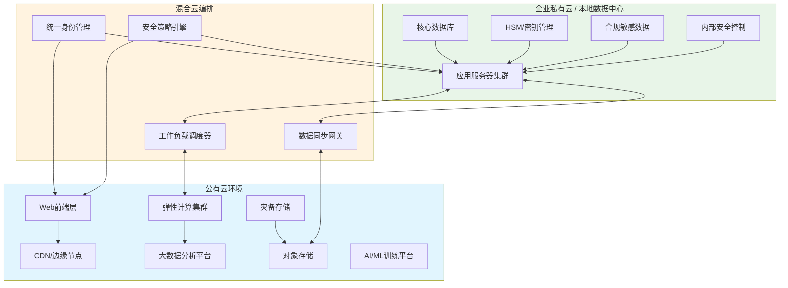
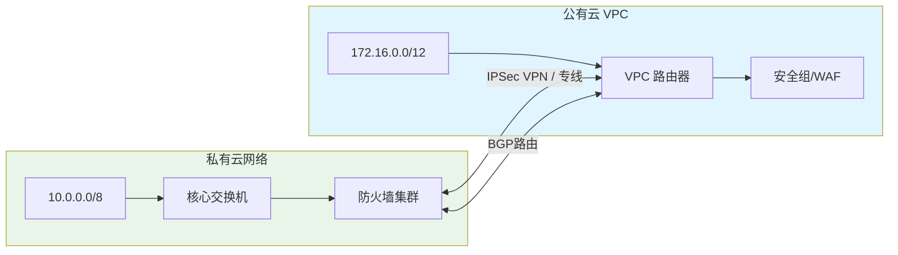
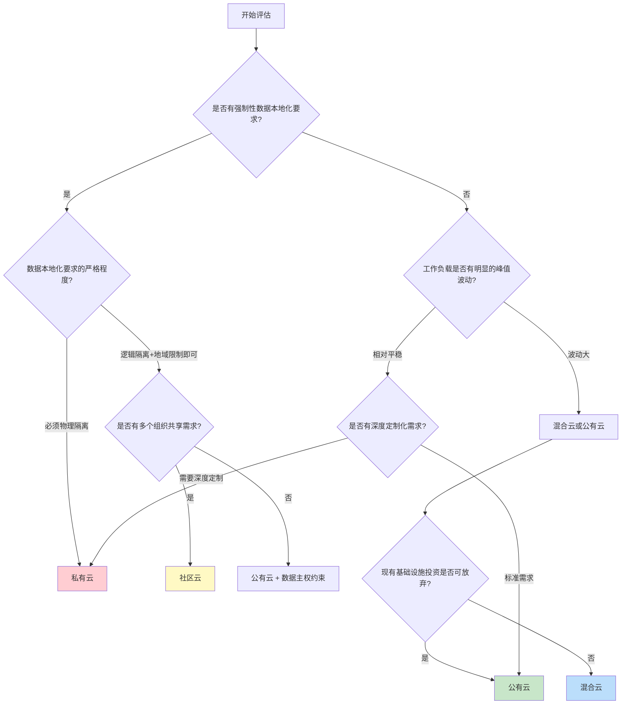

## 12.1.3 部署模型

云计算的部署模型决定了基础设施的所有权、管理方式和访问边界。如果说服务模型（IaaS/PaaS/SaaS）回答的是"用什么"，那么部署模型回答的是"谁的、在哪、谁能用"。对于安全从业者而言，部署模型直接决定了攻击面的范围、威胁模型的构成和防御策略的基线。

NIST SP 800-145 将云计算部署模型分为四种：公有云、私有云、社区云和混合云。每种模型在控制权、成本、安全责任和合规适用性上存在本质差异。

### 公有云（Public Cloud）

#### 定义与特征

公有云基础设施由第三方云服务提供商（CSP）拥有和运营，通过互联网向公众开放。资源在多租户环境中共享，用户通过自助门户或API按需获取计算、存储和网络资源。

核心特征：

- **多租户架构**：不同客户的工作负载运行在共享的物理基础设施上，通过虚拟化、容器或逻辑隔离实现分隔
- **按使用付费**：无需前期资本支出（CapEx），全部转为运营支出（OpEx），典型计费粒度精确到秒级
- **无限弹性**：资源池规模由CSP控制，理论上可以无限扩展
- **零基础设施管理**：用户不接触物理硬件，所有基础设施运维由CSP承担

#### 主流公有云平台

| 平台 | 全球市场份额（2025） | 数据中心区域 | 安全认证 |
|------|---------------------|-------------|---------|
| AWS | ~32% | 33个区域 | SOC 1/2/3, ISO 27001, FedRAMP High |
| Microsoft Azure | ~22% | 60+个区域 | SOC 1/2/3, ISO 27001, FedRAMP High |
| Google Cloud (GCP) | ~11% | 40个区域 | SOC 1/2/3, ISO 27001, FedRAMP High |
| 阿里云 | ~4%（国内第一） | 28个区域 | 等保三级, ISO 27001 |
| 腾讯云 | ~2% | 21个区域 | 等保三级, ISO 27001 |

#### 安全优势

**专业安全团队**：主流CSP拥有数千名安全工程师，其安全投入规模远超绝大多数单一企业。AWS在2024年的安全相关投资超过70亿美元。

**合规认证积累**：CSP一次性获取的合规认证（如FedRAMP、ISO 27001、SOC 2）可被所有客户继承使用，大幅降低企业的合规成本。单独获取FedRAMP认证可能需要12-18个月和数百万美元，而使用已认证的公有云服务可直接进入授权运营（ATO）流程。

**物理安全等级**：顶级数据中心的物理安全措施包括多层生物识别、24/7武装安保、环境监控系统、抗震防洪设计等，远超一般企业自建机房。

**全球基础设施**：通过多区域部署实现灾备和低延迟访问，单个CSP即可提供跨大洲的高可用架构。

#### 安全风险与挑战

**多租户隔离风险**：这是公有云最根本的安全担忧。虽然现代虚拟化技术已大幅降低跨租户攻击的概率，但历史上确实发生过突破事件：

- 2018年，研究人员在AMD处理器中发现Spectre/Meltdown漏洞，理论上允许恶意虚拟机读取宿主机及其他虚拟机的内存
- 2019年，AWS修补了一个影响其Nitro虚拟化平台的漏洞
- 侧信道攻击（如缓存时序攻击）一直是多租户环境的持续威胁

缓解措施包括：使用专用实例（Dedicated Instances/Hosts）、启用机密计算（如AWS Nitro Enclaves、Azure Confidential Computing、GCP Confidential VMs）、通过TPM/TEE实现硬件级隔离。

**数据主权与管辖权**：数据存储在CSP的物理数据中心中，可能受到数据中心所在国法律管辖。例如，美国的CLOUD Act允许美国执法机构要求美国公司提供存储在海外的数据。对于涉及敏感数据的组织（政府、金融、医疗），这是一个关键合规问题。

**供应商锁定**：使用特定CSP的专有服务（如AWS Lambda、Azure Functions）会产生深度依赖，迁移到其他平台的成本可能非常高。从安全角度看，这意味着在安全事件中可能无法快速切换基础设施。

**共享技术漏洞**：CSP的控制平面一旦被攻破，影响范围是全局性的。2019年Capital One数据泄露事件中，攻击者利用AWS WAF的配置错误和SSRF漏洞，获取了超过1亿用户的数据。

**互联网暴露面**：所有通过互联网访问的资源天然暴露在互联网威胁之下。DDoS攻击、暴力破解、API滥用等攻击向量始终存在。

#### 公有云安全最佳实践

1. **启用MFA并使用IAM最小权限原则**：为所有管理员账户启用硬件密钥MFA，绝不使用root账户进行日常操作
2. **加密一切**：传输中加密（TLS 1.3）+ 静态加密（客户管理密钥CMK），密钥由KMS管理但不存储在CSP侧
3. **网络分段**：使用VPC、子网、安全组、NACL实现多层网络隔离
4. **日志与监控**：启用CloudTrail/Activity Logs/Audit Logs，与SIEM集成实现实时告警
5. **定期安全评估**：使用AWS Inspector/Azure Security Center/Security Command Center持续扫描配置错误

### 私有云（Private Cloud）

#### 定义与特征

私有云基础设施专门为单一组织使用，可以部署在组织自有的数据中心（On-Premises），也可以由第三方托管（Hosted Private Cloud）。与传统IT基础设施不同，私有云仍然保留云计算的核心特征——自助服务、资源池化、弹性扩展和可计量服务。

核心特征：

- **单租户环境**：物理资源完全归属于一个组织，不存在与其他组织的共享隔离问题
- **完全控制权**：组织可以自定义硬件配置、网络架构、安全策略和合规标准
- **可预测性能**：不受"邻居噪声"（Noisy Neighbor）影响，资源可用性有保障
- **定制化能力**：可以部署特定的安全硬件（HSM、TPM）、专用网络设备和定制化监控方案

#### 私有云实现方案

| 方案 | 代表产品 | 特点 | 适用场景 |
|------|---------|------|---------|
| 超融合基础设施（HCI） | VMware vSAN + vSphere, Nutanix, SmartX | 计算、存储、网络融合，部署快速 | 中型企业，VDI，边缘计算 |
| 云管理平台（CMP） | OpenStack, VMware vRealize, CloudStack | 开源或商业，完整IaaS能力 | 大型企业，电信运营商 |
| 容器化平台 | Red Hat OpenShift, Rancher, VMware Tanzu | 基于Kubernetes，云原生 | 微服务架构，DevOps团队 |
| 裸金属云 | Equinix Metal, Packet, 自建 | 无虚拟化开销，最高性能 | 高性能计算，数据库密集型 |

#### 安全优势

**数据主权完全掌控**：数据始终在组织控制的物理边界内，不存在跨境数据流动的合规风险。对于等保三级/四级系统、金融行业核心系统、政务云等场景，这是刚性需求。

**网络隔离天然存在**：物理网络完全独立，不与任何外部租户共享。攻击者无法通过共享基础设施进行跨租户攻击。

**合规审计简化**：审计范围仅限于组织自身的基础设施和流程，不涉及CSP的合规状态。对于有严格审计要求的行业（如PCI DSS、HIPAA），这大幅降低了审计复杂度。

**定制化安全策略**：可以根据业务需求部署任意安全措施——从物理层的电磁屏蔽到应用层的WAF规则，没有任何限制。

#### 安全风险与挑战

**安全能力自建成本高**：失去了CSP提供的"免费"安全能力（DDoS防护、WAF、漏洞扫描等），所有安全基础设施需要自建和运维。中型企业自建完整安全体系的年成本通常在500万-2000万元人民币之间。

**人才招聘困难**：需要同时具备云计算和安全运维能力的复合型人才，这类人才在市场上极度稀缺且薪资高昂。

**扩展性瓶颈**：物理资源的扩展需要采购、部署、配置，周期通常为数周到数月，无法像公有云那样分钟级弹性扩展。应对突发流量峰值时，这个缺陷尤为明显。

**内网威胁更大**：由于所有数据和系统都在内部网络中，一旦内网被突破（钓鱼邮件、内部威胁、VPN泄露），攻击者可以访问的范围比公有云更广。没有公有云那样的"零信任"天然屏障。

**技术债务累积**：私有云平台的升级和维护完全由组织承担，版本落后导致的安全漏洞风险更高。OpenStack社区版的升级路径尤为复杂，许多企业因害怕升级失败而长期停留在旧版本。

#### 私有云安全最佳实践

1. **零信任网络架构**：即使在内网中，也实施"永不信任，始终验证"原则。使用微分段（Micro-Segmentation）限制东西向流量
2. **自动化安全运维**：使用Ansible/Terraform实现基础设施即代码（IaC），确保安全配置的一致性和可审计性
3. **完善的备份与灾备**：至少实施3-2-1备份策略（3份副本、2种介质、1份异地），定期进行灾备演练
4. **物理安全强化**：机房访问控制、视频监控、环境监控（温湿度、烟感、水浸）、UPS和发电机冗余
5. **持续漏洞管理**：建立内部漏洞扫描和补丁管理流程，确保所有组件保持最新安全补丁状态

### 混合云（Hybrid Cloud）

#### 定义与特征

混合云将公有云和私有云（或传统IT基础设施）组合在一起，允许数据和应用在两种环境之间按需迁移。NIST对混合云的定义要求：两个或多个独立的云基础设施通过标准化或专有技术实现数据和应用可移植性。

关键区别：混合云不仅仅是同时使用公有云和私有云（那叫"多云"），它要求两个环境之间有编排层实现工作负载的动态调度和数据的无缝流转。

#### 混合云典型部署模式

**1. 云爆发（Cloud Bursting）**

日常工作负载运行在私有云中，当需求峰值超出私有云容量时，自动将溢出流量"爆发"到公有云。

场景：电商大促（双11、618）、票务系统（春运抢票）、在线教育（考试季）。私有云承载80%的基础负载，公有云在峰值期承载额外的20%-200%流量。

安全挑战：数据在两个环境之间流动时的加密保护、身份认证的统一性、安全策略的一致性。

**2. 灾备即服务（DRaaS）**

生产环境运行在私有云中，灾备环境部署在公有云中，利用公有云的按需付费特性降低灾备成本。

场景：RPO（恢复点目标）< 1小时、RTO（恢复时间目标）< 4小时的中等优先级系统。传统的异地灾备中心建设成本为数千万，而云灾备可以降低到数十万/年。

安全挑战：灾备数据的加密存储、灾备切换时的身份认证、定期灾备演练的自动化。

**3. 开发-测试-生产分离**

开发和测试环境部署在公有云（利用弹性和低成本），生产环境部署在私有云（满足合规和性能要求）。

场景：金融行业的核心交易系统、医疗系统的HIS/PACS系统。开发测试环境使用公有云可以快速创建和销毁环境，生产环境留在本地满足监管要求。

安全挑战：测试数据的脱敏处理、CI/CD流水线的安全控制、代码从公有云到私有云的安全传输。

**4. 数据分层存储**

热数据（频繁访问）存储在私有云，温数据存储在公有云的高性能存储中，冷数据（归档）存储在公有云的对象存储中。

场景：视频监控系统、日志分析平台、科研数据管理。90天内的监控数据在本地存储用于实时查询，历史数据迁移到云端归档。

安全挑战：数据迁移过程中的加密、数据在不同安全等级环境中的访问控制、数据生命周期管理。

#### 混合云安全核心挑战

**统一身份管理（Identity Federation）**

混合云环境下最复杂的安全问题之一。用户需要在两个独立的身份系统之间实现单点登录（SSO）和统一的权限管理。

实现方案：

- SAML 2.0 / OIDC 联邦认证：私有云的AD/LDAP作为身份提供商（IdP），公有云IAM作为服务提供商（SP）
- 跨云IAM同步：使用AWS IAM Identity Center、Azure AD B2B、或第三方方案（Okta、Ping Identity）实现跨环境权限同步
- 零信任网络访问（ZTNA）：替代传统VPN，基于身份和设备状态进行动态访问控制

**安全策略一致性**

两个环境的安全策略必须保持一致，否则会出现"安全短板"。例如，私有云中的防火规则为80端口只允许特定IP访问，但公有云中却对所有IP开放。

实践方案：

- 基础设施即代码（IaC）：使用Terraform统一定义两个环境的安全策略
- 策略即代码（PaC）：使用Open Policy Agent（OPA）定义跨环境的安全策略
- CSPM工具：使用云安全态势管理（CSPM）工具持续检查两个环境的配置合规性

**数据传输安全**

数据在私有云和公有云之间的传输是攻击者的重点关注目标。

保护措施：

- 专用连接（如AWS Direct Connect、Azure ExpressRoute、阿里云高速通道）替代公网传输
- 端到端加密：即使使用专用连接，也要在应用层进行加密（mTLS）
- 数据分类标签：在数据传输前自动打标签，根据敏感级别决定是否允许传输和传输加密等级

**网络架构复杂性**

混合云的网络架构比纯公有云或纯私有云复杂得多，涉及VPN隧道、专线连接、DNS解析、路由策略等多个层面。

网络设计要点：

- IP地址段规划要避免重叠（私有云10.0.0.0/8，公有云172.16.0.0/12）
- 使用BGP动态路由而非静态路由，便于网络拓扑变更
- DNS解析策略要统一，避免两个环境中的域名解析不一致
- MTU配置要一致，避免因MTU不匹配导致的分片和性能下降

#### 混合云安全最佳实践

1. **建立统一安全控制平面**：使用CSPM（如Wiz、Prisma Cloud、Lacework）统一管理两个环境的安全态势
2. **实施数据分类治理**：明确哪些数据可以在公有云中处理（如公开数据、脱敏数据），哪些必须留在私有云（如PII、密钥）
3. **自动化合规检查**：使用Policy-as-Code框架持续验证两个环境的合规状态
4. **定期红蓝对抗**：模拟跨环境攻击路径，验证安全控制的有效性
5. **建立跨环境事件响应流程**：安全事件可能同时涉及两个环境，事件响应计划必须覆盖跨环境场景

### 社区云（Community Cloud）

#### 定义与特征

社区云由多个拥有共同关注点（合规需求、安全标准、行业规范、业务目标）的组织共享。基础设施可以由其中一个组织、第三方或多方联合运营。

与公有云的区别：不是向所有人开放，只向特定社区成员开放。

与私有云的区别：不是单一组织独占，而是多个组织共享。

#### 典型应用场景

**政务云**

中国政府推动的电子政务云平台是社区云最典型的案例。多个政府部门（公安、税务、社保、市场监管等）共享统一的云基础设施，满足等保三级/四级安全要求和政务数据共享需求。

典型案例：
- 省级政务云平台：整合全省200+个政务系统，实现统一安全管理和数据共享
- 城市大脑：交通、公安、城管、应急等多个部门共享数据平台

安全要求：等保三级起步、数据不出省、跨部门数据访问需要严格的权限控制和审计日志。

**金融行业云**

银行、证券、保险等金融机构共享云基础设施，满足金融监管要求（如中国银保监会的《银行业金融机构信息科技外包风险监管指引》）。

典型案例：
- 中国银联金融云：为中小银行提供合规的云服务
- 交易所技术平台：多个券商共享交易撮合系统的基础设施

安全要求：金融等保四级、PCI DSS、数据隔离达到"逻辑隔离+物理隔离"双重标准。

**医疗健康云**

医院、药企、保险公司共享云平台，支持电子病历共享、远程医疗、临床试验数据分析等场景。

典型案例：区域医疗信息平台（实现多家医院的电子病历互通）。

安全要求：HIPAA（美国）、等保三级（中国）、患者数据的隐私保护和知情同意。

**行业联盟云**

同一行业的企业共享云基础设施，降低IT成本的同时满足行业特定的安全和合规要求。例如，航空公司的运价数据共享平台、物流企业的供应链协同平台。

#### 安全优势

**行业定制安全标准**：社区云的安全标准是为特定行业量身定制的，比通用公有云认证更贴合实际需求。例如，金融行业云会内置反洗钱（AML）规则引擎和交易欺诈检测模块。

**合规认证共享**：社区成员共同承担合规认证的成本和维护责任。单个中小银行独立获取PCI DSS认证可能需要花费200万元，而通过社区云分摊后成本大幅降低。

**同行监督机制**：社区成员之间可以形成安全监督网络，共享威胁情报和安全最佳实践。当一个成员发现新的攻击手法时，整个社区可以快速响应。

**数据本地化保障**：社区云通常部署在特定地理区域内，天然满足数据主权和数据本地化要求。

#### 安全风险与挑战

**治理复杂性**：多个组织共同管理基础设施，决策流程复杂。安全策略的制定需要所有成员达成共识，响应速度慢于单一组织。

**最小公分母问题**：安全标准往往被拉到所有成员都能接受的最低水平，而非最优水平。最重视安全的成员可能觉得标准不够高。

**信任链风险**：一个成员的安全失误可能影响整个社区。例如，一个成员的管理员账户被攻破，攻击者可能利用该账户的权限访问其他成员的数据。

**供应链风险**：社区云的供应商如果是小众厂商，其自身的安全能力和财务稳定性可能不如主流CSP。

#### 社区云安全最佳实践

1. **建立联合安全治理委员会**：由各成员组织的安全负责人组成，定期审查安全策略和事件
2. **实施严格的数据隔离**：使用加密隔离（每个成员使用独立的加密密钥）而非仅逻辑隔离
3. **统一威胁情报共享**：建立社区内部的威胁情报共享平台（如STIX/TAXII协议）
4. **定期联合安全演练**：每季度进行一次跨成员的红蓝对抗演练
5. **供应商安全评估**：对社区云运营商进行年度SOC 2审计和渗透测试

### 部署模型对比分析

| 维度 | 公有云 | 私有云 | 混合云 | 社区云 |
|------|-------|-------|-------|-------|
| **资本投入** | 零前期投入 | 高（数百万-数千万） | 中等 | 中等（分摊） |
| **运营成本** | 按需付费，可预测 | 人员+维护成本高 | 两套运维团队 | 分摊运维成本 |
| **弹性扩展** | 秒级自动扩展 | 周-月级手动扩展 | 部分弹性 | 有限弹性 |
| **安全控制** | 共担（CSP底层） | 完全控制 | 混合控制 | 联合控制 |
| **合规适用** | 需评估CSP认证 | 灵活自定义 | 可分层满足 | 行业定制 |
| **数据主权** | 受CSP所在地法律约束 | 完全自主 | 可分层控制 | 社区协议约束 |
| **技术复杂性** | 低（CSP管理底层） | 高（全栈管理） | 很高（跨环境编排） | 中等 |
| **供应商锁定** | 高 | 低 | 中等 | 中等 |
| **典型客户** | 互联网企业、初创公司 | 政府、金融、军工 | 大型企业 | 行业联盟 |

### 部署模型选择的决策框架

选择部署模型不应是拍脑袋的决定，而应基于系统化的评估。以下决策树可以帮助组织做出合理选择：

**关键决策因素**：

1. **合规与监管**：这是首要因素。等保三级以上、金融核心系统、政务系统通常要求私有云或社区云
2. **数据敏感性**：涉及PII、PHI、金融交易数据的系统需要更严格的隔离
3. **业务弹性需求**：有明显波峰波谷的业务（如电商、票务）适合公有云或混合云
4. **IT能力成熟度**：没有专业云运维团队的组织适合公有云，有成熟团队的可以考虑混合云
5. **预算约束**：前期预算有限选公有云，有充足资本预算选私有云
6. **迁移成本**：已有大量投资的本地基础设施适合混合云渐进式迁移

### 多云策略与安全考量

许多组织实际采用的不是单一部署模型，而是多云（Multi-Cloud）策略——同时使用多个公有云提供商。根据Flexera 2025报告，89%的企业采用多云策略。

**多云的驱动因素**：

- 避免单一供应商依赖（谈判筹码、供应风险分散）
- 利用不同CSP的最佳服务（如AWS的计算、GCP的AI/ML、Azure的企业集成）
- 满足不同地区的合规要求（中国用阿里云/腾讯云，海外用AWS/Azure）
- 灾备冗余（跨CSP灾备）

**多云安全挑战**：

1. **安全管理碎片化**：每个CSP有独立的安全控制台和策略语言，安全管理的复杂性呈指数增长
2. **身份联邦扩展**：需要在多个CSP之间实现统一的身份和权限管理
3. **网络安全边界模糊**：多个VPC/VNet之间的网络连接和安全策略需要统一编排
4. **可见性分散**：安全日志分散在多个平台，统一SIEM的集成工作量大

**多云安全建议**：

- 使用云安全态势管理（CSPM）工具统一管理多云安全态势
- 采用Terraform等IaC工具实现跨云的基础设施和安全策略标准化
- 使用CASB（云访问安全代理）监控所有云服务的使用情况
- 建立以数据为中心的安全策略，而非以基础设施为中心

### 从安全角度看部署模型演进趋势

**边缘计算的兴起**：随着IoT和5G的发展，计算正在从中心化的云向边缘分散。边缘计算可以看作是"分布式私有云"，带来了新的安全挑战——物理安全性降低、管理面扩大、供应链风险增加。

**机密计算的普及**：AWS Nitro Enclaves、Azure Confidential Computing、GCP Confidential VMs正在将硬件级隔离引入公有云，逐步消除多租户隔离的安全顾虑。这可能会削弱私有云在安全控制方面的传统优势。

**Serverless安全模型**：Serverless架构（FaaS）正在模糊部署模型的边界。用户的代码运行在CSP管理的容器中，既不是传统的IaaS也不是传统的PaaS，安全责任模型需要重新定义。

**主权云（Sovereign Cloud）**：为应对数据主权和地缘政治风险，CSP开始提供主权云服务——在特定国家/地区的数据中心中运行、由当地实体管理、满足当地法律要求的云服务。AWS、Azure、Google均已推出主权云方案。这是公有云和社区云的融合产物。

### 常见误区

**误区一："私有云一定比公有云安全"**

真相：安全性取决于实现质量而非部署模型本身。一个管理不善的私有云（未打补丁、弱密码、缺乏监控）远不如一个正确配置的公有云安全。CSA报告显示，99%的云安全事件源于用户配置错误，而非基础设施漏洞。

**误区二："混合云是最佳选择"**

真相：混合云的安全复杂性是所有部署模型中最高的。如果没有足够的安全运维能力和自动化工具，混合云反而会引入更多风险。组织应该根据实际需求选择最简单的满足需求的部署模型。

**误区三："公有云中的数据不安全"**

真相：主流CSP提供的加密服务（如AWS KMS、Azure Key Vault、GCP Cloud KMS）已经达到或超过大多数企业自建加密体系的安全水平。关键在于正确使用这些服务——选择客户管理密钥（CMK）而非CSP管理密钥、启用日志审计、实施密钥轮换策略。

**误区四："社区云是小众方案，不值得关注"**

真相：政务云、金融云等社区云模式正在成为主流。在中国，超过90%的省级政府已建立或正在建设政务云平台。理解社区云的安全模型对于服务这些行业的安全从业者而言是必修课。
