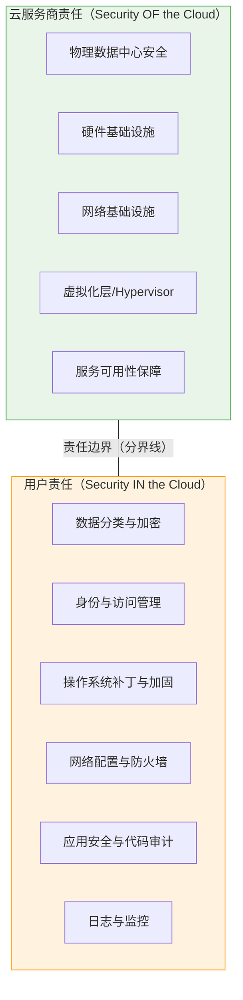
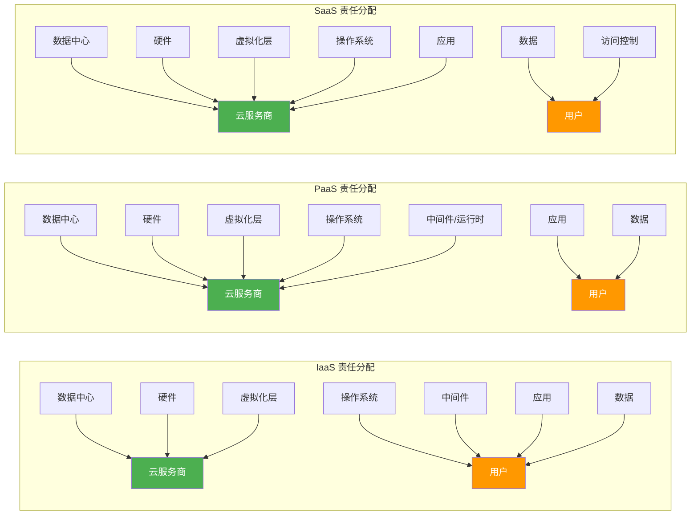

## 12.1.4 责任共担模型（Shared Responsibility Model）

责任共担模型是云安全领域最核心的框架性概念，没有之一。它定义了云服务商（Cloud Service Provider, CSP）和用户之间安全责任的精确边界。理解这个模型，是理解一切云安全问题的前提——无论是防御还是攻击，都必须先搞清楚"谁该管什么"。

### 为什么责任共担模型如此重要

在传统数据中心模式下，组织对整个技术栈拥有完全的控制权，同时也承担全部的安全责任。迁移到云端后，技术栈被拆分为两部分：一部分由云服务商管理，另一部分仍由用户管理。这种拆分带来了一个根本性问题——**安全责任的边界在哪里？**

如果边界不清，就会出现两种致命情况：

1. **责任真空**：双方都认为对方在负责某个安全领域，结果谁都没管。例如用户认为云服务商会自动加密所有数据，而云服务商认为用户会自行配置加密策略。
2. **责任重叠**：双方重复投入资源管理同一个安全领域，造成浪费和冲突。

责任共担模型用一张清晰的"分界线"解决了这个问题。



### 核心原则：Security OF the Cloud vs. Security IN the Cloud

这个二分法是理解责任共担模型的钥匙：

**Security OF the Cloud（云本身的安全）**：指云服务商负责确保其基础设施的安全性。这包括物理设施（数据中心的门禁、监控、消防）、硬件（服务器、存储设备、网络设备）、虚拟化层（Hypervisor、容器运行时）以及底层网络。用户无法也不需要干预这些层面——你不可能走进AWS的数据中心去检查他们的服务器。

**Security IN the Cloud（云中的安全）**：指用户在云上部署和运行的系统与数据的安全性。云服务商提供了安全的基础设施，但用户如何使用这些基础设施——配置什么样的访问策略、存储什么敏感数据、运行什么代码——完全由用户负责。云服务商不会替你决定谁能访问你的S3存储桶。

理解这个原则的关键在于：**云服务商的安全责任不会因为你使用了他们的服务而消失，但你的安全责任也不会因为你上了云就转移给服务商。**

### 不同服务模型的责任分配详解

责任边界不是固定的，它随着服务模型的变化而上下移动。12.1.2节介绍了三大服务模型的定义，这里我们深入分析每种模型下安全责任的具体分配。

#### IaaS 模型下的责任分配

在IaaS模型下，用户承担的安全责任最重。云服务商只负责"地基"——物理设施、虚拟化层和基础网络。从操作系统开始往上的所有层面，全部由用户负责。

| 安全层面 | 责任方 | 具体内容 |
|---------|--------|---------|
| 物理安全 | 云服务商 | 数据中心门禁、监控、消防、电力、冷却 |
| 硬件安全 | 云服务商 | 服务器、存储设备、网络设备的维护与更换 |
| 虚拟化层 | 云服务商 | Hypervisor安全、虚拟机隔离、资源调度 |
| 基础网络 | 云服务商 | 物理网络设备、骨干网、DDoS基础设施防护 |
| 操作系统 | **用户** | OS选择、补丁更新、安全加固、最小化安装 |
| 网络配置 | **用户** | VPC设计、子网划分、安全组规则、ACL配置 |
| 中间件 | **用户** | Web服务器、数据库、消息队列的安全部署 |
| 应用程序 | **用户** | 代码安全、依赖管理、输入验证、API安全 |
| 数据安全 | **用户** | 数据分类、加密策略、备份恢复、访问控制 |
| 身份管理 | **用户** | IAM策略、多因素认证、最小权限原则 |

**攻击者视角**：在IaaS环境中，攻击者最常利用的是用户侧的配置错误。例如，错误配置的安全组允许0.0.0.0/0访问SSH端口，或者EC2实例的IAM角色权限过大。云服务商的基础设施层极难攻破，因为那意味着要突破物理安全+虚拟化隔离的多重防线。

#### PaaS 模型下的责任分配

PaaS模型下，责任边界上移。云服务商接管了操作系统和运行时环境的安全，用户只需关注应用和数据。

| 安全层面 | 责任方 | 具体内容 |
|---------|--------|---------|
| 物理到虚拟化层 | 云服务商 | 同IaaS |
| 操作系统 | 云服务商 | OS补丁、安全配置、运行时环境维护 |
| 中间件/运行时 | 云服务商 | 语言运行时（Node.js、Python等）、Web服务器 |
| 应用程序 | **用户** | 代码安全、依赖管理、业务逻辑安全 |
| 数据安全 | **用户** | 同IaaS |
| 身份管理 | **用户** | 同IaaS，但部分可委托给平台内置机制 |
| 配置管理 | **用户** | 平台级配置（环境变量、访问策略等） |

**关键变化**：用户不再需要操心操作系统补丁——这是PaaS的核心价值之一。但这也意味着用户失去了对操作系统层的控制权。如果平台的运行时版本存在已知漏洞，用户只能等待服务商修复，无法自行打补丁。

**攻击者视角**：PaaS环境下的攻击面从操作系统层转移到了应用层和配置层。常见的攻击向量包括：利用应用代码中的漏洞（SQL注入、XSS）、窃取环境变量中的敏感信息（数据库密码、API密钥）、利用平台API的过度授权。

#### SaaS 模型下的责任分配

SaaS模型下，用户的责任最小，主要集中在数据治理和访问控制上。

| 安全层面 | 责任方 | 具体内容 |
|---------|--------|---------|
| 应用及以下所有层 | 云服务商 | 应用安全、运行时、OS、基础设施全部由服务商负责 |
| 数据分类与管理 | **用户** | 敏感数据识别、分类标签、数据保留策略 |
| 访问控制 | **用户** | 用户账户管理、权限分配、SSO配置 |
| 合规管理 | **用户** | 确保使用方式符合行业法规（GDPR、HIPAA等） |
| 终端安全 | **用户** | 用户设备的安全（端点保护、浏览器安全） |

**关键变化**：在SaaS模式下，用户对底层技术几乎没有任何控制权。你无法审查Office 365的代码，也无法修改Salesforce的运行时。你的安全策略完全集中在"谁能访问什么"和"数据如何被使用"上。

**攻击者视角**：SaaS环境中的攻击主要针对身份和数据。攻击者会尝试钓鱼获取用户凭证、利用OAuth授权漏洞获取过度权限、通过API访问泄露数据，或者利用共享配置错误（如将敏感文档设为"任何人可访问"）。

#### Serverless/FaaS 模型下的责任分配

Serverless（函数即服务）是近年来兴起的新模型，其责任边界又有独特之处：

| 安全层面 | 责任方 | 具体内容 |
|---------|--------|---------|
| 物理到运行时 | 云服务商 | 全部由服务商管理，包括函数运行时 |
| 函数代码 | **用户** | 函数逻辑安全、输入验证、依赖安全 |
| 函数配置 | **用户** | 执行权限（IAM角色）、超时设置、内存限制 |
| 触发器与事件源 | **用户** | 事件数据验证、触发器权限配置 |
| 数据安全 | **用户** | 同其他模型 |

**Serverless的独特风险**：函数的短暂生命周期和事件驱动特性带来了新的安全挑战。例如，函数冷启动可能导致延迟，攻击者可利用这一点进行时序攻击；函数的IAM角色如果权限过大，被攻破后影响范围难以控制；事件注入（Event Injection）是Serverless特有的攻击方式。

### 四大云平台的责任共担模型对比

各大云服务商都发布了各自的责任共担模型文档，核心逻辑一致，但在具体细节和强调重点上有所不同。

#### AWS 责任共担模型

AWS将责任分为三个层次：

- **AWS 负责**：基础设施全球安全（Regions、Availability Zones、Edge Locations）、硬件/AWS Global Infrastructure、虚拟化层、网络基础设施
- **客户负责**：客户数据、平台管理、操作系统、网络和防火墙配置、客户端侧数据加密、服务端加密、网络流量保护
- **共享控制**：补丁管理（AWS负责Hypervisor，客户负责OS）、配置管理（AWS负责基础设施配置，客户负责服务配置）、IAM（AWS负责IAM服务可用性，客户负责IAM策略和用户管理）

AWS在文档中特别强调了"共享控制"（Shared Controls）的概念——某些安全领域双方都有责任，但负责的层面不同。这个概念比简单的二分法更加精确。

#### Azure 责任共担模型

微软Azure将责任分为四类：

- **微软始终负责**：物理数据中心、物理网络、物理主机
- **客户始终负责**：信息和数据、设备（移动端和PC端）、账户和身份
- **责任随部署模型变化**：这取决于具体使用的服务类型
- **微软管理但客户配置**：网络安全、操作系统、应用

Azure特别强调了身份管理（以Azure AD/Entra ID为核心）在责任共担中的关键地位。在微软的生态中，身份是安全的"控制平面"——几乎所有的安全决策都与身份相关。

#### GCP 责任共担模型

Google Cloud的责任共担模型以"纵深防御"（Defense in Depth）为核心理念，将安全分为多个层次：

- **Google 负责**：硬件、软件（包括开放源码组件的安全加固）、运营（24/7安全团队、事件响应）
- **客户负责**：GCP服务配置、数据治理、IAM策略

GCP的独特之处在于它在基础设施层采用了定制化的安全设计，包括定制服务器固件、定制Titan安全芯片、自动化漏洞修补等。这些底层安全措施由Google完全负责，用户无需关心。

#### 阿里云责任共担模型

阿里云的责任共担模型基本遵循国际标准，但针对中国市场的合规要求做了特别说明：

- **阿里云负责**：云基础设施安全（等保合规、物理安全）、云产品安全（产品本身的安全性）
- **用户负责**：云上业务安全（应用安全、数据安全）、安全配置（安全组、RAM策略等）

阿里云特别强调了在中国《网络安全法》和等级保护制度下的责任划分，用户需要对自身的等保合规负责，阿里云负责底层基础设施的等保合规。

### 责任共担模型的完整架构视图

下图展示了从IaaS到SaaS，安全责任如何在云服务商和用户之间逐步转移：



### 真实案例分析：当责任共担模型失效时

#### 案例一：Capital One 数据泄露事件（2019年）

2019年7月，美国Capital One银行发生大规模数据泄露，超过1亿用户的数据被窃取。这是理解责任共担模型最经典的案例之一。

**攻击链分析**：

1. 攻击者利用Capital One部署在AWS上的WAF（Web Application Firewall）配置中的服务器端请求伪造（SSRF）漏洞
2. 通过SSRF访问了EC2实例的元数据服务（http://169.254.169.254），获取了实例关联的IAM角色临时凭证
3. 利用过大的IAM权限，访问了S3存储桶中的敏感数据

**责任归属分析**：

- **AWS的责任**：无。AWS的基础设施（EC2、S3、IAM服务）本身没有被攻破。元数据服务按设计工作，IAM服务按策略执行授权。
- **Capital One的责任**：全部。WAF配置存在SSRF漏洞、EC2实例关联的IAM角色权限过大（允许访问不应访问的S3存储桶）、S3存储桶中的敏感数据未加密。

**教训**：云服务商提供了安全的基础设施（AWS没有被攻破），但安全地使用这些基础设施的责任完全在用户（Capital One）。

#### 案例二：Microsoft SAS Token 泄露（2023年）

2023年9月，微软AI研究团队在GitHub上意外泄露了38TB的私有数据，原因是Azure Storage的共享访问签名（SAS）Token配置错误。

**责任归属分析**：

- **Azure的责任**：无。Azure Storage服务本身安全运行，SAS Token机制按设计工作。
- **微软AI团队的责任**：全部。SAS Token被错误配置为授予过大的权限和过长的有效期，并且被提交到了公开的GitHub仓库。

**教训**：即使是微软自己的团队，在使用自家云服务时也会犯配置错误。这再次证明，云服务商的安全（Azure Storage的安全）和用户的安全（SAS Token的管理）是两个完全独立的领域。

#### 案例三：Log4Shell 漏洞（2021年）

2021年12月爆发的Log4Shell（CVE-2021-44228）是一个影响极其广泛的远程代码执行漏洞，存在于Apache Log4j 2组件中。

**在责任共担模型中的位置**：

- **IaaS场景**：用户负责打补丁。云服务商提供了基础设施，但用户需要自行更新运行在虚拟机上的Log4j组件。
- **PaaS场景**：责任取决于具体平台。某些PaaS平台自动更新了运行时中的Log4j，某些则需要用户更新应用依赖。
- **SaaS场景**：服务商负责修复。用户只需确保自己使用的SaaS服务已修补该漏洞。

**教训**：同一个漏洞在不同的服务模型下，责任归属完全不同。这就是为什么理解责任共担模型对安全响应至关重要。

### 常见误区与纠正

#### 误区一："上云了安全就是云服务商的事"

**现实**：根据Gartner的预测，到2025年99%的云安全故障将是客户的错。云服务商提供的是安全的基础设施，但如何安全地使用这些基础设施完全取决于用户。

**纠正**：将云服务商的安全责任和用户的安全责任分开评估。用户侧的安全投入（人员、工具、流程）不应因为上云而减少，在某些方面甚至需要增加（如IAM管理、云安全态势管理）。

#### 误区二："私有云比公有云更安全"

**现实**：安全性取决于实施质量，而非部署模型。一个精心配置的公有云环境，可能比一个管理不善的私有云更安全。大多数企业缺乏大型云服务商的安全团队规模和专业能力。

**纠正**：评估安全性时应考虑具体的安全控制措施，而非抽象的部署模型。关注加密、访问控制、监控、审计等具体措施，而非"公有"还是"私有"的标签。

#### 误区三："SaaS意味着零安全责任"

**现实**：即使在SaaS模式下，用户仍然需要对数据分类、访问控制、合规管理负责。一个配置不当的Office 365租户（如将所有文档设为公开共享）同样是严重的安全事故。

**纠正**：SaaS降低了技术层面的安全责任，但数据治理和访问管理的责任仍然重大。组织需要制定SaaS使用规范、定期审计共享配置、实施DLP（数据防泄漏）策略。

#### 误区四："容器和Serverless的安全责任也一样"

**现实**：容器和Serverless引入了新的责任层面。在容器场景中，用户需要对容器镜像安全、编排平台（Kubernetes）配置、容器运行时安全负责。在Serverless场景中，函数代码安全和事件数据验证是用户的新责任。

**纠正**：每引入一种新的技术抽象层，都需要重新审视责任共担模型的适用方式。参考云服务商针对具体服务发布的安全最佳实践文档。

### 攻击者如何利用责任边界

从攻击者的角度理解责任共担模型，是网络安全攻防的核心能力。攻击者会系统性地寻找责任边界上的薄弱环节：

**策略一：攻击用户侧配置错误**

这是最常见的攻击策略。云服务商的基础设施极难攻破，但用户的配置错误极其普遍。攻击者会扫描互联网上暴露的云存储桶、错误配置的安全组、过大的IAM权限。

```bash
# 攻击者常用工具：扫描公开的S3存储桶
# 使用CloudBrute等工具枚举目标组织的云资产
cloudbrute -d target.com -m storage -k keyword

# 使用ScoutSuite进行多云安全审计（攻防两用）
scout aws --report-dir ./output
```

**策略二：利用共享控制的灰色地带**

某些安全领域是"共享控制"——双方都有责任，但边界模糊。攻击者会利用这种模糊地带。例如：

- 补丁管理：云服务商负责Hypervisor补丁，用户负责OS补丁。但如果云服务商推送的Hypervisor补丁导致了兼容性问题，用户的应用可能宕机——这是谁的责任？
- IAM：云服务商负责IAM服务的可用性，用户负责IAM策略的正确性。但如果IAM服务本身存在漏洞（如AWS STS的临时凭证可被劫持），责任边界就变得模糊。

**策略三：攻击供应链**

在PaaS和SaaS场景中，用户依赖云服务商提供的组件。如果这些组件存在漏洞（如Log4Shell），攻击者可以通过供应链攻击绕过用户的安全控制。

### 实践指南：如何在组织中落地责任共担模型

#### 第一步：建立责任矩阵

为组织使用的每一种云服务建立明确的责任矩阵。矩阵应包含：安全层面、责任方、具体措施、负责人、审计频率。

```markdown
## 示例：AWS EC2 实例安全责任矩阵

| 安全层面 | 责任方 | 具体措施 | 负责人 | 审计频率 |
|---------|--------|---------|--------|---------|
| OS补丁 | 用户 | 每月应用安全补丁 | 运维团队 | 月度 |
| 安全组 | 用户 | 最小权限原则，仅开放必要端口 | 网络团队 | 周度 |
| IAM角色 | 用户 | 最小权限原则，定期轮换凭证 | 安全团队 | 季度 |
| 数据加密 | 用户 | 启用EBS加密和S3服务端加密 | 安全团队 | 持续 |
| Hypervisor | AWS | AWS自动管理 | N/A | N/A |
```

#### 第二步：自动化合规检查

使用云安全态势管理（CSPM）工具持续监控配置合规性：

```bash
# 使用Prowler进行AWS安全评估
prowler aws --checks-directory ./custom_checks

# 使用ScoutSuite进行多云安全审计
scout aws --report-dir ./audit_output

# 使用CloudMapper可视化AWS环境
cloudmapper collect --account-name production
cloudmapper webserver
```

#### 第三步：定期演练事件响应

责任共担模型不仅是理论框架，更是事件响应的基础。当安全事件发生时，第一步就是确定这是用户侧问题还是云服务商侧问题：

```markdown
## 事件响应决策树

1. 安全事件发生
2. 确定影响范围（哪些云服务受影响）
3. 检查云服务商状态页面（是否是平台级问题）
4. 如果是平台级问题 → 联系云服务商支持，启动应急预案
5. 如果是用户侧问题 → 启动内部事件响应流程
6. 如果不确定 → 同时通知云服务商并启动内部调查
```

#### 第四步：持续教育与意识培训

确保组织中的每个人都理解责任共担模型——不仅是安全团队，还包括开发人员、运维人员、管理层。每个人都是安全链条中的一环。

### 进阶话题：多云和混合云环境下的责任共担

当组织同时使用多个云服务商（多云策略）或同时使用公有云和私有云（混合云策略）时，责任共担模型变得更加复杂：

**多云环境的挑战**：

- 每个云服务商的责任边界定义不完全一致，需要分别理解和管理
- 跨云的安全策略一致性难以保证
- 安全工具和监控需要覆盖多个平台
- 事件响应涉及多个服务商的协调

**混合云环境的挑战**：

- 私有云部分的责任完全由用户承担，公有云部分遵循责任共担模型
- 数据在两种环境之间流动时，安全策略需要保持一致
- 身份管理需要统一，避免出现权限孤岛

**应对策略**：采用云安全平台（Cloud Security Platform）统一管理多云环境的安全态势，使用基础设施即代码（IaC）确保配置一致性，建立统一的安全策略和事件响应流程。

### 总结

责任共担模型不是一个可以"学完就放下"的概念，而是需要在组织的日常安全运营中持续践行的框架。它的核心价值在于：

1. **明确边界**：让双方都知道自己该管什么，避免责任真空
2. **优化资源**：避免重复投入，将有限的安全资源用在刀刃上
3. **指导决策**：在选择云服务和安全工具时，有清晰的评估标准
4. **支撑响应**：在安全事件发生时，快速定位责任方和响应路径

记住一个简单的原则：**云的安全是云服务商的责任，云中的安全是你的责任。**随着服务模型从IaaS到PaaS到SaaS的变化，责任边界会向上移动，但你的安全责任永远不会降为零。
