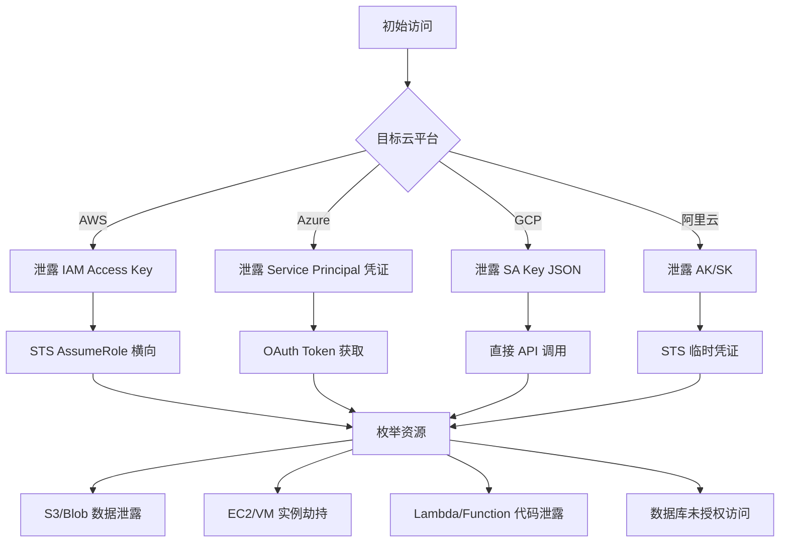

## 12.1.5 主流云平台架构对比

要进行云安全攻防，必须深入了解各主流云平台的架构设计差异。不同云平台在网络模型、身份管理、存储架构、API 设计等层面存在显著差异，这些差异直接影响攻击面和防御策略。本节从安全视角出发，系统对比 AWS、Azure、GCP、阿里云、华为云五大平台的核心架构，并深入分析各平台独特的安全机制与潜在弱点。

### 全局架构总览

五大云平台虽然在宏观架构上都遵循分层解耦的设计原则，但在具体实现上存在本质差异：

| 维度 | AWS | Azure | GCP | 阿里云 | 华为云 |
|------|-----|-------|-----|--------|--------|
| 核心架构理念 | 服务解耦，API 优先 | 混合云一体化 | 全球统一骨干网 | 自主可控，安全合规 | 全栈智能，鲲鹏生态 |
| 全球区域数 | 33 个（2024） | 60+ 个 | 40 个 | 30+ 个 | 33 个 |
| 网络架构 | VPC + 子网 + AZ | VNet + 子网 + 区域 | VPC + 子网 + 全局 | VPC + 交换机 + 可用区 | VPC + 子网 + 可用区 |
| 默认安全策略 | 白名单（Deny by default） | 白名单 | 白名单 | 默认允许部分出站 | 白名单 |
| API 认证方式 | SigV4 签名 | OAuth 2.0 + SAS | OAuth 2.0 | AK/SK 签名 | AK/SK 签名 |
| 元数据服务 | IMDSv1/v2 | IMDS | 元数据服务器 | 元数据服务 | 元数据服务 |

理解这些差异是跨云安全评估的基础。接下来逐一深入每个平台。

### AWS（Amazon Web Services）

AWS 是全球市场份额最大的云平台（约 31%），拥有最成熟的服务生态和最庞大的用户基数。其架构设计的核心特点是服务高度解耦、API 优先、区域化部署。

#### 账户与身份架构

AWS 采用扁平化的账户模型，每个 AWS 账户是独立的安全边界和计费单元。组织通过 AWS Organizations 实现多账户管理，底层是组织单元（OU）的树形结构。

```text
AWS Organization
├── Root
│   ├── OU: Security
│   │   ├── SecurityAccount（Security Hub 聚合）
│   │   └── LogArchiveAccount（CloudTrail 集中存储）
│   ├── OU: Production
│   │   ├── ProdAccount-A
│   │   └── ProdAccount-B
│   └── OU: Development
│       └── DevAccount
└── ...
```

**IAM 架构要点：**
- IAM 用户、组、角色三种主体类型
- IAM Policy 是 JSON 文档，支持 Allow/Deny 语句
- 角色（Role）通过 STS AssumeRole 切换，支持跨账户信任
- 服务控制策略（SCP）在 Organization 层面限制所有账户的权限上限
- IAM Identity Center（原 SSO）提供联邦身份登录

**安全关键点：** AWS 账户是安全边界。一旦某个 IAM Access Key 泄露，攻击者可以调用该账户内的所有被授权 API。与 Azure 的资源管理组或 GCP 的项目层次结构不同，AWS 账户之间默认完全隔离——跨账户访问必须通过显式的信任策略配置。

#### 网络架构

AWS 的网络层次为：Region → Availability Zone (AZ) → VPC → Subnet。一个 VPC 跨多个 AZ，每个 AZ 内的子网映射到一个物理可用区。

**核心网络安全组件：**
- **安全组（Security Group）**：有状态防火墙，基于实例级别，只支持 Allow 规则
- **网络 ACL（NACL）**：无状态防火墙，基于子网级别，支持 Allow 和 Deny
- **VPC Peering**：点对点 VPC 连接，不传递
- **Transit Gateway**：中心辐射型 VPC 互联
- **VPC Endpoint**：通过 AWS PrivateLink 访问 AWS 服务，避免流量经过公网
- **PrivateLink**：跨账户/跨 VPC 的私有服务暴露

**攻击面分析：** AWS 的安全组默认拒绝所有入站流量，但允许所有出站流量。这意味着一旦攻击者获得实例内部的访问权限，可以自由地向外发起连接（C2 通信、数据外泄）。NACL 虽然是子网级的额外防护层，但很多用户未正确配置 NACL 规则。VPC Endpoint 可以防止 S3 等服务的流量经过公网，但许多组织未启用此功能，导致内网流量暴露于公网。

#### 核心安全服务

| 服务 | 功能 | 安全攻防视角 |
|------|------|-------------|
| **IAM** | 身份与访问管理 | 权限策略审计、角色信任策略检查 |
| **STS** | 临时安全凭证 | AssumeRole 链、跨账户扮演 |
| **CloudTrail** | API 调用审计 | 攻击行为溯源、异常 API 检测 |
| **GuardDuty** | 威胁检测 | 基于 ML 的异常行为识别 |
| **Security Hub** | 安全态势中心 | CIS Benchmark、PCI DSS 合规检查 |
| **Config** | 资源配置审计 | 资源变更追踪、合规规则评估 |
| **VPC Flow Logs** | 网络流量日志 | 网络层攻击检测、流量异常分析 |
| **KMS** | 密钥管理 | 加密密钥生命周期、Envelope Encryption |
| **WAF** | Web 应用防火墙 | SQL 注入、XSS、速率限制 |
| **Shield** | DDoS 防护 | 标准版免费、Advanced 版付费 |
| **Macie** | 敏感数据发现 | S3 中的 PII/PHI 自动识别 |
| **Detective** | 安全事件调查 | 基于 CloudTrail 日志的图形化分析 |
| **Inspector** | 漏洞扫描 | EC2/ECR/Lambda 的漏洞评估 |

#### AWS 独特安全特性

**IMDSv2（实例元数据服务 v2）：** AWS 在 2019 年推出 IMDSv2，要求使用 PUT 请求获取会话令牌，有效防御 SSRF 攻击获取元数据凭证。但默认仍允许 IMDSv1，许多用户未强制升级——这是一个关键的攻击面。

**AWS Config Rules + Lambda：** 可以实现自动化的安全合规检测和响应（Auto Remediation），例如检测到公开的 S3 存储桶时自动修正权限。

**Resource-Based Policy vs Identity-Based Policy：** AWS 独特的双策略模型意味着即使没有 IAM 策略授予访问权限，资源策略（如 S3 Bucket Policy）也可能授予外部账户访问。攻击者经常利用这一机制进行跨账户数据访问。

### Microsoft Azure

Azure 的市场份额约 24%，其最大优势在于与 Microsoft 生态（Active Directory、Office 365、Windows Server）的深度集成。Azure 的架构设计核心特点是以 Azure AD（现 Entra ID）为全局身份中枢，资源管理层采用层次结构。

#### 账户与身份架构

Azure 的身份架构以 Microsoft Entra ID（原 Azure AD）为核心。与 AWS 的扁平账户模型不同，Azure 采用租户（Tenant）+ 订阅（Subscription）+ 资源组（Resource Group）的三层结构。

```text
Microsoft Entra ID Tenant
├── Management Group: Root
│   ├── Subscription: Production
│   │   ├── Resource Group: web-apps
│   │   │   ├── App Service
│   │   │   └── Azure SQL
│   │   └── Resource Group: infra
│   │       └── Virtual Networks
│   └── Subscription: Development
│       └── ...
└── Entra ID
    ├── Users
    ├── Groups
    ├── Service Principals
    └── Managed Identities
```

**IAM 架构要点：**
- 基于角色的访问控制（RBAC），角色定义粒度比 AWS IAM Policy 更直观
- **托管标识（Managed Identity）**：Azure 独特的机制，为 Azure 资源自动分配身份，无需管理密钥
- **服务主体（Service Principal）**：应用/自动化工具的身份表示
- **条件访问策略（Conditional Access）**：基于用户、设备、位置、风险等级的动态访问控制
- **Privileged Identity Management（PIM）**：特权角色的即时激活（JIT），而非永久授权

**安全关键点：** Entra ID 是所有 Azure 服务的身份中枢。一个 Entra ID 租户内的全局管理员可以控制该租户下所有订阅的所有资源。与 AWS Organizations 的 SCP 不同，Azure 的管理组策略（Azure Policy）作用于资源管理层而非身份层——这意味着一个拥有 Owner 角色的用户可能绕过 Azure Policy 的限制。此外，Azure 的 Service Principal 可以拥有密码凭证和证书凭证，泄露任一即可冒充应用身份。

#### 网络架构

Azure 的网络模型为 Subscription → VNet → Subnet → NSG。VNet 默认不互通，需要显式配置 Peering 或使用 Virtual WAN。

**核心网络安全组件：**
- **网络安全组（NSG）**：类似 AWS 的安全组 + NACL 的混合体，支持有状态规则
- **Azure Firewall**：托管的网络虚拟设备（NVA），支持应用规则和网络规则
- **Private Link**：类似 AWS PrivateLink 的私有连接服务
- **Virtual Network Gateway**：VPN 和 ExpressRoute 网关
- **Azure DDoS Protection**：针对 VNet 资源的 DDoS 防护
- **Network Watcher**：网络诊断和监控

**与 AWS 的关键差异：** Azure NSG 默认允许 VNet 内部的所有入站流量（来自 VirtualNetwork 服务标签），而 AWS 安全组默认拒绝所有入站。这意味着在 Azure 中，同一 VNet 内不同子网的实例默认可以互相通信——攻击者一旦突破一台机器，横向移动的阻力更小。

#### 核心安全服务

| 服务 | 功能 | 安全攻防视角 |
|------|------|-------------|
| **Microsoft Entra ID** | 身份管理中枢 | OAuth 令牌窃取、条件访问绕过 |
| **RBAC** | 资源级访问控制 | 角色分配审计、权限提升分析 |
| **Azure Policy** | 资源合规管理 | 策略绕过、豁免滥用 |
| **Microsoft Defender for Cloud** | CSPM + CWPP | 安全评分、漏洞评估、威胁检测 |
| **Microsoft Sentinel** | SIEM/SOAR | 日志关联分析、自动响应剧本 |
| **Azure Monitor / Log Analytics** | 监控与日志 | 活动日志、诊断日志分析 |
| **Key Vault** | 密钥/密文管理 | 密钥泄露、访问策略审计 |
| **Azure AD Identity Protection** | 身份风险检测 | 凭据泄露检测、风险登录识别 |
| **Managed Identity** | 资源原生身份 | 元数据端点获取令牌（类似 IMDS） |

#### Azure 独特安全特性

**Entra ID 令牌机制：** Azure 资源通过 Managed Identity 获取令牌的过程与 AWS 类似——访问元数据端点 `http://169.254.169.254/metadata/identity/oauth2/token`。但 Azure 的元数据端点在 SSRF 攻击中比 AWS IMDSv1 更容易利用，因为它不需要特殊的 Header，且返回的是 OAuth 2.0 access_token（直接可用来调用 Azure REST API）。

**Azure Resource Manager（ARM）模板：** 所有资源操作都通过 ARM 进行。ARM 模板是声明式的 JSON/ Bicep 文件，定义整个基础设施。攻击者可以审计 ARM 模板中的硬编码凭证、不安全的默认配置。

**服务主体凭证管理：** Azure Service Principal 的密码（client_secret）过期时间最长 2 年，证书也可以长期有效。很多组织在 CI/CD 中硬编码这些凭证，泄露风险极高。相比 AWS STS 的临时凭证（最长 12 小时），Azure 的长期凭证是一个显著的攻击面。

### Google Cloud Platform（GCP）

GCP 市场份额约 11%，但在数据分析和 AI/ML 领域具有技术优势。GCP 的架构设计核心特点是全球统一 VPC、项目（Project）作为权限边界、以及二进制级别的安全验证。

#### 账户与身份架构

GCP 的层次结构为 Organization → Folder → Project → Resource。项目是 GCP 的核心组织单元，所有资源都归属于某个项目。

```text
Google Cloud Organization
├── Folder: Production
│   ├── Project: web-service-prod
│   └── Project: data-pipeline-prod
├── Folder: Development
│   └── Project: dev-env
└── Folder: Security
    └── Project: logging-central
```

**IAM 架构要点：**
- **IAM Policy 继承**：Organization → Folder → Project → Resource，下层策略叠加不覆盖上层
- **服务账号（Service Account）**：类似 Azure Managed Identity，但需要显式创建
- **服务账号密钥（SA Key）**：JSON 格式的长期凭证文件，是 GCP 最大的安全风险之一
- **Workload Identity Federation**：无需 SA Key，从外部身份提供商（AWS、Azure、OIDC）直接获取 GCP 凭证
- **Organization Policy**：组织层面的约束（类似 AWS SCP），限制项目管理员的操作边界

**安全关键点：** GCP 的 Service Account Key（SA Key）是 JSON 文件，包含完整的私钥，一旦泄露攻击者可以完全冒充该服务账号。与 AWS 的临时 STS 凭证和 Azure 的 Managed Identity 相比，SA Key 的泄露风险更高。Google 虽然推出了 Workload Identity Federation 来替代 SA Key，但大量遗留系统仍在使用。

#### 网络架构

GCP 的最大架构优势是**全球 VPC**——一个 VPC 可以跨越所有区域，子网自动按区域划分。这与 AWS 和 Azure 的区域级 VPC 有本质区别。

**核心网络安全组件：**
- **VPC 防火墙规则**：基于标签/服务账号/网络的规则引擎
- **Cloud Armor**：DDoS 防护和 WAF
- **Private Google Access**：无需外部 IP 即可访问 Google API
- **VPC Service Controls**：基于边界的访问控制，防止数据从 GCP 服务中泄露
- **Cloud Interconnect**：与本地网络的高带宽连接
- **Cloud NAT**：出站互联网访问的托管 NAT

**GCP 独特安全优势：** VPC Service Controls 是 GCP 独有的功能，它可以为 BigQuery、Cloud Storage 等托管服务创建安全边界（Perimeter），防止数据通过 API 调用外泄。即使攻击者获得了合法的 IAM 权限，如果请求来自边界外部，也会被 VPC Service Controls 阻止。这是 AWS 和 Azure 都没有的额外防护层。

#### 核心安全服务

| 服务 | 功能 | 安全攻防视角 |
|------|------|-------------|
| **Cloud IAM** | 身源与访问管理 | 权限继承分析、SA Key 泄露检测 |
| **Security Command Center (SCC)** | 安全态势管理 | 漏洞发现、威胁检测、资产发现 |
| **Cloud Audit Logs** | API 审计日志 | Admin Activity、Data Access、System Event |
| **Cloud KMS / HSM** | 密钥管理 | CMEK/CSEK 加密策略审计 |
| **Binary Authorization** | 容器签名验证 | 供应链安全，只有签名镜像才能部署 |
| **Forseti Security** | 开源安全工具 | IAM 策略扫描、资源配置审计 |
| **Cloud DLP** | 敏感数据发现 | PII/PHI 检测和脱敏 |
| **Chronicle** | SIEM 平台 | 大规模日志分析、威胁情报关联 |
| **VPC Service Controls** | 数据边界防护 | 防止托管服务数据外泄 |

#### GCP 独特安全特性

**二进制授权（Binary Authorization）：** GCP 原生支持容器镜像签名验证，只有经过签名的容器镜像才能部署到 GKE。这个功能直接解决了供应链攻击问题——AWS 和 Azure 虽然可以通过第三方工具实现类似功能，但没有原生集成。

**IAM 条件（IAM Conditions）：** GCP 的 IAM Policy 支持基于时间、资源名称前缀、IP 地址等条件的细粒度访问控制。例如，可以限制某个服务账号只能在工作时间内访问生产数据库，或者只能从特定 IP 范围调用 API。

**Organization Policy 约束：** GCP 提供了丰富的组织级约束，例如 `constraints/compute.disableSerialPortAccess`（禁用串口访问）、`constraints/iam.disableServiceAccountKeyCreation`（禁止创建 SA Key）。这些约束从源头减少了攻击面。

### 阿里云

阿里云是亚太地区最大的云平台（全球第三，约 5%），在国内市场份额超过 30%。其架构设计核心特点是安全合规导向、混合云支持、以及与国内技术生态的深度集成。

#### 账户与身份架构

阿里云采用主账号 + RAM（Resource Access Management）的模式。主账号拥有完全控制权，RAM 用户和角色是主账号下的子身份。

```text
阿里云主账号
├── RAM 用户组
│   ├── Admin 组（完全访问）
│   ├── Developer 组（受限访问）
│   └── ReadOnly 组（只读）
├── RAM 角色
│   ├── 服务角色（ECS 实例角色等）
│   └── 跨账号角色
└── 资源层次
    ├── 资源目录（Resource Directory）
    │   ├── 文件夹: 生产环境
    │   │   └── 成员账号: prod-account
    │   └── 文件夹: 开发环境
    │       └── 成员账号: dev-account
    └── 资源组（Resource Group）
```

**IAM 架构要点：**
- **RAM 策略**：JSON 格式的授权策略，类似 AWS IAM Policy
- **STS 临时凭证**：类似 AWS STS，用于临时授权
- **RAM 角色**：支持服务角色和跨账号角色
- **资源目录（Resource Directory）**：多账号管理，类似 AWS Organizations
- **资源组**：将资源分组管理，便于权限隔离和成本分配

**安全关键点：** 阿里云的主账号是最高权限身份，不需要 MFA 即可登录控制台（需用户自行开启）。RAM 策略的语法与 AWS IAM Policy 高度相似，但存在一些阿里云特有的资源类型和条件键。跨账号角色的信任策略需要通过资源目录实现。

#### 网络架构

阿里云的网络架构为 Region → 可用区（AZ）→ VPC → 交换机（vSwitch）。整体设计与 AWS 类似。

**核心网络安全组件：**
- **安全组**：有状态防火墙，类似 AWS Security Group
- **网络 ACL**：子网级无状态防火墙
- **云企业网（CEN）**：跨地域/跨 VPC 网络互联
- **NAT 网关**：出站互联网访问
- **VPN 网关**：与本地网络的加密连接
- **DDoS 防护**：基础版免费，高级版付费
- **Web 应用防火墙（WAF）**：针对 HTTP/HTTPS 流量的防护

#### 核心安全服务

| 服务 | 功能 | 安全攻防视角 |
|------|------|-------------|
| **RAM** | 身份与访问管理 | 策略审计、最小权限原则 |
| **云安全中心** | 安全态势管理 | 漏洞管理、入侵检测、基线检查 |
| **操作审计（ActionTrail）** | API 审计 | 类似 CloudTrail，记录 API 调用 |
| **WAF** | Web 应用防火墙 | SQL 注入、XSS、CC 攻击防护 |
| **堡垒机** | 运维审计 | 运维会话录制、命令审计 |
| **密钥管理服务（KMS）** | 密钥管理 | 数据加密、信封加密 |
| **数据库审计** | 数据库操作审计 | SQL 语句级别的操作记录 |
| **SSL 证书服务** | 证书管理 | HTTPS 部署、证书自动续期 |

### 华为云

华为云是全球第五大云平台，其核心优势在于鲲鹏生态（ARM 架构处理器）、全栈 AI 能力、以及政企市场的深度覆盖。

#### 账户与身份架构

华为云采用主账号 + IAM 的模式，与阿里云类似但有自己的特色。

**IAM 架构要点：**
- **IAM 用户组和用户**：类似 RAM 的子账号管理
- **IAM 委托**：跨账号/跨服务的授权机制
- **企业项目**：类似资源组的概念，用于资源隔离和成本管理
- **联邦身份认证**：支持 SAML 2.0 和 OIDC

#### 核心安全服务

| 服务 | 功能 | 安全攻防视角 |
|------|------|-------------|
| **IAM** | 身份与访问管理 | 策略审计、权限分析 |
| **云堡垒机** | 运维审计 | 会话录制、命令控制 |
| **Web 应用防火墙** | Web 安全 | OWASP Top 10 防护 |
| **数据安全中心** | 数据安全 | 敏感数据识别、数据脱敏 |
| **漏洞管理服务** | 漏洞扫描 | 主机漏洞、Web 漏洞检测 |
| **安全云脑** | 安全运营 | 威胁检测、安全编排响应 |
| **KMS** | 密钥管理 | 加密密钥管理、证书管理 |

### 跨平台安全架构对比分析

#### 认证与授权机制对比

| 特性 | AWS | Azure | GCP | 阿里云 | 华为云 |
|------|-----|-------|-----|--------|--------|
| 长期凭证 | Access Key ID + Secret | 客户端密码/证书 | SA Key JSON | Access Key ID + Secret | Access Key ID + Secret |
| 临时凭证 | STS（最长 12h） | OAuth Token（1h） | OAuth Token（1h） | STS（最长 12h） | 临时凭证（最长 24h） |
| 资源原生身份 | Instance Profile / IRSA | Managed Identity | Workload Identity | 实例角色 | 委托 |
| MFA 支持 | 虚拟/硬件 MFA | Authenticator App | Titan/Google App | 虚拟 MFA | 虚拟 MFA |
| 联邦身份 | SAML/OIDC | SAML/OIDC | Workload Identity Federation | SAML | SAML/OIDC |
| 最小权限工具 | IAM Access Analyzer | Entra Permissions Mgmt | IAM Recommender | RAM 最佳实践 | IAM 最佳实践 |

#### 存储安全对比

云存储是数据泄露的重灾区。各平台的存储服务设计差异直接影响安全配置的复杂度。

| 特性 | AWS S3 | Azure Blob Storage | GCP Cloud Storage | 阿里云 OSS | 华为云 OBS |
|------|--------|--------------------|-------------------|------------|------------|
| 默认访问控制 | 私有（Private） | 私有 | 私有 | 私有 | 私有 |
| 公开访问机制 | Bucket Policy + ACL | 公共访问级别 | allUsers/allAuthenticatedUsers | Bucket ACL + Policy | 桶策略 + ACL |
| 公开访问防护 | Block Public Access | 限制公共访问 | Organization Policy | 阻止公开访问 | 公共访问拦截 |
| 加密 | SSE-S3/SSE-KMS/SSE-C | Microsoft/客户管理密钥 | Google/客户管理/CSEK | SSE-KMS/SSE-OSS | SSE-KMS/SSE-C |
| 版本控制 | 支持 | 支持 | 支持（版本化） | 支持 | 支持 |
| 访问日志 | Server Access Logging | 诊断日志 | 访问日志 | 访问日志 | 桶日志 |

**安全关键差异：** AWS S3 在 2023 年后默认对新存储桶启用"阻止公共访问"设置，但仍有许多旧桶处于公开状态。Azure Blob Storage 的公共访问级别有四种（私有、Blob、容器），配置错误的概率更高。GCP 的公开访问需要显式授予 `allUsers` 或 `allAuthenticatedUsers` 角色，但也意味着一旦授权就很难被自动发现。

#### 元数据服务与 SSRF 攻击

元数据服务是云环境 SSRF 攻击的核心目标。各平台的元数据服务设计差异直接影响 SSRF 攻击的可行性和影响范围。

```bash
# AWS IMDSv1（旧版，仍默认启用）
curl http://169.254.169.254/latest/meta-data/iam/security-credentials/

# AWS IMDSv2（需 PUT 获取 Token，再用 Token 查询）
TOKEN=$(curl -X PUT "http://169.254.169.254/latest/api/token" \
  -H "X-aws-ec2-metadata-token-ttl-seconds: 21600")
curl -H "X-aws-ec2-metadata-token: $TOKEN" \
  http://169.254.169.254/latest/meta-data/iam/security-credentials/

# Azure Managed Identity
curl -H "Metadata: true" \
  "http://169.254.169.254/metadata/identity/oauth2/token?api-version=2018-02-01&resource=https://management.azure.com/"

# GCP（默认允许，无额外 Header）
curl -H "Metadata-Flavor: Google" \
  "http://metadata.google.internal/computeMetadata/v1/instance/service-accounts/default/token"

# 阿里云 ECS 实例角色
curl http://100.100.100.200/latest/meta-data/Ram/security-credentials/
```

**安全对比：**
- **AWS**：IMDSv2 通过 PUT + Token 机制防御 SSRF，但 IMDSv1 仍然默认启用，需要手动禁止。此外，如果应用可以发起 PUT 请求（某些 SSRF 漏洞类型），IMDSv2 也无法完全防御
- **Azure**：元数据端点需要 `Metadata: true` Header，但这个 Header 不像 AWS 的 PUT 请求那样难以通过 SSRF 发送
- **GCP**：需要 `Metadata-Flavor: Google` Header，但 SSRF 攻击中通常可以设置任意 Header
- **阿里云**：元数据端点 IP 为 100.100.100.200（非标准 169.254.169.254），增加了部分自动化工具的识别难度

### 攻击者视角：跨平台攻击路径对比

从攻击者角度看，不同云平台的攻击路径存在显著差异：



**AWS 攻击特点：**
- AssumeRole 链可以跨越多个账户，形成复杂的权限提升路径
- S3 存储桶是最常见的数据泄露源
- Lambda 函数的环境变量可能包含敏感凭证
- CloudTrail 日志是检测攻击的关键数据源，攻击者会尝试删除或篡改

**Azure 攻击特点：**
- Entra ID 是攻击的核心目标——控制了 Entra ID 就控制了所有 Azure 资源
- OAuth 令牌窃取（Token Theft）是高级攻击的常见手段
- Azure Functions 的连接字符串中可能包含数据库凭证
- 活动日志（Activity Log）不如 CloudTrail 详细

**GCP 攻击特点：**
- SA Key JSON 文件泄露是最直接的攻击入口
- IAM 权限继承使得项目级别的 Owner 权限极其危险
- VPC Service Controls 是攻击者需要额外考虑的防护层
- Cloud Audit Logs 的 Data Access 日志默认未开启

**阿里云攻击特点：**
- RAM 策略与 AWS IAM Policy 高度相似，攻击方法可迁移
- OSS 存储桶公开访问在国内互联网上非常常见
- 堡垒机是高价值目标，可能记录所有运维操作的凭证
- ActionTrail 日志的保留时间通常较短

### 云平台安全配置基线

无论使用哪个云平台，以下安全配置基线都应作为最低要求：

**身份与访问管理：**
- 启用 MFA 保护所有管理员账号
- 使用临时凭证替代长期 Access Key
- 实施最小权限原则，定期审计权限
- 删除未使用的凭证和账号
- 启用联邦身份认证，统一身份管理

**网络安全：**
- 默认拒绝所有入站流量，按需开放
- 使用 VPC Endpoint/Private Link 避免流量经过公网
- 启用网络流量日志（VPC Flow Logs / NSG Flow Logs）
- 实施网络分段，隔离不同安全级别的工作负载
- 使用 WAF 保护面向互联网的应用

**数据安全：**
- 启用服务端加密（SSE），使用客户管理密钥（CMK）
- 阻止存储桶/容器的公共访问
- 启用访问日志和数据访问审计
- 实施数据分类分级，对敏感数据额外加密
- 配置数据生命周期管理，自动删除过期数据

**日志与监控：**
- 集中收集所有 API 调用日志
- 启用威胁检测服务（GuardDuty / Defender / SCC）
- 配置关键事件的实时告警
- 日志保留时间不少于 90 天
- 将日志存储在独立的安全账户/订阅中

### 误区与纠正

**误区一：多云策略更安全。** 部分组织认为将工作负载分散到多个云平台可以降低风险。实际上，多云策略显著增加了安全复杂度——安全团队需要同时精通多个平台的安全机制，配置策略需要跨平台保持一致，监控和审计的覆盖面也会分散。多云策略可能带来可用性优势，但在安全方面通常是净负面。

**误区二：云服务商的安全服务够用了。** 各云平台的原生安全服务覆盖了基础需求，但无法替代专业的安全运营。例如 AWS GuardDuty 可以检测已知的攻击模式，但无法发现针对特定业务逻辑的攻击。云安全需要在原生安全服务的基础上，结合 WAF、SIEM、EDR 等多层防护。

**误区三：IaaS 和 SaaS 的安全责任相同。** 责任共担模型在不同服务模型下有本质区别。在 IaaS 中，用户需要负责操作系统补丁、网络配置、应用安全等大量工作。而在 SaaS 中，用户的责任主要集中在数据分类和访问控制上。混淆责任边界是云安全事件的主要原因之一。

**误区四：默认配置就是安全的。** 虽然各云平台都在逐步提高默认安全水平（如 AWS S3 默认阻止公共访问），但默认配置不等于安全配置。安全组的默认出站允许、IAM Policy 的通配符权限、未开启的审计日志——这些都是默认配置中的安全缺陷，需要用户主动加固。

**误区五：云安全和传统安全完全不同。** 云安全的核心原则（最小权限、纵深防御、零信任）与传统安全完全一致。变化的是实施方式和工具——从防火墙规则变为安全组策略，从 AD 域控变为 Entra ID，从物理隔离变为 VPC 隔离。理解了这个映射关系，传统安全经验可以快速迁移到云环境。
