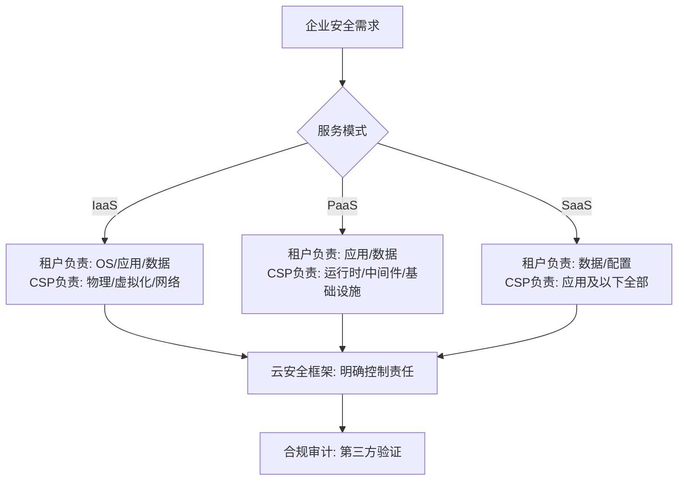
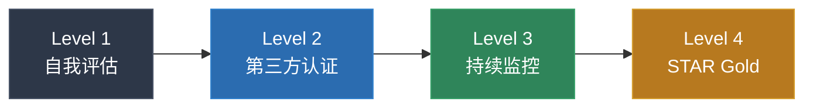
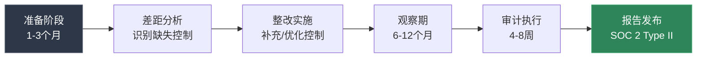
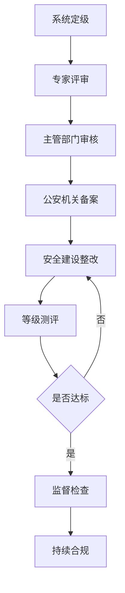
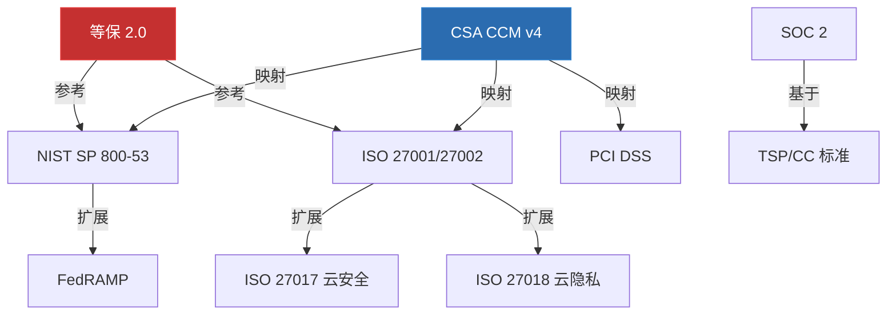

## 12.1.6 云安全框架与合规标准

当企业将业务迁移到云端，"安全"不再只是技术团队的内部事务，而是需要与行业标准、法律法规对齐的系统工程。云安全框架和合规标准提供了结构化的方法论，帮助组织评估风险、建立控制措施、并通过第三方审计证明自身的安全能力。

本节系统梳理国际主流和国内关键的云安全框架与合规标准，从框架的起源背景、核心结构、实操落地到框架间的映射对比，构建完整的知识图谱。

### 为什么需要云安全框架

传统信息安全框架（如 ISO 27001、NIST SP 800-53）在设计时并未充分考虑云计算的特殊性——多租户隔离、共享责任模型、资源动态伸缩、API 驱动的管理平面等问题。云安全框架在此基础上进行了针对性扩展，解决以下核心挑战：

- **责任边界模糊**：IaaS/PaaS/SaaS 三种服务模式下，云服务商与租户的安全责任划分各不相同
- **数据主权与合规**：数据跨境流动、存储位置透明性、隐私保护的法律要求
- **供应链风险**：云服务商的下游供应商（如底层基础设施、CDN、DNS）同样影响安全性
- **审计可见性不足**：租户无法直接审计云服务商的物理设施和底层系统

---

### CSA 云控制矩阵（CCM）

#### 背景与定位

CSA（Cloud Security Alliance，云安全联盟）是全球最权威的云安全专业组织，其发布的云控制矩阵（CCM, Cloud Control Matrix）是云安全领域事实上的标准控制框架。CCM 的核心价值在于：它不是从零开始设计的全新框架，而是将 ISO 27001/27002、NIST SP 800-53、PCI DSS、COBIT 等主流框架的控制措施重新映射到云计算场景中，形成统一的云安全控制目录。

#### 版本演进

| 版本 | 发布时间 | 主要变化 |
|------|---------|---------|
| v1.0 | 2010 | 初始版本，建立基本控制结构 |
| v3.0 | 2016 | 扩展到 16 个安全域，133 项控制 |
| v4.0 | 2019 | 重大重构，扩展到 197 项控制，17 个安全域 |
| v4.0.12 | 2024 | 当前最新版本，持续微调和补充 |

#### 17 个安全域与控制结构

CCM v4 将 197 项控制措施组织到 17 个安全域中，每项控制有唯一标识符（格式：`域名前缀-序号`，如 IAM-01、DSP-03）。

| 域 ID | 安全域名称 | 控制数 | 核心关注点 |
|--------|-----------|--------|-----------|
| AIS | 应用与接口安全 | 12 | 应用安全开发生命周期、API 安全、数据完整性 |
| AAC | 审计保证与合规 | 9 | 审计规划、独立评估、合规管理 |
| BCR | 业务连续性与运营弹性 | 12 | 灾难恢复、业务连续性计划、环境风险 |
| CCC | 变更控制与配置管理 | 4 | 变更管理流程、容量规划 |
| DCS | 数据中心安全 | 11 | 资产管理、物理安全、运营环境 |
| DSP | 数据安全与隐私 | 16 | 数据分类、数据生命周期、加密、保留与销毁 |
| DSI | 治理与风险管理 | 6 | 治理框架、风险管理、安全策略 |
| IAM | 身份与访问管理 | 16 | 凭证生命周期、认证、授权、特权管理 |
| IVS | 基础设施与虚拟化安全 | 14 | 网络安全、虚拟机隔离、容器安全、管理平面 |
| IPY | 互操作性与可移植性 | 4 | API 标准化、数据可移植性 |
| LOG | 日志监控与威胁检测 | 6 | 审计日志、持续监控、威胁检测 |
| SEF | 安全事件管理 | 5 | 事件响应、数字取证、通知机制 |
| STA | 供应链管理与透明度 | 8 | 供应链风险评估、第三方管理 |
| TVM | 威胁与漏洞管理 | 6 | 漏洞管理、补丁管理、渗透测试 |
| UEM | 终端管理 | 4 | 端点安全、移动设备管理 |
| HRS | 人力资源安全 | 4 | 人员筛选、安全意识培训 |
| GRM | 治理、风险与合规 | — | 已并入 DSI 域 |

#### 关键控制措施详解

**身份与访问管理（IAM）域**是云安全的核心，以 IAM 域为例展示控制措施的深度：

- **IAM-01 凭证生命周期管理**：涵盖凭证的创建、分发、存储、轮换、撤销全过程。要求 MFA 作为默认认证方式，凭证存储必须使用哈希加盐，轮换周期不超过 90 天
- **IAM-05 职责分离**：要求将关键操作的权限分配给不同角色（如开发人员不能拥有生产环境部署权限，审计人员不能修改日志），通过角色矩阵实现最小权限
- **IAM-08 特权访问管理**：要求对管理员账户实施即时提权（Just-in-Time），会话录制，操作审批流程，以及定期的特权账户审查
- **IAM-09 服务账户管理**：服务账户必须有明确的负责人，禁止使用长期凭证，推荐使用临时令牌（如 STS AssumeRole）

**数据安全与隐私（DSP）域**覆盖数据全生命周期：

- **DSP-01 数据分类**：要求建立四级分类体系（公开、内部、机密、绝密），每级有对应的保护措施
- **DSP-03 敏感数据保护**：对个人身份信息（PII）、健康信息（PHI）、支付卡数据（PCI）等敏感数据实施额外加密和访问控制
- **DSP-06 数据脱敏**：非生产环境（开发、测试）必须使用脱敏数据，禁止使用真实生产数据
- **DSP-12 加密**：要求传输加密（TLS 1.2+）和静态加密（AES-256），密钥管理遵循 NIST SP 800-57

#### CAIQ 评估问卷

CAIQ（Consensus Assessment Initiative Questionnaire，共识评估倡议问卷）是 CCM 的配套工具，将每项控制转化为 Yes/No 问题，便于标准化评估云服务商的安全能力。CAIQ v4 与 CCM v4 完全对应，共 197 个问题域，每个问题域包含 2-5 个具体问题。

**使用流程**：

1. 向云服务商发送 CAIQ 问卷
2. 服务商填写并提供证据材料
3. 评估团队审核回答，标注合规/部分合规/不合规
4. 生成差距分析报告，制定整改计划
5. 定期复评（建议每年一次）

#### CSA STAR 认证

CSA STAR（Security, Trust, Assurance and Risk）是基于 CCM 的云安全认证体系，分为四个级别：

| 级别 | 名称 | 要求 | 审计方式 | 适用场景 |
|------|------|------|---------|---------|
| Level 1 | 自我评估 | 填写 CAIQ 并公开 | 无第三方审计 | 初步展示安全能力 |
| Level 2 | 第三方认证 | 基于 CCM 的 ISO 27001 扩展审计 | 独立审计机构 | 中大型服务商 |
| Level 3 | 持续监控 | 实时安全指标上报 | 自动化监控 | 头部云服务商 |
| Level 4 | STAR Gold | 最高级别，综合评估 | 全面审计 | 行业标杆 |

---

### NIST 云安全标准体系

#### NIST SP 800-145：云计算定义

NIST SP 800-145 是云计算领域最权威的基础定义文档，虽然不是安全标准，但其定义被几乎所有后续标准引用：

**五大基本特征**：
1. **按需自助服务（On-demand Self-service）**：用户无需人工交互即可自动获取计算资源
2. **广泛网络访问（Broad Network Access）**：通过标准网络机制（浏览器、API）从各种设备访问
3. **资源池化（Resource Pooling）**：多租户共享资源，位置无关性（Location Independence）
4. **快速弹性（Rapid Elasticity）**：资源可快速扩缩，对用户近乎无限
5. **可计量服务（Measured Service）**：资源使用可监控、可报告、可计费

#### NIST SP 800-144：公有云安全与隐私指南

发布于 2011 年，NIST SP 800-144 是首个系统性讨论公有云安全挑战和应对策略的 NIST 专项指南。虽然发布时间较早，但其 14 条核心建议至今仍然适用：

**治理与合规类**：
1. **确保有效治理**：建立专门针对云的安全治理框架，明确云安全策略、角色和职责
2. **遵守法律法规**：在迁移前识别所有适用的合规义务（行业法规、地域法规、合同义务）
3. **理解云服务商的安全实践**：对 CSP 进行尽职调查，审查其安全白皮书、审计报告、认证状态
4. **确保合规性要求**：建立持续的合规监控机制，而非一次性评估

**数据保护类**：
5. **保护传输和静态数据**：实施端到端加密（TLS 传输 + AES-256 静态），验证数据完整性
6. **实施正确的密钥管理**：密钥生成、存储、轮换、销毁的全生命周期管理，密钥与数据分离存储
7. **确保数据正确处置**：合同终止时的数据擦除验证，确认所有副本（包括备份）已被安全删除

**技术安全类**：
8. **确保强身份认证**：多因素认证（MFA）、基于角色的访问控制（RBAC）、最小权限原则
9. **评估云应用安全**：将安全左移到 SDLC（安全开发生命周期），实施 SAST/DAST/SCA
10. **考虑多租户影响**：验证虚拟化隔离机制、网络隔离、存储隔离的有效性

**运营安全类**：
11. **理解业务连续性计划**：审查 CSP 的灾难恢复计划（DRP）、恢复时间目标（RTO）和恢复点目标（RPO）
12. **准备事件响应**：明确事件响应的共享责任——谁负责检测、谁负责遏制、谁负责通知
13. **确保合适的 SLA 条款**：在服务水平协议中明确安全指标、补救措施、审计权和数据所有权
14. **理解环境安全影响**：评估云环境引入的新攻击面（API 攻击、侧信道攻击、管理平面风险）

#### NIST SP 800-210：云系统访问控制指南

NIST SP 800-210（2020 年草案）专门针对云环境的访问控制问题，覆盖以下关键领域：

**云环境中的访问控制模型**：

| 模型 | 特点 | 云场景适用性 |
|------|------|-------------|
| DAC（自主访问控制） | 资源所有者决定谁可以访问 | 文件共享、对象存储 |
| MAC（强制访问控制） | 系统强制执行安全标签 | 政府/军事云环境 |
| RBAC（基于角色的访问控制） | 按角色分配权限 | 企业通用场景，IAM 基础 |
| ABAC（基于属性的访问控制） | 基于用户/资源/环境属性动态决策 | 云原生场景，精细权限控制 |

**云环境特有的访问控制挑战**：
- **多租户隔离**：确保租户 A 的数据和操作不会影响租户 B
- **动态资源调配**：资源创建/销毁频繁，传统静态权限模型不适用
- **API 驱动的访问**：所有操作通过 API 进行，需要 API 网关级别的访问控制
- **跨云身份联邦**：用户身份在多云/混合云环境中需要统一管理

#### NIST SP 800-53 与云安全

NIST SP 800-53 Rev.5 是美国联邦信息系统的安全控制目录（1000+ 项控制），其中多个控制族（Control Family）与云安全直接相关：

| 控制族 | 编码 | 云安全相关控制重点 |
|--------|------|------------------|
| 访问控制 | AC | AC-2 账户管理、AC-6 最小权限、AC-17 远程访问 |
| 审计与问责 | AU | AU-2 审计事件、AU-6 审计分析、AU-12 审计记录生成 |
| 评估与授权 | CA | CA-2 安全评估、CA-7 持续监控、CA-9 内部系统连接 |
| 配置管理 | CM | CM-2 基线配置、CM-6 配置设置、CM-8 系统组件清单 |
| 身份与认证 | IA | IA-2 多因素认证、IA-5 凭证管理、IA-8 身份提供者 |
| 系统与通信保护 | SC | SC-7 边界保护、SC-8 传输机密性、SC-28 静态加密 |

FedRAMP（联邦风险与授权管理计划）将 NIST SP 800-53 控制映射到云环境，按影响级别（Low/Moderate/High）分别要求约 125/325/421 项控制，是美国联邦政府云服务的强制合规标准。

---

### ISO/IEC 27017 与 ISO/IEC 27018

#### ISO/IEC 27017：云服务信息安全控制实践指南

ISO/IEC 27017:2015 是 ISO 27002 在云环境中的专门扩展，提供了针对云服务的信息安全控制指南。它包含 37 项控制措施：其中 30 项继承自 ISO 27002 并增加了云场景的实施指南，7 项是云环境特有的全新控制。

**7 项云特有控制**：

| 条款 | 控制名称 | 核心要求 |
|------|---------|---------|
| 6.3.1 | 云服务客户与 CSP 的共享角色和责任 | 明确书面约定双方在每个安全控制中的具体职责 |
| 8.1.5 | 云环境中的资产移除 | 服务终止时，CSP 必须安全删除客户数据并提供证明 |
| 9.5.1 | 云环境中的虚拟机隔离 | 确保同一物理主机上的不同租户 VM 之间无法相互访问 |
| 12.1.5 | 云环境中的管理平面操作安全 | 云管理控制台和 API 必须实施强认证和操作审计 |
| 12.4.5 | 云环境中的操作监控 | CSP 必须向客户提供其资源使用和安全事件的监控数据 |
| 15.1.4 | 云服务供应链安全审查 | CSP 必须评估和管理其供应链（如底层 IaaS 提供商）的安全风险 |
| 9.2.6 | 客户虚拟环境的网络隔离 | 使用 VLAN、SDN、安全组等机制实现租户间的网络隔离 |

**实施要点**：

ISO 27017 通常与 ISO 27001 认证结合使用。组织先建立 ISO 27001 信息安全管理体系（ISMS），再将 27017 的云控制措施整合到 ISMS 中。审计时，认证机构同时评估 ISO 27001 基础要求和 27017 云扩展要求。

对于云服务商，ISO 27017 认证意味着：
- 已建立云服务安全管理的制度化流程
- 已实施云环境特有的技术控制
- 已明确与客户的安全责任划分

对于云客户，选择通过 ISO 27017 认证的 CSP 可以降低云迁移的安全风险。

#### ISO/IEC 27018：云环境中个人身份信息保护实践指南

ISO/IEC 27018:2019 专注于云环境中 PII（Personally Identifiable Information，个人身份信息）的保护，是全球首个针对公有云中个人数据保护的国际标准。

**十大保护原则**：

1. **同意与选择**：PII 处理必须获得数据主体的明确同意
2. **目的合法性与限定**：只能为约定目的处理 PII，不得二次利用
3. **数据最小化**：只收集和处理业务必需的最少 PII
4. **数据限制**：PII 的保留时间不超过约定目的所需
5. **准确性与质量**：确保 PII 的准确性和及时更新
6. **透明度**：向数据主体披露 PII 的处理方式、存储位置、保留期限
7. **个人参与和访问权**：数据主体有权访问、修改、删除自己的 PII
8. **问责制**：CSP 对 PII 保护承担可审计的责任
9. **信息安全**：对 PII 实施加密、访问控制、审计日志等技术保护
10. **合规与通知**：数据泄露事件必须在法定时限内通知客户和监管机构

**与其他标准的关系**：
- ISO 27018 是 ISO 27001/27002 在隐私保护方面的补充
- 与 GDPR 的要求高度一致，通过 27018 认证有助于证明 GDPR 合规
- 通常与 ISO 27017 一起作为云安全认证的"组合包"

---

### SOC 2 审计报告

#### 基本概念

SOC（System and Organization Controls）报告由美国注册会计师协会（AICPA）制定，SOC 2 专门面向服务组织（如云服务商、SaaS 提供商、数据中心），评估其在五个信任服务标准（Trust Services Criteria）方面的控制有效性。

**五大信任服务标准**：

| 标准 | 英文 | 核心关注 | 是否必选 |
|------|------|---------|---------|
| 安全性 | Security | 系统受保护，免受未授权访问 | ✅ 必选 |
| 可用性 | Availability | 系统按承诺可用 | 可选 |
| 处理完整性 | Processing Integrity | 系统处理完整、准确、及时 | 可选 |
| 机密性 | Confidentiality | 受限信息受保护 | 可选 |
| 隐私性 | Privacy | PII 按承诺收集、使用、保留、处置 | 可选 |

#### Type I vs Type II

| 维度 | Type I | Type II |
|------|--------|---------|
| 审计时间点 | 特定时间点（快照） | 特定时间段（通常 6-12 个月） |
| 评估内容 | 控制措施的设计适当性 | 控制措施的设计 + 运行有效性 |
| 审计深度 | 较浅：确认控制是否已设计到位 | 较深：验证控制是否持续有效执行 |
| 报告价值 | 适合初次审计 | 适合持续合规证明 |
| 耗时 | 1-2 个月 | 6-12 个月 |
| 典型用途 | 初创公司展示安全能力 | 企业级客户的采购要求 |

**SOC 2 Type II 的审计流程**：

**SOC 2 控制类别（Common Criteria）**：

SOC 2 基于 CC（Common Criteria）标准，涵盖 CC1 到 CC9 九大控制类别：

- **CC1 控制环境**：治理结构、道德准则、组织架构、权限委派
- **CC2 沟通与信息**：内部沟通机制、外部沟通机制、系统描述
- **CC3 风险评估**：风险识别、欺诈风险评估、变更管理中的风险评估
- **CC4 监控活动**：持续监控、缺陷评估、纠正措施
- **CC5 控制活动**：技术控制、物理控制、流程控制
- **CC6 逻辑与物理访问控制**：身份认证、访问授权、访问限制、终端安全
- **CC7 系统运营**：变更管理、异常检测、事件响应、业务连续性
- **CC8 变更管理**：变更授权、变更测试、变更部署
- **CC9 风险缓解**：业务风险评估、供应商风险管理、风险接受

---

### 等保 2.0（网络安全等级保护 2.0）

#### 制度背景

等保（网络安全等级保护）是中国的网络安全基本制度，等保 2.0 基于《网络安全法》（2017 年 6 月实施），以 GB/T 22239-2019《信息安全技术 网络安全等级保护基本要求》为核心标准，于 2019 年 12 月正式实施。相比等保 1.0，等保 2.0 新增了云计算、物联网、移动互联网、工业控制系统、大数据等新技术新应用的安全扩展要求。

#### 五个安全等级

| 等级 | 名称 | 适用对象 | 受侵害客体 | 定级描述 |
|------|------|---------|-----------|---------|
| 第一级 | 用户自主保护级 | 一般系统 | 公民/法人合法权益 | 受损害后不影响国家安全、社会秩序和公共利益 |
| 第二级 | 审计保护级 | 一般业务系统 | 公民/法人合法权益 | 受损害后对公民/法人造成严重损害，或对社会秩序造成损害 |
| 第三级 | 安全标记保护级 | 重要业务系统 | 社会秩序和公共利益 | 受损害后对社会秩序和公共利益造成严重损害，或对国家安全造成损害 |
| 第四级 | 结构化保护级 | 关键基础设施 | 国家安全 | 受损害后对社会秩序和公共利益造成特别严重损害，或对国家安全造成严重损害 |
| 第五级 | 访问验证保护级 | 极重要系统 | 国家安全 | 受损害后对国家安全造成特别严重损害 |

大多数企业系统定级在第二级或第三级。第四级和第五级适用于国防、金融核心系统、关键基础设施等。

#### 十大安全域

等保 2.0 将安全要求组织为十大安全域：

1. **安全物理环境**：机房选址、物理访问控制、防盗防破坏、防火防水防雷
2. **安全通信网络**：网络架构、通信传输、可信验证
3. **安全区域边界**：边界防护、访问控制、入侵防范、恶意代码防范、安全审计
4. **安全计算环境**：身份鉴别、访问控制、安全审计、入侵防范、恶意代码防范、可信验证、数据完整性/保密性/备份恢复、剩余信息保护
5. **安全管理中心**：系统管理、审计管理、安全管理、集中管控
6. **安全管理制度**：安全策略、管理制度、制定和发布、评审和修订
7. **安全管理机构**：岗位设置、人员配备、授权和审批、沟通和合作、审核和检查
8. **安全管理人员**：人员录用、人员培训、人员考核、人员离岗
9. **安全建设管理**：定级和备案、安全方案设计、安全设备采购、自研软件安全、外包软件安全、工程实施、测试验收、系统交付、等级测评、服务供应商选择
10. **安全运维管理**：环境管理、资产管理、介质管理、设备维护管理、漏洞和风险管理、网络和系统安全管理、恶意代码防范管理、配置管理、密码管理、变更管理、备份与恢复管理、安全事件处置、应急预案管理、外包运维管理

#### 云计算安全扩展要求

等保 2.0 最大的突破之一是增加了云计算安全扩展要求，针对 IaaS、PaaS、SaaS 三种模式分别规定了安全责任划分和技术要求：

**IaaS 模式下的安全责任划分**：

| 安全责任 | 云服务商 | 租户 |
|---------|---------|------|
| 物理环境 | ✅ 全部负责 | — |
| 网络架构 | ✅ 底层网络 | ✅ 虚拟网络配置 |
| 主机安全 | ✅ 物理主机 + Hypervisor | ✅ 虚拟机 OS + 应用 |
| 数据安全 | ✅ 底层存储加密 | ✅ 应用层加密 + 访问控制 |
| 安全管理 | ✅ 平台级管理 | ✅ 租户级管理 |

**云计算安全扩展核心要求**：

- **基础设施位置**：CSP 必须告知客户数据存储的物理位置
- **虚拟化安全**：虚拟机隔离、虚拟网络隔离、Hypervisor 安全加固
- **镜像和快照安全**：虚拟机镜像的安全基线检查、快照的访问控制
- **API 安全**：管理 API 的认证、授权、加密、审计
- **租户隔离**：计算隔离、存储隔离、网络隔离、管理隔离
- **数据迁移安全**：迁移过程的加密和完整性验证
- **数据删除**：客户退出时的数据安全删除确认
- **安全审计**：提供安全审计日志，支持第三方审计

**定级备案流程**：

等级测评由具备资质的测评机构（须获得 CNAS 认证）执行，测评内容覆盖十大安全域的全部适用要求。第三级系统建议每年测评一次，第二级系统建议每两年测评一次。

---

### 其他重要框架

#### FedRAMP（联邦风险与授权管理计划）

FedRAMP 是美国联邦政府云计算安全的强制合规框架，基于 NIST SP 800-53 Rev.5，按影响级别（Low / Moderate / High）要求不同数量的安全控制：

| 影响级别 | 控制数量 | 适用场景 | 典型示例 |
|---------|---------|---------|---------|
| Low | ~125 项 | 公开信息、非敏感系统 | 公共网站、公开数据集 |
| Moderate | ~325 项 | CUI（受控非密信息） | 大多数联邦业务系统 |
| High | ~421 项 | 关键任务系统 | 医疗、执法、紧急服务 |

FedRAMP 授权流程包括：准备（Ready）→ 授权（Authorized）→ 持续监控（Continuous Monitoring）。获得 FedRAMP 授权的 CSP 列表公开发布在 fedramp.gov。

#### PCI DSS v4.0 与云

PCI DSS（支付卡行业数据安全标准）适用于所有处理、存储或传输持卡人数据的组织。PCI DSS v4.0（2022 年发布，2025 年全面强制执行）对云环境的特殊考虑包括：

- **共享责任模型**：明确 CSP 和商户各自在 PCI DSS 合规中的责任
- **虚拟化要求**：虚拟化组件（Hypervisor、虚拟网络）纳入范围
- **容器安全**：容器编排平台、镜像仓库的安全要求
- **API 安全**：支付 API 的认证和加密要求

12 大核心要求在云环境中的映射：

1. 安装和维护网络安全控制（安全组、WAF、NACL）
2. 对所有系统组件应用安全配置（CIS Benchmark、镜像基线）
3. 保护存储的账户数据（加密、令牌化、密钥管理）
4. 保护持卡人数据的传输（TLS 1.2+、证书管理）
5. 保护所有系统和网络免受恶意软件侵害（EDR、反恶意软件）
6. 开发和维护安全的系统和软件（DevSecOps、SAST/DAST）
7. 按业务需求限制对系统组件的访问（RBAC、最小权限）
8. 标识用户并验证对系统组件的访问（MFA、SSO、PAM）
9. 限制对持卡人数据的物理访问（数据中心物理安全）
10. 记录和监控对系统组件的所有访问（SIEM、日志集中化）
11. 定期测试安全系统和流程（漏洞扫描、渗透测试）
12. 支持信息安全的组织策略和计划（安全策略、培训、IRP）

#### GDPR 与云数据保护

GDPR（通用数据保护条例）对云环境的影响主要体现在数据处理者（Processor，即 CSP）和数据控制者（Controller，即云客户）的角色划分：

**关键条款在云场景中的应用**：

- **第 28 条（数据处理协议 DPA）**：CSP 必须与客户签署 DPA，明确处理目的、类型、期限，以及 CSP 的安全义务
- **第 32 条（处理安全）**：要求实施"适当的技术和组织措施"，包括加密、假名化、持续保密性、灾难恢复能力
- **第 33-34 条（数据泄露通知）**：CSP 必须在发现泄露后 72 小时内通知客户，客户再通知监管机构
- **第 44-49 条（国际数据传输）**：数据传输到欧盟以外需要充分性决定、标准合同条款（SCC）或约束性公司规则（BCR）
- **第 17 条（被遗忘权）**：客户要求删除数据时，CSP 必须确保所有副本（包括备份）在合理时间内被删除

---

### 框架对比与映射

#### 核心框架横向对比

| 维度 | CSA CCM | NIST SP 800-53 | ISO 27001/27017 | SOC 2 | 等保 2.0 |
|------|---------|----------------|----------------|-------|---------|
| 发源地 | 国际（CSA） | 美国（NIST） | 国际（ISO/IEC） | 美国（AICPA） | 中国 |
| 性质 | 控制框架 | 安全控制目录 | 管理体系标准 | 审计标准 | 法律制度 |
| 控制数量 | 197 | 1000+ | 93（27002）+37（27017） | 按域可变 | 按等级扩展 |
| 适用范围 | 云服务 | 联邦系统（广泛采用） | 全行业 | 服务组织 | 中国网络系统 |
| 认证方式 | STAR 认证 | 授权（FedRAMP） | 第三方认证 | SOC 审计报告 | 等级测评 |
| 强制性 | 自愿 | 联邦强制 | 自愿 | 市场驱动 | 法律强制（中国） |
| 云针对性 | ⭐⭐⭐⭐⭐ | ⭐⭐⭐ | ⭐⭐⭐⭐ | ⭐⭐⭐ | ⭐⭐⭐⭐ |

#### 框架映射关系

#### 选型建议

**面向中国市场的组织**：
- **必须**：等保 2.0（法律强制）
- **建议**：ISO 27001 + ISO 27017（国际通用性）
- **加分**：CSA STAR（云安全专业性）

**面向国际市场的组织**：
- **必须**：SOC 2 Type II（北美市场准入门槛）
- **建议**：ISO 27001 + ISO 27017 + ISO 27018（欧盟市场认可）
- **加分**：CSA STAR Level 2

**联邦/政府云服务商**：
- **必须**：FedRAMP（美国联邦强制）
- **建议**：等保 2.0（如果面向中国市场）
- **加分**：ISO 27001 + SOC 2

**金融科技企业**：
- **必须**：PCI DSS（支付卡数据处理）+ 等保 2.0（中国市场）
- **建议**：SOC 2 Type II + ISO 27001
- **加分**：CSA STAR

---

### 实操：框架落地实施路径

#### 四阶段实施路线图

**第一阶段：现状评估与差距分析（1-2 个月）**

1. 识别适用的法规和标准（根据业务地域、行业、客户要求）
2. 选择主框架（建议以 ISO 27001 为骨架，叠加云扩展）
3. 进行全面的差距分析，输出差距报告
4. 确定优先级和资源投入

**第二阶段：体系建设与控制实施（3-6 个月）**

1. 建立信息安全管理体系（ISMS）文档框架
2. 实施技术控制（加密、访问控制、日志审计、漏洞管理）
3. 建立管理流程（事件响应、变更管理、供应商管理）
4. 部署安全工具（SIEM、DLP、CASB、CWPP）

**第三阶段：试运行与内部审计（2-3 个月）**

1. ISMS 试运行，收集运行证据
2. 执行内部审计，识别不符合项
3. 实施纠正措施
4. 管理层评审

**第四阶段：第三方审计与认证（1-3 个月）**

1. 选择认证/审计机构
2. 正式审计（Stage 1 文档审查 + Stage 2 现场审计）
3. 整改不符合项
4. 获取认证/审计报告

#### 常见落地误区

| 误区 | 后果 | 正确做法 |
|------|------|---------|
| 只做文档不做落地 | 审计时暴露大量不符合项 | 控制措施必须在生产环境中可验证 |
| 一次性突击通过 | 认证后控制措施逐步废弃 | 建立持续合规机制（自动化监控、定期内审） |
| 照搬模板不结合实际 | 控制措施与业务脱节 | 风险驱动——优先实施与业务风险最相关的控制 |
| 忽视供应链安全 | CSP 的第三方供应商成为安全短板 | 将供应链安全纳入风险管理范围 |
| 只关注技术控制 | 管理流程缺失导致控制失效 | 技术控制和管理流程并重 |

---

### 本节小结

云安全框架和合规标准不是"纸上谈兵"，而是帮助组织系统化管理云安全风险的方法论。核心要点：

1. **CSA CCM** 是云安全控制的事实标准，197 项控制覆盖 17 个安全域，STAR 认证体系提供从自我评估到第三方认证的完整路径
2. **NIST 系列**（800-144、800-210、800-53）提供从基础定义到详细控制的系统性指导，FedRAMP 是联邦云的强制框架
3. **ISO 27017/27018** 是 ISO 体系在云环境中的专业扩展，前者聚焦安全控制，后者聚焦隐私保护
4. **SOC 2** 是北美市场云服务商的准入门槛，Type II 报告证明控制措施的有效运行
5. **等保 2.0** 是中国市场的法律强制要求，云计算安全扩展覆盖了 IaaS/PaaS/SaaS 的完整安全责任
6. **框架选择** 应基于业务地域、行业要求和客户需求，而非追求"越多越好"
7. **落地关键** 在于风险驱动、持续合规、技术与管理并重，避免"为认证而认证"
