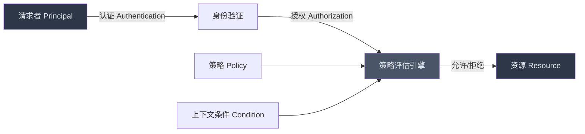
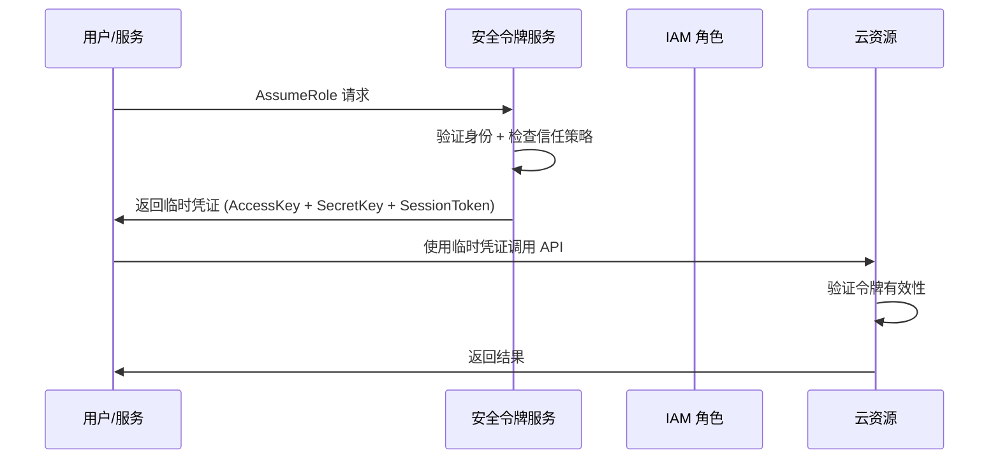
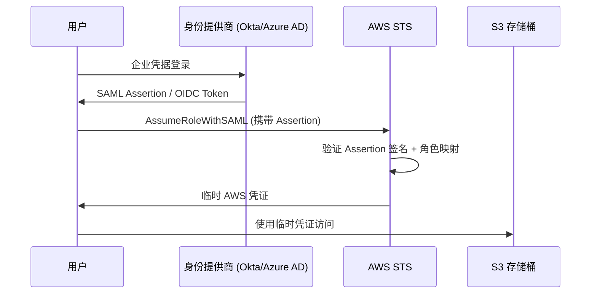
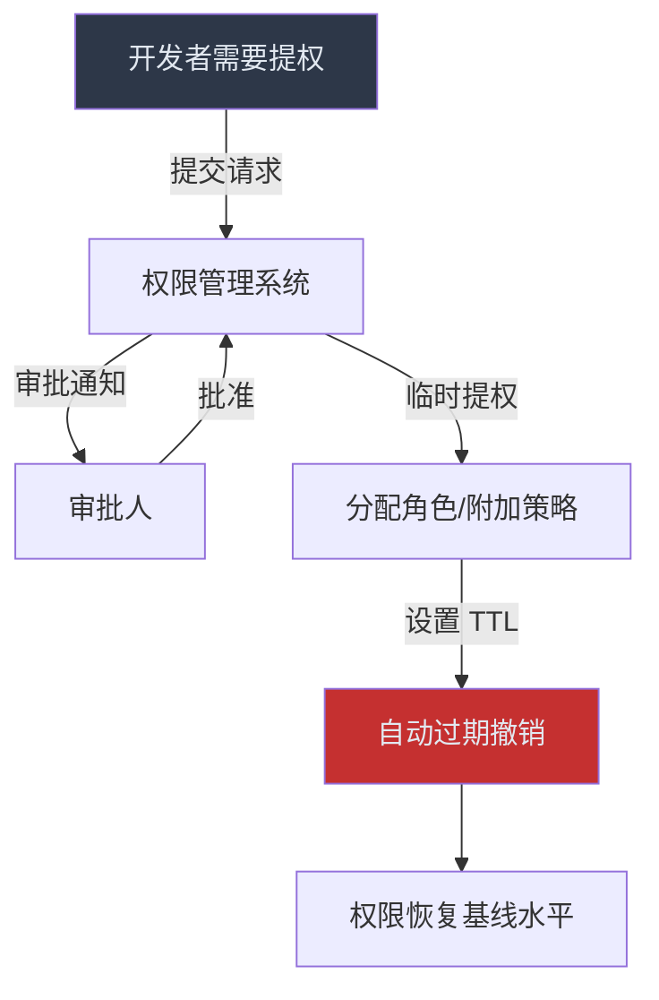
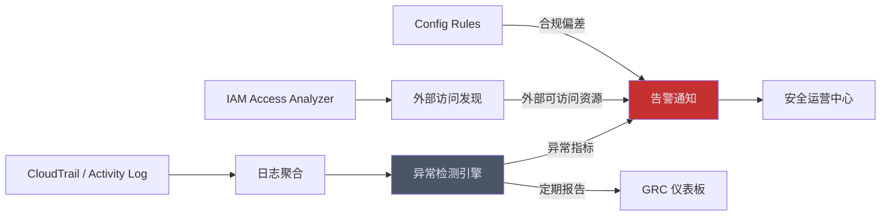

## 12.1.7 身份与访问管理（IAM）基础

### 为什么IAM是云安全的第一道防线

在传统数据中心安全模型中，安全边界是物理网络——防火墙、VLAN、DMZ 构成了清晰的内外分界线。然而云环境彻底改变了这一范式：资源通过 API 暴露、网络边界变得模糊、工作负载动态伸缩。**身份取代网络边界，成为新的安全控制点**。

NIST SP 800-63 数字身份指南明确指出：身份验证和访问控制是所有信息系统安全的基础。Gartner 的研究数据进一步证实，到 2025 年，超过 99% 的云安全故障根因是客户自身的配置错误，而其中 IAM 配置错误占据最大比例。Verizon 2023 DBIR 报告显示，61% 的数据泄露涉及凭证滥用。

这意味着：**不会用 IAM 的人，等于没有云安全**。



---

### IAM 核心概念模型

IAM 的运作围绕四个核心要素展开，所有云平台的 IAM 系统都基于这一模型构建。

#### 四要素定义

| 要素 | 术语 | 说明 | 举例 |
|------|------|------|------|
| **主体（Principal）** | 发起请求的实体 | 可以是人类用户、服务账号、应用程序或另一个云服务 | 开发者 `alice@company.com`、CI/CD 服务账号、AWS Lambda 函数 |
| **资源（Resource）** | 被访问的目标对象 | 云环境中需要保护的一切资产 | S3 存储桶、RDS 数据库、EC2 实例、KMS 密钥 |
| **操作（Action）** | 对资源执行的动词 | API 级别的具体动作，不是模糊的"读"或"写" | `s3:GetObject`、`ec2:TerminateInstances`、`iam:CreateUser` |
| **策略（Policy）** | 权限规则的载体 | 以 JSON 文档或 UI 配置形式存在的授权声明 | 允许 `dev-team` 组对 `dev-*` 命名空间的资源执行所有操作 |

#### 请求处理流程

当主体发起请求时，IAM 引擎按以下顺序评估：

1. **身份验证（Authentication）**：确认"你是谁"——检查凭证是否有效（密码、API 密钥、临时令牌、证书）
2. **来源验证**：检查请求是否来自可信来源（IP 范围、VPC 端点、设备状态）
3. **策略收集**：聚合所有适用的策略——身份策略、资源策略、权限边界、SCP、会话策略
4. **显式拒绝检查**：任何一条策略包含 `Deny`，立即拒绝（Deny 优先）
5. **显式允许检查**：需要至少一条策略包含 `Allow`
6. **条件评估**：检查请求上下文是否满足所有条件键（时间、MFA 状态、标签等）
7. **隐式拒绝**：如果没有匹配的 `Allow`，默认拒绝

**关键原则**：IAM 默认拒绝一切。任何权限都必须显式授予。

---

### 身份类型详解

#### 人类用户（Human Users）

人类用户是需要交互式访问的员工、开发者、管理员。

**管理要点**：

- 每个自然人独立账号，禁止共享账号（审计追溯依赖独立身份）
- 集中通过企业身份提供商（IdP）管理，如 Azure AD、Okta、OneLogin
- 强制 MFA，优先使用硬件密钥（FIDO2/WebAuthn）而非 TOTP
- 设置密码策略：最少 14 字符、禁止密码重用、90 天轮换（NIST 800-63B 最新建议已弱化周期轮换，转为"检测到泄露时轮换"）

#### 服务账号（Service Accounts / IAM Users with API Keys）

非人类身份，用于应用程序、CI/CD 流水线、自动化脚本之间的交互。

**管理要点**：

- 优先使用角色承担（Role Assumption）而非长期 Access Key
- 如果必须使用 Access Key，设置轮换周期（建议 90 天以内）
- 为每个服务账号单独创建，附带清晰的命名约定和用途标签
- 定期扫描未使用的凭证并禁用

#### 角色（Roles）

角色是 IAM 中最强大的概念之一——它不是"谁"，而是一个可以被"谁"临时扮演的身份。

**角色的核心优势**：

- **无长期凭证**：角色通过临时安全令牌（STS）获取权限，令牌有 TTL，泄露后自动失效
- **跨账户访问**：账户 A 的用户可以通过 AssumeRole 获取账户 B 的角色权限
- **联合身份**：外部 IdP 用户可以通过 SAML/OIDC 获取角色
- **服务代入**：EC2 实例配置 Instance Profile 后自动获取角色权限



#### 组（Groups）

组是权限分配的管理便捷工具，将权限附加到组，再将用户加入组。

- 组不能嵌套（AWS 限制，Azure AD 支持嵌套组）
- 用户可以属于多个组，权限取并集
- 组不是安全主体——不能被 AssumeRole 或用于资源策略

#### 服务控制点 / 组织策略（SCP / Organization Policy）

账户级别或组织单元（OU）级别的权限上限，用于实现组织级治理。

- SCP 本身不授予权限，只设置"天花板"
- 即使账户管理员（root）授予了权限，SCP 也可以限制它
- 适用于多账户组织架构中统一安全基线

---

### 认证（Authentication）机制

#### 认证因子分类

| 因子类型 | 说明 | 示例 | 安全等级 |
|----------|------|------|----------|
| 知识因子（Something You Know） | 你知道的秘密 | 密码、PIN、安全问题 | 低 |
| 持有因子（Something You Have） | 你持有的物品 | 手机（TOTP/SMS）、硬件安全钥、智能卡 | 中-高 |
| 生物因子（Something You Are） | 你的生物特征 | 指纹、面部识别、虹膜 | 高 |
| 行为因子（Something You Do） | 你的行为模式 | 打字节奏、鼠标移动模式 | 补充 |

#### 多因素认证（MFA）

MFA 要求至少两种不同类型的因子。**单因素认证在云管理控制台和生产环境 API 中已不可接受。**

**MFA 方式安全性对比**：

| MFA 方式 | 防钓鱼 | 离线攻击抵抗 | 易用性 | 推荐度 |
|----------|--------|-------------|--------|--------|
| SMS OTP | 否（SIM Swap 攻击） | 否 | 高 | 不推荐 |
| TOTP（Google Authenticator） | 否（实时钓鱼代理可劫持） | 是 | 高 | 可接受 |
| 推送通知（Duo Push） | 部分（疲劳攻击） | 是 | 极高 | 可接受 |
| FIDO2/WebAuthn 硬件密钥 | 是（原生防钓鱼） | 是 | 中 | **强烈推荐** |
| Passkeys | 是 | 是 | 高 | **强烈推荐** |

**实施建议**：对管理员和特权账号强制硬件密钥；普通用户至少 TOTP；禁用 SMS 作为唯一 MFA。

#### 联合身份（Federated Identity）

联合身份允许组织使用现有的企业身份系统（如 AD/LDAP）来管理云访问，用户无需在云平台创建独立账号。

**标准协议**：

- **SAML 2.0**：XML 协议，企业 SSO 主流方案，AWS/Azure/GCP 均支持
- **OpenID Connect（OIDC）**：基于 OAuth 2.0 的现代协议，更适合 Web/移动端和 CI/CD
- **OAuth 2.0**：授权框架（非认证协议），用于授权第三方应用访问资源

**联合身份工作流程**：



**联合身份的安全价值**：
- 集中管理离职员工权限（禁用 IdP 账号即撤销所有云访问）
- 避免在云平台维护大量长期凭证
- 实现基于属性的动态权限（部门、职位自动映射到角色）

---

### 授权（Authorization）模型

#### RBAC（基于角色的访问控制）

RBAC 是最广泛使用的授权模型。用户被分配角色，角色关联权限集。

**RBAC 模型层级**：

- **RBAC0（基础模型）**：用户-角色-权限的简单映射
- **RBAC1（角色继承）**：高级角色继承低级角色的权限（如 `admin` 继承 `operator` 的权限）
- **RBAC2（约束）**：互斥角色（如审计员和开发者不能是同一人）、最大角色数限制
- **RBAC3**：RBAC1 + RBAC2 的完整组合

**优点**：直观、易审计、符合组织架构
**缺点**：角色爆炸（role explosion）——细粒度场景下需要大量角色；无法表达上下文相关权限

**AWS IAM 和 Azure RBAC 都是 RBAC 模型的实现。**

#### ABAC（基于属性的访问控制）

ABAC 使用主体、资源、操作和环境的属性来动态决策。

```text
# ABAC 策略示例（AWS IAM）
{
  "Effect": "Allow",
  "Action": "ec2:*",
  "Resource": "*",
  "Condition": {
    "StringEquals": {
      "ec2:ResourceTag/Department": "${aws:PrincipalTag/Department}",
      "aws:PrincipalTag/Role": "developer"
    }
  }
}
```

**含义**：只有标签 `Role=developer` 的主体，才能操作与自己 `Department` 标签匹配的 EC2 实例。

**优点**：高度灵活，角色数量可控，适合动态环境
**缺点**：策略复杂度高、调试困难、依赖严格的标签治理

#### PBAC（基于策略的访问控制）

PBAC 是一种更细粒度的模型，策略直接表达业务规则。Open Policy Agent（OPA）的 Rego 语言就是 PBAC 的典型实现。

```go
# OPA Rego 策略示例
package authz

default allow = false

allow {
    input.method == "GET"
    input.path == ["api", "v1", "users", user_id]
    input.user.id == user_id
}

allow {
    input.method == "GET"
    input.path == ["api", "v1", "users"]
    input.user.role == "admin"
}
```

#### 三大模型对比

| 维度 | RBAC | ABAC | PBAC |
|------|------|------|------|
| 权限决策依据 | 角色身份 | 属性组合 | 策略规则 |
| 灵活性 | 中 | 高 | 极高 |
| 实施复杂度 | 低 | 中-高 | 高 |
| 适用场景 | 组织结构清晰的场景 | 多租户、动态环境 | 高合规要求、复杂业务规则 |
| 典型实现 | AWS IAM、Azure RBAC | AWS 条件键、GCP 条件绑定 | OPA、AWS Cedar |
| 角色爆炸风险 | 高 | 低 | 低 |
| 审计难度 | 低 | 中 | 高 |

**实际生产环境通常混合使用**：RBAC 做粗粒度分组，ABAC 做细粒度动态控制，PBAC 处理复杂业务规则。

---

### 策略语言深度解析

#### AWS IAM Policy 结构

AWS IAM 策略是 JSON 文档，分为两类：

**身份策略（Identity-based Policy）**：附加到用户、组、角色上
**资源策略（Resource-based Policy）**：附加到资源上（如 S3 Bucket Policy、Lambda Resource Policy）

```json
{
  "Version": "2012-10-17",
  "Statement": [
    {
      "Sid": "AllowS3ReadOnly",
      "Effect": "Allow",
      "Action": [
        "s3:GetObject",
        "s3:ListBucket"
      ],
      "Resource": [
        "arn:aws:s3:::my-data-bucket",
        "arn:aws:s3:::my-data-bucket/*"
      ],
      "Condition": {
        "IpAddress": {
          "aws:SourceIp": "203.0.113.0/24"
        },
        "DateGreaterThan": {
          "aws:CurrentTime": "2025-01-01T00:00:00Z"
        }
      }
    }
  ]
}
```

**策略评估关键细节**：

- `NotAction`：除列出之外的所有操作（注意：这是取反，容易误用）
- `NotResource`：除列出之外的所有资源
- `*` 通配符：在 Action 和 Resource 中支持，但 `Action: "*"` 表示所有操作
- `Condition` 块支持多种运算符：`StringEquals`、`StringLike`、`NumericLessThan`、`Bool`、`DateGreaterThan`、`IpAddress` 等

#### Azure RBAC 模型

Azure 使用角色定义（Role Definition）+ 角色分配（Role Assignment）的模型。

```json
{
  "Name": "Virtual Machine Operator",
  "Description": "Can view and restart VMs",
  "Actions": [
    "Microsoft.Compute/virtualMachines/read",
    "Microsoft.Compute/virtualMachines/restart/action"
  ],
  "NotActions": [],
  "DataActions": [],
  "AssignableScopes": [
    "/subscriptions/{subscription-id}"
  ]
}
```

**Azure 特有概念**：
- **管理组（Management Group）**：订阅之上的治理层级
- **数据操作（DataActions）**：控制数据平面操作（如 Blob 读写），与控制平面操作分离
- **条件（Conditions）**：类似 AWS Condition，但语法不同

#### GCP IAM 模型

GCP 采用"谁可以在哪个资源上做什么"的三元组绑定模型。

```json
{
  "bindings": [
    {
      "role": "roles/storage.objectViewer",
      "members": [
        "user:alice@company.com",
        "group:devs@company.com"
      ],
      "condition": {
        "title": "Temporary Access",
        "expression": "request.time < timestamp('2025-12-31T23:59:59Z')"
      }
    }
  ]
}
```

**GCP 特有概念**：
- **基本角色**：Owner / Editor / Viewer（粗粒度，不推荐生产使用）
- **预定义角色**：GCP 预先创建的细粒度角色（如 `roles/storage.objectViewer`）
- **自定义角色**：用户自定义的权限组合
- **IAM 条件**：基于资源属性和请求属性的条件表达式

---

### 最小权限原则的实践落地

最小权限原则（Principle of Least Privilege，PoLP）是 IAM 的核心哲学：**每个主体只获得完成当前任务所必需的最小权限集，且权限具有最短的持续时间**。

#### 从宽松到严格的实施路径

**第一阶段：发现过度授权**

```bash
# AWS：使用 IAM Access Analyzer 发现外部可访问的资源
aws iam create-analyzer --analyzer-name my-org-analyzer --type ORGANIZATION

# 查找外部可访问的资源
aws iam list-findings --analyzer-arn arn:aws:iam::123456789012:analyzer/my-org-analyzer

# AWS：使用 IAM Last Accessed 数据识别未使用的权限
aws iam generate-service-last-accessed-details --arn arn:aws:iam::123456789012:role/MyRole
aws iam get-service-last-accessed-details --job-id <job-id>
```

**第二阶段：使用权限边界（Permission Boundary）**

权限边界定义了一个"最大权限范围"。用户的有效权限 = 身份策略 ∩ 权限边界。

```json
// 权限边界：最多只能操作 S3 和 DynamoDB
{
  "Version": "2012-10-17",
  "Statement": [
    {
      "Effect": "Allow",
      "Action": [
        "s3:*",
        "dynamodb:*",
        "cloudwatch:GetMetricData",
        "logs:*"
      ],
      "Resource": "*"
    }
  ]
}
```

即使管理员给开发者附加了 `AdministratorAccess` 策略，实际权限也不会超过边界定义的范围。

**第三阶段：实施 JIT（Just-in-Time）权限**



**JIT 权限实现工具**：
- AWS：AWS IAM Identity Center + Permission Sets + Session Duration
- Azure：Privileged Identity Management（PIM）—— 内建 JIT 功能
- GCP：Privileged Access Manager（PAM）
- 开源方案：HashiCorp Boundary、Teleport

---

### IAM 常见攻击面与防御

#### 攻击面一：过度授权的 IAM 角色

**攻击场景**：开发者为了方便调试，给 Lambda 函数附加了 `AdministratorAccess`。攻击者通过 SSRF 漏洞获取 Lambda 元数据，获得完整管理员权限。

**防御措施**：
- 使用 IAM Access Analyzer 和 `aws:CalledVia` 条件键限制 API 调用链
- 为每个 Lambda 创建最小权限角色，仅包含所需的操作
- 使用权限边界限制自动创建的角色的最大范围

#### 攻击面二：长期凭证泄露

**攻击场景**：Access Key 被硬编码在代码中，推送到公开 GitHub 仓库。攻击者在 5 分钟内扫描到并开始挖矿。

**真实数据**：GitHub 2023 年报告，每天有超过 4000 个暴露的 API 密钥被自动检测。

**防御措施**：
- 使用 IAM 角色和 STS 临时凭证替代长期 Access Key
- 配置 AWS CloudTrail 监控 `GetCallerIdentity` 异常调用
- 设置 AWS Config 规则 `iam-user-no-policies-check` 和 `access-keys-rotated`
- 使用 GitHub Secret Scanning 或 TruffleHog 自动检测代码中的凭证

#### 攻击面三：权限提升链

**攻击场景**：


攻击者利用 `iam:PassRole` + `lambda:CreateFunction` 的组合，将高权限角色传递给新创建的 Lambda 函数，实现权限提升。

**防御措施**：
- 严格限制 `iam:PassRole`，使用 `iam:PassedToService` 条件键
- 监控 `iam:PassRole` + 资源创建操作的组合调用
- 定期运行 `Prowler`、`ScoutSuite` 等开源工具扫描权限提升路径

#### 攻击面四：跨账户数据外泄

**攻击场景**：S3 存储桶策略允许外部账户读取，攻击者从另一 AWS 账户拉取敏感数据。

```json
// 危险的存储桶策略 —— 允许外部账户完全访问
{
  "Effect": "Allow",
  "Principal": {
    "AWS": "arn:aws:iam::999999999999:root"
  },
  "Action": "s3:*",
  "Resource": [
    "arn:aws:s3:::sensitive-bucket",
    "arn:aws:s3:::sensitive-bucket/*"
  ]
}
```

**防御措施**：
- 启用 S3 Block Public Access（账户级别）
- 使用 `aws:PrincipalOrgID` 条件键限制访问仅限组织内账户
- 配置 AWS Config 规则 `s3-bucket-public-read-prohibited` 和 `s3-bucket-public-write-prohibited`
- 使用 AWS Access Analyzer 持续监控外部可访问资源

#### 攻击面五：元数据服务（IMDS）滥用

**攻击场景**：攻击者通过 SSRF 访问 EC2 元数据服务 `169.254.169.254`，获取实例角色的临时凭证。

**防御措施**：
- 强制使用 IMDSv2（需要 token 的 PUT 请求，而非 GET）
- 配置 `HttpTokens=required` 禁用 IMDSv1
- 限制元数据服务的 hop limit（`HttpPutResponseHopLimit=1`）

```bash
# 强制所有新实例使用 IMDSv2
aws ec2 modify-instance-metadata-options \
  --instance-id i-1234567890abcdef0 \
  --http-tokens required \
  --http-put-response-hop-limit 1
```

---

### 各云平台 IAM 能力对比

| 能力维度 | AWS IAM | Azure RBAC/Entra ID | GCP IAM |
|----------|---------|---------------------|---------|
| 权限模型 | JSON 策略 + 资源策略 | 角色定义 + 角色分配 | 绑定（Binding）模型 |
| 条件授权 | 支持（Condition 块） | 支持（条件访问 + RBAC 条件） | 支持（IAM Conditions） |
| 权限边界 | Permission Boundary | 不直接等价（可用 Deny Assignments） | 不直接等价 |
| 跨账户访问 | AssumeRole + 信任策略 | Lighthouse + B2B 协作 | Organization + IAM Binding |
| JIT 权限 | 需第三方或 IAM Identity Center | PIM（内建） | PAM（内建） |
| 联合身份 | SAML 2.0 + OIDC | SAML 2.0 + OIDC + 企业应用 | Workforce Identity Federation |
| 访问分析 | Access Analyzer（内建） | Entra Permissions Management | IAM Recommender |
| 审计日志 | CloudTrail | Entra ID 审计日志 + Activity Log | Cloud Audit Logs |
| 最小权限工具 | IAM Access Advisor + Last Accessed | Access Reviews + Entitlement Management | IAM Recommender + Policy Analyzer |

---

### 实操：IAM 安全基线配置

#### AWS 账户级安全基线

```bash
#!/bin/bash
# aws-iam-baseline.sh — AWS IAM 安全基线脚本

ACCOUNT_ID=$(aws sts get-caller-identity --query Account --output text)

# 1. 创建 IAM Access Analyzer
aws iam create-analyzer \
  --analyzer-name org-security-analyzer \
  --type ORGANIZATION \
  --tags Key=Purpose,Value=SecurityBaseline

# 2. 设置密码策略
aws iam update-account-password-policy \
  --minimum-password-length 14 \
  --require-symbols \
  --require-numbers \
  --require-uppercase-characters \
  --require-lowercase-characters \
  --allow-users-to-change-password \
  --max-password-age 90 \
  --password-reuse-prevention 24

# 3. 启用 CloudTrail（跟踪 IAM 事件）
aws cloudtrail create-trail \
  --name iam-security-trail \
  --s3-bucket-name security-logs-${ACCOUNT_ID} \
  --is-multi-region-trail \
  --enable-log-file-validation

aws cloudtrail start-logging --name iam-security-trail

# 4. 创建 Config 规则监控 IAM
aws configservice put-config-rule \
  --config-rule '{
    "ConfigRuleName": "iam-user-mfa-enabled",
    "Source": {
      "Owner": "AWS",
      "SourceIdentifier": "IAM_USER_MFA_ENABLED"
    }
  }'

aws configservice put-config-rule \
  --config-rule '{
    "ConfigRuleName": "access-keys-rotated",
    "Source": {
      "Owner": "AWS",
      "SourceIdentifier": "ACCESS_KEYS_ROTATED"
    },
    "InputParameters": "{\"maxAccessKeyAge\":\"90\"}"
  }'

echo "IAM 安全基线配置完成"
```

#### Terraform 最小权限模块

```hcl
# modules/iam-least-privilege/main.tf

# 权限边界：限制可使用的服务
resource "aws_iam_policy" "permission_boundary" {
  name        = "developer-boundary"
  description = "Developer permission boundary - limits maximum permissions"

  policy = jsonencode({
    Version = "2012-10-17"
    Statement = [
      {
        Effect   = "Allow"
        Action   = [
          "s3:GetObject", "s3:PutObject", "s3:ListBucket",
          "dynamodb:GetItem", "dynamodb:PutItem", "dynamodb:Query",
          "lambda:InvokeFunction", "lambda:GetFunction",
          "logs:CreateLogGroup", "logs:CreateLogStream", "logs:PutLogEvents",
          "cloudwatch:PutMetricData", "cloudwatch:GetMetricData"
        ]
        Resource = "*"
      },
      {
        Effect   = "Deny"
        Action   = [
          "iam:CreateUser", "iam:DeleteUser",
          "iam:CreateRole", "iam:DeleteRole",
          "iam:AttachUserPolicy", "iam:AttachRolePolicy",
          "organizations:*",
          "account:*"
        ]
        Resource = "*"
      }
    ]
  })
}

# 团队策略 —— 基于标签的 ABAC
resource "aws_iam_policy" "team_abac" {
  name        = "team-resource-access"
  description = "ABAC policy - developers can only access their team's resources"

  policy = jsonencode({
    Version = "2012-10-17"
    Statement = [
      {
        Effect   = "Allow"
        Action   = ["ec2:Describe*", "s3:ListAllMyBuckets"]
        Resource = "*"
      },
      {
        Effect   = "Allow"
        Action   = ["ec2:*", "s3:*", "rds:*"]
        Resource = "*"
        Condition = {
          StringEquals = {
            "aws:ResourceTag/Team"   = "$${aws:PrincipalTag/Team}"
            "aws:ResourceTag/Env"    = "$${aws:PrincipalTag/AllowedEnv}"
          }
        }
      }
    ]
  })
}
```

---

### IAM 治理与持续运维

#### 定期访问审查清单

| 审查项目 | 频率 | 工具/方法 | 负责人 |
|----------|------|-----------|--------|
| 未使用 IAM 用户和角色清理 | 每月 | IAM Access Advisor / Last Accessed | 安全团队 |
| MFA 启用率检查 | 每周 | AWS Config 规则 / Azure CA 策略 | 安全团队 |
| Access Key 轮换 | 每 90 天 | 自动化脚本 + 通知 | 开发团队 |
| 特权账号审计 | 每季度 | 手动审查 + Prowler | CISO |
| 跨账户信任关系审查 | 每季度 | Access Analyzer | 安全团队 |
| 服务控制策略（SCP）有效性 | 每半年 | 手动审计 + 渗透测试 | 安全架构师 |
| 第三方应用 OAuth 授权审查 | 每月 | Azure AD / GCP Admin Console | IT 管理员 |

#### 自动化检测流水线



#### 异常行为检测指标

以下行为应触发告警并立即调查：

- **非工作时间**的特权 API 调用（如凌晨 3 点创建 IAM 用户）
- **地理位置异常**：同一账号在 10 分钟内从两个不同大洲发起请求
- **API 调用模式突变**：某角色日均调用 50 次，突然增长到 5000 次
- **权限枚举行为**：短时间内大量 `iam:List*`、`iam:Get*`、`sts:GetCallerIdentity` 调用
- **敏感操作**：`iam:CreateAccessKey`、`iam:CreateUser`、`iam:AttachUserPolicy`、`iam:PutRolePolicy`
- **防御性操作被禁用**：`cloudtrail:StopLogging`、`guardduty:DisassociateFromMasterAccount`

---

### 进阶：IAM 策略即代码（Policy as Code）

将 IAM 策略纳入版本控制和 CI/CD 流水线，实现可审计、可回滚、可测试的权限管理。

#### 工具链

| 工具 | 用途 | 支持平台 |
|------|------|----------|
| **Terraform / OpenTofu** | IAM 资源声明式管理 | AWS / Azure / GCP |
| **AWS CloudFormation Guard** | CloudFormation 模板策略合规检查 | AWS |
| **OPA / Conftest** | 通用策略引擎，可用于 IaC 审查 | 多平台 |
| **Checkov** | IaC 安全扫描（内置 IAM 规则） | 多平台 |
| **Prowler** | AWS 安全评估（IAM 相关检查 50+） | AWS |
| **ScoutSuite** | 多云安全审计 | AWS / Azure / GCP / Alibaba Cloud |
| **AirIAM** | 生成最小权限 Terraform 代码 | AWS |

#### OPA 审查 Terraform IAM 策略示例

```rego
# policy/deny_admin_policy.rego
package main

deny[msg] {
    resource := input.resource_changes[_]
    resource.type == "aws_iam_policy"
    policy := json.unmarshal(resource.change.after.policy)
    statement := policy.Statement[_]
    statement.Effect == "Allow"
    statement.Action[_] == "*"
    statement.Resource == "*"
    msg := sprintf("IAM policy '%s' grants full admin access (*:*). Use least privilege.", [resource.name])
}

deny[msg] {
    resource := input.resource_changes[_]
    resource.type == "aws_iam_user"
    not resource.change.after.tags
    msg := sprintf("IAM user '%s' has no tags. All users must have Owner and Purpose tags.", [resource.name])
}
```

---

### 本节小结

IAM 是云安全中最核心也最容易被误用的领域。关键要点回顾：

1. **身份是新边界**：网络分段退居次要，身份控制成为首要安全层
2. **默认拒绝一切**：所有权限必须显式授予，最小权限是底线而非目标
3. **角色优于密钥**：临时凭证（STS/AssumeRole）从根本上减少泄露风险
4. **MFA 是强制项**：管理员账号使用硬件密钥，普通用户至少 TOTP
5. **权限需要治理**：定期审查、访问分析、异常检测缺一不可
6. **策略即代码**：将 IAM 策略纳入 CI/CD，实现版本化和自动化审查
7. **防御纵深**：权限边界 + SCP + 条件键 + 监控告警，多层防线互为补充

掌握 IAM 不仅是技术能力，更是安全意识的体现——每一行策略都是对"谁能在什么条件下做什么"这个问题的回答。
