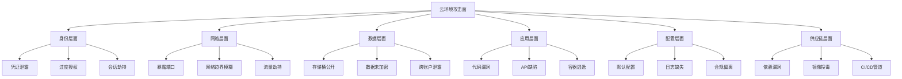

## 12.1.8 云安全的攻击面分析

攻击面（Attack Surface）是系统中所有可被攻击者利用的入口点、接口和漏洞的集合。在云环境中，攻击面的概念比传统IT环境更加复杂——云的弹性、共享责任模型、API驱动架构以及服务的快速迭代，都使得攻击面呈指数级扩张。

理解攻击面是安全防御的第一步。如果你不知道攻击者从哪里进来，就无法有效地布置防御。本节将从六个维度系统分析云环境的攻击面，并提供识别和缩小攻击面的方法。

### 什么是攻击面分析

攻击面分析（Attack Surface Analysis）是一种系统化的方法，用于识别、分类和评估系统中所有潜在的攻击入口。它回答三个核心问题：

1. **攻击者能接触到什么？** —— 暴露的端点、API、服务
2. **攻击者能做什么？** —— 可执行的操作、可利用的功能
3. **攻击者能获得什么？** —— 可访问的数据、权限、资源



### 身份层面的攻击面

身份是云环境的新边界。传统安全依赖网络边界，而云环境中"身份即边界"——拥有合法身份和权限，就可以从任何位置访问资源。这使得身份层面成为云攻击的首要目标。

**凭证泄露与滥用**

凭证泄露是云安全事件中最常见的根本原因。泄露途径包括：

| 泄露途径 | 描述 | 真实案例 |
|---------|------|---------|
| 代码仓库硬编码 | Access Key写入代码后提交到Git | Uber 2016年数据泄露：AWS密钥硬编码在GitHub仓库 |
| 钓鱼攻击 | 伪造登录页面获取凭证 | 2020年Twitter比特币骗局：社会工程获取员工凭证 |
| 日志泄露 | 凭证出现在日志或调试输出中 | 多起事件：API Key出现在CloudWatch日志中 |
| 元数据服务利用 | SSRF漏洞获取临时凭证 | Capital One 2019年：通过SSRF获取IAM角色凭证 |
| 配置文件暴露 | .env或配置文件可被下载 | 多起S3泄露事件中包含数据库凭证文件 |

**过度授权问题**

过度授权是云安全中最普遍的弱点。根据Ermetic（现为Tenable）的研究，云环境中约90%的权限从未被使用，这些"休眠权限"构成了巨大的攻击面。

过度授权的具体表现：
- **通配符权限**：使用 `*` 或 `Action: *` 授予全权限
- **角色链**：A角色可以通过AssumeRole获取B角色，B角色又有更高权限
- **服务账户权限膨胀**：服务账户在开发阶段被授予Admin权限，上线后未收回
- **组权限叠加**：用户同时属于多个权限组，实际权限远超预期

识别过度授权的方法：

```bash
# AWS: 查找拥有Admin权限的IAM用户
aws iam list-policies --scope Local --query 'Policies[?PolicyName==`AdminAccess`]'

# AWS: 查找未使用的IAM角色（通过CloudTrail分析）
aws cloudtrail lookup-events \
  --lookup-attributes AttributeKey=EventName,AttributeValue=AssumeRole \
  --start-time 2024-01-01T00:00:00Z \
  --end-time 2024-06-01T00:00:00Z

# Azure: 查找拥有Owner角色的用户
az role assignment list --role Owner --output table

# GCP: 查找拥有Owner角色的服务账户
gcloud projects get-iam-policy PROJECT_ID \
  --flatten="bindings[].members" \
  --filter="bindings.role:roles/owner AND bindings.members:serviceAccount"
```

**MFA缺失与会话管理薄弱**

特权账户未启用MFA是攻击者最喜欢的入口。攻击流程通常为：获取凭证 → 发现无MFA → 直接登录 → 提权 → 横向移动。

会话管理方面的问题：
- 会话Token有效期过长（超过24小时）
- 缺少会话绑定（不绑定IP或设备指纹）
- 不支持会话撤销
- 临时凭证的TTL设置过长

### 网络层面的攻击面

云环境的网络攻击面与传统网络有显著差异。云的虚拟网络、安全组、负载均衡器等组件构成了新的攻击面。

**暴露的端口和服务**

公网暴露是云网络攻击面的核心问题。常见暴露场景：

| 暴露类型 | 风险等级 | 典型场景 |
|---------|---------|---------|
| SSH/RDP开放到0.0.0.0/0 | 极高 | 开发环境忘记关闭远程访问 |
| 数据库端口公网暴露 | 极高 | MongoDB 27017、Redis 6379直接暴露 |
| 管理控制台公开 | 高 | Kubernetes API Server、Admin控制台 |
| 调试端口暴露 | 高 | Docker API 2375、Jupyter 8888 |
| 内部API未认证 | 中-高 | 微服务间API缺乏认证 |

```bash
# 使用Shodan搜索暴露的云服务
# 搜索暴露的MongoDB实例
shodan search "product:MongoDB country:CN" --fields ip_str,port

# 搜索暴露的Kubernetes API
shodan search "kubernetes country:CN" --fields ip_str,port

# 搜索暴露的Docker API
shodan search "product:Docker country:CN" --fields ip_str,port
```

**安全组配置问题**

安全组（Security Group）是云环境的第一道网络防线，但错误的配置使其形同虚设：

```bash
# AWS: 查找允许所有入站流量的安全组
aws ec2 describe-security-groups \
  --query 'SecurityGroups[?IpPermissions[?IpRanges[?CidrIp==`0.0.0.0/0`]]].[GroupId,GroupName,IpPermissions]' \
  --output table

# 查找允许SSH入站的规则
aws ec2 describe-security-groups \
  --filters Name=ip-permission.from-port,Values=22 \
  --query 'SecurityGroups[*].[GroupId,GroupName]' \
  --output table

# 查找允许RDP入站的规则
aws ec2 describe-security-groups \
  --filters Name=ip-permission.from-port,Values=3389 \
  --query 'SecurityGroups[*].[GroupId,GroupName]' \
  --output table
```

**VPC对等连接风险**

VPC对等连接（VPC Peering）在方便网络互通的同时，也扩大了攻击面。如果一个VPC被攻破，攻击者可以通过对等连接横向移动到其他VPC。

风险点：
- 对等连接的路由表可能过于宽松
- 缺少网络ACL（NACL）的精细化控制
- 跨账户对等连接的权限管理复杂

### 数据层面的攻击面

数据是云环境中最有价值的资产，也是攻击者最终目标。数据层面的攻击面主要集中在存储、传输和访问控制三个环节。

**存储桶公开访问**

云存储桶（S3、Azure Blob、GCS）的公开访问是最常见的数据泄露途径。据统计，仅在2019-2023年间，就有超过300亿条记录因存储桶配置错误而泄露。

```bash
# AWS: 检查所有S3存储桶的公开访问状态
aws s3api list-buckets --query 'Buckets[*].Name' --output text | while read bucket; do
  echo "=== $bucket ==="
  aws s3api get-public-access-block --bucket "$bucket" 2>/dev/null || echo "No public access block configured"
  aws s3api get-bucket-policy-status --bucket "$bucket" 2>/dev/null | jq '.PolicyStatus.IsPublic'
done

# 批量检查存储桶ACL
for bucket in $(aws s3api list-buckets --query 'Buckets[*].Name' --output text); do
  echo "=== $bucket ==="
  aws s3api get-bucket-acl --bucket "$bucket" --query 'Grants[?Grantee.URI!=`null`]'
done
```

**未加密的敏感数据**

未加密的数据在被泄露后直接可用，而加密的数据至少还有最后一道防线。

| 数据状态 | 加密方法 | 关键点 |
|---------|---------|--------|
| 静态数据（At Rest） | AES-256、SSE-S3/SSE-KMS/SSE-C | 密钥管理是核心，KMS密钥策略需严格控制 |
| 传输中数据（In Transit） | TLS 1.2/1.3 | 强制HTTPS，禁用弱加密套件 |
| 使用中数据（In Use） | 同态加密、TEE | TEE（如AWS Nitro Enclaves）用于敏感计算 |

```bash
# AWS: 检查未加密的EBS卷
aws ec2 describe-volumes \
  --query 'Volumes[?Encrypted==`false`].[VolumeId,Size,State,Attachments[0].InstanceId]' \
  --output table

# 检查未加密的RDS实例
aws rds describe-db-instances \
  --query 'DBInstances[?StorageEncrypted==`false`].[DBInstanceIdentifier,Engine,StorageEncrypted]' \
  --output table
```

### 应用层面的攻击面

云原生架构引入了新的应用层攻击面，包括Serverless函数、容器、微服务和API。

**Serverless函数安全**

Serverless函数（AWS Lambda、Azure Functions、Cloud Functions）虽然减少了基础设施管理，但带来了新的安全挑战：

- **事件注入**：通过SQS消息、S3事件、API Gateway请求等触发恶意代码执行
- **权限过度配置**：函数被授予超出所需的服务访问权限
- **依赖漏洞**：函数依赖的第三方库存在已知漏洞
- **临时凭证泄露**：通过SSRF或环境变量泄露函数的临时凭证

```python
# Lambda函数安全配置示例
import json
import boto3
from botocore.exceptions import ClientError

def lambda_handler(event, context):
    """
    安全的Lambda函数示例 - 展示安全编码实践
    """
    # 1. 输入验证
    if 'queryStringParameters' not in event:
        return {'statusCode': 400, 'body': 'Missing parameters'}
    
    params = event['queryStringParameters']
    user_id = params.get('user_id', '')
    
    # 2. 防止注入：使用参数化查询而非字符串拼接
    dynamodb = boto3.resource('dynamodb')
    table = dynamodb.Table('users')
    
    try:
        # 使用参数化查询，避免注入风险
        response = table.get_item(Key={'user_id': user_id})
        
        # 3. 输出过滤：只返回必要字段
        if 'Item' in response:
            safe_item = {
                'user_id': response['Item']['user_id'],
                'name': response['Item']['name']
                # 不返回敏感字段如 email, phone 等
            }
            return {'statusCode': 200, 'body': json.dumps(safe_item)}
        else:
            return {'statusCode': 404, 'body': 'User not found'}
            
    except ClientError as e:
        # 4. 错误处理：不泄露内部错误信息
        return {'statusCode': 500, 'body': 'Internal server error'}
```

**容器镜像安全**

容器镜像中的已知漏洞是云原生环境中最常见的安全问题之一。根据Snyk的报告，超过80%的基础镜像包含已知漏洞。

```bash
# 使用Trivy扫描容器镜像漏洞
trivy image --severity HIGH,CRITICAL nginx:latest

# 扫描镜像中的敏感信息
trivy image --security-checks secret myapp:latest

# 使用Docker Bench检查Docker安全配置
docker run --rm --net host --pid host \
  --userns host --cap-add audit_control \
  -v /var/lib:/var/lib \
  -v /var/run/docker.sock:/var/run/docker.sock \
  docker/docker-bench-security

# 检查镜像签名
cosign verify --key cosign.pub myregistry.io/myimage:latest
```

**API安全缺陷**

API是云服务的核心接口，也是攻击面的重要组成部分。OWASP API Security Top 10列出了最常见的API安全风险：

| 排名 | 风险 | 描述 | 防御措施 |
|------|------|------|---------|
| API1 | 对象级授权缺失 | 攻击者可以通过修改对象ID访问他人数据 | 实施对象级授权检查 |
| API2 | 认证机制薄弱 | 缺少MFA、Token管理不当 | 实施强认证、短Token |
| API3 | 对象属性级授权缺失 | 攻击者可以修改不该访问的属性 | 白名单可修改属性 |
| API4 | 资源消耗无限制 | API缺乏速率限制导致DoS | 实施速率限制、资源配额 |
| API5 | 功能级授权缺失 | 攻击者可以访问管理功能 | 实施功能级权限检查 |

### 配置层面的攻击面

云环境的配置错误是导致安全事件的主要原因之一。根据Gartner的预测，到2025年，99%的云安全失败都将是客户的错（配置错误）。

**默认配置未修改**

云服务的默认配置通常为了易用性而非安全性。常见问题：

- **默认VPC**：AWS默认VPC的子网都是公有子网
- **默认安全组**：默认允许所有出站流量
- **默认IAM策略**：某些服务的默认策略过于宽松
- **默认端口**：数据库、缓存服务使用默认端口和弱密码

```bash
# AWS: 查找使用默认VPC的资源
DEFAULT_VPC=$(aws ec2 describe-vpcs \
  --filters Name=isDefault,Values=true \
  --query 'Vpcs[0].VpcId' --output text)

echo "Default VPC: $DEFAULT_VPC"

# 查找默认VPC中的EC2实例
aws ec2 describe-instances \
  --filters "Name=vpc-id,Values=$DEFAULT_VPC" \
  --query 'Reservations[*].Instances[*].[InstanceId,State.Name,PublicIpAddress]' \
  --output table
```

**日志审计未开启**

没有日志就无法发现攻击、追溯事件和满足合规要求。云环境中的日志配置：

```bash
# AWS: 检查CloudTrail是否启用
aws cloudtrail describe-trails --query 'trailList[*].[Name,IsMultiRegionTrail,IsLogging]'

# 检查VPC Flow Logs是否启用
aws ec2 describe-vpcs --query 'Vpcs[*].VpcId' --output text | while read vpc; do
  echo "VPC: $vpc"
  aws ec2 describe-flow-logs --filter "Name=resource-id,Values=$vpc" \
    --query 'FlowLogs[*].[FlowLogId,TrafficType,LogDestination]' --output table
done

# Azure: 检查Activity Log是否启用
az monitor activity-log list --query '[].{Event:eventTimestamp,Resource:resourceGroupName}' --output table
```

### 供应链层面的攻击面

云原生架构高度依赖第三方组件（开源库、容器镜像、IaC模板），供应链攻击面急剧扩大。

**依赖漏洞**

Log4Shell（CVE-2021-44228）事件证明，一个开源库的漏洞可以影响数百万系统。在云环境中，依赖风险管理更加复杂：

```bash
# Python项目依赖扫描
pip-audit --requirement requirements.txt

# Node.js项目依赖扫描
npm audit --production

# Java项目依赖扫描
mvn org.owasp:dependency-check-maven:check

# SBOM生成（软件物料清单）
syft myapp:latest -o spdx-json > sbom.json
```

**CI/CD管道安全**

CI/CD管道是云环境供应链的关键节点。攻击者一旦入侵CI/CD管道，就可以在构建过程中注入恶意代码。

常见风险：
- 构建环境中的凭证泄露
- 未验证的第三方Action/Step
- 构建产物未签名
- 镜像推送未验证

### 攻击面缩小策略

识别攻击面后，关键是采取措施缩小它：

**1. 最小权限原则**
- 定期审查和清理IAM权限
- 使用权限边界限制最大权限
- 实施JIT（即时）权限提升

**2. 网络最小化**
- 所有资源默认放在私有子网
- 使用堡垒机或VPN访问内部资源
- 安全组规则只允许必要的端口和IP

**3. 数据保护**
- 启用默认加密（S3默认加密、EBS默认加密）
- 阻止存储桶的公开访问
- 实施数据分类和标签

**4. 配置管理**
- 使用IaC（基础设施即代码）管理配置
- 启用配置漂移检测
- 定期运行安全基准检查（CIS Benchmarks）

**5. 供应链安全**
- 使用私有镜像仓库
- 扫描容器镜像和依赖漏洞
- 对构建产物进行签名和验证

### 攻击面分析工具

| 工具 | 用途 | 支持平台 |
|------|------|---------|
| ScoutSuite | 多云安全审计 | AWS、Azure、GCP、阿里云 |
| Prowler | AWS安全评估 | AWS |
| CloudMapper | AWS网络可视化和安全分析 | AWS |
| Steampipe | 用SQL查询云资源和安全配置 | 多云 |
| Cartography | 云基础设施关系图谱 | AWS、GCP、Azure |
| Checkov | IaC安全扫描 | Terraform、CloudFormation |
| Trivy | 容器和IaC漏洞扫描 | 容器、Kubernetes |

### 本节核心要点

1. 云环境攻击面涵盖身份、网络、数据、应用、配置和供应链六个层面
2. 身份是云安全的新边界，凭证泄露和过度授权是最常见的攻击入口
3. 配置错误是云安全事件的根本原因，需要自动化工具持续监控
4. 缩小攻击面需要最小权限、网络最小化、数据保护和配置管理的综合措施
5. 使用自动化工具进行持续的攻击面发现和评估
