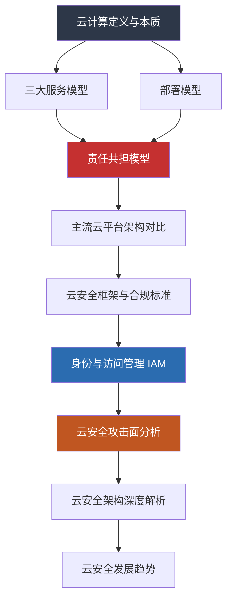

## 本节小结

本节从云计算的定义出发，沿着"是什么→怎么分→谁负责→用什么→怎么管→怎么防"的逻辑链路，系统梳理了云计算安全的理论基础。下面从知识体系回顾、核心概念串联、常见认知误区、自测清单四个维度进行总结。

---

### 知识体系回顾

#### 各子节核心要点速览

| 子节 | 核心问题 | 关键结论 |
|------|----------|----------|
| 云计算的定义与本质 | 云计算到底是什么？ | 不是单一技术，而是"按需、弹性、可计量"的资源交付范式。NIST SP 800-145 定义了五大特征、三种服务模式 |
| 三大服务模型 | IaaS/PaaS/SaaS 的区别？ | 服务模型决定了用户与云厂商的责任边界——越往上层，用户控制越少、责任越轻，但灵活性也越低 |
| 部署模型 | 公有云/私有云/混合云怎么选？ | 公有云成本低但隔离靠技术；私有云控制强但成本高；混合云灵活但架构复杂；社区云面向行业合规 |
| 责任共担模型 | 安全到底谁负责？ | 云厂商负责"云的安全"（Security OF the Cloud），用户负责"在云上的安全"（Security IN the Cloud） |
| 主流云平台架构对比 | AWS/Azure/GCP/阿里云有何异同？ | 核心安全组件功能等价但命名不同；AWS 服务最全、Azure 深度集成微软生态、GCP 擅长 ML/数据、阿里云覆盖亚太合规 |
| 云安全框架与合规标准 | 有哪些必须遵循的标准？ | CSA CCM（16 个安全域）、NIST SP 800-144、ISO 27017、SOC 2、等保 2.0 是五大核心框架 |
| 身份与访问管理 IAM | 云里的"门禁"怎么管？ | 身份取代网络边界成为新安全边界；最小权限、角色优先于密钥、MFA 是三大基石 |
| 云安全的攻击面分析 | 攻击者从哪里入手？ | 五大攻击面：身份层、网络层、数据层、应用层、配置层，其中配置错误和身份过度授权最为常见 |

#### 知识脉络图



---

### 核心概念串联

#### 从定义到防御的逻辑链

**起点：云计算的本质**

NIST 定义的五大特征——按需自助、广泛网络访问、资源池化、快速弹性、可计量服务——每一条都对应特定的安全影响：

- **按需自助** → 用户自行配置资源，配置错误成为首要风险源（>60% 的云安全事件源于此）
- **资源池化** → 多租户共存，隔离机制是安全基石
- **快速弹性** → 资源动态伸缩，安全策略必须跟随自动调整
- **可计量服务** → 审计日志天然存在，但也意味着攻击行为同样可被追踪

**关键分歧点：服务模型决定责任边界**

```text
用户控制程度 ──────────────────────────► 云厂商控制程度
    IaaS        PaaS        SaaS
    ├───────────┼───────────┤
用户：操作系统  用户：代码    用户：数据
      网络        运行时       配置
      中间件      数据         访问策略
      数据
云厂商：硬件    云厂商：硬件   云厂商：硬件+OS+中间件+运行时
        虚拟化        +OS+运行时
```

这条线划清楚了，才能回答"这个安全问题该找谁"——这是云安全工作中的第一个判断题。

**最核心的安全哲学：零信任**

传统安全假设"内网可信、外网不可信"，云环境打破了这个假设：

- 资源动态创建销毁，网络边界不断变化
- 多租户共享底层基础设施
- API 驱动的管理平面暴露在公网
- 员工从任意位置、任意设备访问云端资源

因此，云安全必须从"信任边界"转向"持续验证"——每次请求都验证身份、设备状态和上下文，不因来源网络而给予额外信任。

#### 五大攻击面与防御矩阵

| 攻击面 | 典型风险 | 防御核心 | 关键工具 |
|--------|----------|----------|----------|
| 身份层 | 弱密码、过度授权、泄露的 AccessKey、缺少 MFA | 最小权限原则 + MFA + 定期轮换密钥 | IAM Policy Simulator、Access Analyzer |
| 网络层 | 端口暴露、不安全的 VPC Peering、安全组配置错误 | 网络分段 + 最小开放原则 + 出站流量控制 | Security Groups、NACLs、VPC Flow Logs |
| 数据层 | 公开存储桶、未加密数据、跨账号共享 | 默认加密 + 访问策略审计 + DLP | S3 Block Public Access、Cloud KMS |
| 应用层 | Serverless 代码漏洞、容器镜像漏洞、API 缺陷 | SAST/DAST + 镜像扫描 + API 网关 | ECR Image Scanning、API Gateway |
| 配置层 | 默认配置未更改、审计日志未开启、无区域限制 | CSPM 持续扫描 + IaC 策略即代码 | AWS Config、Azure Policy、Security Hub |

---

### 常见认知误区

#### 误区一："上了云就安全了"

**现实**：99% 的云安全事件源于用户侧配置错误（CSA 报告）。云厂商只负责基础设施层安全（物理安全、虚拟化隔离、网络基线），上层的安全配置、访问控制、数据保护完全由用户承担。把系统迁移到云端后不做任何安全加固，和把家门钥匙放在门口垫子下面没有区别。

#### 误区二："私有云一定比公有云安全"

**现实**：安全性取决于安全能力而非部署模型。一个安全团队薄弱的企业自建私有云，其安全水平可能远低于 AWS/Azure 的公有云。公有云厂商拥有数千名安全工程师和全球威胁情报，这是大多数企业无法企及的。私有云的优势在于"控制权"——适合有强合规要求或需要完全掌控数据主权的场景。

#### 误区三："IAM 配置差不多就行"

**现实**：过度宽松的 IAM 策略是云环境中最常见的攻击入口。一个拥有 `*:*` 权限的 IAM 用户，等同于把整个云账号的管理权交给了任何获取该凭证的人。正确做法是：先拒绝所有权限，再按需逐步授予，定期审查并清理不再使用的权限。

#### 误区四："安全组就是防火墙"

**现实**：安全组是有状态的虚拟防火墙，但它只在网络层工作。它无法防御应用层攻击（SQL 注入、XSS）、无法检测数据泄露、无法阻止内部横向移动。完整的云安全需要网络层（安全组/NACLs）+ 应用层（WAF）+ 数据层（加密/DLP）+ 身份层（IAM）的多层防御。

#### 误区五："合规就是安全"

**现实**：合规是安全的最低标准，不是安全的天花板。通过等保测评或 SOC 2 审计，只说明企业在审计时点满足了特定基线要求，不代表系统没有漏洞。安全是一个持续的过程，需要持续监控、主动检测、快速响应，而不是一年一次的"应试"。

---

### 核心框架速查

#### 五大云安全合规框架对比

| 框架 | 适用场景 | 核心内容 | 中国适用性 |
|------|----------|----------|------------|
| CSA CCM | 通用云安全评估 | 16 个安全域、197 个控制项，覆盖 IaaS/PaaS/SaaS | 国际通用，可用于供应商评估 |
| NIST SP 800-144 | 公有云安全规划 | 信息安全、隐私、治理三大方向 | 参考价值高，但非强制 |
| ISO 27017 | 云安全管理体系 | ISO 27001 的云扩展，37 个云专用控制项 | 国际认证，增强客户信任 |
| SOC 2 | 服务商审计 | 安全、可用性、处理完整性、机密性、隐私五项 | 外资/出海企业常要求 |
| 等保 2.0 | 中国境内合规 | 五级保护 + 云计算安全扩展要求 | 强制性，中国境内必做 |

#### 安全服务对照表

同一功能在不同云平台的对应服务：

| 安全功能 | AWS | Azure | GCP | 阿里云 |
|----------|-----|-------|-----|--------|
| 身份管理 | IAM | Entra ID | Cloud IAM | RAM |
| 威胁检测 | GuardDuty | Sentinel | SCC | 安全中心 |
| 审计日志 | CloudTrail | Monitor/Audit Log | Cloud Audit Logs | ActionTrail |
| 密钥管理 | KMS | Key Vault | Cloud KMS | KMS |
| 安全态势 | Security Hub | Defender for Cloud | SCC | 安全中心 |
| 配置审计 | Config | Policy | Cloud Asset Inventory | 配置审计 |

---

### 自测清单

学完本节理论基础后，确认自己能够回答以下问题：

**基础层（必须掌握）**

- [ ] 用一句话解释云计算的本质是什么
- [ ] 画出 IaaS/PaaS/SaaS 的责任分界线
- [ ] 说明公有云和私有云在安全模型上的核心区别
- [ ] 解释"Security OF the Cloud"和"Security IN the Cloud"的区别
- [ ] 列举至少 3 个 NIST 定义的云计算基本特征及其安全影响

**进阶层（应该掌握）**

- [ ] 在具体场景中判断安全问题属于用户责任还是厂商责任
- [ ] 对比 AWS IAM、Azure Entra ID、GCP Cloud IAM 的设计差异
- [ ] 说明零信任架构在云环境中的具体含义和实施路径
- [ ] 列举 5 种常见的云攻击面并各举一个攻击示例
- [ ] 解释 CSA CCM 和等保 2.0 在云安全评估中的不同定位

**实战层（加分项）**

- [ ] 能够审查一份 IAM Policy 是否存在过度授权
- [ ] 能够判断一个 S3 Bucket 的访问策略是否存在公开暴露风险
- [ ] 能够根据业务场景选择合适的云部署模型和安全架构

---

### 展望后续

理论基础建立了云安全的思维框架——我们知道云是什么、安全边界在哪里、攻击者从哪里来。接下来的章节将进入实战层面：

1. **云环境核心安全技巧**：具体的加固操作、配置基线、安全工具使用
2. **渗透测试与攻防**：从攻击者视角理解云环境的脆弱点
3. **安全架构实战**：零信任落地、CSPM/CWPP/CASB 的部署与配置

理解责任共担模型是所有后续工作的前提——你必须清楚自己的安全责任边界在哪里，不能将安全完全寄托于云服务商。带着这个认知进入实战，才能避免"以为安全其实不安全"的盲区。
