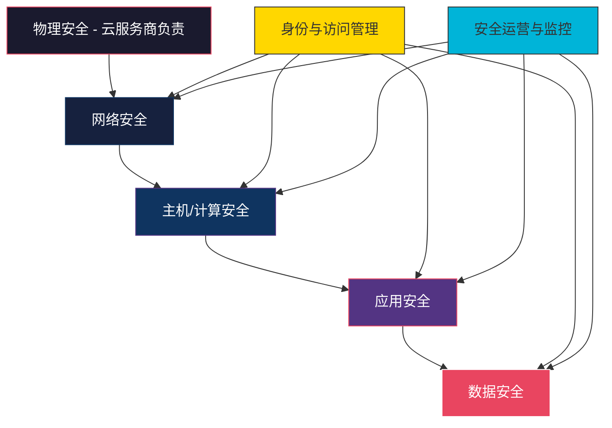
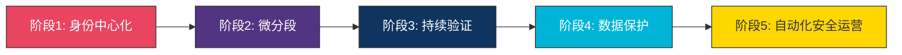
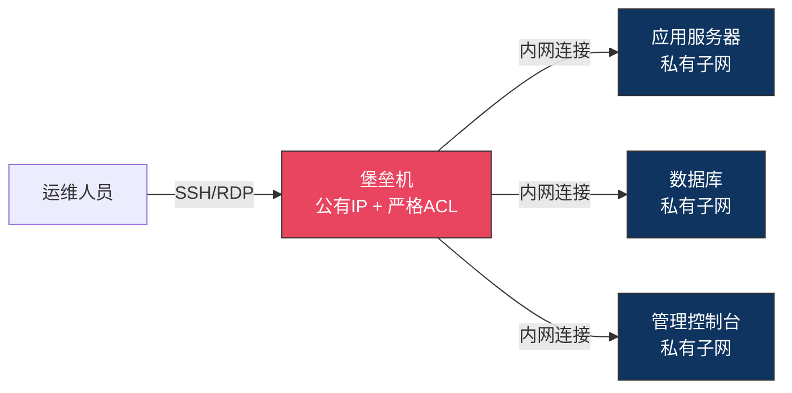
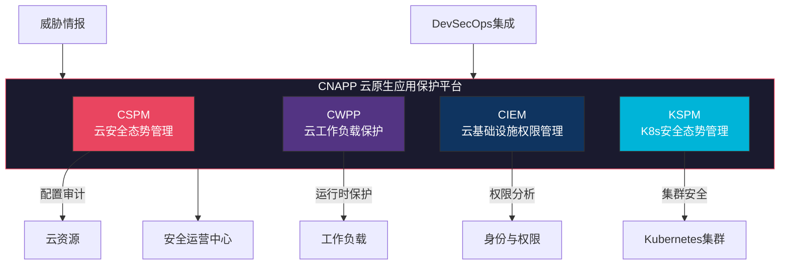
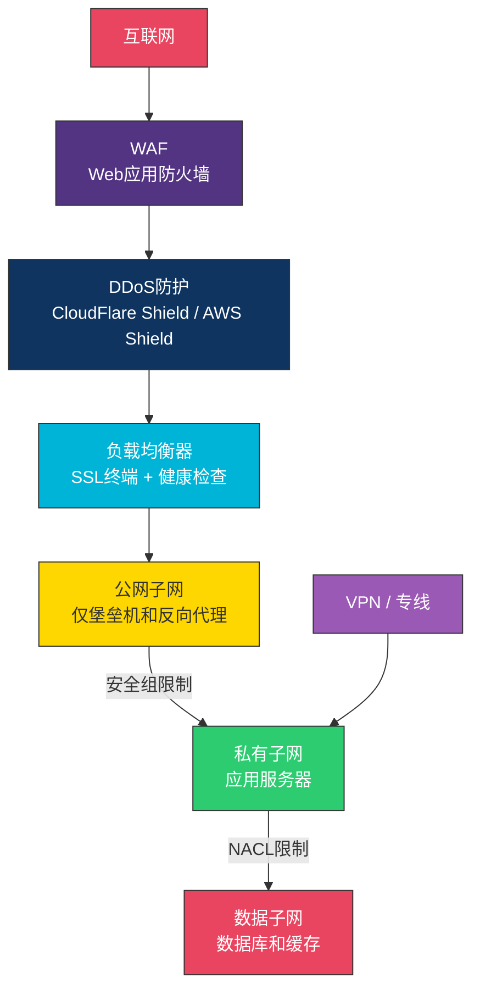
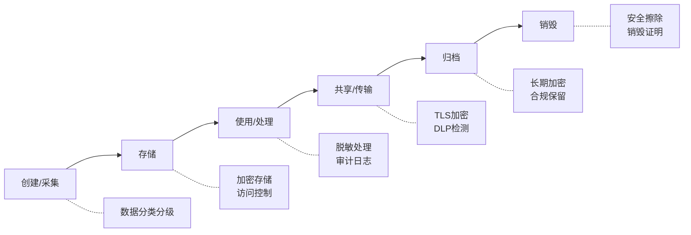

## 12.1.9 云安全架构深度解析

云安全不是单一产品或技术的堆叠，而是需要从架构层面进行系统性设计。本节在前面章节（责任共担模型、安全框架、IAM、攻击面分析）的基础上，深入讲解如何构建一套完整的云安全架构——从设计理念到落地实施，从网络层到应用层，从预防到响应。

### 纵深防御：云安全架构的核心理念

纵深防御（Defense in Depth）源自军事战略，核心思想是在多个层次设置独立的安全控制，任何单一层的失效都不会导致整体防线崩溃。在云环境中，纵深防御的层次模型如下：



**每层的核心控制措施：**

| 层次 | 控制目标 | 典型技术手段 | 责任方 |
|------|----------|-------------|--------|
| 物理安全 | 数据中心物理访问控制 | 生物识别、视频监控、环境监控 | 云服务商 |
| 网络安全 | 网络边界与流量控制 | VPC、安全组、WAF、DDoS防护、VPN | 共担（详见4.1.4节） |
| 主机安全 | 操作系统与运行时保护 | 补丁管理、EDR、加固基线、HIDS | 用户 |
| 应用安全 | 应用层漏洞防护 | SAST/DAST、RASP、输入验证、CSP | 用户 |
| 数据安全 | 数据的机密性、完整性、可用性 | 加密、DLP、备份、分类分级 | 用户 |
| 身份安全 | 身份验证与授权 | IAM、MFA、SSO、PAM、零信任 | 共担 |
| 安全运营 | 持续监控与响应 | SIEM、SOAR、威胁情报、应急响应 | 用户 |

纵深防御的关键原则：**每一层都应该假设其他层已经被攻破**。例如，即使网络层已经限制了访问，应用层仍然需要自己的认证和授权机制；即使应用层存在漏洞，数据层的加密也能防止数据泄露。

### 零信任架构在云环境中的深度实施

零信任安全模型的核心假设是：**不应信任网络内外的任何实体，所有访问请求都需要经过验证、授权和加密**。这与传统"城堡+护城河"的安全模型有本质区别——在传统模型中，内网被视为可信区域，一旦突破边界，攻击者可以自由移动。

**零信任的五大支柱：**

| 支柱 | 核心要求 | 实施要点 |
|------|----------|----------|
| 身份验证 | 每次访问都需要强身份验证 | MFA、无密码认证、设备证书、生物识别 |
| 设备验证 | 验证访问设备的安全状态和合规性 | 设备健康检查、MDM集成、证书绑定 |
| 网络分段 | 将网络划分为微段，限制横向移动 | 微分段、服务网格、容器网络策略 |
| 应用层控制 | 在应用层面实施访问控制 | API网关、OAuth2.0/OIDC、JWT验证 |
| 数据保护 | 对敏感数据进行加密和访问控制 | 端到端加密、数据分类、DLP |

**云环境零信任实施四阶段路径：**



**阶段1：身份中心化**——将身份作为新的安全边界：

- 部署统一身份管理平台（如Azure AD、Okta、Keycloak），集中管理所有云服务的身份
- 强制所有用户启用MFA，特权账户使用硬件安全密钥（FIDO2/WebAuthn）
- 实施条件访问策略：根据用户身份、设备状态、位置、时间等因素动态决策
- 部署特权访问管理（PAM）：特权操作需要审批、有时限、有录像

**阶段2：微分段**——打破大平面网络：

- VPC/VNet分段：按业务功能划分子网，每个子网有独立的安全组规则
- 服务网格（Service Mesh）：使用Istio/Linkerd在服务间实施mTLS和授权策略
- 容器网络策略：使用Kubernetes NetworkPolicy限制Pod间的通信

```yaml
# Kubernetes NetworkPolicy：仅允许前端访问后端API
apiVersion: networking.k8s.io/v1
kind: NetworkPolicy
metadata:
  name: backend-allow-frontend
  namespace: production
spec:
  podSelector:
    matchLabels:
      app: backend-api
  policyTypes:
  - Ingress
  ingress:
  - from:
    - podSelector:
        matchLabels:
          app: frontend
    ports:
    - protocol: TCP
      port: 8080
```

**阶段3：持续验证**——信任不是一次性的：

- 实时风险评估：每次请求都根据上下文（设备、位置、行为模式）计算风险分数
- 用户和实体行为分析（UEBA）：建立正常行为基线，检测异常行为
- 自动化响应：高风险请求触发二次验证或直接拒绝
- 安全编排（SOAR）：将多个安全工具的告警关联起来，自动化响应流程

**阶段4：数据保护**——安全的最终目标是保护数据：

- 数据分类分级：识别敏感数据（PII、PHI、财务数据），打上标签
- 加密传输和存储：所有数据传输使用TLS 1.3，静态数据使用AES-256-GCM加密
- 数据防泄漏（DLP）：监控数据流出，阻止未授权的数据传输
- 密钥管理：使用云服务商的KMS（如AWS KMS、Azure Key Vault）管理密钥，启用自动轮换

### 云安全设计模式

设计模式是解决特定安全问题的成熟方案。以下是云环境中最常用的六种安全设计模式，每种都包含具体的实施方法和代码示例。

#### 堡垒机模式（Bastion Host Pattern）

堡垒机通过一个受控的跳板服务器来访问内部资源，避免直接暴露内部系统到公网。这是运维安全管理的基础模式。



**Terraform实现AWS堡垒机：**

```hcl
# 堡垒机安全组：仅允许来自指定IP的SSH访问
resource "aws_security_group" "bastion" {
  name        = "bastion-sg"
  description = "Bastion host security group"
  vpc_id      = aws_vpc.main.id

  ingress {
    description = "SSH from allowed IPs"
    from_port   = 22
    to_port     = 22
    protocol    = "tcp"
    cidr_blocks = [var.allowed_office_ip]  # 仅允许办公网络IP
  }

  egress {
    description = "SSH to internal subnets"
    from_port   = 22
    to_port     = 22
    protocol    = "tcp"
    cidr_blocks = [var.private_subnet_cidr]
  }
}

resource "aws_instance" "bastion" {
  ami                    = data.aws_ami.amazon_linux_2.id
  instance_type          = "t3.micro"
  subnet_id              = aws_subnet.public.id
  vpc_security_group_ids = [aws_security_group.bastion.id]
  
  metadata_options {
    http_endpoint = "enabled"
    http_tokens   = "required"  # 强制使用IMDSv2，防止SSRF窃取凭证
  }

  tags = {
    Name = "bastion-host"
  }
}
```

堡垒机安全加固清单：
- 仅开放SSH/RDP端口，禁止其他任何入站流量
- 使用SSH密钥认证，禁用密码登录
- 启用会话录制（使用`script`命令或Teleport等工具）用于事后审计
- 定期轮换SSH密钥（建议每90天）
- 限制源IP地址为办公网络或VPN出口
- 启用IMDSv2（AWS）防止通过SSRF攻击获取实例角色凭证
- 配置CloudWatch/CloudTrail监控所有堡垒机登录行为

#### API网关模式（API Gateway Pattern）

API网关作为所有API请求的统一入口，集中处理认证、限流、日志等横切关注点：

```yaml
# Kong API网关配置示例
services:
- name: user-service
  url: http://user-service.internal:8080
  routes:
  - name: user-api
    paths: ["/api/v1/users"]
    strip_path: false
  plugins:
  - name: rate-limiting
    config:
      minute: 100          # 每分钟最多100次请求
      policy: redis
      redis_host: redis.internal
  - name: jwt
    config:
      claims_to_verify: ["exp", "iss"]
  - name: cors
    config:
      origins: ["https://app.example.com"]
      methods: ["GET", "POST", "PUT", "DELETE"]
  - name: ip-restriction
    config:
      allow: ["10.0.0.0/8"]  # 仅允许内网访问
```

API网关安全能力矩阵：

| 安全能力 | 实现方式 | 防御的攻击类型 |
|----------|----------|---------------|
| 认证 | JWT/OAuth2.0/API Key验证 | 未授权访问 |
| 授权 | RBAC/ABAC策略 | 越权访问 |
| 限流 | 令牌桶/滑动窗口算法 | DDoS、暴力破解 |
| 输入验证 | Schema验证、参数白名单 | 注入攻击、XSS |
| 加密 | TLS终端、请求/响应加密 | 中间人攻击 |
| 日志审计 | 请求日志、访问日志 | 事后追溯、合规审计 |

#### Sidecar安全模式（Security Sidecar Pattern）

在容器化环境中，将安全功能从业务代码中解耦出来，通过Sidecar容器注入。这种模式的优势是安全策略与业务代码完全独立，安全升级不需要修改业务代码：

```yaml
# Kubernetes Pod with Security Sidecars
apiVersion: v1
kind: Pod
metadata:
  name: app-with-security
  labels:
    app: web-app
    security-level: high
spec:
  serviceAccountName: web-app-sa  # 使用专用ServiceAccount
  automountServiceAccountToken: false  # 禁止自动挂载token
  containers:
  # 业务容器
  - name: app
    image: myapp:v2.1.0@sha256:abc123...  # 使用镜像摘要而非tag，防止供应链攻击
    ports:
    - containerPort: 8080
    securityContext:
      runAsNonRoot: true          # 禁止以root运行
      runAsUser: 1000
      readOnlyRootFilesystem: true
      allowPrivilegeEscalation: false
      capabilities:
        drop: ["ALL"]            # 丢弃所有Linux capabilities
    resources:
      limits:
        cpu: "500m"
        memory: "256Mi"
      requests:
        cpu: "100m"
        memory: "128Mi"
    livenessProbe:
      httpGet:
        path: /healthz
        port: 8080
      periodSeconds: 10
    readinessProbe:
      httpGet:
        path: /ready
        port: 8080

  # 安全Sidecar：日志收集与审计
  - name: log-agent
    image: fluent/fluent-bit:2.1
    volumeMounts:
    - name: app-logs
      mountPath: /var/log/app
    - name: fluent-config
      mountPath: /fluent-bit/etc

  # 安全Sidecar：服务网格代理（Istio Envoy）
  - name: istio-proxy
    image: envoy:v1.27.0
    securityContext:
      readOnlyRootFilesystem: true
    ports:
    - containerPort: 15001  # Envoy入站
    - containerPort: 15006  # Envoy出站

  volumes:
  - name: app-logs
    emptyDir: {}
  - name: fluent-config
    configMap:
      name: fluent-bit-config
```

#### 断路器模式（Circuit Breaker Pattern）

在云原生微服务架构中，单个服务的故障可能通过调用链级联放大。断路器模式监控服务调用失败率，当超过阈值时自动"跳闸"，阻止进一步的调用，防止雪崩效应：

```python
# Python断路器实现示例
import time
from enum import Enum
from functools import wraps

class CircuitState(Enum):
    CLOSED = "closed"       # 正常状态，允许请求通过
    OPEN = "open"           # 熔断状态，拒绝所有请求
    HALF_OPEN = "half_open" # 半开状态，允许少量请求探测

class CircuitBreaker:
    def __init__(self, failure_threshold=5, recovery_timeout=30, 
                 half_open_max_calls=3):
        self.failure_threshold = failure_threshold
        self.recovery_timeout = recovery_timeout
        self.half_open_max_calls = half_open_max_calls
        self.state = CircuitState.CLOSED
        self.failure_count = 0
        self.last_failure_time = None
        self.half_open_calls = 0

    def call(self, func, *args, **kwargs):
        if self.state == CircuitState.OPEN:
            if time.time() - self.last_failure_time > self.recovery_timeout:
                self.state = CircuitState.HALF_OPEN
                self.half_open_calls = 0
            else:
                raise CircuitOpenError("Circuit is open, request rejected")

        try:
            result = func(*args, **kwargs)
            self._on_success()
            return result
        except Exception as e:
            self._on_failure()
            raise

    def _on_success(self):
        if self.state == CircuitState.HALF_OPEN:
            self.half_open_calls += 1
            if self.half_open_calls >= self.half_open_max_calls:
                self.state = CircuitState.CLOSED
                self.failure_count = 0
        elif self.state == CircuitState.CLOSED:
            self.failure_count = 0

    def _on_failure(self):
        self.failure_count += 1
        self.last_failure_time = time.time()
        if self.failure_count >= self.failure_threshold:
            self.state = CircuitState.OPEN
```

#### 代理模式（Sidecar Proxy / Service Mesh Pattern）

服务网格（Service Mesh）将网络通信的复杂性从业务代码中抽离，通过Sidecar代理统一处理服务间的通信安全：

```yaml
# Istio PeerAuthentication：强制服务间mTLS
apiVersion: security.istio.io/v1beta1
kind: PeerAuthentication
metadata:
  name: default
  namespace: production
spec:
  mtls:
    mode: STRICT  # 强制双向TLS认证

---
# Istio AuthorizationPolicy：仅允许前端访问后端
apiVersion: security.istio.io/v1beta1
kind: AuthorizationPolicy
metadata:
  name: backend-policy
  namespace: production
spec:
  selector:
    matchLabels:
      app: backend
  rules:
  - from:
    - source:
        principals: ["cluster.local/ns/production/sa/frontend"]
    to:
    - operation:
        methods: ["GET", "POST"]
        paths: ["/api/*"]
```

#### 不可变基础设施模式（Immutable Infrastructure Pattern）

服务器一旦部署就不再修改。需要更新时，直接替换新的实例而非在原实例上修补。这种模式从根本上消除了配置漂移和"雪花服务器"问题：

```bash
# Packer构建不可变AMI（AWS示例）
#!/bin/bash
set -euo pipefail

# 1. 安全基线加固
yum update -y
yum install -y aws-security-agent

# 2. 应用安全配置
cat > /etc/security/limits.conf << 'EOF'
* hard nproc 65535
* soft nproc 65535
EOF

# 3. 禁用不必要的服务
systemctl disable rpcbind
systemctl disable avahi-daemon

# 4. 配置日志转发
cat > /etc/aws/cloudwatch-agent.json << 'EOF'
{
  "logs": {
    "logs_collected": {
      "files": {
        "collect_list": [
          {"file_path": "/var/log/auth.log", "log_group_name": "/auth"},
          {"file_path": "/var/log/secure", "log_group_name": "/auth"}
        ]
      }
    }
  }
}
EOF

# 5. 清理敏感信息
rm -rf /tmp/* /var/tmp/*
history -c
```

### 云原生安全平台架构

云原生安全已经从单一工具演进到平台化。CNAPP（Cloud-Native Application Protection Platform）是Gartner在2021年提出的概念，将CSPM、CWPP和CIEM整合为统一平台：



**CSPM（云安全态势管理）**持续监控云环境的配置是否符合安全最佳实践和合规要求：

| 能力 | 具体功能 | 检测示例 |
|------|----------|----------|
| 配置漂移检测 | 对比实际配置与期望状态 | S3存储桶从私有变为公开 |
| 合规性评估 | 对照CIS Benchmark等标准检查 | 安全组是否开放了0.0.0.0/0 |
| 风险优先级排序 | 结合暴露面和影响评估风险 | 公网暴露+无认证的RDS实例 |
| 自动化修复 | 自动将配置恢复到安全状态 | 自动关闭公开的存储桶 |

代表性工具对比：

| 工具 | 厂商 | 多云支持 | 核心优势 |
|------|------|----------|----------|
| Security Hub | AWS | AWS原生 | 深度AWS集成，聚合多服务告警 |
| Defender for Cloud | Azure | 多云 | 深度Azure集成，支持AWS/GCP |
| Security Command Center | GCP | GCP原生 | 深度GCP集成，Web Security Scanner |
| Prisma Cloud | Palo Alto | 多云 | 功能全面，CWPP+CSPM一体 |
| Wiz | Wiz | 多云 | 无代理架构，可视化攻击路径 |
| Orca Security | Orca | 多云 | SideScanning无代理技术 |

**CWPP（云工作负载保护平台）**专注于保护运行中的工作负载（虚拟机、容器、Serverless函数）：

- 漏洞管理：扫描镜像和运行时的CVE漏洞
- 运行时保护：检测异常进程、文件篡改、可疑网络连接
- 网络微分段：基于工作负载身份的细粒度网络策略
- 威胁检测和响应：结合行为分析和威胁情报识别攻击

**CIEM（云基础设施权限管理）**解决云环境中权限过度授予的普遍问题：

- 权限可视化：展示谁对什么资源有什么权限，以及实际使用了哪些权限
- 权限优化建议：根据实际使用情况推荐最小权限策略
- 权限异常检测：检测异常的权限使用模式（如突然访问从未访问的资源）
- 自动化权限治理：定期审查、自动收回未使用的权限

### 多层网络安全架构

云网络安全不是简单地配置几个安全组规则，而是一个多层次的防御体系：



**每层的详细配置策略：**

**第1层：WAF（Web应用防火墙）**
```json
{
  "Name": "WebACL-Production",
  "Rules": [
    {
      "Name": "SQLInjection",
      "Statement": {
        "SqliMatchStatement": {
          "FieldToMatch": {"Body": {}},
          "TextTransformations": [{"Priority": 0, "Type": "URL_DECODE"}]
        }
      },
      "Action": "Block"
    },
    {
      "Name": "RateLimit",
      "Statement": {
        "RateBasedStatement": {
          "Limit": 2000,
          "AggregateKeyType": "IP"
        }
      },
      "Action": "Block"
    },
    {
      "Name": "GeoBlock",
      "Statement": {
        "GeoMatchStatement": {
          "CountryCodes": ["CN"]
        }
      },
      "Action": "Allow"
    }
  ]
}
```

**第2层：安全组（有状态防火墙）**

```hcl
# 应用层安全组：仅允许来自负载均衡器的流量
resource "aws_security_group" "app" {
  name   = "app-sg"
  vpc_id = aws_vpc.main.id

  ingress {
    description     = "HTTP from ALB only"
    from_port       = 8080
    to_port         = 8080
    protocol        = "tcp"
    security_groups = [aws_security_group.alb.id]  # 仅允许来自ALB安全组
  }

  egress {
    description = "Database access"
    from_port   = 5432
    to_port     = 5432
    protocol    = "tcp"
    security_groups = [aws_security_group.db.id]
  }

  egress {
    description = "HTTPS to external APIs"
    from_port   = 443
    to_port     = 443
    protocol    = "tcp"
    cidr_blocks = ["0.0.0.0/0"]
  }
}
```

**第3层：NACL（无状态网络ACL）**——作为安全组的补充，提供子网级别的防御：

```hcl
resource "aws_network_acl" "data_tier" {
  vpc_id = aws_vpc.main.id

  # 仅允许来自应用子网的数据库端口
  ingress {
    rule_no    = 100
    protocol   = "tcp"
    action     = "allow"
    cidr_block = var.app_subnet_cidr
    from_port  = 5432
    to_port    = 5432
  }

  # 允许出站的响应流量（临时端口）
  egress {
    rule_no    = 100
    protocol   = "tcp"
    action     = "allow"
    cidr_block = var.app_subnet_cidr
    from_port  = 1024
    to_port    = 65535
  }

  # 显式拒绝所有其他流量
  ingress {
    rule_no    = 32767
    protocol   = "-1"
    action     = "deny"
    cidr_block = "0.0.0.0/0"
    from_port  = 0
    to_port    = 0
  }
}
```

### 数据安全架构

数据安全是云安全的最终目标——所有其他安全措施都是为了保护数据。

**数据生命周期安全控制：**



**数据加密架构——三种加密方式的选择：**

| 加密方式 | 实现层级 | 优势 | 劣势 | 适用场景 |
|----------|----------|------|------|----------|
| 服务端加密（SSE） | 存储服务自动加密 | 无需修改应用，性能影响小 | 服务商持有密钥 | 一般敏感数据 |
| 客户端加密（CSE） | 应用层加密后上传 | 用户完全控制密钥 | 需要修改应用，密钥管理复杂 | 高度敏感数据 |
| 信封加密 | 数据密钥+主密钥 | 兼顾安全和性能 | 架构稍复杂 | 大多数生产场景 |

**信封加密实现示例（AWS KMS + S3）：**

```python
import boto3
import json
from cryptography.fernet import Fernet

class EnvelopeEncryption:
    """信封加密：用KMS主密钥保护数据密钥"""
    
    def __init__(self, kms_key_id):
        self.kms = boto3.client('kms')
        self.kms_key_id = kms_key_id
    
    def encrypt(self, plaintext: bytes) -> dict:
        # 1. 向KMS请求生成数据密钥
        response = self.kms.generate_data_key(
            KeyId=self.kms_key_id,
            KeySpec='AES_256'
        )
        data_key = response['Plaintext']           # 用于加密数据
        encrypted_key = response['CiphertextBlob']  # 加密后的数据密钥
        
        # 2. 用数据密钥加密实际数据
        f = Fernet(self._derive_fernet_key(data_key))
        ciphertext = f.encrypt(plaintext)
        
        return {
            'ciphertext': ciphertext,
            'encrypted_key': encrypted_key  # 存储加密后的密钥，不存储明文密钥
        }
    
    def decrypt(self, encrypted_data: dict) -> bytes:
        # 1. 用KMS解密数据密钥
        response = self.kms.decrypt(
            CiphertextBlob=encrypted_data['encrypted_key']
        )
        data_key = response['Plaintext']
        
        # 2. 用数据密钥解密数据
        f = Fernet(self._derive_fernet_key(data_key))
        return f.decrypt(encrypted_data['ciphertext'])
```

### 容器与Kubernetes安全架构

容器安全需要覆盖镜像构建、运行时和编排平台三个阶段：

**容器安全四道防线：**

| 阶段 | 防线 | 关键控制 | 工具示例 |
|------|------|----------|----------|
| 构建时 | 镜像扫描 | CVE检测、恶意软件扫描 | Trivy, Snyk, Grype |
| 构建时 | 镜像签名 | 验证镜像来源和完整性 | Cosign, Notary |
| 部署时 | 准入控制 | 验证Pod安全策略 | OPA Gatekeeper, Kyverno |
| 运行时 | 行为监控 | 检测异常进程、文件、网络 | Falco, Sysdig, Aqua |

**Kyverno准入策略示例——强制安全基线：**

```yaml
# 强制要求所有镜像来自可信仓库
apiVersion: kyverno.io/v1
kind: ClusterPolicy
metadata:
  name: restrict-image-registries
spec:
  validationFailureAction: Enforce  # 违反策略直接拒绝部署
  background: true
  rules:
  - name: validate-registries
    match:
      any:
      - resources:
          kinds:
          - Pod
    validate:
      message: "Images must come from approved registries"
      pattern:
        spec:
          containers:
          - image: "registry.example.com/* | gcr.io/my-project/*"
      exclude:
        any:
        - resources:
            namespaces:
            - kube-system  # 排除系统命名空间

---
# 强制要求安全上下文
apiVersion: kyverno.io/v1
kind: ClusterPolicy
metadata:
  name: require-security-context
spec:
  validationFailureAction: Enforce
  rules:
  - name: check-security-context
    match:
      any:
      - resources:
          kinds:
          - Pod
    validate:
      message: "Containers must run as non-root with read-only root filesystem"
      pattern:
        spec:
          containers:
          - securityContext:
              runAsNonRoot: true
              readOnlyRootFilesystem: true
              allowPrivilegeEscalation: false
              capabilities:
                drop: ["ALL"]
```

**Falco运行时威胁检测规则：**

```yaml
# 检测容器内异常的shell执行
- rule: Terminal Shell in Container
  desc: Detect shell started in a container (potential reverse shell)
  condition: >
    spawned_process and container and 
    shell_procs and proc.tty != 0 and
    not container.image.repository in (approved_shell_images)
  output: >
    Shell spawned in container 
    (user=%user.name container=%container.name image=%container.image.repository 
     shell=%proc.name parent=%proc.pname cmdline=%proc.cmdline)
  priority: WARNING
  tags: [container, shell, mitre_execution]

# 检测敏感文件读取
- rule: Read Sensitive File in Container
  desc: Detect read of sensitive files like /etc/shadow
  condition: >
    open_read and container and
    sensitive_files and
    not proc.name in (allowed_readers)
  output: >
    Sensitive file opened for reading in container
    (file=%fd.name user=%user.name container=%container.name proc=%proc.name)
  priority: ERROR
```

### 安全架构实战：从零构建云安全体系

以下是一个中型企业在AWS上构建安全架构的完整流程：

**第一步：资产梳理与风险评估**

```bash
# 使用AWS Config发现所有资源
aws configservice describe-config-rules --query 'ConfigRules[].ConfigRuleName'

# 使用Prowler进行安全基线扫描
docker run --rm \
  -v ~/.aws:/root/.aws \
  toniblyx/prowler:latest \
  -M json \
  -R arn:aws:iam::123456789012:role/SecurityAuditRole
```

**第二步：IAM基线加固**

```bash
# 1. 查找未启用MFA的IAM用户
aws iam list-users --query 'Users[?!MfaActive].UserName'

# 2. 查找过度授权的策略
aws iam generate-credential-report
aws iam get-credential-report --query 'Content' --output text | base64 -d

# 3. 启用IAM Access Analyzer
aws accessanalyzer create-analyzer \
  --analyzer-name org-analyzer \
  --type ORGANIZATION
```

**第三步：网络安全加固**

```bash
# 使用ScoutSuite进行云安全审计
pip install scoutsuite
scout aws --ruleset aws-cis-foundations

# 检查公开的S3存储桶
aws s3api list-buckets --query 'Buckets[].Name' --output text | \
  while read bucket; do
    acl=$(aws s3api get-bucket-acl --bucket "$bucket" 2>/dev/null)
    if echo "$acl" | grep -q "AllUsers"; then
      echo "WARNING: $bucket is publicly accessible!"
    fi
  done
```

### 常见安全架构误区与纠正

| 误区 | 问题 | 正确做法 |
|------|------|----------|
| "安全组配好了就安全了" | 安全组是有状态的，只控制网络层，无法防御应用层攻击 | 安全组 + WAF + 应用层认证，三层防御 |
| "用了云服务商就不用管安全了" | 责任共担模型下用户负责工作负载安全 | 明确责任边界，见4.1.4节 |
| "加密了数据就安全了" | 密钥管理不当会导致加密形同虚设 | 使用KMS管理密钥，启用自动轮换，审计密钥使用 |
| "容器比虚拟机更安全" | 容器共享内核，逃逸风险更高 | 使用gVisor/Kata Containers，实施Pod Security Standards |
| "零信任就是全部走VPN" | 零信任的核心是持续验证，不是网络接入控制 | 基于身份和上下文做决策，而非网络位置 |
| "安全是运维的事" | 安全需要嵌入开发全流程（Shift Left） | DevSecOps，CI/CD集成安全扫描 |

### 安全架构评估清单

部署前，使用以下清单评估云安全架构的完整性：

**身份与访问管理：**
- [ ] 所有用户启用MFA
- [ ] 遵循最小权限原则，无过度授权
- [ ] 特权账户使用PAM管理
- [ ] 服务账户使用角色而非长期密钥
- [ ] 定期审查和清理权限

**网络安全：**
- [ ] VPC分段合理，数据子网不直接暴露
- [ ] 安全组规则最小化，无0.0.0.0/0入站规则（除必要端口）
- [ ] WAF已部署并配置了OWASP Top 10规则
- [ ] DDoS防护已启用
- [ ] VPN/专线用于管理通道

**数据安全：**
- [ ] 敏感数据已分类分级
- [ ] 静态数据加密（SSE-KMS或CSE）
- [ ] 传输数据加密（TLS 1.2+）
- [ ] 密钥定期轮换
- [ ] DLP策略已部署

**监控与响应：**
- [ ] 所有云API调用已开启审计日志（CloudTrail等）
- [ ] 安全事件告警已配置
- [ ] 应急响应预案已文档化和演练
- [ ] 定期进行渗透测试和安全评估

---

> **本节小结**：云安全架构是一个系统工程，需要从纵深防御的理念出发，在每个层次部署独立的安全控制。零信任是架构设计的核心指导思想，CNAPP平台是落地实施的技术支撑。记住两个核心原则：**假设任何单一层都会被攻破**（纵深防御），以及**信任不是一次性的而是持续验证的**（零信任）。下一节我们将展望云安全的发展趋势，探讨AI驱动的安全、机密计算等前沿方向。
