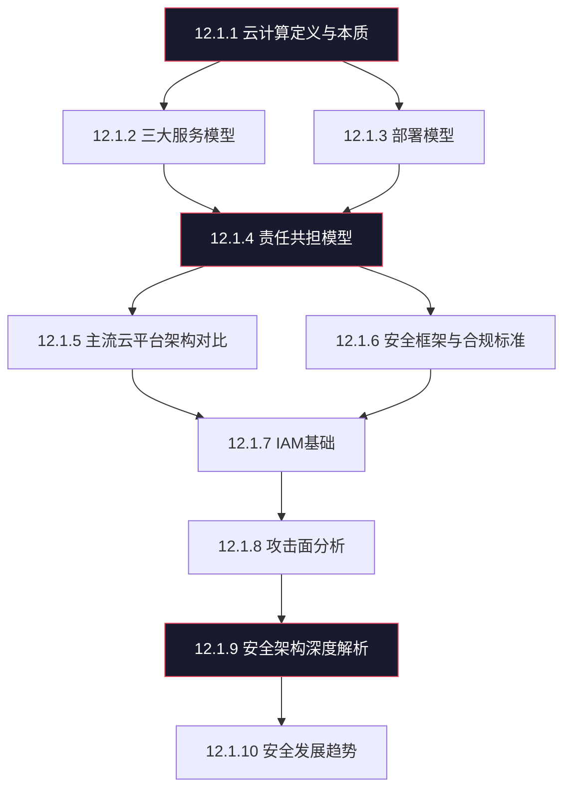
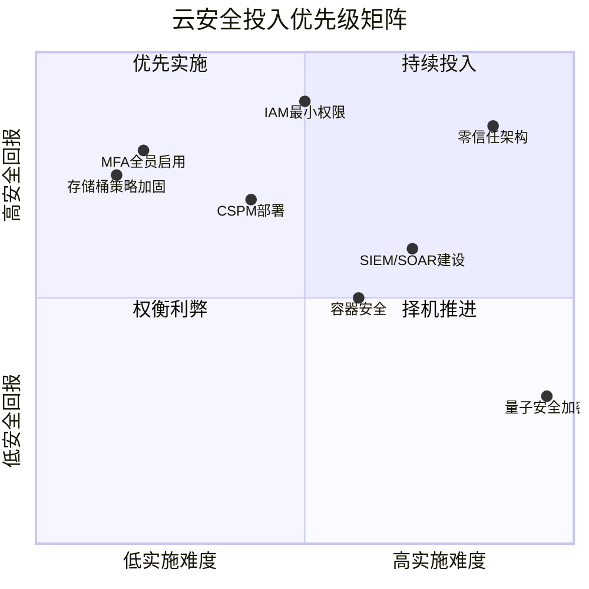

## 12.1.11 本节补充总结

本节（12.1）从云计算的定义出发，依次覆盖了服务模型、部署模型、责任共担模型、主流云平台架构、安全框架与合规标准、IAM基础、攻击面分析、安全架构深度解析、以及安全发展趋势共十个专题。作为整个理论基础部分的收尾，本节将从三个维度进行补充总结：一是梳理十个专题之间的逻辑关联，形成完整的知识图谱；二是补充前文未及展开的关键实践要点；三是为后续实战部分建立思维框架。

### 一、知识体系全景回顾

十个专题并非孤立存在，而是形成了一条从"认知"到"防御"再到"演进"的完整知识链：



**认知层（12.1.1-12.1.3）**：回答"什么是云、云有哪些形态"。定义与本质建立了云的基本认知，服务模型（IaaS/PaaS/SaaS）决定了技术栈的层次划分，部署模型（公有/私有/混合/社区）决定了数据和控制权的归属。这三者是后续一切安全讨论的前提——不理解多租户的资源池化本质，就无法理解为什么隔离机制如此关键；不清楚自己使用的是哪种服务模型，就无法确定自己的安全责任边界。

**责任层（12.1.4-12.1.6）**：回答"谁该保护什么、用什么标准衡量"。责任共担模型是整个云安全思维的基石——它精确划定了云服务商和用户在不同服务模型下的安全职责。主流云平台架构对比将抽象的责任模型映射到具体的 AWS、Azure、GCP、阿里云实现上。安全框架与合规则提供了衡量安全实践是否达标的标尺（CSA CCM、NIST、ISO 27017、等保2.0）。

**防御层（12.1.7-12.1.9）**：回答"如何保护、如何构建防御体系"。IAM是云安全的第一道防线——身份取代了网络边界成为新的信任锚点。攻击面分析从攻击者视角审视云环境的薄弱环节。安全架构深度解析则从防御者视角构建系统性的安全体系，涵盖零信任架构、安全设计模式、CSPM/CWPP/CASB等技术组件，以及合规框架的具体实施路径。

**演进层（12.1.10）**：回答"安全的未来方向"。云原生安全工具链的左移趋势、AI驱动的安全能力、多云/混合云带来的新挑战，这些都是安全从业者必须持续关注的方向。

### 二、十大专题核心要点速查

以下表格汇总了每个专题的核心结论，便于快速回顾和查阅：

| 专题 | 核心结论 | 安全从业者的行动要点 |
|------|----------|---------------------|
| 定义与本质 | 云计算是资源抽象化、服务化交付和规模经济效应的融合 | 理解抽象层（Hypervisor、容器运行时）本身就是攻击面 |
| 三大服务模型 | IaaS/PaaS/SaaS的用户控制权逐层递减，责任边界随之变化 | 根据服务模型确定自己的安全配置范围，不做假设 |
| 部署模型 | 公有云强调隔离，私有云强调控制，混合云强调一致性 | 混合云环境中身份联邦和统一策略管理是最大挑战 |
| 责任共担模型 | "上云不等于安全外包"，用户侧配置错误是首要事故原因 | 明确每个服务的责任分界线，建立配置基线和漂移检测 |
| 主流云平台 | AWS最全面、Azure企业集成最强、GCP数据/ML领先、阿里云国内合规最优 | 多云环境需要统一的安全管理层，避免工具碎片化 |
| 安全框架 | CSA CCM覆盖16个安全域，等保2.0有云扩展要求 | 选择与业务匹配的框架组合，合规是底线而非终点 |
| IAM基础 | 身份是云环境的新边界，最小权限原则是核心 | 启用MFA、使用角色而非长期密钥、定期审查权限 |
| 攻击面分析 | 身份/网络/数据/应用/配置五个层面均有暴露点 | 从攻击者视角定期做攻击面盘点，优先修复高危暴露 |
| 安全架构 | 零信任是理念，CSPM/CWPP/CASB是工具，成熟度分5级 | 评估当前成熟度等级，制定向L4演进的路线图 |
| 发展趋势 | 安全左移、AI驱动、多云统一管理 | 投资自动化能力建设，关注AI安全和供应链安全 |

### 三、补充关键实践要点

前文各节以理论框架为主，以下补充若干在实际云安全工作中极其重要但容易被忽视的实践细节。

#### 3.1 云安全事件的典型根因分布

理解"什么最常出问题"比理解"所有可能出问题的地方"更有实战价值。根据 Gartner、Verizon DBIR 以及主要云厂商的安全事件报告，云安全事件的根因分布大致如下：

| 根因类别 | 占比（估算） | 典型场景 |
|----------|-------------|----------|
| 配置错误 | 35%-40% | S3桶公开访问、安全组0.0.0.0/0放行、数据库公网暴露 |
| 凭证泄露/滥用 | 20%-25% | GitHub提交中泄露Access Key、钓鱼获取控制台密码、服务账号密钥硬编码 |
| 过度授权 | 10%-15% | IAM策略使用通配符*、未清理离职人员权限、角色信任关系过于宽泛 |
| 供应链/第三方 | 8%-12% | 容器镜像含已知漏洞、第三方SaaS集成过度授权、开源依赖漏洞 |
| 平台级漏洞 | 3%-5% | Hypervisor逃逸、云服务API漏洞、元数据服务未加固 |
| 内部威胁 | 5%-8% | 云管理员滥用权限、开发人员误操作、恶意内部人员数据外传 |

**关键洞察**：前两类（配置错误+凭证泄露）合计占比超过60%，这意味着大多数云安全事件并非源于高深的技术漏洞，而是基本的安全卫生问题。CSPM工具和IAM治理的投入回报率最高。

#### 3.2 云环境安全配置检查清单

在进入实战之前，以下是每个云环境都应满足的安全基线。这份清单可作为安全评估的快速参照：

**身份与访问**
- 所有特权账户启用MFA（包括根账户/全局管理员）
- 禁止使用根账户/全局管理员进行日常操作
- 服务账号使用角色绑定（AWS IAM Role、Azure Managed Identity）而非长期密钥
- 90天为周期审查权限，清理不再需要的授权
- 配置权限边界（Permission Boundary）防止权限意外膨胀

**网络安全**
- VPC/VNet子网划分清晰：公有子网仅放负载均衡器等入口组件
- 安全组/NSG遵循最小开放原则，禁止0.0.0.0/0开放高危端口（22、3389、3306等）
- 启用VPC Flow Logs / NSG Flow Logs并配置告警
- 生产环境与开发/测试环境网络隔离

**数据安全**
- 存储桶/对象存储默认禁止公开访问（启用S3 Block Public Access等）
- 数据库不直接暴露公网，通过堡垒机或私有端点访问
- 敏感数据加密存储（至少SSE-S3，推荐CMK级加密）
- 启用备份策略，定期验证备份可恢复性

**日志与监控**
- 控制台/API操作审计日志全部开启（CloudTrail、Azure Activity Log、GCP Audit Logs）
- 日志集中存储到独立账户/订阅，防止被攻击者删除
- 配置关键事件告警：根账户登录、IAM策略变更、安全组变更、大额资源创建
- 日志保留期不少于90天（合规要求通常为1-7年）

**容器与编排**
- 容器镜像扫描集成到CI/CD流水线
- Kubernetes集群API Server不暴露公网
- Pod安全策略/OPA Gatekeeper限制特权容器
- 容器运行时安全监控（Falco等工具）

#### 3.3 责任共担模型的常见认知误区

责任共担模型在理论上很清晰，但在实践中存在大量误解，这些误解直接导致安全盲区：

**误区一："SaaS产品不需要关心安全"**

事实：即使使用SaaS（如Microsoft 365、Salesforce），用户仍然负责数据分类与保护、用户访问管理（谁能看什么）、共享策略配置（链接是否对外公开）、以及第三方集成的安全审查。SaaS环境中的数据泄露事件，绝大多数源于用户侧的配置问题，而非SaaS平台自身的漏洞。

**误区二："IaaS的安全责任全部在用户"**

事实：IaaS用户确实需要管理OS以上的安全栈，但虚拟化层（Hypervisor）、物理基础设施、云管理平面的安全完全由云服务商负责。当发生如AWS S3元数据服务漏洞（CVE-2014-0160影响场景）或Azure虚拟机逃逸漏洞时，责任在云服务商侧。用户需要关注云厂商的安全公告，及时评估平台级漏洞对自己的影响。

**误区三："多云环境各管各的就行"**

事实：多云环境中，每个云的安全配置各自独立，最容易出现的是策略不一致——在AWS上严格限制的安全组规则，在GCP上可能被宽松的防火墙规则覆盖。跨云的统一身份管理（通过身份联邦如SAML/OIDC）、统一的策略管理（如Terraform + Policy as Code）、统一的安全监控是多云安全的三大支柱。

#### 3.4 从攻击者视角重新审视理论知识

作为网络安全从业者，理解理论的最终目的是更好地进行攻防。以下是将前述理论映射到攻击向量的速查表：

| 理论知识 | 攻击向量 | 利用方式 |
|----------|---------|----------|
| IaaS用户管理OS | 利用OS漏洞提权 | 漏洞容器/VM、弱SSH密码爆破 |
| PaaS用户管理应用 | 代码注入、API滥用 | SSRF访问元数据服务获取临时凭证 |
| 多租户资源共享 | 侧信道攻击 | CPU缓存时序攻击窃取加密密钥 |
| IAM策略语言 | 策略绕过 | 利用NotAction、Resource通配符扩大权限 |
| 元数据服务 | SSRF链式攻击 | 通过Web应用漏洞访问169.254.169.254获取IAM凭证 |
| 弹性伸缩 | 资源劫持 | 入侵账号后大量创建GPU实例挖矿 |
| 日志收集机制 | 日志干扰 | 修改系统时间、删除日志流、制造大量噪音日志掩盖攻击 |
| 跨账户共享 | 信任链攻击 | 利用过于宽泛的跨账户角色信任关系横向移动 |
| Serverless | 事件注入 | 通过S3事件、SQS消息触发恶意Lambda执行 |

这些攻击向量将在后续实战章节中逐一展开详细的技术分析和工具演示。

### 四、云安全成熟度自评框架

前文（12.1.9）介绍了云安全成熟度的五个级别。以下将其细化为可操作的自评维度，帮助读者准确定位自己组织（或目标客户）所处的水平：

| 评估维度 | L1-初始 | L2-基础 | L3-定义 | L4-管理 | L5-优化 |
|----------|---------|---------|---------|---------|---------|
| IAM治理 | 无策略管理，共享账号 | 基本IAM，部分MFA | 角色化管理，全量MFA | 条件访问+权限边界+定期审查 | JIT即时授权+UEBA异常检测 |
| 网络安全 | 默认安全组，无分段 | 基本VPC隔离 | 子网分段+安全组基线 | 微分段+服务网格 | 自适应策略+AI流量分析 |
| 数据保护 | 无加密，无分类 | 基本加密（默认密钥） | 数据分类+客户管理密钥 | DLP+令牌化+密钥轮换 | 自动化分类+同态加密 |
| 日志监控 | 无审计日志 | 控制台操作日志 | 全量API日志+集中存储 | 实时告警+SIEM集成 | UEBA+SOAR自动响应 |
| 配置管理 | 手动配置 | 基本的配置文档 | IaC模板化+CSPM | 配置漂移自动修复 | 策略即代码+自动合规 |
| 事件响应 | 无响应流程 | 基本的响应文档 | 定义的IR流程+演练 | SOAR编排+自动化剧本 | AI辅助响应+预测性防御 |

### 五、面向实战的思维框架

在进入下一节的实战内容之前，建立以下思维框架将帮助安全从业者更高效地开展工作：

**框架一：ATT&CK Cloud Matrix映射**

MITRE ATT&CK框架提供了专门针对云环境的攻击矩阵，覆盖11个战术阶段（从初始访问到影响），每个阶段都有对应的云特定技术。在进行云环境安全评估时，以ATT&CK Cloud Matrix为检查清单，确保覆盖所有攻击面：

```text
初始访问 → 执行 → 持久化 → 提权 → 防御逃逸 → 凭证访问 → 发现 → 横向移动 → 收集 → 数据外传 → 影响
   ↓         ↓        ↓        ↓         ↓          ↓         ↓        ↓          ↓        ↓         ↓
钓鱼/密钥  Lambda   角色篡改  策略提权  日志删除   MFA绕过   资源枚举  跨账户    S3导出   DNS隧道  加密勒索
泄露      注入     定时任务  元数据    无服务器   STS令牌   API探测   角色切换  RDS快照  HTTPS    资源删除
```

**框架二：攻击面生命周期管理**

云环境的攻击面是动态变化的——新资源创建带来新暴露点，旧资源下线但残留配置可能仍有效。攻击面管理应覆盖三个阶段：

1. **盘点**：持续发现所有云资产（包括影子IT和被遗忘的资源），建立资产清单
2. **评估**：将资产映射到攻击面（公网暴露、权限范围、数据敏感度），计算风险评分
3. **治理**：通过策略守卫（Policy Guardrails）持续防止新的风险暴露，通过修复流程消减存量风险

**框架三：安全投入的优先级矩阵**

安全资源有限，必须优先投入在回报最高的领域。以下矩阵将常见安全措施按"实施难度"和"安全回报"两个维度排列：



**优先级建议**：先做右上角（高回报+低难度）的项目——启用MFA、加固存储桶策略、实施IAM最小权限。这些措施可以在数天内完成，但能消除超过60%的常见攻击入口。然后再逐步推进CSPM部署、SIEM集成等中等投入项目。零信任架构作为长期目标持续演进。

### 六、推荐学习路径

对于希望系统性提升云安全能力的读者，以下是按能力阶段划分的学习路径：

**入门阶段（1-3个月）**
- 精通一个主流云平台的核心安全服务（推荐从AWS或Azure开始）
- 完成该平台的安全认证（AWS Security Specialty / Azure Security Engineer / GCP Professional Cloud Security Engineer）
- 掌握基本的IAM配置、网络安全组配置、日志审计配置
- 动手实验：搭建一个安全的三层架构（Web/App/DB），从零配置安全策略

**进阶阶段（3-6个月）**
- 深入理解零信任架构并能在目标环境中逐步实施
- 掌握CSPM/CWPP/CASB工具的部署和使用
- 学习IaC安全（Terraform + Checkov/tfsec）
- 学习容器安全（Docker + Kubernetes安全配置）
- 动手实验：对一个多服务的云原生应用进行完整的安全评估

**高级阶段（6-12个月）**
- 掌握多云环境的统一安全管理
- 能够设计和实施企业级云安全架构
- 熟悉主流合规框架（等保2.0、ISO 27017、SOC 2）的落地实施
- 具备云环境渗透测试能力
- 动手实验：使用Prowler、ScoutSuite、Pacu等工具对目标云环境进行安全评估

### 七、术语速查表

本节涉及的核心术语汇总如下，便于在后续学习中快速查阅：

| 术语 | 全称 | 含义 |
|------|------|------|
| CSPM | Cloud Security Posture Management | 云安全态势管理，持续监控云配置合规性 |
| CWPP | Cloud Workload Protection Platform | 云工作负载保护平台，保护VM/容器/Serverless |
| CASB | Cloud Access Security Broker | 云访问安全代理，用户与云服务间的安全控制点 |
| CIEM | Cloud Infrastructure Entitlement Management | 云基础设施权限管理，治理IAM过度授权 |
| PAM | Privileged Access Management | 特权访问管理，保护和审计高权限账号 |
| DLP | Data Loss Prevention | 数据防泄漏，检测和阻止敏感数据外传 |
| UEBA | User and Entity Behavior Analytics | 用户和实体行为分析，通过基线偏差检测异常 |
| SOAR | Security Orchestration, Automation and Response | 安全编排、自动化与响应 |
| IaC | Infrastructure as Code | 基础设施即代码，用代码定义和管理云资源 |
| BYOK | Bring Your Own Key | 自带密钥，用户自行管理加密密钥而非使用云商托管 |
| MFA | Multi-Factor Authentication | 多因素认证 |
| JIT | Just-In-Time Access | 即时访问，仅在需要时临时授予权限 |
| SCP | Service Control Policy | 服务控制策略（AWS），限制账户级别的最大权限 |
| VPC | Virtual Private Cloud | 虚拟私有云 |
| NSG | Network Security Group | 网络安全组（Azure） |

### 总结

本节系统地梳理了云安全理论基础的完整知识体系。核心结论可以浓缩为三句话：

1. **云安全的本质是责任管理**：理解责任共担模型、明确自己在不同服务模型下的安全职责，是所有云安全工作的起点。
2. **身份是云环境的安全核心**：零信任架构、IAM治理、最小权限原则——这些都指向同一个核心：在网络边界消失的时代，身份成为唯一的信任锚点。
3. **安全是一个持续演进的过程**：从L1到L5的成熟度阶梯没有捷径，但正确的优先级排序（先消除配置错误和凭证泄露等高频根因）可以事半功倍。

掌握这些理论基础后，下一节将进入云安全实战——我们将从云环境的信息收集和侦察开始，逐步深入到各类攻击技术和防御工具的具体操作。理论是地图，实战是行军。地图画好了，该出发了。
