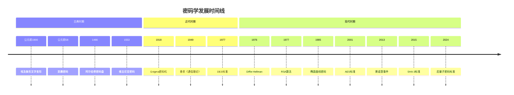
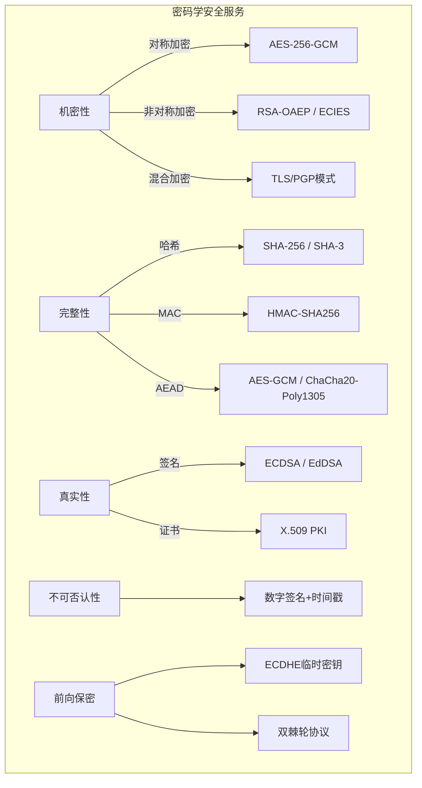
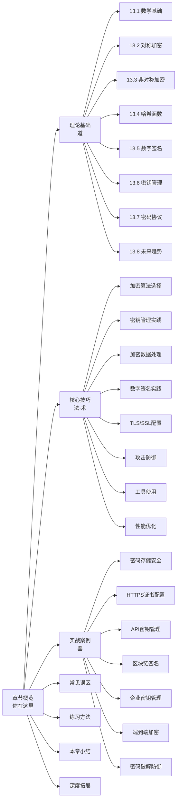

# 第13章 密码学

密码学（Cryptography）一词源自古希腊语 *kryptós*（隐藏）和 *gráphein*（书写），字面意思是"隐藏书写的艺术"。但现代密码学早已超越了"隐藏信息"这一单一功能——它是整个数字信任体系的数学根基。每一次HTTPS连接、每一笔区块链交易、每一封加密邮件、每一次生物特征验证的背后，都运行着密码学算法在默默工作。

本章将从数学原理出发，经由算法实现，落脚到工程实践，系统构建密码学的完整知识体系。无论你是安全工程师、后端开发者还是CTF竞赛选手，都能在本章找到从入门到精通的路径。

## 为什么每个安全从业者都必须懂密码学

密码学不是"选修课"，而是安全领域的"必修基础"。以下数据说明了这一点：

| 统计事实 | 数据来源 |
|----------|----------|
| 超过80%的Web安全漏洞与密码学误用直接相关 | OWASP Top 10 2021 |
| 2023年因弱加密或错误配置导致的数据泄露平均损失445万美元 | IBM《数据泄露成本报告》 |
| TLS 1.3全面弃用RSA密钥交换，转向前向保密方案 | RFC 8446 |
| NIST于2024年正式发布首批后量子密码标准（ML-KEM、ML-DSA、SLH-DSA） | NIST FIPS 203/204/205 |
| 全球超过95%的HTTPS流量使用AES-GCM或ChaCha20-Poly1305加密 | Google Transparency Report |

不懂密码学的安全从业者，就像不懂力学的建筑师——或许能盖房子，但不知道什么时候会塌。

## 密码学的历史演变：从隐写术到后量子时代

密码学的发展并非线性推进，而是在战争需求、数学突破和计算技术三股力量的交织中螺旋上升。

### 古典密码时期（公元前 — 20世纪初）

这一时期的核心思想是**替换**与**置换**，安全性完全依赖于算法的保密（即"隐蔽式安全"）。

**关键里程碑：**

- **公元前1900年 · 埃及象形文字变形**：已知最早的密码学实践，书吏使用非标准象形符号替代原始文字。
- **公元前58年 · 凯撒密码**：尤利乌斯·凯撒在军事通信中使用字母移位（偏移量3），这是单表替换密码的经典案例。安全性极低——仅有25种可能的密钥，暴力穷举即可破解。
- **1466年 · 阿尔伯蒂密码盘**：莱昂·巴蒂斯塔·阿尔伯蒂发明密码盘，首次引入**多表替换**的概念，在加密过程中切换不同的替换表。
- **1553年 · 维吉尼亚密码**：利用关键词控制多表替换，曾被称为"不可破译的密码"（le chiffre indéchiffrable）。直到1863年被弗里德里希·卡西斯基的频率分析方法攻破。
- **1918年 · 赫本密码（Hebern rotor machine）**：爱德华·赫本发明了第一台转子密码机，开启了机械密码时代。

**核心教训：** 古典密码的致命弱点在于**算法保密**模式——一旦算法泄露，安全性归零。现代密码学的基石原则是**柯克霍夫原则**（Kerckhoffs's Principle）：即使攻击者知道加密算法的所有细节（除密钥外），系统仍然安全。

### 近代密码时期（20世纪初 — 1970年代）

两次世界大战催生了密码学的第一次飞跃。机械/电子设备的引入使密码复杂度呈指数增长。

**关键里程碑：**

- **1918年 · Enigma密码机**：德国工程师亚瑟·谢尔比乌斯发明，使用3-4个转子实现多表替换，密钥空间达到约10^16。英国布莱切利园的阿兰·图灵团队设计了"Bombe"解密机，通过已知明文攻击和统计方法破解了Enigma，据估计将二战缩短了2-4年。
- **1949年 · 香农的《保密系统的通信理论》**：克劳德·香农发表了划时代论文，将密码学从经验学科提升为数学学科。他定义了**完善保密性**（Perfect Secrecy），证明了一次一密（OTP）是理论上不可破解的，同时证明了任何完善保密系统所需的密钥长度必须不小于明文长度。
- **1960s-70s · 数据加密标准（DES）的诞生**：IBM的Horst Feistel团队开发了Lucifer算法，经NSA修改后于1977年被NIST采纳为DES标准。DES使用56位密钥，其Feistel网络结构影响了后续数十种密码设计。

**核心教训：** 香农的理论贡献使密码学第一次拥有了可证明的安全性框架。但DES的故事也提醒我们：政府机构在密码标准制定中的角色始终充满争议（NSA将密钥从128位削弱到56位）。

### 现代密码时期（1970年代至今）

公钥密码学的诞生彻底改变了密码学的格局——从"如何安全共享密钥"到"不需要预先共享密钥"的范式转变。

**关键里程碑：**

- **1976年 · Diffie-Hellman密钥交换**：Whitfield Diffie和Martin Hellman发表了《密码学的新方向》，首次提出公钥密码学的概念，允许双方在不安全信道上协商共享密钥。同一时期，英国情报机构GCHQ的James Ellis、Malcolm Williamson也独立发现了类似原理，但被保密了27年。
- **1977年 · RSA算法**：Ron Rivest、Adi Shamir和Leonard Adleman提出了第一个实用的公钥加密和签名方案，基于大整数分解的困难性。RSA至今仍是使用最广泛的公钥算法之一。
- **1985年 · 椭圆曲线密码学（ECC）**：Neal Koblitz和Victor Miller分别独立提出将椭圆曲线用于密码学。ECC在相同安全级别下使用更短的密钥（256位ECC ≈ 3072位RSA），在移动和IoT设备上优势显著。
- **2001年 · AES标准发布**：比利时密码学家Joan Daemen和Vincent Rijmen设计的Rijndael算法击败其他14个候选算法，成为AES。AES使用128位分组和128/192/256位密钥，至今无有效攻击。
- **2013年 · 斯诺登事件**：Edward Snowden泄露的文件揭示NSA投入巨资削弱密码标准和实施大规模监控，推动了全球对密码学和隐私保护的重新审视。HTTPS普及率从2013年的约30%飙升至2024年的95%以上。
- **2015年 · SHA-3标准**：NIST选定Keccak算法作为SHA-3标准，采用与SHA-2完全不同的海绵结构（Sponge Construction），为哈希函数提供了安全多样性。
- **2024年 · 后量子密码标准**：NIST正式发布ML-KEM（基于格的密钥封装）、ML-DSA（基于格的数字签名）和SLH-DSA（基于哈希的签名），标志着后量子密码时代正式开启。

## 密码学的核心安全服务

现代密码学提供五大安全服务，它们相互配合，共同构建完整的安全体系。

### 机密性（Confidentiality）

确保信息只能被授权方读取，非授权方即使截获密文也无法获取明文内容。

**实现技术：**
- **对称加密**：AES-256-GCM、ChaCha20-Poly1305，适合加密大量数据，速度可达数GB/s
- **非对称加密**：RSA-OAEP、ECIES，适合加密密钥或少量数据，速度通常比对称加密慢100-1000倍
- **混合加密**：实际系统中普遍采用的模式——用非对称加密保护对称密钥，再用对称密钥加密数据。TLS、PGP、S/MIME都采用这种架构

**典型应用场景：** HTTPS通信中的数据加密、磁盘加密（BitLocker/LUKS）、端到端加密消息（Signal协议）

### 完整性（Integrity）

确保信息在传输或存储过程中未被篡改。即使1比特的改变也能被检测到。

**实现技术：**
- **哈希函数**：SHA-256、SHA-3、BLAKE3，将任意长度输入映射为固定长度摘要
- **消息认证码（MAC）**：HMAC-SHA256、CMAC，结合密钥和哈希提供带密钥的完整性保护
- **认证加密（AEAD）**：AES-GCM、ChaCha20-Poly1305，同时提供机密性和完整性

**典型应用场景：** 文件校验（sha256sum）、软件签名验证、API请求签名、区块链中的Merkle树

### 真实性（Authentication）

验证通信对方的身份确实是其声称的身份，防止身份冒充和中间人攻击。

**实现技术：**
- **数字签名**：RSA-PSS、ECDSA、EdDSA，用私钥签名、公钥验证
- **挑战-响应协议**：服务器发送随机挑战，客户端用密钥计算响应
- **证书体系**：X.509证书链，通过可信CA验证公钥归属

**典型应用场景：** TLS证书验证、SSH公钥认证、代码签名、JWT令牌验证

### 不可否认性（Non-repudiation）

确保消息的发送者事后无法否认其发送行为。这是数字签名独有的特性——只有持有私钥的人才能生成有效签名。

**实现技术：**
- **数字签名 + 时间戳**：签名证明身份，可信时间戳服务证明签名时间
- **区块链共识**：交易经全网共识确认后不可篡改

**典型应用场景：** 电子合同、电子发票、区块链交易、法律认可的电子证据

### 前向保密（Forward Secrecy / Perfect Forward Secrecy）

即使长期私钥未来被泄露，历史通信的机密性仍然受到保护。这是现代密码协议的关键设计目标。

**实现技术：**
- **Ephemeral Diffie-Hellman（DHE/ECDHE）**：每次会话生成临时密钥对，会话结束后销毁
- **Signal协议的双棘轮机制**：每条消息使用不同的密钥，实现细粒度的前向保密

**典型应用场景：** TLS 1.3（强制使用ECDHE）、Signal/WhatsApp端到端加密

## 密码算法分类全景

理解密码学的算法体系，需要从多个维度进行分类。以下表格提供了完整的分类视图：

| 维度 | 分类 | 典型算法 | 核心特征 | 适用场景 |
|------|------|----------|----------|----------|
| **密钥类型** | 对称加密 | AES、ChaCha20、3DES | 加解密使用相同密钥，速度快 | 大量数据加密 |
| | 非对称加密 | RSA、ECC、ElGamal | 公钥加密/私钥解密，速度慢 | 密钥交换、数字签名 |
| **操作对象** | 分组密码 | AES、Blowfish、Twofish | 固定长度块（64/128位）加密 | 磁盘加密、数据库加密 |
| | 流密码 | ChaCha20、RC4（已弃用） | 逐位/逐字节加密 | 实时通信、嵌入式设备 |
| **功能** | 加密算法 | AES、RSA | 提供机密性 | 数据保护 |
| | 哈希函数 | SHA-256、SHA-3、BLAKE3 | 单向不可逆，固定长度输出 | 完整性校验、密码存储 |
| | 消息认证码 | HMAC、CMAC、GMAC | 带密钥的完整性验证 | API签名、会话令牌 |
| | 数字签名 | ECDSA、EdDSA、RSA-PSS | 身份认证+不可否认 | 证书、代码签名、区块链 |
| | 密钥交换 | DH、ECDH、X25519 | 不安全信道上协商共享密钥 | TLS握手、VPN |
| | 密钥派生 | PBKDF2、scrypt、Argon2 | 从密码派生加密密钥 | 密码存储、密钥生成 |
| **安全假设** | 大整数分解困难 | RSA | n=p×q的分解困难性 | 通用加密/签名 |
| | 离散对数困难 | DH、DSA | 有限域上离散对数困难 | 密钥交换、签名 |
| | 椭圆曲线离散对数困难 | ECDH、ECDSA | 椭圆曲线上离散对数困难 | 高效密钥交换/签名 |
| | 格问题困难 | ML-KEM、ML-DSA | 最短向量/最近向量问题 | 后量子密码 |

## 密码学在网络安全中的应用版图

密码学不是孤立存在的——它是整个网络安全体系的"原子层"。以下按领域梳理密码学的应用全景：

### 网络通信安全

| 协议/技术 | 密码学组件 | 保护层级 | 关键细节 |
|-----------|-----------|----------|----------|
| **TLS 1.3** | ECDHE + AES-256-GCM + SHA-384 + Ed25519 | 传输层 | 强制前向保密，移除RSA密钥交换和静态DH |
| **IPSec** | IKEv2 + ESP (AES-GCM) | 网络层 | VPN隧道加密，支持传输模式和隧道模式 |
| **SSH** | X25519 + ChaCha20-Poly1305 + Ed25519 | 应用层 | 安全远程登录，支持公钥和证书认证 |
| **Signal协议** | X3DH + Double Ratchet + AES-256-CBC + HMAC-SHA256 | 端到端 | 前向保密+后向保密，被WhatsApp/Signal采用 |
| **WireGuard** | Noise协议 + Curve25519 + ChaCha20-Poly1305 + BLAKE2s | 网络层 | 极简设计，约4000行代码，已合入Linux内核 |
| **DNS over HTTPS (DoH)** | 复用HTTPS (TLS 1.3) | 应用层 | 加密DNS查询，防止DNS劫持和监听 |

### 身份认证与授权

- **X.509证书体系**：浏览器信任的CA根证书 → 中间CA → 服务器证书，形成信任链。Let's Encrypt通过ACME协议实现证书自动签发和续期
- **OAuth 2.0 / OpenID Connect**：JWT令牌使用RS256/ES256签名，防止令牌伪造
- **FIDO2/WebAuthn**：基于公钥密码的无密码认证，私钥存储在安全硬件（YubiKey、TPM）中
- **Kerberos**：使用对称加密（AES）实现票据认证，Active Directory的核心认证协议

### 数据存储安全

- **磁盘加密**：BitLocker（Windows）、LUKS（Linux）、FileVault（macOS），使用AES-XTS模式
- **数据库加密**：透明数据加密（TDE）使用AES-256，列级加密保护敏感字段
- **密钥管理**：AWS KMS、HashiCorp Vault、Google Cloud KMS，使用信封加密（Envelope Encryption）模式——主密钥加密数据密钥，数据密钥加密实际数据

### 区块链与加密货币

- **比特币**：ECDSA（secp256k1曲线）签名交易，SHA-256双哈希生成区块哈希，RIPEMD-160生成地址
- **以太坊**：ECDSA签名 + Keccak-256哈希（注意：以太坊的Keccak-256与NIST SHA-3不同，使用的是原始Keccak提交版本）
- **零知识证明**：Zcash使用zk-SNARKs实现交易隐私，证明交易有效性而不泄露金额和地址

### 代码与软件供应链安全

- **代码签名**：开发者使用私钥签名可执行文件，操作系统验证签名防止篡改
- **SBOM + 签名**：Sigstore/Cosign对容器镜像签名，确保供应链安全
- **Secure Boot**：UEFI固件验证启动链每个环节的签名

## 本章知识体系与学习路径

本章按照"道→法→术→器"的递进逻辑组织内容，共分为6个主要板块：

### 各板块定位与学习建议

| 板块 | 定位 | 适合读者 | 学习方式 |
|------|------|----------|----------|
| **理论基础** | 道——理解"为什么" | 所有层级 | 精读，理解数学原理，为后续实践打基础 |
| **核心技巧** | 法与术——掌握"怎么做" | 中级+ | 边学边练，对照代码示例动手实现 |
| **实战案例** | 器——解决"具体问题" | 中高级 | 在隔离环境中复现，修改参数观察变化 |
| **常见误区** | 避坑——识别"陷阱" | 所有层级 | 对照自查，检查自己项目是否存在类似问题 |
| **练习方法** | 提升——形成"肌肉记忆" | 所有层级 | 按建议完成练习，参加CTF密码学方向挑战 |
| **深度拓展** | 进阶——面向"前沿" | 高级 | 选择感兴趣的方向深入研究 |

### 学习路径推荐

**入门路径（4-6周）：**
章节概览 → 理论基础（数学基础 + 对称加密 + 哈希函数） → 核心技巧（加密算法选择 + 工具使用） → 实战案例（密码存储安全） → 常见误区

**进阶路径（6-8周）：**
在入门路径基础上 → 理论基础（非对称加密 + 数字签名 + 密钥管理） → 核心技巧（TLS配置 + 攻击防御 + 性能优化） → 实战案例（HTTPS证书 + API密钥管理 + 端到端加密）

**专家路径（8-12周）：**
完成进阶路径 → 理论基础（密码协议 + 未来趋势） → 核心技巧（密钥管理实践 + 数字签名实践 + 加密数据处理） → 实战案例（区块链签名 + 企业密钥管理 + 密码破解防御） → 深度拓展

## 学习建议：从"知道"到"会用"到"用对"

密码学的学习存在一个独特的"能力陷阱"——它看起来容易理解，但在实践中极易出错。以下建议基于大量真实安全事件的教训：

### 第一层：理解原理（不要跳过数学）

密码学的每一个设计决策都有严格的数学推导。不理解原理就直接使用工具，就像不理解药理就给病人开药——大多数时候可能没问题，但出错时后果严重。

**具体建议：**
- 至少理解模运算、质数、欧拉函数这三个数论概念
- 理解"计算困难性"的含义——为什么某些数学问题即使有解也计算不出来
- 不需要成为数学家，但需要理解"为什么RSA安全"而不只是"RSA怎么用"

### 第二层：实践出真知（在隔离环境中动手）

**推荐实践平台：**
- **CryptoHack**（cryptohack.org）：免费的密码学交互式学习平台，从基础到高级，覆盖RSA、ECC、AES等核心算法
- **Cryptopals**（cryptopals.com）：Matasano密码学挑战，48个实践练习，被认为是密码学实践的黄金标准
- **CTFtime**（ctftime.org）：密码学方向的CTF竞赛，真实场景的密码学攻防
- **SageMath**：开源数学软件，可以快速实现和验证密码学算法

### 第三层：避免"自信陷阱"

密码学最大的敌人不是数学难题，而是开发者的过度自信。以下是最常见的错误心态及纠正：

| 错误心态 | 纠正方法 |
|----------|----------|
| "我自己设计了一个加密算法" | 永远使用经过同行评审的标准算法，不要自己发明 |
| "我已经加密了，所以是安全的" | 加密只是安全的一部分，还需要完整性、认证、前向保密 |
| "MD5/SHA-1还能用吧" | 不能。MD5可在秒级碰撞，SHA-1已在2017年被实际碰撞 |
| "我用Base64编码了数据" | Base64是编码，不是加密，任何人可逆 |
| "密钥硬编码在代码里没关系" | 每年数以万计的泄露事件源于此，使用环境变量或密钥管理服务 |

## 本章学习目标

完成本章全部内容后，读者将能够：

1. **理论层面**：解释对称加密、非对称加密、哈希函数和数字签名的数学原理及安全性基础
2. **选型层面**：根据安全需求、性能约束和兼容性要求，选择合适的密码算法和参数（密钥长度、工作模式、填充方案）
3. **实现层面**：使用Python/OpenSSL等工具正确实现加密、解密、签名、验证等操作，避免常见的实现陷阱
4. **防御层面**：识别和防御针对密码系统的攻击方式（侧信道攻击、填充预言攻击、时序攻击等）
5. **架构层面**：设计包含密钥管理、证书管理、密钥轮换的完整密码学方案
6. **前沿层面**：了解后量子密码、同态加密、零知识证明等前沿技术的发展现状和应用场景

---

> ⚠️ **安全警告与免责声明**
>
> 本章内容仅供**合法的安全测试与教育目的**使用。所有技术、工具和方法的讨论均旨在帮助安全从业者在**获得明确授权**的前提下进行防御性安全研究。
>
> - 🚫 **未经授权**对任何系统、网络或应用进行安全测试是**违法行为**
> - ✅ 所有实践活动应在**隔离的实验环境**中进行（如虚拟机、CTF平台）
> - ✅ 遵守所在国家和地区的**网络安全法律法规**
> - ✅ 遵循**负责任的漏洞披露**原则
>
> 作者不对因滥用本章内容造成的任何后果承担责任。
