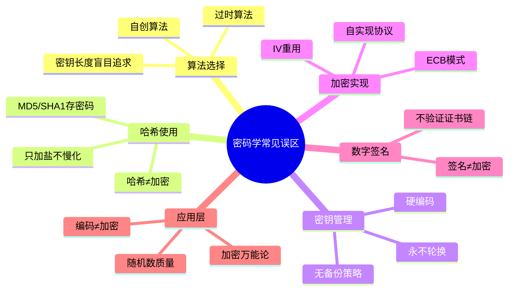
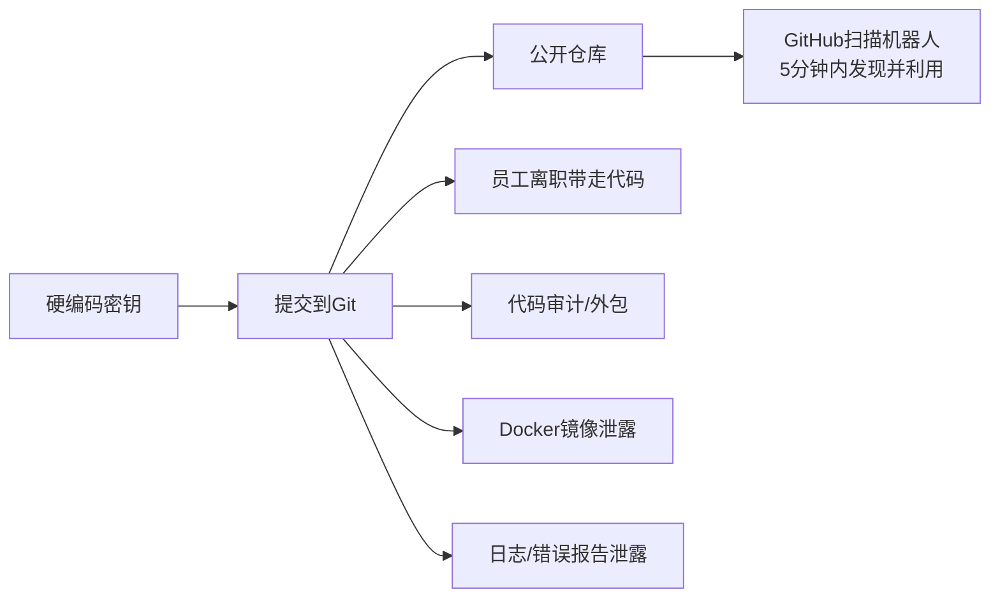
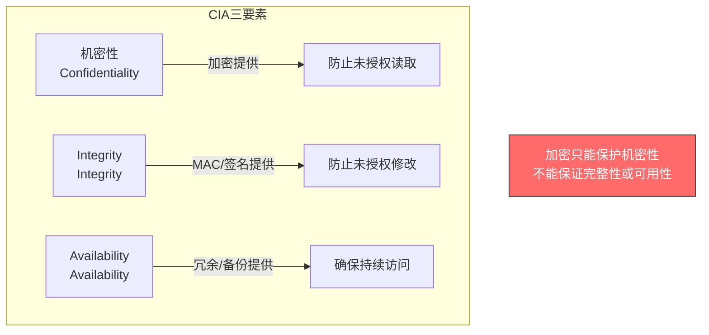
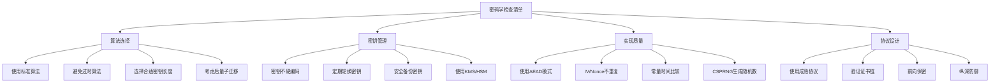

# 第13章 密码学 - 常见误区

密码学是信息安全的基石，但也是最容易被误解和误用的领域。大量安全漏洞并非源于算法本身的弱点，而是源于开发者对密码学概念的误解、错误的实现方式或不当的密钥管理。本章系统梳理密码学中最常见的误区，从算法选择、哈希使用、密钥管理、加密实现、数字签名、协议设计到应用层，逐一剖析错误认知的根源，并给出经过验证的正确做法。

每个误区都遵循统一结构：**错误认知 → 为什么错 → 真实案例 → 正确做法 → 代码示例**，确保不仅知道"不能做什么"，更理解"为什么不能"以及"应该怎么做"。



## 13.1 算法选择的误区

算法选择是密码系统设计的第一步，也是误区最集中的环节。选错算法意味着整个系统的安全基础从一开始就是脆弱的。

### 13.1.1 误区一：自创加密算法更安全

**错误认知**

许多开发者认为自己设计的加密算法比公开算法更安全，因为攻击者不知道算法细节。这种"隐匿即安全"（Security through Obscurity）的思维在工程领域根深蒂固。

**为什么这是错的**

这一认知违背了密码学的基本原则——**柯克霍夫原则**（Kerckhoffs's Principle），由19世纪荷兰密码学家Auguste Kerckhoffs于1883年提出：**一个密码系统的安全性应该完全依赖于密钥的保密性，而不是算法的保密性。**

原因如下：

| 维度 | 自创算法 | 公开标准算法 |
|------|---------|-------------|
| 审查程度 | 作者自行测试，盲区极多 | 全球密码学家数十年审查 |
| 密码分析 | 未经差分分析、线性分析等系统方法检验 | 已通过所有已知攻击方法的考验 |
| 实现审计 | 通常只有内部团队 | 开源实现有数百万双眼睛盯着 |
| 已知漏洞 | 未知——这才是最危险的 | 已知漏洞有明确的缓解措施 |
| 合规性 | 无法通过任何安全认证 | NIST/FIPS等权威认证 |

**真实案例**

- **CSS（Content Scramble System）**：DVD加密系统，设计简陋，40位密钥，被DVD Jon在1999年用逆向工程破解，整个DVD保护体系崩溃。
- **WEP协议**：1999年WiFi联盟推出的加密协议，设计存在根本性缺陷，2001年即被完全破解，密钥可在几分钟内恢复。
- **Crypto1算法**：Mifare Classic门禁卡使用的自创加密算法，2008年被荷兰研究团队破解，全球数亿张门禁卡暴露在风险中。
- **KeeLoq**：汽车遥控钥匙使用的自创加密算法，2008年被破解，影响数百万辆汽车的门锁安全。

**正确做法**

始终使用经过广泛审查的标准算法。以下是截至2025年的推荐算法：

| 用途 | 推荐算法 | 避免使用 |
|------|---------|---------|
| 对称加密 | AES-256-GCM, ChaCha20-Poly1305 | DES, 3DES, RC4, Blowfish |
| 非对称加密 | RSA-3072+, Ed25519, X25519 | RSA-1024, DSA-1024 |
| 哈希函数 | SHA-256, SHA-3, BLAKE3 | MD5, SHA-1 |
| 密码哈希 | Argon2id, bcrypt, scrypt | SHA-256(plain), MD5 |
| 密钥交换 | X25519, ECDH P-384 | RSA密钥交换, DH-1024 |
| 数字签名 | Ed25519, ECDSA P-256+, RSA-PSS | RSA PKCS#1 v1.5, DSA |

### 13.1.2 误区二：使用DES或3DES仍然安全

**错误认知**

一些遗留系统仍在使用DES或3DES，认为"加密总比不加密好"，或者"系统运行这么久也没出过问题"。

**为什么这是错的**

- **DES**：1977年NIST标准，密钥长度仅56位。1998年EFF的"Deep Crack"机器用56小时暴力破解DES密钥；到2006年，Copacabana项目的FPGA集群可在不到一周内穷举全部2^56个密钥。现代GPU集群可在**数小时内**完成穷举。
- **3DES**：虽然使用三个56位密钥（有效112位安全性），但存在致命的**Sweet32攻击**（CVE-2016-2183）——当加密数据量达到约32GB时，64位块大小会导致碰撞，攻击者可恢复明文。NIST已于**2023年底**正式撤销3DES。

**时间线**：

```text
1977  DES成为NIST标准
1998  Deep Crack在56小时内破解DES
1999  DES被AES竞赛取代
2001  AES（Rijndael）成为新标准
2016  Sweet32攻击公开
2017  NIST发布SP 800-131A，禁止DES
2023  NIST正式撤销3DES
```

**正确做法**

```python
# 迁移示例：从3DES到AES-256-GCM
from cryptography.hazmat.primitives.ciphers.aead import AESGCM
import os

# 新系统使用AES-256-GCM
key = AESGCM.generate_key(bit_length=256)
aesgcm = AESGCM(key)
nonce = os.urandom(12)  # GCM推荐12字节nonce

ciphertext = aesgcm.encrypt(nonce, plaintext, associated_data)
# associated_data用于认证但不加密的附加数据（如包头）

# 解密时自动验证完整性
plaintext = aesgcm.decrypt(nonce, ciphertext, associated_data)
```

对于无法立即迁移的遗留系统，至少实施以下缓解措施：

1. 限制单次会话的加密数据量（Sweet32攻击需要大量数据）
2. 计划迁移路线图，设定明确的退役日期
3. 在TLS配置中禁用3DES密码套件

### 13.1.3 误区三：RSA密钥长度越长越好

**错误认知**

认为RSA密钥长度应该尽可能长（如8192位或16384位）以获得"最高安全性"。

**为什么这是错的**

RSA密钥长度与安全性和性能的关系并非线性的：

| RSA密钥长度 | 等效对称密钥安全性 | 签名速度（相对） | 推荐场景 |
|------------|-------------------|-----------------|---------|
| 2048位 | 112位 | 1.0x（基准） | 当前标准，可用至2030年 |
| 3072位 | 128位 | 0.35x | 长期保护（2030年后） |
| 4096位 | 140位 | 0.15x | 高敏感数据 |
| 8192位 | ~170位 | 0.02x | 理论上安全但极慢 |
| 16384位 | ~200位 | <0.005x | 几乎不可用 |

密钥长度翻倍，RSA运算时间增加约6-8倍（因为大数分解的复杂度是亚指数级的）。16384位RSA的签名操作可能需要数秒，对Web服务器来说完全不可接受。

**正确做法**

对于相同安全级别，**ECC（椭圆曲线密码学）** 密钥更短、性能更好：

```text
RSA-3072  ≈  ECC P-256  ≈  128位安全性
  密钥大小: 3072位        密钥大小: 256位
  签名: 较慢              签名: 快10倍以上
```

推荐选择：
- **短期安全**：RSA-2048 或 Ed25519
- **长期安全**：RSA-3072 或 Ed25519
- **高敏感场景**：RSA-4096 或 Ed448
- **优先选择**：Ed25519（签名）、X25519（密钥交换）——性能优异且实现安全

### 13.1.4 误区四：忽视后量子密码学

**错误认知**

认为量子计算机还很遥远，当前不需要考虑后量子密码学（Post-Quantum Cryptography, PQC）。

**为什么这是错的**

- **"先收集，后解密"（Harvest Now, Decrypt Later）攻击**：攻击者现在截获并存储加密数据，等量子计算机成熟后再解密。对于需要保密20年以上的数据（国家机密、医疗记录、金融数据），这已经是现实威胁。
- **量子计算进展**：Google的Willow（2024）在特定问题上展示了超越经典计算机的能力。虽然通用密码破解的量子计算机尚未出现，但NIST已经在2024年发布了首批后量子密码标准。
- **迁移时间**：大规模密码迁移通常需要5-15年。如果等到量子计算机出现再迁移，为时已晚。

**NIST后量子密码标准（2024年8月发布）**：

| 标准 | 算法 | 用途 | 密钥/密文大小 |
|------|------|------|-------------|
| FIPS 203 | ML-KEM (Kyber) | 密钥封装 | 公钥~1.5KB，密文~1.1KB |
| FIPS 204 | ML-DSA (Dilithium) | 数字签名 | 公钥~2.6KB，签名~4.6KB |
| FIPS 205 | SLH-DSA (SPHINCS+) | 数字签名（无状态哈希） | 签名~7-49KB |

**正确做法**：

1. **立即**：评估当前密码资产，识别哪些数据需要长期保护
2. **近期**：测试PQC算法与现有系统的兼容性
3. **中期**：实施混合方案（经典+PQC并行），如TLS 1.3的`X25519Kyber768`密钥交换
4. **长期**：全面迁移到PQC标准

## 13.2 哈希函数使用的误区

哈希函数是密码学中使用最广泛的原语之一，但也是被滥用最严重的工具。

### 13.2.1 误区五：使用MD5/SHA1存储密码

**错误认知**

认为MD5或SHA1是"哈希函数"，因此适合存储密码。"数据已经哈希了，又不是明文存储，应该安全了吧？"

**为什么这是错的**

密码存储场景对哈希函数的要求与数据完整性验证完全不同：

| 特性 | 数据完整性（如文件校验） | 密码存储 |
|------|------------------------|---------|
| 计算速度 | 越快越好 | 越慢越好（抵抗暴力破解） |
| 硬件加速 | 欢迎GPU/ASIC加速 | 应该抵制专用硬件 |
| 并行化 | 高度并行更好 | 串行化更好 |
| 输出长度 | 固定长度 | 越长越好 |
| 盐值 | 不需要 | 必须使用 |

MD5和SHA1都是为**快速计算**设计的，这恰恰是密码存储场景最不需要的特性。一块现代GPU每秒可以计算数十亿次MD5哈希——这意味着整个英文词典（约60万个单词）的MD5哈希可以在毫秒级完成。

**真实攻击场景**：

```bash
# 使用hashcat在RTX 4090上的破解速度
# MD5: ~164 GH/s (每秒1640亿次哈希)
# SHA1: ~26 GH/s
# SHA256: ~22 GH/s
# bcrypt (cost=10): ~184 kH/s
# Argon2id: ~10 kH/s

# 结论：MD5比bcrypt快近100万倍，这正是攻击者想要的
```

**正确做法**

```python
# 错误 ❌
import hashlib
stored = hashlib.md5(password.encode()).hexdigest()

# 错误 ❌ 即使加了盐也不行
stored = hashlib.sha256(salt + password.encode()).hexdigest()

# 正确 ✓ 使用专用密码哈希函数
from argon2 import PasswordHasher
ph = PasswordHasher(
    time_cost=3,        # 迭代次数
    memory_cost=65536,   # 64MB内存开销
    parallelism=4,       # 4个并行线程
    hash_len=32,         # 输出32字节
    salt_len=16          # 16字节盐值
)
stored = ph.hash(password)

# 验证密码
try:
    ph.verify(stored, password)
    # 密码正确，检查是否需要重新哈希（参数已更新）
    if ph.check_needs_rehash(stored):
        stored = ph.hash(password)  # 用新参数重新哈希
except argon2.exceptions.VerifyMismatchError:
    # 密码错误
    pass
```

**各密码哈希函数对比**：

| 算法 | 时间成本 | 内存成本 | 抗GPU | 推荐度 | 说明 |
|------|---------|---------|-------|-------|------|
| Argon2id | 可调 | 可调（可高达数GB） | ★★★★★ | 首选 | 2015年密码哈希竞赛冠军 |
| bcrypt | 可调 | 固定4KB | ★★★☆☆ | 通用 | 广泛支持，久经考验 |
| scrypt | 可调 | 可调 | ★★★★☆ | 备选 | 内存硬函数 |
| PBKDF2 | 可调 | 无 | ★☆☆☆☆ | 最低 | NIST推荐但不抗GPU |

### 13.2.2 误区六：加盐哈希就足够安全

**错误认知**

"我已经给密码加了盐并使用SHA256哈希，应该安全了吧？"

**为什么这是错的**

盐值（Salt）的作用是**防止彩虹表攻击**——确保相同密码在不同用户处产生不同的哈希值。但盐值**不能**防止针对单个密码的暴力破解或字典攻击。

攻击模型：

```text
彩虹表攻击（盐值能防御）:
  攻击者: 预计算 [password1 → hash1, password2 → hash2, ...]
  然后: 在数据库中查找匹配的哈希
  盐值的防御: 每个用户的盐不同，预计算表失效 ✓

暴力破解（盐值不能防御）:
  攻击者: 拿到某个用户的 [salt, hash]
  然后: 尝试 salt + "123456" → SHA256 → 与hash比较
        尝试 salt + "password" → SHA256 → 与hash比较
        ...每秒数十亿次尝试
  盐值的防御: 无法阻止 ✗
```

**正确做法**：盐值 + 慢化哈希，两者缺一不可：

```python
# 错误 ❌ 加盐SHA256——快速哈希，GPU可暴力破解
import hashlib, os
salt = os.urandom(16)
stored = salt.hex() + ":" + hashlib.sha256(salt + password.encode()).hexdigest()

# 正确 ✓ 加盐+慢化（Argon2内部自动处理盐值）
from argon2 import PasswordHasher
ph = PasswordHasher()
stored = ph.hash(password)
# 输出格式: $argon2id$v=19$m=65536,t=3,p=4$<salt>$<hash>
# 盐值已自动嵌入，无需手动管理
```

### 13.2.3 误区七：哈希等于加密

**错误认知**

混淆哈希和加密的概念，将哈希称为"单向加密"，或将加密称为"双向哈希"。这种概念混淆会导致严重的安全设计错误。

**本质区别**：

| 特性 | 哈希（Hash） | 加密（Encryption） |
|------|-------------|-------------------|
| 方向性 | 单向，不可逆 | 双向，可解密 |
| 输入 | 任意长度数据 | 任意长度数据 |
| 输出 | 固定长度摘要 | 与输入等长（或更长）的密文 |
| 密钥 | 无（纯函数） | 必须有密钥 |
| 目的 | 完整性验证、指纹 | 机密性保护 |
| 碰撞 | 理论上存在（生日攻击） | 不适用 |

**概念混淆导致的典型错误**：

1. **用哈希"加密"数据库字段**：以为哈希了就安全了，实际上无法解密恢复数据（如果需要恢复的话），且快速哈希可被暴力破解
2. **用加密代替哈希存储密码**：密码应该用哈希存储（不可逆），用加密存储意味着数据库泄露时攻击者可以直接解密所有密码
3. **用哈希进行消息认证**：`H(message || key)` 不安全（长度扩展攻击），应该用HMAC

```python
# 错误 ❌ 哈希密钥验证（长度扩展攻击）
def verify_token(token, data, secret):
    return hashlib.sha256(data + secret).hexdigest() == token
# 攻击者可以在不知道secret的情况下，在data后面追加内容并计算有效哈希

# 正确 ✓ 使用HMAC
import hmac, hashlib
def create_token(data, secret):
    return hmac.new(secret.encode(), data.encode(), hashlib.sha256).hexdigest()

def verify_token(token, data, secret):
    expected = create_token(data, secret)
    return hmac.compare_digest(expected, token)  # 常量时间比较
```

## 13.3 密钥管理的误区

密码学中有一句话："密钥管理是最困难的问题。" 实际上，大多数密码系统的失败不是因为算法被破解，而是因为密钥管理不当。

### 13.3.1 误区八：密钥硬编码在代码中

**错误认知**

将API密钥、加密密钥、数据库密码等直接写在源代码中，认为"反正代码是私有的"或"先这样，以后再改"。

**真实泄露途径**：



GitHub上有大量自动化机器人持续扫描新提交的代码，搜索AWS密钥、API Token等敏感信息。密钥一旦提交到公开仓库，平均**5分钟内**就会被发现并尝试利用。

**真实案例**：
- 2019年，北卡罗来纳州立大学研究人员在GitHub上发现了超过10万个有效云服务密钥
- 2021年，Toyota承认一个第三方承包商将源代码（含密钥）意外发布到GitHub，导致30万客户信息泄露
- Uber 2016年数据泄露：攻击者在GitHub上发现Uber员工提交的AWS密钥，获取了5700万用户数据

**正确做法**：

```python
# 方案1：环境变量
import os
api_key = os.environ["API_KEY"]

# 方案2：.env文件（.gitignore必须包含.env）
from dotenv import load_dotenv
load_dotenv()
api_key = os.getenv("API_KEY")

# 方案3：密钥管理服务（生产环境推荐）
# AWS Secrets Manager
import boto3
client = boto3.client('secretsmanager')
secret = client.get_secret_value(SecretId='prod/db/password')

# HashiCorp Vault
import hvac
client = hvac.Client(url='https://vault.example.com:8200')
secret = client.secrets.kv.read_secret_version(path='myapp/db')
```

**Git历史清理**（如果密钥已提交）：

```bash
# 使用git-filter-repo清除历史中的密钥
pip install git-filter-repo
git filter-repo --path-glob '**/*.py' --replace-text <(echo 'OLD_API_KEY==>REDACTED')

# 更简单的方案：使用BFG Repo-Cleaner
java -jar bfg.jar --replace-text secrets.txt my-repo.git

# 无论用哪种方案，都必须：
# 1. 立即撤销已泄露的密钥
# 2. 生成新的密钥
# 3. 强制推送清理后的历史
# 4. 通知所有协作者重新克隆仓库
```

### 13.3.2 误区九：密钥永不更换

**错误认知**

认为生成密钥后可以永久使用，密钥轮换"太麻烦"或"有风险"。

**为什么这是错的**

- **泄露检测延迟**：数据泄露的平均检测时间是197天（IBM 2023年数据）。密钥可能已经泄露但你还不知道。
- **加密数据量**：同一密钥加密的数据量越大，密码分析（如统计攻击）的机会越多。
- **合规要求**：PCI DSS要求加密密钥至少每年轮换一次；NIST SP 800-57建议对称密钥使用不超过2年。
- **纵深防御**：密钥轮换限制了单次泄露的影响范围。

**正确做法**：

```python
# 密钥轮换架构（支持无缝切换）
class KeyManager:
    def __init__(self, key_store):
        self.key_store = key_store
    
    def get_current_key(self):
        """获取当前加密密钥"""
        return self.key_store.get_latest_key()
    
    def get_decryption_key(self, key_id):
        """获取指定版本的解密密钥（支持旧密钥解密）"""
        return self.key_store.get_key(key_id)
    
    def rotate(self):
        """轮换密钥：生成新密钥，旧密钥保留用于解密"""
        new_key = self.generate_key()
        self.key_store.add_key(new_key)
        self.key_store.set_current(new_key.id)
        # 旧密钥不删除，已有数据仍需用它解密
    
    def encrypt(self, plaintext):
        key = self.get_current_key()
        ciphertext = encrypt(key, plaintext)
        return {"data": ciphertext, "key_id": key.id}
    
    def decrypt(self, encrypted):
        key = self.get_decryption_key(encrypted["key_id"])
        return decrypt(key, encrypted["data"])
```

**密钥轮换策略**：

| 密钥类型 | 推荐轮换周期 | 说明 |
|---------|------------|------|
| TLS证书 | 90天-1年 | Let's Encrypt默认90天 |
| API密钥 | 90天 | 或员工离职时立即撤销 |
| 数据加密密钥 | 1年 | 或加密数据量达到阈值 |
| 密码哈希盐值 | 不轮换 | 每个密码使用独立盐值 |
| JWT签名密钥 | 24小时-7天 | 短期密钥+自动轮换 |

### 13.3.3 误区十：备份密钥不重要

**错误认知**

只关注密钥的安全存储，忽视密钥备份。"我们的密钥存储在HSM/云KMS里，不需要备份。"

**为什么这是错的**

密钥丢失 = 数据永久丢失。这不是理论风险：

- **QuadrigaCX事件（2019年）**：加拿大加密货币交易所，CEO突然去世后，存有1.9亿美元客户资金的冷钱包密钥无法恢复，交易所破产。
- **IronKey案例**：美国国土安全部曾因忘记加密USB驱动器的密码，花费数年尝试暴力破解（内置10次错误尝试后自毁机制）。

**正确做法**：使用Shamir秘密共享（SSS）方案，将密钥拆分为多个分片，只需部分分片即可恢复：

```python
# Shamir秘密共享示例（使用secretsharing库）
# 将密钥拆分为5个分片，任意3个即可恢复
from secretsharing import PlaintextToHexSecretSharer

key_hex = "a1b2c3d4e5f6..."  # 原始密钥的十六进制
shares = PlaintextToHexSecretSharer.split_secret(key_hex, 3, 5)

# 5个分片分别存储在：
# 分片1 → 保险柜A（公司总部）
# 分片2 → 保险柜B（异地数据中心）
# 分片3 → 安全保管箱（银行）
# 分片4 → 受信任的高管
# 分片5 → 律师/托管方

# 恢复时只需任意3个分片
recovered = PlaintextToHexSecretSharer.combine_secret(shares[:3])
```

## 13.4 加密实现的误区

即使选对了算法，错误的实现方式同样会导致灾难性后果。密码学实现是"魔鬼在细节中"的典型领域。

### 13.4.1 误区十一：ECB模式足够安全

**错误认知**

使用ECB（电子密码本）模式加密数据，认为"加密就是安全的"。

**为什么这是错的**

ECB模式对每个明文块独立加密，**相同明文块始终产生相同密文块**。这意味着：

1. **模式泄露**：数据的统计特征在密文中依然可见
2. **重排攻击**：攻击者可以重新排列密文块，改变解密后的数据
3. **字典攻击**：如果知道某个密文块对应的明文，相同明文的所有出现位置都暴露了

**经典案例**：Linux企鹅Tux的ECB模式加密图——原始位图用ECB加密后，企鹅的轮廓依然清晰可见，因为相同颜色的像素块产生了相同的密文块。

**各加密模式对比**：

| 模式 | 机密性 | 完整性 | 并行加密 | 并行解密 | 推荐度 |
|------|--------|--------|---------|---------|--------|
| ECB | 弱（模式泄露） | 无 | 支持 | 支持 | ❌ 禁止使用 |
| CBC | 强 | 无（需配合MAC） | 不支持 | 支持 | ⚠️ 需要HMAC |
| CTR | 强 | 无（需配合MAC） | 支持 | 支持 | ⚠️ 需要HMAC |
| GCM | 强 | 内置认证 | 支持 | 支持 | ✅ 推荐 |
| ChaCha20-Poly1305 | 强 | 内置认证 | 支持 | 支持 | ✅ 推荐 |

**正确做法**：优先使用AEAD（Authenticated Encryption with Associated Data）模式：

```python
from cryptography.hazmat.primitives.ciphers.aead import AESGCM
import os

# AES-256-GCM：同时提供加密和完整性认证
key = AESGCM.generate_key(bit_length=256)
aesgcm = AESGCM(key)
nonce = os.urandom(12)  # GCM使用12字节nonce

# associated_data: 需要认证但不加密的数据（如版本号、时间戳）
aad = b"v1|2025-01-01"
ciphertext = aesgcm.encrypt(nonce, plaintext, aad)

# 解密时自动验证完整性，任何篡改都会抛出异常
try:
    plaintext = aesgcm.decrypt(nonce, ciphertext, aad)
except Exception:
    # 数据被篡改或密钥错误
    pass
```

### 13.4.2 误区十二：自己实现加密协议

**错误认知**

自己编写加密协议，认为可以"更好地控制安全性"或"满足特殊需求"。

**为什么这是错的**

密码协议设计是密码学中最困难的部分之一。即使单独使用的每个算法都是安全的，组合方式的错误也会导致灾难：

**常见协议实现错误**：

| 错误类型 | 描述 | 后果 |
|---------|------|------|
| 重放攻击 | 未验证消息新鲜性 | 攻击者重放旧消息执行操作 |
| 中间人攻击 | 未认证通信双方身份 | 攻击者可窃听和篡改通信 |
| 时序攻击 | 比较操作非常量时间 | 泄露密钥或密码信息 |
| 填充Oracle | 解密失败的错误信息不同 | 可逐字节恢复明文 |
| 类型混淆 | 未区分不同类型的加密数据 | 可能导致密钥泄露 |
| 密钥复用 | 同一密钥用于不同目的 | 违反密钥分离原则 |

**真实案例**：

- **POODLE攻击（2014）**：SSL 3.0的CBC模式填充问题，允许攻击者解密HTTPS Cookie
- **ROBOT攻击（2017）**：RSA PKCS#1 v1.5填充Oracle，影响Facebook等大型网站
- **KRACK攻击（2017）**：WPA2四次握手的重放攻击，影响所有WiFi设备

**正确做法**：

```text
使用成熟的协议和库：
├── TLS 1.3 → 网络通信加密
│   ├── 库: OpenSSL, BoringSSL, LibreSSL, rustls
│   └── 语言绑定: Python ssl, Java SSLEngine, Go crypto/tls
├── Signal Protocol → 端到端加密消息
│   ├── 库: libsignal
│   └── 应用: WhatsApp, Signal
├── age → 文件加密
│   ├── 设计简洁，现代密码学
│   └── 替代过时的PGP/GPG
└── Tink → Google的密码学库
    ├── 防误用设计
    └── 支持多语言
```

### 13.4.3 误区十三：忽视初始化向量（IV）和Nonce

**错误认知**

重复使用相同的IV/Nonce，使用可预测的IV，或者使用固定值如全零IV。

**为什么这是错的**

IV/Nonce的作用是确保即使相同的明文被加密多次，也会产生不同的密文。如果IV重用：

- **CBC模式**：第一个密文块的异或关系泄露，攻击者可以推断部分明文
- **CTR/GCM模式**：**灾难性后果**——两个使用相同key+nonce的密文异或后等于两个明文的异或，可直接恢复明文

**真实案例**：

- **WEP协议**：24位IV空间太小，几小时内就会重用，导致密钥可被恢复
- **PS3签名漏洞（2010）**：Sony在ECDSA签名中重用nonce，George Hotz（GeoHot）因此恢复了PS3的私钥
- **Android Java SecureRandom漏洞（2013）**：某些Android设备的随机数生成器存在缺陷，导致Bitcoin钱包密钥可预测

```python
# 错误 ❌ 固定IV
iv = b'\x00' * 16
# 相同明文总是产生相同密文

# 错误 ❌ 可预测IV
iv = struct.pack('>I', timestamp)  # 用时间戳做IV

# 正确 ✓ 随机IV（CBC模式）
iv = os.urandom(16)

# 正确 ✓ 计数器Nonce（GCM模式）
# GCM使用12字节nonce，随机生成
nonce = os.urandom(12)

# 正确 ✓ 如果需要确定性加密（如数据库字段加密）
# 使用SIV模式（Synthetic Initialization Vector）
from cryptography.hazmat.primitives.ciphers.aead import AESGCMSIV
aes = AESGCMSIV(key)
# 相同明文+相同AAD → 相同密文（确定性）
# 不同AAD → 不同密文
```

### 13.4.4 误区十四：不使用常量时间比较

**错误认知**

在验证密码、签名或Token时使用普通的字符串/字节比较。

**为什么这是错的**

普通的`==`操作在发现第一个不匹配的字节时立即返回False。攻击者通过精确测量响应时间，可以逐字节推断正确的值：

```python
# 错误 ❌ 非常量时间比较
def verify_mac(expected, actual):
    return expected == actual  # 可能泄露信息

# 攻击者的时间线：
# 尝试 "00..." → 1ms返回（第一个字节就错了）
# 尝试 "a0..." → 1ms返回
# 尝试 "b1..." → 1.5ms返回（第一个字节对了，第二个字节开始比较）
# 尝试 "b1c2..." → 2ms返回（前两个字节都对了）
# ...逐字节恢复完整MAC

# 正确 ✓ 常量时间比较
import hmac
def verify_mac(expected, actual):
    return hmac.compare_digest(expected, actual)
    # 无论匹配程度如何，比较时间恒定
```

**需要常量时间比较的场景**：
- 密码哈希验证
- HMAC/签名验证
- API Token验证
- 加密Cookie验证
- 任何与安全相关的密文/标签比较

## 13.5 数字签名的误区

### 13.5.1 误区十五：签名等于加密

**错误认知**

认为数字签名就是"用私钥加密"，验证就是"用公钥解密"。这种说法在教科书中很常见，但在技术上是不准确的，且会导致安全误解。

**为什么这是错的**

签名和加密使用不同的数学操作和填充方案：

```text
RSA加密:   ciphertext = RSAEP((n, e), plaintext, OAEP填充)
RSA签名:   signature = RSASP1((n, d), hash, PSS填充)
```

- RSA加密使用**OAEP**填充（最优非对称加密填充）
- RSA签名使用**PSS**填充（概率签名方案）
- 两者不可互换——用"加密操作"生成的签名不安全

更重要的是，这种"签名=加密"的错误认知会导致在非RSA算法（如EdDSA、ECDSA）上做出错误类推——这些算法根本没有"加密"操作。

**正确理解**：

| 操作 | 发送方（私钥持有者） | 接收方（公钥持有者） |
|------|--------------------|--------------------|
| 签名 | 用**私钥**对消息摘要签名 | 用**公钥**验证签名 |
| 加密 | 用**公钥**加密数据 | 用**私钥**解密数据 |

签名和加密可以组合使用（先签名再加密），但它们是独立的原语。

### 13.5.2 误区十六：不验证证书链

**错误认知**

只验证证书是否过期，不验证证书链的完整性、吊销状态或主机名匹配。

**真实攻击场景**：

- **中间人攻击**：攻击者使用自签名证书冒充目标网站。如果客户端不验证证书链，攻击者可以拦截所有HTTPS通信
- **DigiNotar事件（2011）**：CA被入侵，攻击者签发了google.com等域名的欺诈证书。如果客户端不检查吊销状态，无法检测到欺诈证书

**正确做法**：

```python
import ssl
import socket

# 正确的TLS配置
def create_secure_context():
    # 使用安全的默认配置（自动验证证书链）
    context = ssl.create_default_context()
    
    # 以下为默认值，但明确写出以示意图
    context.check_hostname = True       # 验证主机名
    context.verify_mode = ssl.CERT_REQUIRED  # 要求有效证书
    
    # 可选：启用OCSP装订验证
    # context.maximum_version = ssl.TLSVersion.TLSv1_3
    
    return context

# 安全连接
context = create_secure_context()
with socket.create_connection(("example.com", 443)) as sock:
    with context.wrap_socket(sock, server_hostname="example.com") as ssock:
        print(ssock.version())       # TLS版本
        print(ssock.getpeername())   # 对端信息
```

```python
# 错误 ❌ 禁用证书验证（开发环境常见但绝不应在生产环境）
context = ssl.create_default_context()
context.check_hostname = False
context.verify_mode = ssl.CERT_NONE  # 等于没有TLS安全保证
```

## 13.6 应用层的误区

### 13.6.1 误区十七：加密就不需要其他安全措施

**错误认知**

认为只要加密了数据就"万事大吉"，不需要访问控制、完整性校验、审计日志等其他安全措施。

**为什么这是错的**

信息安全的CIA三要素（机密性、完整性、可用性）是独立的：



**加密不能防止的攻击**：
- **数据篡改**：没有MAC/签名的情况下，攻击者可以修改密文（虽然解密后可能是乱码，但在某些场景下仍有危害）
- **数据删除**：加密不能防止攻击者删除数据
- **拒绝服务**：加密不能防止DoS攻击
- **权限提升**：加密不能防止攻击者利用授权漏洞
- **侧信道攻击**：加密不能防止通过功耗、时序、电磁辐射等侧信道获取信息

**正确做法**：**纵深防御**——多层安全措施叠加：

```text
安全架构层次：
├── 第1层：传输加密（TLS 1.3）
├── 第2层：存储加密（AES-256-GCM）
├── 第3层：完整性校验（MAC/数字签名）
├── 第4层：身份认证（多因素认证）
├── 第5层：访问控制（RBAC/ABAC）
├── 第6层：审计日志（所有敏感操作记录）
├── 第7层：入侵检测（异常行为告警）
└── 第8层：备份恢复（灾难恢复计划）
```

### 13.6.2 误区十八：混淆编码与加密

**错误认知**

认为Base64、URL编码、十六进制编码是"加密"的一种形式。这在初学者和非技术人员中尤其常见。

**为什么这是错的**

编码是**确定性的、可逆的、无需密钥的**数据格式转换：

```python
import base64

# Base64编码 —— 任何人都能解码，零安全性
encoded = base64.b64encode(b"secret_password_123")
# 结果: c2VjcmV0X3Bhc3N3b3JkXzEyMw==

decoded = base64.b64decode(encoded)
# 结果: b"secret_password_123"  —— 完全恢复

# 类似的"假加密"还有：
# URL编码:   hello%20world  → hello world
# 十六进制:  68656c6c6f     → hello
# ROT13:     uryyb          → hello
```

**实际危害**：开发者用Base64"加密"JWT的payload，以为数据是安全的。实际上JWT的payload默认只是Base64URL编码，任何人拿到JWT都能解码读取内容（除非使用JWE加密）。

```python
# JWT payload解码示例
import base64, json
token = "eyJhbGciOiJIUzI1NiJ9.eyJ1c2VyIjoiYWRtaW4ifQ.signature"
payload = token.split('.')[1]
# 补齐Base64 padding
payload += '=' * (4 - len(payload) % 4)
decoded = base64.urlsafe_b64decode(payload)
print(json.loads(decoded))  # {"user": "admin"}
```

**正确理解**：

| 操作 | 密钥 | 安全性 | 可逆性 | 用途 |
|------|------|--------|--------|------|
| 编码 | 无 | 无 | 确定性可逆 | 数据格式转换 |
| 加密 | 必须有密钥 | 有机密性 | 有密钥才可逆 | 保护数据 |
| 哈希 | 无 | 单向 | 不可逆 | 完整性验证 |

### 13.6.3 误区十九：忽视随机数质量

**错误认知**

使用普通随机数生成器（如Python的`random`模块、C的`rand()`）生成密码学密钥、IV、盐值或Token。

**为什么这是错的**

普通随机数生成器是**伪随机数生成器（PRNG）**，基于确定性算法，给定相同的种子，输出完全相同。Python的`random`模块使用Mersenne Twister算法，观察624个连续输出即可完全预测后续所有输出。

**密码学安全伪随机数生成器（CSPRNG）** 的要求：
1. **不可预测性**：即使知道之前的所有输出，也无法预测下一个输出
2. **前向安全性**：即使当前状态泄露，之前的输出不可恢复
3. **高熵种子**：种子来自操作系统熵源（如`/dev/urandom`）

```python
# 错误 ❌ 可预测的随机数
import random
key = bytes(random.randint(0, 255) for _ in range(32))
# Mersenne Twister: 观察624个输出即可预测后续所有输出

# 错误 ❌ 时间戳种子
random.seed(int(time.time()))  # 种子只有几百万种可能

# 正确 ✓ 系统CSPRNG
import os
key = os.urandom(32)  # 来自OS内核熵池

# 正确 ✓ Python secrets模块（专门用于密码学）
import secrets
key = secrets.token_bytes(32)
token = secrets.token_urlsafe(32)  # URL安全的Token

# 正确 ✓ 生成安全的随机整数
secure_int = secrets.randbelow(1000000)  # 0到999999的随机数

# 正确 ✓ 安全的选择
items = ['a', 'b', 'c', 'd']
secure_choice = secrets.choice(items)
```

**不同语言的安全随机数**：

| 语言 | 安全随机数 | 不安全随机数 |
|------|----------|------------|
| Python | `os.urandom()`, `secrets` | `random` |
| Java | `java.security.SecureRandom` | `java.util.Random` |
| Go | `crypto/rand` | `math/rand` |
| C/C++ | `/dev/urandom`, `BCryptGenRandom` | `rand()`, `srand()` |
| JavaScript | `crypto.getRandomValues()` | `Math.random()` |
| Rust | `rand::rngs::OsRng` | `rand::rngs::StdRng`（默认） |

### 13.6.4 误区二十：密钥派生使用不当

**错误认知**

直接将用户密码或短秘密用作加密密钥，不做密钥派生。

**为什么这是错的**

加密算法要求密钥具有特定长度和足够的熵。用户密码通常只有8-20个字符，熵远低于256位密钥的要求。直接使用低熵密码作为密钥，等同于将安全性降到密码的强度（通常只有30-50位熵）。

**正确做法**：使用**密钥派生函数（KDF）**从密码生成密钥：

```python
# PBKDF2派生密钥
import hashlib, os

salt = os.urandom(16)
# 从用户密码派生256位密钥
key = hashlib.pbkdf2_hmac(
    'sha256',
    password.encode('utf-8'),
    salt,
    iterations=600000,  # OWASP 2023推荐值
    dklen=32            # 派生32字节密钥
)

# HKDF：从高熵密钥材料派生多个密钥
from cryptography.hazmat.primitives import hashes
from cryptography.hazmat.primitives.kdf.hkdf import HKDF

# 从共享密钥派生加密密钥和MAC密钥
encryption_key = HKDF(
    algorithm=hashes.SHA256(),
    length=32,
    salt=None,
    info=b"encryption-key",  # 不同用途使用不同的info
).derive(shared_secret)

mac_key = HKDF(
    algorithm=hashes.SHA256(),
    length=32,
    salt=None,
    info=b"mac-key",
).derive(shared_secret)
```

## 13.7 密码学检查清单

在设计和审计密码系统时，对照以下检查清单：



**快速检查表**：

| # | 检查项 | 状态 | 优先级 |
|---|-------|------|-------|
| 1 | 是否使用标准密码库（非自行实现）？ | □ | P0 |
| 2 | 是否避免了MD5/SHA1/DES/3DES/RC4？ | □ | P0 |
| 3 | 密码是否使用Argon2id/bcrypt存储？ | □ | P0 |
| 4 | 是否使用AEAD模式（GCM/Poly1305）？ | □ | P0 |
| 5 | IV/Nonce是否每次随机生成？ | □ | P0 |
| 6 | 密钥是否存储在KMS/环境变量中（非硬编码）？ | □ | P0 |
| 7 | 是否使用CSPRNG生成密码学随机数？ | □ | P0 |
| 8 | 安全比较是否使用常量时间函数？ | □ | P1 |
| 9 | 是否有密钥轮换策略？ | □ | P1 |
| 10 | 是否有密钥备份和恢复方案？ | □ | P1 |
| 11 | TLS证书是否正确验证（链+主机名+吊销）？ | □ | P1 |
| 12 | 是否考虑后量子密码迁移路线？ | □ | P2 |
| 13 | 是否定期进行密码学实现审计？ | □ | P2 |

## 13.8 总结

密码学误区的本质是**"看起来对，实际上错"的直觉**。这些误区之所以危险，是因为它们在大多数情况下"好像也能工作"——系统不会立即崩溃，数据表面上是加密的，但安全性存在根本性缺陷。

避免误区的核心原则：

1. **不要自己发明**：使用经过审查的标准算法和库
2. **不要偷懒**：密钥管理、IV生成、证书验证这些"麻烦事"恰恰是安全的关键
3. **不要过时**：密码学在进步，攻击方法也在进步，定期更新你的知识和实现
4. **不要孤立**：加密只是安全的一部分，需要纵深防御
5. **不要假设**：假设你的密钥已经泄露，假设你的实现有bug，然后设计系统来应对这些假设

记住密码学社区的金言：**"Anyone can invent a cryptographic algorithm they themselves cannot break; it's much harder to invent one nobody else can break."** （任何人都能发明一个自己无法破解的密码算法；但要发明一个别人也无法破解的算法，极其困难。）——Bruce Schneier
