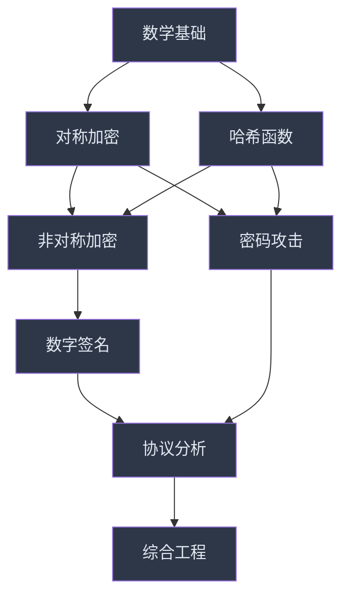

# 第13章 密码学 - 练习方法

## 学习路径总览

密码学的学习必须理论与实践并重。纯读理论容易流于表面，纯做题又容易知其然不知其所以然。本章提供一套从入门到精通的渐进式练习体系，覆盖数学基础、对称加密、非对称加密、哈希函数、数字签名、密码攻击、协议分析和综合工程七大模块。每个练习都标注难度等级（⭐入门 → ⭐⭐进阶 → ⭐⭐⭐高级 → ⭐⭐⭐⭐专家），配有预期输出、解题提示和常见错误警示。



**练习环境准备**（所有练习共用）：

```bash
# 创建Python虚拟环境
python3 -m venv crypto-lab
source crypto-lab/bin/activate

# 安装核心依赖
pip install cryptography sympy pycryptodome argon2-cffi hashlib

# 验证安装
python3 -c "from cryptography.hazmat.primitives.ciphers import Cipher; print('cryptography OK')"
python3 -c "from sympy import isprime; print('sympy OK')"
python3 -c "from Crypto.Cipher import AES; print('pycryptodome OK')"
```

---

## 13.1 数学基础练习

密码学的根基是数学。不理解模运算、群论和数论，就无法真正理解为什么RSA安全、为什么ECC高效。本节从最基础的模运算开始，逐步引导到支撑现代密码学的核心数学结构。

### 13.1.1 模运算练习

模运算是几乎所有密码算法的基础操作。理解模运算的性质（分配律、结合律、逆元存在条件）是后续学习RSA、Diffie-Hellman和椭圆曲线的前提。

**练习1：基本模运算** ⭐

手动计算以下表达式（不使用计算器），然后用Python验证：

| 表达式 | 手动计算 | Python验证 |
|--------|---------|-----------|
| 17 mod 5 | ? | `print(17 % 5)` |
| 2^10 mod 13 | ? | `print(pow(2, 10, 13))` |
| 3^100 mod 7 | ?（提示：用费马小定理） | `print(pow(3, 100, 7))` |
| 7^222 mod 11 | ?（提示：先求7^10 mod 11） | `print(pow(7, 222, 11))` |

**预期输出**：

```text
17 % 5 = 2
2^10 mod 13 = 10
3^100 mod 7 = 4
7^222 mod 11 = 5
```

**解题思路**：

- `17 mod 5`：17 = 3×5 + 2，余数为2
- `2^10 mod 13`：2^10 = 1024，1024 = 78×13 + 10，余数为10。更优雅的方法：2^10 = (2^4)^2 × 2^2 = 16^2 × 4，16 mod 13 = 3，所以 3^2 × 4 = 36，36 mod 13 = 10
- `3^100 mod 7`：费马小定理告诉我们 3^6 ≡ 1 (mod 7)，所以 3^100 = 3^(6×16+4) = (3^6)^16 × 3^4 = 1^16 × 81 = 81，81 mod 7 = 4
- `7^222 mod 11`：费马小定理：7^10 ≡ 1 (mod 11)，222 = 10×22 + 2，所以 7^222 = (7^10)^22 × 7^2 = 1 × 49 = 49，49 mod 11 = 5

**常见错误**：

- 直接计算 3^100（Python可以，但手算会溢出）——应该用模幂运算的性质逐步化简
- 忘记费马小定理的条件：p必须是质数，a不能被p整除
- 混淆费马小定理（a^(p-1) ≡ 1）和欧拉定理（a^φ(n) ≡ 1）

**练习2：模逆元计算** ⭐⭐

模逆元是RSA密钥计算和椭圆曲线运算的核心。给定a和模数m，求a的模逆元a^(-1)，即找到x使得 a×x ≡ 1 (mod m)。

1. 计算 3 关于模 11 的逆元
2. 计算 7 关于模 31 的逆元
3. 使用扩展欧几里得算法求解 17 关于模 43 的逆元
4. 编写一个通用的模逆元函数，处理逆元不存在的情况

```python
def mod_inverse_brute(a, m):
    """暴力枚举法——仅适用于小模数，用于理解概念"""
    for x in range(1, m):
        if (a * x) % m == 1:
            return x
    return None  # 逆元不存在

def mod_inverse_extgcd(a, m):
    """扩展欧几里得算法——高效通用"""
    if a < 0:
        a = a % m
    g, x, _ = extended_gcd(a, m)
    if g != 1:
        return None  # 逆元不存在（gcd(a,m) != 1）
    return x % m

def extended_gcd(a, b):
    """扩展欧几里得算法：返回 (gcd, x, y) 使得 ax + by = gcd"""
    if a == 0:
        return b, 0, 1
    gcd, x1, y1 = extended_gcd(b % a, a)
    x = y1 - (b // a) * x1
    y = x1
    return gcd, x, y

# 验证
print(f"3^(-1) mod 11 = {mod_inverse_brute(3, 11)}")    # 4
print(f"7^(-1) mod 31 = {mod_inverse_brute(7, 31)}")    # 9
print(f"17^(-1) mod 43 = {mod_inverse_extgcd(17, 43)}") # 38

# 验证：3 * 4 = 12, 12 mod 11 = 1 ✓
# 验证：17 * 38 = 646, 646 mod 43 = 1 ✓

# 逆元不存在的情况
print(f"6^(-1) mod 9 = {mod_inverse_extgcd(6, 9)}")     # None（gcd(6,9)=3≠1）
```

**预期输出**：

```text
3^(-1) mod 11 = 4
7^(-1) mod 31 = 9
17^(-1) mod 43 = 38
6^(-1) mod 9 = None
```

**常见错误**：

- 忘记检查gcd(a, m)是否为1——只有当a和m互质时逆元才存在
- 扩展欧几里得算法中混淆x和y的计算顺序
- 忘记对负数结果取模：`x % m` 确保结果为正

**练习3：中国剩余定理（CRT）** ⭐⭐

CRT在RSA加速解密中有实际应用——将模n的运算拆分为模p和模q的两个小运算，速度提升约4倍。

求解同余方程组：

```text
x ≡ 2 (mod 3)
x ≡ 3 (mod 5)
x ≡ 2 (mod 7)
```

```python
def chinese_remainder_theorem(remainders, moduli):
    """
    中国剩余定理求解
    remainders: [r1, r2, ..., rn]
    moduli: [m1, m2, ..., mn]
    求解 x ≡ ri (mod mi) 对所有i成立
    """
    M = 1
    for m in moduli:
        M *= m  # 总模数
    
    x = 0
    for ri, mi in zip(remainders, moduli):
        Mi = M // mi                    # 部分积
        yi = pow(Mi, -1, mi)            # Mi关于mi的逆元
        x += ri * Mi * yi
    
    return x % M

# 求解练习题
remainders = [2, 3, 2]
moduli = [3, 5, 7]
result = chinese_remainder_theorem(remainders, moduli)
print(f"x = {result}")  # x = 23

# 验证
assert result % 3 == 2
assert result % 5 == 3
assert result % 7 == 2
print("验证通过！")
```

**预期输出**：

```text
x = 23
验证通过！
```

**解题思路**：总模数 M = 3×5×7 = 105。逐步计算 M1=35, M2=21, M3=15，再求各Mi的模逆元，最后加权求和取模。x = 2×35×2 + 21×21×1 + 15×15×1 = 140 + 441 + 225 = 806，806 mod 105 = 23。

**进阶思考**：

- CRT解是否唯一？在什么意义下唯一？
- 如何将CRT应用到RSA-CRT加速解密？RSA中p和q已知，为什么可以用CRT？

### 13.1.2 质数与因数分解

RSA的安全性建立在"大整数分解困难"这一假设上。理解质数判定和因数分解的算法，有助于理解RSA密钥长度选择的安全考量。

**练习4：质数判定算法对比** ⭐⭐

实现三种质数判定算法，对比它们的效率和适用场景：

```python
import time
import random
from sympy import isprime as sympy_isprime

def trial_division(n):
    """试除法——最直观，O(√n)"""
    if n < 2:
        return False
    if n < 4:
        return True
    if n % 2 == 0 or n % 3 == 0:
        return False
    i = 5
    while i * i <= n:
        if n % i == 0 or n % (i + 2) == 0:
            return False
        i += 6
    return True

def miller_rabin(n, k=20):
    """Miller-Rabin概率性测试——密码学中常用"""
    if n < 2:
        return False
    if n == 2 or n == 3:
        return True
    if n % 2 == 0:
        return False
    
    # 将 n-1 写成 2^r × d
    r, d = 0, n - 1
    while d % 2 == 0:
        r += 1
        d //= 2
    
    # 执行k轮测试
    for _ in range(k):
        a = random.randrange(2, n - 1)
        x = pow(a, d, n)
        
        if x == 1 or x == n - 1:
            continue
        
        for _ in range(r - 1):
            x = pow(x, 2, n)
            if x == n - 1:
                break
        else:
            return False  # 确定是合数
    
    return True  # 可能是质数（概率性）

# 测试对比
test_numbers = [97, 143, 561, 104729, 104730, 2147483647]
print(f"{'数字':<15} {'试除法':<10} {'Miller-Rabin':<15} {'sympy':<10}")
print("-" * 50)
for n in test_numbers:
    t1 = trial_division(n)
    t2 = miller_rabin(n)
    t3 = sympy_isprime(n)
    print(f"{n:<15} {str(t1):<10} {str(t2):<15} {str(t3):<10}")
```

**预期输出**：

```text
数字             试除法      Miller-Rabin    sympy     
--------------------------------------------------
97              True       True            True      
143             False      False           False     
561             False      False           False     
104729          True       True            True      
104730          False      False           False     
2147483647      True       True            True      
```

**关键知识点**：

- **561是卡迈克尔数**：它满足 a^560 ≡ 1 (mod 561) 对所有与561互质的a都成立，但它实际上是 3×11×17。朴素的费马素性测试会被它欺骗，但Miller-Rabin可以检测出来
- Miller-Rabin是概率性测试——可能将合数误判为质数，但误判概率随轮数k指数下降（k=20时误判概率 < 4^(-20) ≈ 10^(-12)）
- 密码学中生成大质数时，实际使用的是Miller-Rabin测试，通常做40-64轮

**练习5：Pollard's Rho因数分解** ⭐⭐⭐

```python
import math
import random

def pollard_rho(n):
    """Pollard's Rho算法——用于分解中等大小的合数"""
    if n % 2 == 0:
        return 2
    
    x = random.randint(2, n - 1)
    y = x
    c = random.randint(1, n - 1)
    d = 1
    
    while d == 1:
        # Tortoise move (慢指针)
        x = (x * x + c) % n
        # Hare move (快指针)
        y = (y * y + c) % n
        y = (y * y + c) % n
        # 求gcd
        d = math.gcd(abs(x - y), n)
    
    if d != n:
        return d
    return None  # 需要重新选择参数

def full_factorization(n):
    """完整因数分解"""
    factors = []
    # 先除以小因子
    for p in [2, 3, 5, 7, 11, 13]:
        while n % p == 0:
            factors.append(p)
            n //= p
    
    if n == 1:
        return sorted(factors)
    
    # 对剩余部分使用Pollard's Rho
    stack = [n]
    while stack:
        num = stack.pop()
        if sympy_isprime(num):
            factors.append(num)
            continue
        d = pollard_rho(num)
        if d is None:
            stack.append(num)  # 重试
            continue
        stack.append(d)
        stack.append(num // d)
    
    return sorted(factors)

from sympy import isprime as sympy_isprime

# 测试
test_cases = [143, 323, 8051, 123456789, 1000000007 * 1000000009]
for n in test_cases:
    factors = full_factorization(n)
    product = 1
    for f in factors:
        product *= f
    print(f"{n} = {' × '.join(map(str, factors))}  (验证: {product == n})")
```

**预期输出**：

```text
143 = 11 × 13  (验证: True)
323 = 17 × 19  (验证: True)
8051 = 83 × 97  (验证: True)
123456789 = 3 × 3 × 3607 × 3803  (验证: True)
1000000007000000063 = 1000000007 × 1000000009  (验证: True)
```

**关键知识点**：

- Pollard's Rho的时间复杂度约为 O(n^(1/4))，比试除法的 O(n^(1/2)) 快得多
- 对于RSA-2048使用的两个1024位质数，Pollard's Rho也无法有效分解——这正是RSA安全性的来源
- 目前最强大的通用因数分解算法是**数域筛法（NFS）**，分解RSA-768（232位）需要约2年计算

### 13.1.3 群论基础

群论是理解Diffie-Hellman密钥交换和椭圆曲线密码学的数学语言。不需要深入到抽象代数的全部内容，但需要理解循环群、生成元和阶的概念。

**练习6：循环群与生成元** ⭐⭐

```python
def find_generators(p):
    """找出模p乘法群的所有生成元"""
    generators = []
    for g in range(2, p):
        # 计算g的阶：最小的k使得 g^k ≡ 1 (mod p)
        order = 1
        current = g % p
        while current != 1:
            current = (current * g) % p
            order += 1
        if order == p - 1:  # 阶等于群的阶，说明是生成元
            generators.append(g)
    return generators

def element_orders(p):
    """计算模p下每个非零元素的阶"""
    orders = {}
    for g in range(1, p):
        order = 1
        current = g % p
        while current != 1:
            current = (current * g) % p
            order += 1
        orders[g] = order
    return orders

# 模7的乘法群
p = 7
generators = find_generators(p)
orders = element_orders(p)

print(f"模 {p} 的乘法群 Z*_{p} = {{1, 2, ..., {p-1}}}")
print(f"群的阶 = {p - 1}")
print(f"生成元: {generators}")
print()
print(f"{'元素':<6} {'阶':<6} {'幂次序列'}")
print("-" * 40)
for g in range(1, p):
    powers = []
    current = 1
    for _ in range(orders[g]):
        current = (current * g) % p
        powers.append(current)
    print(f"{g:<6} {orders[g]:<6} {powers}")

# 验证拉格朗日定理：每个元素的阶整除群的阶
print(f"\n拉格朗日定理验证（群的阶={p-1}）：")
for g in range(1, p):
    divides = (p - 1) % orders[g] == 0
    print(f"  {g} 的阶={orders[g]}，{p-1} ÷ {orders[g]} = {(p-1)//orders[g]}，整除: {divides}")
```

**预期输出**：

```text
模 7 的乘法群 Z*_7 = {1, 2, ..., 6}
群的阶 = 6
生成元: [3, 5]

元素     阶      幂次序列
----------------------------------------
1      1      [1]
2      3      [2, 4, 1]
3      6      [3, 2, 6, 4, 5, 1]
4      3      [4, 2, 1]
5      6      [5, 4, 6, 2, 3, 1]
6      2      [6, 1]

拉格朗日定理验证（群的阶=6）：
  1 的阶=1，6 ÷ 1 = 6，整除: True
  2 的阶=3，6 ÷ 3 = 2，整除: True
  3 的阶=6，6 ÷ 6 = 1，整除: True
  4 的阶=3，6 ÷ 3 = 2，整除: True
  5 的阶=6，6 ÷ 6 = 1，整除: True
  6 的阶=2，6 ÷ 2 = 3，整除: True
```

**关键知识点**：

- **生成元**（也叫原根）：其幂次能生成群中所有元素。模7的生成元是3和5
- **拉格朗日定理**：有限群中每个元素的阶整除群的阶。这是Diffie-Hellman安全性的理论基础
- **离散对数问题**：给定g、p和g^x mod p，求x——这就是DLP，其困难性支撑了DH和DSA的安全性

---

## 13.2 对称加密练习

对称加密是实际加密数据的主力军（速度快），而非对称加密通常只用于密钥交换。本节从最简单的凯撒密码开始，逐步深入AES的工作模式和流密码的原理。

### 13.2.1 古典密码与密码分析

古典密码虽然不再用于实际安全保护，但理解它们有助于建立密码分析的直觉——什么是"安全"、什么是"不安全"、攻击者如何利用统计规律。

**练习7：凯撒密码与暴力破解** ⭐

```python
def caesar_encrypt(plaintext, shift):
    """凯撒密码加密"""
    result = ""
    for char in plaintext:
        if char.isalpha():
            ascii_offset = ord('A') if char.isupper() else ord('a')
            encrypted_char = chr((ord(char) - ascii_offset + shift) % 26 + ascii_offset)
            result += encrypted_char
        else:
            result += char
    return result

def caesar_decrypt(ciphertext, shift):
    """凯撒密码解密（就是反向移位）"""
    return caesar_encrypt(ciphertext, -shift)

def caesar_brute_force(ciphertext):
    """暴力破解凯撒密码——尝试所有26种可能的移位"""
    results = []
    for shift in range(26):
        plaintext = caesar_decrypt(ciphertext, shift)
        results.append((shift, plaintext))
    return results

# 练习
message = "The quick brown fox jumps over the lazy dog"
shift = 13  # ROT13
encrypted = caesar_encrypt(message, shift)
print(f"原文: {message}")
print(f"密文: {encrypted}")
print(f"\n暴力破解（26种可能）：")
for s, p in caesar_brute_force(encrypted):
    marker = " ← 正确" if s == shift else ""
    print(f"  shift={s:2d}: {p}{marker}")
```

**练习8：频率分析破解** ⭐⭐

当密文足够长时，不需要暴力尝试所有26种移位——通过统计字母频率可以直接推断移位值。英文文本中字母'E'出现频率最高（约12.7%），其次是'T'（约9.1%）。

```python
from collections import Counter

# 英文字母频率表（标准英文）
ENGLISH_FREQ = {
    'A': 8.167, 'B': 1.492, 'C': 2.782, 'D': 4.253, 'E': 12.702,
    'F': 2.228, 'G': 2.015, 'H': 6.094, 'I': 6.966, 'J': 0.153,
    'K': 0.772, 'L': 4.025, 'M': 2.406, 'N': 6.749, 'O': 7.507,
    'P': 1.929, 'Q': 0.095, 'R': 5.987, 'S': 6.327, 'T': 9.056,
    'U': 2.758, 'V': 0.978, 'W': 2.360, 'X': 0.150, 'Y': 1.974,
    'Z': 0.074
}

def frequency_analysis(ciphertext):
    """通过频率分析推断凯撒密码的移位值"""
    # 统计密文字母频率
    letters = [c.upper() for c in ciphertext if c.isalpha()]
    if not letters:
        return None
    
    freq = Counter(letters)
    total = len(letters)
    
    # 找出密文中频率最高的字母
    most_common_cipher = freq.most_common(1)[0][0]
    
    # 假设它对应英文中频率最高的'E'
    estimated_shift = (ord(most_common_cipher) - ord('E')) % 26
    
    return estimated_shift, most_common_cipher

# 用一段足够长的密文测试
long_text = """Cryptography is the practice and study of techniques for secure communication 
in the presence of adversarial behavior. More generally, cryptography is about constructing 
and analyzing protocols that prevent third parties or the public from reading private messages."""

shift = 7
encrypted = caesar_encrypt(long_text, shift)
result = frequency_analysis(encrypted)

if result:
    estimated_shift, most_common = result
    decrypted = caesar_decrypt(encrypted, estimated_shift)
    print(f"密文中最高频字母: '{most_common}'")
    print(f"推断移位值: {estimated_shift}（实际: {shift}）")
    print(f"解密结果: {decrypted[:100]}...")
```

**预期输出**：

```text
密文中最高频字母: 'H'
推断移位值: 7（实际: 7）
解密结果: Cryptography is the practice and study of techniques for secure communication...
```

**关键知识点**：

- 频率分析的有效性依赖于密文长度——短密文的统计波动大，推断不可靠
- 凯撒密码的密钥空间只有26种可能，安全性极低
- 维吉尼亚密码通过多表替换抵抗简单频率分析，但Kasiski检验和重合指数法仍可破解

### 13.2.2 AES加密实战

AES是当前最广泛使用的对称加密标准，理解其工作模式的选择和安全影响是实际工程中的核心技能。

**练习9：AES-CBC加解密** ⭐⭐

```python
from cryptography.hazmat.primitives.ciphers import Cipher, algorithms, modes
from cryptography.hazmat.primitives import padding
from cryptography.hazmat.backends import default_backend
import os

def aes_cbc_encrypt(plaintext_bytes, key, iv):
    """AES-CBC加密（使用标准PKCS7填充）"""
    # PKCS7填充
    padder = padding.PKCS7(128).padder()
    padded_data = padder.update(plaintext_bytes) + padder.finalize()
    
    cipher = Cipher(algorithms.AES(key), modes.CBC(iv), backend=default_backend())
    encryptor = cipher.encryptor()
    ciphertext = encryptor.update(padded_data) + encryptor.finalize()
    return ciphertext

def aes_cbc_decrypt(ciphertext, key, iv):
    """AES-CBC解密"""
    cipher = Cipher(algorithms.AES(key), modes.CBC(iv), backend=default_backend())
    decryptor = cipher.decryptor()
    padded_data = decryptor.update(ciphertext) + decryptor.finalize()
    
    # 移除PKCS7填充
    unpadder = padding.PKCS7(128).unpadder()
    plaintext = unpadder.update(padded_data) + unpadder.finalize()
    return plaintext

# 生成密钥和IV
key = os.urandom(32)  # AES-256
iv = os.urandom(16)   # 128位IV

# 加密测试
plaintext = b"Hello, AES-CBC encryption! This is a secret message."
print(f"原文 ({len(plaintext)} 字节): {plaintext}")

ciphertext = aes_cbc_encrypt(plaintext, key, iv)
print(f"密文 ({len(ciphertext)} 字节): {ciphertext.hex()}")
print(f"密文块数: {len(ciphertext) // 16}")

decrypted = aes_cbc_decrypt(ciphertext, key, iv)
print(f"解密: {decrypted}")
assert plaintext == decrypted, "解密失败！"
print("✓ 加解密验证通过")

# 展示填充细节
print(f"\n填充分析:")
print(f"  原文长度: {len(plaintext)} 字节")
print(f"  填充后长度: {len(plaintext) + (16 - len(plaintext) % 16)} 字节")
print(f"  填充字节数: {16 - len(plaintext) % 16}")
print(f"  填充内容: 0x{(16 - len(plaintext) % 16):02x} × {16 - len(plaintext) % 16}")
```

**练习10：工作模式对比实验** ⭐⭐⭐

这个练习通过可视化方式展示不同模式的安全性差异：

```python
from cryptography.hazmat.primitives.ciphers import Cipher, algorithms, modes
from cryptography.hazmat.backends import default_backend
import os

def encrypt_ecb(data, key):
    """ECB模式——相同明文块产生相同密文块"""
    cipher = Cipher(algorithms.AES(key), modes.ECB(), backend=default_backend())
    encryptor = cipher.encryptor()
    # 填充到16字节倍数
    padded = data + b'\x00' * ((16 - len(data) % 16) % 16)
    return encryptor.update(padded) + encryptor.finalize()

def encrypt_cbc(data, key, iv):
    """CBC模式——每个块依赖前一个密文块"""
    cipher = Cipher(algorithms.AES(key), modes.CBC(iv), backend=default_backend())
    encryptor = cipher.encryptor()
    padded = data + b'\x00' * ((16 - len(data) % 16) % 16)
    return encryptor.update(padded) + encryptor.finalize()

def encrypt_ctr(data, key, nonce):
    """CTR模式——将分组密码变为流密码"""
    cipher = Cipher(algorithms.AES(key), modes.CTR(nonce), backend=default_backend())
    encryptor = cipher.encryptor()
    return encryptor.update(data) + encryptor.finalize()

# 构造包含重复块的明文（模拟ECB模式泄露模式的场景）
block = b'YELLOW SUBMARINE'  # 16字节
plaintext = block * 10  # 10个相同的块

key = os.urandom(32)
iv = os.urandom(16)
nonce = os.urandom(16)

ecb_ct = encrypt_ecb(plaintext, key)
cbc_ct = encrypt_cbc(plaintext, key, iv)
ctr_ct = encrypt_ctr(plaintext, key, nonce)

print("ECB模式密文（每16字节一块）:")
for i in range(0, len(ecb_ct), 16):
    block_hex = ecb_ct[i:i+16].hex()
    print(f"  块{i//16}: {block_hex}")

print("\nCBC模式密文:")
for i in range(0, len(cbc_ct), 16):
    block_hex = cbc_ct[i:i+16].hex()
    print(f"  块{i//16}: {block_hex}")

# ECB的致命缺陷：相同明文块 → 相同密文块
ecb_blocks = [ecb_ct[i:i+16] for i in range(0, len(ecb_ct), 16)]
unique_ecb = len(set(ecb_blocks))
cbc_blocks = [cbc_ct[i:i+16] for i in range(0, len(cbc_ct), 16)]
unique_cbc = len(set(cbc_blocks))

print(f"\n安全性对比:")
print(f"  ECB: 10个明文块 → {unique_ecb}个不同的密文块（全部相同！模式泄露！）")
print(f"  CBC: 10个明文块 → {unique_cbc}个不同的密文块（每次不同，安全）")
```

**预期输出**：

```yaml
ECB: 10个明文块 → 1个不同的密文块（全部相同！模式泄露！）
CBC: 10个明文块 → 10个不同的密文块（每次不同，安全）
```

**工作模式安全总结**：

| 模式 | 并行加密 | 并行解密 | 认证 | IV/Nonce要求 | 推荐度 |
|------|---------|---------|------|-------------|--------|
| ECB | ✅ | ✅ | ❌ | 无 | ❌ 禁用 |
| CBC | ❌ | ✅ | ❌ | 随机不可预测 | ⚠️ 需配合HMAC |
| CTR | ✅ | ✅ | ❌ | 绝不可重复 | ⚠️ 需配合MAC |
| GCM | ✅ | ✅ | ✅ | 绝不可重复 | ✅ 首选 |

### 13.2.3 流密码

**练习11：RC4实现与安全性分析** ⭐⭐

RC4虽然已被弃用（TLS 1.3中移除），但其实现简洁，非常适合理解流密码的工作原理：

```python
def rc4_init(key):
    """KSA（密钥调度算法）——初始化S盒"""
    S = list(range(256))
    j = 0
    for i in range(256):
        j = (j + S[i] + key[i % len(key)]) % 256
        S[i], S[j] = S[j], S[i]
    return S

def rc4_generate(S):
    """PRGA（伪随机生成算法）——生成密钥流"""
    i = j = 0
    while True:
        i = (i + 1) % 256
        j = (j + S[i]) % 256
        S[i], S[j] = S[j], S[i]
        yield S[(S[i] + S[j]) % 256]

def rc4_encrypt(plaintext, key):
    """RC4加密/解密（XOR运算，加密和解密是同一个操作）"""
    S = rc4_init(key)
    keystream = rc4_generate(S)
    return bytes([p ^ next(keystream) for p in plaintext])

# 基本功能测试
key = b"SecretKey"
plaintext = b"Hello, RC4 stream cipher!"
ciphertext = rc4_encrypt(plaintext, key)
decrypted = rc4_encrypt(ciphertext, key)  # 再次运行就是解密

print(f"原文: {plaintext}")
print(f"密文: {ciphertext.hex()}")
print(f"解密: {decrypted}")
assert plaintext == decrypted
print("✓ RC4加解密验证通过")

# 安全性分析：RC4的统计偏差
print("\nRC4密钥流统计偏差分析（生成10000字节）:")
S = rc4_init(b"TestKey")
keystream = rc4_generate(S)
bytes_generated = [next(keystream) for _ in range(10000)]

from collections import Counter
freq = Counter(bytes_generated)
# 理论上每个字节出现频率应为 10000/256 ≈ 39.06
expected = 10000 / 256
print(f"  理论频率: {expected:.2f}")
print(f"  第二个字节(0x00)出现频率: {freq[0]} (偏差: {(freq[0] - expected) / expected * 100:.1f}%)")
print(f"  密钥流前16字节: {bytes_generated[:16]}")
print("\n  ⚠️ RC4的已知问题:")
print("  1. 密钥流开头存在统计偏差（Fluhrer-Mantin-Shamir攻击）")
print("  2. 相同密钥加密多条消息会导致密钥流重用攻击")
print("  3. TLS 1.3已移除RC4，现代应用应使用ChaCha20-Poly1305")
```

**练习12：ChaCha20-Poly1305——现代AEAD流密码** ⭐⭐⭐

```python
from cryptography.hazmat.primitives.ciphers.aead import ChaCha20Poly1305
import os

def chacha20_demo():
    """ChaCha20-Poly1305加解密演示"""
    # 生成256位密钥
    key = ChaCha20Poly1305.generate_key()
    # 96位nonce（绝不可重复使用同一个key+nonce组合）
    nonce = os.urandom(12)
    
    # 要加密的消息
    plaintext = b"ChaCha20-Poly1305 is a modern AEAD cipher"
    
    # 关联数据（AAD）：不加密但需要认证的数据
    associated_data = b"metadata: version=1, sender=alice"
    
    # 加密+认证
    aead = ChaCha20Poly1305(key)
    ciphertext = aead.encrypt(nonce, plaintext, associated_data)
    
    print(f"原文: {plaintext}")
    print(f"密文: {ciphertext.hex()}")
    print(f"密文长度: {len(ciphertext)} (= 明文长度{len(plaintext)} + 16字节认证标签)")
    
    # 解密+验证
    decrypted = aead.decrypt(nonce, ciphertext, associated_data)
    print(f"解密: {decrypted}")
    assert plaintext == decrypted
    
    # 篡改检测
    print("\n篡改检测测试:")
    tampered_ct = bytearray(ciphertext)
    tampered_ct[0] ^= 0x01  # 翻转一个比特
    try:
        aead.decrypt(nonce, bytes(tampered_ct), associated_data)
        print("  ❌ 不应该到达这里")
    except Exception as e:
        print(f"  ✓ 检测到篡改: {type(e).__name__}")
    
    # AAD篡改检测
    try:
        aead.decrypt(nonce, ciphertext, b"tampered metadata")
        print("  ❌ 不应该到达这里")
    except Exception as e:
        print(f"  ✓ AAD篡改检测: {type(e).__name__}")

chacha20_demo()
```

**预期输出**：

```text
原文: b'ChaCha20-Poly1305 is a modern AEAD cipher'
密文: <hex string>
密文长度: 57 (= 明文长度41 + 16字节认证标签)
解密: b'ChaCha20-Poly1305 is a modern AEAD cipher'

篡改检测测试:
  ✓ 检测到篡改: InvalidTag
  ✓ AAD篡改检测: InvalidTag
```

---

## 13.3 非对称加密练习

非对称加密解决了密钥分发问题，但计算速度比对称加密慢100-1000倍。实际应用中通常用非对称加密交换对称密钥，再用对称加密传输数据（混合加密）。

### 13.3.1 RSA从零实现

**练习13：RSA密钥生成与原理验证** ⭐⭐

```python
from sympy import isprime, mod_inverse, gcd
import random

def generate_prime(bits):
    """生成指定位数的质数"""
    while True:
        n = random.getrandbits(bits)
        n |= (1 << bits - 1)  # 确保最高位为1
        n |= 1                 # 确保为奇数
        if isprime(n):
            return n

def generate_rsa_keys(bits=512):
    """RSA密钥生成全流程"""
    print(f"=== RSA-{bits} 密钥生成 ===\n")
    
    # 步骤1：生成两个大质数
    p = generate_prime(bits // 2)
    q = generate_prime(bits // 2)
    while p == q:  # 确保p ≠ q
        q = generate_prime(bits // 2)
    print(f"p = {p}")
    print(f"q = {q}")
    
    # 步骤2：计算模数n
    n = p * q
    print(f"\nn = p × q = {n}")
    print(f"n的位数: {n.bit_length()}")
    
    # 步骤3：计算欧拉函数φ(n)
    phi_n = (p - 1) * (q - 1)
    print(f"\nφ(n) = (p-1)(q-1) = {phi_n}")
    
    # 步骤4：选择公钥指数e
    e = 65537  # 标准选择：质数、二进制表示只有两个1（高效）
    assert gcd(e, phi_n) == 1, "e与φ(n)不互质！"
    print(f"\ne = {e}")
    
    # 步骤5：计算私钥指数d
    d = mod_inverse(e, phi_n)
    print(f"d = {d}")
    
    # 验证
    assert (e * d) % phi_n == 1, "ed ≡ 1 (mod φ(n)) 验证失败！"
    print(f"\n验证: e × d mod φ(n) = {(e * d) % phi_n}")
    
    public_key = (n, e)
    private_key = (n, d)
    print(f"\n公钥 (n, e): n={n}, e={e}")
    print(f"私钥 (n, d): n={n}, d={d}")
    
    return public_key, private_key

public_key, private_key = generate_rsa_keys(128)  # 小位数用于演示
```

**练习14：RSA加密解密与安全性分析** ⭐⭐⭐

```python
def rsa_encrypt(message_int, public_key):
    """RSA加密: c = m^e mod n"""
    n, e = public_key
    if message_int >= n:
        raise ValueError(f"消息 {message_int} 大于模数 {n}，必须分块加密")
    return pow(message_int, e, n)

def rsa_decrypt(ciphertext, private_key):
    """RSA解密: m = c^d mod n"""
    n, d = private_key
    return pow(ciphertext, d, n)

# 使用前面生成的密钥
n, e = public_key
n, d = private_key

# 加密一个数字消息
message = 42
print(f"明文: {message}")

ciphertext = rsa_encrypt(message, public_key)
print(f"密文: {ciphertext}")

decrypted = rsa_decrypt(ciphertext, private_key)
print(f"解密: {decrypted}")
assert message == decrypted

# 加密文本消息
def rsa_encrypt_text(text, public_key):
    """将文本转为整数后加密（教学演示，实际应使用OAEP填充）"""
    n, e = public_key
    data = text.encode('utf-8')
    m = int.from_bytes(data, 'big')
    if m >= n:
        raise ValueError("消息太长，需要分块")
    return pow(m, e, n)

def rsa_decrypt_text(ciphertext, private_key, length):
    """解密整数并转回文本"""
    n, d = private_key
    m = pow(ciphertext, d, n)
    return m.to_bytes(length, 'big').decode('utf-8')

text = "Hi!"
ct = rsa_encrypt_text(text, public_key)
dt = rsa_decrypt_text(ct, private_key, len(text.encode()))
print(f"\n文本加密: '{text}' → {ct}")
print(f"文本解密: {ct} → '{dt}'")

# 安全性分析
print(f"\n=== RSA安全性分析 ===")
print(f"当前密钥位数: {n.bit_length()}")
print(f"如果已知n的因数分解p和q，可以轻松计算d = e^(-1) mod φ(n)")
print(f"如果不知道因数分解，从e和n计算d等价于因数分解n")
print(f"RSA-{n.bit_length()} 的安全强度约为 {n.bit_length() // 3} 位对称密钥")
print(f"\n推荐密钥长度:")
print(f"  RSA-2048: 安全至2030年（等价AES-112）")
print(f"  RSA-3072: 长期安全（等价AES-128）")
print(f"  RSA-4096: 超长期安全（等价AES-152）")
```

### 13.3.2 椭圆曲线密码学

**练习15：椭圆曲线点运算可视化** ⭐⭐⭐

```python
class EllipticCurve:
    """椭圆曲线 y² = x³ + ax + b (mod p)"""
    
    def __init__(self, a, b, p):
        self.a = a
        self.b = b
        self.p = p
        # 验证曲线是非奇异的：4a³ + 27b² ≠ 0 (mod p)
        discriminant = (4 * pow(a, 3, p) + 27 * pow(b, 2, p)) % p
        assert discriminant != 0, "曲线是奇异的，不安全"
    
    def is_on_curve(self, x, y):
        """验证点是否在曲线上"""
        return (y * y - x * x * x - self.a * x - self.b) % self.p == 0
    
    def point_add(self, P, Q):
        """椭圆曲线点加法"""
        if P is None:
            return Q
        if Q is None:
            return P
        
        px, py = P
        qx, qy = Q
        
        if px == qx and py != qy:
            return None  # P + (-P) = O（无穷远点）
        
        if P == Q:
            # 点加倍
            lam = (3 * px * px + self.a) * pow(2 * py, -1, self.p) % self.p
        else:
            # 点加法
            lam = (qy - py) * pow(qx - px, -1, self.p) % self.p
        
        rx = (lam * lam - px - qx) % self.p
        ry = (lam * (px - rx) - py) % self.p
        
        return (rx, ry)
    
    def scalar_multiply(self, k, P):
        """标量乘法 kP——使用double-and-add算法，O(log k)"""
        result = None
        addend = P
        
        while k:
            if k & 1:
                result = self.point_add(result, addend)
            addend = self.point_add(addend, addend)
            k >>= 1
        
        return result

# 使用NIST P-256曲线的简化版本（小素数用于演示）
curve = EllipticCurve(a=2, b=3, p=97)
P = (3, 6)

print(f"椭圆曲线: y² = x³ + {curve.a}x + {curve.b} (mod {curve.p})")
print(f"基点 P = {P}")
print(f"P在曲线上: {curve.is_on_curve(*P)}")

# 计算标量乘法序列
print(f"\n标量乘法序列:")
for k in range(1, 20):
    result = curve.scalar_multiply(k, P)
    if result is None:
        print(f"  {k}P = O (无穷远点)")
    else:
        on_curve = curve.is_on_curve(*result)
        print(f"  {k}P = {result}  (在曲线上: {on_curve})")

# 找出P的阶（最小的n使得nP = O）
order = 1
point = P
while point is not None:
    point = curve.point_add(point, P)
    order += 1
print(f"\nP的阶 = {order}")
print(f"这意味着 {order}P = O（无穷远点）")
```

**练习16：ECDH密钥交换模拟** ⭐⭐⭐

```python
import os

# 模拟ECDH密钥交换过程
curve = EllipticCurve(a=2, b=3, p=97)
G = (3, 6)  # 基点

print("=== ECDH密钥交换模拟 ===\n")

# Alice生成密钥对
alice_private = 15  # 随机选择的私钥
alice_public = curve.scalar_multiply(alice_private, G)
print(f"Alice: 私钥={alice_private}, 公钥={alice_public}")

# Bob生成密钥对
bob_private = 23
bob_public = curve.scalar_multiply(bob_private, G)
print(f"Bob:   私钥={bob_private}, 公钥={bob_public}")

# 双方交换公钥后，各自计算共享密钥
alice_shared = curve.scalar_multiply(alice_private, bob_public)
bob_shared = curve.scalar_multiply(bob_private, alice_public)

print(f"\nAlice计算共享密钥: {alice_private} × {bob_public} = {alice_shared}")
print(f"Bob计算共享密钥:   {bob_private} × {alice_public} = {bob_shared}")
print(f"共享密钥一致: {alice_shared == bob_shared} ✓")

# 安全性说明
print(f"\n=== 安全性分析 ===")
print(f"攻击者知道: G={G}, Alice公钥={alice_public}, Bob公钥={bob_public}")
print(f"攻击者需要求解: {alice_private}? 使得 {alice_private}×G = {alice_public}")
print(f"这就是椭圆曲线离散对数问题（ECDLP），对于大素数p是计算不可行的")

# 演示私钥泄露的影响
print(f"\n=== 如果私钥泄露 ===")
print(f"如果攻击者获得Alice的私钥 {alice_private}:")
print(f"  可以计算共享密钥: {alice_private} × {bob_public} = {curve.scalar_multiply(alice_private, bob_public)}")
print(f"  → 前向保密失败！这正是为什么需要Ephemeral DH（每次会话生成新密钥对）")
```

---

## 13.4 哈希函数练习

### 13.4.1 SHA-256内部机制

**练习17：SHA-256分步实现** ⭐⭐⭐

实现一个简化版SHA-256有助于理解其内部结构——消息填充、消息调度、压缩函数。完整实现SHA-256约100行代码，这里展示核心逻辑：

```python
import struct

def sha256_simplified(message_bytes):
    """
    SHA-256核心逻辑实现（教学版，不包含完整的64个常量）
    实际使用请用 hashlib.sha256()
    """
    # 初始哈希值（前8个质数的平方根小数部分前32位）
    h = [
        0x6a09e667, 0xbb67ae85, 0x3c6ef372, 0xa54ff53a,
        0x510e527f, 0x9b05688c, 0x1f83d9ab, 0x5be0cd19
    ]
    
    # 64个常量（前64个质数的立方根小数部分前32位）
    k = [
        0x428a2f98, 0x71374491, 0xb5c0fbcf, 0xe9b5dba5,
        0x3956c25b, 0x59f111f1, 0x923f82a4, 0xab1c5ed5,
        0xd807aa98, 0x12835b01, 0x243185be, 0x550c7dc3,
        0x72be5d74, 0x80deb1fe, 0x9bdc06a7, 0xc19bf174,
        0xe49b69c1, 0xefbe4786, 0x0fc19dc6, 0x240ca1cc,
        0x2de92c6f, 0x4a7484aa, 0x5cb0a9dc, 0x76f988da,
        0x983e5152, 0xa831c66d, 0xb00327c8, 0xbf597fc7,
        0xc6e00bf3, 0xd5a79147, 0x06ca6351, 0x14292967,
        0x27b70a85, 0x2e1b2138, 0x4d2c6dfc, 0x53380d13,
        0x650a7354, 0x766a0abb, 0x81c2c92e, 0x92722c85,
        0xa2bfe8a1, 0xa81a664b, 0xc24b8b70, 0xc76c51a3,
        0xd192e819, 0xd6990624, 0xf40e3585, 0x106aa070,
        0x19a4c116, 0x1e376c08, 0x2748774c, 0x34b0bcb5,
        0x391c0cb3, 0x4ed8aa4a, 0x5b9cca4f, 0x682e6ff3,
        0x748f82ee, 0x78a5636f, 0x84c87814, 0x8cc70208,
        0x90befffa, 0xa4506ceb, 0xbef9a3f7, 0xc67178f2
    ]
    
    # 消息填充（长度扩展到 448 mod 512 位）
    msg = bytearray(message_bytes)
    original_bit_len = len(msg) * 8
    msg.append(0x80)
    while len(msg) % 64 != 56:
        msg.append(0)
    msg += struct.pack('>Q', original_bit_len)
    
    # 处理每个512位（64字节）块
    for chunk_start in range(0, len(msg), 64):
        chunk = msg[chunk_start:chunk_start + 64]
        
        # 消息调度：扩展16个字为64个字
        w = list(struct.unpack('>16L', chunk))
        for i in range(16, 64):
            s0 = _rotr(w[i-15], 7) ^ _rotr(w[i-15], 18) ^ (w[i-15] >> 3)
            s1 = _rotr(w[i-2], 17) ^ _rotr(w[i-2], 19) ^ (w[i-2] >> 10)
            w.append((w[i-16] + s0 + w[i-7] + s1) & 0xFFFFFFFF)
        
        # 初始化工作变量
        a, b, c, d, e, f, g, hv = h
        
        # 64轮压缩
        for i in range(64):
            S1 = _rotr(e, 6) ^ _rotr(e, 11) ^ _rotr(e, 25)
            ch = (e & f) ^ (~e & g)
            temp1 = (hv + S1 + ch + k[i] + w[i]) & 0xFFFFFFFF
            S0 = _rotr(a, 2) ^ _rotr(a, 13) ^ _rotr(a, 22)
            maj = (a & b) ^ (a & c) ^ (b & c)
            temp2 = (S0 + maj) & 0xFFFFFFFF
            
            hv = g; g = f; f = e
            e = (d + temp1) & 0xFFFFFFFF
            d = c; c = b; b = a
            a = (temp1 + temp2) & 0xFFFFFFFF
        
        # 更新哈希值
        for i, val in enumerate([a, b, c, d, e, f, g, hv]):
            h[i] = (h[i] + val) & 0xFFFFFFFF
    
    return b''.join(struct.pack('>L', x) for x in h)

def _rotr(x, n):
    """32位循环右移"""
    return ((x >> n) | (x << (32 - n))) & 0xFFFFFFFF

# 验证实现正确性
import hashlib

test_messages = [b"", b"abc", b"Hello, SHA-256!", b"a" * 1000000]
print("SHA-256实现验证:")
print(f"{'消息':<25} {'自实现':<66} {'标准库':<66} {'匹配'}")
print("-" * 170)

for msg in test_messages:
    my_hash = sha256_simplified(msg).hex()
    std_hash = hashlib.sha256(msg).hexdigest()
    display = repr(msg)[:24]
    match = "✓" if my_hash == std_hash else "✗"
    print(f"{display:<25} {my_hash:<66} {std_hash:<66} {match}")
```

**预期输出**（部分）：

```text
SHA-256实现验证:
消息                      自实现                                                                标准库                                                                匹配
--------------------------------------------------------------------------------------------------------------------------------------------------------------------------
b''                       e3b0c44298fc1c149afbf4c8996fb92427ae41e4649b934ca495991b7852b855  e3b0c44298fc1c149afbf4c8996fb92427ae41e4649b934ca495991b7852b855  ✓
b'abc'                    ba7816bf8f01cfea414140de5dae2223b00361a396177a9cb410ff61f20015ad  ba7816bf8f01cfea414140de5dae2223b00361a396177a9cb410ff61f20015ad  ✓
b'Hello, SHA-256!'        ...                                                                  ...                                                                  ✓
```

**关键知识点**：

- SHA-256的输出是256位（32字节），无论输入多长
- 消息填充确保输入长度是512位的倍数——附加1位+若干0位+原始长度
- 压缩函数的核心是64轮非线性变换，使用位运算（移位、异或、与/或）和模加法

**练习18：生日攻击与碰撞概率** ⭐⭐⭐

```python
import hashlib
import random
import string
from collections import defaultdict

def birthday_attack_simulation(hash_bits=16, num_trials=100):
    """
    模拟生日攻击：找到哈希碰撞所需尝试次数
    理论期望: √(2^hash_bits) = 2^(hash_bits/2) 次
    """
    target_space = 2 ** hash_bits
    expected = int(target_space ** 0.5)
    
    results = []
    for trial in range(num_trials):
        seen = {}
        attempts = 0
        while True:
            # 生成随机消息
            msg = ''.join(random.choices(string.ascii_letters, k=20))
            h = hashlib.sha256(msg.encode()).digest()
            # 取前hash_bits/8字节作为截断哈希
            truncated = int.from_bytes(h[:hash_bits//8], 'big')
            
            attempts += 1
            if truncated in seen:
                results.append(attempts)
                break
            seen[truncated] = msg
    
    avg_attempts = sum(results) / len(results)
    
    print(f"=== 生日攻击模拟 ({hash_bits}位哈希) ===")
    print(f"哈希空间大小: 2^{hash_bits} = {target_space}")
    print(f"理论期望碰撞次数: √(2^{hash_bits}) = 2^{hash_bits//2} ≈ {expected}")
    print(f"实际平均尝试次数: {avg_attempts:.0f}")
    print(f"比值: {avg_attempts/expected:.2f}x")
    print()

# 模拟不同位数的生日攻击
for bits in [8, 12, 16, 24]:
    birthday_attack_simulation(bits, num_trials=50)

print("=== 实际安全影响 ===")
print(f"对于SHA-256 (256位):")
print(f"  生日攻击复杂度: 2^128 ≈ 3.4 × 10^38 次")
print(f"  这仍然是计算不可行的，但比原像攻击的2^256低得多")
print(f"\n这就是为什么碰撞抗性要求哈希输出长度至少是安全级别×2:")
print(f"  128位安全级别 → 至少256位哈希")
print(f"  256位安全级别 → 至少512位哈希")
```

---

## 13.5 数字签名练习

### 13.5.1 RSA签名

**练习19：RSA-PSS签名与验证** ⭐⭐

```python
from cryptography.hazmat.primitives import hashes
from cryptography.hazmat.primitives.asymmetric import rsa, padding

def rsa_signature_demo():
    """RSA数字签名完整演示"""
    # 生成密钥对
    private_key = rsa.generate_private_key(
        public_exponent=65537,
        key_size=2048,
    )
    public_key = private_key.public_key()
    
    print("=== RSA-PSS 数字签名 ===\n")
    
    # 消息签名
    message = b"Transfer $1000 to Alice"
    print(f"原始消息: {message.decode()}")
    
    signature = private_key.sign(
        message,
        padding.PSS(
            mgf=padding.MGF1(hashes.SHA256()),
            salt_length=padding.PSS.MAX_LENGTH
        ),
        hashes.SHA256()
    )
    print(f"签名 ({len(signature)} 字节): {signature.hex()[:64]}...")
    
    # 签名验证——正常验证
    try:
        public_key.verify(
            signature, message,
            padding.PSS(mgf=padding.MGF1(hashes.SHA256()), salt_length=padding.PSS.MAX_LENGTH),
            hashes.SHA256()
        )
        print("\n✓ 签名验证成功（原始消息）")
    except Exception as e:
        print(f"\n✗ 签名验证失败: {e}")
    
    # 篡改检测
    tampered = b"Transfer $9999 to Alice"
    print(f"\n篡改消息: {tampered.decode()}")
    try:
        public_key.verify(
            signature, tampered,
            padding.PSS(mgf=padding.MGF1(hashes.SHA256()), salt_length=padding.PSS.MAX_LENGTH),
            hashes.SHA256()
        )
        print("✗ 不应该到达这里！")
    except Exception:
        print("✓ 检测到消息被篡改，签名验证失败")
    
    # 篡改签名检测
    tampered_sig = bytearray(signature)
    tampered_sig[0] ^= 0xFF
    print(f"\n篡改签名后验证:")
    try:
        public_key.verify(
            bytes(tampered_sig), message,
            padding.PSS(mgf=padding.MGF1(hashes.SHA256()), salt_length=padding.PSS.MAX_LENGTH),
            hashes.SHA256()
        )
        print("✗ 不应该到达这里！")
    except Exception:
        print("✓ 检测到签名被篡改，验证失败")
    
    # PSS vs PKCS#1 v1.5 对比
    print(f"\n=== PSS vs PKCS#1 v1.5 ===")
    print(f"PSS（概率签名方案）:")
    print(f"  - 每次签名结果不同（因为包含随机盐值）")
    print(f"  - 安全性可证明归约到RSA问题")
    print(f"  - 推荐使用")
    print(f"PKCS#1 v1.5:")
    print(f"  - 确定性签名（相同消息产生相同签名）")
    print(f"  - 存在Bleichenbacher变种攻击的变种风险")
    print(f"  - 仅在兼容性要求时使用")

rsa_signature_demo()
```

### 13.5.2 ECDSA与EdDSA

**练习20：ECDSA签名与随机数k的重要性** ⭐⭐⭐

```python
from cryptography.hazmat.primitives.asymmetric import ec
from cryptography.hazmat.primitives import hashes
from cryptography.hazmat.backends import default_backend

def ecdsa_demo():
    """ECDSA签名演示"""
    # 生成ECDSA密钥对（使用P-256曲线）
    private_key = ec.generate_private_key(ec.SECP256R1(), default_backend())
    public_key = private_key.public_key()
    
    message = b"ECDSA signature test"
    
    # 签名
    signature = private_key.sign(message, ec.ECDSA(hashes.SHA256()))
    print(f"ECDSA签名 ({len(signature)} 字节): {signature.hex()[:64]}...")
    
    # 验证
    try:
        public_key.verify(signature, message, ec.ECDSA(hashes.SHA256()))
        print("✓ ECDSA签名验证成功")
    except Exception:
        print("✗ ECDSA签名验证失败")

    # Ed25519签名
    from cryptography.hazmat.primitives.asymmetric.ed25519 import Ed25519PrivateKey
    
    ed_private = Ed25519PrivateKey.generate()
    ed_public = ed_private.public_key()
    
    ed_signature = ed_private.sign(message)
    print(f"\nEd25519签名 ({len(ed_signature)} 字节): {ed_signature.hex()[:64]}...")
    
    try:
        ed_public.verify(ed_signature, message)
        print("✓ Ed25519签名验证成功")
    except Exception:
        print("✗ Ed25519签名验证失败")
    
    # ECDSA vs Ed25519 对比
    print(f"\n=== ECDSA vs Ed25519 对比 ===")
    print(f"ECDSA (P-256):")
    print(f"  - 依赖随机数生成器的质量")
    print(f"  - 随机数k泄露或重复 → 私钥泄露")
    print(f"  - PlayStation 3 签名私钥泄露事件就是因k重复")
    print(f"  - 签名长度: ~72字节（DER编码）")
    print(f"Ed25519:")
    print(f"  - 确定性签名（不依赖随机数生成器）")
    print(f"  - 使用消息哈希派生k，消除随机数风险")
    print(f"  - 签名长度: 固定64字节")
    print(f"  - 实现更简单，抗侧信道攻击")
    print(f"  - 推荐用于新项目")

ecdsa_demo()

# 展示ECDSA随机数k泄露的危险
print(f"\n=== ECDSA随机数k泄露攻击演示 ===")
print("如果攻击者知道签名时使用的随机数k:")
print("  已知: signature (r, s), message hash z, random k")
print("  私钥 d = (s*k - z) * r^(-1) mod n")
print("  → 私钥被完全恢复！")
print("\n实际案例:")
print("  - 2010年: PlayStation 3的ECDSA实现使用了固定的k")
print("  - fail0verflow团队提取出了索尼的签名私钥")
print("  - 任何人都可以签名PS3自制软件")
```

---

## 13.6 密码破解练习

本节练习的目的是理解攻击方法，从而更好地设计防御。所有练习应在隔离环境中进行。

### 13.6.1 暴力破解与字典攻击

**练习21：密码破解效率对比** ⭐⭐

```python
import hashlib
import itertools
import string
import time

def brute_force_sha256(target_hash, charset, max_length):
    """暴力破解SHA-256哈希"""
    attempts = 0
    for length in range(1, max_length + 1):
        for combo in itertools.product(charset, repeat=length):
            password = ''.join(combo)
            attempts += 1
            if hashlib.sha256(password.encode()).hexdigest() == target_hash:
                return password, attempts
    return None, attempts

def dictionary_attack(target_hash, wordlist):
    """字典攻击"""
    for i, password in enumerate(wordlist, 1):
        if hashlib.sha256(password.encode()).hexdigest() == target_hash:
            return password, i
    return None, i

# 测试不同方法的效率
test_password = "cat"
target_hash = hashlib.sha256(test_password.encode()).hexdigest()
print(f"目标密码: '{test_password}'")
print(f"目标哈希: {target_hash}\n")

# 方法1：暴力破解
charset = string.ascii_lowercase
start = time.time()
result, attempts = brute_force_sha256(target_hash, charset, max_length=4)
elapsed = time.time() - start
print(f"暴力破解 (a-z, 最长4位):")
print(f"  结果: {result}, 尝试次数: {attempts}, 耗时: {elapsed:.4f}s")

# 方法2：字典攻击
wordlist = ["password", "123456", "cat", "dog", "admin", "qwerty", "letmein"]
start = time.time()
result, attempts = dictionary_attack(target_hash, wordlist)
elapsed = time.time() - start
print(f"\n字典攻击 (7个常用密码):")
print(f"  结果: {result}, 尝试次数: {attempts}, 耗时: {elapsed:.6f}s")

# 方法3：彩虹表（预计算）演示
print(f"\n彩虹表攻击原理:")
print(f"  1. 预计算大量密码的哈希值，存储为 表(password → hash)")
print(f"  2. 查表只需O(1)时间，比暴力破解快得多")
print(f"  3. 盐值（salt）可以完全防御彩虹表攻击")
print(f"     因为每个用户有不同的盐值，无法预计算通用表")

# 效率对比
print(f"\n=== 破解效率估算 ===")
import math

def estimate_crack_time(keyspace, hashes_per_second):
    seconds = keyspace / hashes_per_second / 2  # 平均一半空间
    if seconds < 60:
        return f"{seconds:.1f}秒"
    elif seconds < 3600:
        return f"{seconds/60:.1f}分钟"
    elif seconds < 86400:
        return f"{seconds/3600:.1f}小时"
    elif seconds < 86400 * 365:
        return f"{seconds/86400:.1f}天"
    else:
        return f"{seconds/86400/365:.1f}年"

# GPU破解速度估算（RTX 4090约160 GH/s SHA-256）
gpu_speed = 160e9  # 160 billion hashes/sec
print(f"假设GPU破解速度: {gpu_speed/1e9:.0f} GH/s (RTX 4090)")
print(f"{'密码类型':<30} {'密钥空间':<20} {'破解时间'}")
print("-" * 70)
print(f"{'4位纯数字':<30} {'10^4 = 10,000':<20} {estimate_crack_time(10**4, gpu_speed)}")
print(f"{'6位纯小写字母':<30} {'26^6 ≈ 3×10^8':<20} {estimate_crack_time(26**6, gpu_speed)}")
print(f"{'8位大小写+数字':<30} {'62^8 ≈ 2×10^14':<20} {estimate_crack_time(62**8, gpu_speed)}")
print(f"{'10位混合字符':<30} {'95^10 ≈ 6×10^19':<20} {estimate_crack_time(95**10, gpu_speed)}")
print(f"{'12位混合字符':<30} {'95^12 ≈ 5×10^23':<20} {estimate_crack_time(95**12, gpu_speed)}")
print(f"{'随机16字符密码':<30} {'95^16 ≈ 4×10^31':<20} {estimate_crack_time(95**16, gpu_speed)}")
```

**练习22：bcrypt/Argon2密码哈希实践** ⭐⭐

```python
import time

# bcrypt
import bcrypt

def bcrypt_demo():
    """bcrypt密码哈希——可控的计算成本"""
    password = b"MySecurePassword123!"
    
    print("=== bcrypt 密码哈希 ===")
    for cost in [4, 8, 10, 12]:
        start = time.time()
        hashed = bcrypt.hashpw(password, bcrypt.gensalt(rounds=cost))
        elapsed = time.time() - start
        print(f"  cost={cost}: {elapsed:.4f}s, 哈希: {hashed.decode()[:40]}...")
    
    # 验证
    hashed = bcrypt.hashpw(password, bcrypt.gensalt(rounds=10))
    assert bcrypt.checkpw(password, hashed)
    assert not bcrypt.checkpw(b"wrong", hashed)
    print("\n  ✓ 正确密码验证通过")
    print("  ✓ 错误密码正确拒绝")

# Argon2
from argon2 import PasswordHasher
from argon2.exceptions import VerifyMismatchError

def argon2_demo():
    """Argon2——2015年密码哈希竞赛冠军"""
    ph = PasswordHasher(
        time_cost=3,        # 迭代次数
        memory_cost=65536,  # 内存使用量（KB）= 64MB
        parallelism=4,      # 并行线程数
        hash_len=32,        # 输出哈希长度
        salt_len=16         # 盐值长度
    )
    
    password = "MySecurePassword123!"
    
    print("\n=== Argon2id 密码哈希 ===")
    start = time.time()
    hash_str = ph.hash(password)
    elapsed = time.time() - start
    print(f"  哈希耗时: {elapsed:.3f}s")
    print(f"  哈希值: {hash_str}")
    
    # 验证
    start = time.time()
    try:
        ph.verify(hash_str, password)
        print(f"  ✓ 正确密码验证通过 ({time.time()-start:.4f}s)")
    except VerifyMismatchError:
        print("  ✗ 验证失败")
    
    try:
        ph.verify(hash_str, "wrong_password")
    except VerifyMismatchError:
        print(f"  ✓ 错误密码正确拒绝 ({time.time()-start:.4f}s)")
    
    # 密码哈希算法对比
    print(f"\n=== 密码哈希算法对比 ===")
    print(f"{'算法':<12} {'安全性':<15} {'特点':<40} {'推荐度'}")
    print("-" * 75)
    print(f"{'MD5':<12} {'已破':<15} {'快速计算，碰撞已证实':<40} {'❌ 禁用'}")
    print(f"{'SHA-256+盐':<12} {'不足':<15} {'无工作因子，GPU暴力破解':<40} {'❌ 不推荐'}")
    print(f"{'bcrypt':<12} {'良好':<15} {'可调cost，GPU不友好':<40} {'✅ 可用'}")
    print(f"{'scrypt':<12} {'良好':<15} {'内存硬函数，抗ASIC':<40} {'✅ 可用'}")
    print(f"{'Argon2id':<12} {'最佳':<15} {'抗GPU/ASIC/内存压缩，2015冠军':<40} {'✅ 首选'}")

bcrypt_demo()
argon2_demo()
```

---

## 13.7 协议分析练习

### 13.7.1 时序攻击

**练习23：时序攻击原理与防御** ⭐⭐⭐

时序攻击利用比较操作的时间差异推断秘密信息。即使每个字符比较的时间差异只有纳秒级，经过网络延迟放大后仍可被利用。

```python
import time
import hmac
import os

def vulnerable_compare(a, b):
    """不安全的字符串比较——存在时序攻击风险"""
    if len(a) != len(b):
        return False
    for i in range(len(a)):
        if a[i] != b[i]:
            return False  # 一旦发现不匹配立即返回
    return True

def safe_compare(a, b):
    """安全的常量时间比较"""
    return hmac.compare_digest(a.encode(), b.encode())

# 演示时序差异
secret = "ABCDEFGHIJKLMNOPQRSTUVWXYZ012345"

print("=== 时序攻击演示 ===\n")
print("猜测秘密字符串的第1个字符:")
print(f"{'猜测':<10} {'耗时(μs)':<15} {'正确':<10}")
print("-" * 35)

# 测量不同猜测的耗时
timing_data = []
for c in "ABCDEFGHIJKLMNOPQRSTUVWXYZ012345":
    guess = c + "X" * 31  # 猜第一个字符
    
    # 多次测量取平均
    times = []
    for _ in range(1000):
        start = time.perf_counter_ns()
        vulnerable_compare(secret, guess)
        end = time.perf_counter_ns()
        times.append(end - start)
    
    avg_time = sum(times) / len(times)
    timing_data.append((c, avg_time))
    match = "✓" if c == secret[0] else ""
    print(f"{c:<10} {avg_time/1000:.2f}          {match}")

# 找出耗时最长的字符（正确字符）
fastest_wrong = min(t for c, t in timing_data if c != secret[0])
correct_time = next(t for c, t in timing_data if c == secret[0])
print(f"\n正确字符 '{secret[0]}' 的比较时间明显更长（多比较了一个字符）")
print(f"差异: {(correct_time - fastest_wrong)/1000:.2f} μs")

print(f"\n=== 防御方法 ===")
print(f"使用 hmac.compare_digest() 进行常量时间比较:")
print(f"  无论输入是否匹配，比较时间恒定")
print(f"  内部实现：逐字节比较，不使用短路求值")

# 验证安全比较
for c in "AZ":
    guess = c + "X" * 31
    times = []
    for _ in range(1000):
        start = time.perf_counter_ns()
        safe_compare(secret, guess)
        end = time.perf_counter_ns()
        times.append(end - start)
    avg = sum(times) / len(times)
    print(f"  安全比较 '{c}...': {avg/1000:.2f} μs (基本一致)")
```

### 13.7.2 Padding Oracle攻击

**练习24：Padding Oracle攻击原理** ⭐⭐⭐⭐

Padding Oracle攻击是2002年由Vaudenay提出的经典攻击，可以在不知道密钥的情况下解密CBC模式密文。本练习展示攻击原理：

```python
from cryptography.hazmat.primitives.ciphers import Cipher, algorithms, modes
from cryptography.hazmat.primitives import padding as sym_padding
from cryptography.hazmat.backends import default_backend
import os

class PaddingOracle:
    """
    模拟一个存在Padding Oracle漏洞的服务器
    真实场景：服务器在解密失败时返回不同的错误消息
    """
    def __init__(self):
        self.key = os.urandom(16)
    
    def encrypt(self, plaintext):
        """加密（客户端使用）"""
        iv = os.urandom(16)
        padder = sym_padding.PKCS7(128).padder()
        padded = padder.update(plaintext) + padder.finalize()
        cipher = Cipher(algorithms.AES(self.key), modes.CBC(iv), default_backend())
        ct = cipher.encryptor().update(padded) + cipher.encryptor().finalize()
        return iv + ct
    
    def decrypt_oracle(self, iv_and_ct):
        """
        解密预言机——关键漏洞点
        返回True表示填充正确，False表示填充错误
        真实场景中，这可能是不同的HTTP状态码或不同的错误消息
        """
        iv = iv_and_ct[:16]
        ct = iv_and_ct[16:]
        try:
            cipher = Cipher(algorithms.AES(self.key), modes.CBC(iv), default_backend())
            padded = cipher.decryptor().update(ct) + cipher.decryptor().finalize()
            # 尝试去除PKCS7填充
            unpadder = sym_padding.PKCS7(128).unpadder()
            unpadder.update(padded) + unpadder.finalize()
            return True  # 填充正确
        except Exception:
            return False  # 填充错误

def padding_oracle_attack(oracle, iv_and_ct):
    """
    Padding Oracle攻击：逐字节恢复明文
    核心思想：修改前一个密文块的字节，使解密后的填充变成 0x01, 0x02 0x02, ...
    """
    iv = bytearray(iv_and_ct[:16])
    ct = iv_and_ct[16:]
    
    plaintext = bytearray(16)
    
    for byte_pos in range(15, -1, -1):
        # 设置已知字节的XOR值
        for known_pos in range(15, byte_pos, -1):
            iv[known_pos] = plaintext[known_pos] ^ (16 - byte_pos)
        
        # 尝试所有256种可能
        for guess in range(256):
            iv[byte_pos] = guess
            if oracle.decrypt_oracle(bytes(iv) + ct):
                # 可能是正确值，需要验证（排除误报）
                if byte_pos > 0:
                    # 临时修改前一个字节确认
                    iv[byte_pos - 1] ^= 1
                    if not oracle.decrypt_oracle(bytes(iv) + ct):
                        continue  # 误报
                    iv[byte_pos - 1] ^= 1  # 恢复
                
                plaintext[byte_pos] = guess ^ (16 - byte_pos)
                break
    
    return bytes(plaintext)

# 演示攻击
oracle = PaddingOracle()

# 加密一条消息
plaintext = b"Attack at dawn!"
encrypted = oracle.encrypt(plaintext)
print(f"原始明文: {plaintext}")
print(f"密文: {encrypted.hex()}")

# 攻击者只有密文和解密预言机，恢复明文
recovered = bytearray()
blocks = [encrypted[i:i+32] for i in range(0, len(encrypted), 16)]
# 处理每个密文块
for block_idx in range(1, len(blocks)):
    iv = blocks[block_idx - 1]
    ct = blocks[block_idx]
    block_plaintext = padding_oracle_attack(oracle, iv + ct)
    recovered.extend(block_plaintext)

# 去除填充
pad_len = recovered[-1]
recovered = recovered[:16 - pad_len]
print(f"攻击恢复: {bytes(recovered)}")
print(f"攻击成功: {bytes(recovered) == plaintext}")

print(f"\n=== Padding Oracle攻击原理 ===")
print(f"1. 攻击者修改前一个密文块C[i-1]的最后一个字节")
print(f"2. 解密后，最后一个字节的值 = C[i-1][15] XOR D(C[i])[15]")
print(f"3. 如果值变为 0x01，填充正确 → 服务器返回'正确'")
print(f"4. 由此推断 D(C[i])[15] = C[i-1][15] XOR 0x01")
print(f"5. 再用 P[i][15] = D(C[i])[15] XOR original_C[i-1][15] 恢复明文")
print(f"6. 对每个字节重复此过程，总共 16×256 = 4096 次查询即可解密一个块")
```

---

## 13.8 综合项目练习

### 13.8.1 安全消息传输系统

**练习25：实现混合加密通信** ⭐⭐⭐⭐

这个项目综合了对称加密、非对称加密、数字签名和密钥派生，模拟了TLS的核心思想：

```python
from cryptography.hazmat.primitives.asymmetric import rsa, padding as asym_padding
from cryptography.hazmat.primitives.ciphers.aead import AESGCM
from cryptography.hazmat.primitives import hashes
from cryptography.hazmat.primitives.kdf.hkdf import HKDF
import os
import time
import json
import base64

class SecureMessenger:
    """
    安全消息传输系统
    安全目标：机密性、完整性、真实性、前向保密
    """
    
    def __init__(self, name):
        self.name = name
        # 长期身份密钥（用于签名）
        self.identity_key = rsa.generate_private_key(65537, 2048)
        self.identity_public = self.identity_key.public_key()
    
    def generate_ephemeral_key(self):
        """生成临时密钥（每次会话使用新密钥 → 前向保密）"""
        self.ephemeral_key = AESGCM.generate_key(bit_length=256)
        return self.ephemeral_key
    
    def encrypt_message(self, plaintext, recipient_public_key, shared_secret):
        """
        加密消息流程：
        1. 用HKDF从共享密钥派生对称密钥
        2. 用AES-256-GCM加密消息（机密性+完整性）
        3. 用身份私钥签名密文（真实性+不可否认性）
        """
        # 密钥派生
        derived_key = HKDF(
            algorithm=hashes.SHA256(),
            length=32,
            salt=None,
            info=b"secure-messenger-v1"
        ).derive(shared_secret)
        
        # 加密
        aesgcm = AESGCM(derived_key)
        nonce = os.urandom(12)
        associated_data = f"{self.name}:{time.time()}".encode()
        ciphertext = aesgcm.encrypt(nonce, plaintext, associated_data)
        
        # 签名
        message_to_sign = nonce + ciphertext + associated_data
        signature = self.identity_key.sign(
            message_to_sign,
            asym_padding.PSS(
                mgf=asym_padding.MGF1(hashes.SHA256()),
                salt_length=asym_padding.PSS.MAX_LENGTH
            ),
            hashes.SHA256()
        )
        
        return {
            "sender": self.name,
            "nonce": base64.b64encode(nonce).decode(),
            "ciphertext": base64.b64encode(ciphertext).decode(),
            "aad": base64.b64encode(associated_data).decode(),
            "signature": base64.b64encode(signature).decode(),
            "timestamp": time.time()
        }
    
    def decrypt_message(self, envelope, sender_public_key, shared_secret):
        """解密并验证消息"""
        # 密钥派生
        derived_key = HKDF(
            algorithm=hashes.SHA256(),
            length=32,
            salt=None,
            info=b"secure-messenger-v1"
        ).derive(shared_secret)
        
        nonce = base64.b64decode(envelope["nonce"])
        ciphertext = base64.b64decode(envelope["ciphertext"])
        aad = base64.b64decode(envelope["aad"])
        signature = base64.b64decode(envelope["signature"])
        
        # 验证签名
        message_to_verify = nonce + ciphertext + aad
        try:
            sender_public_key.verify(
                signature, message_to_verify,
                asym_padding.PSS(
                    mgf=asym_padding.MGF1(hashes.SHA256()),
                    salt_length=asym_padding.PSS.MAX_LENGTH
                ),
                hashes.SHA256()
            )
        except Exception:
            raise ValueError("签名验证失败——消息可能被篡改或发送者身份伪造")
        
        # 解密（同时验证完整性）
        aesgcm = AESGCM(derived_key)
        plaintext = aesgcm.decrypt(nonce, ciphertext, aad)
        
        # 时效性检查
        age = time.time() - envelope["timestamp"]
        if age > 300:  # 5分钟过期
            print(f"⚠️ 警告：消息已过期（{age:.0f}秒前发送）")
        
        return plaintext


# 模拟安全通信
print("=== 安全消息传输系统演示 ===\n")

# 创建两个通信方
alice = SecureMessenger("Alice")
bob = SecureMessenger("Bob")

# 模拟密钥交换（实际中使用ECDH）
shared_secret = os.urandom(32)  # 模拟协商的共享密钥

# Alice发送消息给Bob
print("Alice → Bob:")
msg1 = alice.encrypt_message(
    b"Hello Bob! This is a secret message.",
    bob.identity_public,
    shared_secret
)
print(f"  信封: sender={msg1['sender']}, nonce={msg1['nonce'][:16]}...")
print(f"  密文: {msg1['ciphertext'][:32]}...")

# Bob解密
plaintext1 = bob.decrypt_message(msg1, alice.identity_public, shared_secret)
print(f"  解密: {plaintext1.decode()}")

# Bob回复
print("\nBob → Alice:")
msg2 = bob.encrypt_message(
    b"Hi Alice! Message received securely.",
    alice.identity_public,
    shared_secret
)
plaintext2 = alice.decrypt_message(msg2, bob.identity_public, shared_secret)
print(f"  解密: {plaintext2.decode()}")

# 篡改检测
print("\n=== 篡改检测测试 ===")
msg3 = alice.encrypt_message(b"Transfer $100 to Bob", bob.identity_public, shared_secret)
# 篡改密文
tampered = dict(msg3)
tampered_ct = bytearray(base64.b64decode(tampered["ciphertext"]))
tampered_ct[0] ^= 0xFF
tampered["ciphertext"] = base64.b64encode(bytes(tampered_ct)).decode()

try:
    bob.decrypt_message(tampered, alice.identity_public, shared_secret)
    print("  ✗ 不应该到达这里")
except ValueError as e:
    print(f"  ✓ {e}")

# 安全特性总结
print(f"\n=== 安全特性总结 ===")
print(f"✓ 机密性: AES-256-GCM加密消息内容")
print(f"✓ 完整性: GCM认证标签 + RSA-PSS签名")
print(f"✓ 真实性: RSA签名验证发送者身份")
print(f"✓ 不可否认性: 签名绑定发送者身份")
print(f"✓ 前向保密: 每次会话使用新的共享密钥（需配合ECDH）")
print(f"✓ 时效性: 消息包含时间戳，可检测重放攻击")
```

### 13.8.2 密码管理器

**练习26：实现本地密码管理器** ⭐⭐⭐⭐

```python
import os
import json
import secrets
import string
import time
from argon2 import PasswordHasher
from cryptography.hazmat.primitives.ciphers.aead import AESGCM
from cryptography.hazmat.primitives.kdf.hkdf import HKDF
from cryptography.hazmat.primitives import hashes

class PasswordManager:
    """
    安全的本地密码管理器
    安全设计:
    - 主密码用Argon2id哈希存储（永不存储明文）
    - 数据库用AES-256-GCM加密
    - 密钥从主密码通过HKDF派生
    - 内存中敏感数据用完即清
    """
    
    def __init__(self):
        self.ph = PasswordHasher(time_cost=3, memory_cost=65536, parallelism=4)
        self.master_hash = None
        self.encryption_key = None
        self.db = {}
        self.locked = True
    
    def initialize(self, master_password):
        """首次设置主密码"""
        self.master_hash = self.ph.hash(master_password)
        self.encryption_key = self._derive_key(master_password)
        self.locked = False
        print("✓ 密码管理器已初始化")
    
    def unlock(self, master_password):
        """使用主密码解锁"""
        try:
            self.ph.verify(self.master_hash, master_password)
            self.encryption_key = self._derive_key(master_password)
            self.locked = False
            print("✓ 已解锁")
            return True
        except Exception:
            print("✗ 主密码错误")
            return False
    
    def lock(self):
        """锁定（清除内存中的密钥）"""
        self.encryption_key = None
        self.locked = True
        print("🔒 已锁定")
    
    def _derive_key(self, master_password):
        """从主密码派生加密密钥"""
        return HKDF(
            algorithm=hashes.SHA256(),
            length=32,
            salt=b"password-manager-salt-v1",
            info=b"encryption-key"
        ).derive(master_password.encode())
    
    def add_entry(self, service, username, password=None):
        """添加密码条目"""
        if self.locked:
            raise RuntimeError("密码管理器已锁定")
        
        if password is None:
            password = self.generate_password(20)
        
        self.db[service] = {
            "username": username,
            "password": password,
            "created": time.time(),
            "modified": time.time()
        }
        print(f"✓ 已添加: {service}")
    
    def get_entry(self, service):
        """获取密码条目"""
        if self.locked:
            raise RuntimeError("密码管理器已锁定")
        entry = self.db.get(service)
        if entry:
            return entry
        print(f"✗ 未找到: {service}")
        return None
    
    def generate_password(self, length=20):
        """生成安全随机密码"""
        chars = string.ascii_letters + string.digits + "!@#$%^&*"
        password = ''.join(secrets.choice(chars) for _ in range(length))
        return password
    
    def save(self, filepath):
        """加密保存数据库"""
        if self.locked:
            raise RuntimeError("密码管理器已锁定")
        
        data = json.dumps(self.db).encode()
        aesgcm = AESGCM(self.encryption_key)
        nonce = os.urandom(12)
        ciphertext = aesgcm.encrypt(nonce, data, None)
        
        file_data = {
            "version": 1,
            "master_hash": self.master_hash,
            "nonce": nonce.hex(),
            "data": ciphertext.hex()
        }
        
        with open(filepath, 'w') as f:
            json.dump(file_data, f)
        print(f"✓ 数据库已保存: {filepath}")
    
    def load(self, filepath, master_password):
        """加载并解密数据库"""
        with open(filepath) as f:
            file_data = json.load(f)
        
        self.master_hash = file_data["master_hash"]
        if not self.unlock(master_password):
            return False
        
        nonce = bytes.fromhex(file_data["nonce"])
        ciphertext = bytes.fromhex(file_data["data"])
        
        aesgcm = AESGCM(self.encryption_key)
        data = aesgcm.decrypt(nonce, ciphertext, None)
        self.db = json.loads(data)
        print(f"✓ 已加载 {len(self.db)} 条记录")
        return True

# 演示
pm = PasswordManager()
pm.initialize("MyMasteryour_password!")

# 添加密码
pm.add_entry("github.com", "alice", pm.generate_password(24))
pm.add_entry("gmail.com", "alice@gmail.com")
pm.add_entry("bank.com", "alice_bank", "CustomP@ss123!")

# 查看密码
entry = pm.get_entry("github.com")
print(f"GitHub: {entry['username']} / {entry['password']}")

# 保存
db_path = "/tmp/passwords.enc"
pm.save(db_path)

# 锁定后重新加载
pm.lock()
pm2 = PasswordManager()
pm2.load(db_path, "MyMasteryour_password!")
entry = pm2.get_entry("gmail.com")
print(f"Gmail: {entry['username']} / {entry['password']}")

# 错误密码
pm2.lock()
pm3 = PasswordManager()
pm3.load(db_path, "WrongPassword")

# 清理
import os
os.remove(db_path)
```

### 13.8.3 区块链基础

**练习27：简化区块链中的密码学应用** ⭐⭐⭐⭐

```python
import hashlib
import json
import time
from collections import namedtuple

class Transaction:
    """交易：使用ECDSA签名（这里用SHA-256+HMAC模拟）"""
    def __init__(self, sender, receiver, amount):
        self.sender = sender
        self.receiver = receiver
        self.amount = amount
        self.timestamp = time.time()
        self.signature = None
    
    def to_dict(self):
        return {
            "sender": self.sender,
            "receiver": self.receiver,
            "amount": self.amount,
            "timestamp": self.timestamp
        }
    
    def compute_hash(self):
        return hashlib.sha256(json.dumps(self.to_dict(), sort_keys=True).encode()).hexdigest()

class Block:
    """区块：包含交易列表、前一区块哈希、默克尔树根"""
    def __init__(self, transactions, previous_hash, nonce=0):
        self.transactions = transactions
        self.previous_hash = previous_hash
        self.nonce = nonce
        self.timestamp = time.time()
        self.merkle_root = self._compute_merkle_root()
    
    def _compute_merkle_root(self):
        """计算默克尔树根——高效验证交易完整性"""
        if not self.transactions:
            return hashlib.sha256(b"").hexdigest()
        
        hashes = [t.compute_hash() for t in self.transactions]
        
        while len(hashes) > 1:
            if len(hashes) % 2 == 1:
                hashes.append(hashes[-1])  # 复制最后一个
            
            new_hashes = []
            for i in range(0, len(hashes), 2):
                combined = hashes[i] + hashes[i+1]
                new_hash = hashlib.sha256(combined.encode()).hexdigest()
                new_hashes.append(new_hash)
            hashes = new_hashes
        
        return hashes[0]
    
    def compute_hash(self):
        block_data = {
            "transactions": [t.to_dict() for t in self.transactions],
            "previous_hash": self.previous_hash,
            "merkle_root": self.merkle_root,
            "nonce": self.nonce,
            "timestamp": self.timestamp
        }
        return hashlib.sha256(json.dumps(block_data, sort_keys=True).encode()).hexdigest()
    
    def mine(self, difficulty):
        """工作量证明——找到前difficulty个零的哈希"""
        target = "0" * difficulty
        while True:
            hash_val = self.compute_hash()
            if hash_val.startswith(target):
                return hash_val
            self.nonce += 1

class Blockchain:
    """简化区块链"""
    def __init__(self, difficulty=3):
        self.chain = []
        self.difficulty = difficulty
        self._create_genesis_block()
    
    def _create_genesis_block(self):
        genesis = Block([], "0" * 64)
        genesis_hash = genesis.mine(self.difficulty)
        self.chain.append((genesis, genesis_hash))
    
    def add_block(self, transactions):
        previous_hash = self.chain[-1][1]
        block = Block(transactions, previous_hash)
        block_hash = block.mine(self.difficulty)
        self.chain.append((block, block_hash))
        return block_hash
    
    def validate(self):
        """验证整个链的完整性"""
        for i in range(1, len(self.chain)):
            current_block, current_hash = self.chain[i]
            previous_block, previous_hash = self.chain[i-1]
            
            # 验证哈希
            if current_block.compute_hash() != current_hash:
                return False, f"区块{i}哈希不匹配"
            
            # 验证链接
            if current_block.previous_hash != previous_hash:
                return False, f"区块{i}的前驱哈希不匹配"
            
            # 验证工作量证明
            if not current_hash.startswith("0" * self.difficulty):
                return False, f"区块{i}的工作量证明无效"
        
        return True, "区块链完整有效"

# 演示
print("=== 简化区块链演示 ===\n")

bc = Blockchain(difficulty=3)

# 创建交易
txs1 = [
    Transaction("Alice", "Bob", 10),
    Transaction("Bob", "Charlie", 5),
]
txs2 = [
    Transaction("Charlie", "Alice", 3),
    Transaction("Alice", "Dave", 7),
]

# 挖矿
print("挖矿区块1...")
h1 = bc.add_block(txs1)
print(f"  哈希: {h1}")
print(f"  Nonce: {bc.chain[-1][0].nonce}")

print("挖矿区块2...")
h2 = bc.add_block(txs2)
print(f"  哈希: {h2}")

# 验证
valid, msg = bc.validate()
print(f"\n链验证: {'✓' if valid else '✗'} {msg}")

# 篡改检测
print(f"\n=== 篡改检测 ===")
bc.chain[1][0].transactions[0].amount = 999  # 篡改交易金额
valid, msg = bc.validate()
print(f"篡改后验证: {'✓' if valid else '✗'} {msg}")

print(f"\n=== 区块链中的密码学应用 ===")
print(f"1. 哈希函数 → 区块链接、默克尔树、工作量证明")
print(f"2. 数字签名 → 交易验证（本例用哈希模拟）")
print(f"3. 默克尔树 → 高效验证交易是否包含在区块中（SPV节点）")
print(f"4. 工作量证明 → 防止双花攻击、共识机制")
```

---

## 13.9 CTF密码学挑战

CTF（Capture The Flag）竞赛中的密码学挑战是提升实战能力的最佳途径。以下按难度分级推荐：

### 13.9.1 入门级CTF练习

**练习28：RSA小指数攻击（Hastad广播攻击）** ⭐⭐⭐

当RSA使用很小的公钥指数e（如e=3），且同一消息用3个不同公钥加密时，可以用中国剩余定理恢复明文：

```python
from sympy import integer_nthroot

def hastad_broadcast_attack(ciphertexts, moduli, e=3):
    """
    Hastad广播攻击
    当同一消息m被用e=3个不同的RSA公钥加密时：
    c1 = m^3 mod n1
    c2 = m^3 mod n2
    c3 = m^3 mod n3
    通过CRT可以计算 m^3 mod (n1*n2*n3) = m^3（因为m^3 < n1*n2*n3）
    然后直接开立方根得到m
    """
    # 使用CRT
    N = 1
    for n in moduli:
        N *= n
    
    result = 0
    for ci, ni in zip(ciphertexts, moduli):
        Ni = N // ni
        yi = pow(Ni, -1, ni)
        result += ci * Ni * yi
    
    m_cubed = result % N
    
    # 开立方根
    m, is_exact = integer_nthroot(m_cubed, 3)
    if is_exact:
        return m
    return None

# 模拟场景
from sympy import nextprime
import random

# 生成3对不同的RSA密钥（e=3）
e = 3
keys = []
for _ in range(3):
    p = nextprime(random.getrandbits(512))
    q = nextprime(random.getrandbits(512))
    n = p * q
    keys.append((n, e))

# 用3个公钥加密同一消息
message = int.from_bytes(b"SECRET", 'big')
print(f"原始消息: {message} (b'SECRET')")

ciphertexts = [pow(message, e, n) for n, e in keys]
moduli = [n for n, e in keys]

# 攻击
recovered = hastad_broadcast_attack(ciphertexts, moduli, e)
print(f"恢复消息: {recovered}")
print(f"还原文本: {recovered.to_bytes((recovered.bit_length() + 7) // 8, 'big')}")
print(f"攻击成功: {recovered == message}")

print(f"\n防御方法:")
print(f"1. 使用OAEP填充（随机化加密结果）")
print(f"2. 不使用过小的公钥指数（推荐e=65537）")
print(f"3. 不同接收者不应加密完全相同的消息")
```

### 13.9.2 推荐CTF平台与挑战

| 平台 | 难度范围 | 特点 | 网址 |
|------|---------|------|------|
| **CryptoHack** | ⭐-⭐⭐⭐⭐ | 专攻密码学，循序渐进，交互式 | cryptohack.org |
| **Cryptopals** | ⭐⭐-⭐⭐⭐⭐ | Matasano经典48题，实战导向 | cryptopals.com |
| **PicoCTF** | ⭐-⭐⭐⭐ | 适合初学者，有教学引导 | picoctf.org |
| **OverTheWire Krypton** | ⭐-⭐⭐ | 命令行闯关，古典密码入门 | overthewire.org |
| **Hack The Box** | ⭐⭐-⭐⭐⭐⭐ | 综合平台，含密码学逆向 | hackthebox.com |
| **CTFtime** | ⭐⭐-⭐⭐⭐⭐ | 竞赛聚合，可找历史题目练习 | ctftime.org |
| **Root Me** | ⭐⭐-⭐⭐⭐ | 法国平台，密码学分类清晰 | root-me.org |

**学习路线建议**：

```text
第1周: CryptoHack - Introduction（模运算、编码、XOR）
第2周: CryptoHack - Symmetric（AES模式、块密码）
第3周: Cryptopals Set 1（基础密码分析）
第4周: CryptoHack - RSA（RSA数学与攻击）
第5周: Cryptopals Set 2（CBC/Padding Oracle）
第6周: CryptoHack - Diffie-Hellman
第7-8周: Cryptopals Set 3-4（高级攻击）
第9-12周: 选择性挑战HTB/CTF竞赛题目
```

---

## 13.10 自我评估框架

完成练习后，用以下检查清单评估自己的掌握程度：

### 入门级（理论理解）

- [ ] 能解释对称加密与非对称加密的区别及各自适用场景
- [ ] 能描述RSA密钥生成的完整流程（p, q, n, φ(n), e, d）
- [ ] 能解释哈希函数的三大安全性质（原像、第二原像、碰撞抗性）
- [ ] 能说明数字签名如何同时提供完整性、真实性和不可否认性
- [ ] 能区分编码（Base64）与加密的本质区别
- [ ] 能解释"为什么不能用MD5存储密码"

### 进阶级（动手能力）

- [ ] 能使用Python的`cryptography`库实现AES-GCM加解密
- [ ] 能实现RSA密钥生成、加密和解密（含OAEP填充）
- [ ] 能使用bcrypt或Argon2正确哈希密码
- [ ] 能实现和验证数字签名
- [ ] 能分析CBC模式的Padding Oracle攻击原理
- [ ] 能用OpenSSL完成基本的证书操作

### 高级级（安全评估）

- [ ] 能识别代码中的常见密码学错误（硬编码密钥、固定IV、ECB模式等）
- [ ] 能评估一个系统的密钥管理策略是否合理
- [ ] 能完成CryptoHack/Cryptopals的中级挑战
- [ ] 能分析TLS握手过程并理解各步骤的安全意义
- [ ] 能实现ECDH密钥交换并理解前向保密
- [ ] 能使用工具（CyberChef、hashcat、John）进行基础密码分析

### 专家级（深度能力）

- [ ] 能完成Cryptopals全部48题
- [ ] 能理解并实现侧信道攻击（时间攻击、缓存攻击）
- [ ] 能分析后量子密码学方案的安全基础
- [ ] 能设计安全的密码协议并识别潜在攻击面
- [ ] 能审计开源项目的密码学实现并发现漏洞
- [ ] 能在CTF竞赛中独立解出密码学题目

---

## 13.11 学习资源推荐

### 在线课程

| 资源 | 作者/机构 | 难度 | 特点 |
|------|----------|------|------|
| **Cryptography I** | Dan Boneh (Stanford) | ⭐⭐ | Coursera免费，理论扎实，作业出色 |
| **Crypto101** | Laurens Van Houtven | ⭐ | 免费在线课程，适合零基础 |
| **Practical Crypto for Developers** | Nakov | ⭐⭐ | 面向开发者的实践指南 |
| **Introduction to Cryptography** | Christof Paar (YouTube) | ⭐⭐ | 配套教材《深入浅出密码学》 |

### 经典书籍

| 书名 | 作者 | 适合人群 | 推荐理由 |
|------|------|---------|---------|
| 《深入浅出密码学》 | Christof Paar | 入门-进阶 | 有配套视频，数学门槛低 |
| 《图解密码技术》 | 结城浩 | 入门 | 日式图解，通俗易懂 |
| 《应用密码学》 | Bruce Schneier | 进阶 | 经典百科全书，覆盖面广 |
| 《密码编码学与网络安全》 | William Stallings | 进阶 | 教材体系完整，练习丰富 |
| 《Serious Cryptography》 | Jean-Philippe Aumasson | 高级 | 现代密码学实战指南 |
| 《Introduction to Modern Cryptography》 | Katz & Lindell | 高级 | 理论最严谨的教材 |
| 《Cryptography Engineering》 | Ferguson, Schneier, Kohno | 高级 | 工程实践导向 |

### 工具箱

| 工具 | 用途 | 安装/访问 |
|------|------|----------|
| **CyberChef** | 密码学瑞士军刀（Web） | gchq.github.io/CyberChef |
| **OpenSSL** | 命令行密码学操作 | `apt install openssl` |
| **hashcat** | GPU密码破解 | hashcat.net |
| **John the Ripper** | 密码破解 | openwall.com/john |
| **sage** | 数学研究（有限域、椭圆曲线） | sagemath.org |
| **CrypTool** | 密码学教育可视化 | cryptool.org |
| **Python cryptography** | 生产级密码库 | `pip install cryptography` |
| **pycryptodome** | 密码学教学库 | `pip install pycryptodome` |

### 实践平台

| 平台 | 网址 | 推荐理由 |
|------|------|---------|
| CryptoHack | cryptohack.org | 最好的密码学专项练习平台 |
| Cryptopals | cryptopals.com | Matasano经典挑战集 |
| PicoCTF | picoctf.org | 初学者友好的CTF |
| OverTheWire | overthewire.org | 命令行闯关，Krypton专注密码学 |
| Hack The Box | hackthebox.com | 综合安全挑战 |
| CTFtime | ctftime.org | 全球CTF赛事聚合 |

---

## 总结

密码学的学习需要理论与实践的深度结合。本章提供了从数学基础到综合工程的完整练习体系：

1. **数学是根基**：模运算、质数、群论不是"可选的理论"，而是理解安全性的前提
2. **实现要规范**：永远使用经过审查的标准库，不要自己实现密码原语
3. **攻击即防御**：理解攻击方法是为了设计更好的防御
4. **动手才能内化**：看懂AES的维基百科和能正确使用AES-GCM之间隔着大量实践
5. **持续跟进**：密码学是一个快速发展的领域，后量子迁移、同态加密等新方向值得长期关注

建议按照难度阶梯逐步完成练习，在每个阶段都确保理论理解和动手能力同步提升。密码学是一门需要大量实践才能真正掌握的学科——通过Cryptopals、CryptoHack等平台的持续挑战，结合本章的系统练习，可以从入门逐步走向精通。
