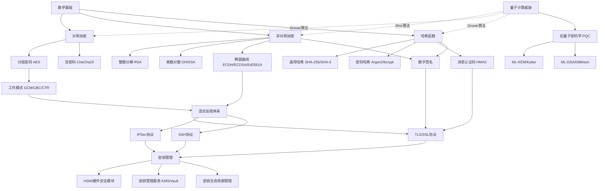

# 第13章 密码学 - 本章小结

本章从数学基础出发，系统覆盖了密码学的完整知识体系——从对称加密、非对称加密、哈希函数到数字签名、密钥管理和密码协议，再到常见误区、实战案例和前沿趋势。本小结不是简单的要点罗列，而是一次**知识的重构与升华**：将分散在各节的概念串联成完整的认知框架，帮助你建立"看到任何安全问题都能找到密码学解法"的直觉。

## 一、密码学四大支柱：一张图看懂全貌

密码学的所有技术都服务于四个安全目标，理解这个映射关系是掌握全章的前提：

```text
┌─────────────────────────────────────────────────────────────────┐
│                    密码学安全服务模型                              │
├──────────────┬──────────────────────┬───────────────────────────┤
│   安全目标    │     核心技术          │      典型算法/协议        │
├──────────────┼──────────────────────┼───────────────────────────┤
│  机密性       │ 对称加密 + 非对称加密  │ AES-GCM, ChaCha20, RSA  │
│ Confidentiality│ 混合加密体系        │ ECDH密钥交换 + AES数据加密│
├──────────────┼──────────────────────┼───────────────────────────┤
│  完整性       │ 哈希函数 + MAC       │ SHA-256, HMAC-SHA256     │
│ Integrity    │ AEAD认证加密         │ AES-GCM, ChaCha20-Poly1305│
├──────────────┼──────────────────────┼───────────────────────────┤
│  真实性       │ 数字签名 + 认证协议   │ Ed25519, ECDSA, TLS握手  │
│ Authentication│ 证书体系             │ X.509, PKI              │
├──────────────┼──────────────────────┼───────────────────────────┤
│  不可否认性   │ 数字签名             │ RSA-PSS, ECDSA           │
│Non-repudiation│ 时间戳服务           │ RFC 3161                │
└──────────────┴──────────────────────┴───────────────────────────┘
```

**关键认知**：实际系统中这四个目标不是孤立实现的。TLS 1.3一次握手同时提供全部四项服务——ECDHE提供机密性（前向保密），AEAD提供完整性和真实性，证书链提供不可否认性。这种"混合加密"思想是现代密码工程的核心模式。

## 二、各节核心知识深度回顾

### 2.1 对称加密：速度与安全的平衡

对称加密是密码学的"主力引擎"，处理绝大部分数据加密任务。本节核心知识点：

**算法选择决策树：**

| 场景 | 推荐算法 | 密钥长度 | 工作模式 | 理由 |
|------|---------|---------|---------|------|
| 通用数据加密 | AES-256-GCM | 256位 | GCM (AEAD) | NIST标准，硬件加速（AES-NI） |
| 移动/嵌入式 | ChaCha20-Poly1305 | 256位 | 流密码原生 | 无AES-NI时性能更优 |
| 高吞吐量场景 | AES-256-CTR + HMAC | 256位 | CTR + 独立MAC | 可并行，灵活度高 |
| 遗留兼容（不推荐）| AES-128-CBC | 128位 | CBC | 仅限无法升级的遗留系统 |

**工作模式的本质区别：**

- **ECB**（电子密码本）：每个块独立加密，相同明文→相同密文，泄露数据模式。经典案例：ECB加密的Tux企鹅图片仍可辨认轮廓。**永远不要使用。**
- **CBC**（密码分组链接）：前一块密文参与下一块加密，破坏模式。但存在Padding Oracle攻击风险，需要正确实现填充验证。
- **CTR**（计数器）：将分组密码变成流密码，支持并行和随机访问。但不具备认证能力，需要额外配合MAC。
- **GCM**（Galois/计数器）：CTR模式 + GMAC认证，一步到位的AEAD方案。**当前首选**。注意：IV/Nonce绝对不能重用，否则认证标签可被伪造。

**实战要点：**
```python
# AES-GCM正确实现模板
from cryptography.hazmat.primitives.ciphers.aead import AESGCM
import os

key = AESGCM.generate_key(bit_length=256)
aesgcm = AESGCM(key)
nonce = os.urandom(12)  # 96位随机nonce，每次加密必须不同

# 加密（附带关联数据aad）
ciphertext = aesgcm.encrypt(nonce, plaintext, aad)

# 解密（验证aad和tag）
plaintext = aesgcm.decrypt(nonce, ciphertext, aad)
```

**常见陷阱**：nonce重用是GCM最致命的错误。同一密钥下重用nonce会导致认证完全失效，攻击者可以伪造任意消息。解决方案：使用随机nonce（2^32次加密内安全）或计数器nonce（严格递增）。

### 2.2 非对称加密：信任的数学基础

非对称加密解决了对称加密的根本难题——密钥分发，但性能代价高昂（比对称加密慢100-1000倍）。

**三大数学难题与对应算法：**

| 数学难题 | 代表算法 | 安全强度(位) | 密钥长度 | 特点 |
|---------|---------|-------------|---------|------|
| 大整数分解 | RSA | 112/128/140 | 2048/3072/4096位 | 历史最久，生态最成熟 |
| 离散对数 | DH, DSA | 112/128 | 2048/3072位 | 密钥交换基础 |
| 椭圆曲线离散对数 | ECDH, ECDSA, Ed25519 | 128/192/256 | 256/384/521位 | 短密钥高效率，首选 |

**ECC为何取代RSA成为主流：**
- 256位ECC ≈ 3072位RSA的安全强度
- 密钥生成速度快10倍以上
- 签名验证快5-10倍
- 带宽消耗仅为RSA的1/10
- TLS 1.3默认使用ECDHE密钥交换

**前向保密（PFS）** 是非对称加密的关键设计原则：每次会话使用临时密钥对（Ephemeral Key），即使长期私钥泄露，历史会话的密钥也无法被推导。TLS 1.3强制要求前向保密，彻底废弃了RSA密钥交换。

### 2.3 哈希函数：数字世界的指纹

哈希函数看似简单，却是密码学中用途最广的原语。理解其三个安全性质至关重要：

**三大安全性质的直觉解释：**
- **抗原像**（单向性）：给定哈希值h，无法找到原始消息m。类比：看到指纹无法还原手指。
- **抗第二原像**：给定消息m1，无法找到另一个消息m2产生相同哈希。类比：无法找到另一个手指有相同指纹。
- **抗碰撞**：无法找到任意两个不同消息产生相同哈希。类比：无法找到两个不同的手指有相同指纹。

**算法淘汰时间线：**
```text
MD5 (1991) ──→ 2004年实际碰撞 ──→ 完全废弃
SHA-1 (1995) ──→ 2017年实际碰撞(SHAttered) ──→ 完全废弃
SHA-2 (2001) ──→ 目前安全 ──→ 推荐使用SHA-256/384/512
SHA-3 (2015) ──→ 设计与SHA-2完全不同 ──→ 海绵结构，抗长度扩展攻击
BLAKE2 (2012) ──→ 比SHA-3更快 ──→ 高性能场景推荐
BLAKE3 (2020) ──→ 极致性能 ──→ 并行化，适合大文件
```

**密码哈希 vs 通用哈希——最容易犯的错误：**

通用哈希（SHA-256、MD5）设计目标是"快速计算"，这恰恰是密码存储最不需要的特性。密码哈希需要**故意放慢**：

| 特性 | 通用哈希 (SHA-256) | 密码哈希 (Argon2id) |
|------|-------------------|-------------------|
| 速度 | 越快越好 | 故意慢（抗暴力破解） |
| 盐值 | 不需要 | 必须（防彩虹表） |
| 工作因子 | 无 | 可调节（CPU/内存/并行度） |
| GPU抗性 | 无 | 内存硬函数抗GPU/ASIC |
| 推荐用途 | 完整性校验、数字签名 | 用户密码存储 |

**密码哈希首选方案（2024年推荐）：**
1. **Argon2id**：2015年密码哈希竞赛冠军，内存硬函数，同时抗GPU和侧信道。优先使用。
2. **bcrypt**：经典方案，广泛支持，但4096字节输入上限，内存消耗不可调。
3. **scrypt**：内存硬函数，但参数选择敏感，实现差异大。

```python
# Argon2id正确使用
from argon2 import PasswordHasher

ph = PasswordHasher(
    time_cost=3,        # 迭代次数
    memory_cost=65536,  # 内存消耗 64MB
    parallelism=4,      # 并行度
    hash_len=32,        # 输出长度
    salt_len=16         # 盐值长度
)

hash = ph.hash("user_password")         # 存储时
is_valid = ph.verify(hash, "user_password")  # 验证时
```

### 2.4 数字签名：信任的锚点

数字签名是非对称加密的"逆向应用"——用私钥签名，用公钥验证。它同时提供**身份认证**、**完整性保护**和**不可否认性**。

**三大签名算法对比：**

| 算法 | 基于 | 签名长度 | 签名速度 | 验证速度 | 特点 |
|------|-----|---------|---------|---------|------|
| RSA-PSS | 整数分解 | 256-512字节 | 慢 | 中等 | 生态成熟，兼容性好 |
| ECDSA | 椭圆曲线 | 64字节 | 中等 | 中等 | TLS/区块链广泛使用 |
| Ed25519 | Edwards曲线 | 64字节 | 快 | 最快 | 确定性签名，抗侧信道 |

**Ed25519的决定性优势：** 签名过程不依赖随机数生成器（确定性签名），从根本上避免了ECDSA因随机数k重用导致私钥泄露的灾难性问题。2010年索尼PS3的ECDSA实现因重用k值导致私钥被破解，是密码史上最著名的实现漏洞之一。

**ECDSA随机数k的致命陷阱：**
如果两次ECDSA签名使用相同的k值，攻击者可以通过简单的代数运算直接计算出私钥：
```text
已知: (r, s1) = sign(m1, k), (r, s2) = sign(m2, k)  # 相同的k和r
则: k = (s1 - s2)^(-1) * (m1 - m2) mod n
私钥: d = (s1 * k - m1) * r^(-1) mod n
```

### 2.5 密钥管理：最薄弱的环节

密码学有一个残酷的现实：**算法几乎不会被直接攻破，但密钥管理的失误每天都在导致安全事故。** 密钥管理是整个密码系统的阿喀琉斯之踵。

**密钥生命周期六阶段：**

```text
生成 ──→ 分发 ──→ 存储 ──→ 使用 ──→ 轮换 ──→ 销毁
 │        │        │        │        │        │
 ▼        ▼        ▼        ▼        ▼        ▼
CSPRNG   KEX/     HSM/     最小     自动化   安全擦除
         PKI      Vault    权限     策略     (多次覆写)
```

**每个阶段的关键要求：**

| 阶段 | 核心要求 | 常见错误 | 正确做法 |
|------|---------|---------|---------|
| 生成 | 密码学安全随机数 | 使用`random`而非`os.urandom` | 使用CSPRNG（`secrets`/`os.urandom`） |
| 分发 | 前向保密 | 长期RSA密钥交换 | ECDHE临时密钥交换 |
| 存储 | 加密+访问控制 | 明文存储、硬编码 | HSM、密钥管理服务、环境变量 |
| 使用 | 最小权限原则 | 所有服务共用一个密钥 | 按用途/环境分离密钥 |
| 轮换 | 自动化+无中断 | 从不轮换 | 自动轮换+版本管理+平滑过渡 |
| 销毁 | 不可恢复 | 简单delete | 多次覆写/加密擦除/物理销毁 |

**分层密钥架构（KEK/DEK模式）：**
```text
根密钥 (Root Key)
  └── 密钥加密密钥 (KEK)
        ├── 数据加密密钥 1 (DEK-1) ── 加密用户数据A
        ├── 数据加密密钥 2 (DEK-2) ── 加密用户数据B
        └── 数据加密密钥 3 (DEK-3) ── 加密用户数据C
```
KEK长期保存在HSM中，DEK频繁轮换。轮换DEK时只需用KEK重新加密新DEK，无需重新加密所有数据。

### 2.6 密码协议：从理论到工程的桥梁

密码算法本身不构成安全系统——**协议设计决定了算法组合是否真正安全**。

**TLS 1.3握手流程（核心协议）：**
```text
客户端                                          服务器
  │                                               │
  │──── ClientHello (支持的密码套件, key_share) ───→│
  │←── ServerHello (选定密码套件, key_share) ──────│
  │←── {EncryptedExtensions}                       │
  │←── {Certificate}                               │
  │←── {CertificateVerify}                         │
  │←── {Finished}                                  │
  │──── {Finished} ──────────────────────────────→│
  │                                               │
  │←═══════════ 应用数据（加密）══════════════════→│
```

**TLS 1.3相比1.2的关键改进：**
- 强制前向保密（移除RSA密钥交换）
- 1-RTT握手完成（1.2需要2-RTT）
- 加密更多握手信息（保护证书隐私）
- 仅保留5个安全密码套件（消除选择困难）
- 移除所有已知不安全特性（CBC、压缩、重协商）

## 三、核心能力评估矩阵

完成本章学习后，对照以下矩阵评估自己的掌握程度。每个能力项标注了入门、进阶、精通三个层级的具体标准：

### 3.1 算法选择能力

| 层级 | 标准 | 验证方法 |
|------|-----|---------|
| 入门 | 能区分对称/非对称加密，知道AES和RSA | 能回答：为什么HTTPS同时使用RSA和AES？ |
| 进阶 | 能根据场景选择算法和参数 | 能为一个新系统设计完整的加密方案 |
| 精通 | 理解算法安全边界，能评估抗量子能力 | 能分析算法在特定攻击模型下的安全性证明 |

### 3.2 正确实现能力

| 层级 | 标准 | 验证方法 |
|------|-----|---------|
| 入门 | 使用标准库实现基本加解密 | 用Python `cryptography`库实现AES-GCM |
| 进阶 | 正确处理IV/Nonce、填充、编码 | 能识别常见实现漏洞（IV重用、时序攻击） |
| 精通 | 能进行安全审计和漏洞挖掘 | 能发现并利用Padding Oracle等实现缺陷 |

### 3.3 密钥管理能力

| 层级 | 标准 | 验证方法 |
|------|-----|---------|
| 入门 | 不硬编码密钥，使用环境变量 | 代码中无明文密钥 |
| 进阶 | 实施密钥轮换和分层架构 | 能设计完整的密钥生命周期管理 |
| 精通 | 集成HSM/KMS，实现自动化 | 能设计企业级密钥管理基础设施 |

### 3.4 协议分析能力

| 层级 | 标准 | 验证方法 |
|------|-----|---------|
| 入门 | 理解TLS握手基本流程 | 能解释HTTPS如何建立安全连接 |
| 进阶 | 能配置和优化TLS | 能用`openssl s_client`分析连接安全性 |
| 精通 | 能发现协议设计缺陷 | 能分析BEAST、POODLE等协议攻击的原理 |

## 四、高频错误清单与纠正方案

以下是密码学实践中最常见的错误，按严重程度排序。每一条都对应真实的生产事故：

### 🔴 致命错误（直接导致密钥/数据泄露）

**错误1：自创加密算法**
- **为什么危险**：柯克霍夫原则——安全性应依赖密钥而非算法保密。公开算法经过全球密码学家数十年审查，自创算法几乎必然存在未知漏洞。
- **真实案例**：无数企业自研"加密方案"被安全研究员在数小时内攻破。
- **纠正**：永远使用AES、ChaCha20、RSA、ECC等标准算法。

**错误2：IV/Nonce重用**
- **为什么危险**：GCM模式下Nonce重用导致认证完全失效，攻击者可伪造任意消息。CTR模式下Nonce重用导致明文异或泄露。
- **真实案例**：2016年ROBOT攻击利用TLS实现中的Nonce管理缺陷。
- **纠正**：每次加密生成随机Nonce，或使用严格递增计数器。

**错误3：随机数生成器不合格**
- **为什么危险**：可预测的随机数等于可预测的密钥。
- **真实案例**：2013年Android Java SecureRandom漏洞导致比特币钱包被盗；Dual_EC_DRBG被确认为NSA后门。
- **纠正**：使用`os.urandom()`或`secrets`模块，永远不用`random`。

### 🟠 高危错误（削弱安全性但未必立即暴露）

**错误4：使用MD5/SHA-1存储密码**
- **为什么危险**：通用哈希计算速度太快（GPU可达每秒数十亿次），且无盐值保护。
- **纠正**：使用Argon2id（首选）、bcrypt、scrypt。

**错误5：使用ECB模式**
- **为什么危险**：相同明文产生相同密文，泄露数据模式。
- **纠正**：使用GCM（AEAD首选）或CTR+CBC配合HMAC。

**错误6：密钥硬编码**
- **为什么危险**：代码可能被逆向、泄露到公开仓库、被内部人员获取。
- **真实案例**：GitHub上每天有数千个API密钥被自动扫描工具发现。
- **纠正**：环境变量 + 密钥管理服务（Vault/KMS）+ `.gitignore`。

### 🟡 中等错误（影响合规和最佳实践）

**错误7：从不轮换密钥**
- **风险**：泄露的密钥长期有效，增加攻击窗口。
- **纠正**：自动化轮换策略 + 版本管理 + 平滑过渡。

**错误8：混淆编码与加密**
- **风险**：Base64编码没有任何安全性，但常被误认为"加密"。
- **纠正**：明确区分——编码（可逆，无密钥）≠ 加密（可逆，需密钥）≠ 哈希（不可逆）。

**错误9：忽视证书链验证**
- **风险**：不验证证书链导致中间人攻击。
- **纠正**：始终使用完整的证书链验证，禁止禁用证书校验。

## 五、密码学知识全景图

以下是本章所有知识点的逻辑关系图，展示了从数学基础到实际应用的完整路径：



## 六、分层学习路径

### 入门阶段（1-2周）：建立基础认知

**必做：**
- [ ] 理解对称加密和非对称加密的本质区别（一个密钥 vs 两个密钥）
- [ ] 用Python `cryptography`库实现AES-GCM加解密
- [ ] 理解哈希函数的三个安全性质，能用日常语言解释
- [ ] 使用bcrypt/Argon2实现密码存储（非SHA-256）
- [ ] 用浏览器开发者工具观察TLS握手过程
- [ ] 完成练习方法章节的基础练习（模运算、凯撒密码、AES加密）

**验证标准**：能独立实现一个安全的用户注册/登录系统（密码哈希+盐值）。

### 进阶阶段（2-4周）：掌握工程实践

**必做：**
- [ ] 理解RSA和ECC的数学原理（不需要推导，但要知道"为什么安全"）
- [ ] 实现RSA密钥生成、加密和签名（用标准库）
- [ ] 用`openssl s_client`分析真实网站的TLS配置
- [ ] 理解TLS 1.3握手流程，画出完整的消息序列图
- [ ] 设计并实现一个密钥轮换方案
- [ ] 学习并识别常见误区章节中的所有17个错误
- [ ] 完成实战案例章节的Web应用密码存储和HTTPS证书配置

**验证标准**：能为一个中型Web应用设计完整的密码学方案（传输加密+存储加密+密钥管理）。

### 精通阶段（1-3月）：深入理论与前沿

**必做：**
- [ ] 理解数字签名方案的安全性证明思路
- [ ] 学习侧信道攻击原理（时间攻击、缓存攻击），实现一个简单的时间攻击Demo
- [ ] 理解后量子密码学的四个NIST标准化算法
- [ ] 学习零知识证明的基本概念和应用场景
- [ ] 完成深度拓展章节的TLS握手手动分析和侧信道攻击实验
- [ ] 参加Cryptopals挑战（https://cryptopals.com/）
- [ ] 阅读《Serious Cryptography》或《Cryptography Engineering》

**验证标准**：能进行密码学实现的安全审计，发现并解释CVE中的密码学漏洞。

## 七、从本章出发：下一步学习方向

### 后量子密码学迁移

量子计算对现有密码体系构成根本性威胁。Shor算法可在多项式时间内破解RSA和ECC，Grover算法将对称密钥安全性减半。NIST已于2024年发布首批后量子密码标准：

- **ML-KEM（Kyber）**：密钥封装机制，替代ECDH
- **ML-DSA（Dilithium）**：数字签名，替代ECDSA
- **FN-DSA（FALCON）**：短签名方案
- **SLH-DSA（SPHINCS+）**：基于哈希的签名，安全假设最保守

**行动建议**：关注"密码敏捷性"（Crypto Agility）——系统应能在不重构的情况下切换密码算法。这是后量子迁移的核心工程需求。

### 高级密码学应用

- **同态加密**：在密文上直接计算，适用于隐私保护的数据分析。Microsoft SEAL和Google FHE库是主要开源实现。
- **零知识证明**：证明某个陈述为真而不泄露任何额外信息。zk-SNARKs（Zcash）和zk-STARKs（以太坊L2）是区块链隐私的核心技术。
- **安全多方计算（MPC）**：多方在不泄露各自输入的情况下共同计算。应用：联合征信、隐私保护机器学习。
- **可信执行环境（TEE）**：Intel SGX、ARM TrustZone提供硬件级安全隔离，是机密计算的基础。

### 推荐学习资源

**入门教材：**
- 《Understanding Cryptography》—— Christof Paar，配有免费在线视频课程
- Stanford密码学课程（Dan Boneh教授）—— Coursera免费开放

**进阶专著：**
- 《Serious Cryptography》—— Jean-Philippe Aumasson，现代密码学实用指南
- 《Cryptography Engineering》—— Ferguson/Schneier/Kohno，工程实践圣经

**前沿研究：**
- IACR ePrint Archive（https://eprint.iacr.org/）—— 密码学最新论文
- Cryptography Stack Exchange（https://crypto.stackexchange.com/）—— 密码学问答社区

**实践平台：**
- Cryptopals挑战（https://cryptopals.com/）—— 通过实践学密码学攻击
- Crypto101（https://www.crypto101.io/）—— 密码学入门课程

## 八、总结：一句话记住本章

> **密码学的核心不是算法，而是工程。** 使用标准算法、正确实现、妥善管理密钥、持续更新——做到这四点，你构建的系统就拥有了密码学提供的全部安全保障。记住：在密码学领域，"自己发明"是最大的敌人，"信任经过验证的标准"是最可靠的盟友。

---

> ⚠️ **安全警告与免责声明**
>
> 本章内容仅供**合法的安全测试与教育目的**使用。所有技术、工具和方法的讨论均旨在帮助安全从业者在**获得明确授权**的前提下进行防御性安全研究。
>
> - 🚫 **未经授权**对任何系统、网络或应用进行安全测试是**违法行为**
> - ✅ 所有实践活动应在**隔离的实验环境**中进行（如虚拟机、CTF平台）
> - ✅ 遵守所在国家和地区的**网络安全法律法规**
> - ✅ 遵循**负责任的漏洞披露**原则
>
> 作者不对因滥用本章内容造成的任何后果承担责任。
