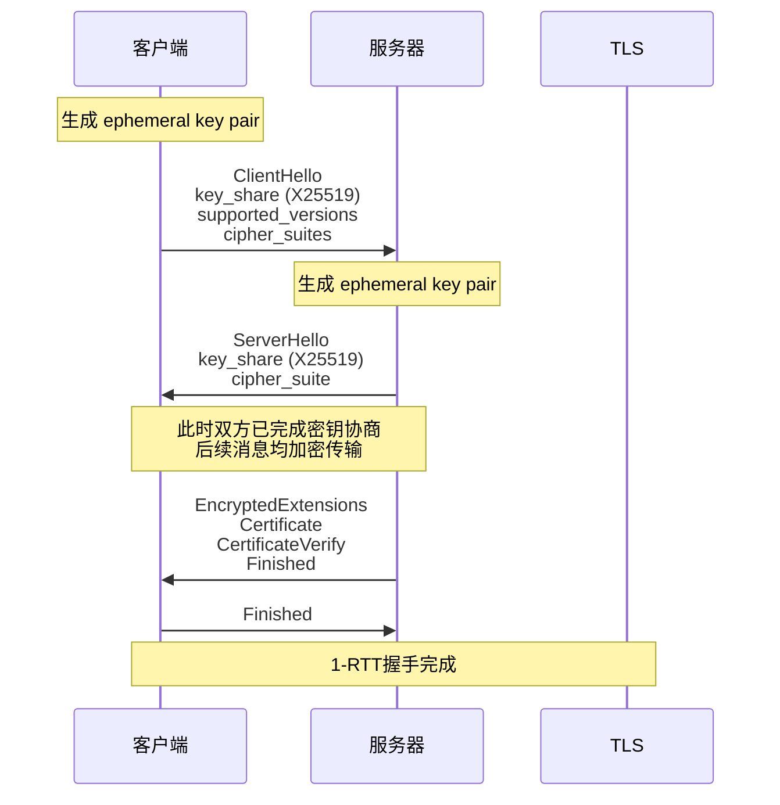
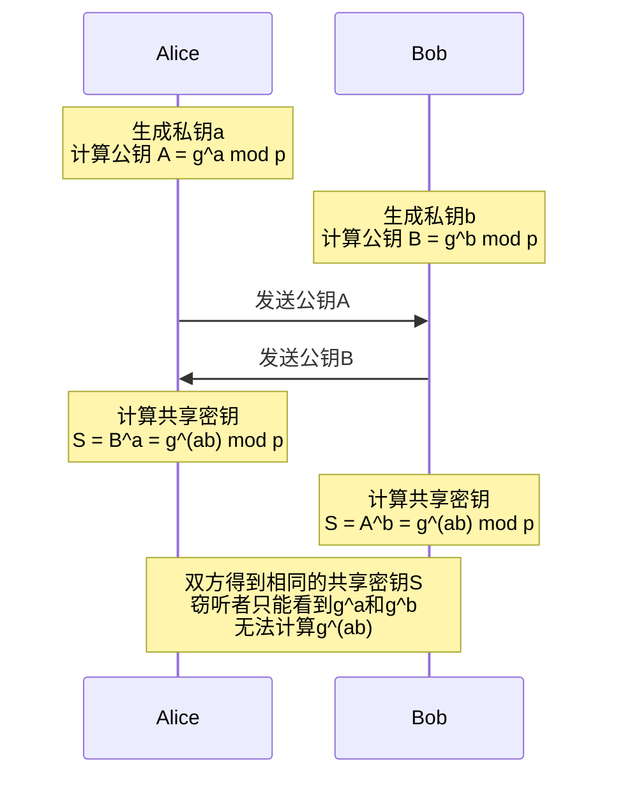

# 第13章 密码学 - 深度拓展

本章是密码学部分的进阶与前沿专题。如果你已经掌握了对称加密、非对称加密、哈希函数等基础概念，本章将带你深入理解这些技术背后的数学原理、工程实践中的关键决策、真实世界的安全漏洞成因，以及正在塑造密码学未来的前沿研究方向。

## 一、对称密码学深度解析

### 1.1 分组密码的工作模式

分组密码（如AES）只能加密固定长度的数据块——AES的标准块大小是128位（16字节）。现实世界中需要加密的数据几乎总是远超这个长度，因此需要**工作模式（Block Cipher Mode of Operation）**来将分组密码扩展为能处理任意长度数据的加密方案。工作模式的选择直接影响安全性、性能和功能特性，是密码工程中最关键的设计决策之一。

#### 1.1.1 ECB（电子密码本模式）

ECB是最简单的工作模式：将明文分成固定大小的块，每个块独立加密。

```python
# ECB模式的加密过程（概念演示）
def ecb_encrypt(plaintext_blocks, key):
    ciphertext_blocks = []
    for block in plaintext_blocks:
        ciphertext_blocks.append(aes_encrypt(block, key))  # 每个块独立加密
    return ciphertext_blocks
```

**致命缺陷——模式泄露**：相同的明文块在相同密钥下总是产生相同的密文块。这意味着如果明文中有重复的模式，密文中也会出现相同的重复模式。最经典的例子是ECB模式加密的Linux企鹅图片——即使加密后，企鹅的轮廓仍然清晰可见，因为图片中相同颜色的区域产生了相同的密文块。

```text
明文:  [AAAA] [BBBB] [AAAA] [CCCC] [AAAA]
ECB密文: [X1]   [X2]   [X1]   [X3]   [X1]  ← 相同明文块 → 相同密文块
CBC密文: [Y1]   [Y2]   [Y3]   [Y4]   [Y5]  ← 每个块的加密依赖前一个块
```

**适用场景**：ECB仅在加密单个数据块（如加密一个密钥）时是安全的。绝不应用于加密超过一个块的任何数据。

#### 1.1.2 CBC（密码分组链接模式）

CBC在加密每个明文块之前，先将其与前一个密文块进行XOR运算。第一个块使用一个随机的**初始化向量（IV）**。

```python
def cbc_encrypt(plaintext_blocks, key, iv):
    ciphertext_blocks = []
    prev = iv
    for block in plaintext_blocks:
        xored = xor(block, prev)          # 与前一个密文块XOR
        encrypted = aes_encrypt(xored, key)
        ciphertext_blocks.append(encrypted)
        prev = encrypted                   # 当前密文成为下一块的"前驱"
    return ciphertext_blocks
```

**CBC的关键安全要求**：

| 要求 | 说明 | 违反后果 |
|------|------|----------|
| IV必须随机且不可预测 | 每次加密使用新的随机IV | 可预测IV导致选择明文攻击（BEAST攻击） |
| 必须使用填充 | 明文不足一个块时需要填充到块大小 | 填充预言攻击（Padding Oracle Attack） |
| 不能并行加密 | 每个块的加密依赖前一个块的密文 | 性能受限，但这是设计取舍 |

**填充预言攻击（Padding Oracle Attack）**：这是CBC模式最著名的实际攻击。2002年Vaudenay证明，如果攻击者能够获得解密时填充是否正确的反馈（"oracle"），就可以逐字节恢复明文，而无需知道密钥。这个攻击在实际中影响了ASP.NET、Java Server Faces、Lucky Thirteen（针对TLS）等众多系统。

攻击原理简述：攻击者修改密文块的最后一个字节并发送给服务器，观察服务器是返回"填充错误"还是其他错误。如果返回填充错误，说明该字节修改后填充无效；否则填充有效，攻击者可以推断出对应的明文字节。通过系统性地修改每个字节位置，可以在最多256×N次尝试内恢复N字节的明文。

#### 1.1.3 CTR（计数器模式）

CTR模式将分组密码转变为流密码：使用加密算法生成密钥流，然后与明文XOR得到密文。

```python
def ctr_encrypt(plaintext, key, nonce):
    keystream = b''
    counter = 0
    while len(keystream) < len(plaintext):
        # 将nonce和计数器拼接后加密，生成密钥流块
        block = aes_encrypt(nonce + counter.to_bytes(8, 'big'), key)
        keystream += block
        counter += 1
    return xor(plaintext, keystream[:len(plaintext)])
```

**CTR的核心优势**：

- **并行加密**：每个块的密钥流可以独立计算，充分利用多核CPU和GPU
- **随机访问**：可以直接解密任意位置的数据块，无需从头开始
- **无填充**：不需要填充机制，因为XOR操作可以处理任意长度
- **硬件友好**：在AES-NI指令集上性能极高

**CTR的安全陷阱——nonce重用**：CTR模式的安全性完全依赖于nonce（计数器初始值）的唯一性。如果相同的(nonce, key)组合被使用两次，两次加密的密钥流相同，攻击者可以通过XOR两个密文来消除密钥流：

```text
C1 = P1 ⊕ Keystream
C2 = P2 ⊕ Keystream
C1 ⊕ C2 = P1 ⊕ P2  ← 密钥流被消除，泄露明文关系
```

WEP协议就是因为IV空间过小（24位）导致nonce重用，成为其被破解的核心原因之一。

#### 1.1.4 GCM（Galois/Counter Mode）

GCM是目前最推荐的工作模式，它在CTR模式的基础上增加了基于Galois域乘法的认证标签（GMAC），实现了**认证加密（AEAD）**——同时提供机密性、完整性和真实性。

```python
# GCM认证加密的使用示例（使用cryptography库）
from cryptography.hazmat.primitives.ciphers.aead import AESGCM
import os

key = AESGCM.generate_key(bit_length=256)
aesgcm = AESGCM(key)
nonce = os.urandom(12)  # 96位nonce，每次加密必须唯一

# 加密并认证
ciphertext = aesgcm.encrypt(nonce, plaintext, associated_data)
# associated_data不被加密但被认证（如TLS头部信息）

# 解密并验证
plaintext = aesgcm.decrypt(nonce, ciphertext, associated_data)
# 如果篡改了密文或associated_data，这里会抛出InvalidTag异常
```

**GCM为什么安全**：

1. CTR模式提供机密性
2. GMAC（Galois消息认证码）提供完整性验证
3. associated_data参数允许认证一些不需要加密的数据（如协议头部）
4. 认证标签在解密前验证，防止了填充预言攻击

**GCM的注意事项**：

- nonce绝不能在同一个密钥下重复使用——这会导致认证标签失效，攻击者可以伪造任意消息
- 标签截断会降低安全性（TLS使用128位完整标签）
- 每个密钥加密的消息数量有上限（约2^32条消息，使用96位nonce时）

#### 1.1.5 工作模式对比

| 模式 | 机密性 | 完整性 | 并行加密 | 并行解密 | 随机访问 | 是否推荐 |
|------|--------|--------|----------|----------|----------|----------|
| ECB | 有限 | 无 | 是 | 是 | 是 | ❌ 绝不 |
| CBC | 是 | 无 | 否 | 是 | 否 | ⚠️ 仅遗留系统 |
| CTR | 是 | 无 | 是 | 是 | 是 | ⚠️ 需配合MAC |
| GCM | 是 | 是 | 是 | 是 | 是 | ✅ 首选 |
| CCM | 是 | 是 | 否 | 是 | 否 | ✅ 资源受限环境 |
| ChaCha20-Poly1305 | 是 | 是 | 是 | 是 | 是 | ✅ 软件优化 |

### 1.2 流密码的安全性

流密码（如ChaCha20）生成密钥流与明文进行XOR运算，与分组密码的工作模式不同，流密码直接处理任意长度的数据。

**ChaCha20-Poly1305**：Daniel Bernstein设计的ChaCha20流密码配合Poly1305消息认证码，是Google推荐的TLS密码套件。在没有AES硬件加速的设备（如早期ARM处理器）上，ChaCha20比AES-GCM快2-3倍。Android和Chrome的默认TLS密码套件就是ChaCha20-Poly1305。

```python
# ChaCha20-Poly1305使用示例
from cryptography.hazmat.primitives.ciphers.aead import ChaCha20Poly1305
import os

key = ChaCha20Poly1305.generate_key()
chacha = ChaCha20Poly1305(key)
nonce = os.urandom(12)

ciphertext = chacha.encrypt(nonce, plaintext, associated_data)
plaintext = chacha.decrypt(nonce, ciphertext, associated_data)
```

**RC4的衰落与教训**：RC4曾广泛用于TLS（作为RC4密码套件）和WEP无线加密。从2001年起，研究人员陆续发现了RC4密钥流中的统计偏差——某些字节值出现的概率略高于其他值。2013年，多个研究团队利用这些偏差在TLS中恢复了明文信息（如HTTP Cookie）。2015年，RFC 7465正式禁止在TLS中使用RC4。RC4的教训是：**流密码的密钥流必须在统计上与真随机序列不可区分，任何微小的偏差都可能被放大为实际攻击**。

## 二、公钥密码学的数学基础

### 2.1 RSA算法的完整数学原理

RSA是1977年由Rivest、Shamir和Adleman发明的公钥密码算法，其安全性基于**大整数分解的困难性**。

#### 2.1.1 密钥生成过程

```python
import random
from math import gcd

def generate_rsa_keypair(bits=2048):
    # 步骤1: 选择两个大素数p和q
    p = generate_prime(bits // 2)
    q = generate_prime(bits // 2)
    
    # 步骤2: 计算模数n = p × q
    n = p * q
    
    # 步骤3: 计算欧拉函数φ(n) = (p-1)(q-1)
    phi_n = (p - 1) * (q - 1)
    
    # 步骤4: 选择公钥指数e（通常为65537 = 0x10001）
    e = 65537
    # 验证e与φ(n)互质
    assert gcd(e, phi_n) == 1
    
    # 步骤5: 计算私钥指数d，使得 e×d ≡ 1 (mod φ(n))
    d = mod_inverse(e, phi_n)
    
    # 公钥: (e, n), 私钥: (d, n)
    return (e, n), (d, n)
```

#### 2.1.2 为什么RSA是安全的

RSA的安全性依赖于以下数学关系：

- 知道n和e（公钥）是公开的
- 要计算d（私钥），需要知道φ(n) = (p-1)(q-1)
- 要计算φ(n)，需要知道p和q
- 要从n分解出p和q，需要解决**整数分解问题**

整数分解的计算复杂度：

| 密钥长度 | 最佳已知算法复杂度 | 安全等级（对称等效） |
|----------|-------------------|---------------------|
| 1024位 | 约2^80次操作 | 不安全，已被淘汰 |
| 2048位 | 约2^112次操作 | 112位安全 |
| 3072位 | 约2^128次操作 | 128位安全 |
| 4096位 | 约2^140次操作 | 约140位安全 |

**当前推荐**：2048位是最低要求，新建系统应使用3072位或4096位。NIST建议2030年后不再使用2048位RSA。

#### 2.1.3 RSA的常见攻击与防御

| 攻击方式 | 原理 | 防御措施 |
|----------|------|----------|
| 共模攻击 | 多个用户使用相同的n但不同的e加密同一消息 | 每个密钥对使用独立的n |
| 低指数攻击 | e太小导致明文未被充分"打散" | 使用e=65537 |
| Wiener攻击 | d太小时可以通过连分数展开恢复d | 使用OAEP填充，密钥生成时确保d足够大 |
| 时序攻击 | 解密操作的时间泄露d的信息 | 使用恒定时间实现 |
| Bleichenbacher攻击 | PKCS#1 v1.5填充错误泄露信息 | 使用OAEP填充 |

### 2.2 椭圆曲线密码学（ECC）

ECC基于**椭圆曲线离散对数问题（ECDLP）**的困难性，提供与RSA相同安全级别但密钥长度短得多。

#### 2.2.1 椭圆曲线的数学基础

椭圆曲线是满足以下方程的点集（在有限域上）：

```text
y² = x³ + ax + b  (mod p)
```

约束条件：判别式 4a³ + 27b² ≠ 0（确保曲线没有奇点）。

```python
# 椭圆曲线上的点加法（简化示意）
def point_add(P, Q, a, p):
    if P is None:  # P是无穷远点（零元素）
        return Q
    if Q is None:
        return P
    
    x1, y1 = P
    x2, y2 = Q
    
    if x1 == x2 and y1 != y2:
        return None  # P + (-P) = O（无穷远点）
    
    if P == Q:
        # 倍点运算
        lam = (3 * x1 * x1 + a) * mod_inverse(2 * y1, p) % p
    else:
        # 普通点加法
        lam = (y2 - y1) * mod_inverse(x2 - x1, p) % p
    
    x3 = (lam * lam - x1 - x2) % p
    y3 = (lam * (x1 - x3) - y1) % p
    return (x3, y3)
```

**标量乘法**是ECC的核心运算：给定曲线上的一个点G和整数k，计算Q = kG（G自身相加k次）。这是**容易**的（使用double-and-add算法，复杂度O(log k)）。但给定Q和G求k（离散对数问题）是**极其困难**的——这正是ECC安全性的基础。

#### 2.2.2 常用椭圆曲线

| 曲线名称 | 位数 | 设计者 | 安全等级 | 主要用途 | 特点 |
|----------|------|--------|----------|----------|------|
| P-256 (secp256r1) | 256 | NIST | 128位 | TLS、X.509证书 | 广泛支持，硬件加速 |
| Curve25519 | 256 | Bernstein | 128位 | Signal、WireGuard、SSH | 抗侧信道，高效实现 |
| secp256k1 | 256 | SECG | 128位 | 比特币、以太坊 | 特殊结构，便于验证 |
| P-384 | 384 | NIST | 192位 | 政府系统 | CNSA 2.0推荐 |
| Ed448 | 448 | Bernstein | 224位 | 高安全需求 | 黄金级曲线 |

**为什么Curve25519优于P-256**：

1. **设计透明**：Curve25519的参数选择有清晰的理由，没有"可疑的"常数
2. **实现安全**：设计上就考虑了侧信道攻击，即使是"天真"的实现也是安全的
3. **性能**：在软件实现中比P-256快30-50%
4. **没有专利问题**：Bernstein明确放弃了所有相关专利

**ECC vs RSA密钥长度对比**：

```text
安全等级    RSA密钥长度    ECC密钥长度    ECC优势
80位       1024位        160位         6.4倍
112位      2048位        224位         9.1倍
128位      3072位        256位         12倍
192位      7680位        384位         20倍
256位      15360位       512位         30倍
```

可以看到，安全等级越高，ECC的优势越明显。这是因为在渐近复杂度上，对RSA最好的攻击（数域筛法）是亚指数时间，而对ECC最好的攻击（Pollard rho）是完全指数时间。

### 2.3 离散对数问题（DLP）

DLP是Diffie-Hellman密钥交换和DSA签名的数学基础。

**DLP的形式化定义**：给定群G、生成元g和元素h = g^x，求x。

在不同群上，DLP的困难程度不同：

- **素数域乘法群 Zp***：经典的DLP，索引计算法（Index Calculus）攻击复杂度亚指数
- **椭圆曲线群 E(Fp)**：没有已知的亚指数攻击，最佳攻击（Pollard rho）是完全指数时间
- **二进制域 Z2^n**：存在Weil配对和Tate配对攻击，不推荐使用

### 2.4 哈希函数与消息认证

#### 2.4.1 密码学哈希函数的安全属性

密码学哈希函数必须满足三个核心安全属性：

**原像抗性（Pre-image Resistance）**——也叫"单向性"：
给定哈希值h，计算上不可行找到任意消息m使得H(m) = h。这意味着哈希函数是"容易计算但难以逆向"的——就像打碎一个花瓶容易，但从碎片复原花瓶极其困难。

**第二原像抗性（Second Pre-image Resistance）**——也叫"弱抗碰撞性"：
给定消息m1，计算上不可行找到不同的m2使得H(m1) = H(m2)。这意味着你不能在已知一个消息的情况下"伪造"另一个具有相同哈希值的消息。

**抗碰撞性（Collision Resistance）**——也叫"强抗碰撞性"：
计算上不可行找到任意两个不同的消息m1和m2使得H(m1) = H(m2)。注意这里不要求m1是事先给定的——攻击者可以自由选择两个消息。

**三个属性的强度关系**：抗碰撞性 > 第二原像抗性 > 原像抗性。一个函数如果抗碰撞，则必然也满足第二原像抗性和原像抗性，反之不一定成立。

**生日悖论与碰撞攻击**：对于一个输出长度为n位的哈希函数，找到碰撞只需要约2^(n/2)次操作（而非直觉的2^n）。这就是为什么SHA-1（160位输出）只需要约2^80次操作就能找到碰撞——2017年Google的SHAttered项目用约2^63次SHA-1压缩函数调用（9×10^18次，约110 GPU年）实现了第一个实际碰撞。

#### 2.4.2 哈希函数的演进

| 算法 | 输出长度 | 状态 | 安全事件 | 适用场景 |
|------|----------|------|----------|----------|
| MD5 | 128位 | ❌ 已破解 | 2004年王小云团队实现碰撞攻击；2008年MD5碰撞被用于伪造SSL证书 | 仅用于非安全用途（如文件校验完整性、缓存键） |
| SHA-1 | 160位 | ❌ 已破解 | 2017年Google SHAttered碰撞攻击 | 不再用于任何安全用途 |
| SHA-256 | 256位 | ✅ 安全 | 无已知实用攻击 | 通用，TLS、区块链、数字签名 |
| SHA-384 | 384位 | ✅ 安全 | 无已知实用攻击 | 高安全需求 |
| SHA-512 | 512位 | ✅ 安全 | 无已知实用攻击 | 高安全需求，64位平台优化 |
| SHA-3 | 可变 | ✅ 安全 | 无已知实用攻击 | SHA-2的备选方案，不同设计结构 |
| BLAKE2 | 可变 | ✅ 安全 | 无已知实用攻击 | 高性能哈希，比SHA-3快 |
| BLAKE3 | 256位 | ✅ 安全 | 无已知实用攻击 | 极高性能，支持并行 |

**SHA-3的特殊之处**：SHA-3采用**海绵结构（Sponge Construction）**，与SHA-2的Merkle-Damgård结构完全不同。这意味着即使SHA-2被发现存在结构性弱点，SHA-3也不会受到影响。海绵结构交替执行"吸收"（absorb）和"挤出"（squeeze）阶段，将输入数据"吸收"到内部状态，然后从内部状态"挤出"哈希输出。

```python
# SHA-3使用示例
import hashlib

# SHA3-256
h = hashlib.sha3_256(b"message")
print(h.hexdigest())  # 64个十六进制字符

# SHAKE128（可变长度输出）
shake = hashlib.shake_128(b"message")
print(shake.hexdigest(32))  # 输出32字节
```

#### 2.4.3 消息认证码（MAC）

MAC用于验证消息的完整性和真实性——它不仅能检测消息是否被篡改，还能确认消息确实来自预期的发送者（前提是共享密钥未泄露）。

**HMAC（基于哈希的MAC）**是最广泛使用的MAC构造：

```text
HMAC(K, m) = H((K' ⊕ opad) || H((K' ⊕ ipad) || m))
```

其中K'是密钥（如果密钥长度超过哈希块大小则先哈希），opad和ipad是固定的填充常量。这种两层嵌套结构提供了比简单地"将密钥和消息拼接后哈希"更强的安全证明。

```python
import hmac
import hashlib

# HMAC-SHA256的正确使用
key = b'secret_key_32_bytes_long_for_hmac'
message = b'Hello, World!'

# 计算HMAC
mac = hmac.new(key, message, hashlib.sha256).hexdigest()

# 验证HMAC（使用hmac.compare_digest防止时序攻击）
expected_mac = hmac.new(key, received_message, hashlib.sha256).digest()
if hmac.compare_digest(received_mac, expected_mac):
    print("消息验证通过")
```

**GMAC**是GCM模式的认证部分，基于Galois域的乘法。与HMAC相比，GMAC可以与加密操作并行计算，在硬件实现中效率更高。但GMAC单独使用时（不配合CTR加密），需要唯一的nonce。

### 2.5 数字签名方案

数字签名是公钥密码学的另一大应用：签名者使用私钥对消息（或消息的哈希值）进行签名，任何人都可以使用公钥验证签名的真实性。

#### 2.5.1 主要签名算法对比

| 算法 | 基于问题 | 密钥大小 | 签名大小 | 速度 | 确定性 | 代表事件 |
|------|----------|----------|----------|------|--------|----------|
| RSA-PSS | 整数分解 | 3072位 | 3072位 | 慢 | 是 | TLS标准算法 |
| ECDSA | ECDLP | 256位 | 512位 | 中 | 否 | PS3私钥泄露事件 |
| EdDSA (Ed25519) | ECDLP | 256位 | 512位 | 快 | 是 | SSH/TLS现代推荐 |

#### 2.5.2 ECDSA的致命陷阱——随机数重用

ECDSA签名过程中需要生成一个随机数k。如果相同的k被用于两次不同的签名，私钥可以被完全恢复：

```text
签名1: (r, s1), 其中 s1 = k^(-1)(z1 + r·d) mod n
签名2: (r, s2), 其中 s2 = k^(-1)(z2 + r·d) mod n
// r相同意味着k相同

s1 - s2 = k^(-1)(z1 - z2) mod n
k = (z1 - z2)(s1 - s2)^(-1) mod n
d = r^(-1)(k·s1 - z1) mod n  ← 私钥泄露！
```

**真实案例——PlayStation 3私钥泄露（2010年）**：Sony在PS3的ECDSA实现中使用了固定的k值。安全研究人员fail0verflow通过获取两个不同消息的签名，成功恢复了Sony的ECDSA私钥。这使得任何人都可以为PS3签署合法的固件更新，完全绕过了Sony的数字签名保护。

**EdDSA（Ed25519）如何避免这个问题**：EdDSA使用**确定性签名**——k值是从私钥和消息通过哈希函数确定性地派生出来的，完全不依赖随机数生成器。这意味着即使系统的RNG出问题，签名仍然是安全的。

```python
# Ed25519签名示例
from cryptography.hazmat.primitives.asymmetric.ed25519 import Ed25519PrivateKey

# 生成密钥对
private_key = Ed25519PrivateKey.generate()
public_key = private_key.public_key()

# 签名（确定性的——相同消息+相同密钥总是产生相同签名）
signature = private_key.sign(message)

# 验证
try:
    public_key.verify(signature, message)
    print("签名有效")
except Exception:
    print("签名无效")
```

#### 2.5.3 后量子签名方案

NIST后量子密码标准化项目已经选定了以下算法：

| 算法 | NIST名称 | 基于问题 | 公钥大小 | 签名大小 | 特点 |
|------|----------|----------|----------|----------|------|
| CRYSTALS-Dilithium | ML-DSA | 模块格 (LWE) | 1,312字节 | 2,420字节 | 首选方案，性能均衡 |
| FALCON | FN-DSA | NTRU格 | 897字节 | 666字节 | 签名最小，实现复杂 |
| SPHINCS+ | SLH-DSA | 哈希函数 | 32字节 | 7,856字节 | 基于哈希，保守安全 |

## 三、高级密码学协议

### 3.1 TLS 1.3协议深度分析

TLS 1.3（RFC 8446，2018年发布）是TLS协议的重大升级，它不仅仅是版本号的变化，而是对协议进行了根本性的重新设计。

#### 3.1.1 TLS 1.3握手流程



#### 3.1.2 TLS 1.3 vs TLS 1.2 关键改进

| 方面 | TLS 1.2 | TLS 1.3 | 改进原因 |
|------|---------|---------|----------|
| 握手往返 | 2-RTT | 1-RTT（支持0-RTT） | 减少延迟 |
| 密钥交换 | 支持RSA密钥交换 | 仅(EC)DHE | 强制前向保密 |
| 密码套件数量 | 数百个 | 5个 | 减少配置错误 |
| 密码模式 | 支持CBC、RC4等 | 仅AEAD | 消除已知漏洞 |
| 证书传输 | 明文 | 加密 | 保护服务器身份 |
| 密码协商加密 | 否 | 是 | 防止降级攻击 |
| 重协商 | 支持 | 移除 | 消除重协商攻击 |
| 压缩 | 支持 | 移除 | 消除CRIME攻击 |

#### 3.1.3 TLS 1.3的0-RTT恢复

TLS 1.3支持**0-RTT（Zero Round Trip Time Resumption）**：客户端在首次连接时缓存一个"预共享密钥"（PSK），后续连接时可以在发送第一个消息时就携带加密的应用数据，实现零延迟恢复。

**0-RTT的安全限制**：

```text
⚠️ 0-RTT数据没有前向保密
⚠️ 0-RTT数据可能被重放攻击
   → 服务器必须实现重放检测（如单次使用令牌、时间窗口限制）
⚠️ 只应发送幂等的请求（如GET），不应发送有副作用的操作
```

#### 3.1.4 TLS 1.3密码套件

TLS 1.3仅保留5个密码套件，全部是AEAD模式：

```text
TLS_AES_128_GCM_SHA256          ← 默认首选
TLS_AES_256_GCM_SHA384          ← 高安全需求
TLS_CHACHA20_POLY1305_SHA256    ← 无AES硬件时首选
TLS_AES_128_CCM_SHA256          ← IoT/嵌入式
TLS_AES_128_CCM_8_SHA256        ← 受限设备（截断标签）
```

注意：TLS 1.3的密码套件格式与TLS 1.2完全不同。TLS 1.3的密码套件只指定AEAD算法和哈希函数（用于密钥派生），密钥交换和认证算法是单独协商的。这是大幅减少套件数量的关键设计。

### 3.2 密钥协商协议

#### 3.2.1 Diffie-Hellman密钥交换

DH密钥交换允许两方在不安全的通道上协商共享密钥，是现代密码学最重要的发明之一。



**ECDHE（椭圆曲线Diffie-Hellman Ephemeral）**是TLS 1.3使用的方式：

```python
# ECDHE密钥交换示例（使用X25519）
from cryptography.hazmat.primitives.asymmetric.x25519 import X25519PrivateKey

# Alice
alice_private = X25519PrivateKey.generate()
alice_public = alice_private.public_key()

# Bob
bob_private = X25519PrivateKey.generate()
bob_public = bob_private.public_key()

# 双方交换公钥后计算共享密钥
alice_shared = alice_private.exchange(bob_public)
bob_shared = bob_private.exchange(alice_public)

assert alice_shared == bob_shared  # 双方得到相同的32字节共享密钥
```

"Ephemeral"（临时）的含义：每次握手都生成新的临时密钥对，用完即弃。这保证了**前向保密（Perfect Forward Secrecy, PFS）**——即使长期私钥后来被泄露，过去会话的临时密钥已经销毁，历史通信无法被解密。

#### 3.2.2 Signal协议

Signal协议（前身为TextSecure协议）是WhatsApp、Signal、Facebook Messenger等端到端加密消息系统的基础。它由Moxie Marlinspike和Trevor Perrin在2013年设计，被认为是现代安全消息协议的黄金标准。

**Signal协议的核心组件**：

1. **X3DH（Extended Triple Diffie-Hellman）密钥协商**：允许一方在对方离线时发起加密会话。使用三个DH交换组合，结合长期密钥和临时密钥生成初始共享秘密。

2. **双棘轮算法（Double Ratchet Algorithm）**：
   - **DH棘轮**：每次消息交换都进行新的DH密钥交换，提供前向保密
   - **对称棘轮**：使用密钥派生函数（KDF）链从当前密钥派生下一个密钥
   - 结合两者：DH棘轮提供前向保密，对称棘轮保证即使DH棘轮被破解，攻击者也只能获得有限的消息

3. **Sesame协议**：处理多设备场景——同一用户在不同设备上使用不同的会话密钥，服务器负责路由消息到正确的设备。

**Signal协议的安全属性**：

- **前向保密（Forward Secrecy）**：过去的密钥泄露不影响过去的消息
- **未来保密（Post-compromise Security）**：密钥泄露后，新的DH棘轮步骤会"治愈"泄露
- **可否认性（Deniability）**：消息的接收者可以伪造发送者的签名（但不能向第三方证明）
- **消息重排序容忍**：消息可以乱序到达而不会导致解密失败

### 3.3 零知识证明（ZKP）

零知识证明是密码学中最深刻的概念之一：它允许证明者向验证者证明某个陈述为真，而不泄露任何关于该陈述的额外信息。

#### 3.3.1 经典示例——阿里巴巴洞穴

想象一个环形洞穴，中间有一扇密码门。证明者（P）声称知道密码门的密码，验证者（V）站在洞穴入口看不见门。

```text
    入口 A
   /      \
  /        \
 B ← 密码门 → C
  \        /
   \      /
    出口 D
```

协议：
1. P随机选择从A或C进入洞穴
2. V站在B或D处，随机要求P从某一边出来
3. 如果P真的知道密码，无论V要求从哪边出来，P都可以通过（不知道密码的话，只有50%概率蒙对）
4. 重复n次后，不知道密码的人蒙对n次的概率是(1/2)^n

关键特性：
- **完备性**：如果陈述为真，诚实的证明者总能说服验证者
- **可靠性**：如果陈述为假，任何证明者都无法以高概率说服验证者
- **零知识性**：验证者除了"陈述为真"这一事实外，没有学到任何其他信息

#### 3.3.2 现代零知识证明系统

| 系统 | 全称 | 证明大小 | 验证时间 | 可信设置 | 抗量子 | 主要应用 |
|------|------|----------|----------|----------|--------|----------|
| zk-SNARKs | 简洁非交互式零知识知识论证 | ~200字节 | 毫秒级 | 需要 | 否 | Zcash、Tornado Cash |
| zk-STARKs | 可扩展透明零知识知识论证 | ~50KB | 秒级 | 不需要 | 是 | StarkNet、隐私计算 |
| Bulletproofs | 子弹证明 | ~1KB | 线性 | 不需要 | 否 | Monero、范围证明 |
| Groth16 | - | ~200字节 | 毫秒级 | 需要（每电路） | 否 | 早期zk-Rollup |

**zk-SNARKs vs zk-STARKs核心区别**：

- **可信设置**：zk-SNARKs需要一个"有毒废料"（toxic waste）的可信设置仪式——如果参与者保留了这些随机数，他们就能伪造证明。zk-STARKs使用公开随机性，不需要可信设置。
- **量子安全**：zk-SNARKs基于椭圆曲线配对，受量子计算威胁；zk-STARKs基于哈希函数，被认为是后量子安全的。
- **证明大小**：zk-SNARKs的证明极小（约200字节），验证极快；zk-STARKs的证明较大（约50KB），但证明生成更快。

#### 3.3.3 零知识证明的实际应用

1. **区块链隐私**：Zcash使用zk-SNARKs实现完全隐私的交易——交易金额、发送方、接收方全部隐藏，但矿工可以验证交易的有效性。Tornado Cash使用zk-SNARKs实现以太坊上的隐私转账。

2. **身份验证**：证明"我已年满18岁"而无需透露具体年龄或生日。Discord的匿名年龄验证就采用了类似技术。

3. **可验证计算**：证明某个计算的输出是正确的，而无需重新执行计算。这对云计算中的可验证外包计算至关重要。

4. **电子投票**：证明投票者有投票资格且投了有效票，而不泄露投了谁。瑞士的电子投票试点使用了零知识证明。

5. **区块链扩容（zk-Rollup）**：将大量交易在链下批量处理，生成一个零知识证明提交到链上，以太坊L2的zkSync、StarkNet、Polygon zkEVM都采用这种方式。

## 四、密码学攻击与分析

### 4.1 侧信道攻击

侧信道攻击不攻击密码算法本身，而是攻击密码算法的**物理实现**。它利用设备在执行加密操作时泄露的物理信息（时间、功耗、电磁辐射、声音等）来推断密钥。

#### 4.1.1 时间攻击（Timing Attack）

Paul Kocher在1996年首次展示了对RSA和Diffie-Hellman的时间攻击。基本原理：如果解密操作的时间依赖于密钥的值，攻击者可以通过测量大量解密操作的时间来推断密钥。

**RSA时间攻击实例**：RSA的模幂运算通常使用square-and-multiply算法。如果密钥位为1，执行一次额外的乘法操作。通过精确测量每个密钥位对应的计算时间，可以逐位恢复密钥。

```python
# 易受时间攻击的RSA签名验证（不安全示例）
def insecure_signature_verify(message, signature, public_key):
    expected = rsa_decrypt(signature, public_key)  # 解密签名
    # ❌ 字符串比较会在第一个不匹配字节处返回
    return expected == hash(message)  # 时间泄露了匹配了多少字节

# 安全的恒定时间比较
def secure_signature_verify(message, signature, public_key):
    expected = rsa_decrypt(signature, public_key)
    return hmac.compare_digest(expected, hash(message))  # ✅ 恒定时间
```

**恒定时间编程原则**：

- 所有条件分支应该执行相同的操作序列
- 所有内存访问应该是密钥无关的
- 使用位运算代替条件判断：`result = (a & mask) | (b & ~mask)` 代替 `if condition: result = a else: result = b`

#### 4.1.2 功耗分析

**简单功耗分析（SPA）**：通过单次功耗测量直接推断操作。例如，RSA的square-and-multiply算法中，multiply操作比square操作消耗更多能量，通过观察功耗曲线可以区分密钥位是0还是1。

**差分功耗分析（DPA）**：Paul Kocher在1999年提出的更强攻击。DPA通过统计分析大量（数千到数百万次）功耗测量，利用密钥假设将功耗曲线分为两组，如果假设正确，两组的平均功耗会有统计显著的差异。

```text
DPA攻击步骤：
1. 收集大量功耗曲线 {(m_i, t_i)}，其中m_i是明文，t_i是功耗
2. 对密钥的某个字节进行穷举猜测（256种可能）
3. 对每个猜测，根据中间值将功耗曲线分为两组
4. 计算两组平均功耗的差值
5. 正确的密钥猜测会产生最大的差值峰值
```

**相关功耗分析（CPA）**：比DPA更强的攻击，使用功耗模型（如汉明距离模型）和皮尔逊相关系数来推断密钥。CPA比DPA需要更少的功耗曲线就能恢复密钥。

#### 4.1.3 缓存攻击

现代CPU的缓存层次结构是侧信道攻击的重要来源。攻击者和受害者共享CPU缓存（特别是在云计算环境中），通过观察缓存行为可以推断受害者的内存访问模式。

**Flush+Reload攻击**：
1. 攻击者从共享内存中刷新目标缓存行
2. 等待受害者执行操作
3. 攻击者重新加载该缓存行并测量时间
4. 如果加载快（缓存命中），说明受害者访问了该地址

这种攻击曾被用于攻击AES的T-table实现、OpenSSL的RSA实现，甚至跨VM攻击云服务器上的加密操作。

**Prime+Probe攻击**：
1. 攻击者用自己的数据填满缓存
2. 等待受害者执行操作（受害者的访问会驱逐攻击者的数据）
3. 攻击者重新访问自己的数据并测量时间
4. 如果访问慢（缓存未命中），说明受害者访问了对应的缓存位置

**防御措施**：
- 使用缓存无关（cache-oblivious）算法
- AES使用硬件指令（AES-NI）而非软件T-table
- 使用恒定时间的密码实现
- 在云环境中使用专用硬件（HSM）

#### 4.1.4 故障注入攻击

故障注入攻击通过在密码运算过程中引入物理故障（电压毛刺、时钟毛刺、激光、电磁脉冲），使设备产生错误的计算结果，攻击者通过分析正确输出和错误输出的差异来恢复密钥。

**Bellcore攻击（针对RSA-CRT）**：RSA的签名通常使用中国剩余定理（CRT）加速：分别模p和模q计算签名，然后组合结果。如果在模p计算时注入故障导致结果错误，但模q计算正常，则：
```text
s' ≡ s (mod q) 但 s' ≢ s (mod p)
gcd(s' - s, n) = p  ← 私钥因子被恢复！
```

这个攻击只需要**一次**故障注入就能恢复整个RSA私钥。防御措施是在签名后重新验证签名的正确性。

### 4.2 量子计算对密码学的威胁

#### 4.2.1 Shor算法——公钥密码的终结者

Peter Shor在1994年提出的量子算法可以在多项式时间内解决整数分解和离散对数问题。这意味着一旦足够大的量子计算机出现，RSA、ECC、DH等所有主流公钥密码算法将被彻底攻破。

**Shor算法的工作原理**（简化）：

1. 将整数分解问题转化为求周期问题
2. 量子傅里叶变换（QFT）在多项式时间内求周期
3. 从周期推导出整数的因子

**需要多少量子比特**：

| 目标 | 逻辑量子比特 | 物理量子比特（含纠错） | 当前状态 |
|------|-------------|----------------------|----------|
| RSA-2048 | ~4,000 | ~20,000,000 | 远未达到 |
| ECC-256 | ~2,300 | ~10,000,000 | 远未达到 |
| 当前最大量子计算机 | - | ~1,000 | 差距巨大 |

当前最大的量子计算机约有1000个物理量子比特，但这些是有噪声的量子比特（NISQ时代），而Shor算法需要的是带纠错的逻辑量子比特。估计需要数百万个物理量子比特才能运行Shor算法破解RSA-2048。**专家估计实用化的密码破解量子计算机还需要15-30年**。

#### 4.2.2 Grover算法——对称密码的削弱

Lov Grover在1996年提出的量子搜索算法可以将暴力搜索的复杂度从O(N)降低到O(√N)。对于密码学的影响：

| 算法 | 经典安全等级 | 量子安全等级（Grover） | 应对措施 |
|------|-------------|----------------------|----------|
| AES-128 | 128位 | 64位 | 不再安全，需升级到AES-256 |
| AES-192 | 192位 | 96位 | 安全性显著降低 |
| AES-256 | 256位 | 128位 | 仍然安全 |
| SHA-256 | 256位 | 128位 | 碰撞攻击：170位 |
| SHA-512 | 512位 | 256位 | 仍然安全 |

**应对措施**：将对称密钥长度加倍。AES-256在量子计算时代仍然提供128位的安全性，这是足够的。

#### 4.2.3 后量子密码学（PQC）标准

NIST于2024年正式发布了首批后量子密码标准：

**密钥封装机制（KEM）**：
- **ML-KEM（Module-Lattice Key Encapsulation Mechanism）**：基于模块格的学习带错误（Module-LWE）问题。前身是CRYSTALS-Kyber，是NIST选定的唯一KEM标准。密钥大小约800-1568字节，远小于RSA但大于ECC。

**数字签名**：
- **ML-DSA（Module-Lattice Digital Signature Algorithm）**：基于模块格的数字签名。前身是CRYSTALS-Dilithium。是NIST推荐的首选后量子签名方案。
- **FN-DSA（FFT over NTRU-Lattice Digital Signature Algorithm）**：基于NTRU格的签名。前身是FALCON。签名尺寸最小（约666字节），但实现复杂且需要高精度浮点运算。
- **SLH-DSA（Stateless Hash-Based Digital Signature Algorithm）**：基于哈希的签名。前身是SPHINCS+。安全性基于哈希函数的安全性假设，是最保守的选择。

**全球后量子迁移时间表**：

| 组织/国家 | 要求 | 截止时间 |
|----------|------|----------|
| NIST | 所有联邦系统完成迁移 | 2035年 |
| NSA CNSA 2.0 | 关键系统开始迁移 | 2025年 |
| NSA CNSA 2.0 | 关键系统完成迁移 | 2033年 |
| 欧盟 ENISA | 制定迁移路线图 | 2024年已完成 |
| 中国 | 推进自主PQC标准 | 时间表未公开 |

**迁移挑战**：

1. **"先收割后解密"（Harvest Now, Decrypt Later）**：攻击者现在截获加密通信，等量子计算机成熟后再解密。这对需要长期保密的数据（如政府机密、医疗记录）构成直接威胁。
2. **协议兼容性**：后量子算法的密钥和签名大小远大于现有算法，可能需要修改TLS、IPsec等协议的握手流程。
3. **性能影响**：后量子算法的计算开销通常更大，对嵌入式设备和IoT构成挑战。
4. **混合方案**：过渡期间可能需要同时使用经典和后量子算法（如ECDH + ML-KEM），以确保即使其中一个被攻破，另一个仍然安全。

### 4.3 密码学实现漏洞

#### 4.3.1 随机数生成器缺陷

密码学中，随机数的质量直接决定了密钥的安全性。一个有缺陷的随机数生成器（RNG）可以让"完美"的密码算法变得毫无用处。

**Dual_EC_DRBG后门事件（2013年）**：Dual_EC_DRBG是NIST在2006年标准化的随机数生成器。2013年Edward Snowden泄露的文件暗示NSA在这个标准中植入了后门——通过选择特定的椭圆曲线点P和Q，使得知道P和Q之间数学关系的人可以预测输出的随机数。这个事件导致NIST在2014年撤回了Dual_EC_DRBG标准。

**Android Java SecureRandom漏洞（2013年）**：Android的Java SecureRandom实现存在严重缺陷——某些情况下，相同的种子被重复使用，导致生成的随机数可预测。这个漏洞被用于窃取比特币：攻击者通过分析区块链上的交易签名，利用可预测的随机数恢复了用户的私钥。受影响的钱包包括Bitcoin Wallet和Blockchain.info。

**如何正确生成随机数**：

```python
import os

# ✅ 正确：使用操作系统提供的密码学安全随机数
key = os.urandom(32)  # 256位密钥

# ✅ Python 3.6+：使用secrets模块
import secrets
token = secrets.token_hex(32)

# ❌ 错误：使用普通随机数生成器
import random
key = random.randint(0, 2**256)  # 不安全！random模块不是密码学安全的

# ❌ 错误：使用时间戳作为种子
import time
random.seed(int(time.time()))  # 可预测！
```

#### 4.3.2 填充预言攻击

填充预言攻击利用服务器在解密时对填充错误和"其他错误"返回不同响应的漏洞，逐字节恢复明文。

**攻击的现实影响**：

- **POODLE攻击（2014年）**：利用SSL 3.0的CBC填充问题，可以解密HTTPS Cookie
- **Lucky Thirteen（2013年）**：利用TLS MAC验证和填充验证的时间差异
- **DROWN攻击（2016年）**：利用SSLv2的支持来攻击TLS连接

**根本防御**：使用AEAD模式（如AES-GCM或ChaCha20-Poly1305），因为AEAD模式在验证完整性之后才解密，不存在填充预言攻击的条件。

#### 4.3.3 Bleichenbacher攻击

Daniel Bleichenbacher在1998年提出的针对RSA PKCS#1 v1.5加密的选择密文攻击。攻击者通过向服务器发送精心构造的密文，并观察服务器的错误响应，逐步恢复明文。

**ROBOT攻击（Return of Bleichenbacher's Oracle Threat，2017年）**：研究人员发现，许多TLS实现在处理RSA密钥交换时仍然存在Bleichenbacher攻击的变种漏洞，影响了Facebook、PayPal等大型网站。这个漏洞本质上是因为TLS实现中的RSA解密代码在处理无效PKCS#1填充时泄露了不同的错误信息。

**根本防御**：使用RSA-OAEP（Optimal Asymmetric Encryption Padding）代替PKCS#1 v1.5，或更好——使用ECDHE密钥交换（完全避免RSA加密）。

## 五、行业前沿动态

### 5.1 同态加密

同态加密允许在**密文上直接进行计算**，计算结果解密后与在明文上执行相同计算的结果一致。这意味着数据可以在加密状态下被处理，处理者永远看不到原始数据。

```text
同态加密的工作流程：
1. 数据所有者用公钥加密数据 → [data]
2. 将加密数据发送给计算方
3. 计算方在密文上执行计算 → f([data]) = [result]
4. 将加密结果返回数据所有者
5. 数据所有者用私钥解密 → result = f(data)
```

**同态加密的分类**：

| 类型 | 支持的运算 | 效率 | 代表方案 |
|------|-----------|------|----------|
| 部分同态（PHE） | 仅加法或仅乘法 | 高 | Paillier（加法）、RSA（乘法） |
| 有些同态（SHE） | 加法和有限次乘法 | 中 | BGV、BFV |
| 全同态（FHE） | 任意计算 | 低 | CKKS、TFHE、OpenFHE |

**FHE的性能挑战**：每次乘法操作后，密文中的噪声会增长。当噪声超过阈值时，解密会失败。"Bootstrapping"操作可以重置噪声，但开销巨大。当前FHE的性能比明文计算慢约10^4-10^6倍，但这个差距正在快速缩小。

**实际应用**：
- **隐私保护的数据分析**：医院可以将患者数据加密后发送给AI公司进行疾病预测，AI公司看不到任何原始数据
- **隐私保护的机器学习**：在加密数据上训练模型（联邦学习的增强版）
- **安全投票**：对加密的选票进行计票，结果解密后只有总数

**开源实现**：
- Microsoft SEAL：最成熟的FHE库，支持BFV和CKKS方案
- OpenFHE：学术界主导的FHE库
- Google FHE：Google的FHE转换工具
- TFHE：支持快速bootstrapping的FHE库

### 5.2 多方安全计算（MPC）

MPC允许多方在**不泄露各自输入**的情况下共同计算一个函数的结果。

**百万富翁问题（Yao's Millionaires' Problem，1982年）**：两个百万富翁想知道谁更富有，但都不想透露自己具体的财富数额。MPC可以让他们在不泄露各自财富的情况下得到比较结果。

**MPC的核心技术**：

1. **秘密共享（Secret Sharing）**：将一个秘密分成n份，任意t份可以恢复秘密，少于t份无法获得任何信息。Shamir秘密共享方案使用多项式插值实现(t,n)门限。

```python
# Shamir秘密共享的简化示意
# 将秘密S分成3份，任意2份可恢复
import random

def split_secret(S, n=3, t=2):
    # 生成t-1次多项式 f(x) = S + a1*x + a2*x^2 + ...
    coefficients = [S] + [random.randint(0, p-1) for _ in range(t-1)]
    shares = [(i, sum(c * i**j for j, c in enumerate(coefficients)) % p) 
              for i in range(1, n+1)]
    return shares

# 任意2个份额可以通过拉格朗日插值恢复S
```

2. **混淆电路（Garbled Circuits）**：Yao在1986年提出的协议。将计算表示为布尔电路，然后对每个门进行"混淆"——用随机密钥加密真值表，只有输入对应的密钥才能解密正确的输出。

3. **不经意传输（Oblivious Transfer, OT）**：发送方有n条消息，接收方选择其中一条，发送方不知道接收方选了哪条，接收方不知道其他消息。OT是MPC的基础原语。

**MPC的实际应用**：
- **隐私保护的机器学习**：多个医疗机构在不共享患者数据的情况下联合训练疾病预测模型
- **联合征信**：多家银行在不共享客户信息的情况下评估信用风险
- **电子投票**：多个计票方在不泄露选票的情况下计算选举结果
- **加密货币隐私**：用于门限签名和分布式密钥生成

### 5.3 硬件安全模块（HSM）与可信执行环境（TEE）

#### 5.3.1 HSM

硬件安全模块是专用的密码学硬件设备，用于安全地生成、存储和使用密钥。密钥在HSM内部生成和使用，永远不以明文形式离开设备。

**HSM的安全等级**（FIPS 140标准）：

| 等级 | 要求 | 典型应用 |
|------|------|----------|
| Level 1 | 基本密码学要求 | 软件密钥存储 |
| Level 2 | 物理篡改证据 | 企业密钥管理 |
| Level 3 | 物理篡改响应（销毁密钥） | CA根密钥、银行HSM |
| Level 4 | 物理篡改主动响应，环境故障保护 | 最高安全需求 |

**HSM在PKI中的关键角色**：CA（证书颁发机构）的根密钥必须存储在Level 3或Level 4的HSM中。如果根密钥泄露，整个PKI体系的信任链将崩溃。

#### 5.3.2 TEE（可信执行环境）

TEE是CPU内部的一个隔离的安全区域，即使操作系统被攻破，TEE中的代码和数据仍然是安全的。

| TEE方案 | 提供方 | 特点 | 已知安全问题 |
|---------|--------|------|-------------|
| Intel SGX | Intel | 应用级enclave | Foreshadow、Plundervolt等侧信道攻击 |
| ARM TrustZone | ARM | 系统级安全分区 | 依赖安全OS的安全性 |
| AMD SEV | AMD | VM级加密 | 缺乏完整性保护（SEV），SEV-ES改进 |
| ARM CCA | ARM | 机密计算域 | 2023年推出，较新 |

**机密计算（Confidential Computing）**：结合TEE和云服务，在数据使用过程中（"使用中"）保护数据。传统加密只保护"静态"（存储中）和"传输中"的数据，机密计算补全了数据保护的最后一环。Azure Confidential Computing、Google Confidential VMs、AWS Nitro Enclaves都提供了基于TEE的机密计算服务。

### 5.4 可验证随机函数（VRF）与可验证延迟函数（VDF）

#### 5.4.1 可验证随机函数（VRF）

VRF是将私钥和输入映射到伪随机输出的函数，同时提供一个证明，任何人可以用公钥验证输出的正确性。

**VRF的关键性质**：
- **确定性**：相同输入总是产生相同输出
- **伪随机性**：输出对不知道私钥的人来说看起来是随机的
- **可验证性**：任何人都可以用公钥和证明验证输出

**VRF的应用**：
- **区块链共识**：Algorand使用VRF选择区块提议者，确保选择过程是随机且可验证的
- **DNS安全**：DNSSEC中使用VRF防止区域枚举攻击
- **彩票系统**：确保随机选择过程的公平性和可审计性

#### 5.4.2 可验证延迟函数（VDF）

VDF是一个需要**顺序计算**一定时间才能得到结果的函数，但结果一旦产生，可以被**快速验证**。

**VDF的关键性质**：
- **顺序性**：计算过程必须是顺序的，无法通过并行加速
- **可验证性**：结果可以被快速（对数时间）验证
- **唯一性**：给定输入，输出是唯一的

**VDF的应用**：
- **随机信标**：以太坊2.0的RANDAO + VDF方案用于生成不可预测的随机数
- **时间戳服务**：证明某个数据在某个时间点之前已经存在
- **防止前置交易（Front-running）**：通过引入计算延迟防止矿工/验证者抢先执行有利可图的交易

### 5.5 密码学敏捷性（Cryptographic Agility）

密码学敏捷性是指系统能够在不进行大规模重写的情况下替换其使用的密码算法。这在后量子迁移时期尤为重要。

**为什么密码学敏捷性重要**：
- 算法可能被攻破（如MD5、SHA-1、RC4）
- 新的算法标准会出现（如SHA-3、后量子算法）
- 合规要求可能变化（如政府要求使用特定算法）
- 性能需求可能变化（如从RSA迁移到ECC）

**实现密码学敏捷性的原则**：

1. **抽象密码操作**：使用接口而非具体算法类
2. **算法协商**：在协议中支持算法协商机制（如TLS的密码套件协商）
3. **配置驱动**：将算法选择放在配置文件中而非硬编码
4. **密钥版本化**：支持多个版本的密钥并存
5. **定期审计**：定期检查使用的算法是否仍然安全

```python
# 密码学敏捷性的代码设计示例
class CryptoProvider:
    """抽象密码操作接口"""
    def encrypt(self, plaintext: bytes, key: bytes) -> bytes: ...
    def decrypt(self, ciphertext: bytes, key: bytes) -> bytes: ...
    def sign(self, message: bytes, private_key: bytes) -> bytes: ...
    def verify(self, message: bytes, signature: bytes, public_key: bytes) -> bool: ...

class AESGCMProvider(CryptoProvider):
    """AES-GCM实现"""
    ...

class ChaCha20Provider(CryptoProvider):
    """ChaCha20-Poly1305实现"""
    ...

# 配置驱动的算法选择
def get_crypto_provider(config: dict) -> CryptoProvider:
    providers = {
        'aes-gcm': AESGCMProvider,
        'chacha20': ChaCha20Provider,
    }
    return providers[config['cipher']](config)
```

## 六、密钥管理最佳实践

密码学的安全性不仅取决于算法强度，更取决于密钥的管理水平。一个使用AES-256-GCM但密钥存储在明文文件中的系统，安全性为零。

### 6.1 密钥生命周期管理


| 阶段 | 关键要求 | 常见错误 |
|------|----------|----------|
| 生成 | 使用CSPRNG，足够的熵 | 使用普通random模块 |
| 分发 | 安全通道，证书验证 | 跳过证书验证 |
| 使用 | 最小权限，及时撤销 | 共享密钥，无访问控制 |
| 存储 | HSM或加密存储 | 明文存储在代码/配置文件中 |
| 轮换 | 定期轮换，自动执行 | 永不轮换 |
| 销毁 | 安全覆盖内存 | 仅删除文件引用 |

### 6.2 常见密钥管理错误

1. **密钥硬编码**：将密钥直接写在源代码中。GitHub上每天都有开发者不小心提交了包含密钥的代码。
2. **密钥共享**：多个服务使用同一个密钥，一旦泄露影响面巨大。
3. **不轮换密钥**：密钥使用多年不更换，增加泄露风险。
4. **密钥备份不安全**：备份密钥时没有加密保护。
5. **日志泄露密钥**：将密钥或密钥材料记录到日志中。

### 6.3 密钥管理工具

| 工具 | 类型 | 适用场景 |
|------|------|----------|
| HashiCorp Vault | 密钥管理服务 | 企业级密钥管理 |
| AWS KMS | 云密钥管理 | AWS环境 |
| Google Cloud KMS | 云密钥管理 | GCP环境 |
| age | 文件加密工具 | 个人/小团队文件加密 |
| SOPS | 密钥编辑器 | 加密的配置文件管理 |
| git-crypt | Git加密 | Git仓库中的敏感文件 |

## 七、学习资源

### 7.1 书籍

| 书名 | 作者 | 特点 | 适合人群 |
|------|------|------|----------|
| 《Introduction to Modern Cryptography》 | Katz, Lindell | 现代密码学权威教材，理论严谨 | 有数学基础的学习者 |
| 《Cryptography Engineering》 | Ferguson, Schneier, Kohno | 工程实践指南，侧重实现 | 开发者和工程师 |
| 《Serious Cryptography》 | Aumasson | 现代密码学实用指南 | 中级学习者 |
| 《Understanding Cryptography》 | Paar, Pelzl | 配有在线视频课程 | 入门学习者 |
| 《Applied Cryptography》 | Schneier | 经典著作，应用导向 | 所有层级 |
| 《Post-Quantum Cryptography》 | Bernstein, Buchmann, Dahmen | 后量子密码学专业书 | 研究者 |
| 《Real-World Cryptography》 | Wong | 关注实际协议和实现 | 开发者 |

### 7.2 在线资源

| 资源 | 地址 | 说明 |
|------|------|------|
| Dan Boneh密码学课程 | Coursera / Stanford Online | 最好的密码学在线课程 |
| Cryptography Stack Exchange | https://crypto.stackexchange.com/ | 密码学问答社区 |
| IACR ePrint Archive | https://eprint.iacr.org/ | 密码学论文预印本 |
| Crypto101 | https://www.crypto101.io/ | 密码学入门课程 |
| Practical Cryptography for Developers | https://cryptobook.nakov.com/ | 面向开发者的实践指南 |
| Cryptopals Challenges | https://cryptopals.com/ | 密码学实战挑战（强烈推荐） |
| NIST Cryptographic Standards | https://csrc.nist.gov/ | NIST密码标准和指南 |
| Trail of Bits Blog | https://blog.trailofbits.com/ | 安全研究博客，常有密码学内容 |

### 7.3 工具

| 工具 | 用途 | 地址 |
|------|------|------|
| OpenSSL | 密码学库和CLI工具 | https://www.openssl.org/ |
| Libsodium | 现代密码学库，API友好 | https://doc.libsodium.org/ |
| GnuPG (GPG) | OpenPGP实现 | https://gnupg.org/ |
| CyberChef | Web端密码学操作瑞士军刀 | https://gchq.github.io/CyberChef/ |
| SageMath | 数学软件，密码学研究 | https://www.sagemath.org/ |
| CrypTool | 密码学教育软件 | https://www.cryptool.org/ |
| Hashcat | GPU密码破解 | https://hashcat.net/ |
| John the Ripper | 密码破解 | https://www.openwall.com/john/ |
| dcode.fr | 在线密码分析工具 | https://www.dcode.fr/ |
| age | 现代文件加密工具 | https://github.com/FiloSottile/age |

## 八、思考与实践

### 8.1 思考题

1. **前向保密**：什么是前向保密（Perfect Forward Secrecy）？为什么TLS 1.3强制使用前向保密？如果长期密钥泄露，前向保密如何保护历史通信？如果系统使用RSA密钥交换（非临时DH），一次密钥泄露会影响多少会话？

2. **对称与非对称的协作**：对称密码和非对称密码各有什么优缺点？在TLS 1.3握手过程中，两者如何协作？为什么不直接用RSA加密所有应用数据？

3. **哈希函数选择**：假设你要设计一个需要长期安全的数字签名系统，你会选择SHA-256、SHA-384、SHA-3还是BLAKE3？考虑因素包括安全边际、性能、标准化状态、后量子安全。

4. **随机数的重要性**：解释为什么ECDSA中随机数k的重用会导致私钥泄露。EdDSA（Ed25519）如何从设计上避免这个问题？在没有硬件随机数生成器的嵌入式设备上，如何安全地生成随机数？

5. **量子威胁评估**：你的组织目前使用RSA-2048进行TLS通信，数据需要保密30年。你需要现在就开始后量子迁移吗？为什么？如果迁移，你会选择混合方案还是纯后量子方案？

### 8.2 实践项目

1. **TLS握手分析**：使用Wireshark捕获TLS 1.3握手过程，逐字段分析ClientHello和ServerHello消息，识别密钥交换、密码套件协商和证书传输。

2. **RSA实现**：从零实现一个RSA加密和签名系统（仅用于学习，不要用于生产），理解密钥生成、加密、解密、签名、验证的每个步骤。

3. **Cryptopals挑战**：完成Cryptopals Crypto Challenges（https://cryptopals.com/）的前两组（16道题），这是学习密码学攻击最有效的实践方式。

4. **侧信道实验**：用Python实现一个"有意"存在时间泄露的字符串比较函数，然后编写一个时间攻击脚本来恢复秘密字符串。理解恒定时间编程的重要性。

5. **Libsodium端到端加密**：使用Libsodium实现一个简单的端到端加密聊天程序，支持密钥交换（X25519）、加密（XChaCha20-Poly1305）和签名（Ed25519）。

6. **证书链验证**：使用OpenSSL手动验证一个HTTPS网站的证书链，理解证书颁发、信任锚、中间CA和叶子证书的关系。

---

> **本章寄语**：密码学是信息安全的基石，但密码学的安全性不仅取决于算法的数学强度，更取决于实现的正确性和使用的适当性。历史上被攻破的密码系统中，绝大多数不是因为算法本身被破解，而是因为实现缺陷（侧信道泄露、随机数缺陷、协议错误）或人为错误（密钥管理不当、配置错误）。永远不要自己发明密码算法，始终使用经过验证的库和标准。在后量子时代即将来临的今天，理解密码学的原理和实践比以往任何时候都更加重要。
