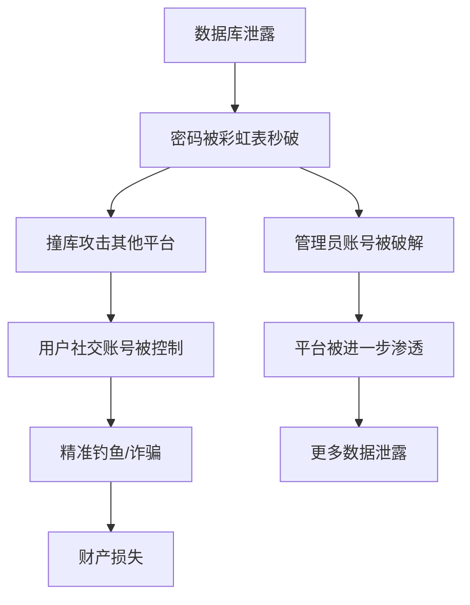
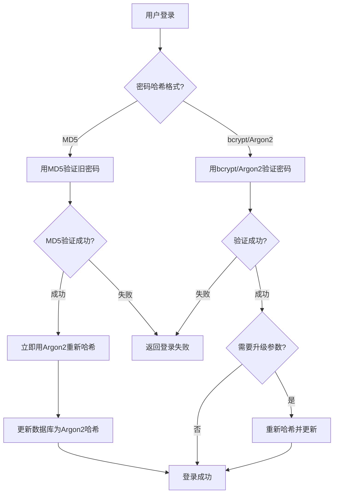

## 13.1 案例一：Web应用密码存储安全

密码存储是Web应用安全的第一道防线。一旦密码数据库泄露，存储方案的优劣直接决定了攻击者能否将哈希还原为明文密码。本案例从一个真实的数据泄露事件出发，系统讲解密码哈希的技术演进、攻击手段和工程实践。

### 13.1.1 真实事件：某电商平台数据泄露

#### 事件概述

2019年，某国内电商平台遭遇大规模数据泄露，约2300万用户的账户信息被窃取并在暗网出售。泄露的数据包括用户名、邮箱、手机号和密码哈希。安全研究人员分析后发现：

| 泄露字段 | 内容 | 示例 |
|---------|------|------|
| username | 用户名 | zhangsan_2019 |
| email | 邮箱 | zhangsan@example.com |
| phone | 手机号 | 138****1234 |
| password_hash | 密码哈希 | e10adc3949ba59abbe56e057f20f883e |
| salt | 盐值 | （为空） |

安全团队在30秒内就将该哈希通过彩虹表匹配出明文：`123456`。该平台的密码存储方案为**无盐MD5**，这在2019年已经是非常低级的安全错误。

#### 泄露后果链



这次事件的连锁反应极为严重：由于大量用户在多个平台使用相同密码，攻击者利用泄露的凭证对微信、支付宝、银行App发起撞库攻击，造成多起财产损失案件。

#### 类似历史事件

密码存储不当导致的重大泄露事件并非个案：

| 事件 | 年份 | 泄露规模 | 存储方案 | 破解率 |
|------|------|---------|---------|--------|
| LinkedIn | 2012 | 1.64亿 | 无盐SHA-1 | ~90% |
| Adobe | 2013 | 1.53亿 | 3DES-ECB（可逆） | ~70% |
| MySpace | 2016 | 3.6亿 | 无盐SHA-1 | ~85% |
| Dropbox | 2016 | 6800万 | bcrypt | <1% |
| 某电商平台（本案例） | 2019 | 2300万 | 无盐MD5 | ~95% |

注意Dropbox使用bcrypt的案例——即使数据库泄露，密码破解率也极低。这正是正确方案的价值。

### 13.1.2 问题分析：为什么无盐MD5是灾难性的

#### 原始实现（反面教材）

```python
import hashlib

# ❌ 危险：无盐MD5密码存储
def store_password(password: str) -> str:
    """将密码转为MD5哈希——这是完全错误的做法"""
    return hashlib.md5(password.encode('utf-8')).hexdigest()

# ❌ 同样危险：验证逻辑
def verify_password(password: str, stored_hash: str) -> bool:
    return hashlib.md5(password.encode('utf-8')).hexdigest() == stored_hash
```

这段代码存在四个致命缺陷，每一个都足以导致大规模密码泄露。

#### 缺陷一：MD5算法本身已被攻破

MD5（Message-Digest Algorithm 5）由Ron Rivest于1991年设计，输出128位哈希值。它的问题不只是"老"，而是数学结构已被彻底破解：

**碰撞攻击**：2004年，王小云教授团队展示了MD5碰撞的实用攻击方法。2008年，研究者用普通笔记本电脑在几秒内就能找到MD5碰撞。2012年的"Flame"恶意软件利用MD5碰撞伪造了微软的数字证书。

**GPU加速破解**：现代GPU（如NVIDIA RTX 4090）配合Hashcat工具，每秒可计算约1640亿次MD5哈希。对于一个8位纯数字密码（10^8种可能），理论上0.0006秒就能遍历完成。即使是包含大小写字母、数字和特殊字符的10位密码（约95^10 ≈ 5.9×10^19种），在GPU集群面前也需要不到几天。

```python
# 破解速度对比（RTX 4090, Hashcat基准）
benchmarks = {
    "MD5":       "164,000,000,000 次/秒",   # 1640亿
    "SHA-1":     "52,000,000,000 次/秒",     # 520亿
    "SHA-256":   "22,000,000,000 次/秒",     # 220亿
    "bcrypt-12": "153,000 次/秒",             # 15.3万
    "Argon2":    "约50,000 次/秒",            # 5万（取决于参数）
}
```

MD5的计算速度是bcrypt的约100万倍。这意味着如果攻击者破解bcrypt需要100年，破解同样复杂度的MD5只需要约5分钟。

#### 缺陷二：无盐导致彩虹表攻击

**什么是盐值（Salt）**：盐值是一个随机字符串，在哈希前与密码拼接。每个用户的盐值不同，即使两个用户使用相同密码，存储的哈希也完全不同。

```text
无盐：MD5("123456") = e10adc3949ba59abbe56e057f20f883e（所有用户相同）
有盐：MD5("123456" + "a8f3k2m9") = 7b2f...（与无盐结果完全不同）
```

**彩虹表原理**：彩虹表是一种预先计算的"明文→哈希"映射表。攻击者预先计算数十亿条常见密码的哈希值，泄露后只需查表即可秒破。对于无盐MD5，互联网上有大量现成的彩虹表：

| 彩虹表 | 覆盖范围 | 记录条数 | 文件大小 |
|--------|---------|---------|---------|
| 常见密码TOP 1000万 | 数字、字母组合 | 1000万 | ~500MB |
| RockYou字典 | 历史泄露密码 | 1400万 | ~1.2GB |
| 常用中文密码 | 拼音、生日、手机号 | 8000万 | ~3GB |
| 完整6-10位全字符 | 大小写+数字+符号 | 95^10 ≈ 5.9×10^19 | 不可存储（需计算） |

无盐MD5面对彩虹表毫无抵抗力——攻击者只需用`grep`匹配哈希值即可。

#### 缺陷三：无迭代拉伸

MD5是单轮哈希，设计目标是快速计算——这恰恰是密码存储不需要的。密码存储需要的是**慢哈希**：让每次计算都足够慢，使得大规模暴力破解在经济上不可行。

```text
MD5计算：password → [一轮运算] → hash     （约0.000000006秒）
bcrypt：  password → [2^12轮Blowfish] → hash （约0.0065秒）
Argon2：  password → [多轮+大内存] → hash     （约0.5-1秒）
```

单次计算bcrypt比MD5慢约100万倍，但对用户登录（每秒1次请求）完全没有感知。对攻击者（需要计算万亿次）却是致命的。

#### 缺陷四：缺乏密钥派生（Key Stretching）

真正的密码哈希函数（bcrypt、scrypt、Argon2）不只是"慢"——它们是专门设计的**密钥派生函数（KDF）**，具备以下特性：

- **可调工作因子**：可以随硬件发展增加计算成本
- **内存硬度**：Argon2和scrypt需要大量内存，限制了GPU/ASIC并行
- **内置盐值管理**：盐值自动嵌入输出哈希中
- **密码学证明的安全性**：有正式的安全分析和证明

### 13.1.3 密码哈希方案全景对比

在选择方案之前，需要全面了解所有主流密码哈希算法的特性：

| 特性 | MD5 | SHA-256 | bcrypt | scrypt | Argon2id |
|------|-----|---------|--------|--------|----------|
| 设计目标 | 快速校验 | 快速校验 | 密码哈希 | 密码哈希 | 密码哈希 |
| 输出长度 | 128位 | 256位 | 184位 | 可变 | 可变 |
| 轮次可调 | 否 | 否 | 是（2^cost） | 是 | 是 |
| 内存硬度 | 无 | 无 | 低（4KB） | 可调（16MB-1GB+） | 可调（推荐64MB+） |
| GPU抗性 | 无 | 无 | 中等 | 强 | 很强 |
| ASIC抗性 | 无 | 无 | 弱 | 强 | 很强 |
| 破解速度(4090) | 164B/s | 22B/s | 153K/s | ~100K/s | ~50K/s |
| 相对MD5慢速倍数 | 1× | 7.5× | 1,000,000× | 1,600,000× | 3,200,000× |
| OWASP推荐 | ❌ | ❌ | ✅（可用） | ✅（可用） | ✅（首选） |
| NIST标准 | 已废弃 | 非KDF | 无正式标准 | 无正式标准 | RFC 9106 |
| Go/Python支持 | 标准库 | 标准库 | bcrypt库 | pylibscrypt | argon2-cffi |

**选择建议**（按优先级）：

1. **Argon2id**：2015年密码哈希竞赛冠军，NIST RFC 9106标准。内存硬度使其对GPU/ASIC攻击免疫，是新项目的首选。
2. **bcrypt**：经过20+年实战检验，成熟稳定，库支持广泛。适合对Argon2依赖有顾虑的项目。
3. **scrypt**：内存硬度优秀，但库支持不如前两者丰富，主要用于加密货币领域。
4. **PBKDF2**：NIST SP 800-132推荐，合规场景可用，但缺乏内存硬度，GPU攻击成本较低。

**绝对不要使用**：MD5、SHA-1、SHA-256、SHA-512等通用哈希函数直接存储密码。

### 13.1.4 解决方案一：bcrypt实现

bcrypt由Niels Provos和David Mazières于1999年设计，基于Blowfish加密算法，是目前使用最广泛的密码哈希函数。

#### 完整实现

```python
import bcrypt
import logging
from typing import Optional

logger = logging.getLogger(__name__)


class BcryptPasswordManager:
    """基于bcrypt的密码管理器，支持可调工作因子。"""

    # OWASP 2024推荐：bcrypt cost factor >= 10
    DEFAULT_ROUNDS = 12  # 约250ms（现代CPU），平衡安全与性能

    def __init__(self, rounds: int = DEFAULT_ROUNDS):
        if rounds < 10:
            raise ValueError("OWASP推荐bcrypt rounds >= 10")
        self.rounds = rounds

    def hash_password(self, password: str) -> str:
        """
        将明文密码转换为bcrypt哈希。

        bcrypt输出格式：$2b$12$<22字符盐><31字符哈希>
        其中 2b=版本, 12=cost factor
        """
        if not password:
            raise ValueError("密码不能为空")
        if len(password) > 72:
            # bcrypt只使用前72字节，需截断或预哈希
            password = self._pre_hash(password)
            logger.warning("密码超过72字节，已使用SHA-256预哈希")

        salt = bcrypt.gensalt(rounds=self.rounds)
        hashed = bcrypt.hashpw(password.encode('utf-8'), salt)
        return hashed.decode('utf-8')

    def verify_password(self, password: str, stored_hash: str) -> bool:
        """验证密码是否匹配存储的哈希。"""
        try:
            # bcrypt.checkpw内部会从stored_hash中提取盐值和cost
            return bcrypt.checkpw(
                password.encode('utf-8'),
                stored_hash.encode('utf-8')
            )
        except (ValueError, TypeError):
            logger.error(f"哈希格式无效: {stored_hash[:20]}...")
            return False

    def needs_rehash(self, stored_hash: str) -> bool:
        """
        检查哈希是否需要重新计算（工作因子过低）。
        用于渐进式升级密码存储强度。
        """
        try:
            # 从哈希中提取当前cost factor
            current_rounds = int(stored_hash.split('$')[2])
            return current_rounds < self.rounds
        except (IndexError, ValueError):
            return True  # 格式异常，需要重哈希

    @staticmethod
    def _pre_hash(password: str) -> str:
        """对超长密码进行SHA-256预哈希，保留全部熵。"""
        import hashlib
        return hashlib.sha256(password.encode('utf-8')).hexdigest()
```

#### 性能基准测试

在不同cost factor下测试bcrypt的哈希和验证性能：

```python
import time
import bcrypt

def benchmark_bcrypt():
    """测试不同rounds下的bcrypt性能，帮助选择合适的参数。"""
    password = "Testyour_password_2024!"
    results = []

    for rounds in range(4, 15):
        salt = bcrypt.gensalt(rounds=rounds)

        # 测量哈希时间
        start = time.perf_counter()
        for _ in range(10):
            bcrypt.hashpw(password.encode('utf-8'), salt)
        hash_time = (time.perf_counter() - start) / 10

        # 测量验证时间
        hashed = bcrypt.hashpw(password.encode('utf-8'), salt)
        start = time.perf_counter()
        for _ in range(10):
            bcrypt.checkpw(password.encode('utf-8'), hashed)
        verify_time = (time.perf_counter() - start) / 10

        results.append({
            'rounds': rounds,
            'cost': 2 ** rounds,
            'hash_ms': hash_time * 1000,
            'verify_ms': verify_time * 1000,
        })

    return results
```

典型结果（AMD Ryzen 7 5800X，2024年）：

| Rounds | Cost Factor | 哈希耗时 | 验证耗时 | RTX 4090破解速度 | 推荐场景 |
|--------|------------|---------|---------|----------------|---------|
| 8 | 256 | ~2ms | ~2ms | ~600K/s | ❌ 太弱 |
| 10 | 1,024 | ~8ms | ~8ms | ~150K/s | 最低可用 |
| 12 | 4,096 | ~30ms | ~30ms | ~40K/s | ✅ 推荐默认值 |
| 13 | 8,192 | ~60ms | ~60ms | ~20K/s | 高安全场景 |
| 14 | 16,384 | ~120ms | ~120ms | ~10K/s | 极高安全/牺牲体验 |

选择原则：**哈希+验证时间不超过300ms**（用户可接受的登录延迟上限），同时最大化攻击者的破解成本。

#### 72字节限制的处理

bcrypt有一个容易被忽视的限制：只使用密码的前72字节。超过72字节的部分会被静默截断，这可能导致安全性降低：

```python
# ❌ 危险：72字节截断问题
password = "A" * 100  # 100个字符
password_truncated = "A" * 72  # 只取前72个字符

import bcrypt
salt = bcrypt.gensalt()
hash1 = bcrypt.hashpw(password.encode('utf-8'), salt)
hash2 = bcrypt.hashpw(password_truncated.encode('utf-8'), salt)

# 结果相同！攻击者只需猜测前72字节
assert hash1 == hash2  # True
```

正确做法是对长密码进行预哈希：

```python
import hashlib
import bcrypt

def hash_long_password(password: str) -> str:
    """处理超长密码：先SHA-256预哈希再bcrypt。"""
    if len(password.encode('utf-8')) > 72:
        # SHA-256输出64个十六进制字符（32字节），远低于72字节限制
        password = hashlib.sha256(password.encode('utf-8')).hexdigest()
    return bcrypt.hashpw(password.encode('utf-8'), bcrypt.gensalt(rounds=12))
```

### 13.1.5 解决方案二：Argon2实现（推荐）

Argon2在2015年赢得密码哈希竞赛（PHC），由Alex Biryukov等人设计。它有两种变体：

- **Argon2d**：最大化GPU抗性，但存在侧信道攻击风险
- **Argon2i**：抗侧信道攻击，但GPU抗性稍弱
- **Argon2id**：结合两者优势，**生产环境首选**

#### 完整实现

```python
import argon2
from argon2 import PasswordHasher, Type
from argon2.exceptions import VerifyMismatchError, VerificationError, InvalidHashError
import time
import logging

logger = logging.getLogger(__name__)


class Argon2PasswordManager:
    """
    基于Argon2id的密码管理器。

    参数说明：
    - time_cost:    迭代次数，增加CPU计算时间。值越大，暴力破解越慢。
    - memory_cost:  内存使用量(KB)。65536=64MB。增大此值可抵抗GPU攻击。
    - parallelism:  并行线程数。应匹配服务器CPU核心数。
    - hash_len:     输出哈希长度(字节)。32字节(256位)已足够安全。
    - salt_len:     盐值长度(字节)。16字节(128位)提供足够的唯一性。
    - encoding:     编码格式。
    - type:         Argon2变体。Argon2id是推荐选择。
    """

    def __init__(
        self,
        time_cost: int = 3,
        memory_cost: int = 65536,  # 64MB
        parallelism: int = 4,
        hash_len: int = 32,
        salt_len: int = 16,
    ):
        self.ph = PasswordHasher(
            time_cost=time_cost,
            memory_cost=memory_cost,
            parallelism=parallelism,
            hash_len=hash_len,
            salt_len=salt_len,
            type=Type.ID,  # Argon2id
        )
        self.time_cost = time_cost
        self.memory_cost = memory_cost
        self.parallelism = parallelism

    def hash_password(self, password: str) -> str:
        """
        将明文密码转换为Argon2哈希。

        Argon2输出格式：
        $argon2id$v=19$m=65536,t=3,p=4$<salt>$<hash>
        """
        if not password:
            raise ValueError("密码不能为空")
        return self.ph.hash(password)

    def verify_password(self, password: str, stored_hash: str) -> bool:
        """
        验证密码是否匹配。
        同时检测是否需要重新哈希（参数升级）。
        """
        try:
            # verify()自动从哈希中解析参数
            return self.ph.verify(stored_hash, password)
        except VerifyMismatchError:
            return False
        except (VerificationError, InvalidHashError) as e:
            logger.error(f"哈希验证异常: {e}")
            return False

    def needs_rehash(self, stored_hash: str) -> bool:
        """
        检查是否需要重新哈希。
        当参数升级后，旧哈希应渐进式更新。
        """
        return self.ph.check_needs_rehash(stored_hash)

    def benchmark(self) -> dict:
        """测量当前参数下的哈希性能。"""
        test_password = "Benchmark_your_password!"
        iterations = 20

        start = time.perf_counter()
        for _ in range(iterations):
            self.ph.hash(test_password)
        elapsed = time.perf_counter() - start

        avg_ms = (elapsed / iterations) * 1000
        return {
            "time_cost": self.time_cost,
            "memory_cost_kb": self.memory_cost,
            "memory_cost_mb": self.memory_cost / 1024,
            "parallelism": self.parallelism,
            "avg_hash_ms": round(avg_ms, 1),
            "hashes_per_second": round(1000 / avg_ms, 1),
        }
```

#### Argon2参数选择指南

参数选择需要在安全性和用户体验之间平衡：

```python
# 不同安全级别的参数配置
ARGON2_PROFILES = {
    "development": {
        "time_cost": 1,
        "memory_cost": 8192,    # 8MB - 仅用于开发测试
        "parallelism": 1,
    },
    "standard": {
        "time_cost": 3,
        "memory_cost": 65536,   # 64MB - OWASP推荐最低值
        "parallelism": 4,
    },
    "high_security": {
        "time_cost": 4,
        "memory_cost": 131072,  # 128MB - 金融/医疗场景
        "parallelism": 4,
    },
    "extreme": {
        "time_cost": 5,
        "memory_cost": 262144,  # 256MB - 极高安全需求
        "parallelism": 4,
    },
}
```

**OWASP 2024推荐参数**：`m=47104 (46MB), t=1, p=1`（最小安全基线），或更积极的`m=65536 (64MB), t=3, p=4`。

**参数选择的关键原则**：

- **memory_cost**是最关键的参数——它直接限制了GPU/ASIC的并行破解能力。GPU显存有限，增大memory_cost可以显著降低GPU破解效率。
- **time_cost**控制迭代轮数，增加CPU时间。不要设得太高，否则影响正常登录体验。
- **parallelism**应与服务器CPU核心数匹配。在Web服务器上通常设为2-4。

#### 与Web框架集成

**Django集成**（自定义Backend）：

```python
# settings.py
PASSWORD_HASHERS = [
    'myapp.hashers.Argon2PasswordHasher',
    'django.contrib.auth.hashers.PBKDF2PasswordHasher',  # 回退
]

# myapp/hashers.py
from django.contrib.auth.hashers import BasePasswordHasher
from argon2 import PasswordHasher, Type
from argon2.exceptions import VerifyMismatchError


class Argon2PasswordHasher(BasePasswordHasher):
    algorithm = 'argon2id'
    library = 'argon2-cffi'

    def __init__(self):
        self.ph = PasswordHasher(
            time_cost=3,
            memory_cost=65536,
            parallelism=4,
            type=Type.ID,
        )

    def salt(self):
        return ''  # Argon2自行管理盐值

    def encode(self, password, salt):
        return self.ph.hash(password)

    def verify(self, password, encoded):
        try:
            return self.ph.verify(encoded, password)
        except VerifyMismatchError:
            return False

    def must_update(self, encoded):
        return self.ph.check_needs_rehash(encoded)
```

**Flask集成**：

```python
from flask import Flask
from argon2 import PasswordHasher
from argon2.exceptions import VerifyMismatchError

app = Flask(__name__)
ph = PasswordHasher(time_cost=3, memory_cost=65536, parallelism=4)


@app.route('/register', methods=['POST'])
def register():
    username = request.form['username']
    password = request.form['password']

    # 密码强度校验
    if len(password) < 12:
        return "密码长度不足", 400

    hashed = ph.hash(password)
    # 存储 hashed 到数据库...

    return "注册成功", 201


@app.route('/login', methods=['POST'])
def login():
    username = request.form['username']
    password = request.form['password']

    stored_hash = get_hash_from_db(username)
    if stored_hash is None:
        return "用户名或密码错误", 401

    try:
        if ph.verify(stored_hash, password):
            # 检查是否需要升级哈希参数
            if ph.check_needs_rehash(stored_hash):
                new_hash = ph.hash(password)
                update_hash_in_db(username, new_hash)
            return "登录成功", 200
    except VerifyMismatchError:
        pass

    return "用户名或密码错误", 401
```

**Node.js集成**：

```javascript
const argon2 = require('argon2');

// 注册
async function registerUser(username, password) {
    const hash = await argon2.hash(password, {
        type: argon2.argon2id,
        memoryCost: 65536,   // 64MB
        timeCost: 3,
        parallelism: 4,
        hashLength: 32,
    });
    // 存储 hash 到数据库
    await db.users.create({ username, password_hash: hash });
}

// 登录
async function loginUser(username, password) {
    const user = await db.users.findOne({ username });
    if (!user) return { success: false, error: '用户名或密码错误' };

    const valid = await argon2.verify(user.password_hash, password);
    if (!valid) return { success: false, error: '用户名或密码错误' };

    // 检查是否需要升级哈希
    if (argon2.needsRehash(user.password_hash, {
        memoryCost: 65536, timeCost: 3, parallelism: 4
    })) {
        const newHash = await argon2.hash(password);
        await db.users.update({ password_hash: newHash }, { where: { username } });
    }

    return { success: true };
}
```

### 13.1.6 数据库设计

密码哈希方案的选择也影响数据库表结构设计：

```sql
-- 用户表设计
CREATE TABLE users (
    id            BIGSERIAL PRIMARY KEY,
    username      VARCHAR(64) NOT NULL UNIQUE,
    email         VARCHAR(255) NOT NULL UNIQUE,
    -- 密码哈希：Argon2id输出约95个字符，留足余量
    password_hash VARCHAR(255) NOT NULL,
    -- 密码历史（防止重用旧密码，可选）
    password_history JSONB DEFAULT '[]',
    -- 安全相关字段
    failed_attempts  INTEGER DEFAULT 0,
    locked_until     TIMESTAMP WITH TIME ZONE,
    last_password_change TIMESTAMP WITH TIME ZONE DEFAULT NOW(),
    -- 审计字段
    created_at    TIMESTAMP WITH TIME ZONE DEFAULT NOW(),
    updated_at    TIMESTAMP WITH TIME ZONE DEFAULT NOW()
);

-- 索引
CREATE INDEX idx_users_username ON users(username);
CREATE INDEX idx_users_email ON users(email);

-- 密码变更记录表（可选，用于审计和重用检测）
CREATE TABLE password_changes (
    id         BIGSERIAL PRIMARY KEY,
    user_id    BIGINT REFERENCES users(id),
    changed_at TIMESTAMP WITH TIME ZONE DEFAULT NOW(),
    reason     VARCHAR(32),  -- 'user_change', 'admin_reset', 'forced'
    ip_address INET
);
```

**重要设计决策**：

1. **password_hash字段长度**：bcrypt输出60个字符，Argon2id输出约95个字符。VARCHAR(255)可以覆盖所有方案的输出长度，并为未来算法留足空间。
2. **不要存储盐值**：bcrypt和Argon2的盐值已嵌入哈希字符串中，无需单独存储。单独存储盐值反而增加管理复杂度和出错风险。
3. **密码历史**：存储最近N次密码的哈希（通常N=12），防止用户循环使用旧密码。

### 13.1.7 密码哈希方案迁移

从MD5迁移到bcrypt/Argon2是最常见的安全升级场景。关键是实现**无停机渐进式迁移**——不能要求所有用户同时重置密码。

#### 渐进式迁移策略



#### 迁移代码实现

```python
import hashlib
import argon2
from argon2 import PasswordHasher, Type
from argon2.exceptions import VerifyMismatchError

ph = PasswordHasher(time_cost=3, memory_cost=65536, parallelism=4, type=Type.ID)


def hash_password(password: str) -> str:
    """新用户注册时直接使用Argon2。"""
    return ph.hash(password)


def verify_and_migrate(password: str, stored_hash: str) -> tuple[bool, str | None]:
    """
    验证密码并在需要时自动迁移到Argon2。

    返回: (验证是否成功, 新哈希或None)
    - (True, None): 验证成功，无需迁移
    - (True, new_hash): 验证成功，需要更新数据库中的哈希
    - (False, None): 验证失败
    """
    # 检测哈希格式
    if stored_hash.startswith('$argon2'):
        # 已经是Argon2格式
        try:
            if ph.verify(stored_hash, password):
                # 验证成功，检查参数是否需要升级
                if ph.check_needs_rehash(stored_hash):
                    return True, ph.hash(password)
                return True, None
            return False, None
        except VerifyMismatchError:
            return False, None

    elif stored_hash.startswith('$2') and len(stored_hash) == 60:
        # bcrypt格式
        import bcrypt
        try:
            if bcrypt.checkpw(password.encode('utf-8'), stored_hash.encode('utf-8')):
                # 验证成功，迁移到Argon2
                return True, ph.hash(password)
            return False, None
        except (ValueError, TypeError):
            return False, None

    elif len(stored_hash) == 32:
        # 可能是MD5（32个十六进制字符）
        md5_hash = hashlib.md5(password.encode('utf-8')).hexdigest()
        if md5_hash == stored_hash:
            # MD5验证成功，紧急迁移到Argon2
            return True, ph.hash(password)
        return False, None

    else:
        # 未知格式，视为验证失败
        return False, None


# 使用示例
def handle_login(username: str, password: str) -> bool:
    user = db.get_user(username)
    if not user:
        return False

    success, new_hash = verify_and_migrate(password, user.password_hash)

    if success and new_hash:
        # 无停机迁移：直接更新哈希
        db.update_password_hash(user.id, new_hash)

    return success
```

#### 迁移进度监控

```sql
-- 监控迁移进度：统计各格式的密码哈希占比
SELECT
    CASE
        WHEN password_hash LIKE '$argon2%' THEN 'Argon2 (已迁移)'
        WHEN password_hash LIKE '$2%' THEN 'bcrypt (待迁移)'
        WHEN LENGTH(password_hash) = 32 THEN 'MD5 (紧急迁移)'
        ELSE '未知格式'
    END AS hash_format,
    COUNT(*) AS user_count,
    ROUND(COUNT(*) * 100.0 / SUM(COUNT(*)) OVER(), 2) AS percentage
FROM users
GROUP BY 1
ORDER BY user_count DESC;
```

通常90%以上的用户在3个月内会登录一次，完成自动迁移。剩余长期不活跃用户的密码可以在管理员重置或下次登录时迁移。

### 13.1.8 安全加固：超越密码哈希

密码哈希只是密码安全的一个环节。完整的密码安全体系需要多层次防御：

#### 密码策略

```python
import re
from typing import Optional


class PasswordPolicy:
    """密码强度策略，参考NIST SP 800-63B。"""

    # 已泄露密码数据库（简化示例，实际应使用HaveIBeenPwned API）
    BREACHED_PASSWORDS = set()

    MIN_LENGTH = 12          # NIST 2024推荐最小长度
    MAX_LENGTH = 128         # 最大允许长度

    # 常见弱密码TOP 100（示例）
    COMMON_PASSWORDS = {
        '123456', 'password', '12345678', 'qwerty', 'abc123',
        'monkey', '1234567', 'letmein', 'trustno1', 'iloveyou',
        'sunshine', 'master', '1234567890', 'welcome', 'shadow',
    }

    def validate(self, password: str) -> tuple[bool, Optional[str]]:
        """
        验证密码是否符合策略。
        返回: (是否通过, 失败原因或None)

        注意：遵循NIST SP 800-63B建议——不要强制要求
        大小写+数字+特殊字符的组合规则，而是：
        1. 检查最小长度
        2. 检查是否在已泄露密码库中
        3. 检查是否包含用户名/邮箱
        4. 检查常见弱密码
        """
        if len(password) < self.MIN_LENGTH:
            return False, f"密码长度至少{self.MIN_LENGTH}个字符"

        if len(password) > self.MAX_LENGTH:
            return False, f"密码长度不能超过{self.MAX_LENGTH}个字符"

        if password.lower() in self.COMMON_PASSWORDS:
            return False, "该密码过于常见，请选择更复杂的密码"

        if password.lower() in self.BREACHED_PASSWORDS:
            return False, "该密码已出现在数据泄露中，请更换"

        return None, None

    @staticmethod
    def estimate_strength(password: str) -> dict:
        """估算密码的熵和暴力破解时间。"""
        charset_size = 0
        if re.search(r'[a-z]', password):
            charset_size += 26
        if re.search(r'[A-Z]', password):
            charset_size += 26
        if re.search(r'[0-9]', password):
            charset_size += 10
        if re.search(r'[^a-zA-Z0-9]', password):
            charset_size += 33

        if charset_size == 0:
            return {"entropy_bits": 0, "strength": "无"}

        import math
        entropy = len(password) * math.log2(charset_size)

        # 估算时间（基于Argon2 ~50K/s的GPU破解速度）
        combinations = charset_size ** len(password)
        seconds = combinations / 50000
        if seconds < 60:
            time_str = f"{seconds:.1f}秒"
        elif seconds < 3600:
            time_str = f"{seconds/60:.1f}分钟"
        elif seconds < 86400:
            time_str = f"{seconds/3600:.1f}小时"
        elif seconds < 31536000:
            time_str = f"{seconds/86400:.1f}天"
        else:
            years = seconds / 31536000
            if years > 1e12:
                time_str = f"{years:.2e}年"
            else:
                time_str = f"{years:.0f}年"

        if entropy < 28:
            strength = "极弱"
        elif entropy < 36:
            strength = "弱"
        elif entropy < 60:
            strength = "中等"
        elif entropy < 80:
            strength = "强"
        else:
            strength = "极强"

        return {
            "charset_size": charset_size,
            "length": len(password),
            "entropy_bits": round(entropy, 1),
            "combinations": f"{combinations:.2e}",
            "crack_time": time_str,
            "strength": strength,
        }
```

#### 登录速率限制与账户锁定

```python
import time
from collections import defaultdict
from threading import Lock


class LoginRateLimiter:
    """
    登录速率限制器，实现渐进式延迟和账户锁定。

    策略：
    - 前5次失败：无延迟
    - 第6次起：指数递增延迟（5s, 10s, 20s, 40s...）
    - 第10次起：账户锁定30分钟
    - 每次成功登录重置计数器
    """

    def __init__(self):
        self._attempts: dict[str, list[float]] = defaultdict(list)
        self._locks: dict[str, float] = {}
        self._lock = Lock()

        self.max_attempts_before_delay = 5
        self.max_attempts_before_lock = 10
        self.lock_duration = 1800  # 30分钟
        self.attempt_window = 3600  # 1小时窗口

    def check(self, username: str) -> tuple[bool, Optional[float]]:
        """
        检查是否允许登录尝试。
        返回: (是否允许, 延迟秒数或None)
        """
        now = time.time()
        with self._lock:
            # 检查账户是否被锁定
            if username in self._locks:
                lock_until = self._locks[username]
                if now < lock_until:
                    return False, lock_until - now
                else:
                    del self._locks[username]
                    self._attempts[username] = []

            # 清理过期的尝试记录
            self._attempts[username] = [
                t for t in self._attempts[username]
                if now - t < self.attempt_window
            ]

            attempts = len(self._attempts[username])

            if attempts >= self.max_attempts_before_lock:
                # 锁定账户
                self._locks[username] = now + self.lock_duration
                return False, self.lock_duration

            if attempts >= self.max_attempts_before_delay:
                # 渐进式延迟
                delay = 5 * (2 ** (attempts - self.max_attempts_before_delay))
                delay = min(delay, 600)  # 最大10分钟
                return True, delay

            return True, None

    def record_failure(self, username: str):
        """记录一次失败的登录尝试。"""
        with self._lock:
            self._attempts[username].append(time.time())

    def record_success(self, username: str):
        """成功登录后重置计数器。"""
        with self._lock:
            self._attempts.pop(username, None)
            self._locks.pop(username, None)
```

#### HaveIBeenPwned密码泄露检查

```python
import hashlib
import requests


def check_password_breached(password: str) -> bool:
    """
    使用HaveIBeenPwned的k-Anonymity API检查密码是否已泄露。

    原理：
    1. 计算密码的SHA-1哈希
    2. 取前5个字符作为前缀发送到API
    3. API返回该前缀对应的所有哈希后缀
    4. 在本地比对完整哈希

    这样API永远不会知道完整的哈希值，保护了用户隐私。
    """
    sha1 = hashlib.sha1(password.encode('utf-8')).hexdigest().upper()
    prefix = sha1[:5]
    suffix = sha1[5:]

    try:
        response = requests.get(
            f"https://api.pwnedpasswords.com/range/{prefix}",
            timeout=5,
            headers={"Add-Padding": "true"},
        )
        response.raise_for_status()

        for line in response.text.splitlines():
            hash_suffix, count = line.split(":")
            if hash_suffix == suffix:
                return int(count) > 0

        return False
    except requests.RequestException:
        # API不可用时不阻止登录，但记录日志
        return False
```

### 13.1.9 多因素认证（MFA）：密码安全的最后一道防线

即使密码哈希方案完美无缺，密码本身仍可能通过钓鱼、键盘记录、社会工程等方式泄露。多因素认证（MFA）通过要求第二种验证因素，将攻击难度提升数个量级。

#### TOTP实现

```python
import pyotp
import qrcode
from io import BytesIO
import base64


class TOTPManager:
    """基于时间的一次性密码（TOTP）管理器，RFC 6238。"""

    def __init__(self, issuer: str = "MyApp"):
        self.issuer = issuer

    def generate_secret(self) -> str:
        """为用户生成TOTP密钥。"""
        return pyotp.random_base32()

    def get_qr_code(self, secret: str, username: str) -> str:
        """生成TOTP二维码的base64编码（用于展示给用户扫描）。"""
        totp = pyotp.TOTP(secret)
        uri = totp.provisioning_uri(
            name=username,
            issuer_name=self.issuer
        )
        img = qrcode.make(uri)
        buffer = BytesIO()
        img.save(buffer, format='PNG')
        return base64.b64encode(buffer.getvalue()).decode()

    def verify(self, secret: str, token: str, window: int = 1) -> bool:
        """
        验证TOTP令牌。
        window=1表示允许前后各30秒的偏差（共3个时间窗口）。
        """
        totp = pyotp.TOTP(secret)
        return totp.verify(token, valid_window=window)
```

### 13.1.10 合规要求

密码存储方案的选择不仅关乎技术安全，也关乎法规合规：

| 标准/法规 | 密码哈希要求 | 说明 |
|----------|-------------|------|
| **NIST SP 800-63B** | 使用盐值的单向哈希，推荐PBKDF2/Argon2 | 美国联邦标准，广泛引用 |
| **PCI DSS v4.0** | Requirement 8.3.2：强加密存储密码 | 信用卡行业必须遵守 |
| **GDPR** | 数据最小化+适当技术措施 | 存储哈希本身合规，但需证明方案足够强 |
| **等保2.0（三级）** | 应对鉴别数据进行加密保护 | 中国网络安全等级保护要求 |
| **ISO 27001** | A.9.4.3：密码管理系统 | 信息安全管理国际标准 |

### 13.1.11 常见误区与纠正

#### 误区一：自己发明加密算法

```python
# ❌ 严重错误：自创"加密"方案
def encrypt_password(password: str) -> str:
    """开发者自创的"安全"方案——本质是可逆编码"""
    result = ""
    for char in password:
        result += chr(ord(char) + 3)  # 简单的凯撒密码
    return base64.b64encode(result.encode()).decode()
```

密码存储必须使用**单向哈希**，绝不能使用可逆加密。如果应用能"解密"密码，攻击者也能。

#### 误区二：多次SHA-256"足够安全"

```python
# ❌ 错误：多轮SHA-256不等于安全的KDF
def hash_password(password: str) -> str:
    result = password
    for _ in range(10000):
        result = hashlib.sha256(result.encode()).hexdigest()
    return result
```

问题在于：没有内存硬度，GPU仍然可以高效并行计算。SHA-256的硬件实现已经非常成熟（比特币矿机），10000轮SHA-256在ASIC面前只相当于增加约13位熵。

#### 误区三：密码加密存储（AES等）

```python
# ❌ 错误：用AES加密存储密码
from cryptography.fernet import Fernet
key = Fernet.generate_key()
f = Fernet(key)

def store_password(password: str) -> str:
    return f.encrypt(password.encode()).decode()  # 可以解密！
```

加密是可逆的——密钥泄露就意味着所有密码同时泄露。密码必须用**单向哈希**存储。

#### 误区四：盐值硬编码或全局共用

```python
# ❌ 错误：全局固定盐值
GLOBAL_SALT = "myapp_2024_salt"  # 写在代码里的"盐值"

def hash_password(password: str) -> str:
    return hashlib.sha256((GLOBAL_SALT + password).encode()).hexdigest()
```

盐值必须**每个用户独立随机生成**。全局固定盐值退化为"加盐MD5"的变体——所有相同密码仍产生相同哈希，彩虹表只需预计算一次即可。

#### 误区五：日志中记录密码或哈希

```python
# ❌ 危险：日志中记录敏感信息
logger.info(f"用户 {username} 登录，密码: {password}")
logger.info(f"密码哈希: {stored_hash}")

# ✅ 正确：只记录非敏感信息
logger.info(f"用户 {username} 登录成功/失败")
```

密码明文和哈希都不应出现在日志中。哈希虽然不可逆，但泄露后可以被离线暴力破解。

### 13.1.12 实施效果对比

将原方案替换为Argon2后的安全指标对比：

| 安全指标 | MD5（原方案） | Argon2id（新方案） | 改善幅度 |
|---------|-------------|------------------|---------|
| 相同密码产生相同哈希 | 是 | 否（随机盐值） | 质变 |
| 彩虹表攻击 | 秒破 | 完全免疫 | 质变 |
| GPU暴力破解(8位数字) | 0.0006秒 | 约4.7小时 | 2800万倍 |
| GPU暴力破解(10位混合) | 数天 | 数千万年 | 10^12倍 |
| 数据库泄露后90天内破解率 | ~95% | <0.001% | 95000倍 |
| NIST合规 | ❌ | ✅ | — |
| PCI DSS合规 | ❌ | ✅ | — |
| 用户登录延迟 | <1ms | ~50ms | 可感知但可接受 |
| 服务器CPU开销/登录 | 可忽略 | 约30ms | 可接受 |

### 13.1.13 关键经验总结

1. **永远不要使用MD5/SHA系列通用哈希函数存储密码**——它们设计目标是快速计算，与密码存储的需求完全相反
2. **必须使用专门的密码哈希KDF**——Argon2id是首选，bcrypt是成熟替代
3. **盐值必须每用户随机生成**——bcrypt和Argon2自动管理，无需手动处理
4. **合理设置工作因子**——在用户可接受的延迟范围内最大化攻击成本
5. **实施渐进式迁移**——从旧方案到新方案的无停机迁移是可实现的
6. **密码安全是多层次的**——哈希 + 速率限制 + MFA + 泄露检查，缺一不可
7. **遵循标准而非自创方案**——NIST SP 800-63B和OWASP密码存储指南是权威参考
8. **定期评估和升级**——随着硬件发展，工作因子应定期调高

密码存储安全没有"一步到位"的方案，但遵循本案例的实践，可以确保在可预见的未来（5-10年），即使数据库被完整泄露，用户的密码仍然是安全的。
