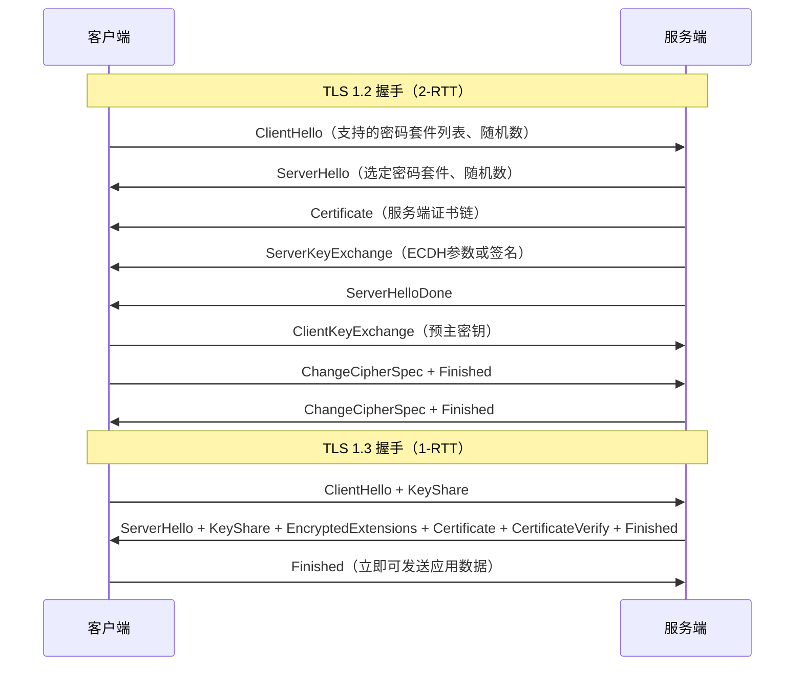
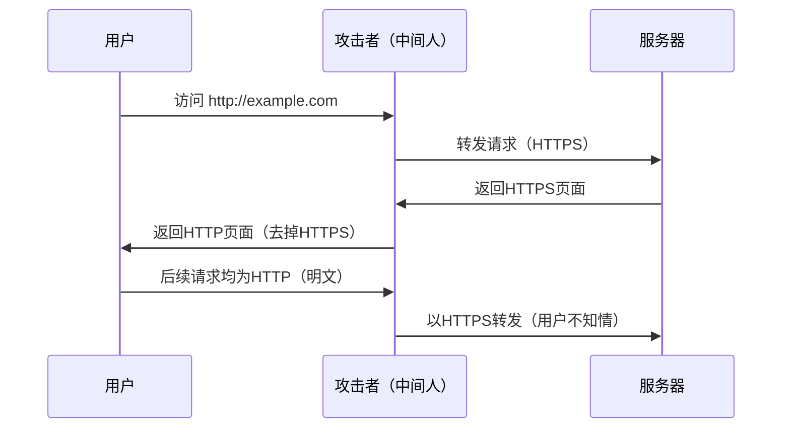

## 13.2 案例：HTTPS证书配置与验证

HTTPS是现代Web安全的基石，但"安装了证书"和"安全配置了HTTPS"之间存在巨大差距。本节以一个真实企业网站从SSL Labs C级评级提升到A+评级的完整过程为线索，系统讲解HTTPS的原理、配置、验证和调优。

### 13.2.1 背景描述

某电商企业网站在安全审计中发现：虽然已部署HTTPS，但存在多项配置缺陷，导致中间人攻击可行、用户会话Cookie可被窃取。安全团队收到以下审计报告：

| 问题 | 严重程度 | 影响 |
|------|----------|------|
| 支持SSLv3/TLS 1.0协议 | 高 | POODLE/DROWN攻击面 |
| 使用弱密码套件 | 高 | 可被暴力破解 |
| 无前向保密（PFS） | 中 | 私钥泄露后历史流量可解密 |
| 缺少HSTS | 中 | SSL剥离攻击 |
| 证书链不完整 | 中 | 部分客户端报错或降级 |
| 无OCSP装订 | 低 | 隐私泄露、性能差 |

团队需要在不中断业务的前提下完成HTTPS加固。

### 13.2.2 TLS握手原理

理解配置之前，必须先理解TLS握手过程。TLS 1.2和TLS 1.3的握手机制有本质区别：



**关键概念：**

- **密码套件（Cipher Suite）**：定义了密钥交换算法、身份验证算法、对称加密算法和MAC算法的组合。例如 `ECDHE-RSA-AES128-GCM-SHA256` 表示：ECDHE密钥交换、RSA身份认证、AES-128-GCM加密、SHA256哈希。
- **前向保密（Perfect Forward Secrecy, PFS）**：即使服务端私钥泄露，历史会话密钥也无法被推导。PFS通过ECDHE或DHE密钥交换实现，每个会话使用临时密钥对。
- **证书链（Certificate Chain）**：从叶子证书（域名证书）到中间CA证书再到根CA证书的信任链。客户端必须能完整验证链条，否则连接失败或降级。
- **HSTS（HTTP Strict Transport Security）**：通过响应头告知浏览器在未来指定时间内只使用HTTPS连接，防止SSL剥离攻击。

### 13.2.3 问题分析：逐项拆解

**原始配置：**

```nginx
# 不安全的Nginx SSL配置
server {
    listen 443 ssl;
    ssl_certificate /path/to/cert.pem;
    ssl_certificate_key /path/to/key.pem;
    ssl_protocols SSLv3 TLSv1 TLSv1.1 TLSv1.2;
    ssl_ciphers ALL:!aNULL:!EXPORT56;
}
```

**问题1：支持不安全的协议版本**

`ssl_protocols SSLv3 TLSv1 TLSv1.1 TLSv1.2` 允许了多个已知存在漏洞的协议：

| 协议 | 已知漏洞 | CVE | 状态 |
|------|----------|-----|------|
| SSLv3 | POODLE（CVE-2014-3566） | CVE-2014-3566 | 2015年废弃 |
| TLS 1.0 | BEAST、LUCKY13 | CVE-2011-3389 | 2020年主流浏览器停止支持 |
| TLS 1.1 | 无已知严重漏洞，但缺乏现代安全特性 | - | 2020年主流浏览器停止支持 |
| TLS 1.2 | 安全（正确配置时） | - | 当前主流 |
| TLS 1.3 | 最安全，简化握手 | - | 推荐 |

SSLv3的POODLE攻击利用CBC模式填充验证缺陷，攻击者可逐字节解密HTTPS Cookie。攻击者只需控制网络路径（如公共WiFi）即可完成，不需要破解密钥。

**问题2：允许弱密码套件**

`ssl_ciphers ALL:!aNULL:!EXPORT56` 看似排除了不安全的套件，实际上问题很多：

- `ALL` 包含RC4（已被证明存在统计偏差）、DES/3DES（密钥空间太小）、CBC模式套件（易受Padding Oracle攻击）
- 未排除NULL套件中的部分变体
- 包含不带PFS的RSA密钥交换套件（如 `AES256-GCM-SHA384`）
- 包含MD5哈希的套件（如 `DES-CBC3-MD5`）

**问题3：未启用前向保密**

当使用RSA密钥交换时（如 `TLS_RSA_WITH_AES_128_GCM_SHA256`），客户端用服务端公钥加密预主密钥。一旦服务端私钥泄露（如Heartbleed漏洞、服务器被入侵），攻击者可以解密所有历史抓包流量。ECDHE密钥交换为每个会话生成临时密钥对，私钥泄露不影响历史会话。

**问题4：缺少HSTS**

没有HSTS头时，用户首次访问网站可能被中间人降级到HTTP。典型的SSL剥离攻击流程：



HSTS通过告知浏览器"此站点只接受HTTPS"来防御此攻击。`includeSubDomains` 和 `preload` 进一步扩大保护范围。

**问题5：证书链不完整**

`ssl_certificate /path/to/cert.pem` 可能只包含叶子证书而不包含中间CA证书。部分客户端（尤其是Android旧版本和Java客户端）不会自动下载中间证书，导致证书验证失败或降级。

**问题6：缺少HTTP到HTTPS的重定向**

配置中没有80端口的server块，也没有将HTTP流量重定向到HTTPS。用户手动输入 `http://example.com` 会得到一个未加密的连接（如果80端口有服务）或连接拒绝。

### 13.2.4 完整解决方案

**第一步：申请证书**

使用Let's Encrypt免费证书，通过Certbot自动化：

```bash
# 安装Certbot
sudo apt update
sudo apt install certbot python3-certbot-nginx

# 申请证书（Nginx插件会自动修改配置）
sudo certbot --nginx -d example.com -d www.example.com

# 如果不使用Nginx插件，手动申请
sudo certbot certonly --webroot -w /var/www/html -d example.com -d www.example.com

# 验证自动续期
sudo certbot renew --dry-run
```

Let's Encrypt证书有效期90天，Certbot通过systemd timer或cron job自动续期。续期触发条件是证书剩余有效期不足30天时。检查续期定时器：

```bash
# 查看定时器状态
systemctl list-timers | grep certbot

# 手动测试续期（不会真正续期，只模拟流程）
sudo certbot renew --dry-run --quiet
```

**第二步：安全的Nginx配置**

```nginx
# /etc/nginx/snippets/ssl-params.conf
# SSL通用参数，被所有HTTPS server块include

# 仅允许TLS 1.2和1.3
ssl_protocols TLSv1.2 TLSv1.3;

# 密码套件选择策略
# TLS 1.2使用服务端偏好（优先选择PFS套件）
ssl_ciphers ECDHE-ECDSA-AES128-GCM-SHA256:ECDHE-RSA-AES128-GCM-SHA256:ECDHE-ECDSA-AES256-GCM-SHA384:ECDHE-RSA-AES256-GCM-SHA384:ECDHE-ECDSA-CHACHA20-POLY1305:ECDHE-RSA-CHACHA20-POLY1305;
ssl_prefer_server_ciphers on;

# ECDH曲线
ssl_ecdh_curve X25519:secp384r1:secp256r1;

# DH参数（如果使用DHE套件，需要生成DH参数文件）
# openssl dhparam -out /etc/nginx/dhparam.pem 2048
# ssl_dhparam /etc/nginx/dhparam.pem;

# 会话缓存（减少握手开销）
ssl_session_timeout 1d;
ssl_session_cache shared:SSL:50m;
ssl_session_tickets off;  # 禁用session tickets以保证PFS

# OCSP装订（服务端预先获取OCSP响应，减少客户端验证延迟）
ssl_stapling on;
ssl_stapling_verify on;
ssl_trusted_certificate /path/to/chain.pem;  # 用于验证OCSP响应的证书链
resolver 8.8.8.8 1.1.1.1 valid=300s;
resolver_timeout 5s;

# 安全响应头
add_header Strict-Transport-Security "max-age=63072000; includeSubDomains; preload" always;
add_header X-Frame-Options DENY always;
add_header X-Content-Type-Options nosniff always;
add_header X-XSS-Protection "1; mode=block" always;
add_header Referrer-Policy "strict-origin-when-cross-origin" always;
add_header Content-Security-Policy "default-src 'self'" always;
```

```nginx
# /etc/nginx/sites-available/example.com

# HTTP重定向到HTTPS
server {
    listen 80;
    listen [::]:80;
    server_name example.com www.example.com;
    return 301 https://$host$request_uri;
}

# 主HTTPS配置
server {
    listen 443 ssl http2;
    listen [::]:443 ssl http2;
    server_name example.com www.example.com;

    # 证书（fullchain包含叶子证书+中间CA证书）
    ssl_certificate /etc/letsencrypt/live/example.com/fullchain.pem;
    ssl_certificate_key /etc/letsencrypt/live/example.com/privkey.pem;

    # 引入SSL参数
    include /etc/nginx/snippets/ssl-params.conf;

    # 网站根目录和业务配置
    root /var/www/example.com;
    index index.html;

    location / {
        try_files $uri $uri/ =404;
    }
}
```

**第三步：配置验证与重载**

```bash
# 检查Nginx配置语法
sudo nginx -t

# 重载配置（不中断现有连接）
sudo nginx -s reload
```

### 13.2.5 验证与测试

配置完成后，必须进行多层次验证，不能仅依赖单一工具。

**验证1：命令行手动测试TLS版本**

```bash
# 测试TLS 1.2连接（应成功）
openssl s_client -connect example.com:443 -tls1_2 -servername example.com </dev/null 2>/dev/null | head -5

# 测试TLS 1.3连接（应成功）
openssl s_client -connect example.com:443 -tls1_3 -servername example.com </dev/null 2>/dev/null | head -5

# 测试TLS 1.0连接（应失败）
openssl s_client -connect example.com:443 -tls1 -servername example.com </dev/null 2>&1 | grep -i "error\|alert\|handshake failure"

# 测试TLS 1.1连接（应失败）
openssl s_client -connect example.com:443 -tls1_1 -servername example.com </dev/null 2>&1 | grep -i "error\|alert\|handshake failure"
```

**验证2：证书信息检查**

```bash
# 查看完整证书链
openssl s_client -connect example.com:443 -servername example.com -showcerts </dev/null 2>/dev/null

# 解析证书详情（有效期、颁发者、SAN等）
echo | openssl s_client -connect example.com:443 -servername example.com 2>/dev/null | openssl x509 -text -noout

# 检查证书链完整性（应显示 depth=2，即叶子→中间CA→根CA）
echo | openssl s_client -connect example.com:443 -servername example.com 2>/dev/null | grep -E "depth=|verify"

# 检查OCSP装订是否工作
echo | openssl s_client -connect example.com:443 -servername example.com -status 2>/dev/null | grep -A5 "OCSP Response"
```

**验证3：密码套件扫描**

```bash
# 使用nmap扫描所有支持的密码套件
nmap --script ssl-enum-ciphers -p 443 example.com

# 期望输出中应只包含ECDHE开头的套件（前向保密）
# 不应出现RC4、DES、3DES、NULL、EXPORT等字样
```

**验证4：安全头检查**

```bash
# 检查HSTS头
curl -sI https://example.com | grep -i strict-transport

# 检查所有安全头
curl -sI https://example.com | grep -iE "strict-transport|x-frame|x-content-type|x-xss|referrer-policy|content-security"
```

**验证5：SSL Labs在线测试**

访问 [SSL Labs SSL Test](https://www.ssllabs.com/ssltest/)，输入域名进行测试。目标评级A+，需满足：

| 测试项 | A+要求 |
|--------|--------|
| 协议支持 | 仅TLS 1.2和TLS 1.3 |
| 密码套件 | 全部支持PFS，无弱算法 |
| 证书 | 有效、链完整、2048位以上密钥 |
| HSTS | max-age>=1年，包含preload |
| OCSP装订 | 正常工作 |

**验证6：自动化持续监控**

```bash
#!/bin/bash
# ssl-monitor.sh — 定期检查证书过期和配置

DOMAIN="example.com"
WARN_DAYS=30

# 检查证书过期时间
EXPIRY=$(echo | openssl s_client -connect "$DOMAIN:443" -servername "$DOMAIN" 2>/dev/null | openssl x509 -noout -enddate 2>/dev/null | cut -d= -f2)
EXPIRY_EPOCH=$(date -d "$EXPIRY" +%s 2>/dev/null)
NOW_EPOCH=$(date +%s)
DAYS_LEFT=$(( (EXPIRY_EPOCH - NOW_EPOCH) / 86400 ))

if [ "$DAYS_LEFT" -lt "$WARN_DAYS" ]; then
    echo "WARNING: $DOMAIN certificate expires in $DAYS_LEFT days ($EXPIRY)"
else
    echo "OK: $DOMAIN certificate valid for $DAYS_LEFT days"
fi

# 检查是否仍然只支持安全协议
for proto in tls1 tls1_1; do
    if echo | openssl s_client -connect "$DOMAIN:443" -"$proto" -servername "$DOMAIN" 2>&1 | grep -q "Protocol.*TLSv"; then
        echo "WARNING: $DOMAIN still accepts $proto"
    fi
done
```

### 13.2.6 常见错误与排查

**错误1：证书链不完整**

症状：部分客户端（Android浏览器、Java HttpClient）报 `CERT_UNTRUSTED` 或 `unable to get local issuer certificate`。

```bash
# 检查链是否完整
openssl s_client -connect example.com:443 -servername example.com </dev/null 2>&1 | grep -i "verify return"

# verify return:1 表示验证通过
# verify return:0 表示验证失败（链不完整）
```

修复：确保 `ssl_certificate` 指向fullchain.pem而非cert.pem。Let's Encrypt的证书目录下：
- `cert.pem` — 仅叶子证书
- `chain.pem` — 仅中间CA证书
- `fullchain.pem` — 叶子+中间CA（应使用这个）
- `privkey.pem` — 私钥

**错误2：OCSP装订不工作**

```bash
# 检查OCSP装订状态
echo | openssl s_client -connect example.com:443 -servername example.com -status 2>/dev/null | grep "OCSP Response Status"

# 如果显示 "OCSP Response Status: unsuccessful"，可能原因：
# 1. ssl_trusted_certificate 未设置或文件路径错误
# 2. 无法访问CA的OCSP服务器（防火墙/网络问题）
# 3. 证书本身不支持OCSP
```

修复：确保 `ssl_trusted_certificate` 指向包含中间CA证书的文件，且Nginx进程能访问80端口的出站网络。

**错误3：Session Tickets破坏PFS**

`ssl_session_tickets on` 时，TLS会话恢复使用静态密钥加密的ticket，绕过了ECDHE的PFS保证。如果攻击者获取了ticket密钥，可以解密使用该ticket恢复的所有会话。

修复：保持 `ssl_session_tickets off`。如果需要会话恢复性能，使用 `ssl_session_cache shared:SSL:50m` 提供服务端会话缓存。

**错误4：HSTS配置不生效**

常见原因：
- `add_header` 只在特定的location块中生效（Nginx的 `add_header` 继承规则：如果子块中也有 `add_header`，父块的会被覆盖）
- 没有通过HTTPS首次访问（HSTS头只在HTTPS响应中生效）
- `max-age` 设置过短（浏览器在过期后不再强制HTTPS）

修复：使用 `always` 关键字确保所有响应码都携带头，在server级别设置而非location级别。

**错误5：混合内容（Mixed Content）**

页面通过HTTPS加载，但内部资源（图片、JS、CSS）使用HTTP加载。浏览器会阻止或警告。

```bash
# 使用curl快速检测页面中的HTTP资源引用
curl -s https://example.com | grep -oP 'src="http://[^"]+"|href="http://[^"]+"'

# Chrome DevTools > Console 会显示所有mixed content警告
```

修复：使用协议相对URL（`//example.com/resource`）或绝对HTTPS URL。配置CSP头 `upgrade-insecure-requests` 强制升级。

### 13.2.7 高级话题

**TLS 1.3的0-RTT恢复**

TLS 1.3支持0-RTT（Zero Round Trip Time Resumption），客户端在ClientHello中直接携带加密的应用数据，进一步减少延迟。但0-RTT数据存在重放攻击风险：

```nginx
# Nginx中启用TLS 1.3 0-RTT
ssl_early_data on;  # Nginx 1.15.4+

# 代理场景需传递early data
proxy_set_header Early-Data $ssl_early_data;
```

0-RTT数据不保证不可重放，因此只适用于幂等请求（GET），不适用于POST、支付等非幂等操作。应用层需检查 `Early-Data: 1` 请求头来识别和处理0-RTT请求。

**双向TLS（mTLS）**

标准HTTPS是客户端验证服务端身份。mTLS增加服务端验证客户端身份，常用于微服务间通信和IoT设备认证：

```nginx
server {
    listen 443 ssl;
    
    # 服务端证书
    ssl_certificate /etc/ssl/server.crt;
    ssl_certificate_key /etc/ssl/server.key;
    
    # 客户端CA证书（用于验证客户端证书）
    ssl_client_certificate /etc/ssl/client-ca.crt;
    ssl_verify_client on;        # 强制要求客户端证书
    # ssl_verify_client optional;  # 或可选（某些API场景）
    
    # 验证深度（中间CA层数）
    ssl_verify_depth 2;
}
```

mTLS的应用场景与权衡：

| 场景 | 适用性 | 说明 |
|------|--------|------|
| 微服务网格 | 高 | Istio/Linkerd默认使用mTLS |
| API网关 | 中 | B2B API、高安全要求场景 |
| Web前端 | 低 | 证书管理复杂，用户体验差 |
| IoT设备 | 高 | 设备身份强验证 |

**证书固定（Certificate Pinning）**

即使CA签发了正确的证书，CA本身也可能被攻破或被强制签发恶意证书。证书固定通过预埋证书指纹来防御CA级攻击：

```nginx
# Nginx不原生支持HPKP（已废弃），但可以在应用层实现
# 现代替代方案是Expect-CT头和Certificate Transparency
add_header Expect-CT "enforce, max-age=86400" always;
```

移动端APP和桌面客户端可以在应用层实现证书固定：

```python
# Python示例：证书固定
import ssl
import hashlib

PINNED_HASH = "base64+encoded+sha256+hash+of+public+key"

def verify_cert(cert_pem):
    cert_der = ssl.PEM_cert_to_DER_cert(cert_pem)
    cert_hash = hashlib.sha256(cert_der).digest()
    import base64
    return base64.b64encode(cert_hash).decode() == PINNED_HASH
```

### 13.2.8 实施效果

完成配置优化后的对比：

| 指标 | 优化前 | 优化后 |
|------|--------|--------|
| SSL Labs评级 | C | A+ |
| 支持的协议 | SSLv3, TLS 1.0, 1.1, 1.2 | TLS 1.2, 1.3 |
| 前向保密 | 否 | 是（ECDHE） |
| HSTS | 未启用 | max-age=2年，preload |
| 证书链 | 不完整 | fullchain完整 |
| OCSP装订 | 未启用 | 已启用 |
| 握手延迟 | ~300ms（TLS 1.2） | ~100ms（TLS 1.3） |
| 混合内容 | 存在 | 全部升级 |

### 13.2.9 安全检查清单

部署HTTPS时逐项核对：

```text
[ ] 证书使用2048位以上RSA或256位以上ECDSA密钥
[ ] 证书SAN覆盖所有域名变体（含www和裸域）
[ ] 证书链完整（leaf + intermediate CA）
[ ] 仅允许TLS 1.2和TLS 1.3
[ ] 密码套件全部包含ECDHE（前向保密）
[ ] 不包含RC4、DES、3DES、NULL、EXPORT套件
[ ] 禁用session tickets（或安全轮换ticket key）
[ ] 启用OCSP装订
[ ] HSTS max-age >= 1年
[ ] HSTS包含includeSubDomains
[ ] 考虑加入HSTS preload列表
[ ] HTTP到HTTPS的301重定向
[ ] 无混合内容
[ ] 证书自动续期机制已验证（certbot renew --dry-run）
[ ] 监控证书过期告警已配置
```
