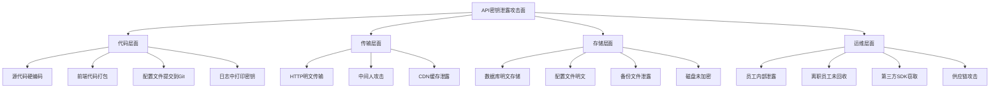
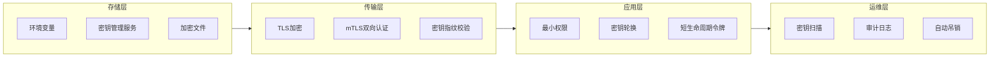
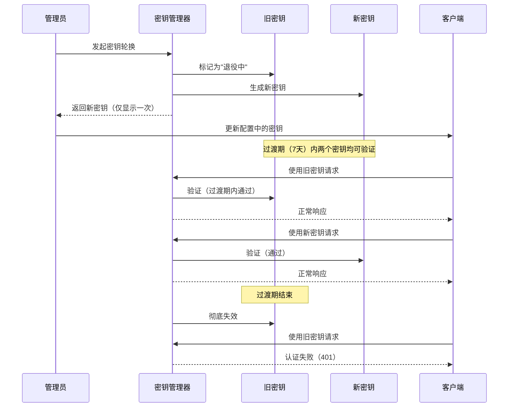
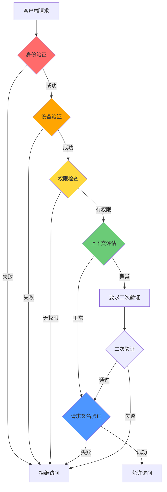

## 13.3 案例：API密钥安全管理

API密钥是现代软件系统中最常见的身份凭证形式。从第三方支付接口到云服务API，从微服务间通信到移动端后端调用，密钥无处不在。然而，API密钥泄露一直是安全事件的头号原因之一。本节从一个真实的SaaS平台密钥泄露事件出发，系统讲解API密钥的安全管理全生命周期。

### 13.3.1 背景描述：一次真实的密钥泄露事件

某SaaS平台为客户提供数据分析服务，其前端JavaScript代码中直接硬编码了后端API的访问密钥。该密钥拥有完整的数据读写权限，且没有设置过期时间或IP白名单限制。

**事件时间线：**

| 时间 | 事件 |
|------|------|
| T+0 | 攻击者通过浏览器开发者工具查看JS源码，发现硬编码的API密钥 |
| T+2min | 攻击者使用该密钥调用API，枚举用户数据接口 |
| T+30min | 批量导出超过10万条用户记录 |
| T+3h | 数据出现在暗网交易论坛 |
| T+5d | 平台收到用户投诉，开始排查 |
| T+7d | 确认泄露源为前端硬编码密钥 |

**损失评估：**
- 直接损失：约200万元（用户赔偿、应急响应、法律费用）
- 间接损失：品牌信誉下降，客户流失率上升15%
- 合规后果：被监管部门约谈，限期整改

这个案例并非孤例。GitHub的Secret Scanning服务在2024年每天检测到超过100万个硬编码密钥。OWASP API Security Top 10（2023版）将"Broken Authentication"列为第二大风险。

### 13.3.2 威胁模型：API密钥泄露的攻击面分析

要有效防护，必须先理解攻击者从哪里获取密钥。以下是一个完整的攻击面图：



#### 常见泄露渠道统计

根据GitGuardian 2024年度报告，密钥泄露渠道的分布如下：

| 泄露渠道 | 占比 | 典型场景 |
|----------|------|----------|
| 公开Git仓库 | 38% | GitHub公开仓库、误提交的.gitignore未覆盖文件 |
| 私有Git仓库 | 22% | 内部GitLab/GitHub，但CI日志暴露 |
| 日志系统 | 15% | 应用日志、Nginx access log、错误追踪平台 |
| 前端代码 | 12% | JavaScript bundle、移动端APK反编译 |
| 配置文件 | 8% | Docker镜像层、S3 bucket、配置管理工具 |
| 其他 | 5% | 社工、聊天记录、文档、截图 |

### 13.3.3 问题分析：为什么硬编码密钥是致命的

#### 反面模式一：直接硬编码

```python
# 危险：密钥直接写在代码中
API_KEY = "sk-1234567890abcdef"
API_SECRET = "secret_key_here"

# 危险：密钥写在注释中（以为不会被发现）
# api_key = "sk-1234567890abcdef"  # 旧密钥，别删
```

**为什么危险：**
1. 源代码一旦被任何方式获取（Git泄露、离职员工、反编译），密钥即刻暴露
2. 密钥无法轮换——改密钥意味着改代码、重新部署
3. 不同环境（开发/测试/生产）无法使用不同密钥
4. Git历史中永久保留，即使当前代码删除了密钥，`git log -p` 仍然可见

#### 反面模式二：配置文件明文存储

```python
# 危险：配置文件中的明文密钥
# config.json: {"api_key": "sk-1234567890abcdef", "db_password": "admin123"}

import json
with open("config.json") as f:
    config = json.load(f)
api_key = config["api_key"]
```

**为什么危险：**
1. 配置文件经常被提交到版本控制
2. Docker镜像的每一层都可以被`docker history`查看
3. 配置文件可能被包含在备份中，备份的安全性通常低于主系统
4. 多人共享配置文件，权限粒度过粗

#### 反面模式三：密钥无权限控制

```python
# 危险：使用root级别的全权限API密钥
client = APIClient(
    api_key="master-key-with-all-permissions",
    # 没有scope限制、没有IP白名单、没有过期时间
)
```

**为什么危险：** 即使密钥泄露，如果密钥的权限被限制在最小范围内，攻击者的破坏力也会被限制。无限制的"万能密钥"一旦泄露等于全面沦陷。

### 13.3.4 解决方案：分层防护体系

API密钥安全管理不是单点方案，而是一个分层防护体系。下面从存储层、传输层、应用层、运维层逐层讲解。



#### 方案一：环境变量方式（基础级）

环境变量是最简单的密钥外置方案，适合小型项目和本地开发。

```python
import os

# 从环境变量读取，带默认值和校验
API_KEY = os.environ.get('API_KEY')
API_SECRET = os.environ.get('API_SECRET')

if not API_KEY or not API_SECRET:
    raise ValueError("API credentials not configured. "
                     "Set API_KEY and API_SECRET environment variables.")

# 进阶：使用类型安全的读取方式
import re

def validate_api_key(key: str) -> bool:
    """验证API密钥格式（以sk-开头，长度48字符）"""
    return bool(re.match(r'^sk-[a-zA-Z0-9]{45}$', key))

if not validate_api_key(API_KEY):
    raise ValueError("API_KEY format invalid. Expected: sk-{45 alphanumeric chars}")
```

**.env文件配合python-dotenv（开发环境）：**

```bash
# .env 文件（必须加入.gitignore）
API_KEY=sk-1234567890abcdef1234567890abcdef1234567890ab
API_SECRET=your-secret-here
DB_PASSWORD=strong-password-here
```

```python
# .gitignore 中必须包含以下规则
# .env
# *.env
# .env.local
# .env.*.local

from dotenv import load_dotenv
import os

# 加载.env文件（仅本地开发使用）
load_dotenv()

API_KEY = os.environ.get('API_KEY')
```

**环境变量方案的局限：**

| 局限性 | 说明 |
|--------|------|
| 无加密 | 环境变量在进程空间中以明文存在 |
| 无访问控制 | 任何能读取进程环境的用户/程序都能获取 |
| 无审计 | 无法记录谁在何时读取了密钥 |
| 无轮换机制 | 修改环境变量需要重启服务 |
| 容器场景受限 | Docker/K8s中环境变量可通过`docker inspect`查看 |

适用场景：本地开发、个人项目、CI/CD临时凭证。生产环境建议升级到密钥管理服务。

#### 方案二：密钥管理服务（生产级）

密钥管理服务（KMS/Secrets Manager）是生产环境的标准方案。下面对比主流云厂商的实现：

**AWS Secrets Manager：**

```python
import boto3
import json
from botocore.exceptions import ClientError

class AWSSecretManager:
    """AWS Secrets Manager封装，支持缓存和自动刷新"""

    def __init__(self, region_name="us-east-1"):
        self.client = boto3.client(
            service_name='secretsmanager',
            region_name=region_name
        )
        self._cache = {}

    def get_secret(self, secret_name: str, force_refresh: bool = False) -> dict:
        """获取密钥，支持本地缓存减少API调用"""
        if secret_name in self._cache and not force_refresh:
            return self._cache[secret_name]

        try:
            response = self.client.get_secret_value(SecretId=secret_name)
            secret = json.loads(response['SecretString'])
            self._cache[secret_name] = secret
            return secret
        except ClientError as e:
            error_code = e.response['Error']['Code']
            if error_code == 'ResourceNotFoundException':
                raise ValueError(f"Secret '{secret_name}' not found") from e
            elif error_code == 'AccessDeniedException':
                raise PermissionError(f"No permission to access '{secret_name}'") from e
            raise

# 使用示例
sm = AWSSecretManager(region_name="us-east-1")
creds = sm.get_secret("prod/api/credentials")
api_key = creds["api_key"]
api_secret = creds["api_secret"]
```

**HashiCorp Vault（自建/多云场景）：**

```python
import hvac

class VaultSecretManager:
    """HashiCorp Vault封装，支持KV v2引擎"""

    def __init__(self, url: str, token: str, mount_point: str = "secret"):
        self.client = hvac.Client(url=url, token=token)
        self.mount_point = mount_point

        if not self.client.is_authenticated():
            raise ConnectionError("Vault authentication failed")

    def get_secret(self, path: str, version: int = None) -> dict:
        """读取KV v2引擎中的密钥"""
        params = {"path": path, "mount_point": self.mount_point}
        if version is not None:
            params["version"] = version
        response = self.client.secrets.kv.v2.read_secret_version(**params)
        return response["data"]["data"]

    def put_secret(self, path: str, secret_data: dict):
        """写入密钥"""
        self.client.secrets.kv.v2.create_or_update_secret(
            path=path,
            secret=secret_data,
            mount_point=self.mount_point
        )

    def list_secrets(self, path: str = "") -> list:
        """列出指定路径下的密钥"""
        response = self.client.secrets.kv.v2.list_secrets(
            path=path,
            mount_point=self.mount_point
        )
        return response["data"]["keys"]

# 使用示例
vault = VaultSecretManager(
    url="https://vault.internal.example.com:8200",
    token=os.environ["VAULT_TOKEN"]  # Vault token本身通过环境变量传入
)
creds = vault.get_secret("prod/api/payment-gateway")
```

**Azure Key Vault：**

```python
from azure.identity import DefaultAzureCredential
from azure.keyvault.secrets import SecretClient

class AzureSecretManager:
    """Azure Key Vault封装"""

    def __init__(self, vault_url: str):
        credential = DefaultAzureCredential()  # 支持托管标识、服务主体等多种认证
        self.client = SecretClient(vault_url=vault_url, credential=credential)

    def get_secret(self, name: str, version: str = None) -> str:
        secret = self.client.get_secret(name, version=version)
        return secret.value

    def set_secret(self, name: str, value: str):
        self.client.set_secret(name, value)

# 使用示例
az = AzureSecretManager("https://my-vault.vault.azure.net/")
api_key = az.get_secret("api-key-prod")
```

**GCP Secret Manager：**

```python
from google.cloud import secretmanager

class GCPSecretManager:
    """GCP Secret Manager封装"""

    def __init__(self, project_id: str):
        self.client = secretmanager.SecretManagerServiceClient()
        self.project_id = project_id

    def get_secret(self, secret_id: str, version: str = "latest") -> str:
        name = f"projects/{self.project_id}/secrets/{secret_id}/versions/{version}"
        response = self.client.access_secret_version(request={"name": name})
        return response.payload.data.decode("UTF-8")

# 使用示例
gcp = GCPSecretManager("my-gcp-project")
api_key = gcp.get_secret("api-key-prod")
```

**四家云厂商对比：**

| 特性 | AWS Secrets Manager | HashiCorp Vault | Azure Key Vault | GCP Secret Manager |
|------|-------------------|-----------------|-----------------|-------------------|
| 自动轮换 | ✅ 内置 | ✅ 需配置 | ✅ 内置 | ✅ 需配合Cloud Functions |
| 审计日志 | ✅ CloudTrail | ✅ Audit Log | ✅ Azure Monitor | ✅ Cloud Audit Logs |
| 多云支持 | ❌ AWS专用 | ✅ 多云 | ❌ Azure专用 | ❌ GCP专用 |
| 自建部署 | ❌ | ✅ | ❌ | ❌ |
| 定价 | $0.40/密钥/月 | 开源免费 | $0.03/密钥/月 | $0.06/密钥版本/月 |
| 最小权限 | ✅ IAM策略 | ✅ ACL/Policy | ✅ RBAC | ✅ IAM |

#### 方案三：密钥轮换机制（进阶级）

密钥轮换是限制泄露影响的关键手段。即使密钥被窃取，定期轮换可以缩小攻击窗口。

```python
import datetime
import secrets
import hashlib
import json
from typing import Optional
from dataclasses import dataclass, field

@dataclass
class APIKey:
    """API密钥数据模型"""
    key_id: str
    key_hash: str          # 只存储哈希，不存储明文
    created_at: datetime.datetime
    expires_at: datetime.datetime
    is_active: bool = True
    scopes: list = field(default_factory=list)   # 权限范围
    allowed_ips: list = field(default_factory=list)  # IP白名单

class APIKeyManager:
    """
    API密钥全生命周期管理器

    功能：
    - 生成符合安全标准的API密钥
    - 支持密钥轮换（保留旧密钥的过渡期）
    - 基于哈希的密钥验证（不在数据库中存储明文）
    - 权限范围和IP白名单控制
    """

    # 密钥格式：前缀 + 随机部分
    KEY_PREFIX = "sk"
    KEY_LENGTH = 48  # 随机部分长度
    ROTATION_GRACE_PERIOD = datetime.timedelta(days=7)  # 轮换过渡期

    def __init__(self):
        self._active_keys: dict[str, APIKey] = {}    # key_id -> APIKey
        self._retired_keys: dict[str, APIKey] = {}   # 已退役但仍在过渡期的密钥

    @staticmethod
    def _hash_key(key: str) -> str:
        """对密钥进行SHA-256哈希"""
        return hashlib.sha256(key.encode()).hexdigest()

    @classmethod
    def generate_key(cls) -> tuple[str, str]:
        """
        生成新的API密钥

        Returns:
            (key_id, key) - key_id用于标识，key是明文（只展示一次）
        """
        key_id = secrets.token_hex(8)  # 16字符的标识符
        random_part = secrets.token_urlsafe(cls.KEY_LENGTH)
        key = f"{cls.KEY_PREFIX}_{key_id}_{random_part}"
        return key_id, key

    def create_key(
        self,
        scopes: list[str],
        allowed_ips: list[str] = None,
        ttl_days: int = 90
    ) -> tuple[str, str]:
        """
        创建新的API密钥

        Args:
            scopes: 权限范围，如 ["read:users", "write:orders"]
            allowed_ips: IP白名单，为空则不限制
            ttl_days: 密钥有效期（天）

        Returns:
            (key_id, key) - key仅在此时可见，之后无法再获取明文
        """
        key_id, key = self.generate_key()

        api_key = APIKey(
            key_id=key_id,
            key_hash=self._hash_key(key),
            created_at=datetime.datetime.now(),
            expires_at=datetime.datetime.now() + datetime.timedelta(days=ttl_days),
            scopes=scopes,
            allowed_ips=allowed_ips or [],
        )

        self._active_keys[key_id] = api_key
        return key_id, key

    def rotate_key(
        self,
        old_key_id: str,
        new_scopes: list[str] = None,
        new_ttl_days: int = 90
    ) -> tuple[str, str]:
        """
        轮换密钥：退役旧密钥，生成新密钥

        旧密钥在过渡期内（默认7天）仍可使用，避免正在运行的客户端中断。
        """
        if old_key_id not in self._active_keys:
            raise ValueError(f"Key {old_key_id} not found or already retired")

        old_key = self._active_keys[old_key_id]

        # 将旧密钥移入退役列表（过渡期内仍可验证）
        old_key.is_active = False
        self._retired_keys[old_key_id] = old_key
        del self._active_keys[old_key_id]

        # 生成新密钥，继承旧密钥的权限（或使用新权限）
        scopes = new_scopes or old_key.scopes
        new_key_id, new_key = self.create_key(
            scopes=scopes,
            allowed_ips=old_key.allowed_ips,
            ttl_days=new_ttl_days
        )

        return new_key_id, new_key

    def validate_key(
        self,
        key: str,
        required_scope: str = None,
        client_ip: str = None
    ) -> bool:
        """
        验证API密钥

        Args:
            key: 待验证的API密钥明文
            required_scope: 所需的权限范围
            client_ip: 客户端IP地址

        Returns:
            验证是否通过
        """
        key_hash = self._hash_key(key)

        # 从key中提取key_id
        parts = key.split("_")
        if len(parts) < 3 or parts[0] != self.KEY_PREFIX:
            return False
        key_id = parts[1]

        # 在活跃密钥和退役密钥中查找
        api_key = self._active_keys.get(key_id) or self._retired_keys.get(key_id)
        if not api_key:
            return False

        # 验证哈希
        if api_key.key_hash != key_hash:
            return False

        # 验证是否过期
        if datetime.datetime.now() > api_key.expires_at:
            return False

        # 验证退役密钥是否在过渡期内
        if key_id in self._retired_keys:
            grace_deadline = api_key.created_at + self.ROTATION_GRACE_PERIOD
            if datetime.datetime.now() > grace_deadline:
                return False

        # 验证权限范围
        if required_scope and required_scope not in api_key.scopes:
            return False

        # 验证IP白名单
        if api_key.allowed_ips and client_ip not in api_key.allowed_ips:
            return False

        return True

    def revoke_key(self, key_id: str):
        """立即吊销密钥（紧急场景：发现泄露时）"""
        if key_id in self._active_keys:
            del self._active_keys[key_id]
        if key_id in self._retired_keys:
            del self._retired_keys[key_id]

    def get_audit_log(self) -> list[dict]:
        """导出审计日志（实际生产中应写入专用日志系统）"""
        log = []
        for kid, ak in {**self._active_keys, **self._retired_keys}.items():
            log.append({
                "key_id": kid,
                "active": ak.is_active,
                "scopes": ak.scopes,
                "created_at": ak.created_at.isoformat(),
                "expires_at": ak.expires_at.isoformat(),
                "allowed_ips": ak.allowed_ips,
            })
        return log


# 使用示例
manager = APIKeyManager()

# 创建密钥
key_id, key = manager.create_key(
    scopes=["read:users", "write:orders"],
    allowed_ips=["10.0.0.0/8"],
    ttl_days=90
)
print(f"新密钥（仅显示一次）: {key}")
print(f"密钥ID: {key_id}")

# 验证密钥
is_valid = manager.validate_key(
    key=key,
    required_scope="read:users",
    client_ip="10.0.1.50"
)
print(f"验证结果: {is_valid}")

# 轮换密钥
new_key_id, new_key = manager.rotate_key(key_id, ttl_days=90)
print(f"新密钥: {new_key}")
# 旧密钥在过渡期内仍然有效
print(f"旧密钥仍有效: {manager.validate_key(key, required_scope='read:users', client_ip='10.0.1.50')}")
```

**密钥轮换流程图：**



#### 方案四：短生命周期令牌（高级级）

对于高安全场景，不使用长期API密钥，而是使用短期令牌（Token）方案：

```python
import jwt
import datetime
import secrets

class ShortLivedTokenManager:
    """
    短生命周期令牌管理器

    工作原理：
    1. 客户端使用长期凭证（API Key）换取短期令牌（JWT）
    2. 短期令牌有效期15分钟~1小时
    3. 即使令牌泄露，攻击窗口极短
    4. 支持令牌吊销列表（黑名单）
    """

    def __init__(self, signing_key: str):
        self.signing_key = signing_key
        self.revoked_tokens: set[str] = set()  # 吊销列表（生产中用Redis）

    def issue_token(
        self,
        client_id: str,
        scopes: list[str],
        ttl_minutes: int = 15
    ) -> str:
        """签发短期令牌"""
        now = datetime.datetime.utcnow()
        payload = {
            "sub": client_id,
            "scopes": scopes,
            "iat": now,
            "exp": now + datetime.timedelta(minutes=ttl_minutes),
            "jti": secrets.token_hex(16),  # 唯一令牌ID，用于吊销
        }
        return jwt.encode(payload, self.signing_key, algorithm="HS256")

    def validate_token(self, token: str, required_scope: str = None) -> dict:
        """验证短期令牌"""
        try:
            payload = jwt.decode(token, self.signing_key, algorithms=["HS256"])
        except jwt.ExpiredSignatureError:
            raise PermissionError("Token expired")
        except jwt.InvalidTokenError:
            raise PermissionError("Invalid token")

        # 检查吊销列表
        if payload.get("jti") in self.revoked_tokens:
            raise PermissionError("Token has been revoked")

        # 检查权限
        if required_scope and required_scope not in payload.get("scopes", []):
            raise PermissionError(f"Missing required scope: {required_scope}")

        return payload

    def revoke_token(self, jti: str):
        """吊销指定令牌"""
        self.revoked_tokens.add(jti)

    def exchange_key_for_token(
        self,
        api_key: str,
        api_secret: str,
        requested_scopes: list[str]
    ) -> str:
        """
        用长期API密钥换取短期令牌

        这是标准的OAuth2 Client Credentials流程的简化版
        """
        # 验证长期凭证（这里简化处理，实际应查数据库/密钥管理服务）
        if not self._verify_credentials(api_key, api_secret):
            raise PermissionError("Invalid API credentials")

        # 签发短期令牌，权限不超过请求的范围
        return self.issue_token(
            client_id=api_key[:8],
            scopes=requested_scopes,
            ttl_minutes=15
        )

    def _verify_credentials(self, api_key: str, api_secret: str) -> bool:
        """验证长期凭证（示例实现）"""
        # 实际实现中应查询数据库或密钥管理服务
        return bool(api_key and api_secret)


# 使用示例
tm = ShortLivedTokenManager(signing_key="your-256-bit-secret-key-here")

# 1. 客户端用长期密钥换取短期令牌
token = tm.exchange_key_for_token(
    api_key="sk_abc123_...",
    api_secret="secret_here",
    requested_scopes=["read:users", "write:orders"]
)
print(f"短期令牌（15分钟有效）: {token[:50]}...")

# 2. 客户端使用短期令牌访问API
payload = tm.validate_token(token, required_scope="read:users")
print(f"验证通过，客户端: {payload['sub']}")

# 3. 发现泄露时立即吊销
tm.revoke_token(payload["jti"])
```

### 13.3.5 密钥泄露检测：在提交前拦截

预防优于治疗。以下工具可以在密钥被提交到代码仓库之前就拦截它们。

#### Git Hooks 预提交检查

```bash
#!/bin/bash
# .git/hooks/pre-commit
# 检查即将提交的代码中是否包含密钥

# 检查的模式列表
PATTERNS=(
    'AKIA[0-9A-Z]{16}'           # AWS Access Key
    'sk-[a-zA-Z0-9]{48}'         # OpenAI API Key
    'ghp_[a-zA-Z0-9]{36}'        # GitHub Personal Access Token
    'glpat-[a-zA-Z0-9\-]{20}'    # GitLab PAT
    'xox[bpors]-[a-zA-Z0-9\-]+'  # Slack Token
    'AIza[0-9A-Za-z\-_]{35}'     # Google API Key
    'SG\.[a-zA-Z0-9\-_]{22}\.[a-zA-Z0-9\-_]{43}'  # SendGrid
)

FOUND=0
for pattern in "${PATTERNS[@]}"; do
    MATCHES=$(git diff --cached --diff-filter=ACM | grep -E "$pattern" || true)
    if [ -n "$MATCHES" ]; then
        echo "❌ 检测到可能的密钥: $pattern"
        echo "$MATCHES"
        FOUND=1
    fi
done

if [ $FOUND -eq 1 ]; then
    echo ""
    echo "提交被阻止。如果确认是误报，请使用 git commit --no-verify"
    exit 1
fi

echo "✅ 未检测到硬编码密钥"
exit 0
```

#### 专业密钥扫描工具

| 工具 | 类型 | 支持平台 | 特点 |
|------|------|----------|------|
| **detect-secrets** (Yelp) | Python库/CLI | 本地/CI | 可自定义插件，baseline文件管理已知误报 |
| **truffleHog** | CLI | 本地/CI | 支持正则+熵检测，能扫描Git历史 |
| **gitleaks** | CLI/CI | 本地/GitHub/GitLab | 速度快，支持多种输出格式 |
| **git-secrets** (AWS) | Git hook | 本地 | AWS官方工具，轻量级 |
| **GitHub Secret Scanning** | 平台内置 | GitHub | 自动扫描公开仓库，与厂商合作自动吊销 |
| **GitGuardian** | SaaS/CLI | 多平台 | 实时监控，覆盖私有仓库 |

**detect-secrets 使用示例：**

```bash
# 安装
pip install detect-secrets

# 初始化baseline（扫描现有代码，记录已知的"误报"）
detect-secrets scan --all-files > .secrets.baseline

# 在CI中检查新提交的密钥
detect-secrets audit .secrets.baseline
detect-secrets scan --baseline .secrets.baseline

# 集成到pre-commit hook
# .pre-commit-config.yaml:
# repos:
#   - repo: https://github.com/Yelp/detect-secrets
#     rev: v1.4.0
#     hooks:
#       - id: detect-secrets
#         args: ['--baseline', '.secrets.baseline']
```

**truffleHog 扫描Git历史：**

```bash
# 安装
pip install trufflehog

# 扫描本地仓库（包含Git历史）
trufflehog git file://. --only-verified

# 扫描远程仓库
trufflehog github --repo https://github.com/org/repo --only-verified

# 扫描特定分支的历史
trufflehog git file://. --branch main --only-verified
```

### 13.3.6 不同场景的密钥管理方案

不同技术场景对密钥管理有不同的要求。以下针对常见场景给出具体方案。

#### Docker/容器环境

```dockerfile
# 错误：在Dockerfile中硬编码密钥
# ENV API_KEY=sk-1234567890abcdef

# 正确：使用BuildKit secrets（不在镜像层中留下痕迹）
# syntax=docker/dockerfile:1
FROM python:3.11-slim

RUN --mount=type=secret,id=api_key \
    API_KEY=$(cat /run/secrets/api_key) && \
    echo "Key loaded for build step"

# 运行时使用Docker secrets或环境变量
CMD ["python", "app.py"]
```

```bash
# 使用Docker secrets构建
docker build --secret id=api_key,src=.api_key .

# 运行时注入环境变量（不写入镜像）
docker run -e API_KEY=sk-... my-app

# 使用Docker Compose secrets
# docker-compose.yml:
# services:
#   app:
#     image: my-app
#     secrets:
#       - api_key
# secrets:
#   api_key:
#     file: ./secrets/api_key.txt
```

#### Kubernetes环境

```yaml
# 创建Secret
# kubectl create secret generic api-credentials \
#   --from-literal=api-key=sk-1234567890abcdef \
#   --from-literal=api-secret=secret-value

apiVersion: v1
kind: Secret
metadata:
  name: api-credentials
  namespace: production
type: Opaque
data:
  api-key: c2stMTIzNDU2NzkwYWJjZGVm    # base64编码
  api-secret: c2VjcmV0LXZhbHVl

---
# Pod中使用Secret
apiVersion: v1
kind: Pod
metadata:
  name: my-app
spec:
  containers:
    - name: app
      image: my-app:latest
      env:
        - name: API_KEY
          valueFrom:
            secretKeyRef:
              name: api-credentials
              key: api-key
        - name: API_SECRET
          valueFrom:
            secretKeyRef:
              name: api-credentials
              key: api-secret
      # 或者挂载为文件（更安全，不暴露为环境变量）
      volumeMounts:
        - name: secret-volume
          mountPath: /etc/secrets
          readOnly: true
  volumes:
    - name: secret-volume
      secret:
        secretName: api-credentials
        defaultMode: 0400  # 只读权限
```

```yaml
# 更安全的方案：使用External Secrets Operator对接AWS/GCP/Azure
apiVersion: external-secrets.io/v1beta1
kind: ExternalSecret
metadata:
  name: api-credentials
spec:
  refreshInterval: 1h  # 每小时从外部密钥管理服务同步
  secretStoreRef:
    name: aws-secrets-manager
    kind: ClusterSecretStore
  target:
    name: api-credentials
  data:
    - secretKey: api-key
      remoteRef:
        key: prod/api/credentials
        property: api_key
    - secretKey: api-secret
      remoteRef:
        key: prod/api/credentials
        property: api_secret
```

#### CI/CD Pipeline

```yaml
# GitHub Actions示例
name: Deploy
on:
  push:
    branches: [main]

jobs:
  deploy:
    runs-on: ubuntu-latest
    steps:
      - uses: actions/checkout@v4

      # 使用GitHub Secrets（在Settings > Secrets中配置）
      - name: Deploy to production
        env:
          API_KEY: ${{ secrets.API_KEY }}
          API_SECRET: ${{ secrets.API_SECRET }}
        run: |
          # 密钥仅在runner内存中，不写入磁盘
          ./deploy.sh

      # 注意：不要将secrets打印到日志
      # 错误示例：echo $API_KEY  # 这会被GitHub自动掩码，但仍应避免
```

```yaml
# GitLab CI示例
deploy:
  stage: deploy
  script:
    - ./deploy.sh
  variables:
    # 使用GitLab CI/CD Variables（Settings > CI/CD > Variables）
    # 标记为"Masked"使其不出现在日志中
    # 标记为"Protected"使其仅在受保护分支上可用
    API_KEY: $API_KEY
  only:
    - main
```

### 13.3.7 实施效果与安全审计

实施上述方案后，需要持续监控和审计以确保安全措施有效运行。

#### 安全指标对比

| 指标 | 实施前 | 实施后 |
|------|--------|--------|
| 代码中硬编码密钥数 | 47个 | 0个 |
| 平均密钥年龄 | 无限期 | 90天（自动轮换） |
| 密钥泄露检测时间 | 5-7天 | <1分钟（pre-commit拦截） |
| 密钥权限范围 | 全权限 | 最小权限（scope粒度控制） |
| 密钥访问审计 | 无 | 全量日志（who/when/what/IP） |
| 密钥吊销速度 | 手动，约2小时 | 自动，<1分钟 |

#### 审计日志样例

```json
{
  "timestamp": "2024-12-15T10:30:45Z",
  "event": "key_access",
  "key_id": "a1b2c3d4",
  "client_ip": "10.0.1.50",
  "action": "read:users",
  "result": "success",
  "user_agent": "python-requests/2.31.0",
  "request_id": "req-xyz123"
}
```

#### 合规性要求

不同安全标准对密钥管理的要求：

| 合规标准 | 密钥管理要求 | 对应方案 |
|----------|-------------|----------|
| SOC 2 Type II | 密钥定期轮换、访问审计、最小权限 | 密钥管理服务 + 审计日志 + RBAC |
| PCI DSS | 密钥加密存储、双人控制、变更审批 | KMS + 短生命周期令牌 + 审批流程 |
| ISO 27001 | 密钥生命周期管理、泄露响应流程 | 全生命周期管理器 + 扫描工具 |
| GDPR | 数据访问凭证管理、泄露通知（72小时内） | KMS + 实时监控 + 自动吊销 |
| 等保2.0 | 通信加密、身份鉴别、访问控制 | TLS + API Key + RBAC + IP白名单 |

### 13.3.8 常见误区与纠正

#### 误区一：把密钥放在私有仓库就安全了

**真相：** 私有仓库不等于安全仓库。GitLab/GitHub的私有仓库仍可能被内部人员、离职员工、或被入侵的CI runner访问。Git历史中删除的文件仍可恢复。正确做法是永远不在Git中存储密钥，即使是私有仓库。

#### 误区二：用base64编码密钥就是加密

**真相：** Base64是编码，不是加密。任何人都可以轻松解码。这就像把保险箱密码写成摩尔斯电码——换了形式但没有保密性。

```python
import base64

# 这不是安全措施！
encoded = base64.b64encode(b"sk-1234567890abcdef").decode()
# encoded = "c2stMTIzNDU2NzkwYWJjZGVm"
# 任何人都能 base64.b64decode(encoded) 还原
```

#### 误区三：密钥轮换太麻烦，不做也没关系

**真相：** 密钥轮换是纵深防御的核心环节。你无法保证密钥从未被泄露，但可以通过缩短密钥的有效期来限制泄露的影响范围。90天轮换一次，即使密钥泄露，攻击窗口最多90天。

#### 误区四：只在生产环境关注密钥安全

**真相：** 开发和测试环境的密钥同样重要。很多攻击者会先从低安全级别的测试环境入手，利用测试环境与生产环境的网络连通性进行横向移动。测试环境的密钥应与生产环境完全隔离。

#### 误区五：密钥越长越安全

**真相：** 密钥的安全性取决于熵（随机性），而非单纯的长度。一个长度100位但有规律的密钥，不如一个长度32位但完全随机的密钥安全。使用密码学安全的随机数生成器（如`secrets`模块）生成密钥，比手动拼接字符更安全。

### 13.3.9 进阶：零信任架构下的密钥管理

在零信任（Zero Trust）架构下，"永不信任，始终验证"的原则适用于密钥管理的每一个环节：



**零信任密钥管理原则：**

1. **最短生命周期**：密钥/令牌的有效期尽可能短。短期令牌（15分钟）优于长期密钥（90天）
2. **持续验证**：每次请求都验证密钥的有效性、权限、上下文，而非首次验证后缓存信任
3. **动态权限**：根据请求上下文（时间、位置、设备状态）动态调整密钥的可用权限
4. **即时吊销**：发现异常时能在秒级内吊销密钥，所有使用该密钥的请求立即被拒绝
5. **全面审计**：每一次密钥使用都记录在案，支持事后追溯和实时告警

### 13.3.10 总结

API密钥安全管理的核心原则可以用一句话概括：**让密钥像密码一样，在需要时出现，用完即走，不留痕迹。**

**最低安全基线清单：**

| 编号 | 措施 | 优先级 | 实施难度 |
|------|------|--------|----------|
| 1 | 从代码中移除所有硬编码密钥 | P0 | 低 |
| 2 | 使用环境变量或密钥管理服务存储密钥 | P0 | 低 |
| 3 | .env文件加入.gitignore | P0 | 极低 |
| 4 | 配置pre-commit密钥扫描 | P0 | 低 |
| 5 | 实施最小权限原则（scope粒度控制） | P1 | 中 |
| 6 | 配置密钥轮换（90天周期） | P1 | 中 |
| 7 | 启用访问审计日志 | P1 | 中 |
| 8 | 生产环境使用密钥管理服务（Vault/KMS） | P2 | 中 |
| 9 | 实施短生命周期令牌方案 | P2 | 高 |
| 10 | 集成零信任架构 | P3 | 高 |

安全不是一次性工程，而是持续的过程。从P0开始逐步实施，每一步都在缩小攻击面。密钥管理做得好不好，往往决定了一个系统在面对攻击时的韧性。
