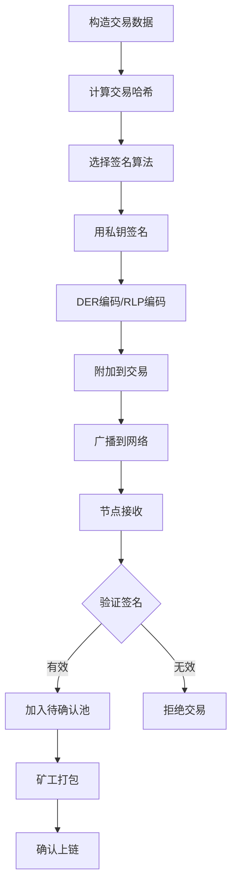
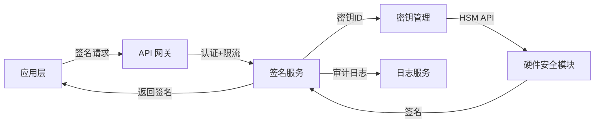

## 13.4 案例：区块链交易签名验证

### 13.4.1 背景与意义

区块链的核心安全模型建立在密码学签名之上：每笔交易必须由资产所有者用私钥签名，网络中的任何节点都可以用对应的公钥验证签名的合法性。这个机制同时解决了三个问题：

- **认证（Authentication）**：证明交易确实由私钥持有者发起
- **完整性（Integrity）**：交易内容在传输过程中未被篡改
- **不可否认性（Non-repudiation）**：签名者事后无法否认自己发起过该交易

如果签名机制存在漏洞，攻击者可以伪造交易、盗取资产，或者通过重放攻击重复消费。2013年比特币曾因交易延展性（Transaction Malleability）漏洞被利用，攻击者修改交易签名的编码形式但不改变其语义，导致交易ID发生变化，影响了包括Mt.Gox在内的多个交易所的提款逻辑。

本案例将从零实现一个完整的区块链交易签名与验证系统，覆盖比特币和以太坊两大主流链的签名机制。

### 13.4.2 密码学基础：ECDSA 与 secp256k1

区块链签名的核心算法是 **ECDSA（Elliptic Curve Digital Signature Algorithm）**，使用的曲线是 **secp256k1**。

#### 为什么选择 secp256k1

secp256k1 是一条 Koblitz 曲线，其方程为 y² = x³ + 7（在有限域 Fp 上，p = 2²⁵⁶ - 2³² - 977）。相比 NIST 推荐的 P-256 曲线，secp256k1 有以下优势：

| 特性 | secp256k1 | NIST P-256 |
|------|-----------|------------|
| 曲线类型 | Koblitz（结构简单） | 随机曲线 |
| 参数选择依据 | 可验证的数学结构 | 不透明（NSA设计） |
| 后门风险 | 极低 | 存在理论担忧 |
| 性能 | 快30%（特殊结构优化） | 较慢 |
| 采用链 | Bitcoin、Ethereum | TLS、政府系统 |

#### ECDSA 签名数学原理

给定私钥 d（一个 1~n-1 的随机整数，n 为曲线阶），公钥 Q = d·G（G 为基点），对消息摘要 z 的签名过程如下：

```text
1. 选取随机数 k ∈ [1, n-1]
2. 计算点 (x₁, y₁) = k·G
3. 计算 r = x₁ mod n，若 r = 0 则重新选 k
4. 计算 s = k⁻¹ · (z + r·d) mod n，若 s = 0 则重新选 k
5. 签名结果为 (r, s)
```

验证过程：

```text
1. 计算 w = s⁻¹ mod n
2. 计算 u₁ = z·w mod n，u₂ = r·w mod n
3. 计算点 (x₁, y₁) = u₁·G + u₂·Q
4. 若 x₁ mod n == r，则签名有效
```

#### k 值的关键性

随机数 k 是 ECDSA 安全性的命门。如果 k 值被重用或可预测，攻击者可以通过两个使用相同 k 的签名直接计算出私钥：

```text
已知：s₁ = k⁻¹(z₁ + r·d)，s₂ = k⁻¹(z₂ + r·d)
则：k = (z₁ - z₂) / (s₁ - s₂) mod n
然后：d = (s₁·k - z₁) / r mod n
```

2013年 PlayStation 3 的 ECDSA 实现就因为使用了固定的 k 值，被黑客计算出索尼的签名私钥。后来的 Deterministic ECDSA（RFC 6979）通过 HMAC 从私钥和消息确定性地生成 k，彻底消除了这个风险。

### 13.4.3 比特币交易签名实现

#### 密钥对生成

```python
from ecdsa import SigningKey, SECP256k1
import hashlib
import os

def generate_keypair():
    """生成 secp256k1 密钥对"""
    # 私钥：32字节随机数（必须使用密码学安全的随机源）
    private_key = SigningKey.generate(curve=SECP256k1)
    public_key = private_key.get_verifying_key()
    return private_key, public_key

def private_key_to_wif(private_key, compressed=True):
    """将私钥转换为 WIF（Wallet Import Format）格式"""
    pk_bytes = private_key.to_string()
    # 添加版本前缀 0x80（主网）
    versioned = b'\x80' + pk_bytes
    if compressed:
        versioned += b'\x01'  # 压缩标志
    # 双重SHA256校验
    checksum = hashlib.sha256(hashlib.sha256(versioned).digest()).digest()[:4]
    import base58
    return base58.b58encode(versioned + checksum).decode()
```

#### 交易签名流程

比特币交易签名采用 **SIGHASH** 机制，签名者需要声明自己签署了交易的哪些部分：

```python
from ecdsa import SigningKey, SECP256k1, BadSignatureError
import hashlib
import struct

# SIGHASH 类型常量
SIGHASH_ALL = 0x01           # 签署所有输入和输出
SIGHASH_NONE = 0x02          # 签署所有输入，不签署输出
SIGHASH_SINGLE = 0x03        # 签署所有输入和对应索引的输出
SIGHASH_ANYONECANPAY = 0x80  # 可与其他标志组合

def sign_transaction(private_key, tx_hash, sighash_type=SIGHASH_ALL):
    """
    对交易哈希进行 ECDSA 签名
    
    参数:
        private_key: ecdsa.SigningKey 实例
        tx_hash: 32字节交易哈希（double SHA256）
        sighash_type: 签名类型标志
    
    返回:
        DER 编码的签名 + sighash 类型字节
    """
    # 追加 sighash 类型到待签名数据
    data_to_sign = tx_hash + struct.pack('<I', sighash_type)
    
    # 使用 RFC 6979 确定性 k 值
    signature = private_key.sign(
        data_to_sign,
        sigencode=ecdsa.util.sigencode_der,
        hashfunc=hashlib.sha256
    )
    
    # DER 编码签名 + sighash 字节
    return signature + bytes([sighash_type])

def verify_transaction_signature(public_key, tx_hash, signature, sighash_type=SIGHASH_ALL):
    """
    验证交易签名
    
    返回:
        True 表示签名有效，False 表示无效
    """
    data_to_verify = tx_hash + struct.pack('<I', sighash_type)
    
    # 从签名中提取 DER 部分（去掉最后的 sighash 字节）
    der_signature = signature[:-1]
    
    try:
        return public_key.verify(
            der_signature,
            data_to_verify,
            sigdecode=ecdsa.util.sigdecode_der,
            hashfunc=hashlib.sha256
        )
    except (BadSignatureError, ValueError):
        return False
```

#### 比特币地址生成

从公钥到地址有完整的编码链路，不同前缀对应不同网络：

```python
import hashlib
import base58
import bech32  # pip install bech32

def pubkey_to_address_p2pkh(public_key_bytes):
    """
    公钥 → P2PKH 地址（传统 1... 格式）
    
    流程: 公钥 → SHA256 → RIPEMD160 → 版本前缀 → 校验和 → Base58Check
    """
    # Step 1: SHA256 哈希
    sha256_hash = hashlib.sha256(public_key_bytes).digest()
    # Step 2: RIPEMD160 哈希（生成 20 字节的 PubKeyHash）
    ripemd160_hash = hashlib.new('ripemd160', sha256_hash).digest()
    # Step 3: 添加版本字节（0x00 = 主网）
    versioned_hash = b'\x00' + ripemd160_hash
    # Step 4: 计算校验和（双重SHA256的前4字节）
    checksum = hashlib.sha256(hashlib.sha256(versioned_hash).digest()).digest()[:4]
    # Step 5: Base58Check 编码
    address = base58.b58encode(versioned_hash + checksum)
    return address.decode()

def pubkey_to_address_p2sh_p2wpkh(public_key_bytes):
    """
    公钥 → P2SH-P2WPKH 地址（隔离见证兼容 3... 格式）
    
    将 SegWit 程序包裹在 P2SH 中，兼容旧钱包
    """
    # 计算公钥哈希
    sha256_hash = hashlib.sha256(public_key_bytes).digest()
    pubkey_hash = hashlib.new('ripemd160', sha256_hash).digest()
    
    # 构造 SegWit 赎回脚本: OP_0 <20-byte-pubkey-hash>
    witness_program = b'\x00\x14' + pubkey_hash
    
    # 对赎回脚本做 HASH160
    script_hash = hashlib.new('ripemd160', 
                              hashlib.sha256(witness_program).digest()).digest()
    
    # P2SH 地址（版本 0x05）
    versioned = b'\x05' + script_hash
    checksum = hashlib.sha256(hashlib.sha256(versioned).digest()).digest()[:4]
    return base58.b58encode(versioned + checksum).decode()

def pubkey_to_address_bech32(public_key_bytes):
    """
    公钥 → Bech32 地址（原生 SegWit bc1q... 格式）
    
    手续费最低，推荐使用
    """
    sha256_hash = hashlib.sha256(public_key_bytes).digest()
    pubkey_hash = hashlib.new('ripemd160', sha256_hash).digest()
    # witness version 0, 20-byte program
    return bech32.encode('bc', 0, pubkey_hash)
```

三种地址格式对比：

| 格式 | 前缀 | 类型 | 手续费 | 兼容性 |
|------|------|------|--------|--------|
| P2PKH | 1... | 传统 | 最高 | 所有钱包 |
| P2SH-P2WPKH | 3... | 隔离见证兼容 | 中等 | 大多数钱包 |
| Bech32 | bc1q... | 原生SegWit | 最低 | 较新钱包 |

### 13.4.4 以太坊交易签名实现

以太坊的签名机制与比特币有显著区别：使用 Keccak-256 而非 SHA-256，地址是公钥哈希的后20字节，签名采用 EIP-155 规范防止跨链重放。

#### 以太坊密钥与地址

```python
from eth_keys import keys
from eth_utils import keccak, to_checksum_address
import os

def generate_ethereum_keypair():
    """生成以太坊密钥对"""
    # 32字节安全随机数
    private_key_bytes = os.urandom(32)
    private_key = keys.PrivateKey(private_key_bytes)
    public_key = private_key.public_key
    address = public_key.to_checksum_address()
    return private_key, public_key, address

def pubkey_to_eth_address(public_key_bytes):
    """
    公钥 → 以太坊地址
    
    以太坊直接取 Keccak-256 哈希的后20字节，
    不像比特币那样需要 RIPEMD160 和 Base58 编码
    """
    # 去掉前缀字节 0x04（非压缩公钥的标识）
    if len(public_key_bytes) == 65 and public_key_bytes[0] == 0x04:
        public_key_bytes = public_key_bytes[1:]
    
    # Keccak-256 哈希
    hash_bytes = keccak(public_key_bytes)
    # 取后 20 字节
    address_bytes = hash_bytes[-20:]
    # EIP-55 校验和编码
    return to_checksum_address(address_bytes)
```

#### EIP-155 交易签名

EIP-155 在交易数据中加入了 chain_id，防止同一笔签名在不同链上被重放：

```python
from eth_account import Account
from eth_utils import keccak
import rlp
from rlp.sedes import big_endian_int, binary

class Transaction:
    """以太坊交易结构（Legacy 格式，EIP-155）"""
    def __init__(self, nonce, gas_price, gas_limit, to, value, data, chain_id):
        self.nonce = nonce
        self.gas_price = gas_price
        self.gas_limit = gas_limit
        self.to = to
        self.value = value
        self.data = data
        self.chain_id = chain_id

def sign_ethereum_transaction(private_key_hex, tx_params):
    """
    签名以太坊交易（EIP-155 规范）
    
    参数:
        private_key_hex: 私钥（十六进制字符串，不含0x前缀）
        tx_params: 交易参数字典
    
    返回:
        签名后的原始交易（可直接广播）
    """
    account = Account.from_key(private_key_hex)
    
    # eth_account 自动处理 EIP-155 的 v = chain_id * 2 + 35/36
    signed = Account.sign_transaction(tx_params, private_key_hex)
    
    return {
        'raw_transaction': signed.rawTransaction.hex(),
        'hash': signed.hash.hex(),
        'r': hex(signed.r),
        's': hex(signed.s),
        'v': signed.v,
        'sender': account.address
    }

# 使用示例
tx_params = {
    'nonce': 0,
    'gasPrice': 20_000_000_000,        # 20 Gwei
    'gas': 21_000,                       # 标准转账
    'to': '0x742d35Cc6634C0532925a3b844Bc9e7595f2bD18',
    'value': 1_000_000_000_000_000_000,  # 1 ETH (wei)
    'data': b'',
    'chainId': 1                         # 以太坊主网
}
```

#### EIP-712 结构化签名（高级）

EIP-712 定义了人类可读的结构化数据签名标准，广泛用于 DeFi 协议的授权操作：

```python
from eth_account import Account
from eth_abi import encode
from eth_utils import keccak

# EIP-712 域分隔符
EIP712_DOMAIN_TYPEHASH = keccak(b"EIP712Domain(string name,string version,uint256 chainId,address verifyingContract)")

def eip712_hash(domain_separator, struct_hash):
    """EIP-712 编码哈希"""
    return keccak(b'\x01' + domain_separator + struct_hash)

# 示例：构建一个 Permit（ERC-20 授权）签名
PERMIT_TYPEHASH = keccak(
    b"Permit(address owner,address spender,uint256 value,uint256 nonce,uint256 deadline)"
)

def build_permit_signature(private_key, owner, spender, value, nonce, deadline, chain_id, token_address):
    """构建 ERC-20 Permit 签名（EIP-2612）"""
    # 域分隔符
    domain_separator = keccak(encode(
        ['bytes32', 'bytes32', 'bytes32', 'uint256', 'address'],
        [EIP712_DOMAIN_TYPEHASH, keccak(b"Token Name"), keccak(b"1"), chain_id, token_address]
    ))
    
    # 结构体哈希
    struct_hash = keccak(encode(
        ['bytes32', 'address', 'address', 'uint256', 'uint256', 'uint256'],
        [PERMIT_TYPEHASH, owner, spender, value, nonce, deadline]
    ))
    
    # 最终哈希
    msg_hash = eip712_hash(domain_separator, struct_hash)
    
    # 签名
    signed = Account.signHash(msg_hash, private_key)
    return signed
```

### 13.4.5 完整交易生命周期



签名验证的核心逻辑在每个全节点上独立执行：

```python
class TransactionVerifier:
    """交易签名验证器（教学实现，展示完整逻辑）"""
    
    def __init__(self, chain='bitcoin'):
        self.chain = chain
    
    def verify(self, raw_tx):
        """
        验证原始交易的签名
        
        返回:
            (bool, str): (是否有效, 原因说明)
        """
        # 1. 解码交易
        if self.chain == 'bitcoin':
            return self._verify_btc(raw_tx)
        elif self.chain == 'ethereum':
            return self._verify_eth(raw_tx)
    
    def _verify_btc(self, raw_tx):
        """比特币签名验证流程"""
        # 解析交易字段
        version = raw_tx[:4]
        inputs = self._parse_inputs(raw_tx)
        outputs = self._parse_outputs(raw_tx)
        
        for i, inp in enumerate(inputs):
            # 获取签名脚本和公钥
            sig_script = inp['script_sig']
            pubkey = self._extract_pubkey(sig_script)
            signature = self._extract_signature(sig_script)
            
            # 重新计算签名哈希（重放签名过程）
            sighash_type = signature[-1]
            tx_hash = self._compute_sighash(raw_tx, i, sighash_type)
            
            # 验证 ECDSA 签名
            if not self._verify_ecdsa(pubkey, tx_hash, signature):
                return False, f"输入 {i} 签名验证失败"
        
        return True, "所有输入签名验证通过"
    
    def _verify_eth(self, raw_tx):
        """以太坊签名验证流程"""
        from eth_account import Account
        
        # 解码 RLP
        decoded = rlp.decode(raw_tx)
        
        # 提取 v, r, s
        v, r, s = decoded[-3:]
        
        # 重建签名数据（不含 v, r, s）
        unsigned_tx = decoded[:-3]
        
        # EIP-155: 添加 [chain_id, 0, 0] 到签名数据
        chain_id = (int.from_bytes(v, 'big') - 35) // 2
        signing_data = unsigned_tx + [chain_id, b'', b'']
        tx_hash = keccak(rlp.encode(signing_data))
        
        # 从签名恢复公钥/地址
        signature = r + s + v
        recovered = Account.recoverHash(tx_hash, signature=signature)
        
        return True, f"签名者地址: {recovered}"
```

### 13.4.6 安全攻击与防御

#### 攻击1：随机数 k 重用

**场景**：实现自定义签名库时，使用 `random.randint()` 而非密码学安全的随机数生成器，或者在多线程环境下出现 k 值碰撞。

**防御**：始终使用 RFC 6979 确定性 k 值生成：

```python
import hmac
import hashlib

def rfc6979_k(private_key_bytes, message_hash):
    """
    RFC 6979: 从私钥和消息确定性生成 k 值
    
    消除了对随机数生成器的依赖，从根本上避免 k 重用
    """
    n = 0xFFFFFFFFFFFFFFFFFFFFFFFFFFFFFFFEBAAEDCE6AF48A03BBFD25E8CD0364141
    
    # 初始化
    V = b'\x01' * 32
    K = b'\x00' * 32
    
    # HMAC-SHA256 迭代
    K = hmac.new(K, V + b'\x00' + private_key_bytes + message_hash, hashlib.sha256).digest()
    V = hmac.new(K, V, hashlib.sha256).digest()
    K = hmac.new(K, V + b'\x01' + private_key_bytes + message_hash, hashlib.sha256).digest()
    V = hmac.new(K, V, hashlib.sha256).digest()
    
    # 生成 k
    while True:
        V = hmac.new(K, V, hashlib.sha256).digest()
        k = int.from_bytes(V, 'big')
        if 1 <= k < n:
            return k
        K = hmac.new(K, V + b'\x00', hashlib.sha256).digest()
        V = hmac.new(K, V, hashlib.sha256).digest()
```

#### 攻击2：交易延展性（Transaction Malleability）

**场景**：ECDSA 签名 (r, s) 存在对称性——(r, n-s) 也是同一个签名的有效形式。攻击者可以在交易广播后、确认前修改签名的 s 值为 n-s，导致交易 hash 改变，但交易仍然有效。

**防御**：BIP-62 和 BIP-143 要求签名的 s 值必须在低半区（s < n/2），即 DER 编码中的低 s 规则：

```python
SECP256K1_ORDER = 0xFFFFFFFFFFFFFFFFFFFFFFFFFFFFFFFEBAAEDCE6AF48A03BBFD25E8CD0364141
HALF_ORDER = SECP256K1_ORDER // 2

def enforce_low_s(signature_der):
    """强制低 s 值，防止交易延展性攻击"""
    r, s = decode_der_signature(signature_der)
    if s > HALF_ORDER:
        s = SECP256K1_ORDER - s
    return encode_der_signature(r, s)
```

#### 攻击3：跨链重放攻击

**场景**：以太坊分叉（如 ETH/ETC 分叉）后，同一笔交易在两条链上都有效。

**防御**：EIP-155 在签名数据中加入 chain_id：

```python
# EIP-155 签名数据格式：
# [nonce, gasPrice, gasLimit, to, value, data, chainId, 0, 0]
# 
# v 值 = chainId * 2 + 35 或 chainId * 2 + 36
# 验证时从 v 恢复 chainId，如果不匹配当前链则拒绝
```

#### 攻击4：签名篡改（Malleability via ECDSA Recovery）

**场景**：从签名恢复公钥时，ECDSA 有四种可能的恢复点（recid = 0~3），攻击者可以构造不同的有效签名。

**防御**：以太坊的 EIP-155 使用 v = chainId * 2 + 35/36 来唯一确定恢复点：

```python
def recover_signer_address(msg_hash, v, r, s, chain_id):
    """从签名恢复以太坊地址"""
    # 验证 v 值的合法性
    expected_v1 = chain_id * 2 + 35
    expected_v2 = chain_id * 2 + 36
    if v not in (expected_v1, expected_v2):
        raise ValueError(f"无效的 v 值: {v}，期望 {expected_v1} 或 {expected_v2}")
    
    recid = v - expected_v1  # 0 或 1
    
    # 恢复公钥
    signature = keys.Signature(vrs=(v, r, s))
    public_key = signature.recover_public_key_from_msg_hash(msg_hash)
    return public_key.to_checksum_address()
```

### 13.4.7 多重签名实现

多重签名（Multisig）要求 M-of-N 个私钥共同签署才能花费资金，是企业级资产管理的标准方案。

#### 比特币多签（P2SH）

```python
def build_multisig_redeem_script(m, public_keys):
    """
    构建 M-of-N 多签赎回脚本
    
    参数:
        m: 最少需要的签名数
        public_keys: 公钥列表（需排序，参见 BIP-67）
    """
    # BIP-67 要求公钥按字典序排列
    sorted_keys = sorted(public_keys, key=lambda pk: pk.to_string())
    
    # OP_M <pubkey1> <pubkey2> ... <pubkeyN> OP_N OP_CHECKMULTISIG
    script = bytes([0x50 + m])  # OP_M
    for pk in sorted_keys:
        pk_bytes = pk.to_string()
        script += bytes([len(pk_bytes)]) + pk_bytes
    script += bytes([0x50 + len(sorted_keys)])  # OP_N
    script += bytes([0xAE])  # OP_CHECKMULTISIG
    
    return script

def create_2of3_multisig_address(pubkey1, pubkey2, pubkey3):
    """创建 2-of-3 多签地址"""
    redeem_script = build_multisig_redeem_script(2, [pubkey1, pubkey2, pubkey3])
    
    # P2SH 包裹
    script_hash = hashlib.new('ripemd160', 
                              hashlib.sha256(redeem_script).digest()).digest()
    versioned = b'\x05' + script_hash
    checksum = hashlib.sha256(hashlib.sha256(versioned).digest()).digest()[:4]
    return base58.b58encode(versioned + checksum).decode(), redeem_script
```

#### 以太坊 Gnosis Safe 多签（概念）

以太坊的多签通常通过智能合约实现，Gnosis Safe 是最广泛使用的方案：

```solidity
// SPDX-License-Identifier: GPL-3.0
pragma solidity ^0.8.0;

contract SimpleMultiSig {
    address[] public owners;
    uint public threshold;
    
    struct Transaction {
        address to;
        uint value;
        bytes data;
        bool executed;
        uint confirmations;
    }
    
    mapping(uint => mapping(address => bool)) public isConfirmed;
    Transaction[] public transactions;
    
    modifier onlyOwner() {
        require(_isOwner(), "not owner");
        _;
    }
    
    function confirmTransaction(uint txIndex) external onlyOwner {
        require(!isConfirmed[txIndex][msg.sender], "already confirmed");
        Transaction storage txn = transactions[txIndex];
        require(!txn.executed, "already executed");
        
        isConfirmed[txIndex][msg.sender] = true;
        txn.confirmations++;
        
        if (txn.confirmations >= threshold) {
            txn.executed = true;
            (bool success, ) = txn.to.call{value: txn.value}(txn.data);
            require(success, "execution failed");
        }
    }
}
```

### 13.4.8 硬件签名与安全隔离

生产环境中，私钥绝不应该出现在联网机器的内存中。硬件安全模块（HSM）和硬件钱包提供了物理隔离的签名能力：

| 方案 | 安全等级 | 适用场景 | 代表产品 |
|------|---------|---------|---------|
| 软件钱包 | 低 | 个人小额 | MetaMask |
| 手机安全芯片 | 中 | 个人日常 | Ledger Nano |
| 专用硬件钱包 | 高 | 大额存储 | Trezor, Ledger |
| HSM | 极高 | 交易所/机构 | YubiHSM, AWS CloudHSM |
| MPC-TSS | 高 | 机构多方 | Fireblocks, ZenGo |

MPC（多方计算）阈值签名是一种新兴方案，将私钥拆分为多个分片，签名时各方通过协议协作生成签名，任何单一节点都无法看到完整私钥：

```python
# MPC-TSS 签名流程（概念性伪代码）
# 
# 阶段1: 密钥生成
#   参与方 P1, P2, P3 各自生成秘密份额 s1, s2, s3
#   通过安全多方计算协议，得到共享公钥 Q = (s1+s2+s3)·G
#   没有任何一方知道完整私钥 s = s1+s2+s3
#
# 阶段2: 协作签名
#   对消息 m 签名时:
#   P1 计算部分签名 k1·G (k1 是 P1 的临时随机数)
#   P2 计算部分签名 k2·G
#   P3 计算部分签名 k3·G
#   通过交互协议组合: r = (k1+k2+k3)·G 的 x 坐标
#   s = k_inv * (hash(m) + r * (s1+s2+s3))
#   最终签名 (r, s) 与标准 ECDSA 签名不可区分
```

### 13.4.9 常见开发误区

**误区1：自行实现密码学**

> "我自己写一个 ECDSA 实现，优化性能。"

自行实现 ECDSA 极易引入侧信道漏洞（时序攻击、功耗分析）。应始终使用经过审计的库：Python 用 `ecdsa` 或 `coincurve`（基于 libsecp256k1），Go 用 `btcec`，Rust 用 `k256`。

**误区2：直接对原始消息签名**

```python
# 错误：直接签名原始消息
signature = private_key.sign(b"send 1 BTC to Alice")

# 正确：先哈希再签名（防止长度扩展攻击）
msg_hash = hashlib.sha256(b"send 1 BTC to Alice").digest()
signature = private_key.sign(msg_hash)
```

**误区3：忽略编码格式差异**

比特币签名使用 DER 编码，以太坊使用 (r, s, v) 的 RLP 编码。混淆两种格式会导致验签失败：

```python
# DER 编码（比特币）: 0x30 <len> 0x02 <len_r> <r> 0x02 <len_s> <s>
# RLP 编码（以太坊）: rlp([nonce, ..., v, r, s])

# 通用验签必须根据链类型选择正确的解码方式
```

**误区4：硬编码 chain_id**

```python
# 错误：硬编码 chain_id
CHAIN_ID = 1  # 只能在主网用

# 正确：从配置或链上查询
CHAIN_IDS = {
    'mainnet': 1,
    'goerli': 5,
    'sepolia': 11155111,
    'polygon': 137,
    'arbitrum': 42161,
}
```

### 13.4.10 生产级签名服务架构

一个用于生产环境的签名服务通常需要以下组件：



关键设计原则：

1. **最小权限**：签名服务只能签名，不能导出私钥
2. **审计追踪**：每次签名请求记录完整的 who/what/when/where
3. **速率限制**：防止单个客户端发送异常数量的签名请求
4. **密钥轮换**：支持多版本密钥并存，平滑过渡
5. **故障隔离**：签名服务与业务逻辑解耦，独立扩缩容

### 13.4.11 验证与测试

完整的签名系统需要覆盖以下测试场景：

```python
import pytest
from ecdsa import SigningKey, SECP256k1, BadSignatureError

class TestTransactionSigning:
    """交易签名验证测试套件"""
    
    def setup_method(self):
        self.private_key = SigningKey.generate(curve=SECP256k1)
        self.public_key = self.private_key.get_verifying_key()
    
    def test_sign_and_verify_roundtrip(self):
        """基本签名-验证往返"""
        tx_data = "send 1.5 BTC to 1A1zP1eP5QGefi2DMPTfTL5SLmv7DivfNa"
        signature = sign_transaction(self.private_key, tx_data)
        assert verify_transaction_signature(self.public_key, tx_data, signature)
    
    def test_tampered_data_fails(self):
        """篡改交易数据后验签失败"""
        tx_data = "send 1.5 BTC to 1A1zP1eP5QGefi2DMPTfTL5SLmv7DivfNa"
        signature = sign_transaction(self.private_key, tx_data)
        tampered = "send 100 BTC to 1A1zP1eP5QGefi2DMPTfTL5SLmv7DivfNa"
        assert not verify_transaction_signature(self.public_key, tampered, signature)
    
    def test_wrong_key_fails(self):
        """用错误的公钥验证失败"""
        tx_data = "send 1.5 BTC to 1A1zP1eP5QGefi2DMPTfTL5SLmv7DivfNa"
        signature = sign_transaction(self.private_key, tx_data)
        wrong_key = SigningKey.generate(curve=SECP256k1).get_verifying_key()
        assert not verify_transaction_signature(wrong_key, tx_data, signature)
    
    def test_deterministic_signatures(self):
        """RFC 6979: 相同输入产生相同签名"""
        tx_data = "test message"
        sig1 = sign_transaction(self.private_key, tx_data)
        sig2 = sign_transaction(self.private_key, tx_data)
        assert sig1 == sig2
    
    def test_different_messages_different_signatures(self):
        """不同消息产生不同签名"""
        sig1 = sign_transaction(self.private_key, "message A")
        sig2 = sign_transaction(self.private_key, "message B")
        assert sig1 != sig2
    
    def test_low_s_enforcement(self):
        """BIP-62: 签名 s 值必须在低半区"""
        tx_data = "test"
        signature = sign_transaction(self.private_key, tx_data)
        r, s = decode_der_signature(signature)
        assert s <= SECP256K1_ORDER // 2
    
    def test_address_generation_consistency(self):
        """相同公钥始终生成相同地址"""
        pk_bytes = self.public_key.to_string()
        addr1 = pubkey_to_address_p2pkh(pk_bytes)
        addr2 = pubkey_to_address_p2pkh(pk_bytes)
        assert addr1 == addr2
    
    def test_chain_id_replay_protection(self):
        """EIP-155: 不同 chain_id 的签名不可跨链重放"""
        from eth_account import Account
        pk = "0x" + "ab" * 32
        
        # 签名一笔主网交易
        tx_mainnet = {'nonce': 0, 'gasPrice': 20*10**9, 'gas': 21000,
                      'to': '0x' + '11' * 20, 'value': 10**18, 'chainId': 1}
        signed_mainnet = Account.sign_transaction(tx_mainnet, pk)
        
        # 签名一笔 Goerli 交易
        tx_goerli = {**tx_mainnet, 'chainId': 5}
        signed_goerli = Account.sign_transaction(tx_goerli, pk)
        
        # 两个签名的 v 值不同，不可互换
        assert signed_mainnet.v != signed_goerli.v
```

### 13.4.12 本节小结

区块链交易签名验证是密码学在去中心化系统中的核心应用。本案例从数学原理到工程实现完整覆盖了以下内容：

- ECDSA 与 secp256k1 的数学基础和安全特性
- 比特币签名（SIGHASH、DER 编码、SegWit 地址）
- 以太坊签名（Keccak-256、EIP-155、EIP-712）
- 四种关键攻击向量及防御措施
- 多重签名和 MPC 阈值签名方案
- 生产级签名服务架构设计

理解这些机制不仅对区块链开发至关重要，也是理解现代密码学如何在真实系统中落地的最佳案例。
