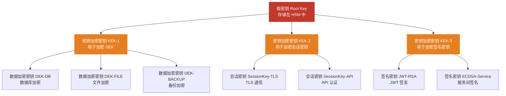
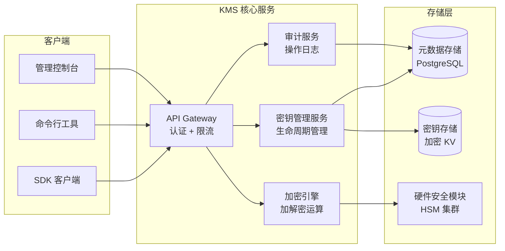
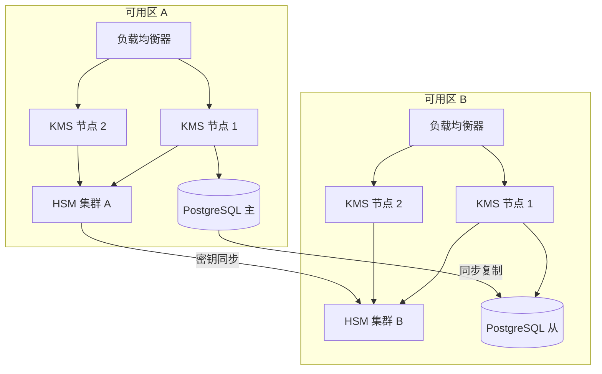

## 13.5 案例：企业级密钥管理系统

企业级密钥管理系统（Key Management System，KMS）是现代信息安全基础设施的核心组件。本案例以一家真实金融机构的需求为蓝本，完整呈现从需求分析、架构设计、编码实现到合规审计的全过程，帮助读者理解理论知识如何落地为生产级系统。

### 13.5.1 业务背景与需求分析

#### 业务场景

某中型商业银行（以下简称"甲行"）拥有以下资产需要加密保护：

| 资产类别 | 数量 | 加密需求 |
|----------|------|----------|
| 数据库实例 | 120+ | 字段级加密（PII/PCI 数据） |
| 文件存储 | 500TB+ | 静态加密（AES-256） |
| 微服务 API | 300+ | mTLS 双向认证、JWT 签名 |
| 备份归档 | 日增 2TB | 备份加密 + 完整性校验 |
| 第三方接口 | 50+ | HMAC 签名、密钥交换 |

#### 需求矩阵

经过安全团队与业务部门联合评审，整理出以下核心需求：

**功能性需求：**

- 支持 AES-128/192/256、RSA-2048/4096、ECDSA-P256/P384、HMAC-SHA256 等主流算法
- 密钥全生命周期管理：生成 → 分发 → 激活 → 轮换 → 停用 → 归档 → 销毁
- 支持信封加密（Envelope Encryption）模式，实现高效的批量数据加密
- 提供 RESTful API 和 SDK，供各业务系统集成
- 密钥导入/导出，支持与第三方 HSM 互操作

**非功能性需求：**

- 可用性：99.99%（年停机 < 52 分钟）
- 性能：单次密钥解密 < 5ms（P99），批量操作 > 10,000 ops/s
- 安全性：密钥明文永远不落盘，内存中使用后立即清零
- 合规：满足 FIPS 140-2 Level 3、PCI DSS 3.2.1、等保三级要求
- 审计：所有操作可追溯，日志保留 7 年

### 13.5.2 系统架构设计

#### 分层密钥架构

企业 KMS 的核心设计原则是**分层密钥架构**（Hierarchical Key Architecture）。通过多层密钥的包裹关系，将密钥泄露的影响范围限制在最小：



**各层密钥的职责划分：**

| 层级 | 密钥类型 | 存储位置 | 生命周期 | 用途 |
|------|----------|----------|----------|------|
| L0 | 根密钥 (Root Key) | HSM 硬件内 | 3-5 年 | 保护 KEK，永不导出 |
| L1 | KEK（密钥加密密钥） | HSM + 加密存储 | 1-2 年 | 加密保护 DEK 和会话密钥 |
| L2 | DEK（数据加密密钥） | 加密存储 | 90 天轮换 | 直接加密业务数据 |
| L3 | 会话密钥 / 临时密钥 | 仅内存 | 分钟级 | TLS 会话、临时令牌 |

这种分层架构的好处在于：即使某一层的密钥被泄露，攻击者仍然无法突破上一层的保护。例如，即使某个 DEK 被泄露，攻击者也只能解密该 DEK 保护的数据，而无法获取其他 DEK 或更上层的 KEK。

#### 系统组件架构



#### 关键设计决策

**为什么根密钥必须存放在 HSM 中？**

根密钥是整个密钥体系的信任锚点（Trust Anchor）。如果根密钥以软件方式存储，即使加密后存放在磁盘上，攻击者仍有可能通过内存转储、侧信道攻击或操作系统漏洞获取明文。HSM 提供物理级别的安全边界：

- 密钥在 HSM 内部生成，私钥组件永不离开硬件
- HSM 具备防篡改机制，物理入侵会触发密钥自动销毁
- FIPS 140-2 Level 3 认证确保满足金融监管要求
- HSM 内部执行加密运算，密钥材料不会暴露到主机内存

**为什么选择信封加密而非直接加密？**

直接使用主密钥加密大量数据存在两个问题：主密钥使用频率过高增加暴露风险，且对称密钥无法原生支持密钥轮换。信封加密将问题拆解：

```text
信封加密流程：
1. 生成随机 DEK（每次加密操作一个新的）
2. 用 DEK 加密业务数据（高效，AES-GCM）
3. 用 KEK 加密 DEK（密钥包裹）
4. 存储：加密后的数据 + 加密后的 DEK
```

轮换时只需用新 KEK 重新加密 DEK，无需重新加密全部业务数据。

### 13.5.3 核心实现

#### 密钥管理核心类

以下是 KMS 核心实现的完整代码，涵盖密钥生成、信封加密、密钥轮换等关键操作：

```python
"""
企业级密钥管理系统核心实现
注意：生产环境应使用经过安全审计的库和 HSM 集成
"""
import os
import json
import time
import uuid
import hashlib
from datetime import datetime, timedelta, timezone
from enum import Enum
from dataclasses import dataclass, field, asdict
from typing import Optional, Dict, Tuple

from cryptography.hazmat.primitives import keywrap, hashes, serialization
from cryptography.hazmat.primitives.ciphers.aead import AESGCM
from cryptography.hazmat.primitives.asymmetric import rsa, ec, padding
from cryptography.hazmat.primitives.kdf.hkdf import HKDF
from cryptography.hazmat.backends import default_backend


# ──────────────────────────────────────────────
# 数据模型
# ──────────────────────────────────────────────

class KeyState(Enum):
    """密钥状态枚举，对应完整生命周期"""
    PENDING = "pending"           # 待激活
    ACTIVE = "active"             # 激活，可用于加密和解密
    DEACTIVATED = "deactivated"   # 停用，仅可用于解密（不能加密新数据）
    ROTATED = "rotated"           # 已轮换，已被新密钥替代
    ARCHIVED = "archived"         # 归档，仅用于解密历史数据
    DESTROYED = "destroyed"       # 已销毁，不可恢复
    COMPROMISED = "compromised"   # 已泄露，立即禁用并触发应急流程

class KeyType(Enum):
    AES_256 = "aes-256"
    RSA_2048 = "rsa-2048"
    RSA_4096 = "rsa-4096"
    ECDSA_P256 = "ecdsa-p256"
    ECDSA_P384 = "ecdsa-p384"
    HMAC_SHA256 = "hmac-sha256"

@dataclass
class KeyMetadata:
    """密钥元数据，记录密钥的全部属性和审计信息"""
    key_id: str
    key_type: KeyType
    state: KeyState
    created_at: str
    updated_at: str
    expires_at: Optional[str] = None
    rotated_from: Optional[str] = None
    rotated_to: Optional[str] = None
    purpose: str = ""
    tags: Dict[str, str] = field(default_factory=dict)
    version: int = 1
    access_count: int = 0
    last_accessed_at: Optional[str] = None


# ──────────────────────────────────────────────
# 安全内存工具
# ──────────────────────────────────────────────

class SecureBytes:
    """
    安全字节容器：使用后自动清零内存。
    
    Python 的 bytes 是不可变对象，无法原地清零。
    这里使用 bytearray 实现可变缓冲区，
    并在析构时覆盖为随机数据。
    """
    def __init__(self, data: bytes):
        self._buf = bytearray(data)
    
    @property
    def data(self) -> bytes:
        return bytes(self._buf)
    
    def wipe(self):
        """用随机数据覆盖缓冲区，再清零"""
        for i in range(len(self._buf)):
            self._buf[i] = os.urandom(1)[0]
        for i in range(len(self._buf)):
            self._buf[i] = 0
    
    def __del__(self):
        self.wipe()
    
    def __enter__(self):
        return self
    
    def __exit__(self, *args):
        self.wipe()


# ──────────────────────────────────────────────
# 审计日志
# ──────────────────────────────────────────────

class AuditLogger:
    """
    审计日志记录器。
    生产环境中应对接 SIEM 系统（如 Splunk、ELK），
    日志必须是只追加（append-only）且防篡改的。
    """
    def __init__(self, log_file: str = "kms_audit.log"):
        self.log_file = log_file
    
    def log(self, action: str, key_id: str, principal: str,
            details: Optional[Dict] = None, success: bool = True):
        entry = {
            "timestamp": datetime.now(timezone.utc).isoformat(),
            "action": action,
            "key_id": key_id,
            "principal": principal,
            "success": success,
            "details": details or {},
            "log_id": str(uuid.uuid4()),
        }
        line = json.dumps(entry, ensure_ascii=False)
        with open(self.log_file, "a") as f:
            f.write(line + "\n")
        return entry


# ──────────────────────────────────────────────
# 密钥管理系统核心
# ──────────────────────────────────────────────

class KeyManagementSystem:
    """
    企业级密钥管理系统。
    
    设计要点：
    1. 信封加密：DEK 加密数据，KEK 加密 DEK
    2. 密钥轮换：新旧密钥共存，平滑迁移
    3. 访问控制：每次操作记录审计日志
    4. 安全存储：密钥明文不落盘
    """
    
    def __init__(self, master_key: bytes, audit_logger: Optional[AuditLogger] = None):
        self._master_key = SecureBytes(master_key)
        self.key_store: Dict[str, dict] = {}      # key_id → 加密后的密钥材料
        self.metadata: Dict[str, KeyMetadata] = {} # key_id → 元数据
        self.audit = audit_logger or AuditLogger()
        self._wrapping_key = self._derive_wrapping_key(master_key)
    
    def _derive_wrapping_key(self, master_key: bytes) -> bytes:
        """
        从主密钥派生密钥包装密钥。
        使用 HKDF 确保派生密钥与主密钥具有独立的安全性。
        """
        hkdf = HKDF(
            algorithm=hashes.SHA256(),
            length=32,
            salt=b"KMS-WRAP-KEY-SALT-v1",
            info=b"kms-key-wrapping",
            backend=default_backend()
        )
        return hkdf.derive(master_key)
    
    def generate_data_key(self, key_id: Optional[str] = None,
                          key_type: KeyType = KeyType.AES_256,
                          purpose: str = "",
                          ttl_days: int = 90,
                          principal: str = "system") -> Tuple[SecureBytes, str]:
        """
        生成数据加密密钥（DEK）。
        
        返回：
            (SecureBytes, key_id) - 明文 DEK 和密钥标识符
        
        流程：
            1. 生成随机 DEK
            2. 用包装密钥加密 DEK
            3. 存储加密后的 DEK 和元数据
            4. 返回明文 DEK（调用方用完应 wipe）
        """
        if key_id is None:
            key_id = f"dek-{uuid.uuid4().hex[:16]}"
        
        now = datetime.now(timezone.utc)
        expires = now + timedelta(days=ttl_days)
        
        # 生成密钥材料
        if key_type == KeyType.AES_256:
            raw_key = os.urandom(32)  # 256 bits
        elif key_type == KeyType.HMAC_SHA256:
            raw_key = os.urandom(64)  # 512 bits for HMAC
        else:
            raise ValueError(f"generate_data_key 仅支持对称密钥类型，{key_type} 不支持")
        
        # 加密存储
        encrypted = keywrap.aes_key_wrap_with_padding(
            self._wrapping_key, raw_key, default_backend()
        )
        
        # 保存元数据
        meta = KeyMetadata(
            key_id=key_id,
            key_type=key_type,
            state=KeyState.ACTIVE,
            created_at=now.isoformat(),
            updated_at=now.isoformat(),
            expires_at=expires.isoformat(),
            purpose=purpose,
        )
        self.metadata[key_id] = meta
        self.key_store[key_id] = {
            "encrypted_key": encrypted.hex(),
            "algorithm": "AES-KWP",
        }
        
        # 审计
        self.audit.log("generate_key", key_id, principal, {
            "key_type": key_type.value,
            "purpose": purpose,
            "expires_at": expires.isoformat(),
        })
        
        return SecureBytes(raw_key), key_id
    
    def get_data_key(self, key_id: str, principal: str = "system") -> SecureBytes:
        """
        获取已存储的数据加密密钥。
        
        安全检查：
            - 密钥必须存在且状态为 ACTIVE 或 DEACTIVATED
            - DEACTIVATED 状态仅允许解密操作
            - 检查是否过期
        """
        if key_id not in self.metadata:
            self.audit.log("get_key", key_id, principal, 
                          {"error": "not_found"}, success=False)
            raise KeyError(f"密钥 {key_id} 不存在")
        
        meta = self.metadata[key_id]
        
        # 状态检查
        if meta.state in (KeyState.DESTROYED, KeyState.COMPROMISED):
            self.audit.log("get_key", key_id, principal,
                          {"error": f"key_{meta.state.value}"}, success=False)
            raise PermissionError(f"密钥 {key_id} 状态为 {meta.state.value}，不可使用")
        
        # 过期检查
        if meta.expires_at:
            expires = datetime.fromisoformat(meta.expires_at)
            if datetime.now(timezone.utc) > expires:
                self.audit.log("get_key", key_id, principal,
                              {"error": "expired"}, success=False)
                raise PermissionError(f"密钥 {key_id} 已过期")
        
        # 解密
        stored = self.key_store[key_id]
        raw_key = keywrap.aes_key_unwrap_with_padding(
            self._wrapping_key,
            bytes.fromhex(stored["encrypted_key"]),
            default_backend()
        )
        
        # 更新访问统计
        meta.access_count += 1
        meta.last_accessed_at = datetime.now(timezone.utc).isoformat()
        
        self.audit.log("get_key", key_id, principal, {
            "state": meta.state.value,
            "access_count": meta.access_count,
        })
        
        return SecureBytes(raw_key)
    
    def rotate_key(self, key_id: str, principal: str = "admin") -> str:
        """
        密钥轮换：生成新密钥替代旧密钥。
        
        轮换流程：
            1. 将旧密钥状态设为 ROTATED
            2. 生成新密钥，记录轮换关系
            3. 旧密钥保留用于解密历史数据
        
        注意：轮换不会自动重新加密已有数据，
        调用方需要实现数据迁移逻辑。
        """
        if key_id not in self.metadata:
            raise KeyError(f"密钥 {key_id} 不存在")
        
        old_meta = self.metadata[key_id]
        if old_meta.state != KeyState.ACTIVE:
            raise PermissionError(f"只有 ACTIVE 状态的密钥可以轮换，当前状态: {old_meta.state.value}")
        
        # 生成新密钥
        new_key_id = f"{key_id}-v{old_meta.version + 1}"
        secure_key, new_id = self.generate_data_key(
            key_id=new_key_id,
            key_type=old_meta.key_type,
            purpose=old_meta.purpose,
            principal=principal,
        )
        secure_key.wipe()  # 新密钥已存储，明文不再需要
        
        # 更新新密钥的轮换关系
        self.metadata[new_id].rotated_from = key_id
        self.metadata[new_id].version = old_meta.version + 1
        
        # 旧密钥状态变更
        old_meta.state = KeyState.ROTATED
        old_meta.rotated_to = new_id
        old_meta.updated_at = datetime.now(timezone.utc).isoformat()
        
        self.audit.log("rotate_key", key_id, principal, {
            "old_key": key_id,
            "new_key": new_id,
            "new_version": old_meta.version + 1,
        })
        
        return new_id
    
    def revoke_key(self, key_id: str, reason: str, principal: str = "admin"):
        """
        紧急吊销密钥。
        用于密钥泄露或安全事件响应场景。
        吊销后密钥不可恢复。
        """
        if key_id not in self.metadata:
            raise KeyError(f"密钥 {key_id} 不存在")
        
        meta = self.metadata[key_id]
        old_state = meta.state
        meta.state = KeyState.COMPROMISED
        meta.updated_at = datetime.now(timezone.utc).isoformat()
        
        # 安全擦除密钥材料
        if key_id in self.key_store:
            encrypted = self.key_store[key_id]["encrypted_key"]
            # 用随机数据覆盖
            self.key_store[key_id]["encrypted_key"] = os.urandom(len(encrypted)).hex()
            del self.key_store[key_id]
        
        self.audit.log("revoke_key", key_id, principal, {
            "reason": reason,
            "old_state": old_state.value,
        })
        
        # 触发告警（生产环境应接入 PagerDuty 等）
        self._alert_security_team(key_id, reason)
    
    def _alert_security_team(self, key_id: str, reason: str):
        """安全告警通知，生产环境应接入告警系统"""
        print(f"[ALERT] 密钥 {key_id} 被紧急吊销，原因: {reason}")
    
    def list_keys(self, state: Optional[KeyState] = None,
                  key_type: Optional[KeyType] = None) -> list:
        """列出密钥，支持按状态和类型过滤"""
        results = []
        for key_id, meta in self.metadata.items():
            if state and meta.state != state:
                continue
            if key_type and meta.key_type != key_type:
                continue
            results.append(asdict(meta))
        return results
    
    def get_key_chain(self, key_id: str) -> list:
        """获取密钥的轮换链，用于追踪密钥演化历史"""
        chain = []
        current = key_id
        while current:
            if current not in self.metadata:
                break
            meta = self.metadata[current]
            chain.append({
                "key_id": current,
                "version": meta.version,
                "state": meta.state.value,
                "created_at": meta.created_at,
            })
            current = meta.rotated_from
        chain.reverse()
        return chain
```

#### 信封加密封装

在核心类之上，封装信封加密操作，为业务层提供简洁的接口：

```python
class EnvelopeEncryptor:
    """
    信封加密器：为业务层提供透明的加解密接口。
    
    使用方式：
        encryptor = EnvelopeEncryptor(kms)
        encrypted_blob = encryptor.encrypt(b"sensitive data", context={"table": "users"})
        plaintext = encryptor.decrypt(encrypted_blob, context={"table": "users"})
    """
    
    # 加密数据格式版本
    FORMAT_VERSION = 1
    
    def __init__(self, kms: KeyManagementSystem):
        self.kms = kms
        self._key_cache: Dict[str, SecureBytes] = {}
    
    def encrypt(self, plaintext: bytes, key_id: Optional[str] = None,
                context: Optional[Dict] = None) -> bytes:
        """
        信封加密。
        
        输出格式：
            [version:1B][key_id_len:2B][key_id][encrypted_dek_len:2B][encrypted_dek][nonce][ciphertext+tag]
        """
        # 生成或获取 DEK
        if key_id is None:
            dek, key_id = self.kms.generate_data_key(
                purpose="envelope-encryption",
                ttl_days=30,
            )
        else:
            dek = self.kms.get_data_key(key_id)
        
        with dek:
            # 用 DEK 加密数据（AES-256-GCM）
            aesgcm = AESGCM(dek.data)
            nonce = os.urandom(12)  # 96-bit nonce
            
            # 关联数据（AAD）：绑定上下文信息，防篡改
            aad_data = json.dumps(context or {}, sort_keys=True).encode()
            ciphertext = aesgcm.encrypt(nonce, plaintext, aad_data)
            
            # 获取加密后的 DEK
            dek_info = self.kms.key_store[key_id]
            encrypted_dek = bytes.fromhex(dek_info["encrypted_key"])
            
            # 组装输出
            key_id_bytes = key_id.encode("utf-8")
            aad_bytes = aad_data
            
            result = bytearray()
            result.append(self.FORMAT_VERSION)                          # 版本号
            result.extend(len(key_id_bytes).to_bytes(2, "big"))         # key_id 长度
            result.extend(key_id_bytes)                                 # key_id
            result.extend(len(encrypted_dek).to_bytes(2, "big"))        # 加密 DEK 长度
            result.extend(encrypted_dek)                                # 加密 DEK
            result.extend(nonce)                                        # nonce
            result.extend(len(aad_bytes).to_bytes(2, "big"))            # AAD 长度
            result.extend(aad_bytes)                                    # AAD
            result.extend(ciphertext)                                   # 密文 + GCM tag
            
            return bytes(result)
    
    def decrypt(self, encrypted_blob: bytes, context: Optional[Dict] = None) -> bytes:
        """
        信封解密。
        
        安全检查：
            - 版本号匹配
            - AAD 一致性验证（防上下文篡改）
            - GCM 认证标签验证
        """
        offset = 0
        
        # 解析头部
        version = encrypted_blob[offset]; offset += 1
        if version != self.FORMAT_VERSION:
            raise ValueError(f"不支持的格式版本: {version}")
        
        key_id_len = int.from_bytes(encrypted_blob[offset:offset+2], "big"); offset += 2
        key_id = encrypted_blob[offset:offset+key_id_len].decode("utf-8"); offset += key_id_len
        
        encrypted_dek_len = int.from_bytes(encrypted_blob[offset:offset+2], "big"); offset += 2
        encrypted_dek = encrypted_blob[offset:offset+encrypted_dek_len]; offset += encrypted_dek_len
        
        nonce = encrypted_blob[offset:offset+12]; offset += 12
        
        aad_len = int.from_bytes(encrypted_blob[offset:offset+2], "big"); offset += 2
        stored_aad = encrypted_blob[offset:offset+aad_len]; offset += aad_len
        
        ciphertext = encrypted_blob[offset:]
        
        # 验证 AAD 一致性
        expected_aad = json.dumps(context or {}, sort_keys=True).encode()
        if stored_aad != expected_aad:
            raise PermissionError("关联数据（AAD）不匹配，数据可能被篡改")
        
        # 解密 DEK
        dek = self.kms.get_data_key(key_id)
        with dek:
            aesgcm = AESGCM(dek.data)
            plaintext = aesgcm.decrypt(nonce, ciphertext, stored_aad)
        
        return plaintext
```

#### 密钥轮换管理器

密钥轮换是 KMS 运维中最容易出错的环节。以下是一个生产级的轮换管理器：

```python
class KeyRotationManager:
    """
    密钥轮换管理器。
    
    轮换策略：
    1. 基于时间：到期前自动轮换
    2. 基于使用量：超过访问次数阈值时轮换
    3. 紧急轮换：安全事件触发即时轮换
    
    轮换过程是平滑的：
    - 新旧密钥共存，旧密钥仅用于解密
    - 业务系统逐步迁移到新密钥
    - 旧密钥归档后保留，直到所有关联数据重新加密完成
    """
    
    def __init__(self, kms: KeyManagementSystem):
        self.kms = kms
        self.rotation_policies: Dict[str, dict] = {}
    
    def set_policy(self, key_id: str, max_age_days: int = 90,
                   max_access_count: int = 100000):
        """设置密钥轮换策略"""
        self.rotation_policies[key_id] = {
            "max_age_days": max_age_days,
            "max_access_count": max_access_count,
        }
    
    def check_and_rotate(self, principal: str = "rotation-manager") -> list:
        """
        检查所有密钥是否需要轮换，自动执行到期轮换。
        返回被轮换的密钥列表。
        """
        rotated = []
        now = datetime.now(timezone.utc)
        
        for key_id, meta in list(self.kms.metadata.items()):
            if meta.state != KeyState.ACTIVE:
                continue
            
            policy = self.rotation_policies.get(key_id, {})
            max_age = policy.get("max_age_days", 90)
            max_access = policy.get("max_access_count", 100000)
            
            needs_rotation = False
            reason = ""
            
            # 时间策略检查
            if meta.created_at:
                created = datetime.fromisoformat(meta.created_at)
                age_days = (now - created).days
                if age_days >= max_age:
                    needs_rotation = True
                    reason = f"已使用 {age_days} 天，超过 {max_age} 天阈值"
            
            # 使用量策略检查
            if meta.access_count >= max_access:
                needs_rotation = True
                reason = f"访问次数 {meta.access_count}，超过 {max_access} 阈值"
            
            # 过期前预轮换（提前 7 天）
            if meta.expires_at:
                expires = datetime.fromisoformat(meta.expires_at)
                if (expires - now).days <= 7:
                    needs_rotation = True
                    reason = f"将在 {(expires - now).days} 天后过期"
            
            if needs_rotation:
                try:
                    new_id = self.kms.rotate_key(key_id, principal=principal)
                    # 继承轮换策略
                    self.rotation_policies[new_id] = policy.copy()
                    rotated.append({"old": key_id, "new": new_id, "reason": reason})
                except Exception as e:
                    rotated.append({"old": key_id, "error": str(e)})
        
        return rotated
```

### 13.5.4 安全加固

#### 访问控制模型

KMS 的访问控制必须遵循最小权限原则。以下是基于属性的访问控制（ABAC）实现：

```python
from functools import wraps

class AccessPolicy:
    """
    KMS 访问控制策略。
    
    策略格式：
    {
        "principal": "service-name",
        "actions": ["encrypt", "decrypt"],
        "resources": ["key-id-pattern"],
        "conditions": {
            "source_ip": ["10.0.0.0/8"],
            "time_range": {"start": "08:00", "end": "22:00"},
        }
    }
    """
    
    def __init__(self):
        self.policies: list = []
    
    def add_policy(self, policy: dict):
        self.policies.append(policy)
    
    def check_access(self, principal: str, action: str,
                     key_id: str, context: Optional[Dict] = None) -> bool:
        """
        检查主体是否有权限执行指定操作。
        白名单模式：未匹配任何策略则拒绝。
        """
        for policy in self.policies:
            if self._match_policy(policy, principal, action, key_id, context):
                return True
        return False
    
    def _match_policy(self, policy: dict, principal: str,
                      action: str, key_id: str, context: Optional[Dict]) -> bool:
        # 主体匹配
        if policy["principal"] != "*" and policy["principal"] != principal:
            return False
        
        # 操作匹配
        if action not in policy.get("actions", []):
            return False
        
        # 资源匹配（支持通配符）
        import fnmatch
        resource_match = any(
            fnmatch.fnmatch(key_id, pattern)
            for pattern in policy.get("resources", ["*"])
        )
        if not resource_match:
            return False
        
        # 条件匹配
        conditions = policy.get("conditions", {})
        if not self._check_conditions(conditions, context):
            return False
        
        return True
    
    def _check_conditions(self, conditions: dict, context: Optional[Dict]) -> bool:
        if not conditions or not context:
            return True
        
        # IP 条件
        if "source_ip" in conditions:
            client_ip = context.get("source_ip", "")
            import ipaddress
            client = ipaddress.ip_address(client_ip)
            allowed = any(
                client in ipaddress.ip_network(net)
                for net in conditions["source_ip"]
            )
            if not allowed:
                return False
        
        return True


# 策略使用示例
def setup_default_policies(kms: KeyManagementSystem) -> AccessPolicy:
    """配置默认访问策略"""
    policy = AccessPolicy()
    
    # 数据库服务：只能加解密数据库相关密钥
    policy.add_policy({
        "principal": "db-service",
        "actions": ["encrypt", "decrypt"],
        "resources": ["dek-db-*"],
    })
    
    # 备份服务：只能读取备份密钥（解密）
    policy.add_policy({
        "principal": "backup-service",
        "actions": ["decrypt"],
        "resources": ["dek-backup-*"],
    })
    
    # 管理员：全部权限
    policy.add_policy({
        "principal": "admin",
        "actions": ["encrypt", "decrypt", "rotate", "revoke", "list"],
        "resources": ["*"],
    })
    
    return policy
```

#### 安全编码实践

以下是在 KMS 实现中必须遵循的安全编码规范：

```python
# ═══════════════════════════════════════════════
# 安全编码检查清单
# ═══════════════════════════════════════════════

# ✅ 1. 密钥材料使用后立即清零
def secure_encrypt_example(kms, plaintext, key_id):
    """正确的做法：使用 with 语句确保密钥被擦除"""
    with kms.get_data_key(key_id) as dek:
        aesgcm = AESGCM(dek.data)
        nonce = os.urandom(12)
        return aesgcm.encrypt(nonce, plaintext, None)

# ❌ 2. 错误示例：密钥残留内存
def insecure_encrypt_example(kms, plaintext, key_id):
    """错误做法：密钥对象可能在内存中长期存活"""
    dek = kms.get_data_key(key_id)  # 没有 wipe
    aesgcm = AESGCM(dek.data)
    nonce = os.urandom(12)
    return aesgcm.encrypt(nonce, plaintext, None)

# ✅ 3. 使用确定性 nonce（对计数器模式）或随机 nonce（对 GCM）
# GCM 模式：每次加密必须使用唯一 nonce，绝对不能重用
# 建议：12 字节随机 nonce，在单密钥下碰撞概率可忽略

# ✅ 4. 日志中永远不记录密钥材料
def safe_log_example(key_id, action):
    """日志只记录操作元数据，不记录密钥"""
    print(f"[KMS] key_id={key_id} action={action} timestamp={datetime.now()}")

# ✅ 5. 错误信息不泄露内部状态
def safe_error_example(key_id):
    """不暴露密钥存在与否的详细信息"""
    # 错误做法："Key dek-abc123 not found in store, 3 keys total"
    # 正确做法：
    raise PermissionError("访问被拒绝")  # 通用错误信息
```

### 13.5.5 合规与审计

#### FIPS 140-2 合规要点

FIPS 140-2 是美国联邦信息处理标准，也是金融行业普遍要求的安全基准。KMS 需要在以下方面满足要求：

| FIPS 140-2 要求域 | KMS 实现措施 | 验证方法 |
|-------------------|-------------|---------|
| 密码模块规格 | 使用 FIPS 认证的加密库（如 OpenSSL FIPS 模块） | 查验 CMVP 证书编号 |
| 密钥管理 | 分层密钥架构，HSM 保护根密钥 | 架构审查 + HSM 认证证书 |
| 自启动测试 | 每次启动时验证加密库完整性 | FIPS POST（Power-On Self-Test） |
| 物理安全 | HSM 防篡改外壳，入侵检测 | FIPS 认证 HSM 设备 |
| 密钥输入/输出 | 密钥传输使用加密通道，导入需多因素认证 | 密钥仪式记录 |
| 密钥存储 | 根密钥不离开 HSM，其他密钥加密存储 | 密钥存储审计 |
| 密钥销毁 | 密钥材料安全擦除（多次覆写） | 销毁过程记录 |

#### PCI DSS 密钥管理要求

PCI DSS 3.2.1 对密钥管理有明确的控制要求：

```text
PCI DSS 要求 3.5 - 密钥管理流程：
├── 3.5.1 密钥存储位置的安全性
│   └── 实现：HSM 集群 + 加密文件系统
├── 3.5.2 密钥的安全分发
│   └── 实现：TLS 1.3 + 证书认证
├── 3.5.3 密钥的安全存储
│   └── 实现：HSM + 密钥分片（Shamir's Secret Sharing）
├── 3.5.4 密钥的定期轮换
│   └── 实现：自动轮换管理器 + 人工审批
├── 3.5.5 泄露密钥的替换
│   └── 实现：紧急吊销流程 + 告警
└── 3.5.6 密钥管理职责分离
    └── 实现：双人控制 + HSM M-of-N 认证
```

#### 审计日志格式

审计日志必须满足不可否认性（Non-repudiation）要求：

```json
{
  "log_id": "550e8400-e29b-41d4-a716-446655440000",
  "timestamp": "2026-01-15T08:30:00.000Z",
  "event_type": "key_access",
  "action": "decrypt",
  "key_id": "dek-db-users-v3",
  "principal": "user-service",
  "source_ip": "10.0.1.50",
  "source_service": "user-svc-prod-01",
  "request_id": "req-abc123",
  "result": "success",
  "data_classification": "PII",
  "additional_context": {
    "table": "users",
    "operation": "SELECT",
    "row_count": 1
  }
}
```

**审计日志的存储要求：**

- 只追加（Append-Only）：日志写入后不可修改
- 防篡改：使用哈希链或数字签名保护日志完整性
- 长期保留：金融行业要求至少 7 年
- 实时监控：异常操作（如高频解密、非工作时间访问）触发告警
- 独立存储：审计日志与 KMS 服务分离存储，防止被同一攻击同时篡改

### 13.5.6 高可用与灾难恢复

#### 高可用架构



**高可用设计要点：**

1. **多活部署**：至少 2 个可用区，每个可用区独立的 KMS 节点和 HSM 集群
2. **HSM 同步**：根密钥通过 HSM 厂商的安全同步机制在集群间复制
3. **数据库复制**：PostgreSQL 主从同步，确保密钥元数据一致性
4. **缓存层**：热点密钥缓存在 Redis（加密后），减少 HSM 调用压力
5. **健康检查**：每 10 秒检查节点和 HSM 连通性，自动摘除故障节点

#### 灾难恢复流程

```python
class DisasterRecovery:
    """
    灾难恢复管理器。
    
    恢复优先级：
    1. 恢复 HSM 根密钥（从备份或密钥分片重建）
    2. 恢复 KEK（从 HSM 解密）
    3. 恢复密钥元数据数据库
    4. 验证密钥可用性
    5. 恢复业务服务
    """
    
    def __init__(self, kms: KeyManagementSystem):
        self.kms = kms
    
    def create_backup_manifest(self) -> dict:
        """
        创建备份清单。
        备份不包含密钥明文，只有加密后的密钥材料和元数据。
        """
        manifest = {
            "backup_id": str(uuid.uuid4()),
            "timestamp": datetime.now(timezone.utc).isoformat(),
            "version": "1.0",
            "key_count": len(self.kms.metadata),
            "keys": {},
        }
        
        for key_id, meta in self.kms.metadata.items():
            manifest["keys"][key_id] = {
                "metadata": asdict(meta),
                "encrypted_key_exists": key_id in self.kms.key_store,
            }
        
        return manifest
    
    def verify_recovery(self) -> dict:
        """
        恢复验证：检查所有密钥是否可正常使用。
        返回验证报告。
        """
        report = {
            "total_keys": len(self.kms.metadata),
            "accessible": 0,
            "inaccessible": 0,
            "errors": [],
        }
        
        for key_id, meta in self.kms.metadata.items():
            if meta.state in (KeyState.DESTROYED, KeyState.COMPROMISED):
                continue
            try:
                if key_id in self.kms.key_store:
                    # 尝试解密验证密钥可用性
                    self.kms.get_data_key(key_id, principal="recovery-verify")
                    report["accessible"] += 1
                else:
                    report["inaccessible"] += 1
                    report["errors"].append({
                        "key_id": key_id,
                        "error": "密钥材料缺失",
                    })
            except Exception as e:
                report["inaccessible"] += 1
                report["errors"].append({
                    "key_id": key_id,
                    "error": str(e),
                })
        
        return report
```

### 13.5.7 性能优化

#### 密钥缓存策略

频繁访问 HSM 会成为性能瓶颈。以下是生产级的缓存策略：

```python
import threading
from collections import OrderedDict

class KeyCache:
    """
    LRU 密钥缓存。
    
    安全设计：
    - 缓存中的密钥使用单独的包装密钥加密
    - 缓存有最大容量和 TTL 限制
    - 缓存密钥定期轮换
    - 支持主动失效（密钥轮换/吊销时）
    """
    
    def __init__(self, max_size: int = 1000, ttl_seconds: int = 300):
        self.max_size = max_size
        self.ttl_seconds = ttl_seconds
        self._cache: OrderedDict[str, dict] = OrderedDict()
        self._lock = threading.Lock()
        self._cache_key = os.urandom(32)  # 缓存专用包装密钥
    
    def get(self, key_id: str) -> Optional[bytes]:
        """从缓存获取密钥"""
        with self._lock:
            if key_id not in self._cache:
                return None
            
            entry = self._cache[key_id]
            
            # TTL 检查
            if time.time() - entry["cached_at"] > self.ttl_seconds:
                self._evict(key_id)
                return None
            
            # 移到末尾（LRU）
            self._cache.move_to_end(key_id)
            
            # 解密缓存中的密钥
            encrypted = entry["encrypted_key"]
            aesgcm = AESGCM(self._cache_key)
            return aesgcm.decrypt(entry["nonce"], encrypted, key_id.encode())
    
    def put(self, key_id: str, key_material: bytes):
        """将密钥放入缓存"""
        with self._lock:
            # 容量检查
            while len(self._cache) >= self.max_size:
                self._cache.popitem(last=False)  # 淘汰最久未使用的
            
            # 加密后存储
            aesgcm = AESGCM(self._cache_key)
            nonce = os.urandom(12)
            encrypted = aesgcm.encrypt(nonce, key_material, key_id.encode())
            
            self._cache[key_id] = {
                "encrypted_key": encrypted,
                "nonce": nonce,
                "cached_at": time.time(),
            }
    
    def invalidate(self, key_id: str):
        """主动失效缓存条目（密钥轮换/吊销时调用）"""
        with self._lock:
            if key_id in self._cache:
                self._evict(key_id)
    
    def _evict(self, key_id: str):
        """淘汰缓存条目并安全擦除"""
        entry = self._cache.pop(key_id, None)
        if entry:
            # 覆盖加密数据
            entry["encrypted_key"] = os.urandom(len(entry["encrypted_key"]))
```

### 13.5.8 测试与验证

#### 单元测试

```python
import pytest

class TestKeyManagementSystem:
    """KMS 核心功能测试"""
    
    @pytest.fixture
    def kms(self):
        master_key = os.urandom(32)
        return KeyManagementSystem(master_key)
    
    def test_generate_and_retrieve_data_key(self, kms):
        """测试密钥生成和检索"""
        dek, key_id = kms.generate_data_key(purpose="test")
        assert key_id.startswith("dek-")
        assert len(dek.data) == 32  # 256 bits
        
        retrieved = kms.get_data_key(key_id)
        assert retrieved.data == dek.data
        dek.wipe()
        retrieved.wipe()
    
    def test_key_rotation_preserves_old_key(self, kms):
        """测试轮换后旧密钥仍可用于解密"""
        dek, key_id = kms.generate_data_key(purpose="rotation-test")
        original_data = dek.data
        dek.wipe()
        
        new_key_id = kms.rotate_key(key_id)
        
        # 旧密钥应该可以解密（状态为 ROTATED）
        old_dek = kms.get_data_key(key_id)
        assert old_dek.data == original_data
        old_dek.wipe()
        
        # 新密钥应该是不同的
        new_dek = kms.get_data_key(new_key_id)
        assert new_dek.data != original_data
        new_dek.wipe()
    
    def test_revoked_key_cannot_be_accessed(self, kms):
        """测试吊销后的密钥不可访问"""
        dek, key_id = kms.generate_data_key(purpose="revoke-test")
        dek.wipe()
        
        kms.revoke_key(key_id, reason="test-compromise")
        
        with pytest.raises(PermissionError):
            kms.get_data_key(key_id)
    
    def test_expired_key_cannot_be_accessed(self, kms):
        """测试过期密钥不可访问"""
        dek, key_id = kms.generate_data_key(
            purpose="expiry-test", ttl_days=0
        )
        dek.wipe()
        
        # 手动将过期时间设为过去
        kms.metadata[key_id].expires_at = (
            datetime.now(timezone.utc) - timedelta(days=1)
        ).isoformat()
        
        with pytest.raises(PermissionError, match="已过期"):
            kms.get_data_key(key_id)
    
    def test_envelope_encrypt_decrypt_roundtrip(self, kms):
        """测试信封加密解密往返"""
        encryptor = EnvelopeEncryptor(kms)
        plaintext = b"Sensitive financial data: $1,000,000"
        context = {"table": "transactions", "operation": "INSERT"}
        
        encrypted = encryptor.encrypt(plaintext, context=context)
        decrypted = encryptor.decrypt(encrypted, context=context)
        
        assert decrypted == plaintext
    
    def test_envelope_encrypt_tampered_data_detected(self, kms):
        """测试篡改检测"""
        encryptor = EnvelopeEncryptor(kms)
        plaintext = b"test data"
        
        encrypted = encryptor.encrypt(plaintext)
        
        # 篡改密文
        tampered = bytearray(encrypted)
        tampered[-1] ^= 0xFF
        tampered = bytes(tampered)
        
        with pytest.raises(Exception):  # GCM 认证失败
            encryptor.decrypt(tampered)
    
    def test_audit_log_records_operations(self, kms, tmp_path):
        """测试审计日志记录"""
        log_file = str(tmp_path / "test_audit.log")
        kms.audit = AuditLogger(log_file)
        
        dek, key_id = kms.generate_data_key(purpose="audit-test", principal="test-user")
        dek.wipe()
        
        # 验证日志文件
        with open(log_file) as f:
            entries = [json.loads(line) for line in f]
        
        assert len(entries) >= 1
        assert entries[0]["action"] == "generate_key"
        assert entries[0]["key_id"] == key_id
        assert entries[0]["principal"] == "test-user"
```

### 13.5.9 常见误区与最佳实践

#### 常见误区

**误区 1：用同一个密钥加密所有数据**

```text
❌ 错误做法：
所有数据库字段用同一个 AES 密钥加密

✅ 正确做法：
每个表/字段使用独立的 DEK，DEK 由 KEK 保护
即使某个 DEK 泄露，影响范围仅限于该表/字段
```

**误区 2：密钥轮换后删除旧密钥**

```text
❌ 错误做法：
轮换后立即删除旧密钥

✅ 正确做法：
旧密钥状态改为 DEACTIVATED → ARCHIVED
保留直到所有用旧密钥加密的数据都已迁移
```

**误区 3：在应用代码中硬编码密钥**

```text
❌ 错误做法：
MASTER_KEY = "0123456789abcdef..."  # 硬编码在源码中

✅ 正确做法：
从 HSM 或密钥管理服务动态获取
使用环境变量或配置中心注入（注意环境变量本身也有泄露风险）
```

**误区 4：忽略密钥的访问控制**

```text
❌ 错误做法：
KMS API 无认证，任何服务都能获取任意密钥

✅ 正确做法：
每个服务只能访问自己需要的密钥
实施最小权限原则，定期审查权限
```

**误区 5：日志中记录密钥明文**

```text
❌ 错误做法：
logger.info(f"Decrypting with key: {key.hex()}")

✅ 正确做法：
logger.info(f"Decrypting with key_id: {key_id}")
只记录密钥标识符，不记录密钥材料
```

#### 最佳实践清单

| 类别 | 实践 | 优先级 |
|------|------|--------|
| 密钥生成 | 使用 CSPRNG（密码学安全伪随机数生成器） | 必须 |
| 密钥存储 | 根密钥存 HSM，其他密钥加密存储 | 必须 |
| 密钥传输 | 使用 TLS 1.3 + 证书固定 | 必须 |
| 访问控制 | 最小权限 + RBAC/ABAC | 必须 |
| 审计 | 所有操作记录审计日志 | 必须 |
| 轮换 | 自动化定期轮换 | 必须 |
| 备份 | 加密备份 + 异地存储 | 必须 |
| 监控 | 异常访问模式告警 | 推荐 |
| 测试 | 定期恢复演练 | 推荐 |
| 文档 | 密钥清单 + 操作手册 | 推荐 |

### 13.5.10 生产部署清单

在将 KMS 部署到生产环境前，逐项检查以下内容：

```text
生产部署检查清单
═══════════════════════════════════════

□ 硬件安全模块
  □ HSM 设备已上架并完成初始化
  □ HSM 固件为最新版本
  □ HSM 已通过 FIPS 140-2 Level 3 认证
  □ HSM 操作员密钥已分发（M-of-N 认证）
  □ HSM 备份已完成并异地存储

□ 密钥初始化
  □ 根密钥已在 HSM 内部生成
  □ KEK 已生成并通过根密钥加密
  □ 初始 DEK 已生成
  □ 密钥分片备份已完成（Shamir's Secret Sharing）

□ 网络安全
  □ KMS 服务仅监听内网地址
  □ TLS 证书已配置且证书链完整
  □ 防火墙规则已配置（仅允许授权来源）
  □ mTLS 已启用（服务间通信）

□ 访问控制
  □ RBAC 策略已配置
  □ 最小权限原则已实施
  □ API 认证（JWT/OAuth2）已配置
  □ 紧急访问流程已文档化

□ 审计与监控
  □ 审计日志存储已配置（只追加）
  □ 日志告警规则已配置
  □ SIEM 集成已测试
  □ 密钥使用量仪表盘已部署

□ 灾难恢复
  □ 备份恢复流程已测试
  □ 跨可用区部署已验证
  □ 故障转移 RTO < 30 秒
  □ RPO = 0（同步复制）

□ 合规
  □ 安全评审已通过
  □ 合规团队已签字
  □ 渗透测试已完成
  □ 密钥管理策略文档已归档
```

本案例展示了一个企业级密钥管理系统从需求分析到生产部署的完整过程。核心要点是：分层密钥架构降低单点风险，HSM 保护根密钥，信封加密平衡效率与安全，自动化轮换减少人为失误，完善的审计满足合规要求。实际落地时，还需结合具体业务场景和合规要求进行定制化调整。
