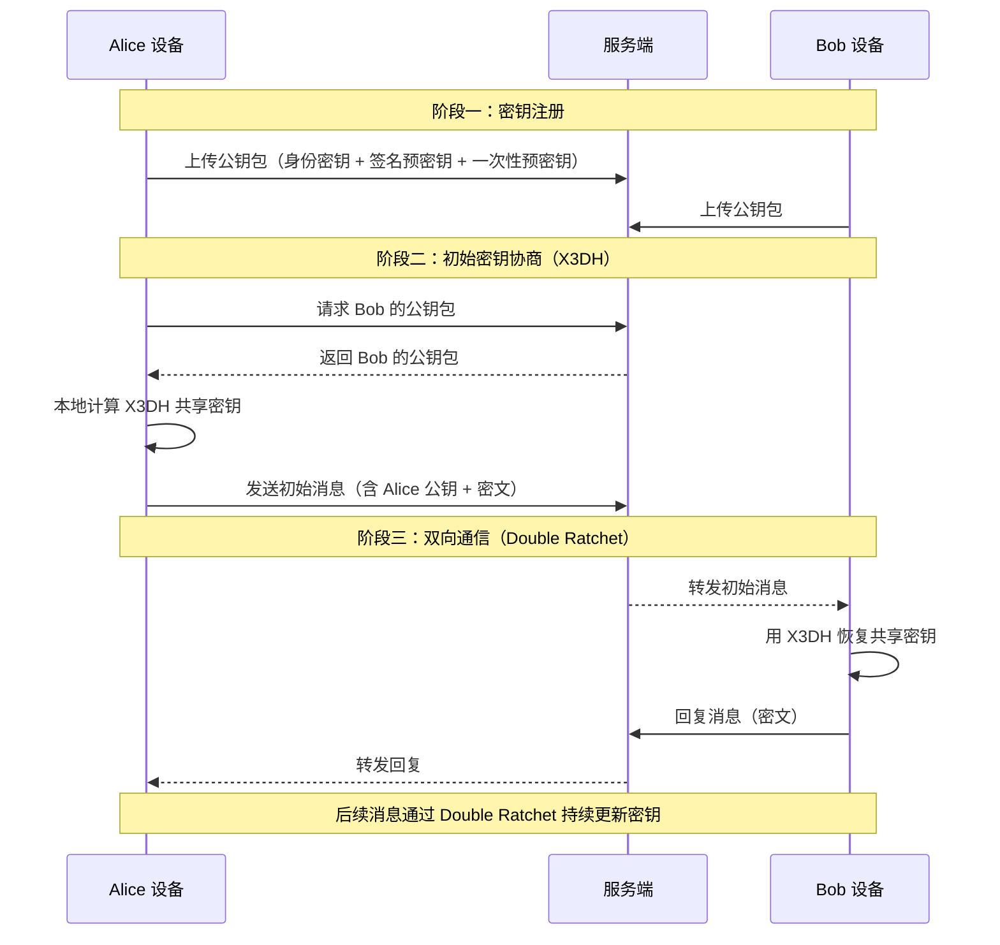
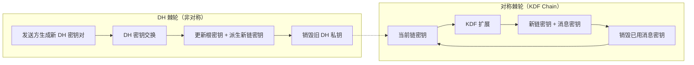

## 13.6 案例：端到端加密通信系统

### 13.6.1 背景描述

某即时通讯应用需要实现端到端加密（End-to-End Encryption, E2EE），确保只有通信双方能够读取消息内容，即使服务端被完全攻破也无法解密历史消息。系统需要支持以下核心能力：

- **双向加密通信**：Alice 和 Bob 之间的所有消息均以密文形式传输和存储
- **前向保密**（Forward Secrecy）：即使长期密钥泄露，历史消息仍然安全
- **后向保密**（Post-Compromise Security）：密钥泄露后，未来的通信能够自动恢复安全性
- **消息认证**：每条消息都附带认证标签，防止篡改和伪造
- **离线通信**：接收方不在线时，发送方仍能加密消息并安全存储

这是现代通讯应用（Signal、WhatsApp、iMessage）的核心密码学架构，也是密码学理论到工程落地的经典案例。

### 13.6.2 端到端加密架构总览

#### 13.6.2.1 与传统加密模型的对比

在理解 E2EE 之前，需要先区分三种加密通信模型：

| 模型 | 加密位置 | 服务端能否解密 | 典型应用 |
|------|----------|----------------|----------|
| 传输加密（TLS） | 客户端 ↔ 服务端 | 能（服务端有明文） | 普通 HTTPS 网站 |
| 静态加密（At-rest） | 存储层加密 | 能（运行时解密） | 云存储服务 |
| 端到端加密（E2EE） | 客户端 ↔ 客户端 | 不能（服务端只有密文） | Signal、WhatsApp |

E2EE 的核心思想是：**密钥只存在于通信双方的设备上，服务端只负责转发密文，永远不接触明文或密钥材料**。

#### 13.6.2.2 E2EE 系统架构



### 13.6.3 Signal 协议实现

Signal 协议（原名 TextSecure 协议）是目前最广泛使用的 E2EE 协议，被 WhatsApp（20 亿用户）、Facebook Messenger（Secret Conversations）、Google Messages 等采用。它由两个核心组件构成：

1. **X3DH（Extended Triple Diffie-Hellman）**：负责初始密钥协商
2. **Double Ratchet（双棘轮算法）**：负责持续密钥更新

#### 13.6.3.1 密钥材料准备

通信双方在注册时各自生成一套密钥材料：

```python
from cryptography.hazmat.primitives.asymmetric import x25519
from cryptography.hazmat.primitives.asymmetric.ed25519 import Ed25519PrivateKey
from cryptography.hazmat.primitives import serialization, hashes
from cryptography.hazmat.primitives.kdf.hkdf import HKDF
import os

class KeyBundle:
    """每个用户在注册时生成的密钥包"""
    
    def __init__(self):
        # 1. 身份密钥对（Identity Key）— 长期密钥，用于身份认证
        self.identity_key = x25519.X25519PrivateKey.generate()
        
        # 2. 签名密钥对（Signing Key）— 用于签名预密钥，防止篡改
        self.signing_key = Ed25519PrivateKey.generate()
        
        # 3. 签名预密钥对（Signed Pre-Key）— 中期密钥，定期轮换（通常每周）
        self.signed_pre_key = x25519.X25519PrivateKey.generate()
        self.signed_pre_key_signature = self.signing_key.sign(
            self.signed_pre_key.public_key().public_bytes(
                encoding=serialization.Encoding.Raw,
                format=serialization.PublicFormat.Raw
            )
        )
        
        # 4. 一次性预密钥（One-Time Pre-Keys）— 每次协商消耗一个，用完补充
        self.one_time_pre_keys = [
            x25519.X25519PrivateKey.generate() for _ in range(100)
        ]
    
    def get_public_bundle(self):
        """获取要上传到服务端的公钥包"""
        return {
            'identity_public': self.identity_key.public_key(),
            'signing_public': self.signing_key.public_key(),
            'signed_pre_key_public': self.signed_pre_key.public_key(),
            'signed_pre_key_signature': self.signed_pre_key_signature,
            'one_time_pre_keys_public': [
                k.public_key() for k in self.one_time_pre_keys
            ]
        }
```

**为什么需要这么多种密钥？** 每种密钥承担不同的安全职责：

| 密钥类型 | 生命周期 | 数量 | 作用 | 泄露影响 |
|----------|----------|------|------|----------|
| 身份密钥 | 永久（除非更换设备） | 每设备 1 对 | 身份认证的根锚点 | 灾难性的，可冒充身份 |
| 签名密钥 | 与身份密钥同生命周期 | 每设备 1 对 | 签名预密钥，防篡改 | 可伪造预密钥 |
| 签名预密钥 | 1-2 周轮换 | 1 个活跃 | 离线密钥协商 | 影响有限，可轮换恢复 |
| 一次性预密钥 | 一次性消耗 | 批量预生成 100+ | 增强前向保密 | 几乎无影响 |

#### 13.6.3.2 X3DH 初始密钥协商

X3DH（Extended Triple Diffie-Hellman）解决了**异步场景**下的密钥协商问题——即使 Bob 不在线，Alice 也能安全地建立共享密钥。

传统 DH 只做一次密钥交换（1 个 DH 共享密钥），X3DH 做三次（或四次），将多个密钥的熵融合在一起，任何单一密钥泄露都不会导致完全崩溃：

```python
def x3dh_alice_side(alice_bundle: KeyBundle, bob_public_bundle: dict):
    """
    Alice 发起方执行 X3DH 协商
    
    X3DH 计算 3（或 4）个 DH 共享密钥，然后融合：
    DH1 = DH(Alice身份密钥, Bob签名预密钥)
    DH2 = DH(Alice临时密钥, Bob身份密钥)
    DH3 = DH(Alice临时密钥, Bob签名预密钥)
    DH4 = DH(Alice临时密钥, Bob一次性预密钥)  ← 如果有
    """
    # Alice 生成临时密钥（每个会话一个）
    ephemeral_key = x25519.X25519PrivateKey.generate()
    
    # DH1: Alice身份密钥 ↔ Bob签名预密钥
    dh1 = alice_bundle.identity_key.exchange(
        bob_public_bundle['signed_pre_key_public']
    )
    
    # DH2: Alice临时密钥 ↔ Bob身份密钥
    dh2 = ephemeral_key.exchange(
        bob_public_bundle['identity_public']
    )
    
    # DH3: Alice临时密钥 ↔ Bob签名预密钥
    dh3 = ephemeral_key.exchange(
        bob_public_bundle['signed_pre_key_public']
    )
    
    # DH4: Alice临时密钥 ↔ Bob一次性预密钥（如果存在）
    dh4 = b''
    if bob_public_bundle.get('one_time_pre_key_public'):
        dh4 = ephemeral_key.exchange(
            bob_public_bundle['one_time_pre_key_public']
        )
    
    # 融合所有 DH 输出
    ikm = dh1 + dh2 + dh3 + dh4
    
    # 使用 HKDF 派生初始根密钥和链密钥
    # 确保输入有足够熵：3-4 个 X25519 DH 输出（每个 32 字节 = 256 位）
    hkdf = HKDF(
        algorithm=hashes.SHA256(),
        length=64,  # 32 字节根密钥 + 32 字节链密钥
        salt=b'\x00' * 32,
        info=b'X3DH_Initial_Key'
    )
    derived = hkdf.derive(ikm)
    
    root_key = derived[:32]
    chain_key = derived[32:64]
    
    return root_key, chain_key, ephemeral_key.public_key()
```

**X3DH 的安全特性解析：**

- **身份密钥参与 DH**：将密钥协商绑定到双方身份，防止未知密钥攻击（UKS）
- **临时密钥参与 DH**：提供前向保密，即使身份密钥泄露，攻击者也无法计算 DH2/DH3/DH4
- **一次性预密钥**：额外的一层前向保密保护，消耗后即丢弃
- **HKDF 融合**：将多个 DH 输出的熵安全地融合为单一密钥材料

**X3DH 相比传统 DH 的优势：**

| 特性 | 普通 DH | Station-to-Station | X3DH |
|------|---------|-------------------|------|
| 双方是否需要在线 | 是 | 是 | 否（异步安全） |
| 前向保密 | ✓ | ✓ | ✓ |
| 身份认证 | ✗ | ✓ | ✓ |
| 抗未知密钥攻击 | ✗ | ✗ | ✓ |
| 一次性预密钥保护 | ✗ | ✗ | ✓ |

#### 13.6.3.3 Double Ratchet 双棘轮算法

X3DH 只负责建立初始共享密钥。真正的魔法在于 Double Ratchet——它让每次消息发送/接收都更新密钥，实现了持续的前向保密和后向保密。

Double Ratchet 包含两个独立的棘轮：



**对称棘轮**：每发一条消息，从当前链密钥派生一个消息密钥和下一个链密钥，然后销毁旧链密钥。这确保了同一链内消息之间的前向保密。

**DH 棘轮**：每次对方回复时，双方交换新的 DH 密钥对，结合根密钥派生全新的链密钥。这确保了不同轮次之间的前向保密和后向保密。

```python
from cryptography.hazmat.primitives.ciphers.aead import AESGCM
import hmac
import hashlib
import struct

class DoubleRatchet:
    """双棘轮算法核心实现"""
    
    def __init__(self, root_key, is_initiator=True):
        self.root_key = root_key
        self.is_initiator = is_initiator
        
        # DH 棘轮状态
        self.dh_key_pair = x25519.X25519PrivateKey.generate()
        self.dh_remote_public = None
        
        # 对称棘轮状态
        self.sending_chain_key = None
        self.receiving_chain_key = None
        
        # 消息计数器
        self.send_count = 0
        self.recv_count = 0
        self.prev_send_count = 0
        
        # 消息密钥缓存（用于乱序到达的消息）
        self.skipped_keys = {}  # (dh_public, counter) -> message_key
    
    def _kdf_chain(self, chain_key):
        """对称棘轮核心：从链密钥派生消息密钥和下一个链密钥"""
        # 使用 HMAC-SHA256 作为 KDF
        # 输入 0x01 → 消息密钥
        # 输入 0x02 → 下一个链密钥
        message_key = hmac.new(
            chain_key, b'\x01', hashlib.sha256
        ).digest()
        next_chain_key = hmac.new(
            chain_key, b'\x02', hashlib.sha256
        ).digest()
        return next_chain_key, message_key
    
    def _dh_ratchet(self, remote_public):
        """DH 棘轮：更新 DH 密钥对，派生新的发送/接收链密钥"""
        # 保存旧的 DH 公钥（用于跳过的消息密钥查找）
        old_dh_public = self.dh_key_pair.public_key()
        
        # 第一次棘轮：只计算接收链
        if self.dh_remote_public is not None:
            # 接收方向棘轮
            dh_recv = self.dh_key_pair.exchange(remote_public)
            self.root_key, self.receiving_chain_key = self._kdf_root(
                self.root_key, dh_recv
            )
        
        # 更新远程公钥
        self.dh_remote_public = remote_public
        
        # 生成新的 DH 密钥对
        self.dh_key_pair = x25519.X25519PrivateKey.generate()
        
        # 发送方向棘轮
        dh_send = self.dh_key_pair.exchange(remote_public)
        self.root_key, self.sending_chain_key = self._kdf_root(
            self.root_key, dh_send
        )
        
        # 重置消息计数器
        self.prev_send_count = self.send_count
        self.send_count = 0
        self.recv_count = 0
    
    def _kdf_root(self, root_key, dh_output):
        """根密钥 KDF：从根密钥和 DH 输出派生新的根密钥和链密钥"""
        hkdf = HKDF(
            algorithm=hashes.SHA256(),
            length=64,
            salt=root_key,
            info=b'DoubleRatchet_KDF'
        )
        derived = hkdf.derive(dh_output)
        return derived[:32], derived[32:64]
    
    def encrypt(self, plaintext):
        """加密并发送消息"""
        # 从发送链派生消息密钥
        self.sending_chain_key, message_key = self._kdf_chain(
            self.sending_chain_key
        )
        
        # 用消息密钥加密（AES-256-GCM）
        nonce = os.urandom(12)
        aesgcm = AESGCM(message_key[:32])
        
        # 附加数据包含 DH 公钥和消息序号，防止重放和关联攻击
        associated_data = (
            self.dh_key_pair.public_key().public_bytes(
                encoding=serialization.Encoding.Raw,
                format=serialization.PublicFormat.Raw
            ) + struct.pack('>I', self.send_count)
        )
        
        ciphertext = aesgcm.encrypt(
            nonce, plaintext.encode('utf-8'), associated_data
        )
        
        self.send_count += 1
        
        # 返回：发送方DH公钥 + 序号 + nonce + 密文
        header = {
            'dh_public': self.dh_key_pair.public_key(),
            'prev_count': self.prev_send_count,
            'msg_count': self.send_count - 1
        }
        return header, nonce + ciphertext
    
    def decrypt(self, header, ciphertext_with_nonce):
        """接收并解密消息"""
        # 检查是否需要 DH 棘轮
        remote_dh = header['dh_public']
        if remote_dh != self.dh_remote_public:
            self._skip_message_keys(header['prev_count'])
            self._dh_ratchet(remote_dh)
        
        # 跳过中间的消息密钥（处理乱序到达）
        self._skip_message_keys(header['msg_count'])
        
        # 从接收链派生消息密钥
        self.receiving_chain_key, message_key = self._kdf_chain(
            self.receiving_chain_key
        )
        
        # 解密
        nonce = ciphertext_with_nonce[:12]
        ciphertext = ciphertext_with_nonce[12:]
        aesgcm = AESGCM(message_key[:32])
        
        associated_data = (
            remote_dh.public_bytes(
                encoding=serialization.Encoding.Raw,
                format=serialization.PublicFormat.Raw
            ) + struct.pack('>I', self.recv_count)
        )
        
        plaintext = aesgcm.decrypt(nonce, ciphertext, associated_data)
        self.recv_count += 1
        
        return plaintext.decode('utf-8')
    
    def _skip_message_keys(self, until_count):
        """跳过消息密钥（处理乱序到达或丢失的消息）"""
        while self.recv_count < until_count:
            self.receiving_chain_key, message_key = self._kdf_chain(
                self.receiving_chain_key
            )
            # 缓存跳过的消息密钥，最多保留 1000 个
            if len(self.skipped_keys) < 1000:
                key_id = (
                    self.dh_remote_public.public_bytes(
                        encoding=serialization.Encoding.Raw,
                        format=serialization.PublicFormat.Raw
                    ),
                    self.recv_count
                )
                self.skipped_keys[key_id] = message_key
            self.recv_count += 1
```

**棘轮更新的关键细节：**

1. **对称棘轮的单向性**：`HMAC(key, 0x01)` 派生消息密钥，`HMAC(key, 0x02)` 派生下一链密钥。由于 HMAC 的单向性，从当前链密钥无法逆推历史链密钥。
2. **DH 棘轮的前向性**：每次棘轮生成新的 DH 密钥对并销毁旧私钥。即使攻击者获取了当前的根密钥，也无法计算之前的 DH 共享密钥。
3. **后向保密恢复**：如果根密钥泄露，下一次 DH 棘轮会使用全新的 DH 密钥对，生成全新的根密钥，攻击者被"甩"在后面。

#### 13.6.3.4 完整通信流程示例

将所有组件串联起来，演示 Alice 和 Bob 的完整通信过程：

```python
def full_e2ee_example():
    """完整的端到端加密通信示例"""
    
    # === 阶段一：双方注册 ===
    alice_keys = KeyBundle()
    bob_keys = KeyBundle()
    
    # Bob 上传公钥包到服务端
    bob_public = bob_keys.get_public_bundle()
    
    # === 阶段二：Alice 发起 X3DH 协商 ===
    root_key, chain_key, alice_ephemeral_public = x3dh_alice_side(
        alice_keys, bob_public
    )
    
    # Alice 初始化双棘轮（发起方）
    alice_ratchet = DoubleRatchet(root_key, is_initiator=True)
    alice_ratchet.sending_chain_key = chain_key
    
    # === 阶段三：双向通信 ===
    # Alice → Bob：发送第一条消息
    header1, encrypted1 = alice_ratchet.encrypt("你好，Bob！这是一条加密消息。")
    print(f"Alice 发送: {len(encrypted1)} 字节密文")
    
    # Bob 接收并初始化（在实际系统中，Bob 用相同参数计算 X3DH）
    bob_ratchet = DoubleRatchet(root_key, is_initiator=False)
    bob_ratchet.receiving_chain_key = chain_key
    bob_ratchet.dh_remote_public = alice_ephemeral_public
    
    # Bob 解密 Alice 的消息
    plaintext1 = bob_ratchet.decrypt(header1, encrypted1)
    print(f"Bob 收到: {plaintext1}")
    
    # Bob → Alice：回复消息
    header2, encrypted2 = bob_ratchet.encrypt("你好，Alice！消息已收到。")
    plaintext2 = alice_ratchet.decrypt(header2, encrypted2)
    print(f"Alice 收到: {plaintext2}")
    
    # === 关键验证：每条消息使用不同的密钥 ===
    # 发送两条连续消息
    header3, encrypted3 = alice_ratchet.encrypt("第二条消息")
    header4, encrypted4 = alice_ratchet.encrypt("第三条消息")
    # encrypted3 和 encrypted4 使用不同的消息密钥
    # 即使攻击者获取了 encrypted3 的密钥，也无法解密 encrypted4
```

### 13.6.4 消息格式与传输协议

在实际部署中，E2EE 系统需要精心设计消息格式，确保密文、元数据和密钥材料能够高效传输。

#### 13.6.4.1 推荐消息格式

```text
┌──────────────────────────────────────────────────────┐
│                    消息信封 (Envelope)                  │
├──────────┬──────────┬──────────┬──────────────────────┤
│ 版本号    │ 头部长度  │ 头部     │ 密文 + 认证标签        │
│ (1 byte) │ (2 bytes)│ (变长)   │ (变长)               │
├──────────┴──────────┴──────────┴──────────────────────┤
│                     头部 (Header)                      │
├──────────┬──────────┬──────────┬──────────────────────┤
│ 发送方    │ 接收方    │ 消息序号  │ DH 公钥              │
│ (32 B)   │ (32 B)   │ (4 B)   │ (32 B)              │
├──────────┴──────────┴──────────┴──────────────────────┤
│                     密文 (Ciphertext)                   │
├──────────────────────────────────┬────────────────────┤
│ AES-256-GCM 加密数据             │ 认证标签 (16 bytes) │
│ (变长)                           │                    │
└──────────────────────────────────┴────────────────────┘
```

#### 13.6.4.2 密钥轮换策略

```python
class KeyRotationPolicy:
    """密钥轮换策略管理"""
    
    # 轮换间隔配置
    SIGNED_PRE_KEY_ROTATION = 7 * 24 * 3600     # 签名预密钥：7 天
    ONE_TIME_PRE_KEY_THRESHOLD = 20              # 一次性预密钥：剩余 20 个时补充
    MAX_SKIPPED_KEYS = 1000                       # 最多缓存 1000 个跳过的消息密钥
    MAX_MESSAGE_AGE = 7 * 24 * 3600              # 消息最大有效期 7 天
    
    def __init__(self, key_bundle: KeyBundle):
        self.key_bundle = key_bundle
        self.last_rotation_time = time.time()
    
    def check_and_rotate(self):
        """检查并执行密钥轮换"""
        current_time = time.time()
        
        # 签名预密钥轮换
        if current_time - self.last_rotation_time > self.SIGNED_PRE_KEY_ROTATION:
            self._rotate_signed_pre_key()
            self.last_rotation_time = current_time
        
        # 一次性预密钥补充
        remaining = len(self.key_bundle.one_time_pre_keys)
        if remaining < self.ONE_TIME_PRE_KEY_THRESHOLD:
            self._replenish_one_time_keys(count=100 - remaining)
    
    def _rotate_signed_pre_key(self):
        """轮换签名预密钥"""
        self.key_bundle.signed_pre_key = x25519.X25519PrivateKey.generate()
        self.key_bundle.signed_pre_key_signature = (
            self.key_bundle.signing_key.sign(
                self.key_bundle.signed_pre_key.public_key().public_bytes(
                    encoding=serialization.Encoding.Raw,
                    format=serialization.PublicFormat.Raw
                )
            )
        )
        # 上传新公钥到服务端，旧密钥保留一段时间以处理进行中的协商
    
    def _replenish_one_time_keys(self, count):
        """补充一次性预密钥"""
        new_keys = [
            x25519.X25519PrivateKey.generate() for _ in range(count)
        ]
        self.key_bundle.one_time_pre_keys.extend(new_keys)
        # 上传新公钥到服务端
```

### 13.6.5 安全特性深度分析

#### 13.6.5.1 前向保密（Forward Secrecy）

前向保密确保**过去**的通信安全：即使攻击者后来获取了长期密钥，也无法解密历史消息。

在 Signal 协议中，前向保密通过三层机制实现：

1. **DH 棘轮层**：每次棘轮生成新的 DH 密钥对并销毁旧私钥。即使攻击者获取了当前的根密钥，无法逆推之前的 DH 共享密钥，因此无法解密之前的链。
2. **对称棘轮层**：链密钥的单向性确保从当前链密钥无法恢复之前的链密钥。
3. **消息密钥销毁**：解密后立即销毁消息密钥，无法用于解密其他消息。

```text
时间线 →
根密钥:  RK1 ──DH──→ RK2 ──DH──→ RK3 ──DH──→ RK4
链密钥:  CK1→CK2→CK3  CK4→CK5   CK6→CK7→CK8  CK9
消息:    M1  M2  M3    M4  M5     M6  M7  M8    M9

如果 RK3 泄露（时间点 T3）：
✓ M1-M3 安全（RK1/RK2 的 DH 私钥已销毁）
✓ M4-M5 安全（旧链密钥已销毁）
✗ M6-M8 可能被解密（当前链的密钥）
✓ M9+ 将恢复安全（下一次 DH 棘轮后）
```

#### 13.6.5.2 后向保密（Post-Compromise Security）

后向保密确保**未来**的通信安全：即使密钥曾经泄露，只要攻击者停止窃听，未来的通信将自动恢复安全。

后向保密通过 DH 棘轮实现——每次棘轮都引入新的 DH 密钥对的私钥贡献。攻击者即使知道旧的根密钥和链密钥，也无法计算新 DH 棘轮产生的新根密钥（因为缺少新的 DH 私钥）。

```text
攻击者获取根密钥: RK3
攻击者可解密: M6-M8（当前链）

Alice 发送新消息 → 触发 DH 棘轮
新 DH 密钥对: DH_new (攻击者没有私钥)
新根密钥: RK4 = KDF(RK3, DH(RH_new, Bob_DH))
攻击者无法计算 RK4 → M9+ 恢复安全
```

**恢复速度**：后向保密的恢复需要一次 DH 棘轮，这发生在对方回复消息时。因此，后向保密的恢复时间等于一次消息往返的延迟（通常毫秒级）。

#### 13.6.5.3 消息认证与防篡改

每条消息都通过 AES-256-GCM 的认证标签（Authentication Tag）保护。GCM 模式在加密的同时生成一个 128 位的认证标签，任何对密文的篡改都会导致解密失败。

额外的保护措施：
- **关联数据（Associated Data）**：将发送方 DH 公钥和消息序号绑定到认证标签中，防止重放攻击
- **签名预密钥**：通过身份密钥签名，防止中间人替换预密钥
- **Safety Number 验证**：用户可以比对对方的 Safety Number（身份密钥的指纹），防止主动中间人攻击

#### 13.6.5.4 抗重放攻击

Signal 协议通过消息序号和 DH 公钥的组合来防止重放：

```python
class ReplayProtection:
    """消息重放保护"""
    
    def __init__(self, max_window=2000):
        self.seen_messages = {}  # (sender_dh, counter) -> timestamp
        self.max_window = max_window
    
    def check_and_record(self, dh_public_bytes: bytes, counter: int) -> bool:
        """
        检查消息是否为重放
        返回 True 表示是新消息，False 表示是重放
        """
        msg_id = (dh_public_bytes, counter)
        
        if msg_id in self.seen_messages:
            return False  # 重放攻击！
        
        # 记录消息
        self.seen_messages[msg_id] = time.time()
        
        # 清理过期记录（防止内存无限增长）
        self._cleanup()
        
        return True
    
    def _cleanup(self):
        """清理超过最大窗口期的记录"""
        cutoff = time.time() - self.max_window
        expired = [
            k for k, v in self.seen_messages.items() if v < cutoff
        ]
        for k in expired:
            del self.seen_messages[k]
```

### 13.6.6 群组加密方案

端到端加密不仅限于一对一通信。群组场景引入了额外的复杂性——如何让 N 个参与者安全地共享密钥？

#### 13.6.6.1 Sender Keys 方案（WhatsApp 采用）

核心思想：每个群成员生成一个 "Sender Key"，将其加密分发给所有其他群成员。发送消息时用自己的 Sender Key 加密，接收方用对应的 Sender Key 解密。

```python
class GroupEncryption:
    """基于 Sender Keys 的群组加密"""
    
    def __init__(self, group_id: str):
        self.group_id = group_id
        self.sender_keys = {}  # sender_id -> SenderKeyState
    
    def distribute_sender_key(self, sender_id: str, recipients: list, 
                               pairwise_sessions: dict):
        """
        将发送方的 Sender Key 通过现有的 1:1 加密会话分发给所有群成员
        pairwise_sessions: {recipient_id: DoubleRatchet 实例}
        """
        # 生成发送方密钥
        chain_key = os.urandom(32)
        signing_key = Ed25519PrivateKey.generate()
        
        sender_key_state = {
            'chain_key': chain_key,
            'signing_key': signing_key,
            'iteration': 0
        }
        self.sender_keys[sender_id] = sender_key_state
        
        # 通过每个成员的 1:1 加密会话分发
        for recipient_id in recipients:
            if recipient_id == sender_id:
                continue
            session = pairwise_sessions[recipient_id]
            key_message = {
                'type': 'sender_key',
                'group_id': self.group_id,
                'sender': sender_id,
                'chain_key': chain_key,
                'signing_public': signing_key.public_key()
            }
            session.encrypt(json.dumps(key_message))
    
    def encrypt_group_message(self, sender_id: str, plaintext: str):
        """用 Sender Key 加密群组消息"""
        state = self.sender_keys[sender_id]
        
        # 派生消息密钥
        state['chain_key'], message_key = self._kdf_chain(state['chain_key'])
        
        # 签名密文（防篡改）
        nonce = os.urandom(12)
        aesgcm = AESGCM(message_key[:32])
        ciphertext = aesgcm.encrypt(nonce, plaintext.encode(), None)
        
        signature = state['signing_key'].sign(ciphertext)
        
        state['iteration'] += 1
        
        return {
            'sender': sender_id,
            'iteration': state['iteration'] - 1,
            'nonce': nonce,
            'ciphertext': ciphertext,
            'signature': signature
        }
```

**Sender Keys 方案的权衡：**

| 优点 | 缺点 |
|------|------|
| 每条消息只需 1 次加密（O(1)） | 新成员加入需要所有人更新 Sender Key |
| 消息大小不随群成员数量增长 | 成员退出时需要重新分发 Sender Key |
| 实现相对简单 | 不支持后向保密（同 1:1 情况） |

#### 13.6.6.2 MLS（Messaging Layer Security）协议

MLS 是 IETF 正在标准化的下一代群组加密协议（RFC 9420），解决了 Sender Keys 的局限：

- **树形密钥结构**：使用二叉树组织密钥，成员加入/离开时只需更新 O(log N) 个节点
- **持续后向保密**：每个 epoch 更新树密钥
- **可扩展性**：支持数千成员的大型群组

```python
# MLS 树形密钥结构概念
class MLSTreeNode:
    """MLS 密钥树节点"""
    def __init__(self):
        self.public_key = None
        self.private_key = None
        self.secret = None       # 树节点密钥
        self.hash = None         # 叶子节点的提交哈希

# 4 人群组的树结构:
#           root_secret
#          /           \
#    internal1     internal2
#    /      \      /      \
#  Alice   Bob  Charlie  Dave
#
# Bob 退出时：只需更新 Bob 所在子树的路径到根
```

### 13.6.7 密钥验证与信任管理

#### 13.6.7.1 Safety Number 验证

Signal 协议引入 Safety Number（安全号码）机制，让用户能够验证通信对方的身份，防止主动中间人攻击：

```python
def generate_safety_number(alice_identity, bob_identity):
    """
    生成 Safety Number
    Safety Number = Truncate(Hash(Alice身份公钥 || Bob身份公钥))
    """
    # 排序公钥确保双方计算结果一致
    alice_pub = alice_identity.public_key().public_bytes(
        encoding=serialization.Encoding.Raw,
        format=serialization.PublicFormat.Raw
    )
    bob_pub = bob_identity.public_key().public_bytes(
        encoding=serialization.Encoding.Raw,
        format=serialization.PublicFormat.Raw
    )
    
    if alice_pub > bob_pub:
        alice_pub, bob_pub = bob_pub, alice_pub
    
    # 哈希计算
    digest = hashes.Hash(hashes.SHA512())
    digest.update(alice_pub)
    digest.update(bob_pub)
    hash_bytes = digest.finalize()
    
    # 转换为可读的数字串（60 位数字）
    number = int.from_bytes(hash_bytes[:8], 'big')
    safety_number = f"{number:060d}"
    
    # 分组显示便于比对
    formatted = ' '.join(
        [safety_number[i:i+5] for i in range(0, 60, 5)]
    )
    return formatted
```

**验证方式：**

- **面对面扫描二维码**：最安全，双方设备直接比对
- **远程语音确认**：双方读出 Safety Number 的前几位数字
- **截屏比对**：不推荐，容易被截屏替换攻击

#### 13.6.7.2 信任模型

```python
class TrustManager:
    """信任管理器"""
    
    TRUST_LEVELS = {
        'verified': '已验证（面对面确认）',
        'trusted': '已信任（用户手动标记）',
        'untrusted': '未信任（默认状态）',
        'blocked': '已屏蔽'
    }
    
    def __init__(self):
        self.trust_store = {}  # (user_id, device_id) -> trust_level
        self.fingerprint_cache = {}
    
    def verify_identity(self, user_id: str, device_id: str, 
                        expected_fingerprint: str):
        """验证对方身份"""
        actual_fingerprint = self._compute_fingerprint(user_id, device_id)
        
        if actual_fingerprint == expected_fingerprint:
            self.trust_store[(user_id, device_id)] = 'verified'
            return True
        else:
            # 可能是密钥轮换或中间人攻击
            self.trust_store[(user_id, device_id)] = 'untrusted'
            return False
    
    def handle_key_change(self, user_id: str, device_id: str, 
                          new_fingerprint: str):
        """处理密钥变更通知"""
        old_fingerprint = self.fingerprint_cache.get((user_id, device_id))
        
        if old_fingerprint and old_fingerprint != new_fingerprint:
            # 密钥变更 — 可能是正常设备更换，也可能是攻击
            # Signal 的策略：通知用户但不阻断通信
            self.trust_store[(user_id, device_id)] = 'untrusted'
            return {
                'notification': f'{user_id} 的密钥已变更。'
                              f'请重新验证身份以确保安全。',
                'old_fingerprint': old_fingerprint,
                'new_fingerprint': new_fingerprint
            }
        
        self.fingerprint_cache[(user_id, device_id)] = new_fingerprint
        return None
```

### 13.6.8 常见陷阱与攻防实战

#### 13.6.8.1 实现层面的常见错误

**错误一：重用 nonce**

```python
# ❌ 错误：固定 nonce
nonce = b'\x00' * 12  # GCM 模式下 nonce 重用会导致密钥恢复！

# ✅ 正确：每次加密生成随机 nonce
nonce = os.urandom(12)

# ✅ 最佳实践：使用计数器 + 随机值组合
nonce = struct.pack('>Q', counter) + os.urandom(4)
```

**错误二：未验证签名预密钥签名**

```python
# ❌ 错误：信任服务端返回的预密钥而不验证签名
signed_pre_key = bob_public_bundle['signed_pre_key_public']

# ✅ 正确：验证签名
bob_identity_key = bob_public_bundle['identity_public']
signature = bob_public_bundle['signed_pre_key_signature']
pre_key_bytes = signed_pre_key.public_bytes(
    encoding=serialization.Encoding.Raw,
    format=serialization.PublicFormat.Raw
)
try:
    bob_identity_key.verify(signature, pre_key_bytes)
except Exception:
    raise SecurityError("签名预密钥签名验证失败！可能是中间人攻击。")
```

**错误三：未限制跳过的消息密钥数量**

```python
# ❌ 错误：无限制缓存 → 内存耗尽攻击
skipped_keys = {}  # 攻击者发送大量乱序消息，撑爆内存

# ✅ 正确：限制缓存大小
MAX_SKIPPED = 1000
if len(self.skipped_keys) >= MAX_SKIPPED:
    # 拒绝处理更多跳过的消息，或强制 DH 棘轮
    self._dh_ratchet(header['dh_public'])
```

**错误四：时序侧信道**

```python
# ❌ 错误：字符串直接比较（存在时序攻击）
if received_mac == expected_mac:
    process_message()

# ✅ 正确：使用恒定时间比较
import hmac
if hmac.compare_digest(received_mac, expected_mac):
    process_message()
```

#### 13.6.8.2 协议层面的攻击与防御

| 攻击类型 | 攻击原理 | 防御措施 |
|----------|----------|----------|
| 中间人攻击（MITM） | 替换密钥材料 | Safety Number 验证、签名预密钥 |
| 重放攻击 | 重发旧消息 | 消息序号 + DH 公钥组合去重 |
| 密钥替换攻击 | 替换预密钥 | 验证签名预密钥的签名 |
| 拒绝服务攻击 | 大量虚假密钥协商 | 速率限制、PoW 要求 |
| 消息排序攻击 | 调整消息顺序 | 消息序号绑定到认证数据 |
| 降级攻击 | 强制使用弱参数 | 协议版本协商、强制最低安全级别 |
| 侧信道攻击 | 通过时间/功耗推断密钥 | 恒定时间实现、盲化处理 |

#### 13.6.8.3 服务端安全考量

即使 E2EE 系统中服务端无法解密消息，服务端仍然处理大量敏感元数据：

```python
class MetadataProtection:
    """服务端元数据保护策略"""
    
    def __init__(self):
        self.access_log = []
    
    def hide_sender_identity(self, envelope):
        """
        隐藏发送方身份
        方法：发送方用服务端公钥加密自己的身份
        服务端只能看到接收方（用于路由），无法将发送方和接收方关联
        """
        # Sealed Sender（Signal 已部署）
        server_public_key = self.get_server_key()
        sender_info = envelope['sender_id']
        encrypted_sender = encrypt_for_server(server_public_key, sender_info)
        
        # 服务端只能解密外层，看到接收方
        # 无法同时看到发送方和接收方的关联
        return {
            'encrypted_sender': encrypted_sender,
            'recipient_id': envelope['recipient_id'],
            'ciphertext': envelope['ciphertext']
        }
```

**元数据保护的挑战：**

- **通信图谱**：即使消息内容加密，服务端知道谁在和谁通信
- **通信模式**：消息频率、大小、时间可以泄露大量信息
- **Sealed Sender**：Signal 的方案，用服务端公钥加密发送方身份，减少元数据泄露
- **私有信息检索（PIR）**：学术前沿，允许客户端查询消息而不暴露查询内容

### 13.6.9 生产部署要点

#### 13.6.9.1 密钥存储安全

```python
class SecureKeyStore:
    """安全的密钥存储方案"""
    
    def __init__(self, user_password: str):
        # 使用用户密码派生存储密钥
        from cryptography.hazmat.primitives.kdf.argon2 import Argon2id
        kdf = Argon2id(
            salt=os.urandom(16),
            length=32,
            time_cost=3,       # 迭代次数
            memory_cost=65536, # 内存消耗 64MB
            parallelism=4
        )
        self.storage_key = kdf.derive(user_password.encode())
    
    def store_private_key(self, key_id: str, private_key_bytes: bytes):
        """加密存储私钥"""
        nonce = os.urandom(12)
        aesgcm = AESGCM(self.storage_key)
        encrypted = aesgcm.encrypt(nonce, private_key_bytes, key_id.encode())
        
        # 存储到本地安全存储（Keychain/Keystore）
        self._write_to_secure_storage(key_id, nonce + encrypted)
    
    def load_private_key(self, key_id: str) -> bytes:
        """解密加载私钥"""
        data = self._read_from_secure_storage(key_id)
        nonce, ciphertext = data[:12], data[12:]
        aesgcm = AESGCM(self.storage_key)
        return aesgcm.decrypt(nonce, ciphertext, key_id.encode())
```

**平台特定的安全存储：**

| 平台 | 安全存储机制 | 特点 |
|------|-------------|------|
| iOS | Keychain Services | 硬件加密，Touch ID/Face ID 保护 |
| Android | Android Keystore | TEE 硬件支持，支持生物识别 |
| Windows | DPAPI / CNG | 用户凭证绑定，硬件 TPM 支持 |
| Linux | libsecret / GNOME Keyring | D-Bus 服务，用户会话绑定 |
| Web | IndexedDB + Web Crypto API | 浏览器沙箱，无硬件隔离 |

#### 13.6.9.2 服务端部署清单

```text
密钥分发服务
├── 公钥包存储（身份公钥 + 签名预密钥 + 一次性预密钥）
├── 密钥查询 API（获取对方公钥包）
├── 密钥轮换监控（告警：预密钥即将耗尽）
└── 速率限制（防止 DoS）

消息路由服务
├── 消息队列（存储离线消息）
├── 消息投递确认（送达回执）
├── 消息过期清理（TTL 机制）
└── 批量推送优化

安全基础设施
├── TLS 1.3（服务端通信加密）
├── 证书固定（Certificate Pinning）
├── 服务端日志脱敏（不记录密钥材料）
└── 审计日志（密钥变更、异常检测）
```

### 13.6.10 与其他 E2EE 方案的对比

| 特性 | Signal 协议 | Matrix (Olm/Megolm) | PGP/GPG | MLS（草案） |
|------|------------|---------------------|---------|------------|
| 初始密钥协商 | X3DH | X3DH 变体 | 公钥目录 | 树形 Diffie-Hellman |
| 持续密钥更新 | Double Ratchet | Ratchet 变体 | 无 | TreeKEM |
| 前向保密 | ✓ | ✓ | ✗ | ✓ |
| 后向保密 | ✓ | ✓ | ✗ | ✓ |
| 群组支持 | Sender Keys | Megolm | 逐个加密 | 原生支持 |
| 异步安全 | ✓（X3DH） | ✓ | 部分 | ✓ |
| 可否认性 | ✓ | ✓ | ✗（签名） | ✓ |
| 消息重排序保护 | ✓ | ✓ | 部分 | ✓ |
| 主要用户规模 | 20 亿+（WhatsApp） | 数百万 | 数十万 | 标准化中 |

**选择建议：**
- **一对一即时通讯**：Signal 协议是事实标准，成熟可靠
- **小型群组（<100 人）**：Sender Keys 方案足够
- **大型群组（>100 人）**：考虑 MLS 协议
- **邮件/文件加密**：PGP 仍然适用（不需要前向保密的场景）
- **自研系统**：优先考虑 libsignal（Signal 官方库）或 Olm（Matrix 库），不要从头实现密码学原语

### 13.6.11 总结

端到端加密通信系统是密码学工程化的巅峰之作，融合了对称加密（AES-GCM）、非对称加密（X25519）、密钥派生（HKDF）、消息认证码（HMAC）等多种密码学原语。

核心设计思想可以归纳为三层防御：

1. **X3DH 解决初始信任**：通过多次 DH 交换和一次性预密钥，在异步场景下安全建立共享密钥
2. **Double Ratchet 解决持续安全**：通过双棘轮机制，每次消息都使用不同的密钥，实现持续的前向保密和后向保密
3. **信任管理解决身份验证**：通过 Safety Number 和签名预密钥，防止主动中间人攻击

实现 E2EE 系统时，最容易犯的错误不是密码学算法选型，而是实现细节——nonce 重用、签名验证遗漏、缓存未限制、时序侧信道。**永远不要从头实现密码学原语，使用经过审计的库（如 libsignal、Noise 框架）**。
