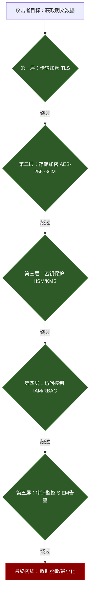

## 13.8 总结：实战案例综合分析与方法论提炼

### 13.8.1 七大案例全景回顾

本章通过七个从真实生产环境中提炼的案例，覆盖了密码学在现代软件系统中最核心的应用场景。以下表格对每个案例的场景、关键技术、核心教训进行横向对比：

| 案例 | 场景 | 核心密码学技术 | 关键教训 |
|------|------|----------------|----------|
| 13.1 Web密码存储 | 用户认证系统 | bcrypt/scrypt/Argon2、盐值、HMAC | 切勿使用MD5/SHA直接哈希密码；盐值必须唯一；迭代次数需随硬件性能调整 |
| 13.2 HTTPS证书配置 | Web服务器安全通信 | TLS 1.3、X.509证书、ECDHE | 禁用TLS 1.0/1.1；启用HSTS；证书链必须完整；定期轮换证书 |
| 13.3 API密钥管理 | 服务间认证与授权 | HMAC签名、JWT、密钥轮换 | 密钥禁止硬编码；使用密钥管理服务；实施最小权限原则；密钥必须可撤销 |
| 13.4 区块链交易签名 | 去中心化交易验证 | ECDSA (secp256k1)、SHA-256、RIPEMD-160 | 私钥安全存储是生命线；交易不可篡改性依赖签名的数学保证；随机数k泄露即私钥泄露 |
| 13.5 企业级KMS | 组织级密钥生命周期管理 | 密钥层次结构、HSM、密封密钥 | 密钥分层保护；硬件安全模块不可省略；密钥轮换自动化；审计日志全覆盖 |
| 13.6 E2E加密通信 | 消息端到端保护 | Signal协议、X3DH、Double Ratchet、AES-256-GCM | 前向保密与未来保密缺一不可；密钥验证防止中间人攻击；元数据保护同样重要 |
| 13.7 密码破解与防御 | 安全测试与加固 | 字典攻击、彩虹表、GPU破解、离线攻击 | 密码复杂度不等于安全；慢哈希函数是最佳防御；账户锁定与监控并行 |

### 13.8.2 跨案例共性规律

通过分析七个案例，可以提炼出密码学实战中的六条共性规律：

**规律一：密钥管理是密码学安全的核心瓶颈**

在所有案例中，真正的安全薄弱点几乎都不是算法本身，而是密钥的生成、存储、分发、轮换和销毁过程。区块链案例中私钥泄露导致资产丧失，API密钥硬编码导致服务被接管，企业KMS设计不当导致密钥暴露——这些教训指向同一个结论：密码学安全的上限取决于密钥管理的质量。

```plaintext
密钥管理质量评估矩阵：

                    生成安全    存储安全    分发安全    轮换机制    销毁流程
初级系统              ✓          ✗          ✗          ✗          ✗
中级系统              ✓          ✓          ✗          ✗          ✗
高级系统              ✓          ✓          ✓          ✗          ✗
企业级系统            ✓          ✓          ✓          ✓          ✗
理想系统              ✓          ✓          ✓          ✓          ✓

每一级的安全提升都带来显著的攻击成本增加：
- 初级→中级：阻止95%的自动化攻击
- 中级→高级：阻止99%的普通攻击者
- 高级→企业级：阻止99.9%的专业攻击者
- 企业级→理想：仅面对国家级攻击者时可能失败
```

**规律二：过时的算法和协议是最常见的安全负债**

案例13.1中的MD5密码哈希、案例13.2中的TLS 1.0、案例13.7中可被彩虹表秒破的未加盐SHA-1——这些"还能用"的过时技术是生产系统中最大的定时炸弹。密码学领域有一个独特规律：算法的安全性是单调递减的。今天安全的算法明天未必安全，但今天已不安全的算法永远不会恢复安全。

```plaintext
算法生命周期模型：

安全性
  ↑
  │    ╭──────────╮
  │   ╱            ╲
  │  ╱              ╲        ← 已知攻击出现
  │ ╱                ╲
  │╱                  ╲
  ┼───────────────────────→ 时间
  │  发布  成熟  巅峰  衰退  淘汰

典型案例：
- DES：1977年发布，1999年22小时被破解，2005年正式淘汰
- MD5：1992年发布，2004年碰撞攻击，2010年后禁止用于安全用途
- SHA-1：1995年发布，2017年Google碰撞演示，2022年所有主流浏览器拒绝
- RSA-1024：2013年NSA事件后被视为不安全，应至少RSA-2048

关键教训：迁移窗口 ≠ 安全窗口。
在算法被公开破解之前就必须完成迁移，而不是等到破解出现再行动。
```

**规律三：分层防御（Defense in Depth）是唯一可靠的策略**

没有任何单一密码学机制能提供完美保护。案例13.6的E2E加密系统之所以强大，正是因为它叠加了多层保护：长期密钥、临时密钥、前向保密、消息认证、密钥验证。案例13.5的企业KMS同样采用分层架构：主密钥保护数据密钥，数据密钥保护业务数据，硬件安全模块保护主密钥。



**规律四：随机数质量决定密码学安全的下限**

区块链案例中，ECDSA签名的随机数k如果被重用或可预测，私钥会直接泄露（索尼PS3签名事件就是经典教训）。密钥生成、盐值生成、初始化向量（IV）的生成都依赖密码学安全的随机数生成器（CSPRNG）。使用`Math.random()`或`time()`等伪随机源是致命错误。

```python
# 错误：使用非密码学安全的随机源
import random
private_key = random.randint(1, 2**256)  # 可预测！
salt = str(random.randint(100000, 999999))  # 仅6位有效熵！

# 正确：使用密码学安全的随机源
import secrets
private_key = secrets.randbits(256)  # 密码学安全
salt = secrets.token_hex(32)  # 256位密码学安全随机盐值

# 验证系统随机源质量（Linux）
# 检查熵池：cat /proc/sys/kernel/random/entropy_avail
# 应大于256，理想值>1000
# 使用 getrandom() 系统调用而非 /dev/urandom（内核3.17+）
```

**规律五：侧信道攻击是理论安全与实际安全的鸿沟**

案例13.4中的ECDSA实现如果使用非常数时间的比较操作，可能通过时间侧信道泄露私钥信息。案例13.1中密码比对如果不使用常数时间比较，可能通过响应时间差异被枚举。侧信道攻击不需要破解算法，只需要观察物理世界的"泄漏信号"。

```plaintext
常见侧信道攻击类型与防御：

┌──────────────┬─────────────────────┬──────────────────────┐
│ 攻击类型      │ 利用的泄漏源         │ 防御措施              │
├──────────────┼─────────────────────┼──────────────────────┤
│ 时间侧信道    │ 执行时间差异         │ 常数时间算法实现       │
│ 缓存侧信道    │ CPU缓存命中/未命中   │ 缓存隔离/预取         │
│ 功耗分析SPA   │ 设备功耗波动         │ 功耗均衡化设计        │
│ 差分功耗DPA   │ 统计功耗相关性       │ 掩码技术/随机延迟     │
│ 电磁辐射      │ EM泄漏              │ 屏蔽/噪声注入         │
│ 声学侧信道    │ 硬件声音特征         │ 物理隔离              │
│ 故障注入      │ 电压/时钟毛刺        │ 冗余计算/检测电路     │
└──────────────┴─────────────────────┴──────────────────────┘

常数时间比较的实现要点（任何语言都适用）：
- 不使用短路求值（&&、||、if-else）
- 逐字节异或后累加OR，最后判断是否为零
- 编译器可能优化掉常数时间逻辑，需使用volatile或内联汇编屏障
```

```python
# 不安全：短路比较（时间差异泄露信息）
def insecure_compare(a: bytes, b: bytes) -> bool:
    if len(a) != len(b):
        return False
    for i in range(len(a)):
        if a[i] != b[i]:  # 在第i个字节处返回，泄露位置信息
            return False
    return True

# 安全：常数时间比较
import hmac
def secure_compare(a: bytes, b: bytes) -> bool:
    return hmac.compare_digest(a, b)  # Python内置常数时间比较

# 手动实现（理解原理）
def constant_time_compare(a: bytes, b: bytes) -> bool:
    if len(a) != len(b):
        return False
    result = 0
    for x, y in zip(a, b):
        result |= x ^ y  # 逐字节异或后累加，不短路
    return result == 0
```

**规律六：密码学安全是系统工程，不是算法选择**

选择AES-256而非AES-128并不能让系统更安全，但错误的工作模式（ECB vs GCM）、错误的密钥管理、错误的随机数生成会直接摧毁安全性。七个案例反复证明：密码学安全取决于最薄弱的环节，而这个环节几乎从不在算法层面。

### 13.8.3 密码学在区块链中的深度应用

#### 比特币密码学架构

比特币系统是密码学工程的集大成者，将多种密码学原语组合成一个去中心化信任系统：

```plaintext
比特币核心密码学技术栈：

1. 椭圆曲线数字签名（ECDSA）
   ├── 曲线：secp256k1（Koblitz曲线，非NIST曲线，避免潜在后门质疑）
   ├── 私钥：256位随机数（secrets.randbits(256)）
   ├── 公钥：椭圆曲线点（压缩格式33字节，非压缩65字节）
   └── 核心用途：交易授权（证明所有权）、交易不可篡改性

2. SHA-256 哈希函数（双重应用）
   ├── 用途1：工作量证明（PoW）——矿工寻找满足难度目标的哈希值
   ├── 用途2：交易ID（txid）——对交易数据取两次SHA-256
   ├── 用途3：Merkle树——区块内所有交易的哈希摘要
   └── 用途4：地址生成流程中的第一层哈希

3. RIPEMD-160 哈希函数
   ├── 用途：公钥哈希缩短（256位→160位，节省空间）
   └── 安全性：160位输出提供80位碰撞抗性，对地址生成足够

4. Base58Check 编码
   ├── 用途：地址和私钥的人类可读表示
   ├── 特点：排除易混淆字符（0/O/I/l）
   └── 校验和：4字节SHA-256双哈希校验，防止抄写错误
```

```python
# 比特币地址生成完整流程（教学演示，生产环境请用成熟库如bit/coincurve）
import hashlib
import hmac

def generate_bitcoin_address():
    """从私钥到地址的完整流程演示"""
    # 1. 生成私钥（256位密码学安全随机数）
    import secrets
    private_key_int = secrets.randbits(256)
    private_key_bytes = private_key_int.to_bytes(32, 'big')

    # 2. 计算公钥（secp256k1椭圆曲线点乘）
    # 生产环境使用：coincurve.PublicKey.from_secret(private_key_bytes)
    from ecdsa import SECP256k1, SigningKey
    sk = SigningKey.from_string(private_key_bytes, curve=SECP256k1)
    vk = sk.get_verifying_key()
    public_key_bytes = b'\x04' + vk.to_string()  # 非压缩格式前缀0x04

    # 3. SHA-256 哈希
    sha256_hash = hashlib.sha256(public_key_bytes).digest()

    # 4. RIPEMD-160 哈希
    ripemd160 = hashlib.new('ripemd160')
    ripemd160.update(sha256_hash)
    pubkey_hash = ripemd160.digest()

    # 5. 添加版本字节（主网=0x00，测试网=0x6f）
    versioned = b'\x00' + pubkey_hash

    # 6. 计算校验和（双SHA-256取前4字节）
    checksum = hashlib.sha256(hashlib.sha256(versioned).digest()).digest()[:4]

    # 7. Base58Check编码
    address_bytes = versioned + checksum
    return base58_encode(address_bytes)

def base58_encode(data: bytes) -> str:
    """Base58编码实现"""
    alphabet = '123456789ABCDEFGHJKLMNPQRSTUVWXYZabcdefghijkmnopqrstuvwxyz'
    num = int.from_bytes(data, 'big')
    result = []
    while num > 0:
        num, remainder = divmod(num, 58)
        result.append(alphabet[remainder])
    # 处理前导零字节
    for byte in data:
        if byte == 0:
            result.append(alphabet[0])
        else:
            break
    return ''.join(reversed(result))
```

#### 零知识证明的前沿应用

零知识证明（ZKP）是密码学中最具变革潜力的技术之一，它允许证明者向验证者证明某个陈述为真，而不泄露任何额外信息。在区块链领域的应用正在快速扩展：

| 应用方向 | 代表项目 | 核心技术 | 隐私保护范围 | 证明大小 | 验证速度 |
|----------|----------|----------|-------------|----------|----------|
| 隐私交易 | Zcash | zk-SNARKs | 发送方/接收方/金额 | ~200字节 | 毫秒级 |
| 默认隐私 | Monero | 环签名+隐地址+RingCT | 发送方/接收方/金额 | ~2KB | 中等 |
| Layer2扩容 | zkSync/StarkNet | zk-SNARKs/zk-STARKs | 交易数据压缩 | 100B-50KB | 毫秒级 |
| 身份验证 | 0xPARC/iden3 | zk-SNARKs+DID | 属性证明不泄露身份 | ~200字节 | 毫秒级 |
| 可验证计算 | RISC Zero/zkVM | zk-STARKs | 程序执行正确性 | 1-50KB | 秒级 |

```plaintext
zk-SNARKs vs zk-STARKs 核心对比：

┌──────────────┬────────────────────┬────────────────────┐
│ 特性          │ zk-SNARKs           │ zk-STARKs           │
├──────────────┼────────────────────┼────────────────────┤
│ 可信设置      │ 需要（MPC仪式）     │ 不需要（透明）       │
│ 证明大小      │ 小（~200字节）      │ 大（10-100KB）       │
│ 验证时间      │ 极快（毫秒级）      │ 快（百毫秒级）       │
│ 证明生成      │ 慢（分钟级）        │ 慢（分钟级）         │
│ 抗量子        │ 否（基于椭圆曲线）  │ 是（基于哈希函数）   │
│ 后端约束系统  │ R1CS               │ AIR                  │
│ 适用场景      │ 链上验证、带宽敏感  │ 大规模计算、需透明   │
└──────────────┴────────────────────┴────────────────────┘
```

#### 以太坊的密码学演进

以太坊从PoW到PoS的转型伴随着密码学栈的重大升级：

- **签名方案**：从ECDSA (secp256k1) 转向 BLS12-381 聚合签名（PoS验证者需要高效聚合数千个签名）
- **账户抽象 (ERC-4337)**：支持多种签名方案，包括后量子签名（如Dilithium）
- **Verkle树**：替代Merkle Patricia树，减少证明大小，提升轻客户端效率
- **KZG承诺**：用于EIP-4844 (Proto-Danksharding)，实现数据可用性采样

### 13.8.4 密码学在物联网中的深度应用

物联网设备的密码学应用面临独特挑战：极有限的计算资源、极长的生命周期（可能10年以上无人维护）、极大规模的设备部署（百万级）。

#### 轻量级密码算法选型指南

```plaintext
按设备资源等级选择密码算法：

资源受限设备（8位/16位 MCU，<100KB RAM，<1MHz）：
├── 对称加密：PRESENT（320 gate等效）> LED > SIMON/SPECK
├── 哈希函数：PHOTON（门电路面积最小）> SPONGENT
├── 消息认证：轻量级CBC-MAC变种
├── 密钥交换：紧凑型ECC（如Curve25519的微型实现）
└── 适用场景：RFID标签、传感器节点、植入式医疗设备

中等资源设备（32位 MCU，256KB-2MB RAM，>100MHz）：
├── 对称加密：ChaCha20-Poly1305（ARM Cortex-M友好）> AES-128-GCM
├── 哈希函数：BLAKE2s（比SHA-256快50%以上）> SHA-256
├── 消息认证：HMAC-SHA256
├── 密钥交换：ECDH P-256 或 X25519
└── 适用场景：智能家居设备、工业传感器、车载ECU

高资源设备（应用处理器，>1GHz，完整OS）：
├── 对称加密：AES-256-GCM（硬件AES指令加速）
├── 哈希函数：SHA-256、SHA-3（Keccak）
├── 消息认证：标准AEAD方案
├── 密钥交换：X25519 + Ed25519签名
└── 适用场景：智能摄像头、边缘网关、车载信息娱乐系统

选择原则：
1. 优先使用硬件加速的算法（AES-NI、ARM CE）
2. 协议开销要计入带宽约束（LPWAN的LoRa有效载荷仅51-242字节）
3. 能量预算直接影响算法选择（一次ECDSA签名消耗的能量可能相当于传感器采样1000次）
```

#### 物联网设备全生命周期密钥管理

```plaintext
设备生命周期四阶段密钥管理：

┌─────────────────────────────────────────────────┐
│  阶段1：制造（Factory Provisioning）              │
│  ├── 生成设备唯一密钥（DUK）—— 使用硬件TRNG       │
│  ├── 安装设备证书（X.509或自定义格式）             │
│  ├── 写入根CA公钥（用于验证固件签名）              │
│  ├── 配置安全参数（算法套件、协议版本）             │
│  └── 安全熔丝/写保护（防止密钥被读出）             │
├─────────────────────────────────────────────────┤
│  阶段2：部署（Secure Onboarding）                 │
│  ├── 设备证书验证 → 云平台注册认证                 │
│  ├── 建立安全通道（DTLS/CoAPs 或 TLS 1.3）        │
│  ├── 下发业务密钥（会话密钥、加密存储密钥）         │
│  └── 配置策略（更新频率、通信白名单）               │
├─────────────────────────────────────────────────┤
│  阶段3：运行（Operational Lifecycle）             │
│  ├── 定期密钥轮换（OTA更新机制，推荐周期≤90天）    │
│  ├── 安全更新签名验证（Ed25519或ECDSA-P256）      │
│  ├── 会话密钥管理（前向保密：每会话新密钥）         │
│  ├── 健康监测（证书过期告警、密钥使用异常检测）     │
│  └── 应急机制（密钥泄露时的批量吊销能力）           │
├─────────────────────────────────────────────────┤
│  阶段4：退役（Secure Decommissioning）            │
│  ├── 远程密钥擦除（安全删除所有密钥材料）           │
│  ├── 证书吊销（发布CRL或更新OCSP响应）             │
│  ├── 平台侧清理（删除设备注册信息和关联密钥）       │
│  └── 物理安全（若可能，物理销毁安全芯片）           │
└─────────────────────────────────────────────────┘

实际落地的关键挑战：
- 设备可能在地下室、矿井等无网络环境中运行数年
- 密钥轮换不能中断业务（需要新旧密钥并行期）
- 大规模设备的证书吊销列表（CRL）会非常庞大
- 设备固件升级本身就需要密码学保护（先有鸡还是先有蛋问题）
```

### 13.8.5 密码学审计与合规框架

#### 安全审计清单

密码学审计不是简单的算法检查，而是一个覆盖设计、实现、运维、合规全流程的系统性评估：

```plaintext
密码学安全审计清单（按优先级排序）：

P0 - 算法合规性（发现即高危）
├── □ 是否使用已知不安全的算法（MD5/SHA-1/DES/RC4）？
├── □ 密钥长度是否符合当前标准（RSA≥2048, AES≥128, ECC≥P-256）？
├── □ 是否满足行业合规要求（PCI DSS/HIPAA/等保2.0/GDPR）？
└── □ TLS版本是否为1.2+？是否禁用了不安全密码套件？

P1 - 实现安全性（高危）
├── □ 是否使用经过验证的密码库（OpenSSL/BoringSSL/libsodium）？
├── □ 是否存在自制密码算法或协议？
├── □ 敏感比较是否使用常数时间函数？
├── □ 错误处理是否泄露敏感信息（如"密码错误"vs"用户不存在"）？
└── □ 随机数生成是否使用CSPRNG？

P2 - 密钥管理（中高危）
├── □ 密钥是否在代码/配置文件/版本控制中硬编码？
├── □ 密钥存储是否加密保护（KMS/HSM/硬件密钥库）？
├── □ 是否实施密钥轮换机制？轮换周期是否合理？
├── □ 密钥销毁流程是否完整（内存清零、日志清理）？
└── □ 是否有密钥泄露应急响应计划？

P3 - 协议安全（中危）
├── □ 是否使用最新版本的协议（TLS 1.3、Signal Protocol等）？
├── □ 是否启用前向保密（PFS）？
├── □ 证书验证是否完整（链验证、吊销检查、钉扎）？
└── □ 是否存在重放攻击防护（nonce/时间戳/序列号）？

P4 - 侧信道防护（中危，针对高安全场景）
├── □ 侧信道评估是否覆盖时间、缓存、功耗？
├── □ 关键路径是否有噪声注入或随机延迟？
└── □ 故障注入防护措施是否到位？

P5 - 日志与监控（持续保障）
├── □ 是否记录密钥使用事件（创建、使用、轮换、销毁）？
├── □ 是否监控异常加密操作（大量失败解密尝试、异常证书请求）？
├── □ 审计日志本身是否防篡改（追加写入、哈希链）？
└── □ 是否有告警机制（证书即将过期、密钥轮换逾期）？
```

#### 后量子密码迁移策略

量子计算机对当前公钥密码体系（RSA、ECC、DH）构成根本性威胁。NIST已于2024年发布了首批后量子密码标准（FIPS 203/204/205），迁移已从理论规划进入工程实施阶段：

```plaintext
后量子密码迁移四阶段计划：

阶段1：密码资产盘点与风险评估（6-12个月）
├── 自动化扫描所有系统中的密码学使用点
│   ├── 代码层面：grep搜索算法名称、密钥长度、协议版本
│   ├── 配置层面：TLS配置、证书链、密钥存储
│   └── 依赖层面：第三方库的密码学实现
├── 按数据敏感度和保护期限分类
│   ├── 紧急：需要保密>10年的数据（"先收集后解密"攻击威胁最大）
│   ├── 高优：核心业务系统的身份认证和密钥交换
│   └── 常规：短期数据保护
└── 制定迁移路线图和预算

阶段2：技术准备与团队能力建设（12-18个月）
├── 测试后量子算法的兼容性和性能影响
│   ├── ML-KEM (CRYSTALS-Kyber)：密钥封装，替代ECDH/RSA-KEM
│   ├── ML-DSA (CRYSTALS-Dilithium)：数字签名，替代ECDSA/RSA-PSS
│   ├── SLH-DSA (SPHINCS+)：无状态哈希签名，作为备用方案
│   └── 性能基准：密钥大小、签名大小、计算时间对比
├── 更新密码库到支持后量子的版本
│   ├── OpenSSL 3.x + oqs-provider
│   ├── BoringSSL / liboqs
│   └── 各语言绑定（pyoqs、rust-pqcrypto等）
└── 培训开发团队（后量子算法原理、新API使用、性能调优）

阶段3：混合模式部署（18-36个月）
├── 部署"传统+后量子"双层保护
│   ├── TLS握手同时使用X25519 + ML-KEM-768
│   ├── 签名同时使用Ed25519 + ML-DSA-65
│   └── 任一层被攻破不影响整体安全
├── 逐步替换密钥和证书
│   ├── 优先处理"紧急"分类的数据保护
│   ├── 新系统默认使用后量子算法
│   └── 存量系统通过代理层透明升级
└── 持续监控性能指标和兼容性问题

阶段4：完成迁移与传统算法退役（36-48个月）
├── 全面切换到后量子算法（移除传统算法层）
├── 更新安全策略文档和合规要求
├── 退役不安全的遗留系统和接口
└── 建立持续监控机制（跟踪后量子算法的密码分析进展）

NIST后量子标准速查：
┌─────────────┬────────────────┬───────────┬──────────┬──────────────┐
│ 标准编号     │ 算法名称        │ 用途      │ 公钥大小  │ 密文/签名大小 │
├─────────────┼────────────────┼───────────┼──────────┼──────────────┤
│ FIPS 203    │ ML-KEM-768      │ 密钥封装   │ 1,184 B  │ 1,088 B      │
│ FIPS 204    │ ML-DSA-65       │ 数字签名   │ 1,952 B  │ 3,309 B      │
│ FIPS 205    │ SLH-DSA-128f    │ 无状态签名  │ 32 B     │ 17,088 B     │
└─────────────┴────────────────┴───────────┴──────────┴──────────────┘
注：大小远大于传统算法（ECC公钥仅33字节，签名仅64字节），
    这对带宽受限场景（IoT、区块链）是重大挑战。
```

### 13.8.6 从案例到实践：落地检查清单

将本章七个案例的经验提炼为可直接使用的安全实践检查清单：

```plaintext
密码学实战安全检查清单：

一、密码与认证（对应案例13.1、13.7）
├── ✅ 密码存储使用Argon2id（首选）或bcrypt（次选），迭代次数≥OWASP推荐值
├── ✅ 每个密码独立随机盐值，长度≥16字节
├── ✅ 登录接口实施速率限制（5次失败后锁定15分钟）
├── ✅ 密码策略：最小长度12字符，检查常见密码字典（Have I Been Pwned API）
├── ✅ 多因素认证（TOTP/WebAuthn优先，SMS作为最低保障）
└── ❌ 禁止：MD5/SHA哈希存储、全局统一盐值、无限次登录尝试

二、传输安全（对应案例13.2）
├── ✅ TLS 1.3优先，TLS 1.2作为最低要求
├── ✅ 启用HSTS（max-age≥31536000，含includeSubDomains）
├── ✅ 证书自动化管理（Let's Encrypt + ACME协议）
├── ✅ 配置前向保密密码套件（X25519+ECDHE）
├── ✅ OCSP Stapling启用，加速证书吊销检查
└── ❌ 禁止：TLS 1.0/1.1、自签名证书用于生产、RSA密钥交换

三、密钥管理（对应案例13.3、13.5）
├── ✅ 密钥存储在专用密钥管理系统（HashiCorp Vault / AWS KMS / 阿里云KMS）
├── ✅ 应用代码中零硬编码密钥（使用环境变量/配置中心/密钥注入）
├── ✅ 密钥自动轮换（API密钥≤90天，加密密钥≤365天）
├── ✅ 最小权限原则（每个服务只申请必需的密钥权限）
├── ✅ 密钥泄露应急流程（15分钟内吊销、1小时内排查影响范围）
└── ❌ 禁止：密钥提交到Git、密钥明文存储、共享密钥跨服务使用

四、数据加密（对应案例13.4、13.6）
├── ✅ 静态数据加密使用AES-256-GCM（AEAD模式）
├── ✅ 每个数据对象独立加密密钥（数据密钥由主密钥保护）
├── ✅ 初始化向量（IV/nonce）每次加密必须唯一
├── ✅ 消息认证码（MAC）验证完整性，先加密后MAC（Encrypt-then-MAC）
├── ✅ 端到端通信使用Signal协议或同等方案
└── ❌ 禁止：ECB模式、重用IV/nonce、仅加密不认证

五、随机数与熵（所有案例的基础）
├── ✅ 所有密码学操作使用CSPRNG（secrets模块、/dev/urandom、getrandom()）
├── ✅ 服务器启动时检查熵池状态（entropy_avail ≥ 256）
├── ✅ 容器/虚拟机环境额外关注熵源（使用haveged或硬件RNG透传）
└── ❌ 禁止：Math.random()、rand()、时间戳作为随机源
```

### 13.8.7 常见误区与纠正

通过本章案例，以下误区需要特别警惕：

| 常见误区 | 真实情况 | 案例来源 |
|----------|----------|----------|
| "算法越复杂越安全" | 安全性取决于设计和实现质量，不取决于复杂度。AES比很多"更复杂"的算法更安全 | 全部案例 |
| "加密了就安全了" | 加密只是保护链路之一。ECB模式的AES是加密了但完全不安全 | 13.6 E2E加密 |
| "密码加盐哈希就够了" | 盐值防彩虹表，但不防GPU暴力破解。需要慢哈希函数增加计算成本 | 13.1 密码存储 |
| "HTTPS证书装上就行" | 证书配置不当（弱密码套件、无HSTS、过期证书）比没有HTTPS更危险（制造虚假安全感） | 13.2 HTTPS配置 |
| "密钥长度越长越安全" | 256位AES已足够，瓶颈通常在密钥管理而非算法强度 | 13.5 企业KMS |
| "区块链的密码学是不可破解的" | 椭圆曲线数学安全，但私钥存储、随机数生成、智能合约实现都是攻击面 | 13.4 区块链 |
| "后量子密码以后再说" | "先收集后解密"攻击意味着今天的加密通信可能在未来被解密。现在就需要为敏感数据部署混合模式 | 13.8.5 迁移策略 |
| "密码学实现用开源库就安全了" | 开源库本身安全，但错误的使用方式（错误参数、不当配置）仍然致命 | 13.3 API密钥 |

### 13.8.8 推荐学习路径

基于本章案例的难度梯度，建议按以下路径深化学习：


**每个阶段的核心资源：**

- **入门**：Crypto101（免费在线教材）、《图解密码技术》（结城浩）
- **基础**：RFC 5280（X.509证书）、OWASP密码存储备忘单
- **实践**：Let's Encrypt文档、libsodium官方教程
- **进阶**：NIST SP 800-57（密钥管理建议）、HashiCorp Vault文档
- **深入**：Signal协议规范、Noise Protocol Framework
- **前沿**：NIST PQC标准化文档、ZKP学习路线（ZKWhiteboard系列）

### 13.8.9 本章核心要义

密码学实战的本质不是选对算法——那是最基本的起点——而是构建一个从密钥生成到销毁的完整信任链条。这条链条的强度取决于最薄弱的环节：

> **"密码学系统的安全性不会超过其密钥管理的安全性。"**
> —— Bruce Schneier

七个案例反复证明的核心认知：攻击者不会去破解AES-256，他们会攻击你的随机数生成器、窃取你的密钥、利用你的配置错误、利用侧信道泄漏。理解这一点，才算真正理解了密码学实战。
