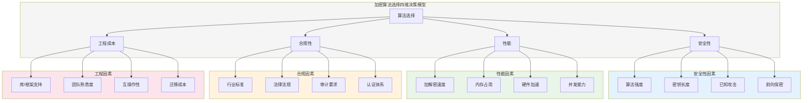
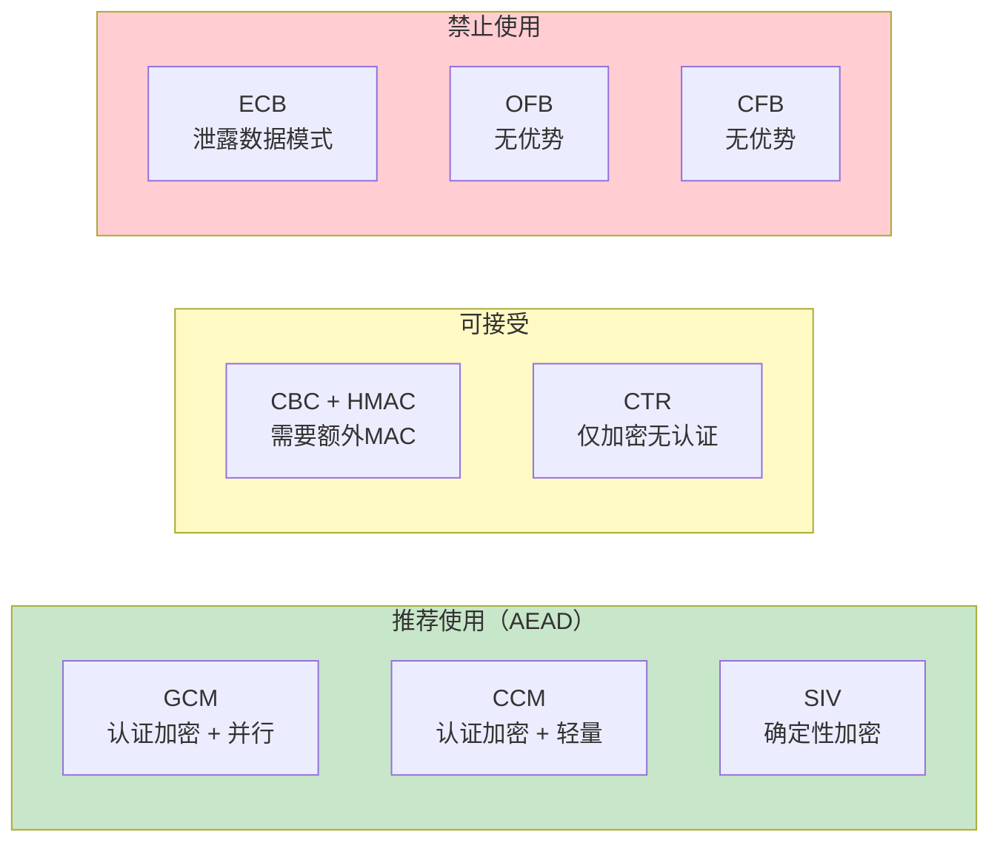
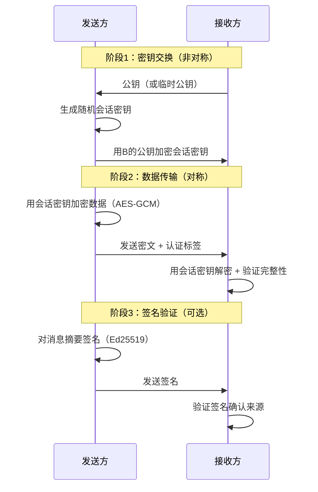

## 13.1 加密算法选择技巧

密码学实践中最常见也最致命的错误不是实现上的 bug，而是在项目初期选错了算法。一个设计良好的系统，其加密方案应当在安全性、性能、合规性和可维护性之间取得精确平衡。本节提供一套完整的算法选择方法论，帮助你在面对具体业务场景时做出正确的密码学决策。

### 13.1.1 算法选择的核心决策框架

选择加密算法不是"哪个最好"的问题，而是"哪个最适合"的问题。决策需要同时考虑四个维度：



**安全性**是第一优先级。算法必须经过充分的公开分析和审查，密钥长度必须足够抵抗当前和可预见未来的计算能力。性能再好，如果算法已被攻破就毫无意义。

**性能**决定用户体验和系统吞吐量。在物联网设备上，ChaCha20 的软件实现速度可能比 AES 快 3 倍；但在有 AES-NI 指令集的现代服务器上，AES-GCM 的速度可以达到 ChaCha20 的 5 倍以上。

**合规性**是刚性约束。金融行业通常要求 FIPS 140-2/140-3 认证的算法；中国商用密码场景必须使用 SM2/SM3/SM4 系列；欧盟 GDPR 虽未指定具体算法，但要求"与风险相称的技术措施"。

**工程成本**包括团队的学习曲线、现有基础设施的兼容性、第三方系统的互操作要求。选择一个冷门但理论上更优的算法，可能因为库支持不完善而引入更多安全风险。

### 13.1.2 对称加密算法选择

对称加密是密码学的基石，适用于大量数据的加密存储和传输。选择时需要在算法、密钥长度、工作模式三个层面分别决策。

#### 对称加密算法对比

| 算法 | 密钥长度 | 分组大小 | 速度(软件) | 硬件加速 | 安全状态 | 推荐场景 |
|------|----------|----------|-----------|----------|----------|----------|
| AES-128 | 128 bit | 128 bit | 快 | AES-NI | 安全 | 通用数据加密 |
| AES-256 | 256 bit | 128 bit | 快 | AES-NI | 安全 | 高安全需求、长期存储 |
| ChaCha20 | 256 bit | N/A(流) | 极快(软件) | 部分平台 | 安全 | 移动端、无AES硬件 |
| SM4 | 128 bit | 128 bit | 中等 | 部分 | 安全 | 中国商用密码合规 |
| 3DES | 168 bit | 64 bit | 慢 | 无 | 弱 | 仅遗留系统兼容 |
| DES | 56 bit | 64 bit | 慢 | 无 | 已破解 | 绝不使用 |
| Blowfish | 32-448 bit | 64 bit | 中等 | 无 | 过时 | 不推荐新项目 |
| RC4 | 40-2048 bit | N/A(流) | 极快 | 无 | 已破解 | 绝不使用 |

**当前推荐：AES-256-GCM 作为默认选择**。AES 是全球审查最充分的对称加密算法，GCM 模式同时提供加密和认证（AEAD），一次操作完成两件事。如果你的目标平台缺乏 AES 硬件加速（如某些嵌入式设备），则选择 ChaCha20-Poly1305。

**中国商用密码场景使用 SM4-GCM**。SM4 是中国国家密码管理局发布的分组密码标准，密钥长度 128 位，在国密合规场景中是强制要求。

#### 工作模式选择指南

工作模式决定了分组密码如何处理超过一个分组长度的数据。错误的模式选择会导致严重的安全漏洞。



**ECB 模式绝对禁止**。ECB 将每个分组独立加密，相同明文产生相同密文，会泄露数据模式。经典的"ECB 企鹅"图片就是最好的反面教材——原图经过 ECB 加密后，虽然像素值改变了，但图像轮廓仍然清晰可见。

**GCM 模式的使用要点**：

```python
from cryptography.hazmat.primitives.ciphers.aead import AESGCM
import os

# GCM 模式：加密 + 认证，一步完成
key = AESGCM.generate_key(bit_length=256)
aesgcm = AESGCM(key)
nonce = os.urandom(12)  # GCM 推荐 96 位 nonce

plaintext = b"Sensitive data that needs both confidentiality and integrity"
associated_data = b"metadata-not-encrypted-but-authenticated"

# 加密：ciphertext 包含认证标签
ciphertext = aesgcm.encrypt(nonce, plaintext, associated_data)

# 解密：自动验证认证标签，篡改则抛出 InvalidTag 异常
try:
    decrypted = aesgcm.decrypt(nonce, ciphertext, associated_data)
    assert decrypted == plaintext
except Exception as e:
    print(f"认证失败，数据被篡改: {e}")
```

**GCM 的 nonce 重用陷阱**：同一个密钥下，nonce 绝对不能重复使用。如果对两条不同消息使用相同的 (key, nonce) 对，攻击者可以通过 XOR 两条密文恢复明文的 XOR，进而可能推导出明文。对于需要加密大量消息的场景，建议使用 XChaCha20-Poly1305（192 位 nonce，随机生成碰撞概率可忽略）或采用确定性 nonce 方案（如 SIV 模式）。

**CBC 模式如果必须使用**，必须组合 HMAC 提供完整性保护，且必须遵循 Encrypt-then-MAC 顺序：先加密得到密文，再对密文计算 HMAC，最后将密文和 HMAC 一起传输。先 MAC 后加密（MAC-then-Encrypt）已被证明存在多种攻击手段。

#### 对称加密决策流程

面对具体场景时，按以下流程选择：

1. **是否有合规要求？** 是 → 使用合规指定算法（FIPS 用 AES，国密用 SM4）
2. **目标平台有 AES-NI 硬件加速？** 是 → AES-256-GCM；否 → 考虑 ChaCha20-Poly1305
3. **是否需要确定性加密（相同明文产生相同密文）？** 是 → AES-SIV 或 AES-GCM-SIV
4. **是否需要在线加密（流式处理）？** 是 → AES-CTR + HMAC 或 ChaCha20-Poly1305
5. **默认选择**：AES-256-GCM

### 13.1.3 非对称加密算法选择

非对称加密解决了密钥分发问题，但速度比对称加密慢 2-3 个数量级。实际系统中，非对称加密通常只用于密钥交换和数字签名，数据加密由对称加密完成。

#### 非对称加密算法对比

| 算法 | 基于问题 | 密钥等效安全强度 | 签名速度 | 验签速度 | 密钥交换 | 签名 | 推荐 |
|------|----------|-----------------|----------|----------|----------|------|------|
| RSA-2048 | 大整数分解 | 112 bit | 慢 | 极快 | 是 | 是 | 过渡使用 |
| RSA-3072 | 大整数分解 | 128 bit | 慢 | 极快 | 是 | 是 | 推荐最低 |
| RSA-4096 | 大整数分解 | ~140 bit | 极慢 | 快 | 是 | 是 | 高安全 |
| ECDSA P-256 | 椭圆曲线DLP | 128 bit | 快 | 快 | 否 | 是 | 通用推荐 |
| ECDSA P-384 | 椭圆曲线DLP | 192 bit | 快 | 快 | 否 | 是 | 高安全 |
| Ed25519 | 椭圆曲线 | 128 bit | 极快 | 极快 | 否 | 是 | 签名首选 |
| X25519 | 椭圆曲线 | 128 bit | 极快 | - | 是 | 否 | 密钥交换首选 |
| SM2 | 椭圆曲线 | 128 bit | 快 | 快 | 是 | 是 | 国密合规 |
| DH-2048 | 离散对数 | 112 bit | 中 | - | 是 | 否 | 已不推荐 |

#### RSA vs 椭圆曲线：何时选择哪个

**RSA 的优势在于生态成熟度**。几乎所有系统都支持 RSA，X.509 证书生态长期以 RSA 为主。如果你需要与大量遗留系统互操作，RSA 仍是合理选择。

**椭圆曲线（ECC）在所有新项目中应优先选择**。相同安全强度下，ECC 密钥比 RSA 小得多（256 位 ECC ≈ 3072 位 RSA），计算速度更快，带宽消耗更少。这在移动应用、IoT 设备和高并发 TLS 服务器中优势尤其明显。

```python
from cryptography.hazmat.primitives.asymmetric import ec, ed25519, rsa
from cryptography.hazmat.primitives import hashes, serialization
import time

# ===== Ed25519 数字签名（推荐） =====
# 密钥生成：几乎瞬时完成
private_key = ed25519.Ed25519PrivateKey.generate()
public_key = private_key.public_key()

message = b"Message to sign"

# 签名：单次哈希 + 标量乘法，极快
signature = private_key.sign(message)

# 验签
try:
    public_key.verify(signature, message)
    print("签名验证通过")
except Exception:
    print("签名无效或消息被篡改")

# ===== X25519 密钥交换（推荐） =====
from cryptography.hazmat.primitives.asymmetric.x25519 import X25519PrivateKey

# 双方各自生成密钥对
alice_private = X25519PrivateKey.generate()
alice_public = alice_private.public_key()

bob_private = X25519PrivateKey.generate()
bob_public = bob_private.public_key()

# 双方各自计算共享密钥
alice_shared = alice_private.exchange(bob_public)
bob_shared = bob_private.exchange(alice_public)

# 两个共享密钥相同
assert alice_shared == bob_shared
print(f"共享密钥: {alice_shared.hex()}")

# ===== RSA 签名（兼容遗留系统） =====
rsa_key = rsa.generate_private_key(
    public_exponent=65537,
    key_size=3072,  # 至少 3072 位
)
rsa_sig = rsa_key.sign(
    message,
    padding=__import__('cryptography.hazmat.primitives.asymmetric.padding',
                        fromlist=['PSS']).PSS(
        mgf=__import__('cryptography.hazmat.primitives.asymmetric.padding',
                        fromlist=['MGF1']).MGF1(hashes.SHA256()),
        salt_length=32
    ),
    algorithm=hashes.SHA256()
)
```

#### 密钥交换算法选择

现代密钥交换应使用 **Diffie-Hellman 的椭圆曲线变体**：

- **X25519**：首选。设计简洁、恒定时间实现、不存在无效曲线攻击。TLS 1.3 的默认密钥交换方案。
- **ECDH P-256/P-384**：在 FIPS 合规环境中使用。性能接近 X25519，但实现复杂度更高。
- **FFDHE-2048/3072**：传统的有限域 DH，TLS 1.3 也支持，但参数更长、速度更慢。
- **避免使用静态 DH**：所有密钥交换都应使用临时密钥（Ephemeral），实现前向保密。

**前向保密（Forward Secrecy）是必须的**。如果使用固定的 RSA 密钥进行密钥交换，一旦服务器的私钥泄露，攻击者可以解密所有历史通信。使用临时 DH 密钥交换，每次会话生成新密钥，即使长期私钥泄露，历史会话仍然安全。TLS 1.3 已经将临时密钥交换设为强制要求。

#### 后量子密码学前瞻

量子计算机对现有非对称算法构成威胁：Shor 算法可以在多项式时间内分解大整数和求解离散对数，这意味着 RSA、DSA、ECDSA、DH、ECDH 在足够强大的量子计算机面前都会被攻破。

**NIST 后量子标准化进展**（2024 年已发布最终标准）：

| 算法 | 用途 | 密钥大小 | 密文/签名大小 | 状态 |
|------|------|----------|-------------|------|
| ML-KEM (Kyber) | 密钥封装 | 800-1568 B | 768-1568 B | FIPS 203 |
| ML-DSA (Dilithium) | 数字签名 | 1312-2592 B | 2420-4627 B | FIPS 204 |
| SLH-DSA (SPHINCS+) | 数字签名 | 32-64 B | 7856-49856 B | FIPS 205 |

**当前实践建议**：在生产系统中实施**混合密钥交换**——同时使用经典算法（如 X25519）和后量子算法（如 ML-KEM），两者的结果组合派生最终密钥。这样即使其中一种被攻破，另一种仍然提供保护。TLS 1.3 已支持混合密钥交换扩展。

### 13.1.4 哈希函数选择

哈希函数在密码学中承担多重角色：数据完整性校验、密码存储、数字签名中的消息摘要、密钥派生、随机数生成。不同场景对哈希函数有不同的要求。

#### 哈希算法对比

| 算法 | 输出长度 | 速度 | 安全状态 | 推荐用途 |
|------|----------|------|----------|----------|
| MD5 | 128 bit | 极快 | 已破解 | 仅做校验和，禁止安全用途 |
| SHA-1 | 160 bit | 快 | 已破解 | 禁止安全用途 |
| SHA-256 | 256 bit | 快 | 安全 | 通用安全哈希 |
| SHA-384 | 384 bit | 快 | 安全 | 高安全需求 |
| SHA-512 | 512 bit | 快 | 安全 | 高安全需求、64位优化 |
| SHA3-256 | 256 bit | 中等 | 安全 | 需要不同内部结构时 |
| BLAKE2b | 512 bit | 极快 | 安全 | 高性能场景 |
| BLAKE2s | 256 bit | 极快 | 安全 | 嵌入式/32位平台 |
| BLAKE3 | 256 bit | 极快 | 安全 | 极致性能需求 |
| SM3 | 256 bit | 快 | 安全 | 国密合规 |
| SHAKE128/256 | 可变 | 中等 | 安全 | 可变长度输出 |

**MD5 和 SHA-1 已经被彻底攻破**。MD5 的碰撞可以在普通笔记本上几秒内生成；SHA-1 的碰撞攻击（SHAttered）已在 2017 年公开演示。这两个算法在任何安全相关场景中都不应使用，包括：密码存储、数字签名、证书、HMAC（除非与更安全的算法组合）。

**默认推荐 SHA-256**。它是全球使用最广泛的安全哈希算法，所有主流平台和库都有优化实现。如果追求更高安全边际，使用 SHA-384 或 SHA-512。

**BLAKE2/BLAKE3 适合性能敏感场景**。BLAKE2b 在 64 位平台上比 SHA-256 快约 3 倍，BLAKE3 支持并行计算，在多核 CPU 上速度优势更大。但 BLAKE3 是 2020 年才发布的算法，密码学界的审查深度不如 SHA-2 系列。

#### 密码存储：永远不要直接哈希

存储用户密码时，普通哈希函数（即使是 SHA-256）也不够安全。必须使用**专用密码哈希函数**，因为它们专门设计为抵抗暴力破解：

| 算法 | 特点 | 推荐参数 | 适用场景 |
|------|------|----------|----------|
| Argon2id | 内存硬+时间硬，抗 GPU/ASIC | m=64MB, t=3, p=4 | 首选方案 |
| bcrypt | 时间硬，广泛支持 | cost=12 | 通用场景 |
| scrypt | 内存硬 | N=2^17, r=8, p=1 | 需要高内存消耗时 |
| PBKDF2 | 简单，FIPS 认可 | iterations≥600000 | 合规要求场景 |

```python
# 密码存储的正确做法（使用 Argon2）
# pip install argon2-cffi
from argon2 import PasswordHasher
from argon2.exceptions import VerifyMismatchError

ph = PasswordHasher(
    time_cost=3,        # 迭代次数
    memory_cost=65536,  # 内存消耗 64MB
    parallelism=4,      # 并行线程数
    hash_len=32,        # 输出长度
    salt_len=16,        # 盐长度
)

# 存储密码
password = "user_password_123"
hash_str = ph.hash(password)  # 自动包含算法参数、盐和哈希值

# 验证密码
try:
    is_valid = ph.verify(hash_str, password)
    print("密码正确")
except VerifyMismatchError:
    print("密码错误")

# 自动检查是否需要重新哈希（参数升级时）
if ph.check_needs_rehash(hash_str):
    hash_str = ph.hash(password)  # 用新参数重新哈希
```

### 13.1.5 消息认证码（MAC）选择

MAC 提供数据完整性和真实性验证，与加密配合使用可以防止密文被篡改。

| 算法 | 类型 | 输出长度 | 速度 | 推荐场景 |
|------|------|----------|------|----------|
| HMAC-SHA256 | 基于哈希 | 256 bit | 快 | 通用推荐 |
| HMAC-SHA384 | 基于哈希 | 384 bit | 快 | 高安全需求 |
| Poly1305 | 一次性MAC | 128 bit | 极快 | 配合 ChaCha20 |
| GHASH | GCM 组件 | 128 bit | 极快(硬件) | 配合 AES-GCM |
| CMAC | 基于分组密码 | 128 bit | 快 | 无法使用HMAC时 |

**最佳实践：使用 AEAD 模式避免单独管理 MAC**。AES-GCM 和 ChaCha20-Poly1305 都内置了认证机制，不需要额外组合加密和 MAC。只有在无法使用 AEAD 的场景下，才需要手动实现 Encrypt-then-MAC。

### 13.1.6 数字签名算法选择

数字签名提供不可否认性和数据完整性。算法选择取决于安全需求、性能要求和合规约束。

| 算法 | 密钥大小 | 签名大小 | 签名速度 | 验签速度 | 推荐场景 |
|------|----------|----------|----------|----------|----------|
| Ed25519 | 32 B | 64 B | 极快 | 极快 | 通用首选 |
| ECDSA P-256 | 32 B | 64 B | 快 | 快 | FIPS 合规 |
| ECDSA P-384 | 48 B | 96 B | 快 | 快 | 高安全 FIPS |
| RSA-PSS 3072 | 3072 B | 384 B | 慢 | 极快 | 兼容遗留系统 |
| RSA-PSS 4096 | 4096 B | 512 B | 极慢 | 快 | 高安全兼容 |
| SM2 | 32 B | 64 B | 快 | 快 | 国密合规 |
| ML-DSA | 1312-2592 B | 2420-4627 B | 中等 | 中等 | 后量子安全 |

**Ed25519 是新项目的默认选择**。它的优势在于：恒定时间实现防止侧信道攻击、签名大小固定 64 字节、不存在随机数重用问题（RFC 8032 设计保证）、验证速度快且恒定时间。

**RSA 签名必须使用 PSS 填充**。PKCS#1 v1.5 填充已被证明存在 Bleichenbacher 类型的攻击。RSA-PSS 是 TLS 1.3 唯一支持的 RSA 签名方案。

### 13.1.7 混合加密方案设计

实际系统中，单一算法无法满足所有需求。混合加密方案结合不同算法的优势，是工程实践中的标准做法。

#### 典型混合加密架构



**Envelope Encryption（信封加密）** 是云环境中的标准模式：

```python
from cryptography.hazmat.primitives.ciphers.aead import AESGCM
from cryptography.hazmat.primitives.asymmetric import ec
from cryptography.hazmat.primitives import hashes
from cryptography.hazmat.primitives.kdf.hkdf import HKDF
import os

# ===== 信封加密完整示例 =====

# 1. 接收方的长期密钥对（实际场景中从密钥管理系统获取）
server_private_key = ec.generate_private_key(ec.SECP256R1())
server_public_key = server_private_key.public_key()

# 2. 发送方：生成临时密钥对 + 随机数据加密密钥 (DEK)
ephemeral_private = ec.generate_private_key(ec.SECP256R1())
ephemeral_public = ephemeral_private.public_key()

# 3. ECDH 密钥交换，派生密钥加密密钥 (KEK)
shared_secret = ephemeral_private.exchange(ec.ECDH(), server_public_key)
kek = HKDF(
    algorithm=hashes.SHA256(),
    length=32,
    salt=None,
    info=b"envelope-encryption-key",
).derive(shared_secret)

# 4. 生成数据加密密钥 (DEK)
dek = AESGCM.generate_key(bit_length=256)

# 5. 用 KEK 加密 DEK
aesgcm_kek = AESGCM(kek)
encrypted_dek = aesgcm_kek.encrypt(os.urandom(12), dek, b"dek-metadata")

# 6. 用 DEK 加密实际数据
aesgcm_dek = AESGCM(dek)
nonce = os.urandom(12)
plaintext = b"This is the actual sensitive data to protect"
ciphertext = aesgcm_dek.encrypt(nonce, plaintext, b"data-metadata")

print(f"加密后的 DEK 长度: {len(encrypted_dek)} 字节")
print(f"加密后的数据长度: {len(ciphertext)} 字节")

# ===== 解密过程 =====

# 7. 接收方：用私钥 + 发送方临时公钥还原 KEK
shared_secret_dec = server_private_key.exchange(
    ec.ECDH(), ephemeral_public
)
kek_dec = HKDF(
    algorithm=hashes.SHA256(),
    length=32,
    salt=None,
    info=b"envelope-encryption-key",
).derive(shared_secret_dec)

# 8. 解密 DEK
aesgcm_kek_dec = AESGCM(kek_dec)
dek_dec = aesgcm_kek_dec.decrypt(os.urandom(12), encrypted_dek, b"dek-metadata")

# 9. 用 DEK 解密数据
aesgcm_dek_dec = AESGCM(dek_dec)
plaintext_dec = aesgcm_dek_dec.decrypt(nonce, ciphertext, b"data-metadata")
assert plaintext_dec == plaintext
print("解密成功，数据完整性验证通过")
```

**信封加密的优势**：数据加密密钥（DEK）可以随数据存储，而密钥加密密钥（KEK）可以安全地存储在独立的密钥管理系统（KMS）中。轮换 KEK 时只需要重新加密 DEK，不需要重新加密所有数据。这就是 AWS KMS、Google Cloud KMS、HashiCorp Vault 等系统的核心原理。

### 13.1.8 常见算法选择误区

#### 误区一：自己发明加密算法

密码学的第一条铁律：**永远不要自己发明加密算法**。即使你是数学天才，自创算法也无法获得全球密码学社区数十年的审查。使用标准算法（AES、ChaCha20、RSA、ECC），它们的安全性建立在数百万小时的密码分析之上。

#### 误区二：密钥越长越安全

密钥长度超过算法所需的安全边际后，不会增加实际安全性，反而降低性能。AES-256 提供 256 位安全性，已经远超任何可预见的计算能力。选择 AES-512（如果存在）是浪费资源。密钥长度的选择应该基于**目标安全强度**，而不是"越大越好"。

#### 误区三：混淆加密和编码

Base64 不是加密，Hex 不是加密，ROT13 不是加密。这些编码方案不提供任何机密性，任何人都可以无密钥地还原原始数据。在安全审计中，"用 Base64 保护敏感数据"是最常见的低级错误之一。

#### 误区四：忽略认证加密

只加密不认证等于给攻击者留了后门。在没有认证的情况下，许多加密模式（特别是 CBC 和 CTR）允许攻击者在不知道明文的情况下精确地修改密文，使解密后的明文发生攻击者期望的变化（bit-flipping attack）。始终使用 AEAD 模式（GCM、CCM、ChaCha20-Poly1305），或手动实现 Encrypt-then-MAC。

#### 误区五：ECB 模式用于实际数据

ECB 模式将每个分组独立加密，相同明文分组产生相同密文分组。这意味着攻击者可以通过观察密文判断两条消息是否包含相同的数据块，甚至推断出数据的结构。只在加密单个随机密钥时才可以使用 ECB。

#### 误区六：使用时间做随机种子

```python
# 绝对禁止的做法
import random
import time

random.seed(int(time.time()))  # 种子可预测！
key = bytes([random.randint(0, 255) for _ in range(32)])

# 正确做法
import os
key = os.urandom(32)  # 操作系统提供的密码学安全随机数

# 或使用 secrets 模块
import secrets
key = secrets.token_bytes(32)
```

系统时间是公开信息，攻击者可以轻松穷举所有可能的种子值（精度到秒只需要尝试几千到几万个值）。必须使用操作系统提供的 CSPRNG（`/dev/urandom`、`CryptGenRandom`）。

#### 误区七：算法过时但仍在使用

以下算法**已在生产环境中被淘汰**，但仍有大量遗留系统在使用：

| 算法 | 破解时间 | 替代方案 | 迁移优先级 |
|------|----------|----------|-----------|
| DES | 实时破解 | AES-256 | 紧急 |
| 3DES | 2016年碰撞攻击 | AES-256 | 高 |
| RC4 | 多种统计攻击 | ChaCha20-Poly1305 | 紧急 |
| MD5 | 实时碰撞 | SHA-256/BLAKE2b | 紧急 |
| SHA-1 | 2017年碰撞攻击 | SHA-256/SHA-3 | 高 |
| RSA-1024 | 可破解 | RSA-3072/ECC | 紧急 |
| DH-768 | 可破解 | X25519 | 紧急 |

### 13.1.9 场景化选择速查表

#### 场景一：Web 应用 HTTPS

```text
TLS 版本：TLS 1.3（强制）或 TLS 1.2（兼容）
密钥交换：X25519 或 ECDHE P-256
认证：RSA-3072-PSS 或 ECDSA P-256 证书
加密套件：TLS_AES_256_GCM_SHA384 或 TLS_CHACHA20_POLY1305_SHA256
证书签名：SHA-256 或 SHA-384
```

#### 场景二：数据库字段加密

```text
算法：AES-256-GCM
密钥管理：信封加密（本地 DEK + KMS 管理 KEK）
IV/Nonce：每条记录独立随机生成，与密文一起存储
认证数据：记录 ID 或行号（绑定密文与特定记录）
密钥轮换：每 90 天或人员变动时
```

#### 场景三：API 认证令牌

```text
方案一（JWT）：RS256（RSA-PSS + SHA-256）或 ES256（ECDSA P-256）
方案二（HMAC令牌）：HMAC-SHA256，密钥≥32字节
方案三（随机令牌）：secrets.token_urlsafe(32)，存储时用 Argon2id 哈希
过期时间：访问令牌 15 分钟，刷新令牌 7 天
```

#### 场景四：文件/磁盘加密

```text
算法：AES-256-XTS（磁盘）或 AES-256-GCM（文件）
磁盘加密：BitLocker（Windows）、LUKS（Linux）、FileVault（macOS）
文件加密：age 工具（X25519 + ChaCha20-Poly1305）或 GPG
密钥来源：用户密码 → Argon2id 派生，或硬件安全模块
```

#### 场景五：端到端加密通信

```text
密钥协商：X3DH（Extended Triple Diffie-Hellman）
前向保密：Double Ratchet 算法
消息加密：AES-256-GCM 或 ChaCha20-Poly1305
签名：Ed25519
参考实现：Signal Protocol
```

#### 场景六：国密合规系统

```text
对称加密：SM4-GCM
非对称加密/签名：SM2
哈希：SM3
密钥交换：SM2 密钥协商
随机数：符合 GM/T 0005 标准
```

### 13.1.10 算法选择检查清单

在做出最终选择前，逐项检查：

```text
□ 算法是否经过公开的密码学审查？（避免自创和冷门算法）
□ 密钥长度是否达到目标安全强度？（128 bit 安全性为当前最低标准）
□ 是否使用了正确的模式？（AEAD 优先，禁止 ECB）
□ 是否需要前向保密？（密钥交换使用临时密钥）
□ 是否考虑了后量子威胁？（高价值数据开始规划迁移）
□ 是否满足合规要求？（FIPS、国密、行业标准）
□ 密钥管理方案是否完整？（生成、存储、轮换、销毁）
□ 随机数来源是否为 CSPRNG？（os.urandom / secrets）
□ 是否有算法降级保护？（防止强制使用弱算法）
□ 是否记录了算法选择的决策依据？（便于未来审计和升级）
```
