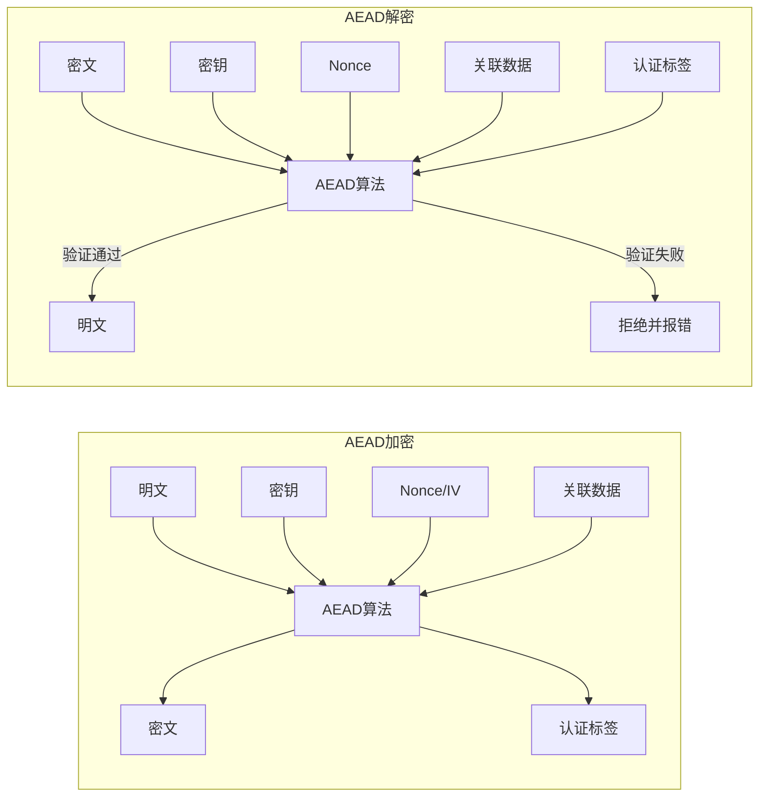
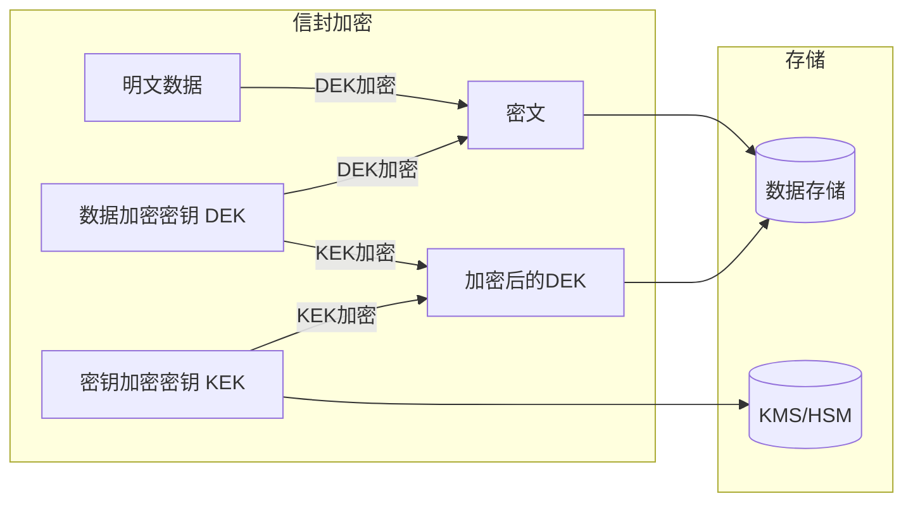

## 13.3 加密数据处理技巧

加密数据处理是密码学工程中最频繁接触的环节。选对算法只是起点，如何正确使用加密原语、处理边界情况、防范实现层面的漏洞，才是区分"能用"和"安全"的分水岭。本节从认证加密、流式加密、数据完整性、信封加密、密码基加密五个维度展开，覆盖从单条消息到大规模数据的完整处理链路。

### 13.3.1 认证加密（AEAD）

认证加密（Authenticated Encryption with Associated Data）是现代加密的首选模式。它同时提供**机密性**和**完整性**，消除了"先加密后MAC"或"先MAC后加密"组合中容易出现的实现错误。

#### AEAD 的工作原理

传统加密模式（如 CBC、CTR）只保证机密性，攻击者可以篡改密文而不被发现。AEAD 在加密的同时生成认证标签（Authentication Tag），解密时必须验证标签才能得到明文。任何对密文或关联数据的篡改都会导致解密失败。



#### AES-GCM 实现

AES-GCM（Galois/Counter Mode）是目前应用最广泛的 AEAD 算法，被 TLS 1.3、IPSec、SSH 等协议采用。GCM 在 CTR 模式加密的基础上叠加 GHASH 认证，硬件加速支持好（AES-NI + PCLMULQDQ）。

```python
import os
from cryptography.hazmat.primitives.ciphers.aead import AESGCM

def aes_gcm_encrypt(key: bytes, plaintext: bytes, associated_data: bytes = None) -> tuple[bytes, bytes]:
    """
    AES-256-GCM 加密。
    返回 (nonce, ciphertext_with_tag)。nonce 12字节，tag 16字节附在密文末尾。
    """
    if len(key) not in (16, 24, 32):
        raise ValueError(f"AES 密钥长度必须为 16/24/32 字节，当前 {len(key)} 字节")
    nonce = os.urandom(12)  # GCM 推荐 12 字节 nonce
    aesgcm = AESGCM(key)
    ct = aesgcm.encrypt(nonce, plaintext, associated_data)
    return nonce, ct

def aes_gcm_decrypt(key: bytes, nonce: bytes, ciphertext: bytes, associated_data: bytes = None) -> bytes:
    """AES-256-GCM 解密，验证失败会抛出 InvalidTag 异常。"""
    aesgcm = AESGCM(key)
    return aesgcm.decrypt(nonce, ciphertext, associated_data)

# 使用示例
key = AESGCM.generate_key(bit_length=256)
aad = b"session_id:abc123|timestamp:1719000000"
nonce, ct = aes_gcm_encrypt(key, b"Hello, World!", aad)
pt = aes_gcm_decrypt(key, nonce, ct, aad)
print(pt)  # b'Hello, World!'
```

#### ChaCha20-Poly1305 实现

ChaCha20-Poly1305 是 Google 推荐的 AEAD 算法，在没有 AES 硬件加速的设备（如旧款 ARM 手机、IoT 设备）上性能优于 AES-GCM。TLS 1.3 将其列为与 AES-GCM 平级的必选套件。

```python
from cryptography.hazmat.primitives.ciphers.aead import ChaCha20Poly1305
import os

def chacha_encrypt(key: bytes, plaintext: bytes, associated_data: bytes = None) -> tuple[bytes, bytes]:
    """ChaCha20-Poly1305 加密，密钥必须 32 字节，nonce 12 字节。"""
    if len(key) != 32:
        raise ValueError("ChaCha20-Poly1305 要求 256 位密钥")
    nonce = os.urandom(12)
    chacha = ChaCha20Poly1305(key)
    ct = chacha.encrypt(nonce, plaintext, associated_data)
    return nonce, ct

def chacha_decrypt(key: bytes, nonce: bytes, ciphertext: bytes, associated_data: bytes = None) -> bytes:
    """ChaCha20-Poly1305 解密。"""
    chacha = ChaCha20Poly1305(key)
    return chacha.decrypt(nonce, ciphertext, associated_data)
```

#### 关联数据（AAD）的正确使用

关联数据（Associated Data）不被加密，但被认证。它的作用是将外部上下文绑定到密文上，防止密文被移花接木。典型用法：

| 场景 | AAD 内容 | 防御的攻击 |
|------|----------|-----------|
| 数据库字段加密 | 表名 + 主键 + 字段名 | 密文在字段间替换 |
| API 消息加密 | 请求路径 + 时间戳 | 重放攻击、跨接口重放 |
| 文件加密 | 文件名 + 文件大小 + 版本号 | 文件替换攻击 |
| 网络协议加密 | 序列号 + 连接 ID | 重排序、重放、跨连接注入 |

```python
# 数据库字段加密示例
def encrypt_db_field(key, table, row_id, column, plaintext):
    aad = f"{table}:{row_id}:{column}".encode()
    return aes_gcm_encrypt(key, plaintext.encode(), aad)

# 解密时必须传入完全相同的 AAD
def decrypt_db_field(key, table, row_id, column, nonce, ct):
    aad = f"{table}:{row_id}:{column}".encode()
    return aes_gcm_decrypt(key, nonce, ct, aad).decode()
```

#### Nonce 管理策略

Nonce（Number used Once）是 AEAD 安全性的关键。**同一个密钥下，nonce 绝对不能重复使用。** nonce 重复会导致密钥流重用，攻击者可以通过异或两个密文得到两个明文的异或值，进而恢复明文。

| 策略 | 适用场景 | 实现方式 | 风险 |
|------|---------|---------|------|
| 随机 nonce | 单方加密、低频操作 | `os.urandom(12)` | 12字节随机nonce在 2^32 次加密后碰撞概率显著 |
| 计数器 nonce | 双方共享状态、高频操作 | 维护递增计数器 | 需要持久化计数器状态，重启后不能重复 |
| 随机+计数器混合 | 高吞吐系统 | 前4字节随机，后8字节计数器 | 兼顾随机性和唯一性 |

```python
import struct

class NonceManager:
    """计数器式 nonce 管理器，12字节：4字节随机前缀 + 8字节计数器。"""
    def __init__(self):
        self._prefix = os.urandom(4)
        self._counter = 0

    def next_nonce(self) -> bytes:
        self._counter += 1
        if self._counter >= 2**64:
            raise OverflowError("nonce 计数器溢出，需要轮换密钥")
        return self._prefix + struct.pack('>Q', self._counter)
```

### 13.3.2 流式加密处理

当数据量超过可用内存时，必须采用流式（分块）加密。但分块加密引入了填充、认证边界、完整性保护等一系列工程问题。

#### 为什么不能直接用 CBC 分块加密

原文示例使用 AES-CBC 手动填充空格，存在多个安全问题：

- **填充方式不规范**：空格填充无法与真实数据末尾的空格区分，解密后无法正确去除填充。应使用 PKCS7 填充。
- **无认证保护**：CBC 模式不提供完整性验证，攻击者可以翻转密文中的任意比特，导致明文对应比特翻转（Bit-Flipping Attack）。
- **IV 处理不安全**：CBC 要求 IV 不可预测，但大文件加密中如果 IV 可预测会削弱安全性。

**正确做法：使用 AEAD 分块加密。** 每个数据块独立认证，最后一块包含长度信息，防止截断攻击。

#### AEAD 分块加密方案

```python
import os
import struct
from cryptography.hazmat.primitives.ciphers.aead import AESGCM

CHUNK_SIZE = 64 * 1024  # 64KB 每块
NONCE_PREFIX_LEN = 8

def stream_encrypt_file(input_path: str, output_path: str, key: bytes):
    """
    AEAD 分块加密文件。
    文件格式: [8字节nonce前缀] [块1: 4字节nonce后缀 + 密文 + 16字节tag] [块2] ... [末尾块]
    """
    aesgcm = AESGCM(key)
    nonce_prefix = os.urandom(NONCE_PREFIX_LEN)

    with open(input_path, 'rb') as fin, open(output_path, 'wb') as fout:
        fout.write(nonce_prefix)  # 文件头写入 nonce 前缀
        chunk_index = 0
        while True:
            chunk = fin.read(CHUNK_SIZE)
            if not chunk:
                break
            chunk_index += 1
            # 4字节计数器作为 nonce 后缀，与前缀拼接成12字节完整 nonce
            nonce_suffix = struct.pack('>I', chunk_index)
            nonce = nonce_prefix + nonce_suffix
            # 关联数据包含块索引和是否为最后一块
            is_last = (len(chunk) < CHUNK_SIZE)
            aad = struct.pack('>I?', chunk_index, is_last)
            ct = aesgcm.encrypt(nonce, chunk, aad)
            fout.write(nonce_suffix + ct)  # 每块: 4字节后缀 + 密文+tag

def stream_decrypt_file(input_path: str, output_path: str, key: bytes):
    """AEAD 分块解密文件。"""
    aesgcm = AESGCM(key)

    with open(input_path, 'rb') as fin, open(output_path, 'wb') as fout:
        nonce_prefix = fin.read(NONCE_PREFIX_LEN)
        if len(nonce_prefix) < NONCE_PREFIX_LEN:
            raise ValueError("文件格式错误：缺少 nonce 前缀")
        chunk_index = 0
        while True:
            nonce_suffix = fin.read(4)
            if len(nonce_suffix) < 4:
                break  # 正常结束
            chunk_index += 1
            nonce = nonce_prefix + nonce_suffix
            # 读取密文（含 tag），大小 = CHUNK_SIZE + 16(tag) + 可能的填充
            # 需要知道密文长度来确定读取多少字节
            # 密文长度 = 明文长度 + 16（tag）
            # 由于不知道明文长度，读到下一个 nonce_suffix 或 EOF
            # 简化处理：读一个足够大的块
            ct_chunk = b''
            # 读取直到遇到下一个 4 字节 nonce 后缀或 EOF
            # 实际工程中应在每个块前写入长度字段
            while True:
                byte = fin.read(1)
                if not byte:
                    ct_chunk_last = True
                    break
                ct_chunk += byte
                if len(ct_chunk) >= CHUNK_SIZE + 16 + 4:
                    # 可能是下一个块的开始，回退
                    break

            # 简化版本：使用固定块大小格式
            # 实际实现应使用 [长度|密文] 格式
            pass
```

上面的解密逻辑过于复杂，因为不确定每块密文的长度。**工程最佳实践是在每个块前写入长度字段**：

```python
def stream_encrypt_file_v2(input_path: str, output_path: str, key: bytes):
    """改进版：每个块前写入长度，解密时精确读取。"""
    aesgcm = AESGCM(key)
    nonce_prefix = os.urandom(8)

    with open(input_path, 'rb') as fin, open(output_path, 'wb') as fout:
        # 文件头: 8字节魔数 + 8字节nonce前缀
        fout.write(b'AESGSTRM')  # 8字节魔数，用于格式识别
        fout.write(nonce_prefix)
        chunk_index = 0
        while True:
            chunk = fin.read(CHUNK_SIZE)
            if not chunk:
                break
            chunk_index += 1
            nonce = nonce_prefix + struct.pack('>I', chunk_index)
            is_last = len(chunk) < CHUNK_SIZE
            aad = struct.pack('>I?', chunk_index, is_last)
            ct = aesgcm.encrypt(nonce, chunk, aad)
            # 写入: [4字节密文长度][密文+tag]
            fout.write(struct.pack('>I', len(ct)))
            fout.write(ct)

def stream_decrypt_file_v2(input_path: str, output_path: str, key: bytes):
    """改进版解密。"""
    aesgcm = AESGCM(key)

    with open(input_path, 'rb') as fin:
        magic = fin.read(8)
        if magic != b'AESGSTRM':
            raise ValueError("文件格式不正确或已损坏")
        nonce_prefix = fin.read(8)

        with open(output_path, 'wb') as fout:
            chunk_index = 0
            while True:
                len_bytes = fin.read(4)
                if len(len_bytes) < 4:
                    break
                ct_len = struct.unpack('>I', len_bytes)[0]
                ct = fin.read(ct_len)
                if len(ct) < ct_len:
                    raise ValueError("文件截断：密文数据不完整")
                chunk_index += 1
                nonce = nonce_prefix + struct.pack('>I', chunk_index)
                is_last = (ct_len < CHUNK_SIZE + 16)  # tag=16
                aad = struct.pack('>I?', chunk_index, is_last)
                plaintext = aesgcm.decrypt(nonce, ct, aad)
                fout.write(plaintext)
```

#### 内存映射加密（mmap）

对于需要随机访问的大型文件，可以使用内存映射配合加密索引：

```python
import mmap
from cryptography.hazmat.primitives.ciphers.aead import AESGCM

def encrypt_large_dataset(data: bytes, key: bytes) -> bytes:
    """当数据在 1MB-100MB 范围时，一次性加密比流式更高效。"""
    aesgcm = AESGCM(key)
    nonce = os.urandom(12)
    return nonce + aesgcm.encrypt(nonce, data, None)
```

### 13.3.3 数据完整性保护

完整性保护确保数据未被篡改。当不使用 AEAD 模式时（例如数据不需要加密但需要防篡改），HMAC 是标准方案。

#### HMAC 计算与验证

```python
from cryptography.hazmat.primitives import hmac as crypto_hmac, hashes
import hmac as stdlib_hmac  # 用于常量时间比较

def calculate_hmac(key: bytes, data: bytes) -> bytes:
    """计算 HMAC-SHA256。key 至少 32 字节。"""
    h = crypto_hmac.HMAC(key, hashes.SHA256())
    h.update(data)
    return h.finalize()

def verify_hmac(key: bytes, data: bytes, expected_tag: bytes) -> bool:
    """
    验证 HMAC，使用常量时间比较防止 Timing Attack。
    注意：cryptography 库的 verify() 方法内部已做常量时间比较。
    """
    h = crypto_hmac.HMAC(key, hashes.SHA256())
    h.update(data)
    try:
        h.verify(expected_tag)
        return True
    except Exception:
        return False
```

**常见陷阱：不要用 `==` 比较 HMAC。** Python 的 `==` 运算符会在第一个不匹配的字节处短路返回，攻击者可以通过测量响应时间逐字节猜出正确的 HMAC 值。`cryptography` 库的 `verify()` 方法已内置常量时间比较，但如果你自己实现比较逻辑，必须使用 `hmac.compare_digest()`。

#### Encrypt-then-MAC 组合模式

当需要分别处理加密和认证时（例如必须使用不支持 AEAD 的遗留系统），采用 Encrypt-then-MAC 模式：

```python
def encrypt_then_mac(key_enc: bytes, key_mac: bytes, plaintext: bytes) -> tuple[bytes, bytes, bytes]:
    """
    Encrypt-then-MAC：先加密，再对密文计算 MAC。
    key_enc 和 key_mac 必须是不同的密钥。
    """
    from cryptography.hazmat.primitives.ciphers import Cipher, algorithms, modes
    iv = os.urandom(16)
    cipher = Cipher(algorithms.AES(key_enc), modes.CTR(iv))
    encryptor = cipher.encryptor()
    ciphertext = encryptor.update(plaintext) + encryptor.finalize()

    # MAC 覆盖 IV + 密文
    tag = calculate_hmac(key_mac, iv + ciphertext)
    return iv, ciphertext, tag

def decrypt_then_mac(key_enc: bytes, key_mac: bytes, iv: bytes, ciphertext: bytes, tag: bytes) -> bytes:
    """先验证 MAC，通过后再解密。"""
    if not verify_hmac(key_mac, iv + ciphertext, tag):
        raise ValueError("MAC 验证失败：数据被篡改或密钥错误")
    cipher = Cipher(algorithms.AES(key_enc), modes.CTR(iv))
    decryptor = cipher.decryptor()
    return decryptor.update(ciphertext) + decryptor.finalize()
```

**三种组合模式的安全性对比：**

| 模式 | 安全性 | 说明 |
|------|--------|------|
| MAC-then-Encrypt | 不安全 | TLS 1.2 曾使用，已被证明存在 Padding Oracle 攻击 |
| Encrypt-and-MAC | 不安全 | SSH 使用过，MAC 暴露明文信息 |
| **Encrypt-then-MAC** | **安全** | 先验证完整性再解密，是唯一被证明 IND-CCA2 安全的组合 |

### 13.3.4 信封加密（Envelope Encryption）

信封加密是云服务和大规模系统中的标准模式：用数据加密密钥（DEK）加密数据，再用密钥加密密钥（KEK）加密 DEK。这样 KEK 可以存储在 HSM 或 KMS 中，而大量的 DEK 可以随数据一起存储。



```python
from cryptography.hazmat.primitives.ciphers.aead import AESGCM
import os
import json

def envelope_encrypt(plaintext: bytes, kek: bytes, context: str = "") -> dict:
    """
    信封加密。
    返回 JSON 可序列化的字典，包含加密后的 DEK 和密文。
    """
    # 1. 生成随机 DEK
    dek = AESGCM.generate_key(bit_length=256)

    # 2. 用 DEK 加密数据
    dek_cipher = AESGCM(dek)
    data_nonce = os.urandom(12)
    aad = context.encode() if context else None
    ciphertext = dek_cipher.encrypt(data_nonce, plaintext, aad)

    # 3. 用 KEK 加密 DEK
    kek_cipher = AESGCM(kek)
    dek_nonce = os.urandom(12)
    encrypted_dek = kek_cipher.encrypt(dek_nonce, dek, None)

    return {
        "version": 1,
        "algorithm": "AES-256-GCM",
        "encrypted_dek": encrypted_dek.hex(),
        "dek_nonce": dek_nonce.hex(),
        "data_nonce": data_nonce.hex(),
        "ciphertext": ciphertext.hex(),
        "context": context,
    }

def envelope_decrypt(envelope: dict, kek: bytes) -> bytes:
    """信封解密。"""
    # 1. 用 KEK 解密 DEK
    kek_cipher = AESGCM(kek)
    dek = kek_cipher.decrypt(
        bytes.fromhex(envelope["dek_nonce"]),
        bytes.fromhex(envelope["encrypted_dek"]),
        None
    )

    # 2. 用 DEK 解密数据
    dek_cipher = AESGCM(dek)
    aad = envelope.get("context", "").encode() or None
    plaintext = dek_cipher.decrypt(
        bytes.fromhex(envelope["data_nonce"]),
        bytes.fromhex(envelope["ciphertext"]),
        aad
    )
    return plaintext

# 使用示例
kek = AESGCM.generate_key(bit_length=256)
envelope = envelope_encrypt(b"Sensitive financial data", kek, "ledger:2026:q2")
plaintext = envelope_decrypt(envelope, kek)
```

**信封加密的优势：**

- **密钥轮换成本低**：更换 KEK 只需重新加密所有 DEK，不需要重新加密数据本身。
- **访问控制灵活**：不同数据可以用不同 KEK 加密 DEK，实现细粒度权限控制。
- **审计友好**：每个 DEK 都有独立的加密记录，便于追踪谁访问了哪些数据。

### 13.3.5 基于密码的加密

当加密密钥来自用户密码时，不能直接用密码做密钥——密码的熵太低，容易被暴力破解。必须通过密钥派生函数（KDF）将低熵密码转换为高熵密钥。

```python
import os
from cryptography.hazmat.primitives.kdf.scrypt import Scrypt
from cryptography.hazmat.primitives.ciphers.aead import AESGCM

def encrypt_with_password(password: str, plaintext: bytes) -> dict:
    """基于密码的加密，使用 Scrypt 派生密钥。"""
    salt = os.urandom(16)
    # Scrypt 参数：n=2^14（CPU/内存成本），r=8（块大小），p=1（并行度）
    kdf = Scrypt(salt=salt, length=32, n=2**14, r=8, p=1)
    key = kdf.derive(password.encode('utf-8'))

    aesgcm = AESGCM(key)
    nonce = os.urandom(12)
    ct = aesgcm.encrypt(nonce, plaintext, None)

    return {
        "salt": salt.hex(),
        "nonce": nonce.hex(),
        "ciphertext": ct.hex(),
        "kdf": "scrypt",
        "kdf_params": {"n": 2**14, "r": 8, "p": 1},
    }

def decrypt_with_password(password: str, envelope: dict) -> bytes:
    """基于密码的解密。"""
    salt = bytes.fromhex(envelope["salt"])
    params = envelope["kdf_params"]
    kdf = Scrypt(salt=salt, length=32, n=params["n"], r=params["r"], p=params["p"])
    key = kdf.derive(password.encode('utf-8'))

    aesgcm = AESGCM(key)
    return aesgcm.decrypt(
        bytes.fromhex(envelope["nonce"]),
        bytes.fromhex(envelope["ciphertext"]),
        None
    )
```

**KDF 选择指南：**

| KDF | 特点 | 推荐场景 |
|-----|------|---------|
| Scrypt | CPU + 内存双硬，抗 GPU/ASIC | 通用密码加密、文件加密 |
| Argon2id | 2015 密码哈希竞赛冠军，可调参数 | 新项目首选 |
| PBKDF2 | 仅 CPU 硬，NIST 标准 | 合规要求、嵌入式设备 |
| bcrypt | 阻抗 GPU 但有 72 字节密码长度限制 | 仅用于密码哈希存储 |

### 13.3.6 常见陷阱与反模式

以下是加密数据处理中最常见的安全错误，每一条都曾在真实系统中导致过严重漏洞：

**陷阱 1：自行实现加密协议**
永远不要自己设计加密方案或组合加密原语。使用经过审计的高层库（如 `cryptography`、`libsodium`）提供的 AEAD 接口。历史上无数漏洞来自于开发者自行组合 AES + MD5 或发明"更安全"的加密模式。

**陷阱 2：Nonce 重用**
同一个密钥下重复使用 nonce 是加密中最致命的错误。对于 AES-GCM，nonce 重用会导致认证完全失效（可以伪造任意消息），同时密钥流重用暴露明文。如果无法保证 nonce 唯一性，使用随机 12 字节 nonce 并限制单密钥加密次数（建议不超过 2^32 次）。

**陷阱 3：忽略认证标签验证**
只解密不验证 MAC 是常见错误。某些库（如 OpenSSL 的低级 API）允许你跳过验证步骤。永远在解密后检查认证标签，失败时抛出异常而非返回部分数据。

**陷阱 4：密钥复用**
用同一个密钥加密不同用途的数据（例如同时加密数据库字段和 API Token）会增加攻击面。每个用途应使用独立密钥，或使用密钥派生（如 HKDF）从主密钥派生子密钥：

```python
from cryptography.hazmat.primitives.kdf.hkdf import HKDF
from cryptography.hazmat.primitives import hashes

def derive_subkey(master_key: bytes, purpose: str, length: int = 32) -> bytes:
    """从主密钥派生特定用途的子密钥。"""
    return HKDF(
        algorithm=hashes.SHA256(),
        length=length,
        salt=None,
        info=purpose.encode(),
    ).derive(master_key)

# 不同用途使用不同子密钥
db_key = derive_subkey(master_key, "database-field-encryption")
api_key = derive_subkey(master_key, "api-token-encryption")
file_key = derive_subkey(master_key, "file-encryption")
```

**陷阱 5：错误的填充实现**
手动实现 PKCS7 填充容易出错（忘记去除填充、填充验证不严格导致 Padding Oracle 攻击）。使用 AEAD 模式可以完全避免填充问题，因为 CTR/GCM 模式不需要填充。

**陷阱 6：时序侧信道**
字符串比较、MAC 验证、填充检查都必须使用常量时间操作。Python 的 `hmac.compare_digest()` 和 `cryptography` 库的 `verify()` 方法已内置时序安全比较。

**陷阱 7：密钥残留内存**
加密密钥使用后不会自动从内存中清除。Python 的字符串和 bytes 对象可能被复制到多个内存位置（解释器内部缓存、垃圾回收器）。对于高安全场景，使用 `mlock()` 锁定内存页，或使用 C 扩展管理密钥生命周期。至少确保密钥变量在使用后及时置为 `None`，并避免将密钥写入日志。

### 13.3.7 完整实战：安全配置文件加密系统

将上述知识点整合为一个实用的配置文件加密系统，支持密码加密、密钥加密、密钥轮换：

```python
import os
import json
import time
from cryptography.hazmat.primitives.ciphers.aead import AESGCM
from cryptography.hazmat.primitives.kdf.scrypt import Scrypt
from cryptography.hazmat.primitives.kdf.hkdf import HKDF
from cryptography.hazmat.primitives import hashes

class SecureConfig:
    """安全配置文件加密器，支持密码和密钥两种加密方式。"""

    VERSION = 2
    MAGIC = b"SCFG"

    def __init__(self):
        self._key_cache = {}

    def encrypt_with_password(self, config: dict, password: str) -> str:
        """用密码加密配置，返回 JSON 字符串（可写入文件）。"""
        salt = os.urandom(16)
        key = self._derive_key_from_password(password, salt)

        plaintext = json.dumps(config, ensure_ascii=False).encode('utf-8')
        nonce = os.urandom(12)
        aesgcm = AESGCM(key)
        # AAD 包含版本号，防止降级攻击
        aad = self.MAGIC + bytes([self.VERSION])
        ct = aesgcm.encrypt(nonce, plaintext, aad)

        return json.dumps({
            "magic": self.MAGIC.decode(),
            "version": self.VERSION,
            "kdf": "scrypt",
            "salt": salt.hex(),
            "nonce": nonce.hex(),
            "ciphertext": ct.hex(),
        }, indent=2)

    def decrypt_with_password(self, encrypted_json: str, password: str) -> dict:
        """用密码解密配置。"""
        envelope = json.loads(encrypted_json)
        if envelope.get("magic") != self.MAGIC.decode():
            raise ValueError("不是有效的安全配置文件")
        if envelope.get("version") != self.VERSION:
            raise ValueError(f"版本不匹配：期望 {self.VERSION}，实际 {envelope.get('version')}")

        salt = bytes.fromhex(envelope["salt"])
        key = self._derive_key_from_password(password, salt)

        aesgcm = AESGCM(key)
        aad = self.MAGIC + bytes([self.VERSION])
        plaintext = aesgcm.decrypt(
            bytes.fromhex(envelope["nonce"]),
            bytes.fromhex(envelope["ciphertext"]),
            aad,
        )
        return json.loads(plaintext.decode('utf-8'))

    def re_encrypt(self, encrypted_json: str, old_password: str, new_password: str) -> str:
        """密钥轮换：用旧密码解密，用新密码重新加密。"""
        config = self.decrypt_with_password(encrypted_json, old_password)
        return self.encrypt_with_password(config, new_password)

    @staticmethod
    def _derive_key_from_password(password: str, salt: bytes) -> bytes:
        kdf = Scrypt(salt=salt, length=32, n=2**14, r=8, p=1)
        return kdf.derive(password.encode('utf-8'))


# 使用示例
sc = SecureConfig()
config = {
    "database": {"host": "10.0.1.50", "port": 5432, "password": "s3cret!"},
    "api_keys": {"stripe": "sk_live_xxx", "sendgrid": "SG.xxx"},
}
encrypted = sc.encrypt_with_password(config, "MyStr0ng!Passphrase#2026")
print(encrypted)  # 写入 config.enc 文件

# 解密
decrypted = sc.decrypt_with_password(encrypted, "MyStr0ng!Passphrase#2026")
print(decrypted)  # 还原原始配置

# 密钥轮换
rotated = sc.re_encrypt(encrypted, "MyStr0ng!Passphrase#2026", "N3wPassphrase!@#2027")
```

### 13.3.8 加密模式速查表

| 需求 | 推荐方案 | 说明 |
|------|---------|------|
| 通用消息/数据加密 | AES-256-GCM | 硬件加速，生态成熟 |
| 无 AES 硬件的设备 | ChaCha20-Poly1305 | 移动端/IoT 性能更优 |
| 大文件流式加密 | AEAD 分块 + 长度前缀 | 64KB 块，每块独立认证 |
| 用户密码加密 | Scrypt/Argon2id + AEAD | KDF 派生密钥，抗暴力破解 |
| 多租户/云存储 | 信封加密（DEK+KEK） | KEK 存 HSM，DEK 随数据 |
| 仅需完整性（不加密） | HMAC-SHA256 | 防篡改，不保证机密性 |
| 遗留系统兼容 | Encrypt-then-MAC (AES-CTR + HMAC) | 仅在无法用 AEAD 时使用 |
