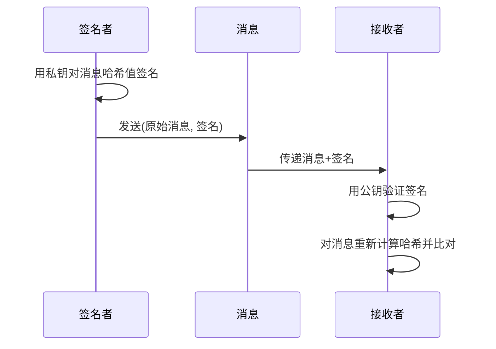

## 13.4 数字签名实践技巧

数字签名是密码学中**非对称加密**最核心的应用之一。它解决了两个关键问题：**身份认证**（这条消息确实是声称的发送者发出的）和**完整性校验**（消息在传输过程中没有被篡改）。与加密保护"机密性"不同，签名保护的是"不可否认性"——签名者事后无法否认自己签过这条消息。

### 13.4.1 数字签名原理

数字签名的工作流程基于非对称密钥对：



核心流程分三步：

1. **哈希**：对原始消息计算摘要（SHA-256、SHA-384 等），将任意长度消息压缩为固定长度
2. **签名**：用私钥对摘要值进行加密（或特定数学运算），生成签名
3. **验证**：接收方用公钥解密签名得到摘要值，与自己计算的摘要比对

为什么先哈希再签名？两个原因：一是效率——非对称运算比哈希慢几个数量级，哈希后再签名可以处理任意大小的数据；二是安全性——直接对长消息签名可能遭受数学攻击，哈希后长度固定且均匀分布。

### 13.4.2 主流签名算法对比

| 特性 | RSA-PSS | ECDSA | Ed25519 |
|------|---------|-------|---------|
| 数学基础 | 大整数分解困难问题 | 椭圆曲线离散对数 | Edwards 曲线 twisted Edwards |
| 密钥长度 | 2048-4096 bit | 256-521 bit | 256 bit（固定） |
| 签名长度 | 与密钥等长（256-512 字节） | 约 64-132 字节 | 64 字节（固定） |
| 速度 | 慢（签名慢，验证中等） | 中等 | 快（签名和验证都快） |
| 确定性 | PSS 是随机的 | 标准实现是随机的 | 确定性（同消息+同密钥=同签名） |
| 抗侧信道 | 一般 | 需要注意实现质量 | 设计时已考虑 |
| 适用场景 | TLS、PKI、遗留系统 | TLS、区块链、JWT | SSH、Tor、新协议 |
| 标准化 | PKCS#1, FIPS 186-5 | FIPS 186-5, SEC2 | RFC 8032 |

**选型建议**：
- **新项目首选 Ed25519**：密钥短、速度快、实现简单、确定性签名避免随机数质量问题
- **需要合规/兼容时选 ECDSA P-256**：FIPS 认证、TLS 1.3 支持、广泛生态
- **遗留系统或需要大密钥时选 RSA-2048/4096**：兼容性最好但性能最差
- **区块链场景**：ECDSA secp256k1（比特币、以太坊）或 EdDSA（Solana、Cardano）

### 13.4.3 RSA-PSS 签名实现

RSA-PSS（Probabilistic Signature Scheme）是 RSA 签名的现代标准，比旧的 PKCS#1 v1.5 更安全。PSS 引入随机盐值，即使对同一消息签名也会产生不同的签名值，这提升了安全性。

```python
from cryptography.hazmat.primitives import hashes, serialization
from cryptography.hazmat.primitives.asymmetric import rsa, padding

# 1. 生成 RSA 密钥对
private_key = rsa.generate_private_key(
    public_exponent=65537,       # 标准公钥指数
    key_size=2048,               # 最低安全长度，推荐 3072+
)

# 2. 签名
data = b"需要签名的原始消息内容"
signature = private_key.sign(
    data,
    padding.PSS(
        mgf=padding.MGF1(hashes.SHA256()),          # 掩码生成函数
        salt_length=padding.PSS.MAX_LENGTH            # 盐长度取最大值
    ),
    hashes.SHA256()                                   # 摘要算法
)

# 3. 验证签名
public_key = private_key.public_key()
try:
    public_key.verify(
        signature,
        data,
        padding.PSS(
            mgf=padding.MGF1(hashes.SHA256()),
            salt_length=padding.PSS.MAX_LENGTH
        ),
        hashes.SHA256()
    )
    print("✅ 签名验证通过：消息完整且来源可信")
except Exception as e:
    print(f"❌ 签名验证失败：{e}")

# 4. 密钥持久化（PEM 格式）
private_pem = private_key.private_bytes(
    encoding=serialization.Encoding.PEM,
    format=serialization.PrivateFormat.PKCS8,
    encryption_algorithm=serialization.BestAvailableEncryption(b"your-passphrase")
)
public_pem = public_key.public_bytes(
    encoding=serialization.Encoding.PEM,
    format=serialization.PublicFormat.SubjectPublicKeyInfo
)
```

**PSS 参数选择要点**：
- `salt_length`：建议使用 `PSS.MAX_LENGTH`（与哈希输出等长），最大化安全性
- `MGF1` 的哈希算法：通常与主哈希一致（都是 SHA-256），但不是强制的
- 可用哈希：SHA-256（默认）、SHA-384、SHA-512，避免 SHA-1

### 13.4.4 ECDSA 签名实现

ECDSA 基于椭圆曲线，用更短的密钥达到与 RSA 同等的安全强度。256 位 ECDSA ≈ 3072 位 RSA 的安全性。

```python
from cryptography.hazmat.primitives import hashes
from cryptography.hazmat.primitives.asymmetric import ec, utils
from cryptography.hazmat.primitives import serialization

# 1. 生成 ECDSA 密钥对
# 常用曲线：
#   SECP256R1 (P-256) — NIST 标准，最广泛支持
#   SECP384R1 (P-384) — 更高安全级别
#   SECP256K1 — 比特币/以太坊使用
private_key = ec.generate_private_key(ec.SECP256R1())

# 2. 签名
data = b"需要签名的原始消息内容"
signature = private_key.sign(data, ec.ECDSA(hashes.SHA256()))

# 3. 验证
public_key = private_key.public_key()
try:
    public_key.verify(signature, data, ec.ECDSA(hashes.SHA256()))
    print("✅ ECDSA 签名验证通过")
except Exception as e:
    print(f"❌ ECDSA 签名验证失败：{e}")

# 4. DER 编码签名 ↔ 原始 (r, s) 值转换
# 有时需要在 DER 和 raw 格式之间转换（如区块链场景）
r, s = utils.decode_dss_signature(signature)       # DER → (r, s)
raw_signature = utils.encode_dss_signature(r, s)    # (r, s) → DER

# 5. 选择不同曲线
key_p384 = ec.generate_private_key(ec.SECP384R1())
key_secp256k1 = ec.generate_private_key(ec.SECP256K1())  # 区块链常用
```

**ECDSA 关键安全注意事项**：

ECDSA 对随机数质量极度敏感。签名过程需要一个随机数 k，如果 k 被重用或可预测，攻击者可以从两个签名中恢复私钥。2010 年索尼 PS3 的 ECDSA 实现就因为使用了固定的 k 值，导致私钥被完全破解。

Python `cryptography` 库内部使用 CSPRNG 生成 k，一般不需要手动处理。但如果使用其他语言或底层库，务必确保 k 是密码学安全的随机数。

### 13.4.5 Ed25519 签名实现

Ed25519 是基于 Edwards 曲线的签名算法，设计目标是"做对事情很容易，做错事情很难"。它是确定性签名（RFC 8032），完全消除了随机数问题。

```python
from cryptography.hazmat.primitives.asymmetric.ed25519 import (
    Ed25519PrivateKey, Ed25519PublicKey
)
from cryptography.hazmat.primitives import serialization

# 1. 生成密钥对
private_key = Ed25519PrivateKey.generate()

# 2. 签名 — 注意：Ed25519 不需要指定哈希算法，内部已集成
data = b"需要签名的原始消息内容"
signature = private_key.sign(data)  # 返回 64 字节签名

# 3. 验证
public_key = private_key.public_key()
try:
    public_key.verify(signature, data)
    print("✅ Ed25519 签名验证通过")
except Exception as e:
    print(f"❌ Ed25519 签名验证失败：{e}")

# 4. 密钥序列化
private_bytes = private_key.private_bytes(
    encoding=serialization.Encoding.Raw,
    format=serialization.PrivateFormat.Raw,
    encryption_algorithm=serialization.NoEncryption()
)  # 32 字节私钥种子

public_bytes = public_key.public_bytes(
    encoding=serialization.Encoding.Raw,
    format=serialization.PublicFormat.Raw
)  # 32 字节公钥

# 5. 从已有字节恢复密钥
restored_private = Ed25519PrivateKey.from_private_bytes(private_bytes)
restored_public = Ed25519PublicKey.from_public_bytes(public_bytes)

# 6. 从私钥推导公钥
derived_public = restored_private.public_key()
```

**Ed25519 优势总结**：
- 确定性签名，无需担心随机数质量
- 密钥和签名都是固定长度（32 + 64 字节），实现简洁
- 抗侧信道攻击：设计时就考虑了常数时间运算
- 快速：单核每秒可完成数万次签名/验证
- 唯一缺点：不支持密钥协商（需要 X25519 配合）

### 13.4.6 实战场景：文件签名与验证

在软件分发、配置管理等场景中，文件签名是最常见的应用。下面实现一个完整的文件签名工具：

```python
import hashlib
import json
import base64
from pathlib import Path
from datetime import datetime, timezone
from cryptography.hazmat.primitives.asymmetric.ed25519 import (
    Ed25519PrivateKey, Ed25519PublicKey
)
from cryptography.hazmat.primitives import serialization


def sign_file(file_path: str, private_key: Ed25519PrivateKey) -> dict:
    """对文件签名，返回签名元数据"""
    content = Path(file_path).read_bytes()
    file_hash = hashlib.sha256(content).hexdigest()
    signature = private_key.sign(content)

    # 公钥指纹（前 8 字节的十六进制）
    public_key = private_key.public_key()
    pub_bytes = public_key.public_bytes(
        serialization.Encoding.Raw, serialization.PublicFormat.Raw
    )
    fingerprint = hashlib.sha256(pub_bytes).hexdigest()[:16]

    return {
        "file": str(file_path),
        "sha256": file_hash,
        "signature": base64.b64encode(signature).decode(),
        "public_key_fingerprint": fingerprint,
        "signed_at": datetime.now(timezone.utc).isoformat(),
        "algorithm": "Ed25519"
    }


def verify_file(file_path: str, manifest: dict,
                public_key: Ed25519PublicKey) -> bool:
    """验证文件签名"""
    content = Path(file_path).read_bytes()

    # 先检查哈希（快速检测篡改）
    current_hash = hashlib.sha256(content).hexdigest()
    if current_hash != manifest["sha256"]:
        print(f"❌ 文件哈希不匹配")
        print(f"   期望: {manifest['sha256']}")
        print(f"   实际: {current_hash}")
        return False

    # 再验证签名（验证身份）
    signature = base64.b64decode(manifest["signature"])
    try:
        public_key.verify(signature, content)
        print(f"✅ 文件签名验证通过")
        print(f"   签名时间: {manifest['signed_at']}")
        print(f"   密钥指纹: {manifest['public_key_fingerprint']}")
        return True
    except Exception as e:
        print(f"❌ 签名验证失败: {e}")
        return False


# 使用示例
if __name__ == "__main__":
    # 生成签名密钥对
    private_key = Ed25519PrivateKey.generate()
    public_key = private_key.public_key()

    # 签名
    manifest = sign_file("important_config.yaml", private_key)
    Path("manifest.json").write_text(json.dumps(manifest, indent=2))

    # 验证
    loaded_manifest = json.loads(Path("manifest.json").read_text())
    verify_file("important_config.yaml", loaded_manifest, public_key)
```

这个工具的验证策略是**双重校验**：先比对 SHA-256 哈希（快速排除文件篡改），再验证 Ed25519 签名（确认来源身份）。两步都通过才算可信。

### 13.4.7 实战场景：JWT 与 JWS 签名

JSON Web Token（JWT）是数字签名在 Web 中最广泛的应用。JWT 的第三部分就是签名，用于防止令牌内容被篡改。

```python
import json
import base64
import time
import hmac
import hashlib


# === 手动实现 JWT（帮助理解原理） ===

def base64url_encode(data: bytes) -> str:
    return base64.urlsafe_b64encode(data).rstrip(b"=").decode()


def base64url_decode(s: str) -> bytes:
    padding = 4 - len(s) % 4
    return base64.urlsafe_b64decode(s + "=" * padding)


def create_jwt_hs256(payload: dict, secret: str) -> str:
    """使用 HS256 创建 JWT"""
    header = {"alg": "HS256", "typ": "JWT"}
    header_b64 = base64url_encode(json.dumps(header).encode())
    payload_b64 = base64url_encode(json.dumps(payload).encode())
    message = f"{header_b64}.{payload_b64}"
    signature = hmac.new(
        secret.encode(), message.encode(), hashlib.sha256
    ).digest()
    sig_b64 = base64url_encode(signature)
    return f"{message}.{sig_b64}"


def verify_jwt_hs256(token: str, secret: str) -> dict | None:
    """验证 HS256 JWT，返回 payload 或 None"""
    parts = token.split(".")
    if len(parts) != 3:
        return None
    message = f"{parts[0]}.{parts[1]}"
    expected_sig = hmac.new(
        secret.encode(), message.encode(), hashlib.sha256
    ).digest()
    actual_sig = base64url_decode(parts[2])
    if not hmac.compare_digest(expected_sig, actual_sig):
        return None
    return json.loads(base64url_decode(parts[1]))


# 使用示例
token = create_jwt_hs256(
    {"sub": "user123", "name": "张三", "iat": int(time.time()), "exp": int(time.time()) + 3600},
    "my-secret-key-minimum-32-bytes-long!"
)
print(f"JWT: {token}")

payload = verify_jwt_hs256(token, "my-secret-key-minimum-32-bytes-long!")
print(f"Payload: {payload}")
```

**生产环境建议使用成熟库**：

```python
# pip install PyJWT
import jwt

# RS256（非对称签名，推荐生产使用）
# 私钥签名，公钥验证 — 任何人都能验证，但只有服务端能签发
token = jwt.encode(
    {"sub": "user123", "exp": time.time() + 3600},
    private_key_pem,
    algorithm="RS256"
)
payload = jwt.decode(token, public_key_pem, algorithms=["RS256"])

# HS256（对称签名，仅适合内部服务）
token = jwt.encode({"sub": "user123"}, shared_secret, algorithm="HS256")
```

### 13.4.8 密钥管理最佳实践

签名的安全性 90% 取决于密钥管理，而非算法本身。再强的算法，私钥泄露了就毫无意义。

**密钥生成**：

```bash
# Ed25519 密钥（推荐）
openssl genpkey -algorithm Ed25519 -out private.pem
openssl pkey -in private.pem -pubout -out public.pem

# ECDSA P-256 密钥
openssl ecparam -genkey -name prime256v1 -noout -out ec_private.pem
openssl ec -in ec_private.pem -pubout -out ec_public.pem

# RSA 3072 位密钥
openssl genpkey -algorithm RSA -pkeyopt rsa_keygen_bits:3072 -out rsa_private.pem
openssl pkey -in rsa_private.pem -pubout -out rsa_public.pem
```

**密钥存储安全等级**：

| 等级 | 方式 | 适用场景 |
|------|------|----------|
| L1 | 环境变量 / 配置文件（加密） | 开发测试 |
| L2 | 操作系统密钥环（macOS Keychain、GNOME Keyring） | 本地工具 |
| L3 | 硬件安全模块（HSM / YubiHSM） | 企业 CA、代码签名 |
| L4 | 离线冷存储 + 多签 | 区块链大额资产、根证书 |

**不要做的事**：
- 把私钥硬编码在源代码中
- 把私钥提交到 Git 仓库
- 在日志中打印私钥内容
- 用同一个密钥同时做签名和加密
- 长期不轮换签名密钥

### 13.4.9 常见攻击与防御

**攻击 1：签名绕过（Signature Stripping）**
攻击者移除签名部分，或替换为空签名。防御：验证逻辑必须在签名缺失时拒绝，不能默认通过。

**攻击 2：算法混淆（Algorithm Confusion）**
JWT 中将 `alg` 从 RS256 改为 HS256，用公钥作为 HMAC 密钥。防御：验证时强制指定允许的算法列表，不要从 token 头部读取算法。

**攻击 3：密钥重用（Cross-Protocol Attack）**
同一密钥用于不同协议，攻击者在一个协议中获得签名，在另一个协议中重放。防御：不同用途使用不同密钥，或在签名消息中加入上下文标识。

**攻击 4：哈希碰撞（Hash Collision）**
对哈希算法本身的攻击，两个不同文件产生相同哈希。防御：使用 SHA-256 或更强的哈希，避免 SHA-1 和 MD5。

**攻击 5：时序侧信道（Timing Side-Channel）**
签名验证的耗时差异泄露信息。防御：使用常数时间比较（`hmac.compare_digest`），Ed25519 本身已做常数时间设计。

### 13.4.10 OpenSSL 命令行签名工具

不写代码也能用 OpenSSL 完成签名和验证：

```bash
# === Ed25519 签名 ===
# 生成密钥
openssl genpkey -algorithm Ed25519 -out ed25519_private.pem
openssl pkey -in ed25519_private.pem -pubout -out ed25519_public.pem

# 签名文件
openssl pkeyutl -sign -inkey ed25519_private.pem \
    -in message.txt -out message.sig

# 验证签名
openssl pkeyutl -verify -pubin -inkey ed25519_public.pem \
    -in message.txt -sigfile message.sig

# === ECDSA P-256 签名 ===
openssl dgst -sha256 -sign ec_private.pem -out sig.bin message.txt
openssl dgst -sha256 -verify ec_public.pem -signature sig.bin message.txt

# === RSA-PSS 签名 ===
openssl dgst -sha256 -sign rsa_private.pem \
    -sigopt rsa_padding_mode:pss -sigopt rsa_pss_saltlen:32 \
    -out sig.bin message.txt
openssl dgst -sha256 -verify rsa_public.pem \
    -sigopt rsa_padding_mode:pss -sigopt rsa_pss_saltlen:32 \
    -signature sig.bin message.txt

# === 查看签名文件信息 ===
openssl asn1parse -in sig.bin -inform DER  # 查看 DER 编码结构
xxd sig.bin | head -5                       # 查看原始字节
```

### 13.4.11 代码签名实战

代码签名是软件供应链安全的基础。它让使用者确信代码没有被篡改，且来自可信的发布者。

**Git 提交签名**：

```bash
# 配置 Git 使用 GPG 签名
git config --global user.signingkey YOUR_KEY_ID
git config --global commit.gpgsign true

# 或使用 SSH 签名（Git 2.34+）
git config --global gpg.format ssh
git config --global user.signingkey ~/.ssh/id_ed25519.pub

# 签名特定提交
git commit -S -m "Signed commit"

# 验证提交签名
git log --show-signature -1
```

**Docker 镜像签名（Cosign）**：

```bash
# 安装 cosign
# 生成密钥对
cosign generate-key-pair

# 签名镜像
cosign sign --key cosign.key registry.example.com/myapp:v1.0

# 验证签名
cosign verify --key cosign.pub registry.example.com/myapp:v1.0
```

**Python 包签名（Sigstore）**：

```bash
# 无需管理密钥，使用 OIDC 身份签名
pip install sigstore

# 签名
sigstore sign dist/my_package-1.0.tar.gz

# 验证
sigstore verify --cert-oidc-issuer https://accounts.google.com \
    --cert-identity developer@example.com \
    dist/my_package-1.0.tar.gz
```

### 13.4.12 性能优化与选型决策

**性能基准参考**（单核，现代 CPU）：

| 算法 | 密钥生成 | 签名 | 验证 | 签名大小 |
|------|----------|------|------|----------|
| Ed25519 | ~50,000/s | ~60,000/s | ~25,000/s | 64 B |
| ECDSA P-256 | ~10,000/s | ~30,000/s | ~12,000/s | 64-72 B |
| RSA-2048 PSS | ~100/s | ~1,500/s | ~40,000/s | 256 B |
| RSA-4096 PSS | ~20/s | ~400/s | ~15,000/s | 512 B |

关键发现：
- Ed25519 签名速度最快，且密钥/签名都最短
- RSA 验证比签名快得多（公钥指数小），适合"一次签名、多次验证"场景
- RSA 密钥生成极慢，应在启动时预生成而非按需生成

**决策流程**：

```text
需要签名算法？
├─ 新项目 / 无兼容要求
│  └─ Ed25519（最佳选择）
├─ 需要 FIPS 合规
│  └─ ECDSA P-256 或 P-384
├─ 需要与遗留系统兼容
│  └─ RSA-2048+ PSS
├─ 区块链
│  ├─ 比特币/以太坊 → ECDSA secp256k1
│  └─ Solana/新兴链 → Ed25519
└─ JWT (Web)
   ├─ 服务端签发、服务端验证 → HS256（简单）
   └─ 需要第三方验证 → RS256 或 ES256
```
