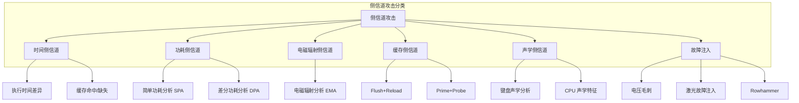

## 13.6 密码学攻击防御技巧

密码学的安全性依赖两个层面：**算法本身的数学安全性**和**实现与部署的工程安全性**。历史上绝大多数密码学安全事件并非源于算法被破解，而是源于实现缺陷、配置错误或协议设计漏洞。本节系统梳理密码学攻击的完整分类，为每类攻击提供原理分析、真实案例、检测方法和防御代码，帮助开发者构建纵深防御体系。

### 13.6.1 时序攻击（Timing Attack）

#### 攻击原理

时序攻击是最经典的侧信道攻击之一，由 Paul Kocher 于 1996 年提出。其核心思想是：**通过测量密码学操作的执行时间差异，推断出秘密信息**。

为什么会产生时间差异？以字符串比较为例：

```python
# Python 的 == 运算符使用短路求值
def unsafe_compare(a, b):
    if len(a) != len(b):
        return False
    for i in range(len(a)):
        if a[i] != b[i]:  # 第一个不匹配的字符处立即返回
            return False
    return True
```

假设攻击者需要猜测一个 HMAC 值。当猜测的第一个字节正确时，比较函数会多执行一次循环迭代（多花几纳秒）。通过统计大量请求的时间差异，攻击者可以逐字节恢复出正确的 HMAC 值。对于一个 32 字节的 HMAC，理论上只需 32 × 256 = 8192 次请求即可完全破解。

#### 真实案例

- **2003 年 · SSH 协议时序攻击**：Dawn Song 等人发现 OpenSSH 的包 MAC 验证存在时序差异，可以通过网络测量逐字节猜测 MAC 值。尽管网络噪声会增加测量难度，但通过统计方法（数万次请求）仍可有效利用。
- **2011 年 · ASP.NET 演示请求验证**：Nate Lawson 发现 ASP.NET 的 Forms Authentication 在比较 session token 时使用了普通的字符串比较，导致时序攻击者可以逐字节伪造有效 token，实现跨站请求伪造（CSRF）。
- **2016 年 · OpenSSL ECDSA 签名验证**：研究人员发现 OpenSSL 的 ECDSA 签名验证实现中存在缓存时序泄露，攻击者可以通过 Flush+Reload 攻击获取私钥信息。
- **2019 年 · T2 安全芯片**：Apple T2 芯片的密码验证存在时序侧信道，被用于提取设备密钥。

#### 恒定时间比较

防御时序攻击的核心原则是：**所有密码学比较操作必须使用恒定时间算法**，即执行时间不依赖于被比较数据的内容。

```python
import hmac
import secrets

# ======== 正确：使用 hmac.compare_digest ========
def secure_compare(a: bytes, b: bytes) -> bool:
    """恒定时间比较，时间复杂度 O(n)，不短路求值。"""
    return hmac.compare_digest(a, b)

# ======== 正确：手动实现恒定时间比较 ========
def constant_time_compare(a: bytes, b: bytes) -> bool:
    """
    手动实现恒定时间比较。
    即使长度不匹配，也要遍历完整的输入，避免长度信息泄露。
    """
    if len(a) != len(b):
        return False
    result = 0
    for x, y in zip(a, b):
        result |= x ^ y  # 逐字节异或，累积差异
    return result == 0

# ======== 错误示范：常见的不安全实现 ========
def unsafe_compare_v1(a, b):
    return a == b  # Python 的 == 会短路求值

def unsafe_compare_v2(a, b):
    if len(a) != len(b):  # 长度本身也泄露信息
        return False
    for i in range(len(a)):
        if a[i] != b[i]:
            return False  # 短路返回
    return True
```

其他语言的恒定时间比较：

```c
// C/C++：使用 CRYPTO_memcmp（OpenSSL）
#include <openssl/crypto.h>

int secure_compare_c(const void *a, const void *b, size_t len) {
    return CRYPTO_memcmp(a, b, len) == 0;
}

// 手动实现（避免编译器优化掉恒定时间逻辑）
int volatile_compare(const void *a, const void *b, size_t len) {
    const volatile unsigned char *x = a;
    const volatile unsigned char *y = b;
    volatile unsigned char result = 0;
    for (size_t i = 0; i < len; i++) {
        result |= x[i] ^ y[i];
    }
    return result;  // 0 = 匹配
}
```

```go
// Go：使用 crypto/subtle.ConstantTimeCompare
import "crypto/subtle"

func secureCompare(a, b []byte) bool {
    return subtle.ConstantTimeCompare(a, b) == 1
}
```

```java
// Java：使用 MessageDigest.isEqual
import java.security.MessageDigest;

boolean secureCompare(byte[] a, byte[] b) {
    return MessageDigest.isEqual(a, b);
}
```

#### 恒定时间编程原则

不仅仅是字符串比较——所有涉及秘密数据的分支和内存访问都必须保持恒定时间：

| 操作 | 不安全做法 | 恒定时间做法 |
|------|-----------|-------------|
| 条件分支 | `if (secret_bit) { ... }` | 用位运算替代分支，两者都执行 |
| 数组索引 | `table[secret_index]` | 使用恒定时间的表查找（bitsliced） |
| 循环次数 | `for (i=0; i<secret_n; i++)` | 总是执行最大迭代次数 |
| 短路求值 | `a == b` 逐字节比较 | 全量异或并累积 |
| 除法 | `secret / divisor` | 避免在秘密数据上做除法 |

#### 检测工具

- **dudect**（github.com/oreparaz/dudect）：基于统计 t 检测的恒定时间验证工具，对代码进行黑盒测量
- **ct-grind**（Valgrind 插件）：将秘密数据标记为"未初始化"，当秘密数据影响分支或内存访问时报告错误
- **timecop**（Go 库）：Go 语言的恒定时间比较审计工具
- **FlowTracker**：基于二进制分析的时序信息流追踪工具

### 13.6.2 填充预言攻击（Padding Oracle Attack）

#### 攻击原理

填充预言攻击是针对 CBC（Cipher Block Chaining）模式的最致命攻击之一，由 Vaudenay 于 2002 年提出。其核心思想是：**利用服务器对"填充错误"和"MAC 错误"的不同响应，逐字节解密密文**。

CBC 模式解密过程：

```text
明文 = Decrypt(密文块) XOR 前一个密文块（或IV）
```

PKCS#7 填充规则：如果最后一个块缺少 N 字节，就用 N 的值填充 N 个字节。例如缺少 3 字节就填充 `\x03\x03\x03`。

攻击流程：

```text
攻击者篡改前一个密文块的字节 → 影响当前块解密后的明文 →
如果修改后填充有效 → 服务器正常处理（或返回"MAC错误"）→
如果填充无效 → 服务器返回"填充错误"→
这种差异给了攻击者 1 bit 的信息 → 逐字节恢复明文
```

#### 真实案例

- **2006 年 · ASP.NET Padding Oracle**：ASP.NET 的自定义错误页面对填充错误和业务错误返回不同的 HTTP 状态码，使攻击者可以在数小时内解密任意 ViewState 数据（含服务器密钥）。
- **2014 年 · POODLE 攻击（CVE-2014-3566）**：利用 SSL 3.0 中 CBC 模式的填充验证缺陷，可以解密 HTTPS cookies。这直接导致所有主流浏览器禁用 SSL 3.0。
- **2016 年 · Lucky Thirteen（CVE-2013-0169 的后续研究）**：即使 TLS 实现使用了 MAC-then-Encrypt 模式，微秒级的时间差异仍然可以被利用进行填充预言攻击。OpenSSL 通过复杂的恒定时间代码修复了此漏洞。
- **2019 年 · Raccoon 攻击（CVE-2020-1968）**：TLS 1.2 中基于 DH 的密钥交换存在时序侧信道，可以恢复预主密钥。

#### 防御方案

**核心原则：使用认证加密（AEAD），彻底消除填充预言攻击的可能。**

```python
from cryptography.hazmat.primitives.ciphers.aead import AESGCM
import os

# ======== 正确：使用 AES-GCM 认证加密 ========
def encrypt_aes_gcm(key: bytes, plaintext: bytes, associated_data: bytes = b"") -> bytes:
    """
    AES-256-GCM 加密。
    GCM 是 AEAD 模式，同时提供加密和认证，无需填充。
    返回 nonce + ciphertext + tag。
    """
    aesgcm = AESGCM(key)
    nonce = os.urandom(12)  # GCM 推荐 96 位 nonce
    ct = aesgcm.encrypt(nonce, plaintext, associated_data)
    return nonce + ct  # ct 已包含 tag

def decrypt_aes_gcm(key: bytes, data: bytes, associated_data: bytes = b"") -> bytes:
    """解密并验证完整性。如果篡改密文，直接抛出 InvalidTag 异常。"""
    aesgcm = AESGCM(key)
    nonce = data[:12]
    ct = data[12:]
    return aesgcm.decrypt(nonce, ct, associated_data)


# ======== 错误：使用 CBC 模式（容易受到填充预言攻击）=====
from cryptography.hazmat.primitives.ciphers import Cipher, algorithms, modes
from cryptography.hazmat.primitives import padding

def encrypt_aes_cbc_unsafe(key: bytes, plaintext: bytes) -> bytes:
    """CBC 模式加密——仅作对比，不推荐使用。"""
    iv = os.urandom(16)
    padder = padding.PKCS7(128).padder()
    padded = padder.update(plaintext) + padder.finalize()
    cipher = Cipher(algorithms.AES(key), modes.CBC(iv))
    encryptor = cipher.encryptor()
    ct = encryptor.update(padded) + encryptor.finalize()
    return iv + ct
```

**如果必须使用 CBC 模式（如遗留系统），采用 Encrypt-then-MAC：**

```python
import hmac
import hashlib

def encrypt_then_mac(key_enc: bytes, key_mac: bytes, plaintext: bytes) -> bytes:
    """
    Encrypt-then-MAC：先加密，再对密文计算 MAC。
    即使使用 CBC 模式，MAC 验证失败时直接拒绝，不会泄露填充信息。
    """
    iv = os.urandom(16)
    padder = padding.PKCS7(128).padder()
    padded = padder.update(plaintext) + padder.finalize()
    cipher = Cipher(algorithms.AES(key_enc), modes.CBC(iv))
    encryptor = cipher.encryptor()
    ct = encryptor.update(padded) + encryptor.finalize()

    # 对 IV + 密文计算 HMAC（不包含明文）
    mac = hmac.new(key_mac, iv + ct, hashlib.sha256).digest()
    return iv + ct + mac

def decrypt_then_verify(key_enc: bytes, key_mac: bytes, data: bytes) -> bytes:
    """先验证 MAC，再解密。MAC 不通过直接拒绝，不泄露任何填充信息。"""
    iv = data[:16]
    mac_received = data[-32:]
    ct = data[16:-32]

    # 先验证 MAC（恒定时间比较）
    mac_expected = hmac.new(key_mac, iv + ct, hashlib.sha256).digest()
    if not hmac.compare_digest(mac_received, mac_expected):
        raise ValueError("完整性验证失败")  # 统一错误信息

    # MAC 验证通过后才解密
    cipher = Cipher(algorithms.AES(key_enc), modes.CBC(iv))
    decryptor = cipher.decryptor()
    padded = decryptor.update(ct) + decryptor.finalize()
    unpadder = padding.PKCS7(128).unpadder()
    return unpadder.update(padded) + unpadder.finalize()
```

**统一错误处理（防止信息泄露）：**

```python
# 统一的错误处理：不在错误消息中区分"填充错误"和"MAC 错误"
class CryptoError(Exception):
    """通用密码学错误——不向调用者泄露具体原因。"""
    pass

def safe_decrypt(key: bytes, ciphertext: bytes) -> bytes:
    try:
        return decrypt_aes_gcm(key, ciphertext)
    except Exception:
        # 所有错误统一为同一个异常类型
        raise CryptoError("解密失败")
```

### 13.6.3 侧信道攻击（Side-Channel Attack）

#### 攻击分类全景

侧信道攻击不直接破解密码算法的数学结构，而是通过观察物理或计算过程中的"副效应"来获取秘密信息。



#### 功耗分析攻击与防御

**攻击原理**：CMOS 芯片的功耗与处理的数据相关（汉明权重）。通过测量加密芯片的功耗曲线，可以推断出正在处理的密钥位。

- **SPA（Simple Power Analysis）**：直接观察单条功耗曲线，识别操作类型（如 RSA 的模幂运算中，平方和乘法操作的功耗模式不同）
- **DPA（Differential Power Analysis）**：收集大量功耗曲线，通过统计方法（相关性分析）提取密钥信息，即使信号被噪声淹没也能工作

**防御方法：掩码技术（Masking）**

掩码技术的核心思想是：在密码学运算中引入随机掩码，使中间值与秘密数据无关。

```python
import os

def masked_xor(a: bytes, mask: bytes) -> bytes:
    """使用掩码保护异或操作。"""
    # 将 a 与随机掩码异或，得到"掩码值"
    # 后续所有运算都在"掩码值"上进行
    return bytes(x ^ m for x, m in zip(a, mask))

def unmask(masked_result: bytes, mask: bytes) -> bytes:
    """在最终输出时移除掩码。"""
    return bytes(x ^ m for x, m in zip(masked_result, mask))

# 掩码 SBox 查询示例（AES 的核心操作）
def create_masked_sbox(sbox: list, mask_in: int, mask_out: int) -> list:
    """
    创建掩码化的 AES SBox。
    输入掩码 mask_in 和输出掩码 mask_out 使得：
    masked_sbox[masked_input] = masked_output
    这样在查表过程中不会暴露真实的中间值。
    """
    masked_sbox = [0] * 256
    for i in range(256):
        real_input = i ^ mask_in
        real_output = sbox[real_input]
        masked_sbox[i] = real_output ^ mask_out
    return masked_sbox
```

#### 缓存侧信道攻击与防御

**攻击原理**：现代 CPU 的缓存（L1/L2/L3）是共享的。攻击者可以通过测量缓存访问时间，推断出其他进程访问了哪些缓存行，进而推断出加密算法的操作序列和密钥。

**攻击方式**：

| 攻击名称 | 原理 | 目标 |
|---------|------|------|
| **Flush+Reload** | 先 flush 共享内存行，再测量 reload 时间 | 共享库（如 libcrypto）中的 T-table |
| **Prime+Probe** | 先用数据填充缓存集，再测量被替换后的时间 | 非共享内存 |
| **Evict+Time** | 驱逐特定缓存行，测量加密时间变化 | 具体的 AES SBox 查表 |
| **Spectre** | 利用推测执行和分支预测 | 几乎所有 CPU |
| **Meltdown** | 利用乱序执行的窗口期 | Intel CPU 内核内存 |

**AES T-table 缓存攻击**：传统的 AES 实现使用预计算的 T-table（4KB × 4），SBox 查表操作会导致缓存行的访问模式泄露密钥信息。攻击者通过 Flush+Reload 可以在一次 AES 加密后恢复完整密钥。

**防御方案**：

```c
// 方案一：使用 AES-NI 硬件指令（最佳方案）
// AES-NI 在硬件层面实现 AES，完全避免软件查表，无缓存泄露
#include <wmmintrin.h>

__m128i aes_encrypt_block(__m128i block, __m128i round_key) {
    return _mm_aesenc_si128(block, round_key);
}

// 方案二：Bitsliced 实现（无查表，完全用位运算）
// 将 8 个 AES 块并行处理，用布尔逻辑替代 SBox 查表
// 优点：恒定时间，抗缓存攻击
// 缺点：实现复杂，单块加密时效率较低

// 方案三：VPROLD 指令（Intel Ice Lake+）
// 使用向量旋转指令实现恒定时间的 SBox
```

```python
# 方案四：使用恒定时间的 AES 实现（Python 中的概念演示）
# 实际生产中应使用 C/Rust 实现并编译为原生代码

# 在 Python 中可以使用 cryptography 库的 OpenSSL 后端
# OpenSSL 1.1.1+ 会自动选择 AES-NI 或恒定时间软件实现
from cryptography.hazmat.primitives.ciphers import Cipher, algorithms, modes
import os

def aes_encrypt_safe(key: bytes, plaintext: bytes) -> bytes:
    """
    使用 AES-CTR 模式（无填充，恒定时间）。
    注意：CTR 模式本身不提供认证，需配合 MAC 使用。
    """
    nonce = os.urandom(16)
    cipher = Cipher(algorithms.AES(key), modes.CTR(nonce))
    encryptor = cipher.encryptor()
    ct = encryptor.update(plaintext) + encryptor.finalize()
    return nonce + ct
```

#### 故障注入攻击（Fault Injection）

**攻击原理**：通过物理手段（电压毛刺、激光、电磁脉冲）在加密运算过程中引入故障，使计算产生错误结果。通过分析正确结果与错误结果的差异，可以恢复密钥。

**典型案例**：

- **Bellcore 攻击（1997）**：对 RSA-CRT 签名注入单次故障，通过分析错误签名恢复私钥因子 p 和 q。攻击者只需签名时注入一次故障即可完全破解 RSA。
- **Differential Fault Analysis（DFA）**：对 AES 的最后一轮注入故障，通过比较正确密文和错误密文，只需约 2-3 个错误密文即可恢复完整密钥。
- **2017 年 · 任天堂 Switch**：NVIDIA Tegra X1 芯片存在 RCM（Recovery Mode）漏洞，通过 USB 故障注入绕过签名验证，实现自定义代码运行。

**防御措施**：

```text
1. 双重计算验证：执行加密运算两次，比较结果是否一致
2. 随机化执行顺序：打乱计算步骤，增加故障注入的难度
3. 冗余校验：在关键步骤添加 CRC 或哈希校验
4. 硬件防护：电压/温度/光照传感器，检测异常环境
5. 看门狗定时器：监测异常执行时间
```

### 13.6.4 重放攻击防御

#### 攻击原理

重放攻击（Replay Attack）指攻击者截获合法的加密消息并重新发送，使接收方误以为是新的合法请求。

**典型场景**：

```text
1. 用户发送加密的转账请求："转账100元给A"
2. 攻击者截获并保存此请求
3. 攻击者将同一请求重新发送给服务器
4. 服务器无法区分原始请求和重放请求，重复执行转账
```

#### 防御方案

**方案一：Nonce（Number Used Once）**

```python
import os
import time
import struct
from collections import OrderedDict

class NonceManager:
    """
    基于 Nonce 的重放攻击防御。
    维护一个已使用 Nonce 的缓存，拒绝重复的 Nonce。
    """
    def __init__(self, max_cache_size: int = 10000, ttl: int = 300):
        self.used_nonces: OrderedDict[str, float] = OrderedDict()
        self.max_cache_size = max_cache_size
        self.ttl = ttl  # Nonce 有效期（秒）

    def generate_nonce(self) -> bytes:
        """生成 128 位随机 Nonce。"""
        return os.urandom(16)

    def check_and_record(self, nonce: bytes) -> bool:
        """
        检查 Nonce 是否已被使用。
        返回 True 表示是新 Nonce（合法），False 表示是重放。
        """
        self._cleanup_expired()
        nonce_hex = nonce.hex()
        if nonce_hex in self.used_nonces:
            return False  # 重放攻击！
        self.used_nonces[nonce_hex] = time.time()
        # 如果缓存满了，移除最老的条目
        if len(self.used_nonces) > self.max_cache_size:
            self.used_nonces.popitem(last=False)
        return True

    def _cleanup_expired(self):
        """清理过期的 Nonce 条目。"""
        now = time.time()
        while self.used_nonces:
            nonce_hex, timestamp = next(iter(self.used_nonces.items()))
            if now - timestamp > self.ttl:
                self.used_nonces.popitem(last=False)
            else:
                break  # 有序字典，后续条目更新，不用继续
```

**方案二：时间戳 + 滑动窗口**

```python
def verify_timestamp(timestamp: int, tolerance_seconds: int = 300) -> bool:
    """
    验证请求时间戳在允许的误差范围内。
    防止攻击者使用过期的请求进行重放。
    """
    current_time = int(time.time())
    return abs(current_time - timestamp) <= tolerance_seconds

# 结合使用：时间戳 + Nonce + HMAC
def create_signed_request(
    key: bytes,
    payload: bytes,
    nonce_manager: NonceManager
) -> dict:
    """创建带防重放保护的签名请求。"""
    import hmac as hmac_module
    import hashlib

    timestamp = int(time.time())
    nonce = nonce_manager.generate_nonce()

    # 签名覆盖 payload + timestamp + nonce
    message = payload + struct.pack(">Q", timestamp) + nonce
    signature = hmac_module.new(key, message, hashlib.sha256).digest()

    return {
        "payload": payload.hex(),
        "timestamp": timestamp,
        "nonce": nonce.hex(),
        "signature": signature.hex(),
    }

def verify_signed_request(
    key: bytes,
    request: dict,
    nonce_manager: NonceManager,
    tolerance: int = 300
) -> bytes:
    """验证签名请求，包含防重放检查。"""
    import hmac as hmac_module
    import hashlib

    payload = bytes.fromhex(request["payload"])
    timestamp = request["timestamp"]
    nonce = bytes.fromhex(request["nonce"])
    signature = bytes.fromhex(request["signature"])

    # 1. 检查时间戳
    if not verify_timestamp(timestamp, tolerance):
        raise ValueError("请求已过期")

    # 2. 检查 Nonce（防重放）
    if not nonce_manager.check_and_record(nonce):
        raise ValueError("重放攻击检测")

    # 3. 验证签名
    message = payload + struct.pack(">Q", timestamp) + nonce
    expected_sig = hmac_module.new(key, message, hashlib.sha256).digest()
    if not hmac_module.compare_digest(signature, expected_sig):
        raise ValueError("签名验证失败")

    return payload
```

**方案三：序列号机制（适用于状态化协议）**

```python
class SequenceTracker:
    """
    基于序列号的防重放机制。
    适用于通信双方维护状态的协议（如 TLS、IPSec）。
    """
    def __init__(self, window_size: int = 64):
        self.window_size = window_size
        self.highest_seq = -1
        self.received_bitmap = 0  # 位图，跟踪窗口内的序列号

    def check_sequence(self, seq: int) -> bool:
        """
        检查序列号是否有效（不重复且在窗口内）。
        返回 True 表示接受，False 表示拒绝。
        """
        if seq > self.highest_seq:
            # 新的最高序列号，滑动窗口
            shift = seq - self.highest_seq
            if shift < self.window_size:
                self.received_bitmap <<= shift
            else:
                self.received_bitmap = 0
            self.received_bitmap |= 1
            self.highest_seq = seq
            return True
        else:
            # 在窗口内检查是否重复
            offset = self.highest_seq - seq
            if offset >= self.window_size:
                return False  # 超出窗口，太老了
            mask = 1 << offset
            if self.received_bitmap & mask:
                return False  # 已接收过
            self.received_bitmap |= mask
            return True
```

### 13.6.5 密钥恢复攻击与防御

#### 常见密钥恢复攻击向量

| 攻击类型 | 原理 | 典型案例 |
|---------|------|---------|
| **弱密钥生成** | 使用可预测的随机数生成器 | 2012 年 Android SecureRandom 漏洞，比特币钱包因 PRNG 种子不足被窃取 |
| **密钥重用** | 相同密钥用于不同上下文 | 2020 年 Twitter 事件：内部工具 session key 被复用 |
| **Nonce 重用** | 同一密钥+Nonce 对加密两条消息 | 2019 年 PlayStation 3 ECDSA 签名 nonce 重用导致私钥泄露 |
| **侧信道泄露** | 通过物理/缓存/时序泄露 | 见上文各节 |
| **熵不足** | 系统启动时熵池为空 | 嵌入式 Linux 设备首次启动时生成的 SSH 密钥可能重复 |

#### 安全密钥生成

```python
import os
import secrets

# ======== 正确：使用操作系统的 CSPRNG ========
def generate_key(length_bytes: int = 32) -> bytes:
    """使用操作系统的密码学安全随机数生成器。"""
    return os.urandom(length_bytes)

# Python 的 secrets 模块也是 CSPRNG（底层调用 os.urandom）
def generate_token(length: int = 32) -> str:
    """生成 URL 安全的随机 token。"""
    return secrets.token_urlsafe(length)

# ======== 错误示范 ========
import random
import time

def generate_key_unsafe_v1() -> bytes:
    """致命错误：使用 Mersenne Twister（非 CSPRNG）。"""
    return bytes([random.randint(0, 255) for _ in range(32)])

def generate_key_unsafe_v2() -> bytes:
    """致命错误：使用时间戳作为种子。"""
    random.seed(int(time.time()))
    return bytes([random.randint(0, 255) for _ in range(32)])
```

#### Nonce 重用防御（AES-GCM 特别重要）

```python
import struct
import os

class GCMNonceManager:
    """
    AES-GCM Nonce 管理。
    GCM 使用 96 位 nonce，nonce 重用会导致灾难性后果：
    两条使用相同 (key, nonce) 的密文异或等于两条明文异或，
    攻击者可以完全恢复明文。

    策略一：随机 nonce（推荐用于短期密钥）
    策略二：计数器 nonce（推荐用于长期密钥/高频加密）
    """
    def __init__(self):
        self.counter = 0

    def random_nonce(self) -> bytes:
        """随机 nonce：碰撞概率在 2^32 次加密后不可忽略。"""
        return os.urandom(12)

    def counter_nonce(self, session_id: bytes) -> bytes:
        """
        计数器 nonce：保证不重复，但需要持久化计数器状态。
        前 4 字节为 session_id（防多实例冲突），后 8 字节为计数器。
        """
        self.counter += 1
        return session_id[:4] + struct.pack(">Q", self.counter)

    @staticmethod
    def calculate_collision_probability(num_encryptions: int, nonce_bits: int = 96) -> float:
        """
        使用生日攻击计算 nonce 碰撞概率。
        当碰撞概率超过 2^-32 时，应考虑更换密钥或使用计数器 nonce。
        """
        import math
        n = num_encryptions
        space = 2 ** nonce_bits
        # P(至少一次碰撞) ≈ 1 - e^(-n² / (2 × space))
        exponent = -(n ** 2) / (2 * space)
        return 1 - math.exp(exponent)
```

### 13.6.6 协议级攻击防御

#### 降级攻击防御

降级攻击（Downgrade Attack）迫使通信双方使用较弱的协议版本或密码套件。

```python
# TLS 配置示例（使用 Python ssl 模块）
import ssl

def create_secure_tls_context() -> ssl.SSLContext:
    """
    创建安全的 TLS 上下文。
    防止降级攻击、禁用弱密码套件。
    """
    ctx = ssl.SSLContext(ssl.PROTOCOL_TLS_CLIENT)

    # 最低 TLS 版本：1.2（禁用 SSL 3.0、TLS 1.0、TLS 1.1）
    ctx.minimum_version = ssl.TLSVersion.TLSv1_2

    # 推荐使用 TLS 1.3
    ctx.maximum_version = ssl.TLSVersion.TLSv1_3

    # TLS 1.3 的密码套件由协议自动选择，无法手动配置
    # TLS 1.2 的推荐密码套件（仅保留 AEAD 模式）
    ctx.set_ciphers(
        "ECDHE+AESGCM:"
        "ECDHE+CHACHA20:"
        "DHE+AESGCM:"
        "DHE+CHACHA20"
    )

    # 禁用压缩（防止 CRIME 攻击）
    ctx.options |= ssl.OP_NO_COMPRESSION

    # 启用证书验证
    ctx.check_hostname = True
    ctx.verify_mode = ssl.CERT_REQUIRED
    ctx.load_default_certs()

    return ctx
```

#### 常见协议级攻击防御清单

| 攻击名称 | 攻击目标 | 防御措施 |
|---------|---------|---------|
| **BEAST** (2011) | TLS 1.0 CBC | 升级到 TLS 1.2+，使用 AEAD 套件 |
| **CRIME** (2012) | TLS 压缩 | 禁用 TLS 压缩 `OP_NO_COMPRESSION` |
| **BREACH** (2013) | HTTP 压缩 | 禁用 HTTP 压缩或使用 CSRF token + 长度隐藏 |
| **Heartbleed** (2014) | OpenSSL 内存读取 | 升级 OpenSSL，重新生成密钥和证书 |
| **FREAK** (2015) | RSA Export 降级 | 禁用 export 密码套件 |
| **Logjam** (2015) | DH 降级 | 使用 ECDHE，DH 参数 >= 2048 位 |
| **DROWN** (2016) | SSLv2 导出 RSA | 完全禁用 SSLv2 |
| **ROBOT** (2017) | RSA PKCS#1v1.5 | 使用 RSA-OAEP 或切换到 ECDHE |
| **Raccoon** (2020) | DH 时序 | 使用 ECDHE 替代 DHE |

### 13.6.7 随机数生成安全

随机数质量是密码学安全的根基。几乎所有密码学操作（密钥生成、nonce、IV、盐值）都依赖高质量的随机数。

#### CSPRNG 选择指南

```python
# ======== Python CSPRNG 对比 ========

import os
import secrets
import hashlib

# 1. os.urandom() —— 直接调用操作系统的 CSPRNG（推荐）
#    Linux: /dev/urandom（基于 ChaCha20 PRNG）
#    Windows: CryptGenRandom / BCryptGenRandom
#    macOS: /dev/urandom (基于 Yarrow)
random_bytes = os.urandom(32)

# 2. secrets 模块 —— 封装了 os.urandom，提供高级接口
#    适合生成 token、密码、盐值等
token = secrets.token_hex(32)       # 64 字符十六进制
token = secrets.token_urlsafe(32)   # URL 安全 Base64
token = secrets.token_bytes(32)     # 原始字节

# 3. random.SystemRandom —— 基于 os.urandom 的高级随机类
#    提供与 random 模块相同的接口但使用 CSPRNG
sys_random = random.SystemRandom()
random_int = sys_random.randint(0, 2**256)

# ======== 绝对不要使用 ========
import random  # Mersenne Twister PRNG，非密码学安全
# random.randint() / random.choice() / random.random()
# 均可被预测，仅适用于模拟和游戏
```

#### 检测弱随机数

```python
def test_random_quality(data: bytes, name: str = "random") -> dict:
    """
    简单的随机数质量测试（生产环境应使用 NIST STS 或 Dieharder）。
    """
    results = {}

    # 1. 频率测试（Monobit）：0 和 1 的比例应接近 50:50
    bits = bin(int.from_bytes(data, 'big'))[2:].zfill(len(data) * 8)
    ones_ratio = bits.count('1') / len(bits)
    results['ones_ratio'] = ones_ratio
    results['frequency_test'] = abs(ones_ratio - 0.5) < 0.01

    # 2. 熵估算
    from collections import Counter
    byte_counts = Counter(data)
    entropy = -sum(
        (c / len(data)) * __import__('math').log2(c / len(data))
        for c in byte_counts.values()
    )
    results['entropy'] = entropy
    results['entropy_test'] = entropy > 7.5  # 理想值为 8.0

    # 3. 序列相关性
    if len(data) > 1:
        correlation = sum(
            data[i] == data[i+1] for i in range(len(data) - 1)
        ) / (len(data) - 1)
        results['sequential_correlation'] = correlation
        results['correlation_test'] = abs(correlation - 1/256) < 0.05

    return results
```

### 13.6.8 密码存储安全防御

密码存储是最常见的密码学应用场景，也是漏洞重灾区。

#### 密码哈希方案对比

| 算法 | 类型 | 抗 GPU/ASIC | 内存硬性 | 推荐场景 |
|------|------|------------|---------|---------|
| **Argon2id** | KDF | 优秀 | 是 | 新系统首选（2015 年密码哈希竞赛冠军） |
| **scrypt** | KDF | 良好 | 是 | 备选方案，Node.js/Go 生态支持好 |
| **bcrypt** | KDF | 一般 | 否 | 现有系统，兼容性好 |
| **PBKDF2** | KDF | 差 | 否 | 合规要求（NIST/FIPS），不推荐新系统 |
| **SHA-256** | 哈希 | 极差 | 否 | 绝不用于密码存储 |
| **MD5** | 哈希 | 极差 | 否 | 绝不用于密码存储 |

```python
# ======== 推荐：Argon2id ========
# pip install argon2-cffi
from argon2 import PasswordHasher
from argon2.exceptions import VerifyMismatchError

ph = PasswordHasher(
    time_cost=3,        # 迭代次数
    memory_cost=65536,  # 内存使用 64MB
    parallelism=4,      # 并行线程数
    hash_len=32,        # 输出长度
    salt_len=16,        # 盐长度
)

# 哈希密码
password_hash = ph.hash("user_password_123")
# 输出格式：$argon2id$v=19$m=65536,t=3,p=4$<salt>$<hash>

# 验证密码
def verify_password(stored_hash: str, password: str) -> bool:
    try:
        return ph.verify(stored_hash, password)
    except VerifyMismatchError:
        return False

# 检查是否需要重新哈希（参数升级后）
def needs_rehash(stored_hash: str) -> bool:
    return ph.check_needs_rehash(stored_hash)

# ======== 备选：bcrypt ========
import bcrypt

def hash_password_bcrypt(password: str) -> bytes:
    salt = bcrypt.gensalt(rounds=12)  # 2^12 = 4096 轮
    return bcrypt.hashpw(password.encode(), salt)

def verify_password_bcrypt(stored_hash: bytes, password: str) -> bool:
    return bcrypt.checkpw(password.encode(), stored_hash)

# ======== 绝对错误 ========
import hashlib

def hash_password_unsafe(password: str) -> str:
    """致命错误：无盐、无拉伸、使用快速哈希。"""
    return hashlib.sha256(password.encode()).hexdigest()
```

### 13.6.9 常见密码学实现错误速查表

| 错误 | 后果 | 正确做法 |
|------|------|---------|
| 使用 ECB 模式 | 相同明文块产生相同密文块，泄露模式 | 使用 CBC、CTR 或 GCM 模式 |
| 固定 IV/Nonce | 第一块明文泄露 | 每次加密使用随机 IV/Nonce |
| 自己设计加密算法 | 安全性不可证明 | 使用标准算法（AES、ChaCha20） |
| MD5/SHA-1 用于安全用途 | 碰撞攻击可在秒级完成 | 使用 SHA-256/SHA-3 |
| RSA 无填充加密 | 确定性加密，泄露信息 | 使用 RSA-OAEP |
| 密钥硬编码在代码中 | 泄露到版本控制/日志 | 使用环境变量或 KMS |
| Base64 当加密使用 | 任何人可逆 | 区分编码和加密 |
| 忽略证书验证 | 中间人攻击 | 始终验证证书链和主机名 |
| 使用相同密钥做多件事 | 密钥复用导致交叉攻击 | 密钥派生，每个用途独立密钥 |
| 日志中记录明文密码 | 日志泄露即密码泄露 | 只记录哈希值或脱敏后信息 |

### 13.6.10 密码学防御检查清单

在代码审查或安全评估中，逐项检查以下内容：

```text
[ ] 密码学操作
    [ ] 使用标准算法，无自定义加密
    [ ] 使用 AEAD 模式（AES-GCM / ChaCha20-Poly1305）
    [ ] IV/Nonce 每次加密唯一
    [ ] 密钥长度 >= 128 位（推荐 256 位）

[ ] 时序安全
    [ ] 所有密码学比较使用恒定时间函数
    [ ] 无基于秘密数据的条件分支
    [ ] 无基于秘密数据的数组索引

[ ] 密码存储
    [ ] 使用 Argon2id / scrypt / bcrypt
    [ ] 每个密码有唯一随机盐
    [ ] 拉伸参数足够高（Argon2 memory >= 64MB）

[ ] 密钥管理
    [ ] 使用 CSPRNG 生成密钥
    [ ] 密钥不在代码/日志/版本控制中
    [ ] 定期轮换密钥
    [ ] 每个用途独立密钥

[ ] 协议安全
    [ ] TLS >= 1.2，推荐 1.3
    [ ] 禁用 SSL 3.0 / TLS 1.0 / TLS 1.1
    [ ] 禁用弱密码套件（RC4、DES、3DES、NULL）
    [ ] 启用证书验证
    [ ] 禁用压缩

[ ] 防重放
    [ ] 每条消息包含唯一 Nonce/序列号
    [ ] 服务端维护已使用 Nonce 的缓存
    [ ] 请求包含时间戳，过期请求被拒绝
```

---

> **关键原则总结**：密码学攻击防御的核心不是"选择更强的算法"，而是"正确使用现有算法"。NIST、OWASP 和学术界反复证明：**实现缺陷**和**配置错误**是密码学安全事件的首要原因。遵循标准、使用经过审计的库、进行恒定时间编程、保持防御纵深——这才是密码学安全的真正基石。
