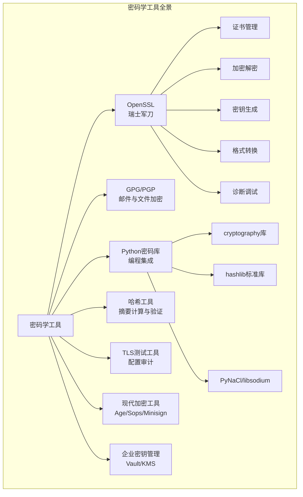
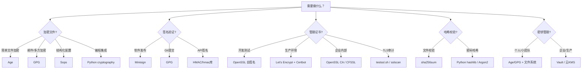

## 13.7 密码学工具使用技巧

密码学理论的价值最终通过工具落地。本节系统讲解安全从业者日常使用的密码学工具链，从最基础的 OpenSSL 命令行，到 Python 密码学库，再到 TLS 测试工具和密钥管理系统。每个工具不仅列出"怎么用"，更重要的是解释"为什么这样用"以及"容易踩什么坑"。



### 13.7.1 OpenSSL：密码学的瑞士军刀

OpenSSL 是使用最广泛的密码学工具库，几乎所有涉及 TLS/SSL、证书、密钥的操作都离不开它。理解 OpenSSL 不仅是掌握一个工具，更是理解整个公钥基础设施（PKI）运作方式的最佳入口。

#### 证书与密钥管理

**生成私钥**

私钥是整个公钥体系的安全根基。生成私钥时必须选择足够的密钥长度，并正确保护私钥文件。

```bash
# 生成 RSA 私钥（4096位，推荐最低标准）
# -aes256 选项会用 AES-256-CBC 加密私钥文件，每次访问需要输入密码
openssl genrsa -aes256 -out private.key 4096

# 生成不加密的私钥（仅用于自动化场景，如 CI/CD 流水线）
openssl genrsa -out private_noenc.key 4096

# 生成椭圆曲线私钥（推荐用于新项目，密钥更短、性能更好）
# prime256v1 等同于 NIST P-256，secp384r1 等同于 NIST P-384
openssl ecparam -genkey -name prime256v1 -out ec_private.key

# 生成 Ed25519 私钥（最现代的选择，TLS 1.3 推荐）
openssl genpkey -algorithm Ed25519 -out ed25519_private.key

# 查看私钥信息（验证算法、密钥长度等）
openssl rsa -in private.key -text -noout
openssl ec -in ec_private.key -text -noout
```

> **安全提示**：生产环境中的私钥文件权限应设为 `600`（仅所有者可读写）。使用 `chmod 600 private.key` 确保这一点。私钥泄露等同于整个加密体系崩溃。

**生成证书签名请求（CSR）**

CSR 是向证书颁发机构（CA）申请证书时提交的文件，包含公钥和身份信息。CSR 的质量直接影响证书的可用性。

```bash
# 交互式生成 CSR（会提示输入国家、组织、域名等信息）
openssl req -new -key private.key -out request.csr

# 非交互式生成（适合自动化脚本，通过 -subj 传入所有字段）
openssl req -new -key private.key -out request.csr \
    -subj "/C=CN/ST=Beijing/L=Beijing/O=MyCompany/OU=IT/CN=example.com"

# 使用配置文件生成（推荐用于复杂场景，支持 SAN 扩展）
# 配置文件 req.conf 内容见下方
openssl req -new -key private.key -out request.csr -config req.conf

# 验证 CSR 内容
openssl req -in request.csr -text -noout
```

**CSR 配置文件模板（req.conf）**——包含 SAN（主体备用名称）扩展，现代浏览器要求所有证书都必须包含 SAN：

```ini
[req]
default_bits       = 4096
default_md         = sha256
prompt             = no
encrypt_key        = yes
distinguished_name = dn
req_extensions     = v3_req

[dn]
C  = CN
ST = Beijing
L  = Beijing
O  = MyCompany
OU = IT
CN = example.com

[v3_req]
subjectAltName = @alt_names

[alt_names]
DNS.1 = example.com
DNS.2 = www.example.com
DNS.3 = api.example.com
IP.1  = 192.168.1.100
```

**生成自签名证书**

自签名证书不经过 CA 签发，适用于开发测试环境、内部服务或 mTLS 中的自建 CA。

```bash
# 一步生成自签名证书（RSA，有效期10年）
openssl req -x509 -newkey rsa:4096 -keyout key.pem -out cert.pem \
    -days 3650 -nodes \
    -subj "/CN=localhost"

# 一步生成 EC 自签名证书
openssl req -x509 -newkey ec -pkeyopt ec_paramgen_curve:prime256v1 \
    -keyout ec_key.pem -out ec_cert.pem -days 3650 -nodes

# 两步法：先生成 CSR，再自签名（更灵活，可添加扩展）
openssl req -new -key private.key -out request.csr -config req.conf
openssl x509 -req -in request.csr -signkey private.key -out cert.pem \
    -days 3650 -extensions v3_req -extfile req.conf
```

**构建证书链**

```bash
# 创建自己的 CA 根证书
openssl req -x509 -newkey rsa:4096 -keyout ca_key.pem -out ca_cert.pem \
    -days 7300 -nodes -subj "/CN=My Root CA"

# 用 CA 签发服务器证书
openssl x509 -req -in request.csr -CA ca_cert.pem -CAkey ca_key.pem \
    -CAcreateserial -out server_cert.pem -days 365 \
    -extensions v3_req -extfile req.conf

# 验证证书链完整性
openssl verify -CAfile ca_cert.pem server_cert.pem

# 查看证书详细信息（有效期、颁发者、SAN等）
openssl x509 -in server_cert.pem -text -noout

# 仅查看证书有效期
openssl x509 -in server_cert.pem -noout -dates

# 仅查看证书的 SAN 扩展
openssl x509 -in server_cert.pem -noout -ext subjectAltName
```

#### 对称加密与解密

OpenSSL 的 `enc` 命令提供文件级对称加密，适用于快速加密敏感文件。

```bash
# AES-256-CBC 加密（带盐值，推荐）
# -salt 防止相同明文产生相同密文
# -pbkdf2 使用 PBKDF2 派生密钥（OpenSSL 1.1.1+ 推荐）
openssl enc -aes-256-cbc -salt -pbkdf2 -iter 100000 \
    -in plaintext.txt -out encrypted.bin

# 对应解密
openssl enc -aes-256-cbc -d -pbkdf2 -iter 100000 \
    -in encrypted.bin -out decrypted.txt

# AES-256-GCM 认证加密（同时提供机密性和完整性）
# 注意：GCM 模式的 OpenSSL 命令行支持在 3.0+ 版本中更完善
openssl enc -aes-256-gcm -salt -pbkdf2 -iter 100000 \
    -in plaintext.txt -out encrypted.bin

# ChaCha20-Poly1305 加密（高性能，适合无 AES-NI 的设备）
openssl enc -chacha20-poly1305 -pbkdf2 -iter 100000 \
    -in plaintext.txt -out encrypted.bin
```

> **常见陷阱**：
> 1. 不指定 `-pbkdf2` 时，OpenSSL 使用旧式密钥派生方法，安全性显著降低
> 2. 不指定 `-salt` 时，相同密码+相同明文产生相同密文，泄露模式信息
> 3. CBC 模式没有完整性保护，优先使用 GCM 或 ChaCha20-Poly1305
> 4. `-iter` 参数控制 PBKDF2 迭代次数，数值越大越安全但越慢，100000 是合理起点

#### 非对称加密

```bash
# RSA 加密小数据（受密钥长度限制，通常用于加密对称密钥）
# 提取公钥
openssl rsa -in private.key -pubout -out public.pem

# 用公钥加密
openssl pkeyutl -encrypt -pubin -inkey public.pem \
    -in plaintext.txt -out encrypted.bin

# 用私钥解密
openssl pkeyutl -decrypt -inkey private.key \
    -in encrypted.bin -out decrypted.txt

# 注意：openssl rsautl 已在 OpenSSL 3.0 中弃用，使用 pkeyutl 替代
```

#### TLS 连接诊断

`openssl s_client` 是诊断 TLS 问题的第一线工具，可以模拟 TLS 客户端连接到服务器。

```bash
# 基本连接测试
openssl s_client -connect example.com:443

# 指定 TLS 版本（测试服务器对旧版本的支持）
openssl s_client -connect example.com:443 -tls1_2
openssl s_client -connect example.com:443 -tls1_3

# 查看服务器证书链
openssl s_client -connect example.com:443 -showcerts

# 验证服务器证书
openssl s_client -connect example.com:443 -CAfile /etc/ssl/certs/ca-certificates.crt

# 发送 STARTTLS 命令（测试邮件服务器等支持 STARTTLS 的服务）
openssl s_client -connect mail.example.com:587 -starttls smtp

# 测试特定密码套件
openssl s_client -connect example.com:443 -cipher 'ECDHE-RSA-AES256-GCM-SHA384'

# 查看服务器支持的密码套件（需要服务器支持）
openssl s_client -connect example.com:443 -cipher 'ALL:COMPLEMENTOFALL'

# SNI 支持（虚拟主机场景必须指定）
openssl s_client -connect example.com:443 -servername example.com
```

#### PKCS 格式转换

不同系统和应用对密钥/证书的格式要求不同，掌握格式转换是系统集成的基本功。

```bash
# PEM → DER（文本格式 → 二进制格式）
openssl x509 -in cert.pem -outform DER -out cert.der

# DER → PEM
openssl x509 -in cert.der -inform DER -outform PEM -out cert.pem

# PEM 证书+私钥 → PKCS#12（.pfx/.p12，Windows/IIS 常用）
openssl pkcs12 -export -out cert.p12 \
    -inkey private.key -in cert.pem -certfile ca_cert.pem

# PKCS#12 → PEM（提取证书和私钥）
openssl pkcs12 -in cert.p12 -out extracted.pem -nodes

# PEM → PKCS#8（现代私钥格式）
openssl pkcs8 -topk8 -inform PEM -outform PEM \
    -in private.key -out pkcs8_private.key -nocrypt

# 生成 PKCS#10 CSR 并转为 DER 格式（某些 CA 要求）
openssl req -new -key private.key -outform DER -out request.der
```

#### 证书吊销与 CRL

```bash
# 创建 CRL（证书吊销列表）
openssl ca -gencrl -keyfile ca_key.pem -cert ca_cert.pem \
    -out ca.crl -config openssl.cnf

# 吊销指定证书
openssl ca -revoke server_cert.pem -keyfile ca_key.pem \
    -cert ca_cert.pem -config openssl.cnf

# 查看 CRL 内容
openssl crl -in ca.crl -text -noout
```

#### OpenSSL 性能基准

```bash
# 测试本机支持的算法性能（每秒操作数）
openssl speed aes-256-gcm
openssl speed rsa2048
openssl speed ecdsap256

# 查看本机 OpenSSL 支持的所有算法
openssl list -cipher-algorithms
openssl list -digest-algorithms
openssl list -public-key-algorithms
```

### 13.7.2 GPG：文件加密与数字签名

GPG（GNU Privacy Guard）是 PGP（Pretty Good Privacy）标准的开源实现，广泛用于文件加密、邮件加密和软件签名验证。GPG 的核心价值在于其信任模型——Web of Trust（信任网络），与 CA 体系形成互补。

#### 密钥对管理

```bash
# 交互式生成密钥对（推荐选择 Ed25519 + Curve25519）
gpg --full-generate-key

# 快速生成（非交互式，适合脚本）
gpg --batch --gen-key <<EOF
Key-Type: EdDSA
Key-Curve: ed25519
Subkey-Type: ECDH
Subkey-Curve: cv25519
Name-Real: Zhang San
Name-Email: zhangsan@example.com
Expire-Date: 2y
%no-protection
EOF

# 列出所有公钥
gpg --list-keys

# 列出所有私钥
gpg --list-secret-keys

# 查看密钥详细指纹（指纹是密钥的唯一标识）
gpg --fingerprint "zhangsan@example.com"

# 导出公钥（ASCII 装甲格式，适合邮件发送）
gpg --export -a "zhangsan@example.com" > public.asc

# 导出公钥（二进制格式）
gpg --export "zhangsan@example.com" > public.gpg

# 导出私钥（极度敏感，妥善保管）
gpg --export-secret-keys -a "zhangsan@example.com" > private.asc

# 导入他人公钥
gpg --import public.asc

# 导入后签名验证（确认密钥属于声称的主人）
gpg --sign-key "lisi@example.com"

# 删除公钥
gpg --delete-key "zhangsan@example.com"

# 删除私钥和公钥
gpg --delete-secret-and-public-key "zhangsan@example.com"

# 修改密钥密码
gpg --edit-key "zhangsan@example.com" passwd
```

> **密钥生成最佳实践**：
> - 主密钥（Certify-only）仅用于签发子密钥，日常使用子密钥
> - 主密钥离线存储（U盘或纸质备份），子密钥加载到日常设备
> - 设置合理的过期时间（1-2年），到期前续期
> - 记录并安全备份密钥恢复码（revoke certificate）

#### 文件加密与解密

```bash
# 对称加密（使用密码，无需密钥对）
gpg -c --cipher-algo AES256 secret.txt
# 生成 secret.txt.gpg，解密时需要输入密码

# 非对称加密（使用接收方公钥，只有接收方能解密）
gpg -e -r "lisi@example.com" secret.txt
# 生成 secret.txt.gpg

# 同时加密给多个接收者
gpg -e -r "lisi@example.com" -r "wangwu@example.com" secret.txt

# 解密
gpg -d secret.txt.gpg > secret.txt

# 加密并签名（同时保证机密性和来源真实性）
gpg -se -r "lisi@example.com" secret.txt

# 解密并验证签名
gpg -d secret.txt.gpg > secret.txt
```

#### 数字签名

```bash
# 签名文件（分离签名，原始文件不变）
gpg --detach-sign document.pdf
# 生成 document.pdf.sig（二进制格式）

# 生成 ASCII 装甲分离签名（适合邮件附件）
gpg --detach-armor document.pdf
# 生成 document.pdf.asc

# 生成内嵌签名（签名嵌入文件中）
gpg --sign document.txt
# 生成 document.txt.gpg

# 清文签名（人类可读的签名文件）
gpg --clearsign message.txt
# 生成 message.txt.asc

# 验证分离签名
gpg --verify document.pdf.sig document.pdf

# 验证内嵌签名
gpg --verify document.txt.gpg
```

#### 信任模型与密钥服务器

```bash
# 上传公钥到密钥服务器
gpg --keyserver hkps://keys.openpgp.org --send-keys YOUR_KEY_ID

# 从密钥服务器搜索公钥
gpg --keyserver hkps://keys.openpgp.org --search-keys "lisi@example.com"

# 从密钥服务器获取指定公钥
gpg --keyserver hkps://keys.openpgp.org --recv-keys KEY_ID

# 刷新所有已知密钥（更新吊销状态和过期时间）
gpg --keyserver hkps://keys.openpgp.org --refresh-keys

# 编辑密钥的信任级别
gpg --edit-key "lisi@example.com" trust
# 1 = 不知道  2 = 不信任  3 = 适度信任  4 = 完全信任  5 = 绝对信任
```

#### 软件签名验证

```bash
# 验证 Linux 内核签名
gpg --verify linux-6.6.tar.sign linux-6.6.tar

# 验证 Git 提交签名
git log --show-signature

# 配置 Git 使用 GPG 签名提交
git config --global user.signingkey YOUR_KEY_ID
git config --global commit.gpgsign true

# 验证 GitHub 上下载的 release 文件
gpg --verify release.tar.gz.asc release.tar.gz
```

### 13.7.3 Python 密码学库

在应用开发中直接使用命令行工具既不安全也不方便。Python 生态提供了成熟的密码学库，以下是最核心的两个。

#### cryptography 库

`cryptography` 是 Python 生态中最推荐的密码学库，底层基于 OpenSSL，API 设计遵循"安全默认"原则。

```bash
# 安装
pip install cryptography
```

```python
from cryptography.hazmat.primitives.ciphers.aead import AESGCM
from cryptography.hazmat.primitives.asymmetric import rsa, padding, ec, ed25519
from cryptography.hazmat.primitives import hashes, serialization
from cryptography.hazmat.primitives.kdf.pbkdf2 import PBKDF2HMAC
from cryptography.x509 import NameOID, Name, CertificateBuilder
from cryptography import x509
import os
import datetime

# ============ 对称加密：AES-256-GCM ============

def encrypt_aes_gcm(key: bytes, plaintext: bytes, associated_data: bytes = None) -> bytes:
    """
    AES-256-GCM 认证加密。
    
    参数:
        key: 256位（32字节）密钥
        plaintext: 待加密的明文
        associated_data: 附加认证数据（AAD），不加密但参与完整性校验
    
    返回: nonce (12字节) + 密文 + tag (16字节)
    """
    aesgcm = AESGCM(key)
    nonce = os.urandom(12)  # GCM 要求 nonce 不重复，12字节随机数足够
    ciphertext = aesgcm.encrypt(nonce, plaintext, associated_data)
    return nonce + ciphertext

def decrypt_aes_gcm(key: bytes, data: bytes, associated_data: bytes = None) -> bytes:
    """AES-256-GCM 解密与验证。"""
    nonce = data[:12]
    ciphertext = data[12:]
    aesgcm = AESGCM(key)
    return aesgcm.decrypt(nonce, ciphertext, associated_data)

# 使用示例
key = AESGCM.generate_key(bit_length=256)
encrypted = encrypt_aes_gcm(key, b"Top secret message", b"context-info")
decrypted = decrypt_aes_gcm(key, encrypted, b"context-info")
print(decrypted)  # b'Top secret message'


# ============ RSA 非对称加密 ============

def generate_rsa_keypair():
    """生成 RSA-4096 密钥对。"""
    private_key = rsa.generate_private_key(
        public_exponent=65537,  # 标准公钥指数
        key_size=4096,
    )
    public_key = private_key.public_key()
    return private_key, public_key

def rsa_encrypt(public_key, plaintext: bytes) -> bytes:
    """RSA-OAEP 加密（推荐的 RSA 填充方案）。"""
    return public_key.encrypt(
        plaintext,
        padding.OAEP(
            mgf=padding.MGF1(algorithm=hashes.SHA256()),
            algorithm=hashes.SHA256(),
            label=None
        )
    )

def rsa_decrypt(private_key, ciphertext: bytes) -> bytes:
    """RSA-OAEP 解密。"""
    return private_key.decrypt(
        ciphertext,
        padding.OAEP(
            mgf=padding.MGF1(algorithm=hashes.SHA256()),
            algorithm=hashes.SHA256(),
            label=None
        )
    )

# 使用示例
priv, pub = generate_rsa_keypair()
ct = rsa_encrypt(pub, b"Secret RSA message")
pt = rsa_decrypt(priv, ct)


# ============ Ed25519 数字签名 ============

def generate_ed25519_keypair():
    """生成 Ed25519 密钥对（推荐用于数字签名）。"""
    private_key = ed25519.Ed25519PrivateKey.generate()
    public_key = private_key.public_key()
    return private_key, public_key

def sign_message(private_key, message: bytes) -> bytes:
    """Ed25519 签名。"""
    return private_key.sign(message)

def verify_signature(public_key, message: bytes, signature: bytes) -> bool:
    """Ed25519 签名验证。"""
    try:
        public_key.verify(signature, message)
        return True
    except Exception:
        return False

# 使用示例
priv, pub = generate_ed25519_keypair()
sig = sign_message(priv, b"Important document")
assert verify_signature(pub, b"Important document", sig)
assert not verify_signature(pub, b"Tampered document", sig)


# ============ 密钥派生 ============

def derive_key_from_password(password: str, salt: bytes = None) -> tuple:
    """使用 PBKDF2 从密码派生加密密钥。"""
    if salt is None:
        salt = os.urandom(16)
    kdf = PBKDF2HMAC(
        algorithm=hashes.SHA256(),
        length=32,        # 256位密钥
        salt=salt,
        iterations=600000,  # OWASP 2023 推荐迭代次数
    )
    key = kdf.derive(password.encode())
    return key, salt

# 使用示例
derived_key, salt = derive_key_from_password("my-strong-password")
```

#### hashlib 标准库

Python 内置的 `hashlib` 提供哈希计算功能，适合文件校验、数据完整性验证等场景。

```python
import hashlib
import hmac

# ============ 基础哈希计算 ============

def file_hash(filepath: str, algorithm: str = 'sha256') -> str:
    """计算文件的哈希值，支持大文件（分块读取）。"""
    h = hashlib.new(algorithm)
    with open(filepath, 'rb') as f:
        while chunk := f.read(8192):  # 8KB 分块，内存友好
            h.update(chunk)
    return h.hexdigest()

# 常用算法
hashlib.md5(b"data").hexdigest()       # 不推荐用于安全场景
hashlib.sha1(b"data").hexdigest()      # 不推荐用于安全场景
hashlib.sha256(b"data").hexdigest()    # 推荐
hashlib.sha384(b"data").hexdigest()    # TLS 中常用
hashlib.sha512(b"data").hexdigest()    # 推荐
hashlib.sha3_256(b"data").hexdigest()  # SHA-3 系列
hashlib.sha3_512(b"data").hexdigest()
hashlib.blake2b(b"data").hexdigest()   # 高性能
hashlib.blake2s(b"data").hexdigest()   # 高性能（短输出）


# ============ HMAC 消息认证码 ============

def compute_hmac(key: bytes, message: bytes, algorithm: str = 'sha256') -> str:
    """计算 HMAC——带密钥的哈希，用于 API 签名和完整性校验。"""
    return hmac.new(key, message, algorithm).hexdigest()

def verify_hmac(key: bytes, message: bytes, expected_mac: str, algorithm: str = 'sha256') -> bool:
    """恒定时间验证 HMAC，防止时序攻击。"""
    computed = hmac.new(key, message, algorithm).digest()
    expected = bytes.fromhex(expected_mac)
    return hmac.compare_digest(computed, expected)  # 必须用 compare_digest

# 使用示例
api_key = b"secret-api-key"
message = b"GET /api/users"
mac = compute_hmac(api_key, message)
assert verify_hmac(api_key, message, mac)
```

> **Python 密码学开发红线**：
> 1. 永远不要使用 `random` 模块生成密码学密钥，必须用 `os.urandom()` 或 `secrets`
> 2. 永远不要使用 `md5` 或 `sha1` 做安全性哈希（可用于非安全校验如文件完整性）
> 3. 永远不要用 `==` 比较 MAC/签名值，必须用 `hmac.compare_digest()`
> 4. 永远不要把密钥硬编码在源代码中
> 5. 永远不要自己实现 AES/RSA 等算法，使用成熟的库

### 13.7.4 命令行哈希工具

快速计算文件或字符串的哈希值是日常安全工作的基本操作。

```bash
# ============ 系统内置工具 ============

# sha256sum（Linux/macOS 内置）
sha256sum file.tar.gz
# 输出: a1b2c3d4...  file.tar.gz

# macOS 使用 shasum
shasum -a 256 file.tar.gz
shasum -a 512 file.tar.gz

# 批量校验（常见于软件分发场景）
# 1. 发布方生成校验文件
sha256sum *.tar.gz > SHA256SUMS

# 2. 下载方验证
sha256sum -c SHA256SUMS
# 输出: file.tar.gz: OK  或  file.tar.gz: FAILED

# ============ openssl dgst ============

# 使用 OpenSSL 计算哈希（跨平台统一方式）
openssl dgst -sha256 file.tar.gz
openssl dgst -sha512 file.tar.gz
openssl dgst -blake2b512 file.tar.gz

# HMAC 计算
openssl dgst -sha256 -hmac "secret-key" file.tar.gz

# ============ hashcat 模式参考 ============

# hashcat 是密码破解工具（安全评估用途）
# 了解 hashcat 模式有助于理解不同哈希算法的标识

# 常见 hashcat 模式编号
# 0    = MD5
# 100  = SHA-1
# 1400 = SHA-256
# 1700 = SHA-512
# 3200 = bcrypt
# 1000 = NTLM
# 1800 = sha512crypt (Linux /etc/shadow)

# 识别未知哈希类型
hashcat --example-hashes | grep -i "sha256"
```

### 13.7.5 TLS 测试与审计工具

在部署 HTTPS 服务后，需要全面测试 TLS 配置的安全性。以下工具可以检测弱密码套件、过期证书、协议降级等问题。

#### sslscan

```bash
# 安装
apt install sslscan    # Debian/Ubuntu
brew install sslscan   # macOS

# 扫描目标服务器
sslscan example.com:443

# 扫描结果包含：支持的协议版本、密码套件、证书信息、已知漏洞
# 重点关注：
# - 是否支持 SSLv3/TLSv1.0/TLSv1.1（应该禁用）
# - 是否支持弱密码套件（RC4、DES、3DES、EXPORT）
# - 证书是否过期
# - 是否支持压缩（CRIME 攻击）
```

#### testssl.sh

testssl.sh 是更全面的 TLS 审计工具，无需安装额外依赖。

```bash
# 下载
git clone --depth 1 https://github.com/drwetter/testssl.sh.git
cd testssl.sh

# 完整扫描
./testssl.sh example.com

# 仅测试特定协议
./testssl.sh -p example.com

# 仅测试密码套件
./testssl.sh -E example.com

# 检测特定漏洞
./testssl.sh --vulnerable example.com

# JSON 格式输出（适合自动化处理）
./testssl.sh --jsonfile report.json example.com
```

#### nmap TLS 脚本

```bash
# 检测支持的 TLS 版本
nmap --script ssl-enum-ciphers -p 443 example.com

# 检测心脏滴血漏洞（CVE-2014-0160）
nmap --script ssl-heartbleed -p 443 example.com

# 证书信息收集
nmap --script ssl-cert -p 443 example.com
```

#### 浏览器内置工具

现代浏览器也提供 TLS 连接信息查看：

- **Chrome**：地址栏点击锁图标 → 连接是安全的 → 证书详情
- **Firefox**：地址栏点击锁图标 → 连接安全 → 更多信息
- **开发者工具**（F12）→ Security 标签页：查看协议版本、密码套件、证书链

### 13.7.6 现代加密工具

传统密码学工具链（OpenSSL + GPG）功能强大但使用复杂。近年来出现了一批更简洁的现代工具，专注于单一功能并提供更好的用户体验。

#### Age：简洁的文件加密

Age（Actually Good Encryption）是 Filippo Valsorda 设计的现代文件加密工具，目标是取代 GPG 用于简单的文件加密场景。

```bash
# 安装
# macOS
brew install age

# Linux（从 GitHub releases 下载）
wget https://github.com/FiloSottile/age/releases/latest/download/age-v1.2.0-linux-amd64.tar.gz
tar xzf age-v1.2.0-linux-amd64.tar.gz
sudo mv age/age /usr/local/bin/

# 生成密钥对
age-keygen -o key.txt
# 输出公钥: age1ql3z7hjy54pw3hyww5ayyfg7zqgvc7w3j2elw2zmrj2kg5sfn9aqmcac8p

# 使用公钥加密
age -r age1ql3z7hjy54pw3hyww5ayyfg7zqgvc7w3j2elw2zmrj2kg5sfn9aqmcac8p \
    -o secret.age secret.txt

# 使用私钥解密
age -d -i key.txt -o secret.txt secret.age

# 使用密码加密（对称模式）
age -p -o secret.age secret.txt

# 加密给多个接收者
age -r age1... -r age1... -o secret.age secret.txt
```

**Age vs GPG 对比**：

| 特性 | Age | GPG |
|------|-----|-----|
| 设计理念 | 单一职责，只做加密 | 全功能密码学套件 |
| 学习曲线 | 极低，5分钟上手 | 高，需要理解信任模型 |
| 密钥格式 | 简单文本 | 复杂的 OpenPGP 包格式 |
| 签名功能 | 不支持 | 完整支持 |
| 信任模型 | 直接信任公钥 | Web of Trust |
| 适用场景 | 文件加密、脚本集成 | 邮件加密、软件签名 |

#### Sops：结构化文件加密

Sops（Secrets OPerationS）是 Mozilla 开发的密钥管理工具，可以加密 YAML/JSON/ENV 文件中的特定字段，其余部分保持明文——这对版本控制友好。

```bash
# 安装
# macOS
brew install sops

# 创建 .sops.yaml 配置文件
cat > .sops.yaml << 'EOF'
creation_rules:
  - path_regex: secrets\.yaml$
    age: >-
      age1ql3z7hjy54pw3hyww5ayyfg7zqgvc7w3j2elw2zmrj2kg5sfn9aqmcac8p
EOF

# 加密 YAML 文件
sops -e secrets.yaml > secrets.enc.yaml

# 编辑加密文件（自动解密、编辑、重新加密）
sops secrets.enc.yaml

# 解密
sops -d secrets.enc.yaml

# 仅加密特定字段（通过 YAML 注释标记）
# 在 secrets.yaml 中：
#   database:
#     host: localhost
#     password: SOPS_ENC_SECRET_VALUE  # sops will encrypt this
```

#### Minisign：简洁的签名工具

Minisign 是 Frank Denis（jedisct1）创建的签名工具，比 GPG 更简单，专注于文件签名和验证。

```bash
# 安装
apt install minisign   # 或 brew install minisign

# 生成密钥对
minisign -G -p public.key -s private.key

# 签名文件
minisign -S -s private.key -m file.tar.gz

# 验证签名
minisign -V -p public.key -m file.tar.gz

# 添加信任的公钥注释（首次验证时）
minisign -V -p public.key -m file.tar.gz -x file.tar.gz.minisig
```

### 13.7.7 Certbot：自动化证书管理

Let's Encrypt 配合 Certbot 实现免费的 HTTPS 证书自动签发和续期，是目前最普及的证书管理方案。

```bash
# 安装 Certbot
apt install certbot                        # Debian/Ubuntu
apt install python3-certbot-nginx          # Nginx 插件
apt install python3-certbot-apache         # Apache 插件

# Nginx 自动配置 HTTPS
certbot --nginx -d example.com -d www.example.com

# Apache 自动配置
certbot --apache -d example.com

# Standalone 模式（Certbot 自启临时 Web 服务器）
certbot certonly --standalone -d example.com

# Webroot 模式（利用现有 Web 服务器目录）
certbot certonly --webroot -w /var/www/html -d example.com

# DNS 验证（适用于通配符证书）
certbot certonly --manual --preferred-challenges dns -d "*.example.com"

# 证书续期测试
certbot renew --dry-run

# 自动续期（通常由系统 cron/timer 自动处理）
certbot renew

# 查看已安装的证书
certbot certificates

# 吊销证书
certbot revoke --cert-name example.com
```

**证书文件位置**：
- 证书：`/etc/letsencrypt/live/example.com/fullchain.pem`
- 私钥：`/etc/letsencrypt/live/example.com/privkey.pem`
- CA 链：`/etc/letsencrypt/live/example.com/chain.pem`

> **自动续期最佳实践**：Certbot 安装时通常会创建 systemd timer 或 cron job 自动续期。使用 `systemctl list-timers | grep certbot` 确认自动续期是否正常运行。建议每月手动检查一次证书有效期。

### 13.7.8 企业级密钥管理

当组织规模扩大，单机的密钥管理方案不再适用，需要专业的密钥管理系统（KMS）。

#### HashiCorp Vault

Vault 是目前最流行的开源密钥管理工具，提供动态密钥生成、自动轮换、审计日志等功能。

```bash
# 启动开发模式服务器（仅用于测试）
vault server -dev -dev-root-token-id="root"

# 设置 Vault 地址
export VAULT_ADDR='http://127.0.0.1:8200'
export VAULT_TOKEN='root'

# 启用 KV 密钥引擎
vault secrets enable -path=secret kv-v2

# 存储密钥
vault kv put secret/myapp/db username="admin" password="s3cur3P@ss"

# 读取密钥
vault kv get secret/myapp/db
vault kv get -field=password secret/myapp/db

# 启用 Transit 加密引擎（加密即服务）
vault secrets enable transit

# 创建加密密钥
vault write -f transit/keys/my-key

# 加密数据
vault write transit/encrypt/my-key plaintext=$(base64 <<< "sensitive data")

# 解密数据
vault write transit/decrypt/my-key ciphertext="vault:v1:..."

# 启用 PKI 引擎（内部 CA）
vault secrets enable pki
vault secrets tune -max-lease-ttl=87600h pki

# 生成 CA 根证书
vault write pki/root/generate/internal \
    common_name="My Internal CA" \
    ttl=87600h

# 签发证书
vault write pki/issue/my-role \
    common_name="server.internal.example.com"
```

#### 云平台 KMS

| 平台 | 服务 | 特点 |
|------|------|------|
| AWS | KMS + CloudHSM | FIPS 140-2 Level 3，与 AWS 服务深度集成 |
| Google Cloud | Cloud KMS + Cloud HSM | 支持外部密钥管理（EKM） |
| Azure | Key Vault | 支持 HSM 和软件密钥，RBAC 集成 |
| 阿里云 | 密钥管理服务 KMS | 支持国密算法 SM2/SM4 |
| 腾讯云 | 密钥管理系统 | 支持信创环境 |

### 13.7.9 工具选择决策指南

面对众多工具，如何选择适合场景的工具？以下决策树可以帮助快速判断：



### 13.7.10 常见错误与最佳实践

#### 常见错误清单

| 错误 | 后果 | 正确做法 |
|------|------|----------|
| 私钥权限设为 755 | 任何用户可读取私钥 | `chmod 600 private.key` |
| 使用 1024 位 RSA | 可被国家级攻击者破解 | 最低 2048 位，推荐 4096 位 |
| 证书不包含 SAN | 现代浏览器拒绝信任 | 所有证书添加 SAN 扩展 |
| MD5/SHA-1 签名证书 | 碰撞攻击可伪造 | 使用 SHA-256 或更强算法 |
| 密钥硬编码在代码中 | 代码泄露即密钥泄露 | 使用环境变量或 KMS |
| CBC 模式无完整性校验 | 填充预言攻击 | 使用 GCM/ChaCha20-Poly1305 |
| 不验证证书链 | 中间人攻击 | 始终验证完整证书链 |
| 密码使用 MD5 哈希 | 彩虹表秒破 | 使用 Argon2id/bcrypt/scrypt |
| 复用 nonce/IV | 流密码/GCM 安全性崩溃 | 每次加密使用随机 nonce |
| 命令行记录含密码 | history 泄露密码 | 使用 `-pass file:` 或环境变量 |

#### 终端历史安全

```bash
# OpenSSL 命令行密码会被记录到 shell history
# 错误方式（密码出现在命令行）
openssl enc -aes-256-cbc -in file.txt -out file.enc -k MyPassword

# 安全方式一：从文件读取密码
echo "MyPassword" > /tmp/passfile
openssl enc -aes-256-cbc -in file.txt -out file.enc -pass file:/tmp/passfile
rm /tmp/passfile

# 安全方式二：从环境变量读取
export OPENSSL_PASS="MyPassword"
openssl enc -aes-256-cbc -in file.txt -out file.enc -pass env:OPENSSL_PASS
unset OPENSSL_PASS

# 安全方式三：交互式输入（最安全）
openssl enc -aes-256-cbc -in file.txt -out file.enc
# 会提示输入密码，不回显
```

### 13.7.11 工具版本与兼容性

密码学工具的版本差异可能导致命令行为不同或算法可用性不同，以下是最关键的兼容性问题：

```bash
# 查看 OpenSSL 版本
openssl version
# OpenSSL 3.0.x: 大量弃用和新的 provider 架构
# OpenSSL 1.1.x: 广泛使用，命令兼容性好
# OpenSSL 1.0.x: 已停止维护，部分命令语法不同

# 查看 GPG 版本
gpg --version
# GPG 2.2.x: 默认使用 gpg-agent
# GPG 2.4.x: 最新版本

# 查看 Python cryptography 版本
python3 -c "import cryptography; print(cryptography.__version__)"
# 41.0+: 移除了大量旧版 API
# 36.0+: OpenSSL 3.0 支持
```

| 工具 | 最低推荐版本 | 关键差异 |
|------|-------------|----------|
| OpenSSL | 3.0+ | 默认使用 provider 架构，`rsautl` → `pkeyutl`，默认 SHA-256 |
| GPG | 2.2+ | gpg-agent 后台进程，GPGME API 稳定 |
| Python cryptography | 41.0+ | 移除遗留 API，强制安全默认值 |
| certbot | 2.0+ | ACME v2 通配符证书支持 |
| hashcat | 6.0+ | 多后端支持（CPU/GPU/FPGA） |

---

> **本节小结**：密码学工具是理论落地的桥梁。选择工具时遵循"最小够用"原则——Age 比 GPG 更适合简单文件加密，`sha256sum` 比写 Python 脚本更高效，Certbot 比手动 openssl 更安全。掌握 OpenSSL 是基础，但不要停留在命令记忆层面——理解每条命令背后的密码学原理，才能在非标准场景中做出正确判断。
