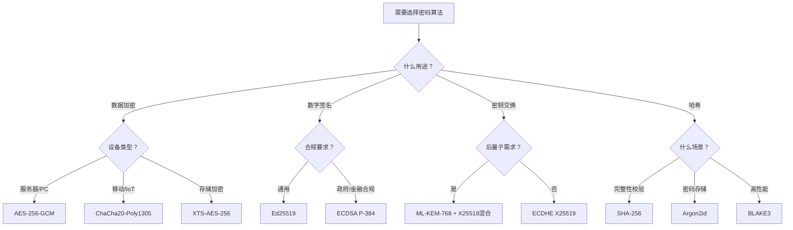

## 13.9 核心技巧总结

本节是对第13章密码学核心技巧八个专题的系统性回顾与升华。如果说前面八节分别是从不同维度展开的"术"，那么本节则是将它们串联成完整的"道法术器"体系——帮助读者在实际工程中做出正确的密码学决策，同时建立持续自检的能力。

### 13.9.1 八大核心技巧全景回顾

下表将八个专题按"道法术器"四层架构重新组织，帮助读者建立全局认知：

| 层次 | 专题 | 核心命题 | 关键原则 |
|------|------|----------|----------|
| **道（Why）** | 13.1 加密算法选择 | 为什么选这个算法？ | 安全性 > 性能 > 兼容性，永不用自创算法 |
| **道（Why）** | 13.6 攻击防御 | 为什么要防御这些攻击？ | 假设攻击者知道一切，只靠密钥保密 |
| **法（How）** | 13.2 密钥管理 | 怎样安全地管理密钥？ | 密钥是安全体系的命脉，泄露即崩溃 |
| **法（How）** | 13.4 数字签名 | 怎样保证数据的完整性和不可否认性？ | 签名验证必须是默认行为，不是可选项 |
| **法（How）** | 13.5 TLS/SSL配置 | 怎样保护传输层安全？ | 最小化配置面，禁用一切弱选项 |
| **术（What）** | 13.3 加密数据处理 | 具体怎么加密/解密数据？ | 先认证再解密，统一错误处理 |
| **器（Tools）** | 13.7 密码学工具 | 用什么工具实现？ | 选经过审计的成熟库，禁用底层裸写 |
| **器（Tools）** | 13.8 性能优化 | 怎样让加密又快又安全？ | 安全优先，优化不能以牺牲安全性为代价 |

### 13.9.2 密码算法选择速查指南

算法选择是所有密码学工程的第一步。以下决策框架覆盖主流场景，按安全性、性能、合规性三维度给出推荐：

#### 对称加密

| 场景 | 首选算法 | 备选算法 | 禁用算法 | 选择理由 |
|------|----------|----------|----------|----------|
| 通用数据加密 | AES-256-GCM | ChaCha20-Poly1305 | AES-ECB, DES, 3DES | GCM提供AEAD，同时保证机密性与完整性 |
| 海量数据流式加密 | AES-256-CTR + HMAC-SHA256 | XChaCha20-Poly1305 | RC4, AES-CBC(无MAC) | CTR模式支持随机访问，配合HMAC防篡改 |
| 移动/IoT设备 | ChaCha20-Poly1305 | AES-128-GCM(有AES-NI) | 无硬件加速的AES-CBC | ChaCha20在无AES-NI的ARM设备上性能更优 |
| 数据库列级加密 | AES-256-GCM | AES-256-SIV | AES-ECB | SIV模式对nonce重用有容错，适合数据库场景 |
| 磁盘/文件系统加密 | XTS-AES-256 | AES-256-GCM | AES-ECB | XTS是IEEE 1619标准，专为存储加密设计 |
| 密码存储（派生密钥） | Argon2id | bcrypt(≥10轮), scrypt | SHA-256(直接哈希), MD5 | Argon2id抗GPU/ASIC攻击，可调节内存和CPU参数 |

#### 非对称加密与密钥交换

| 场景 | 首选算法 | 备选算法 | 禁用算法 | 最低密钥长度 |
|------|----------|----------|----------|--------------|
| 通用密钥交换 | ECDHE X25519 | ECDHE P-256 | RSA密钥交换, DH<2048 | X25519(256位安全强度) |
| 数字签名（通用） | Ed25519 | ECDSA P-256 | RSA-1024, DSA | Ed25519(128位安全强度) |
| 数字签名（合规/政府） | ECDSA P-384 | RSA-3072 | RSA-1024, DSA-1024 | P-384(192位安全强度) |
| 后量子密钥封装 | ML-KEM-768(Kyber) | 混合模式(X25519+Kyber) | 纯RSA/ECDH(长期) | ML-KEM-768(192位安全强度) |
| 后量子数字签名 | ML-DSA-65(Dilithium) | SLH-DSA-128s(SPHINCS+) | 纯ECDSA(长期) | ML-DSA-65(128位安全强度) |
| 密码认证密钥交换 | OPAQUE | SRP-6a | 直接哈希比对 | 协议级安全 |

#### 哈希函数

| 场景 | 首选算法 | 备选算法 | 禁用算法 | 输出长度 |
|------|----------|----------|----------|----------|
| 数据完整性校验 | SHA-256 | SHA-3-256, BLAKE3 | MD5, SHA-1 | 256位 |
| 数字签名配合哈希 | SHA-256 | SHA-384, SHA-512 | MD5, SHA-1 | ≥256位 |
| 高性能哈希 | BLAKE3 | SHA-256(AES-NI) | MD5 | 可变 |
| HMAC消息认证 | HMAC-SHA256 | HMAC-SHA384 | HMAC-MD5 | 256位 |
| 密码派生 | Argon2id | bcrypt, scrypt | SHA-256(password) | 可变 |
| Merkle树/区块链 | SHA-256 | Keccak-256 | MD5, RIPEMD-160 | 256位 |



### 13.9.3 常见密码学错误清单与修复

以下是工程实践中最常见的十大密码学错误。每一条都是真实世界中的高频漏洞，按严重程度排序：

#### 错误一：使用ECB模式加密

ECB（Electronic Codebook）模式对每个明文块独立加密，相同明文块产生相同密文块。这会泄露数据模式——最经典的例子是ECB加密的Tux企鹅图片，即使加密后仍然能看清轮廓。

```python
# ❌ 错误：ECB模式
from cryptography.hazmat.primitives.ciphers import Cipher, algorithms, modes
cipher = Cipher(algorithms.AES(key), modes.ECB())  # 模式泄露！
encryptor = cipher.encryptor()

# ✅ 正确：使用AEAD模式（GCM）
from cryptography.hazmat.primitives.ciphers.aead import AESGCM
aesgcm = AESGCM(key)
ciphertext = aesgcm.encrypt(nonce, plaintext, associated_data)
```

#### 错误二：重用Nonce/IV

GCM和CTR模式的安全性建立在每个密钥只使用一次nonce的前提上。nonce重用会导致密钥流泄露，攻击者通过异或两个密文即可消除密钥流，得到两个明文的异或值。

```python
# ❌ 错误：固定nonce
nonce = b'\x00' * 12  # 每次加密都用同一个nonce

# ✅ 正确：随机nonce（GCM推荐12字节）
import os
nonce = os.urandom(12)  # 每次加密生成新的随机nonce
ciphertext = aesgcm.encrypt(nonce, plaintext, associated_data)
# 注意：nonce不需要保密，可以和密文一起传输
```

**Nonce管理策略对比：**

| 策略 | 适用场景 | 实现方式 | 风险 |
|------|----------|----------|------|
| 随机nonce | 通用场景，消息量<2^32 | `os.urandom(12)` | 大量消息下有生日碰撞风险 |
| 计数器nonce | 高吞吐量，可维护状态 | 递增计数器 | 需要持久化状态，重启后不能重复 |
| SIV模式 | 需要nonce误用容错 | AES-SIV, AES-GCM-SIV | 密文会泄露明文相等性 |

#### 错误三：先解密再验证MAC

如果先解密再验证MAC，攻击者可以通过修改密文并观察解密行为（错误信息、时间差异）来实施Padding Oracle攻击，逐步恢复明文。

```python
# ❌ 错误：先解密再验证
plaintext = decrypt(ciphertext)           # 先解密
if not verify_mac(mac, ciphertext):       # 后验证——太迟了！
    raise Error("MAC验证失败")

# ✅ 正确：使用AEAD（一步到位）
plaintext = aesgcm.decrypt(nonce, ciphertext, associated_data)
# AEAD在解密的同时验证完整性，失败直接抛异常

# ✅ 正确：如果必须手动MAC，使用Encrypt-then-MAC
mac = hmac_sha256(mac_key, iv + ciphertext)  # 先验证MAC
if not hmac.compare_digest(mac, received_mac):
    raise Error("MAC验证失败")                # 验证通过才解密
plaintext = decrypt(key, iv, ciphertext)
```

#### 错误四：自制密码算法

"密码学的克科霍夫原则"（Kerckhoffs's principle）指出：密码系统的安全性不应依赖于算法的保密，而应仅依赖于密钥的保密。自制算法违反了这一原则——未经同行评审的算法几乎必然存在设计缺陷。

**真实案例：** 德国联邦信息安全局（BSI）在2010年发现某智能卡芯片使用了自创的流密码算法，该算法在数小时内被学术界攻破。直接替换为AES后，产品安全性得到了保障。

**黄金法则：永远不要自己设计加密算法。** 即使是顶尖密码学家也会犯错——AES的前身DES的设计者IBM也经历过多次修正。使用经过数十年公开审查的标准算法（AES、ChaCha20、SHA-256等）是唯一正确的选择。

#### 错误五：弱随机数生成

密钥、nonce、salt的安全性完全取决于随机数的质量。使用`rand()`、`time()`或类似的伪随机数生成器（PRNG）作为密码学随机源，等同于将密钥暴露给攻击者。

```python
# ❌ 错误：可预测的随机数
import random
key = bytes(random.randint(0, 255) for _ in range(32))  # 可预测！
key = os.urandom(32)  # 注意：os.urandom本身是安全的
# 但 random.seed(time.time()) 后的 random 就不安全了

# ✅ 正确：使用CSPRNG
import secrets
key = secrets.token_bytes(32)  # 密码学安全随机数
nonce = secrets.token_bytes(12)
salt = secrets.token_bytes(16)

# ✅ Python推荐方式
from cryptography.hazmat.primitives.ciphers.aead import AESGCM
key = AESGCM.generate_key(bit_length=256)  # 内部使用CSPRNG
```

**各语言CSPRNG对照：**

| 语言 | 安全函数 | 不安全替代 |
|------|----------|------------|
| Python | `secrets.token_bytes()`, `os.urandom()` | `random.randint()` |
| JavaScript | `crypto.getRandomValues()` | `Math.random()` |
| Go | `crypto/rand.Read()` | `math/rand.Read()` |
| Java | `java.security.SecureRandom()` | `java.util.Random()` |
| C/C++ | `RAND_bytes()`, `/dev/urandom` | `rand()`, `srand()` |
| Rust | `rand::rngs::OsRng` | `rand::rngs::StdRng`(固定seed) |

#### 错误六：硬编码密钥

在源代码中写入密钥，意味着密钥会进入版本控制系统（Git历史中永远存在），会被编译到二进制文件中（可通过strings命令提取），会被所有有代码访问权限的人看到。

```python
# ❌ 错误：硬编码密钥
API_KEY = "sk-1234567890abcdef"  # 代码中直接写入
SECRET = b"this_is_my_secret_key_32bytes!"  # 可被Git历史追踪

# ✅ 正确：环境变量或密钥管理系统
import os
API_KEY = os.environ["API_KEY"]  # 从环境变量读取

# ✅ 生产环境：使用密钥管理系统
# AWS KMS / HashiCorp Vault / Azure Key Vault / GCP KMS
# 密钥永不离开HSM，应用只获取加密后的数据密钥
```

#### 错误七：不安全的密钥派生

用`SHA-256(password)`作为加密密钥，看似"哈希了就安全"，实际上SHA-256设计目标是快速计算——攻击者可以在GPU上每秒尝试数十亿次。专用密码哈希函数通过引入内存硬函数和多次迭代来大幅增加暴力破解成本。

```python
# ❌ 错误：直接哈希
import hashlib
key = hashlib.sha256(password.encode()).digest()  # GPU可每秒数十亿次

# ✅ 正确：使用专用密码哈希函数
from cryptography.hazmat.primitives.kdf.argon2 import Argon2id
kdf = Argon2id(
    time_cost=3,        # 迭代次数
    memory_cost=65536,  # 内存使用64MB
    parallelism=4,      # 并行线程数
    salt_len=16,
    hash_len=32
)
key = kdf.derive(password.encode())
```

**密码哈希函数性能对比（2024年硬件）：**

| 算法 | 内存需求 | 迭代参数 | GPU抵抗 | ASIC抵抗 | 推荐场景 |
|------|----------|----------|---------|----------|----------|
| Argon2id | 可调(64MB-1GB) | 可调 | 强 | 强 | 所有新项目首选 |
| bcrypt | 4KB | cost factor | 中 | 弱 | 兼容旧系统 |
| scrypt | 可调(16MB+) | N,r,p参数 | 强 | 中 | 加密货币钱包 |
| PBKDF2 | 极小 | 迭代次数 | 弱 | 弱 | 合规要求(FIPS) |

#### 错误八：时序侧信道攻击

密码学中的比较操作（MAC验证、密文比较）必须使用常数时间算法。非常数时间比较会在微秒级时间差异中泄露信息——攻击者通过统计分析大量请求的响应时间，可以逐字节恢复MAC值。

```python
# ❌ 错误：非常数时间比较
if received_mac == computed_mac:  # 逐字节比较，遇到不同字节立即返回
    pass

# ✅ 正确：常数时间比较
import hmac
if hmac.compare_digest(received_mac, computed_mac):
    pass  # 无论是否匹配，消耗时间相同

# ✅ Go语言
import "crypto/subtle"
if subtle.ConstantTimeCompare(received, computed) == 1 {
    // 常数时间比较
}
```

#### 错误九：不完整的错误处理

解密失败时返回详细的错误信息（"Padding错误"、"MAC不匹配"、"Nonce无效"等），会为攻击者提供区分不同失败原因的能力，进而实施自适应攻击。

```python
# ❌ 错误：泄露详细错误信息
try:
    plaintext = decrypt(key, ciphertext)
except InvalidPadding:
    return "填充格式错误"      # 攻击者知道是填充问题
except InvalidMAC:
    return "消息认证码不匹配"  # 攻击者知道是MAC问题

# ✅ 正确：统一错误信息
try:
    plaintext = aesgcm.decrypt(nonce, ciphertext, associated_data)
except Exception:
    # 统一返回相同错误信息，不区分失败原因
    raise ValueError("解密失败")
```

#### 错误十：忽略密钥轮换

长期使用同一密钥会带来多重风险：密钥泄露的影响范围无限扩大、加密数据量超过算法安全上限（GCM模式约2^36字节）、不符合合规要求。密钥轮换不是"密钥泄露后的应急措施"，而是"持续运营的基本要求"。

**密钥轮换最佳实践：**

| 密钥类型 | 建议轮换周期 | 轮换方式 | 特殊要求 |
|----------|--------------|----------|----------|
| TLS证书密钥 | 90天-1年 | 自动续签(Let's Encrypt) | 需要OCSP/CRL支持 |
| 数据加密密钥(DEK) | 按数据量或时间 | 信封加密，重新加密数据 | 旧密钥保留至所有数据重加密 |
| 密钥加密密钥(KEK) | 1-2年 | HSM中轮换，重新封装DEK | 需要密钥层级架构 |
| API密钥 | 90天 | 双密钥并行切换 | 新旧密钥共存期 |
| 密码哈希盐值 | 每次密码变更 | 用户下次登录时重新哈希 | 不需要主动轮换 |

### 13.9.4 密码学合规框架对照

不同行业和地区对密码学有不同的合规要求。以下对照表帮助开发者快速定位适用的规范：

| 标准/法规 | 适用范围 | 对称加密要求 | 非对称加密要求 | 哈希要求 | 特殊要求 |
|-----------|----------|--------------|----------------|----------|----------|
| **NIST SP 800-175B** | 美国联邦系统 | AES-128/192/256 | RSA≥2048, ECDSA P-256+ | SHA-2/SHA-3 | DRBG需符合SP 800-90A |
| **中国商用密码(GM/T)** | 中国境内商用 | SM4(分组密码) | SM2(椭圆曲线) | SM3(消息摘要) | 密钥协商用SM2，随机数符合GM/T 0005 |
| **PCI DSS v4.0** | 支付卡行业 | AES-256+ | TLS 1.2+(2025后仅TLS 1.3) | 不明确要求 | 密钥分离(数据/传输)，定期轮换 |
| **HIPAA** | 美国医疗行业 | AES-256 | TLS 1.2+ | NIST SP 800-57 | 基于角色的密钥访问，完整审计日志 |
| **GDPR** | 欧盟个人数据 | "适当的技术措施" | "适当的技术措施" | 不明确 | 加密作为数据泄露通知的豁免条件 |
| **ISO 27001** | 国际信息安全管理 | 按组织策略 | 按组织策略 | 按组织策略 | Annex A.10密码控制 |
| **FIPS 140-3** | 美国联邦密码模块 | AES(经验证实现) | RSA/ECC(经验证实现) | SHA-2/SHA-3 | 密码模块需经NIST认可实验室认证 |
| **中国等保2.0** | 中国信息系统 | SM4或AES | SM2或RSA≥2048 | SM3或SHA-256 | 三级以上系统必须使用国密算法 |

**中国商用密码（国密算法）特别说明：**

对于面向中国市场的产品和服务，国密算法不是可选项而是合规要求。主要算法对比如下：

| 国际算法 | 国密替代 | 差异说明 |
|----------|----------|----------|
| AES-128/256 | SM4 | 分组长度128位，密钥长度128位，32轮Feistel结构 |
| SHA-256 | SM3 | 输出256位，Merkle-Damgard结构，与SHA-2安全性相当 |
| ECDSA P-256 | SM2 | 基于不同椭圆曲线参数，签名格式不同 |
| ECDH | SM2密钥协商 | 两次交互完成密钥协商，支持身份绑定 |
| RSA-OAEP | SM2加密 | 椭圆曲线加密，更短密钥同等安全 |

### 13.9.5 密码学工程自检清单

在交付任何涉及密码学的系统之前，用以下清单逐项检查。任何一项未通过都不应上线：

#### 算法与模式

- [ ] 所有加密使用AEAD模式（GCM、CCM或ChaCha20-Poly1305）
- [ ] 未使用任何已废弃算法（DES、3DES、RC4、MD5用于安全用途）
- [ ] 哈希函数使用SHA-256或更强（SHA-1仅用于HMAC且有迁移计划）
- [ ] 密码存储使用专用密码哈希函数（Argon2id优先）
- [ ] 所有算法参数满足当前安全强度（RSA≥2048, ECC≥256位）

#### 密钥管理

- [ ] 密钥通过CSPRNG生成，未使用任何伪随机源
- [ ] 密钥未硬编码在源代码或配置文件中
- [ ] 密钥通过安全渠道传输和存储（KMS、HSM、环境变量）
- [ ] 有密钥轮换策略并已实施自动化
- [ ] 密钥分离：不同用途使用不同密钥（加密/签名/MAC）
- [ ] 密钥销毁流程已定义并可执行

#### 实现安全

- [ ] 使用成熟的密码学库（如cryptography、BoringSSL、libsodium）
- [ ] 未自行实现任何密码学原语
- [ ] Nonce/IV每次加密唯一生成
- [ ] MAC验证使用常数时间比较（hmac.compare_digest）
- [ ] 错误处理不泄露密码学细节
- [ ] 实施了Encrypt-then-MAC或直接使用AEAD

#### 传输安全

- [ ] TLS最低版本1.2（推荐1.3）
- [ ] 禁用了不安全的密码套件（NULL、EXPORT、RC4、DES）
- [ ] 启用了前向保密（ECDHE）
- [ ] 证书链完整且可验证
- [ ] 证书固定（Certificate Pinning）用于移动应用

#### 合规与审计

- [ ] 密码学实现符合目标市场合规要求（NIST/国密/PCI DSS等）
- [ ] 密钥使用有完整审计日志
- [ ] 定期进行密码学安全审计
- [ ] 有后量子迁移评估和计划

### 13.9.6 技术选型推荐栈

以下推荐栈经过行业广泛验证，覆盖从原型到生产的完整需求：

#### Web应用后端

```text
语言: Python/Go/Java/Rust
TLS:   Nginx/Caddy(自动证书) + TLS 1.3
加密:  libsodium(语言绑定) 或 language-native crypto
密钥:  HashiCorp Vault(自建) 或 AWS KMS/阿里云KMS(云服务)
证书:  Let's Encrypt + certbot自动续签
```

#### 移动应用

```text
iOS:   CryptoKit(苹果原生) + Keychain Services
Android: Jetpack Security + Android Keystore
传输:  Certificate Pinning + TLS 1.3
存储:  AES-256-GCM(数据) + BiometricPrompt(生物识别保护)
```

#### 嵌入式/IoT

```text
TLS:   Mbed TLS(资源受限) 或 wolfSSL(实时系统)
加密:  ChaCha20-Poly1305(无AES-NI时) 或 AES-128-GCM(有AES-NI时)
密钥:  硬件安全模块(SE/TEE) 或 安全飞地
随机:  硬件TRNG(真随机数生成器)
```

#### 云原生/微服务

```text
服务网格: Istio/Linkerd(mTLS自动管理)
密钥管理: External Secrets Operator + Vault
证书管理: cert-manager(Kubernetes原生)
加密:    应用层加密(敏感字段) + 传输层加密(mTLS) + 存储层加密(KMS)
```

#### 数据加密(静态)

```text
数据库:  TDE(透明数据加密) + 列级加密(敏感字段)
文件系统: LUKS(Linux) / BitLocker(Windows) / FileVault(macOS)
对象存储: SSE-KMS(服务器端加密) + 客户端加密(高敏感)
备份:    AES-256加密 + 离线密钥存储
```

### 13.9.7 学习路径建议

密码学是一门理论与实践并重的学科。以下学习路径按阶段递进，每个阶段都有明确的里程碑：

```mermaid
graph LR
    subgraph 入门阶段["入门阶段（1-2个月）"]
        A1["理解对称/非对称加密概念"]
        A2["学会使用标准库加密解密"]
        A3["理解TLS/HTTPS工作原理"]
    end
    
    subgraph 进阶阶段["进阶阶段（3-6个月）"]
        B1["深入理解密钥管理生命周期"]
        B2["掌握常见攻击与防御"]
        B3["独立配置生产级TLS"]
        B4["理解数字签名与PKI"]
    end
    
    subgraph 高级阶段["高级阶段（6-12个月）"]
        C1["设计企业级密钥管理架构"]
        C2["实施合规要求（国密/NIST）"]
        C3["性能优化与硬件加速"]
        C4["密码学审计能力"]
    end
    
    subgraph 专家阶段["专家阶段（1年+）"]
        D1["后量子密码学迁移规划"]
        D2["密码协议设计与形式化验证"]
        D3["密码学安全架构咨询"]
    end
    
    A1 --> A2 --> A3
    A3 --> B1 --> B2 --> B3 --> B4
    B4 --> C1 --> C2 --> C3 --> C4
    C4 --> D1 --> D2 --> D3
```



**推荐学习资源：**

| 阶段 | 资源 | 类型 | 侧重点 |
|------|------|------|--------|
| 入门 | 《Crypto101》(免费在线) | 教材 | 从零开始的密码学直觉 |
| 入门 | Coursera: Cryptography (Dan Boneh) | 视频课程 | 斯坦福密码学经典课程 |
| 进阶 | 《应用密码学》(Bruce Schneier) | 书籍 | 算法与协议全景 |
| 进阶 | Cryptopals Challenges | 实战练习 | 348个密码学挑战题 |
| 高级 | 《密码工程》(Ferguson等) | 书籍 | 工程实践中的密码学决策 |
| 高级 | NIST SP 800系列 | 标准文档 | 合规与最佳实践 |
| 专家 | 《现代密码学》(Katz-Lindell) | 书籍 | 形式化安全证明 |
| 持续 | IACR ePrint Archive | 学术论文 | 前沿研究与攻击发现 |

### 13.9.8 核心技巧体系总结

回顾本节的八个核心技巧，它们构成了一个完整的密码学工程知识体系：

**算法选择（13.1）** 是基础——选错算法，后续一切都是空中楼阁。核心原则是使用经过公开审查的标准算法，根据场景选择合适的模式和参数。

**密钥管理（13.2）** 是命脉——算法再强，密钥泄露一切归零。核心原则是密钥层级化、最小权限、定期轮换。

**数据处理（13.3）** 是日常——每次加密解密都是安全决策。核心原则是AEAD优先、先验证后解密、统一错误处理。

**数字签名（13.4）** 是信任——它建立了数据完整性和不可否认性。核心原则是签名验证必须是默认行为。

**TLS/SSL配置（13.5）** 是传输层的安全基石——大多数密码学交互都通过TLS进行。核心原则是最小化配置面，禁用弱选项。

**攻击防御（13.6）** 是对抗思维——不理解攻击就无法有效防御。核心原则是假设攻击者知道一切。

**工具使用（13.7）** 是正确实现——好的算法在错误的实现中毫无意义。核心原则是选成熟库，禁裸写。

**性能优化（13.8）** 是工程平衡——安全和性能往往需要权衡。核心原则是安全优先，优化不能牺牲安全性。

将这八个维度结合起来，就是完整的密码学工程能力。每一条最佳实践的背后，都有真实的攻击案例和惨痛教训。掌握这些核心技巧，不是为了通过考试或应对审计，而是为了在真实世界中保护用户的数据安全。

> **记住密码学的第一法则：不要自己发明密码学。** 使用经过验证的算法、经过审计的库、经过实践检验的配置。在密码学领域，创新的风险远大于收益。
